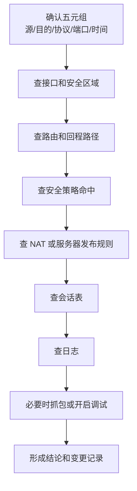

# 附录 D：常用防火墙排错命令

本附录整理企业防火墙排错中最常用的检查命令和操作思路。不同厂商的命令差异很大，但防火墙排错的核心问题基本一致：

```text
接口状态 -> 路由路径 -> 安全区域 -> 安全策略 -> NAT -> 会话表 -> 日志 -> 抓包/调试
```

初学者不要把防火墙排错理解成“背命令”。命令只是取证工具。真正要回答的是：报文有没有到防火墙、从哪个接口进入、匹配了哪条策略、是否做了 NAT、有没有生成会话、回包是否按预期返回。

本附录以华为 USG、H3C SecPath、Cisco ASA、Fortinet FortiGate 和 Palo Alto PAN-OS 为主。真实项目中应以设备型号、软件版本和厂商官方手册为准。

## D.1 排错前必须确认的信息

在登录防火墙之前，先把故障流量描述清楚。描述越精确，排错越快。

| 信息 | 示例 | 为什么重要 |
| --- | --- | --- |
| 源地址 | `10.28.10.25` | 用于查策略源、NAT 源、会话表 |
| 目的地址 | `10.28.60.20` 或 `203.0.113.22` | 用于查路由、目的 NAT、策略目的 |
| 协议和端口 | TCP `443` | 防火墙策略通常按服务匹配 |
| 源区域 | Trust/Office | 判断从哪个安全域进入 |
| 目的区域 | DMZ/Untrust | 判断策略方向 |
| 故障时间 | `2026-06-09 10:35` | 用于查日志和会话 |
| 现象 | TCP 不通、登录慢、偶发断开 | 不同现象对应不同排查路径 |

不要只说“系统打不开”。更好的描述是：

```text
办公网 PC 10.28.10.25 访问 DMZ Web 10.28.60.20 TCP 443 失败。
客户端 DNS 解析正常，ping 不通，Test-NetConnection 443 失败。
故障开始时间约为 10:35，只有办公网 VLAN 10 受影响。
```

## D.2 通用排错路径



很多防火墙问题不是单点配置错误，而是多个条件缺一项。例如内网上网需要默认路由、源 NAT、安全策略和 DNS 都正确；公网访问 DMZ 服务器需要目的 NAT、安全策略、服务器回程网关和服务器监听都正确。

## D.3 华为 USG 常用命令

### 基础状态

| 目标 | 命令 | 关注点 |
| --- | --- | --- |
| 查看版本 | `display version` | 版本、运行时间、补丁 |
| 查看时间 | `display clock` | 日志时间是否可信 |
| 查看接口摘要 | `display ip interface brief` | IP、up/down、接口角色 |
| 查看接口详情 | `display interface GigabitEthernet x/x/x` | 错包、丢包、协商状态 |
| 查看配置 | `display current-configuration` | 当前生效配置 |
| 查看日志 | `display logbuffer` | 策略拒绝、接口 flap、HA 切换 |

### 路由与 ARP

```text
display ip routing-table
display ip routing-table 10.28.60.20
display arp
display arp interface GigabitEthernet1/0/0
```

排错要点：

| 现象 | 判断方向 |
| --- | --- |
| 没有到目的网段的路由 | 检查静态路由、动态路由或默认路由 |
| 下一跳 ARP 不完整 | 检查二层链路、VLAN、对端接口 |
| 路由指向错误出口 | 检查路由优先级、最长匹配和策略路由 |

### 安全策略

```text
display security-policy rule all
display security-policy rule name allow-office-web
display firewall statistic system discard
```

安全策略排查时要同时看方向和对象：

| 检查项 | 说明 |
| --- | --- |
| 源安全域 | 报文进入防火墙的区域 |
| 目的安全域 | 路由决定报文要去的区域 |
| 源地址对象 | 是否覆盖真实源地址或 NAT 前地址 |
| 目的地址对象 | 是否覆盖真实目的地址或 NAT 相关地址 |
| 服务对象 | TCP/UDP 是否正确，端口是否正确 |
| 动作 | Permit/Deny |
| 日志 | 是否开启命中日志，便于后续审计 |

### NAT 和会话

```text
display nat-policy rule all
display firewall session table
display firewall session table source inside 10.28.10.25
display firewall session table destination inside 10.28.60.20
display firewall server-map
```

常见判断：

| 现象 | 可能原因 |
| --- | --- |
| 有策略命中但无会话 | 报文未到防火墙、策略仍未真正允许、前置设备拦截 |
| 有会话但无回包 | 服务器未响应、回程路由错误、服务器本机防火墙拦截 |
| NAT 后地址不对 | NAT 规则顺序、地址池或出接口匹配错误 |
| 公网发布不通 | Server-map/DNAT、Untrust 到 DMZ 策略、服务器网关同时检查 |

## D.4 H3C SecPath 常用命令

H3C SecPath 防火墙常见命令风格接近 Comware，但安全策略、NAT 和会话相关命令会随版本变化。

| 目标 | 常用命令 | 关注点 |
| --- | --- | --- |
| 查看版本 | `display version` | 版本、运行时间 |
| 查看接口摘要 | `display ip interface brief` | 接口 IP 和状态 |
| 查看接口详情 | `display interface GigabitEthernet x/x/x` | 物理状态、错包 |
| 查看路由 | `display ip routing-table` | 默认路由和目标网段 |
| 查看 ARP | `display arp` | 下一跳是否可达 |
| 查看配置 | `display current-configuration` | 策略、NAT、接口 |
| 查看日志 | `display logbuffer` | 拒绝、链路、资源异常 |

安全策略和 NAT 检查示例：

```text
display security-policy ip
display object-group
display nat all
display firewall session table
display firewall session table source-ip 10.28.10.25
```

排查 H3C 防火墙时，建议先确认接口是否加入正确安全域。接口 IP 配好了但没有加入对应安全域，策略方向就可能和预期不一致。

## D.5 Cisco ASA 常用命令

Cisco ASA 排错常围绕接口 nameif、安全级别、ACL、NAT、路由和连接表展开。

### 基础检查

| 目标 | 命令 | 关注点 |
| --- | --- | --- |
| 查看版本 | `show version` | 版本、授权、运行时间 |
| 查看接口摘要 | `show interface ip brief` | 接口状态、IP、nameif |
| 查看接口详情 | `show interface` | 错包、丢包、链路协商 |
| 查看运行配置 | `show running-config` | 当前配置 |
| 查看路由 | `show route` | 默认路由、目标路由 |
| 查看 ARP | `show arp` | 下一跳解析 |
| 查看日志 | `show logging` | deny、NAT、连接事件 |

### ACL、NAT 和连接

```text
show access-list
show run access-group
show nat
show xlate
show conn
show conn address 10.28.10.25
```

ASA 的 `packet-tracer` 非常适合模拟单条流量的处理过程：

```text
packet-tracer input inside tcp 10.28.10.25 51532 10.28.60.20 443
packet-tracer input outside tcp 198.51.100.10 51532 203.0.113.22 443
```

输出中重点看每个阶段：

| 阶段 | 关注点 |
| --- | --- |
| Route lookup | 出接口和下一跳是否正确 |
| ACL | 是否被访问控制列表拒绝 |
| NAT | 是否匹配了预期 NAT 规则 |
| Result | 最终是 `ALLOW` 还是 `DROP` |

`packet-tracer` 是模拟结果，不等于真实报文一定到达。若模拟允许但业务不通，要继续检查客户端、上游路由、服务器监听和真实抓包。

## D.6 Fortinet FortiGate 常用命令

FortiGate 排错常用 GUI 日志结合 CLI。CLI 中 `diagnose debug flow` 很常见，但生产环境要控制过滤条件和时间，避免输出过多。

### 基础检查

| 目标 | 命令 | 关注点 |
| --- | --- | --- |
| 查看状态 | `get system status` | 版本、序列号、运行模式 |
| 查看接口 | `get system interface physical` | 物理状态 |
| 查看接口配置 | `show system interface` | IP、allowaccess、zone |
| 查看路由 | `get router info routing-table all` | 默认路由、目标路由 |
| 查看 ARP | `get system arp` | 下一跳解析 |
| 查看策略 | `show firewall policy` | 策略 ID、源目的、服务、NAT |
| 查看会话 | `diagnose sys session list` | 会话、NAT、策略 ID |

### Debug Flow 示例

先设置过滤条件：

```text
diagnose debug reset
diagnose debug flow filter clear
diagnose debug flow filter saddr 10.28.10.25
diagnose debug flow filter daddr 10.28.60.20
diagnose debug flow show function-name enable
diagnose debug enable
diagnose debug flow trace start 20
```

测试完成后关闭：

```text
diagnose debug flow trace stop
diagnose debug disable
diagnose debug reset
```

Debug Flow 重点看：

| 输出线索 | 含义 |
| --- | --- |
| `vd-root received a packet` | 防火墙收到了报文 |
| `find a route` | 找到了路由 |
| `Allowed by Policy-5` | 命中策略 ID 5 |
| `Denied by forward policy check` | 被安全策略拒绝 |
| NAT 相关字段 | 是否转换为预期地址 |

FortiGate 日志中的 `policyid` 很有价值。找到策略 ID 后，再回到策略列表检查源、目的、服务、NAT 和安全配置文件。

## D.7 Palo Alto PAN-OS 常用检查

PAN-OS 排错通常依赖 GUI Monitor 日志，同时也可以使用 CLI 查看会话、路由和策略匹配。

| 目标 | 命令或入口 | 关注点 |
| --- | --- | --- |
| 查看系统信息 | `show system info` | 版本、运行时间 |
| 查看接口 | `show interface all` | 状态、IP、zone |
| 查看路由 | `show routing route` | 目标路由和下一跳 |
| 查看 ARP | `show arp all` | 下一跳解析 |
| 查看会话 | `show session all filter source 10.28.10.25` | 会话状态、NAT、策略 |
| 查看会话详情 | `show session id <id>` | 入接口、出接口、应用、NAT |
| 流量日志 | Monitor -> Traffic | allow/deny、rule、app、bytes |
| 威胁日志 | Monitor -> Threat | IPS、URL、文件、恶意流量 |

策略匹配测试示例：

```text
test security-policy-match source 10.28.10.25 destination 10.28.60.20 protocol 6 destination-port 443
test nat-policy-match source 10.28.10.25 destination 93.184.216.34 protocol 6 destination-port 443
```

PAN-OS 有 App-ID 概念。即使服务端口是 TCP 443，应用识别结果也可能不是 `ssl` 或 `web-browsing`，因此排错时要同时看服务、应用和安全配置文件。

## D.8 公网访问 DMZ 服务器排错模板

假设公网用户访问：

```text
198.51.100.10 -> 203.0.113.22:443 -> 10.28.60.20:443
```

检查顺序：

| 步骤 | 检查内容 | 预期结果 |
| ---: | --- | --- |
| 1 | 公网地址是否到达防火墙外网口 | 防火墙能看到入方向报文 |
| 2 | DNAT/VIP 是否匹配 | `203.0.113.22:443` 转到 `10.28.60.20:443` |
| 3 | 安全策略是否允许 | Untrust -> DMZ，源按需限制，目的为发布对象或内部服务器 |
| 4 | 路由是否正确 | 防火墙知道如何到达 `10.28.60.20` |
| 5 | 服务器网关是否正确 | DMZ 服务器默认网关指向防火墙或正确回程设备 |
| 6 | 服务器是否监听 | 服务器本机 TCP 443 正在监听 |
| 7 | 服务器本机防火墙 | 允许来自公网转换后的访问 |
| 8 | 日志和会话 | 有策略命中和完整会话 |

如果防火墙日志显示允许，NAT 也正确，但服务器没有回包，不要继续反复改防火墙策略。应转向服务器监听、服务器网关、服务器防火墙和中间交换路径。

## D.9 内网上网排错模板

假设办公网用户访问互联网：

```text
10.28.10.25 -> 93.184.216.34:443
```

检查顺序：

| 步骤 | 检查内容 | 预期结果 |
| ---: | --- | --- |
| 1 | 客户端 IP、网关、DNS | 地址属于正确 VLAN，网关为 `10.28.10.1` |
| 2 | 客户端到网关 | 网关可达 |
| 3 | 防火墙到互联网路由 | 有默认路由指向运营商 |
| 4 | 安全策略 | Trust -> Untrust 允许必要服务 |
| 5 | 源 NAT | `10.28.10.0/24` 转换为公网地址或出接口地址 |
| 6 | DNS | 域名能解析到正确地址 |
| 7 | 会话和日志 | 有允许日志和 NAT 后会话 |

建议先测试公网 IP，再测试域名：

```text
ping 93.184.216.34
curl -vk https://93.184.216.34/
nslookup www.example.com
curl -vk https://www.example.com/
```

这样能区分“互联网链路不通”和“DNS 或代理问题”。

## D.10 VPN 排错关注点

IPsec VPN 排错要分阶段看，不要只说“VPN 不通”。

| 阶段 | 常见检查项 | 常见问题 |
| --- | --- | --- |
| IKE 第一阶段 | 对端公网地址、预共享密钥、IKE 版本、加密算法、DH 组 | 参数不一致、对端地址错误、UDP 500 被拦截 |
| IKE 第二阶段 | 加密域、ESP/IPsec 参数、PFS、生命周期 | 本端和对端感兴趣流不一致 |
| NAT-T | UDP 4500、NAT 设备、对端 ID | 中间有 NAT 但未启用 NAT-T |
| 路由 | 去对端网段是否指向 VPN | 路由缺失或被默认路由覆盖 |
| 安全策略 | 本地到对端、对端到本地 | VPN 建立但业务被策略拒绝 |
| NAT 豁免 | 本地私网访问对端私网不应做普通源 NAT | 加密前被 NAT 成错误地址 |

VPN 协商成功只说明隧道建立，不代表业务一定通。业务不通时仍要检查路由、策略、NAT 豁免和服务器回程。

## D.11 故障证据收集清单

| 证据 | 内容 |
| --- | --- |
| 客户端测试 | IP、网关、DNS、ping、TCP 端口测试 |
| 防火墙接口 | 入接口、出接口、up/down、错误计数 |
| 路由表 | 目的路由、默认路由、回程路由 |
| 策略命中 | 命中的策略名称或 ID、动作、日志 |
| NAT 命中 | 转换前后地址和端口 |
| 会话表 | 源/目的、协议、状态、入出接口 |
| 日志 | allow/deny、威胁拦截、系统异常 |
| 抓包 | 客户端、防火墙、服务器至少两点对比 |
| 变更记录 | 最近是否调整策略、路由、NAT、链路或服务器 |

排错结论要能回答“故障边界在哪里”。例如：

```text
客户端到防火墙有流量，防火墙命中允许策略并完成 DNAT，报文已从 DMZ 接口转发给服务器。
服务器未返回 SYN-ACK，故障边界已收敛到服务器监听、服务器本机防火墙或服务器回程路径。
```

## D.12 自查题

1. 为什么防火墙排错要先确认源地址、目的地址、协议、端口和时间？
2. NAT 命中正常但业务不通，下一步应检查哪些内容？
3. ASA 的 `packet-tracer` 能证明真实报文已经到达防火墙吗？为什么？
4. FortiGate Debug Flow 为什么必须先设置过滤条件？
5. VPN 建立成功但业务不通，常见原因有哪些？
