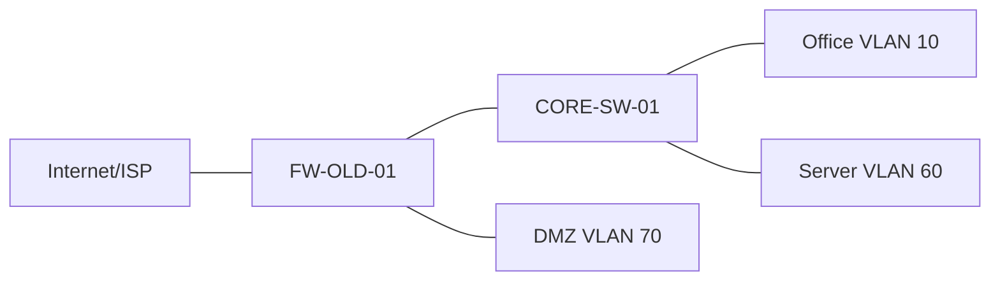
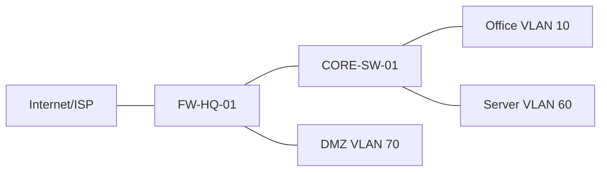

# 附录 G：割接方案模板

本附录提供企业网络割接方案模板。割接是指在指定时间窗口内，把网络从旧状态切换到新状态，例如更换核心交换机、上线新防火墙、调整 VLAN 网关、迁移出口链路、发布新 VPN 或调整安全策略。

割接方案的核心价值是降低不确定性。它必须让所有参与者提前知道：改什么、什么时候改、谁来改、如何验证、失败后怎么回退、业务方如何确认。

## G.1 文档基本信息

| 项目 | 内容 |
| --- | --- |
| 割接名称 | 例如：总部出口防火墙替换割接 |
| 文档版本 | `v1.0` |
| 计划割接时间 |  |
| 预计影响时长 |  |
| 影响范围 | 总部办公网、访客网、VPN、DMZ 发布等 |
| 割接负责人 |  |
| 网络实施人 |  |
| 业务确认人 |  |
| 回退决策人 |  |
| 变更单号 |  |

## G.2 割接目标和范围

### 割接目标

```text
说明本次割接要达成什么结果：
- 将互联网出口从旧防火墙 FW-OLD-01 迁移到新防火墙 FW-HQ-01。
- 保持办公网上网、DMZ Web 发布、远程 VPN 和日志审计正常。
- 完成后旧设备保留 7 天作为应急回退设备。
```

### 影响范围

| 业务/区域 | 是否受影响 | 影响说明 | 业务联系人 |
| --- | --- | --- | --- |
| 办公网 Internet | 是 | 割接期间可能中断 10-20 分钟 | 行政/IT 服务台 |
| 访客 Wi-Fi | 是 | 访客上网短暂中断 | 前台/IT 服务台 |
| DMZ Web | 是 | 公网访问可能短暂中断 | 应用组 |
| Site-to-Site VPN | 是 | 隧道需要重新协商 | 分支 IT |
| 内部服务器访问 | 否或轻微 | 不经过出口的内部访问不应受影响 | 系统组 |

## G.3 当前拓扑和目标拓扑

### 当前状态



### 割接后状态



拓扑图要能看出关键链路、关键设备和流量路径。复杂项目可以把物理拓扑、逻辑拓扑和安全区域图分开画。

## G.4 割接前准备清单

| 项目 | 负责人 | 完成状态 | 备注 |
| --- | --- | --- | --- |
| 新设备上架、供电、接地完成 |  |  |  |
| 新设备管理地址可访问 |  |  |  |
| 新设备基础配置完成 |  |  | 主机名、账号、SSH、NTP、日志 |
| 接口、区域、路由配置完成 |  |  |  |
| 安全策略和 NAT 预配置完成 |  |  |  |
| VPN 参数预配置完成 |  |  | 如涉及 |
| 配置已由第二人复核 |  |  |  |
| 旧设备配置已备份 |  |  |  |
| 新设备配置已备份 |  |  |  |
| 业务验证账号准备完成 |  |  |  |
| 测试终端和公网测试点准备完成 |  |  |  |
| 相关人员进入会议或值守群 |  |  |  |
| 回退线缆和配置准备完成 |  |  |  |

割接前准备不能只看网络设备。业务账号、测试路径、外部测试点、运营商联系人和回退线缆也要提前准备。

## G.5 变更前基线记录

| 检查项 | 命令或方法 | 割接前结果 |
| --- | --- | --- |
| 办公网获取地址 | 终端 `ipconfig /all` 或 `ip addr` |  |
| 办公网访问互联网 | `curl -vk https://www.example.com/` |  |
| 办公网访问内部门户 | `https://intranet.example.com/` |  |
| DMZ 公网发布 | 外部访问 `https://203.0.113.22/` |  |
| VPN 隧道状态 | 防火墙 VPN 状态 |  |
| 默认路由 | 防火墙和核心路由表 |  |
| NAT 命中 | 防火墙 NAT 会话 |  |
| 安全策略命中 | 防火墙日志/命中计数 |  |
| 设备 CPU/内存 | 设备状态命令 |  |

基线记录用于割接后对比。没有基线时，很难判断某个问题是割接引入，还是割接前已经存在。

## G.6 割接步骤

以下表格应按分钟级顺序编写。每一步都要有负责人、预期结果和失败处理。

| 序号 | 时间 | 操作内容 | 负责人 | 预期结果 | 失败处理 |
| ---: | --- | --- | --- | --- | --- |
| 1 | 22:00 | 宣布割接开始，冻结相关变更 | 割接负责人 | 所有人确认在线 | 未确认则延后 |
| 2 | 22:05 | 备份旧防火墙和核心交换机配置 | 网络组 | 备份文件完整 | 备份失败则暂停 |
| 3 | 22:10 | 在核心交换机调整到新防火墙的上联接口 | 网络组 | 链路 up | 线缆或接口回退 |
| 4 | 22:15 | 新防火墙接入运营商链路 | 网络组/运营商 | 外网接口 up，ARP 正常 | 恢复旧链路 |
| 5 | 22:20 | 启用新防火墙默认路由和 NAT | 网络组 | 内网上网流量命中新设备 | 禁用新路由/NAT |
| 6 | 22:25 | 启用 DMZ 发布策略 | 网络组 | 外部 HTTPS 可访问 | 回退 DNAT/VIP |
| 7 | 22:35 | 验证 VPN 隧道 | 网络组/分支 IT | 隧道 up，业务可访问 | 恢复旧 VPN |
| 8 | 22:45 | 业务方验证关键系统 | 业务确认人 | 关键业务正常 | 进入排错或回退 |
| 9 | 23:00 | 观察日志和会话 | 网络组 | 无异常拒绝或高资源 | 定位异常 |
| 10 | 23:20 | 宣布割接完成或进入观察期 | 割接负责人 | 所有人确认 | 保持值守 |

割接步骤不要写成“调整配置”。应写清楚在哪台设备、哪个模块、调整什么对象或接口。

## G.7 验证方案

### 网络连通性验证

| 验证项 | 测试点 | 方法 | 预期结果 |
| --- | --- | --- | --- |
| 办公网到网关 | VLAN 10 终端 | `ping 10.28.10.1` | 成功 |
| 办公网到互联网 IP | VLAN 10 终端 | `ping 93.184.216.34` | 成功或按策略允许 |
| 办公网 DNS | VLAN 10 终端 | `nslookup www.example.com` | 解析成功 |
| 办公网 HTTPS | VLAN 10 终端 | `curl -vk https://www.example.com/` | TCP/TLS 成功 |
| 访客网上网 | Guest Wi-Fi 终端 | 浏览器访问外网 | 成功 |
| 访客网访问内网 | Guest Wi-Fi 终端 | 测试 `10.28.60.20:443` | 应失败 |

### 业务验证

| 业务 | 验证人 | 验证方法 | 预期结果 | 结果 |
| --- | --- | --- | --- | --- |
| 内部门户 | 应用组 | 登录并打开首页 | 成功 |  |
| DMZ Web | 外部测试点 | 访问公网 HTTPS | 成功 |  |
| VPN 分支访问总部 | 分支 IT | 分支访问总部系统 | 成功 |  |
| 远程用户 VPN | IT 服务台 | 用户登录并访问门户 | 成功 |  |

### 设备侧验证

| 设备 | 检查项 | 命令或入口 | 预期结果 |
| --- | --- | --- | --- |
| 新防火墙 | 接口状态 | 接口摘要 | 相关接口 up |
| 新防火墙 | 路由表 | 路由命令 | 默认路由和内网路由正确 |
| 新防火墙 | NAT | NAT 会话/命中 | 转换符合规划 |
| 新防火墙 | 策略 | 日志或命中计数 | 命中预期策略 |
| 核心交换机 | Trunk/VLAN | 交换机命令 | VLAN 放行正确 |
| 日志平台 | 日志接收 | 日志平台查询 | 新设备日志到达 |

## G.8 回退方案

回退方案必须在割接前写好，并且具备可操作性。不要等故障发生后才临时讨论。

### 回退触发条件

| 条件 | 是否触发回退 |
| --- | --- |
| 超过预定中断窗口仍无法恢复核心业务 | 是 |
| 办公网和 VPN 均不可用且 30 分钟内无法定位 | 是 |
| DMZ 发布单项异常但可临时绕过 | 视业务影响决定 |
| 非关键日志或监控异常 | 通常不立即回退，进入观察和修复 |
| 发现配置错误但 10 分钟内可修复 | 可先修复，不立即回退 |

### 回退步骤

| 序号 | 操作内容 | 负责人 | 预期结果 |
| ---: | --- | --- | --- |
| 1 | 割接负责人宣布进入回退 | 割接负责人 | 所有人停止新增变更 |
| 2 | 断开新防火墙生产链路或禁用相关接口 | 网络组 | 流量不再进入新设备 |
| 3 | 恢复核心交换机到旧防火墙上联 | 网络组 | 旧路径链路 up |
| 4 | 恢复旧防火墙出口路由、NAT 和发布策略 | 网络组 | 旧路径恢复 |
| 5 | 验证办公网上网、DMZ、VPN | 网络组/业务方 | 关键业务恢复 |
| 6 | 记录回退原因和后续处理计划 | 割接负责人 | 文档归档 |

回退后不要立即删除新设备配置。应保留现场状态，便于复盘和修正下一次割接方案。

## G.9 风险和应对

| 风险 | 影响 | 预防措施 | 应急措施 |
| --- | --- | --- | --- |
| NAT 规则顺序错误 | 内网上网或发布异常 | 割接前双人复核，实验环境验证 | 调整顺序或回退 |
| 安全策略缺失 | 业务访问失败 | 按策略表逐项导入和验证 | 临时补充最小策略 |
| 回程路由缺失 | 单向通 | 检查核心、防火墙、服务器网关 | 补充回程路由 |
| 运营商链路异常 | 出口不可用 | 提前确认链路和联系人 | 切回旧链路或备用链路 |
| VPN 参数不一致 | 分支不可达 | 对照双方参数表 | 按阶段排查 IKE/IPsec |
| 日志未接入 | 难以审计和排错 | 预配置 Syslog/NTP | 割接后补充，记录风险 |

## G.10 沟通机制

| 角色 | 姓名/团队 | 联系方式 | 职责 |
| --- | --- | --- | --- |
| 割接负责人 |  |  | 统一指挥、判断继续或回退 |
| 网络实施人 |  |  | 执行设备配置和链路调整 |
| 安全负责人 |  |  | 复核策略、确认风险 |
| 系统负责人 |  |  | 验证服务器和基础服务 |
| 应用负责人 |  |  | 验证业务系统 |
| 服务台 |  |  | 接收用户反馈 |
| 运营商联系人 |  |  | 处理专线或公网链路 |

割接期间应避免多人同时在设备上无序修改。所有操作通过割接负责人确认，关键命令执行前后要在会议或群里同步。

## G.11 割接完成记录

| 项目 | 内容 |
| --- | --- |
| 实际开始时间 |  |
| 实际完成时间 |  |
| 是否回退 | 是/否 |
| 中断时长 |  |
| 主要操作 |  |
| 验证结果 |  |
| 遗留问题 |  |
| 后续观察期限 | 例如 24 小时 |
| 配置备份路径 |  |
| 复盘会议时间 |  |

## G.12 复盘问题

1. 实际中断时间是否超过预期？原因是什么？
2. 哪些验证项发现了问题，是否覆盖了关键业务？
3. 回退方案是否可执行，是否需要调整？
4. 割接前准备是否遗漏了链路、账号、权限或联系人？
5. 变更后配置、拓扑、策略表和监控是否已经同步更新？
