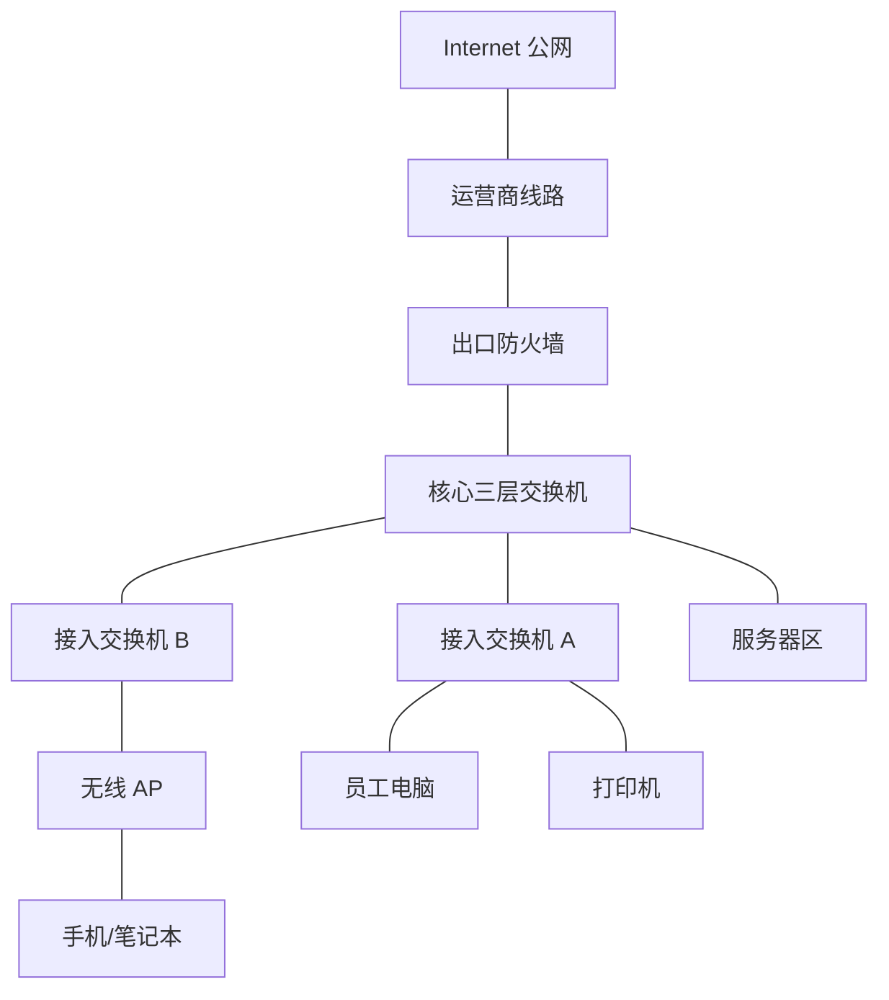

# 第 1 章：网络工程师需要掌握什么

## 1.1 本章学习目标

读完本章后，你应该能够回答以下问题：

- 网络工程师的工作目标是什么。
- 企业网络由哪些常见区域组成。
- 交换机、路由器、防火墙、无线 AP 分别负责什么。
- 初级、中级、高级网络工程师能力差别在哪里。
- 零基础应该按什么顺序学习网络技术。
- 学习网络时应该准备什么实验环境和学习资料。

本章不是讲某一条命令，而是先建立整体地图。后续学习 IP、VLAN、路由、防火墙时，你需要知道这些知识最终会放在企业网络的哪个位置。

## 1.2 网络工程师的核心目标

企业网络工程师的核心目标不是“背命令”，而是让业务系统稳定、安全、可控地互联。交换机、防火墙、路由器、无线控制器只是实现目标的工具。

真正的能力体现在三件事上：

- 能把业务需求转换成网络设计。
- 能把网络设计转换成设备配置。
- 能在故障发生时快速定位问题边界并恢复业务。

例如，一个公司提出：

```text
研发部门不能访问财务系统，但财务部门可以访问文件服务器。
```

这句话听起来像是一个简单的“允许或禁止访问”问题，但网络工程师需要继续拆解：

- 研发部门和财务部门是否在不同 VLAN。
- 研发网和财务网分别使用什么 IP 网段。
- 这两个网段的网关在哪里。
- 两个网段之间是否有路由。
- 流量是否必须经过防火墙。
- 防火墙策略按 IP、端口还是应用控制。
- 文件服务器属于哪个安全区域。
- 策略变更后如何验证。
- 出问题时如何回退。
- 是否需要记录日志用于审计。

所以，网络工程师不是单纯“让它通”，而是要明确“谁和谁通、为什么通、怎么通、哪里控制、如何验证、如何回退”。

## 1.3 企业网络到底是什么

对零基础读者来说，可以先把企业网络理解为一套“公司内部的道路系统”：

- 终端设备像车辆，例如电脑、手机、打印机、摄像头。
- 交换机像楼层和园区内部道路，负责把同一区域内的设备连起来。
- 路由器和三层交换机像城市之间的路口，负责连接不同网段。
- 防火墙像检查站，决定哪些车辆可以通过。
- 无线 AP 像无线入口，让手机和笔记本不用网线也能进入网络。
- DNS 像通讯录，把域名翻译成 IP 地址。
- DHCP 像自动发号系统，给终端分配 IP、网关、DNS 等参数。

一个简化的企业网络可以画成这样：



这张图虽然简单，但已经包含了很多后续章节会反复出现的概念：

- 终端接入：电脑、打印机、手机如何进入网络。
- 二层交换：接入交换机如何转发同一局域网内部流量。
- 三层网关：核心交换机如何连接不同网段。
- 安全边界：防火墙如何控制内外网访问。
- 出口访问：企业如何访问互联网。
- 服务器访问：员工如何访问内部业务系统。

## 1.4 企业网络的常见组成

典型企业网络通常包含以下区域。

### 办公网

办公网承载员工电脑、办公软件、打印机、电话、会议设备等。它通常是企业里终端数量最多、变动最频繁的区域。

办公网设计要关注：

- 地址是否够用。
- DHCP 是否稳定。
- 员工是否能访问必要系统。
- 普通办公终端是否被限制访问敏感服务器。
- 病毒、环路、私接路由器等问题是否会扩大影响范围。

### 服务器区

服务器区放置 ERP、OA、文件服务器、数据库、中间件、虚拟化平台等内部系统。它比办公网更敏感，因为服务器通常承载核心业务数据。

服务器区设计要关注：

- 哪些办公网段可以访问服务器。
- 哪些服务器可以访问数据库。
- 是否需要负载均衡。
- 是否需要防火墙或 ACL 做东西向访问控制。
- 是否需要独立备份网络和管理网络。

### DMZ 区

DMZ 是 Demilitarized Zone，通常翻译为隔离区或非军事区。它用于放置需要对互联网开放的系统，例如门户网站、邮件网关、VPN 网关、反向代理。

DMZ 的基本思想是：公网用户可以访问 DMZ 中指定服务，但不能直接进入企业内网。即使 DMZ 中某台服务器被攻击，也要尽量避免攻击继续横向进入服务器区或办公网。

### 互联网出口区

互联网出口区通常包含防火墙、出口路由器、运营商线路、NAT、上网行为管理、代理或安全网关。

它要解决的问题包括：

- 内部用户如何访问互联网。
- 公网用户如何访问企业发布的服务。
- 多条运营商线路如何主备或负载分担。
- 哪些应用允许上网，哪些应用禁止。
- 出口故障时如何切换。

### 无线网络区

无线网络区包括无线 AP、无线控制器、SSID、认证系统和无线 VLAN。企业无线不是“买几个家用路由器插上”。

无线设计要关注：

- 覆盖范围是否足够。
- 人多的会议室是否容量足够。
- 员工无线和访客无线是否隔离。
- 无线漫游是否稳定。
- 是否接入统一认证。

### 运维管理区

运维管理区用于管理设备和系统，常见组件包括堡垒机、监控系统、日志平台、配置备份系统、自动化平台。

管理区非常重要，因为它能登录核心设备、防火墙和服务器。管理区通常不应与普通办公网混用，应限制来源地址、账号权限和操作审计。

### 分支机构网络

分支机构包括门店、办事处、工厂、仓库等远程站点。它们可能通过专线、互联网 VPN、SD-WAN 或运营商网络连接总部。

分支设计要关注：

- 分支是否需要访问总部系统。
- 总部是否需要访问分支设备。
- 分支断网时本地业务是否还能运行。
- 分支 IP 地址是否与总部、云上、员工家庭网络冲突。

这些区域之间不能简单地“全部互通”。企业网络设计的重点是按业务关系控制通信路径，让该通的流量稳定通过，让不该通的流量被明确拒绝并记录。

## 1.5 主要网络设备的角色

### 交换机

交换机主要负责局域网内部的二层转发，也可以通过三层交换机承担 VLAN 间路由。

企业中最常见的交换机角色包括：

| 角色 | 常见位置 | 主要作用 |
| --- | --- | --- |
| 接入交换机 | 办公区、弱电间、机柜 | 连接电脑、电话、打印机、AP、摄像头 |
| 汇聚交换机 | 楼栋或区域汇聚点 | 汇聚多个接入交换机，上联核心 |
| 核心交换机 | 主机房或核心机房 | 高速转发、网关、路由汇总、冗余 |
| 数据中心交换机 | 服务器机柜、数据中心 | 连接服务器、存储、虚拟化平台 |

初学时可以先记住一句话：交换机负责把“同一个局域网内部”的设备连起来。后续 VLAN 和三层交换会让这个说法更完整。

### 路由器

路由器负责不同网络之间的路径选择。在现代企业网络中，传统路由器常用于广域网、专线、互联网边界和特殊场景。很多园区网络的内部路由已经由三层交换机承担。

可以把路由器理解为“知道去不同目的地该走哪条路”的设备。它关心的是 IP 网段和下一跳，而不是某台电脑插在哪个交换机端口。

### 防火墙

防火墙负责安全边界控制。它不仅判断“能不能通”，还要判断：

- 谁访问谁。
- 使用什么协议和端口。
- 属于哪个安全区域。
- 是否需要做 NAT。
- 是否需要记录日志。
- 是否命中威胁检测或安全防护。

防火墙常见部署位置包括互联网出口、服务器区边界、DMZ 边界、总部和分支互联边界。

### 无线控制器和 AP

无线 AP 负责提供无线信号，终端通过 AP 接入网络。无线控制器负责集中管理 AP、SSID、认证、漫游、射频参数和无线 VLAN。

企业无线要同时考虑“能连上”和“好不好用”。能连上只是基础，还要关注漫游是否掉线、会议室是否拥塞、访客是否隔离、认证是否安全。

### 负载均衡、堡垒机和监控系统

除了传统网络设备，企业网络中还常见一些辅助系统：

| 系统 | 作用 |
| --- | --- |
| 负载均衡 | 把访问请求分发到多台服务器，提高性能和可用性 |
| 堡垒机 | 统一运维登录入口，记录谁在什么时候操作了什么 |
| 监控系统 | 监控设备状态、接口流量、丢包、延迟和告警 |
| 日志平台 | 收集设备、安全、系统日志，用于排错和审计 |
| 配置备份系统 | 定期备份设备配置，支持故障恢复和配置对比 |

## 1.6 网络工程师每天在做什么

网络工程师的工作并不只是坐在电脑前敲命令。常见工作可以分为六类。

### 规划设计

例如新办公室装修，需要提前规划：

- 需要多少信息点。
- 每层放多少接入交换机。
- 使用哪些 VLAN。
- 每个 VLAN 分配什么 IP 网段。
- 无线 AP 放在哪里。
- 核心机房如何上联互联网。
- 防火墙策略如何设计。

### 设备配置

根据设计方案配置交换机、路由器、防火墙、无线控制器等设备。配置不是机械复制命令，而是要理解每条命令的目的。

### 故障排查

例如用户反馈“上不了网”，网络工程师需要判断：

- 是一个人不通，还是一片区域不通。
- 是不能访问互联网，还是不能访问内部系统。
- 是 DNS 问题、网关问题、VLAN 问题，还是防火墙策略问题。
- 是终端问题、接入交换机问题、核心问题，还是运营商问题。

### 变更实施

企业网络不能随意改。重要变更通常需要：

- 变更目的。
- 影响范围。
- 实施步骤。
- 验证方法。
- 回退方案。
- 变更窗口。
- 相关人员确认。

### 文档维护

网络文档包括拓扑图、IP 地址表、VLAN 表、端口表、设备清单、策略表、账号权限、运维流程等。没有文档的网络，排错和交接都会非常困难。

### 安全与审计

网络工程师需要配合安全要求，控制访问边界、保存日志、审查策略、关闭不必要服务、处理安全告警。

## 1.7 网络工程师能力等级

### 初级能力

初级网络工程师应掌握：

- IP 地址、子网掩码、网关、DNS、DHCP。
- VLAN、Access、Trunk、静态路由。
- 常见设备登录、查看、保存配置。
- 使用 ping、traceroute、telnet、nslookup、抓包工具做基础排错。
- 按照已有方案完成简单设备配置。

初级阶段的重点不是追求复杂协议，而是能把基础概念讲清楚、配出来、验证出来。

### 中级能力

中级网络工程师应掌握：

- 独立规划 VLAN 和 IP 地址。
- 配置 STP、链路聚合、三层网关、OSPF、NAT、防火墙策略。
- 设计中小企业网络架构。
- 排查二层环路、路由异常、策略不通、NAT 异常、VPN 异常。
- 编写基础实施方案、割接方案和验收文档。

中级阶段开始关注“为什么这样设计”，不仅要知道命令，还要知道方案边界和风险。

### 高级能力

高级网络工程师应掌握：

- 大型园区网、数据中心、总部-分支、双出口、多运营商架构设计。
- 高可用、灾备、负载分担、安全隔离和运维监控设计。
- 多厂商设备协同。
- 网络自动化、标准化模板、配置审计。
- 从业务连续性、安全合规和长期运维成本角度评估方案。

高级阶段更关注架构、稳定性、标准化、成本、安全和团队协作。

## 1.8 推荐学习路径

建议按以下路径学习：

1. 网络基础：OSI、TCP/IP、IP 地址、ARP、ICMP、TCP、UDP。
2. 交换技术：VLAN、Trunk、STP、链路聚合、三层交换。
3. 路由技术：静态路由、默认路由、OSPF、BGP 基础、策略路由。
4. 防火墙技术：安全区域、策略、NAT、VPN、日志、威胁防护。
5. 架构设计：办公网、服务器区、DMZ、出口、无线、分支互联。
6. 运维排错：监控、日志、抓包、变更、备份、故障复盘。
7. 项目实战：从需求分析到拓扑、配置、测试、割接和验收。

一条适合零基础的学习节奏如下：

| 阶段 | 重点 | 能力目标 |
| --- | --- | --- |
| 第 1 阶段 | IP、掩码、网关、DNS、DHCP | 能看懂终端网络配置 |
| 第 2 阶段 | 交换机、VLAN、Trunk | 能配置简单办公接入网络 |
| 第 3 阶段 | 路由、默认路由、静态路由 | 能让不同网段互通 |
| 第 4 阶段 | 防火墙、安全区域、策略、NAT | 能控制内外网访问 |
| 第 5 阶段 | STP、链路聚合、冗余网关 | 能理解可靠性设计 |
| 第 6 阶段 | 综合实验和排错 | 能独立分析常见故障 |

学习时不要跳过基础。例如不理解掩码，就很难真正理解 VLAN 网关；不理解 ARP，就很难排查同网段不通；不理解路由，就很难配置防火墙策略。

## 1.9 实验环境准备

学习网络必须做实验。只看配置示例很容易产生“看得懂但不会做”的问题。

推荐准备：

- 一台性能较好的电脑，内存建议 16 GB 以上。
- 至少一种模拟器：eNSP、HCL、Packet Tracer、GNS3 或 EVE-NG。
- 抓包工具：Wireshark。
- 终端工具：Windows Terminal、SecureCRT、MobaXterm、iTerm2 等。
- 文档工具：Markdown 编辑器、表格工具、绘图工具。

不同工具适合不同场景：

| 工具 | 适合人群 | 说明 |
| --- | --- | --- |
| Packet Tracer | 初学 Cisco 基础 | 上手简单，适合入门拓扑 |
| eNSP | 学习华为基础 | 常用于华为命令和实验练习 |
| HCL | 学习 H3C 基础 | 适合 H3C 设备实验 |
| GNS3 | 进阶实验 | 灵活但环境搭建相对复杂 |
| EVE-NG | 综合实验 | 适合多厂商和复杂拓扑 |
| Wireshark | 协议分析 | 用抓包理解 ARP、DNS、TCP、ICMP |

建议每个实验都记录四类信息：

- 实验目标：本次验证什么技术点。
- 网络拓扑：设备如何连接。
- 关键配置：只记录关键配置，不堆完整配置。
- 验证结果：用什么命令证明配置有效。

## 1.10 初学者常见误区

### 只背命令，不理解通信过程

命令只是表达方式。不同厂商命令不同，但 IP、MAC、ARP、路由、VLAN 的原理是通用的。只背命令会导致换一台设备就不会排错。

### 只会 ping，不会定位边界

`ping` 很重要，但 `ping` 不通只是现象。你还需要判断问题发生在哪一层、哪一段链路、哪一台设备、哪个策略点。

### 把“能通”当成“设计正确”

网络能通不代表设计正确。所有部门互通当然最容易，但这通常不符合安全要求。企业网络要做到该通的通，不该通的禁止。

### 不写文档

没有文档时，网络越做越乱。IP 地址、VLAN、端口、策略、设备密码、拓扑变化都必须有记录。文档不是额外工作，而是运维能力的一部分。

### 忽略变更风险

企业网络中的一条错误命令可能影响大量用户。上线前要明确实施步骤、影响范围、验证方法和回退方案。

## 1.11 本章检查清单

学习完本章后，可以用下面的问题自查：

- 能否画出一个企业网络的大致拓扑。
- 能否说出交换机、路由器、防火墙、AP 的区别。
- 能否解释办公网、服务器区、DMZ、管理区的作用。
- 能否说明为什么企业网络不能简单全部互通。
- 能否列出自己接下来要学习的技术顺序。
- 能否准备一个可用于练习的网络实验环境。

## 1.12 本章小结

网络工程师的成长路线可以概括为：先懂通信原理，再会设备配置，最后能做架构设计和工程交付。不要把学习重点放在某一个厂商的命令格式上。厂商命令会变化，但 VLAN、路由、NAT、防火墙策略、冗余、隔离、可观测性这些思想长期稳定。
