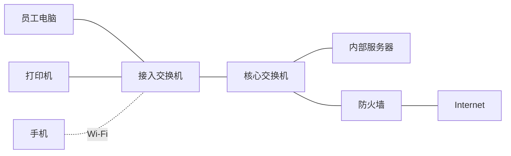
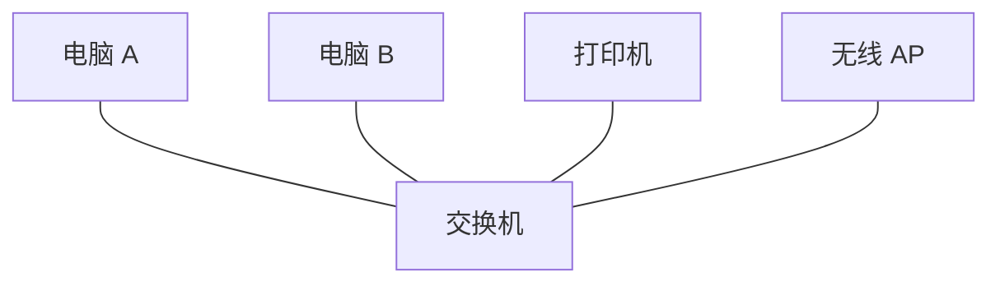
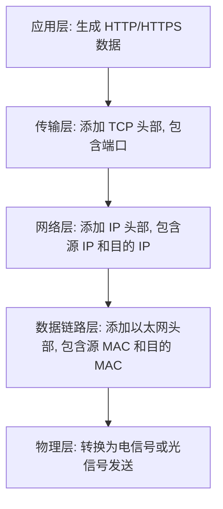
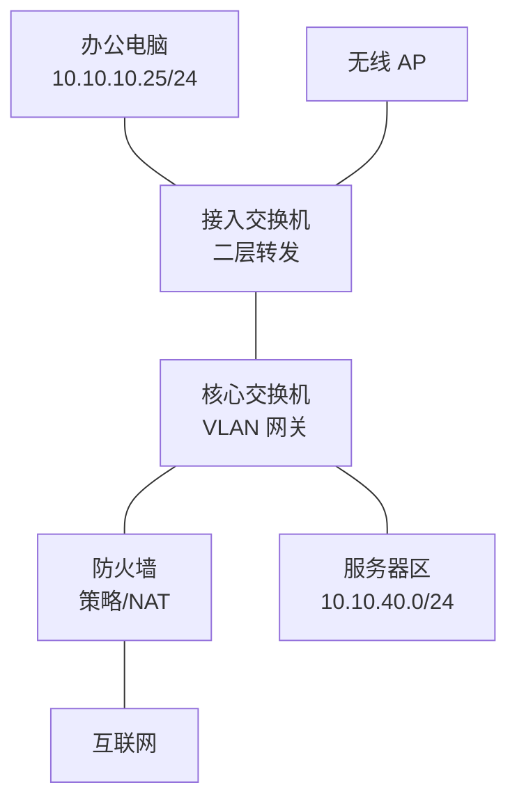

# 第 2 章：网络基础知识

## 2.1 本章学习目标

读完本章后，你应该能够：

- 用自己的话解释“网络”是什么。
- 区分 LAN、WAN、Internet、Intranet。
- 理解 OSI 七层模型和 TCP/IP 四层模型的作用。
- 知道数据从应用程序发出后如何被封装。
- 区分单播、广播、组播。
- 认识企业网络中的常见设备。
- 掌握基础网络术语，例如带宽、延迟、网关、广播域。

本章面向零基础读者，会尽量用生活化方式解释。后续章节会在这些基础上继续展开。

## 2.2 什么是网络

网络是把多台设备连接起来，使它们能够交换数据的系统。这里的设备可以是电脑、手机、服务器、打印机、摄像头、交换机、防火墙、路由器，也可以是虚拟机、容器或云资源。

从用户角度看，网络是“能不能上网”“能不能打开系统”“能不能打印”。从工程角度看，网络是一整套通信机制，包括：

- 地址：设备如何被识别。
- 路径：数据从哪里走到哪里。
- 协议：双方用什么规则通信。
- 控制：哪些流量允许通过，哪些流量禁止通过。
- 可靠性：链路或设备故障时如何继续服务。
- 可观测性：出现问题时如何查看状态和日志。

一个最小网络可以只有两台电脑和一根网线：

```text
电脑 A  ---  网线  ---  电脑 B
```

企业网络会复杂得多：



无论网络大小如何，本质问题都一样：源设备要把数据送到目标设备，中间设备要知道如何转发，安全设备要判断是否允许。

## 2.3 LAN、WAN、Internet、Intranet

这四个词很常见，初学者容易混在一起。可以先按“范围”和“开放程度”理解。

### LAN

LAN 是 Local Area Network，局域网。它通常指一个办公室、一栋楼、一个园区或一个数据中心内部的网络。

常见 LAN 场景：

- 一间办公室里几十台电脑连接到同一台交换机。
- 一栋楼每层都有接入交换机，再上联到核心交换机。
- 一个园区内办公楼、研发楼、数据中心通过光纤互联。
- 一个数据中心机房内，服务器通过高速交换机互联。

LAN 的典型特点：

| 特点 | 说明 |
| --- | --- |
| 范围较小 | 通常在房间、楼栋、园区或机房内部 |
| 带宽较高 | 常见 1 Gbps、10 Gbps、25 Gbps、100 Gbps |
| 延迟较低 | 同楼或同园区内部通信通常很快 |
| 归属明确 | 一般由企业自己建设和管理 |
| 技术集中 | 常见以太网、VLAN、Wi-Fi、STP、链路聚合 |

对零基础读者来说，可以把 LAN 理解成“公司自己内部的网络道路”。电脑访问同办公室打印机、员工访问内部文件服务器、手机连接公司 Wi-Fi，通常都属于 LAN 场景。

LAN 中最常见的设备是交换机。交换机负责把同一局域网内的终端连起来：



需要注意的是，物理上接在同一台交换机上，不一定代表逻辑上就在同一个网络里。企业会使用 VLAN 把不同部门或业务隔离开。VLAN 后续会单独讲，这里先记住一句话：VLAN 可以把一套物理 LAN 划分成多个逻辑 LAN。

### WAN

WAN 是 Wide Area Network，广域网。它用于连接不同地理位置的网络。

常见 WAN 场景：

- 总部和分支机构之间通过专线互联。
- 总部和工厂之间通过运营商 MPLS 网络互联。
- 分支通过互联网 VPN 连接总部。
- 多个城市的办公室通过 SD-WAN 组网。

WAN 的典型特点：

| 特点 | 说明 |
| --- | --- |
| 范围较大 | 跨楼宇、跨园区、跨城市、跨国家 |
| 依赖运营商 | 经常使用运营商线路或互联网 |
| 带宽成本更高 | 同样带宽下，广域网线路通常比局域网昂贵 |
| 延迟更高 | 距离越远，经过设备越多，延迟通常越大 |
| 稳定性设计重要 | 常做双线路、VPN 备份、SD-WAN 选路 |

可以把 WAN 理解成“把多个公司的内部道路连接起来的城际道路”。LAN 解决一个地点内部通信，WAN 解决多个地点之间通信。

### Internet

Internet 是全球公共互联网。企业访问公网服务、对外发布网站、远程办公 VPN、云服务访问，通常都要经过互联网出口。

企业访问互联网时，常见路径如下：


企业内部通常使用私网地址，例如 `10.x.x.x`、`172.16.x.x`、`192.168.x.x`。这些地址不能直接在 Internet 上路由，所以访问公网时通常要经过 NAT，把内部私网地址转换为公网地址。

### Intranet

Intranet 是企业内部网络。它可能使用与互联网相同的 TCP/IP 协议，但只面向内部用户和内部系统，不直接对公网开放。

常见 Intranet 服务包括：

- OA 系统。
- 内部邮件系统。
- 文件共享。
- 内部代码仓库。
- 内部监控平台。
- 内部知识库。

Internet 和 Intranet 的区别不是协议完全不同，而是访问范围不同。内部系统如果错误暴露到公网，会带来严重安全风险。

### 四者对比

| 名称 | 中文 | 主要范围 | 常见例子 |
| --- | --- | --- | --- |
| LAN | 局域网 | 单办公室、楼栋、园区、机房 | 办公网、服务器交换网络 |
| WAN | 广域网 | 多地点互联 | 总部到分支、城市间专线 |
| Internet | 公共互联网 | 全球公网 | 访问公网网站、云服务 |
| Intranet | 企业内网 | 企业内部用户和系统 | OA、ERP、内部文件服务器 |

## 2.4 OSI 七层模型

OSI 七层模型用于理解网络通信过程。实际排错时，它尤其有价值，因为它帮助工程师按层定位问题。

| 层级 | 名称 | 主要作用 | 常见例子 |
| --- | --- | --- | --- |
| 7 | 应用层 | 面向应用程序提供网络服务 | HTTP、DNS、SMTP |
| 6 | 表示层 | 数据格式、编码、加密 | TLS、字符编码 |
| 5 | 会话层 | 会话建立、维护、终止 | 登录会话、RPC 会话 |
| 4 | 传输层 | 端到端传输和端口 | TCP、UDP |
| 3 | 网络层 | IP 地址和路由转发 | IP、ICMP、OSPF |
| 2 | 数据链路层 | MAC 地址和二层转发 | Ethernet、VLAN、STP |
| 1 | 物理层 | 电信号、光信号、介质 | 网线、光纤、接口 |

初学时不需要死记每层所有协议，但要理解每层关注点：

- 物理层看“线通不通、接口亮不亮”。
- 数据链路层看“MAC 地址、VLAN、二层转发是否正常”。
- 网络层看“IP、网关、路由是否正确”。
- 传输层看“端口是否开放、TCP 是否建立”。
- 应用层看“应用程序、账号、权限、域名、证书是否正常”。

实际工作中常用的排错顺序是从下往上：

1. 物理是否正常：接口是否 up，光模块和网线是否正常。
2. 二层是否正常：VLAN 是否正确，MAC 地址是否学习到。
3. 三层是否正常：IP、网关、路由是否正确。
4. 四层是否正常：端口是否开放，TCP 是否建立。
5. 应用是否正常：服务进程、应用配置、认证是否正常。

例如用户说“打不开 OA 系统”，不能马上判断是 OA 系统坏了。你可以按层检查：

```text
网线和 Wi-Fi 是否正常
终端是否拿到正确 IP
能否 ping 网关
能否 ping OA 服务器 IP
DNS 是否能解析 OA 域名
TCP 端口是否开放
浏览器是否报证书或登录错误
```

## 2.5 TCP/IP 四层模型

TCP/IP 模型更贴近实际互联网协议栈：

| 层级 | 名称 | 对应 OSI 层 | 常见协议 |
| --- | --- | --- | --- |
| 4 | 应用层 | OSI 5-7 层 | HTTP、DNS、SSH、SMTP |
| 3 | 传输层 | OSI 4 层 | TCP、UDP |
| 2 | 网络层 | OSI 3 层 | IP、ICMP、OSPF、BGP |
| 1 | 网络接口层 | OSI 1-2 层 | Ethernet、VLAN、ARP |

网络工程中经常说“二层问题”“三层问题”“四层端口不通”，通常就是基于这种分层思维。

OSI 七层模型更适合学习和排错拆解，TCP/IP 四层模型更贴近真实协议栈。两者不是互相矛盾，而是观察同一件事的两种方式。

## 2.6 封装与解封装

当一台电脑访问网站时，数据会逐层封装。

以访问 `https://www.example.com` 为例，简化过程如下：



用表格看会更清楚：

| 层级 | 添加的信息 | 常见字段 |
| --- | --- | --- |
| 应用层 | 应用数据 | URL、请求方法、业务内容 |
| 传输层 | TCP 或 UDP 头部 | 源端口、目的端口 |
| 网络层 | IP 头部 | 源 IP、目的 IP |
| 数据链路层 | 以太网头部 | 源 MAC、目的 MAC |
| 物理层 | 比特流 | 电信号、光信号、无线信号 |

接收方收到数据后按相反顺序解封装。

理解封装很重要，因为不同设备关注不同层：

- 交换机主要根据 MAC 地址转发。
- 路由器和三层交换机主要根据 IP 地址转发。
- 防火墙会同时关注 IP、端口、协议、会话和应用。
- 服务器应用最终关注应用层数据。

一个常见误区是认为“访问服务器时，交换机直接看目的 IP”。普通二层交换机主要看 MAC 地址，不根据 IP 路由转发。IP 层转发通常由路由器、三层交换机或防火墙完成。

## 2.7 单播、广播、组播

### 单播

单播是一对一通信。大多数业务访问都是单播，例如：

- 电脑访问 Web 服务器。
- 电脑访问文件服务器。
- 运维人员 SSH 登录交换机。
- 手机访问企业邮箱。

单播的特点是源明确、目的明确。

### 广播

广播是一对同一广播域内所有设备通信。ARP 请求就是典型广播。广播不能随意跨越三层网关，否则会扩大影响范围。

例如电脑想知道 `192.168.10.1` 的 MAC 地址，会发送类似这样的问题：

```text
谁是 192.168.10.1？请告诉 192.168.10.25。
```

同一广播域内的设备都会收到这个问题，只有 `192.168.10.1` 会回应。

广播过多会造成问题：

- 占用终端 CPU。
- 占用交换机转发资源。
- 放大环路故障影响。
- 让故障从一个区域扩散到更多设备。

VLAN 的一个重要作用就是缩小广播域。

### 组播

组播是一对多通信，但只发送给加入特定组的接收者。视频会议、直播、金融行情、IPTV 等场景可能使用组播。

组播比广播更精确，因为它不是发给所有人，而是发给“订阅了某个组”的设备。组播配置和排错比单播更复杂，初学阶段先理解概念即可。

## 2.8 常见网络设备

| 设备 | 主要作用 | 初学理解 |
| --- | --- | --- |
| 交换机 | 局域网二层或三层转发 | 连接同一地点内部设备 |
| 路由器 | 不同网络之间的路径选择 | 决定去不同网段走哪条路 |
| 防火墙 | 安全边界、访问控制、NAT、VPN | 检查并控制流量 |
| 无线 AP | 提供无线接入 | 让无线终端接入企业网络 |
| 无线控制器 | 集中管理 AP 和无线策略 | 统一管理很多 AP |
| 负载均衡 | 把业务流量分发到多台服务器 | 让多个服务器共同承担访问 |
| 堡垒机 | 管理运维登录和审计 | 统一运维入口 |
| 日志平台 | 收集和分析设备、安全、系统日志 | 排错和审计依据 |

不同设备可以组合成一条完整路径：

```text
员工电脑 -> 接入交换机 -> 核心交换机 -> 防火墙 -> 互联网
员工电脑 -> 接入交换机 -> 核心交换机 -> 服务器区
分支电脑 -> 分支路由器 -> VPN/专线 -> 总部防火墙 -> 内部系统
```

排错时要沿着路径逐段检查，而不是只盯着某一台设备。

## 2.9 常见网络术语

### 带宽

带宽是链路理论传输能力，例如 100 Mbps、1 Gbps、10 Gbps。带宽越大，理论上单位时间能传输的数据越多。

但带宽不是实际下载速度的唯一因素。服务器性能、链路拥塞、运营商质量、防火墙性能都会影响最终体验。

### 延迟

延迟是数据从源到目的所需时间，常用毫秒表示。语音、视频会议、远程桌面对延迟很敏感。

### 抖动

抖动是延迟变化幅度。平均延迟不高但抖动很大时，语音和视频也可能卡顿。

### 丢包

丢包是数据包未成功到达目的地。少量丢包就可能影响实时业务，严重丢包会导致 TCP 重传、应用变慢甚至中断。

### 吞吐量

吞吐量是实际可用传输速率。它通常低于理论带宽。例如 1 Gbps 链路在真实业务中可能因为协议开销、设备性能或拥塞达不到满速。

### 网关

网关是终端访问其他网段时交给的下一跳设备。电脑访问同网段设备时不需要经过网关，访问其他网段或互联网时通常要交给网关。

### 广播域

广播域是广播帧可以到达的范围。一个 VLAN 通常就是一个广播域。广播域越大，广播影响范围越大。

### 冲突域

冲突域是共享介质中可能发生冲突的范围。现代交换网络通常是全双工交换，冲突域问题已经不像早期集线器网络那样突出，但理解它有助于理解以太网发展。

## 2.10 基础排错思路

零基础排错时，建议不要一上来就猜。可以按下面顺序缩小范围：

1. 确认影响范围：一个用户、一个部门、一栋楼，还是全公司。
2. 确认目标类型：上不了互联网，还是访问不了内部系统。
3. 检查物理和无线连接：网线、接口灯、Wi-Fi 信号。
4. 检查终端地址：IP、掩码、网关、DNS 是否正确。
5. 检查网关连通性：能否 ping 网关。
6. 检查目标连通性：能否 ping 目标 IP。
7. 检查域名解析：域名是否能解析为正确 IP。
8. 检查端口和策略：服务端口、防火墙策略是否允许。

常用命令包括：

```text
ipconfig /all        Windows 查看地址信息
ifconfig 或 ip addr  Linux/macOS 查看地址信息
ping                 测试连通性
tracert/traceroute   查看路径
nslookup             测试 DNS 解析
telnet/nc            测试 TCP 端口
```

不同系统命令略有差异，但排错逻辑相同。

## 2.11 用分层模型定位故障边界

OSI 模型和 TCP/IP 模型不是为了背诵层号，而是为了帮助你判断故障边界。排错时可以把“不能访问业务”拆成多个层面的验证。

例如一台电脑无法访问内部 OA 系统，地址如下：

```text
PC：10.10.10.25/24，网关 10.10.10.1
OA：10.10.40.20/24，服务端口 TCP 443
DNS：10.10.40.10
```

可以按下面思路分层检查：

| 层面 | 需要验证什么 | 常见工具或证据 |
| --- | --- | --- |
| 物理层 | 网线、光模块、无线信号、接口 up/down | 接口灯、设备接口状态 |
| 数据链路层 | VLAN、MAC 学习、ARP 是否正常 | MAC 地址表、ARP 表 |
| 网络层 | IP、掩码、网关、路由是否正确 | `ipconfig`、`ping`、路由表 |
| 传输层 | TCP/UDP 端口是否可达 | `telnet`、`nc`、抓包 |
| 应用层 | 域名、证书、账号、服务进程是否正常 | `nslookup`、浏览器报错、服务器日志 |

如果 PC 能 ping 通网关，说明物理层、接入口 VLAN、同网段 ARP 至少大概率正常；如果能 ping 通 OA 的 IP，但 TCP 443 不通，问题就更可能在防火墙策略、服务器监听端口或应用服务；如果能访问 IP 但不能访问域名，优先看 DNS。

分层排错的关键不是机械地从第一层查到第七层，而是用每一个验证结果缩小范围。每次测试都要回答一个问题：这个结果排除了哪一段，下一段应该检查哪里。

## 2.12 小型企业网络示例

一个最小企业网络通常包含接入交换机、核心三层设备、防火墙、服务器和互联网出口。即使规模很小，也已经包含后续章节的大部分基础概念。



这个拓扑中，各设备的职责如下：

| 设备 | 主要职责 | 初学者容易误解的点 |
| --- | --- | --- |
| 接入交换机 | 连接终端，划分 VLAN，学习 MAC | 它通常不是用户网关 |
| 核心交换机 | 提供 VLAN 网关，完成内部路由 | 它能路由不代表应该放开所有访问 |
| 防火墙 | 控制安全边界，做 NAT，上网出口 | 有路由不等于策略允许 |
| 服务器 | 提供 DNS、DHCP、OA、文件等服务 | 服务器也需要正确网关和回程 |
| AP | 提供无线接入，将 SSID 映射到 VLAN | 员工 Wi-Fi 和访客 Wi-Fi 应隔离 |

从这个简单拓扑开始，后续可以逐步加入链路聚合、STP、双核心、动态路由、VPN、监控和日志系统。大型网络不是完全不同的东西，而是在这些基本模块上增加规模、冗余、安全和运维要求。

## 2.13 从用户报障还原网络路径

网络基础学得是否扎实，可以通过“能否把用户报障还原成路径”来检验。用户通常不会说“我的 DNS 解析失败”或“TCP 三次握手没有完成”，而是说“网页打不开”“系统很慢”“无线不稳定”。

例如用户描述：

```text
研发部用户反馈：今天上午开始，访问代码仓库很慢，有时网页能打开，有时拉代码失败。
```

工程师需要继续追问并整理为网络信息：

| 需要补充的问题 | 为什么要问 |
| --- | --- |
| 影响一个人还是整个研发部 | 判断单终端还是网段/链路问题 |
| 使用有线还是无线 | 判断接入介质和 VLAN |
| 访问内部仓库还是云上仓库 | 判断目标在内网、互联网还是专线 |
| 具体地址和端口是什么 | 明确测试对象 |
| 是否只有拉代码慢，网页也慢吗 | 区分应用、带宽、丢包、端口问题 |
| 什么时候开始，是否有变更 | 对齐日志和变更时间 |

整理后的排错描述可能是：

```text
源：研发 VLAN 20，用户 PC 10.10.20.35
目的：Git 服务器 10.10.45.30，TCP 443/22
现象：网页偶发超时，git clone 中断
影响范围：研发部多名有线用户
初步路径：PC -> 接入交换机 -> 核心交换机 -> 服务器区
优先检查：接入上联、核心到服务器区链路、丢包和接口错误包
```

这个过程会把模糊问题变成可验证问题。后续的 ping、traceroute、抓包、接口统计、DNS 查询才有明确方向。

## 2.14 基础网络验收清单

搭建一个小型网络后，不能只验证一台电脑能上网。验收应该覆盖地址、二层、三层、DNS、业务端口和故障边界。

| 验收项 | 示例验证 |
| --- | --- |
| 终端地址 | 终端获取正确 IP、掩码、网关、DNS |
| 网关连通 | 终端 ping 本 VLAN 网关 |
| 同 VLAN 通信 | 同 VLAN 两台终端互通，MAC 表正确 |
| 跨 VLAN 通信 | 终端访问服务器 VLAN |
| DNS 解析 | 内部域名解析到预期地址 |
| 业务端口 | TCP 443、TCP 22 或业务端口可达 |
| 上网路径 | ping 公网 IP，访问域名，查看 NAT |
| 策略控制 | 访客 VLAN 不能访问内网服务器 |
| 监控管理 | 网络设备管理 IP 可达，日志时间正确 |

验收记录中要同时写成功项和失败项。比如“访客 VLAN 无法访问 OA”如果符合设计，就应该记录为验收通过，而不是简单写“不通”。企业网络追求的是符合策略，不是所有方向都互通。

## 2.15 本章检查清单

学习完本章后，可以自查：

- 能否解释 LAN 为什么通常比 WAN 延迟低。
- 能否说出 Internet 和 Intranet 的区别。
- 能否按 OSI 模型描述一次访问网站的大致过程。
- 能否区分交换机、路由器、防火墙的主要职责。
- 能否解释单播、广播、组播的区别。
- 能否说出带宽、延迟、抖动、丢包分别影响什么体验。
- 能否用分层模型说明“能 ping IP 但打不开网页”可能在哪些层面出问题。
- 能否画出一个小型企业网络，并说明每台设备的职责。
- 能否把一条用户报障描述整理成源、目的、协议、路径和影响范围。
- 能否为一个小型网络写出基础验收清单。

## 2.16 本章小结

网络基础的重点是建立分层思维。后续学习 VLAN、路由、防火墙、VPN、NAT 时，都可以回到“数据包在哪一层被处理、源和目的地址是什么、下一跳是谁、策略是否允许”这几个问题上。
