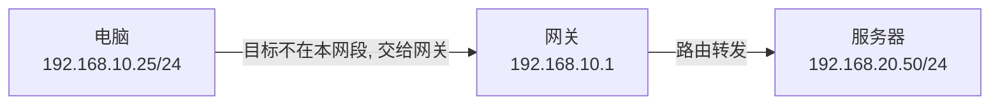
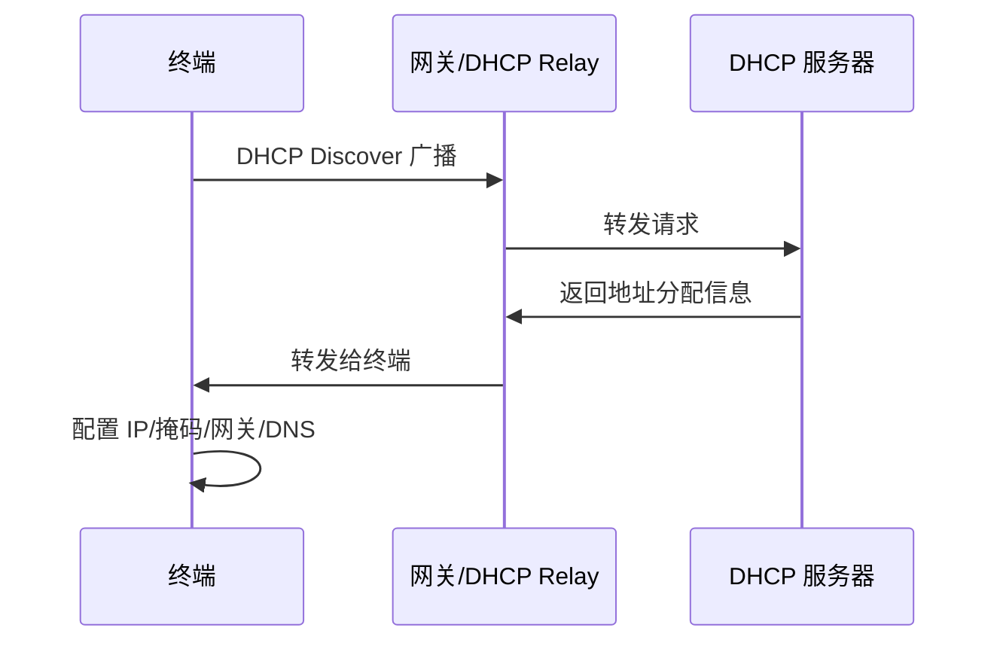

# 第 3 章：IP 地址基础

## 3.1 本章学习目标

读完本章后，你应该能够：

- 看懂 IPv4 地址的基本格式。
- 理解 IP 地址、子网掩码、网关、DNS、DHCP 分别解决什么问题。
- 判断两个 IP 是否在同一网段。
- 区分网络地址、可用主机地址、广播地址。
- 区分公网地址和私网地址。
- 识别常见特殊地址，例如 `127.0.0.1`、`169.254.x.x`、`0.0.0.0`。
- 根据终端地址配置初步判断网络故障方向。

本章会重点讲 IPv4。IPv6 也很重要，但企业网络入门阶段通常先把 IPv4 学清楚。

## 3.2 为什么需要 IP 地址

在网络中，每台设备都需要一个可识别的位置。MAC 地址可以标识网卡，但 MAC 地址主要用于二层局域网内部转发，不适合表达“这个设备属于哪个网段、应该从哪条路到达”。

IP 地址的作用可以简单理解为：

- 标识一台三层网络中的设备。
- 表示设备属于哪个网络。
- 帮助路由器、三层交换机、防火墙选择转发路径。

例如：

```text
电脑 A：192.168.10.25
电脑 B：192.168.20.25
服务器：10.10.60.10
```

从这些地址可以看出，它们可能属于不同网段。不同网段之间通信通常需要网关或路由设备参与。

## 3.3 IPv4 地址结构

IPv4 地址长度为 32 位，通常写成点分十进制格式，例如：

```text
192.168.10.25
```

这个地址由 4 个八位组组成，每个八位组范围是 0 到 255。

```text
192     .168     .10      .25
八位组1  八位组2  八位组3  八位组4
```

为什么每段最大是 255？因为每段是 8 个二进制位，8 位二进制最大值是：

```text
11111111 = 255
```

所以 IPv4 地址不能写成：

```text
192.168.10.300
```

因为 `300` 超出了一个八位组的范围。

IP 地址本身不能单独判断网络范围，必须结合子网掩码一起使用。例如：

```text
IP 地址：192.168.10.25
子网掩码：255.255.255.0
```

这表示该主机属于 `192.168.10.0/24` 网络。

## 3.4 二进制基础

学习 IP 地址不需要成为数学专家，但需要理解二进制的基本概念。

十进制是逢十进一：

```text
0, 1, 2, 3, 4, 5, 6, 7, 8, 9, 10
```

二进制是逢二进一：

```text
0, 1, 10, 11, 100, 101
```

一个 IPv4 八位组有 8 位，每一位的权重如下：

| 位 | 128 | 64 | 32 | 16 | 8 | 4 | 2 | 1 |
| --- | ---: | ---: | ---: | ---: | ---: | ---: | ---: | ---: |
| 值 | 1 | 1 | 0 | 0 | 0 | 0 | 0 | 0 |

上面的二进制是 `11000000`，对应十进制：

```text
128 + 64 = 192
```

所以：

```text
192 = 11000000
168 = 10101000
10  = 00001010
25  = 00011001
```

初学阶段不需要每次都手算二进制，但理解它能帮助你看懂子网掩码为什么能划分网络。

## 3.5 子网掩码

子网掩码用于区分 IP 地址中的网络部分和主机部分。

```text
255.255.255.0 = /24
```

`/24` 表示前 24 位是网络位，后 8 位是主机位。

以 `192.168.10.25/24` 为例：

```text
IP 地址：  192.168.10.25
掩码：     255.255.255.0
网络部分： 192.168.10
主机部分： 25
```

常见掩码：

| CIDR | 子网掩码 | 可用主机数 | 常见用途 |
| --- | --- | ---: | --- |
| /24 | 255.255.255.0 | 254 | 普通办公 VLAN |
| /25 | 255.255.255.128 | 126 | 小型部门 |
| /26 | 255.255.255.192 | 62 | 小型业务区 |
| /27 | 255.255.255.224 | 30 | 网络设备管理段 |
| /28 | 255.255.255.240 | 14 | 小型服务器段 |
| /29 | 255.255.255.248 | 6 | 小型互联段 |
| /30 | 255.255.255.252 | 2 | 点到点链路 |
| /32 | 255.255.255.255 | 1 | 单个主机地址 |

可用主机数的计算公式是：

```text
2 的主机位数量次方 - 2
```

减 2 是因为网络地址和广播地址不能分配给普通主机。点到点链路、云厂商网络和某些特殊场景可能有例外，但初学阶段先按传统规则理解。

## 3.6 网络位与主机位

一个 IP 地址可以分成两部分：

- 网络位：表示属于哪个网络。
- 主机位：表示该网络中的哪一台主机。

以 `192.168.10.25/24` 为例：

- 网络地址：`192.168.10.0`
- 可用主机范围：`192.168.10.1` 到 `192.168.10.254`
- 广播地址：`192.168.10.255`

在企业网络中，通常把网关放在该网段的第一个或最后一个可用地址：

```text
192.168.10.1
或
192.168.10.254
```

建议企业内部保持统一规范。不要有的 VLAN 用 `.1` 做网关，有的 VLAN 用 `.254` 做网关，除非有明确历史原因和文档说明。

## 3.7 如何判断两个 IP 是否在同一网段

初学者经常问：

```text
192.168.10.25 和 192.168.10.80 是不是同一网段？
```

答案不能只看前三段是否一样，还要看掩码。

### 示例一：/24 掩码

```text
192.168.10.25/24
192.168.10.80/24
```

`/24` 表示前 24 位是网络位，也就是前三个八位组是网络部分。两者网络地址都是：

```text
192.168.10.0/24
```

所以它们在同一网段。

### 示例二：/25 掩码

```text
192.168.10.25/25
192.168.10.180/25
```

`/25` 把 `192.168.10.0/24` 切成两个子网：

| 子网 | 可用范围 |
| --- | --- |
| 192.168.10.0/25 | 192.168.10.1 - 192.168.10.126 |
| 192.168.10.128/25 | 192.168.10.129 - 192.168.10.254 |

`192.168.10.25` 在第一个子网，`192.168.10.180` 在第二个子网，所以它们不在同一网段。

这说明：判断同网段必须看 IP 和掩码，不能只看地址长得像不像。

## 3.8 网络地址、广播地址和可用地址

每个传统 IPv4 子网中有三类地址：

| 类型 | 说明 | 是否可分配给普通终端 |
| --- | --- | --- |
| 网络地址 | 表示整个子网本身 | 否 |
| 可用主机地址 | 分配给终端、网关、服务器 | 是 |
| 广播地址 | 发送给该子网所有主机 | 否 |

以 `192.168.10.0/24` 为例：

```text
网络地址：192.168.10.0
可用地址：192.168.10.1 - 192.168.10.254
广播地址：192.168.10.255
```

常见错误：

```text
把 192.168.10.0 配给电脑
把 192.168.10.255 配给服务器
```

这类配置通常会导致通信异常。

## 3.9 公网地址与私网地址

公网地址可以在互联网中路由，私网地址只能在内部网络使用，访问互联网时通常需要 NAT。

RFC 1918 定义的常见私网地址范围：

| 地址范围 | CIDR | 常见用途 |
| --- | --- | --- |
| 10.0.0.0 - 10.255.255.255 | 10.0.0.0/8 | 大型企业内部地址 |
| 172.16.0.0 - 172.31.255.255 | 172.16.0.0/12 | 中大型企业或特殊区域 |
| 192.168.0.0 - 192.168.255.255 | 192.168.0.0/16 | 小型网络、家庭网络 |

企业地址规划建议优先使用 `10.0.0.0/8` 或规划良好的 `172.16.0.0/12`。如果大量使用 `192.168.0.0/16`，容易和家庭宽带、分支机构、VPN 用户本地网络冲突。

私网访问公网的常见过程：


电脑的私网地址不会直接出现在公网路由中。防火墙会通过 NAT 把内网源地址转换为企业公网地址。

## 3.10 特殊 IP 地址

| 地址 | 含义 |
| --- | --- |
| 0.0.0.0 | 任意地址、默认路由、未指定地址 |
| 127.0.0.1 | 本机回环地址 |
| 169.254.0.0/16 | 自动私有地址，常见于 DHCP 获取失败 |
| 224.0.0.0/4 | 组播地址 |
| 255.255.255.255 | 受限广播地址 |

### 0.0.0.0

`0.0.0.0` 在不同场景有不同含义。路由表中 `0.0.0.0/0` 通常表示默认路由，也就是“不知道更具体路线时走这里”。

### 127.0.0.1

`127.0.0.1` 是本机回环地址。访问它不会离开本机。它常用于测试本机服务是否启动。

### 169.254.x.x

看到 `169.254.x.x` 时，通常说明终端没有从 DHCP 服务器正常获取地址，需要检查 DHCP 服务、VLAN、接入口、链路和中继配置。

例如 Windows 电脑显示：

```text
IPv4 地址：169.254.23.18
默认网关：空
```

这通常不是“拿到了一个正常地址”，而是 DHCP 失败后的自动地址。

## 3.11 网关的作用

网关是终端访问其他网段时发送数据的下一跳。

例如终端配置如下：

```text
IP 地址：192.168.10.25
掩码：255.255.255.0
网关：192.168.10.1
DNS：114.114.114.114
```

当它访问 `192.168.10.50` 时，目标与自己在同一网段，终端直接通过 ARP 查找对方 MAC 地址。

当它访问 `192.168.20.50` 或 `8.8.8.8` 时，目标不在同一网段，终端把数据交给网关 `192.168.10.1`。

简化过程如下：



网关必须和终端在同一网段。例如：

```text
IP：192.168.10.25/24
网关：192.168.20.1
```

这个配置通常是错误的，因为终端无法在本地网络中找到 `192.168.20.1`。

## 3.12 DNS 的作用

DNS 负责把域名解析为 IP 地址。例如用户访问：

```text
www.example.com
```

终端需要先通过 DNS 查询对应 IP 地址，然后才能发起 TCP 或 UDP 通信。

DNS 的作用可以理解为“网络通讯录”：

```text
www.example.com -> 93.184.216.34
```

企业 DNS 设计常见做法：

- 内部域名使用内部 DNS。
- 公网域名使用公网 DNS 或转发器。
- 关键业务系统建议使用域名访问，而不是直接写死 IP。
- 防火墙策略可以基于域名对象时，应注意解析缓存和策略更新机制。

DNS 故障常见现象：

- 能 ping 通公网 IP，但打不开域名。
- 访问内部系统域名解析到错误地址。
- 某些用户正常，某些用户解析异常。
- 修改 DNS 记录后，部分终端仍访问旧地址。

排查时可以使用：

```text
nslookup 域名
```

或在 Linux/macOS 中使用：

```text
dig 域名
```

## 3.13 DHCP 的作用

DHCP 用于自动给终端分配 IP 地址、掩码、网关、DNS 等参数。

如果没有 DHCP，大量终端都需要人工配置地址。这样容易出错，也难以管理。

DHCP 常见参数：

- 地址池范围。
- 子网掩码。
- 默认网关。
- DNS 服务器。
- 租约时间。
- 保留地址。

企业中常见部署方式：

- 小型网络：网关设备或防火墙直接提供 DHCP。
- 中大型网络：独立 DHCP 服务器提供地址分配。
- 跨 VLAN 分配：三层网关配置 DHCP Relay，把请求转发给 DHCP 服务器。

DHCP 获取地址的简化过程：



如果 DHCP 异常，终端可能没有地址，或者拿到 `169.254.x.x`，或者拿到错误网段的地址。

## 3.14 终端地址配置怎么看

在 Windows 上可以使用：

```text
ipconfig /all
```

在 Linux 上可以使用：

```text
ip addr
ip route
```

在 macOS 上可以使用：

```text
ifconfig
netstat -rn
```

拿到终端地址后，至少检查这些项目：

| 项目 | 正常表现 | 异常方向 |
| --- | --- | --- |
| IP 地址 | 属于正确业务网段 | DHCP 错误、VLAN 错误、手工配置错误 |
| 掩码 | 与本网段规划一致 | 同网段判断异常、部分地址不通 |
| 网关 | 与终端在同一网段 | 不能访问其他网段 |
| DNS | 指向正确 DNS | 域名解析失败 |
| DHCP 服务器 | 符合预期 | 地址可能来自错误 DHCP |

示例：

```text
IP 地址：10.10.20.36
掩码：255.255.255.0
网关：10.10.20.1
DNS：10.10.60.53
```

如果该电脑属于研发 VLAN 20，网段是 `10.10.20.0/24`，这个配置看起来是合理的。

如果它属于财务 VLAN 30，却拿到了 `10.10.20.36`，就需要检查接入口 VLAN 或 DHCP 地址池。

## 3.15 常见故障与排查

### IP 地址冲突

现象：

- 网络时通时不通。
- 系统提示 IP 地址冲突。
- ARP 表中同一 IP 对应的 MAC 地址变化。

排查方向：

- 查 DHCP 是否错误分配。
- 查是否有人手工配置了已占用 IP。
- 查交换机 MAC 地址表定位冲突设备。

### 掩码配置错误

现象：

- 同部门部分地址能通，部分地址不通。
- 访问某些本网段地址时流量错误发给网关。
- 单向通信或异常绕路。

排查方向：

- 对比终端掩码和网段规划。
- 检查 DHCP 地址池中的掩码参数。
- 检查是否存在手工配置终端。

### 网关错误

现象：

- 能访问同网段设备。
- 不能访问其他网段或互联网。

排查方向：

- 检查网关是否和终端在同一网段。
- ping 网关地址。
- 检查网关设备接口或 VLANIF 是否正常。

### DNS 错误

现象：

- 能 ping 通 IP。
- 不能访问域名。

排查方向：

- 使用 `nslookup` 查询域名。
- 检查终端 DNS 配置。
- 检查内部 DNS 服务器和转发器。

### DHCP 失败

现象：

- 终端无 IP。
- 终端拿到 `169.254.x.x`。
- 终端拿到错误网段地址。

排查方向：

- 检查接入口 VLAN。
- 检查 DHCP 地址池是否耗尽。
- 检查 DHCP Relay。
- 检查是否存在非法 DHCP 服务器。

## 3.16 本章练习

1. `192.168.1.10/24` 的网络地址、可用范围、广播地址分别是什么？
2. `192.168.1.10/24` 和 `192.168.1.200/24` 是否在同一网段？
3. `192.168.1.10/25` 和 `192.168.1.200/25` 是否在同一网段？
4. 终端 IP 是 `10.10.10.25/24`，网关配置为 `10.10.20.1`，这个配置有什么问题？
5. 终端能 ping 通 `8.8.8.8`，但打不开 `www.example.com`，优先怀疑什么？

参考答案：

1. 网络地址 `192.168.1.0`，可用范围 `192.168.1.1 - 192.168.1.254`，广播地址 `192.168.1.255`。
2. 是，同属于 `192.168.1.0/24`。
3. 不是，`192.168.1.10` 属于 `192.168.1.0/25`，`192.168.1.200` 属于 `192.168.1.128/25`。
4. 网关不在终端所在网段，终端通常无法访问该网关。
5. 优先怀疑 DNS 解析问题。

## 3.17 本章小结

IP 地址是三层通信的基础。学习 IP 地址时必须同时理解地址、掩码、网关、DNS、DHCP。很多“网络不通”的故障，本质上都是地址规划错误、网关错误、掩码错误、DNS 错误或 DHCP 分配异常。
