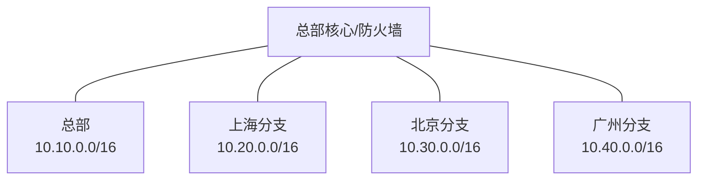
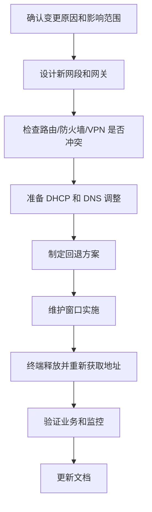

# 第 4 章：子网划分

## 4.1 本章学习目标

读完本章后，你应该能够：

- 解释为什么企业网络需要划分子网。
- 看懂 CIDR 表示法，例如 `/24`、`/26`、`/30`。
- 计算常见子网的网络地址、可用范围、广播地址。
- 根据主机数量选择合适掩码。
- 理解 VLSM 可变长子网掩码的规划思路。
- 做出简单企业地址规划。
- 识别子网划分中的常见错误。

子网划分是网络工程的基本功。它看起来像数学题，但真正目的不是计算，而是为了让网络更清晰、更安全、更容易维护。

## 4.2 为什么要划分子网

子网划分的目的不是把地址切得更复杂，而是让网络更容易管理、更安全、更稳定。

企业中常见的划分依据包括：

- 按部门划分：财务部、研发部、行政部、销售部。
- 按业务划分：办公、服务器、生产、安防、访客。
- 按安全等级划分：普通办公区、核心业务区、DMZ、管理区。
- 按地点划分：总部、分支、楼层、机房。
- 按设备类型划分：电脑、IP 电话、打印机、摄像头、AP。

如果所有终端都在一个大网段中，会带来几个问题：

- 广播范围过大，影响性能和稳定性。
- 故障范围过大，一个异常终端可能影响大量设备。
- 安全边界不清晰，难以做访问控制。
- 地址管理混乱，后期扩容困难。
- 不同业务混在一起，排错时难以判断流量来源。

例如一家企业把所有设备都放在 `192.168.1.0/24`：

```text
员工电脑、打印机、摄像头、服务器、访客 Wi-Fi 全部混用同一网段
```

短期看配置简单，长期会出现很多问题：

- 访客可能直接扫描内部服务器。
- 摄像头故障广播影响办公电脑。
- 打印机和服务器地址难以管理。
- 安全策略无法按业务边界精确控制。

更合理的方式是拆分：

```text
办公网：      10.10.10.0/24
研发网：      10.10.20.0/24
财务网：      10.10.30.0/24
服务器区：    10.10.60.0/24
访客无线：    10.10.80.0/24
网络管理：    10.10.250.0/24
```

这样每个区域都有清晰边界，后续 VLAN、网关、防火墙策略都更容易设计。

## 4.3 CIDR 表示法

CIDR 使用斜杠表示网络位长度，例如：

```text
192.168.10.0/24
10.10.20.0/23
172.16.8.0/26
```

`/24` 表示 24 位网络位，8 位主机位。主机位越多，可容纳主机越多；网络位越多，子网越小。

IPv4 总长度是 32 位，所以：

```text
主机位数量 = 32 - 网络位数量
```

例如：

```text
/24：主机位 8 位，可用主机数 2^8 - 2 = 254
/26：主机位 6 位，可用主机数 2^6 - 2 = 62
/30：主机位 2 位，可用主机数 2^2 - 2 = 2
```

常用子网规模：

| CIDR | 子网掩码 | 可用主机数 | 适合场景 |
| --- | --- | ---: | --- |
| /30 | 255.255.255.252 | 2 | 点到点链路 |
| /29 | 255.255.255.248 | 6 | 小型设备互联 |
| /28 | 255.255.255.240 | 14 | 小型管理段 |
| /27 | 255.255.255.224 | 30 | 网络设备管理、少量服务器 |
| /26 | 255.255.255.192 | 62 | 小部门、小业务区 |
| /25 | 255.255.255.128 | 126 | 中型部门 |
| /24 | 255.255.255.0 | 254 | 常规办公 VLAN |
| /23 | 255.255.254.0 | 510 | 大型终端区 |
| /22 | 255.255.252.0 | 1022 | 大型无线或终端区 |

不建议无脑给所有 VLAN 都分配 `/24`。规划时要根据当前数量、未来增长、地址连续性和路由汇总综合判断。

## 4.4 子网计算的核心思路

子网计算要回答三个问题：

1. 这个子网从哪里开始。
2. 这个子网到哪里结束。
3. 中间哪些地址可以分配给主机。

常用方法是找“块大小”。

```text
块大小 = 256 - 掩码中最后一个非 255 的数
```

例如 `/26` 的掩码是：

```text
255.255.255.192
```

最后一个非 255 的数是 `192`，所以：

```text
块大小 = 256 - 192 = 64
```

这说明子网边界每 64 个地址出现一次：

```text
0, 64, 128, 192
```

所以 `192.168.10.0/24` 划分成 `/26` 后，会得到：

```text
192.168.10.0/26
192.168.10.64/26
192.168.10.128/26
192.168.10.192/26
```

## 4.5 等长子网划分示例

假设有一个地址段：

```text
192.168.10.0/24
```

现在要划分成 4 个等大的子网。

### 第一步：确定新掩码

`/24` 要划分成 4 个子网，需要借 2 位作为新的网络位，因为：

```text
2^2 = 4
```

原来是 `/24`，借 2 位后变成：

```text
/26
```

### 第二步：计算每个子网大小

`/26` 的主机位是：

```text
32 - 26 = 6
```

每个子网地址总数：

```text
2^6 = 64
```

每个子网可用主机数：

```text
64 - 2 = 62
```

### 第三步：列出子网边界

`/26` 的块大小是 64，所以边界是：

```text
0, 64, 128, 192
```

得到的子网：

| 子网 | 网络地址 | 可用范围 | 广播地址 |
| --- | --- | --- | --- |
| 1 | 192.168.10.0/26 | 192.168.10.1 - 192.168.10.62 | 192.168.10.63 |
| 2 | 192.168.10.64/26 | 192.168.10.65 - 192.168.10.126 | 192.168.10.127 |
| 3 | 192.168.10.128/26 | 192.168.10.129 - 192.168.10.190 | 192.168.10.191 |
| 4 | 192.168.10.192/26 | 192.168.10.193 - 192.168.10.254 | 192.168.10.255 |

注意，每个子网的第一个地址是网络地址，最后一个地址是广播地址，中间才是可分配地址。

## 4.6 根据主机数量选择掩码

真实工作中更常见的问题不是“把一个网段平均分成几份”，而是：

```text
这个部门有 50 台设备，我应该给多大的网段？
```

选择掩码时，要满足：

```text
可用主机数 >= 当前设备数 + 未来增长 + 网关等保留地址
```

常见需求可以这样判断：

| 预计设备数 | 建议最小掩码 | 可用主机数 | 说明 |
| ---: | --- | ---: | --- |
| 2 | /30 | 2 | 传统点到点链路 |
| 5 | /29 | 6 | 小型互联段 |
| 10 | /28 | 14 | 少量设备 |
| 20 | /27 | 30 | 管理段、小服务器段 |
| 50 | /26 | 62 | 小部门 |
| 100 | /25 | 126 | 中型部门 |
| 200 | /24 | 254 | 常规办公网 |
| 400 | /23 | 510 | 大型终端区 |

例如财务部当前 38 台设备，预计一年内增加到 45 台，还要预留网关、打印机、备用地址。使用 `/27` 只有 30 个可用地址，不够；使用 `/26` 有 62 个可用地址，更合理。

## 4.7 VLSM 可变长子网掩码

VLSM 是 Variable Length Subnet Mask，可变长子网掩码。它允许不同子网使用不同掩码。

它适合企业真实地址规划，因为不同区域主机数量通常不同。如果所有区域都用同样大小的子网，要么浪费地址，要么不够用。

例如公司有以下需求：

| 区域 | 预计主机数 |
| --- | ---: |
| 办公网 | 200 |
| 研发网 | 100 |
| 财务网 | 40 |
| 服务器区 | 30 |
| 网络设备管理 | 20 |
| 点到点链路 | 2 |

如果统一使用 `/24`，地址浪费严重。更合理的规划：

| 区域 | 建议掩码 | 可用主机数 |
| --- | --- | ---: |
| 办公网 | /24 | 254 |
| 研发网 | /25 | 126 |
| 财务网 | /26 | 62 |
| 服务器区 | /27 | 30 |
| 网络设备管理 | /27 | 30 |
| 点到点链路 | /30 | 2 |

VLSM 的基本原则是：先分配大网段，再分配小网段。这样可以减少地址碎片。

## 4.8 VLSM 规划完整示例

假设公司拿到一个内部地址段：

```text
10.10.0.0/22
```

`/22` 总范围是：

```text
10.10.0.0 - 10.10.3.255
```

现在需要规划：

| 区域 | 预计主机数 |
| --- | ---: |
| 办公网 | 200 |
| 研发网 | 100 |
| 财务网 | 40 |
| 服务器区 | 30 |
| 管理网 | 20 |
| 互联链路 | 2 |

### 第一步：按需求从大到小排序

```text
办公网 200
研发网 100
财务网 40
服务器区 30
管理网 20
互联链路 2
```

### 第二步：选择合适掩码

```text
办公网：200 台 -> /24，可用 254
研发网：100 台 -> /25，可用 126
财务网：40 台 -> /26，可用 62
服务器区：30 台 -> /27，可用 30
管理网：20 台 -> /27，可用 30
互联链路：2 台 -> /30，可用 2
```

### 第三步：从地址段开头依次分配

| 区域 | 网段 | 可用范围 | 广播地址 |
| --- | --- | --- | --- |
| 办公网 | 10.10.0.0/24 | 10.10.0.1 - 10.10.0.254 | 10.10.0.255 |
| 研发网 | 10.10.1.0/25 | 10.10.1.1 - 10.10.1.126 | 10.10.1.127 |
| 财务网 | 10.10.1.128/26 | 10.10.1.129 - 10.10.1.190 | 10.10.1.191 |
| 服务器区 | 10.10.1.192/27 | 10.10.1.193 - 10.10.1.222 | 10.10.1.223 |
| 管理网 | 10.10.1.224/27 | 10.10.1.225 - 10.10.1.254 | 10.10.1.255 |
| 互联链路 | 10.10.2.0/30 | 10.10.2.1 - 10.10.2.2 | 10.10.2.3 |

剩余 `10.10.2.4 - 10.10.3.255` 可以留给未来扩展。

这个示例说明：VLSM 不是随便切地址，而是根据业务规模选择不同掩码，并尽量保持连续和可扩展。

## 4.9 企业地址规划方法

一个清晰的企业地址规划应该满足：

- 易读：从 IP 能大致看出地点、业务或 VLAN。
- 可汇总：同一地点或同一业务地址连续，便于路由汇总。
- 可扩展：保留未来增长空间。
- 不冲突：避免与分支、云上网络、VPN 用户本地网络冲突。
- 有文档：每个网段、网关、用途、负责人都应记录。

示例规划：

```text
10.10.0.0/16    总部园区
10.10.10.0/24   总部办公网
10.10.20.0/24   总部研发网
10.10.30.0/24   总部财务网
10.10.40.0/24   总部无线员工网
10.10.50.0/24   总部无线访客网
10.10.60.0/24   总部服务器区
10.10.250.0/24  总部网络设备管理

10.20.0.0/16    上海分支
10.30.0.0/16    北京分支
10.40.0.0/16    广州分支
```

这种规划的好处是总部可以汇总为 `10.10.0.0/16`，分支也可以按地点汇总。

可以用下面的图理解“总部和分支地址连续规划”的价值：



当地址规划连续时，路由表和防火墙对象可以更简洁。例如总部所有网段可以用 `10.10.0.0/16` 表示，而不需要写几十条零散路由。

## 4.10 VLAN 与子网的关系

在常规企业园区网中，通常一个 VLAN 对应一个 IP 子网。

| VLAN | 用途 | 网段 | 网关 |
| --- | --- | --- | --- |
| VLAN 10 | 办公网 | 10.10.10.0/24 | 10.10.10.1 |
| VLAN 20 | 研发网 | 10.10.20.0/24 | 10.10.20.1 |
| VLAN 30 | 财务网 | 10.10.30.0/24 | 10.10.30.1 |
| VLAN 60 | 服务器区 | 10.10.60.0/24 | 10.10.60.1 |
| VLAN 250 | 管理网 | 10.10.250.0/24 | 10.10.250.1 |

这种设计的好处：

- 二层广播域清晰。
- 三层网关清晰。
- DHCP 地址池清晰。
- 防火墙策略容易按网段编写。
- 排错时能从 IP 判断大致业务区域。

不建议一个 VLAN 中混用多个无规划网段，也不建议多个重要业务混在同一个网段中。虽然某些特殊场景技术上可以实现，但会显著增加排错复杂度。

## 4.11 地址规划文档应该记录什么

子网规划必须落到文档。至少记录以下字段：

| 字段 | 示例 |
| --- | --- |
| 地点 | 总部 3 楼 |
| VLAN ID | 10 |
| VLAN 名称 | Office |
| 网段 | 10.10.10.0/24 |
| 网关 | 10.10.10.1 |
| DHCP 范围 | 10.10.10.50 - 10.10.10.220 |
| 保留地址 | 10.10.10.2 - 10.10.10.49 |
| DNS | 10.10.60.53 |
| 用途 | 员工办公终端 |
| 负责人 | 网络组 |
| 备注 | 禁止访客接入 |

没有地址文档时，常见问题包括：

- 新增设备不知道用哪个地址。
- DHCP 地址池和手工地址冲突。
- 防火墙策略对象命名混乱。
- 分支和总部地址冲突。
- 故障时无法判断地址属于哪个区域。

## 4.12 常见错误

### 掩码不一致

同一 VLAN 中部分终端配置 `/24`，部分终端配置 `/23`，会导致通信行为不一致，出现单向通或部分地址不通。

示例：

```text
电脑 A：10.10.10.25/24
电脑 B：10.10.11.25/23
```

电脑 B 可能认为 `10.10.10.25` 和自己在同一大网段内，但电脑 A 不一定这样认为，通信行为会变得难以预测。

### 网关不在本网段

终端的网关必须与终端 IP 在同一三层网段中。例如：

```text
IP：192.168.10.25/24
网关：192.168.20.1
```

这个网关不在 `192.168.10.0/24` 中，终端通常无法正常访问其他网段。

### 地址冲突

两个设备使用同一 IP，会造成间歇性中断、ARP 表漂移、访问异常。

常见原因：

- DHCP 地址池包含了手工保留地址。
- 运维人员手工配置了已被占用地址。
- 虚拟机克隆后保留了相同 IP。
- 临时设备接入生产网络。

### 地址规划没有保留空间

刚上线时够用，半年后新增部门、无线终端、摄像头、门禁系统，地址不够，只能大规模调整，影响业务。

规划时建议为增长预留空间，但也不要过度浪费。例如 20 台设备的小管理网通常不需要直接给 `/24`，可以给 `/27` 或 `/26`，再在连续地址段中预留扩展空间。

### 子网边界算错

例如 `/26` 的边界是 `0, 64, 128, 192`。如果误把 `192.168.10.100/26` 当作网络地址，就是错误的。`192.168.10.100` 属于 `192.168.10.64/26`。

## 4.13 常用排查方法

当怀疑子网或地址规划问题时，可以按下面顺序检查：

1. 查看终端 IP、掩码、网关、DNS。
2. 判断终端 IP 是否属于正确业务网段。
3. 判断网关是否在终端本网段。
4. 判断目标 IP 与源 IP 是否同网段。
5. 如果同网段不通，优先查二层、ARP、VLAN。
6. 如果跨网段不通，优先查网关、路由、防火墙策略。
7. 检查是否存在地址冲突。
8. 检查 DHCP 地址池配置是否与规划一致。

常用命令：

```text
ipconfig /all        查看 Windows 地址配置
ip addr              查看 Linux 地址配置
ip route             查看 Linux 路由表
ping 网关            测试网关连通性
arp -a               查看 ARP 表
nslookup 域名         测试 DNS
```

设备侧常见检查项：

```text
查看 VLAN 是否正确
查看网关接口是否 up
查看 DHCP 地址池
查看 ARP 表
查看路由表
查看防火墙策略命中
```

## 4.14 地址规划评审方法

子网划分不只是算出网络地址和广播地址，还要经得起长期运维。企业地址规划上线前，建议做一次简单评审，确认它不会在后续 VLAN、路由、防火墙策略和监控中制造复杂度。

评审时可以按下面清单检查：

| 检查项 | 要问的问题 | 不合理示例 |
| --- | --- | --- |
| 唯一性 | 新网段是否与现有网段、云上网段、VPN 对端网段重叠 | 分支和总部都使用 `192.168.1.0/24` |
| 连续性 | 同一区域或同类业务是否尽量连续规划 | 每个楼层地址分散在多个大段 |
| 容量 | 当前和未来 1-3 年地址是否够用 | 180 人办公区只给 `/25` |
| 隔离 | 访客、摄像头、办公、服务器是否分开 | 摄像头和办公电脑混在同一网段 |
| 汇总 | 是否便于后续路由汇总 | 每个分支地址无法聚合 |
| 文档 | 是否记录 VLAN、网关、DHCP、DNS、用途 | 只有网段，没有网关和负责人 |
| 安全 | 防火墙策略是否可以按网段清楚表达 | 财务和普通办公混用一个网段 |

例如公司准备为华东区 4 个分支规划地址，可以采用连续方式：

| 分支 | 汇总块 | 办公 VLAN | 无线 VLAN | 摄像头 VLAN | 管理 VLAN |
| --- | --- | --- | --- | --- | --- |
| 上海 | `10.21.0.0/20` | `10.21.1.0/24` | `10.21.2.0/24` | `10.21.6.0/24` | `10.21.15.0/24` |
| 苏州 | `10.21.16.0/20` | `10.21.17.0/24` | `10.21.18.0/24` | `10.21.22.0/24` | `10.21.31.0/24` |
| 杭州 | `10.21.32.0/20` | `10.21.33.0/24` | `10.21.34.0/24` | `10.21.38.0/24` | `10.21.47.0/24` |
| 南京 | `10.21.48.0/20` | `10.21.49.0/24` | `10.21.50.0/24` | `10.21.54.0/24` | `10.21.63.0/24` |

这样做的好处是：分支内部有规律，区域整体也可以用 `10.21.0.0/18` 做汇总。后续做动态路由、VPN、云互联或防火墙策略时，会比随机分配地址更容易维护。

## 4.15 子网变更实施流程

地址规划一旦投入生产，调整成本通常很高。需要变更网段时，不要只修改网关 IP，而要把 DHCP、DNS、防火墙、路由、监控、终端缓存一起考虑。

一个常见变更流程如下：



变更前建议准备下面的信息：

| 项目 | 示例 |
| --- | --- |
| 原网段 | `10.10.20.0/24` |
| 新网段 | `10.10.120.0/24` |
| 网关变化 | `10.10.20.1` 改为 `10.10.120.1` |
| DHCP 范围 | `10.10.120.50 - 10.10.120.220` |
| 受影响 VLAN | VLAN 20 |
| 受影响策略 | 办公网访问 OA、DNS、打印服务器 |
| 回退方式 | 恢复 VLANIF、DHCP 地址池和防火墙对象 |

地址变更后如果用户反馈业务异常，排查时要先确认终端是否真的拿到了新地址、网关 ARP 是否正常、路由和策略对象是否已经从旧网段改到新网段。很多变更失败不是子网计算错误，而是周边系统没有同步更新。

## 4.16 练习题

1. 把 `192.168.1.0/24` 划分成 4 个等大的子网，写出每个子网的网络地址、可用范围和广播地址。
2. 某部门需要 50 个地址，应该至少使用多大的子网？
3. 某点到点链路只有两台三层设备互联，传统规划下应该使用什么掩码？
4. 公司有 5 个分支，每个分支预计不超过 200 台终端，如何用 `10.50.0.0/16` 做地址规划？
5. `192.168.10.100/26` 属于哪个子网？该子网的可用范围和广播地址是什么？
6. 为什么不建议访客 Wi-Fi 和办公电脑使用同一个网段？

参考答案：

1. 四个子网分别是 `192.168.1.0/26`、`192.168.1.64/26`、`192.168.1.128/26`、`192.168.1.192/26`。可用范围分别是 `.1-.62`、`.65-.126`、`.129-.190`、`.193-.254`。广播地址分别是 `.63`、`.127`、`.191`、`.255`。
2. 至少使用 `/26`，可用主机数 62。
3. 传统规划下使用 `/30`，可用主机数 2。
4. 可以为每个分支分配一个 `/24`，例如 `10.50.1.0/24` 到 `10.50.5.0/24`，并预留后续分支地址。也可以按区域连续规划，便于汇总。
5. `/26` 块大小为 64，`100` 落在 `64-127` 范围内，所以属于 `192.168.10.64/26`，可用范围 `192.168.10.65 - 192.168.10.126`，广播地址 `192.168.10.127`。
6. 访客终端不可控，和办公电脑混用同一网段会扩大安全风险，也不利于防火墙策略、带宽控制和故障隔离。

## 4.17 本章小结

子网划分是网络设计的基本功。不要只会计算，还要理解为什么这样划分。好的地址规划可以降低路由复杂度、安全策略复杂度和长期运维成本。实际工作中要把子网、VLAN、网关、DHCP、路由和安全策略放在一起规划，而不是孤立地计算地址范围。
