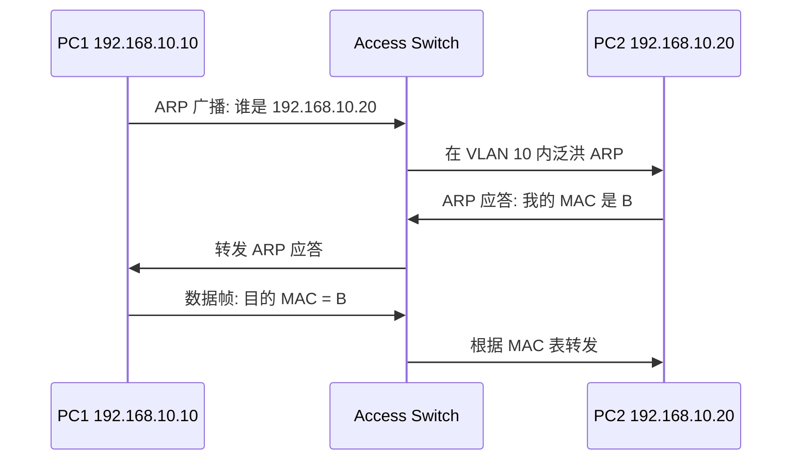
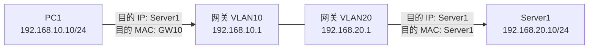
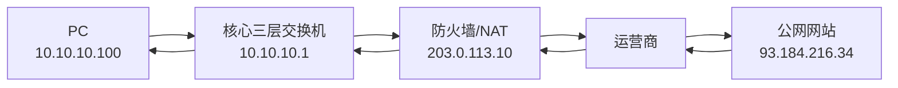
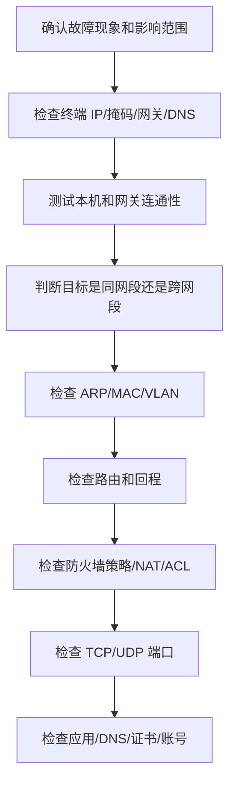

# 第 5 章：基础通信过程

## 5.1 本章学习目标

学完本章后，你应该能够：

- 解释同网段通信、跨网段通信和访问互联网的区别。
- 说明 ARP、MAC 地址、IP 地址、网关、路由、NAT、DNS 在一次访问中的作用。
- 分清数据包转发过程中哪些地址会变化，哪些地址通常不变。
- 使用 `ping`、ARP 表、路由表、端口测试和抓包逐段定位故障。
- 判断“ping 不通”“端口不通”“域名打不开”分别可能发生在哪一层。
- 根据源、目的、协议、端口、路径、策略和回程设计基础排错步骤。

本章把前面学过的 IP、子网、网关、广播域和分层模型串起来。后续学习 VLAN、三层交换、路由、防火墙、NAT、DNS、DHCP 时，都会反复回到本章的通信过程。

## 5.2 为什么要理解通信过程

网络排错的本质是判断数据包在什么位置、因为什么原因没有按预期继续前进。如果不了解通信过程，只能盲目修改配置；理解通信过程后，就可以按步骤验证。

本章从三个常见场景入手：

- 同网段通信。
- 跨网段通信。
- 访问互联网。

很多初学者排错时会直接问“是不是防火墙拦了”。防火墙确实可能拦截流量，但在此之前还要确认更基础的问题：

- 终端有没有正确 IP 地址。
- 掩码是否能正确判断目标是否在同一网段。
- 网关是否配置正确。
- ARP 是否能解析到下一跳 MAC。
- 交换机是否把终端放在正确 VLAN。
- 路由器或三层交换机是否有到目的网段的路由。
- 回程路径是否存在。
- DNS 是否把域名解析到正确 IP。
- TCP 或 UDP 端口是否真正开放。

也就是说，一次业务访问不是“电脑直接访问服务器”这么简单，而是由多层机制共同完成。


## 5.3 通信前先判断目标在哪里

终端发送数据前，第一步不是马上发包，而是根据自己的 IP 地址、子网掩码和目标 IP 判断目标是否在本地网段。

假设 PC1 的地址是：

```text
IP 地址：192.168.10.10
掩码：255.255.255.0
网关：192.168.10.1
```

PC1 访问不同目标时的判断如下：

| 目标地址 | 是否同网段 | 下一步 |
| --- | --- | --- |
| 192.168.10.20 | 是 | ARP 查询目标主机 MAC |
| 192.168.20.10 | 否 | ARP 查询网关 MAC |
| 8.8.8.8 | 否 | ARP 查询网关 MAC |

这里的关键是：终端只会在本地广播域内发送 ARP。目标如果不在本地网段，终端不会 ARP 远端服务器，而是 ARP 自己的默认网关。

如果掩码配置错误，终端对“目标是否本地”的判断就会出错。例如 PC1 错配为 `192.168.10.10/16`，它会误以为 `192.168.20.10` 和自己在同一网段，于是直接 ARP `192.168.20.10`。这个 ARP 广播无法跨 VLAN 到达对方，最终表现为跨网段不通。

## 5.4 同网段通信过程

假设两台主机：

```text
PC1：192.168.10.10/24
PC2：192.168.10.20/24
```

PC1 要访问 PC2。因为两台主机都属于 `192.168.10.0/24`，PC1 判断目标在同一网段。

通信步骤：

1. PC1 检查本地 ARP 缓存，查找 `192.168.10.20` 对应的 MAC 地址。
2. 如果没有缓存，PC1 发送 ARP 广播：“谁是 192.168.10.20？”
3. 同一 VLAN 内所有设备都会收到这个广播。
4. PC2 回应自己的 MAC 地址。
5. PC1 得到 PC2 的 MAC 地址后，封装以太网帧并发送给交换机。
6. 交换机根据目的 MAC 地址转发到 PC2 所在端口。

关键点：

- 同网段通信不需要网关参与。
- ARP 广播只在同一广播域内传播。
- 交换机根据 MAC 地址表转发。

用图表示如下：



同网段通信中的地址变化可以这样理解：

| 字段 | 请求帧中的值 |
| --- | --- |
| 源 IP | PC1 的 IP：192.168.10.10 |
| 目的 IP | PC2 的 IP：192.168.10.20 |
| 源 MAC | PC1 的 MAC |
| 目的 MAC | PC2 的 MAC |

同网段通信没有经过三层设备，所以源 MAC 和目的 MAC 就是两台终端本身。

排错验证：

```text
查看本机 IP、掩码是否正确
查看 ARP 表是否学习到对方地址
查看交换机端口 VLAN 是否一致
查看交换机 MAC 地址表是否学习正常
```

## 5.5 跨网段通信过程

假设：

```text
PC1：192.168.10.10/24，网关 192.168.10.1
Server1：192.168.20.10/24，网关 192.168.20.1
```

PC1 要访问 Server1。PC1 判断 `192.168.20.10` 不属于自己的网段，所以不能直接 ARP Server1，而是把数据交给网关。

通信步骤：

1. PC1 判断目的 IP 不在本地网段。
2. PC1 查询网关 `192.168.10.1` 的 MAC 地址。
3. PC1 把数据包的目的 IP 写为 `192.168.20.10`，目的 MAC 写为网关 MAC。
4. 网关设备收到数据后，查看路由表。
5. 如果网关知道如何到达 `192.168.20.0/24`，就继续转发。
6. Server1 收到请求后，回包给 PC1。
7. Server1 也会判断 `192.168.10.10` 不在本网段，于是把回包交给自己的网关。

关键点：

- 跨网段通信必须有三层设备参与。
- 数据包的源 IP 和目的 IP 在转发过程中通常不变。
- 每经过一跳三层设备，二层源 MAC 和目的 MAC 会变化。
- 往返路径都必须可达。

跨网段通信最容易混淆的是“目的 IP”和“目的 MAC”。PC1 访问 Server1 时，IP 层目的地址是 Server1，但二层目的 MAC 是网关。

| 字段 | PC1 发往网关时 | 网关发往 Server1 时 |
| --- | --- | --- |
| 源 IP | 192.168.10.10 | 192.168.10.10 |
| 目的 IP | 192.168.20.10 | 192.168.20.10 |
| 源 MAC | PC1 MAC | 网关 VLAN 20 接口 MAC |
| 目的 MAC | 网关 VLAN 10 接口 MAC | Server1 MAC |

这说明：三层转发过程中，IP 包继续指向最终目标；每一段链路上的二层帧只负责把数据送到下一跳。



### 回程路径同样重要

网络通信通常是双向的。客户端发出请求只是上半程，服务器回包还需要下半程。很多故障看起来像“请求没过去”，实际是“回包回不来”。

典型例子：

```text
PC1 -> Core -> Firewall -> Server
```

如果 Server 的默认网关错误，或者 Firewall 缺少回到 PC1 网段的路由，Server 可能收到请求但无法正确回包。抓包时会看到服务器侧有请求进入，却没有响应返回到客户端。

排错时要养成两个问题：

- 请求包是否到达目标。
- 响应包是否沿正确路径返回源。

## 5.6 访问互联网的通信过程

企业终端访问互联网时，会在跨网段通信基础上增加 DNS、默认路由、防火墙策略和 NAT。

假设：

```text
PC：10.10.10.100/24，网关 10.10.10.1
DNS：10.10.40.10
核心交换机默认路由：指向防火墙 10.255.0.1
防火墙公网地址：203.0.113.10
访问目标：www.example.com
```

简化步骤：

1. PC 向 DNS 查询 `www.example.com` 的 IP 地址。
2. DNS 返回公网服务器地址，例如 `93.184.216.34`。
3. PC 判断 `93.184.216.34` 不在本地网段，把流量交给默认网关。
4. 核心交换机根据默认路由把流量转发给防火墙。
5. 防火墙检查安全策略，确认内网允许访问公网 TCP 443。
6. 防火墙执行源 NAT，把 `10.10.10.100` 转换为公网地址 `203.0.113.10`。
7. 公网服务器看到来源是 `203.0.113.10`，把响应发回该公网地址。
8. 防火墙根据 NAT 会话表把回包还原给 `10.10.10.100`。



访问互联网的故障点更多，可以按下面顺序拆分：

| 阶段 | 验证目标 | 常见问题 |
| --- | --- | --- |
| 终端到网关 | `ping 10.10.10.1` | VLAN、网关、ARP、接入口问题 |
| 内网到防火墙 | 核心能否到达防火墙内侧 | 默认路由、互联地址、接口状态 |
| 防火墙策略 | 是否允许内网访问外网 | 安全策略未放行、服务端口错误 |
| NAT | 是否产生 NAT 会话 | NAT 源地址范围错误、出口地址错误 |
| 公网连通 | 能否访问公网 IP | 运营商线路、出口路由 |
| DNS | 域名能否解析 | DNS 地址错误、DNS 被阻断 |

## 5.7 ARP 工作原理

ARP 用于通过 IP 地址查询 MAC 地址。它工作在 IPv4 局域网环境中，是二层和三层之间的重要桥梁。

ARP 请求是广播：

```text
谁拥有 192.168.10.20？请告诉 192.168.10.10。
```

ARP 应答是单播：

```text
192.168.10.20 的 MAC 地址是 aa:bb:cc:dd:ee:ff。
```

常见 ARP 问题：

- 终端地址冲突导致 ARP 表来回变化。
- 网关 ARP 异常导致大量终端无法出网。
- 错误 VLAN 导致 ARP 请求无法到达目标。
- ARP 欺骗导致流量被错误转发。

ARP 表项通常有老化时间。终端和网关会缓存 ARP 结果，避免每次通信都广播查询。排错时如果怀疑地址冲突或 ARP 错误，可以查看或清理 ARP 表，再观察是否重新学习到正确 MAC。

常见验证点：

| 查看对象 | 目的 |
| --- | --- |
| 终端 ARP 表 | 是否学习到网关或目标主机 MAC |
| 网关 ARP 表 | 是否学习到终端 MAC |
| 交换机 MAC 表 | MAC 是否出现在预期端口和 VLAN |
| 日志 | 是否有 MAC 漂移、地址冲突、环路告警 |

## 5.8 ICMP 与 ping

`ping` 使用 ICMP Echo Request 和 Echo Reply 测试三层连通性。

ping 成功说明：

- 本机协议栈基本正常。
- 到目标的三层路径基本可达。
- 目标允许响应 ICMP。
- 回程路径基本可达。

ping 失败不一定说明业务不通，因为有些防火墙或服务器会禁用 ICMP。反过来，ping 成功也不代表应用一定正常，因为应用还涉及 TCP/UDP 端口、服务进程、认证和应用层逻辑。

排错时可以分段 ping：

```text
ping 本机地址
ping 网关地址
ping 同网段其他主机
ping 远端网段网关
ping 目标服务器
ping 公网地址
ping 域名
```

这种顺序可以帮助判断故障边界。

### ping 的局限

`ping` 是排错入口，不是最终结论。

| 现象 | 可能含义 |
| --- | --- |
| ping 网关失败 | 本地地址、VLAN、网关、ARP 或链路问题 |
| ping 目标 IP 失败 | 路由、策略、回程、目标主机或 ICMP 被禁用 |
| ping 公网 IP 成功但域名失败 | DNS 问题可能性较高 |
| ping 成功但业务失败 | TCP/UDP 端口、应用、证书、认证或代理问题 |

对于 Web、数据库、远程桌面等业务，还要继续验证端口。例如 HTTPS 通常要测试 TCP 443，RDP 通常要测试 TCP 3389。

## 5.9 TCP 三次握手

TCP 是面向连接的传输协议。客户端访问服务器 TCP 服务前，需要完成三次握手。

```text
1. 客户端 -> 服务器：SYN
2. 服务器 -> 客户端：SYN, ACK
3. 客户端 -> 服务器：ACK
```

三次握手成功后，双方才开始传输应用数据。

常见现象：

- 只看到 SYN，没有 SYN ACK：可能是服务器未开放端口、防火墙阻断、路由不通、回程异常。
- 看到 SYN ACK，但客户端没有 ACK：可能是回程路径、客户端防火墙或中间设备问题。
- 三次握手成功，但应用异常：问题可能在应用层、认证、证书、代理或负载均衡。

用抓包结果可以快速判断故障边界：

| 抓包现象 | 常见判断 |
| --- | --- |
| 客户端只有 SYN 发出，没有回包 | 中间阻断、服务器未监听、回程异常 |
| 服务器收到 SYN 并回 SYN ACK | 请求到达服务器，需继续看回程 |
| 三次握手完成后立刻 FIN/RST | 应用主动关闭、协议不匹配、策略重置 |
| 没有任何请求发出 | 客户端、DNS、代理或本地应用问题 |

## 5.10 UDP 通信特点

UDP 是无连接协议，不需要三次握手。DNS、DHCP、NTP、语音视频等场景经常使用 UDP。

UDP 的特点：

- 开销小。
- 延迟低。
- 不保证可靠送达。
- 应用自己处理重传或容错。

排查 UDP 问题通常比 TCP 更难，因为没有明显的握手过程。需要结合抓包、应用日志和防火墙会话日志判断。

常见 UDP 场景：

| 场景 | 端口 | 排错关注点 |
| --- | ---: | --- |
| DNS 查询 | UDP 53 | 查询是否发出、DNS 是否返回、是否被防火墙阻断 |
| DHCP 获取地址 | UDP 67/68 | Discover 是否广播、Relay 是否转发、地址池是否正确 |
| NTP 对时 | UDP 123 | 时间服务器是否可达、策略是否允许 |
| 语音视频 | 动态 UDP 端口 | NAT、策略、丢包、抖动、QoS |

## 5.11 常见端口号

| 端口 | 协议 | 服务 |
| ---: | --- | --- |
| 22 | TCP | SSH |
| 23 | TCP | Telnet |
| 25 | TCP | SMTP |
| 53 | TCP/UDP | DNS |
| 67/68 | UDP | DHCP |
| 80 | TCP | HTTP |
| 123 | UDP | NTP |
| 443 | TCP | HTTPS |
| 3389 | TCP | RDP |

防火墙策略通常至少包含源地址、目的地址、服务端口、协议、动作和日志。理解端口号是编写安全策略的基础。

端口号要结合方向理解。例如“允许访问服务器 TCP 443”通常表示：

```text
源：客户端临时端口
目的：服务器 TCP 443
方向：客户端 -> 服务器
```

回包方向并不是服务器再访问客户端 443，而是服务器从 TCP 443 回到客户端的临时端口。状态防火墙会根据会话自动允许回包；无状态 ACL 则需要更仔细地考虑方向。

## 5.12 抓包分析基础

抓包是网络工程师必须掌握的排错手段。Wireshark 常用过滤条件：

```text
ip.addr == 192.168.10.10
tcp.port == 443
udp.port == 53
icmp
arp
tcp.flags.syn == 1
```

抓包时要注意位置：

- 在客户端抓包：看请求是否发出、是否收到回应。
- 在服务器抓包：看请求是否到达服务器。
- 在防火墙抓包：看流量是否经过安全边界、是否被策略放行。
- 在交换机镜像口抓包：看二层流量和广播情况。

同一个故障，在不同位置抓包会得到不同结论。正确选择抓包点，比单纯会用过滤条件更重要。

### 抓包位置选择

| 抓包位置 | 能回答的问题 | 不能直接回答的问题 |
| --- | --- | --- |
| 客户端 | 请求是否发出、是否收到响应 | 中间设备是否放行 |
| 网关 | 流量是否离开本 VLAN | 服务器应用是否正常 |
| 防火墙 | 策略、NAT、会话是否命中 | 接入层 VLAN 是否正确 |
| 服务器 | 请求是否到达服务端 | 客户端侧是否收到回包 |

抓包分析时不要只看一个包，要看完整来回过程。对于 TCP，至少看 SYN、SYN ACK、ACK；对于 DNS，至少看 Query 和 Response；对于 DHCP，至少看 Discover、Offer、Request、Ack。

## 5.13 企业场景：员工访问内部 OA

假设企业内部 OA 服务器位于服务器 VLAN：

```text
员工 PC：10.10.10.25/24，网关 10.10.10.1
DNS：10.10.40.10
OA 域名：oa.example.local
OA 服务器：10.10.40.20/24，网关 10.10.40.1
核心交换机：VLANIF 10 和 VLANIF 40
```

访问过程：

1. PC 查询 `oa.example.local`。
2. DNS 返回 `10.10.40.20`。
3. PC 判断 OA 服务器不在本地网段。
4. PC ARP 网关 `10.10.10.1`。
5. PC 把 HTTPS 请求发给网关。
6. 核心交换机从 VLAN 10 路由到 VLAN 40。
7. OA 服务器收到请求并回包给自己的网关 `10.10.40.1`。
8. 核心交换机把回包转回 VLAN 10。

验证路径：

```text
PC 能否 ping 10.10.10.1
PC 能否解析 oa.example.local
PC 能否 ping 10.10.40.20
PC 能否访问 TCP 443
核心交换机是否有 10.10.10.0/24 和 10.10.40.0/24 直连路由
服务器默认网关是否为 10.10.40.1
是否有 ACL 或防火墙策略阻断
```

这个场景说明：域名、路由、网关、端口、应用任何一环异常，都可能表现为“OA 打不开”。

## 5.14 分层排错流程

下面是一套适合初学者的基础排错流程：



排错记录建议包含：

| 项目 | 示例 |
| --- | --- |
| 源地址 | 10.10.10.25 |
| 目的地址 | 10.10.40.20 |
| 协议端口 | TCP 443 |
| 故障时间 | 2026-06-07 09:30 |
| 影响范围 | 财务部 3 台电脑 |
| 已验证内容 | 能 ping 网关，不能访问 OA TCP 443 |
| 初步边界 | 三层可达，疑似端口或策略问题 |

## 5.15 从抓包看完整通信

抓包不是只给高级工程师使用的工具。初学者只要能看懂少数关键字段，就能把“猜测”变成“证据”。以 PC 访问 `https://oa.example.local` 为例，抓包中通常会看到下面几个阶段。

| 阶段 | 典型报文 | 说明 |
| --- | --- | --- |
| DNS 查询 | PC -> DNS，查询 `oa.example.local` | 把域名解析成服务器 IP |
| ARP 网关 | PC 广播询问 `10.10.10.1` 的 MAC | 跨网段访问时先找到网关 MAC |
| TCP 握手 | SYN, SYN ACK, ACK | 建立到服务器 TCP 443 的连接 |
| TLS 握手 | Client Hello, Server Hello | HTTPS 加密协商 |
| 应用数据 | TCP 443 数据流 | 真正传输 OA 页面和接口数据 |

关键字段要这样理解：

| 字段 | 同网段访问 | 跨网段访问 |
| --- | --- | --- |
| 源 IP | PC IP | PC IP |
| 目的 IP | 目标主机 IP | 目标服务器 IP |
| 源 MAC | PC MAC | PC MAC |
| 目的 MAC | 目标主机 MAC | 网关 MAC |

这说明一个重要原则：IP 地址表达最终通信对象，MAC 地址只表达当前这一跳的二层交付对象。跨网段访问时，PC 的目的 IP 仍然是服务器，但第一跳目的 MAC 是网关。

常见抓包现象和判断：

| 抓包现象 | 可能说明 |
| --- | --- |
| 不断 ARP 网关但没有回应 | 网关不通、VLAN 错误、网关接口 down |
| DNS 查询没有响应 | DNS 服务器不可达或策略阻断 |
| 只有 SYN，没有 SYN ACK | 服务器端口未开放、路径阻断、策略丢弃 |
| 有 SYN ACK，但客户端反复重传 | 回程路径异常或中间设备丢包 |
| TCP 建立后应用报错 | 网络层可能正常，继续查应用、证书、账号 |

抓包位置也很关键。如果只在 PC 上抓包，只能看到 PC 是否发出了报文以及是否收到回应；如果在服务器侧抓包，可以判断请求是否到达服务器；如果在防火墙两侧同时抓包，可以判断策略或 NAT 是否改变了流量。

## 5.16 常见边界判断矩阵

排错时最重要的是判断问题停在哪个边界。下面的矩阵可以作为初学者的快速参考。

| 测试结果 | 初步判断 | 下一步 |
| --- | --- | --- |
| ping 本机 `127.0.0.1` 不通 | 本机协议栈异常 | 检查系统网络服务 |
| ping 本机 IP 不通 | 本机地址或防火墙异常 | 检查 IP 配置和本机防火墙 |
| ping 网关不通 | 接入、VLAN、ARP、网关异常 | 查网线、端口 VLAN、网关接口 |
| ping 目标 IP 不通，但网关通 | 路由、策略、回程异常 | 查路径设备和回程路由 |
| ping 目标 IP 通，TCP 端口不通 | 端口、ACL、防火墙、服务监听异常 | 测试端口并查策略命中 |
| TCP 端口通，应用仍异常 | 应用层问题概率增大 | 查日志、证书、账号、URL |
| IP 可访问，域名不可访问 | DNS 异常 | 查解析结果和 DNS 服务器 |

需要注意，`ping` 使用 ICMP，业务可能使用 TCP 或 UDP。企业防火墙可能允许 TCP 443，但禁止 ICMP；也可能允许 ping，但禁止业务端口。因此“ping 通”不等于业务一定通，“ping 不通”也不一定代表业务完全不通。排错记录必须写明协议和端口。

## 5.17 本章自检

请尝试回答：

- PC 访问同网段主机时，为什么不需要默认网关。
- PC 访问跨网段服务器时，目的 MAC 为什么是网关 MAC。
- 为什么“请求到达服务器”不代表客户端一定能收到响应。
- ping 公网 IP 成功但 ping 域名失败，优先检查什么。
- TCP 抓包只有 SYN 没有 SYN ACK，可能有哪些原因。
- 企业终端访问互联网时，NAT 发生在哪个设备上，为什么需要 NAT。

练习：

```text
PC：10.10.20.50/24，网关 10.10.20.1
Server：10.10.40.20/24，网关 10.10.40.1
DNS：10.10.40.10
```

1. 画出 PC 访问 Server TCP 443 的路径。
2. 写出 PC 发出第一跳数据帧时的源 IP、目的 IP、源 MAC、目的 MAC。
3. 列出至少 6 个验证点，用于排查 PC 无法访问 Server 的问题。

## 5.18 本章小结

同网段通信依赖 ARP 和交换机二层转发；跨网段通信依赖网关和路由；业务访问还要经过 TCP/UDP 端口和应用层处理。排错时要围绕“源、目的、协议、端口、路径、策略、回程”逐项验证。
