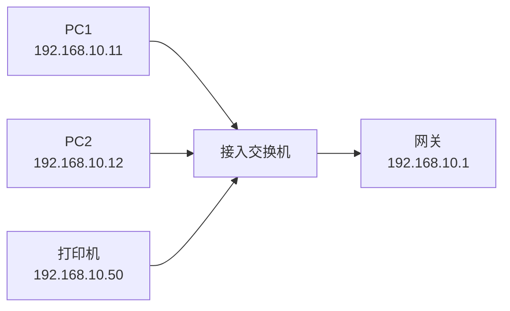
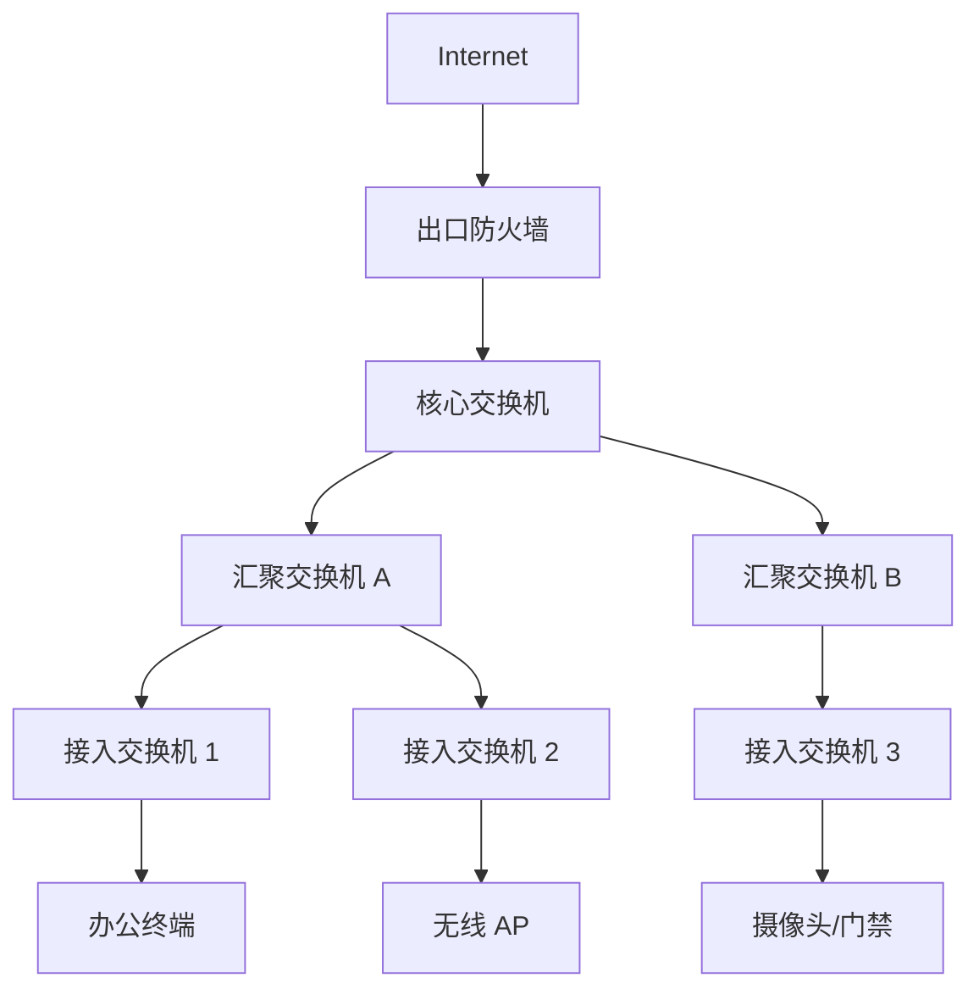
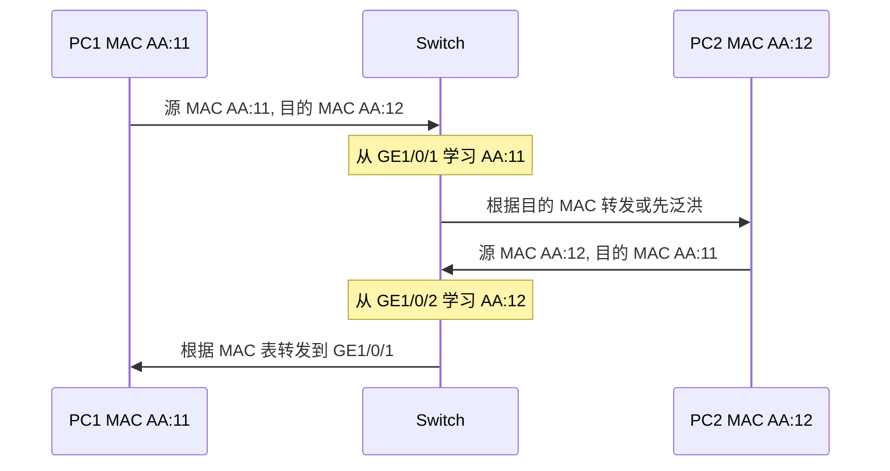
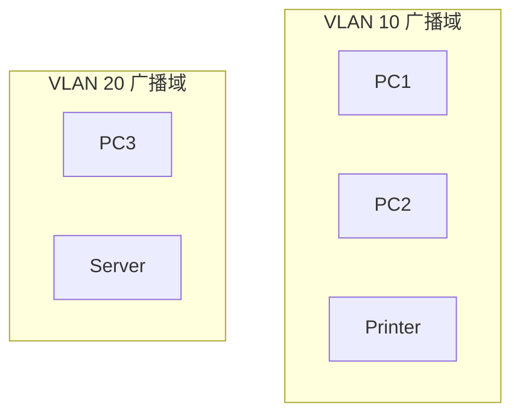
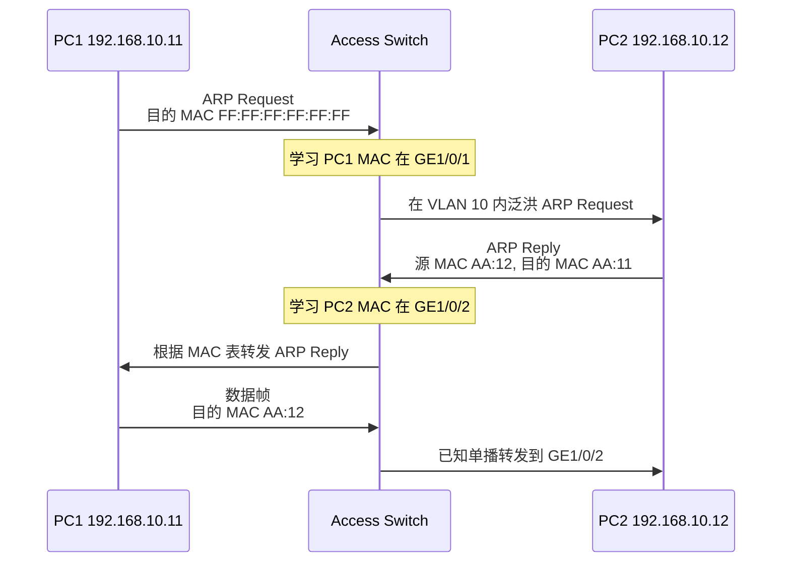
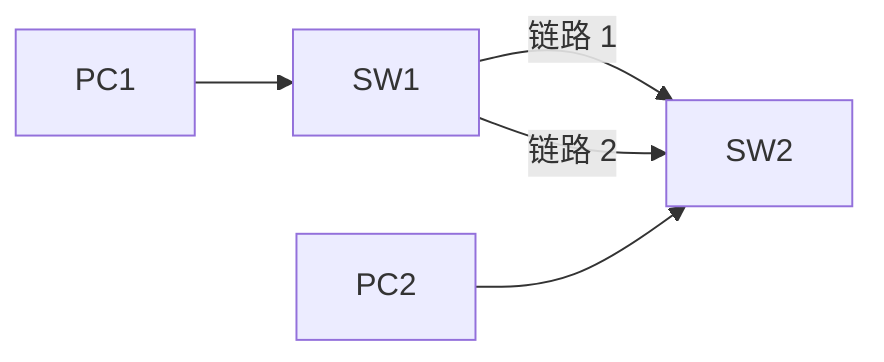
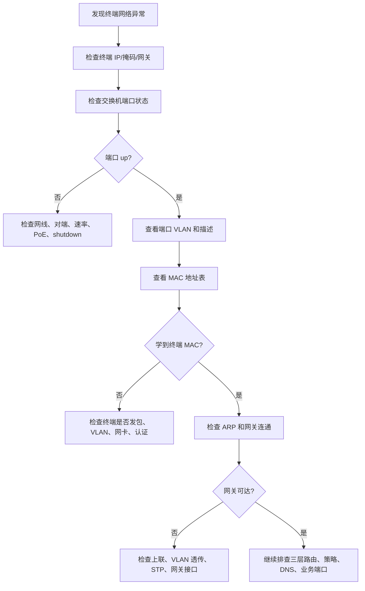

# 第 6 章：交换机基础

## 6.1 学习目标

学完本章后，你应该能够：

- 解释交换机在企业局域网中的位置和作用。
- 区分交换机、集线器、路由器、防火墙的基础职责。
- 理解以太网帧、MAC 地址、交换机端口、MAC 地址表、广播、泛洪、转发和丢弃的含义。
- 说明交换机如何通过源 MAC 学习和目的 MAC 查表完成二层转发。
- 理解未知单播、广播、多播在交换网络中的基本处理方式。
- 理解冲突域、广播域、全双工、速率协商、端口 up/down、环路等基础概念。
- 看懂一张基础交换网络拓扑，并判断终端接入、上联、服务器接入和管理口的区别。
- 能够设计一个小型企业接入交换网络的基础端口规划和管理地址规划。
- 能够使用端口状态、MAC 地址表、ARP 表、连通性测试和日志定位常见二层故障。

第 5 章已经把同网段通信、跨网段通信、ARP、MAC 地址和网关串在一起。本章开始进入交换机技术。后续第 7 章 VLAN、第 8 章 STP、第 9 章链路聚合、第 10 章三层交换，都建立在本章的二层交换基础之上。

初学者容易把交换机理解成“插网线的盒子”。这个说法不算错，但太浅。企业交换机不仅负责把终端接入网络，还承担 VLAN 划分、上联汇聚、环路保护、链路冗余、管理访问、日志监控、安全接入等职责。理解交换机，是理解企业园区网的第一步。

## 6.2 为什么需要交换机

企业里有大量终端需要接入网络：

- 办公电脑。
- IP 电话。
- 打印机。
- 无线 AP。
- 摄像头。
- 门禁设备。
- 服务器。
- 运维管理终端。
- 工控或专用业务设备。

这些设备不可能都直接连接到路由器或防火墙。路由器和防火墙通常负责不同网络之间的三层转发、安全控制和出口连接，而大量终端接入需要依赖交换机。

交换机解决的核心问题是：

```text
在同一个二层网络中，根据 MAC 地址把以太网帧转发到正确端口。
```

一个最简单的办公室网络可以这样表示：



PC1 访问 PC2 或打印机时，交换机根据目的 MAC 地址转发。PC1 访问其他网段或互联网时，交换机把帧送到网关，再由网关进行三层转发。

### 没有交换机会怎样

如果没有交换机，终端之间只能点到点连接，或者使用早期的集线器。点到点连接无法扩展，集线器又无法智能转发，只会把收到的信号复制到所有端口。

交换机相比集线器的价值在于：

| 对比项 | 集线器 | 交换机 |
| --- | --- | --- |
| 工作方式 | 收到信号后复制到所有端口 | 根据 MAC 地址表选择端口转发 |
| 冲突 | 所有端口共享冲突域 | 每个端口通常是独立冲突域 |
| 双工 | 常见半双工 | 常见全双工 |
| 性能 | 所有设备共享带宽 | 每个端口可独立转发 |
| 安全性 | 所有设备更容易看到彼此流量 | 单播流量通常只转发到目标端口 |
| 企业使用 | 基本淘汰 | 主流接入设备 |

今天的企业网络几乎不会使用集线器，但学习集线器有助于理解交换机为什么重要：交换机把“所有人共享一条路”变成“根据地址选择正确出口”。

## 6.3 交换机在企业网络中的位置

企业园区网通常分为接入层、汇聚层和核心层。不同规模的网络层次可能合并，但思想类似。



### 接入层交换机

接入层交换机直接连接终端，是最常见、数量最多的交换机。

常见职责：

- 给 PC、打印机、IP 电话、AP、摄像头提供网口。
- 把终端放入正确 VLAN。
- 通过上联口连接汇聚或核心交换机。
- 执行基础接入安全，如端口安全、DHCP Snooping、风暴控制。
- 提供 PoE 给 AP、IP 电话、摄像头供电。

接入层常见故障也最多，例如终端插错口、端口被关闭、VLAN 配错、网线问题、环路、PoE 供电不足等。

### 汇聚层交换机

汇聚层位于接入层和核心层之间，负责汇总多个接入交换机的流量。

常见职责：

- 汇总楼层或区域接入交换机。
- 提供上联冗余。
- 运行 STP、链路聚合或三层上联。
- 在中大型网络中作为策略、汇总、路由边界。

小型网络可能没有独立汇聚层，接入交换机直接上联核心交换机。

### 核心交换机

核心交换机是园区网内部高速转发中心。它通常连接服务器区、防火墙、汇聚交换机、出口设备和数据中心边界。

常见职责：

- 承载大量内部流量转发。
- 提供 VLAN 网关或三层交换。
- 连接出口防火墙、路由器、服务器区。
- 与动态路由协议、链路聚合、堆叠或虚拟化技术配合。

核心层追求稳定、冗余和高性能。不要把大量普通终端随意接入核心交换机，也不要在核心上做没有必要的频繁变更。

## 6.4 交换机、路由器、防火墙的分工

初学网络时，经常会混淆这些设备。可以先按主要职责区分。

| 设备 | 主要职责 | 典型依据 | 常见位置 |
| --- | --- | --- | --- |
| 二层交换机 | 同一 VLAN 内转发以太网帧 | MAC 地址表 | 接入层、汇聚层 |
| 三层交换机 | VLAN 间高速转发 | 路由表和 ARP 表 | 核心层、汇聚层 |
| 路由器 | 不同网络之间选择路径 | 路由表 | 广域网、分支、运营商边界 |
| 防火墙 | 控制不同安全区域之间的访问 | 路由、策略、会话、NAT | 出口、服务器区、VPN 边界 |

一句话理解：

```text
交换机解决“同一个局域网里怎么转发”。
路由器解决“去不同网络应该走哪条路”。
防火墙解决“这条访问是否被允许”。
```

很多企业设备功能会重叠。例如三层交换机也会路由，防火墙也会路由，有些路由器也有交换模块。但排错时仍要先问：

- 当前流量是否在同一个 VLAN 内？
- 是否需要跨网段？
- 是否经过安全边界？
- 当前设备在这条路径上负责二层转发、三层路由，还是安全策略？

只有先分清职责，才不会在错误设备上排错。

## 6.5 以太网帧基础

交换机处理的是以太网帧。理解交换机，必须先知道帧里有哪些关键字段。

一个简化的以太网帧可以这样理解：

| 字段 | 作用 | 示例 |
| --- | --- | --- |
| 目的 MAC | 这帧要交给哪个二层目标 | `00:11:22:33:44:55` |
| 源 MAC | 这帧从哪个二层设备发出 | `AA:BB:CC:DD:EE:FF` |
| 类型 | 上层协议类型 | IPv4、ARP、IPv6 |
| 数据 | 承载的上层内容 | IP 包、ARP 报文等 |
| FCS | 帧校验序列 | 用于检测帧错误 |

交换机最关心的是源 MAC 和目的 MAC。

```text
源 MAC 用来学习：这个 MAC 在哪个端口后面。
目的 MAC 用来转发：这帧应该从哪个端口发出去。
```

### MAC 地址是什么

MAC 地址是网卡或网络接口的二层地址，通常写成 48 位十六进制格式，例如：

```text
00-1A-2B-3C-4D-5E
00:1A:2B:3C:4D:5E
001A-2B3C-4D5E
```

不同厂商设备显示格式不同，但含义一样。

MAC 地址常见类型：

| 类型 | 说明 | 示例 |
| --- | --- | --- |
| 单播 MAC | 标识一块具体网卡或接口 | PC、服务器、交换机接口 |
| 广播 MAC | 发送给同一广播域内所有设备 | `FF:FF:FF:FF:FF:FF` |
| 多播 MAC | 发送给一组设备 | IPv4 多播映射的 MAC |

交换机不是根据 IP 地址转发二层帧，而是根据 MAC 地址转发。IP 地址与 MAC 地址之间的对应关系，通常由 ARP 负责建立。

## 6.6 MAC 地址表

MAC 地址表是交换机进行二层转发的核心表项。它记录：

```text
某个 MAC 地址，是从哪个 VLAN、哪个端口学习到的。
```

示例 MAC 地址表：

| VLAN | MAC 地址 | 端口 | 类型 |
| --- | --- | --- | --- |
| 10 | `AA:AA:AA:AA:AA:11` | `GE1/0/1` | 动态 |
| 10 | `AA:AA:AA:AA:AA:12` | `GE1/0/2` | 动态 |
| 20 | `BB:BB:BB:BB:BB:21` | `GE1/0/10` | 动态 |
| 99 | `CC:CC:CC:CC:CC:01` | `GE1/0/48` | 动态 |

这张表可以读成：

- VLAN 10 里的 `AA:AA:AA:AA:AA:11` 在 `GE1/0/1` 后面。
- VLAN 10 里的 `AA:AA:AA:AA:AA:12` 在 `GE1/0/2` 后面。
- VLAN 20 里的 `BB:BB:BB:BB:BB:21` 在 `GE1/0/10` 后面。
- VLAN 99 里的 `CC:CC:CC:CC:CC:01` 从上联口 `GE1/0/48` 学到。

注意，MAC 地址表通常要结合 VLAN 一起看。同一个 MAC 地址在不同 VLAN 中属于不同二层转发范围。第 7 章会详细讲 VLAN，这里先记住：交换机不是维护一张“全网唯一的 MAC 表”那么简单，而是在每个 VLAN 的二层范围内转发。

### 动态 MAC 和静态 MAC

MAC 地址表项常见有两类：

| 类型 | 产生方式 | 常见用途 |
| --- | --- | --- |
| 动态 MAC | 交换机根据收到帧的源 MAC 自动学习 | 绝大多数终端 |
| 静态 MAC | 管理员手工绑定 | 特殊安全场景、固定设备 |

日常企业网络主要依赖动态 MAC 学习。静态 MAC 配置错误会造成流量无法按预期转发，所以除非有明确需求，不建议初学阶段随意配置。

### MAC 地址老化

动态 MAC 表项不会永久存在。交换机会设置老化时间，例如 300 秒。某个 MAC 在一段时间内没有新的帧进入，交换机就会删除这条表项。

老化机制的意义是：

- 终端移动到其他端口后，交换机可以重新学习。
- 长时间离线的设备不会一直占用表项。
- 拓扑变化后，旧路径信息会被清理。

如果老化时间过短，交换机可能频繁泛洪未知单播；如果过长，终端移动后旧表项可能保留太久。通常使用厂商默认值即可。

## 6.7 交换机如何学习 MAC 地址

交换机学习 MAC 地址时看的是收到帧的源 MAC。

假设 PC1 连接 `GE1/0/1`，PC2 连接 `GE1/0/2`，两台设备在 VLAN 10。

```text
PC1 MAC：AA:AA:AA:AA:AA:11
PC2 MAC：AA:AA:AA:AA:AA:12
```

当 PC1 发出任意以太网帧时，交换机从 `GE1/0/1` 收到这帧。帧中源 MAC 是 `AA:AA:AA:AA:AA:11`。交换机就记录：

```text
VLAN 10 的 AA:AA:AA:AA:AA:11 在 GE1/0/1 后面。
```

当 PC2 发出帧时，交换机记录：

```text
VLAN 10 的 AA:AA:AA:AA:AA:12 在 GE1/0/2 后面。
```

这个过程不需要管理员手工告诉交换机“谁在哪个端口”。交换机会从流量中自动学习。



### 交换机不会学习目的 MAC

交换机不会因为看到目的 MAC 就认为这个 MAC 在某个端口后面。它只根据源 MAC 学习位置。

原因很简单：收到帧的端口只能说明“发送者从这里来”，不能说明“目的设备在这里”。目的 MAC 可能在其他端口，也可能暂时不存在。

这个细节对排错很重要。如果某台终端从不发送任何帧，交换机可能无法学习到它的 MAC。此时别人访问它时，交换机可能先进行未知单播泛洪。

## 6.8 交换机的三种基础动作

交换机收到帧后，一般会做三类动作：转发、泛洪、丢弃。

### 转发

如果交换机在 MAC 地址表中找到了目的 MAC 对应的端口，就把帧从该端口发出去。

示例：

| VLAN | 目的 MAC | MAC 表中端口 | 动作 |
| --- | --- | --- | --- |
| 10 | `AA:AA:AA:AA:AA:12` | `GE1/0/2` | 从 `GE1/0/2` 转发 |

这就是正常单播转发。交换机不会把这帧发给其他无关端口。

### 泛洪

如果交换机不知道目的 MAC 在哪里，就会在同一 VLAN 内除入端口外的其他端口发送这帧。这个动作叫泛洪。

需要泛洪的常见帧：

| 类型 | 目的 MAC | 为什么泛洪 |
| --- | --- | --- |
| 广播帧 | `FF:FF:FF:FF:FF:FF` | 本来就要给广播域内所有设备 |
| 未知单播 | 普通单播 MAC | MAC 表中没有目的 MAC |
| 部分多播 | 多播 MAC | 没有多播控制时按类似广播处理 |

ARP 请求就是典型广播。PC1 不知道 PC2 的 MAC 时，会发送：

```text
谁是 192.168.10.20？请告诉 192.168.10.10。
```

这个 ARP 请求的目的 MAC 是广播 MAC，所以交换机会在 VLAN 10 内泛洪。

### 丢弃

交换机在某些情况下会丢弃帧：

- 目的 MAC 所在端口就是入端口，说明没有必要再转发回去。
- 帧校验错误。
- 端口被安全策略限制。
- VLAN 不允许通过该端口。
- STP 把端口置为阻塞状态。
- 风暴控制、端口安全、ACL 等功能触发。

丢弃并不一定意味着设备故障。很多丢弃是正常保护行为。排错时要结合端口状态、日志、计数器和配置判断。

## 6.9 已知单播转发示例

假设三台设备都在 VLAN 10：

| 设备 | IP 地址 | MAC 地址 | 交换机端口 |
| --- | --- | --- | --- |
| PC1 | `192.168.10.11/24` | `AA:AA:AA:AA:AA:11` | `GE1/0/1` |
| PC2 | `192.168.10.12/24` | `AA:AA:AA:AA:AA:12` | `GE1/0/2` |
| Printer | `192.168.10.50/24` | `AA:AA:AA:AA:AA:50` | `GE1/0/3` |

交换机已经学习到：

| VLAN | MAC 地址 | 端口 |
| --- | --- | --- |
| 10 | `AA:AA:AA:AA:AA:11` | `GE1/0/1` |
| 10 | `AA:AA:AA:AA:AA:12` | `GE1/0/2` |
| 10 | `AA:AA:AA:AA:AA:50` | `GE1/0/3` |

PC1 发送给 PC2 的帧：

```text
源 MAC：AA:AA:AA:AA:AA:11
目的 MAC：AA:AA:AA:AA:AA:12
```

交换机处理过程：

1. 从 `GE1/0/1` 收到帧。
2. 根据源 MAC 确认 `AA:AA:AA:AA:AA:11` 在 `GE1/0/1`。
3. 查找目的 MAC `AA:AA:AA:AA:AA:12`。
4. 发现目的 MAC 在 `GE1/0/2`。
5. 只从 `GE1/0/2` 转发，不发给 `GE1/0/3`。

这就是交换机比集线器更高效的原因。PC1 和 PC2 的单播通信不会打扰打印机。

## 6.10 未知单播和广播

未知单播和广播是二层网络中非常重要的概念。

### 未知单播

未知单播是目的 MAC 是单播地址，但交换机暂时不知道它在哪个端口。

例如 PC1 第一次访问 PC2，交换机还没有学习到 PC2 的 MAC。PC1 发出的数据帧目的 MAC 是 PC2，但交换机 MAC 表中没有 PC2。此时交换机会在同一 VLAN 内泛洪这帧。

未知单播常见原因：

- 目标设备刚上线，交换机尚未学习。
- MAC 表项老化。
- 单向流量导致目标设备很少发送帧。
- 拓扑变化后旧表项被清除。
- 交换机 MAC 表容量不足或异常。

少量未知单播是正常现象。大量未知单播会增加同一 VLAN 内的无关流量，严重时影响性能。

### 广播

广播是发送给同一广播域内所有设备的帧，目的 MAC 为：

```text
FF:FF:FF:FF:FF:FF
```

常见广播包括：

| 协议或行为 | 广播原因 |
| --- | --- |
| ARP 请求 | 查询某个 IP 对应的 MAC |
| DHCP Discover | 客户端还没有 IP，需要寻找 DHCP 服务器 |
| 某些发现协议 | 在局域网内寻找服务或邻居 |

广播是局域网正常工作需要的机制，但广播不能无限扩大。一个 VLAN 越大，广播影响范围越大。后续 VLAN 章节会讲如何通过 VLAN 划分广播域。

### 广播域

广播域是广播帧能够到达的范围。默认情况下，同一个 VLAN 就是一个广播域。



VLAN 10 内的 ARP 广播不会进入 VLAN 20。除非有三层设备转发 IP 包，否则不同 VLAN 之间不能直接二层通信。

## 6.11 冲突域、双工和速率

早期以太网中，多台设备共享介质，可能同时发送信号而产生冲突。现在交换机端口通常是点到点连接，且使用全双工，冲突已经很少见，但相关概念仍然影响故障判断。

### 冲突域

冲突域是可能发生以太网冲突的范围。

| 设备或连接方式 | 冲突域特点 |
| --- | --- |
| 集线器 | 所有端口共享一个冲突域 |
| 交换机 | 每个端口通常是独立冲突域 |
| 全双工链路 | 不应该有传统冲突 |

如果在现代交换机端口上看到大量 collision，通常要怀疑：

- 端口双工不匹配。
- 对端设备老旧或配置固定半双工。
- 线缆或接口异常。

### 半双工和全双工

| 双工模式 | 含义 | 企业常见程度 |
| --- | --- | --- |
| 半双工 | 同一时间只能发送或接收 | 很少见 |
| 全双工 | 同一时间可发送和接收 | 主流 |

现代交换机、服务器、PC、AP 通常都使用全双工。双工不匹配会导致严重性能问题，表现为：

- ping 基本通，但业务很慢。
- 大文件传输吞吐低。
- 接口 CRC、late collision、input error 增加。
- 用户描述“时好时坏”。

### 速率协商

交换机端口常见速率：

| 速率 | 常见场景 |
| --- | --- |
| 100 Mbps | 老旧终端、部分摄像头、打印机 |
| 1 Gbps | 普通办公终端、AP、接入上联 |
| 10 Gbps | 服务器、汇聚上联、核心互联 |
| 25/40/100 Gbps | 数据中心、核心高速互联 |

端口通常支持自动协商。工程中推荐两端都自动协商，或两端都固定相同速率和双工。最容易出问题的是一端自动、一端固定，尤其是老设备场景。

## 6.12 交换机端口类型和角色

这里的“端口类型”先按工程用途理解，不深入 VLAN 细节。VLAN 相关 access、trunk、hybrid 会在第 7 章展开。

### 终端接入口

终端接入口连接 PC、打印机、IP 电话、摄像头等单个或少量终端。

特点：

- 通常属于某个业务 VLAN。
- 一般不允许随意连接交换机。
- 可以启用端口安全、BPDU 防护、风暴控制。
- 端口描述应写清楚房间、工位或设备用途。

示例规划：

| 端口 | 用途 | VLAN | 说明 |
| --- | --- | --- | --- |
| `GE1/0/1` | 财务 PC | 10 | 财务办公区 |
| `GE1/0/2` | 财务打印机 | 10 | 财务打印 |
| `GE1/0/3` | IP 电话 | 30 | 语音 VLAN |
| `GE1/0/4` | 摄像头 | 60 | 安防 VLAN |

### 上联口

上联口连接上级交换机、汇聚交换机或核心交换机。

特点：

- 通常承载多个 VLAN。
- 带宽要求更高。
- 常与链路聚合、STP、冗余设计相关。
- 配置错误影响范围大。

示例：

| 端口 | 连接对象 | 说明 |
| --- | --- | --- |
| `GE1/0/47` | 汇聚交换机 A | 主上联 |
| `GE1/0/48` | 汇聚交换机 B | 备上联或双上联 |

上联口不能像普通终端口一样随意配置。尤其在多 VLAN、STP、链路聚合场景中，上联口错误可能导致一整层楼或一整片区域故障。

### 服务器接入口

服务器可能连接接入交换机，也可能直接连接核心或数据中心交换机。

特点：

- 对稳定性和带宽要求更高。
- 可能使用双网卡、链路聚合或多交换机冗余。
- 可能承载多个业务 VLAN 或管理 VLAN。
- 需要与服务器网卡、虚拟化平台配置一致。

服务器端口排错时，不仅要看交换机，还要看服务器网卡绑定、虚拟交换机、VLAN Tag、操作系统防火墙和业务服务状态。

### 管理口和管理 VLAN

交换机需要被管理员远程登录、监控和备份配置。常见方式是给交换机配置管理 IP。

示例：

| 设备 | 管理 VLAN | 管理 IP | 网关 |
| --- | --- | --- | --- |
| `SW-ACC-01` | 99 | `10.10.99.11/24` | `10.10.99.1` |
| `SW-ACC-02` | 99 | `10.10.99.12/24` | `10.10.99.1` |
| `SW-DIST-01` | 99 | `10.10.99.2/24` | `10.10.99.1` |

管理网络要尽量独立，不建议把交换机管理 IP 放在普通办公 VLAN。后续安全章节会继续讲管理区访问控制。

## 6.13 二层交换转发完整过程

以同网段通信为例，PC1 访问 PC2：

| 对象 | IP 地址 | MAC 地址 | 端口 | VLAN |
| --- | --- | --- | --- | --- |
| PC1 | `192.168.10.11/24` | `AA:AA:AA:AA:AA:11` | `GE1/0/1` | 10 |
| PC2 | `192.168.10.12/24` | `AA:AA:AA:AA:AA:12` | `GE1/0/2` | 10 |
| 网关 | `192.168.10.1/24` | `AA:AA:AA:AA:AA:01` | 上联方向 | 10 |

PC1 第一次访问 PC2 时，一般先发生 ARP：



这个过程可以拆成几个关键点：

1. PC1 根据 IP 和掩码判断 PC2 在同一网段。
2. PC1 不需要把数据交给网关。
3. PC1 先用 ARP 获取 PC2 的 MAC。
4. 交换机通过 ARP 请求学习 PC1 的 MAC。
5. 交换机通过 ARP 应答学习 PC2 的 MAC。
6. 后续数据帧变成已知单播，交换机只发往 PC2 端口。

如果 PC1 访问网关或其他网段，交换机仍然只看二层 MAC。不同的是 PC1 的目的 MAC 会变成网关 MAC，而不是远端服务器 MAC。

## 6.14 交换机与 ARP 的关系

很多初学者会把 MAC 地址表和 ARP 表混在一起。它们都和 MAC 有关，但属于不同设备、不同层次。

| 表项 | 位于哪里 | 记录什么 | 用途 |
| --- | --- | --- | --- |
| MAC 地址表 | 交换机 | MAC 在哪个 VLAN、哪个端口 | 二层转发 |
| ARP 表 | 终端或三层设备 | IP 对应哪个 MAC | IP 到以太网封装 |

例如 PC1 访问 PC2：

- PC1 的 ARP 表记录：`192.168.10.12 -> AA:AA:AA:AA:AA:12`。
- 交换机的 MAC 表记录：`AA:AA:AA:AA:AA:12 -> GE1/0/2`。

这两个信息共同完成同网段通信：

```text
PC1 先用 ARP 知道目的 MAC。
交换机再用 MAC 地址表知道目的端口。
```

如果 ARP 表没有目标 MAC，终端不知道帧该写哪个目的 MAC。如果交换机 MAC 表没有目标 MAC，交换机会先泛洪，直到学习到目标位置。

排错时常见组合：

| 现象 | 可能含义 |
| --- | --- |
| 终端 ARP 学不到网关 | 终端到网关所在二层不通 |
| 交换机学不到终端 MAC | 终端未发帧、端口/VLAN/链路异常 |
| 交换机 MAC 表端口错误 | 终端移动、环路、MAC 漂移、错误接线 |
| ARP 正常但业务不通 | 可能是三层路由、策略、主机防火墙或服务问题 |

## 6.15 交换网络中的环路

交换网络最危险的基础问题之一是二层环路。环路通常来自错误接线或冗余链路没有正确控制。

### 环路为什么危险

以太网帧没有像 IP 包那样的 TTL 字段。IP 包在三层转发时有 TTL，每经过一跳会递减，最终可以被丢弃。二层帧在交换环路中可能被不断复制和转发。

假设两台交换机之间接了两条普通链路，没有 STP 或链路聚合控制：



如果 PC1 发送广播帧，SW1 会从两条链路转发给 SW2，SW2 又可能把帧从另一条链路发回 SW1，形成循环。

环路可能导致：

- 广播风暴，交换机 CPU 或链路被打满。
- MAC 地址在多个端口之间快速漂移。
- 用户大面积掉线。
- 管理登录变慢或无法登录。
- STP 拓扑频繁变化。
- 核心或汇聚设备日志大量告警。

### 冗余不等于随便多接线

企业网络需要冗余，但冗余必须受控。常见方式包括：

| 技术 | 作用 | 后续章节 |
| --- | --- | --- |
| STP | 阻塞部分二层链路，防止环路 | 第 8 章 |
| 链路聚合 | 把多条物理链路当成一条逻辑链路 | 第 9 章 |
| 三层上联 | 用路由代替大二层冗余 | 第 10 章以后 |
| 堆叠/虚拟化 | 多台设备逻辑上合并或协同 | 后续架构章节 |

初学阶段先记住：交换机之间不能因为“想提高可靠性”就随意多接几根线。每一条冗余链路都必须有对应的环路控制设计。

## 6.16 端口状态和指示信息

交换机端口状态是排查二层故障的入口。

常见状态：

| 状态 | 含义 | 常见原因 |
| --- | --- | --- |
| up/up | 物理和协议正常 | 线缆、对端、速率协商正常 |
| down/down | 物理链路未建立 | 未插线、对端关闭、线缆坏、光模块问题 |
| administratively down | 管理员关闭端口 | 配置了 shutdown |
| err-disabled | 端口被保护机制关闭 | 环路、BPDU、端口安全、风暴控制 |
| blocking/discarding | STP 阻塞 | 防环路的正常行为或拓扑异常 |

不同厂商显示略有差异，但排查思路一致。

### 物理层检查

端口 down 时，不要急着改 VLAN 或路由。先检查物理层：

- 网线是否插好。
- 对端设备是否开机。
- 对端端口是否启用。
- 网线类型和质量是否正常。
- 光模块型号是否匹配。
- 光纤收发方向是否接反。
- 端口速率是否支持。
- PoE 设备是否供电成功。

很多故障最终只是线缆、模块或端口状态问题。基础检查越早做，排错越快。

### 错误计数器

端口虽然 up，不代表链路质量正常。需要查看错误计数器。

常见计数器：

| 计数器 | 可能含义 |
| --- | --- |
| CRC error | 线缆、光模块、接口质量问题 |
| input error | 收包错误，可能与物理层有关 |
| output error | 发包错误或队列问题 |
| drops | 拥塞、策略、缓冲不足或异常流量 |
| collisions | 双工不匹配或老旧半双工环境 |
| broadcast packets | 广播量，用于判断风暴或异常 |

如果错误计数持续增加，要重点检查线缆、模块、速率双工、接口硬件和流量压力。

## 6.17 基础交换机管理配置

本章不绑定某个厂商命令，但企业交换机上线前通常要完成以下基础管理配置。

| 配置项 | 目的 | 示例 |
| --- | --- | --- |
| 设备名称 | 便于识别设备 | `SW-ACC-F2-01` |
| 管理 IP | 远程登录和监控 | `10.10.99.11/24` |
| 默认网关或默认路由 | 让管理流量回到网管区 | `10.10.99.1` |
| 管理账号 | 控制登录权限 | 本地账号或 AAA |
| SSH | 安全远程管理 | 禁用明文 Telnet |
| NTP | 统一时间 | 指向内网 NTP |
| Syslog | 集中收集日志 | 指向日志服务器 |
| SNMP/Telemetry | 监控端口和设备状态 | 指向网管平台 |
| 端口描述 | 标记连接对象 | `to-PC-Finance-01` |
| 配置保存 | 防止重启丢配置 | 保存 running config |

### 为什么管理配置很重要

很多新手认为交换机只要“能转发”就算配置完成。实际工程中，管理配置同样重要：

- 没有管理 IP，远程排错困难。
- 没有准确时间，日志无法关联。
- 没有端口描述，现场排线效率低。
- 没有集中日志，间歇性故障很难追踪。
- 没有配置备份，设备故障后恢复慢。
- 使用 Telnet 或弱口令，会造成安全风险。

交换机是企业网络的基础设施。基础管理做不好，后续 VLAN、STP、路由和安全配置都会变得难维护。

## 6.18 小型企业接入交换设计示例

假设某公司总部一层有 60 个办公工位、10 台打印机、8 个无线 AP、20 个摄像头。网络规划如下：

| 用途 | VLAN | 网段 | 网关 |
| --- | --- | --- | --- |
| 办公网 | 10 | `10.10.10.0/24` | `10.10.10.1` |
| 打印机 | 20 | `10.10.20.0/24` | `10.10.20.1` |
| 无线 AP 管理 | 30 | `10.10.30.0/24` | `10.10.30.1` |
| 摄像头 | 60 | `10.10.60.0/24` | `10.10.60.1` |
| 网络设备管理 | 99 | `10.10.99.0/24` | `10.10.99.1` |

交换机规划：

| 设备 | 角色 | 管理 IP | 上联 |
| --- | --- | --- | --- |
| `SW-ACC-1F-01` | 一层东区接入 | `10.10.99.11/24` | 到核心 `GE1/0/47-48` |
| `SW-ACC-1F-02` | 一层西区接入 | `10.10.99.12/24` | 到核心 `GE1/0/47-48` |
| `SW-CORE-01` | 核心三层交换 | `10.10.99.1/24` | 到防火墙 |

接入交换机端口规划：

| 端口范围 | 用途 | VLAN | 备注 |
| --- | --- | --- | --- |
| `GE1/0/1-24` | 办公 PC | 10 | 普通终端接入 |
| `GE1/0/25-30` | 打印机 | 20 | 固定资产编号记录 |
| `GE1/0/31-38` | 无线 AP | 30 | 需要 PoE |
| `GE1/0/39-44` | 摄像头 | 60 | 需要 PoE |
| `GE1/0/45-46` | 预留 | 未启用 | 默认关闭 |
| `GE1/0/47-48` | 上联核心 | 多 VLAN | 具体 trunk 配置见第 7 章 |

### 设计理由

这样划分有几个好处：

- 办公网、打印机、AP、摄像头不在同一个广播域。
- 摄像头和 AP 这类设备可以被单独控制访问权限。
- 网络设备管理 VLAN 独立，便于限制只有运维区能登录交换机。
- 端口范围与用途对应，现场排查和扩容更清晰。
- 上联口统一放在末尾端口，便于布线和识别。

注意，本章重点是交换机基础和二层接入思路。不同 VLAN 之间如何互通、哪些 VLAN 可以访问哪些业务、默认网关放在核心还是防火墙，会在后续章节继续展开。

## 6.19 基础命令思路

不同厂商命令不同，但排查对象基本一致。初学时应先掌握“要看什么”，再记具体命令。

### 查看端口状态

目的：

- 确认端口是否 up。
- 确认速率、双工、错误计数。
- 确认端口是否被关闭或保护机制阻断。

常见命令思路：

```text
show interface status
display interface brief
show interfaces counters
display interface GigabitEthernet 1/0/1
```

你要从输出中关注：

| 信息 | 判断点 |
| --- | --- |
| Link/Protocol | 端口是否真正 up |
| Speed | 速率是否符合预期 |
| Duplex | 是否全双工 |
| Errors | 错误是否持续增加 |
| Input/Output rate | 是否有流量 |
| Description | 是否接到预期设备 |

### 查看 MAC 地址表

目的：

- 判断交换机是否学到终端 MAC。
- 判断 MAC 是否在正确端口。
- 判断是否出现 MAC 漂移。

常见命令思路：

```text
show mac address-table
show mac address-table interface GE1/0/1
display mac-address
display mac-address interface GigabitEthernet 1/0/1
```

关注点：

| 信息 | 判断点 |
| --- | --- |
| VLAN | 是否属于正确 VLAN |
| MAC 地址 | 是否与终端实际 MAC 一致 |
| 端口 | 是否在预期端口 |
| 类型 | 动态还是静态 |
| 学习变化 | 是否频繁从不同端口学习 |

### 查看 VLAN 和端口归属

目的：

- 确认终端端口是否在正确 VLAN。
- 确认上联口是否允许业务 VLAN 通过。

常见命令思路：

```text
show vlan brief
show interfaces switchport
display vlan
display port vlan
```

第 7 章会深入讲 VLAN。这里先建立排错意识：同一网段不通时，端口 VLAN 是必查项。

### 查看日志

目的：

- 判断端口是否频繁 up/down。
- 判断是否有环路、STP、端口安全、风暴控制告警。
- 判断是否发生配置变更或硬件异常。

常见命令思路：

```text
show logging
display logbuffer
display trapbuffer
```

日志要结合时间看。如果用户说“上午 10 点左右断过一次”，就要优先看这个时间点附近的端口、STP、链路、认证和安全日志。

## 6.20 常见二层故障现象

二层故障通常表现为“同一局域网内不通”“时通时不通”“大面积卡顿”“某个端口接入无效”。下面是常见现象和初步方向。

| 现象 | 常见原因 | 初步检查 |
| --- | --- | --- |
| 单台 PC 无法上网 | 端口 down、VLAN 错、IP 错、网关 ARP 不通 | 端口状态、MAC 表、终端 IP |
| 同 VLAN 两台 PC 不通 | 不在同一 VLAN、MAC 未学习、主机防火墙 | VLAN、MAC 表、ARP、终端防火墙 |
| 一层楼用户都慢 | 上联拥塞、环路、广播风暴、汇聚故障 | 上联流量、日志、STP、广播计数 |
| 某端口频繁断开 | 网线、水晶头、网卡、速率双工、PoE | 接口日志、错误计数、换线测试 |
| 新接交换机后全网异常 | 二层环路、私接交换机、STP 异常 | MAC 漂移、广播风暴、拓扑变更 |
| 打印机能 ping 但不能打印 | 二层基本通，可能是端口、服务或策略问题 | IP、端口测试、打印服务 |
| AP 上电但不上线 | PoE 不足、管理 VLAN 错、AC 不可达 | PoE 状态、VLAN、网关、AC 地址 |

排错时不要只看 ping。ping 只能说明 ICMP 可能可达，不能代表所有业务正常。二层排错要结合端口、MAC、ARP、VLAN、路径和业务端口。

## 6.21 二层故障排查流程

建议按照从近到远、从物理到逻辑的顺序排查。



### 第一步：确认终端基础信息

在终端上确认：

```text
IP 地址是否正确
掩码是否正确
默认网关是否正确
DNS 是否正确
网卡是否启用
是否连接到正确网口
```

如果终端通过 DHCP 获取地址，还要确认地址是否来自正确地址池。拿到 `169.254.x.x` 这类地址，通常说明 DHCP 获取失败。

### 第二步：确认接入口

在交换机上确认：

```text
端口是否 up
端口描述是否与现场一致
端口 VLAN 是否正确
端口是否被 shutdown
端口是否被安全机制关闭
端口是否有错误计数
```

如果现场说“插的是 1 号口”，但交换机 MAC 表显示终端在 17 号口，要先核对布线和配线架信息。

### 第三步：确认 MAC 学习

如果交换机能学到终端 MAC，说明至少有帧从终端到达交换机。然后检查：

- MAC 是否在正确 VLAN。
- MAC 是否在正确端口。
- MAC 是否频繁漂移。
- 上联口是否学到大量不应该出现的终端 MAC。

如果完全学不到 MAC，可能是终端没发包、端口/VLAN/认证异常、网线问题，或接入设备本身故障。

### 第四步：确认网关可达

同 VLAN 内终端访问外部网络前，必须先能到达网关。检查：

- 终端 ARP 表是否有网关 MAC。
- 交换机是否能学习到网关方向的 MAC。
- 上联口是否允许该 VLAN。
- 网关 VLANIF 或防火墙子接口是否 up。

如果终端到网关都不通，不要先查互联网出口和防火墙 NAT。先把本地二层和网关连通性修好。

### 第五步：再进入三层和安全排查

当端口、VLAN、MAC、ARP、网关都正常后，仍然访问不了远端业务，才继续看：

- 路由表。
- 防火墙策略。
- NAT。
- DNS。
- 服务器端口。
- 回程路径。

这就是分层排错的意义：先证明下层正常，再排上层。

## 6.22 MAC 漂移

MAC 漂移是指同一个 MAC 地址短时间内从不同端口被学习到。

示例日志可能表达为：

```text
MAC AA:AA:AA:AA:AA:11 moved from GE1/0/1 to GE1/0/48 in VLAN 10
```

可能原因：

| 原因 | 说明 |
| --- | --- |
| 二层环路 | 广播或单播帧绕圈，导致同一源 MAC 从多个方向出现 |
| 终端移动 | 用户把设备从一个端口挪到另一个端口 |
| 无线漫游 | 无线终端在不同 AP 间移动，MAC 学习位置变化 |
| 虚拟化平台 | 虚拟机迁移或网卡绑定导致 MAC 变化 |
| 双归接入设计不当 | 同一设备连接两台交换机但没有正确聚合或冗余协议 |
| 私接小交换机 | 用户私接设备形成不受控拓扑 |

少量、可解释的 MAC 移动不一定是故障。例如无线漫游和虚拟机迁移都可能造成 MAC 位置变化。但如果大量 MAC 在上联口和接入口之间频繁漂移，要高度怀疑环路。

排查 MAC 漂移时要做三件事：

1. 找出漂移的 MAC 属于什么设备。
2. 找出它在哪些端口之间漂移。
3. 根据端口连接关系判断是否存在环路、私接交换机或错误双链路。

## 6.23 广播风暴和未知单播风暴

风暴是指某类二层流量异常大量出现，消耗链路带宽和设备资源。

常见类型：

| 类型 | 说明 | 常见原因 |
| --- | --- | --- |
| 广播风暴 | 广播帧大量循环或爆发 | 二层环路、异常终端 |
| 未知单播风暴 | 交换机不断泛洪未知单播 | MAC 表异常、单向流量、攻击 |
| 多播风暴 | 多播流量被大量泛洪 | 缺少多播控制、异常业务 |

风暴常见表现：

- 大量用户同时掉线或卡顿。
- 交换机 CPU 升高。
- 上联口流量异常接近满载。
- 端口广播包计数快速增加。
- MAC 表频繁变化。
- 远程管理交换机非常慢。

基础保护措施：

- 接入口启用风暴控制。
- 接入口启用 BPDU 防护或环路检测。
- 上联口正确配置 STP 或链路聚合。
- 禁止用户私接交换机。
- 对摄像头、AP、物联网设备单独划分 VLAN。
- 监控广播比例和端口流量。

风暴控制不是替代 STP 的技术。它可以限制异常流量影响，但根因仍要通过拓扑和配置修复。

## 6.24 企业交换机上线检查清单

一台接入交换机上线前，建议至少检查以下内容。

### 设备基础

| 检查项 | 要求 |
| --- | --- |
| 设备名称 | 与资产和拓扑一致 |
| 管理 IP | 地址唯一，能从管理区访问 |
| 管理网关 | 指向正确网关 |
| 时间同步 | NTP 正常 |
| 远程登录 | 使用 SSH，限制来源 |
| 日志 | 指向日志服务器 |
| 监控 | SNMP 或 Telemetry 纳入网管 |
| 配置保存 | 重启后不丢配置 |

### 端口规划

| 检查项 | 要求 |
| --- | --- |
| 端口描述 | 标明连接对象或区域 |
| 终端端口 VLAN | 与业务规划一致 |
| 上联口配置 | 与对端一致 |
| 未用端口 | 关闭或放入隔离 VLAN |
| PoE | 功率满足 AP、电话、摄像头需求 |
| 速率双工 | 与对端协商正常 |
| 错误计数 | 上线前无持续增长异常 |

### 保护机制

| 检查项 | 说明 |
| --- | --- |
| STP 状态 | 根桥、阻塞端口符合设计 |
| BPDU 防护 | 普通终端口建议启用 |
| 风暴控制 | 接入口建议启用基础阈值 |
| 端口安全 | 关键固定设备可限制 MAC 数量 |
| DHCP Snooping | 防止私设 DHCP，后续安全章节可深入 |
| 管理访问 ACL | 只允许运维网段登录 |

不是每个网络都要一次性启用所有高级功能，但每个功能都应有明确设计。不能因为“模板里有”就盲目下发，也不能因为“怕影响业务”就完全没有接入保护。

## 6.25 运维记录和命名规范

交换机数量一多，命名和记录会直接影响排错效率。

### 设备命名

建议命名包含地点、角色、楼层或编号。

| 命名 | 含义 |
| --- | --- |
| `SW-CORE-HQ-01` | 总部核心交换机 1 |
| `SW-DIST-HQ-B1-01` | 总部 B1 区汇聚交换机 1 |
| `SW-ACC-HQ-2F-03` | 总部 2 楼接入交换机 3 |
| `SW-ACC-BR01-01` | 分支 1 接入交换机 1 |

命名要服务于运维，而不是追求复杂。看到设备名，应大致知道它在哪里、什么角色。

### 端口描述

端口描述建议包含连接对象。

示例：

| 端口 | 描述 |
| --- | --- |
| `GE1/0/1` | `to-PC-FIN-001` |
| `GE1/0/2` | `to-Printer-FIN-01` |
| `GE1/0/31` | `to-AP-1F-East-01` |
| `GE1/0/47` | `to-SW-CORE-HQ-01 GE1/0/10` |

上联口描述最好写明对端设备和对端端口。这样排查链路时，不需要频繁查配线表。

### 变更记录

交换机变更至少记录：

- 变更时间。
- 变更人。
- 设备名称。
- 端口或 VLAN。
- 修改前配置。
- 修改后配置。
- 验证结果。
- 回退方案。

看似简单的接入口调整，也可能影响用户业务。养成记录习惯，是从“会配置”走向“会运维”的关键。

## 6.26 自检与练习

### 概念自检

请确认自己能回答以下问题：

- 交换机根据什么字段转发以太网帧？
- 交换机通过源 MAC 还是目的 MAC 学习地址？
- 什么是未知单播？它和广播有什么区别？
- 为什么同 VLAN 内通信不需要网关？
- MAC 地址表和 ARP 表有什么区别？
- 为什么二层环路比普通单链路故障更危险？
- 端口 up 但业务很慢时，应该看哪些计数器？
- 为什么普通终端口不应该随意连接小交换机？

### 场景练习一：同 VLAN 不通

PC1 和 PC2 都配置在 `192.168.10.0/24`，网关都是 `192.168.10.1`。两台 PC 插在同一台交换机上，但互相 ping 不通。

请按顺序检查：

1. 两台 PC 的 IP 和掩码是否正确。
2. 两个交换机端口是否 up。
3. 两个端口是否在同一 VLAN。
4. 交换机是否分别学到两台 PC 的 MAC。
5. 两台 PC 的主机防火墙是否阻止 ICMP。
6. 是否有端口安全、ACL 或隔离功能阻断。

注意，这个场景是同 VLAN 通信。默认网关不是第一排查对象，因为同网段通信不需要网关参与。

### 场景练习二：新接 AP 不上线

一个新 AP 插入 `GE1/0/31` 后，指示灯亮，但无线控制器看不到 AP。

已知规划：

```text
AP 管理 VLAN：30
AP 管理网段：10.10.30.0/24
AC 地址：10.10.40.10
```

请检查：

1. `GE1/0/31` 是否 up。
2. PoE 供电是否正常，功率是否足够。
3. 端口是否属于 AP 管理 VLAN 30。
4. AP 是否拿到 `10.10.30.0/24` 的地址。
5. AP 是否能到达网关 `10.10.30.1`。
6. AP 到 AC `10.10.40.10` 是否有路由和策略。
7. AC 上是否允许该 AP 注册。

这个练习说明：AP 上线问题从交换机端口开始，但不一定止于二层。二层正常后，还要继续检查 DHCP、三层路由和控制器注册。

### 场景练习三：疑似环路

某楼层突然大量用户掉线，接入交换机管理很慢，日志中出现大量 MAC 地址漂移。

请按以下方向处理：

1. 查看是否有端口广播流量异常升高。
2. 查看 MAC 漂移发生在哪些端口之间。
3. 核对这些端口是否连接用户私接交换机、会议室网口或错误双上联。
4. 查看 STP 日志是否频繁拓扑变化。
5. 必要时先关闭疑似接入口止血。
6. 恢复后补充端口保护、风暴控制和现场布线整改。

环路故障要先控制影响范围，再追根因。不要在广播风暴持续时反复远程登录大量设备做复杂操作，因为管理面可能已经非常不稳定。

## 6.27 本章小结

本章讲的是交换机基础，但它不是孤立知识。你需要把它和前面章节的通信过程连接起来：

- 终端同网段通信时，交换机根据 MAC 地址表进行二层转发。
- 终端跨网段通信时，交换机先把帧送到网关，后续由三层设备查路由。
- ARP 负责把 IP 地址解析成 MAC 地址，MAC 地址表负责把 MAC 定位到交换机端口。
- 交换机通过源 MAC 学习，通过目的 MAC 查表转发。
- 不知道目的 MAC 时会泛洪，广播帧也会在同一广播域内泛洪。
- VLAN 用来划分广播域，第 7 章会深入展开。
- 二层环路会造成广播风暴和 MAC 漂移，第 8 章会讲 STP 如何防环。
- 多条物理链路不能随意并联，第 9 章会讲链路聚合如何把多链路变成一条逻辑链路。
- 当 VLAN 之间需要互通时，需要三层交换或路由，第 10 章会继续讲。

学习交换机不要只背命令。真正重要的是看到一个端口、一条 MAC 表项、一条日志时，能判断它在整条通信路径中说明了什么。掌握这一点，后续学习 VLAN、STP、链路聚合和三层交换会顺畅很多。
