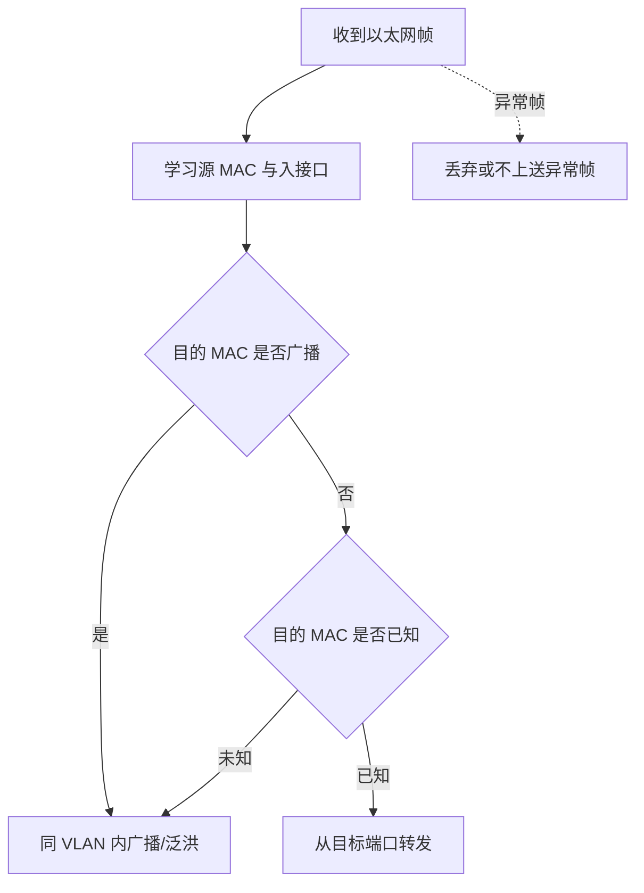
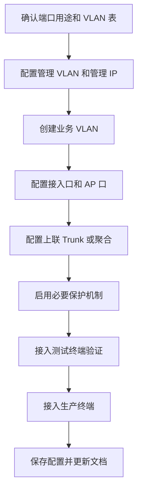

# 第 6 章：交换机基础

## 6.1 学习目标

学完本章后，你应该能够：

- 说清楚交换机在企业网络中的作用。
- 理解 MAC 地址表、二层转发、广播域和冲突域。
- 区分 Access 口、Trunk 口、Hybrid 口的用途。
- 理解管理 VLAN、管理 IP、默认网关的关系。
- 掌握交换机基础查看、配置、保存和排错思路。

交换机是企业局域网的基础设备。电脑、打印机、摄像头、无线 AP、服务器等终端通常都先接入交换机，再通过交换机进入更大的企业网络。如果交换机配置混乱，后面的路由、防火墙、安全策略都会变得不可靠。

## 6.2 交换机的作用

交换机工作在数据链路层，也就是常说的二层。它的核心任务是根据 MAC 地址把以太网帧从正确的端口转发出去。

在企业网络中，交换机通常承担以下职责：

- 提供终端接入端口。
- 根据 VLAN 隔离不同业务网络。
- 在交换机之间承载多个 VLAN。
- 防止二层环路造成广播风暴。
- 通过链路聚合提高带宽和可靠性。
- 在三层交换机场景中承担 VLAN 网关和路由转发。
- 通过端口安全、风暴抑制、ACL 等功能提升网络安全性。

初学时容易把交换机理解成“多口网线延长器”，这是不准确的。现代企业交换机具备学习、转发、隔离、冗余、安全、监控和管理能力，是企业内网的核心组成。

## 6.3 以太网帧与 MAC 地址

交换机转发的基本单位是以太网帧。一个简化的以太网帧可以理解为：

```text
目的 MAC | 源 MAC | 类型 | 数据 | 校验
```

MAC 地址是网卡的二层地址，长度为 48 位，通常写成十六进制格式：

```text
00:1A:2B:3C:4D:5E
```

交换机转发时最关注两个字段：

- 源 MAC：交换机用它学习“这个 MAC 地址在哪个端口后面”。
- 目的 MAC：交换机用它决定“这个帧应该从哪个端口发出去”。

MAC 地址不是 IP 地址的替代品。IP 地址用于三层寻址，表示“目标网络和目标主机在哪里”；MAC 地址用于本地二层链路转发，表示“下一跳设备在这个广播域里的网卡地址”。同一台电脑访问不同网段目标时，目的 IP 可能不同，但第一跳目的 MAC 往往都是网关的 MAC。

企业排错时经常同时查看 IP、ARP 和 MAC 表：

| 信息 | 查看位置 | 用途 |
| --- | --- | --- |
| IP 地址 | 终端、服务器、三层接口 | 判断网段、掩码、网关 |
| ARP 表 | 终端、网关 | 判断 IP 到 MAC 的解析是否正确 |
| MAC 地址表 | 交换机 | 判断 MAC 从哪个端口、哪个 VLAN 学到 |

如果终端能 ARP 到网关，但交换机 MAC 表显示该终端 MAC 出现在错误端口，就要怀疑接线、环路、聚合或私接交换机问题。

## 6.4 MAC 地址表

MAC 地址表也叫 CAM 表，是交换机进行二层转发的依据。它通常包含：

| 字段 | 含义 |
| --- | --- |
| VLAN | MAC 地址所属 VLAN |
| MAC 地址 | 终端或设备的二层地址 |
| 接口 | 学习到该 MAC 的交换机端口 |
| 类型 | 动态学习或静态配置 |
| 老化时间 | 动态表项保留时间 |

示例：

```text
VLAN 10    00:11:22:33:44:55    GE0/0/1    dynamic
VLAN 20    00:aa:bb:cc:dd:ee    GE0/0/2    dynamic
```

这表示：

- MAC `00:11:22:33:44:55` 位于 VLAN 10 的 GE0/0/1 后面。
- MAC `00:aa:bb:cc:dd:ee` 位于 VLAN 20 的 GE0/0/2 后面。

同一个 MAC 地址在同一个 VLAN 内不应频繁出现在不同端口。如果出现来回变化，可能存在环路、无线漫游、虚拟化迁移、链路聚合配置错误或非法接入设备。

## 6.5 交换机转发原理

交换机收到一个以太网帧后，大致按以下逻辑处理：

1. 检查帧的源 MAC 地址。
2. 把源 MAC 与入接口写入 MAC 地址表。
3. 检查目的 MAC 地址。
4. 如果 MAC 地址表中有目的 MAC 对应端口，就从该端口转发。
5. 如果查不到目的 MAC，就在同 VLAN 内泛洪。
6. 如果目的 MAC 是广播地址，也在同 VLAN 内广播。

注意，泛洪不是随便全网发送，而是在同一个 VLAN 内发送。VLAN 是二层广播域边界。



这张图体现了交换机的三个基本动作：

- 学习：根据源 MAC 更新 MAC 地址表。
- 转发：根据已知目的 MAC 从正确端口转发。
- 泛洪：目的 MAC 未知或广播时，在同 VLAN 范围内复制发送。

### 已知单播

目的 MAC 已经在 MAC 地址表中，交换机只从目标端口转发。

```text
PC1 -> Switch -> PC2
```

这是最常见、最理想的转发方式。

### 未知单播

目的 MAC 不在 MAC 地址表中，交换机会在同 VLAN 内除入接口外的端口泛洪。目标主机回应后，交换机学习到 MAC 表项，后续就能变成已知单播。

### 广播

目的 MAC 为：

```text
ff:ff:ff:ff:ff:ff
```

交换机会在同 VLAN 内广播。ARP 请求就是典型广播。

### MAC 地址老化

动态学习到的 MAC 表项不会永久保留。交换机会为动态 MAC 表项设置老化时间，例如 300 秒。某个终端长时间没有发送流量，交换机可能删除它的 MAC 表项。后续其他设备再访问它时，交换机先按未知单播泛洪，等终端回应后重新学习。

老化机制的作用是让 MAC 表能跟随终端移动和网络变化自动更新。但如果 MAC 表项频繁在两个端口之间来回变化，就不是正常老化，而是 MAC 漂移，需要优先检查环路、聚合、虚拟化网卡绑定或私接设备。

## 6.6 广播域与冲突域

### 广播域

广播域是广播帧能够到达的范围。一个 VLAN 通常就是一个广播域。

如果 500 台终端在同一个 VLAN 内，一台终端发送 ARP 广播，其余 499 台终端都可能收到。广播过多会影响终端和交换机性能，也会放大故障影响范围。

### 冲突域

早期集线器网络中，多台设备共享同一传输介质，可能发生冲突。现代交换机每个端口通常是独立冲突域，并且多数使用全双工通信，冲突问题已经很少见。

工程上更需要关注广播域，而不是冲突域。

## 6.7 Access 口与 Trunk 口

### Access 口

Access 口通常连接终端，只属于一个 VLAN。进入 Access 口的无标签帧会被交换机归入该端口所属 VLAN。

典型场景：

- 电脑接入口。
- 打印机接入口。
- 摄像头接入口。
- 普通服务器单 VLAN 接入口。

示例：

```text
PC 接入 GE0/0/1
GE0/0/1 配置为 Access VLAN 10
PC 发出的流量进入交换机后属于 VLAN 10
```

### Trunk 口

Trunk 口通常连接交换机、路由器、防火墙、无线 AP 或虚拟化服务器，可以承载多个 VLAN。Trunk 通过 802.1Q 标签区分不同 VLAN 的流量。

典型场景：

- 接入交换机上联汇聚交换机。
- 汇聚交换机上联核心交换机。
- 交换机连接防火墙子接口。
- 交换机连接虚拟化服务器。
- 交换机连接支持多 SSID 的 AP。

### Hybrid 口

Hybrid 口常见于华为、H3C 等设备。它可以让多个 VLAN 的流量以 tagged 或 untagged 方式通过，灵活性更高，但初学阶段不建议滥用。

如果没有明确需求，企业常规设计优先使用：

- 终端端口：Access。
- 设备互联端口：Trunk。

### 端口类型选择表

| 连接对象 | 推荐端口类型 | 说明 |
| --- | --- | --- |
| 普通电脑 | Access | 只进入一个办公 VLAN |
| 打印机 | Access | 通常固定在办公或打印 VLAN |
| 摄像头 | Access | 放入监控 VLAN，便于策略控制 |
| IP 电话 + 电脑 | Access 加语音 VLAN，或厂商专用配置 | 语音和数据可分 VLAN |
| 无线 AP | Trunk | 多个 SSID 可能对应多个 VLAN |
| 交换机上联 | Trunk 或聚合 Trunk | 承载多个业务 VLAN |
| 虚拟化服务器 | Trunk | 虚拟机可能属于多个 VLAN |
| 防火墙子接口 | Trunk | 防火墙通过 VLAN 子接口承载多个区域 |

端口类型不是看“线插在哪里”，而是看这条链路需要承载几个逻辑网络。只承载一个 VLAN 的终端链路通常用 Access；需要承载多个 VLAN 的设备互联链路通常用 Trunk。

## 6.8 管理 VLAN 与管理 IP

交换机需要被运维人员远程管理，因此通常会配置管理 IP。管理 IP 一般配置在 VLANIF、SVI 或管理接口上。

示例规划：

```text
管理 VLAN：VLAN 250
管理网段：10.10.250.0/24
核心交换机：10.10.250.1
接入交换机 1：10.10.250.11
接入交换机 2：10.10.250.12
```

交换机管理 IP 的用途：

- SSH 登录。
- SNMP 监控。
- Syslog 日志发送。
- NTP 时间同步。
- 配置备份。
- 自动化运维。

管理 VLAN 不应与普通办公 VLAN 混用。运维管理入口应该通过防火墙、ACL 或堡垒机限制，只允许运维网段访问。

管理 IP 和用户网关也要区分。接入交换机的管理 IP 只是为了登录和监控这台交换机，不代表它会给用户做网关。很多接入交换机只做二层转发，用户 VLAN 的网关在核心三层交换机上。

示例：

| 设备 | 管理 IP | 是否作为用户网关 |
| --- | --- | --- |
| Access-1 | 10.10.250.11 | 否 |
| Access-2 | 10.10.250.12 | 否 |
| Core-1 | 10.10.250.1 | 是，承担 VLAN 10/20/30 网关 |

如果用户不能上网，不要只看接入交换机管理 IP 是否能 ping 通，还要确认用户 VLAN 的真实网关在哪里。

## 6.9 交换机基础配置示例

以下示例以通用逻辑表达，不绑定某一厂商语法。后续厂商章节会给出华为、H3C、Cisco 的具体命令。

### 场景

一台接入交换机需要完成：

- 创建办公 VLAN 10。
- 创建管理 VLAN 250。
- GE0/0/1 接电脑，属于 VLAN 10。
- GE0/0/24 上联核心，承载 VLAN 10 和 VLAN 250。
- 交换机管理 IP 为 `10.10.250.11/24`。
- 默认网关为 `10.10.250.1`。

### 配置思路

```text
1. 创建 VLAN 10 和 VLAN 250。
2. 把用户端口配置为 Access VLAN 10。
3. 把上联端口配置为 Trunk，允许 VLAN 10、250。
4. 在 VLAN 250 上配置管理 IP。
5. 配置默认网关或默认路由。
6. 开启 SSH 或安全管理方式。
7. 保存配置。
```

### 验证内容

配置完成后至少验证：

```text
查看 VLAN 是否存在
查看端口 VLAN 状态
查看 Trunk 允许 VLAN
查看管理 IP 是否生效
从管理终端 ping 交换机管理 IP
从交换机 ping 管理网关
查看 MAC 地址表是否学习到终端
保存并重启后确认配置仍存在
```

### 上线检查清单

一台新接入交换机上线前，建议至少检查：

| 检查项 | 目的 |
| --- | --- |
| 主机名 | 方便日志、监控和排错识别 |
| 管理 IP | 确认可远程登录和监控 |
| 默认网关或管理路由 | 确认跨网段管理可达 |
| NTP | 确保日志时间准确 |
| SSH/账号 | 使用安全管理方式，避免明文 Telnet |
| SNMP/日志 | 接入监控和日志平台 |
| VLAN 创建 | 业务 VLAN 和管理 VLAN 是否存在 |
| Access 端口 | 端口描述、VLAN、边缘端口、安全策略 |
| Trunk 上联 | 允许 VLAN 是否准确 |
| 保存配置 | 防止重启后丢配置 |

上线检查的价值不在于表格本身，而是减少“设备能用但不可管理”“业务通了但监控不到”“重启后配置丢失”这类低级故障。

## 6.10 常用查看命令思路

不同厂商命令不同，但查看目标类似：

| 目标 | 查看内容 |
| --- | --- |
| 设备版本 | 系统版本、启动文件、补丁 |
| 接口状态 | up/down、速率、双工、错误包 |
| VLAN | VLAN 是否存在、端口归属 |
| MAC 地址表 | MAC 学习是否正常 |
| STP | 根桥、端口角色、阻塞端口 |
| 链路聚合 | 成员端口、聚合状态 |
| 路由表 | 三层交换机上的路由 |
| 日志 | 接口 flapping、环路、认证失败 |

学习设备命令时，不要只背配置命令，也要熟悉查看命令。真实工作中，排错使用查看命令的频率远高于配置命令。

可以把查看命令分成四类：

| 类型 | 常见问题 | 查看重点 |
| --- | --- | --- |
| 物理层 | 链路 down、丢包、错误包 | 接口状态、速率、双工、CRC、光功率 |
| 二层 | 同 VLAN 不通、MAC 漂移 | VLAN、MAC 地址表、STP、聚合 |
| 三层管理 | 不能远程登录交换机 | 管理 IP、默认网关、路由、ACL |
| 运维状态 | 间歇故障、设备异常 | 日志、CPU、内存、温度、电源 |

排错时建议先用查看命令确认事实，再决定是否修改配置。未经验证就修改配置，可能把一个小故障扩大成更大的变更风险。

## 6.11 二层网络常见问题

### 端口 VLAN 配错

现象：

- 终端拿不到正确 IP。
- 终端能连交换机但不能访问业务。
- 同一办公室部分电脑正常，部分异常。

排查：

```text
查看终端接入端口 VLAN
查看 DHCP 获取到的地址段
查看交换机 MAC 地址表
确认网线是否接到预期端口
```

### Trunk 未放行 VLAN

现象：

- 本交换机上的终端无法访问网关。
- 某个 VLAN 在一台交换机正常，跨交换机不通。

排查：

```text
查看上联端口是否为 Trunk
查看 Trunk 是否允许该 VLAN
查看对端端口配置是否一致
查看该 VLAN 的 MAC 是否能跨设备学习
```

### MAC 地址漂移

现象：

- 业务间歇性中断。
- 日志提示 MAC flapping。
- 交换机 CPU 升高或广播异常。

可能原因：

- 二层环路。
- 非法小交换机接入。
- 链路聚合两端配置不一致。
- 虚拟化平台迁移或网卡绑定异常。

### 接口错误包

现象：

- 网络慢、丢包、间歇性断开。
- 接口统计出现 CRC、input error、discard。

可能原因：

- 网线质量问题。
- 光模块故障。
- 双工协商异常。
- 端口硬件问题。
- 对端设备异常。

## 6.12 企业场景：楼层接入交换机

一家企业办公楼每层有一台接入交换机，上联到核心交换机。该楼层有办公电脑、财务电脑、打印机、无线 AP 和摄像头。

规划如下：

| 端口范围 | 连接对象 | VLAN | 端口类型 |
| --- | --- | ---: | --- |
| GE0/0/1-12 | 办公电脑 | 10 | Access |
| GE0/0/13-16 | 财务电脑 | 30 | Access |
| GE0/0/17-18 | 打印机 | 10 | Access |
| GE0/0/19-20 | 摄像头 | 60 | Access |
| GE0/0/21-22 | 无线 AP | 40,50 | Trunk |
| GE0/0/23-24 | 上联核心 | 10,30,40,50,60,250 | 聚合 Trunk |

这类场景中，接入交换机的核心工作不是路由，而是把不同类型终端准确放入对应 VLAN，并把这些 VLAN 通过上联链路送到核心。

典型验证：

```text
办公电脑获取 10.10.10.0/24 地址
财务电脑获取 10.10.30.0/24 地址
访客无线获取 10.10.50.0/24 地址
摄像头出现在 VLAN 60 的 MAC 表中
AP 上联 Trunk 允许员工无线和访客无线 VLAN
上联聚合接口 selected/bundled 正常
接入交换机管理 IP 10.10.250.11 可达
```

## 6.13 排错矩阵

| 故障现象 | 优先查看 | 常见原因 |
| --- | --- | --- |
| 单台电脑不通 | 接入口、终端 IP、MAC 表 | 网线、端口 VLAN、终端地址 |
| 一个 VLAN 全部不通 | VLANIF、Trunk、DHCP | 网关 down、Trunk 未放行、地址池异常 |
| 跨交换机某 VLAN 不通 | 上联 Trunk、STP、MAC 表 | VLAN 未创建、Trunk 放行缺失、链路阻塞 |
| 管理 IP 不通 | 管理 VLAN、默认网关、ACL | 管理 VLAN 未通、网关错误、策略阻断 |
| 网络间歇性慢 | 日志、MAC 漂移、接口错误包 | 环路、链路质量、聚合异常 |

排错时要先判断影响范围。单端口故障通常从物理和接入口查起；整个 VLAN 故障要看网关、Trunk 和 DHCP；多个 VLAN 同时异常则要优先看上联、核心或环路。

## 6.14 接入交换机上线流程

接入交换机看起来只是“接终端”，但它通常是用户网络故障最集中的位置。上线时建议按固定流程实施，避免因为端口、VLAN、管理地址或上联配置遗漏造成大面积故障。



上线前至少准备三张表：

| 表格 | 记录内容 | 示例 |
| --- | --- | --- |
| 端口表 | 端口、连接对象、VLAN、速率、备注 | `GE0/0/5`，财务 PC，VLAN 30 |
| VLAN 表 | VLAN ID、名称、网段、网关、DHCP | VLAN 10，办公，`10.10.10.0/24` |
| 上联表 | 上联端口、对端设备、Trunk 放行、聚合编号 | `GE0/0/23-24` 到 Core，允许 10,30,250 |

上线时不要一次性接入所有终端。更稳妥的方式是先接入一台测试电脑，验证它是否进入正确 VLAN、是否获得正确 IP、是否能访问网关和必要业务。确认无误后再分批迁移生产终端。

## 6.15 交换机故障案例：同一办公室部分电脑异常

场景：

```text
办公室有 20 台电脑，规划属于 VLAN 10。
其中 15 台正常获取 10.10.10.0/24 地址。
新增加的 5 台电脑获取不到地址，或拿到 10.10.50.0/24 地址。
```

不要直接判断为 DHCP 服务器故障，因为同办公室大部分电脑正常。更合理的排查路径如下：

| 步骤 | 检查内容 | 判断依据 |
| --- | --- | --- |
| 1 | 查看异常电脑连接的交换机端口 | 是否与端口表一致 |
| 2 | 查看端口 VLAN | 是否被配置到 VLAN 10 |
| 3 | 查看 MAC 地址表 | 异常电脑 MAC 是否出现在正确 VLAN |
| 4 | 查看 DHCP 获取过程 | Discover 是否从正确 VLAN 发出 |
| 5 | 对比正常端口配置 | 找出 VLAN、认证、端口安全差异 |

可能结论：

- 新增工位接到了预留给访客网络的端口。
- 接入交换机端口模板套错。
- 无线 AP 下接小交换机，导致终端进入了错误 VLAN。
- 端口启用了认证，但认证失败后被放入隔离 VLAN。

这个案例说明：同一空间位置不代表同一网络位置。企业排错要以端口、VLAN、MAC 和 IP 为准，而不是以“都在一个办公室”作为判断依据。

## 6.16 交换机验收和文档要求

交换机配置完成后，验收内容应覆盖“设备自身正常、端口归属正确、上联正常、业务可达、异常可定位”五个方面。

| 验收方向 | 验证内容 |
| --- | --- |
| 设备状态 | 主机名、管理 IP、时间、CPU、内存、版本 |
| 管理访问 | 运维终端能 SSH/HTTPS 到管理地址 |
| 接入口 | 端口描述、VLAN、速率、错误包、MAC 学习 |
| AP/摄像头端口 | VLAN 或 Trunk 模式符合规划 |
| 上联 | Trunk 放行、聚合状态、STP 状态 |
| 业务 | 终端获取正确地址并访问网关和业务 |
| 安全 | 未使用端口关闭，接入口保护按需启用 |
| 文档 | 端口表、VLAN 表、上联关系已更新 |

端口描述非常重要。一个没有描述的端口，排错时需要现场找线；一个写清楚“Finance-PC-05”或“AP-3F-East”的端口，可以直接把故障范围缩小到具体位置。

建议端口表包含以下字段：

```text
设备名、端口、对端设备或位置、端口类型、VLAN、速率、启用时间、负责人、备注
```

例如：

| 设备 | 端口 | 对端 | 类型 | VLAN | 备注 |
| --- | --- | --- | --- | ---: | --- |
| SW-3F-01 | GE0/0/5 | 财务工位 F-05 | Access | 30 | 财务内网 |
| SW-3F-01 | GE0/0/21 | AP-3F-East | Trunk | 40,50 | 员工/访客无线 |
| SW-3F-01 | GE0/0/24 | Core-1 GE1/0/10 | Trunk | 10,30,40,50,250 | 上联 |

文档不是上线后的附加工作。没有端口表时，后续任何 VLAN 调整、终端迁移、故障定位都会变慢，并且更容易误改正在使用的端口。

## 6.17 本章自检

请尝试回答：

- 交换机为什么要学习源 MAC，而不是目的 MAC。
- 未知单播和广播有什么区别。
- 为什么 Trunk 口通常不应该无条件允许所有 VLAN。
- 接入交换机的管理 IP 和用户网关有什么区别。
- MAC 地址频繁在两个端口之间漂移，可能说明什么。
- 为什么端口描述和端口表能缩短故障处理时间。

练习：

```text
GE0/0/5 连接办公电脑，应属于 VLAN 10。
GE0/0/24 上联核心，应承载 VLAN 10、20、30、250。
交换机管理 IP 为 10.10.250.12/24，管理网关为 10.10.250.1。
```

请写出配置思路和至少 6 个验证步骤。

## 6.18 本章小结

交换机的核心是二层转发，基础是 MAC 地址表，边界是 VLAN。企业网络中大量故障都发生在接入口、Trunk、VLAN、MAC 学习和物理链路上。学习交换机时要同时掌握配置和验证，尤其要养成“看接口、看 VLAN、看 MAC、看日志”的排错习惯。
