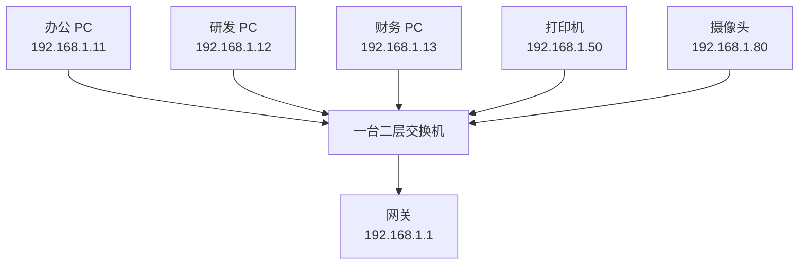
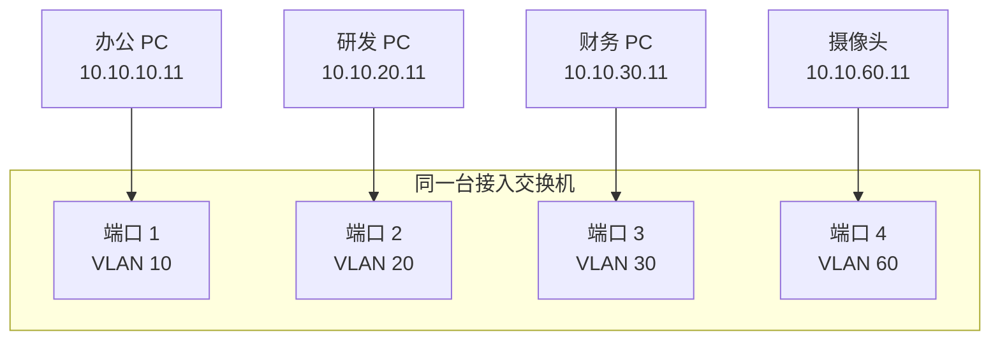
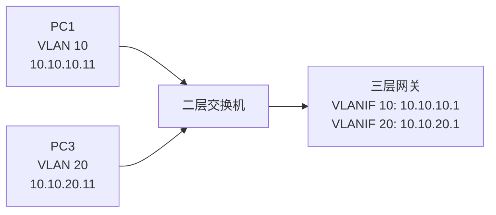
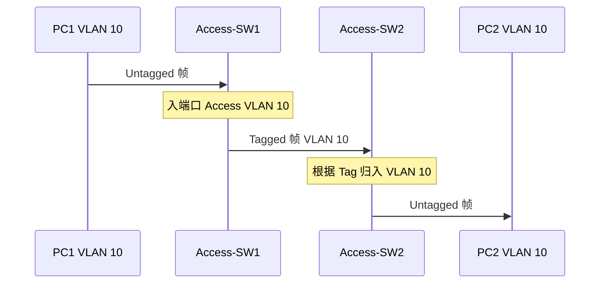
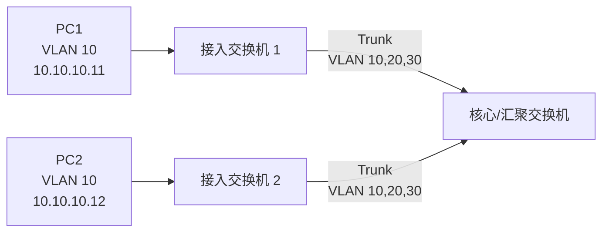
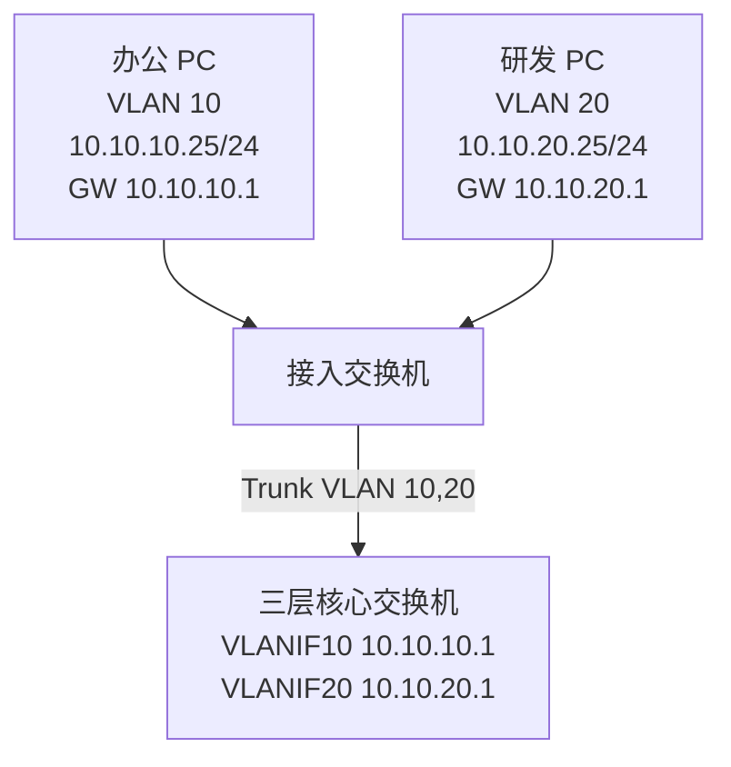
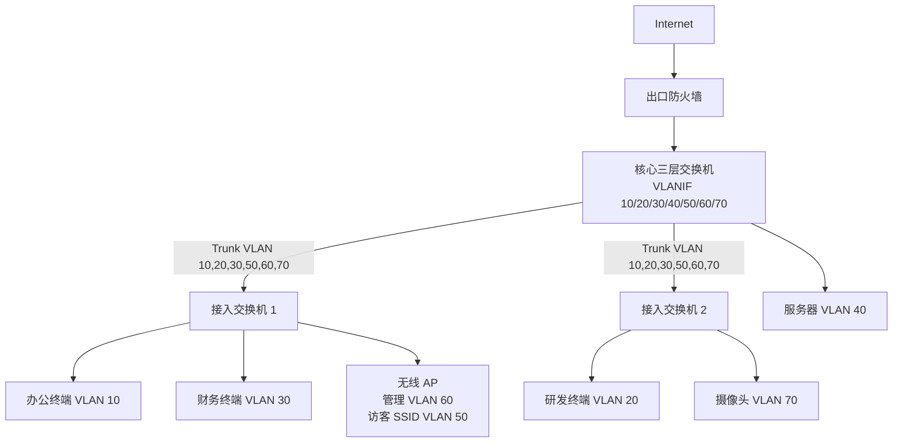
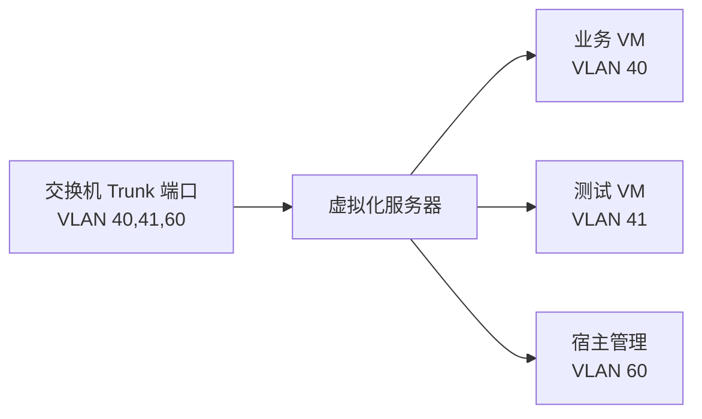
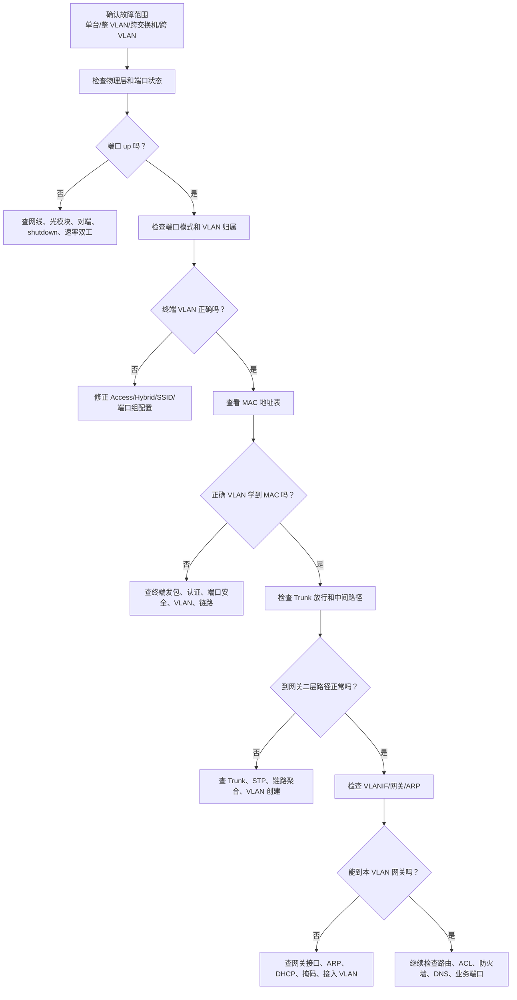

# 第 7 章：VLAN 技术

## 7.1 学习目标

学完本章后，你应该能够：

- 解释 VLAN 的定义，以及它为什么能把一台或多台交换机划分成多个逻辑局域网。
- 理解 VLAN、广播域、二层转发范围、IP 子网之间的关系。
- 区分 Access 端口、Trunk 端口和 Hybrid 端口的常见用途。
- 理解 802.1Q Tag、VLAN ID、PVID、native VLAN、允许 VLAN 列表的含义。
- 说明同 VLAN 通信、跨交换机同 VLAN 通信、跨 VLAN 通信分别依赖哪些设备和表项。
- 能够为小型企业规划办公、研发、财务、服务器、访客、管理等 VLAN。
- 能够看懂并编写一组厂商中立的 VLAN 配置步骤。
- 能够通过端口状态、VLAN 表、MAC 地址表、ARP 表、Trunk 放行、网关状态和 DHCP 结果排查 VLAN 故障。

第 6 章已经讲过交换机如何根据 MAC 地址表在同一二层网络中转发帧。本章继续回答一个更实际的问题：如果企业里有办公区、研发区、财务区、服务器区、无线访客区和管理区，它们都接在交换机上，是否应该处在同一个二层网络里？

答案通常是否定的。企业网络不能只追求“都能插上网线”。更重要的是把不同业务放在清晰的逻辑边界中，控制广播范围，降低故障影响，便于分配地址、做安全策略、做审计和后续扩展。VLAN 就是交换网络中最基础、最常用的逻辑隔离技术。

## 7.2 为什么需要 VLAN

先看一个没有 VLAN 的办公室网络。



这种网络在很小的临时环境中能工作，但企业里会很快暴露问题：

- 所有设备处在同一个广播域，ARP、DHCP、发现类广播会影响所有终端。
- 研发、财务、访客、摄像头之间缺少基础隔离。
- 某个终端中毒或产生广播风暴，影响范围可能是整个办公室。
- 所有设备使用同一个 IP 网段，地址规划混乱后很难定位责任边界。
- 安全策略难做，因为网络上看不到清晰的部门和业务边界。
- 新增无线、语音、门禁、监控、服务器区时，只能继续把网络做大做乱。

VLAN 解决的核心问题是：

```text
在同一套物理交换网络上，划分多个逻辑二层网络。
```

使用 VLAN 后，同一台交换机可以被逻辑切成多个广播域。



此时 VLAN 10 的广播不会进入 VLAN 20，VLAN 20 的广播不会进入 VLAN 30。它们可以接在同一台交换机上，但逻辑上属于不同局域网。

### VLAN 不是一条网线，也不是一个 IP 地址

初学者容易把 VLAN 理解成“某个网段”或“某条链路”。更准确地说：

```text
VLAN 是二层逻辑广播域。
IP 子网是三层地址范围。
```

在常规企业园区网中，通常一个 VLAN 对应一个 IP 子网。例如：

| VLAN | 用途 | IP 子网 | 网关 |
| --- | --- | --- | --- |
| VLAN 10 | 办公网 | `10.10.10.0/24` | `10.10.10.1` |
| VLAN 20 | 研发网 | `10.10.20.0/24` | `10.10.20.1` |
| VLAN 30 | 财务网 | `10.10.30.0/24` | `10.10.30.1` |
| VLAN 40 | 服务器区 | `10.10.40.0/24` | `10.10.40.1` |
| VLAN 50 | 访客无线 | `10.10.50.0/24` | `10.10.50.1` |
| VLAN 60 | 管理网 | `10.10.60.0/24` | `10.10.60.1` |

这种一一对应不是强制标准，但对初学者和大多数企业网络来说，是最清晰、最容易维护的设计。不要在一个 VLAN 中混入多个无规划网段，也不要让多个重要业务共用同一个 VLAN，除非有明确原因、隔离措施和文档。

## 7.3 VLAN 的核心概念

### VLAN ID

VLAN ID 是 VLAN 的编号。常见取值范围是 `1-4094`。其中部分 VLAN 可能被厂商或协议保留，真实设备上要以厂商说明为准。

常见规划习惯：

| VLAN ID | 常见用途 | 说明 |
| --- | --- | --- |
| 1 | 默认 VLAN | 不建议承载重要业务或管理 |
| 10-99 | 业务 VLAN | 办公、研发、财务、服务器、无线等 |
| 100-199 | 扩展业务 VLAN | 分楼层、分区域、分系统 |
| 200-299 | 安防/物联网 VLAN | 摄像头、门禁、传感器等 |
| 900-999 | 互联或管理 VLAN | 设备管理、核心互联、保留 |

编号本身没有技术含义。VLAN 10 不一定就是办公网，VLAN 20 也不一定就是研发网。它们的含义来自网络规划和设备配置。工程中必须用文档把 VLAN ID、名称、用途、网段、网关、DHCP、负责人记录清楚。

### VLAN 名称

很多交换机允许给 VLAN 配置名称，例如：

| VLAN ID | VLAN 名称 | 用途 |
| --- | --- | --- |
| 10 | `OFFICE` | 办公网 |
| 20 | `RD` | 研发网 |
| 30 | `FINANCE` | 财务网 |
| 40 | `SERVER` | 服务器区 |
| 50 | `GUEST_WIFI` | 访客无线 |
| 60 | `MGMT` | 管理网 |

名称不会改变转发原理，但能显著降低误操作概率。看到 `VLAN 30 FINANCE` 比只看到 `VLAN 30` 更容易判断端口是否配置正确。

### 广播域

一个 VLAN 通常就是一个广播域。广播帧只在同一 VLAN 内传播。

例如办公 PC 发送 ARP 请求：

```text
谁是 10.10.10.1？请告诉 10.10.10.25。
```

如果这台 PC 在 VLAN 10，这个 ARP 请求只会在 VLAN 10 内泛洪，不会发到 VLAN 20 的研发 PC，也不会发到 VLAN 50 的访客无线终端。

这带来两个好处：

- 降低广播影响范围。
- 形成清晰的二层边界。

但也要注意：VLAN 不是防火墙。VLAN 可以隔离二层广播，但一旦配置了三层网关和路由，不同 VLAN 之间就可以通过三层设备通信。是否允许通信，还要看路由、ACL、防火墙策略和安全设计。

### 同 VLAN 与不同 VLAN

判断两台设备是否能直接二层通信，要同时看 VLAN 和 IP 子网。

| 情况 | 是否直接二层通信 | 说明 |
| --- | --- | --- |
| 同 VLAN、同 IP 子网 | 通常可以 | 通过 ARP 和二层交换通信 |
| 同 VLAN、不同 IP 子网 | 不推荐 | 主机通常会走网关，容易造成混乱 |
| 不同 VLAN、同 IP 子网 | 通常不通 | 二层被隔离，ARP 到不了对方 |
| 不同 VLAN、不同 IP 子网 | 不能直接二层通信 | 需要三层网关路由 |

最常见、最清晰的设计是：

```text
一个 VLAN 对应一个 IP 子网。
不同 VLAN 之间通过三层网关互通。
是否允许互通由策略控制。
```

## 7.4 VLAN 如何影响交换机转发

第 6 章讲 MAC 地址表时已经提到，交换机的 MAC 学习通常要结合 VLAN。

示例 MAC 地址表：

| VLAN | MAC 地址 | 端口 |
| --- | --- | --- |
| 10 | `AA:AA:AA:AA:10:11` | `GE1/0/1` |
| 10 | `AA:AA:AA:AA:10:12` | `GE1/0/2` |
| 20 | `BB:BB:BB:BB:20:11` | `GE1/0/3` |
| 30 | `CC:CC:CC:CC:30:11` | `GE1/0/4` |

这张表不是简单表示“某个 MAC 在某个端口”，而是表示：

```text
某个 VLAN 内的某个 MAC 在某个端口。
```

交换机收到一个帧时，会先确定这个帧属于哪个 VLAN，然后只在该 VLAN 的转发范围内查表、转发、泛洪或丢弃。

### 同一交换机内的同 VLAN 通信

假设 PC1 和 PC2 都在 VLAN 10。

| 设备 | IP 地址 | MAC 地址 | 端口 | VLAN |
| --- | --- | --- | --- | --- |
| PC1 | `10.10.10.11/24` | `AA:AA:AA:AA:10:11` | `GE1/0/1` | 10 |
| PC2 | `10.10.10.12/24` | `AA:AA:AA:AA:10:12` | `GE1/0/2` | 10 |

通信过程：

1. PC1 判断 PC2 与自己在同一 IP 子网。
2. PC1 发送 ARP 请求，目的 MAC 是广播地址。
3. 交换机从 `GE1/0/1` 收到帧，确认入端口属于 VLAN 10。
4. 交换机只在 VLAN 10 内泛洪 ARP 请求。
5. PC2 回复 ARP，应答帧回到交换机。
6. 交换机学习 PC2 的 MAC 在 VLAN 10 的 `GE1/0/2`。
7. 后续 PC1 到 PC2 的数据帧在 VLAN 10 内按 MAC 表转发。

这个过程中不需要网关参与。网关是否正常，不影响同 VLAN、同子网终端之间的基础二层通信。

### 同一交换机内的不同 VLAN 通信

假设 PC1 在 VLAN 10，PC3 在 VLAN 20。

| 设备 | IP 地址 | 端口 | VLAN |
| --- | --- | --- | --- |
| PC1 | `10.10.10.11/24` | `GE1/0/1` | 10 |
| PC3 | `10.10.20.11/24` | `GE1/0/3` | 20 |

PC1 想访问 PC3 时，会发现 `10.10.20.11` 不在自己的网段，于是把数据交给默认网关 `10.10.10.1`。交换机不会直接把 VLAN 10 的二层帧转发到 VLAN 20。跨 VLAN 通信需要三层设备参与，例如：

- 三层交换机上的 VLANIF。
- 路由器子接口。
- 防火墙子接口。
- 独立网关设备。

这就是 VLAN 的关键边界：二层不互通，三层可按设计互通。



PC1 到 PC3 的路径不是“交换机直接跨 VLAN 转发”，而是：

```text
PC1 -> VLAN 10 网关 -> 三层路由 -> VLAN 20 -> PC3
```

## 7.5 Access 端口

Access 端口通常用于连接普通终端。它属于一个 VLAN，收发给终端的帧通常不带 VLAN Tag。

典型连接对象：

- 办公 PC。
- 打印机。
- 摄像头。
- 门禁控制器。
- 单 VLAN 的服务器接口。
- 不需要承载多个 VLAN 的普通设备。

示例：


Access 端口可以理解成：

```text
这个物理端口接入的未打标签流量，都归入指定 VLAN。
```

### Access 端口收帧

当 PC 发出普通以太网帧时，帧中没有 VLAN Tag。交换机从 Access 端口收到该帧后，会根据端口配置把它归入某个 VLAN。

例如：

| 端口 | 模式 | 所属 VLAN |
| --- | --- | --- |
| `GE1/0/1` | Access | VLAN 10 |

PC 从 `GE1/0/1` 发来的未标记帧，会被交换机归入 VLAN 10。之后交换机就在 VLAN 10 的范围内学习源 MAC、查找目的 MAC、转发或泛洪。

### Access 端口发帧

交换机把 VLAN 10 的帧从 Access 端口发给 PC 时，通常会去掉 VLAN Tag，以普通以太网帧形式发出。普通 PC 不需要知道 VLAN 的存在。

这也是 Access 端口适合终端的原因：

- 终端配置简单。
- 终端网卡不需要处理 VLAN Tag。
- VLAN 归属由交换机端口控制。

### Access 端口常见错误

| 错误 | 现象 | 排查方向 |
| --- | --- | --- |
| 端口放错 VLAN | 终端拿到错误网段 IP 或网关不通 | 查端口 VLAN、DHCP 地址池 |
| 端口仍在默认 VLAN 1 | 终端无法进入目标业务网 | 查端口配置和端口描述 |
| 终端需要语音/数据双 VLAN 但只配了单 VLAN | IP 电话或 PC 其中一个异常 | 查语音 VLAN、LLDP/CDP、电话透传 |
| 把交换机上联口误配成 Access | 多个 VLAN 业务中断 | 查上联模式和 Trunk 放行 |

Access 端口是日常开通工位最常改的配置。每次调整都应该同步端口描述和端口表，否则后续排错会很痛苦。

## 7.6 Trunk 端口

Trunk 端口用于在一条物理链路上承载多个 VLAN。它常用于交换机之间、交换机到路由器、防火墙、无线控制器、虚拟化服务器之间的连接。


如果没有 Trunk，想让两台交换机之间同时承载 VLAN 10、20、30，理论上可能需要多条物理线：

| 物理链路 | 承载 VLAN |
| --- | --- |
| 链路 1 | VLAN 10 |
| 链路 2 | VLAN 20 |
| 链路 3 | VLAN 30 |

这样浪费端口和线缆，也不利于扩展。Trunk 通过给帧打 VLAN 标签，让一条链路可以区分多个 VLAN 的流量。

### Trunk 常见位置

| Trunk 位置 | 作用 |
| --- | --- |
| 接入交换机到汇聚交换机 | 把楼层多个 VLAN 上送 |
| 汇聚交换机到核心交换机 | 汇总多个接入区域 VLAN |
| 交换机到路由器 | 使用路由器子接口做单臂路由 |
| 交换机到防火墙 | 防火墙用子接口承载多个安全区或 VLAN |
| 交换机到无线 AP | AP 同时承载管理 VLAN 和多个 SSID VLAN |
| 交换机到虚拟化服务器 | 服务器虚拟交换机承载多个业务 VLAN |

注意，不是所有上联都必须是 Trunk。大型网络中也常见三层上联，即交换机之间直接用三层接口互联，不再透传大量二层 VLAN。第 10 章三层交换会继续展开这个思路。

### Trunk 允许 VLAN 列表

Trunk 不应该无脑允许所有 VLAN。更好的做法是只允许需要通过这条链路的 VLAN。

示例：

| 链路 | 允许 VLAN | 不应通过 |
| --- | --- | --- |
| 接入交换机 1 到核心 | 10,20,30,60 | 其他楼层专用 VLAN |
| AP 接入口 | 50,51,60 | 服务器 VLAN、财务 VLAN |
| 服务器上联 | 40,41,60 | 访客 VLAN、摄像头 VLAN |

允许 VLAN 列表配置错误是 Trunk 排错中最常见的问题之一。

| 配置问题 | 典型现象 |
| --- | --- |
| 上联未允许 VLAN 10 | VLAN 10 终端同交换机内互通，但网关不通 |
| 两端允许 VLAN 不一致 | 某些 VLAN 单向异常或跨交换机异常 |
| 允许了过多 VLAN | 增大广播和故障影响范围 |
| 新增 VLAN 忘记加入上联 | 老 VLAN 正常，新 VLAN 不通 |

## 7.7 802.1Q Tag

802.1Q 是以太网中常见的 VLAN 标记方式。它在以太网帧中插入 VLAN Tag，用来标识这帧属于哪个 VLAN。

简化理解如下：

```text
普通以太网帧：
目的 MAC | 源 MAC | 类型 | 数据 | FCS

802.1Q 标记帧：
目的 MAC | 源 MAC | 802.1Q Tag | 类型 | 数据 | FCS
```

Tag 中最重要的是 VLAN ID。交换机收到带 Tag 的帧后，就能知道这帧属于哪个 VLAN。

### Tagged 与 Untagged

| 类型 | 含义 | 常见位置 |
| --- | --- | --- |
| Untagged 帧 | 不带 VLAN Tag 的普通以太网帧 | PC 到 Access 端口 |
| Tagged 帧 | 带 VLAN Tag 的以太网帧 | Trunk 链路、服务器虚拟化、AP 多 SSID |

Access 端口通常面对 untagged 终端。Trunk 端口通常在不同网络设备之间传递 tagged 帧。

### Trunk 上的帧处理

假设交换机 A 和交换机 B 之间是 Trunk，允许 VLAN 10 和 VLAN 20。

| 流量 | 在 Trunk 上的表现 |
| --- | --- |
| VLAN 10 的帧 | 带 VLAN 10 Tag 通过 Trunk |
| VLAN 20 的帧 | 带 VLAN 20 Tag 通过 Trunk |
| 未允许 VLAN 30 的帧 | 不应该通过该 Trunk |

当 VLAN 10 的帧到达另一台交换机后，对端交换机根据 Tag 知道它属于 VLAN 10，再在本机 VLAN 10 范围内转发。



### Native VLAN 与 PVID

不同厂商对 untagged 帧在 Trunk 上的处理术语略有差异，常见概念包括 native VLAN 和 PVID。

可以先这样理解：

```text
PVID 是端口收到未打标签帧时，默认把它归入哪个 VLAN。
native VLAN 通常指 Trunk 上不打标签发送或接收的默认 VLAN。
```

示例：

| 端口 | 模式 | 允许 VLAN | PVID/native VLAN |
| --- | --- | --- | --- |
| `GE1/0/48` | Trunk | 10,20,30,60 | 999 |

如果该 Trunk 收到未打标签帧，交换机可能把它归入 VLAN 999。真实行为要看厂商和端口配置。

工程建议：

- Trunk 两端的 PVID/native VLAN 保持一致。
- 不要使用业务 VLAN 作为 native VLAN。
- 不要依赖 untagged 流量承载重要跨交换机业务。
- 如果设计允许，Trunk 上尽量让业务 VLAN 都以 tagged 方式传输。
- unused/native VLAN 可使用一个不承载终端业务的隔离 VLAN，例如 VLAN 999。

Native VLAN 不一致会造成非常隐蔽的问题。例如一端把未打标签帧归入 VLAN 10，另一端归入 VLAN 999，结果二层流量被放到错误广播域中，可能表现为 DHCP 异常、MAC 学习错乱或安全风险。

## 7.8 Hybrid 端口

Hybrid 端口是部分厂商常见的端口模式。它可以同时指定某些 VLAN 以 tagged 方式发送，某些 VLAN 以 untagged 方式发送。

初学阶段不需要把 Hybrid 当成新协议。它本质上仍然围绕两个问题：

```text
入方向：收到 untagged 帧时归入哪个 VLAN？
出方向：某个 VLAN 从此端口发出时是否带 Tag？
```

Hybrid 常见于以下场景：

- IP 电话与 PC 串接，电话使用语音 VLAN，PC 使用数据 VLAN。
- 某些 AP 或终端要求管理 VLAN untagged，业务 VLAN tagged。
- 厂商默认不使用 Access/Trunk 名称，而使用 tagged/untagged 列表表达端口行为。

示例：

| 端口 | 连接对象 | Untagged VLAN | Tagged VLAN |
| --- | --- | --- | --- |
| `GE1/0/10` | IP 电话 + PC | 10 | 30 |
| `GE1/0/20` | 无线 AP | 60 | 50,51 |
| `GE1/0/30` | 虚拟化服务器 | 无或 60 | 40,41,42 |

如果你遇到 Hybrid 配置，不要只背命令。先画出这条端口上哪些 VLAN 是不带标签，哪些 VLAN 是带标签，再判断对端设备是否按同样方式处理。

## 7.9 VLAN 与 IP 子网、网关

VLAN 只解决二层隔离。终端要访问不同 VLAN，必须通过三层网关。

常见网关形式：

| 网关形式 | 典型设备 | 适用场景 |
| --- | --- | --- |
| VLANIF / SVI | 三层交换机 | 园区网内部 VLAN 间高速转发 |
| 路由器子接口 | 路由器 | 小型网络、实验、分支 |
| 防火墙子接口 | 防火墙 | 不同 VLAN 需要安全策略控制 |
| 独立物理接口 | 路由器/防火墙/三层交换机 | VLAN 数量少、隔离清晰 |

### VLANIF 是什么

VLANIF 或 SVI 可以理解成三层交换机给某个 VLAN 创建的三层网关接口。

示例：

| VLAN | 用途 | 网段 | VLANIF 地址 |
| --- | --- | --- | --- |
| 10 | 办公网 | `10.10.10.0/24` | `10.10.10.1/24` |
| 20 | 研发网 | `10.10.20.0/24` | `10.10.20.1/24` |
| 30 | 财务网 | `10.10.30.0/24` | `10.10.30.1/24` |

终端配置：

| 终端 | IP 地址 | 默认网关 |
| --- | --- | --- |
| 办公 PC | `10.10.10.25/24` | `10.10.10.1` |
| 研发 PC | `10.10.20.25/24` | `10.10.20.1` |
| 财务 PC | `10.10.30.25/24` | `10.10.30.1` |

办公 PC 访问研发 PC 时，办公 PC 会把数据交给 `10.10.10.1`。三层交换机收到后查路由，发现 `10.10.20.0/24` 是直连 VLANIF 20，再转发到 VLAN 20。

### VLANIF up/down 与直连路由

很多设备上，VLANIF 要正常工作，通常需要满足：

- VLAN 已创建。
- VLANIF 已配置 IP。
- VLANIF 没有被 shutdown。
- 该 VLAN 至少有一个活动的二层端口，或 Trunk 上允许该 VLAN 并有活动链路。

如果 VLANIF down，对应直连路由可能不会进入路由表。现象包括：

- 终端无法 ping 网关。
- 该 VLAN 无法访问其他网段。
- 其他网段也无法访问该 VLAN。
- 路由表中看不到该 VLAN 的直连路由。

因此排查跨 VLAN 通信时，不要只看终端 IP，也要看网关接口状态。

## 7.10 跨交换机同 VLAN 通信

企业中同一个 VLAN 经常分布在多台接入交换机上。例如同一楼层多个办公室都属于办公 VLAN 10。



PC1 和 PC2 虽然接在不同交换机上，但只要 VLAN 10 在中间链路上完整透传，它们仍然属于同一个二层广播域。

通信关键点：

1. PC1 发送 ARP 广播查询 PC2。
2. SW1 在 VLAN 10 内泛洪，并通过允许 VLAN 10 的 Trunk 发向核心。
3. 核心继续在 VLAN 10 内向 SW2 方向转发。
4. SW2 把 ARP 请求从 VLAN 10 的 Access 端口发给 PC2。
5. PC2 回复 ARP。
6. 沿途交换机分别学习到对应 MAC 在 VLAN 10 的哪个端口或上联方向。

如果跨交换机同 VLAN 不通，常见原因是：

- 中间某条 Trunk 没有允许该 VLAN。
- 某台交换机没有创建该 VLAN。
- 两端端口 VLAN 配置不一致。
- STP 阻塞了路径。
- 链路聚合成员配置不一致。
- MAC 地址漂移或环路导致表项不稳定。

这类问题不要一开始就查路由。PC1 和 PC2 同 VLAN、同子网通信，本质还是二层问题。

## 7.11 跨 VLAN 通信

不同 VLAN 之间不能直接二层转发，但可以通过三层网关通信。



办公 PC 访问研发 PC 的过程：

1. 办公 PC 判断 `10.10.20.25` 不在自己的 `10.10.10.0/24` 网段。
2. 办公 PC 通过 ARP 获取默认网关 `10.10.10.1` 的 MAC。
3. 办公 PC 把数据帧发给网关，目的 MAC 是 VLANIF 10 的 MAC。
4. 核心交换机收到后进行三层转发，查找 `10.10.20.0/24` 路由。
5. 核心发现 VLAN 20 是直连网段，通过 VLANIF 20 方向转发。
6. 核心在 VLAN 20 内 ARP 研发 PC 的 MAC。
7. 核心把数据发给研发 PC。
8. 研发 PC 回包时，把回包交给自己的网关 `10.10.20.1`。

这个过程要同时满足：

- 办公 PC 的 IP、掩码、网关正确。
- 办公网端口属于 VLAN 10。
- 研发网端口属于 VLAN 20。
- Trunk 允许 VLAN 10 和 VLAN 20。
- VLANIF 10 和 VLANIF 20 正常。
- 三层设备路由表有两个直连网段。
- 安全策略或 ACL 允许该方向访问。
- 目标主机防火墙或服务允许访问。

跨 VLAN 故障经常不是单点问题。要沿着路径逐段确认，不要只凭“两个网段不通”就直接改路由。

## 7.12 企业 VLAN 规划方法

VLAN 规划不是随意编号。好的 VLAN 规划要同时考虑业务、安全、地址、路由、运维和扩展。

### 按业务和安全边界划分

常见划分方式：

| VLAN | 用途 | 是否建议独立 | 原因 |
| --- | --- | --- | --- |
| 办公网 | 员工 PC | 是 | 与访客、服务器、管理设备隔离 |
| 研发网 | 研发终端、测试设备 | 是 | 访问需求和安全风险不同 |
| 财务网 | 财务终端、财务打印 | 是 | 敏感数据，需要更严格控制 |
| 服务器区 | 业务服务器 | 是 | 与用户区分离，便于策略控制 |
| 访客无线 | 外来人员上网 | 必须独立 | 不应访问内网资源 |
| 管理网 | 交换机、防火墙、AP 管理 | 必须独立 | 限制只有运维主机可访问 |
| 安防网 | 摄像头、门禁 | 建议独立 | 设备数量多、安全能力弱 |
| 语音网 | IP 电话 | 建议独立 | QoS、地址、语音策略不同 |

不要把“能不能通”作为唯一标准。企业网络中很多方向本来就不应该通，例如访客无线访问财务服务器。

### 按地点和规模细分

小型公司可以按业务划分 VLAN。大型园区还要考虑楼栋、楼层、区域。

示例：

| VLAN | 用途 | 位置 | 网段 |
| --- | --- | --- | --- |
| 110 | 一号楼一层办公 | Building 1 Floor 1 | `10.10.110.0/24` |
| 120 | 一号楼二层办公 | Building 1 Floor 2 | `10.10.120.0/24` |
| 210 | 二号楼一层办公 | Building 2 Floor 1 | `10.10.210.0/24` |
| 250 | 一号楼访客无线 | Building 1 Guest | `10.10.250.0/24` |

这种设计的好处是故障影响范围清晰。如果一号楼二层办公 VLAN 出问题，不一定影响其他楼层。

但也不要过度细分。每多一个 VLAN，就要增加网关、DHCP 地址池、路由、安全策略、监控和文档。规划要在隔离与复杂度之间平衡。

### VLAN 与地址规划一起做

不要先随便创建 VLAN，再临时找网段。VLAN 和 IP 地址应该一起规划。

示例规划表：

| VLAN ID | 名称 | 用途 | 网段 | 网关 | DHCP 范围 | DNS |
| --- | --- | --- | --- | --- | --- | --- |
| 10 | OFFICE | 办公网 | `10.10.10.0/24` | `10.10.10.1` | `10.10.10.100-10.10.10.220` | `10.10.60.10` |
| 20 | RD | 研发网 | `10.10.20.0/24` | `10.10.20.1` | `10.10.20.100-10.10.20.220` | `10.10.60.10` |
| 30 | FINANCE | 财务网 | `10.10.30.0/24` | `10.10.30.1` | `10.10.30.100-10.10.30.180` | `10.10.60.10` |
| 40 | SERVER | 服务器区 | `10.10.40.0/24` | `10.10.40.1` | 不启用或保留 | `10.10.60.10` |
| 50 | GUEST | 访客无线 | `10.10.50.0/24` | `10.10.50.1` | `10.10.50.50-10.10.50.240` | 公共 DNS 或内部转发 DNS |
| 60 | MGMT | 管理网 | `10.10.60.0/24` | `10.10.60.1` | `10.10.60.100-10.10.60.150` | `10.10.60.10` |

这张表后续会被多处使用：

- 交换机创建 VLAN。
- 核心交换机配置 VLANIF。
- DHCP 服务器创建地址池。
- DNS、NTP、日志服务器配置访问源。
- 防火墙配置地址对象和策略。
- 监控系统按网段分类告警。
- 运维人员排错时确认终端是否拿到正确地址。

## 7.13 小型企业 VLAN 设计示例

假设一家 80 人公司有以下需求：

- 普通员工办公上网和访问 OA。
- 研发人员访问代码仓库和测试服务器。
- 财务人员访问财务系统，其他员工不能随意访问财务终端。
- 访客 Wi-Fi 只能上网，不能访问内网。
- 交换机、防火墙、AP 通过管理网统一管理。
- 摄像头接入安防系统，不与办公终端混在一起。

规划如下：

| VLAN | 名称 | 用途 | 网段 | 网关 | 备注 |
| --- | --- | --- | --- | --- | --- |
| 10 | OFFICE | 办公网 | `10.10.10.0/24` | `10.10.10.1` | 员工 PC、打印机 |
| 20 | RD | 研发网 | `10.10.20.0/24` | `10.10.20.1` | 研发 PC、测试终端 |
| 30 | FINANCE | 财务网 | `10.10.30.0/24` | `10.10.30.1` | 财务 PC、财务打印 |
| 40 | SERVER | 服务器区 | `10.10.40.0/24` | `10.10.40.1` | OA、代码仓库、文件服务 |
| 50 | GUEST | 访客无线 | `10.10.50.0/24` | `10.10.50.1` | 只允许上网 |
| 60 | MGMT | 管理网 | `10.10.60.0/24` | `10.10.60.1` | 网络设备、AP 管理 |
| 70 | CCTV | 安防网 | `10.10.70.0/24` | `10.10.70.1` | 摄像头、NVR |
| 999 | UNUSED | 隔离 VLAN | 无业务网关 | 无 | 未用端口/native VLAN |

拓扑：



安全策略可以这样设计：

| 源 VLAN | 目的 | 动作 | 说明 |
| --- | --- | --- | --- |
| OFFICE | Internet | 允许 | 员工上网 |
| OFFICE | SERVER OA | 允许 | 访问 OA |
| OFFICE | FINANCE | 拒绝 | 普通办公不能访问财务终端 |
| RD | SERVER 代码仓库/测试服务 | 允许 | 研发业务需要 |
| FINANCE | 财务服务器 | 允许 | 按端口开放 |
| GUEST | Internet | 允许 | 访客上网 |
| GUEST | 内部网段 | 拒绝 | 访客隔离 |
| MGMT | 网络设备 | 允许 | 仅运维主机来源 |
| CCTV | NVR | 允许 | 摄像头上传录像 |
| CCTV | OFFICE/RD/FINANCE | 拒绝 | 物联网隔离 |

注意，VLAN 只是边界。真正控制访问的是三层网关、ACL、防火墙策略、NAT 和日志审计。设计时要把 VLAN 和策略放在一起看。

## 7.14 VLAN 配置示例

不同厂商命令不同，本章用厂商中立的伪配置表达思路。真实设备上要查对应厂商手册。

### 创建 VLAN

目标：

| VLAN | 名称 |
| --- | --- |
| 10 | OFFICE |
| 20 | RD |
| 30 | FINANCE |
| 40 | SERVER |
| 50 | GUEST |
| 60 | MGMT |
| 70 | CCTV |
| 999 | UNUSED |

伪配置：

```text
create vlan 10 name OFFICE
create vlan 20 name RD
create vlan 30 name FINANCE
create vlan 40 name SERVER
create vlan 50 name GUEST
create vlan 60 name MGMT
create vlan 70 name CCTV
create vlan 999 name UNUSED
```

检查点：

- VLAN 是否已经创建。
- VLAN 名称是否符合规划表。
- 所有相关交换机上是否都创建了需要透传或接入的 VLAN。

### 配置 Access 端口

目标：

| 端口 | 连接对象 | VLAN | 描述 |
| --- | --- | --- | --- |
| `GE1/0/1` | 办公 PC | 10 | `Office-PC-A01` |
| `GE1/0/2` | 研发 PC | 20 | `RD-PC-A02` |
| `GE1/0/3` | 财务 PC | 30 | `Finance-PC-A03` |
| `GE1/0/10` | 摄像头 | 70 | `CCTV-Camera-01` |

伪配置：

```text
interface GE1/0/1
  description Office-PC-A01
  switchport mode access
  switchport access vlan 10
  enable

interface GE1/0/2
  description RD-PC-A02
  switchport mode access
  switchport access vlan 20
  enable

interface GE1/0/3
  description Finance-PC-A03
  switchport mode access
  switchport access vlan 30
  enable

interface GE1/0/10
  description CCTV-Camera-01
  switchport mode access
  switchport access vlan 70
  enable
```

配置后应验证：

- 端口状态是否 up。
- 端口是否属于正确 VLAN。
- 交换机是否在正确 VLAN 学到终端 MAC。
- 终端是否拿到对应 VLAN 的 IP 地址。

### 配置 Trunk 上联

目标：接入交换机 `GE1/0/48` 上联核心交换机，承载 VLAN 10、20、30、50、60、70，native/PVID 使用 VLAN 999。

伪配置：

```text
interface GE1/0/48
  description Uplink-to-Core
  switchport mode trunk
  switchport trunk allowed vlan 10,20,30,50,60,70
  switchport trunk native vlan 999
  enable
```

核心交换机对端端口也要匹配：

```text
interface GE1/0/1
  description Downlink-to-Access-01
  switchport mode trunk
  switchport trunk allowed vlan 10,20,30,50,60,70
  switchport trunk native vlan 999
  enable
```

检查点：

- Trunk 两端模式一致。
- 允许 VLAN 列表一致或至少满足业务路径。
- native/PVID 一致。
- 上联端口没有被误配置为 Access。
- 新增 VLAN 时，两端 Trunk 都同步放行。

### 配置 VLANIF 网关

如果核心交换机承担 VLAN 网关，可配置：

```text
interface vlan 10
  description OFFICE-Gateway
  ip address 10.10.10.1 255.255.255.0
  enable

interface vlan 20
  description RD-Gateway
  ip address 10.10.20.1 255.255.255.0
  enable

interface vlan 30
  description FINANCE-Gateway
  ip address 10.10.30.1 255.255.255.0
  enable

interface vlan 40
  description SERVER-Gateway
  ip address 10.10.40.1 255.255.255.0
  enable

interface vlan 50
  description GUEST-Gateway
  ip address 10.10.50.1 255.255.255.0
  enable

interface vlan 60
  description MGMT-Gateway
  ip address 10.10.60.1 255.255.255.0
  enable

interface vlan 70
  description CCTV-Gateway
  ip address 10.10.70.1 255.255.255.0
  enable
```

如果 DHCP 服务器不在本 VLAN，还需要在网关接口上配置 DHCP Relay，指向 DHCP 服务器，例如 `10.10.60.10`。

伪配置：

```text
interface vlan 10
  dhcp relay server 10.10.60.10

interface vlan 20
  dhcp relay server 10.10.60.10

interface vlan 30
  dhcp relay server 10.10.60.10
```

DHCP Relay 的原理会在后续服务章节中继续展开。这里先记住：如果终端通过 DHCP 获取地址，VLAN、Trunk、网关接口和 DHCP Relay 都可能影响获取结果。

## 7.15 无线、语音和服务器 VLAN 场景

### 无线 AP 场景

企业 AP 通常不是简单把 Wi-Fi 转成网线。一个 AP 可能同时承载多个 SSID：

| SSID | 用途 | VLAN |
| --- | --- | --- |
| `Corp-WiFi` | 员工无线 | 10 或 20 |
| `Guest-WiFi` | 访客无线 | 50 |
| AP 管理 | AP 自身上线管理 | 60 |

AP 接入口可能需要配置成 Trunk 或 Hybrid：

```text
AP 管理 VLAN：60
员工 SSID VLAN：10
访客 SSID VLAN：50
```

常见问题：

| 现象 | 可能原因 |
| --- | --- |
| AP 无法上线 | 管理 VLAN 错、DHCP 失败、AC 不可达 |
| 员工 Wi-Fi 能连但拿不到地址 | SSID 映射 VLAN 错、Trunk 未放行、DHCP Relay 错 |
| 访客能访问内网 | 访客 VLAN 策略缺失或映射到错误 VLAN |
| 只有某个楼层无线异常 | 该楼层 AP 上联 Trunk 或管理 VLAN 异常 |

无线排错时要确认三件事：

1. AP 自己是否在管理 VLAN 正常上线。
2. SSID 是否映射到正确业务 VLAN。
3. AP 到核心之间的链路是否允许这些 VLAN。

### IP 电话场景

IP 电话常见两种连接方式：

```text
交换机 -> IP 电话 -> PC
```

电话和 PC 共用一个墙面网口，但应该进入不同 VLAN：

| 设备 | VLAN | 说明 |
| --- | --- | --- |
| PC | VLAN 10 | 数据 VLAN |
| IP 电话 | VLAN 30 | 语音 VLAN |

很多交换机通过 voice VLAN、LLDP 或 CDP 识别电话，让电话使用语音 VLAN，PC 使用数据 VLAN。

常见问题：

- 电话能注册，但 PC 无法上网。
- PC 能上网，但电话无法注册。
- 电话拿到办公 VLAN 地址，而不是语音 VLAN 地址。
- 语音质量差，需要检查 QoS、链路拥塞和语音 VLAN 策略。

### 虚拟化服务器场景

虚拟化服务器可能在一台物理服务器上运行多个虚拟机，不同虚拟机属于不同 VLAN。



这时交换机端口通常配置为 Trunk，虚拟化平台的虚拟交换机也要正确配置 VLAN Tag。

常见问题：

| 现象 | 可能原因 |
| --- | --- |
| 只有某个 VM 不通 | VM 端口组 VLAN 配错 |
| 所有 VM 都不通 | 物理 Trunk 未放行、服务器网卡绑定异常 |
| 管理口不通但业务正常 | 管理 VLAN 或宿主机 IP 配置问题 |
| VM 拿到错误网段地址 | 端口组 VLAN 映射错误或 DHCP 池混用 |

服务器 VLAN 排错要同时看交换机和服务器虚拟交换机，不能只在网络设备上查。

## 7.16 VLAN 安全与运维注意事项

### 不要使用默认 VLAN 承载关键业务

很多设备默认端口在 VLAN 1。初学实验中经常直接使用 VLAN 1，但企业网络不建议把关键业务、管理或 Trunk native VLAN 放在默认 VLAN。

原因：

- 默认 VLAN 容易被遗漏和误用。
- 新端口默认加入 VLAN 1，可能产生非预期接入。
- 一些协议默认在 VLAN 1 或默认实例中运行，边界不清晰。
- 安全审计时难以判断 VLAN 1 中到底有什么设备。

更好的做法：

- 业务 VLAN 使用明确编号和名称。
- 未用端口关闭或放入隔离 VLAN。
- 管理网络使用独立 VLAN。
- Trunk native/PVID 使用不承载业务的 VLAN。

### 未用端口处理

未用端口不要保持默认可用状态。建议：

```text
interface range GE1/0/20-46
  description UNUSED
  switchport mode access
  switchport access vlan 999
  shutdown
```

这样即使有人私接设备，也不容易直接进入业务网络。

### VLAN 变更要同步文档

新增或调整 VLAN 时，至少要同步以下内容：

| 文档项 | 需要更新的内容 |
| --- | --- |
| VLAN 规划表 | VLAN ID、名称、用途、网段、网关 |
| 端口表 | 接入口、上联口、描述、所属 VLAN |
| 地址规划表 | DHCP 范围、保留地址、网关、DNS |
| 路由表或设计文档 | 新网段是否需要发布、汇总或静态路由 |
| 防火墙策略表 | 新 VLAN 是否允许访问哪些目标 |
| NAT 对象 | 新 VLAN 是否需要上网 |
| 监控系统 | 新网段是否纳入扫描、告警和资产管理 |

很多“新增 VLAN 后不能上网”的故障，根因不是 VLAN 本身，而是防火墙对象、NAT、回程路由、DHCP 或监控没有同步。

### 控制 VLAN 扩展范围

不要把所有 VLAN 透传到所有交换机。一个 VLAN 只应该出现在真正需要它的地方。

错误做法：

```text
所有 Trunk 允许所有 VLAN。
```

更好的做法：

```text
某条 Trunk 只允许该链路下游实际需要的 VLAN。
```

这样可以：

- 缩小广播影响范围。
- 降低错误接入风险。
- 减少 STP 和二层故障影响。
- 让拓扑和业务边界更清晰。

## 7.17 VLAN 验证方法

配置 VLAN 后，不要只看“命令已经敲了”。要按层次验证。

### 查看 VLAN 是否存在

关注：

- VLAN ID 是否存在。
- VLAN 名称是否正确。
- 哪些端口属于该 VLAN。
- 该 VLAN 是否在相关交换机上都创建。

伪命令：

```text
show vlan
show vlan id 10
```

期望看到：

```text
VLAN 10  OFFICE    ports: GE1/0/1, GE1/0/5, GE1/0/48 tagged
VLAN 20  RD        ports: GE1/0/2, GE1/0/48 tagged
VLAN 60  MGMT      ports: GE1/0/48 tagged
```

### 查看端口模式

伪命令：

```text
show interface switchport GE1/0/1
show interface switchport GE1/0/48
```

检查：

| 端口 | 应检查 |
| --- | --- |
| Access 端口 | 是否 access，所属 VLAN 是否正确 |
| Trunk 端口 | 是否 trunk，允许 VLAN 是否正确，PVID/native 是否一致 |
| AP 端口 | 管理 VLAN 和 SSID VLAN 是否符合设计 |
| 服务器端口 | Trunk VLAN 与虚拟化平台是否一致 |

### 查看 MAC 地址表

伪命令：

```text
show mac address-table vlan 10
show mac address-table interface GE1/0/1
```

判断：

- 是否在正确 VLAN 学到终端 MAC。
- MAC 是否出现在预期端口。
- 是否有 MAC 在多个端口之间漂移。
- 上联方向是否能学到远端 VLAN 的 MAC。

示例：

| VLAN | MAC | 端口 | 判断 |
| --- | --- | --- | --- |
| 10 | `AA:AA:AA:AA:10:25` | `GE1/0/1` | 办公 PC 正常 |
| 10 | `AA:AA:AA:AA:10:26` | `GE1/0/48` | 远端办公 PC 在上联方向 |
| 50 | `DD:DD:DD:DD:50:30` | `GE1/0/20` | 访客无线终端或 AP 下挂终端 |

如果端口 up 但学不到 MAC，继续检查：

- 终端是否真的发包。
- 终端网卡是否启用。
- 端口是否被认证、端口安全或策略阻断。
- VLAN 是否正确。
- 线缆和对端设备是否正常。

### 查看 ARP 和网关

在三层网关上查看 ARP：

```text
show arp vlan 10
show arp 10.10.10.25
```

如果网关能看到终端 ARP，说明：

- 终端到网关的二层路径大概率正常。
- VLAN 10 至少能到达网关。
- 终端 IP 与网关同网段。

如果网关看不到终端 ARP，可能是：

- 终端没有发起访问。
- 接入口 VLAN 错。
- Trunk 未放行。
- VLANIF down。
- DHCP 分配错误。
- 终端 IP、掩码、网关错误。

### 终端侧验证

终端上至少检查：

| 检查项 | 期望 |
| --- | --- |
| IP 地址 | 属于本 VLAN 网段 |
| 掩码 | 与规划一致 |
| 默认网关 | 指向本 VLAN 网关 |
| DNS | 指向规划 DNS |
| ping 本网关 | 应该通 |
| ARP 表 | 有网关 MAC |

例如办公 VLAN 10 的终端应该类似：

```text
IP:      10.10.10.125
Mask:    255.255.255.0
Gateway: 10.10.10.1
DNS:     10.10.60.10
```

如果它拿到 `10.10.50.x`，说明可能进入了访客 VLAN。不要只手工改 IP，要查端口、SSID、DHCP 地址池和 VLAN 映射。

## 7.18 常见故障与排查

### 故障一：单台 PC 无法上网

现象：

```text
同办公室其他 PC 正常，只有 PC-A 无法上网。
```

排查顺序：

1. 检查 PC 网线、网卡、端口灯、交换机端口状态。
2. 查看 PC 是否拿到正确 IP、掩码、网关和 DNS。
3. 查看交换机端口是否在正确 VLAN。
4. 查看交换机是否在该 VLAN 学到 PC MAC。
5. 从 PC ping 本 VLAN 网关。
6. 如果网关通，再查 DNS、出口、防火墙策略。

常见根因：

| 根因 | 解释 |
| --- | --- |
| 端口放错 VLAN | PC 拿到其他网段地址或网关不通 |
| 端口 down | 物理链路未建立 |
| DHCP 未获取 | DHCP 地址池、Relay、VLAN 或链路问题 |
| 终端静态 IP 错 | IP 不属于本 VLAN 或网关写错 |
| 端口安全阻断 | MAC 不符合策略 |

### 故障二：新增 VLAN 后终端无法获取 IP

现象：

```text
新建 VLAN 80，终端接入口已配置 VLAN 80，但无法通过 DHCP 获取地址。
```

排查点：

| 检查点 | 说明 |
| --- | --- |
| VLAN 是否创建 | 接入、汇聚、核心相关设备都要有该 VLAN |
| 接入口是否正确 | 终端端口是否 Access VLAN 80 |
| Trunk 是否放行 | 接入到核心路径是否允许 VLAN 80 |
| VLANIF 是否 up | 网关接口是否正常 |
| DHCP Relay | 是否指向正确 DHCP 服务器 |
| DHCP 地址池 | 是否创建 VLAN 80 地址池 |
| 地址池网关参数 | Option 中网关是否为 `10.10.80.1` |
| 防火墙策略 | DHCP 请求是否被安全设备阻断 |

不要只看接入口。DHCP 是一个端到端过程，VLAN、Trunk、网关、Relay、服务器地址池都必须配套。

### 故障三：同 VLAN 跨交换机不通

现象：

```text
PC1 在接入交换机 A 的 VLAN 10，PC2 在接入交换机 B 的 VLAN 10。
两台 PC 同网段，但互相 ping 不通。
```

排查顺序：

1. 确认两台 PC IP、掩码是否属于同一网段。
2. 确认两台 PC 接入口都在 VLAN 10。
3. 分别查看两台接入交换机是否学到本地 PC MAC。
4. 查看接入到核心、核心到接入的 Trunk 是否允许 VLAN 10。
5. 在中间交换机查看 VLAN 10 的 MAC 是否从正确上联方向学习。
6. 检查 STP 是否阻塞了预期链路。
7. 检查是否有端口安全、ACL 或主机防火墙影响。

关键判断：

| 现象 | 可能边界 |
| --- | --- |
| 本地交换机学不到 PC MAC | 本地端口、终端、认证、线缆 |
| 本地能学到，核心学不到 | 接入上联 Trunk 或 STP |
| 核心能学到，远端学不到 | 核心到远端接入链路 |
| 双方 MAC 都正常但 ping 不通 | 主机防火墙、ARP 异常、安全策略 |

### 故障四：跨 VLAN 不通

现象：

```text
办公 VLAN 10 的 PC 无法访问服务器 VLAN 40 的 OA。
```

排查顺序：

1. PC 是否能 ping 通自己的网关 `10.10.10.1`。
2. 服务器是否能 ping 通自己的网关 `10.10.40.1`。
3. 核心交换机是否有 VLANIF 10 和 VLANIF 40 的直连路由。
4. 核心是否能 ARP 到 PC 和服务器。
5. 是否有 ACL 或防火墙策略阻断 VLAN 10 到 VLAN 40。
6. 服务器自身防火墙和 OA 服务端口是否正常。
7. 回程路径是否正确。

如果 PC 连自己的网关都不通，优先查接入 VLAN 和二层链路，不要先查服务器。  
如果 PC 能 ping 网关，但不能访问服务器，才继续看路由和策略。  
如果能 ping 服务器 IP，但不能访问 OA 端口，问题可能已经在应用端口或服务器防火墙。

### 故障五：访客无线能访问内网

现象：

```text
访客 Wi-Fi 终端拿到 10.10.50.0/24 地址，但可以访问办公网或服务器区。
```

可能原因：

- 访客 VLAN 网关在核心上，核心默认允许 VLAN 间互通。
- 没有配置访客到内网的 ACL。
- 防火墙策略没有经过访客流量路径。
- SSID 映射到了错误 VLAN。
- 路由或策略对象范围写得太宽。

处理思路：

1. 确认访客终端是否真的在 VLAN 50。
2. 确认访客 VLAN 网关在哪里。
3. 确认访客到内网流量是否经过防火墙或 ACL。
4. 配置显式拒绝访客访问内部网段。
5. 只允许访客访问互联网所需 DNS、DHCP、NAT 和出口策略。

这类问题说明 VLAN 本身不等于安全策略。只创建访客 VLAN，但没有控制三层访问，仍然可能产生安全风险。

### 故障六：Native VLAN 不一致

现象可能很混乱：

- 某些管理协议异常。
- DHCP 偶发拿错地址。
- 交换机日志提示 native VLAN mismatch。
- 某些未打标签流量进入错误 VLAN。
- 安全扫描发现非预期二层互通。

排查：

1. 查看 Trunk 两端 native VLAN 或 PVID。
2. 确认两端是否一致。
3. 确认 native VLAN 是否为不承载业务的隔离 VLAN。
4. 确认业务 VLAN 是否都以 tagged 方式通过。
5. 查看日志和 MAC 地址表是否有异常学习。

处理原则：

```text
Trunk 两端 native/PVID 一致。
业务 VLAN 明确 tagged。
不使用默认 VLAN 承载重要业务。
```

## 7.19 VLAN 排错流程

VLAN 故障排查建议按“本地到远端、二层到三层、接入到核心”的顺序。



可以把排错问题拆成几句话：

```text
这台终端接在哪个端口？
这个端口应该属于哪个 VLAN？
交换机是否在这个 VLAN 学到它的 MAC？
这个 VLAN 是否通过上联到达网关？
网关接口是否 up？
终端是否拿到正确地址并能到网关？
如果跨 VLAN，三层路由和策略是否允许？
```

只要按这个顺序排查，大多数 VLAN 故障都能逐步缩小边界。

## 7.20 VLAN 规划与实施检查表

新增 VLAN 前，建议先完成规划表。

| 检查项 | 示例 | 是否完成 |
| --- | --- | --- |
| VLAN ID | 80 |  |
| VLAN 名称 | `IOT` |  |
| 用途 | 物联网设备 |  |
| IP 网段 | `10.10.80.0/24` |  |
| 网关 | `10.10.80.1` |  |
| DHCP 范围 | `10.10.80.100-10.10.80.220` |  |
| DNS | `10.10.60.10` |  |
| 接入交换机 | `SW-ACC-01/02` |  |
| 上联 Trunk | 允许 VLAN 80 |  |
| 网关设备 | 核心交换机 VLANIF 80 |  |
| 安全策略 | 只允许访问指定服务器和互联网 |  |
| NAT | 是否需要上网 |  |
| 监控 | 是否纳入资产和告警 |  |
| 文档 | VLAN 表、端口表、防火墙策略表 |  |

实施后验证：

| 验证项 | 期望结果 |
| --- | --- |
| 终端端口 | Access VLAN 80 |
| 上联 Trunk | VLAN 80 已允许 |
| VLANIF | `10.10.80.1/24` up |
| DHCP | 终端获取 `10.10.80.0/24` 地址 |
| 网关连通 | 终端 ping `10.10.80.1` 通 |
| DNS | 能解析内部或外部域名 |
| 策略 | 允许的业务通，不允许的方向不通 |
| 日志 | 防火墙、DHCP、核心交换机日志正常 |

把“该通的通、不该通的不通”写进验收记录。企业网络不是全互通才算成功，而是符合设计才算成功。

## 7.21 自检题与练习

### 概念自检

1. VLAN 解决的核心问题是什么？
2. 为什么说一个 VLAN 通常就是一个广播域？
3. Access 端口和 Trunk 端口的区别是什么？
4. 802.1Q Tag 用来标识什么？
5. PVID 或 native VLAN 不一致可能带来什么问题？
6. 为什么常规企业网络建议一个 VLAN 对应一个 IP 子网？
7. 同 VLAN 通信为什么通常不需要网关？
8. 跨 VLAN 通信为什么需要三层设备？
9. 为什么不建议把所有 VLAN 都允许通过所有 Trunk？
10. VLAN 能否替代防火墙策略？为什么？

### 场景练习一：端口 VLAN 配错

规划：

```text
办公 VLAN 10：10.10.10.0/24，网关 10.10.10.1
访客 VLAN 50：10.10.50.0/24，网关 10.10.50.1
```

现象：

```text
员工 PC 插在工位网口后，拿到 10.10.50.120，能上网，但不能访问 OA。
```

请回答：

1. 这台 PC 可能进入了哪个 VLAN？
2. 应优先检查交换机的哪项配置？
3. 为什么不建议直接给 PC 手工配置 `10.10.10.x` 地址？

参考思路：

- PC 很可能被放入访客 VLAN 50。
- 优先检查工位接入口 VLAN、端口描述、配线架跳线和无线/有线认证结果。
- 手工改 IP 可能暂时绕过现象，但无法修复端口 VLAN 或认证映射错误，还可能造成地址冲突。

### 场景练习二：新增 VLAN 不能上网

规划：

```text
新增 VLAN 80：10.10.80.0/24
网关：10.10.80.1
DHCP 服务器：10.10.60.10
出口防火墙：负责 NAT 和上网策略
```

现象：

```text
终端能 ping 通 10.10.80.1，但不能上网。
```

请列出至少 5 个检查点。

参考思路：

- 终端 DNS 是否正确。
- 核心交换机是否有默认路由指向防火墙。
- 防火墙是否有到 `10.10.80.0/24` 的回程路由或汇总路由。
- 防火墙安全策略是否允许 VLAN 80 上网。
- NAT 源地址对象是否包含 `10.10.80.0/24`。
- 是否被 ACL 限制。
- 出口链路和其他 VLAN 上网是否正常。

这个场景说明：能到网关，只能证明本 VLAN 接入和网关基本正常。上网还依赖路由、策略、NAT 和 DNS。

### 场景练习三：跨交换机同 VLAN 不通

拓扑：

```text
PC1 -> SW-ACC-01 -> Core -> SW-ACC-02 -> PC2
PC1 和 PC2 都规划在 VLAN 10，地址分别为 10.10.10.11/24 和 10.10.10.12/24。
```

现象：

```text
PC1 ping PC2 不通，但 PC1 能 ping 本 VLAN 网关。
```

可能原因：

- SW-ACC-02 接入口 VLAN 配错。
- Core 到 SW-ACC-02 的 Trunk 未允许 VLAN 10。
- PC2 主机防火墙阻断 ICMP。
- PC2 IP、掩码或网卡异常。
- STP 或链路聚合导致路径异常。

排查时可先在 SW-ACC-02 查看是否在 VLAN 10 学到 PC2 MAC，再沿上联方向查看 Core 是否也能看到该 MAC。

## 7.22 本章小结

VLAN 是企业交换网络的基础技术。它把一套物理交换网络划分成多个逻辑二层网络，让办公、研发、财务、服务器、访客、管理、安防等业务拥有清晰边界。

本章需要记住几个核心点：

- VLAN 是二层广播域，不是 IP 地址本身。
- 常规企业设计中，一个 VLAN 通常对应一个 IP 子网和一个默认网关。
- Access 端口面向普通终端，通常收发 untagged 帧，并把流量归入一个 VLAN。
- Trunk 端口用于承载多个 VLAN，依靠 802.1Q Tag 区分不同 VLAN 的帧。
- PVID/native VLAN 决定未打标签帧如何处理，Trunk 两端必须保持一致并谨慎规划。
- 同 VLAN 通信依赖二层交换和 MAC 地址表，不需要网关。
- 跨 VLAN 通信需要三层网关，并且可能受 ACL、防火墙策略、NAT 和回程路由影响。
- VLAN 规划要和 IP 地址、DHCP、DNS、路由、防火墙策略、NAT、监控、文档一起设计。
- 排查 VLAN 故障时，先确认端口、VLAN、MAC、Trunk、网关，再继续看路由和策略。

第 8 章会继续学习生成树协议 STP。VLAN 让二层网络可以被逻辑划分，但只要二层网络存在冗余链路，就可能出现环路。STP 的作用就是在二层冗余和环路风险之间建立平衡。
