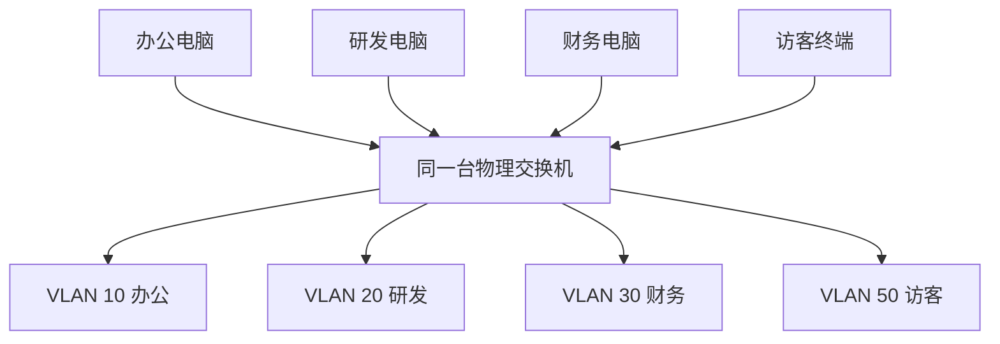
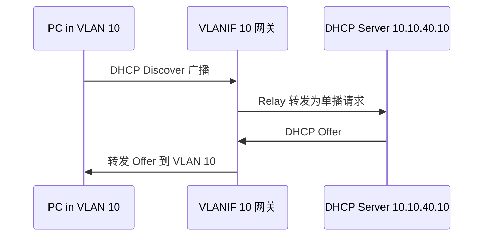

# 第 7 章：VLAN 技术

## 7.1 学习目标

学完本章后，你应该能够：

- 理解 VLAN 解决的核心问题。
- 规划企业 VLAN 与 IP 地址之间的对应关系。
- 正确配置 Access 端口和 Trunk 端口。
- 理解 802.1Q 标签、PVID、Native VLAN 的含义。
- 掌握 VLAN 间通信的常见实现方式。
- 能够排查 VLAN 不通、DHCP 异常、跨交换机不通等故障。

VLAN 是企业交换网络中最重要的基础技术之一。没有 VLAN，企业网络很难做到部门隔离、业务隔离、安全控制和故障范围控制。

## 7.2 VLAN 的作用

VLAN 是 Virtual Local Area Network，即虚拟局域网。它可以在同一套物理交换网络上划分多个逻辑二层网络。

例如同一台交换机上连接了财务部、研发部和访客终端：

```text
VLAN 10：办公网
VLAN 20：研发网
VLAN 30：财务网
VLAN 50：访客网
```

这些 VLAN 之间默认二层隔离。VLAN 10 的广播不会进入 VLAN 20，VLAN 30 的终端也不能直接二层访问 VLAN 50。

VLAN 主要解决：

- 缩小广播域。
- 隔离不同部门和业务。
- 提高网络安全性。
- 方便地址规划和策略控制。
- 让同一物理网络承载多个逻辑网络。

如果没有 VLAN，所有终端都在同一个广播域内。一个部门的 ARP 广播、地址冲突、环路或病毒流量都可能影响其他部门。VLAN 的价值不是“把网络变复杂”，而是让企业可以按部门、业务、安全等级和运维边界分块管理。



物理上，这些终端可能都插在同一台交换机上；逻辑上，它们已经被划分到不同二层网络。

## 7.3 VLAN 与 IP 网段的关系

常规企业设计中，通常一个 VLAN 对应一个 IP 网段。

示例：

| VLAN | 名称 | 网段 | 网关 |
| ---: | --- | --- | --- |
| 10 | Office | 10.10.10.0/24 | 10.10.10.1 |
| 20 | R&D | 10.10.20.0/24 | 10.10.20.1 |
| 30 | Finance | 10.10.30.0/24 | 10.10.30.1 |
| 40 | Server | 10.10.40.0/24 | 10.10.40.1 |
| 50 | Guest-WiFi | 10.10.50.0/24 | 10.10.50.1 |
| 250 | Management | 10.10.250.0/24 | 10.10.250.1 |

这种对应关系清晰、易维护、便于防火墙策略编写。

不建议多个业务混用一个 VLAN，也不建议一个 VLAN 中随意混用多个 IP 网段。虽然技术上某些场景可以做到，但会增加排错复杂度。

### 为什么通常一个 VLAN 对应一个网段

一个 VLAN 是一个二层广播域，一个 IP 网段是一个三层地址范围。把两者一一对应，能让网络边界清晰：

- 看到 VLAN 10，就知道对应 `10.10.10.0/24`。
- 看到 `10.10.30.25`，就知道它应属于财务 VLAN 30。
- 写 ACL 或防火墙策略时，可以按网段代表部门或业务。
- 排查 DHCP 时，可以快速判断终端是否拿到正确地址池。

如果 VLAN 和网段关系混乱，就会出现“终端明明在 VLAN 10，却拿到 VLAN 20 地址”“同一 VLAN 内有多个网关”“安全策略无法准确匹配部门”等问题。

### 地址容量规划

VLAN 规划要考虑终端数量，而不是只按部门名称创建。

| 场景 | 建议考虑 |
| --- | --- |
| 20 人以内小部门 | `/27` 或 `/26` 可能足够 |
| 100-200 人办公区 | `/24` 更常见 |
| 访客无线 | 要考虑峰值人数和租期 |
| 摄像头 | 端口固定，但数量可能持续增加 |
| 服务器 VLAN | 地址数量不一定多，但安全要求高 |
| 管理 VLAN | 地址少，但访问控制必须严格 |

初学阶段可以优先使用 `/24` 做实验，便于理解。真实项目中要结合人数、设备增长、DHCP 租期和地址汇总规划。

## 7.4 VLAN 划分方式

### 基于端口划分

最常见。交换机端口属于某个 VLAN，接到该端口的终端自然进入该 VLAN。

适合：

- 办公网。
- 打印机。
- 摄像头。
- IP 电话。
- 固定工位。

### 基于 MAC 地址划分

根据终端 MAC 地址分配 VLAN。终端移动到其他端口时仍可进入原 VLAN。

适合少量特殊场景，但维护成本较高，因为 MAC 地址需要登记和管理。

### 基于认证动态分配

通过 802.1X、MAC 认证或 Portal 认证，由认证服务器动态下发 VLAN。

适合安全要求较高的大型企业、校园网、办公网准入控制场景。

### 基于 SSID 划分

无线网络中，一个 SSID 可以映射到一个 VLAN。

例如：

| SSID | VLAN | 用途 |
| --- | ---: | --- |
| Corp-WiFi | 40 | 员工无线 |
| Guest-WiFi | 50 | 访客无线 |
| IoT-WiFi | 60 | 物联网设备 |

## 7.5 802.1Q 标签

交换机之间传递多个 VLAN 流量时，需要在以太网帧中加入 VLAN 标签。最常见的标准是 IEEE 802.1Q。

简化理解：

```text
普通以太网帧：
目的 MAC | 源 MAC | 类型 | 数据

802.1Q 帧：
目的 MAC | 源 MAC | VLAN 标签 | 类型 | 数据
```

VLAN 标签中包含 VLAN ID。VLAN ID 范围通常是 1-4094，其中 VLAN 1 常为默认 VLAN，不建议承载生产业务。

Access 口发给终端的帧通常不带标签，因为普通电脑网卡默认不理解 VLAN 标签。Trunk 口在交换机之间传输时，多数 VLAN 的流量会带标签。

### 标签在路径中的变化

以 VLAN 10 的电脑访问同 VLAN 另一台电脑为例，如果两台电脑连接在不同交换机上：


过程如下：

1. PC1 发出普通无标签以太网帧。
2. Access 端口把该帧归入 VLAN 10。
3. 交换机从 Trunk 口发送时加上 VLAN 10 标签。
4. 对端交换机收到标签后知道该帧属于 VLAN 10。
5. 发往 PC2 的 Access 端口时去掉标签。

因此，普通终端通常感知不到 VLAN 标签；交换机之间靠标签识别不同 VLAN。

## 7.6 Access 端口配置

Access 口只属于一个 VLAN，适合连接普通终端。

### 场景

GE0/0/1 连接财务部电脑，需要放入 VLAN 30。

配置逻辑：

```text
创建 VLAN 30
进入接口 GE0/0/1
设置端口类型为 Access
设置 Access VLAN 为 30
```

验证：

```text
查看 VLAN 30 是否存在
查看 GE0/0/1 是否属于 VLAN 30
终端获取的 IP 是否为 10.10.30.0/24
终端能否 ping 通 10.10.30.1
```

### 接入口规范

企业中建议对接入口做基础规范：

- 明确端口描述，例如 `Finance-PC-01`。
- 关闭未使用端口。
- 未使用端口放入隔离 VLAN。
- 必要时开启端口安全。
- 对摄像头、打印机等固定设备可绑定 MAC 或限制 MAC 数量。
- 接入口启用边缘端口或 PortFast 类功能，减少终端上线等待时间。

## 7.7 Trunk 端口配置

Trunk 口用于承载多个 VLAN，常见于交换机互联。

### 场景

接入交换机上联核心交换机，需要承载 VLAN 10、20、30、250。

配置逻辑：

```text
创建 VLAN 10、20、30、250
进入上联接口 GE0/0/24
设置端口类型为 Trunk
允许 VLAN 10、20、30、250 通过
```

验证：

```text
查看 GE0/0/24 是否为 Trunk
查看 Trunk 允许 VLAN 列表
在不同 VLAN 的终端测试网关连通性
查看核心交换机是否学习到接入侧 MAC
```

### Trunk 设计原则

不要为了省事允许所有 VLAN 通过所有 Trunk。推荐只放行业务需要的 VLAN。

原因：

- 减少广播扩散范围。
- 降低误配置风险。
- 提升安全性。
- 方便排查跨交换机问题。

### Trunk 放行规划

可以用表格明确每条上联需要承载哪些 VLAN：

| 链路 | 连接 | 允许 VLAN | 不允许的原因示例 |
| --- | --- | --- | --- |
| Access-1 到 Core | 1 楼办公区 | 10,30,40,50,250 | 不承载其他楼层的专用 VLAN |
| Access-2 到 Core | 2 楼研发区 | 20,40,50,250 | 不承载财务 VLAN 30 |
| Core 到防火墙 | 安全边界 | 40,50 或三层接口 | 只承载需要过墙的安全区域 |
| Core 到无线控制器 | 无线业务 | 40,50,60 | 只承载员工、访客、IoT 无线 VLAN |

实际维护中，Trunk 放行表可以和网络拓扑图一起保存。变更 VLAN 时先查表，再改配置，避免“创建了 VLAN，但忘记中间某条 Trunk 放行”的问题。

## 7.8 PVID 与 Native VLAN

不同厂商对无标签帧的处理名称不同，常见概念包括 PVID 和 Native VLAN。

### PVID

PVID 是端口默认 VLAN ID。当端口收到无标签帧时，交换机会把该帧归入 PVID 对应 VLAN。

Access 口的 PVID 通常就是它所属的 VLAN。

### Native VLAN

Cisco 设备中常见 Native VLAN 概念。Trunk 上 Native VLAN 的流量可以不带标签传输。

工程建议：

- 不要使用 VLAN 1 承载业务。
- Trunk 两端 Native VLAN 或 PVID 必须一致。
- 未使用 VLAN 可以作为 Native VLAN，但不要接入终端。
- 有条件时让 Trunk 上所有业务 VLAN 都打标签。

Native VLAN 不一致可能导致流量被错误归类，出现安全隐患或通信异常。

## 7.9 VLAN 间通信

不同 VLAN 默认二层隔离。如果 VLAN 10 要访问 VLAN 20，需要三层设备参与。

常见方式有三种：

### 单臂路由

路由器或防火墙通过一个物理接口的多个子接口连接交换机 Trunk，每个子接口作为一个 VLAN 网关。

适合：

- 小型网络。
- 实验环境。
- 防火墙作为多个安全区域网关的场景。

缺点：

- 单接口承载多 VLAN，性能和可靠性受限。
- 配置和排错需要关注子接口标签。

### 三层交换机 SVI

在三层交换机上为每个 VLAN 创建 VLANIF 或 SVI 接口，作为该 VLAN 网关。

适合：

- 园区网。
- 内部 VLAN 间高速转发。
- 核心交换机承担网关。

示例：

```text
VLAN 10 网关：10.10.10.1
VLAN 20 网关：10.10.20.1
VLAN 30 网关：10.10.30.1
```

### 防火墙作为网关

每个 VLAN 的网关在防火墙上，VLAN 间通信必须经过防火墙策略。

适合：

- 安全隔离要求高的网络。
- 服务器区、DMZ、办公区之间需要细粒度控制。

缺点：

- 所有跨 VLAN 流量经过防火墙，需关注性能。
- 策略设计和日志分析要求更高。

### 三种方式对比

| 方式 | 网关位置 | 优点 | 局限 |
| --- | --- | --- | --- |
| 单臂路由 | 路由器或防火墙子接口 | 结构直观，适合实验和小型网络 | 单接口压力大，扩展性有限 |
| 三层交换机 SVI | 核心或汇聚三层交换机 | 转发性能高，适合园区内部 VLAN 间通信 | 安全控制粒度通常不如防火墙 |
| 防火墙网关 | 防火墙接口或子接口 | 策略和日志能力强 | 性能和策略复杂度要重点规划 |

一个常见设计是：普通办公 VLAN 之间由三层交换机快速转发；服务器区、财务区、访客区、DMZ 等敏感区域通过防火墙控制。这样既保留性能，也保留关键边界的安全审计。

### VLAN 与 DHCP Relay

DHCP Discover 是广播，默认不能跨 VLAN。如果 DHCP 服务器不在本 VLAN，必须由网关设备做 DHCP Relay。



所以，终端拿不到地址时，不能只看 DHCP 服务器，还要看接入口 VLAN、Trunk、网关 SVI、Relay 地址和服务器回程路由。

## 7.10 企业 VLAN 规划案例

### 需求

一家 300 人公司，包含办公、研发、财务、服务器、访客无线、监控、设备管理。

### 规划

| VLAN | 名称 | 网段 | 网关 | 说明 |
| ---: | --- | --- | --- | --- |
| 10 | Office | 10.10.10.0/24 | 10.10.10.1 | 普通办公 |
| 20 | R&D | 10.10.20.0/24 | 10.10.20.1 | 研发终端 |
| 30 | Finance | 10.10.30.0/25 | 10.10.30.1 | 财务终端 |
| 40 | Server | 10.10.40.0/24 | 10.10.40.1 | 内部服务器 |
| 50 | Guest | 10.10.50.0/24 | 10.10.50.1 | 访客无线 |
| 60 | Camera | 10.10.60.0/24 | 10.10.60.1 | 摄像头 |
| 250 | Management | 10.10.250.0/24 | 10.10.250.1 | 网络设备管理 |

### 策略建议

- Office 可以访问常用办公系统。
- R&D 可以访问研发服务器，不允许访问财务终端。
- Finance 只允许访问财务系统和必要办公系统。
- Guest 只能访问互联网，不允许访问内网。
- Camera 只允许访问录像服务器和时间服务器。
- Management 只允许运维人员访问。

这里可以看出，VLAN 规划和安全策略是连在一起的。VLAN 不是单纯的二层技术，而是后续访问控制的基础。

### 规划原则

企业 VLAN 规划建议遵循：

- VLAN ID 与业务含义固定，不随意复用。
- VLAN 名称清楚，例如 `Finance`、`Guest`、`Camera`。
- 网段、网关、DHCP 地址池和安全策略同步规划。
- 管理 VLAN 与用户 VLAN 分开。
- 访客、摄像头、IoT 等低可信终端单独隔离。
- Trunk 只放行需要的 VLAN。
- 保留一部分 VLAN ID 用于后续扩展。

示例编号方法：

| VLAN 范围 | 用途 |
| --- | --- |
| 10-39 | 办公部门 |
| 40-79 | 服务器和业务系统 |
| 80-119 | 无线、访客、IoT |
| 200-219 | 监控、门禁、弱电 |
| 250-259 | 网络设备管理 |
| 300 以后 | 预留或特殊项目 |

编号方法不是标准答案，关键是形成文档并长期保持一致。

## 7.11 常见故障与排查

### 终端拿不到 DHCP 地址

可能原因：

- 接入口 VLAN 配错。
- DHCP 地址池没有对应网段。
- DHCP Relay 未配置或配置错误。
- Trunk 没有放行该 VLAN。
- DHCP 服务器或防火墙策略阻断。

排查顺序：

```text
确认终端端口 VLAN
确认上联 Trunk 放行 VLAN
确认网关 SVI 是否 up
确认 DHCP 地址池是否存在
确认 DHCP Relay 指向是否正确
抓包查看是否有 DHCP Discover 和 Offer
```

### 同 VLAN 内不通

可能原因：

- 不在同一个 VLAN。
- IP 掩码配置不一致。
- 终端防火墙阻断。
- 接口 down 或错误包。
- MAC 地址学习异常。

排查：

```text
查看双方 IP 和掩码
查看双方接入口 VLAN
查看交换机 MAC 地址表
查看 ARP 表
尝试互 ping 和抓包
```

### 跨交换机 VLAN 不通

可能原因：

- 中间 Trunk 未放行 VLAN。
- VLAN 未在某台交换机创建。
- Trunk 两端配置不一致。
- STP 阻塞了预期链路。
- 上联链路物理异常。

排查：

```text
逐跳查看 Trunk 允许 VLAN
逐跳查看 MAC 地址是否学习
查看 STP 状态
查看接口状态和错误包
```

### Native VLAN 或 PVID 不一致

现象：

- 某些无标签流量进入错误 VLAN。
- Trunk 两端偶发异常。
- 管理 VLAN 或默认 VLAN 出现不符合预期的 MAC。

排查：

```text
查看 Trunk 两端 PVID/Native VLAN
确认是否有业务依赖无标签流量
查看端口 VLAN 统计
查看是否误用 VLAN 1 承载生产业务
```

### 误删 VLAN

现象：

- 端口配置看似还在，但 VLAN 不存在。
- VLANIF down。
- 该 VLAN 终端全部不通。

排查：

```text
查看 VLAN 列表
查看端口是否仍显示该 VLAN
重新创建 VLAN 后验证 VLANIF 和端口状态
确认配置是否保存
```

## 7.12 验证清单

完成 VLAN 配置后，建议按下面顺序验证：

| 验证项 | 目的 |
| --- | --- |
| VLAN 是否存在 | 防止端口引用不存在 VLAN |
| 接入口 VLAN | 确认终端进入正确广播域 |
| Trunk 允许 VLAN | 确认 VLAN 可以跨设备传递 |
| MAC 地址表 | 确认终端 MAC 在正确 VLAN 学习 |
| ARP 表 | 确认网关和终端互相解析 |
| VLANIF/SVI 状态 | 确认网关接口 up |
| DHCP 地址 | 确认终端拿到正确网段 |
| 安全策略 | 确认跨 VLAN 访问符合业务要求 |

验证时不要只测试“能不能 ping 通”。还要确认地址是否来自正确 VLAN、路径是否经过预期设备、策略是否符合设计。

## 7.13 VLAN 设计评审

VLAN 设计会直接影响地址规划、安全策略、广播范围和故障隔离。上线前建议做一次 VLAN 评审，而不是只确认“VLAN ID 没重复”。

| 评审项 | 合理做法 | 风险做法 |
| --- | --- | --- |
| VLAN 命名 | 名称能体现用途，如 `OFFICE`, `GUEST`, `CAMERA` | 只写 `VLAN10`, 无业务含义 |
| VLAN 与网段 | 一个 VLAN 通常对应一个主网段 | 多个无关业务混在同一 VLAN |
| 网关位置 | 明确在核心、防火墙或路由器 | 不清楚流量从哪里跨 VLAN |
| Trunk 放行 | 只放行业务需要的 VLAN | 所有 Trunk 默认允许全部 VLAN |
| 访客网络 | 独立 VLAN，通常只允许上网 | 与办公 VLAN 混用 |
| 管理 VLAN | 只给网络设备管理使用 | 普通终端可随意进入管理网 |
| DHCP Relay | 每个需要 DHCP 的 VLAN 都有明确 Relay | 部分 VLAN 依赖广播跨网段 |

例如下面的规划比“所有人都放 VLAN 10”更容易管理：

| 业务 | VLAN | 网段 | 网关位置 | 基本访问策略 |
| --- | ---: | --- | --- | --- |
| 办公 | 10 | `10.10.10.0/24` | 核心交换机 | 可访问 OA、DNS、打印 |
| 研发 | 20 | `10.10.20.0/24` | 核心交换机 | 可访问研发服务器 |
| 财务 | 30 | `10.10.30.0/24` | 防火墙或核心 | 只允许必要系统 |
| 员工无线 | 40 | `10.10.40.0/24` | 核心交换机 | 同办公策略或受限策略 |
| 访客无线 | 50 | `10.10.50.0/24` | 防火墙 | 只允许互联网 |
| 摄像头 | 60 | `10.10.60.0/24` | 核心交换机 | 只允许访问录像服务器 |
| 管理 | 250 | `10.10.250.0/24` | 核心交换机 | 只允许运维终端访问 |

VLAN 评审的目标不是把网络切得越碎越好，而是在广播控制、安全隔离和运维复杂度之间取得平衡。每增加一个 VLAN，都要同步考虑网关、DHCP、路由、策略、监控和文档。

## 7.14 VLAN 迁移和扩容流程

生产网络中经常需要新增 VLAN 或把一批终端迁移到新 VLAN。这个过程如果只改接入口，可能导致终端拿不到地址、访问策略缺失或网关不可达。

建议按下面顺序实施：

```text
1. 确认新 VLAN ID、名称、网段、网关和 DHCP 范围。
2. 在核心或网关设备创建 VLANIF/SVI 或子接口。
3. 配置 DHCP 地址池或 DHCP Relay。
4. 在上联 Trunk 上放行新 VLAN。
5. 在接入交换机创建 VLAN 并配置测试端口。
6. 用测试终端验证地址、网关、DNS、业务访问。
7. 配置防火墙策略和监控对象。
8. 分批迁移生产端口。
9. 更新端口表、VLAN 表和地址规划表。
```

验证时要覆盖下面路径：

| 验证方向 | 示例 |
| --- | --- |
| 终端到网关 | `10.10.70.25` ping `10.10.70.1` |
| 终端到 DNS | 查询内部域名 |
| 终端到业务系统 | 访问 OA、文件服务器或业务端口 |
| 网关到终端 | 查看 ARP，必要时从网关 ping 终端 |
| 跨交换机传递 | 在接入和核心分别查看 MAC 表 |
| 策略命中 | 在防火墙或 ACL 上确认允许/拒绝符合预期 |

如果迁移后出现异常，先确认终端是否拿到新 VLAN 地址，再检查 Trunk 是否全路径放行。很多 VLAN 故障不是网关配置错误，而是中间某一段 Trunk 没有允许新 VLAN。

## 7.15 本章自检

请尝试回答：

- 为什么 VLAN 可以缩小广播域。
- 为什么普通电脑接入口通常不发送带 VLAN 标签的帧。
- Trunk 口为什么需要 802.1Q 标签。
- 一个 VLAN 对应多个 IP 网段会带来哪些排错问题。
- DHCP 服务器在服务器 VLAN 时，办公 VLAN 为什么需要 DHCP Relay。
- 访客无线为什么不应该和办公网共用一个 VLAN。

练习：

```text
公司有办公、研发、财务、服务器、访客无线、摄像头和管理网络。
办公约 180 人，研发约 80 人，财务约 30 人，摄像头约 120 个。
```

请设计 VLAN ID、网段、网关和基本策略，并写出 Trunk 上联应允许哪些 VLAN。

## 7.16 本章小结

VLAN 是企业网络隔离和规划的基础。一个合格的 VLAN 设计应该同时考虑广播域、安全边界、IP 地址规划、Trunk 放行范围、网关位置和后续防火墙策略。配置 VLAN 时，重点不是“创建 VLAN”这一步，而是确保端口归属、跨设备传递、网关、DHCP 和策略都一致。
