# 第 8 章：生成树协议 STP

## 8.1 学习目标

学完本章后，你应该能够：

- 解释二层环路为什么会导致广播风暴、MAC 地址漂移和重复帧。
- 理解企业交换网络为什么既需要冗余链路，又不能让冗余链路随意形成环路。
- 说明 STP 的核心目标：在物理冗余拓扑中计算出一棵无环的逻辑树。
- 理解 BPDU、Bridge ID、根桥、根路径开销、端口角色和端口状态。
- 判断根桥、Root Port、Designated Port、Blocked/Alternate Port 的基本选择逻辑。
- 区分 STP、RSTP、PVST、MSTP 的常见用途和差异。
- 能够为小型企业交换网络规划 STP 根桥、备份根桥和边缘端口。
- 能够看懂厂商中立的 STP 配置步骤。
- 能够通过 STP 状态、拓扑变化、MAC 漂移、端口角色和日志定位常见二层环路问题。

第 6 章讲过交换机如何根据 MAC 地址表转发帧，也讲过二层环路会导致广播风暴和 MAC 漂移。第 7 章讲过 VLAN 如何把交换网络划分成多个广播域。本章继续解决交换网络里一个非常关键的问题：

```text
如果交换机之间为了可靠性接了多条链路，怎样避免这些链路形成二层环路？
```

企业网络不能只靠一条上联。接入交换机只有一条上联时，一旦这条链路、光模块、对端端口或上级交换机故障，整个接入区域可能掉线。因此网络工程师通常会做冗余链路。但是在二层网络中，多接一条线并不一定更安全。如果没有环路控制，多条链路可能让广播帧在交换机之间不断循环，短时间内拖垮整个 VLAN。

STP，也就是 Spanning Tree Protocol，生成树协议，就是为了解决这个矛盾而出现的：

```text
物理上保留冗余链路。
逻辑上阻塞部分链路。
正常时避免环路。
故障时启用备份路径。
```

学习 STP 不要只背端口角色。真正重要的是理解它在企业交换网络中的位置：它是二层网络的安全底线之一。只要你的网络里还有跨交换机 VLAN、二层上联、冗余链路、用户私接交换机或环路风险，就必须理解 STP。

## 8.2 为什么二层网络怕环路

在三层 IP 网络中，IP 包有 TTL 字段。一个 IP 包每经过一台三层设备，TTL 通常减 1，减到 0 后被丢弃。这能防止三层路由环路中的包无限转发。

但普通以太网帧没有类似 TTL 的字段。交换机收到广播帧、未知单播帧时，会在同一 VLAN 内泛洪。如果拓扑中存在环路，帧可能被不断复制和转发。

先看一个没有冗余的简单拓扑：

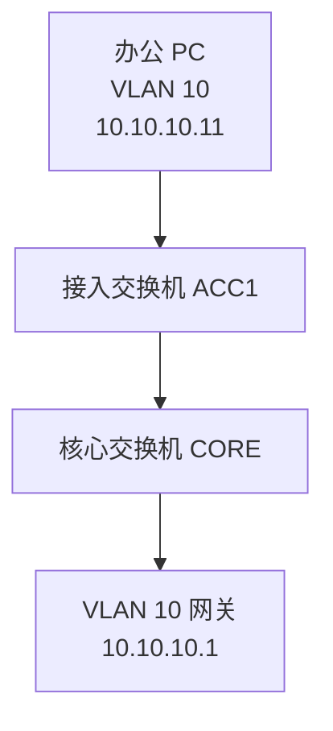

这条路径很清晰。PC 发出的 ARP 广播只会沿着接入交换机到核心交换机的方向传播，不会绕回来。

如果接入交换机到核心交换机之间只接一条线，可靠性较差：

| 故障点 | 影响 |
| --- | --- |
| 上联网线断开 | 该接入交换机下所有 VLAN 到上级网络中断 |
| 上联光模块故障 | 同上 |
| 核心交换机端口故障 | 同上 |
| 接入交换机上联端口故障 | 同上 |

为了提高可靠性，工程中可能会接两条上联，或者把接入交换机同时连接到两台汇聚/核心交换机。

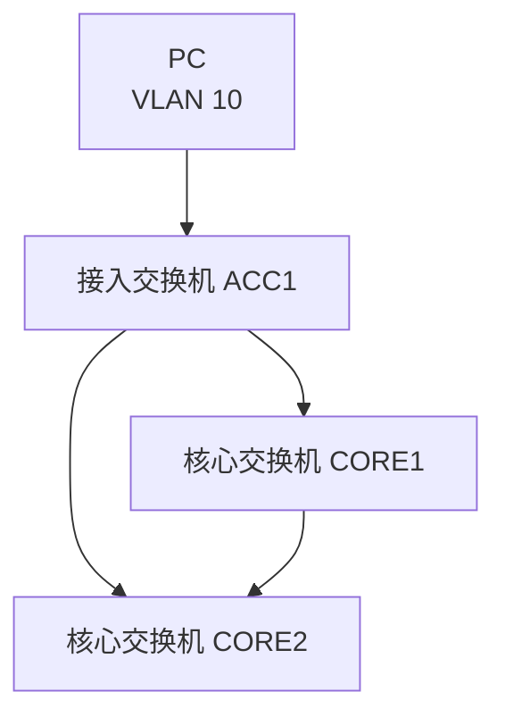

这时物理上形成了一个三角形：

```text
ACC1 -> CORE1 -> CORE2 -> ACC1
```

三角形在网络拓扑图上看起来很可靠，但在二层网络中，如果没有 STP、链路聚合或三层边界，就可能形成环路。

### 广播帧会无限循环

假设 PC1 在 VLAN 10 中发送 ARP 请求：

```text
谁是 10.10.10.1？请告诉 10.10.10.11。
```

ARP 请求是二层广播帧，目的 MAC 是：

```text
FF:FF:FF:FF:FF:FF
```

交换机收到广播帧后，会在同一 VLAN 的其他端口泛洪。若拓扑中有环路，可能发生以下过程：

1. ACC1 从 PC1 收到 ARP 广播。
2. ACC1 把广播从上联发给 CORE1 和 CORE2。
3. CORE1 收到后继续向 CORE2 泛洪。
4. CORE2 收到后继续向 ACC1 泛洪。
5. ACC1 又从上联收到自己刚才间接发出去的广播。
6. 这个广播可能再次被复制、泛洪、循环。

二层广播帧不会因为“经过次数太多”自动消失。只要环路存在，广播帧可能持续循环，并且在每次经过交换机时被复制，形成广播风暴。

### MAC 地址会来回漂移

交换机通过源 MAC 学习地址。正常情况下，某台 PC 的 MAC 地址应该稳定出现在它接入的端口方向。

例如：

| VLAN | MAC 地址 | 端口 |
| --- | --- | --- |
| 10 | `AA:AA:AA:AA:10:11` | `GE1/0/1` |

如果存在环路，同一台 PC 发出的帧可能从多个方向绕回交换机。交换机看到同一个源 MAC 一会儿从接入口出现，一会儿从上联口出现，就会不断修改 MAC 地址表。

日志中可能看到类似信息：

```text
MAC AA:AA:AA:AA:10:11 moved from GE1/0/1 to GE1/0/48 in VLAN 10
MAC AA:AA:AA:AA:10:11 moved from GE1/0/48 to GE1/0/47 in VLAN 10
```

这就是 MAC 地址漂移。少量 MAC 移动可能是无线漫游、虚拟机迁移或终端换口，但大量 MAC 在短时间内频繁漂移，尤其发生在上联口和接入口之间时，要高度怀疑二层环路。

### 终端可能收到重复帧

二层环路不只影响广播。某些单播帧也可能因为 MAC 表不稳定、未知单播泛洪或环路复制而被重复送达。终端或上层协议可能表现为：

- 网络时通时断。
- ping 延迟忽高忽低，甚至出现重复响应。
- 文件传输卡顿。
- 语音或视频会议抖动。
- 交换机 CPU 升高，远程登录很慢。
- DHCP 获取地址异常。

二层环路的危险在于扩散快、影响范围大。一个用户在会议室私接小交换机并插成环，可能让整个 VLAN 甚至整个楼层网络异常。

## 8.3 冗余链路与环路的矛盾

企业网络需要冗余，原因很简单：单链路、单设备、单路径都有故障风险。

常见冗余设计包括：

| 冗余对象 | 设计方式 | 目的 |
| --- | --- | --- |
| 接入上联 | 接入交换机双上联到汇聚/核心 | 避免单上联故障 |
| 汇聚互联 | 两台汇聚交换机之间互联 | 保持二层或三层连通 |
| 核心设备 | 双核心或堆叠/虚拟化 | 避免单核心故障 |
| 服务器接入 | 服务器双网卡连接两台交换机 | 避免单网卡或单交换机故障 |
| AP/摄像头接入 | 不建议随意双接 | 终端侧通常用单链路，避免环路 |

但是冗余链路不能随意并联。在二层网络中，两台交换机之间直接接两条普通链路，或者三台交换机形成闭环，都可能造成环路。

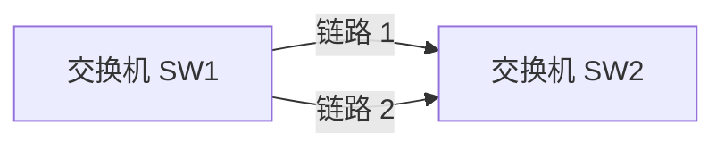

如果链路 1 和链路 2 都是普通二层链路，又没有 STP 阻塞，也没有链路聚合把它们变成一条逻辑链路，就相当于在两台交换机之间形成了环。

正确处理冗余链路有三类常见方法：

| 方法 | 思路 | 适用场景 |
| --- | --- | --- |
| STP/RSTP/MSTP | 阻塞部分端口，保留备份链路 | 二层冗余、防环基础 |
| 链路聚合 | 把多条物理链路绑定成一条逻辑链路 | 两台设备之间多链路并联 |
| 三层上联 | 交换机之间使用三层接口和路由 | 大中型园区网、减少二层范围 |

本章讲 STP。第 9 章会讲链路聚合，第 10 章会讲三层交换。实际工程中，这三类技术经常配合使用。

## 8.4 STP 的核心思想

STP 的目标不是把物理线拔掉，而是在逻辑上选择哪些端口转发、哪些端口阻塞。

可以把 STP 理解为：

```text
在有环的二层物理拓扑中，计算出一棵没有环的逻辑转发树。
```

看下面这个三交换机拓扑：

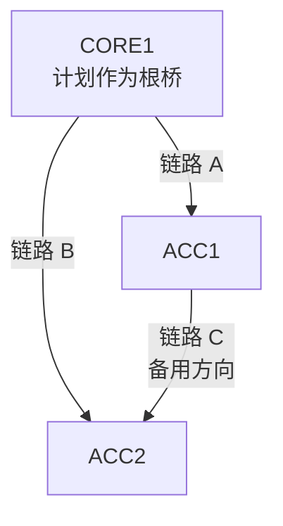

如果三条链路都转发，拓扑存在环路。STP 会让其中一条链路的某个端口进入阻塞或备用状态。逻辑转发树可能变成：

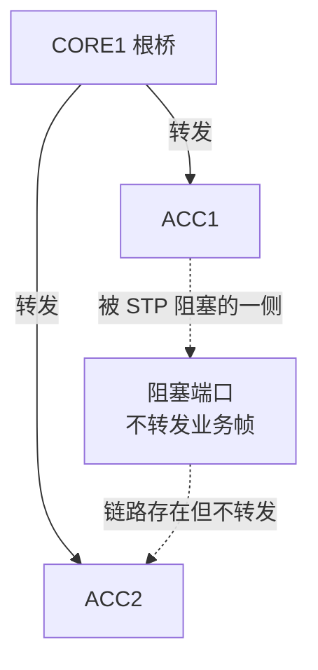

此时物理链路仍然插着，但被阻塞的端口不转发普通业务帧，所以二层环路被打断。

当一条转发链路故障时，STP 可以重新计算，让原本阻塞的端口变为转发，从而恢复连通。

```text
正常时：阻塞备用链路，避免环路。
故障时：放开备用链路，恢复路径。
```

这就是 STP 在企业网络中的价值。

## 8.5 BPDU：交换机之间的 STP 报文

STP 需要交换机之间交换信息，才能判断谁是根桥、哪条路径更优、哪个端口应该转发或阻塞。交换机之间用于 STP 计算的报文叫 BPDU。

BPDU 是 Bridge Protocol Data Unit，桥协议数据单元。初学阶段可以先把 BPDU 理解成：

```text
交换机之间互相通告 STP 身份、路径和端口信息的控制报文。
```

BPDU 中常见关键信息包括：

| 信息 | 作用 |
| --- | --- |
| Root Bridge ID | 当前认为的根桥是谁 |
| Root Path Cost | 到根桥的路径开销 |
| Sender Bridge ID | 发送 BPDU 的交换机身份 |
| Sender Port ID | 发送 BPDU 的端口身份 |
| Timer 信息 | STP 老化、转发延迟等时间参数 |

交换机通过比较 BPDU，逐步达成一致：

- 哪台交换机是整个生成树的根桥。
- 每台非根交换机从哪个端口到根桥最优。
- 每条链路上哪个端口负责向该网段转发。
- 哪些端口需要阻塞，避免形成环路。

### BPDU 不是普通业务流量

BPDU 是控制报文，不是用户访问 OA、DNS、DHCP、文件服务器的业务流量。普通终端口理论上不应该收到 BPDU。如果普通接入口收到 BPDU，常见原因包括：

- 用户私接了小交换机。
- 接入口误接到其他网络设备。
- 现场布线错误，把两个墙口或交换机口互相接起来。
- 某些虚拟化、桥接或实验设备在发送 STP 报文。

因此企业中常会在普通终端口启用 BPDU 防护。后面会讲它的作用。

## 8.6 Bridge ID 与根桥

STP 的第一步是选根桥。根桥是整棵生成树的中心参考点，所有其他交换机都以“到根桥的路径”为依据计算端口角色。

每台交换机都有 Bridge ID。Bridge ID 可以理解成 STP 中交换机的身份。

Bridge ID 通常由两部分组成：

```text
Bridge ID = 优先级 + MAC 地址
```

比较 Bridge ID 时，数值越小越优。

| 字段 | 说明 | 选择规则 |
| --- | --- | --- |
| 优先级 | 人为配置的 STP 优先级 | 越小越优 |
| MAC 地址 | 设备桥 MAC | 优先级相同时，越小越优 |

如果所有交换机都使用默认优先级，那么 MAC 地址最小的交换机会成为根桥。这通常不是我们想要的结果，因为 MAC 地址和网络角色没有必然关系。

### 根桥应该放在哪里

根桥应该放在网络拓扑的中心位置，通常是核心交换机或汇聚交换机，而不是普通接入交换机。

原因：

- 根桥是所有二层路径计算的参考中心。
- 非根交换机会选择到根桥的最优路径。
- 根桥位置会影响哪些链路转发、哪些链路阻塞。
- 如果根桥落到接入层，流量路径可能绕远，收敛也不符合设计。

小型企业常见设计：

| 设备 | STP 角色建议 |
| --- | --- |
| `SW-CORE-HQ-01` | VLAN 10/20/30/40/50/60/70 的主根桥 |
| `SW-CORE-HQ-02` | 备份根桥 |
| 接入交换机 | 不应成为根桥 |

双核心场景也可以按 VLAN 分担根桥：

| VLAN | 主根桥 | 备份根桥 | 说明 |
| --- | --- | --- | --- |
| 10 OFFICE | CORE1 | CORE2 | 办公网主走 CORE1 |
| 20 RD | CORE1 | CORE2 | 研发网主走 CORE1 |
| 30 FINANCE | CORE2 | CORE1 | 财务网主走 CORE2 |
| 40 SERVER | CORE2 | CORE1 | 服务器区主走 CORE2 |
| 50 GUEST | CORE1 | CORE2 | 访客无线主走 CORE1 |
| 60 MGMT | CORE2 | CORE1 | 管理网主走 CORE2 |

这种设计只有在使用按 VLAN 计算生成树的协议时才有意义，例如 PVST 类机制，或者在 MSTP 中把不同 VLAN 映射到不同实例。普通单实例 STP 不会为每个 VLAN 单独算一棵树。

### 为什么要手动设置根桥

如果不手动设置根桥，可能发生以下问题：

| 问题 | 后果 |
| --- | --- |
| 接入交换机因为 MAC 最小成为根桥 | 流量绕行，阻塞点不符合设计 |
| 更换设备后根桥变化 | 拓扑重新收敛，引发业务抖动 |
| 用户私接交换机发出更优 BPDU | 根桥被抢占，网络路径异常 |
| 双核心没有主备关系 | 故障时路径不可控 |

工程建议：

- 明确指定主根桥和备份根桥。
- 核心/汇聚设备使用较低 STP 优先级。
- 接入设备使用较高 STP 优先级。
- 普通终端口启用根保护或 BPDU 防护，防止外部设备影响根桥。

## 8.7 路径开销与端口选择

根桥选出来后，每台非根交换机要选择自己到根桥的最佳路径。STP 使用路径开销来衡量路径优劣。

一般来说，链路速率越高，开销越低。不同标准和厂商可能使用不同成本值，真实设备以厂商显示为准。理解时可以记住：

```text
更高速率的链路通常更优。
到根桥总开销越小，路径越优。
```

示例：

| 链路速率 | 相对理解 |
| --- | --- |
| 100 Mbps | 成本较高 |
| 1 Gbps | 成本较低 |
| 10 Gbps | 成本更低 |
| 40/100 Gbps | 成本更低 |

看一个拓扑：

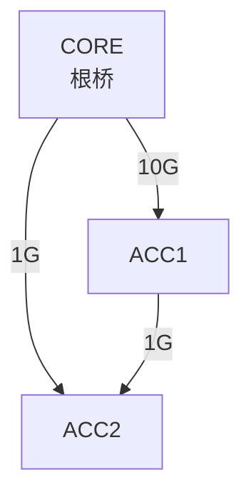

如果 ACC2 到根桥 CORE 有两条路径：

| 路径 | 说明 | 选择倾向 |
| --- | --- | --- |
| ACC2 -> CORE | 直接 1G | 候选 |
| ACC2 -> ACC1 -> CORE | 先 1G 到 ACC1，再 10G 到 CORE | 取决于累计成本 |

STP 比较的是到根桥的累计路径开销，而不是只看某一段链路。工程中如果希望某条链路作为主路径，可以通过调整链路速率、端口成本或根桥位置来实现。

### STP 比较顺序

当交换机比较多个 BPDU 时，常见优先级可以简化为：

1. 根桥 ID 更小者更优。
2. 到根桥的路径开销更小者更优。
3. 发送者 Bridge ID 更小者更优。
4. 发送者 Port ID 更小者更优。

初学阶段不需要一开始死记所有细节，但要理解：STP 不是随机阻塞端口，它有明确的比较规则。端口为什么阻塞，通常可以通过 BPDU 比较结果解释出来。

## 8.8 STP 端口角色

STP 端口角色描述一个端口在生成树中的职责。常见角色包括 Root Port、Designated Port、Blocked Port。RSTP 中还会常见 Alternate Port、Backup Port 等说法。

### Root Port 根端口

Root Port 是非根交换机上到根桥最优的端口。

每台非根交换机通常只有一个 Root Port。根桥自己没有 Root Port，因为它就是根。

示例：

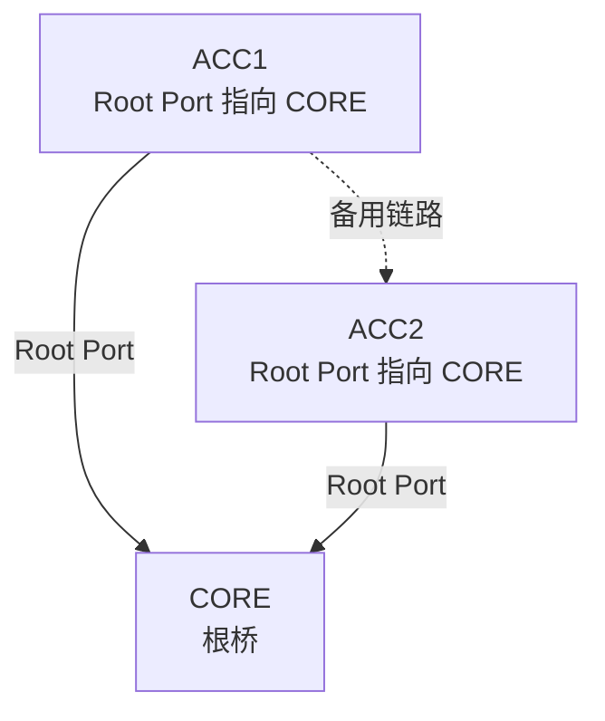

对 ACC1 来说，到根桥 CORE 的最优端口就是 Root Port。Root Port 通常处于转发状态。

### Designated Port 指定端口

Designated Port 是某条链路或某个网段上负责向该网段转发到根桥方向流量的端口。

可以简化理解为：

```text
在每一段二层链路上，STP 会选出一个最适合转发的端口，叫 Designated Port。
```

根桥上的端口通常都是 Designated Port，因为根桥到自己路径开销为 0，最优。

### Blocked Port 阻塞端口

如果某个端口既不是 Root Port，也不是 Designated Port，为了防止环路，它会被阻塞。

被阻塞的端口：

- 不转发普通业务帧。
- 不学习普通业务 MAC。
- 仍然可以接收或处理 STP BPDU。
- 在主路径故障时可能参与重新计算。

注意：阻塞不是链路坏了。链路物理层可能是 up 的，只是 STP 逻辑上不让它转发业务流量。

### RSTP 中的 Alternate Port

RSTP 是快速生成树。它常使用 Alternate Port 表示根端口的备份路径。

例如 ACC2 到根桥的主路径是直连 CORE，另一个通过 ACC1 到 CORE 的端口可以作为 Alternate Port。正常时不转发，主路径故障时可以更快切换。

| 角色 | 简化理解 | 是否转发业务 |
| --- | --- | --- |
| Root Port | 到根桥的最佳端口 | 是 |
| Designated Port | 某段链路上的指定转发端口 | 是 |
| Blocked Port | STP 阻塞的防环端口 | 否 |
| Alternate Port | RSTP 中到根桥的备份端口 | 正常不转发 |
| Backup Port | 同一交换机到同一共享网段的备份端口 | 正常不转发 |

## 8.9 STP 端口状态

端口角色说明端口的职责，端口状态说明端口当前能做什么。

经典 STP 常见状态：

| 状态 | 是否学习 MAC | 是否转发业务帧 | 说明 |
| --- | --- | --- | --- |
| Disabled | 否 | 否 | 端口关闭或不可用 |
| Blocking | 否 | 否 | 阻塞业务帧，防止环路 |
| Listening | 否 | 否 | 参与 STP 计算，等待稳定 |
| Learning | 是 | 否 | 学习 MAC，但不转发业务帧 |
| Forwarding | 是 | 是 | 正常转发业务 |

经典 STP 从阻塞到转发通常需要经历 Listening 和 Learning。这样做是为了避免拓扑还没稳定时立刻转发，造成临时环路。

### 为什么经典 STP 收敛慢

经典 STP 的默认收敛可能需要几十秒。这个时间对现代网络业务来说比较长。例如：

- 用户电脑可能显示网络断开。
- IP 电话可能重新注册。
- 无线 AP 或摄像头可能短暂离线。
- 某些业务连接可能超时。

这也是为什么企业网络中更常使用 RSTP 或 MSTP，而不是只依赖最早的经典 STP。

## 8.10 RSTP：快速生成树

RSTP 是 Rapid Spanning Tree Protocol，快速生成树协议。它的目标是在保持防环能力的同时，加快拓扑变化后的收敛速度。

RSTP 与经典 STP 的核心差异可以这样理解：

| 对比项 | STP | RSTP |
| --- | --- | --- |
| 收敛速度 | 较慢，常见几十秒级 | 更快，常见秒级 |
| 端口角色 | Root、Designated、Blocked | Root、Designated、Alternate、Backup 等 |
| 边缘端口 | 需要额外加速机制 | 明确支持 Edge Port |
| 适用性 | 早期标准，兼容性好 | 现代企业交换网络常用 |

RSTP 的快速切换依赖更明确的端口角色、握手机制和边缘端口概念。实际工程中，如果设备支持，通常建议启用 RSTP 或 MSTP，而不是只启用经典 STP。

### 边缘端口

边缘端口通常指连接普通终端的端口，例如 PC、打印机、摄像头、IP 电话等。边缘端口不应该连接其他交换机，也不应该参与形成二层环路。

边缘端口的价值：

- 终端接入后可以更快进入转发。
- 避免 PC 开机时等待 STP 收敛导致 DHCP 慢。
- 与 BPDU 防护配合，发现接入口接入交换机时及时保护。

常见建议：

| 端口类型 | 是否建议配置为边缘端口 |
| --- | --- |
| 普通 PC 接入口 | 是 |
| 打印机接入口 | 是 |
| 摄像头接入口 | 是 |
| AP 接入口 | 视设计而定，单 AP 接入常可配置 |
| 交换机上联口 | 否 |
| 汇聚互联口 | 否 |
| 服务器双归或虚拟化 Trunk | 谨慎，按设计确认 |

不要把交换机上联口配置为边缘端口。上联口本来就应该参与 STP 计算。

## 8.11 MSTP 与多 VLAN 场景

第 7 章已经讲过，一个企业网络可能有多个 VLAN。问题是：STP 对这些 VLAN 怎么计算？

不同协议有不同做法：

| 协议类型 | 简化理解 | 优点 | 注意事项 |
| --- | --- | --- | --- |
| STP/CST | 整个二层网络一棵树 | 简单 | 多 VLAN 不能分别优化路径 |
| PVST/PVST+ | 每个 VLAN 一棵树 | 可以按 VLAN 分担路径 | 主要见于特定厂商体系 |
| RSTP | 快速单实例生成树 | 收敛快 | 多 VLAN 仍可能共用一棵树 |
| MSTP | 多生成树实例，每个实例映射多个 VLAN | 兼顾收敛、规模和负载分担 | 需要统一区域配置 |

MSTP 是企业网络中常见的选择。它不是给每个 VLAN 都单独算一棵树，而是把多个 VLAN 映射到少量实例。

示例：

| MST 实例 | 映射 VLAN | 主根桥 | 备份根桥 |
| --- | --- | --- | --- |
| Instance 1 | VLAN 10,20,50 | CORE1 | CORE2 |
| Instance 2 | VLAN 30,40,60,70 | CORE2 | CORE1 |

这样可以让不同 VLAN 组使用不同的主路径：

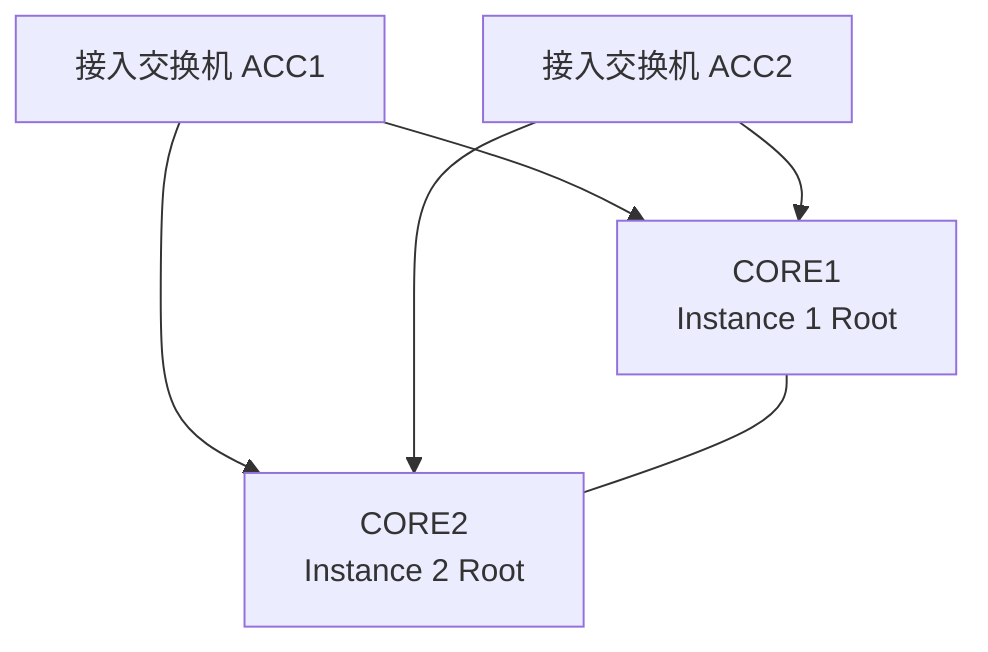

例如：

- VLAN 10、20、50 主要走 CORE1。
- VLAN 30、40、60、70 主要走 CORE2。
- 任一核心故障时，另一个核心接管对应实例路径。

### MSTP 区域配置必须一致

MSTP 的关键是区域一致性。区域名称、修订号、VLAN 到实例的映射必须一致，设备才会认为彼此属于同一个 MST 区域。

常见问题：

| 配置不一致 | 可能后果 |
| --- | --- |
| 区域名称不同 | 设备被视为不同区域，拓扑不按预期 |
| 修订号不同 | 区域不一致 |
| VLAN 映射不同 | 某些 VLAN 路径异常 |
| 只在部分交换机配置 MSTP | 协议互通复杂，行为难判断 |

工程建议：MSTP 配置必须模板化、文档化，并在所有相关交换机上统一下发和核对。

## 8.12 STP 与 VLAN、Trunk 的关系

STP 运行在二层拓扑上，而 VLAN 决定二层广播域范围。Trunk 会把多个 VLAN 承载到交换机之间，因此 STP 状态常常要结合 VLAN 或实例来理解。

### 一个端口物理 up，不代表所有 VLAN 都能转发

某个 Trunk 端口物理上是 up 的，但不同 VLAN 或不同 STP 实例中的状态可能不同。

例如：

| 端口 | VLAN/实例 | STP 状态 |
| --- | --- | --- |
| `GE1/0/48` | VLAN 10 | Forwarding |
| `GE1/0/48` | VLAN 20 | Forwarding |
| `GE1/0/48` | VLAN 30 | Blocking |

这意味着 VLAN 10、20 可以从该端口转发，但 VLAN 30 在该端口上被 STP 阻塞。排查时不能只看端口 up/down，还要看目标 VLAN 的 STP 状态。

### Trunk 未放行与 STP 阻塞要区分

同 VLAN 跨交换机不通时，常见原因有两个：

| 原因 | 现象 | 检查方式 |
| --- | --- | --- |
| Trunk 未放行 VLAN | 该 VLAN 的帧不允许通过链路 | 查 allowed VLAN 列表 |
| STP 阻塞该 VLAN/实例 | 链路存在，但该 VLAN 不转发 | 查 STP 端口状态 |

这两个问题看起来都可能导致“不通”，但修复方式完全不同。Trunk 未放行要修改 VLAN 允许列表；STP 阻塞则要确认阻塞是否符合设计。如果 STP 阻塞是为了防环，不应简单强行关闭 STP 或乱改端口状态。

## 8.13 STP 常用保护机制

STP 本身负责计算无环拓扑，但企业接入网络还需要额外保护机制，防止误接、私接或异常 BPDU 影响网络。

不同厂商名称可能不同，本章使用通用概念描述。

### BPDU 防护

BPDU 防护通常用于普通边缘端口。它的逻辑是：

```text
这个端口被定义为普通终端口，不应该收到 BPDU。
如果收到 BPDU，说明可能接入了交换机或发生误接，立即保护。
```

常见保护动作：

- 关闭端口。
- 将端口置为错误禁用状态。
- 记录日志和告警。

适合启用的位置：

| 端口 | 是否建议 |
| --- | --- |
| PC 接入口 | 建议 |
| 打印机接入口 | 建议 |
| 摄像头接入口 | 建议 |
| 普通会议室网口 | 建议 |
| 交换机上联口 | 不建议 |
| 汇聚互联口 | 不建议 |

BPDU 防护可以阻止用户私接交换机影响生成树。它不是为了阻断普通终端业务，而是为了保证“终端口就是终端口”。

### 根保护

根保护用于防止某些端口收到更优 BPDU 后导致根桥被抢占。

典型使用场景：

```text
核心/汇聚到接入交换机的下联口，不希望下游接入设备成为根桥。
```

如果下联口收到更优 BPDU，设备会阻止该端口成为通往新根桥的路径，从而保护根桥位置。

适合启用的位置：

| 位置 | 目的 |
| --- | --- |
| 核心到接入的下联口 | 防止接入层抢根 |
| 汇聚到普通楼层交换机下联 | 防止下游私接或误配 |
| 与外部不可信二层网络互联口 | 防止对方影响本域根桥 |

根保护不适合随意配置在真正需要接收根桥 BPDU 的上联方向，否则可能造成正常路径被阻断。

### 环路保护

某些情况下，端口因为单向链路、BPDU 丢失或对端异常，可能错误地认为环路消失，从阻塞变为转发，进而形成环路。环路保护用于降低这类风险。

适合关注的场景：

- 光纤单向故障。
- 中间传输设备只丢 BPDU。
- 长距离链路质量不稳定。
- 阻塞端口突然收不到 BPDU。

不同厂商对 Loop Guard、Loop Protection、Root Guard 等术语和行为有差异，实际配置前必须确认厂商文档和现网模板。

### 风暴控制

风暴控制不是 STP，但它常和 STP 一起使用。它通过限制广播、未知单播、多播流量比例或速率，降低异常流量影响。

| 技术 | 作用 |
| --- | --- |
| STP/RSTP/MSTP | 从拓扑上避免二层环路 |
| BPDU 防护 | 阻止终端口接入交换设备 |
| 根保护 | 防止根桥被抢占 |
| 环路保护 | 防止 BPDU 异常导致阻塞端口误转发 |
| 风暴控制 | 限制异常二层流量扩散 |

风暴控制不能替代 STP。它只能减轻风暴，不负责计算拓扑。

## 8.14 企业 STP 规划方法

STP 不能等出问题时再临时处理。企业网络上线前就应该有明确的 STP 规划。

### 第一步：明确二层范围

先确认哪些 VLAN 需要跨交换机二层延伸。

示例：

| VLAN | 用途 | 是否跨接入交换机 | 说明 |
| --- | --- | --- | --- |
| 10 OFFICE | 办公网 | 是 | 多楼层办公终端 |
| 20 RD | 研发网 | 是 | 研发区域跨多台交换机 |
| 30 FINANCE | 财务网 | 否或少量 | 尽量限制范围 |
| 40 SERVER | 服务器区 | 视设计 | 常在核心/服务器交换机 |
| 50 GUEST | 访客无线 | 是 | AP 分布在各楼层 |
| 60 MGMT | 管理网 | 是 | 设备管理需要 |
| 70 CCTV | 安防网 | 是 | 摄像头分布广 |

二层范围越大，环路和广播影响范围越大。能用三层边界缩小的地方，不要无原则把 VLAN 拉到所有交换机。

### 第二步：确定根桥和备份根桥

小型企业双核心示例：

| STP 实例或 VLAN 组 | 主根桥 | 备份根桥 |
| --- | --- | --- |
| 默认或 Instance 0 | CORE1 | CORE2 |
| Instance 1: VLAN 10,20,50 | CORE1 | CORE2 |
| Instance 2: VLAN 30,40,60,70 | CORE2 | CORE1 |

如果网络规模小、流量不大，也可以全部 VLAN 以 CORE1 为主根，CORE2 为备份根。关键是要明确，而不是让设备自动选。

### 第三步：规划阻塞点

STP 阻塞点应该可预测。通常希望阻塞发生在接入层上联的备份方向，而不是核心互联或不该阻塞的位置。

示例：

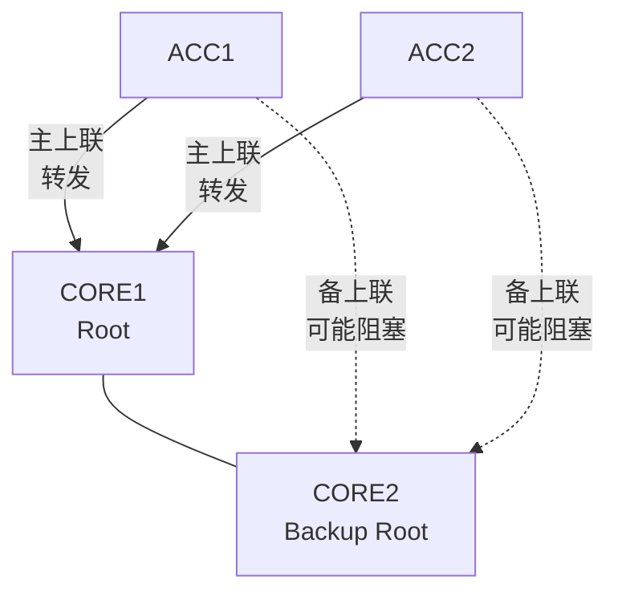

如果阻塞点出现在核心之间，或者某条关键服务器链路被意外阻塞，就要检查根桥、端口成本、实例映射和链路设计。

### 第四步：定义边缘端口和保护策略

普通终端口建议：

| 配置 | 目的 |
| --- | --- |
| Edge Port | 快速进入转发，提升终端接入体验 |
| BPDU 防护 | 收到 BPDU 时保护，防止私接交换机 |
| 风暴控制 | 限制广播/未知单播异常 |
| 端口描述 | 便于定位现场设备 |
| 未用端口关闭或放入隔离 VLAN | 减少误接风险 |

上联口建议：

| 配置 | 目的 |
| --- | --- |
| 不配置为边缘端口 | 让其参与 STP |
| 明确 Trunk 允许 VLAN | 控制二层范围 |
| 根保护按方向配置 | 防止下游抢根 |
| 链路聚合按设计配置 | 多链路并联时避免普通二层环路 |

## 8.15 小型企业 STP 设计示例

沿用第 7 章的小型企业 VLAN 规划：

| VLAN | 名称 | 网段 | 网关 |
| --- | --- | --- | --- |
| 10 | OFFICE | `10.10.10.0/24` | `10.10.10.1` |
| 20 | RD | `10.10.20.0/24` | `10.10.20.1` |
| 30 | FINANCE | `10.10.30.0/24` | `10.10.30.1` |
| 40 | SERVER | `10.10.40.0/24` | `10.10.40.1` |
| 50 | GUEST | `10.10.50.0/24` | `10.10.50.1` |
| 60 | MGMT | `10.10.60.0/24` | `10.10.60.1` |
| 70 | CCTV | `10.10.70.0/24` | `10.10.70.1` |
| 999 | UNUSED | 不承载业务 | 无 |

拓扑：

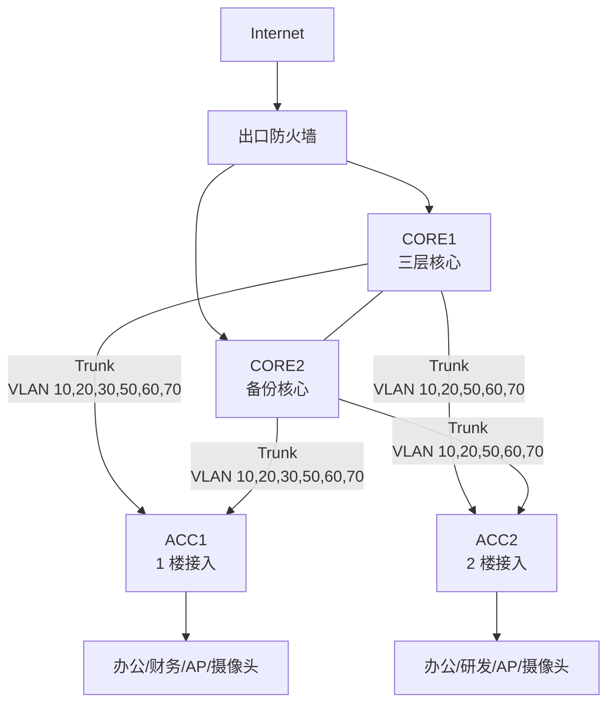

STP 规划：

| 项目 | 规划 |
| --- | --- |
| 协议 | MSTP 或 RSTP，按设备能力统一 |
| 根桥 | CORE1 作为主要实例根桥 |
| 备份根桥 | CORE2 |
| 接入交换机 | 不允许成为根桥 |
| 普通终端口 | Edge Port + BPDU 防护 + 风暴控制 |
| 上联口 | Trunk，参与 STP，不配置为 Edge Port |
| 未用端口 | shutdown 或 VLAN 999 |

如果采用 MSTP，可进一步分实例：

| 实例 | VLAN | 主根桥 | 备份根桥 | 目的 |
| --- | --- | --- | --- | --- |
| Instance 1 | 10,20,50 | CORE1 | CORE2 | 办公、研发、访客主走 CORE1 |
| Instance 2 | 30,40,60,70 | CORE2 | CORE1 | 财务、服务器、管理、安防主走 CORE2 |

这样可以让两台核心都承担部分主路径，而不是一台长期主用、另一台长期空闲。

注意：负载分担不是第一目标。对初学者来说，第一目标是防环、稳定、可解释。只有在理解根桥和实例映射后，再考虑多实例分担路径。

## 8.16 厂商中立配置示例

不同厂商命令不同，本节用伪配置表达配置思路。真实设备上要查对应厂商手册和现网规范。

### 启用 STP/RSTP/MSTP

全网应统一协议模式。不要在没有设计的情况下，一部分交换机运行 STP，一部分运行 RSTP，一部分运行 MSTP。

伪配置：

```text
spanning-tree enable
spanning-tree mode mstp
```

如果网络只使用 RSTP：

```text
spanning-tree enable
spanning-tree mode rstp
```

检查点：

- 所有相关交换机是否启用 STP。
- 协议模式是否一致或兼容。
- 设备默认 STP 是否启用，是否被人为关闭。

### 配置根桥和备份根桥

CORE1：

```text
spanning-tree instance 1 priority 4096
spanning-tree instance 2 priority 8192
```

CORE2：

```text
spanning-tree instance 1 priority 8192
spanning-tree instance 2 priority 4096
```

如果使用单实例 RSTP，也可以类似设置：

```text
spanning-tree priority 4096
```

接入交换机可以保持较高优先级，确保不成为根桥：

```text
spanning-tree priority 32768
```

真实设备上的优先级通常需要按固定步长设置，例如 4096 的倍数。实际可配置值以设备为准。

### 配置 MSTP 区域和 VLAN 映射

所有参与同一 MST 区域的交换机应保持一致：

```text
spanning-tree mst configuration
  name HQ-CAMPUS
  revision 1
  instance 1 vlan 10,20,50
  instance 2 vlan 30,40,60,70
```

检查点：

- 区域名称一致。
- 修订号一致。
- VLAN 到实例映射一致。
- 新增 VLAN 后同步更新所有交换机配置和文档。

### 配置接入口为边缘端口

普通 PC 接入口：

```text
interface GE1/0/1
  description Office-PC-A01
  switchport mode access
  switchport access vlan 10
  spanning-tree edge-port enable
  spanning-tree bpdu-protection enable
  storm-control broadcast level 5
```

摄像头接入口：

```text
interface GE1/0/10
  description CCTV-Camera-01
  switchport mode access
  switchport access vlan 70
  spanning-tree edge-port enable
  spanning-tree bpdu-protection enable
  storm-control broadcast level 3
```

这里的风暴控制阈值只是示例。真实阈值要结合设备能力、端口速率和业务流量测试确定。

### 配置上联口

接入交换机上联口：

```text
interface GE1/0/48
  description Uplink-to-CORE1
  switchport mode trunk
  switchport trunk allowed vlan 10,20,30,50,60,70
  switchport trunk native vlan 999
  spanning-tree edge-port disable
```

核心交换机下联口可以按设计启用根保护：

```text
interface GE1/0/10
  description Downlink-to-ACC1
  switchport mode trunk
  switchport trunk allowed vlan 10,20,30,50,60,70
  switchport trunk native vlan 999
  spanning-tree root-protection enable
```

注意：根保护要按方向使用。不要把它配置在可能真正通向根桥的上联方向。

## 8.17 STP 验证方法

配置 STP 后，不能只看“网络能 ping 通”。要验证生成树是否按设计运行。

### 查看根桥

应确认：

```text
当前根桥是谁
本设备是否为根桥
根桥优先级和 MAC 是否符合规划
每个 VLAN 或实例的根桥是否正确
```

示例检查表：

| 实例/VLAN | 规划根桥 | 当前根桥 | 是否符合 |
| --- | --- | --- | --- |
| Instance 1 | CORE1 | CORE1 | 是 |
| Instance 2 | CORE2 | CORE2 | 是 |
| VLAN 10 | CORE1 | CORE1 | 是 |
| VLAN 30 | CORE2 | CORE2 | 是 |

如果根桥出现在接入交换机上，必须立即检查优先级、BPDU 来源和保护策略。

### 查看端口角色和状态

应确认每个关键端口：

```text
端口角色是什么
端口状态是否 Forwarding
哪些端口被阻塞
阻塞点是否符合设计
```

示例：

| 设备 | 端口 | 连接对象 | 角色 | 状态 | 是否符合 |
| --- | --- | --- | --- | --- | --- |
| ACC1 | GE1/0/47 | CORE1 | Root Port | Forwarding | 是 |
| ACC1 | GE1/0/48 | CORE2 | Alternate | Blocking | 是 |
| CORE1 | GE1/0/10 | ACC1 | Designated | Forwarding | 是 |
| CORE2 | GE1/0/10 | ACC1 | Designated/Alternate | 视实例而定 | 需按实例确认 |

如果某个终端 VLAN 不通，要查看该 VLAN 或对应实例上的端口状态，而不是只看物理端口。

### 查看拓扑变化

STP 拓扑变化会导致 MAC 表刷新，业务可能短暂抖动。偶发拓扑变化不一定严重，但频繁变化说明网络不稳定。

应关注：

- 最近一次拓扑变化时间。
- 拓扑变化次数是否持续增长。
- 拓扑变化由哪个端口触发。
- 是否与某个接入口、AP、摄像头、私接交换机相关。

示例排查表：

| 现象 | 可能原因 |
| --- | --- |
| 拓扑变化次数持续增加 | 某端口频繁 up/down、私接设备、链路抖动 |
| 每次会议室使用后异常 | 会议室网口可能被私接小交换机 |
| 摄像头 VLAN 频繁变化 | PoE 不稳、摄像头重启、接入口抖动 |
| 核心互联频繁变化 | 光模块、链路质量或配置问题，需要优先处理 |

### 查看 MAC 漂移和流量计数

STP 正常时，二层环路应该被阻断。如果仍然出现大量 MAC 漂移或广播暴增，需要进一步检查：

- 是否有某些端口关闭了 STP。
- 是否存在不参与 STP 的中间设备。
- 是否有链路聚合配置不一致。
- 是否有 VLAN 在某条路径上未被 STP 正确保护。
- 是否有用户私接不透明交换设备或环路。

## 8.18 常见故障与排查

### 故障一：全网突然变慢，大量 MAC 漂移

现象：

- 多个 VLAN 或某个楼层大量用户掉线。
- 核心或接入交换机 CPU 升高。
- 交换机日志出现大量 MAC move。
- 广播流量计数快速增长。
- 远程登录设备卡顿。

可能原因：

| 原因 | 说明 |
| --- | --- |
| 用户私接小交换机成环 | 最常见现场原因之一 |
| 接入交换机双上联未启用 STP 或聚合 | 两条链路形成普通二层环 |
| 链路聚合两端配置不一致 | 一端认为是聚合，另一端按普通端口转发 |
| STP 被关闭 | 冗余拓扑失去防环能力 |
| 中间设备不透传 BPDU | STP 无法正确感知拓扑 |

排查步骤：

1. 先确认影响范围，是单 VLAN、单楼层还是全网。
2. 查看核心和汇聚交换机 MAC 漂移日志。
3. 找出漂移 MAC 涉及的端口。
4. 查看这些端口连接对象和端口描述。
5. 检查相关端口广播、未知单播流量是否异常。
6. 必要时先关闭疑似接入口止血。
7. 现场核查是否有私接交换机、网线环接或错误跳线。
8. 恢复后补充 BPDU 防护、风暴控制和端口管理。

处理原则：

```text
环路风暴正在发生时，先控制影响范围，再做完整根因分析。
```

如果管理面已经很慢，不要同时登录大量设备做复杂操作。优先从核心、汇聚的日志和端口流量定位方向，再对疑似接入口做隔离。

### 故障二：某个接入口一插设备就被关闭

现象：

- 用户插上设备后端口 down 或 error-disabled。
- 日志提示收到 BPDU 或 BPDU protection。
- 用户说“只是接了一个小交换机”。

可能原因：

| 原因 | 说明 |
| --- | --- |
| 接入口启用了 BPDU 防护 | 收到 BPDU 后保护端口 |
| 用户接入了小交换机 | 小交换机发送 BPDU 或形成环路风险 |
| 虚拟化/桥接设备发送 BPDU | 终端实际上在桥接多个网络 |
| 端口类型配置错误 | 本应为上联口，却按终端口模板配置 |

排查步骤：

1. 查看端口日志，确认是否因 BPDU 防护关闭。
2. 核对端口描述和现场连接对象。
3. 如果确实是普通终端口，要求移除私接交换机或改用受控接入方案。
4. 如果该端口本应连接交换机，上联配置应重新按 Trunk/STP 设计处理。
5. 恢复端口前确认不会再次形成环路。

不要为了让用户“先能用”就简单关闭 BPDU 防护。它触发通常说明接入口接入对象已经超出设计。

### 故障三：新增 VLAN 后跨交换机不通

现象：

- 老 VLAN 正常，新 VLAN 不通。
- 同一接入交换机内新 VLAN 终端可能互通，但到网关不通。
- 核心上看不到该 VLAN 的终端 MAC。

可能原因：

| 原因 | 说明 |
| --- | --- |
| Trunk 未放行新 VLAN | 新 VLAN 帧到不了核心 |
| 某台中间交换机未创建 VLAN | VLAN 不存在或不参与转发 |
| MSTP 未更新 VLAN 映射 | 新 VLAN 落入默认实例或错误实例 |
| STP 在该 VLAN/实例阻塞了预期路径 | 阻塞点与设计不符 |
| VLANIF 未 up | 网关接口没有活动二层成员 |

排查步骤：

1. 确认 VLAN 是否在相关交换机上创建。
2. 确认接入口 VLAN 配置正确。
3. 确认上联 Trunk allowed VLAN 包含新 VLAN。
4. 查看新 VLAN 或对应 MST 实例的 STP 状态。
5. 查看核心是否能学到终端 MAC。
6. 查看 VLANIF 状态和直连路由。
7. 如果使用 DHCP，继续检查 DHCP Relay 和地址池。

这个故障容易被误判成三层路由问题。实际很多时候是新 VLAN 没有完整通过二层路径。

### 故障四：根桥不在核心交换机

现象：

- 查看 STP 状态发现接入交换机成为根桥。
- 某些链路阻塞点很奇怪。
- 流量绕远或业务路径不符合拓扑设计。

可能原因：

| 原因 | 说明 |
| --- | --- |
| 核心未设置低优先级 | 默认比较 MAC，接入交换机可能获胜 |
| 更换设备后 MAC 变化 | 根桥自动变化 |
| 接入交换机误配置低优先级 | 抢占根桥 |
| 外部设备发送更优 BPDU | 不可信二层网络影响本网络 |

排查步骤：

1. 查看当前根桥 Bridge ID。
2. 查看各核心、汇聚、接入设备 STP 优先级。
3. 按设计设置主根桥和备份根桥。
4. 在核心到下游方向按需启用根保护。
5. 在普通接入口启用 BPDU 防护。
6. 观察拓扑收敛后阻塞点是否恢复预期。

根桥位置必须纳入上线检查，不应依赖默认选举。

### 故障五：链路故障后没有切到备份路径

现象：

- 主上联断开后，备份链路没有恢复业务。
- STP 状态仍显示阻塞或异常。
- 某些 VLAN 恢复，某些 VLAN 不恢复。

可能原因：

| 原因 | 说明 |
| --- | --- |
| 备份链路物理故障 | 光模块、网线、端口异常 |
| 备份 Trunk 未放行相关 VLAN | 只有部分 VLAN 可恢复 |
| STP 实例配置不一致 | 备份路径不参与正确实例 |
| 根保护配置方向错误 | 正常备份路径被保护机制阻断 |
| 单向链路或 BPDU 异常 | STP 无法正确收敛 |

排查步骤：

1. 检查备份链路物理状态。
2. 查看备份链路 Trunk allowed VLAN。
3. 查看故障 VLAN 对应 STP 实例和端口状态。
4. 查看是否有保护机制触发日志。
5. 检查两端协议模式、MST 区域、实例映射是否一致。
6. 恢复主链路后再次验证主备切换。

冗余设计必须定期演练。只在图纸上画了备份链路，不代表故障时一定能接管。

## 8.19 STP 排错流程

遇到疑似 STP 或二层环路问题，可以按下面流程排查。

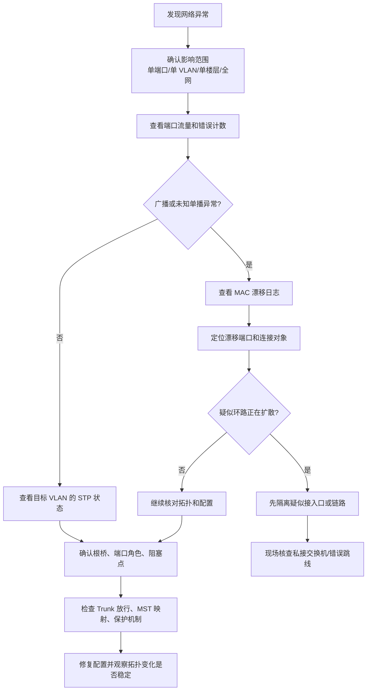

### 从现象判断方向

| 现象 | 优先怀疑 |
| --- | --- |
| 大量用户同时掉线、交换机很卡 | 广播风暴或环路 |
| 日志大量 MAC move | 二层环路、双归错误、虚拟化迁移 |
| 某接入口自动关闭 | BPDU 防护或端口安全触发 |
| 新 VLAN 不通 | Trunk 放行、VLAN 创建、STP 实例 |
| 某条备份链路不接管 | STP 状态、保护机制、Trunk 配置 |
| 根桥不是核心 | 优先级配置或外部 BPDU |

### 排错时不要做的事

遇到 STP 问题时，以下操作很危险：

- 为了“先恢复”在有环拓扑中直接关闭 STP。
- 没确认拓扑就把所有阻塞端口强行放开。
- 在广播风暴中反复大范围重启交换机。
- 不看 VLAN/实例，只看物理端口 up/down。
- 把 BPDU 防护触发当成普通端口故障处理。
- 未记录变更就临时修改根桥优先级和端口成本。

STP 问题的处理要有顺序。先止血，再定位，再修复，再补保护和文档。

## 8.20 STP 与链路聚合、三层交换的边界

STP 不是所有冗余问题的唯一答案。工程中要分清不同技术的边界。

### 两台交换机之间多条并联链路

如果两台交换机之间需要多条物理链路同时工作，优先考虑链路聚合。

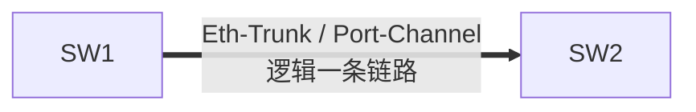

链路聚合把多条物理链路组合成一条逻辑链路，对 STP 来说它像一条链路。这样既能提高带宽，又能避免普通并联链路造成环路。

如果不做链路聚合，只接两条普通二层链路，STP 通常会阻塞其中一条，无法同时利用两条链路带宽。

### 接入到核心的双上联

接入交换机双上联到两台核心时，可以有多种设计：

| 设计 | 特点 |
| --- | --- |
| STP 双上联 | 一条转发，一条备用或按实例分担 |
| 跨设备链路聚合 | 需要核心支持堆叠、虚拟化或 MLAG 类能力 |
| 三层上联 | 接入或汇聚使用三层接口，不再透传大量 VLAN |

初学阶段常先学习 STP，因为它解释了二层冗余的基础逻辑。大型网络中，为了减少 STP 范围，经常会把三层边界下沉到汇聚或接入侧。

### 能不用大二层就不要拉大二层

STP 能防环，但不能消除大二层网络本身的复杂性。二层范围越大：

- 广播影响范围越大。
- STP 拓扑变化影响范围越大。
- MAC 地址表规模越大。
- 故障定位越复杂。
- VLAN 透传和实例映射越容易出错。

因此现代园区网常见原则是：

```text
接入层需要二层时，用 STP 做底线保护。
汇聚和核心之间尽量使用链路聚合、堆叠/虚拟化或三层路由减少复杂二层环路。
```

## 8.21 上线检查清单

交换网络上线或变更前，建议检查以下内容。

### STP 基础

| 检查项 | 要求 |
| --- | --- |
| STP 是否启用 | 所有二层交换设备启用 |
| 协议模式 | RSTP/MSTP 按规划统一 |
| 根桥 | 主根桥在核心或汇聚 |
| 备份根桥 | 备份设备明确 |
| 接入交换机 | 不应成为根桥 |
| 阻塞点 | 与设计一致，可解释 |

### VLAN 与实例

| 检查项 | 要求 |
| --- | --- |
| VLAN 创建 | 相关交换机均已创建 |
| Trunk 放行 | 只放行业务需要 VLAN |
| MST 区域名称 | 所有设备一致 |
| MST 修订号 | 所有设备一致 |
| VLAN 映射 | 所有设备一致 |
| 新增 VLAN | 同步更新 Trunk、实例、网关和文档 |

### 接入口保护

| 检查项 | 要求 |
| --- | --- |
| Edge Port | 普通终端口启用 |
| BPDU 防护 | 普通终端口启用 |
| 风暴控制 | 按模板设置合理阈值 |
| 端口描述 | 与现场和资产一致 |
| 未用端口 | 关闭或放入隔离 VLAN |
| 私接交换机 | 明确禁止或纳入受控管理 |

### 变更验证

| 检查项 | 要求 |
| --- | --- |
| 变更前备份配置 | 可回退 |
| 变更窗口 | 避开业务高峰 |
| 验证根桥 | 变更后仍符合规划 |
| 验证端口状态 | 无异常阻塞或保护触发 |
| 验证业务 | 目标 VLAN、网关、关键服务正常 |
| 观察日志 | 无持续拓扑变化、MAC 漂移、风暴告警 |

## 8.22 自检与练习

### 概念自检

请确认自己能回答以下问题：

- 为什么二层环路比普通链路故障更危险？
- 广播风暴和 MAC 地址漂移分别是怎样产生的？
- STP 为什么要选根桥？
- 根桥应该放在核心、汇聚还是接入层？为什么？
- Bridge ID 由哪些部分组成？
- Root Port 和 Designated Port 有什么区别？
- 被 STP 阻塞的端口是不是物理故障？
- 经典 STP 为什么收敛较慢？
- RSTP 中边缘端口有什么作用？
- BPDU 防护为什么应该用在普通终端口？
- Trunk 未放行 VLAN 和 STP 阻塞 VLAN 的排查思路有什么不同？
- 为什么 MSTP 的区域名称、修订号和 VLAN 映射必须一致？

### 场景练习一：三交换机环路

三台交换机连接如下：

```text
SW1 -- SW2
SW2 -- SW3
SW3 -- SW1
```

其中 SW1 是根桥。请思考：

1. SW2 到 SW1 的直连端口大概率是什么角色？
2. SW3 到 SW1 的直连端口大概率是什么角色？
3. SW2 与 SW3 之间的链路上，为什么可能有一侧端口被阻塞？
4. 如果 SW1 到 SW2 的链路断开，原本阻塞的端口可能发生什么变化？

练习目标不是背答案，而是能说出：STP 通过阻塞一部分端口，把有环拓扑变成无环逻辑树。

### 场景练习二：接入口收到 BPDU

某办公室用户报修网络不通。交换机日志显示：

```text
GE1/0/12 received BPDU, BPDU protection triggered
```

已知 `GE1/0/12` 是普通办公网口，规划为 VLAN 10。

请按顺序处理：

1. 查看端口当前是否被关闭或错误禁用。
2. 核对端口描述和现场位置。
3. 询问或现场查看用户是否私接小交换机、路由器 LAN 口或桥接设备。
4. 移除不符合规范的设备或改为受控接入。
5. 确认没有环路风险后恢复端口。
6. 记录事件，并评估是否需要加强会议室和公共区域端口管理。

不要直接关闭 BPDU 防护。它触发说明端口接入对象与设计不一致。

### 场景练习三：新增 VLAN 70 摄像头网不通

规划新增摄像头 VLAN：

```text
VLAN 70
网段：10.10.70.0/24
网关：10.10.70.1
DHCP 服务器：10.10.60.10
```

摄像头插在 ACC1 上，核心交换机 CORE1 提供 VLANIF 70。现象是摄像头拿不到地址，也 ping 不通网关。

请检查：

1. ACC1 是否创建 VLAN 70。
2. 摄像头接入口是否为 Access VLAN 70。
3. ACC1 到 CORE1 的 Trunk 是否放行 VLAN 70。
4. CORE1 是否创建 VLAN 70 和 VLANIF 70。
5. VLANIF 70 是否 up。
6. VLAN 70 对应 STP 实例是否正常，是否在预期链路上转发。
7. DHCP Relay 是否指向 `10.10.60.10`。
8. DHCP 服务器是否有 `10.10.70.0/24` 地址池。

这个练习把 VLAN、Trunk、STP、VLANIF 和 DHCP 串在一起。真实排错时，要沿路径逐段证明，而不是只盯着一个配置项。

### 场景练习四：根桥错误

你在接入交换机 ACC3 上查看 STP，发现它是 VLAN 10 的根桥。规划中 VLAN 10 根桥应该是 CORE1。

请回答：

1. ACC3 为什么可能成为根桥？
2. 应该在哪些设备上查看 STP 优先级？
3. 如何把根桥恢复到 CORE1？
4. 如何防止未来再次被接入层或外部设备抢根？
5. 根桥恢复后，为什么还要检查阻塞点和业务路径？

这个练习训练的是设计意识：根桥不是谁自动选上都可以，它必须符合网络层次和流量路径规划。

## 8.23 本章小结

STP 是交换网络中的基础防环机制。它解决的是二层冗余和二层环路之间的矛盾：

- 企业网络需要冗余链路，否则单链路故障会造成大范围中断。
- 普通二层冗余链路如果没有控制，可能形成环路。
- 二层环路会导致广播风暴、MAC 地址漂移、重复帧和设备性能异常。
- STP 通过 BPDU 交换信息，选出根桥，计算到根桥的最优路径。
- 非根交换机选择 Root Port，每条链路选择 Designated Port，多余端口被阻塞或作为备用。
- 阻塞端口不是物理故障，而是 STP 为了打断环路做出的逻辑选择。
- RSTP 提供更快收敛，边缘端口让普通终端接入更快。
- MSTP 通过实例把多个 VLAN 分组计算，适合多 VLAN 企业网络。
- 根桥、备份根桥、MST 实例、Trunk 放行、边缘端口和保护机制都需要提前规划。
- 排查 STP 问题时，要结合根桥、端口角色、端口状态、VLAN/实例、拓扑变化、MAC 漂移和现场连接关系。

学完本章后，你应该能理解为什么交换机之间不能随意多接几根线，也能理解“端口 up 但被 STP 阻塞”并不是矛盾。第 9 章会继续学习链路聚合。链路聚合可以把两台设备之间的多条物理链路变成一条逻辑链路，让多链路既能增加带宽，又不会被 STP 当成普通环路来处理。
