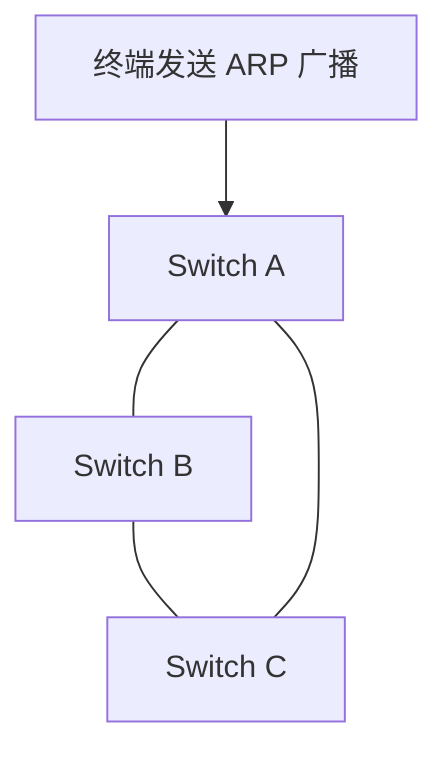
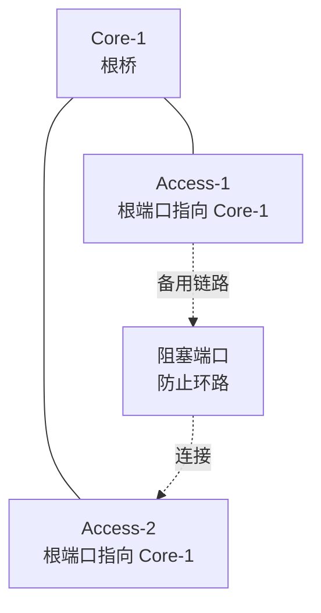
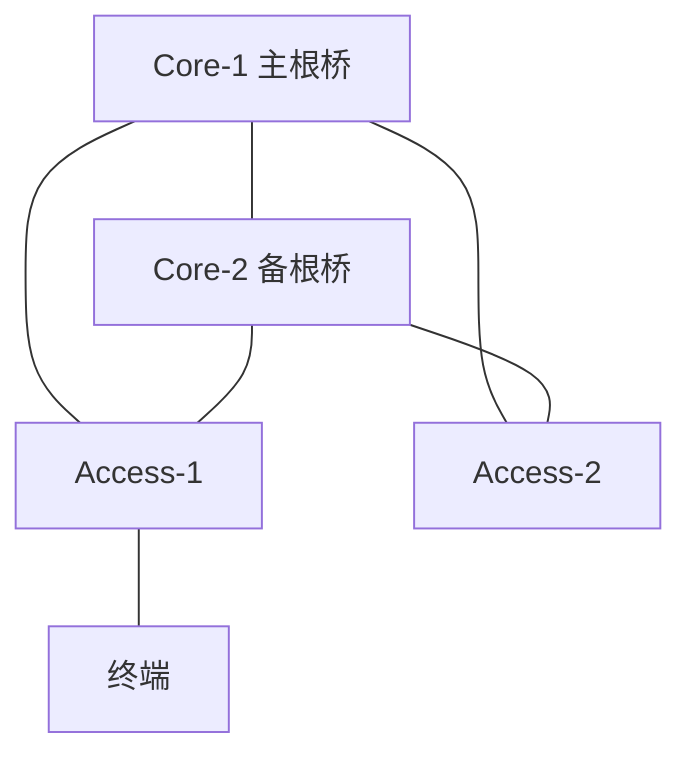

# 第 8 章：生成树协议 STP

## 8.1 学习目标

学完本章后，你应该能够：

- 理解二层环路为什么危险。
- 说明 STP 如何通过阻塞端口消除环路。
- 理解根桥、根端口、指定端口、阻塞端口。
- 区分 STP、RSTP、MSTP 的基本差异。
- 掌握企业网络中 STP 的规划和优化思路。
- 能够根据 STP 状态排查二层环路和链路异常。

STP 是交换网络稳定性的底线技术。企业网络中经常需要做链路冗余，但二层冗余如果没有控制机制，就会形成环路。STP 的作用就是在保留冗余链路的同时，逻辑上阻塞部分路径，防止环路。

## 8.2 二层环路问题

三层网络中，IP 包有 TTL 字段，经过路由器时 TTL 会递减，最终避免无限转发。二层以太网帧没有类似 TTL 的机制，一旦形成环路，广播帧和未知单播帧可能在交换机之间无限循环。

二层环路会导致：

- 广播风暴。
- 交换机 CPU 升高。
- MAC 地址表频繁漂移。
- 正常业务严重丢包。
- 管理登录困难甚至设备失联。
- 整个 VLAN 或整个园区网络瘫痪。

典型环路场景：

```text
Switch A ---- Switch B
   |             |
   +-- Switch C -+
```

如果 A、B、C 之间都是二层链路，且没有 STP 或链路聚合控制，就可能形成环路。



在这个拓扑中，广播帧可能沿 A -> B -> C -> A 的方向循环，也可能沿 A -> C -> B -> A 的方向循环。交换机会不断复制广播帧，直到设备资源被耗尽或链路被断开。

二层环路最危险的地方是故障扩散快。一个用户私接小交换机、一个错误跳线、一个聚合配置不一致，都可能让整个 VLAN 甚至整个楼层网络异常。

## 8.3 广播风暴

广播风暴是二层环路最典型的表现。

过程：

1. 某终端发送 ARP 广播。
2. 交换机把广播泛洪到同 VLAN 的其他端口。
3. 因为存在环路，广播帧又从其他路径回到原交换机。
4. 交换机继续泛洪。
5. 广播数量指数级增长。

广播风暴发生时，网络表现通常很严重：

- 终端网络极慢或完全中断。
- ping 大量丢包。
- 交换机 CPU 飙高。
- 接口流量异常增大。
- 日志出现 MAC flapping、loop detected 等信息。

## 8.4 STP 基本原理

STP 即 Spanning Tree Protocol，生成树协议。它的核心思想是：

```text
在有环的物理拓扑上，计算出一棵无环的逻辑树。
```

STP 会选择一个根桥，然后所有交换机计算到根桥的最佳路径。对于可能形成环路的冗余端口，STP 会让其中一些端口进入阻塞状态。被阻塞端口不转发普通业务流量，但仍监听 STP 协议报文。

当主链路故障时，原来阻塞的端口可以重新参与转发，实现链路冗余。

STP 的计算可以按三个问题理解：

1. 谁是整棵树的根，也就是根桥。
2. 每台非根交换机从哪个端口到根桥最优，也就是根端口。
3. 每条链路上哪个端口负责转发，哪个端口需要阻塞。



STP 不是把多余链路物理关闭，而是让其中一些端口在逻辑上不转发业务流量。这样主链路故障时，备用链路还有机会恢复转发。

## 8.5 BPDU

STP 通过 BPDU 交换拓扑信息。BPDU 中包含：

- 根桥 ID。
- 发送者桥 ID。
- 到根桥的路径开销。
- 端口 ID。
- 计时器信息。

交换机通过比较 BPDU 信息决定：

- 谁是根桥。
- 自己到根桥的最佳路径是哪条。
- 哪些端口转发。
- 哪些端口阻塞。

## 8.6 根桥

根桥是 STP 拓扑的逻辑中心。所有交换机都会计算到根桥的最佳路径。

根桥通过桥 ID 选举产生。桥 ID 包含：

```text
桥优先级 + MAC 地址
```

比较规则：

1. 优先级越小越优先。
2. 优先级相同，MAC 地址越小越优先。

如果不手动规划根桥，网络可能选出一台接入交换机作为根桥。这会导致流量路径不合理，甚至影响稳定性。

企业建议：

- 核心交换机作为根桥。
- 双核心场景中，一台核心作为主根，另一台核心作为备根。
- 不要让接入交换机成为根桥。

示例：

```text
VLAN 10、20、30：Core-1 为主根，Core-2 为备根
VLAN 40、50：Core-2 为主根，Core-1 为备根
```

这种设计也可用于按 VLAN 分担二层流量，但需要谨慎规划，避免排错复杂化。

### 根桥选举示例

假设三台交换机的 STP 信息如下：

| 设备 | 优先级 | MAC 地址 |
| --- | ---: | --- |
| Core-1 | 4096 | 00:11:11:11:11:11 |
| Core-2 | 8192 | 00:22:22:22:22:22 |
| Access-1 | 32768 | 00:01:01:01:01:01 |

虽然 Access-1 的 MAC 地址最小，但 Core-1 的优先级最低，所以 Core-1 成为根桥。

如果三台设备都使用默认优先级 32768，则 MAC 地址最小的 Access-1 可能成为根桥。这就是为什么企业网络不能完全依赖默认值。

## 8.7 端口角色

STP 中常见端口角色包括：

### 根端口

非根桥上到达根桥路径最优的端口。每台非根交换机通常只有一个根端口。

### 指定端口

在一个链路段上负责转发到该网段的端口。指定端口处于转发状态。

### 阻塞端口

为了防止环路而被阻塞的端口。阻塞端口不转发普通数据流量。

### 边缘端口

连接终端的端口，不参与交换机间环路计算。边缘端口可以快速进入转发状态，减少电脑获取地址和上线等待时间。

边缘端口只能用于连接终端，不应配置在交换机互联链路上。

### 端口角色判断顺序

初学时可以按下面顺序判断：

1. 根桥上的所有正常端口通常都是指定端口。
2. 每台非根交换机选择一条到根桥代价最小的路径，该端口是根端口。
3. 每个链路段上到根桥更优的一侧成为指定端口。
4. 既不是根端口，也不是指定端口的冗余端口会被阻塞。

常见路径开销与带宽有关。不同标准和厂商数值可能不同，但原则一致：带宽越高，路径开销越低，越容易成为优选路径。

| 链路 | 理解 |
| --- | --- |
| 1G 链路 | 常见接入上联，开销高于 10G |
| 10G 链路 | 常见汇聚或核心链路，更可能成为优选 |
| 聚合链路 | 逻辑带宽更高，通常优于单链路 |

不要只凭“哪条线看起来更近”判断 STP 路径，要查看实际根桥、端口角色和路径开销。

## 8.8 STP 端口状态

传统 STP 端口状态包括：

| 状态 | 含义 |
| --- | --- |
| Disabled | 端口关闭 |
| Blocking | 阻塞，不转发用户流量 |
| Listening | 监听 BPDU，准备参与计算 |
| Learning | 学习 MAC 地址，但不转发用户流量 |
| Forwarding | 转发用户流量 |

传统 STP 收敛较慢，链路变化后可能需要几十秒恢复。后来的 RSTP 大幅提升了收敛速度。

## 8.9 STP、RSTP、MSTP

### STP

原始生成树协议，标准为 802.1D。收敛慢，现在较少单独使用。

### RSTP

快速生成树协议，标准为 802.1w。相比 STP，RSTP 收敛更快，更适合现代企业网络。

### MSTP

多生成树协议，标准为 802.1s。MSTP 可以把多个 VLAN 映射到不同生成树实例中，在大型二层网络中更灵活。

企业建议：

- 小型网络：RSTP 通常足够。
- 中大型园区网：MSTP 更常见。
- 多厂商混合环境：需要特别确认 STP 模式兼容性。

## 8.10 STP 规划建议

### 明确根桥位置

根桥应该放在核心层或汇聚层，而不是接入层。

示例：

```text
Core-1：主根桥
Core-2：备根桥
Access-SW：禁止成为根桥
```

### 接入口启用边缘端口

连接电脑、打印机、摄像头、AP 的端口可以配置为边缘端口，加快上线速度。

但必须配合保护机制，防止有人在接入口接入小交换机造成环路。

### 启用 BPDU 保护

边缘端口收到 BPDU 时，说明这个端口后面可能接入了交换机。开启 BPDU 保护后，可以自动关闭该端口，避免接入口形成环路。

### 启用根保护

根保护用于防止下层交换机抢占根桥。建议在核心到接入方向的端口上根据厂商建议配置。

### 控制二层范围

大型网络中不要无限扩大二层。能用三层边界解决的问题，不要用巨大二层域硬撑。

### 常用保护机制对比

| 机制 | 常用位置 | 作用 |
| --- | --- | --- |
| 边缘端口 | 终端接入口 | 快速进入转发，减少上线等待 |
| BPDU 保护 | 边缘端口 | 接入口收到 BPDU 时关闭端口，防止私接交换机 |
| 根保护 | 核心或汇聚下联方向 | 防止下层设备抢占根桥 |
| 环路保护 | 可能单向故障链路 | 防止收不到 BPDU 时误进入转发 |
| 风暴抑制 | 接入口、低可信端口 | 限制广播、组播、未知单播流量 |

不同厂商对名称和默认行为可能不同，但目标相同：让二层拓扑在异常接入、错误接线、单向链路或配置错误时尽量不扩散故障。

### STP 与三层边界

STP 只解决二层环路问题。企业网络规模变大后，不能希望 STP 解决所有冗余问题。更稳妥的设计是把二层范围控制在接入或汇聚范围内，核心之间尽量使用三层互联和动态路由。

对初学者来说，可以先记住：

```text
接入口到汇聚：常见二层 VLAN 和 STP
汇聚到核心：可以二层，也可以三层，取决于设计
核心到核心、核心到出口：优先考虑三层互联
```

## 8.11 配置示例思路

### 场景

两台核心交换机 Core-1、Core-2，下联多台接入交换机。VLAN 10、20、30 用 Core-1 作为 STP 主根，Core-2 作为备根。

### 配置逻辑

```text
Core-1：
设置 VLAN 10、20、30 的 STP 优先级为较小值

Core-2：
设置 VLAN 10、20、30 的 STP 优先级为次小值

Access：
保持默认或设置较大优先级
连接终端的端口配置为边缘端口
边缘端口启用 BPDU 保护
```

### 验证

```text
查看 VLAN 10 的根桥是否为 Core-1
查看 Core-2 是否为备选路径
查看接入交换机上联端口角色
查看终端端口是否为边缘端口
模拟一条上联故障，观察阻塞端口是否切换
```

### 变更注意事项

修改 STP 根桥或模式属于高风险二层变更。操作前建议：

- 画出现有拓扑和预期根桥。
- 记录当前根桥、端口角色和阻塞端口。
- 确认是否存在跨楼层、跨机房的二层链路。
- 确认链路聚合状态正常。
- 在低峰期变更，并准备回退配置。
- 变更后观察日志、MAC 漂移、CPU 和接口流量。

STP 变更的风险在于它可能改变大量 VLAN 的转发路径。不要在不了解现网拓扑时随意调整根桥优先级。

## 8.12 常见故障与排查

### 接入交换机成为根桥

现象：

- 流量路径绕行。
- 某些 VLAN 转发异常。
- 拓扑收敛不符合预期。

排查：

```text
查看当前根桥 ID
查看根桥所在设备
检查核心交换机 STP 优先级
检查是否有新接入交换机优先级更低
```

### 端口被 STP 阻塞导致业务不通

现象：

- 物理接口 up，但业务不通。
- 某条链路没有转发流量。

排查：

```text
查看端口 STP 状态
确认是否处于 Blocking 或 Discarding
查看该 VLAN 的生成树拓扑
确认是否有替代转发路径
```

阻塞不一定是故障，它可能是 STP 正常防环行为。排错时不要盲目关闭 STP。

### 接入口收到 BPDU 被关闭

现象：

- 用户端口自动 down。
- 日志提示 BPDU protection、BPDU guard。

可能原因：

- 用户私接小交换机。
- AP 或电话链路模式异常。
- 端口被误配置为边缘端口。

处理：

```text
确认端口后接设备类型
如果确实是终端，排除异常设备后恢复端口
如果是交换机互联，取消边缘端口配置
```

### MAC 地址漂移

STP 异常或环路常伴随 MAC 地址漂移。排查时应结合：

```text
MAC flapping 日志
接口流量
STP 拓扑变化记录
物理接线
链路聚合状态
```

## 8.13 企业场景：双核心与接入交换机

典型园区网中，两台核心交换机下联多台接入交换机。为了冗余，每台接入交换机可能分别连接 Core-1 和 Core-2。



设计目标：

- Core-1 成为主要业务 VLAN 的根桥。
- Core-2 成为备根桥。
- 接入交换机的终端端口配置为边缘端口。
- 接入口启用 BPDU 保护，防止用户私接交换机。
- 上联链路的阻塞状态符合预期。

验证示例：

```text
查看 VLAN 10 根桥是否为 Core-1
查看 Access-1 到 Core-1 的端口是否为根端口
查看 Access-1 到 Core-2 的端口是否为替代或阻塞端口
断开 Core-1 到 Access-1 链路，确认 Core-2 链路恢复转发
恢复链路后确认拓扑回到预期状态
```

## 8.14 本章自检

请尝试回答：

- 为什么二层环路比普通链路故障更危险。
- STP 为什么要选举根桥。
- 如果不规划根桥，为什么接入交换机可能成为根桥。
- 根端口和指定端口的区别是什么。
- 边缘端口为什么不能配置在交换机互联链路上。
- BPDU 保护触发后，应该先恢复端口还是先确认接线。

练习：

```text
Core-1 优先级 4096，MAC 00:11:11:11:11:11
Core-2 优先级 8192，MAC 00:22:22:22:22:22
Access-1 优先级 32768，MAC 00:01:01:01:01:01
```

1. 判断谁会成为根桥。
2. 如果三台设备优先级都为 32768，谁会成为根桥。
3. 说明为什么企业中要手动规划核心交换机为根桥。

## 8.15 本章小结

STP 的目的不是提高速度，而是防止二层环路。企业网络中，STP 必须被规划，而不是默认放任。根桥应放在核心，接入口应启用边缘端口和保护机制，交换机互联链路应清楚知道哪些端口转发、哪些端口阻塞。遇到二层异常时，优先查看 STP 状态、MAC 漂移和接口流量。
