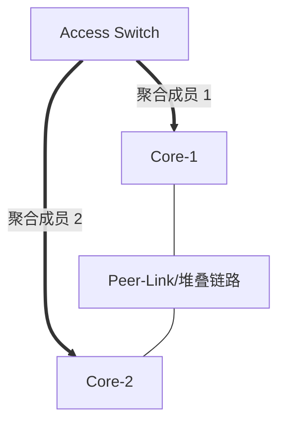

# 第 9 章：链路聚合

## 9.1 学习目标

学完本章后，你应该能够：

- 理解链路聚合的作用和限制。
- 区分手工聚合与 LACP 动态聚合。
- 理解二层聚合与三层聚合。
- 掌握聚合链路的负载分担原理。
- 能够设计交换机上联冗余。
- 能够排查聚合不成功、成员端口异常、流量不均衡等问题。

链路聚合是企业网络中非常常见的可靠性和带宽扩展技术。它可以把多条物理链路捆绑成一条逻辑链路，既提升可用带宽，也避免多条并行二层链路造成 STP 阻塞。

## 9.2 链路聚合的作用

链路聚合也称为端口聚合、Eth-Trunk、Port-Channel、Link Aggregation。

它的主要作用：

- 增加链路带宽。
- 提高链路可靠性。
- 简化逻辑拓扑。
- 减少 STP 阻塞带来的带宽浪费。
- 支持服务器双网卡或多网卡接入。

示例：

```text
接入交换机到核心交换机有 2 条 1G 链路
不做聚合时：STP 可能阻塞其中一条
做聚合后：逻辑上成为一条 2G 聚合链路
```


从 STP 视角看，聚合后的多条物理线是一条逻辑链路；从管理视角看，业务 VLAN、三层地址或路由协议通常配置在聚合接口上；从可靠性视角看，单条成员链路故障时，聚合接口可以继续工作。

链路聚合适合解决两个问题：

- 单条链路带宽不够，希望多条链路共同承载多会话流量。
- 需要链路冗余，但不希望 STP 阻塞其中一条链路造成浪费。

## 9.3 链路聚合的限制

链路聚合不等于单个会话可以使用所有链路带宽。

例如 4 条 1G 链路聚合后，总体可承载接近 4G 的多会话流量，但一个 TCP 会话通常仍只走其中一条成员链路，不能达到 4G。

这是因为聚合设备通常根据哈希算法选择成员链路，常见哈希字段包括：

- 源 MAC。
- 目的 MAC。
- 源 IP。
- 目的 IP。
- 源端口。
- 目的端口。

如果业务流量源和目的很集中，可能出现流量分布不均衡。

例如，一个备份服务器向一个存储服务器传输大文件，即使中间是 4 条 1G 聚合链路，这个单一 TCP 会话也可能只跑在其中一条 1G 成员链路上。要提升这种大流量的性能，可能需要升级单链路到 10G/25G，或者使用应用层并发传输。

| 误解 | 正确理解 |
| --- | --- |
| 4 条 1G 聚合后，单个下载一定能跑 4G | 单个会话通常仍走一条成员链路 |
| 聚合后所有成员流量一定平均 | 哈希结果取决于源、目的和端口分布 |
| 只要两边都插多条线就能聚合 | 两端模式、成员参数和对端关系必须匹配 |
| 聚合可以替代所有冗余设计 | 聚合只解决链路层面，不能替代设备级冗余 |

## 9.4 手工聚合

手工聚合不运行协商协议，双方都静态指定哪些端口属于同一个聚合组。

优点：

- 配置简单。
- 不依赖协议协商。

缺点：

- 容错能力较弱。
- 两端配置不一致时不容易自动发现。
- 误接线时可能造成环路或流量异常。

工程建议：生产网络优先使用 LACP，除非设备不支持或有明确兼容性原因。

## 9.5 LACP 动态聚合

LACP 是 Link Aggregation Control Protocol，链路聚合控制协议，标准为 IEEE 802.3ad。

LACP 通过协议报文协商成员链路，能够检测两端配置是否一致，并决定哪些链路可以加入聚合。

LACP 常见模式：

| 模式 | 含义 |
| --- | --- |
| Active | 主动发送 LACP 报文 |
| Passive | 被动等待对端 LACP 报文 |
| On/Manual | 不运行 LACP，手工聚合 |

常见组合：

| 本端 | 对端 | 是否能协商 |
| --- | --- | --- |
| Active | Active | 可以 |
| Active | Passive | 可以 |
| Passive | Passive | 不可以 |
| Manual | Active | 不可以 |

### LACP 协商在做什么

LACP 并不是简单“互相打招呼”。它会交换本端和对端的信息，判断成员链路是否属于同一个聚合组。

常见检查包括：

- 本端系统 ID 和对端系统 ID。
- 聚合组 ID。
- 端口优先级和状态。
- Active/Passive 模式。
- 成员链路是否连接到同一个逻辑对端。

如果两条成员线一条接到 Core-1，另一条误接到 Core-2，而 Core-1/Core-2 没有堆叠、M-LAG 或 vPC 等跨设备聚合能力，LACP 通常不会让它们正常组成同一个聚合。这正是动态聚合比手工聚合更安全的原因之一。

## 9.6 成员端口一致性

同一个聚合组内的成员端口必须保持关键参数一致：

- 速率一致。
- 双工模式一致。
- 端口类型一致。
- Access VLAN 或 Trunk 允许 VLAN 一致。
- STP 配置一致。
- MTU 一致。
- 对端设备一致。

如果成员端口配置不一致，可能无法加入聚合组，或加入后转发异常。

工程建议：先创建聚合接口，把 VLAN、Trunk、三层地址等配置放在聚合接口上，再把物理接口加入聚合组。不要在成员物理接口上分别配置业务参数。

成员端口不一致会带来两类问题：

- 协商失败：端口不能加入聚合，业务带宽或冗余不符合预期。
- 协商成功但转发异常：部分 VLAN、MTU 或策略不一致，导致故障只影响部分流量。

上线前可以用表格核对：

| 检查项 | 要求 |
| --- | --- |
| 物理速率 | 成员端口速率一致 |
| 双工模式 | 全双工且一致 |
| 聚合模式 | 两端均为 LACP，且 Active/Passive 能协商 |
| 对端设备 | 指向同一个逻辑设备 |
| 业务配置 | 配在聚合接口，不分散在物理成员口 |
| VLAN 放行 | 聚合接口两端一致 |
| MTU | 两端和成员一致 |
| 端口状态 | 成员口 selected/bundled |

## 9.7 二层聚合

二层聚合接口像一个二层交换端口，可以配置为 Access 或 Trunk。

常见场景：

- 接入交换机双链路上联核心。
- 服务器多网卡接入交换机。
- 防火墙透明模式双链路接入。

示例：

```text
Eth-Trunk 1
端口类型：Trunk
允许 VLAN：10,20,30,250
成员端口：GE0/0/23, GE0/0/24
```

## 9.8 三层聚合

三层聚合接口像一个三层路由接口，可以直接配置 IP 地址。

常见场景：

- 核心交换机之间三层互联。
- 核心交换机到防火墙的三层互联。
- 数据中心交换机之间 routed port-channel。

示例：

```text
Aggregate 1
IP 地址：10.255.0.1/30
成员端口：10GE1/0/1, 10GE1/0/2
运行 OSPF
```

三层聚合减少二层范围，避免 STP 参与，更适合大型网络核心互联。

## 9.9 跨设备链路聚合

普通链路聚合要求成员链路连接到同一台对端设备。但企业网络常需要接入交换机分别上联两台核心交换机。

这需要跨设备聚合技术，不同厂商名称不同：

- Cisco：vPC、StackWise Virtual、VSS。
- 华为：CSS、iStack、M-LAG。
- H3C：IRF、DRNI。
- Arista：MLAG。

跨设备聚合的效果是让两台物理设备在下联设备看来像一个逻辑聚合对端。

设计时要关注：

- 两台核心之间的 peer-link 或堆叠链路。
- 一致的 VLAN、STP、网关配置。
- 故障分裂场景。
- 厂商推荐的保活链路。
- 升级和维护窗口。

跨设备聚合可以提升可靠性，但设计复杂度也更高，必须按厂商最佳实践实施。

### 为什么普通聚合不能直接跨两台设备

普通链路聚合要求对端是同一个逻辑系统。接入交换机把两条线加入一个聚合组时，它期待对端返回一致的系统 ID。如果两条线分别接到两台互不协同的核心交换机，接入交换机会认为对端不一致。

跨设备聚合技术的本质是让两台物理核心在下联设备看来像一个逻辑对端。



这类设计要特别关注“分裂”场景。如果 Core-1 和 Core-2 之间的 peer-link 或保活链路异常，两台设备可能对下联状态产生不一致判断。生产网络必须按厂商文档规划 peer-link、keepalive、优先级、故障动作和升级流程。

## 9.10 负载分担原理

链路聚合通常基于哈希选择成员链路。

例如使用源 IP 和目的 IP 哈希：

```text
Host A -> Server X  走成员链路 1
Host B -> Server X  走成员链路 2
Host C -> Server Y  走成员链路 1
```

同一条流一般固定走同一成员链路，以避免乱序。乱序会影响 TCP 性能。

如果发现流量不均衡，可以检查：

- 哈希算法是否只基于 MAC。
- 流量是否集中在少量源和目的之间。
- 是否需要使用 IP + 端口的更细粒度哈希。
- 是否存在大象流。

链路聚合解决的是总体带宽和链路冗余，不是单流加速技术。

### 哈希字段选择

不同业务适合不同哈希字段：

| 流量类型 | 推荐关注 |
| --- | --- |
| 大量终端访问服务器 | 源 IP + 目的 IP 通常有较好分布 |
| 少数服务器互传 | 需要考虑端口字段或升级单链路 |
| 二层透明流量 | 可能只能基于 MAC 哈希 |
| 数据中心东西向流量 | 常使用 IP + TCP/UDP 端口提高分散度 |

调整哈希算法前要先看成员链路流量统计。如果只是一个大流占满一条链路，调整哈希也未必能解决，因为同一流仍要保持顺序，通常不会被拆到多条链路上。

## 9.11 配置示例思路

### 场景

接入交换机 Access-1 使用两条链路上联核心 Core-1，承载 VLAN 10、20、30、250。

### 配置逻辑

两端都需要一致配置：

```text
1. 创建聚合接口 Eth-Trunk 1。
2. 设置聚合模式为 LACP。
3. 将 GE0/0/23 和 GE0/0/24 加入 Eth-Trunk 1。
4. 在 Eth-Trunk 1 上配置 Trunk。
5. 允许 VLAN 10、20、30、250。
6. 保存配置。
```

### 验证

```text
查看 Eth-Trunk 是否 up
查看成员端口是否 selected 或 bundled
查看 LACP 邻居状态
查看 Trunk 允许 VLAN
断开一条成员链路，确认业务不中断
恢复链路后确认成员重新加入
```

### 实施顺序建议

为了降低风险，建议按以下顺序实施：

1. 确认两端设备、端口编号、线缆标签和业务 VLAN。
2. 在两端创建聚合接口。
3. 在聚合接口上配置二层 Trunk 或三层 IP。
4. 配置 LACP 模式。
5. 将成员物理端口加入聚合组。
6. 验证成员状态和业务连通。
7. 保存配置并更新拓扑文档。

如果是现网单链路改双链路聚合，需要安排窗口。因为端口从独立链路切换到聚合接口时，可能会短暂中断。

## 9.12 常见故障与排查

### 聚合接口 down

可能原因：

- 成员端口物理 down。
- 两端聚合模式不一致。
- LACP active/passive 配置不当。
- 端口速率或双工不一致。
- 成员端口加入了不同聚合组。

排查：

```text
查看物理接口状态
查看聚合组成员
查看 LACP 状态
查看两端配置是否一致
```

### 部分成员端口无法加入

可能原因：

- VLAN 配置不一致。
- MTU 不一致。
- 速率不一致。
- 端口被 shutdown。
- 对端接线错误。

排查：

```text
比较成员端口配置
确认端口连接到同一逻辑对端
查看设备日志
查看 LACP actor/partner 信息
```

### 流量不均衡

可能原因：

- 哈希算法不适合业务流量。
- 源和目的过于集中。
- 单个大流占满一条链路。

处理：

```text
查看成员链路流量统计
调整负载分担算法
评估业务流模型
必要时升级单链路带宽
```

### STP 与链路聚合冲突

聚合后 STP 应该把聚合接口看作一个逻辑端口，而不是分别处理成员物理端口。如果两端一边聚合一边未聚合，可能造成严重异常。

排查：

```text
确认两端都配置聚合
确认成员端口没有单独承载业务 VLAN
查看 STP 中显示的是聚合接口还是物理接口
```

## 9.13 企业场景：接入双上联

一家企业每台楼层接入交换机使用两条 10G 光纤上联核心交换机。业务 VLAN 包括办公、无线、摄像头和管理。

规划：

| 项目 | 值 |
| --- | --- |
| 聚合接口 | Eth-Trunk 10 |
| 成员端口 | 10GE1/0/1、10GE1/0/2 |
| 模式 | LACP Active |
| 端口类型 | Trunk |
| 允许 VLAN | 10,40,50,60,250 |
| 哈希建议 | 源/目的 IP，必要时加端口 |

验证：

```text
Eth-Trunk 10 状态 up
两个成员端口均为 selected/bundled
LACP 对端系统 ID 符合预期
Trunk 允许 VLAN 10,40,50,60,250
办公终端可 ping 网关
断开任一成员链路后业务不中断
恢复链路后流量重新分担
```

如果两条上联分别接到两台核心，必须确认核心是否支持堆叠、M-LAG、vPC、IRF、CSS 等跨设备聚合技术。否则应改为 STP 冗余、三层双上联或其他设计。

## 9.14 链路聚合实施流程

链路聚合通常出现在关键上联、服务器接入、防火墙互联和核心互联场景。它涉及两端设备协商，如果实施顺序混乱，容易造成短暂环路、业务中断或成员端口无法加入。

推荐实施顺序：

```text
1. 确认两端设备、端口编号、速率、光模块和对端连接。
2. 清理成员物理口上的业务配置，避免物理口和聚合口同时承载业务。
3. 创建聚合接口，选择 LACP 模式。
4. 将成员端口加入聚合。
5. 在聚合接口上配置二层 Trunk 或三层 IP。
6. 检查成员状态是否 selected/bundled。
7. 验证 VLAN、路由、STP 是否以聚合接口为对象。
8. 做单链路断开测试和恢复测试。
9. 保存配置并更新链路文档。
```

实施前后可以使用下面的检查表：

| 检查项 | 正常结果 |
| --- | --- |
| 成员端口速率和双工 | 两端一致 |
| LACP 模式 | 至少一端 Active，协商成功 |
| 成员数量 | 与规划一致，状态 selected/bundled |
| 聚合接口类型 | Trunk 或三层接口符合设计 |
| VLAN 放行 | 配在聚合接口上，不是成员物理口上 |
| STP 视图 | STP 看到的是聚合接口 |
| 单链路故障测试 | 断开任一成员后业务不中断 |

如果聚合承载生产业务，建议先在维护窗口内配置空聚合并验证协商，再迁移业务 VLAN 或三层地址。这样可以把“协议协商问题”和“业务迁移问题”分开处理。

## 9.15 链路聚合故障案例：只有一条成员链路转发

场景：

```text
Access-1 到 Core-1 使用 Eth-Trunk 10。
规划有两条 10G 成员链路。
上线后聚合接口 up，但只有 10GE1/0/1 selected，10GE1/0/2 unselected。
```

排查时不要只看聚合接口是否 up，因为一条成员正常也会让聚合接口 up。应继续查看每条成员链路为什么没有加入。

| 检查项 | 可能发现 |
| --- | --- |
| 物理状态 | 第二条光纤未插好或收发反 |
| 速率双工 | 一端 10G，一端 1G 或自协商异常 |
| LACP 对端 | 第二条链路接到了错误设备 |
| 端口配置 | 第二条成员口仍有独立 Trunk 配置 |
| 聚合编号 | 两端成员加入了不同聚合组 |
| 系统 ID | 跨设备连接但没有 M-LAG/堆叠支持 |

处理原则：

- 先修复成员一致性，再迁移业务。
- 不要把未加入聚合的物理口临时配置成独立 Trunk 承载同一批 VLAN。
- 如果两条链路分别连到两台核心，必须确认核心侧是否是一个逻辑设备或支持跨设备聚合。

这个案例说明：聚合接口 up 只能证明至少有成员可用，不能证明聚合完全符合设计。生产验收必须检查成员级状态。

## 9.16 负载分担验证方法

链路聚合验收不能只看接口 up，还要确认流量是否按预期分担。需要注意的是，负载分担是按流哈希，不是把一个数据包拆成多条链路，也不是保证每条链路实时流量完全相同。

验证可以分三类：

| 验证类型 | 方法 | 预期 |
| --- | --- | --- |
| 成员状态 | 查看每条成员是否 selected/bundled | 所有规划成员加入 |
| 单链路故障 | 断开一条成员链路 | 聚合接口仍 up，业务不中断 |
| 多流分担 | 多个源/目的同时传输 | 多条成员链路都有流量 |

如果只用一台 PC 向一台服务器传输一个大文件，可能永远只走一条成员链路。这不是故障，而是哈希算法的正常结果。要验证总体分担，可以使用多个源地址、多个目的地址或多个端口的并发流量。

排查流量不均衡时按下面顺序：

```text
1. 确认所有成员链路都 selected/bundled。
2. 查看当前哈希字段，例如源/目的 MAC、IP、端口。
3. 判断业务流是否过于集中。
4. 使用多个源和目的做测试。
5. 必要时调整哈希算法。
6. 如果单流带宽不足，考虑升级单链路速率，而不是继续加成员。
```

## 9.17 聚合与变更风险

链路聚合常承载大量 VLAN 或三层上联，因此变更风险高。下面几类操作需要特别谨慎：

| 操作 | 风险 | 建议 |
| --- | --- | --- |
| 修改聚合成员 | 成员退出导致带宽下降或中断 | 一次只改一条，观察状态 |
| 修改聚合口 VLAN | 影响所有通过该上联的业务 | 先确认 VLAN 清单和业务窗口 |
| 修改 LACP 模式 | 协商失败导致聚合 down | 两端配合变更 |
| 将物理口移入聚合 | 物理口原业务配置可能被清除或冲突 | 先备份配置 |
| 跨设备改造为 M-LAG | 涉及核心架构和双活机制 | 按厂商方案和维护窗口实施 |

变更前必须确认回退方式。例如把两条独立 Trunk 改为 Eth-Trunk 时，回退不只是删除聚合接口，还要恢复原物理口的 Trunk、VLAN 放行和 STP 状态。没有回退步骤的聚合变更，不适合直接在生产时间执行。

## 9.18 本章自检

请尝试回答：

- 为什么链路聚合不能保证单个 TCP 会话跑满所有成员链路。
- LACP Active/Passive 哪些组合可以协商成功。
- 为什么业务 VLAN 配置应放在聚合接口上，而不是成员物理口上。
- 两条成员链路分别接到两台普通核心交换机，为什么不能直接组成普通聚合。
- 流量不均衡时，为什么不一定是聚合故障。
- 为什么单个大文件传输可能只跑满一条成员链路。
- 聚合变更前为什么要备份物理口和聚合口配置。

练习：

```text
Access-1 到 Core-1 有两条 1G 链路。
需要承载 VLAN 10、20、30、250。
要求任意一条链路断开时业务不中断。
```

请写出链路聚合配置思路、验证步骤，以及至少 5 个聚合失败的可能原因。

## 9.19 本章小结

链路聚合可以提升链路可靠性和总体带宽，但它不是单流加速工具。生产环境优先使用 LACP，成员端口必须保持一致，业务配置应放在聚合接口上。涉及双核心或双设备时，要使用厂商支持的跨设备聚合技术，并严格遵循最佳实践。
