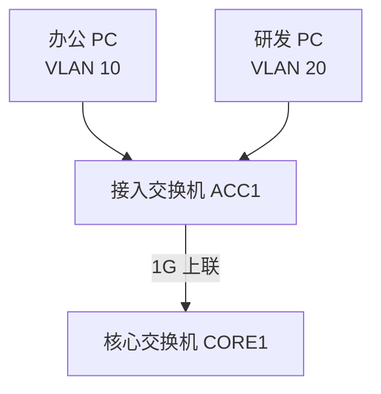
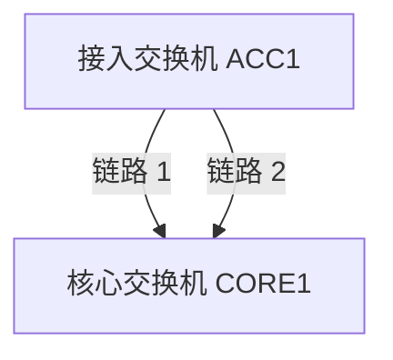
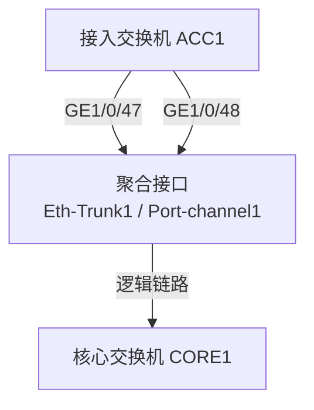
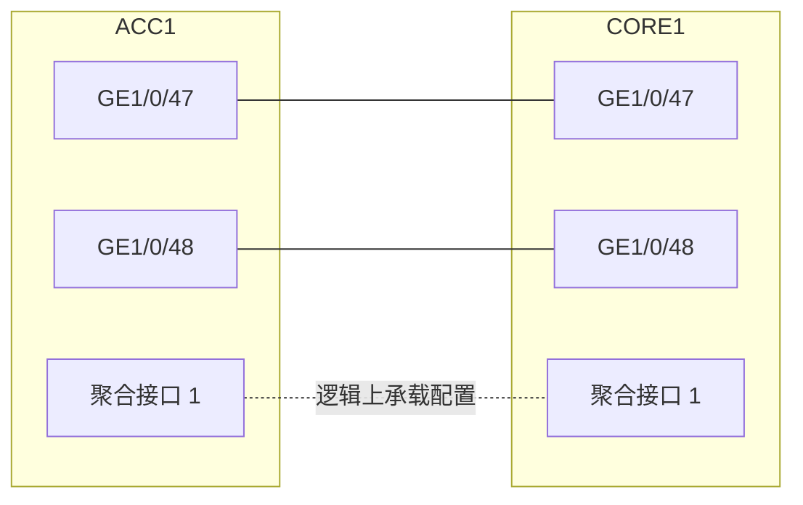
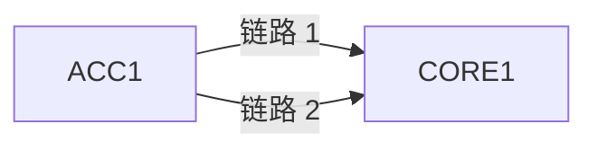
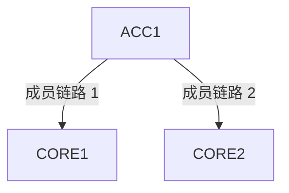
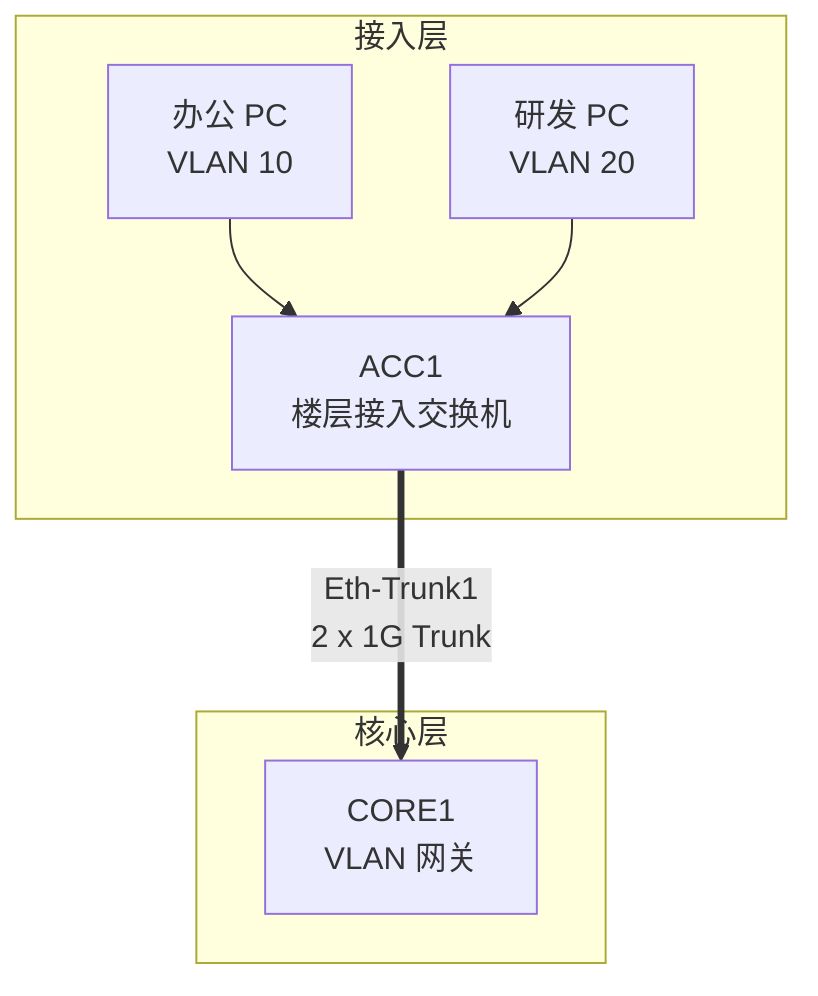
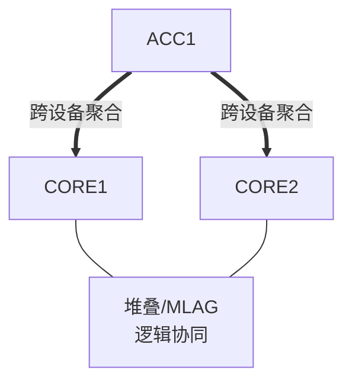
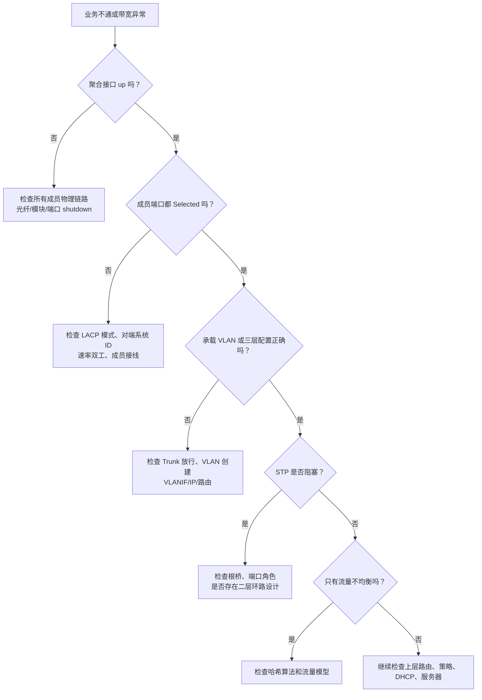

# 第 9 章：链路聚合

## 9.1 学习目标

学完本章后，你应该能够：

- 解释链路聚合的定义，以及它为什么能把多条物理链路合成一条逻辑链路。
- 理解链路聚合与 STP 的关系：聚合后的链路对 STP 来说通常是一条逻辑链路。
- 区分静态聚合、动态聚合和 LACP 的基本工作方式。
- 理解聚合组、成员端口、聚合接口、负载分担、哈希算法、活动链路和备用链路。
- 说明链路聚合能提升什么，不能解决什么。
- 能够规划接入交换机上联、服务器双网卡、核心互联等常见聚合场景。
- 能够看懂厂商中立的链路聚合配置步骤。
- 能够通过聚合状态、成员端口状态、VLAN Trunk、速率双工、LACP 邻居、MAC 地址表和流量统计排查常见故障。

第 8 章讲 STP 时提到，企业网络需要冗余链路，但二层网络又怕环路。如果两台交换机之间直接接两条普通二层链路，没有 STP 阻塞，也没有其他防环机制，就可能形成二层环路。

链路聚合解决的是另一个常见问题：

```text
两台设备之间需要多条物理链路，怎样让这些链路像一条逻辑链路一样工作？
```

链路聚合的核心思想是：

```text
把多条物理链路绑定成一个逻辑接口。
上层协议看到的是一个聚合接口。
业务流量可以在成员链路之间分担。
某条成员链路故障时，其他成员链路继续工作。
```

不同厂商对链路聚合有不同名称：

| 常见名称 | 常见场景 |
| --- | --- |
| Link Aggregation | 通用叫法 |
| LAG | Link Aggregation Group，链路聚合组 |
| Eth-Trunk | 华为等设备常见名称 |
| Port-channel | Cisco 等设备常见名称 |
| Bridge-Aggregation | H3C 等设备常见名称 |
| Bonding / Teaming | Linux、服务器或操作系统侧常见叫法 |

本章采用“链路聚合”和“聚合接口”作为通用表述。真实项目中遇到不同厂商命令时，要先把名称对齐到同一个概念，再看具体配置语法。

## 9.2 为什么需要链路聚合

先看一个普通接入交换机上联场景。



如果 ACC1 到 CORE1 只有一条 1G 链路，它有两个明显问题：

| 问题 | 影响 |
| --- | --- |
| 带宽有限 | 多个 VLAN、多个终端都挤在同一条 1G 上联上 |
| 单链路故障 | 网线、光模块或端口故障会导致 ACC1 下挂用户整体中断 |

一种直觉做法是再接一条线：



但如果这两条线只是普通二层链路，就会形成并行二层路径。STP 可能会阻塞其中一条，避免环路。

```text
结果是：
物理上接了两条线。
实际转发通常只用其中一条。
另一条成为备用链路。
```

这能提高可靠性，但不能同时使用两条链路的带宽。

链路聚合的目标是让两条线不再被交换机当成两条独立链路，而是被看成一个逻辑接口：



更准确的拓扑可以画成：



在配置完成后，VLAN Trunk、Access VLAN、三层 IP 地址、STP 角色等通常都应该配置在聚合接口上，而不是分散配置在每个成员物理口上。

## 9.3 链路聚合解决什么问题

链路聚合主要解决两个问题：带宽扩展和链路冗余。

### 带宽扩展

如果两台交换机之间使用 2 条 1G 物理链路聚合，聚合接口的总可用转发能力可以接近 2G。使用 4 条 10G 链路聚合，总体能力可以接近 40G。

但要注意一个重要限制：

```text
链路聚合通常不会把单个数据流拆散到多条物理链路上逐包转发。
```

也就是说，2 条 1G 聚合不等于单个 TCP 下载就一定能跑到 2G。多数设备会根据源 MAC、目的 MAC、源 IP、目的 IP、源端口、目的端口等字段计算哈希值，再把某一条流量分配到某一条成员链路。

例如：

| 流量 | 可能分配到的成员链路 |
| --- | --- |
| PC1 访问文件服务器 | 链路 1 |
| PC2 访问文件服务器 | 链路 2 |
| PC3 访问 OA 系统 | 链路 1 |
| PC4 访问备份服务器 | 链路 2 |

聚合提升的是多流量、多终端、多会话场景下的总体吞吐能力，不保证单条会话突破单成员链路速率。

### 链路冗余

聚合组中的某条成员链路故障时，其他成员链路仍然可以转发。

例如 ACC1 到 CORE1 有两条 1G 成员链路：

| 成员链路 | 状态 |
| --- | --- |
| GE1/0/47 | up |
| GE1/0/48 | up |

如果 GE1/0/47 的光模块故障，聚合组可以变成：

| 成员链路 | 状态 |
| --- | --- |
| GE1/0/47 | down |
| GE1/0/48 | up |

此时业务不会因为整个上联中断而全部掉线，只是聚合总带宽下降。对用户来说，可能表现为带宽变小，但网络仍然可用。

链路聚合的价值在企业里非常直接：

- 接入交换机上联不会因为单根光纤故障全部中断。
- 多个楼层用户访问核心网络时有更大的上行能力。
- 服务器双网卡可以提高可用性和吞吐。
- 核心、防火墙、负载均衡、存储之间可以用多链路承载较大流量。

## 9.4 链路聚合不能解决什么问题

链路聚合很常用，但不能把它理解成万能冗余技术。

### 不能跨任意两台独立交换机随便聚合

传统链路聚合要求一组成员链路的两端属于同一对逻辑设备。

正确场景：



不应直接把同一个聚合组的两条成员链路分别接到两台完全独立、互不协同的交换机上：



如果 CORE1 和 CORE2 是两台普通独立交换机，它们不知道自己共同组成了同一个聚合对端，聚合协商会失败，或者形成二层异常。

要实现跨设备聚合，通常需要设备支持某种多机协同技术，例如：

| 技术类型 | 常见名称 | 简化理解 |
| --- | --- | --- |
| 堆叠 | Stack、iStack、IRF 等 | 多台交换机虚拟成一台逻辑设备 |
| 多机链路聚合 | MLAG、vPC、M-LAG 等 | 两台设备保持独立控制面，但协同对外提供聚合 |
| 服务器双归容错 | 主备 Bonding、Teaming | 服务器侧一主一备，不一定是同一个 LACP 聚合 |

初学阶段要记住一句话：

```text
链路聚合的两端必须在逻辑上互相对应。
不要把成员线随意插到不同交换机上。
```

### 不能代替路由和安全策略

链路聚合发生在链路层或接口层。它不会自动改变 VLAN、IP 网段、路由、安全策略和 NAT。

例如把 ACC1 到 CORE1 的两条链路做成聚合，只是让它们变成一个更可靠、更高带宽的上联。VLAN 10 是否能访问 VLAN 30，仍然取决于三层网关、路由和安全策略。

### 不能消除所有环路风险

聚合配置正确时，多条成员链路会被视为一条逻辑链路，通常不会因为并行链路本身形成二层环路。

但以下情况仍然可能引发环路：

- 一端做了聚合，另一端没做聚合。
- 两端聚合组成员接错，链路交叉到不同设备。
- 部分物理口被配置在聚合中，部分物理口仍作为普通 Trunk 转发。
- 用户私接交换机形成接入侧环路。
- MLAG、堆叠、STP、VLAN 配置不一致。

所以链路聚合通常与 STP、BPDU 防护、接口描述、布线标签和变更审核一起使用。

## 9.5 链路聚合的核心概念

### 聚合组

聚合组是一组被绑定在一起的物理链路。它们共同构成一个逻辑接口。

例如：

| 聚合组 | 成员端口 | 用途 |
| --- | --- | --- |
| `Eth-Trunk1` | `GE1/0/47`、`GE1/0/48` | ACC1 到 CORE1 上联 |
| `Eth-Trunk10` | `10GE1/0/1`、`10GE1/0/2` | 核心到服务器区交换机 |
| `Port-channel20` | `Gi1/0/23`、`Gi1/0/24` | 接入交换机到汇聚 |

聚合组编号只是本设备上的本地编号。两端编号不一定必须完全相同，但工程中通常保持一致，便于运维。

### 成员端口

成员端口是加入聚合组的物理接口，例如 `GE1/0/47` 和 `GE1/0/48`。

同一个聚合组内的成员端口通常要保持关键属性一致：

| 属性 | 要求 |
| --- | --- |
| 速率 | 一般要求一致，例如都为 1G 或都为 10G |
| 双工 | 一般要求一致，通常为 full-duplex |
| 端口类型 | 应一致，例如都作为二层口或都作为三层口 |
| VLAN 配置 | 应在聚合接口统一配置，成员口不要单独不同 |
| MTU | 应一致，尤其是存储、VXLAN 或大包场景 |
| LACP 模式 | 两端应能匹配协商 |

很多设备会拒绝不一致的成员口加入聚合，或者让该成员口处于不选中状态。排错时要重点查看成员端口是否真正参与转发，而不只是物理 up。

### 聚合接口

聚合接口是逻辑接口。配置通常应该放在聚合接口上。

如果聚合承载多个 VLAN，上层看起来像一个 Trunk：

```text
interface Eth-Trunk1
 description ACC1-to-CORE1
 port link-type trunk
 port trunk allow-pass vlan 10 20 30 40 50 60
```

如果聚合作为三层互联，上层看起来像一个三层接口：

```text
interface Eth-Trunk10
 description CORE-to-FW
 ip address 10.255.0.2 255.255.255.252
```

不同厂商语法不同，但原则一致：

```text
成员物理口负责承载链路。
聚合逻辑口负责承载业务配置。
```

### 活动成员与非活动成员

不是所有加入聚合组的物理口都一定处于活动转发状态。

常见状态包括：

| 状态 | 含义 |
| --- | --- |
| Selected / Active | 成员端口已被选中，参与转发 |
| Unselected / Standby | 成员端口存在，但不参与转发 |
| Individual | 端口没有成功聚合，可能按独立端口处理或被隔离 |
| Down | 物理层或协议状态不可用 |

排查链路聚合时，不能只看端口灯亮。必须确认成员端口是否 Selected，并且两端状态一致。

## 9.6 静态聚合与动态聚合

链路聚合常见方式分为静态聚合和动态聚合。

### 静态聚合

静态聚合也叫手工聚合。管理员在两端手动把相同的物理口加入同一个聚合组，设备不通过 LACP 自动协商。

优点：

- 配置逻辑简单。
- 不依赖对端是否支持 LACP。
- 在某些简单场景或特殊设备上可用。

风险：

- 无法通过 LACP 检测对端是否配置一致。
- 一端配置错误时，可能出现单向转发、环路或丢包。
- 成员线接错设备时更难自动发现。

静态聚合适合对端能力有限、拓扑简单、布线非常明确的场景。企业交换机之间通常更推荐动态聚合。

### 动态聚合与 LACP

LACP 是 Link Aggregation Control Protocol，链路聚合控制协议。它用于让两端设备交换聚合控制信息，判断哪些链路可以加入同一个聚合组。

LACP 可以检查：

- 对端设备身份是否一致。
- 成员链路是否连接到同一个聚合对端。
- 聚合组编号或系统信息是否匹配。
- 本端和对端的成员端口是否可以共同工作。

可以把 LACP 理解成：

```text
链路聚合两端用来确认“这些线是不是同一组、能不能一起工作”的控制协议。
```

LACP 常见模式包括主动和被动：

| 模式 | 行为 | 说明 |
| --- | --- | --- |
| Active | 主动发送 LACP 报文 | 推荐至少一端使用 |
| Passive | 等待对端发起 LACP | 两端都 Passive 时通常协商不起来 |
| On / Manual | 不运行 LACP，强制聚合 | 属于静态聚合思路 |

常见组合：

| 本端 | 对端 | 结果 |
| --- | --- | --- |
| Active | Active | 可以协商 |
| Active | Passive | 可以协商 |
| Passive | Passive | 通常不能协商 |
| Manual | Manual | 静态聚合，取决于配置和连线是否正确 |
| LACP | Manual | 通常不匹配 |

工程建议：

- 交换机之间优先使用 LACP 动态聚合。
- 两端至少一端配置为 Active。
- 不要一端静态、一端 LACP。
- 变更前确认物理连线、接口编号和对端设备。

## 9.7 负载分担原理

链路聚合的负载分担通常基于哈希算法。

设备会从数据帧或数据包中取一些字段，计算出一个结果，然后决定该流量走哪条成员链路。

常见哈希字段包括：

| 字段 | 说明 |
| --- | --- |
| 源 MAC | 二层源地址 |
| 目的 MAC | 二层目的地址 |
| 源 IP | 三层源地址 |
| 目的 IP | 三层目的地址 |
| 源 TCP/UDP 端口 | 四层源端口 |
| 目的 TCP/UDP 端口 | 四层目的端口 |

不同设备支持的负载分担方式不同。有些设备可以配置按二层、三层或四层字段分担。

### 为什么不逐包分担

初学者容易认为两条链路聚合后，设备会把第一个包发到链路 1，第二个包发到链路 2，第三个包再发到链路 1。这样看起来最平均，但实际网络中很少这样做。

原因是逐包分担可能造成乱序。

例如一个 TCP 会话中的数据包如果分别走两条链路，而两条链路的时延、拥塞、队列不同，接收端可能先收到后发出的包，再收到先发出的包。TCP 会误以为发生丢包或乱序，导致重传和性能下降。

因此常见链路聚合按“流”分担：

```text
同一条流量尽量固定走同一条成员链路。
不同流量分散到不同成员链路。
```

### 为什么总带宽看起来不平均

假设有 2 条 1G 聚合链路，5 台 PC 同时访问同一台文件服务器。流量分配可能是：

| 流量 | 成员链路 |
| --- | --- |
| PC1 -> 文件服务器 | 链路 1 |
| PC2 -> 文件服务器 | 链路 1 |
| PC3 -> 文件服务器 | 链路 2 |
| PC4 -> 文件服务器 | 链路 1 |
| PC5 -> 文件服务器 | 链路 2 |

这不是严格平均。哈希结果取决于流量字段和算法，可能出现某条链路较忙、另一条较闲。

如果大量流量都来自同一个源 MAC、去同一个目的 MAC，且设备只按 MAC 做哈希，分担效果可能很差。此时可以考虑：

- 查看设备支持的负载分担算法。
- 使用包含源/目的 IP 或四层端口的哈希方式。
- 增加业务流数量。
- 调整服务器、网关或流量路径设计。

注意，不要因为看到某一条成员链路流量高，就立刻判断聚合故障。先确认流量模型和哈希方式。

## 9.8 链路聚合与 STP、VLAN 的关系

链路聚合经常与 VLAN Trunk 和 STP 同时出现。三者关系必须讲清楚。

### 与 STP 的关系

对 STP 来说，聚合接口通常是一条逻辑链路。只要聚合配置正确，多条成员物理链路不会被 STP 当成多条独立并行链路处理。


如果聚合接口参与 STP，STP 计算的是聚合接口的角色和状态，而不是单独把每条成员线都作为普通链路分别阻塞。

这也是链路聚合与 STP 的区别：

| 对比项 | STP | 链路聚合 |
| --- | --- | --- |
| 主要目标 | 防止二层环路 | 合并多条链路 |
| 对冗余链路的处理 | 阻塞部分路径 | 多成员共同构成逻辑链路 |
| 带宽利用 | 被阻塞链路正常时不转发业务 | 多条成员链路可同时承载业务 |
| 故障切换 | 拓扑重新计算 | 成员链路退出，剩余成员继续转发 |

工程中常见组合是：

```text
同一对设备之间的并行链路：做链路聚合。
多台设备形成的二层拓扑：仍然需要 STP/RSTP/MSTP 防环。
```

### 与 VLAN Trunk 的关系

接入交换机到核心交换机的聚合上联通常承载多个 VLAN，因此聚合接口通常配置为 Trunk。

示例规划：

| VLAN | 用途 | 网段 | 网关 |
| --- | --- | --- | --- |
| 10 | 办公网 | `10.10.10.0/24` | `10.10.10.1` |
| 20 | 研发网 | `10.10.20.0/24` | `10.10.20.1` |
| 30 | 财务网 | `10.10.30.0/24` | `10.10.30.1` |
| 40 | 服务器区 | `10.10.40.0/24` | `10.10.40.1` |
| 50 | 访客无线 | `10.10.50.0/24` | `10.10.50.1` |
| 60 | 管理网 | `10.10.60.0/24` | `10.10.60.1` |

ACC1 到 CORE1 的聚合接口可以放行 VLAN 10、20、30、50、60：

```text
Eth-Trunk1
类型：Trunk
允许 VLAN：10,20,30,50,60
用途：ACC1 到 CORE1 上联
```

注意，VLAN 放行要在两端聚合接口上一致。常见错误是一端允许 VLAN 10、20、30，另一端只允许 VLAN 10、20，导致 VLAN 30 终端无法跨交换机通信。

### 与三层接口的关系

聚合接口也可以作为三层接口使用。例如核心交换机到防火墙之间使用两条 10G 链路聚合，再在聚合接口上配置点到点 IP：

| 设备 | 聚合接口 | IP 地址 |
| --- | --- | --- |
| CORE1 | `Eth-Trunk10` | `10.255.0.2/30` |
| FW1 | `Eth-Trunk10` | `10.255.0.1/30` |

这种设计中，聚合接口不再承载多个 VLAN，而是作为三层互联链路。第 10 章和第 11 章会继续讲三层接口、直连路由和默认路由。

## 9.9 企业常见应用场景

### 场景一：接入交换机双链路上联核心

这是最常见的链路聚合场景。



设计要点：

| 项目 | 建议 |
| --- | --- |
| 成员链路 | 2 条或 4 条同速率链路 |
| 聚合模式 | LACP 动态聚合 |
| 接口类型 | 二层 Trunk |
| VLAN 放行 | 只放行业务需要的 VLAN |
| STP | 聚合接口参与 STP，核心做根桥 |
| 描述 | 两端接口写清楚对端设备和端口 |

### 场景二：服务器双网卡接入交换机

服务器常有两块或更多网卡。它们可以用于冗余，也可以用于负载分担。


常见模式：

| 服务器网卡模式 | 说明 | 交换机侧要求 |
| --- | --- | --- |
| 主备模式 | 一块网卡工作，另一块备用 | 可不使用 LACP，按服务器策略 |
| LACP 聚合 | 多网卡共同组成聚合 | 交换机侧也要配置 LACP 聚合 |
| 负载均衡 Teaming | 操作系统或虚拟化平台控制 | 需确认与交换机兼容 |

服务器场景要特别注意：

- 服务器侧和交换机侧模式必须匹配。
- 如果服务器双网卡分别接两台交换机，需要确认是否支持堆叠、MLAG 或服务器主备模式。
- 虚拟化平台可能承载多个 VLAN，交换机端口可能需要配置 Trunk。
- 存储流量、业务流量、管理流量是否共用聚合，要按性能和安全要求规划。

### 场景三：核心交换机到防火墙或出口设备

核心到防火墙的链路通常承载大量内外网流量，可能需要高带宽和冗余。


设计要点：

| 项目 | 建议 |
| --- | --- |
| 接口类型 | 多数场景使用三层聚合接口 |
| 互联地址 | 使用小网段，例如 `/30` 或 `/31`，以设备支持为准 |
| 路由 | 核心默认路由指向防火墙，防火墙有内部回程路由 |
| 安全策略 | 防火墙策略仍需单独配置 |
| 变更影响 | 聚合故障可能影响全网出口，需安排维护窗口 |

### 场景四：交换机堆叠或 MLAG 下的跨设备聚合

为了避免单核心故障，企业常部署双核心。如果接入交换机同时上联两台核心，又希望两条链路都转发，就需要特殊设计。



这种设计不是普通 LACP 就能单独完成的。需要 CORE1 和 CORE2 在逻辑上对外呈现为一个聚合对端，或者支持多机链路聚合协议。

初学阶段可以这样判断：

| 双核心状态 | 接入交换机能否跨两台核心做同一聚合 |
| --- | --- |
| 两台完全独立，未堆叠，未 MLAG | 不建议，通常不能 |
| 两台组成堆叠/虚拟化 | 通常可以，视厂商实现 |
| 两台支持 MLAG/vPC/M-LAG | 可以，但要按厂商设计严格配置 |
| 服务器主备双网卡分别接两台交换机 | 可以是主备，不一定是 LACP 聚合 |

跨设备聚合属于中高级设计，生产网络中一定要结合厂商文档、软件版本、心跳链路、peer-link、STP、故障场景一起验证。

## 9.10 规划链路聚合时要确认什么

链路聚合看起来只是“多接几根线”，但工程上需要提前规划。

### 物理规划

| 项目 | 示例 | 检查点 |
| --- | --- | --- |
| 本端设备 | `ACC1` | 设备名是否准确 |
| 对端设备 | `CORE1` | 是否为同一个逻辑对端 |
| 成员端口 | `GE1/0/47-48` | 速率、模块、光纤类型一致 |
| 对端端口 | `GE1/0/47-48` | 一一对应，标签清楚 |
| 聚合编号 | `Eth-Trunk1` | 两端建议一致 |
| 链路数量 | 2 条 | 是否满足带宽和冗余要求 |

接口描述建议写清楚：

```text
ACC1 GE1/0/47 -> CORE1 GE1/0/47 member of Eth-Trunk1
ACC1 GE1/0/48 -> CORE1 GE1/0/48 member of Eth-Trunk1
```

清晰的接口描述能显著降低后期排错成本。

### 业务规划

| 项目 | 示例 |
| --- | --- |
| 聚合用途 | ACC1 到 CORE1 上联 |
| 二层或三层 | 二层 Trunk |
| 允许 VLAN | 10、20、30、50、60 |
| STP 角色 | CORE1 为根桥，ACC1 上联为 Root Port |
| LACP 模式 | 两端 Active |
| 负载分担 | 按源/目的 IP 或厂商默认 |
| 最小活动链路 | 至少 1 条，低于阈值告警 |

如果聚合承载服务器或出口业务，还要确认：

- 是否需要 jumbo frame。
- 是否承载存储网络。
- 是否有 QoS 要求。
- 是否需要链路流量监控。
- 是否有维护窗口和回退方案。

### 配置一致性

聚合失败最常见的原因之一是两端配置不一致。

需要检查：

| 检查项 | 常见错误 |
| --- | --- |
| 聚合模式 | 一端 LACP，一端静态 |
| 成员数量 | 一端 2 条，一端只加入 1 条 |
| 成员连接 | 第二条线接到了错误设备 |
| VLAN 放行 | 两端 Trunk 允许 VLAN 不一致 |
| 接口速率 | 一条 1G，一条 10G，或自动协商异常 |
| 端口类型 | 一端二层口，一端三层口 |
| MTU | 一端默认 1500，一端配置大 MTU |
| STP 边缘 | 错把上联聚合配置成边缘端口 |

## 9.11 厂商中立配置示例：接入交换机双上联

下面用一个小型企业场景演示链路聚合配置思路。命令不是某个厂商的完整语法，而是帮助你理解配置步骤。

### 需求

公司总部一台接入交换机 ACC1 上联到核心交换机 CORE1。ACC1 下挂办公、研发、财务和管理终端。要求：

- ACC1 到 CORE1 使用两条 1G 链路聚合。
- 聚合使用 LACP 动态模式。
- 聚合接口作为二层 Trunk。
- 放行 VLAN 10、20、30、60。
- CORE1 作为这些 VLAN 的网关。

地址与 VLAN 规划：

| VLAN | 用途 | 网段 | 网关 |
| --- | --- | --- | --- |
| 10 | 办公网 | `10.10.10.0/24` | `10.10.10.1` |
| 20 | 研发网 | `10.10.20.0/24` | `10.10.20.1` |
| 30 | 财务网 | `10.10.30.0/24` | `10.10.30.1` |
| 60 | 管理网 | `10.10.60.0/24` | `10.10.60.1` |

物理连接：

| ACC1 端口 | CORE1 端口 | 说明 |
| --- | --- | --- |
| `GE1/0/47` | `GE1/0/47` | 聚合成员 1 |
| `GE1/0/48` | `GE1/0/48` | 聚合成员 2 |

### ACC1 配置思路

```text
1. 创建 VLAN 10、20、30、60。
2. 创建聚合接口 Eth-Trunk1。
3. 设置聚合模式为 LACP。
4. 把 GE1/0/47 和 GE1/0/48 加入 Eth-Trunk1。
5. 在 Eth-Trunk1 上配置 Trunk。
6. 放行 VLAN 10、20、30、60。
7. 在接入口上配置对应 Access VLAN。
8. 保存配置并查看聚合状态。
```

示例伪配置：

```text
vlan 10 name OFFICE
vlan 20 name RD
vlan 30 name FINANCE
vlan 60 name MGMT

interface Eth-Trunk1
 description to CORE1 Eth-Trunk1
 mode lacp
 port link-type trunk
 port trunk allow-pass vlan 10 20 30 60

interface GE1/0/47
 description to CORE1 GE1/0/47 member Eth-Trunk1
 join Eth-Trunk1

interface GE1/0/48
 description to CORE1 GE1/0/48 member Eth-Trunk1
 join Eth-Trunk1

interface GE1/0/1
 description Office-PC
 port link-type access
 port default vlan 10

interface GE1/0/2
 description RD-PC
 port link-type access
 port default vlan 20
```

### CORE1 配置思路

```text
1. 创建相同 VLAN。
2. 创建聚合接口 Eth-Trunk1。
3. 设置聚合模式为 LACP。
4. 把对应物理口加入 Eth-Trunk1。
5. 在 Eth-Trunk1 上配置 Trunk 并放行相同 VLAN。
6. 创建 VLANIF 或 SVI 作为网关。
7. 配置 STP 根桥优先级。
8. 查看聚合、VLAN、STP 和网关状态。
```

示例伪配置：

```text
vlan 10 name OFFICE
vlan 20 name RD
vlan 30 name FINANCE
vlan 60 name MGMT

interface Eth-Trunk1
 description to ACC1 Eth-Trunk1
 mode lacp
 port link-type trunk
 port trunk allow-pass vlan 10 20 30 60

interface GE1/0/47
 description to ACC1 GE1/0/47 member Eth-Trunk1
 join Eth-Trunk1

interface GE1/0/48
 description to ACC1 GE1/0/48 member Eth-Trunk1
 join Eth-Trunk1

interface Vlanif10
 description OFFICE gateway
 ip address 10.10.10.1 255.255.255.0

interface Vlanif20
 description RD gateway
 ip address 10.10.20.1 255.255.255.0

interface Vlanif30
 description FINANCE gateway
 ip address 10.10.30.1 255.255.255.0

interface Vlanif60
 description MGMT gateway
 ip address 10.10.60.1 255.255.255.0
```

### 配置顺序建议

生产环境中，不建议随意插线后再慢慢试配置。更稳妥的顺序是：

1. 先在两端确认接口编号和光纤标签。
2. 在维护窗口内配置聚合接口和成员口。
3. 确认两端聚合成员 Selected。
4. 再迁移 VLAN Trunk 或业务配置到聚合接口。
5. 测试 VLAN 内通信、跨 VLAN 网关、DHCP 和核心业务。
6. 观察链路流量、错误包、STP 状态和日志。

如果是把原来的单链路上联改成双链路聚合，要特别小心配置切换过程。常见做法是先在新聚合上准备配置，再按计划迁移业务，避免短时间出现普通链路和聚合链路同时转发造成环路。

## 9.12 验证链路聚合

配置完成后，要从“物理层、聚合层、二层业务、三层业务、流量分担”几个层面验证。

### 查看聚合状态

重点确认：

| 检查项 | 正常期望 |
| --- | --- |
| 聚合接口状态 | up |
| 成员端口数量 | 与规划一致 |
| 成员端口选择状态 | 都是 Selected 或 Active |
| LACP 邻居 | 能看到正确对端 |
| 对端系统 ID | 多条成员应指向同一个逻辑对端 |
| 速率 | 总带宽符合预期 |

示例输出可以这样理解：

```text
Aggregate interface: Eth-Trunk1
Mode: LACP
Status: UP

Member Ports:
GE1/0/47  Selected  1000M  Full
GE1/0/48  Selected  1000M  Full

Peer:
System ID: CORE1
```

如果一个成员是 Selected，另一个是 Unselected，要继续查原因。

### 查看物理端口

聚合状态异常时，先看物理端口：

| 项目 | 检查原因 |
| --- | --- |
| Link 状态 | 光纤、网线、模块、端口是否 up |
| 速率双工 | 是否与对端一致 |
| CRC 错误 | 可能是线缆、模块、光功率问题 |
| Input/Output error | 可能有物理层或拥塞问题 |
| 接口描述 | 是否接到正确对端 |

物理层不稳定会导致成员链路反复进出聚合组，表现为业务间歇抖动。

### 查看 VLAN Trunk

如果聚合接口是二层 Trunk，要确认：

- 本端聚合接口允许的 VLAN 是否正确。
- 对端聚合接口允许的 VLAN 是否一致。
- VLAN 是否已经创建。
- 接入口是否放入正确 VLAN。
- STP 是否允许聚合接口转发。

示例检查表：

| 检查项 | ACC1 | CORE1 |
| --- | --- | --- |
| Eth-Trunk1 类型 | Trunk | Trunk |
| 允许 VLAN | 10、20、30、60 | 10、20、30、60 |
| VLAN 10 是否存在 | 是 | 是 |
| VLAN 20 是否存在 | 是 | 是 |
| VLAN 30 是否存在 | 是 | 是 |
| VLAN 60 是否存在 | 是 | 是 |

### 查看 STP 状态

聚合接口仍然可能被 STP 阻塞，尤其在多交换机二层拓扑中。

需要确认：

| 项目 | 正常理解 |
| --- | --- |
| 根桥 | 应符合设计，通常是核心 |
| 聚合接口角色 | 接入交换机上通常是 Root Port |
| 聚合接口状态 | 应为 Forwarding |
| 是否边缘端口 | 上联聚合不应配置为边缘端口 |
| 是否收到异常 BPDU | 普通接入口收到 BPDU 需关注 |

如果聚合接口被 STP 阻塞，VLAN 可能不通，但这不一定是聚合故障，而是生成树拓扑选择结果。

### 验证业务连通

以 ACC1 下的办公 PC 为例：

| 测试 | 正常结果 |
| --- | --- |
| PC 获取 DHCP 地址 | 获得 `10.10.10.0/24` 地址 |
| PC ping 网关 `10.10.10.1` | 成功 |
| PC ping 同 VLAN 其他主机 | 成功 |
| PC ping 允许访问的服务器 | 成功 |
| 管理 PC 访问 ACC1 管理地址 | 成功 |

如果同 VLAN 本地通信正常，但跨交换机或跨 VLAN 不通，要重点检查聚合 Trunk、VLAN 放行、网关和路由。

### 验证冗余

维护窗口内可以做受控测试：

1. 确认两条成员链路都 Selected。
2. 持续 ping 网关或核心服务器。
3. 管理员手动 shutdown 一条成员端口，或拔掉一条测试链路。
4. 观察 ping 是否短暂抖动后恢复。
5. 确认聚合接口仍 up，剩余成员仍 Selected。
6. 恢复成员链路，观察它是否重新加入聚合。

注意不要在生产高峰期随意拔线测试。出口、防火墙、存储链路的聚合测试要经过变更审批。

## 9.13 常见故障与排查

链路聚合故障排查要先判断问题属于哪一层：

```text
物理端口是否 up？
成员是否加入聚合？
LACP 是否协商成功？
聚合接口是否 up？
VLAN 或三层配置是否在聚合接口上？
STP 是否阻塞？
业务流量是否按预期转发？
```

下面列出常见故障。

### 故障一：聚合接口 down

现象：

- 聚合接口状态 down。
- 下挂用户无法访问核心网关。
- 多个 VLAN 同时中断。

可能原因：

| 原因 | 检查方法 |
| --- | --- |
| 所有成员物理链路 down | 查看成员端口 link 状态 |
| 对端未配置聚合 | 查看 LACP 邻居 |
| 成员端口没有加入聚合组 | 查看聚合成员列表 |
| 光模块或光纤故障 | 查看收发光、CRC、端口日志 |
| 本端或对端接口 shutdown | 查看接口配置 |

排查顺序：

1. 查本端聚合接口状态。
2. 查本端成员物理口状态。
3. 查对端对应物理口状态。
4. 查 LACP 邻居和对端系统 ID。
5. 查最近是否有布线或配置变更。

### 故障二：只有一条成员链路工作

现象：

- 聚合接口 up。
- 只有一条成员 Selected。
- 总带宽低于预期。
- 拔掉工作成员后业务中断。

可能原因：

| 原因 | 说明 |
| --- | --- |
| 第二条线物理 down | 光纤、模块、端口问题 |
| 第二条线接错设备 | LACP 发现对端系统不同 |
| 速率或双工不一致 | 成员不满足聚合条件 |
| 一端忘记把端口加入聚合 | 两端成员列表不一致 |
| 最大活动链路数限制 | 设备配置只允许部分成员活动 |

排查时要特别看“对端系统 ID”。如果两条成员链路看到的对端不是同一台逻辑设备，就不能进入同一个聚合组。

### 故障三：一端聚合，另一端普通 Trunk

这是非常危险的错误。

现象可能包括：

- 聚合协商失败。
- VLAN 间歇不通。
- MAC 地址在多个端口之间漂移。
- STP 拓扑异常。
- 出现广播风暴风险。

原因：

```text
本端把两条线当成一个聚合接口。
对端却把两条线当成两个独立 Trunk。
两端对链路的理解不一致。
```

处理：

1. 立即确认变更窗口和影响范围。
2. 必要时先关闭多余链路，保留单链路恢复业务。
3. 在两端统一配置聚合模式。
4. 确认 LACP 或静态聚合状态一致。
5. 再恢复所有成员链路。

生产环境中遇到 MAC 漂移和广播异常时，要快速检查是否有“一端聚合、一端未聚合”的情况。

### 故障四：聚合 up，但某些 VLAN 不通

现象：

- VLAN 10 正常，VLAN 30 不通。
- 办公网能上网，财务网无法获取地址。
- 聚合接口状态正常。

可能原因：

| 原因 | 检查点 |
| --- | --- |
| 聚合接口未放行该 VLAN | 查看 Trunk allowed VLAN |
| 对端未放行该 VLAN | 两端放行列表不一致 |
| VLAN 未创建 | 查看 VLAN 表 |
| 接入口 VLAN 错误 | 查看终端所在端口 |
| 网关接口 down | 查看 VLANIF/SVI 状态 |
| DHCP 中继缺失 | 查看 DHCP relay 配置 |

这类问题不是“链路聚合不通”，而是聚合承载的二层或三层业务配置有问题。排查时不要只盯着成员链路。

### 故障五：聚合 up，但流量只跑一条链路

现象：

- 两条成员都是 Selected。
- 监控显示大部分流量集中在一条成员链路。
- 另一条链路流量很小。

可能原因：

| 原因 | 说明 |
| --- | --- |
| 流量流数量少 | 单一大流可能只走一条成员 |
| 哈希字段不合适 | 只按 MAC 分担时可能不均衡 |
| 业务集中到单一服务器 | 源/目的字段变化少 |
| 监控时间太短 | 瞬时流量不代表长期分布 |

处理思路：

1. 确认成员链路都在转发状态。
2. 查看设备当前负载分担算法。
3. 分析流量是单流还是多流。
4. 如果设备支持，考虑改为更合适的哈希字段。
5. 不要期望单个会话自动叠加多条链路带宽。

### 故障六：成员链路频繁抖动

现象：

- 日志中看到成员端口 up/down。
- 聚合带宽反复变化。
- 用户感知为偶发掉包、视频会议卡顿、文件传输中断。

可能原因：

| 原因 | 检查方法 |
| --- | --- |
| 光模块故障 | 查看光功率、替换模块测试 |
| 光纤质量问题 | 查看 CRC、input error |
| 端口硬件问题 | 更换端口对比 |
| 自动协商异常 | 固定速率或检查对端设置 |
| LACP 超时 | 查看 LACP 报文、CPU、链路质量 |

处理时要结合日志时间点、接口错误计数和现场布线记录。不要只重启端口后观察几分钟就结束。

## 9.14 排查流程图

当链路聚合相关业务异常时，可以按下面流程缩小范围。



排查时建议保留以下信息：

- 故障开始时间。
- 最近变更记录。
- 聚合接口状态截图或输出。
- 成员端口状态与错误计数。
- LACP 邻居信息。
- STP 状态。
- VLAN Trunk 放行列表。
- MAC 地址漂移日志。
- 业务测试结果。

这些信息能帮助你判断问题是物理层、聚合协商、二层 VLAN、STP 还是三层业务。

## 9.15 链路聚合设计建议

### 优先使用 LACP

交换机之间、交换机到服务器、交换机到防火墙，只要双方支持，优先考虑 LACP。LACP 能帮助发现对端不一致和接线错误，比纯手工静态聚合更安全。

### 成员链路保持一致

同一聚合组内尽量使用相同速率、相同类型、相同距离、相同介质的链路。

推荐：

```text
2 x 1G 电口
2 x 10G 光口
4 x 10G 光口
```

不推荐随意混用：

```text
1 x 1G + 1 x 10G
一条单模光纤 + 一条多模光纤
一条直连核心 + 一条绕经中间设备
```

不同设备可能支持不同能力，但工程上越统一越容易维护。

### 配置放在聚合接口上

二层 Trunk、Access VLAN、三层 IP、ACL、QoS、MTU 等业务配置，应按厂商要求放在聚合接口上。成员物理口只负责加入聚合，不要让成员口之间出现不同业务配置。

错误思路：

```text
GE1/0/47 放行 VLAN 10,20
GE1/0/48 放行 VLAN 10,30
```

正确思路：

```text
Eth-Trunk1 放行 VLAN 10,20,30
GE1/0/47 加入 Eth-Trunk1
GE1/0/48 加入 Eth-Trunk1
```

### 上联聚合不要配置为边缘端口

边缘端口适合普通终端接入口，不适合交换机之间的聚合上联。上联聚合应参与 STP 或其他防环机制。

### 不要把链路聚合当作容量规划的唯一手段

如果接入层到核心的流量长期接近聚合带宽上限，仅仅继续加成员链路不一定是最佳方案。还要考虑：

- 是否需要升级到 10G、25G、40G 或 100G。
- 是否需要减少二层上联数量，改用三层汇聚。
- 是否有异常流量、备份流量或监控流量占满链路。
- 是否需要按业务分区、分核心或分路径设计。
- 是否有服务器、存储、互联网出口成为瓶颈。

链路聚合是接口级扩展手段，不是完整的网络架构设计。

## 9.16 自检练习

请尝试回答以下问题：

1. 两台交换机之间接了两条普通 Trunk 链路，为什么可能形成二层环路？
2. STP 阻塞一条冗余链路和链路聚合同时使用多条成员链路，有什么区别？
3. 2 条 1G 链路聚合后，为什么单个下载任务不一定能跑到 2G？
4. LACP Active 和 Passive 有什么区别？两端都 Passive 会怎样？
5. 为什么同一个聚合组的成员链路通常不能分别接到两台完全独立的核心交换机？
6. 聚合接口 up，但 VLAN 30 不通，你会检查哪些配置？
7. 两条成员链路都是 Selected，但监控显示流量不平均，这一定是故障吗？为什么？
8. 服务器双网卡分别接两台交换机时，应该先确认哪些条件？
9. 把原来的单链路上联改成双链路聚合时，为什么需要维护窗口和回退方案？
10. 如果日志出现 MAC 地址在两个上联口之间漂移，你会如何判断是否与聚合配置有关？

## 9.17 本章小结

链路聚合是企业交换网络中非常基础、非常实用的技术。它把多条物理链路绑定成一条逻辑链路，让两台设备之间获得更高的总体带宽和更好的链路冗余。

理解链路聚合时，要抓住几个核心点：

- 聚合接口是逻辑接口，成员端口是物理承载。
- 业务配置通常放在聚合接口上，而不是分别放在成员口上。
- LACP 能帮助两端协商聚合关系，减少接线和配置错误。
- 负载分担通常按流哈希，不保证单条流量叠加多条链路带宽。
- 传统聚合不能跨任意两台独立交换机，跨设备聚合需要堆叠、MLAG 或类似技术。
- 聚合上联仍然要与 VLAN Trunk、STP、路由和安全策略配合。
- 排查时要分层看：物理端口、成员状态、LACP、聚合接口、VLAN/STP、三层业务和流量模型。

第 8 章解决了二层冗余中的防环问题，本章解决了同一对设备之间多条链路如何合并使用的问题。下一章的三层交换会继续向上推进：当不同 VLAN 之间需要高速互通时，核心交换机如何承担网关和三层转发角色。
