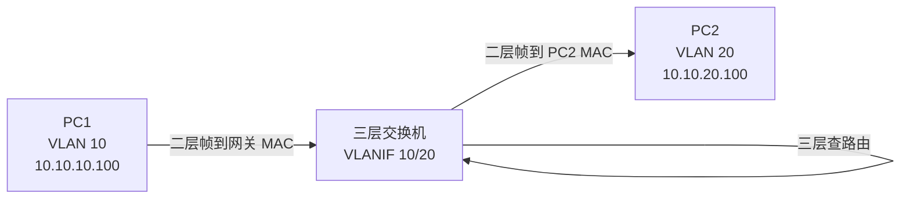
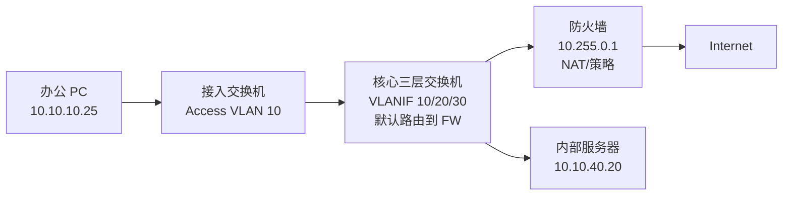

# 第 10 章：三层交换

## 10.1 学习目标

学完本章后，你应该能够：

- 理解二层交换与三层交换的区别。
- 理解 SVI、VLANIF、三层接口的作用。
- 掌握 VLAN 间路由的设计方式。
- 理解静态路由、默认路由、DHCP 中继在三层交换机上的使用。
- 能够设计简单园区网核心交换架构。
- 能够排查网关不通、跨 VLAN 不通、路由缺失等故障。

三层交换机是企业园区网的核心设备之一。它既具备交换机的高速二层转发能力，也具备路由器的三层转发能力。很多企业内部 VLAN 间通信，并不是通过传统路由器完成，而是由核心三层交换机完成。

## 10.2 二层交换与三层交换

### 二层交换

二层交换根据 MAC 地址转发以太网帧。它不关心 IP 路由，只在同一个 VLAN 内转发。

典型功能：

- MAC 地址学习。
- VLAN。
- Trunk。
- STP。
- 链路聚合。

### 三层交换

三层交换根据 IP 地址在不同网段之间转发数据包。它可以为多个 VLAN 提供网关。

典型功能：

- VLANIF 或 SVI 网关。
- 静态路由。
- 动态路由。
- ACL。
- DHCP Relay。
- 路由汇总。

简单理解：

```text
同 VLAN 内通信：二层交换
不同 VLAN 间通信：三层转发
```

用数据路径看会更清楚：



三层交换机不是“二层交换机加一台路由器”这么简单。它在硬件转发能力上通常比传统路由器更适合园区内部大量 VLAN 间通信。但它的安全审计、应用识别、威胁防护能力通常不如防火墙，所以设计时要明确哪些流量适合在核心交换机直接转发，哪些必须经过防火墙。

## 10.3 SVI 与 VLANIF

SVI 是 Switch Virtual Interface，交换虚拟接口。华为、H3C 中常称为 VLANIF 接口。它是三层交换机上为某个 VLAN 创建的三层网关接口。

示例：

```text
VLAN 10：10.10.10.0/24
VLANIF 10：10.10.10.1/24

VLAN 20：10.10.20.0/24
VLANIF 20：10.10.20.1/24
```

终端配置：

```text
PC1：10.10.10.100/24，网关 10.10.10.1
PC2：10.10.20.100/24，网关 10.10.20.1
```

PC1 访问 PC2 时，三层交换机在 VLANIF 10 和 VLANIF 20 之间完成路由转发。

SVI/VLANIF 可以理解为“这个 VLAN 在三层交换机上的网关接口”。它既属于某个 VLAN，又有三层 IP 地址。

| 对象 | 作用 |
| --- | --- |
| VLAN 10 | 二层广播域，承载办公终端 |
| VLANIF 10 | VLAN 10 的三层网关 |
| 10.10.10.1 | 终端默认网关地址 |
| 终端 ARP 的对象 | 网关 IP `10.10.10.1` 对应的 MAC |

终端跨 VLAN 通信时，第一跳目的 MAC 是 VLANIF 的 MAC，而不是远端主机的 MAC。

## 10.4 VLANIF up 的条件

创建 VLANIF 并配置 IP 后，不一定立即 up。通常需要满足：

- 对应 VLAN 已创建。
- 对应 VLAN 中至少有一个二层端口 up，或有活动 Trunk 承载该 VLAN。
- 设备没有手动 shutdown 该 VLANIF。

常见故障是 VLANIF down，导致该 VLAN 的终端网关不通。

排查：

```text
查看 VLAN 是否存在
查看 VLANIF 状态
查看是否有端口属于该 VLAN 且 up
查看 Trunk 是否允许该 VLAN
```

常见误区是“我已经配置了 VLANIF IP，为什么网关不通”。三层接口配置只是条件之一，对应 VLAN 必须在二层侧有活动成员。对于接入交换机上来的 VLAN，还要确认中间 Trunk 是否放行该 VLAN。

| 现象 | 可能原因 |
| --- | --- |
| VLANIF administratively down | 接口被手动关闭 |
| VLANIF protocol down | VLAN 不存在、没有活动端口、Trunk 不通 |
| VLANIF up 但终端 ping 不通 | 接入口 VLAN、ARP、终端网关或 ACL 问题 |

## 10.5 VLAN 间路由

### 场景

企业有三个 VLAN：

| VLAN | 用途 | 网段 | 网关 |
| ---: | --- | --- | --- |
| 10 | 办公网 | 10.10.10.0/24 | 10.10.10.1 |
| 20 | 研发网 | 10.10.20.0/24 | 10.10.20.1 |
| 30 | 财务网 | 10.10.30.0/24 | 10.10.30.1 |

核心三层交换机创建：

```text
VLANIF 10：10.10.10.1/24
VLANIF 20：10.10.20.1/24
VLANIF 30：10.10.30.1/24
```

只要三层交换机开启三层转发，且没有 ACL 阻断，三个 VLAN 之间即可互通。

### 安全提醒

三层交换机让 VLAN 间通信变得容易，但这不代表所有 VLAN 都应该互通。

企业中通常有两种做法：

- 普通办公 VLAN 之间由核心交换机互通，使用 ACL 做基本限制。
- 安全敏感区域通过防火墙互通，例如服务器区、财务区、DMZ、访客区。

架构设计时要平衡性能和安全。核心交换机转发速度快，但安全控制能力通常不如防火墙。

### VLAN 间访问路径

以办公 VLAN 10 访问服务器 VLAN 40 为例：

```text
PC：10.10.10.25/24，网关 10.10.10.1
Server：10.10.40.20/24，网关 10.10.40.1
```

流程：

1. PC 判断 Server 不在本地网段。
2. PC ARP 网关 `10.10.10.1`。
3. PC 把数据帧发给三层交换机 VLANIF 10。
4. 三层交换机查路由表，发现 `10.10.40.0/24` 是直连网段。
5. 三层交换机在 VLAN 40 中 ARP Server 的 MAC。
6. 三层交换机把数据转发给 Server。
7. Server 回包给自己的网关 `10.10.40.1`。
8. 三层交换机再转回 VLAN 10。

这说明三层交换机同时参与了两个动作：在入 VLAN 接收二层帧，在三层查路由，再在出 VLAN 封装新的二层帧。

## 10.6 三层接口

除了 VLANIF，三层交换机还可以把物理接口或聚合接口改成三层接口，直接配置 IP 地址。

常见场景：

- 核心交换机到防火墙互联。
- 核心交换机到路由器互联。
- 核心交换机之间三层互联。

示例：

```text
Core-SW ---- Firewall

Core-SW 接口：10.255.0.2/30
Firewall 接口：10.255.0.1/30
```

这种点到点互联常用 `/30` 或 `/31` 地址。初学阶段使用 `/30` 更容易理解。

## 10.7 静态路由

三层交换机负责内部网关，但要访问互联网或远端分支，还需要路由。

### 默认路由

如果核心交换机所有未知目的都应该交给防火墙，可以配置默认路由：

```text
目的：0.0.0.0/0
下一跳：10.255.0.1
```

含义：

```text
凡是路由表中没有更精确匹配的目的，都发给防火墙。
```

### 回程路由

防火墙也必须知道内部网段在哪里。否则核心把流量发给防火墙，防火墙不知道如何回到 `10.10.10.0/24`、`10.10.20.0/24` 等网段，通信仍会失败。

防火墙上通常需要：

```text
10.10.0.0/16 下一跳 10.255.0.2
```

如果内部地址规划连续，可以用汇总路由减少防火墙路由条目。

### 最长前缀匹配

路由表中可能同时存在多条能匹配目的地址的路由。设备会选择掩码最长、最精确的那条。

示例：

| 路由 | 下一跳 |
| --- | --- |
| 10.10.0.0/16 | Core |
| 10.10.40.0/24 | Firewall |
| 0.0.0.0/0 | Internet |

访问 `10.10.40.20` 时，会匹配 `/24`，因为它比 `/16` 更精确。访问 `10.10.20.30` 时，会匹配 `/16`。访问公网地址时，如果没有更精确路由，会匹配默认路由 `/0`。

理解最长前缀匹配有助于排查“明明有默认路由，为什么流量走了另一条路”这类问题。

### 路由与安全策略的关系

路由决定“流量往哪里走”，安全策略决定“流量能不能过”。路由正确但策略拒绝，业务仍然不通；策略允许但没有路由，流量也无法到达。

排错时要分别验证：

```text
路由表是否有到目的网段的路由
下一跳是否可达
回程路由是否存在
ACL 或防火墙策略是否允许
NAT 是否按预期生效
```

## 10.8 DHCP 中继

当 DHCP 服务器和终端不在同一个 VLAN 时，需要在网关设备上配置 DHCP Relay。

### 场景

```text
DHCP 服务器：10.10.40.10
办公 VLAN 10：10.10.10.0/24
研发 VLAN 20：10.10.20.0/24
```

终端发送 DHCP Discover 是广播，广播不能直接跨 VLAN。三层交换机上的 VLANIF 需要把 DHCP 请求转发给 DHCP 服务器。

配置逻辑：

```text
在 VLANIF 10 配置 DHCP Relay 指向 10.10.40.10
在 VLANIF 20 配置 DHCP Relay 指向 10.10.40.10
DHCP 服务器上创建 VLAN 10、VLAN 20 对应地址池
```

排查 DHCP Relay：

```text
终端是否发送 DHCP Discover
VLANIF 是否收到请求
Relay 目标地址是否正确
DHCP 服务器是否有对应地址池
服务器是否能回到客户端网段
防火墙是否放行 DHCP 相关流量
```

### DHCP Relay 与地址池匹配

DHCP 服务器通常根据 Relay 带来的网关地址判断应该使用哪个地址池。比如：

| VLANIF | 网段 | Relay 到 DHCP 服务器后匹配的地址池 |
| --- | --- | --- |
| VLANIF 10：10.10.10.1 | 10.10.10.0/24 | Office 地址池 |
| VLANIF 20：10.10.20.1 | 10.10.20.0/24 | R&D 地址池 |
| VLANIF 50：10.10.50.1 | 10.10.50.0/24 | Guest 地址池 |

如果 DHCP 服务器没有对应地址池，或者地址池的网关、DNS、租期配置错误，终端即使能收到地址，也可能无法正常访问业务。

## 10.9 网关冗余

如果每个 VLAN 的网关只在一台核心交换机上，该核心故障会导致大量终端失去网关。因此企业常使用网关冗余协议。

常见协议和技术：

- VRRP。
- HSRP。
- GLBP。
- 堆叠或虚拟化双核心网关。
- M-LAG 网关。

### VRRP 基本思想

两台三层设备共同提供一个虚拟网关 IP。

示例：

```text
虚拟网关：10.10.10.1
Core-1 真实地址：10.10.10.2
Core-2 真实地址：10.10.10.3
```

终端网关配置为 `10.10.10.1`。正常情况下 Core-1 作为主设备响应网关流量；Core-1 故障时 Core-2 接管虚拟网关。

设计建议：

- 网关主备与 STP 根桥尽量保持一致。
- 上联链路故障时要能联动降低优先级。
- 双核心之间要有可靠互联。
- 测试主备切换时间和业务影响。

### VRRP 与 STP 的配合

在二层双核心场景中，建议让某个 VLAN 的 VRRP 主设备与该 VLAN 的 STP 根桥尽量一致。

例如：

| VLAN | STP 主根 | VRRP 主网关 |
| ---: | --- | --- |
| 10 | Core-1 | Core-1 |
| 20 | Core-1 | Core-1 |
| 40 | Core-2 | Core-2 |

这样可以减少流量绕行。如果 STP 根桥在 Core-1，但 VRRP 主网关在 Core-2，终端到网关的二层路径可能先到 Core-1，再跨核心链路到 Core-2，增加不必要路径。

### 网关冗余不是备份路由的全部

VRRP 解决的是默认网关地址冗余，但还需要考虑：

- 核心到防火墙的上联是否冗余。
- 防火墙是否双机。
- 防火墙是否有回程路由。
- 动态路由或静态路由是否随故障切换。
- DHCP Relay、ACL、策略是否在主备设备上保持一致。

## 10.10 园区网三层架构

典型园区网分为三层：

```text
接入层 -> 汇聚层 -> 核心层
```

### 接入层

负责终端接入：

- Access VLAN。
- 端口安全。
- PoE 供电。
- 边缘端口。
- 终端接入控制。

### 汇聚层

负责汇聚接入交换机：

- VLAN 汇聚。
- 策略控制。
- 路由边界。
- 链路冗余。

有些中小型企业会省略独立汇聚层，采用接入层直接上联核心。

### 核心层

负责高速转发和网络骨干：

- 三层网关。
- 路由汇总。
- 到防火墙、数据中心、广域网的连接。
- 高可用设计。

核心层设计原则是稳定、简单、高速。不要在核心层堆叠过多复杂策略，复杂安全控制通常放在防火墙或专用安全设备上。

### 二层到接入，三层到核心

现代园区网常见趋势是缩小二层范围，把三层边界尽量下沉到汇聚或核心。这样可以减少 STP 影响范围，提高故障隔离能力。

| 设计 | 特点 | 适用 |
| --- | --- | --- |
| 大二层到核心 | VLAN 从接入延伸到核心，网关在核心 | 中小园区，管理简单 |
| 汇聚三层网关 | VLAN 在汇聚终结，汇聚到核心走三层 | 中大型园区 |
| 接入三层化 | 接入交换机即三层网关 | 大型园区、自动化程度较高网络 |

初学阶段先掌握“接入二层、核心三层网关”的模型。后续学习路由协议后，再理解汇聚三层和接入三层化。

## 10.11 配置示例思路

### 场景

核心三层交换机作为 VLAN 10、20、30 的网关，并通过防火墙访问互联网。

规划：

| 项目 | 值 |
| --- | --- |
| VLAN 10 | 10.10.10.0/24，网关 10.10.10.1 |
| VLAN 20 | 10.10.20.0/24，网关 10.10.20.1 |
| VLAN 30 | 10.10.30.0/24，网关 10.10.30.1 |
| 核心到防火墙 | 10.255.0.2/30 |
| 防火墙内侧 | 10.255.0.1/30 |
| 默认路由 | 0.0.0.0/0 -> 10.255.0.1 |

配置逻辑：

```text
1. 创建 VLAN 10、20、30。
2. 创建 VLANIF 10、20、30 并配置网关 IP。
3. 配置接入或 Trunk 端口承载对应 VLAN。
4. 配置核心到防火墙的三层接口。
5. 配置默认路由指向防火墙。
6. 在防火墙配置回程路由指向核心交换机。
7. 根据安全要求配置 ACL 或防火墙策略。
```

验证：

```text
终端 ping 本 VLAN 网关
不同 VLAN 终端互 ping
核心交换机 ping 防火墙内侧地址
核心交换机查看默认路由
防火墙查看内部网段回程路由
终端访问互联网
抓包或查看会话确认路径正确
```

### 完整路径图



在这张图里：

- PC 到同 VLAN 终端：主要看接入交换机二层转发。
- PC 到其他 VLAN：主要看核心 VLANIF 和路由。
- PC 到互联网：还要看核心默认路由、防火墙回程路由、策略和 NAT。
- PC 到服务器：如果服务器 VLAN 在核心直连，看 VLANIF；如果服务器区在防火墙后，看安全策略和路由。

## 10.12 常见故障与排查

### 终端 ping 不通网关

可能原因：

- 终端 IP、掩码、网关配置错误。
- 接入口 VLAN 错误。
- VLANIF down。
- Trunk 未放行 VLAN。
- 网关 IP 配错。

排查：

```text
查看终端地址信息
查看接入口 VLAN
查看 VLANIF 状态
查看 MAC 地址表
查看 ARP 表
```

### 同 VLAN 通，跨 VLAN 不通

可能原因：

- 三层交换未启用。
- 目的 VLANIF down。
- ACL 阻断。
- 终端网关配置错误。
- 回程路径异常。

排查：

```text
分别 ping 两端网关
在核心交换机上 ping 两端终端
查看路由表
查看 ACL 命中
抓包确认请求和回包
```

### 内网能通，不能上网

可能原因：

- 核心缺默认路由。
- 防火墙缺内部回程路由。
- 防火墙安全策略未放行。
- NAT 未配置或配置错误。
- DNS 异常。

排查顺序：

```text
终端 ping 网关
终端 ping 防火墙内侧
核心 ping 防火墙
核心查看默认路由
防火墙查看回程路由
防火墙查看策略和 NAT 命中
终端 ping 公网 IP
终端解析域名
```

### DHCP 获取异常

可能原因：

- VLANIF 未配置 DHCP Relay。
- Relay 地址错误。
- DHCP 服务器没有地址池。
- Trunk 未放行 VLAN。
- 防火墙阻断 DHCP。

排查：

```text
查看 VLANIF Relay 配置
抓包查看 DHCP Discover 是否到达服务器
查看 DHCP 服务器日志
确认服务器到客户端网段回程路由
```

## 10.13 排错矩阵

| 故障现象 | 优先边界 | 常见验证 |
| --- | --- | --- |
| 终端 ping 不通网关 | 二层到网关 | IP、掩码、接入口 VLAN、VLANIF 状态、ARP |
| 同 VLAN 通，跨 VLAN 不通 | 三层交换 | VLANIF、路由表、ACL、回程路径 |
| 某 VLAN 全部无法获取 DHCP | Relay 和地址池 | VLANIF Relay、DHCP 服务器地址池、Trunk |
| 内网可互通但不能上网 | 出口路由和防火墙 | 默认路由、回程路由、策略、NAT、DNS |
| 主核心故障后业务未切换 | 网关冗余 | VRRP 状态、优先级、链路跟踪、双核心互联 |
| 访问服务器慢或绕路 | 路径设计 | STP 根桥、VRRP 主备、路由下一跳、链路带宽 |

排错时要把“网关在哪里”作为关键问题。网关位置决定跨网段流量先到哪台设备，也决定你应该在哪台设备查看 ARP、路由、ACL 和 DHCP Relay。

## 10.14 三层交换设计评审

三层交换是园区网内部通信的核心，设计时不能只关注 VLANIF 是否能 ping 通。需要同时评审网关位置、路由边界、安全控制、DHCP Relay、冗余和故障影响范围。

| 评审项 | 需要确认的问题 | 风险示例 |
| --- | --- | --- |
| 网关位置 | 每个 VLAN 的默认网关在哪台设备 | 同一 VLAN 多处配置网关 |
| VLANIF 状态 | VLANIF 是否依赖真实活动端口 | 配了 IP 但 VLAN 内没有 up 端口 |
| 内部路由 | 核心是否知道所有内部网段 | 新增 VLAN 未加入路由规划 |
| 默认路由 | 核心默认路由指向哪里 | 指向错误防火墙或缺少下一跳 |
| 回程路由 | 上游防火墙是否知道内部网段 | 内网请求出去，回包回不来 |
| DHCP Relay | 每个终端 VLAN 是否能到 DHCP 服务器 | 终端 VLAN 新增后未配置 Relay |
| 安全策略 | 哪些跨 VLAN 流量允许，哪些禁止 | 核心上全放通，绕过防火墙控制 |
| 网关冗余 | VRRP 主备和链路跟踪是否明确 | 主设备故障后虚 IP 不切换 |

三层交换的典型文档应该至少包含：

```text
VLAN 10：10.10.10.0/24，网关 10.10.10.1，DHCP Relay 10.10.40.10
VLAN 20：10.10.20.0/24，网关 10.10.20.1，DHCP Relay 10.10.40.10
核心到防火墙：10.255.0.2/30 -> 10.255.0.1
核心默认路由：0.0.0.0/0 指向 10.255.0.1
防火墙回程路由：10.10.0.0/16 指向 10.255.0.2
```

如果没有这类文档，后续新增 VLAN、调整防火墙策略或排查上网问题时，就很容易只看到单台设备配置，而看不清完整路径。

## 10.15 三层网关割接验证流程

企业中常见的一类变更是把网关从防火墙迁移到核心交换机，或者从旧核心迁移到新核心。此类变更风险较高，因为终端默认网关、ARP、DHCP、路由和策略都会受到影响。

割接前建议确认：

| 项目 | 检查内容 |
| --- | --- |
| 旧网关 | 当前 IP、MAC、所在设备、承载 VLAN |
| 新网关 | VLANIF 是否已创建，IP 是否冲突 |
| DHCP | 下发网关是否需要调整 |
| 路由 | 新核心是否有默认路由，上游是否有回程 |
| 策略 | 跨 VLAN 流量是否仍需经过防火墙 |
| ARP | 终端是否可能缓存旧网关 MAC |
| 回退 | 能否恢复旧网关和原路由 |

割接验证可以按下面路径执行：

```text
1. 从测试终端 ping 新网关。
2. 从新网关查看测试终端 ARP。
3. 测试同 VLAN 终端互通。
4. 测试跨 VLAN 服务器访问。
5. 测试互联网访问，包括公网 IP 和域名。
6. 在防火墙查看策略和 NAT 命中。
7. 断开主核心或降低优先级，验证 VRRP 切换。
8. 观察日志、接口错误包、CPU 和异常 ARP。
```

如果割接后“内网通、外网不通”，优先检查核心默认路由、防火墙回程路由、NAT 和 DNS；如果“同 VLAN 通、跨 VLAN 不通”，优先检查 VLANIF、ACL 和回程；如果“部分终端异常”，要考虑 ARP 缓存、接入口 VLAN 和 DHCP 租约是否仍使用旧参数。

## 10.16 本章自检

请尝试回答：

- VLANIF 和普通 VLAN 的区别是什么。
- 为什么 VLANIF 配了 IP 仍可能 down。
- PC 访问跨 VLAN 服务器时，第一跳目的 MAC 是谁。
- 默认路由和回程路由分别解决什么问题。
- DHCP 服务器不在本 VLAN 时，为什么需要 DHCP Relay。
- VRRP 虚拟 IP、真实 IP 和终端默认网关之间是什么关系。
- 为什么核心交换机不一定适合做所有安全控制。

练习：

```text
VLAN 10：10.10.10.0/24，网关 10.10.10.1
VLAN 20：10.10.20.0/24，网关 10.10.20.1
DHCP 服务器：10.10.40.10
核心到防火墙：10.255.0.2/30
防火墙内侧：10.255.0.1/30
```

1. 写出核心三层交换机需要具备的 VLANIF、默认路由和 DHCP Relay 逻辑。
2. 写出防火墙需要具备的回程路由。
3. 列出终端不能上网时的排查顺序。

## 10.17 本章小结

三层交换机把 VLAN 隔离后的网络重新通过路由连接起来，是企业园区网内部通信的核心。学习三层交换要重点掌握 VLANIF、网关、路由、DHCP Relay、回程路由和网关冗余。设计时要明确哪些流量由核心高速转发，哪些流量必须经过防火墙控制。
