# 第 10 章：三层交换

## 10.1 学习目标

学完本章后，你应该能够：

- 解释三层交换机与二层交换机、路由器之间的关系。
- 理解为什么企业园区网常把 VLAN 网关放在核心或汇聚三层交换机上。
- 说明 VLANIF、SVI、三层接口、直连路由、默认路由和回程路由的含义。
- 描述同 VLAN 通信和跨 VLAN 通信在转发过程上的区别。
- 看懂并编写一组厂商中立的三层交换配置步骤。
- 能够规划办公、研发、财务、服务器、访客和管理 VLAN 的网关地址。
- 理解三层交换与 STP、链路聚合、防火墙、DHCP Relay 的配合关系。
- 能够通过 VLAN、接口、ARP、路由、ACL、DHCP 和回程路径排查常见故障。

第 7 章讲过 VLAN，知道 VLAN 可以把一套交换网络划分成多个二层广播域。第 8 章讲过 STP，解决二层冗余链路中的环路问题。第 9 章讲过链路聚合，把多条物理链路合成一条逻辑链路。

本章继续回答一个非常实际的问题：

```text
不同 VLAN 之间到底怎样通信？
```

如果 VLAN 10 是办公网，VLAN 20 是研发网，VLAN 30 是财务网，它们在二层上互相隔离。隔离是必要的，但企业业务又不可能完全互不访问。例如：

- 办公 PC 需要访问 OA、DNS、打印服务器。
- 研发 PC 需要访问代码仓库和测试服务器。
- 财务 PC 需要访问财务系统。
- 管理员需要从管理网登录交换机、防火墙和服务器。
- 访客无线通常只允许访问互联网，不允许访问内部系统。

这就需要三层设备在不同 VLAN 之间转发流量，并且按设计控制哪些流量允许、哪些流量禁止。三层交换机就是园区网中最常见的 VLAN 网关设备之一。

## 10.2 为什么需要三层交换

先看一个只有二层交换机和多个 VLAN 的网络。

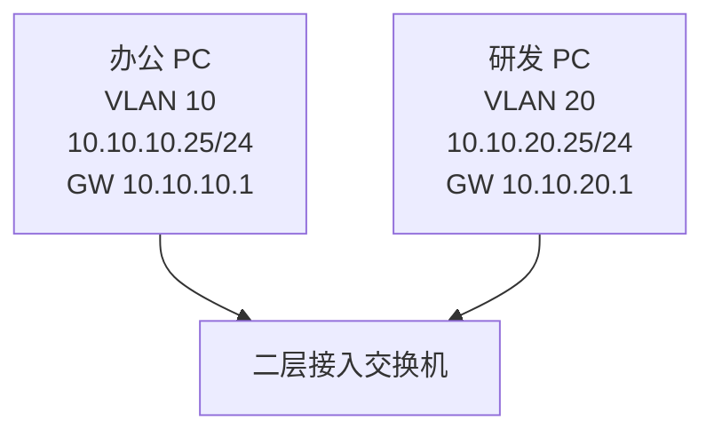

二层交换机可以根据 VLAN 和 MAC 地址转发同 VLAN 内的帧，但它不会把 VLAN 10 的普通二层帧直接转发到 VLAN 20。VLAN 10 和 VLAN 20 是两个不同广播域。

如果办公 PC `10.10.10.25/24` 访问研发 PC `10.10.20.25/24`，办公 PC 会先判断：

```text
10.10.20.25 不在自己的 10.10.10.0/24 网段内。
所以需要把数据交给默认网关 10.10.10.1。
```

问题是：`10.10.10.1` 在哪里？

这个地址不能只写在纸上。网络中必须有一台三层设备真正配置了 `10.10.10.1/24`，并且连接到 VLAN 10。它就是 VLAN 10 中终端的默认网关。同理，VLAN 20 也需要一个网关 `10.10.20.1/24`。

三层交换机常见设计如下：

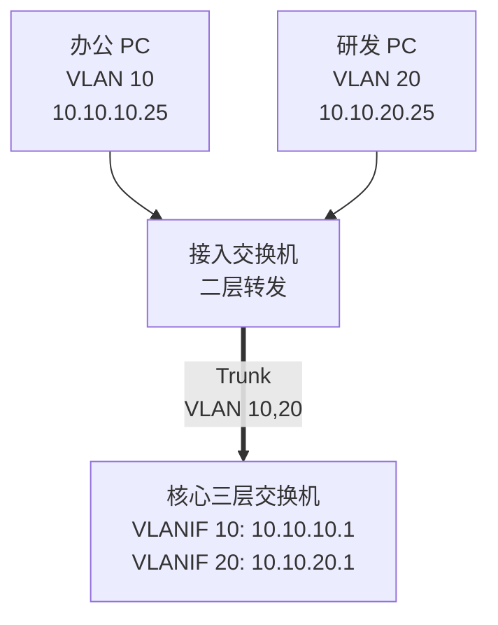

此时核心三层交换机既能像交换机一样处理 VLAN 内的二层转发，又能像路由器一样在不同 IP 网段之间查路由、重新封装二层帧并转发。

三层交换解决的核心问题是：

```text
在交换机上提供高速的三层网关和跨 VLAN 转发能力。
```

## 10.3 二层交换、三层交换和路由器的区别

初学者常问：三层交换机是不是路由器？答案是：它能做很多路由工作，但定位和常见使用场景不同。

| 设备 | 主要工作层次 | 常见位置 | 典型用途 |
| --- | --- | --- | --- |
| 二层交换机 | 二层 | 接入层、简单汇聚 | 接入终端、划分 VLAN、MAC 转发 |
| 三层交换机 | 二层和三层 | 汇聚层、核心层 | VLAN 网关、园区内部高速转发 |
| 路由器 | 三层 | 广域网、分支、运营商边界 | 多线路接入、路由协议、WAN 互联 |
| 防火墙 | 三层到七层 | 出口、服务器区边界 | 路由、安全策略、NAT、审计 |

三层交换机的“交换”二字说明它仍然很擅长在以太网环境中高速转发。它通常把常见转发路径下沉到硬件芯片中处理，因此在园区内部 VLAN 间转发上性能很高。

路由器更擅长处理广域网、多种链路类型、复杂路由协议和运营商互联。防火墙则强调“能不能过”的安全控制。

在企业园区网中，常见分工是：

```text
接入交换机：终端接入、二层 VLAN。
核心三层交换机：内部 VLAN 网关、园区内部路由。
出口防火墙：互联网出口、安全策略、NAT、日志。
路由器或专线设备：广域网、分支和运营商线路。
```

这不是绝对规则。小型网络可能用防火墙直接做所有 VLAN 网关；大型网络可能在汇聚层做三层边界；数据中心可能使用更复杂的交换和路由设计。但本章先掌握最常见的园区核心三层交换模型。

## 10.4 路由器单臂路由与三层交换

早期或小型实验中，经常用“路由器单臂路由”实现 VLAN 间通信。

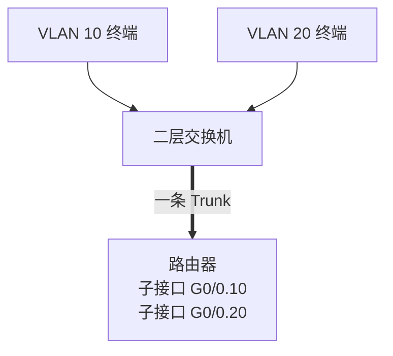

单臂路由的思路是：

- 交换机和路由器之间用一条 Trunk。
- 路由器在同一个物理口上创建多个子接口。
- 每个子接口对应一个 VLAN，并配置该 VLAN 的网关地址。
- 不同 VLAN 的流量都要经过这条 Trunk 到路由器，再由路由器转回来。

例如：

| VLAN | 路由器子接口 | 网关 |
| --- | --- | --- |
| VLAN 10 | `G0/0.10` | `10.10.10.1/24` |
| VLAN 20 | `G0/0.20` | `10.10.20.1/24` |
| VLAN 30 | `G0/0.30` | `10.10.30.1/24` |

单臂路由适合理解原理，也可用于很小的网络。但企业园区中它有明显局限：

| 局限 | 说明 |
| --- | --- |
| 带宽瓶颈 | 所有 VLAN 间流量都经过同一条或少数几条链路 |
| 单点风险 | 路由器接口或链路故障会影响多个 VLAN |
| 扩展性一般 | VLAN 多、流量大时配置和性能压力增加 |
| 延迟和转发能力 | 不如园区核心三层交换机适合大量内部转发 |

三层交换机把 VLAN 网关直接放在交换机内部，常见方式是创建 VLANIF 或 SVI 接口。

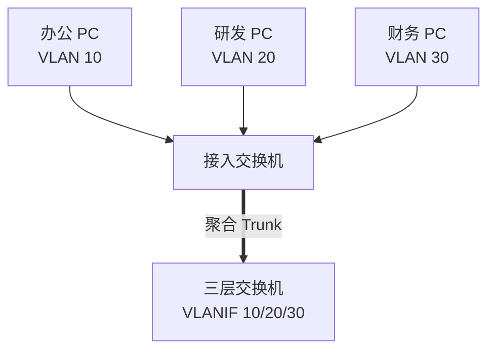

这种设计更适合企业园区内部大量跨 VLAN 访问。

## 10.5 VLANIF、SVI 和三层接口

不同厂商对 VLAN 的三层网关接口有不同叫法：

| 名称 | 常见厂商或语境 | 含义 |
| --- | --- | --- |
| VLANIF | 华为等设备常见 | VLAN Interface，VLAN 的三层接口 |
| SVI | Cisco 常见 | Switched Virtual Interface，交换虚接口 |
| Interface Vlan | 多厂商命令形式 | 某个 VLAN 对应的逻辑三层接口 |

本章统一使用“VLANIF”作为通用说法。看到 SVI 或 `interface vlan 10` 时，也可以理解为同类概念。

### VLANIF 是 VLAN 的网关接口

如果在三层交换机上配置：

```text
VLANIF 10：10.10.10.1/24
```

就表示这台三层交换机在 VLAN 10 中拥有一个三层地址 `10.10.10.1`。VLAN 10 终端可以把它配置为默认网关。

同理：

| VLAN | VLANIF 地址 | 终端默认网关 |
| --- | --- | --- |
| VLAN 10 | `10.10.10.1/24` | `10.10.10.1` |
| VLAN 20 | `10.10.20.1/24` | `10.10.20.1` |
| VLAN 30 | `10.10.30.1/24` | `10.10.30.1` |

从终端视角看，网关是一个 IP 地址。从交换机视角看，这个 IP 地址配置在对应 VLAN 的逻辑三层接口上。

### VLANIF 不是物理端口

VLANIF 是逻辑接口，不是某个具体网口。

例如 VLAN 10 的终端可能分布在多台接入交换机上：

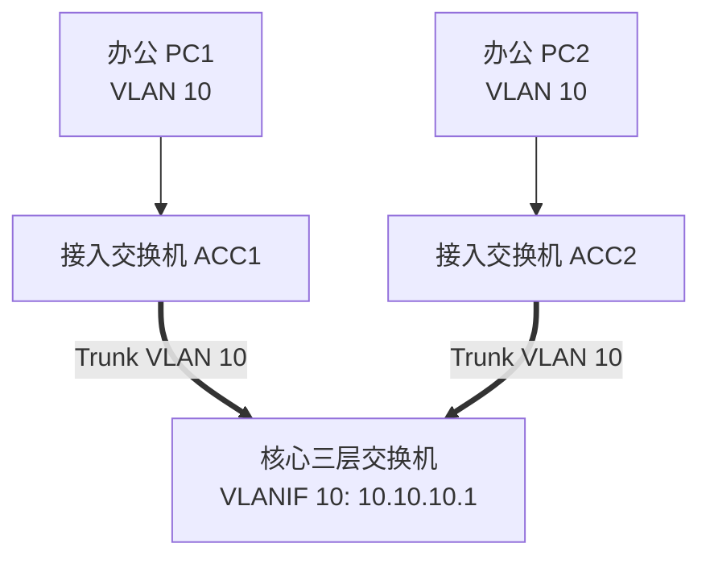

只要 VLAN 10 被正确创建并通过 Trunk 放行，VLANIF 10 就代表整个 VLAN 10 的三层网关，而不是只代表某一个物理口。

### 三层物理接口

除了 VLANIF，三层交换机也可以把某个物理口直接配置为三层接口。例如核心交换机到防火墙之间的点到点互联：

```text
核心接口：10.255.0.2/30
防火墙接口：10.255.0.1/30
```

这类接口不再作为普通二层 Access 或 Trunk 口使用，而是像路由器接口一样直接配置 IP。

常见接口类型对比：

| 接口类型 | 是否属于 VLAN | 是否配置 IP | 常见用途 |
| --- | --- | --- | --- |
| Access 口 | 属于一个 VLAN | 通常不配置 | 连接 PC、打印机、摄像头 |
| Trunk 口 | 承载多个 VLAN | 通常不配置 | 交换机上联、AP、虚拟化主机 |
| VLANIF/SVI | 对应一个 VLAN | 配置 | VLAN 网关 |
| 三层物理口 | 不作为二层交换口 | 配置 | 核心到防火墙、路由器互联 |
| 三层聚合口 | 不作为二层交换口 | 配置 | 高带宽三层互联 |

## 10.6 VLANIF 与直连路由

三层交换机上创建 VLANIF 并配置 IP 后，如果接口状态正常，设备通常会自动生成直连路由。

例如：

| 接口 | IP 地址 |
| --- | --- |
| VLANIF 10 | `10.10.10.1/24` |
| VLANIF 20 | `10.10.20.1/24` |
| VLANIF 30 | `10.10.30.1/24` |

路由表中会出现：

| 目的网段 | 出接口 | 来源 |
| --- | --- | --- |
| `10.10.10.0/24` | VLANIF 10 | 直连 |
| `10.10.20.0/24` | VLANIF 20 | 直连 |
| `10.10.30.0/24` | VLANIF 30 | 直连 |

这意味着三层交换机知道这些网段都在自己本地。办公 VLAN 10 访问研发 VLAN 20 时，核心交换机会在本机内部完成从一个直连网段到另一个直连网段的转发。

初学者要特别注意：

```text
VLANIF 地址是网关。
VLANIF 产生直连路由。
直连路由让三层交换机知道本地有哪些网段。
```

如果 VLANIF 没有 up，直连路由可能不会进入路由表。此时即使配置了 IP 地址，跨 VLAN 通信也会失败。

## 10.7 VLANIF 为什么会 down

很多三层交换排错都卡在 VLANIF 状态上。不同厂商细节不同，但常见规律是：VLANIF 要 up，通常需要对应 VLAN 在设备上存在，并且该 VLAN 有可用的二层承载。

常见导致 VLANIF down 的原因：

| 原因 | 现象 | 排查方向 |
| --- | --- | --- |
| VLAN 未创建 | VLANIF 无法正常工作 | 查看 VLAN 是否存在 |
| 没有任何端口属于该 VLAN | VLANIF 可能 down | 查看 Access 口、Trunk 放行、聚合接口 |
| Trunk 未放行该 VLAN | 上联侧该 VLAN 不通 | 检查两端允许 VLAN 列表 |
| 聚合接口无活动成员 | 上联逻辑口 down | 查看 LACP 和成员端口状态 |
| 物理链路 down | 对应 VLAN 没有活动路径 | 检查端口、光模块、网线 |
| STP 阻塞了唯一路径 | VLAN 到不了网关 | 查看 STP 角色和状态 |
| 接口被 shutdown | 人为关闭 | 查看配置和接口状态 |

例如 VLAN 30 财务网不通，但 VLAN 10 和 VLAN 20 正常，排查时不要只看“核心上有没有 VLANIF 30 的 IP”。还要看：

- VLAN 30 是否创建。
- 接入交换机的财务 PC 端口是否在 VLAN 30。
- 接入到核心的 Trunk 是否放行 VLAN 30。
- 核心上的 VLANIF 30 是否 up。
- VLANIF 30 是否有直连路由。
- 财务 PC 的网关是否配置为 `10.10.30.1`。

三层交换不是只看三层。VLANIF 的状态依赖二层承载，所以排错必须二层和三层一起看。

## 10.8 跨 VLAN 通信的完整过程

下面用一个完整例子说明三层交换机如何处理跨 VLAN 通信。

地址规划：

| 设备 | VLAN | IP 地址 | 默认网关 |
| --- | --- | --- | --- |
| 办公 PC | VLAN 10 | `10.10.10.25/24` | `10.10.10.1` |
| 研发 PC | VLAN 20 | `10.10.20.25/24` | `10.10.20.1` |
| 核心 VLANIF 10 | VLAN 10 | `10.10.10.1/24` | 无 |
| 核心 VLANIF 20 | VLAN 20 | `10.10.20.1/24` | 无 |

办公 PC 访问研发 PC 的过程：

1. 办公 PC 判断目的地址 `10.10.20.25` 不在自己的 `10.10.10.0/24` 网段。
2. 办公 PC 决定把数据交给默认网关 `10.10.10.1`。
3. 办公 PC 发送 ARP 请求，询问 `10.10.10.1` 的 MAC 地址。
4. 核心三层交换机的 VLANIF 10 回复自己的 MAC。
5. 办公 PC 把 IP 包封装成以太网帧，目的 MAC 是核心 VLANIF 10 的 MAC。
6. 接入交换机在 VLAN 10 内把帧转发到核心。
7. 核心收到帧后，解封装二层头部，查看 IP 目的地址 `10.10.20.25`。
8. 核心查路由表，发现 `10.10.20.0/24` 是直连网段，出接口是 VLANIF 20。
9. 核心在 VLAN 20 中 ARP `10.10.20.25` 的 MAC。
10. 核心重新封装二层帧，源 MAC 是 VLANIF 20 的 MAC，目的 MAC 是研发 PC 的 MAC。
11. 帧在 VLAN 20 中被转发到研发 PC。
12. 研发 PC 回包时，反方向以自己的默认网关 `10.10.20.1` 为下一跳。

这个过程有一个重点：

```text
跨 VLAN 通信时，IP 包的源 IP 和目的 IP 通常不变。
每经过三层转发，二层源 MAC 和目的 MAC 会重新封装。
```

示意如下：

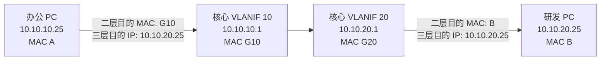

如果你能把这个过程讲清楚，就已经理解了三层交换的核心。

## 10.9 同 VLAN 通信与跨 VLAN 通信对比

同 VLAN 通信和跨 VLAN 通信的排错边界完全不同。

| 对比项 | 同 VLAN 通信 | 跨 VLAN 通信 |
| --- | --- | --- |
| 是否需要默认网关 | 不需要 | 需要 |
| 是否需要三层路由 | 不需要 | 需要 |
| ARP 查询对象 | 目标主机 IP | 默认网关 IP |
| 二层转发范围 | 同一 VLAN 内 | 每段链路重新封装 |
| 主要依赖 | VLAN、MAC 表、端口状态 | VLANIF、路由表、ARP、策略 |
| 常见故障 | VLAN 错、端口错、Trunk 错 | 网关错、VLANIF down、路由或 ACL 错 |

例如 PC1 和 PC2 都在 VLAN 10：

```text
PC1 直接 ARP PC2。
交换机只做二层转发。
网关故障不影响 PC1 与 PC2 的同网段通信。
```

PC1 在 VLAN 10，PC3 在 VLAN 20：

```text
PC1 ARP 网关 10.10.10.1。
核心三层交换机查路由。
核心在 VLAN 20 内转发给 PC3。
```

所以故障现象不同，排查顺序也不同：

- 同 VLAN 不通，先查接入口、VLAN、MAC 表、ARP。
- 同 VLAN 通但跨 VLAN 不通，重点查网关、VLANIF、路由、ACL。
- 跨 VLAN 通但出互联网不通，继续查核心默认路由、防火墙回程路由、策略和 NAT。

## 10.10 企业 VLAN 网关规划

三层交换机最常见的任务之一，是承载企业内部多个 VLAN 的网关。

示例公司地址规划：

| VLAN | 名称 | 用途 | 网段 | 网关 |
| --- | --- | --- | --- | --- |
| 10 | `OFFICE` | 办公网 | `10.10.10.0/24` | `10.10.10.1` |
| 20 | `RD` | 研发网 | `10.10.20.0/24` | `10.10.20.1` |
| 30 | `FINANCE` | 财务网 | `10.10.30.0/24` | `10.10.30.1` |
| 40 | `SERVER` | 服务器区 | `10.10.40.0/24` | `10.10.40.1` |
| 50 | `GUEST_WIFI` | 访客无线 | `10.10.50.0/24` | `10.10.50.1` |
| 60 | `MGMT` | 管理网 | `10.10.60.0/24` | `10.10.60.1` |

设计时建议遵守以下原则：

| 原则 | 说明 |
| --- | --- |
| 一个 VLAN 对应一个主要网段 | 初学和常规企业环境最清晰 |
| 网关地址统一取 `.1` 或 `.254` | 便于记忆和排错，企业内保持一致 |
| VLAN ID 与网段保持可读关系 | VLAN 10 对应 `10.10.10.0/24`，VLAN 20 对应 `10.10.20.0/24` |
| 管理网单独规划 | 交换机、防火墙、AP、服务器管理地址不要混在办公网 |
| 访客网与内网隔离 | 访客无线通常只允许访问互联网 |
| 财务、服务器、管理类 VLAN 策略更严格 | 不要只依赖 VLAN 名称，必须有策略控制 |

这种规划的好处是排错时很直观。看到 `10.10.30.25`，就能初步判断它应该在 VLAN 30 财务网，网关应该是 `10.10.30.1`。

## 10.11 厂商中立配置步骤

不同厂商命令差异很大，本章使用厂商中立步骤来理解配置逻辑。

目标拓扑：

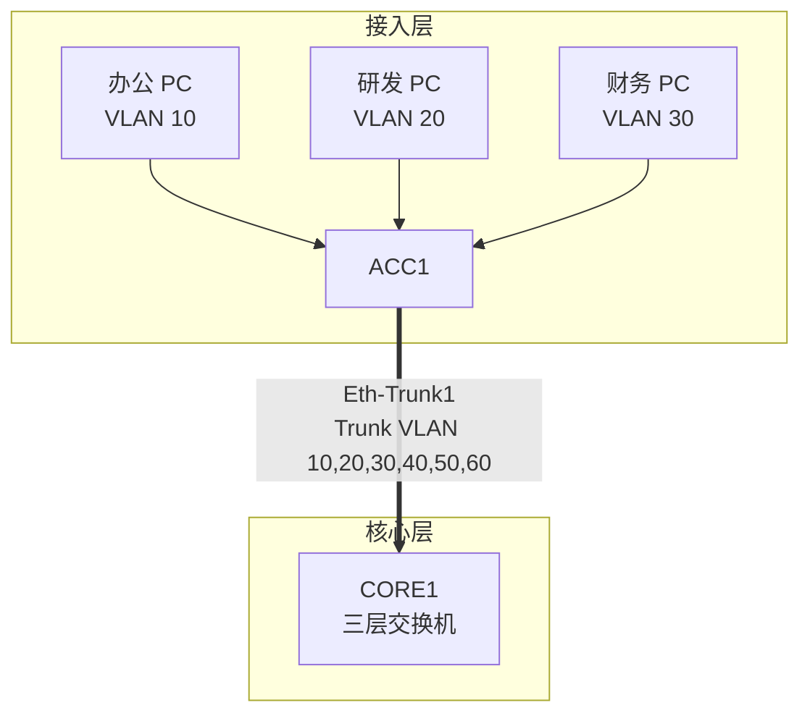

配置逻辑可以分成六步。

### 第一步：创建 VLAN

在核心和相关接入交换机上创建 VLAN。

```text
创建 VLAN 10，名称 OFFICE
创建 VLAN 20，名称 RD
创建 VLAN 30，名称 FINANCE
创建 VLAN 40，名称 SERVER
创建 VLAN 50，名称 GUEST_WIFI
创建 VLAN 60，名称 MGMT
```

注意：

- VLAN 只在一台设备上创建，不代表其他设备自动也有。
- 跨交换机承载的 VLAN，要在路径上的相关交换机创建或允许。
- VLAN 名称不影响转发，但有助于维护。

### 第二步：配置接入口

终端接入口通常配置为 Access。

```text
ACC1 GE1/0/1
  类型：Access
  VLAN：10
  描述：Office-PC-Area-A

ACC1 GE1/0/2
  类型：Access
  VLAN：20
  描述：RD-PC-Area-A

ACC1 GE1/0/3
  类型：Access
  VLAN：30
  描述：Finance-PC-Area-A
```

普通 PC 不需要识别 VLAN Tag。交换机会根据接入口配置，把终端发来的无标签帧归入对应 VLAN。

### 第三步：配置接入到核心的 Trunk 或聚合 Trunk

如果 ACC1 到 CORE1 使用两条链路聚合，先配置链路聚合，再在聚合接口上配置 Trunk。

```text
ACC1 Eth-Trunk1
  类型：Trunk
  允许 VLAN：10,20,30,40,50,60
  描述：ACC1-to-CORE1

CORE1 Eth-Trunk1
  类型：Trunk
  允许 VLAN：10,20,30,40,50,60
  描述：CORE1-to-ACC1
```

常见错误是：

- 只在一端允许了某个 VLAN。
- 成员物理口上配置了和聚合接口冲突的 VLAN。
- 聚合没有协商成功，但误以为 Trunk 正常。
- Trunk 放行范围过大，把不该延伸的 VLAN 扩散到其他区域。

### 第四步：在核心三层交换机创建 VLANIF

在 CORE1 上配置各 VLAN 的网关地址。

```text
CORE1 VLANIF 10
  IP：10.10.10.1/24
  描述：Gateway for OFFICE

CORE1 VLANIF 20
  IP：10.10.20.1/24
  描述：Gateway for RD

CORE1 VLANIF 30
  IP：10.10.30.1/24
  描述：Gateway for FINANCE

CORE1 VLANIF 40
  IP：10.10.40.1/24
  描述：Gateway for SERVER

CORE1 VLANIF 50
  IP：10.10.50.1/24
  描述：Gateway for GUEST_WIFI

CORE1 VLANIF 60
  IP：10.10.60.1/24
  描述：Gateway for MGMT
```

配置后，CORE1 应该生成这些直连路由：

| 目的网段 | 出接口 |
| --- | --- |
| `10.10.10.0/24` | VLANIF 10 |
| `10.10.20.0/24` | VLANIF 20 |
| `10.10.30.0/24` | VLANIF 30 |
| `10.10.40.0/24` | VLANIF 40 |
| `10.10.50.0/24` | VLANIF 50 |
| `10.10.60.0/24` | VLANIF 60 |

### 第五步：开启三层转发能力

很多三层交换机默认支持三层转发，但有些设备或配置模式下需要显式启用 IP routing。

厂商中立描述：

```text
开启三层路由转发功能。
确认路由表中存在各 VLANIF 的直连路由。
```

如果设备只创建了 VLANIF IP，但没有启用三层路由，不同 VLAN 之间可能无法互通。

### 第六步：配置到出口防火墙的默认路由

内部 VLAN 之间的直连路由只能解决本地网段互访。访问互联网、分支、云平台或其他非本地网段时，核心还需要知道下一跳。

常见设计：


核心到防火墙互联：

| 设备 | 接口 | 地址 |
| --- | --- | --- |
| CORE1 | 三层接口或三层聚合接口 | `10.255.0.2/30` |
| FW1 | 内侧接口 | `10.255.0.1/30` |

CORE1 默认路由：

```text
0.0.0.0/0 -> 10.255.0.1
```

含义是：

```text
核心不知道更具体目的时，把流量交给防火墙。
```

但这还不够。防火墙必须有回程路由，知道内部网段在核心后面：

```text
10.10.0.0/16 -> 10.255.0.2
```

这条回程路由会在第 11 章继续展开。本章先记住：跨设备通信必须双向有路。

## 10.12 三层交换与防火墙的分工

三层交换机能在 VLAN 间转发，但它不是防火墙的替代品。很多初学者会产生一个误解：

```text
既然不同 VLAN 之间都经过三层交换机，那是不是三层交换机就负责所有安全？
```

不一定。

三层交换机可以做基础 ACL，例如禁止访客 VLAN 访问内网。但防火墙通常更适合做更复杂的安全策略、应用识别、NAT、日志审计、入侵防护和互联网边界控制。

常见分工：

| 流量类型 | 建议控制位置 | 说明 |
| --- | --- | --- |
| 办公到研发普通访问 | 核心 ACL 或防火墙，视安全要求 | 简单环境可在核心限制 |
| 访客无线到内网 | 核心 ACL 或直接引到防火墙 | 通常应明确禁止 |
| 内网到互联网 | 出口防火墙 | 需要 NAT、策略和日志 |
| 办公网到服务器区 | 防火墙或服务器区边界 | 便于精细策略和审计 |
| 管理网到设备管理地址 | 核心 ACL、防火墙、设备本地 ACL | 只允许管理员来源 |

一个实用原则是：

```text
高性能内部转发放在三层交换机。
需要强安全审计和复杂策略的边界放在防火墙。
```

例如：

- VLAN 10 办公网访问 VLAN 20 研发网，可以在核心上按策略允许或限制。
- VLAN 50 访客无线访问任何 `10.10.0.0/16` 内网地址，应在核心或防火墙上拒绝。
- VLAN 10 办公网访问互联网，应交给防火墙做策略和 NAT。
- 外部访问内部服务器，应经过防火墙，不应直接在核心放开。

## 10.13 三层交换与 DHCP Relay

企业网络通常不会在每个 VLAN 里都放一台 DHCP 服务器。更常见做法是集中部署 DHCP 服务器，然后由各 VLAN 网关做 DHCP Relay。

示例：

| 对象 | 地址 |
| --- | --- |
| DHCP 服务器 | `10.10.40.10`，位于服务器 VLAN 40 |
| VLAN 10 网关 | `10.10.10.1` |
| VLAN 20 网关 | `10.10.20.1` |
| VLAN 30 网关 | `10.10.30.1` |

没有 DHCP Relay 时，VLAN 10 的终端发送 DHCP Discover 广播，这个广播只在 VLAN 10 内传播，不会自动到达 VLAN 40 的 DHCP 服务器。

DHCP Relay 的作用是：

```text
由 VLAN 网关接收客户端 DHCP 广播，
再以单播方式转发给集中 DHCP 服务器。
```

流程如下：

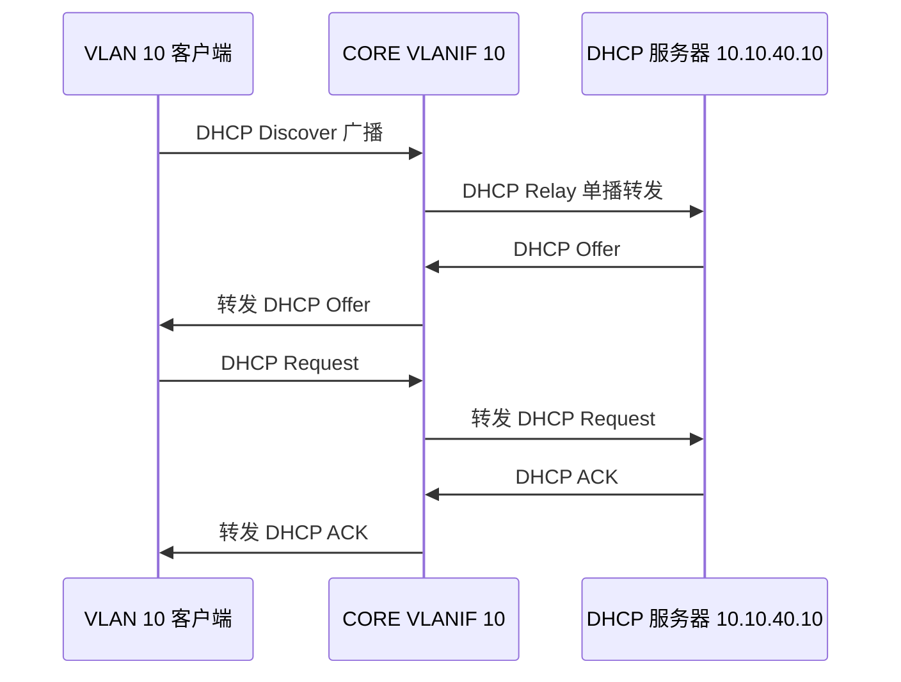

在三层交换机上，通常要在每个需要自动获取地址的 VLANIF 上配置 DHCP Relay 目标服务器。

厂商中立示例：

```text
VLANIF 10
  DHCP Relay 服务器：10.10.40.10

VLANIF 20
  DHCP Relay 服务器：10.10.40.10

VLANIF 30
  DHCP Relay 服务器：10.10.40.10
```

DHCP 服务器上也要配置对应地址池：

| 地址池 | 分配范围 | 网关 | DNS |
| --- | --- | --- | --- |
| VLAN 10 | `10.10.10.100-10.10.10.199` | `10.10.10.1` | `10.10.40.20` |
| VLAN 20 | `10.10.20.100-10.10.20.199` | `10.10.20.1` | `10.10.40.20` |
| VLAN 30 | `10.10.30.100-10.10.30.199` | `10.10.30.1` | `10.10.40.20` |

常见 DHCP 故障：

| 现象 | 可能原因 |
| --- | --- |
| 某 VLAN 获取不到地址 | VLANIF 未配置 Relay、Trunk 未放行、地址池缺失 |
| 获取到错误网段地址 | 接入口 VLAN 错、DHCP 地址池匹配错误 |
| 获取到地址但网关不通 | 网关选项错误、VLANIF down |
| 只有部分终端异常 | 接入口配置或终端本地问题 |

## 10.14 三层交换与 STP、链路聚合的关系

第 8 章和第 9 章讲的是二层网络中的可靠性和链路设计。本章的三层交换不是把它们替换掉，而是与它们配合。

### 与 STP 的关系

如果接入交换机到核心之间是二层 Trunk，STP 仍然需要参与防环。

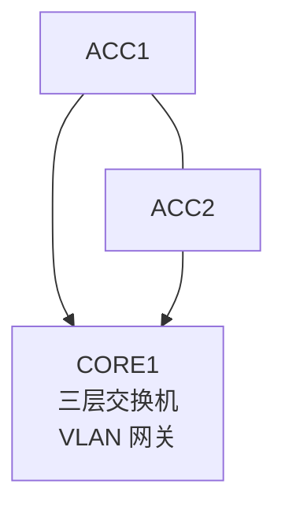

只要 VLAN 在多台交换机之间二层延伸，就可能存在二层环路风险。核心虽然是三层交换机，但它的 Trunk、Access、VLAN 转发部分仍然有二层交换行为。

常见建议：

| 项目 | 建议 |
| --- | --- |
| STP 根桥 | 核心或汇聚设备作为根桥 |
| 备份根桥 | 另一台核心或汇聚作为备份根桥 |
| 接入口 | 启用边缘端口和 BPDU 防护 |
| 上联口 | 明确 Trunk 和 STP 角色 |
| VLAN 范围 | 不要无意义地把所有 VLAN 延伸到所有交换机 |

### 与链路聚合的关系

接入到核心常用链路聚合承载多个 VLAN：

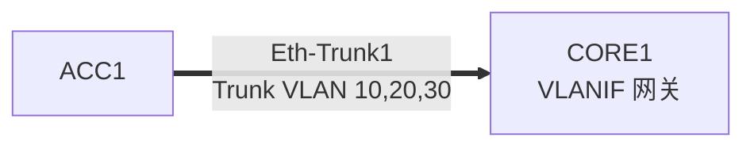

此时：

- 物理成员链路提供带宽和冗余。
- 聚合接口作为逻辑 Trunk 承载 VLAN。
- 核心上的 VLANIF 作为各 VLAN 网关。
- STP 把聚合接口视为逻辑链路参与计算。

如果核心到防火墙使用三层聚合接口，则聚合接口直接配置 IP：

```text
CORE Eth-Trunk10：10.255.0.2/30
FW   Eth-Trunk10：10.255.0.1/30
```

这时它不承载普通 VLAN Trunk，而是作为三层互联链路。不要把“聚合接口”固定理解成 Trunk，它也可以是三层接口。

## 10.15 二层上联与三层上联

园区网络设计中，经常要决定接入、汇聚、核心之间使用二层上联还是三层上联。

### 二层上联

二层上联通常是 Trunk，把多个 VLAN 从接入层延伸到核心或汇聚层。

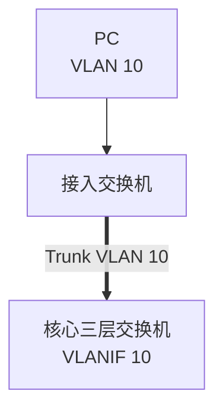

特点：

| 项目 | 说明 |
| --- | --- |
| VLAN 网关位置 | 通常在核心或汇聚 |
| 接入交换机角色 | 主要做二层 |
| 优点 | 配置直观，适合初学和中小规模园区 |
| 风险 | VLAN 延伸范围较大，依赖 STP 防环 |
| 常见场景 | 楼层接入交换机上联核心 |

### 三层上联

三层上联是在接入或汇聚交换机上结束 VLAN，并用路由接口连接上级设备。

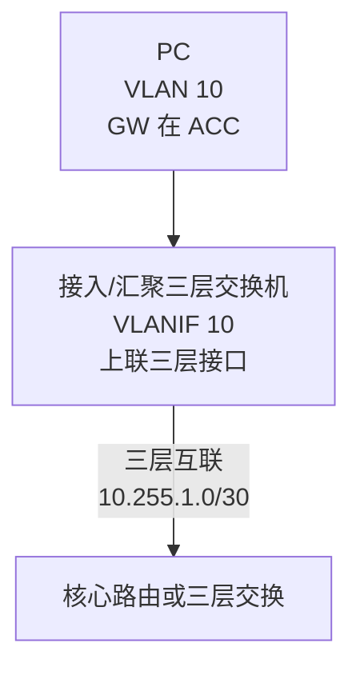

特点：

| 项目 | 说明 |
| --- | --- |
| VLAN 网关位置 | 更靠近接入或汇聚 |
| 上联类型 | 三层接口或三层聚合接口 |
| 优点 | 缩小二层范围，减少 STP 影响 |
| 要求 | 需要更清晰的路由规划 |
| 常见场景 | 大型园区、分区汇聚、数据中心边界 |

对于初学者，先掌握二层接入上联到核心、核心做 VLAN 网关的模型。后续学习路由协议和大型园区设计时，再逐步理解三层到接入、汇聚分区和动态路由。

## 10.16 网关冗余：为什么不能只有一台核心

如果所有 VLAN 网关都在一台核心三层交换机上，这台核心故障会影响大量业务。

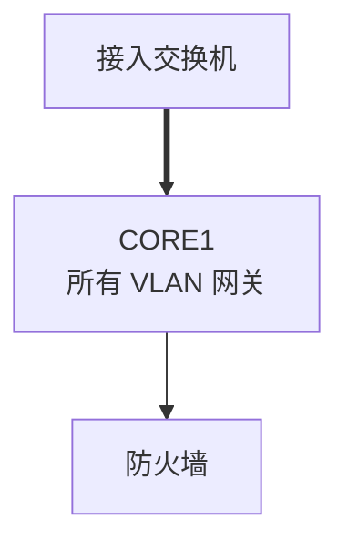

企业网络通常会部署双核心或双汇聚，实现网关冗余。

常见技术名称包括：

| 技术 | 常见厂商或语境 | 简化理解 |
| --- | --- | --- |
| VRRP | 通用标准 | 多台网关设备共享一个虚拟网关 IP |
| HSRP | Cisco 常见 | Cisco 网关冗余协议 |
| 堆叠/虚拟化 | 多厂商 | 多台交换机逻辑上像一台设备 |
| MLAG/M-LAG/vPC | 多厂商 | 两台设备协同提供跨设备链路聚合 |

以 VRRP 为例：

| 项目 | 地址 |
| --- | --- |
| VLAN 10 虚拟网关 | `10.10.10.1` |
| CORE1 VLANIF 10 实地址 | `10.10.10.2` |
| CORE2 VLANIF 10 实地址 | `10.10.10.3` |

终端默认网关仍然配置为 `10.10.10.1`。正常情况下 CORE1 作为主网关响应；CORE1 故障后，CORE2 接管虚拟网关。

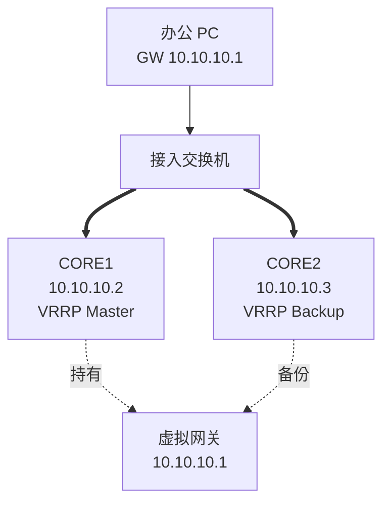

初学阶段不要求掌握所有冗余协议命令，但要知道：

```text
终端默认网关最好是虚拟网关地址。
核心设备应有主备或虚拟化设计。
网关冗余要和 STP 根桥、链路聚合、路由出口一起规划。
```

否则可能出现网关主设备在 CORE1，但 STP 转发路径偏向 CORE2，导致流量绕行，甚至故障切换效果不理想。

## 10.17 三层交换的安全控制

创建 VLANIF 后，不同 VLAN 默认可能可以互通。这在实验里方便，但在企业里不一定符合安全要求。

例如：

| 源 VLAN | 目的 VLAN | 默认需求 |
| --- | --- | --- |
| 办公 VLAN 10 | 服务器 VLAN 40 | 只允许访问指定业务端口 |
| 研发 VLAN 20 | 服务器 VLAN 40 | 允许访问代码、测试、构建服务 |
| 财务 VLAN 30 | 服务器 VLAN 40 | 只允许访问财务系统 |
| 访客 VLAN 50 | 内部任意 VLAN | 禁止 |
| 管理 VLAN 60 | 网络设备管理地址 | 允许管理员访问 |

可以在核心三层交换机上使用 ACL 做基础控制。例如：

```text
拒绝 VLAN 50 访问 10.10.0.0/16
允许 VLAN 50 访问防火墙出口
允许 VLAN 10 访问 DNS 服务器 10.10.40.20
允许 VLAN 10 访问 OA 服务器 10.10.40.30 的 TCP 443
拒绝其他不必要的跨 VLAN 访问
```

但 ACL 设计要谨慎。常见问题包括：

- 只写了拒绝规则，忘记允许 DNS、DHCP、网关探测等基础流量。
- ACL 方向用错，入方向和出方向混淆。
- 源地址和目的地址写反。
- 放行范围过大，导致隔离形同虚设。
- 缺少日志，不知道流量被哪条规则拒绝。

安全控制建议：

| 建议 | 说明 |
| --- | --- |
| 先明确业务矩阵 | 哪个 VLAN 可以访问哪个服务 |
| 优先按最小权限放行 | 不要默认所有 VLAN 互通 |
| 访客网单独严格隔离 | 只允许去互联网所需方向 |
| 管理网只允许管理员使用 | 设备管理面不要暴露给普通办公网 |
| 复杂安全边界交给防火墙 | 尤其是服务器区、出口和外部访问 |

## 10.18 企业场景一：中小企业核心三层交换

这是最常见的学习模型。

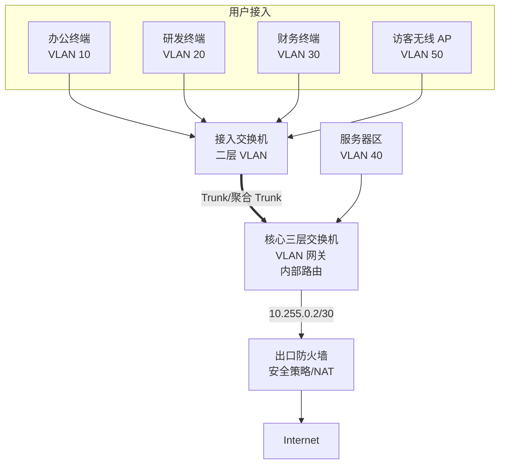

核心交换机职责：

| 职责 | 说明 |
| --- | --- |
| VLAN 网关 | VLAN 10/20/30/40/50/60 的默认网关 |
| 内部路由 | 内部 VLAN 间转发 |
| 默认路由 | 指向出口防火墙 `10.255.0.1` |
| 基础 ACL | 访客网隔离、管理网保护 |
| DHCP Relay | 将各 VLAN DHCP 请求转发到服务器 |

防火墙职责：

| 职责 | 说明 |
| --- | --- |
| 回程路由 | 指回内部 `10.10.0.0/16` |
| 出口策略 | 控制哪些内网访问互联网 |
| NAT | 内网私网地址转换为公网地址 |
| 日志审计 | 记录用户访问和策略命中 |

关键路由：

| 设备 | 路由 | 下一跳 |
| --- | --- | --- |
| CORE | `0.0.0.0/0` | `10.255.0.1` |
| FW | `10.10.0.0/16` | `10.255.0.2` |
| FW | `0.0.0.0/0` | 运营商下一跳 |

如果内网 VLAN 之间能互通，但无法上网，重点检查核心到防火墙默认路由、防火墙回程路由、安全策略和 NAT。

## 10.19 企业场景二：服务器区放在核心后面

很多中小企业会把服务器区作为一个或多个 VLAN 接在核心交换机后面。

示例：

| 服务器 | VLAN | IP 地址 | 用途 |
| --- | --- | --- | --- |
| DNS | VLAN 40 | `10.10.40.20` | 内网解析 |
| OA | VLAN 40 | `10.10.40.30` | 办公系统 |
| Git | VLAN 40 | `10.10.40.40` | 研发代码仓库 |
| DHCP | VLAN 40 | `10.10.40.10` | 地址分配 |

访问策略示例：

| 源 | 目的 | 策略 |
| --- | --- | --- |
| VLAN 10 办公 | DNS `10.10.40.20` | 允许 UDP/TCP 53 |
| VLAN 10 办公 | OA `10.10.40.30` | 允许 TCP 443 |
| VLAN 20 研发 | Git `10.10.40.40` | 允许 TCP 22/443 |
| VLAN 30 财务 | 财务系统 | 允许指定端口 |
| VLAN 50 访客 | VLAN 40 任意服务器 | 拒绝 |

如果服务器和用户网关都在同一台核心三层交换机上，内部访问服务器不一定经过出口防火墙。这样性能高，但安全审计能力可能不足。

更严格的设计会把服务器区放在防火墙后面，用户访问服务器必须经过防火墙策略。两种设计都能工作，关键是根据安全要求选择，并在文档中写清楚流量路径。

## 10.20 企业场景三：访客无线只允许上网

访客无线是三层交换安全控制的典型场景。

规划：

| 项目 | 值 |
| --- | --- |
| 访客 VLAN | VLAN 50 |
| 访客网段 | `10.10.50.0/24` |
| 访客网关 | `10.10.50.1` |
| 内部汇总网段 | `10.10.0.0/16` |
| 出口防火墙互联 | `10.255.0.1/30` |

需求：

```text
访客可以访问互联网。
访客不能访问办公、研发、财务、服务器和管理网。
访客可以获取 DHCP 地址和 DNS。
```

核心上的基础控制可以是：

| 规则 | 动作 |
| --- | --- |
| VLAN 50 到 DHCP 服务器 `10.10.40.10` 的 DHCP Relay 流量 | 允许 |
| VLAN 50 到指定 DNS 服务器 | 按设计允许，或使用公网 DNS |
| VLAN 50 到 `10.10.0.0/16` | 拒绝 |
| VLAN 50 到防火墙出口方向 | 允许 |

注意顺序很重要。很多 ACL 是自上而下匹配，先命中先处理。如果先写了“拒绝 VLAN 50 到 `10.10.0.0/16`”，而 DHCP 服务器和 DNS 服务器也在 `10.10.0.0/16` 内，就要考虑 DHCP Relay 是否受影响、DNS 是否需要例外放行。

更常见的安全做法是让访客 VLAN 直接进入防火墙，由防火墙控制其访问互联网，并明确禁止访问内网。

## 10.21 常用验证命令思路

厂商命令不同，但验证思路相同。排查三层交换时，至少要看以下信息。

### 查看 VLAN

目标：

```text
确认 VLAN 是否存在。
确认端口是否加入正确 VLAN。
确认 Trunk 是否允许该 VLAN。
```

关注点：

| 检查项 | 正常状态 |
| --- | --- |
| VLAN 10/20/30 是否存在 | 已创建 |
| 终端端口 | Access 到正确 VLAN |
| 上联 Trunk | 允许对应 VLAN |
| 聚合接口 | 成员 Selected，逻辑接口 up |

### 查看 VLANIF 或 SVI

目标：

```text
确认 VLAN 网关接口是否 up。
确认 IP 地址和掩码是否正确。
```

关注点：

| 检查项 | 正常状态 |
| --- | --- |
| VLANIF 10 | up/up，`10.10.10.1/24` |
| VLANIF 20 | up/up，`10.10.20.1/24` |
| VLANIF 30 | up/up，`10.10.30.1/24` |
| VLANIF 描述 | 与用途一致 |

### 查看路由表

目标：

```text
确认直连路由和默认路由是否存在。
```

核心路由表应至少包含：

| 目的网段 | 下一跳或出接口 |
| --- | --- |
| `10.10.10.0/24` | VLANIF 10 |
| `10.10.20.0/24` | VLANIF 20 |
| `10.10.30.0/24` | VLANIF 30 |
| `10.10.40.0/24` | VLANIF 40 |
| `0.0.0.0/0` | `10.255.0.1` |

如果某个 VLANIF 的直连路由缺失，先查 VLANIF 状态和二层承载。

### 查看 ARP 表

目标：

```text
确认网关能否解析终端，终端能否解析网关，核心能否解析下一跳。
```

示例：

| ARP 项 | 含义 |
| --- | --- |
| `10.10.10.25` 在 VLANIF 10 下有 MAC | 核心看到办公 PC |
| `10.10.20.25` 在 VLANIF 20 下有 MAC | 核心看到研发 PC |
| `10.255.0.1` 在出口接口下有 MAC | 核心能到达防火墙 |

路由表正确但 ARP 没有下一跳，通常说明本地互联链路、VLAN、掩码或对端接口有问题。

### 查看 ACL 或安全策略

目标：

```text
确认流量不是被本设备策略阻断。
```

关注点：

| 检查项 | 说明 |
| --- | --- |
| ACL 应用接口 | 是入方向还是出方向 |
| 源和目的 | 是否写反 |
| 命中计数 | 是否有流量命中拒绝规则 |
| 隐式拒绝 | 部分设备 ACL 末尾可能默认拒绝 |
| 日志 | 是否能看到拒绝原因 |

### 从终端验证

终端侧检查也很重要：

| 检查项 | 示例 |
| --- | --- |
| IP 地址 | `10.10.10.25/24` |
| 默认网关 | `10.10.10.1` |
| DNS | `10.10.40.20` 或企业指定 DNS |
| ping 网关 | 测试本 VLAN 到网关 |
| ping 其他 VLAN 网关 | 测试核心跨 VLAN |
| ping 服务器 | 测试业务路径 |
| traceroute | 判断流量经过哪些三层设备 |

不要只测试公网地址。排错应该从近到远：

```text
本机地址 -> 本 VLAN 网关 -> 其他 VLAN 网关 -> 目标服务器 -> 出口防火墙 -> 公网地址 -> 域名解析
```

## 10.22 常见故障与排查

### 故障一：同 VLAN 能通，跨 VLAN 不通

现象：

```text
办公 VLAN 10 内 PC 互相 ping 通。
办公 PC ping 10.10.10.1 网关正常。
办公 PC ping 研发 PC 10.10.20.25 不通。
```

排查顺序：

| 步骤 | 检查内容 |
| --- | --- |
| 1 | 研发 PC 是否能 ping 自己网关 `10.10.20.1` |
| 2 | 核心 VLANIF 10 和 VLANIF 20 是否 up |
| 3 | 核心是否有 `10.10.10.0/24` 和 `10.10.20.0/24` 直连路由 |
| 4 | 核心是否启用三层转发 |
| 5 | 办公 PC 和研发 PC 默认网关是否正确 |
| 6 | 核心 ACL 是否拒绝 VLAN 10 到 VLAN 20 |
| 7 | 研发 PC 本机防火墙是否拒绝 ICMP |

注意最后一点：有时网络路径正常，但 Windows 或服务器本机防火墙禁止 ping。此时要用业务端口或抓包进一步验证。

### 故障二：某个 VLAN 无法访问网关

现象：

```text
财务 PC 10.10.30.25 无法 ping 10.10.30.1。
其他 VLAN 正常。
```

排查顺序：

| 步骤 | 检查内容 |
| --- | --- |
| 1 | 财务 PC IP、掩码、网关是否属于 VLAN 30 |
| 2 | 接入口是否配置为 Access VLAN 30 |
| 3 | ACC 到 CORE 的 Trunk 是否允许 VLAN 30 |
| 4 | CORE 上 VLAN 30 是否存在 |
| 5 | CORE VLANIF 30 是否 up |
| 6 | STP 是否阻塞了财务 VLAN 的唯一上联 |
| 7 | MAC 地址表是否能看到财务 PC 的 MAC |

如果终端连网关都 ping 不通，先不要查默认路由和防火墙。故障边界还在本 VLAN 到网关之间。

### 故障三：内部 VLAN 互通，但无法上网

现象：

```text
办公 PC 可以 ping 10.10.20.1。
办公 PC 可以访问内网服务器。
办公 PC ping 公网 IP 不通。
```

排查顺序：

| 步骤 | 检查内容 |
| --- | --- |
| 1 | CORE 是否有默认路由 `0.0.0.0/0 -> 10.255.0.1` |
| 2 | CORE 是否能 ping 防火墙内侧 `10.255.0.1` |
| 3 | 防火墙是否有回程路由 `10.10.0.0/16 -> 10.255.0.2` |
| 4 | 防火墙安全策略是否允许内网访问公网 |
| 5 | NAT 是否正确转换内网源地址 |
| 6 | 防火墙是否有到运营商的默认路由 |
| 7 | DNS 是否正常，如果公网 IP 通但域名不通 |

这个故障非常常见。核心有默认路由不代表上网一定成功，防火墙还要有回程、策略、NAT 和出口路由。

### 故障四：DHCP 获取不到地址

现象：

```text
VLAN 20 研发 PC 无法自动获取 IP。
手工配置 IP 后可以 ping 网关。
```

排查顺序：

| 步骤 | 检查内容 |
| --- | --- |
| 1 | VLANIF 20 是否配置 DHCP Relay |
| 2 | Relay 目标是否为正确 DHCP 服务器 `10.10.40.10` |
| 3 | 核心是否能访问 DHCP 服务器 |
| 4 | DHCP 服务器是否有 VLAN 20 地址池 |
| 5 | 地址池网关选项是否为 `10.10.20.1` |
| 6 | 地址池是否耗尽 |
| 7 | ACL 是否阻断 DHCP Relay 流量 |

如果手工配置 IP 后能通信，说明二层和网关大概率正常，重点转向 DHCP Relay 和服务器地址池。

### 故障五：新增 VLAN 后只有本地能通，其他网络访问不到

现象：

```text
新增 VLAN 70，网段 10.10.70.0/24。
终端能 ping 网关 10.10.70.1。
终端能访问部分内网。
但防火墙、分支或云端访问不到 VLAN 70。
```

排查思路：

| 位置 | 检查内容 |
| --- | --- |
| 核心 | 是否创建 VLANIF 70，是否有直连路由 |
| 接入 | VLAN 70 是否放行到核心 |
| 防火墙 | 是否有 `10.10.70.0/24` 或 `10.10.0.0/16` 回程 |
| 安全策略 | 是否新增源/目的对象和放行策略 |
| 分支或云端 | 是否知道 `10.10.70.0/24` 在总部方向 |
| DHCP/DNS | 是否有地址池和解析记录 |

新增 VLAN 不只是创建 VLAN 和网关。只要这个 VLAN 需要访问其他网络，相关路由、策略、地址池和文档都要同步更新。

## 10.23 三层交换排错流程

三层交换排错建议按“从近到远、从二层到三层、从去程到回程”的顺序。

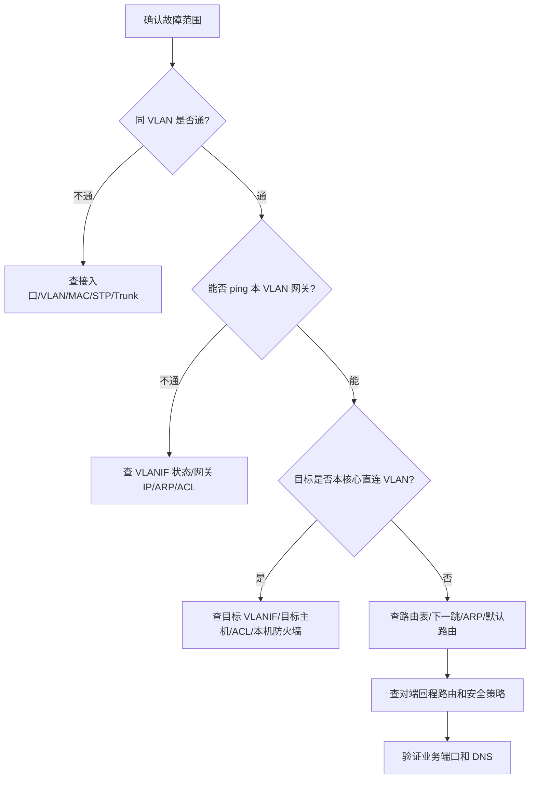

更具体的检查清单：

| 层次 | 检查项 | 目的 |
| --- | --- | --- |
| 物理层 | 链路、光模块、端口 up/down | 确认基础连接 |
| 二层 | VLAN、Access、Trunk、STP、聚合 | 确认帧能到网关 |
| 三层接口 | VLANIF IP、状态、直连路由 | 确认网关可用 |
| ARP | 终端、网关、下一跳 MAC | 确认二层邻接 |
| 路由 | 直连、静态、默认、回程 | 确认路径双向 |
| 策略 | ACL、防火墙策略、本机防火墙 | 确认未被阻断 |
| 服务 | DHCP、DNS、应用端口 | 确认业务本身正常 |

工程中不要跳步。比如用户说“上不了网”，先确认他是否拿到了正确 IP，是否能 ping 网关，是否能 ping 防火墙内侧，再看 DNS 和公网。直接登录防火墙看策略，可能会浪费很多时间。

## 10.24 自检练习

1. 为什么 VLAN 10 和 VLAN 20 不能只靠二层交换机直接互通？
2. VLANIF 10 配置为 `10.10.10.1/24` 后，终端默认网关应该写什么？
3. 办公 PC `10.10.10.25/24` 访问服务器 `10.10.40.30/24` 时，第一次 ARP 查询的是服务器还是网关？
4. 核心交换机有 VLANIF 10、20、30，为什么路由表中会出现对应的直连路由？
5. VLANIF 已配置 IP 但状态 down，可能有哪些原因？
6. 核心交换机默认路由指向防火墙后，为什么防火墙还需要回程路由？
7. 访客 VLAN 只允许上网时，应该重点限制哪些访问方向？
8. DHCP 服务器在 VLAN 40，VLAN 10 客户端为什么需要 DHCP Relay？
9. 两台核心做网关冗余时，终端默认网关应该使用物理核心地址还是虚拟网关地址？
10. 如果同 VLAN 能通、跨 VLAN 不通，你会按什么顺序排查？

## 10.25 本章小结

三层交换是 VLAN 技术之后必须掌握的关键内容。VLAN 负责把二层广播域隔离开，三层交换负责在这些 VLAN 对应的 IP 网段之间转发流量。

本章的重点可以总结为：

- VLANIF 或 SVI 是 VLAN 的三层网关接口。
- 一个 VLAN 通常对应一个 IP 子网和一个网关地址。
- 同 VLAN 通信主要依赖二层交换，跨 VLAN 通信必须经过三层网关。
- 三层交换机创建 VLANIF 后，会为对应网段生成直连路由。
- 核心三层交换机访问非本地网段时，通常通过默认路由交给防火墙或上级路由设备。
- 防火墙和其他对端设备必须有回程路由，否则通信仍然失败。
- DHCP Relay、ACL、STP、链路聚合和网关冗余都经常与三层交换一起出现。
- 排错时要从终端到网关、从 VLAN 到 VLANIF、从路由到回程、从策略到业务逐步缩小范围。

第 11 章会继续深入路由基础，重点解释路由表、下一跳、默认路由、最长前缀匹配、静态路由和回程路由。理解本章的 VLANIF 和核心默认路由，会让后续路由章节更容易掌握。
