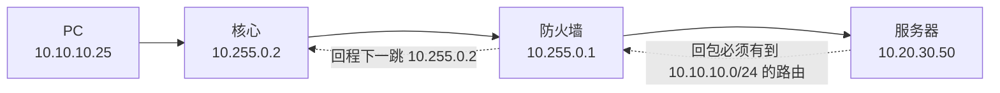
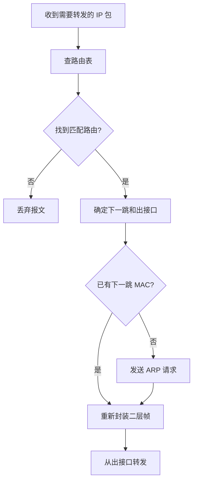
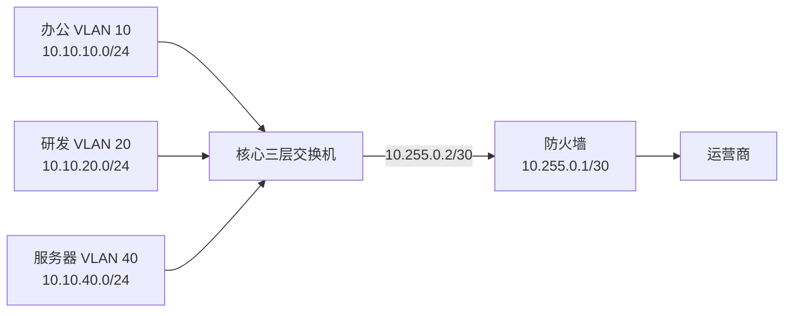
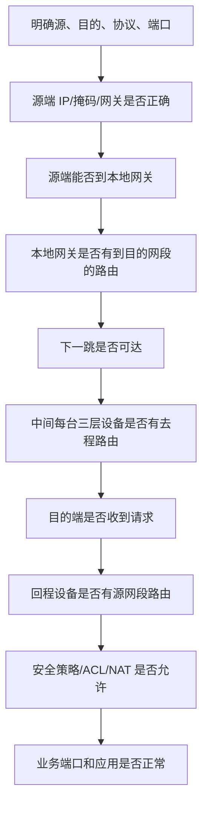

# 第 11 章：路由基础

## 11.1 学习目标

学完本章后，你应该能够：

- 解释路由、路由表、下一跳、出接口、默认路由的含义。
- 理解路由器、三层交换机、防火墙在三层转发中的共同点和差异。
- 看懂一条路由条目由哪些字段组成。
- 理解最长前缀匹配的选择规则。
- 区分直连路由、静态路由、默认路由和动态路由。
- 理解回程路由为什么是跨网段通信中最常见的故障点之一。
- 能够设计一个简单的总部、分支、出口路由方案。
- 能够按照路径、路由、ARP、策略、回程的顺序排查基础路由故障。

第 10 章讲三层交换时已经接触了默认路由和回程路由。本章把这些内容展开，重点不放在某个厂商命令，而是让你真正理解“设备为什么会把包发向某个方向”。

## 11.2 为什么需要路由

同一个 VLAN、同一个 IP 网段内的终端通信，主要依赖二层交换和 ARP。例如 `10.10.10.25/24` 访问 `10.10.10.30/24`，两台设备在同一网段，源主机可以直接 ARP 目标主机的 MAC 地址，然后通过交换机二层转发。

但企业网络不可能只有一个网段。不同部门、服务器区、无线区、访客区、分支机构、数据中心、云平台、互联网出口都会使用不同网段。只要源地址和目的地址不在同一网段，就需要三层设备根据路由表选择路径。

路由解决的问题是：

```text
去某个目的网段，下一跳是谁，应该从哪个接口转发出去。
```

例如总部办公网段 `10.10.10.0/24` 要访问分支服务器网段 `10.30.40.0/24`，核心交换机需要知道：

- `10.30.40.0/24` 不是本地直连网段。
- 去这个网段应该交给广域网路由器或防火墙。
- 下一跳设备的地址是什么。
- 回包从分支回来时，也要有反向路径。

如果没有路由，设备只能处理自己直连的网段。企业网络就会停留在“每个网段各自孤立”的状态。

## 11.3 路由相关设备

很多设备都能参与路由。初学时不要把“路由”只理解成“路由器上的功能”。

| 设备 | 是否能路由 | 常见位置 | 主要特点 |
| --- | --- | --- | --- |
| 路由器 | 能 | 广域网、运营商线路、分支出口 | 路径选择能力强，适合连接不同网络 |
| 三层交换机 | 能 | 园区核心、汇聚层 | 内部 VLAN 间转发性能高 |
| 防火墙 | 能 | 互联网出口、服务器区边界、分支边界 | 同时做路由、安全策略、NAT、日志 |
| 负载均衡设备 | 部分场景能 | 数据中心业务入口 | 可能参与业务网段转发 |
| 云网关 | 能 | 公有云 VPC、专线、VPN | 连接云内网段和企业网络 |

这些设备的共同点是都能看三层 IP 地址并查路由表。不同点在于侧重点：

- 三层交换机强调高速转发。
- 路由器强调多线路、多协议和广域网能力。
- 防火墙强调安全控制、NAT 和日志审计。

在真实网络中，一条流量可能连续经过多种三层设备：


排错时要知道每一跳由谁负责。不能只在终端上 ping 一下就判断“网络有问题”，也不能只看一台设备的路由表就认为整条路径没有问题。

## 11.4 路由表是什么

路由表是三层设备用于转发数据包的路径表。设备收到一个需要三层转发的 IP 包后，会查看目的 IP 地址，然后在路由表中寻找最合适的路由条目。

一条路由通常包含以下信息：

| 字段 | 含义 | 示例 |
| --- | --- | --- |
| 目的网段 | 这条路由匹配的目标范围 | `10.30.40.0/24` |
| 掩码或前缀长度 | 目的网段大小 | `/24` |
| 下一跳 | 包交给哪台相邻三层设备 | `10.255.0.1` |
| 出接口 | 包从本设备哪个接口发出 | `Vlanif 999`、`GigabitEthernet0/0/1` |
| 路由来源 | 这条路由如何产生 | 直连、静态、OSPF、BGP |
| 优先级或管理距离 | 不同来源路由的可信度 | 静态通常优先于动态默认值 |
| 度量值 | 同一协议内部比较路径优劣 | OSPF cost、跳数等 |

示例路由表可以这样理解：

| 目的网段 | 下一跳 | 出接口 | 来源 | 含义 |
| --- | --- | --- | --- | --- |
| `10.10.10.0/24` | 直连 | `Vlanif 10` | Connected | 本设备就是 VLAN 10 网关 |
| `10.10.20.0/24` | 直连 | `Vlanif 20` | Connected | 本设备就是 VLAN 20 网关 |
| `10.30.40.0/24` | `10.255.0.1` | `Vlanif 999` | Static | 分支服务器网段走防火墙 |
| `0.0.0.0/0` | `10.255.0.1` | `Vlanif 999` | Static | 其他未知目的都走防火墙 |

注意，路由表通常不记录“某台电脑在哪个交换机端口”。那是二层 MAC 地址表关心的内容。路由表关心的是 IP 网段和下一跳。

## 11.5 路由转发的基本过程

假设办公 PC `10.10.10.25/24` 访问服务器 `10.20.30.50/24`。办公网关在核心交换机 VLANIF 10，服务器网关在服务器区防火墙。

示例地址如下：

| 对象 | 地址 |
| --- | --- |
| PC | `10.10.10.25/24` |
| PC 网关 | `10.10.10.1` |
| 核心到防火墙互联 | 核心 `10.255.0.2/30`，防火墙 `10.255.0.1/30` |
| 服务器 | `10.20.30.50/24` |
| 服务器网关 | `10.20.30.1` |

转发过程如下：

1. PC 判断 `10.20.30.50` 不在自己的 `10.10.10.0/24` 网段。
2. PC 把数据交给默认网关 `10.10.10.1`。
3. PC 通过 ARP 获取网关 MAC。
4. 核心交换机收到帧后，解封装二层帧，查看 IP 包目的地址 `10.20.30.50`。
5. 核心查路由表，发现去 `10.20.30.0/24` 的下一跳是防火墙 `10.255.0.1`。
6. 核心在互联网段中 ARP 防火墙 MAC。
7. 核心重新封装二层帧，把 IP 包发给防火墙。
8. 防火墙查路由和安全策略，允许后转发到服务器区。
9. 服务器回包给自己的网关 `10.20.30.1`。
10. 防火墙必须有到 `10.10.10.0/24` 的回程路由，才能把回包送回核心。

这个过程里，IP 包的源 IP 和目的 IP 通常保持不变：

```text
源 IP：10.10.10.25
目的 IP：10.20.30.50
```

但每经过一个三层转发点，二层 MAC 地址会重新封装：

```text
PC -> 核心：目的 MAC 是核心 VLANIF 10 的 MAC
核心 -> 防火墙：目的 MAC 是防火墙互联接口 MAC
防火墙 -> 服务器：目的 MAC 是服务器 MAC
```

这就是前面章节反复强调的重点：跨网段通信时，目的 IP 是最终目标，目的 MAC 是下一跳。

## 11.6 下一跳和出接口

路由中的“下一跳”是下一个三层设备的 IP 地址。它必须是本设备能够直接到达的地址，通常与本设备某个三层接口处于同一网段。

例如核心交换机有接口：

```text
Vlanif 999：10.255.0.2/30
防火墙内侧：10.255.0.1/30
```

核心上可以配置：

```text
目的：0.0.0.0/0
下一跳：10.255.0.1
```

这个下一跳是合理的，因为 `10.255.0.1` 与核心的 `10.255.0.2/30` 在同一个点到点网段中。

如果把下一跳写成远端服务器地址 `10.20.30.50`，通常就是错误的。核心无法直接 ARP 到这个远端地址，也不知道应该先把包交给谁。

### 下一跳必须可达

下一跳可达至少意味着：

- 本设备到下一跳所在网段有直连接口。
- 互联接口处于 up 状态。
- 掩码配置一致。
- 中间二层链路正常。
- 没有 ACL 或安全策略阻断本地互联通信。

### 出接口不是最终目的

有些设备路由表会显示出接口，有些静态路由也可以指定出接口。出接口表示包从哪个接口离开本设备，但真正发送前通常仍然需要知道下一跳或最终目标的二层 MAC。

在以太网多访问网络中，只写出接口容易产生 ARP 和转发问题。工程中更常见、更清晰的方式是写下一跳地址。

## 11.7 直连路由

设备接口配置 IP 并处于 up 状态后，通常会自动生成直连路由。

例如核心三层交换机配置：

```text
Vlanif 10：10.10.10.1/24
Vlanif 20：10.10.20.1/24
Vlanif 999：10.255.0.2/30
```

路由表会出现：

| 目的网段 | 来源 | 含义 |
| --- | --- | --- |
| `10.10.10.0/24` | 直连 | VLAN 10 本地网段 |
| `10.10.20.0/24` | 直连 | VLAN 20 本地网段 |
| `10.255.0.0/30` | 直连 | 核心到防火墙互联 |

直连路由是最基础的路由来源。没有直连路由，设备就无法知道自己直接连接了哪些网段。

常见问题是接口虽然配置了 IP，但没有生成直连路由。例如：

- 物理接口 down。
- VLANIF 对应 VLAN 没有活动端口。
- 聚合接口没有成员链路 up。
- 接口被 shutdown。
- IP 地址或掩码配置在了错误接口。

第 10 章讲过 VLANIF up/down，本质上也影响直连路由是否进入路由表。

## 11.8 静态路由

静态路由是管理员手工写入的路由。它适合拓扑简单、路径稳定、网段数量不多的场景。

常见用途：

- 核心交换机指向出口防火墙的默认路由。
- 防火墙指回内部网段的回程路由。
- 总部到单个分支的固定路径。
- 小型网络不部署动态路由协议时的路径控制。

示例：

```text
目的网段：10.30.40.0/24
下一跳：10.255.0.1
```

含义是：访问分支服务器网段 `10.30.40.0/24` 时，把流量交给 `10.255.0.1`。

静态路由的优点：

- 简单直观。
- 不需要运行动态协议。
- 路径可控。
- 适合少量固定网段。

静态路由的局限：

- 网段多时维护量大。
- 拓扑变化后需要人工修改。
- 主链路故障后不一定自动绕行。
- 容易遗漏回程路由。

静态路由不是低级技术。很多企业出口、防火墙边界、专线互联仍然大量使用静态路由。关键是要知道它适合什么规模和边界。

## 11.9 默认路由

默认路由是目的为 `0.0.0.0/0` 的路由。它的意思是：如果没有更精确的路由匹配，就走这条路。

默认路由常见于：

- 终端的默认网关。
- 接入交换机的管理默认网关。
- 核心交换机指向出口防火墙。
- 分支路由器指向总部或互联网出口。
- 防火墙指向运营商。

示例：

```text
0.0.0.0/0 -> 10.255.0.1
```

可以理解为：

```text
我不知道更具体目的时，把包交给 10.255.0.1。
```

默认路由不是万能路由。它只解决“本设备把未知目的发到哪里”。它不保证：

- 下一跳知道后续路径。
- 对端有回程路由。
- 防火墙策略允许。
- NAT 已正确配置。
- DNS 解析正确。

所以“有默认路由但仍然不通”非常常见。

## 11.10 最长前缀匹配

当路由表中多条路由都能匹配同一个目的 IP 时，设备优先选择掩码最长、范围最精确的那条。这叫最长前缀匹配。

示例路由表：

| 路由 | 下一跳 |
| --- | --- |
| `10.0.0.0/8` | `10.255.0.1` |
| `10.10.0.0/16` | `10.255.0.5` |
| `10.10.40.0/24` | `10.255.0.9` |
| `0.0.0.0/0` | `10.255.0.254` |

访问不同目的时的匹配结果：

| 目的 IP | 匹配路由 | 原因 |
| --- | --- | --- |
| `10.10.40.20` | `10.10.40.0/24` | `/24` 最精确 |
| `10.10.20.30` | `10.10.0.0/16` | 没有 `/24`，匹配 `/16` |
| `10.20.30.40` | `10.0.0.0/8` | 属于 `10.0.0.0/8` |
| `8.8.8.8` | `0.0.0.0/0` | 没有其他匹配，走默认 |

最长前缀匹配解释了很多现象：

- 明明配置了默认路由，某些地址仍走专线路由。
- 汇总路由存在，但某个子网走了更具体的静态路由。
- 黑洞路由可以只丢弃某个特定网段。
- VPN 路由比默认路由更精确，所以访问远端私网会进隧道。

排错时不要只问“有没有路由”，还要问“最终匹配的是哪一条路由”。

## 11.11 路由优先级和度量值

最长前缀匹配优先比较“目的范围精确程度”。如果前缀长度相同，设备还需要比较路由来源优先级和度量值。

不同厂商叫法可能不同：

| 常见名称 | 含义 |
| --- | --- |
| Preference | 路由优先级，常见于华为、H3C |
| Administrative Distance | 管理距离，常见于 Cisco |
| Metric | 度量值，同一路由协议内部的路径成本 |
| Cost | 成本，OSPF 等协议常见 |

一个简单理解：

```text
先比谁更精确。
同样精确时，比路由来源谁更可信。
同一来源时，比协议内部成本谁更低。
```

例如，同一个目的网段 `10.30.40.0/24` 同时来自静态路由和 OSPF。多数设备默认会优先选择静态路由，因为静态路由的优先级更高。动态路由协议章节会继续解释这些差异。

对于初学者，先记住两点：

- 看到多条候选路由时，要确认最终装入路由表的是哪条。
- 不同厂商默认优先级不同，实际配置前要查设备文档或当前运行配置。

## 11.12 回程路由

很多跨网段故障不是去程不通，而是回程不通。

通信必须是双向的。客户端请求能到服务器，服务器回包也必须能回到客户端。只配置去程路由，不配置回程路由，业务仍然失败。

示例：

```text
办公网段：10.10.10.0/24
服务器网段：10.20.30.0/24
核心到防火墙：10.255.0.2/30
防火墙到核心：10.255.0.1/30
```

核心有路由：

```text
10.20.30.0/24 -> 10.255.0.1
```

这只说明核心知道去服务器区怎么走。防火墙或服务器网关还必须知道：

```text
10.10.10.0/24 -> 10.255.0.2
```

否则回包找不到办公网段。



回程路由常见遗漏位置：

| 场景 | 容易漏配的位置 |
| --- | --- |
| 核心访问服务器区 | 防火墙缺内部办公网段回程 |
| 分支访问总部 | 总部路由器或防火墙缺分支网段 |
| 总部访问云 VPC | 云路由表缺企业网段 |
| VPN 互访 | 对端 VPN 网关缺本端内网路由 |
| 新增 VLAN | 出口防火墙缺新增 VLAN 回程或策略对象 |

排错时，如果你在目的端能看到请求进入，但源端收不到回应，就要重点检查回程。

## 11.13 汇总路由

汇总路由是用一条较大的路由表示多个连续子网。它可以减少路由条目，简化防火墙和路由器配置。

例如总部地址规划为：

| VLAN | 用途 | 网段 |
| --- | --- | --- |
| VLAN 10 | 办公 | `10.10.10.0/24` |
| VLAN 20 | 研发 | `10.10.20.0/24` |
| VLAN 30 | 无线 | `10.10.30.0/24` |
| VLAN 40 | 服务器 | `10.10.40.0/24` |

如果企业约定总部全部使用 `10.10.0.0/16`，其他设备可以用一条路由指向总部：

```text
10.10.0.0/16 -> 总部核心
```

汇总的好处：

- 路由表更短。
- 防火墙回程路由更少。
- 新增 VLAN 时不一定每台设备都要加路由。
- 网络结构更清晰。

但汇总必须建立在地址规划连续的基础上。如果地址随意分配，就很难汇总。

### 汇总可能带来的风险

汇总路由范围更大，可能覆盖一些并不存在或不应该走该方向的网段。例如 `10.10.0.0/16` 会覆盖 `10.10.200.0/24`。如果这个网段未来分配给别的区域，可能产生错误转发。

所以使用汇总路由时要同时维护地址规划文档，明确：

- 哪个大段属于哪个地点或区域。
- 哪些子网已经使用。
- 哪些子网保留。
- 哪些子网禁止使用。

## 11.14 浮动静态路由

浮动静态路由是优先级较低的备用静态路由。主路由存在时不用它，主路由失效时它才进入转发表。

示例场景：

```text
总部到分支有两条线路：
主线路：MPLS 专线
备线路：IPsec VPN
```

可以设计：

| 路由 | 下一跳 | 优先级 | 作用 |
| --- | --- | --- | --- |
| `10.30.0.0/16` | 专线下一跳 | 较高 | 正常使用 |
| `10.30.0.0/16` | VPN 下一跳 | 较低 | 专线故障后备用 |

注意，浮动静态路由能否切换，取决于设备是否能判断主路径失效。仅仅接口 up 不代表远端可达。有些场景需要配合链路检测、NQA、Track、BFD 或动态路由协议。

初学阶段先理解它的思想：

```text
同一个目的，准备一条主路由和一条备用路由，通过优先级控制平时走哪条。
```

## 11.15 黑洞路由

黑洞路由是把匹配流量丢弃的路由。不同厂商可能使用 `Null0`、`discard` 或类似写法。

它常见于：

- 汇总路由防环。
- 丢弃不应该转发的地址段。
- 安全防护中临时阻断某些目的。
- 防止没有更具体路由时流量错误转发。

例如总部对外发布 `10.10.0.0/16`，但本地只存在部分 `/24` 子网。设备上可以有：

```text
10.10.0.0/16 -> Null0
10.10.10.0/24 -> Vlanif 10
10.10.20.0/24 -> Vlanif 20
```

访问真实存在的 `10.10.10.0/24` 会匹配更具体的直连路由。访问不存在的 `10.10.200.0/24` 会匹配汇总黑洞路由并被丢弃，避免流量继续乱转。

黑洞路由不是日常初级配置重点，但理解它有助于后续学习 OSPF 汇总、BGP 宣告和安全防护。

## 11.16 路由与 ARP 的关系

路由决定下一跳，ARP 解析下一跳的 MAC。

以太网中，设备选择下一跳 IP 后，还要把 IP 包封装成以太网帧发出去。封装时需要目的 MAC。如果下一跳 IP 在同一二层网段中，设备会通过 ARP 获取下一跳 MAC。

基础流程：



所以三层故障排查时，经常同时看两张表：

| 表 | 作用 |
| --- | --- |
| 路由表 | 判断去目的网段应该走哪里 |
| ARP 表 | 判断下一跳或直连目标 IP 是否解析到 MAC |

如果路由表正确，但 ARP 解析不到下一跳，可能是互联链路、VLAN、掩码、对端接口或安全策略问题。

## 11.17 路由与安全策略的关系

路由和安全策略是两个不同问题：

```text
路由：流量往哪里走。
策略：流量能不能过。
```

防火墙、三层交换机 ACL、路由器 ACL 都可能在路由路径上阻断流量。

例如：

| 状态 | 结果 |
| --- | --- |
| 有路由，有允许策略 | 可能正常通信 |
| 有路由，无允许策略 | 被策略拒绝 |
| 无路由，有允许策略 | 无法转发 |
| 去程允许，回程不允许 | 业务仍然失败 |

排错时要避免两个误区：

- 看到路由正确，就认为业务一定通。
- 看到策略允许，就认为路径一定存在。

在防火墙上尤其要同时检查：

- 路由表是否有去程和回程。
- 安全区域是否正确。
- 安全策略是否匹配源、目的、服务、用户或应用。
- NAT 是否改变了源地址或目的地址。
- 日志中是路由失败、策略拒绝，还是会话建立后无回包。

NAT 和防火墙会在后续章节详细讲。本章先建立“路由不等于放行”的意识。

## 11.18 企业场景一：核心交换机到出口防火墙

这是最常见的企业园区路由模型。



地址规划：

| 区域 | 网段或地址 |
| --- | --- |
| VLAN 10 办公 | `10.10.10.0/24`，网关 `10.10.10.1` |
| VLAN 20 研发 | `10.10.20.0/24`，网关 `10.10.20.1` |
| VLAN 40 服务器 | `10.10.40.0/24`，网关 `10.10.40.1` |
| 核心到防火墙 | `10.255.0.0/30` |
| 核心互联 IP | `10.255.0.2/30` |
| 防火墙互联 IP | `10.255.0.1/30` |

核心交换机路由逻辑：

| 路由 | 下一跳 |
| --- | --- |
| `10.10.10.0/24` | 直连 VLANIF 10 |
| `10.10.20.0/24` | 直连 VLANIF 20 |
| `10.10.40.0/24` | 直连 VLANIF 40 |
| `0.0.0.0/0` | `10.255.0.1` |

防火墙路由逻辑：

| 路由 | 下一跳 |
| --- | --- |
| `10.10.0.0/16` | `10.255.0.2` |
| `0.0.0.0/0` | 运营商下一跳 |

这里的关键是防火墙必须知道内部网段在核心后面。如果防火墙缺少 `10.10.0.0/16 -> 10.255.0.2`，内网访问公网或服务器区回程都可能失败。

## 11.19 企业场景二：总部与分支互联

总部和分支之间可以通过专线、MPLS、IPsec VPN、SD-WAN 或运营商网络互联。无论技术形式如何，路由问题都类似：总部要知道分支网段在哪里，分支也要知道总部网段在哪里。

示例：

| 地点 | 网段 |
| --- | --- |
| 总部办公 | `10.10.10.0/24` |
| 总部服务器 | `10.10.40.0/24` |
| 分支办公 | `10.30.10.0/24` |
| 分支摄像头 | `10.30.60.0/24` |
| 总部分支互联 | 总部 `172.16.0.1/30`，分支 `172.16.0.2/30` |

路由规划：

| 设备 | 目的网段 | 下一跳 |
| --- | --- | --- |
| 总部路由器 | `10.30.0.0/16` | `172.16.0.2` |
| 分支路由器 | `10.10.0.0/16` | `172.16.0.1` |

如果分支所有上网流量也回总部统一出口，分支还可以配置：

```text
0.0.0.0/0 -> 172.16.0.1
```

如果分支本地有互联网出口，则默认路由可能指向本地防火墙或运营商。是否回总部出口，取决于安全策略、带宽、日志审计和业务需求。

## 11.20 企业场景三：云平台和企业网络互联

企业上云后，路由边界会延伸到公有云 VPC、云企业网、专线网关或 VPN 网关。

示例：

| 区域 | 网段 |
| --- | --- |
| 企业总部 | `10.10.0.0/16` |
| 分支 | `10.30.0.0/16` |
| 云 VPC | `10.80.0.0/16` |
| 云服务器子网 | `10.80.10.0/24` |

企业侧需要知道：

```text
10.80.0.0/16 -> 云专线或 VPN 网关
```

云侧也需要知道：

```text
10.10.0.0/16 -> 企业专线或 VPN 网关
10.30.0.0/16 -> 企业专线或 VPN 网关
```

云网络排错时，不能只看企业防火墙。还要检查：

- 云 VPC 路由表。
- 云安全组。
- 云防火墙或网络 ACL。
- 专线网关路由。
- VPN 隧道状态。
- 云服务器本机防火墙。

云和传统网络的概念不同，但“去程、回程、策略”这三个问题没有变。

## 11.21 基础配置思路

本节使用厂商无关的伪配置，重点理解逻辑。

### 场景

核心交换机承担内部 VLAN 网关，出口防火墙连接互联网。

| 对象 | 地址 |
| --- | --- |
| VLAN 10 | `10.10.10.0/24`，网关 `10.10.10.1` |
| VLAN 20 | `10.10.20.0/24`，网关 `10.10.20.1` |
| VLAN 40 | `10.10.40.0/24`，网关 `10.10.40.1` |
| 核心到防火墙 | 核心 `10.255.0.2/30`，防火墙 `10.255.0.1/30` |
| 运营商下一跳 | `203.0.113.1` |

### 核心交换机逻辑

```text
创建 VLAN 10、20、40
配置 VLANIF 10：10.10.10.1/24
配置 VLANIF 20：10.10.20.1/24
配置 VLANIF 40：10.10.40.1/24
配置到防火墙的三层接口或 VLANIF：10.255.0.2/30
配置默认路由：0.0.0.0/0 -> 10.255.0.1
```

### 防火墙逻辑

```text
内侧接口：10.255.0.1/30
外侧接口：203.0.113.2/30
默认路由：0.0.0.0/0 -> 203.0.113.1
内部回程路由：10.10.0.0/16 -> 10.255.0.2
允许内网到互联网的安全策略
配置源 NAT：10.10.0.0/16 转换为公网地址
```

这套逻辑中，核心和防火墙各自解决不同问题：

| 设备 | 主要职责 |
| --- | --- |
| 核心交换机 | 内部 VLAN 网关、内部三层转发、把未知目的交给防火墙 |
| 防火墙 | 出口路由、安全策略、NAT、日志、把内部回程交给核心 |

如果只配置核心默认路由，不配置防火墙回程和 NAT，内网仍然不能正常上网。

## 11.22 验证路由的常用方法

路由验证要按层次进行，不要一开始就只测试最终业务。

### 查看路由表

关注点：

```text
是否有到目的网段的路由
最终匹配的是哪一条路由
下一跳是否正确
出接口是否正确
路由来源是否符合预期
是否被更精确路由覆盖
```

示例检查：

```text
查看核心路由表中是否有默认路由
查看防火墙路由表中是否有 10.10.0.0/16 回程
查看分支路由表中是否有总部网段
查看云 VPC 路由表中是否有企业网段
```

### ping 下一跳

先测试本设备到下一跳是否可达。

```text
核心 ping 防火墙内侧 10.255.0.1
防火墙 ping 核心互联 10.255.0.2
总部路由器 ping 分支互联地址
```

如果下一跳不通，先不要排查远端业务。下一跳不通意味着本地互联链路、地址、掩码、VLAN 或安全策略就有问题。

### traceroute 或 tracert

traceroute 用于观察路径经过哪些三层跳点。

```text
从 PC traceroute 10.20.30.50
从核心 traceroute 8.8.8.8
从服务器 traceroute 10.10.10.25
```

注意，traceroute 结果可能受防火墙策略、ICMP 限制、运营商网络影响，不一定完整显示所有跳点。它是线索，不是唯一证据。

### 指定源地址测试

三层设备上有多个接口时，从不同源地址发起测试，结果可能不同。

例如核心交换机测试服务器区：

```text
使用源地址 10.10.10.1 ping 10.20.30.50
使用源地址 10.255.0.2 ping 10.20.30.50
```

如果一个源能通、另一个源不能通，说明对端回程路由或策略可能只覆盖了部分网段。

### 查看 ARP 表

如果路由下一跳正确但转发失败，查看是否能解析下一跳 MAC。

```text
核心是否有 10.255.0.1 的 ARP
防火墙是否有 10.255.0.2 的 ARP
服务器网关是否能 ARP 到服务器
```

没有 ARP 时重点检查二层链路、VLAN、接口状态和掩码。

## 11.23 常见故障一：没有到目的网段的路由

现象：

- 访问远端网段不通。
- 本地网关可达。
- 查看路由表，没有目的网段，也没有默认路由。

示例：

```text
PC：10.10.10.25/24
目的服务器：10.30.40.20
核心路由表中没有 10.30.40.0/24
核心也没有 0.0.0.0/0
```

处理思路：

1. 确认目的网段真实存在。
2. 确认应该由哪台下一跳设备负责转发。
3. 在本设备添加静态路由或通过动态路由学习。
4. 验证下一跳可达。
5. 检查对端回程路由。

## 11.24 常见故障二：下一跳不可达

现象：

- 路由表里有路由。
- ping 目的不通。
- ping 路由下一跳也不通。

可能原因：

- 互联接口 down。
- 双方 IP 不在同一网段。
- 掩码不一致。
- 中间 VLAN 或 Trunk 未放行。
- 线缆、光模块、聚合链路异常。
- 接口被 ACL 或安全策略阻断。

排查顺序：

```text
查看本端接口状态
查看对端接口状态
核对互联 IP 和掩码
查看 ARP 是否存在
测试互联地址互 ping
检查中间二层链路和 VLAN
```

下一跳不可达时，不要继续纠结远端服务器。先把相邻三层设备之间的互联修通。

## 11.25 常见故障三：回程路由缺失

现象：

- 源端发起访问不通。
- 中间设备或目的端能看到请求到达。
- 源端收不到回应。
- 从目的端 ping 源端网段不通。

典型场景：

```text
新增 VLAN 50：10.10.50.0/24
核心能把 VLAN 50 流量送到防火墙
防火墙没有 10.10.50.0/24 或 10.10.0.0/16 回程
```

处理思路：

1. 在回包方向的设备上查路由表。
2. 确认是否有源网段的路由。
3. 如果使用汇总路由，确认新网段是否包含在汇总范围内。
4. 检查安全策略是否允许回程。
5. 检查 NAT 是否改变了回程匹配条件。

回程路由缺失是新增 VLAN、新增分支、新增云网段时最常见的错误之一。

## 11.26 常见故障四：路由被更精确条目覆盖

现象：

- 路由表看起来有默认路由或汇总路由。
- 某个特定网段访问却走了错误路径。
- 只有部分目的不通。

示例：

| 路由 | 下一跳 |
| --- | --- |
| `10.30.0.0/16` | 专线 |
| `10.30.40.0/24` | 旧 VPN |

访问 `10.30.40.20` 时会匹配 `/24`，走旧 VPN，而不是走 `/16` 专线。

处理思路：

- 查看目的 IP 的实际路由匹配结果。
- 找出是否存在更精确静态路由。
- 检查动态路由是否学习到了异常前缀。
- 清理废弃路由或调整策略。

排错时不要只看“有没有 `10.30.0.0/16`”，要看目的 `10.30.40.20` 最终匹配哪条。

## 11.27 常见故障五：路由与策略不一致

现象：

- 路由表正确。
- 下一跳可达。
- 防火墙日志显示拒绝。
- 或者 ACL 命中 deny。

可能原因：

- 安全策略没有包含新增网段。
- 地址对象还是旧网段。
- 服务端口没有放行。
- 源 NAT 或目的 NAT 改变了匹配条件。
- 流量进入了错误安全区域。
- 回程方向策略不允许。

处理思路：

```text
确认源 IP、目的 IP、协议和端口
确认流量经过哪些安全区域
查看策略命中日志
检查地址对象是否包含新网段
检查 NAT 前后地址变化
检查回程会话是否建立
```

路由排错不能脱离安全策略。尤其是防火墙参与转发时，“路由能到”和“策略允许”必须同时成立。

## 11.28 路由排错流程

可以按下面的顺序缩小故障边界：



把排错记录写成表格，会比口头描述更清楚：

| 检查项 | 结果 | 结论 |
| --- | --- | --- |
| PC ping 网关 `10.10.10.1` | 通 | 本地二层和网关正常 |
| 核心查 `10.20.30.0/24` 路由 | 下一跳防火墙 | 去程路由存在 |
| 核心 ping 防火墙 `10.255.0.1` | 通 | 下一跳可达 |
| 防火墙查回程 `10.10.10.0/24` | 缺失 | 回程路由异常 |
| 增加回程后测试 | 通 | 故障定位完成 |

这种记录方式能避免遗漏，也方便交接给其他工程师。

## 11.29 路由规划清单

设计一个基础路由方案时，至少要回答这些问题：

| 问题 | 说明 |
| --- | --- |
| 哪些网段是直连 | 由哪些接口或 VLANIF 承担网关 |
| 哪些网段在远端 | 分支、云、数据中心、服务器区 |
| 默认路由指向哪里 | 出口防火墙、总部、运营商或本地出口 |
| 回程路由在哪里配置 | 对端防火墙、路由器、云路由表 |
| 是否可以汇总 | 地址规划是否连续 |
| 是否需要备用路径 | 单链路故障是否允许业务中断 |
| 是否经过防火墙 | 需要哪些安全策略和 NAT |
| 是否需要动态路由 | 静态路由维护是否可接受 |
| 如何验证 | ping、traceroute、路由表、ARP、日志 |

一个好的路由设计不是只写几条路由，而是把路径、边界、安全、冗余和运维验证都考虑清楚。

## 11.30 本章自检

请尝试回答：

- 路由表中的目的网段、下一跳、出接口分别表示什么。
- 为什么下一跳通常必须和本设备某个三层接口在同一网段。
- 默认路由 `0.0.0.0/0` 的作用是什么，它不能保证什么。
- 什么是最长前缀匹配。
- 为什么有汇总路由时，某个更具体网段仍可能走其他路径。
- 直连路由什么时候会自动生成，什么时候可能消失。
- 回程路由缺失会造成什么现象。
- 路由正确但业务仍不通时，还要检查哪些内容。

练习：

```text
总部内部网段：10.10.0.0/16
总部核心到防火墙：10.255.0.2/30
防火墙内侧：10.255.0.1/30
防火墙外侧：203.0.113.2/30
运营商下一跳：203.0.113.1
分支网段：10.30.0.0/16
总部到分支互联：172.16.0.1/30 <-> 172.16.0.2/30
```

1. 写出总部核心访问互联网需要的默认路由。
2. 写出防火墙回到总部内部网段的路由。
3. 写出总部访问分支网段的路由。
4. 写出分支回到总部网段的路由。
5. 如果总部新增 VLAN 50 `10.10.50.0/24` 后不能上网，列出你会检查的 5 个点。

参考思路：

- 总部核心默认路由指向 `10.255.0.1`。
- 防火墙到 `10.10.0.0/16` 的回程指向 `10.255.0.2`。
- 总部到 `10.30.0.0/16` 指向分支互联下一跳或专线设备。
- 分支到 `10.10.0.0/16` 指向总部互联下一跳。
- 新增 VLAN 后要检查 VLANIF、核心默认路由、防火墙回程汇总是否覆盖、安全策略对象、NAT 对象。

## 11.31 本章小结

路由的核心是“根据目的 IP 选择下一跳”。学习路由基础时，要把路由表、下一跳、直连路由、静态路由、默认路由、最长前缀匹配和回程路由放在一起理解。

企业网络中的路由不是孤立配置。核心交换机、防火墙、路由器、分支设备和云网关都可能参与一条路径。排错时要沿着去程和回程逐跳验证，同时检查 ARP、接口状态、安全策略和 NAT。掌握本章后，下一章学习动态路由协议时，你会更容易理解设备之间为什么要自动交换路由信息。
