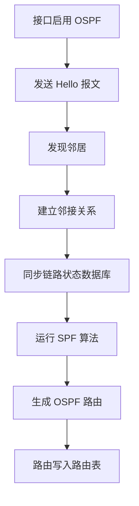
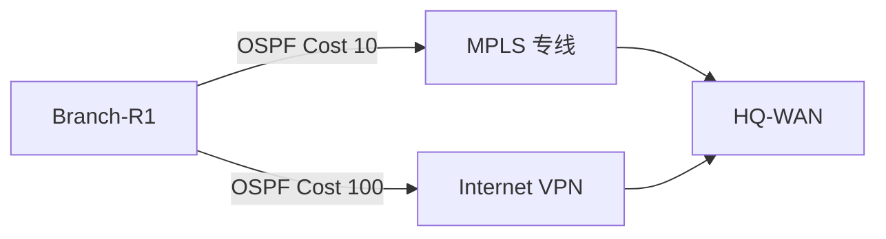

# 第 12 章：动态路由协议

## 12.1 学习目标

学完本章后，你应该能够：

- 解释动态路由协议要解决什么问题。
- 区分静态路由、动态路由、默认路由在企业网络中的使用边界。
- 理解邻居、路由通告、度量值、收敛、路由汇总、默认路由下发等核心概念。
- 了解 RIP、OSPF、BGP 的基本定位和适用场景。
- 理解 OSPF 的邻居建立、链路状态数据库、区域、Cost、DR/BDR、默认路由注入等基础原理。
- 能够设计一个简单的总部与分支 OSPF 路由方案。
- 能够从邻居状态、接口状态、协议参数、路由表、回程路径等方向排查动态路由故障。

第 11 章已经讲过路由表、下一跳、静态路由、默认路由和回程路由。本章继续回答一个更现实的问题：当企业网络里有几十个 VLAN、多个核心设备、多个分支、多条专线时，是否还要一条一条手工写静态路由？

答案通常是否定的。静态路由适合简单、稳定、边界清晰的地方；动态路由协议适合网段较多、拓扑可能变化、需要自动选择路径的地方。

## 12.2 为什么需要动态路由

先看一个小型静态路由网络：

```text
总部办公网段：10.10.10.0/24
总部服务器网段：10.10.40.0/24
分支办公网段：10.30.10.0/24
总部与分支互联：10.255.1.0/30
```

如果只有总部和一个分支，用静态路由可以工作：

- 总部写一条去 `10.30.10.0/24` 的静态路由。
- 分支写一条去总部所有网段或默认路由的静态路由。
- 防火墙或核心设备补齐回程路由。

但企业网络扩大后，静态路由会变得难维护。假设有 1 个总部、2 个数据中心、20 个分支，每个分支有 4 个业务网段，如果全部用静态路由，至少会遇到这些问题：

- 新增一个分支，需要在多台设备上手工增加路由。
- 分支新增一个 VLAN，总部、数据中心、防火墙都可能要改。
- 主链路故障后，备用链路不一定自动接管。
- 路由遗漏时，故障表现可能只是“某个方向通、另一个方向不通”。
- 多人维护时，很难确认每台设备的静态路由是否一致。

动态路由协议的作用是让三层设备之间自动交换可达网段信息。

简单说：

```text
静态路由：管理员告诉设备，去哪里应该走哪边。
动态路由：设备之间互相告诉对方，自己知道哪些网段，并根据协议规则选择路径。
```

动态路由并不是“自动就一定正确”。它只是把大量人工维护的路径信息交给协议处理。工程师仍然要设计网段、区域、汇总、边界、过滤和默认路由，否则动态路由也可能把错误路径传播到更大范围。

## 12.3 静态路由与动态路由的分工

企业网络不会只用一种路由方式。静态路由、动态路由和默认路由经常同时存在。

| 路由方式 | 产生方式 | 适合场景 | 优点 | 风险 |
| --- | --- | --- | --- | --- |
| 直连路由 | 接口 up 后自动生成 | 本设备直接连接的网段 | 最基础、可信度高 | 接口 down 后路由消失 |
| 静态路由 | 管理员手工配置 | 出口、边界、小型网络、特殊路径 | 简单、可控 | 网段多时维护量大 |
| 默认路由 | 静态或动态下发 | 指向出口或上级网络 | 简化未知目的转发 | 配错会导致大量流量走错方向 |
| 动态路由 | 协议自动学习 | 多网段、多设备、多链路网络 | 自动学习、自动收敛 | 需要规划协议参数和边界 |

一个常见企业设计是：

- 园区核心、汇聚、分支路由器之间运行 OSPF。
- 核心交换机内部学习各 VLAN 网段。
- 出口防火墙对内参与少量路由或接收汇总路由。
- 防火墙到运营商使用静态默认路由或 BGP。
- 核心向内部设备下发默认路由，让未知目的走出口。

可以用一句话记住分工：

```text
内部网段多，用动态路由；边界策略强，用静态控制；未知目的多，用默认路由。
```

## 12.4 动态路由协议的基本概念

动态路由协议有很多术语。初学时不要急着背命令，先理解每个术语解决什么问题。

### 邻居

邻居是运行同一种动态路由协议并能互相通信的三层设备。

例如两台路由器通过 `10.255.1.0/30` 互联：

```text
R1：10.255.1.1/30
R2：10.255.1.2/30
```

如果两台设备都在这个接口上运行 OSPF，并且关键参数一致，它们就可以建立 OSPF 邻居关系。

邻居关系不是简单的 ping 通。ping 通只说明 IP 层可达，而动态路由邻居还要检查协议参数。例如：

- 协议是否启用在正确接口上。
- 两端是否属于同一个 OSPF 区域。
- Hello/Dead 时间是否一致。
- 认证参数是否一致。
- 子网掩码、网络类型等是否匹配。
- ACL 或防火墙是否放行协议报文。

### 路由通告

路由通告是设备把自己知道的网段告诉邻居。

例如核心交换机有这些直连网段：

```text
10.10.10.0/24  办公网
10.10.20.0/24  研发网
10.10.40.0/24  服务器网
```

核心运行动态路由协议后，可以把这些网段通告给分支路由器。分支路由器学习到后，就会把访问这些网段的流量发向总部。

注意，通告一个网段不等于允许业务访问。路由解决“能不能找到路”，安全策略解决“能不能通过”。例如防火墙可能有到服务器网段的路由，但策略不允许办公网访问数据库端口。

### 度量值

度量值是动态路由协议用来比较路径优劣的数值。不同协议的度量方式不同。

| 协议 | 常见度量值 | 直观理解 |
| --- | --- | --- |
| RIP | 跳数 | 经过设备越少越好 |
| OSPF | Cost | 链路成本越低越好 |
| BGP | 路径属性 | 根据 AS Path、Local Preference、MED 等策略选择 |

如果同一个目的网段有多条路径，协议会根据度量值选择最优路径。度量值不是越复杂越好，关键是要符合业务设计。例如总部到分支有主专线和备 VPN，主专线的代价应该低于备 VPN，这样正常情况下走专线，专线故障后再切换到 VPN。

### 收敛

收敛是网络拓扑变化后，动态路由协议重新计算并稳定路由表的过程。

例如总部到分支主链路断开：

1. 相邻设备发现邻居失效。
2. 协议把链路变化传播给其他设备。
3. 各设备重新计算到分支网段的路径。
4. 路由表切换到备用链路。
5. 网络进入新的稳定状态。

收敛期间可能出现短暂丢包。工程上关注的是：

- 能不能自动恢复。
- 切换时间是否满足业务要求。
- 是否会出现路由环路。
- 主链路恢复后是否能按预期切回。

### 路由汇总

路由汇总是把多个连续的小网段合并成一条较大的路由通告。

例如总部办公网段规划为：

```text
10.10.0.0/24
10.10.1.0/24
10.10.2.0/24
...
10.10.255.0/24
```

如果地址规划连续，可以对外汇总为：

```text
10.10.0.0/16
```

汇总的好处：

- 减少路由表规模。
- 降低协议计算压力。
- 隐藏内部细节。
- 减少内部链路抖动对外部区域的影响。

汇总的前提是地址规划合理。如果网段零散分配，很难做干净的汇总。第 4 章讲子网划分时强调连续规划，就是为了后续路由设计服务。

### 默认路由下发

默认路由下发是由某台边界设备把 `0.0.0.0/0` 通告给内部设备。

常见场景：

- 出口防火墙或核心设备知道互联网出口。
- 内部设备不需要知道互联网的全部路由。
- 内部设备只需要知道“未知目的交给出口”。

例如出口防火墙向核心通告默认路由，核心再向园区内部通告默认路由。这样办公网访问互联网时，不需要每台设备都配置静态默认路由。

默认路由下发必须谨慎。错误地下发默认路由可能造成：

- 内部流量被引向错误出口。
- 分支把所有未知流量发到总部，压垮专线。
- 双出口场景中路径不符合安全策略。

## 12.5 动态路由协议分类

动态路由协议可以按不同方式分类。常见分类如下。

### IGP 与 EGP

IGP 是内部网关协议，用于一个组织内部的网络。EGP 是外部网关协议，用于不同自治系统之间。

| 类型 | 全称 | 常见协议 | 使用范围 |
| --- | --- | --- | --- |
| IGP | Interior Gateway Protocol | RIP、OSPF、IS-IS、EIGRP | 企业内部、运营商内部 |
| EGP | Exterior Gateway Protocol | BGP | 企业与运营商、运营商之间、互联网自治系统之间 |

大多数企业园区内部学习的是 OSPF。BGP 常见于互联网出口、多运营商接入、数据中心互联、云专线等边界场景。

### 距离矢量、链路状态、路径矢量

| 类型 | 代表协议 | 工作思路 | 特点 |
| --- | --- | --- | --- |
| 距离矢量 | RIP | 告诉邻居自己到某网段有多远 | 简单，但规模和收敛能力有限 |
| 链路状态 | OSPF、IS-IS | 每台设备了解区域拓扑，再自行计算最短路径 | 收敛快，适合较大内部网络 |
| 路径矢量 | BGP | 根据自治系统路径和策略选择路由 | 策略能力强，适合跨组织边界 |

初学阶段可以这样理解：

- RIP 像“听邻居说哪里能到”。
- OSPF 像“大家共享地图，每个人自己算路线”。
- BGP 像“跨公司协商路径，策略比距离更重要”。

## 12.6 常见动态路由协议

### RIP

RIP 是较早的动态路由协议，使用跳数作为度量值。最大有效跳数是 15，16 表示不可达。

RIP 的特点：

- 配置简单。
- 原理容易理解。
- 适合小型实验或非常小的网络。
- 不适合大型企业网络。

RIP 的主要限制：

- 只看跳数，不关心带宽。
- 最大规模有限。
- 收敛较慢。
- 路由环路控制能力弱于现代链路状态协议。

例如一条 100 Mbps 链路和一条 10 Gbps 链路，如果跳数相同，RIP 可能认为它们一样好。这显然不符合现代企业网络设计。

### OSPF

OSPF 是企业内部最常见的动态路由协议之一。它属于链路状态协议，会让同一区域内的设备形成一致的链路状态数据库，然后各自运行 SPF 算法计算最短路径。

OSPF 的特点：

- 适合中大型企业内部网络。
- 支持区域划分。
- 支持较快收敛。
- 支持等价负载分担。
- 支持路由汇总和默认路由注入。
- 多厂商支持广泛。

本章会重点讲 OSPF，因为企业园区网、总部与分支、数据中心内部互联中经常见到它。

### IS-IS

IS-IS 也是链路状态协议，常见于运营商和大型网络。它与 OSPF 一样适合大规模内部网络，但在普通企业园区学习路径中，OSPF 更常见。

本手册初期不展开 IS-IS。你需要先知道它的定位：它不是互联网出口协议，而是大型内部网络中可选的 IGP。

### BGP

BGP 是互联网和跨自治系统边界最重要的路由协议。它不是简单追求最短路径，而是根据策略选择路径。

BGP 常见场景：

- 企业接入多个运营商。
- 企业需要发布自己的公网地址段。
- 总部与云平台通过专线互联。
- 数据中心之间需要精细控制路由。
- 大型企业内部也可能使用 iBGP 传递大量路由。

BGP 比 OSPF 更强调策略。例如企业可以控制：

- 哪些公网前缀发布给哪个运营商。
- 入站流量更倾向从哪条线路进入。
- 出站流量优先走哪家运营商。
- 哪些云 VPC 网段允许传回企业内网。

初学阶段不要把 BGP 简单理解成“更高级的 OSPF”。OSPF 解决内部拓扑最短路径问题，BGP 解决跨自治系统和策略路由传播问题。

## 12.7 OSPF 的基本工作方式

OSPF 的全称是 Open Shortest Path First。它的核心思想是：同一区域内的路由器互相同步链路状态信息，每台设备都得到一张相同的区域拓扑图，然后各自计算到每个目的网段的最短路径。

### OSPF 不是直接交换整张路由表

很多初学者会误以为 OSPF 就是“设备之间互相发路由表”。这个说法不够准确。

OSPF 主要交换的是链路状态信息，包括：

- 自己有哪些 OSPF 接口。
- 接口连接到哪些网络。
- 与哪些邻居建立关系。
- 每条链路的 Cost。
- 自己可以到达哪些网段。

这些信息组成链路状态数据库。设备再根据数据库计算路由表。

可以把 OSPF 理解为三个步骤：

```text
发现邻居 -> 同步拓扑信息 -> 计算路由表
```

### OSPF 运行过程



当拓扑发生变化时，例如接口 down、邻居失效、Cost 修改，OSPF 会重新传播变化并重新计算路由。

## 12.8 OSPF 的关键概念

### Router ID

Router ID 是 OSPF 中标识一台路由器的 32 位数值，格式看起来像 IPv4 地址，例如 `10.255.255.1`。

Router ID 不是必须等于某个接口 IP，但工程中常用 Loopback 地址作为 Router ID。

例如：

| 设备 | Loopback | Router ID |
| --- | --- | --- |
| HQ-Core | `10.255.255.1/32` | `10.255.255.1` |
| HQ-WAN | `10.255.255.2/32` | `10.255.255.2` |
| Branch-R1 | `10.255.255.11/32` | `10.255.255.11` |

使用 Loopback 的好处是稳定。物理接口可能 down，但 Loopback 通常不会因为某条链路中断而消失。稳定的 Router ID 有利于协议运行和故障定位。

常见问题：

- 两台设备 Router ID 重复，邻居可能异常。
- 修改 Router ID 后没有重启 OSPF 进程，实际运行仍使用旧值。
- 没有统一规划 Router ID，排查时很难对应设备。

### Hello 与 Dead 时间

OSPF 使用 Hello 报文发现和维护邻居。

| 参数 | 含义 |
| --- | --- |
| Hello 时间 | 多久发送一次 Hello |
| Dead 时间 | 多久收不到对方 Hello 就认为邻居失效 |

常见默认值因网络类型和厂商实现而不同。以广播网络常见设计为例，Hello 可能是 10 秒，Dead 可能是 40 秒。

两端接口的关键参数必须匹配，否则邻居无法正常建立。排错时不要只看 IP 是否能 ping 通，还要检查 OSPF 参数。

### Area 区域

OSPF 使用区域来控制规模。所有 OSPF 网络必须围绕骨干区域 Area 0 设计。

常见区域设计：

| 区域 | 作用 | 示例 |
| --- | --- | --- |
| Area 0 | 骨干区域 | 总部核心、数据中心核心 |
| 普通区域 | 接入或分支区域 | 分支网络、楼宇汇聚 |
| Stub 区域 | 减少外部路由进入 | 小型分支 |

初学阶段先记住：

- 简单企业网络可以全部放在 Area 0。
- 网络变大后，再把分支或楼宇划分到不同区域。
- 非 Area 0 区域通常需要通过 Area 0 与其他区域通信。
- 区域边界路由器称为 ABR。

不要为了“看起来专业”而过早划分很多区域。区域设计是为规模、稳定性和汇总服务的，不是为了增加复杂度。

### Cost

OSPF 使用 Cost 表示链路代价。Cost 越小，路径越优。

很多设备会根据接口带宽自动计算 Cost，但默认参考带宽可能不适合现代网络。例如某些环境下 1 Gbps、10 Gbps、40 Gbps 链路可能都被计算成相同 Cost，导致路径选择不符合预期。

工程中常见做法：

- 统一调整 OSPF 参考带宽。
- 或者在关键接口上手工设置 Cost。
- 明确主链路 Cost 低于备链路。
- 在割接前确认路由表实际选择的路径。

示例：

| 链路 | 角色 | 期望 Cost |
| --- | --- | ---: |
| 总部到分支专线 | 主链路 | 10 |
| 总部到分支 VPN | 备链路 | 100 |
| 核心之间万兆互联 | 核心路径 | 1 |

Cost 设计要简单、可解释。不要给每条链路随意填数字，否则后期排错时很难判断路径为什么这样走。

### DR 与 BDR

在以太网广播网络中，如果很多 OSPF 路由器在同一个 VLAN 内互联，每两台都完整同步会产生很多邻接关系。OSPF 使用 DR 和 BDR 降低复杂度。

| 角色 | 含义 |
| --- | --- |
| DR | 指定路由器，负责在广播网络中集中同步链路状态 |
| BDR | 备份指定路由器，DR 故障时接替 |
| DROther | 非 DR/BDR 的其他路由器 |

在点到点三层互联中，通常不需要关注 DR/BDR。企业设计中，核心到核心、核心到路由器常使用三层点到点互联，这样邻居关系更简单。

如果多个设备通过同一个 VLAN 运行 OSPF，要关注：

- DR/BDR 是否符合预期。
- OSPF 优先级是否配置合理。
- 是否有不该参与 OSPF 的设备加入。

### 被动接口

被动接口是指接口所在网段被 OSPF 通告，但接口不发送 OSPF Hello，也不建立邻居。

这在企业网关 VLAN 上很常见。比如核心交换机上有办公 VLANIF：

```text
VLANIF 10：10.10.10.1/24
```

这个网段需要被 OSPF 通告给其他路由器，但办公 PC 不会运行 OSPF，也不应该收到 OSPF Hello。因此可以把用户 VLANIF 设为被动接口。

被动接口的好处：

- 减少无意义的协议报文。
- 避免终端网段出现非法 OSPF 邻居。
- 提高协议边界的清晰度。

### 等价负载分担

如果 OSPF 到同一个目的网段有多条 Cost 相同的路径，可能会安装多条等价路由，实现负载分担。

例如核心到数据中心有两条相同带宽的链路：

```text
Core -> Link1 -> DC
Core -> Link2 -> DC
```

如果两条路径 Cost 相同，路由表可能出现两条下一跳。设备会按转发机制分担流量。

等价负载分担要注意：

- 两条链路带宽和质量是否真的相近。
- 防火墙、NAT、状态检测设备是否允许流量来回路径不一致。
- 业务是否对路径抖动敏感。

在经过防火墙的场景中，非对称路径可能导致会话被丢弃。负载分担不是所有场景都适合。

## 12.9 OSPF 邻居建立过程

OSPF 邻居状态可以帮助定位故障。不同厂商显示略有差异，但核心状态类似。

| 状态 | 含义 | 排查意义 |
| --- | --- | --- |
| Down | 没收到对方 Hello | 接口、链路、协议未启用、报文被拦截 |
| Init | 收到对方 Hello，但对方未确认自己 | 单向通信或参数问题 |
| 2-Way | 双方互相看到对方 | 广播网络中 DROther 之间可能停在此状态 |
| ExStart/Exchange | 开始协商并交换数据库摘要 | MTU、主从协商、链路质量可能影响 |
| Loading | 请求缺失的链路状态信息 | 数据库同步中 |
| Full | 邻接关系完成 | 正常状态 |

常见判断：

- 点到点链路上的 OSPF 邻居通常应该到 Full。
- 广播网络中，DROther 与 DROther 之间可能是 2-Way，这不一定是故障。
- 长时间停在 ExStart/Exchange，要检查 MTU、网络类型和链路质量。
- 一直 Down，要先查接口、IP、掩码、协议启用和 ACL。

邻居建立失败时，按这个顺序排查比较稳：

```text
接口 up/down -> IP 与掩码 -> 直连互通 -> OSPF 是否启用 -> Area 是否一致 -> Hello/Dead -> 认证 -> MTU/网络类型
```

## 12.10 OSPF 路由学习示例

### 场景说明

企业有一个总部和一个分支。总部核心交换机负责总部办公、研发和服务器 VLAN 的网关。总部广域网路由器连接分支。总部内部和分支之间运行 OSPF。

地址规划如下：

| 位置 | 网段或接口 | 地址 |
| --- | --- | --- |
| 总部办公 VLAN 10 | `10.10.10.0/24` | 网关 `10.10.10.1` |
| 总部研发 VLAN 20 | `10.10.20.0/24` | 网关 `10.10.20.1` |
| 总部服务器 VLAN 40 | `10.10.40.0/24` | 网关 `10.10.40.1` |
| 总部核心到 WAN 路由器 | `10.255.0.0/30` | Core `10.255.0.2`，WAN `10.255.0.1` |
| 总部 WAN 到分支 | `10.255.1.0/30` | HQ-WAN `10.255.1.1`，Branch `10.255.1.2` |
| 分支办公 VLAN 10 | `10.30.10.0/24` | 网关 `10.30.10.1` |
| 分支无线 VLAN 20 | `10.30.20.0/24` | 网关 `10.30.20.1` |

拓扑如下：


### 期望路由学习结果

总部核心应该学习到分支网段：

| 目的网段 | 下一跳 | 来源 |
| --- | --- | --- |
| `10.30.10.0/24` | `10.255.0.1` | OSPF |
| `10.30.20.0/24` | `10.255.0.1` | OSPF |

分支路由器应该学习到总部网段：

| 目的网段 | 下一跳 | 来源 |
| --- | --- | --- |
| `10.10.10.0/24` | `10.255.1.1` | OSPF |
| `10.10.20.0/24` | `10.255.1.1` | OSPF |
| `10.10.40.0/24` | `10.255.1.1` | OSPF |

这样总部 PC 访问分支 PC 时，正向和回程路径都由 OSPF 自动学习，不需要在每台设备上手工写多个静态路由。

### 概念配置思路

不同厂商命令不同，但思路一致：

1. 给每台 OSPF 设备规划 Router ID。
2. 在互联接口上启用 OSPF。
3. 把需要被学习的业务网段加入 OSPF。
4. 用户 VLANIF 设置为被动接口。
5. 确认邻居状态为 Full。
6. 确认路由表中出现对端网段。
7. 用 ping、traceroute、业务访问验证路径。

以伪配置表示：

```text
HQ-Core:
  router-id 10.255.255.1
  ospf area 0:
    network 10.255.0.0/30      # 与 HQ-WAN 建邻居
    network 10.10.10.0/24      # 通告办公网段
    network 10.10.20.0/24      # 通告研发网段
    network 10.10.40.0/24      # 通告服务器网段
  passive-interface VLANIF10
  passive-interface VLANIF20
  passive-interface VLANIF40

HQ-WAN:
  router-id 10.255.255.2
  ospf area 0:
    network 10.255.0.0/30      # 与 HQ-Core 建邻居
    network 10.255.1.0/30      # 与 Branch-R1 建邻居

Branch-R1:
  router-id 10.255.255.11
  ospf area 0:
    network 10.255.1.0/30      # 与 HQ-WAN 建邻居
    network 10.30.10.0/24      # 通告分支办公网段
    network 10.30.20.0/24      # 通告分支无线网段
  passive-interface VLANIF10
  passive-interface VLANIF20
```

这里的重点不是某条命令，而是哪些接口要建立邻居，哪些网段只需要被通告。

### 数据包转发过程

总部 PC `10.10.10.25` 访问分支 PC `10.30.10.25`：

1. 总部 PC 判断目标不在本地网段，把包交给网关 `10.10.10.1`。
2. HQ-Core 查路由表，发现 `10.30.10.0/24` 是 OSPF 学到的路由，下一跳为 `10.255.0.1`。
3. HQ-Core 把包发给 HQ-WAN。
4. HQ-WAN 查路由表，发现目标走 `10.255.1.2`。
5. Branch-R1 收到后转发到分支办公 VLAN。
6. 分支 PC 回包给网关 `10.30.10.1`。
7. Branch-R1 查路由表，发现 `10.10.10.0/24` 通过 OSPF 学到，下一跳为 `10.255.1.1`。
8. 回包沿总部方向返回。

注意，这里 OSPF 只负责让设备学习路由。真正转发数据包时，设备仍然是查本地路由表、解析下一跳 MAC、重新封装二层帧。

## 12.11 默认路由与 OSPF

企业内部不可能学习互联网全部路由。内部设备通常只需要一条默认路由指向出口。

### 出口默认路由

假设总部出口防火墙连接运营商：

```text
出口防火墙内侧：10.255.2.1/30
总部核心到防火墙：10.255.2.2/30
运营商下一跳：203.0.113.1
```

防火墙上通常有静态默认路由：

```text
0.0.0.0/0 -> 203.0.113.1
```

内部核心设备需要知道未知目的应该走防火墙。常见方式有两种：

| 方式 | 做法 | 适合场景 |
| --- | --- | --- |
| 静态默认路由 | 核心手工配置 `0.0.0.0/0 -> 10.255.2.1` | 简单出口 |
| OSPF 默认路由注入 | 出口设备把默认路由通告进 OSPF | 内部设备较多 |

如果出口设备向 OSPF 注入默认路由，内部路由器会通过 OSPF 学到 `0.0.0.0/0`。这样分支也可以自动知道互联网流量应发往总部出口。

### 默认路由注入的风险

默认路由很强，因为它会匹配所有未知目的。注入前要确认：

- 出口设备本身确实有可用的上级默认路由。
- 内部是否所有设备都应该使用这个出口。
- 是否存在多个出口，需要优先级或 Cost 控制。
- 分支互联网流量是否允许回总部统一出口。
- 安全策略和 NAT 是否已准备好。

例如分支有本地互联网出口，又通过 OSPF 学到总部默认路由。如果默认路由优先级没有设计好，分支员工上网可能绕总部，造成专线压力和延迟增加。

## 12.12 路由重分发

路由重分发是把一种来源的路由引入到另一种路由协议中。

常见例子：

- 把静态路由引入 OSPF。
- 把直连业务网段引入 OSPF。
- 把 OSPF 学到的内部路由引入 BGP。
- 把 BGP 学到的云网段引入 OSPF。

重分发很有用，但也是动态路由中常见风险点。

### 为什么需要重分发

假设企业出口防火墙上有一条到云平台的静态路由：

```text
172.20.0.0/16 -> 10.255.3.1
```

内部设备运行 OSPF。如果希望内部核心和分支都自动学习 `172.20.0.0/16`，可以在防火墙或边界路由器上把这条静态路由引入 OSPF。

### 重分发风险

| 风险 | 说明 |
| --- | --- |
| 引入过多路由 | 把不需要的静态、直连、外部路由全部传播出去 |
| 路由环路 | 多个边界相互重分发，可能把路由绕回来 |
| 路径不符合预期 | 外部路由度量设置不合理 |
| 安全边界模糊 | 不该被内部知道的网段被通告 |
| 排错困难 | 路由来源变复杂，不容易判断原始来源 |

工程建议：

- 只重分发明确需要的路由。
- 使用路由策略或前缀列表限制范围。
- 给外部路由设置合理度量值。
- 在设计文档中写明路由来源。
- 避免多个边界设备无控制地双向重分发。

初学阶段要记住：重分发不是“为了省事全部导入”。它是边界控制动作，应该越明确越好。

## 12.13 OSPF 路由汇总设计

动态路由网络越大，越需要控制路由规模。汇总是最常用的控制手段之一。

### 汇总示例

假设总部按区域规划地址：

| 区域 | 明细网段 | 可汇总路由 |
| --- | --- | --- |
| 总部办公区 | `10.10.0.0/24` 到 `10.10.63.0/24` | `10.10.0.0/18` |
| 总部服务器区 | `10.10.64.0/24` 到 `10.10.95.0/24` | `10.10.64.0/19` |
| 分支 A | `10.30.0.0/24` 到 `10.30.15.0/24` | `10.30.0.0/20` |
| 分支 B | `10.30.16.0/24` 到 `10.30.31.0/24` | `10.30.16.0/20` |

对外发布汇总路由后，其他区域不需要看到每个 VLAN 的明细路由。

### 汇总的前提

汇总必须满足地址连续和边界清晰。不能把不属于同一方向的网段强行汇总。

错误例子：

```text
分支 A：10.30.0.0/24
分支 B：10.30.1.0/24
总部测试网：10.30.2.0/24
```

如果对外汇总 `10.30.0.0/22`，就会把总部测试网也包含进去，其他设备可能把去测试网的流量错误发向分支方向。

### 汇总与故障影响范围

汇总还能降低故障影响。假设分支内部某个 VLAN 抖动，如果总部只看到分支汇总路由，OSPF 不一定需要在全网频繁传播每个明细变化。

但汇总也可能隐藏细节。排查时要知道：

- 本地设备看到的是明细还是汇总。
- 汇总路由在哪台设备产生。
- 明细网段是否真的在汇总设备后面可达。

## 12.14 多链路与主备路径

动态路由常用于多链路主备切换。

### 主备链路场景

企业分支有两条到总部的路径：

- MPLS 专线：稳定、低延迟，作为主链路。
- IPSec VPN：经过互联网，作为备链路。

拓扑如下：



OSPF 可以通过 Cost 控制路径：

| 路径 | Cost | 正常状态 |
| --- | ---: | --- |
| MPLS 专线 | 10 | 优先使用 |
| IPSec VPN | 100 | 备用 |

当 MPLS 故障后，OSPF 邻居失效或链路状态变化，路由会切换到 VPN。MPLS 恢复后，路由会根据 Cost 切回主链路。

### 主备设计注意点

主备路由不仅是协议问题，还要检查业务路径：

- VPN 上是否允许 OSPF 报文或是否使用隧道接口运行 OSPF。
- 两条链路的 MTU 是否不同。
- 防火墙是否允许备用路径上的业务流量。
- NAT 是否只在互联网出口方向生效，避免内网互访被错误 NAT。
- 回程路由是否也能切换。
- 监控系统是否能识别主备切换。

很多故障不是“OSPF 没切换”，而是路由切换后，安全策略、NAT、MTU 或回程路径没有同步设计。

## 12.15 动态路由与安全边界

动态路由让路径学习更方便，但也扩大了错误传播的范围。企业网络中要特别关注协议边界。

### 哪些接口不应该建立邻居

以下位置通常不应该随意建立动态路由邻居：

- 办公终端 VLAN。
- 访客无线 VLAN。
- 服务器业务 VLAN。
- DMZ 业务区。
- 连接第三方厂商的接口。
- 连接不受信任网络的接口。

这些网段可以被通告，但不应该让终端或第三方设备参与内部路由协议。

### 常见保护措施

| 措施 | 作用 |
| --- | --- |
| 被动接口 | 通告网段但不建立邻居 |
| 认证 | 防止未授权设备建立邻居 |
| ACL 或安全策略 | 限制协议报文来源 |
| 路由过滤 | 控制哪些路由可以进出协议 |
| 区域规划 | 控制拓扑信息范围 |
| 设备命名和 Router ID 规划 | 便于审计和排错 |

### 动态路由与防火墙

防火墙可以参与动态路由，但要清楚它同时承担安全边界角色。

常见设计有两种：

| 设计 | 说明 | 适用场景 |
| --- | --- | --- |
| 防火墙参与 OSPF | 防火墙与核心建立邻居，学习内部路由并发布默认路由 | 出口设备多、内部设备多 |
| 防火墙使用静态路由 | 核心与防火墙之间用静态和默认路由 | 小型或安全边界要求简单 |

防火墙参与 OSPF 时，要特别注意：

- 是否允许 OSPF 协议报文。
- 是否只通告必要网段。
- 默认路由是否按预期注入。
- 安全策略是否与路由一致。
- 双机热备场景中主备防火墙的路由行为是否一致。

## 12.16 企业动态路由设计流程

设计动态路由时，可以按下面流程推进。

### 第一步：画出三层拓扑

先画三层设备和三层互联，不要一开始就写命令。

需要标清：

- 哪些设备参与路由协议。
- 哪些接口是三层互联。
- 哪些 VLANIF 是业务网关。
- 哪些设备是出口或边界。
- 哪些链路是主链路，哪些是备链路。

### 第二步：整理网段清单

至少列出：

| 字段 | 示例 |
| --- | --- |
| 位置 | 总部办公区 |
| VLAN | 10 |
| 网段 | `10.10.10.0/24` |
| 网关 | `10.10.10.1` |
| 所属设备 | HQ-Core |
| 是否通告 OSPF | 是 |
| 是否建立邻居 | 否，被动接口 |

动态路由的质量很依赖地址规划。如果网段清单混乱，协议配置一定容易出错。

### 第三步：确定协议和区域

普通企业内部优先考虑 OSPF。简单网络可以全部 Area 0；较大网络再划分区域。

区域规划要回答：

- 哪些设备在 Area 0。
- 分支是否单独区域。
- 哪些设备是 ABR。
- 哪些位置做汇总。
- 哪些区域需要减少外部路由。

### 第四步：确定边界和默认路由

明确：

- 默认路由从哪里来。
- 是否由 OSPF 下发默认路由。
- 是否有多个出口。
- 分支是否走总部出口还是本地出口。
- 防火墙是否参与动态路由。

### 第五步：设置 Cost 和主备策略

对多链路场景，明确主备关系：

| 目的 | 主路径 | 备路径 | 控制方式 |
| --- | --- | --- | --- |
| 分支访问总部 | MPLS | VPN | OSPF Cost |
| 总部访问云 | 专线 A | 专线 B | 静态优先级或 BGP 策略 |
| 办公网访问互联网 | 本地出口 | 总部出口 | 默认路由优先级 |

### 第六步：配置、验证、记录

上线前至少记录：

- OSPF Router ID。
- OSPF Area。
- 建邻接口。
- 被动接口。
- 通告网段。
- 汇总路由。
- 默认路由来源。
- 重分发策略。
- 主备链路 Cost。
- 验证命令输出截图或文本。

这些记录以后会直接影响故障处理效率。

## 12.17 验证方法

动态路由配置完成后，不要只 ping 一个地址就结束。建议按层次验证。

### 验证接口和直连

先确认相邻设备的互联接口正常：

```text
查看接口状态
查看接口 IP 和掩码
ping 对端互联地址
查看 ARP 或邻接表
```

如果直连都不通，动态路由一定无法正常工作。

### 验证邻居状态

查看 OSPF 邻居：

```text
查看 OSPF neighbor
确认邻居 Router ID
确认邻居状态 Full
确认邻居接口正确
确认 Dead time 正常递减并刷新
```

需要关注的是“应该有几个邻居”。例如 HQ-Core 只通过一条三层链路连接 HQ-WAN，那就应该只有一个 OSPF 邻居。邻居数量多了或少了都要查。

### 验证 OSPF 接口

查看本设备哪些接口启用了 OSPF：

```text
查看 OSPF interface
确认 Area
确认网络类型
确认 Hello/Dead
确认 Cost
确认是否被动接口
```

常见问题是把用户 VLANIF 也启用了主动 OSPF，导致该网段发送 Hello；或者互联接口没有启用 OSPF，导致邻居无法建立。

### 验证路由表

确认路由是否进入全局路由表：

```text
查看 route 10.30.10.0/24
查看 route 10.10.10.0/24
查看默认路由 0.0.0.0/0
```

要区分：

- OSPF 数据库里有，不代表一定进入路由表。
- 路由表里有，不代表安全策略允许通过。
- 正向路由有，不代表回程路由也有。

### 验证业务路径

用 `traceroute` 或等效命令观察路径：

```text
总部 PC -> 分支 PC
分支 PC -> 总部服务器
分支 PC -> Internet
```

如果路径不符合预期，要检查：

- OSPF Cost。
- 默认路由来源。
- 是否存在更长前缀的静态路由。
- 是否存在策略路由。
- 是否发生路由重分发。

### 验证主备切换

如果设计了主备链路，需要在维护窗口验证：

1. 正常状态走主链路。
2. 手动关闭主链路或模拟故障。
3. 观察邻居失效和路由切换时间。
4. 验证业务是否恢复。
5. 恢复主链路。
6. 观察是否按预期切回。

切换测试要提前准备回退方案。不要在生产高峰随意断链路。

## 12.18 常见故障与排查

### 故障一：两台设备互联能 ping 通，但 OSPF 邻居不起

可能原因：

| 检查项 | 说明 |
| --- | --- |
| OSPF 是否启用 | 接口或网段没有加入 OSPF |
| Area 是否一致 | 一端 Area 0，另一端 Area 1 |
| Hello/Dead 是否一致 | 时间参数不匹配 |
| 认证是否一致 | 密码或认证方式不同 |
| 网络类型是否一致 | 点到点和广播类型不匹配 |
| ACL 是否阻断 | OSPF 协议报文被过滤 |
| Router ID 是否重复 | 重复 ID 导致异常 |

排查思路：

```text
先查接口和 IP -> 再查 OSPF 接口 -> 再查邻居事件 -> 最后查认证、ACL、网络类型
```

### 故障二：邻居 Full，但没有学到对端业务网段

邻居 Full 只说明协议邻接关系正常，不代表所有业务网段都已通告。

可能原因：

- 对端业务网段没有加入 OSPF。
- 对端业务接口 down，直连路由不存在。
- 被路由策略过滤。
- 区域汇总配置不正确。
- 路由已在 OSPF 数据库中，但被更优路由覆盖。

排查时要看三处：

```text
对端是否有该直连路由
对端是否把该网段通告进 OSPF
本端 OSPF 数据库和路由表是否收到
```

### 故障三：学到路由，但业务不通

这类故障最常见。路由存在只是说明路径选择可能正确，还要继续检查：

| 方向 | 检查内容 |
| --- | --- |
| 终端 | IP、掩码、网关是否正确 |
| 二层 | VLAN、Trunk、ARP 是否正常 |
| 三层 | 正向和回程路由是否都有 |
| 安全 | ACL、防火墙策略是否允许 |
| NAT | 内网互访是否被错误 NAT |
| MTU | VPN 或隧道路径是否有分片问题 |
| 业务 | 目标服务端口是否开放 |

典型现象：

- ping 网关通，ping 远端不通：查路由和安全策略。
- 总部 ping 分支通，分支 ping 总部不通：查回程路由或策略方向。
- ICMP 通，业务端口不通：查防火墙策略和服务器服务。
- 小包通，大包不通：查 MTU、隧道、分片。

### 故障四：路径没有走主链路

可能原因：

- 主链路 OSPF Cost 高于备链路。
- 存在更精确的静态路由。
- 默认路由覆盖了预期路径。
- 发生了路由重分发，外部路由优先级更高。
- 主链路邻居虽然 Full，但没有通告目标网段。

排查时不要只看拓扑图，要看真实路由表：

```text
目的网段匹配了哪条路由
路由来源是什么
下一跳是谁
度量值是多少
是否还有等价路径
```

### 故障五：默认路由下发后，分支上网异常

可能原因：

- 分支错误地使用总部出口。
- 总部防火墙没有分支网段的 NAT 策略。
- 总部防火墙没有允许分支上网的安全策略。
- 分支本地出口和总部默认路由优先级冲突。
- OSPF 默认路由被多个设备同时注入。

排查要分清：

```text
分支去内网走哪条路
分支去互联网走哪条路
默认路由来自哪台设备
出口防火墙是否识别分支源地址
NAT 和安全策略是否覆盖分支网段
```

## 12.19 动态路由学习建议

学习动态路由不要只背协议状态。建议按下面顺序练习。

### 先做三台设备实验

最小实验拓扑：

```text
R1 ---- R2 ---- R3
```

每台设备各有一个 Loopback 或业务网段：

| 设备 | 业务网段 |
| --- | --- |
| R1 | `10.1.1.0/24` |
| R2 | `10.2.2.0/24` |
| R3 | `10.3.3.0/24` |

目标：

- R1 能学习 R3 的网段。
- R3 能学习 R1 的网段。
- 关闭 R2 到 R3 链路后，观察路由变化。

### 再做主备链路实验

拓扑：

```text
R1 ---- 主链路 ---- R2
R1 ---- 备链路 ---- R2
```

目标：

- 设置主链路 Cost 低。
- 设置备链路 Cost 高。
- 正常走主链路。
- 主链路 down 后走备链路。
- 主链路恢复后切回。

### 最后加入防火墙和默认路由

真实企业网络一定会遇到安全边界。练习时加入防火墙或模拟出口设备：

- 内部运行 OSPF。
- 出口有静态默认路由。
- 出口向 OSPF 注入默认路由。
- 验证内部访问互联网路径。
- 验证 NAT 和安全策略。

这样才能把路由协议和企业出口设计连接起来。

## 12.20 自查练习

1. 动态路由协议解决的核心问题是什么？它能否替代安全策略？
2. 为什么 OSPF 邻居 ping 通仍然可能建立失败？
3. OSPF Router ID 为什么建议统一规划？
4. 用户 VLANIF 为什么常设置为被动接口？
5. RIP 为什么不适合大型企业网络？
6. OSPF Cost 如何影响主备链路选择？
7. 默认路由注入 OSPF 前需要确认哪些条件？
8. 路由重分发为什么需要过滤？
9. 总部能访问分支，分支不能访问总部，应该重点检查什么？
10. 为什么地址连续规划有利于 OSPF 汇总？

## 12.21 本章小结

动态路由协议的价值在于让多台三层设备自动交换可达信息，并在拓扑变化时自动重新计算路径。它特别适合网段较多、设备较多、链路存在主备关系的企业内部网络。

本章重点介绍了动态路由的核心概念，包括邻居、路由通告、度量值、收敛、汇总、默认路由下发和重分发。RIP、OSPF、BGP 都是动态路由协议，但定位不同：RIP 简单但规模有限，OSPF 是企业内部常用 IGP，BGP 主要用于跨自治系统和复杂边界策略。

OSPF 是本章的重点。理解 OSPF 时，要抓住三句话：

```text
先建立邻居。
再同步链路状态数据库。
最后根据 Cost 计算路由表。
```

动态路由不是配置越多越好。企业设计中要明确哪些接口建邻居，哪些网段只通告，默认路由从哪里来，是否需要汇总，是否有重分发，主备路径如何控制。排错时也要按层次推进：接口、直连、邻居、协议参数、数据库、路由表、策略、回程路径。

下一章将进入企业出口路由设计，把静态路由、动态路由、默认路由、防火墙、NAT、多出口和分支互联放到同一个真实网络场景中理解。
