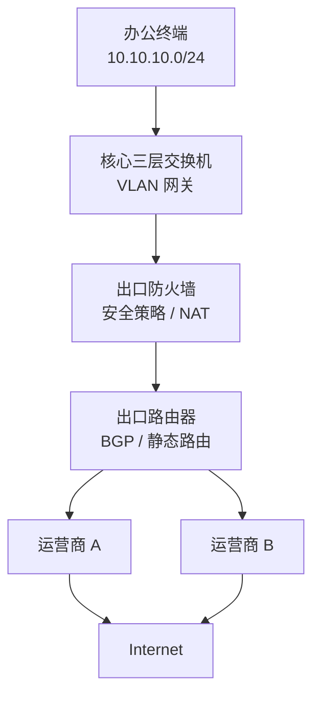
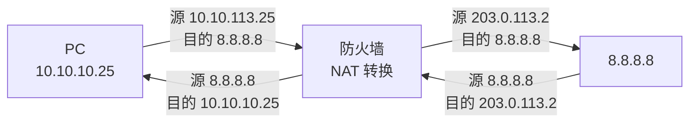
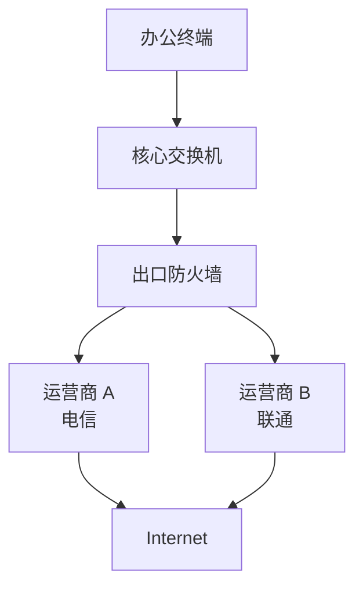
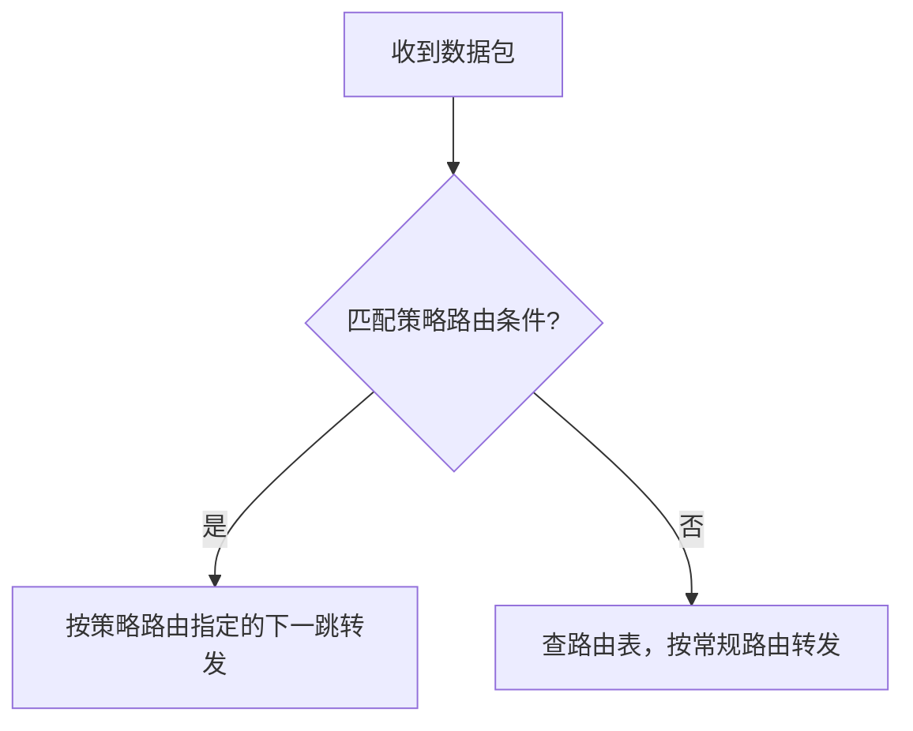
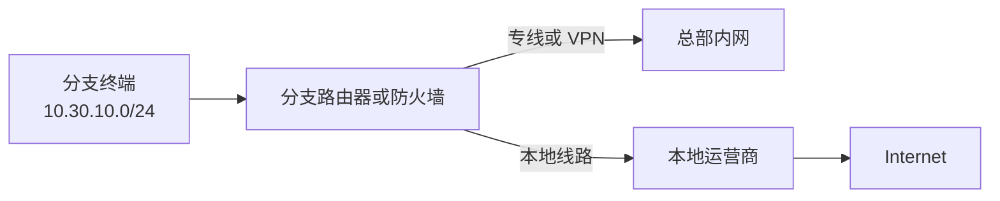
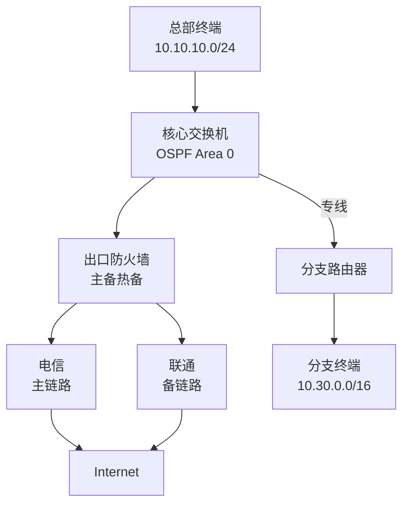

# 第 13 章：企业出口路由设计

## 13.1 学习目标

学完本章后，你应该能够：

- 解释企业网络"出口"的含义以及出口路由在整个网络中的位置。
- 理解默认路由在出口设计中的核心作用。
- 区分单出口、双出口、多出口场景的路由设计差异。
- 理解 NAT 为什么是互联网出口的必备技术。
- 理解策略路由的含义和典型使用场景。
- 能够设计总部与分支的出口路由方案，包括统一出口和本地分流。
- 能够排查出口路由常见故障，包括去程不通、回程缺失、NAT 异常和路径不符合预期。

第 11 章讲了路由表、下一跳、默认路由和回程路由，第 12 章讲了动态路由协议。这两章解决的是"设备怎么知道往哪里转发"的问题。本章把这些知识放到一个更真实的场景中：企业网络如何连接互联网，如何选择运营商线路，如何在多条出口链路之间分配流量，以及分支站点的上网流量应该走哪里。

## 13.2 什么是企业出口

企业出口是企业内部网络与外部网络之间的边界。"外部网络"通常指互联网，也可以是运营商专线、合作方网络或公有云平台。

```text
企业出口 = 内网和外网之间的路由、安全、地址转换边界
```

在典型企业园区中，出口位置通常部署以下设备：

| 设备 | 作用 |
| --- | --- |
| 出口路由器 | 连接运营商线路，运行 BGP 或静态路由 |
| 出口防火墙 | 安全策略、NAT、日志审计、入侵防御 |
| 负载均衡或链路控制器 | 多条运营商线路的流量分配 |
| 核心交换机 | 内部网关，把未知目的指向出口 |

不是每家企业都有独立的出口路由器。中小型企业常见做法是防火墙直接连接运营商线路，同时承担路由、NAT 和安全策略功能。



出口设计要同时解决四个问题：

| 问题 | 说明 |
| --- | --- |
| 路由 | 内网访问互联网的流量走哪条链路 |
| NAT | 内网私有地址如何转换为公网地址 |
| 安全 | 哪些流量允许进出，哪些要阻断 |
| 冗余 | 一条链路故障后业务能否继续 |

本章重点讲路由和 NAT，安全策略和防火墙高级功能会在后续章节展开。

## 13.3 为什么出口路由需要专门设计

有人可能觉得，出口路由不就是配一条默认路由指向运营商吗？对于最简单的单出口小型网络，这确实够用。但企业网络一旦涉及以下任何一种情况，出口路由就需要专门设计：

- 有多条运营商线路。
- 有多个分支站点，每个站点可能有本地出口或回总部出口。
- 有公网服务器需要外部访问。
- 有云平台通过专线或 VPN 互联。
- 有不同部门或业务对出口质量有不同要求。
- 有安全审计或合规要求，需要统一出口日志。

这些问题的核心是：当存在多条可能的出口路径时，如何控制每条流量走哪条路，以及一条路断了怎么办。

## 13.4 默认路由与出口路径

默认路由 `0.0.0.0/0` 是出口路由设计的基础。它的含义是：本设备路由表中没有更精确匹配时，把包发往这个方向。

### 默认路由在出口链路中的传递

在一个典型企业中，默认路由从外到内逐级传递：

| 设备 | 默认路由指向 | 含义 |
| --- | --- | --- |
| 出口路由器 | 运营商下一跳 | 互联网流量交给运营商 |
| 出口防火墙 | 出口路由器 | 未知目的交给路由器 |
| 核心交换机 | 出口防火墙 | 未知目的交给防火墙 |
| 汇聚交换机 | 核心交换机 | 如果有汇聚层，再向上交 |
| 终端 | 网关 VLANIF | 最终交给网关设备 |

这条链路可以理解为"默认路由链"。每一层只负责把未知目的交给上一层，最终到达运营商。


### 默认路由不是万能的

第 11 章强调过，默认路由只解决"本设备把未知目的发到哪里"。它不保证：

- 下一跳设备知道后续路径。
- 对端有回程路由。
- 防火墙策略允许通过。
- NAT 已正确配置。
- DNS 解析正确。

所以出口排错时，不能只看"有没有默认路由"，还要看默认路由指向的设备是否真的能到达互联网。

### 默认路由的来源

默认路由可以通过多种方式产生：

| 方式 | 说明 | 适用场景 |
| --- | --- | --- |
| 静态默认路由 | 管理员手工配置 | 单出口或简单双出口 |
| OSPF 默认路由注入 | 出口设备向 OSPF 通告 `0.0.0.0/0` | 内部设备较多 |
| BGP 默认路由 | 运营商通过 BGP 下发 | 多运营商 BGP 接入 |
| DHCP 下发 | 运营商通过 DHCP 给出口设备分配默认路由 | 小型网络宽带接入 |

企业内部通常使用静态默认路由或 OSPF 注入。使用哪种方式取决于网络规模和出口设备是否参与内部动态路由。

## 13.5 NAT 基础：为什么出口必须做 NAT

NAT 是出口路由设计中不可回避的技术。如果不理解 NAT，很多出口故障无法排查。

### 为什么需要 NAT

企业内部通常使用私有地址：

| 网段 | 用途 |
| --- | --- |
| `10.10.10.0/24` | 办公网 |
| `10.10.20.0/24` | 研发网 |
| `172.16.1.0/24` | 服务器区 |

这些私有地址在互联网上不可路由。运营商路由器不会转发目的地址为 `10.10.10.0/24` 的包，因为私有地址段不在全球路由表中。

NAT 的作用是把私有地址转换为公网地址，使得内网终端能够访问互联网。

### 源 NAT

最常见的是源 NAT，也叫 SNAT 或 IP 伪装。工作过程如下：

```text
内网 PC：10.10.10.25 访问 8.8.8.8
包到达防火墙后，源地址从 10.10.10.25 转换为防火墙公网接口地址 203.0.113.2
互联网服务器回包给 203.0.113.2
防火墙收到回包后，根据 NAT 会话表把目的地址转换回 10.10.10.25
内网 PC 收到回包
```



注意，NAT 转换的是 IP 包头中的地址，不是应用层数据。回包能正确送回内网 PC，依赖的是防火墙维护的 NAT 会话表。如果防火墙没有会话记录，回包会被丢弃。

### 目的 NAT

目的 NAT 也叫 DNAT，常用于把外部访问映射到内部服务器。

例如企业有一台 Web 服务器 `10.10.40.20`，对外需要通过公网地址 `203.0.113.10` 的 80 端口访问：

```text
外部用户访问 203.0.113.10:80
防火墙把目的地址转换为 10.10.40.20:80
服务器回包时，防火墙再把源地址转换回 203.0.113.10
```

DNAT 在出口设计中很常见，但初学阶段先理解源 NAT，因为几乎所有内网上网场景都依赖源 NAT。

### 没有 NAT 会怎样

如果出口防火墙没有配置 NAT：

- 内网 PC 发出的包源地址是 `10.10.10.25`。
- 包到达运营商后，运营商路由器不知道如何把回包送给 `10.10.10.25`。
- 即使运营商意外把包送回来，私有地址在互联网路由表中不存在，回包无法送达。
- 结果：内网能发出请求，但收不到回应。

这就是"内网 ping 网关通、ping 防火墙通、但上不了网"的常见原因之一。

## 13.6 单出口设计

单出口是最简单的互联网接入方式，适合中小企业或分支站点。

### 拓扑


### 地址规划

| 对象 | 地址 |
| --- | --- |
| 办公网 VLAN 10 | `10.10.10.0/24`，网关 `10.10.10.1` |
| 研发网 VLAN 20 | `10.10.20.0/24`，网关 `10.10.20.1` |
| 服务器 VLAN 40 | `10.10.40.0/24`，网关 `10.10.40.1` |
| 核心到防火墙 | 核心 `10.255.0.2/30`，防火墙 `10.255.0.1/30` |
| 防火墙外侧 | `203.0.113.2/30` |
| 运营商下一跳 | `203.0.113.1` |

### 路由设计

| 设备 | 路由 | 含义 |
| --- | --- | --- |
| 核心交换机 | `0.0.0.0/0` -> `10.255.0.1` | 未知目的交给防火墙 |
| 防火墙 | `10.10.0.0/16` -> `10.255.0.2` | 内部网段回程交给核心 |
| 防火墙 | `0.0.0.0/0` -> `203.0.113.1` | 互联网流量交给运营商 |

### NAT 设计

防火墙配置源 NAT：

```text
匹配条件：源地址 10.10.0.0/16
转换方式：转换为防火墙外侧接口地址 203.0.113.2
```

这样所有内网终端上网时，源地址都会被转换为 `203.0.113.2`。

### 验证要点

```text
1. 终端 ping 网关 10.10.10.1
2. 终端 ping 防火墙内侧 10.255.0.1
3. 终端 ping 防火墙外侧 203.0.113.2
4. 终端 ping 运营商下一跳 203.0.113.1
5. 终端 ping 公网地址 8.8.8.8
6. 终端 ping 域名 www.example.com（验证 DNS）
```

如果步骤 1 通但步骤 5 不通，按顺序检查：核心默认路由、防火墙回程路由、NAT 配置、安全策略。

## 13.7 双出口与多运营商设计

很多企业为了提高互联网可用性或优化访问体验，会接入两条或多条运营商线路。

### 为什么需要双出口

| 原因 | 说明 |
| --- | --- |
| 链路冗余 | 一条运营商线路故障，另一条继续工作 |
| 带宽叠加 | 两条线路同时使用，增加总出口带宽 |
| 访问优化 | 访问电信服务器走电信线路，访问联通服务器走联通线路 |
| 业务隔离 | 办公上网走一条线路，VPN 或对外服务走另一条 |

### 双出口拓扑



防火墙外侧有两个接口，分别连接两家运营商。每个运营商分配不同的公网地址段。

### 地址规划示例

| 对象 | 地址 |
| --- | --- |
| 内部网段 | `10.10.0.0/16` |
| 核心到防火墙 | 核心 `10.255.0.2/30`，防火墙 `10.255.0.1/30` |
| 防火墙到运营商 A | `203.0.113.2/30`，下一跳 `203.0.113.1` |
| 防火墙到运营商 B | `198.51.100.2/30`，下一跳 `198.51.100.1` |

### 路由设计思路

双出口的路由设计要回答两个核心问题：

```text
问题一：出去的流量走哪条线路？
问题二：回来的流量走哪条线路？
```

出去的流量由企业防火墙控制，相对容易。回来的流量由互联网侧路由决定，需要通过 NAT 地址和 BGP 宣告来影响。

### 出站流量分配方式

| 方式 | 说明 | 优点 | 缺点 |
| --- | --- | --- | --- |
| 主备 | 默认走线路 A，A 故障后切到 B | 简单、路径可控 | 备用线路平时闲置 |
| 按源地址 | 办公网走 A，研发网走 B | 不同部门用不同线路 | 需要策略路由 |
| 按目的地址 | 访问电信网段走 A，联通走 B | 减少跨网延迟 | 需要维护地址表 |
| 按业务 | HTTP/HTTPS 走 A，VPN 走 B | 业务隔离 | 配置复杂 |
| 负载均衡 | 按比例或会话数分配 | 充分利用带宽 | 路径不固定，排错复杂 |

初学阶段先掌握主备方式。主备方式的逻辑最简单，也最容易排查。

### 主备方式设计

```text
默认路由 A（主）：0.0.0.0/0 -> 运营商 A 下一跳，优先级高
默认路由 B（备）：0.0.0.0/0 -> 运营商 B 下一跳，优先级低
```

正常情况下，所有流量走运营商 A。当运营商 A 链路故障时，默认路由 A 失效，流量自动切换到运营商 B。

主备切换的关键是防火墙能检测到运营商 A 链路故障。常见检测方式：

| 方式 | 说明 |
| --- | --- |
| 接口状态 | 物理接口 down 时路由失效 |
| NQA / IP SLA | 定期 ping 运营商网关或公共 DNS |
| BFD | 双向转发检测，毫秒级切换 |
| BGP 路由撤销 | 运营商通过 BGP 通知路由失效 |

如果只是接口 up 但运营商内部故障，仅靠接口状态无法检测。建议使用 NQA 或 BFD 配合链路检测。

### NAT 与双出口

双出口时 NAT 必须与出接口对应。使用运营商 A 线路时，源地址要转换为运营商 A 的公网地址；使用运营商 B 线路时，源地址要转换为运营商 B 的公网地址。

```text
流量走运营商 A：源 NAT 转换为 203.0.113.2
流量走运营商 B：源 NAT 转换为 198.51.100.2
```

如果 NAT 配置与出接口不匹配，会出现"包从 A 出去，回包从 B 回来"的非对称路径问题。防火墙的状态检测机制可能会丢弃这类回包，导致业务中断。

## 13.8 策略路由

策略路由是一种不完全依赖路由表的转发方式。它可以根据源地址、目的地址、协议、端口等条件，把特定流量引导到不同的下一跳或出接口。

### 策略路由解决什么问题

普通路由只看目的地址。例如核心交换机有默认路由 `0.0.0.0/0 -> 10.255.0.1`，所有未知目的都走防火墙。

但有时需要：

- 办公网走运营商 A，访客网走运营商 B。
- 访问某个特定服务器走专线而不是互联网。
- 某个部门的流量必须经过特定防火墙。

这些需求仅靠路由表很难实现，因为不同源地址访问同一个目的时，路由表只会给出同一个下一跳。策略路由可以在路由查表之前先检查其他条件，决定是否改变转发路径。

### 策略路由的工作逻辑



策略路由优先于路由表。如果包匹配了策略路由条件，就按策略路由转发；如果不匹配，才查路由表。

### 策略路由的匹配条件

| 条件 | 说明 | 示例 |
| --- | --- | --- |
| 源地址 | 来自哪个网段 | 办公网 `10.10.10.0/24` |
| 目的地址 | 去往哪个网段 | 服务器 `10.20.30.0/24` |
| 协议 | TCP、UDP、ICMP 等 | HTTP TCP 80 |
| 入接口 | 从哪个接口收到 | VLANIF 10 |
| 端口 | 源端口或目的端口 | 目的端口 443 |

### 策略路由的典型场景

**场景一：不同部门走不同出口**

```text
办公网 10.10.10.0/24 -> 运营商 A
访客网 10.10.50.0/24 -> 运营商 B
```

核心交换机配置策略路由：匹配源地址 `10.10.50.0/24` 的流量，下一跳指向运营商 B 对应的设备；其他流量按默认路由走运营商 A。

**场景二：特定业务走专线**

```text
访问云平台 10.80.0.0/16 走专线
其他流量走互联网
```

虽然路由表中可能有 `10.80.0.0/16` 的更精确路由，但策略路由可以在某些源地址条件下强制改变路径，实现更灵活的控制。

**场景三：强制流量经过特定设备**

```text
服务器区流量必须经过安全审计设备
```

策略路由可以把匹配流量的下一跳指向审计设备，审计设备处理后再转发到最终目的。

### 策略路由的风险

策略路由虽然灵活，但也是排错困难的常见原因之一。

| 风险 | 说明 |
| --- | --- |
| 路径不一致 | 策略路由改变了去程，但回程可能仍然走默认路由 |
| 排错困难 | 看路由表找不到问题，因为实际路径被策略路由覆盖 |
| 性能影响 | 复杂匹配条件可能影响转发性能 |
| 维护遗漏 | 新增网段后忘记更新策略路由条件 |

排错时如果发现"路由表正确但流量走错方向"，要检查是否有策略路由在起作用。

## 13.9 分支出口设计

分支站点的互联网出口有两种基本模型：统一出口和本地分流。

### 统一出口

分支所有上网流量通过专线或 VPN 回到总部，由总部统一出口访问互联网。


分支路由器配置：

```text
0.0.0.0/0 -> 总部方向
```

优点：

- 统一安全策略和日志审计。
- NAT 和防火墙策略只在总部维护。
- 分支设备简单，不需要独立防火墙。

缺点：

- 分支上网延迟增加，因为流量绕行总部。
- 专线带宽被上网流量占用。
- 总部出口故障影响所有分支上网。
- 视频会议、云 SaaS 等实时应用体验可能下降。

适合场景：分支数量少、专线带宽充足、安全合规要求高。

### 本地分流

分支本地有互联网出口，日常上网走本地线路；访问总部内网走专线或 VPN。



分支路由器或防火墙配置：

```text
10.10.0.0/16 -> 总部方向（访问总部内网）
0.0.0.0/0 -> 本地运营商（访问互联网）
```

优点：

- 分支上网延迟低，直接走本地线路。
- 不占用专线带宽。
- 总部出口故障不影响分支上网。

缺点：

- 每个分支需要独立的防火墙和 NAT 配置。
- 安全策略分散，审计复杂。
- 分支设备维护成本增加。

适合场景：分支数量多、专线带宽有限、对上网体验要求高。

### 混合方式

实际工程中经常使用混合方式：

- 普通上网走本地分流。
- 特定业务（如 ERP、OA）走专线回总部。
- 安全日志通过集中管理平台汇总。

路由设计上，需要在分支设备同时配置：

```text
总部内网网段 -> 专线或 VPN
0.0.0.0/0 -> 本地出口
```

注意，最长前缀匹配会保证访问总部网段走专线，其他流量走本地。只要总部网段的路由比默认路由更精确，就不会冲突。

## 13.10 企业出口与 OSPF 的配合

第 12 章讲了 OSPF 默认路由注入。在企业出口设计中，OSPF 常用于内部路由，而出口默认路由通过静态配置或 BGP 获得。两者配合的关键是把默认路由从出口设备注入内部 OSPF。

### 出口设备向 OSPF 注入默认路由

假设出口防火墙知道互联网出口（通过静态默认路由或 BGP），内部核心交换机运行 OSPF。防火墙可以把默认路由注入 OSPF，让核心交换机自动学习到 `0.0.0.0/0`。

```text
防火墙静态默认路由：0.0.0.0/0 -> 运营商
防火墙向 OSPF 注入默认路由
核心交换机通过 OSPF 学到 0.0.0.0/0，下一跳指向防火墙
```

这样核心交换机不需要手工配置静态默认路由，而是通过 OSPF 自动获得。

### OSPF 注入默认路由的条件

防火墙向 OSPF 注入默认路由前，通常需要确认：

| 条件 | 说明 |
| --- | --- |
| 防火墙本身有可用出口 | 静态默认路由或 BGP 路由存在且可达 |
| 防火墙出口接口正常 | 物理链路和协议状态正常 |
| 注入方式正确 | always 注入还是仅当出口可用时注入 |

两种注入方式的区别：

| 方式 | 行为 | 适用场景 |
| --- | --- | --- |
| 仅当出口可用时注入 | 出口故障后默认路由消失，内部设备也停止走出口 | 希望内部设备感知出口故障 |
| always 注入 | 无论出口是否可用，始终注入默认路由 | 出口冗余由其他机制保证 |

如果内部有多个出口设备，还要考虑默认路由的 Cost 或优先级，控制哪个出口为主。

### 双出口与 OSPF Cost

当两台出口设备都向 OSPF 注入默认路由时，核心交换机会学习到两条默认路由。通过设置不同的 Cost，可以控制主备关系。

```text
出口防火墙 A（主）：注入默认路由，Cost 10
出口防火墙 B（备）：注入默认路由，Cost 100
```

核心交换机优先选择 Cost 低的路径。防火墙 A 故障后，OSPF 收敛，核心切换到防火墙 B。

## 13.11 出口高可用设计

企业出口是网络的关键节点。出口故障会导致所有互联网访问中断，影响业务连续性。

### 高可用设计要素

| 要素 | 说明 |
| --- | --- |
| 运营商冗余 | 接入两家或以上运营商 |
| 设备冗余 | 防火墙双机热备或集群 |
| 链路冗余 | 每台设备到运营商有独立链路 |
| 路由冗余 | 默认路由主备切换 |
| NAT 冗余 | 双机防火墙 NAT 会话同步 |
| 监控检测 | 链路质量监控和故障自动切换 |

### 防火墙双机热备

防火墙双机热备是企业出口最常见的高可用方案。两台防火墙组成主备关系：

```text
正常状态：主防火墙处理所有流量，会话表同步到备防火墙
主防火墙故障：备防火墙接管，继续处理流量
主防火墙恢复：根据配置切回或保持当前状态
```

双机热备时，路由设计要注意：

- 两台防火墙的路由配置应保持一致。
- 内部核心到防火墙的路由要能感知主备切换。
- NAT 和安全策略要在两台设备上同步。
- VRRP 或类似协议用于网关地址漂移。

### 链路检测与切换

出口高可用不只是设备冗余，还需要检测链路质量。常见场景：

```text
防火墙到运营商的物理接口 up
但运营商内部路由故障，实际无法到达互联网
防火墙默认路由仍然存在
流量继续发向故障链路
```

解决方式：

| 检测方式 | 说明 | 检测速度 |
| --- | --- | --- |
| NQA / IP SLA | 定期探测目标地址 | 秒级 |
| BFD | 双向转发检测 | 毫秒级 |
| 运营商 BGP 路由撤销 | 运营商主动通知 | 取决于 BGP 收敛 |
| 联动探测 | 探测失败后联动降低路由优先级或删除路由 | 秒级 |

建议在出口防火墙上配置链路检测，定期 ping 运营商网关或公共 DNS（如 `114.114.114.114`、`8.8.8.8`）。探测失败后，自动切换到备用链路。

## 13.12 完整出口设计示例

### 场景描述

某企业有以下网络需求：

| 需求 | 说明 |
| --- | --- |
| 总部内网 | 办公网 `10.10.10.0/24`，研发网 `10.10.20.0/24`，服务器 `10.10.40.0/24` |
| 互联网接入 | 两条运营商线路，电信为主，联通为备 |
| 分支站点 | 一个分支，网段 `10.30.0.0/16`，通过专线连接总部 |
| 分支出口 | 分支上网回总部统一出口 |
| 内部路由 | OSPF |

### 拓扑



### 地址规划

| 对象 | 地址 |
| --- | --- |
| 总部办公 VLAN 10 | `10.10.10.0/24`，网关 `10.10.10.1` |
| 总部研发 VLAN 20 | `10.10.20.0/24`，网关 `10.10.20.1` |
| 总部服务器 VLAN 40 | `10.10.40.0/24`，网关 `10.10.40.1` |
| 核心到防火墙 | 核心 `10.255.0.2/30`，防火墙 `10.255.0.1/30` |
| 防火墙到电信 | `203.0.113.2/30`，下一跳 `203.0.113.1` |
| 防火墙到联通 | `198.51.100.2/30`，下一跳 `198.51.100.1` |
| 总部到分支专线 | 总部 `172.16.0.1/30`，分支 `172.16.0.2/30` |
| 分支办公 VLAN 10 | `10.30.10.0/24`，网关 `10.30.10.1` |
| 分支无线 VLAN 20 | `10.30.20.0/24`，网关 `10.30.20.1` |

### 路由设计

**核心交换机：**

| 路由 | 来源 | 说明 |
| --- | --- | --- |
| `10.10.10.0/24` | 直连 | VLAN 10 |
| `10.10.20.0/24` | 直连 | VLAN 20 |
| `10.10.40.0/24` | 直连 | VLAN 40 |
| `10.30.0.0/16` | OSPF | 分支网段，通过专线学到 |
| `0.0.0.0/0` | OSPF 或静态 | 指向防火墙 |

**出口防火墙：**

| 路由 | 说明 |
| --- | --- |
| `10.10.0.0/16` -> `10.255.0.2` | 总部内网回程 |
| `10.30.0.0/16` -> `10.255.0.2` | 分支网段回程 |
| `0.0.0.0/0` -> `203.0.113.1`（主） | 电信默认路由 |
| `0.0.0.0/0` -> `198.51.100.1`（备） | 联通默认路由 |

**分支路由器：**

| 路由 | 说明 |
| --- | --- |
| `10.30.10.0/24` | 直连 |
| `10.30.20.0/24` | 直连 |
| `10.10.0.0/16` -> `172.16.0.1` | 总部内网 |
| `0.0.0.0/0` -> `172.16.0.1` | 上网回总部出口 |

### NAT 设计

防火墙源 NAT 配置：

```text
匹配条件：源地址 10.10.0.0/16 或 10.30.0.0/16
出接口为电信：转换为 203.0.113.2
出接口为联通：转换为 198.51.100.2
```

注意，分支网段 `10.30.0.0/16` 的流量也会经过总部防火墙，需要包含在 NAT 匹配条件中。

### OSPF 设计

| 设备 | Router ID | OSPF 接口 | 被动接口 |
| --- | --- | --- | --- |
| 核心交换机 | `10.255.255.1` | 到防火墙互联、到分支专线 | VLANIF 10、20、40 |
| 防火墙（如参与 OSPF） | `10.255.255.2` | 到核心互联 | - |
| 分支路由器 | `10.255.255.11` | 到总部专线 | VLANIF 10、20 |

如果防火墙不参与 OSPF，核心到防火墙使用静态路由和默认路由，核心到分支通过 OSPF 学习。

### 完整路径验证

**总部 PC 访问互联网：**

```text
1. PC 10.10.10.25 判断 8.8.8.8 不在本地网段
2. PC 把包发给网关 10.10.10.1（核心交换机）
3. 核心查路由表，0.0.0.0/0 指向防火墙 10.255.0.1
4. 核心把包发给防火墙
5. 防火墙查路由表，0.0.0.0/0 指向电信 203.0.113.1
6. 防火墙做源 NAT：10.10.10.25 -> 203.0.113.2
7. 包发往电信
8. 互联网服务器回包给 203.0.113.2
9. 防火墙收到回包，查 NAT 会话表，转换目的为 10.10.10.25
10. 防火墙查路由表，10.10.10.0/24 -> 10.255.0.2
11. 回包送到核心，核心转发给 PC
```

**分支 PC 访问互联网：**

```text
1. 分支 PC 10.30.10.25 判断 8.8.8.8 不在本地
2. 分支 PC 发给网关 10.30.10.1（分支路由器）
3. 分支路由器查路由表，0.0.0.0/0 -> 172.16.0.1（总部）
4. 包通过专线到达总部核心
5. 核心查路由表，0.0.0.0/0 -> 防火墙
6. 防火墙做源 NAT：10.30.10.25 -> 203.0.113.2
7. 后续过程与总部 PC 相同
```

**总部 PC 访问分支服务器：**

```text
1. 总部 PC 访问 10.30.10.25
2. 核心查路由表，10.30.0.0/16 通过 OSPF 学到，下一跳为分支路由器
3. 包通过专线到达分支
4. 分支路由器转发到分支 VLAN
5. 分支回包查路由表，10.10.0.0/16 -> 172.16.0.1（总部）
6. 回包通过专线返回总部
```

注意，总部访问分支走的是 OSPF 学到的精确路由 `10.30.0.0/16`，而不是默认路由。这就是最长前缀匹配的作用。

## 13.13 验证方法

出口路由验证要按层次进行。不要一上来就测试"能不能打开网页"，而是逐层缩小故障边界。

### 第一层：本地网关

```text
终端 ping 网关 IP
```

如果网关不通，问题在二层接入或 VLANIF，与出口无关。

### 第二层：核心到防火墙

```text
核心 ping 防火墙内侧 10.255.0.1
```

如果核心到防火墙不通，检查互联链路、接口状态和地址配置。

### 第三层：防火墙到运营商

```text
防火墙 ping 运营商下一跳
防火墙 ping 公网地址 8.8.8.8
```

如果防火墙到运营商不通，检查外侧接口、运营商线路和物理链路。

### 第四层：NAT 和策略

```text
终端 ping 公网地址 8.8.8.8
终端 ping 域名 www.example.com
```

如果防火墙能 ping 通公网但终端不行，重点检查：

- 核心默认路由。
- 防火墙回程路由。
- NAT 配置。
- 安全策略。
- DNS 配置。

### 第五层：业务验证

```text
终端打开浏览器访问网站
测试不同协议和端口
测试不同目的地址
```

### 查看 NAT 会话

防火墙上查看 NAT 会话是排查出口故障的重要手段。关注：

- 是否有终端 IP 的会话。
- 会话的源地址是否被正确转换。
- 会话的出接口是否正确。
- 回包方向是否有会话。

如果会话存在但业务不通，可能是回包路径异常或安全策略阻断。

### 指定源地址测试

在防火墙或核心交换机上，指定不同源地址测试，可以区分是哪部分路由或 NAT 有问题。

```text
从核心用源地址 10.10.10.1 ping 8.8.8.8
从核心用源地址 10.255.0.2 ping 8.8.8.8
```

如果前者通后者不通，说明防火墙回程路由或 NAT 匹配有问题。

## 13.14 常见故障与排查

### 故障一：内网能互通，但不能上网

这是最常见的出口故障。

可能原因：

| 检查项 | 说明 |
| --- | --- |
| 核心缺默认路由 | 核心没有 `0.0.0.0/0` 指向防火墙 |
| 防火墙缺回程路由 | 防火墙不知道 `10.10.0.0/16` 在核心后面 |
| NAT 未配置 | 源地址没有转换，运营商不认私有地址 |
| NAT 匹配范围不足 | 新增网段没有加入 NAT 匹配条件 |
| 安全策略拒绝 | 防火墙策略没有允许内网到互联网 |
| DNS 异常 | 能 ping 通公网 IP 但域名解析失败 |

排查顺序：

```text
1. 终端 ping 网关
2. 终端 ping 防火墙内侧
3. 终端 ping 防火墙外侧
4. 终端 ping 运营商下一跳
5. 终端 ping 公网 IP 8.8.8.8
6. 终端 ping 域名
```

在哪一步开始不通，故障就在那个环节。

### 故障二：部分网段能上网，部分不能

可能原因：

- NAT 匹配条件只包含部分网段。
- 防火墙回程路由使用汇总，但新网段不在汇总范围内。
- 安全策略对象只包含部分网段。
- 策略路由把部分流量引到了错误方向。

排查思路：

```text
能上网的网段和不能上网的网段有什么区别
检查 NAT 匹配条件
检查防火墙回程路由
检查安全策略对象
检查是否有策略路由
```

### 故障三：双出口切换后业务中断

可能原因：

| 检查项 | 说明 |
| --- | --- |
| NAT 未切换 | 回包仍然发往旧运营商地址 |
| 会话表丢失 | 备链路没有同步主链路的 NAT 会话 |
| DNS 缓存 | DNS 记录仍指向旧运营商地址 |
| 路由切换慢 | 链路检测间隔太长 |
| 策略不一致 | 备链路上安全策略或 NAT 配置不完整 |

双出口切换不只是路由切换，还要同步 NAT 和会话。如果只是路由切了，NAT 还是旧地址，回包会送错地方。

### 故障四：分支不能上网但总部可以

可能原因：

- 分支缺默认路由指向总部。
- 总部防火墙缺分支网段 NAT 匹配。
- 总部防火墙缺分支网段回程路由。
- 总部防火墙安全策略没有允许分支网段。
- 专线带宽饱和，分支上网流量被挤占。

排查思路：

```text
1. 分支 ping 分支网关
2. 分支 ping 总部核心互联地址
3. 分支 ping 防火墙内侧
4. 检查防火墙 NAT 是否包含分支网段
5. 检查防火墙回程路由是否覆盖分支
6. 检查安全策略是否允许分支到互联网
```

### 故障五：出口延迟高或丢包

可能原因：

- 运营商线路质量差。
- 出口带宽饱和。
- 防火墙 CPU 或会话表满。
- MTU 问题导致分片。
- 跨运营商访问（电信访问联通服务器）。

排查思路：

```text
防火墙 ping 运营商下一跳，看延迟和丢包
防火墙查看接口带宽利用率
防火墙查看 CPU 和会话数
traceroute 观察路径和延迟分布
尝试切换到另一条运营商线路对比
```

### 故障六：NAT 会话满导致新连接失败

防火墙的 NAT 会话表有上限。如果内网终端数量多、P2P 应用多或存在异常流量，可能耗尽会话表。

现象：

- 部分终端能上网，部分不能。
- 已有连接正常，新连接失败。
- 防火墙日志显示会话表满。

处理方式：

- 查看当前会话数和最大会话数。
- 排查是否有异常流量占满会话。
- 调整会话超时时间。
- 增加公网 IP 地址或使用端口范围扩展 NAT 容量。
- 清理异常会话。

## 13.15 出口设计清单

设计企业出口路由方案时，至少要回答以下问题：

| 问题 | 说明 |
| --- | --- |
| 有几条运营商线路 | 单出口、双出口还是多出口 |
| 出口设备是什么 | 防火墙直连还是独立路由器 |
| 主备还是负载均衡 | 出站流量如何分配 |
| NAT 地址是什么 | 每条线路的公网地址和 NAT 范围 |
| NAT 匹配范围 | 哪些内网网段需要 NAT |
| 内部路由用什么 | 静态路由还是 OSPF |
| 默认路由如何传递 | 静态配置还是 OSPF 注入 |
| 分支出口走哪里 | 统一出口还是本地分流 |
| 回程路由在哪里 | 防火墙或运营商是否知道内部网段 |
| 高可用如何实现 | 防火墙双机、链路检测、路由切换 |
| 故障检测方式 | NQA、BFD、接口联动 |
| 安全策略 | 哪些流量允许进出 |
| DNS 策略 | 内部 DNS 转发到哪里 |
| 监控和日志 | 如何发现和记录出口异常 |

## 13.16 本章自检

请尝试回答：

- 企业出口需要同时解决哪四个问题。
- 为什么私有地址不能直接访问互联网。
- NAT 的作用是什么，没有 NAT 会怎样。
- 默认路由在出口链路中如何逐级传递。
- 双出口主备方式和负载均衡方式各有什么优缺点。
- 策略路由和普通路由的区别是什么。
- 分支统一出口和本地分流各有什么优缺点。
- 出口排错时为什么要按层次逐层验证。

练习：

```text
企业网络信息：
- 办公网 VLAN 10：10.10.10.0/24，网关 10.10.10.1
- 研发网 VLAN 20：10.10.20.0/24，网关 10.10.20.1
- 核心到防火墙：核心 10.255.0.2/30，防火墙 10.255.0.1/30
- 防火墙外侧（电信）：203.0.113.2/30，下一跳 203.0.113.1
- 防火墙外侧（联通）：198.51.100.2/30，下一跳 198.51.100.1
- 分支网段：10.30.0.0/16
- 分支专线互联：总部 172.16.0.1/30，分支 172.16.0.2/30
```

1. 写出核心交换机需要的路由条目。
2. 写出防火墙需要的路由条目。
3. 写出防火墙 NAT 匹配条件和转换地址。
4. 如果分支上网回总部，写出分支路由器的路由。
5. 如果终端能 ping 通防火墙外侧但 ping 不通 8.8.8.8，列出 5 个排查点。
6. 如果电信链路故障，设计一个切换到联通的方案。

参考思路：

1. 核心需要：直连 VLAN 路由、到分支 `10.30.0.0/16`（OSPF 或静态）、默认路由 `0.0.0.0/0` 指向防火墙。
2. 防火墙需要：到内部 `10.10.0.0/16` 和 `10.30.0.0/16` 指向核心、电信默认路由、联通默认路由（备）。
3. NAT：匹配 `10.10.0.0/16` 和 `10.30.0.0/16`，出电信转换为 `203.0.113.2`，出联通转换为 `198.51.100.2`。
4. 分支路由器：`10.10.0.0/16` -> `172.16.0.1`，`0.0.0.0/0` -> `172.16.0.1`。
5. 排查：NAT 是否配置、安全策略是否允许、防火墙回程路由是否正确、DNS 是否正常、运营商线路是否有路由黑洞。
6. 切换方案：配置联通默认路由为备（优先级低），使用 NQA 探测电信链路，探测失败后自动切换；同时确保 NAT 包含联通出接口的转换规则。

## 13.17 本章小结

企业出口路由设计是把路由、NAT、安全策略和高可用放在一起的综合工程问题。它不是简单配一条默认路由就能解决的，而是需要考虑多条运营商线路的分配、分支站点的出口策略、NAT 地址转换、回程路由的完整性以及故障切换机制。

本章的核心要点：

```text
默认路由是出口的基础，但不是全部。
NAT 是互联网出口的必备技术，没有 NAT 私有地址无法访问互联网。
双出口需要同时考虑出站和回站路径。
策略路由可以超越路由表做更灵活的转发控制。
分支出口要明确统一出口还是本地分流。
出口排错要按层次逐层验证：网关 -> 核心 -> 防火墙 -> 运营商 -> NAT -> 策略。
```

下一章将进入防火墙基础，详细讲解防火墙的安全区域、会话机制和策略匹配逻辑。出口路由设计中的很多排错问题，都会在防火墙章节中得到更深入的解释。
