# 第 14 章：防火墙基础

## 14.1 学习目标

学完本章后，你应该能够：

- 解释防火墙在企业网络中的位置和作用。
- 区分路由器、交换机、防火墙在转发和安全控制上的差异。
- 理解安全区域、接口、路由、安全策略、会话表之间的关系。
- 理解状态检测防火墙为什么只需要放行去程流量，回程流量如何被允许。
- 能够读懂一条基础安全策略的匹配条件和处理动作。
- 能够设计办公区、服务器区、DMZ、访客区、互联网之间的基础访问控制。
- 能够按路径、路由、策略、会话、日志的顺序排查防火墙相关故障。

第 13 章讲了企业出口路由设计，已经多次提到防火墙：它可能承担默认路由、NAT、安全策略、双机热备和日志审计。本章开始正式进入防火墙技术。

初学者容易把防火墙简单理解为“能阻断流量的设备”。这个理解不算错，但不够完整。企业中的防火墙不仅负责拦截危险访问，还要决定不同安全区域之间哪些业务可以互通、记录访问日志、维护连接状态、配合 NAT 发布服务器、参与出口高可用，并在很多故障中成为关键排查点。

本章先讲防火墙的基础概念和工作逻辑。具体厂商命令会在后续配置章节展开，NAT 会在第 16 章深入讲解，VPN 和高级安全功能也会在后续章节继续扩展。

## 14.2 防火墙解决什么问题

企业网络不是所有网段都应该随意互通。办公电脑可以访问互联网，但访客无线不应该访问财务服务器；外部用户可以访问企业官网，但不能直接访问数据库；运维人员可以远程管理服务器，但普通办公终端不应该登录核心交换机。

防火墙要解决的核心问题是：

```text
在不同安全边界之间，基于规则决定哪些流量允许通过，哪些流量必须阻断，并留下可追踪的记录。
```

### 没有防火墙会怎样

假设一家公司只有三层交换机和出口路由器：

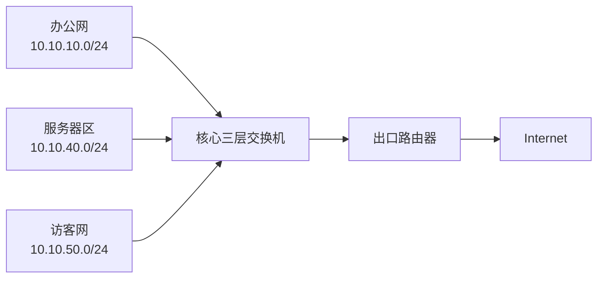

如果所有 VLAN 都在核心交换机上直接三层互通，默认情况下会出现以下风险：

| 风险 | 说明 |
| --- | --- |
| 横向访问过宽 | 办公网、访客网、服务器区可能互相访问 |
| 攻击扩散快 | 一台终端中毒后，可能扫描和攻击其他网段 |
| 服务器暴露 | 内部服务器端口被大量不必要的终端访问 |
| 无访问日志 | 很难追踪谁访问了哪个服务 |
| 无统一边界 | 安全控制分散在交换机 ACL 或主机防火墙上 |

三层交换机适合高速转发，但它不是企业安全边界的主要设备。防火墙的价值就在于把“能不能到达”变成“是否被授权到达”。

### 防火墙不是万能安全设备

防火墙能控制网络访问边界，但不能替代所有安全措施。

| 安全问题 | 防火墙能否完全解决 | 说明 |
| --- | --- | --- |
| 端口访问控制 | 能较好解决 | 通过安全策略允许或拒绝 |
| 内外网隔离 | 能较好解决 | 通过安全区域和策略控制 |
| 病毒文件进入终端 | 只能辅助 | 需要终端杀毒、邮件网关、沙箱等配合 |
| 账号密码泄露 | 不能单独解决 | 需要身份认证、多因素认证、审计 |
| 内部人员误操作 | 只能降低影响 | 需要权限管理和流程控制 |
| 应用漏洞 | 只能辅助防护 | 需要系统补丁、WAF、代码修复 |

工程上要避免两个极端：

```text
极端一：认为有防火墙就一定安全。
极端二：认为防火墙只会挡路，所以能绕就绕。
```

正确做法是把防火墙作为边界控制和审计节点，配合终端安全、账号权限、日志平台、漏洞管理共同构成安全体系。

## 14.3 防火墙、路由器、交换机的区别

很多防火墙也能配置路由、NAT、DHCP、VPN，看起来像路由器；有些防火墙也有多个二层接口，看起来像交换机。初学时要先从“主要职责”区分它们。

| 设备 | 主要关注点 | 常见工作层次 | 典型功能 |
| --- | --- | --- | --- |
| 交换机 | 同一局域网或 VLAN 内高速转发 | 二层为主，三层交换机也支持三层 | MAC 学习、VLAN、Trunk、STP、链路聚合、VLANIF |
| 路由器 | 不同网络之间选择路径 | 三层 | 路由表、静态路由、动态路由、广域网接入 |
| 防火墙 | 不同安全区域之间控制访问 | 三层到七层 | 安全策略、状态检测、NAT、VPN、日志、威胁防护 |

可以这样记：

```text
交换机解决“同一个网络里怎么快速转发”。
路由器解决“去不同网络应该走哪条路”。
防火墙解决“这条路上的访问是否被允许”。
```

### 防火墙也要查路由

防火墙不是只看安全策略。它转发一个包时，通常至少要同时满足：

1. 入接口收到包。
2. 根据目的地址查路由，确定出接口和下一跳。
3. 根据入接口和出接口确定源安全区域、目的安全区域。
4. 匹配安全策略，判断允许还是拒绝。
5. 如果需要 NAT，则执行地址转换。
6. 建立或匹配会话表。
7. 转发或丢弃。

所以防火墙排错不能只看“策略有没有放行”，也不能只看“路由有没有”。两者都必须正确。

## 14.4 防火墙部署位置

防火墙通常部署在网络边界。边界不是固定某一台设备，而是不同安全级别网络之间的交界处。

### 互联网出口防火墙

最常见的位置是内网和互联网之间：

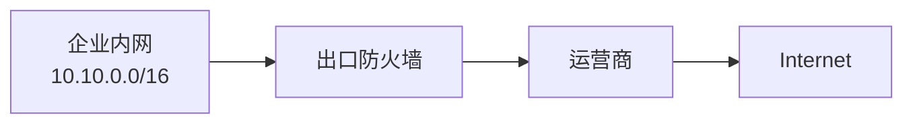

这里的防火墙负责：

- 内网访问互联网的安全策略。
- 源 NAT。
- 互联网访问 DMZ 服务器的目的 NAT。
- 出口访问日志。
- 双运营商链路控制。
- VPN 接入。

### 内部隔离防火墙

规模较大的企业会在内部不同安全区域之间部署防火墙：

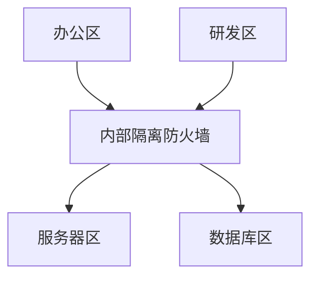

这样做的目的是防止内部网络横向扩散。即使办公终端被入侵，攻击者也不能随意访问服务器区和数据库区。

### 数据中心边界防火墙

数据中心通常有更多安全区域：

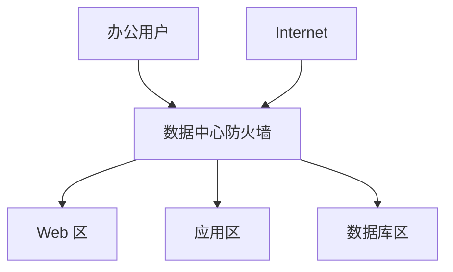

常见访问方向：

| 源 | 目的 | 是否常见 | 说明 |
| --- | --- | --- | --- |
| 办公网 | Web 区 | 常见 | 访问内部业务系统 |
| Web 区 | 应用区 | 常见 | 前端调用后端服务 |
| 应用区 | 数据库区 | 常见 | 应用访问数据库 |
| Web 区 | 数据库区 | 通常不允许 | 避免前端服务器直接访问数据库 |
| Internet | 数据库区 | 不允许 | 数据库不应直接暴露公网 |

### 总部与分支 VPN 边界

总部和分支通过 VPN 互联时，防火墙也常作为 VPN 网关：


VPN 加密解决“安全传输”，但 VPN 打通后还需要防火墙策略控制“哪些分支网段可以访问哪些总部资源”。不要把 VPN 等同于完全互信。

## 14.5 安全区域

安全区域是理解防火墙的核心概念。接口属于区域，策略通常在区域之间生效。

常见区域包括：

| 区域 | 含义 | 常见接口 |
| --- | --- | --- |
| Trust | 可信区，通常是企业内网 | 连接核心交换机的内侧接口 |
| Untrust | 非可信区，通常是互联网 | 连接运营商的外侧接口 |
| DMZ | 半可信区，放置对外服务 | 连接 Web、邮件、VPN 等服务器 |
| Guest | 访客区 | 访客无线或访客有线网络 |
| Server | 内部服务器区 | 业务服务器、数据库服务器 |
| Management | 管理区 | 运维堡垒机、网管平台 |

不同厂商的默认区域名称可能不同，但思想一致：先给接口划分安全边界，再在边界之间写访问规则。

### 接口与区域的关系

假设防火墙有四个接口：

| 防火墙接口 | IP 地址 | 连接对象 | 所属区域 |
| --- | --- | --- | --- |
| `GE0/0/0` | `10.255.0.1/30` | 核心交换机 | Trust |
| `GE0/0/1` | `203.0.113.2/30` | 运营商 | Untrust |
| `GE0/0/2` | `10.10.70.1/24` | DMZ 交换机 | DMZ |
| `GE0/0/3` | `10.10.50.1/24` | 访客无线 | Guest |

当办公网访问互联网时：

```text
源区域：Trust
目的区域：Untrust
```

当外部用户访问 DMZ Web 服务器时：

```text
源区域：Untrust
目的区域：DMZ
```

当访客无线访问内部服务器时：

```text
源区域：Guest
目的区域：Server 或 Trust
```

防火墙策略经常就是按这个方向写的。

### 区域方向很重要

安全策略是有方向的。`Trust -> Untrust` 和 `Untrust -> Trust` 不是同一件事。

| 策略方向 | 含义 | 常见处理 |
| --- | --- | --- |
| Trust -> Untrust | 内网访问互联网 | 通常允许必要业务 |
| Untrust -> Trust | 互联网访问内网 | 默认拒绝，极少直接允许 |
| Untrust -> DMZ | 互联网访问对外服务器 | 只允许发布的服务端口 |
| DMZ -> Trust | DMZ 访问内网 | 严格限制 |
| Guest -> Trust | 访客访问内网 | 通常拒绝 |
| Management -> Server | 管理区访问服务器 | 允许 SSH、RDP、监控等必要端口 |

初学者常见错误是只写了一个方向的策略，以为反方向也自动允许。状态检测可以允许同一会话的回包，但不能自动允许对方主动新建连接。这个区别非常关键。

## 14.6 安全级别与默认行为

有些厂商使用安全级别来描述区域可信程度。例如内网安全级别高，互联网安全级别低。传统思路中，高安全级别到低安全级别可能默认允许，低到高默认拒绝。

但现代企业防火墙设计更推荐显式策略：

```text
默认拒绝，按业务最小必要放行。
```

### 默认拒绝的意义

默认拒绝不是为了“什么都不让通”，而是为了让访问关系可控。

如果默认允许，新增一个网段后，它可能立刻访问很多不该访问的资源。默认拒绝则相反：新增网段默认无法访问其他区域，必须由管理员根据业务需求放行。

| 默认行为 | 优点 | 风险 |
| --- | --- | --- |
| 默认允许 | 部署初期简单，业务少受阻 | 安全边界弱，访问面不可控 |
| 默认拒绝 | 安全可控，便于审计 | 需要提前梳理业务端口 |

企业工程中常用做法：

1. 明确区域划分。
2. 所有区域之间默认拒绝。
3. 按业务流向逐条放行。
4. 对拒绝流量记录日志。
5. 定期复核策略是否仍然需要。

## 14.7 状态检测防火墙

现代企业防火墙通常是状态检测防火墙。状态检测的关键是“会话表”。

### 什么是会话

会话是防火墙记录的一条通信状态。以办公 PC 访问 Web 服务器为例：

```text
PC：10.10.10.25:51520
服务器：93.184.216.34:443
协议：TCP
方向：Trust -> Untrust
```

防火墙允许这个访问后，会在会话表中记录：

| 字段 | 示例 |
| --- | --- |
| 源地址 | `10.10.10.25` |
| 源端口 | `51520` |
| 目的地址 | `93.184.216.34` |
| 目的端口 | `443` |
| 协议 | TCP |
| 源区域 | Trust |
| 目的区域 | Untrust |
| NAT 后地址 | `203.0.113.2:30001` |
| 状态 | Established |
| 超时时间 | 例如 1800 秒 |

当服务器回包时，防火墙不是重新按 `Untrust -> Trust` 策略放行，而是先查会话表。只要回包属于已建立会话，防火墙就允许通过。

### 状态检测的流程

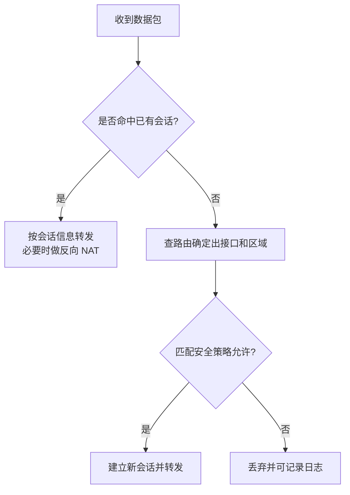

这解释了一个重要现象：

```text
内网主动访问互联网，只需要放行 Trust -> Untrust。
互联网服务器的回包不需要额外写 Untrust -> Trust 策略。
```

但是，如果互联网主机主动访问内网服务器，那是一个新的连接，不属于内网发起的会话，必须有明确的 `Untrust -> DMZ` 或 `Untrust -> Trust` 策略。

### TCP、UDP、ICMP 的状态

不同协议的“状态”表现不一样。

| 协议 | 是否有连接过程 | 防火墙如何判断 |
| --- | --- | --- |
| TCP | 有三次握手和四次挥手 | 根据 SYN、ACK、FIN、RST 等标志跟踪状态 |
| UDP | 无连接 | 根据五元组和超时时间维护伪会话 |
| ICMP | 无端口 | 根据类型、代码、标识符和超时时间维护状态 |

UDP 没有真正的连接，但防火墙仍会创建会话。例如 DNS 查询：

```text
10.10.10.25:53000 -> 114.114.114.114:53 UDP
```

防火墙允许后，会在短时间内允许 DNS 服务器的 UDP 回包回来。如果超时后才回来，可能被丢弃。

### 会话表满的影响

防火墙会话表容量有限。会话表满时，已有连接可能还能继续，但新连接会失败。

常见原因：

- 内网终端数量过多。
- P2P、下载软件产生大量连接。
- 病毒或扫描流量快速创建连接。
- 会话超时时间过长。
- 设备型号性能不足。

常见现象：

| 现象 | 说明 |
| --- | --- |
| 部分网页打不开 | 新建连接失败 |
| 已打开的远程桌面还能用 | 旧会话仍存在 |
| 防火墙 CPU 或内存高 | 设备资源紧张 |
| 日志提示 session limit | 会话达到上限 |

排查时要查看会话数、每个源 IP 的会话数量、异常目的端口和会话增长速度。

## 14.8 五元组与策略匹配

防火墙识别一条流量，最基础的信息是五元组：

```text
源 IP、目的 IP、源端口、目的端口、协议
```

再结合接口、区域、用户、应用、时间段等条件，形成安全策略匹配。

### 五元组示例

办公 PC 访问内部 Web 系统：

```text
源 IP：10.10.10.25
源端口：51520
目的 IP：10.10.40.20
目的端口：443
协议：TCP
```

对应业务含义：

| 字段 | 含义 |
| --- | --- |
| 源 IP | 谁发起访问 |
| 目的 IP | 访问哪个目标 |
| 源端口 | 客户端临时端口，通常不固定 |
| 目的端口 | 服务端口，表示访问什么业务 |
| 协议 | TCP、UDP、ICMP 等 |

写防火墙策略时，通常不限制源端口，因为客户端源端口会随机变化。重点限制源地址、目的地址、目的端口和协议。

### 策略匹配顺序

防火墙策略通常从上到下匹配。命中第一条符合条件的策略后，就按该策略动作处理，不再继续向下匹配。

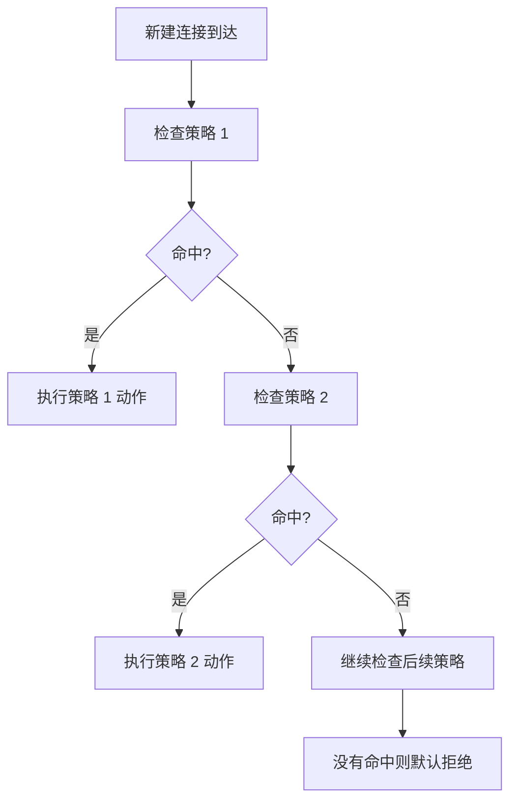

所以策略顺序非常重要。更精确、更特殊的策略应放在更通用的策略前面。

### 策略动作

常见动作：

| 动作 | 含义 | 适用场景 |
| --- | --- | --- |
| Permit / Allow | 允许通过 | 正常业务访问 |
| Deny / Drop | 丢弃 | 阻断不允许访问 |
| Reject | 拒绝并返回响应 | 某些内部策略，希望客户端快速失败 |
| Log | 记录日志 | 审计和排错 |
| UTM / IPS | 允许同时做安全检测 | 互联网出口、服务器发布 |

Drop 和 Reject 的区别：

| 动作 | 对客户端表现 | 优点 | 缺点 |
| --- | --- | --- | --- |
| Drop | 像没有回应，等待超时 | 隐藏边界，减少暴露 | 排错时等待时间长 |
| Reject | 立即收到拒绝响应 | 客户端快速失败，便于排错 | 暴露设备存在 |

企业边界对公网访问常用 Drop；内部访问控制中有时使用 Reject，让业务或用户更快发现访问被拒。

## 14.9 安全策略的组成

一条基础安全策略通常包含以下元素：

| 元素 | 说明 | 示例 |
| --- | --- | --- |
| 策略名称 | 便于识别 | `allow-office-to-internet` |
| 源区域 | 流量从哪个区域来 | Trust |
| 目的区域 | 流量去哪个区域 | Untrust |
| 源地址 | 哪些源网段 | `10.10.10.0/24` |
| 目的地址 | 哪些目的地址 | Any 或服务器 IP |
| 服务 | 协议和端口 | HTTP、HTTPS、DNS |
| 用户 | 哪些用户或用户组 | 可选 |
| 时间 | 何时生效 | 可选 |
| 动作 | 允许或拒绝 | Permit |
| 日志 | 是否记录 | 开启或关闭 |

### 示例一：办公网访问互联网

需求：

```text
办公网 10.10.10.0/24 可以访问互联网的 DNS、HTTP、HTTPS。
```

策略思路：

| 字段 | 值 |
| --- | --- |
| 名称 | `allow-office-internet-basic` |
| 源区域 | Trust |
| 目的区域 | Untrust |
| 源地址 | `10.10.10.0/24` |
| 目的地址 | Any |
| 服务 | DNS、HTTP、HTTPS |
| 动作 | Permit |
| 日志 | 开启会话结束日志 |

注意，这条策略允许的是办公网主动访问互联网。互联网主机不能因为这条策略主动访问办公网。

### 示例二：访客网只允许上网

需求：

```text
访客网 10.10.50.0/24 只能访问互联网，不能访问企业内网。
```

策略设计：

| 顺序 | 源区域 | 目的区域 | 源地址 | 目的地址 | 服务 | 动作 |
| ---: | --- | --- | --- | --- | --- | --- |
| 1 | Guest | Trust/Server/Management/DMZ | `10.10.50.0/24` | `10.10.0.0/16` | Any | Deny |
| 2 | Guest | Untrust | `10.10.50.0/24` | Any | DNS、HTTP、HTTPS | Permit |
| 3 | Guest | Any | `10.10.50.0/24` | Any | Any | Deny |

第一条先明确拒绝访客访问企业内网。第二条允许访客上网。第三条兜底拒绝其他未知访问。

### 示例三：互联网访问 DMZ Web 服务器

需求：

```text
外部用户可以访问企业官网。
公网地址：203.0.113.10
DMZ Web 服务器：10.10.70.20
服务端口：TCP 443
```

防火墙上通常需要两类配置：

| 配置 | 作用 |
| --- | --- |
| 目的 NAT | 把 `203.0.113.10:443` 转换为 `10.10.70.20:443` |
| 安全策略 | 允许 `Untrust -> DMZ` 的 TCP 443 访问 |

本章重点看安全策略：

| 字段 | 值 |
| --- | --- |
| 源区域 | Untrust |
| 目的区域 | DMZ |
| 源地址 | Any |
| 目的地址 | `10.10.70.20` 或公网映射对象，取决于厂商处理顺序 |
| 服务 | HTTPS |
| 动作 | Permit |
| 日志 | 开启 |

不同厂商在策略中匹配 NAT 前地址还是 NAT 后地址可能不同。实际配置时必须查清设备逻辑，不能机械照搬。

### 示例四：运维区管理服务器

需求：

```text
堡垒机 10.10.60.10 可以 SSH 管理 Linux 服务器 10.10.40.0/24。
普通办公终端不能直接 SSH 到服务器。
```

策略设计：

| 顺序 | 源区域 | 目的区域 | 源地址 | 目的地址 | 服务 | 动作 |
| ---: | --- | --- | --- | --- | --- | --- |
| 1 | Management | Server | `10.10.60.10` | `10.10.40.0/24` | SSH | Permit |
| 2 | Trust | Server | `10.10.10.0/24` | `10.10.40.0/24` | SSH | Deny |
| 3 | Trust | Server | `10.10.10.0/24` | `10.10.40.20` | HTTPS | Permit |

这样普通办公终端可以访问业务系统 HTTPS，但不能直接登录服务器操作系统。

## 14.10 路由、策略、NAT、会话的关系

防火墙转发不是单点判断，而是一组逻辑共同完成。

```text
路由决定去哪里。
策略决定能不能去。
NAT 决定地址是否要改写。
会话决定后续包是否属于已允许连接。
```

### 转发路径示例

办公 PC `10.10.10.25` 访问互联网 `8.8.8.8`：

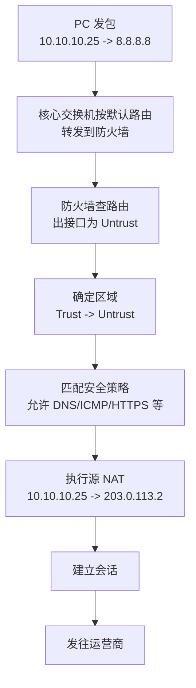

回包过程：

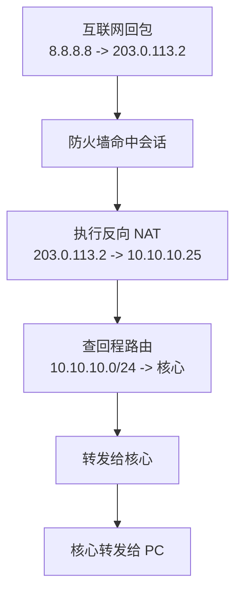

### 常见误区

| 误区 | 正确认识 |
| --- | --- |
| 策略允许就一定通 | 还需要路由、NAT、回程、会话资源正常 |
| 路由可达就一定通 | 防火墙可能因策略拒绝 |
| NAT 配了就一定能上网 | NAT 匹配范围、出接口、策略也要正确 |
| 回包也要写反向允许策略 | 同一会话回包由会话表允许，不是新建连接 |
| ping 通就说明业务通 | ICMP 通不代表 TCP 443、数据库端口也通 |

## 14.11 防火墙工作模式

防火墙常见工作模式有三种：路由模式、透明模式、混合模式。

### 路由模式

路由模式下，防火墙接口配置三层 IP 地址，不同接口属于不同网段，防火墙像一台三层设备一样参与路由。

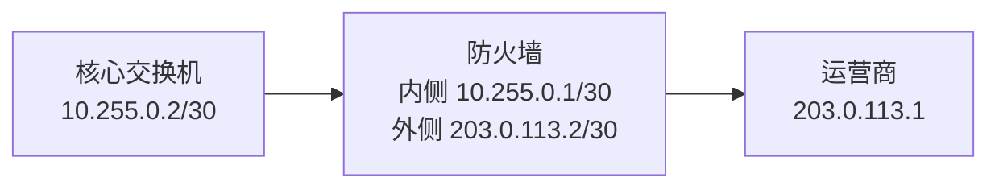

特点：

| 项目 | 说明 |
| --- | --- |
| 接口地址 | 每个三层接口有 IP |
| 路由 | 防火墙维护路由表 |
| NAT | 常见，尤其是出口防火墙 |
| 部署改动 | 需要调整网络路由 |
| 适用场景 | 互联网出口、数据中心边界、分支出口 |

大多数企业出口防火墙使用路由模式。

### 透明模式

透明模式下，防火墙像一台二层网桥插在链路中，通常不改变现有三层网关和路由。


特点：

| 项目 | 说明 |
| --- | --- |
| 接口地址 | 转发接口通常不作为三层网关 |
| 路由改动 | 较少 |
| 部署方式 | 串接在现有链路中 |
| 优点 | 对现网改动小 |
| 风险 | 二层环路、VLAN 透传、排错更隐蔽 |

透明模式适合在不方便改 IP 和路由的现网中插入安全控制，但初学阶段建议先掌握路由模式，因为它最常见、逻辑最清晰。

### 混合模式

有些防火墙同时支持部分接口三层路由、部分接口二层透明。这叫混合模式。

混合模式灵活，但设计和排错复杂。工程中要清楚标注每个接口的模式、所属区域、VLAN 和路由关系，避免把二层问题和三层问题混在一起。

## 14.12 DMZ 的作用

DMZ 是 Demilitarized Zone，常翻译为非军事区或隔离区。在企业网络中，DMZ 用来放置需要被外部访问、但又不应该直接放进内网的服务器。

### 为什么需要 DMZ

假设企业官网服务器必须被互联网访问。如果把它直接放在内网 Trust 区，一旦 Web 服务器被攻击者攻陷，攻击者就可能从这台服务器继续访问办公网、数据库或管理网。

把 Web 服务器放在 DMZ 后：

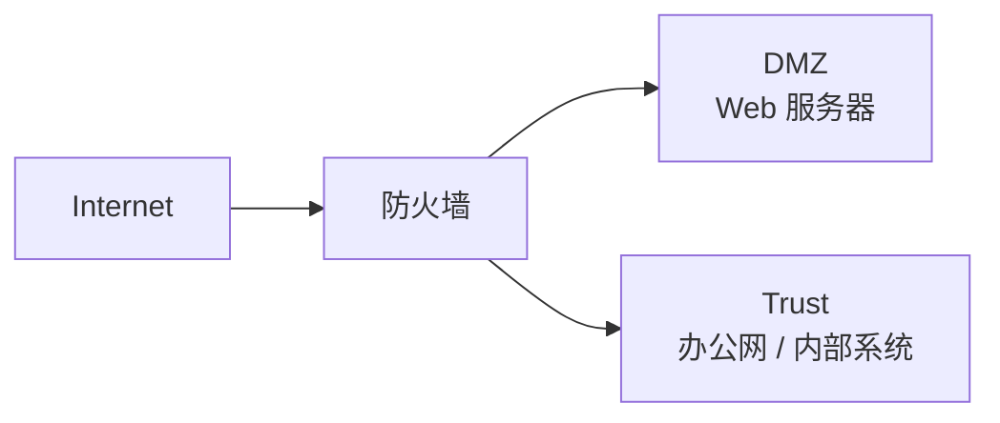

防火墙可以分别控制：

- Internet -> DMZ：只允许 HTTPS 到 Web 服务器。
- DMZ -> Trust：默认拒绝，只允许极少必要访问。
- Trust -> DMZ：允许运维或内部用户访问必要服务。

这样即使 DMZ 服务器出问题，也不会自动获得访问内网的权限。

### DMZ 常见服务器

| 服务器 | 是否适合 DMZ | 说明 |
| --- | --- | --- |
| 企业官网 Web | 适合 | 需要公网访问 |
| 邮件网关 | 适合 | 需要与互联网邮件服务器通信 |
| VPN 网关 | 适合或直接在防火墙上 | 远程接入边界 |
| 反向代理 | 适合 | 代理外部访问内部业务 |
| 数据库 | 通常不适合 | 不应直接暴露给公网 |
| 域控 | 不适合 | 属于高敏感内部基础服务 |

### DMZ 访问原则

```text
公网到 DMZ：只开放发布服务端口。
DMZ 到内网：默认拒绝，按业务最小放行。
内网到 DMZ：按运维和业务需要放行。
DMZ 服务器自身：及时加固、补丁、日志和备份。
```

DMZ 不是“随便放外部服务的地方”，而是一个受限、可审计、可隔离的缓冲区域。

## 14.13 企业区域规划示例

下面设计一个中型企业的基础安全区域。

### 业务需求

| 区域 | 网段 | 需求 |
| --- | --- | --- |
| 办公网 Trust | `10.10.10.0/24` | 上网、访问内部业务系统 |
| 研发网 Dev | `10.10.20.0/24` | 上网、访问代码仓库和测试服务器 |
| 服务器区 Server | `10.10.40.0/24` | 提供内部业务系统 |
| 访客网 Guest | `10.10.50.0/24` | 只允许上网 |
| 管理区 Management | `10.10.60.0/24` | 管理网络设备和服务器 |
| DMZ | `10.10.70.0/24` | 发布企业官网 |
| 互联网 Untrust | 公网 | 外部访问和上网出口 |

### 拓扑

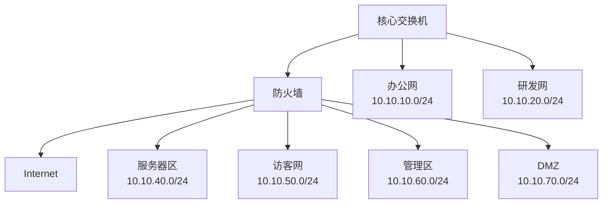

这个示例中，办公网和研发网可以在核心交换机后面，再通过一条三层链路进入防火墙；服务器区、访客区、管理区和 DMZ 直接挂在防火墙不同接口或子接口上。真实工程也可以让所有 VLAN 都先到核心，再通过 VRF、子接口或安全设备引流到防火墙。

### 区域访问矩阵

访问矩阵比单条策略更适合做设计沟通。

| 源区域 | 目的区域 | 是否允许 | 服务 | 说明 |
| --- | --- | --- | --- | --- |
| Trust | Untrust | 允许 | DNS、HTTP、HTTPS | 办公网正常上网 |
| Dev | Untrust | 允许 | DNS、HTTP、HTTPS、Git | 研发访问互联网开发资源 |
| Guest | Untrust | 允许 | DNS、HTTP、HTTPS | 访客上网 |
| Guest | Trust/Server/Mgmt | 拒绝 | Any | 访客隔离 |
| Trust | Server | 允许 | HTTPS | 办公网访问业务系统 |
| Dev | Server | 允许 | HTTPS、SSH 到测试服务器 | 研发访问测试资源 |
| Management | Server | 允许 | SSH、RDP、SNMP、ICMP | 运维管理 |
| Trust | Management | 拒绝 | Any | 普通办公不管理设备 |
| Untrust | DMZ | 允许 | HTTPS | 外部访问官网 |
| DMZ | Server | 拒绝或最小放行 | 按业务 | 防止 DMZ 横向进入内网 |
| Server | Untrust | 允许 | 系统更新、DNS、NTP | 服务器必要外联 |

### 策略顺序建议

按最小权限设计时，可以遵循：

1. 先写明确拒绝的高风险访问，例如 Guest -> Trust。
2. 再写具体业务允许策略，例如 Trust -> Server HTTPS。
3. 再写互联网访问策略，例如 Trust -> Untrust HTTP/HTTPS。
4. 最后保留默认拒绝，并开启日志。

不要一开始就写一条大范围 `Any -> Any Permit`。这种策略能让业务快速通，但会让防火墙失去边界控制意义。

## 14.14 基础策略设计案例

### 场景描述

某企业部署一台出口防火墙，承担内网到互联网访问、DMZ 服务器发布和访客网隔离。

地址规划：

| 对象 | 地址 |
| --- | --- |
| 办公网 VLAN 10 | `10.10.10.0/24`，网关 `10.10.10.1` |
| 研发网 VLAN 20 | `10.10.20.0/24`，网关 `10.10.20.1` |
| 服务器区 VLAN 40 | `10.10.40.0/24`，网关 `10.10.40.1` |
| 访客网 VLAN 50 | `10.10.50.0/24`，网关 `10.10.50.1` |
| 管理区 VLAN 60 | `10.10.60.0/24`，网关 `10.10.60.1` |
| DMZ VLAN 70 | `10.10.70.0/24`，网关 `10.10.70.1` |
| 官网服务器 | `10.10.70.20` |
| 堡垒机 | `10.10.60.10` |
| 核心到防火墙 | 核心 `10.255.0.2/30`，防火墙 `10.255.0.1/30` |
| 防火墙外侧 | `203.0.113.2/30`，运营商下一跳 `203.0.113.1` |
| 官网公网地址 | `203.0.113.10` |

### 路由设计

| 设备 | 路由 | 说明 |
| --- | --- | --- |
| 核心交换机 | `0.0.0.0/0 -> 10.255.0.1` | 内网未知目的交给防火墙 |
| 防火墙 | `10.10.0.0/16 -> 10.255.0.2` | 内网回程指向核心 |
| 防火墙 | `0.0.0.0/0 -> 203.0.113.1` | 互联网默认路由 |

如果服务器区、访客区、管理区、DMZ 的网关都在防火墙上，则这些网段对防火墙是直连，不需要回程路由指向核心。这里要根据实际网关位置调整。

### 安全策略设计

| 顺序 | 名称 | 源区域 | 目的区域 | 源地址 | 目的地址 | 服务 | 动作 | 日志 |
| ---: | --- | --- | --- | --- | --- | --- | --- | --- |
| 1 | `deny-guest-to-internal` | Guest | Trust/Server/Management/DMZ | `10.10.50.0/24` | `10.10.0.0/16` | Any | Deny | 开启 |
| 2 | `allow-guest-internet` | Guest | Untrust | `10.10.50.0/24` | Any | DNS、HTTP、HTTPS | Permit | 开启 |
| 3 | `allow-office-internet` | Trust | Untrust | `10.10.10.0/24` | Any | DNS、HTTP、HTTPS | Permit | 开启 |
| 4 | `allow-dev-internet` | Dev | Untrust | `10.10.20.0/24` | Any | DNS、HTTP、HTTPS、Git | Permit | 开启 |
| 5 | `allow-office-webapp` | Trust | Server | `10.10.10.0/24` | `10.10.40.20` | HTTPS | Permit | 开启 |
| 6 | `allow-bastion-admin` | Management | Server/DMZ | `10.10.60.10` | `10.10.40.0/24`、`10.10.70.0/24` | SSH、RDP、ICMP | Permit | 开启 |
| 7 | `allow-internet-dmz-web` | Untrust | DMZ | Any | `10.10.70.20` | HTTPS | Permit | 开启 |
| 8 | `deny-dmz-to-trust` | DMZ | Trust/Server/Management | `10.10.70.0/24` | `10.10.0.0/16` | Any | Deny | 开启 |
| 9 | `default-deny` | Any | Any | Any | Any | Any | Deny | 开启 |

这张表是设计逻辑，不是某个厂商的直接命令。实际设备可能需要拆分多条策略，因为有些设备不允许一条策略同时写多个目的区域，或者对象组语法不同。

### NAT 设计衔接

本章不深入 NAT 配置，但防火墙策略经常与 NAT 同时出现。

| 场景 | NAT 类型 | 说明 |
| --- | --- | --- |
| 内网上网 | 源 NAT | `10.10.0.0/16` 转换为公网出口地址 |
| 访客上网 | 源 NAT | `10.10.50.0/24` 转换为公网出口地址 |
| 官网发布 | 目的 NAT | `203.0.113.10:443` 映射到 `10.10.70.20:443` |

排错时要同时检查安全策略和 NAT。策略允许但 NAT 缺失，内网上网可能仍然失败；NAT 配了但策略拒绝，流量也不会通过。

## 14.15 日志与审计

防火墙不仅要拦截，还要记录。没有日志，很多故障和安全事件只能靠猜。

### 常见日志类型

| 日志类型 | 说明 | 用途 |
| --- | --- | --- |
| 流量日志 | 记录允许或拒绝的访问 | 排错和审计 |
| 威胁日志 | IPS、病毒、恶意 URL 等检测结果 | 安全分析 |
| NAT 日志 | 地址转换记录 | 追踪公网访问来源 |
| VPN 日志 | 隧道建立、断开、认证失败 | VPN 排错 |
| 系统日志 | 接口、路由、HA、资源状态 | 设备运维 |
| 管理日志 | 管理员登录和配置变更 | 责任追踪 |

### 流量日志应关注什么

排查一条访问时，日志里至少要看：

| 字段 | 说明 |
| --- | --- |
| 时间 | 访问发生在什么时候 |
| 源地址 | 哪台主机发起 |
| 目的地址 | 访问哪个目标 |
| 协议和端口 | 访问什么服务 |
| 源区域和目的区域 | 经过哪个安全边界 |
| 命中策略 | 被哪条策略处理 |
| 动作 | 允许、拒绝、重置 |
| NAT 前后地址 | 是否正确转换 |
| 会话结束原因 | 正常结束、超时、被重置 |

### 开启日志的取舍

不是所有策略都要记录每个包。日志过多会占用存储和影响分析效率。

建议：

| 策略类型 | 日志建议 |
| --- | --- |
| 默认拒绝策略 | 开启，用于发现被拦截访问 |
| 服务器发布策略 | 开启，用于审计公网访问 |
| 管理访问策略 | 开启，用于追踪运维行为 |
| 普通上网策略 | 可记录会话结束日志，不必记录每个包 |
| 高频内部业务 | 根据审计需求选择，避免日志爆量 |

日志要能被查询和保留。企业中通常会把防火墙日志发送到日志平台、堡垒机、SOC 或 SIEM 系统，便于集中分析。

## 14.16 防火墙高可用基础

防火墙通常位于关键路径。单台防火墙故障可能导致内外网全部中断，所以企业出口常部署双机高可用。

### 主备模式

主备模式下，两台防火墙一台工作，一台待命。

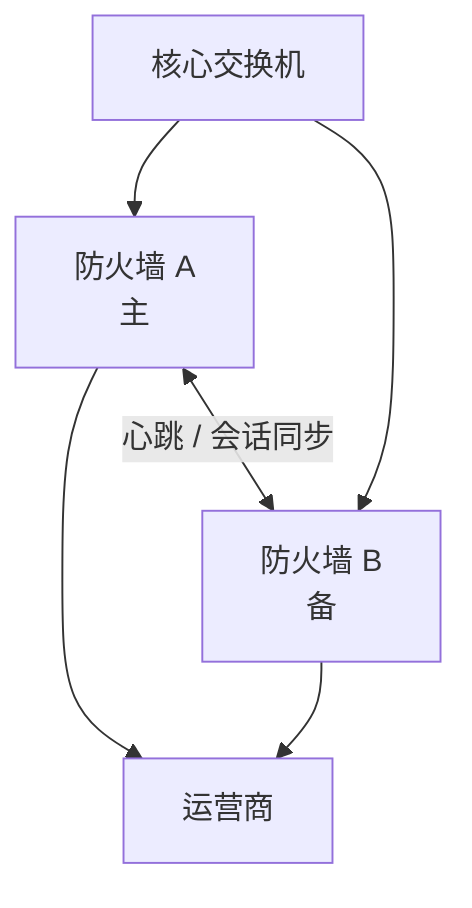

正常情况下主防火墙处理流量，并把会话同步给备防火墙。主设备故障后，备设备接管虚拟 IP、路由或接口状态，继续转发。

### 高可用要同步什么

| 内容 | 是否需要同步 | 说明 |
| --- | --- | --- |
| 安全策略 | 需要 | 两台设备策略必须一致 |
| NAT 规则 | 需要 | 否则切换后上网或服务器发布异常 |
| 路由 | 需要 | 主备设备转发路径一致 |
| 会话表 | 建议同步 | 保证切换时已有业务不中断或少中断 |
| 证书和 VPN 配置 | 需要 | 远程接入和站点 VPN 依赖 |
| 日志 | 不一定实时同步 | 通常统一发送到日志平台 |

### 主备切换常见问题

| 现象 | 可能原因 |
| --- | --- |
| 切换后所有业务不通 | 虚拟 IP 未漂移、路由未切换、接口未接入 |
| 切换后新连接通，旧连接断 | 会话未同步 |
| 只有部分业务不通 | 备机策略、NAT、对象不同步 |
| 切换频繁 | 心跳链路不稳定或链路检测条件过严 |
| 出口切换后公网服务异常 | 公网地址、ARP、运营商路由或 NAT 未正确接管 |

防火墙高可用不是只把两台设备插上线。它涉及接口连接、心跳链路、配置同步、会话同步、路由联动和切换测试。

## 14.17 验证方法

防火墙排错要按顺序缩小边界。不要一开始就盯着策略，也不要只在终端上反复 ping。

### 第一步：确认物理和接口

检查：

```text
接口是否 up
接口 IP 是否正确
接口是否加入正确安全区域
接口速率和双工是否正常
是否有错误包、丢包、CRC
```

如果接口没有加入正确区域，策略方向会完全错误。例如内侧接口误加入 Untrust，内网访问互联网就不再是 `Trust -> Untrust`，原策略不会命中。

### 第二步：确认路由

检查防火墙是否知道目的网络和回程网络。

```text
防火墙到互联网：是否有 0.0.0.0/0 指向运营商
防火墙到内网：是否有 10.10.0.0/16 指向核心
防火墙到 DMZ：是否为直连或有正确路由
核心到防火墙：是否有默认路由指向防火墙
```

很多“防火墙策略问题”本质是路由问题。

### 第三步：确认安全策略命中

用测试流量触发策略，然后查看命中计数或日志。

关注：

| 检查项 | 说明 |
| --- | --- |
| 源区域是否正确 | 由入接口决定 |
| 目的区域是否正确 | 通常由路由出接口决定 |
| 源地址对象是否包含测试主机 | 新网段经常漏加 |
| 目的地址对象是否正确 | NAT 前后地址要看厂商逻辑 |
| 服务端口是否正确 | HTTPS 是 TCP 443，不是 HTTP 80 |
| 策略顺序是否正确 | 是否被上方拒绝策略先命中 |

### 第四步：确认 NAT

对于上网和服务器发布，检查 NAT：

```text
内网上网：源地址是否转换为正确公网地址
公网访问服务器：目的地址是否转换为内部服务器地址
双出口：NAT 地址是否与出接口匹配
新增网段：是否加入 NAT 匹配范围
```

### 第五步：查看会话表

会话表能告诉你防火墙是否认为这条连接存在。

排查时可以按源和目的过滤：

```text
源地址：10.10.10.25
目的地址：8.8.8.8
协议：ICMP 或 TCP/443
```

如果没有会话，说明新建连接没有通过策略或没有到达防火墙。如果有会话但业务不通，要看会话方向、NAT 后地址、回包计数和结束原因。

### 第六步：抓包或流量诊断

当路由、策略、NAT、会话都看起来正常，但业务仍不通，可以在防火墙入接口和出接口抓包。

抓包要回答三个问题：

```text
包有没有到达防火墙？
包有没有从正确出接口出去？
回包有没有回来？
```

如果包到达但没有出去，问题在防火墙内部处理；如果包出去但没有回来，问题可能在对端、运营商、回程路由或目的服务器。

## 14.18 常见故障与排查

### 故障一：内网不能上网

现象：

```text
终端能 ping 网关，但不能访问互联网。
```

排查顺序：

| 步骤 | 检查项 | 判断 |
| ---: | --- | --- |
| 1 | 终端网关 | 网关不通则先查 VLAN 和网关 |
| 2 | 核心默认路由 | 是否指向防火墙 |
| 3 | 防火墙内侧接口 | 是否 up，是否在 Trust |
| 4 | 防火墙默认路由 | 是否指向运营商 |
| 5 | 安全策略 | Trust -> Untrust 是否允许 |
| 6 | 源 NAT | 内网地址是否转换 |
| 7 | 会话和日志 | 是否命中策略、是否被拒绝 |
| 8 | DNS | 能访问 IP 不能访问域名时重点检查 |

典型原因：

- 新增 VLAN 没有加入 NAT 地址对象。
- 新增 VLAN 没有加入安全策略源地址对象。
- 核心交换机缺默认路由。
- 防火墙缺回程路由。
- DNS 被策略阻断，只放行了 HTTP/HTTPS。

### 故障二：部分服务器访问不通

现象：

```text
办公网能访问服务器 A，但不能访问服务器 B。
```

可能原因：

| 原因 | 说明 |
| --- | --- |
| 策略目的地址漏加 | 只允许了服务器 A |
| 服务端口不一致 | B 使用 8443、8080 或其他端口 |
| 服务器网关错误 | 回包没有经过防火墙 |
| 主机防火墙阻断 | 网络策略允许，但服务器本机拒绝 |
| 路由不对称 | 去程经过防火墙，回程绕过防火墙 |

排查时不要只看防火墙。如果防火墙显示流量已允许并发出，但服务器没有回应，要继续查服务器网关、本机防火墙和应用监听端口。

### 故障三：公网访问 DMZ 服务器失败

排查点：

| 检查项 | 说明 |
| --- | --- |
| 公网地址是否正确 | DNS 解析是否指向正确公网 IP |
| 目的 NAT 是否正确 | 公网 IP 和端口是否映射到内部服务器 |
| 安全策略是否允许 | Untrust -> DMZ 的目标和端口是否正确 |
| 服务器网关是否指向防火墙 | 回包必须回到防火墙做反向 NAT |
| 运营商是否放行端口 | 某些线路可能限制入站端口 |
| 服务器服务是否监听 | 服务器本机是否真的开放 TCP 443 |

典型路径：

```text
外部用户 -> 运营商 -> 防火墙公网接口 -> DNAT -> DMZ 服务器 -> 防火墙 -> 外部用户
```

任何一段错误都会导致访问失败。

### 故障四：策略已经允许，但访问仍然不通

常见原因：

- 流量没有命中你以为的那条策略。
- 上方有更早的拒绝策略先命中。
- 目的区域判断错误，因为路由出接口不对。
- NAT 前后地址与策略匹配对象不一致。
- 回程路由缺失。
- 对端服务器或主机防火墙拒绝。
- 会话表满或设备资源异常。

排查方法：

```text
查看策略命中计数
按源和目的查日志
按源和目的查会话
抓入接口和出接口包
确认服务器是否收到请求
```

### 故障五：回包被防火墙丢弃

状态检测要求回包必须匹配已有会话。以下情况会导致回包不匹配：

| 原因 | 说明 |
| --- | --- |
| 路由不对称 | 去程经过防火墙 A，回程经过防火墙 B 或绕过防火墙 |
| NAT 不一致 | 去程转换地址与回程目的不匹配 |
| 会话超时 | 回包太晚，原会话已删除 |
| 双机切换未同步会话 | 备机没有原会话记录 |
| 中间设备改写报文 | 五元组变化导致不匹配 |

这类问题常表现为：客户端发起连接，服务器也回包了，但防火墙认为回包是“无状态包”或“非法包”，于是丢弃。

### 故障六：新增网段后业务异常

新增 VLAN 或分支网段后，经常出现“老网段正常，新网段不通”。

检查清单：

```text
核心是否有新 VLAN 网关
核心到防火墙是否有路由
防火墙回程路由是否覆盖新网段
安全策略源地址对象是否包含新网段
NAT 源地址对象是否包含新网段
日志平台和地址对象命名是否更新
DNS、DHCP、网关是否正确
```

新增网段不是只在交换机上创建 VLAN。只要流量经过防火墙，就要同步更新防火墙对象、策略、NAT 和监控。

## 14.19 防火墙设计清单

规划防火墙时，至少要回答以下问题：

| 问题 | 说明 |
| --- | --- |
| 防火墙部署在哪里 | 出口、内部隔离、数据中心、分支还是 VPN 边界 |
| 使用什么模式 | 路由模式、透明模式还是混合模式 |
| 有哪些安全区域 | Trust、Untrust、DMZ、Guest、Server、Management 等 |
| 每个接口属于哪个区域 | 接口、IP、VLAN、区域必须对应清楚 |
| 网关在哪里 | 网关在核心交换机还是防火墙 |
| 路由如何设计 | 默认路由、回程路由、动态路由 |
| 哪些区域需要互通 | 用访问矩阵描述 |
| 每条业务需要什么端口 | 不要只写 Any |
| 是否需要 NAT | 上网源 NAT、服务器发布目的 NAT |
| 是否需要日志 | 哪些策略记录，日志保留多久 |
| 是否需要高可用 | 主备、会话同步、链路检测 |
| 如何管理设备 | 管理区、堡垒机、管理员权限 |
| 如何验证上线 | 测试用例、回退方案、监控告警 |

安全策略规划建议使用表格，而不是直接上设备边想边配。先有访问矩阵，再落地为策略，后期维护会清晰很多。

## 14.20 本章自检

请尝试回答：

- 防火墙和路由器的核心区别是什么。
- 什么是安全区域，接口和区域是什么关系。
- 为什么 `Trust -> Untrust` 策略不能代表 `Untrust -> Trust` 也允许。
- 状态检测防火墙为什么能自动允许同一会话的回包。
- 五元组包含哪些字段。
- 为什么策略顺序会影响最终结果。
- DMZ 的作用是什么，为什么数据库通常不应该放在 DMZ。
- 策略允许但业务不通时，还要检查哪些内容。
- 新增一个 VLAN 后，防火墙上通常要同步更新哪些配置。

练习：

```text
企业网络信息：
- 办公网：10.10.10.0/24
- 研发网：10.10.20.0/24
- 服务器区：10.10.40.0/24
- 访客网：10.10.50.0/24
- 管理区：10.10.60.0/24
- DMZ：10.10.70.0/24
- 官网服务器：10.10.70.20，服务 TCP 443
- 堡垒机：10.10.60.10
```

1. 设计访客网只允许上网、不能访问内网的策略。
2. 设计办公网只允许访问服务器区 `10.10.40.20` 的 HTTPS 策略。
3. 设计堡垒机 SSH 管理服务器区的策略。
4. 设计互联网访问 DMZ 官网服务器的策略。
5. 如果办公网访问服务器区不通，列出至少 6 个排查点。
6. 如果公网访问官网失败，说明安全策略、NAT、服务器网关各自可能出现什么问题。

参考思路：

1. 访客网先拒绝 `Guest -> Trust/Server/Management/DMZ`，再允许 `Guest -> Untrust` 的 DNS、HTTP、HTTPS。
2. 办公网到服务器区只允许源 `10.10.10.0/24`、目的 `10.10.40.20`、服务 TCP 443。
3. 管理区到服务器区只允许源 `10.10.60.10`、目的 `10.10.40.0/24`、服务 SSH。
4. 互联网到 DMZ 需要目的 NAT，并允许 `Untrust -> DMZ` 的 TCP 443。
5. 排查接口区域、路由、策略命中、策略顺序、服务端口、会话、服务器网关、主机防火墙。
6. 策略可能未允许 `Untrust -> DMZ`，NAT 可能未把公网地址映射到 `10.10.70.20`，服务器网关如果不指向防火墙会导致回包无法反向 NAT。

## 14.21 本章小结

防火墙是企业网络中的安全边界设备。它不是单纯“拦截流量”的盒子，而是把路由、区域、策略、NAT、会话和日志组合起来，对不同安全区域之间的访问做可控转发。

本章的核心要点：

```text
安全区域决定策略方向。
接口必须放入正确区域。
路由决定目的区域和出接口。
安全策略决定新建连接是否允许。
状态检测通过会话表允许合法回包。
NAT 和策略经常同时影响访问结果。
DMZ 用来隔离需要对外发布的服务器。
防火墙排错要按接口 -> 路由 -> 策略 -> NAT -> 会话 -> 日志逐层验证。
```

下一章将进入防火墙基础配置，把本章的概念落到具体对象、区域、接口、策略和验证命令上。
