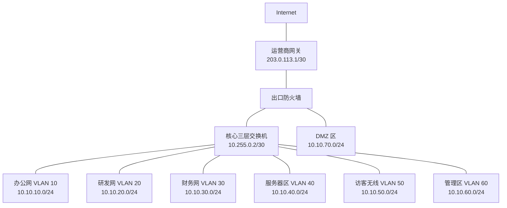
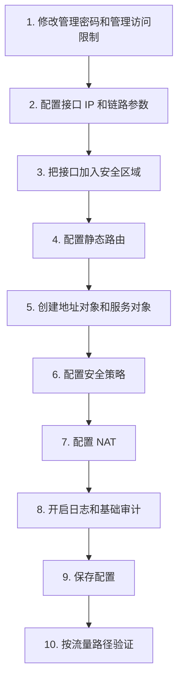
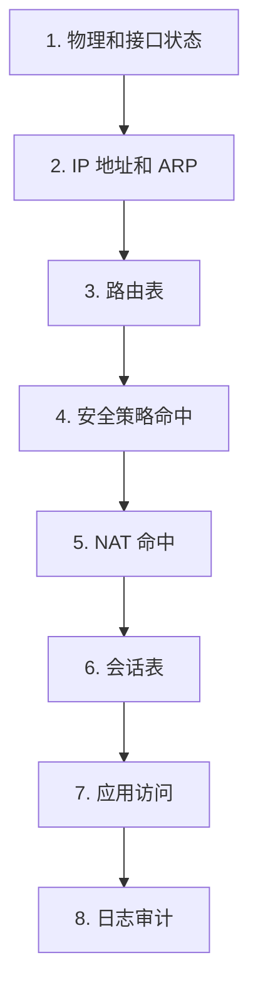
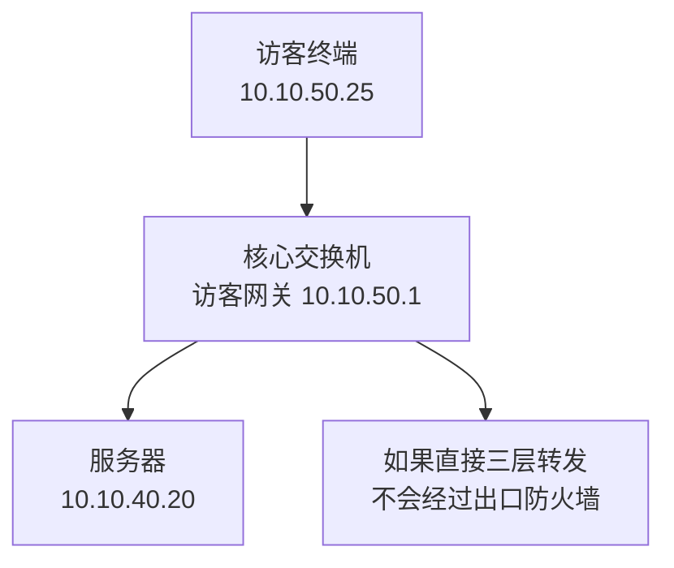

# 第 15 章：防火墙基础配置

## 15.1 学习目标

学完本章后，你应该能够：

- 说清楚防火墙基础配置的完整顺序。
- 根据企业网络拓扑规划防火墙接口、区域、地址、路由和安全策略。
- 理解地址对象、服务对象、策略名称、日志开关为什么比直接写 IP 和端口更适合工程维护。
- 能够完成一套基础的内网上网、访客隔离、DMZ 服务器发布和运维访问控制方案。
- 理解安全策略与 NAT、路由、会话之间的配置配合关系。
- 能够用分层检查方法验证防火墙配置是否生效。
- 能够排查常见基础配置错误，例如接口区域错误、默认路由错误、策略顺序错误、NAT 未命中和回程路由缺失。
- 能够写出一份简单的防火墙策略变更记录，具备工程实施意识。

第 14 章讲了防火墙基础概念：安全区域、状态检测、五元组、策略匹配、路由、NAT 和会话。本章把这些概念落到配置流程中。

不同厂商防火墙的命令差异很大。华为、H3C、Cisco、Fortinet、Palo Alto、山石、深信服等设备的菜单、对象名称、策略逻辑都有差别。本章不绑定某一家厂商，而是用“配置思路 + 伪命令 + 表格”的方式讲基础配置。你掌握这些逻辑后，再学习具体厂商命令会容易很多。

本章重点不是让你背某条命令，而是训练一个工程思维：

```text
先把拓扑、地址、区域、路由、对象和业务关系梳理清楚，再写策略，最后验证真实流量。
```

## 15.2 防火墙基础配置包含哪些内容

防火墙基础配置不是只写几条安全策略。一个能投入使用的基础防火墙，通常至少包含以下配置：

| 配置项 | 作用 | 常见错误 |
| --- | --- | --- |
| 管理登录 | 允许管理员安全登录设备 | 默认密码未改、管理口暴露公网 |
| 接口地址 | 让防火墙连接不同网络 | 地址、掩码或网关规划错误 |
| 安全区域 | 定义接口所属安全边界 | 接口未加入区域或区域方向写反 |
| 路由 | 决定流量从哪个接口出去 | 缺默认路由、缺回程路由 |
| 地址对象 | 用名称表示网段或主机 | 地址对象写错或命名混乱 |
| 服务对象 | 用名称表示协议和端口 | TCP/UDP 混淆、端口方向理解错误 |
| 安全策略 | 决定哪些访问允许或拒绝 | 策略顺序错误、范围过大 |
| NAT | 解决私网访问公网或服务器发布 | NAT 未命中、转换地址错误 |
| 日志 | 记录允许、拒绝和异常访问 | 未开日志导致无法审计和排错 |
| 配置保存 | 保证重启后配置仍存在 | 临时生效但未保存 |

如果把防火墙当成一座检查站，可以这样理解：

```text
接口 = 检查站的道路入口和出口
安全区域 = 道路属于内城、外城、仓库区还是访客区
路由 = 去某个方向应该走哪条路
安全策略 = 谁能经过检查站、带什么东西、去哪里
NAT = 过关时是否更换地址身份
会话表 = 已经通过检查的车辆记录
日志 = 检查站留存的通行记录
```

基础配置必须成体系。只配置其中一部分，流量往往仍然不通。

## 15.3 本章示例拓扑

本章使用一套中小企业常见网络作为统一示例。



### 地址规划

| 区域 | 网段 | 网关位置 | 网关地址 |
| --- | --- | --- | --- |
| 办公网 | `10.10.10.0/24` | 核心交换机 VLANIF 10 | `10.10.10.1` |
| 研发网 | `10.10.20.0/24` | 核心交换机 VLANIF 20 | `10.10.20.1` |
| 财务网 | `10.10.30.0/24` | 核心交换机 VLANIF 30 | `10.10.30.1` |
| 服务器区 | `10.10.40.0/24` | 核心交换机 VLANIF 40 | `10.10.40.1` |
| 访客无线 | `10.10.50.0/24` | 核心交换机 VLANIF 50 | `10.10.50.1` |
| 管理区 | `10.10.60.0/24` | 核心交换机 VLANIF 60 | `10.10.60.1` |
| DMZ | `10.10.70.0/24` | 防火墙 DMZ 接口 | `10.10.70.1` |
| 核心到防火墙 | `10.255.0.0/30` | 点到点互联 | 防火墙 `10.255.0.1`，核心 `10.255.0.2` |
| 防火墙到运营商 | `203.0.113.0/30` | 运营商互联 | 防火墙 `203.0.113.2`，运营商 `203.0.113.1` |

本章假设大部分内部 VLAN 的网关在核心交换机上，防火墙位于核心和运营商之间。DMZ 直接接在防火墙上，由防火墙担任 DMZ 网关。

这种设计在中小企业中很常见：

- 核心交换机负责内部 VLAN 间高速转发。
- 防火墙负责内外网边界、访客隔离、服务器发布、NAT 和审计。
- 需要强隔离的流量必须经过防火墙。

### 防火墙接口规划

| 防火墙接口 | IP 地址 | 连接对象 | 安全区域 |
| --- | --- | --- | --- |
| `GE0/0/0` | `10.255.0.1/30` | 核心交换机 | Trust |
| `GE0/0/1` | `203.0.113.2/30` | 运营商 | Untrust |
| `GE0/0/2` | `10.10.70.1/24` | DMZ 交换机或服务器 | DMZ |
| `GE0/0/3` | 可选，管理口 | 管理网络 | Management |

这里把从核心交换机来的所有内部网段统一视为 Trust。更严格的设计可以把服务器区、访客区、管理区都单独接入防火墙，或者让核心交换机通过 VRF、策略路由、ACL 把特定流量引到防火墙。本章先使用较容易理解的基础模型。

### 基础业务需求

本章要实现以下访问关系：

| 编号 | 需求 | 处理思路 |
| ---: | --- | --- |
| 1 | 办公网、研发网、财务网可以访问互联网 DNS、HTTP、HTTPS | Trust -> Untrust 放行，配置源 NAT |
| 2 | 访客无线只能访问互联网，不能访问企业内网 | Guest 流量需要单独控制，本章用地址对象和策略体现 |
| 3 | 外部用户可以访问 DMZ Web 服务器 HTTPS | DNAT + Untrust -> DMZ 安全策略 |
| 4 | 管理区堡垒机可以 SSH/RDP 管理服务器 | Management -> Server 或 Trust 内部策略 |
| 5 | 普通办公终端不能直接管理网络设备和服务器 | 显式拒绝高风险管理端口 |
| 6 | 防火墙记录允许和拒绝日志 | 策略开启日志 |

实际项目中，需求应来自业务部门、系统负责人和安全负责人，而不是网络工程师凭感觉放行。

## 15.4 配置前的准备工作

### 先画拓扑再写配置

配置前至少要准备三张表：

1. 接口表。
2. 路由表。
3. 策略表。

不要一边点设备界面一边临时想策略。这样很容易出现范围过大、方向写反、漏开日志、忘记回程路由等问题。

### 接口表模板

| 设备 | 接口 | IP 地址 | 对端设备 | 对端地址 | 区域 | 备注 |
| --- | --- | --- | --- | --- | --- | --- |
| FW | `GE0/0/0` | `10.255.0.1/30` | Core | `10.255.0.2/30` | Trust | 内侧互联 |
| FW | `GE0/0/1` | `203.0.113.2/30` | ISP | `203.0.113.1/30` | Untrust | 出口链路 |
| FW | `GE0/0/2` | `10.10.70.1/24` | DMZ-SW | - | DMZ | DMZ 网关 |

接口表的作用是防止“接错线”和“地址写错”。防火墙配置出问题时，第一步经常就是对照接口表检查。

### 路由表模板

| 设备 | 目的网段 | 下一跳 | 出接口 | 说明 |
| --- | --- | --- | --- | --- |
| 核心交换机 | `0.0.0.0/0` | `10.255.0.1` | 到防火墙互联口 | 内网默认路由 |
| 防火墙 | `10.10.0.0/16` | `10.255.0.2` | `GE0/0/0` | 回内部网段 |
| 防火墙 | `0.0.0.0/0` | `203.0.113.1` | `GE0/0/1` | 出互联网 |

路由表必须双向看。内网到互联网需要默认路由，互联网回来的包也要能从防火墙回到内部终端。

### 策略表模板

| 顺序 | 策略名称 | 源区域 | 目的区域 | 源地址 | 目的地址 | 服务 | 动作 | 日志 |
| ---: | --- | --- | --- | --- | --- | --- | --- | --- |
| 1 | `deny-guest-to-internal` | Trust | Trust/DMZ | `10.10.50.0/24` | `10.10.0.0/16` | Any | Deny | 开启 |
| 2 | `allow-office-internet` | Trust | Untrust | 办公网段 | Any | DNS/HTTP/HTTPS | Permit | 开启 |
| 3 | `allow-dmz-web-publish` | Untrust | DMZ | Any | DMZ Web | HTTPS | Permit | 开启 |
| 4 | `allow-bastion-server-mgmt` | Trust | Trust/DMZ | 堡垒机 | 服务器 | SSH/RDP | Permit | 开启 |
| 99 | `deny-any-log` | Any | Any | Any | Any | Any | Deny | 开启 |

这里有一个重要说明：如果访客网的网关在核心交换机上，访客访问内部服务器可能在核心交换机内部完成，不一定经过出口防火墙。要让防火墙控制访客到内网的访问，必须保证这类流量实际经过防火墙，或者在核心交换机上用 ACL 控制。本章策略表展示的是防火墙侧控制逻辑，真实部署时必须结合实际流量路径。

### 配置窗口和回退准备

防火墙策略会直接影响业务，实施前要准备：

- 变更时间窗口。
- 影响范围说明。
- 原配置备份。
- 新配置文本或截图。
- 验证步骤。
- 回退方案。
- 联系人和业务确认方式。

不要在工作时间随意修改出口防火墙策略。即使只是新增一条策略，如果顺序放错，也可能影响已有业务。

## 15.5 基础配置顺序

推荐配置顺序如下：



这个顺序不是唯一的，但适合初学者。它从底层连通性开始，逐步进入访问控制。

如果配置顺序混乱，常见问题是：

- 策略写好了，但接口没有加入区域。
- NAT 写好了，但没有默认路由。
- 路由正确，但地址对象写错。
- 业务不通时，不知道应该先查哪一层。

## 15.6 管理登录基础配置

防火墙是安全边界设备，管理面本身必须先保护好。很多真实安全事故不是业务策略被绕过，而是设备管理口暴露、弱口令、共享账号或远程管理来源过宽。

### 管理配置原则

| 项目 | 建议 |
| --- | --- |
| 默认账号 | 首次登录后立即修改密码，能禁用默认账号就禁用 |
| 密码复杂度 | 使用长度足够、不可猜测的密码 |
| 管理协议 | 优先 HTTPS、SSH，避免 Telnet、HTTP |
| 管理来源 | 只允许管理区或堡垒机访问 |
| 管理口位置 | 不直接暴露在公网 |
| 账号权限 | 普通运维和管理员分级 |
| 登录日志 | 开启登录成功、失败、配置变更日志 |
| 时间同步 | 配置 NTP，保证日志时间准确 |

### 管理访问示例

假设管理区堡垒机地址为：

```text
10.10.60.10
```

建议只允许堡垒机访问防火墙管理服务：

| 源地址 | 目的地址 | 服务 | 动作 |
| --- | --- | --- | --- |
| `10.10.60.10` | 防火墙管理地址 | HTTPS、SSH | Permit |
| Any | 防火墙管理地址 | HTTPS、SSH、Telnet、HTTP | Deny |

伪命令示例：

```text
set admin password <new-strong-password>
enable management-service ssh
enable management-service https
disable management-service telnet
disable management-service http
allow management-source 10.10.60.10
enable admin-login-log
```

实际设备可能通过“本地用户”“管理员角色”“管理服务”“本机安全策略”等多个位置配置。无论菜单怎么变化，目标都一样：减少能登录防火墙的人和入口。

### 时间和日志基础配置

防火墙日志必须有准确时间，否则事后排查会很困难。

```text
set timezone Asia/Shanghai
set ntp-server 10.10.60.20
enable log traffic
enable log system
enable log admin-operation
```

如果企业有日志平台或 SIEM，可以把防火墙日志发送到日志服务器：

| 日志服务器 | 地址 | 用途 |
| --- | --- | --- |
| Syslog/SIEM | `10.10.60.30` | 接收安全策略、系统、管理员操作日志 |

基础阶段至少要做到：本地能查策略命中日志，能看到拒绝日志，日志时间正确。

## 15.7 接口和安全区域配置

### 接口配置思路

接口配置要完成三件事：

1. 配置 IP 地址和掩码。
2. 确认接口启用。
3. 把接口放入正确安全区域。

伪命令示例：

```text
interface GE0/0/0
  description to-Core-Switch
  ip address 10.255.0.1 255.255.255.252
  enable

interface GE0/0/1
  description to-ISP
  ip address 203.0.113.2 255.255.255.252
  enable

interface GE0/0/2
  description to-DMZ
  ip address 10.10.70.1 255.255.255.0
  enable
```

### 安全区域配置

把接口加入区域：

```text
zone Trust
  add interface GE0/0/0

zone Untrust
  add interface GE0/0/1

zone DMZ
  add interface GE0/0/2
```

接口没有加入区域时，很多防火墙不会让流量匹配普通安全策略，或者流量会落到默认区域导致策略方向不符合预期。

### 验证接口

接口配置后先不要急着写策略，先验证链路：

| 验证项 | 预期结果 |
| --- | --- |
| 查看接口状态 | 接口 up，协商速率和双工正常 |
| 从防火墙 ping 核心 | `10.255.0.2` 可达 |
| 从防火墙 ping 运营商 | `203.0.113.1` 可达 |
| 从 DMZ 服务器 ping 网关 | `10.10.70.1` 可达 |
| 查看 ARP 表 | 能看到对端 MAC |

伪命令：

```text
show interface brief
show arp
ping 10.255.0.2
ping 203.0.113.1
ping 10.10.70.20
```

如果接口层不通，继续配置策略没有意义。先检查网线、接口启用状态、VLAN、光模块、对端接口、IP 地址和掩码。

## 15.8 路由配置

防火墙在路由模式下必须有路由。它需要知道：

- 去互联网的流量交给运营商。
- 回内部网段的流量交给核心交换机。
- 去 DMZ 的流量直连，不需要静态路由。

### 防火墙静态路由

伪命令：

```text
ip route 0.0.0.0 0.0.0.0 203.0.113.1
ip route 10.10.0.0 255.255.0.0 10.255.0.2
```

含义：

| 路由 | 下一跳 | 说明 |
| --- | --- | --- |
| `0.0.0.0/0` | `203.0.113.1` | 所有未知目的交给运营商 |
| `10.10.0.0/16` | `10.255.0.2` | 内部网段回程交给核心交换机 |

为什么用 `10.10.0.0/16` 汇总？因为本章内部网段都在 `10.10.x.0/24` 范围内。汇总路由可以减少路由条目，但前提是这个范围确实都在核心交换机后面。如果后续有云网段或分支网段也使用 `10.10.0.0/16` 的一部分，就要重新规划，避免路由覆盖错误。

### 核心交换机默认路由

核心交换机也需要把互联网流量指向防火墙：

```text
ip route 0.0.0.0 0.0.0.0 10.255.0.1
```

如果核心交换机没有默认路由，办公终端的上网流量可能到不了防火墙。

### 路由验证

| 验证方向 | 命令思路 | 预期 |
| --- | --- | --- |
| 防火墙查默认路由 | `show route 0.0.0.0/0` | 下一跳为 `203.0.113.1` |
| 防火墙查内网回程 | `show route 10.10.10.25` | 下一跳为 `10.255.0.2` |
| 核心查默认路由 | `show ip route 0.0.0.0/0` | 下一跳为 `10.255.0.1` |
| 防火墙 ping 运营商 | `ping 203.0.113.1` | 可达 |
| 防火墙指定源 ping 内网 | `ping source 10.255.0.1 10.10.10.25` | 可达 |

有些设备 ping 默认使用出接口地址作为源地址。排查时要注意源地址不同，回程路径也可能不同。

## 15.9 地址对象与服务对象

### 为什么要使用对象

初学者常直接在策略中写 IP 地址和端口。实验环境可以这样做，但企业环境更推荐使用对象。

地址对象的优点：

- 策略更容易读懂。
- 地址变化时只改对象，不用逐条改策略。
- 多条策略可以复用同一对象。
- 便于导出审计。

例如下面两种写法：

```text
源地址：10.10.10.0/24, 10.10.20.0/24, 10.10.30.0/24
```

不如：

```text
源地址对象：OBJ_INTERNAL_OFFICE_USERS
```

后者一眼能看出业务含义。

### 地址对象规划

| 对象名称 | 地址 | 含义 |
| --- | --- | --- |
| `OBJ_NET_OFFICE` | `10.10.10.0/24` | 办公网 |
| `OBJ_NET_RD` | `10.10.20.0/24` | 研发网 |
| `OBJ_NET_FINANCE` | `10.10.30.0/24` | 财务网 |
| `OBJ_NET_SERVER` | `10.10.40.0/24` | 服务器区 |
| `OBJ_NET_GUEST` | `10.10.50.0/24` | 访客无线 |
| `OBJ_NET_MGMT` | `10.10.60.0/24` | 管理区 |
| `OBJ_NET_DMZ` | `10.10.70.0/24` | DMZ 区 |
| `OBJ_HOST_BASTION` | `10.10.60.10/32` | 堡垒机 |
| `OBJ_HOST_DNS1` | `10.10.40.53/32` | 内部 DNS |
| `OBJ_HOST_DMZ_WEB` | `10.10.70.20/32` | DMZ Web 服务器 |
| `OBJ_NET_INTERNAL_ALL` | `10.10.0.0/16` | 企业内部汇总网段 |

对象组可以把多个对象合在一起：

| 对象组 | 包含对象 | 用途 |
| --- | --- | --- |
| `GRP_INTERNAL_USERS` | `OBJ_NET_OFFICE`、`OBJ_NET_RD`、`OBJ_NET_FINANCE` | 内部员工上网 |
| `GRP_INTERNAL_SENSITIVE` | `OBJ_NET_SERVER`、`OBJ_NET_MGMT`、`OBJ_NET_DMZ` | 需要重点保护的内部资源 |

伪命令：

```text
address-object OBJ_NET_OFFICE 10.10.10.0/24
address-object OBJ_NET_RD 10.10.20.0/24
address-object OBJ_NET_FINANCE 10.10.30.0/24
address-object OBJ_NET_SERVER 10.10.40.0/24
address-object OBJ_NET_GUEST 10.10.50.0/24
address-object OBJ_NET_MGMT 10.10.60.0/24
address-object OBJ_NET_DMZ 10.10.70.0/24
address-object OBJ_HOST_BASTION 10.10.60.10/32
address-object OBJ_HOST_DMZ_WEB 10.10.70.20/32

address-group GRP_INTERNAL_USERS
  member OBJ_NET_OFFICE
  member OBJ_NET_RD
  member OBJ_NET_FINANCE
```

### 服务对象规划

服务对象描述协议和端口。常见服务：

| 服务对象 | 协议 | 目的端口 | 用途 |
| --- | --- | ---: | --- |
| `SVC_DNS_UDP` | UDP | 53 | DNS 查询 |
| `SVC_DNS_TCP` | TCP | 53 | 大响应、区域传送等特殊 DNS 场景 |
| `SVC_HTTP` | TCP | 80 | Web HTTP |
| `SVC_HTTPS` | TCP | 443 | Web HTTPS |
| `SVC_SSH` | TCP | 22 | Linux/网络设备远程管理 |
| `SVC_RDP` | TCP | 3389 | Windows 远程桌面 |
| `SVC_NTP` | UDP | 123 | 时间同步 |
| `SVC_ICMP` | ICMP | - | 连通性测试 |

对象组：

| 服务组 | 包含服务 | 用途 |
| --- | --- | --- |
| `GRP_SVC_WEB_BASIC` | DNS、HTTP、HTTPS | 基础上网 |
| `GRP_SVC_SERVER_MGMT` | SSH、RDP | 服务器管理 |
| `GRP_SVC_NET_DIAG` | ICMP | 基础诊断 |

伪命令：

```text
service-object SVC_HTTP tcp destination-port 80
service-object SVC_HTTPS tcp destination-port 443
service-object SVC_DNS_UDP udp destination-port 53
service-object SVC_SSH tcp destination-port 22
service-object SVC_RDP tcp destination-port 3389

service-group GRP_SVC_WEB_BASIC
  member SVC_DNS_UDP
  member SVC_HTTP
  member SVC_HTTPS
```

### 服务对象的常见误区

| 误区 | 正确认识 |
| --- | --- |
| 把源端口写成 443 | 客户端源端口通常是随机高端口，策略主要限制目的端口 |
| 只放行 TCP 53 | 常规 DNS 查询通常使用 UDP 53 |
| 只允许 HTTP 忘记 HTTPS | 现代网站主要使用 HTTPS |
| 全部写 Any | 排错方便但风险大，长期不应保留 |
| 不区分 SSH 和 RDP | Linux 和 Windows 管理协议不同，应按服务器类型放行 |

服务对象越清晰，后续审计越容易。

## 15.10 安全策略配置

### 策略编写原则

基础策略建议遵循以下原则：

1. 从上到下按顺序匹配。
2. 精确策略放前面，宽泛策略放后面。
3. 拒绝高风险访问可以放在允许策略前。
4. 每条策略都要有清晰名称。
5. 允许策略尽量限定源、目的和服务。
6. 关键策略开启日志。
7. 最后一条使用显式拒绝并记录日志。

一个常见策略结构：

| 区域 | 策略类型 | 示例 |
| --- | --- | --- |
| 顶部 | 明确拒绝高风险访问 | 访客到内网、普通用户到管理端口 |
| 中部 | 允许业务访问 | 上网、访问服务器、访问 DMZ |
| 底部 | 默认拒绝 | `deny-any-log` |

不要把 `any -> any -> any permit` 放在策略底部来“保证业务不受影响”。这会让防火墙变成普通路由器，失去安全边界意义。

### 策略一：员工基础上网

需求：

```text
办公网、研发网、财务网可以访问互联网 DNS、HTTP、HTTPS。
```

策略表：

| 字段 | 值 |
| --- | --- |
| 策略名称 | `allow-internal-users-web` |
| 源区域 | Trust |
| 目的区域 | Untrust |
| 源地址 | `GRP_INTERNAL_USERS` |
| 目的地址 | Any |
| 服务 | `GRP_SVC_WEB_BASIC` |
| 动作 | Permit |
| 日志 | 开启 |

伪命令：

```text
security-policy allow-internal-users-web
  from-zone Trust
  to-zone Untrust
  source-address GRP_INTERNAL_USERS
  destination-address any
  service GRP_SVC_WEB_BASIC
  action permit
  log enable
```

这条策略只表示员工网段可以主动访问互联网基础服务。它不代表互联网可以主动访问员工电脑。

### 策略二：访客无线只允许上网

需求：

```text
访客无线 10.10.50.0/24 可以访问互联网 DNS、HTTP、HTTPS，不能访问企业内部网段。
```

如果访客流量经过防火墙，可以这样设计：

| 顺序 | 策略名称 | 源区域 | 目的区域 | 源地址 | 目的地址 | 服务 | 动作 |
| ---: | --- | --- | --- | --- | --- | --- | --- |
| 10 | `deny-guest-to-internal` | Trust | Trust/DMZ | `OBJ_NET_GUEST` | `OBJ_NET_INTERNAL_ALL` | Any | Deny |
| 20 | `allow-guest-to-internet` | Trust | Untrust | `OBJ_NET_GUEST` | Any | `GRP_SVC_WEB_BASIC` | Permit |

伪命令：

```text
security-policy deny-guest-to-internal
  from-zone Trust
  to-zone Trust,DMZ
  source-address OBJ_NET_GUEST
  destination-address OBJ_NET_INTERNAL_ALL
  service any
  action deny
  log enable

security-policy allow-guest-to-internet
  from-zone Trust
  to-zone Untrust
  source-address OBJ_NET_GUEST
  destination-address any
  service GRP_SVC_WEB_BASIC
  action permit
  log enable
```

注意路径问题：如果访客和服务器的网关都在核心交换机上，并且核心交换机直接完成 VLAN 间路由，访客到服务器的流量不会经过出口防火墙。这时仅在防火墙上写 `deny-guest-to-internal` 不会生效，需要在核心交换机 ACL、内部防火墙或网络架构上解决。

### 策略三：外部访问 DMZ Web

需求：

```text
互联网用户可以访问企业官网 HTTPS。
公网地址：203.0.113.10
DMZ Web：10.10.70.20
```

安全策略：

| 字段 | 值 |
| --- | --- |
| 策略名称 | `allow-internet-to-dmz-web` |
| 源区域 | Untrust |
| 目的区域 | DMZ |
| 源地址 | Any |
| 目的地址 | `OBJ_HOST_DMZ_WEB` |
| 服务 | `SVC_HTTPS` |
| 动作 | Permit |
| 日志 | 开启 |

伪命令：

```text
security-policy allow-internet-to-dmz-web
  from-zone Untrust
  to-zone DMZ
  source-address any
  destination-address OBJ_HOST_DMZ_WEB
  service SVC_HTTPS
  action permit
  log enable
```

这条策略还不能单独完成公网发布，还必须配合目的 NAT。NAT 会在下一节讲。

### 策略四：堡垒机管理服务器

需求：

```text
只有堡垒机 10.10.60.10 可以 SSH/RDP 管理服务器区。
普通办公网不能直接 SSH/RDP 到服务器区。
```

策略表：

| 顺序 | 策略名称 | 源地址 | 目的地址 | 服务 | 动作 |
| ---: | --- | --- | --- | --- | --- |
| 30 | `allow-bastion-to-server-mgmt` | `OBJ_HOST_BASTION` | `OBJ_NET_SERVER` | `GRP_SVC_SERVER_MGMT` | Permit |
| 31 | `deny-users-to-server-mgmt` | `GRP_INTERNAL_USERS` | `OBJ_NET_SERVER` | `GRP_SVC_SERVER_MGMT` | Deny |

伪命令：

```text
security-policy allow-bastion-to-server-mgmt
  from-zone Trust
  to-zone Trust
  source-address OBJ_HOST_BASTION
  destination-address OBJ_NET_SERVER
  service GRP_SVC_SERVER_MGMT
  action permit
  log enable

security-policy deny-users-to-server-mgmt
  from-zone Trust
  to-zone Trust
  source-address GRP_INTERNAL_USERS
  destination-address OBJ_NET_SERVER
  service GRP_SVC_SERVER_MGMT
  action deny
  log enable
```

再次强调：如果这类内部东西向流量不经过防火墙，则防火墙策略不会生效。工程设计必须保证控制点在真实路径上。

### 策略五：显式默认拒绝

虽然很多防火墙本身就有默认拒绝，但建议保留一条显式拒绝策略，方便记录日志和审计。

```text
security-policy deny-any-log
  from-zone any
  to-zone any
  source-address any
  destination-address any
  service any
  action deny
  log enable
```

显式拒绝策略一般放在策略列表末尾。它的作用不是代替前面的精确策略，而是捕获没有被允许的访问。

## 15.11 NAT 基础配置

NAT 会在第 16 章详细讲。本章只讲防火墙基础配置中最常用的两类 NAT：

- 源 NAT：内网访问互联网。
- 目的 NAT：公网访问 DMZ 服务器。

### 源 NAT：内网上网

需求：

```text
10.10.0.0/16 内部地址访问互联网时，转换为防火墙外侧公网地址 203.0.113.2。
```

NAT 策略：

| 字段 | 值 |
| --- | --- |
| 策略名称 | `snat-internal-to-internet` |
| 源区域 | Trust |
| 目的区域 | Untrust |
| 源地址 | `10.10.0.0/16` |
| 目的地址 | Any |
| 转换方式 | 使用出接口地址 |

伪命令：

```text
nat-policy snat-internal-to-internet
  from-zone Trust
  to-zone Untrust
  source-address OBJ_NET_INTERNAL_ALL
  destination-address any
  action source-nat interface-address
```

如果运营商分配了公网地址池，也可以转换为地址池：

```text
nat-address-pool POOL_PUBLIC_OUT 203.0.113.10 203.0.113.20

nat-policy snat-internal-to-internet-pool
  from-zone Trust
  to-zone Untrust
  source-address OBJ_NET_INTERNAL_ALL
  destination-address any
  action source-nat pool POOL_PUBLIC_OUT
```

小型企业通常使用出接口地址 NAT，大型企业或需要大量并发连接的环境可能使用公网地址池。

### 目的 NAT：发布 DMZ Web

需求：

```text
公网用户访问 203.0.113.10:443 时，防火墙转发到 DMZ Web 服务器 10.10.70.20:443。
```

NAT 规则：

| 字段 | 值 |
| --- | --- |
| 策略名称 | `dnat-public-web-to-dmz-web` |
| 入区域 | Untrust |
| 公网地址 | `203.0.113.10` |
| 公网端口 | TCP 443 |
| 内部服务器 | `10.10.70.20` |
| 内部端口 | TCP 443 |

伪命令：

```text
nat-policy dnat-public-web-to-dmz-web
  from-zone Untrust
  destination-address 203.0.113.10
  service SVC_HTTPS
  action destination-nat 10.10.70.20 443
```

同时需要安全策略允许：

```text
Untrust -> DMZ，Any -> 10.10.70.20，HTTPS，Permit
```

不同厂商对 DNAT 与安全策略的匹配顺序不同：

| 类型 | 策略中目的地址可能写什么 |
| --- | --- |
| NAT 前匹配 | 写公网地址 `203.0.113.10` |
| NAT 后匹配 | 写真实服务器 `10.10.70.20` |
| 对象联动 | 写公网映射对象或服务器对象 |

实际设备上必须查厂商文档或用测试流量验证。不要看到一个厂商的写法就直接套到另一家设备。

### NAT 与安全策略的关系

源 NAT 和安全策略解决的问题不同：

| 配置 | 解决什么问题 |
| --- | --- |
| 安全策略 | 允许这条访问通过防火墙 |
| 源 NAT | 把私有地址转换成公网可回包地址 |
| 目的 NAT | 把公网服务地址转换到真实服务器 |
| 路由 | 确保转换前后地址都有转发路径 |

内网上网必须同时满足：

```text
终端网关正确
核心默认路由正确
防火墙默认路由正确
防火墙回内网路由正确
Trust -> Untrust 安全策略允许
源 NAT 命中
会话建立成功
DNS 正常
```

缺任何一项都可能表现为“上不了网”。

## 15.12 配置验证方法

防火墙配置完成后，不能只看“策略已经存在”。必须用真实流量验证。

### 分层验证顺序

推荐按以下顺序验证：



这样做的好处是可以逐层缩小故障范围。不要一开始就盯着策略列表，因为很多问题根本不是策略造成的。

### 内网上网验证

以办公 PC `10.10.10.25` 为例：

| 步骤 | 测试 | 预期 | 如果失败，优先检查 |
| ---: | --- | --- | --- |
| 1 | `ping 10.10.10.1` | 终端到网关通 | 终端 IP、掩码、网关、接入 VLAN |
| 2 | `ping 10.255.0.1` | 终端到防火墙内侧通 | 核心路由、互联链路、防火墙策略 |
| 3 | 防火墙 ping `203.0.113.1` | 防火墙到运营商通 | 外侧接口、运营商链路 |
| 4 | 终端 ping `8.8.8.8` | 基础公网连通 | 默认路由、安全策略、源 NAT |
| 5 | 终端访问 `https://www.example.com` | HTTPS 正常 | DNS、策略服务对象、代理设置 |
| 6 | 防火墙查会话 | 有 `10.10.10.25` 上网会话 | 策略/NAT 是否命中 |

伪命令：

```text
show session source 10.10.10.25
show policy hit-count allow-internal-users-web
show nat hit-count snat-internal-to-internet
show log traffic source 10.10.10.25
```

验证时要区分“公网 IP 可达”和“域名可访问”：

- 能 ping `8.8.8.8`，但打不开域名，优先查 DNS。
- 不能 ping `8.8.8.8`，但能 ping 防火墙，优先查出口路由、策略、NAT。
- 能访问部分网站，不能访问部分网站，可能是 DNS、策略服务、运营商路径、证书或应用层安全功能问题。

### DMZ 发布验证

从外部网络测试企业官网：

| 步骤 | 测试 | 预期 |
| ---: | --- | --- |
| 1 | DMZ Web ping 网关 `10.10.70.1` | 可达 |
| 2 | 防火墙 ping DMZ Web `10.10.70.20` | 可达 |
| 3 | 防火墙查看 DNAT 规则 | 规则启用 |
| 4 | 外部访问 `https://203.0.113.10` | 能打开页面 |
| 5 | 防火墙查看会话 | 有 Untrust -> DMZ 会话 |
| 6 | 防火墙查看策略命中 | `allow-internet-to-dmz-web` 命中增加 |
| 7 | 防火墙查看 NAT 命中 | DNAT 命中增加 |

如果外部访问失败，常见排查点：

- 公网地址是否真的路由到本防火墙。
- DNAT 的公网地址和端口是否正确。
- 安全策略目的地址是 NAT 前还是 NAT 后。
- DMZ Web 默认网关是否指向防火墙 `10.10.70.1`。
- 服务器本机防火墙是否允许 TCP 443。
- 证书或 Web 服务是否正常。

### 策略命中验证

很多防火墙支持查看策略命中次数。配置策略后，要观察命中计数是否增加。

| 现象 | 含义 |
| --- | --- |
| 允许策略命中增加，业务通 | 基本正常 |
| 拒绝策略命中增加，业务不通 | 流量被策略拒绝，需要确认是否符合设计 |
| 所有相关策略都不命中 | 流量可能没有经过防火墙，或区域/对象不匹配 |
| NAT 命中为 0 | NAT 条件不匹配或流量未到 NAT 处理阶段 |
| 有会话但应用失败 | 可能是服务器、应用、DNS、证书或上层安全检测问题 |

策略不命中时，不要立即把策略改成 Any。应先确认：

- 源 IP 是否和地址对象一致。
- 目的 IP 是否是 NAT 前还是 NAT 后。
- 服务端口是否正确。
- 源区域和目的区域是否正确。
- 流量路径是否真的经过该防火墙。

## 15.13 常见故障与排查

### 故障一：办公网无法上网

现象：

```text
办公 PC 能 ping 网关 10.10.10.1，但不能访问互联网。
```

排查顺序：

| 步骤 | 检查项 | 判断 |
| ---: | --- | --- |
| 1 | PC 默认网关 | 是否为 `10.10.10.1` |
| 2 | 核心默认路由 | 是否指向 `10.255.0.1` |
| 3 | 防火墙内侧接口 | `10.255.0.1` 是否可达 |
| 4 | 防火墙默认路由 | 是否指向 `203.0.113.1` |
| 5 | 安全策略 | `allow-internal-users-web` 是否命中 |
| 6 | 源 NAT | `snat-internal-to-internet` 是否命中 |
| 7 | 会话表 | 是否创建会话 |
| 8 | DNS | 是否能解析域名 |

常见原因：

- 核心交换机没有默认路由。
- 防火墙缺少源 NAT。
- 策略只允许 HTTP，未允许 HTTPS。
- DNS 使用了外部地址，但策略未放行 UDP 53。
- 源地址对象没有包含办公网段。

### 故障二：策略已允许但业务不通

现象：

```text
防火墙上已经有 Permit 策略，但访问仍然失败。
```

不要只盯着策略。按以下矩阵检查：

| 方向 | 检查点 |
| --- | --- |
| 去程 | 源主机网关、核心路由、防火墙路由、策略、NAT |
| 回程 | 服务器默认网关、防火墙回程路由、NAT 反向转换、会话 |
| 应用 | 服务是否启动、端口是否监听、主机防火墙是否允许 |
| 匹配 | 地址对象、服务对象、区域方向、策略顺序 |

一条 Permit 策略只说明“如果流量按这个条件到达防火墙，可以被允许”。它不保证流量真的到达防火墙，也不保证对端能回包。

### 故障三：DMZ 服务器公网访问失败

现象：

```text
外部用户无法访问 https://203.0.113.10。
```

排查顺序：

| 步骤 | 检查项 | 说明 |
| ---: | --- | --- |
| 1 | 公网地址归属 | `203.0.113.10` 是否分配给企业或路由到防火墙 |
| 2 | DNAT 规则 | 是否把 `203.0.113.10:443` 指向 `10.10.70.20:443` |
| 3 | 安全策略 | Untrust -> DMZ 是否允许 HTTPS |
| 4 | 服务器网关 | DMZ Web 默认网关是否为 `10.10.70.1` |
| 5 | 服务器服务 | Web 服务是否监听 TCP 443 |
| 6 | 本机防火墙 | 操作系统是否阻断 443 |
| 7 | 日志和会话 | 防火墙是否看到访问请求 |

如果防火墙没有任何会话和日志，说明流量可能根本没有到达防火墙。应检查运营商路由、公网地址、上游 ACL 或测试来源。

### 故障四：访客仍能访问内网

现象：

```text
访客无线终端 10.10.50.25 可以访问服务器 10.10.40.20。
```

排查重点不是只看防火墙策略，而是看路径：



常见原因：

- 访客 VLAN 网关在核心，核心直接路由到服务器 VLAN。
- 防火墙策略写了，但流量未经过防火墙。
- 核心交换机未配置 ACL。
- 无线控制器访客隔离未开启。
- 访客网段被错误加入内部用户对象组。

解决思路：

| 方案 | 说明 |
| --- | --- |
| 核心 ACL | 在核心交换机上阻断访客到内网 |
| 访客网关下沉到防火墙 | 让访客到内网和互联网都经过防火墙 |
| 独立访客出口 | 访客无线直接走独立出口 |
| 无线侧隔离 | 控制访客之间和访客到内网访问 |

设计安全策略前，必须先确认控制点是否在路径上。

### 故障五：策略顺序导致放行过宽

现象：

```text
本来想禁止办公网 SSH 到服务器，但办公网仍然可以 SSH。
```

可能策略顺序如下：

| 顺序 | 策略 | 源 | 目的 | 服务 | 动作 |
| ---: | --- | --- | --- | --- | --- |
| 1 | `allow-office-to-server-any` | 办公网 | 服务器区 | Any | Permit |
| 2 | `deny-office-to-server-ssh` | 办公网 | 服务器区 | SSH | Deny |

由于策略从上到下匹配，SSH 流量先命中第 1 条允许策略，第 2 条拒绝策略永远不会生效。

正确顺序：

| 顺序 | 策略 | 源 | 目的 | 服务 | 动作 |
| ---: | --- | --- | --- | --- | --- |
| 1 | `deny-office-to-server-ssh` | 办公网 | 服务器区 | SSH | Deny |
| 2 | `allow-office-to-server-business` | 办公网 | 服务器区 | HTTPS | Permit |

更精确、更特殊的策略应放在更通用的策略前面。

## 15.14 基础策略设计示例

下面给出一份可作为初学参考的基础策略清单。真实企业需要按业务调整，不能直接照搬。

| 顺序 | 策略名称 | 源区域 | 目的区域 | 源地址 | 目的地址 | 服务 | 动作 | 日志 |
| ---: | --- | --- | --- | --- | --- | --- | --- | --- |
| 10 | `deny-guest-to-internal` | Trust | Trust/DMZ | `OBJ_NET_GUEST` | `OBJ_NET_INTERNAL_ALL` | Any | Deny | 是 |
| 20 | `deny-users-to-server-mgmt` | Trust | Trust/DMZ | `GRP_INTERNAL_USERS` | `OBJ_NET_SERVER` | SSH/RDP | Deny | 是 |
| 30 | `allow-bastion-to-server-mgmt` | Trust | Trust/DMZ | `OBJ_HOST_BASTION` | `OBJ_NET_SERVER` | SSH/RDP | Permit | 是 |
| 40 | `allow-users-to-internet-web` | Trust | Untrust | `GRP_INTERNAL_USERS` | Any | DNS/HTTP/HTTPS | Permit | 是 |
| 50 | `allow-guest-to-internet-web` | Trust | Untrust | `OBJ_NET_GUEST` | Any | DNS/HTTP/HTTPS | Permit | 是 |
| 60 | `allow-internet-to-dmz-web` | Untrust | DMZ | Any | `OBJ_HOST_DMZ_WEB` | HTTPS | Permit | 是 |
| 70 | `allow-dmz-to-internet-update` | DMZ | Untrust | `OBJ_HOST_DMZ_WEB` | Any | DNS/HTTP/HTTPS/NTP | Permit | 是 |
| 99 | `deny-any-log` | Any | Any | Any | Any | Any | Deny | 是 |

这份策略体现几个思路：

- 先拒绝访客访问内部。
- 先拒绝普通用户管理服务器。
- 只允许堡垒机做管理。
- 员工和访客上网分开写，便于日志审计。
- DMZ 服务器对外只开放 HTTPS。
- DMZ 服务器访问互联网只允许更新、DNS、时间同步等必要服务。
- 最后显式拒绝并记录日志。

### 策略命名建议

策略名称要能表达“允许谁访问谁的什么服务”。

推荐格式：

```text
动作-源-目的-服务
```

示例：

```text
allow-office-internet-web
deny-guest-internal-any
allow-bastion-server-ssh-rdp
allow-untrust-dmz-web-https
```

不推荐：

```text
policy1
test
temp
allow-any
new-rule
```

命名混乱会让后续排错和审计非常痛苦。

### 临时策略管理

真实项目中常会临时放行某个访问，例如供应商远程支持或业务系统测试。临时策略必须有到期时间和备注。

| 字段 | 示例 |
| --- | --- |
| 策略名称 | `temp-vendor-to-erp-20260607` |
| 申请人 | ERP 系统负责人 |
| 源地址 | 供应商固定公网 IP |
| 目的地址 | ERP 测试服务器 |
| 服务 | HTTPS |
| 生效时间 | `2026-06-07 20:00` |
| 失效时间 | `2026-06-07 23:00` |
| 审批单号 | CHG-20260607-001 |

不要让临时策略长期留在防火墙上。很多企业策略膨胀就是从“临时开一下”开始的。

## 15.15 基础变更流程

防火墙配置属于高风险变更。即使是基础配置，也要按流程执行。

### 变更前

变更前检查：

- 是否明确业务需求。
- 是否确认源地址、目的地址、服务端口。
- 是否确认流量路径经过该防火墙。
- 是否有当前配置备份。
- 是否有回退方案。
- 是否有业务验证人。
- 是否安排在合适时间窗口。

### 变更中

变更中建议：

1. 先保存或导出当前配置。
2. 分批提交配置，不要一次修改大量策略。
3. 每新增一条关键策略就查看命中情况。
4. 对高风险拒绝策略先观察日志，再决定是否正式阻断。
5. 保持与业务验证人沟通。

### 变更后

变更后确认：

| 项目 | 说明 |
| --- | --- |
| 功能验证 | 需要放行的业务能访问 |
| 安全验证 | 需要阻断的访问确实被拒绝 |
| 日志验证 | 允许和拒绝日志正常记录 |
| 性能观察 | CPU、内存、会话数无异常 |
| 配置保存 | 重启后配置不会丢失 |
| 文档更新 | 策略表、拓扑、地址表同步更新 |

### 回退方案示例

简单回退方案可以这样写：

```text
变更内容：新增 DMZ Web 发布策略和 DNAT。
回退条件：外部访问失败且 30 分钟内无法恢复，或影响现有出口访问。
回退步骤：
1. 禁用策略 allow-internet-to-dmz-web。
2. 禁用 DNAT 规则 dnat-public-web-to-dmz-web。
3. 恢复变更前配置备份。
4. 验证员工上网和已有 DMZ 服务。
5. 通知业务方回退完成。
```

回退方案要具体到策略名和规则名，不要只写“恢复原配置”。

## 15.16 自检练习

### 练习一：判断策略方向

办公 PC `10.10.10.25` 访问互联网网站 `93.184.216.34:443`，经过出口防火墙。

请判断：

- 源区域是什么？
- 目的区域是什么？
- 策略服务应该写源端口还是目的端口？
- 回包是否需要单独写 `Untrust -> Trust` 允许策略？

参考答案：

- 源区域是 Trust。
- 目的区域是 Untrust。
- 服务主要限制目的端口 TCP 443。
- 回包属于已建立会话，不需要单独写反向新建连接策略。

### 练习二：补充缺失配置

现象：

```text
办公网能 ping 防火墙内侧 10.255.0.1。
防火墙能 ping 运营商 203.0.113.1。
办公网访问互联网时，防火墙策略有命中，但互联网没有回包。
```

可能缺少什么？

参考思路：

- 检查源 NAT 是否命中。
- 检查防火墙默认路由是否正确。
- 检查运营商是否允许企业公网地址出站。
- 检查防火墙是否有会话和 NAT 转换记录。

其中最常见的是源 NAT 未配置或未命中，导致内网私有地址直接发往互联网，回包无法返回。

### 练习三：设计一条最小放行策略

需求：

```text
财务网 10.10.30.0/24 需要访问服务器 10.10.40.30 的 HTTPS 服务。
不允许财务网访问服务器区其他端口。
```

策略应写成：

| 字段 | 值 |
| --- | --- |
| 源地址 | `10.10.30.0/24` |
| 目的地址 | `10.10.40.30/32` |
| 服务 | TCP 443 |
| 动作 | Permit |
| 日志 | 开启 |

不要写成：

```text
源：10.10.30.0/24
目的：10.10.40.0/24
服务：Any
动作：Permit
```

后者范围过大，不符合最小必要原则。

### 练习四：判断控制点

访客无线 `10.10.50.0/24` 的网关在核心交换机上，服务器区 `10.10.40.0/24` 的网关也在核心交换机上。出口防火墙只连接核心和互联网。

如果只在出口防火墙上写“拒绝访客访问服务器”的策略，是否一定生效？

参考答案：

不一定。访客到服务器的流量可能在核心交换机内部直接完成三层转发，不经过出口防火墙。要控制这条流量，需要把控制点放在真实路径上，例如核心交换机 ACL、内部隔离防火墙，或调整网关位置让流量经过防火墙。

## 15.17 本章小结

本章把第 14 章的防火墙概念转换成了一套基础配置流程。防火墙基础配置的核心不是某一家厂商的命令，而是配置顺序和工程逻辑：

```text
管理面先加固，接口先连通，区域先划清，路由先可达，对象先规范，策略再放行，NAT 再配合，最后用真实流量验证。
```

你需要特别记住以下几点：

- 接口必须加入正确安全区域，否则策略方向可能不成立。
- 路由决定流量往哪里走，策略决定流量能不能过，NAT 决定地址是否改写，会话决定回包如何放行。
- 安全策略应按最小必要原则编写，避免长期使用 Any。
- 策略顺序非常重要，精确拒绝和精确允许要放在宽泛策略之前。
- 日志不是可有可无的装饰，而是排错、审计和复盘的基础。
- 防火墙策略只有在流量经过防火墙时才会生效，设计前必须确认真实路径。
- 变更防火墙配置必须有备份、验证和回退方案。

下一章将继续深入 NAT 技术。你会系统学习源 NAT、目的 NAT、端口映射、地址池、NAT 顺序、服务器发布、双出口 NAT 和 NAT 故障排查。NAT 是出口访问和服务器发布的关键技术，也是防火墙排错中最常见的难点之一。
