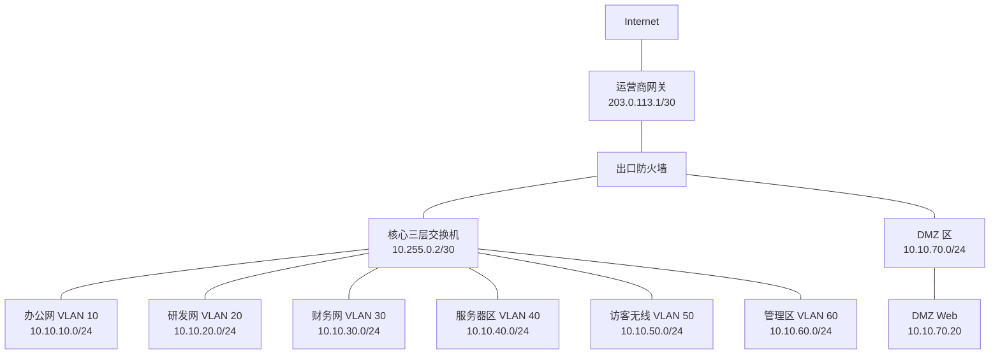
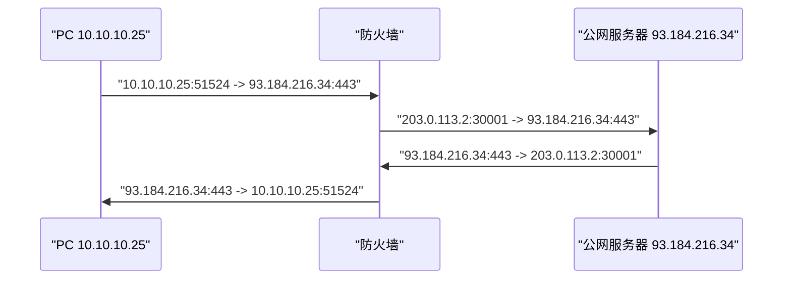
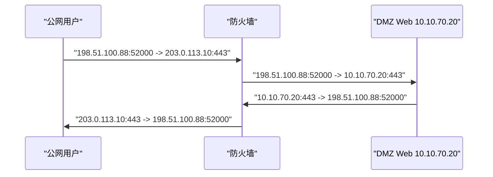
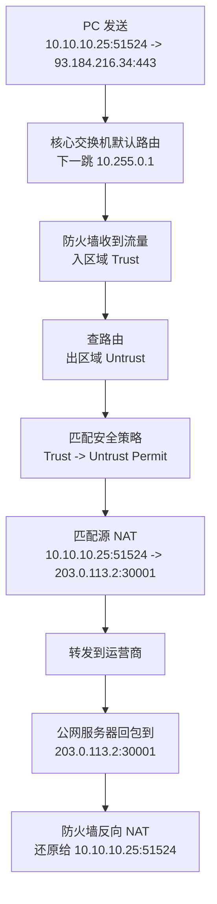
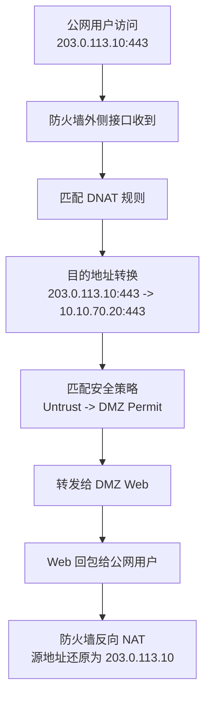
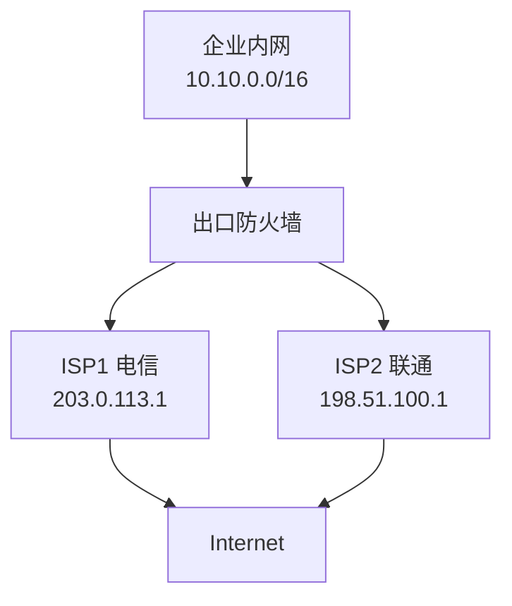
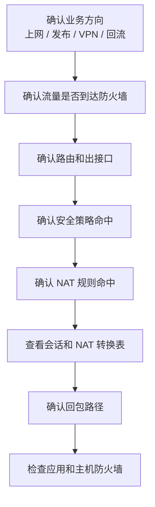

# 第 16 章：NAT 技术

## 16.1 学习目标

学完本章后，你应该能够：

- 解释 NAT 为什么存在，以及它解决了哪些真实网络问题。
- 区分源 NAT、目的 NAT、静态 NAT、动态 NAT、NAPT/PAT、端口映射和 NAT 豁免。
- 说清楚内网上网、服务器发布、双出口上网、VPN 互联中 NAT 的处理逻辑。
- 理解 NAT 与路由、安全策略、会话表、DNS、ARP、运营商公网地址之间的关系。
- 能够根据企业地址规划设计一组基础 NAT 规则。
- 能够判断一条流量是否命中 NAT，以及转换前后的五元组如何变化。
- 能够排查常见 NAT 故障，例如未命中、回程不对称、端口冲突、策略地址写错、VPN 被错误 NAT。
- 能够写出一份 NAT 变更前后的验证清单。

第 14 章介绍了防火墙基础概念，第 15 章讲了防火墙基础配置。本章深入讲 NAT。NAT 是出口防火墙上最常见、也最容易出错的功能之一。

初学者经常把 NAT 只理解成“把内网地址改成公网地址”。这句话没有错，但不够完整。企业网络里 NAT 至少涉及三类问题：

```text
内网用户如何访问互联网。
公网用户如何访问企业内部服务器。
哪些特殊流量不应该被 NAT。
```

更重要的是，NAT 不是单独工作的。一次访问能否成功，取决于：

```text
路由是否把流量送到正确设备
安全策略是否允许流量通过
NAT 是否按预期改写地址和端口
会话表是否记录了转换关系
回包是否还能回到同一台 NAT 设备
```

本章不绑定某个厂商命令，而是使用“概念 + 流程 + 表格 + 伪命令”的方式讲清楚 NAT 的工程逻辑。你掌握这些逻辑后，再去学习华为、H3C、Cisco、Fortinet、Palo Alto、山石、深信服等设备上的具体配置，会容易很多。

## 16.2 NAT 解决什么问题

NAT 的全称是 Network Address Translation，中文常叫网络地址转换。它的作用是在网络设备转发报文时，修改报文中的 IP 地址，必要时也修改传输层端口。

最常见的场景是：

```text
内网 PC：10.10.10.25
访问互联网服务器：93.184.216.34
防火墙把源地址 10.10.10.25 改成公网地址 203.0.113.2
互联网服务器看到的访问来源是 203.0.113.2
回包返回 203.0.113.2
防火墙再把目的地址还原成 10.10.10.25
```

### 为什么私有地址不能直接上互联网

第 3 章已经讲过私有地址。常见私有地址范围包括：

| 私有地址范围 | 常见用途 |
| --- | --- |
| `10.0.0.0/8` | 大中型企业内网 |
| `172.16.0.0/12` | 企业、园区、云上私网 |
| `192.168.0.0/16` | 小型网络、家庭网络、实验环境 |

这些地址可以在企业内部重复使用，但不能在公网互联网中全局路由。原因很简单：世界上可能有大量公司都使用 `10.10.10.0/24`，互联网无法知道某个 `10.10.10.25` 到底属于哪家公司。

所以私有地址访问互联网时，需要在出口处转换为运营商可路由的公网地址。

### 没有 NAT 会怎样

假设办公电脑 `10.10.10.25` 直接把源地址为 `10.10.10.25` 的报文发往互联网：


去程也许可以被防火墙和运营商转发出去，但公网服务器回包时，目的地址是 `10.10.10.25`。互联网路由表不会把这个私有地址路由回企业，回包通常会被丢弃。

表现为：

| 现象 | 可能原因 |
| --- | --- |
| 内网能 ping 网关，不能上网 | 缺少源 NAT 或默认路由 |
| 防火墙看到去程报文，没看到回包 | 私有地址被直接发到公网 |
| NAT 命中为 0 | NAT 条件不匹配或流量未经过防火墙 |
| 只有某些网段不能上网 | 新网段未加入 NAT 源地址对象 |

### NAT 的三个核心价值

| 价值 | 说明 | 企业例子 |
| --- | --- | --- |
| 私网访问公网 | 把私有地址转换为公网地址 | 办公网、研发网、访客网访问互联网 |
| 公网发布内网服务 | 把公网地址或端口映射到内部服务器 | 官网、VPN 网关、邮件服务器 |
| 地址冲突处理 | 在互联双方地址重叠时进行转换 | 两家公司 VPN 都使用 `10.10.0.0/16` |

NAT 不是安全策略。NAT 只改变地址或端口，它本身不等于允许访问。访问是否允许，仍然要看防火墙安全策略。

## 16.3 本章示例拓扑和地址规划

本章继续使用第 15 章的企业网络，并补充 NAT 专用规划。



### 内网地址

| 区域 | 网段 | 网关 |
| --- | --- | --- |
| 办公网 | `10.10.10.0/24` | `10.10.10.1` |
| 研发网 | `10.10.20.0/24` | `10.10.20.1` |
| 财务网 | `10.10.30.0/24` | `10.10.30.1` |
| 服务器区 | `10.10.40.0/24` | `10.10.40.1` |
| 访客无线 | `10.10.50.0/24` | `10.10.50.1` |
| 管理区 | `10.10.60.0/24` | `10.10.60.1` |
| DMZ | `10.10.70.0/24` | `10.10.70.1` |

### 出口互联地址

| 连接 | 地址 |
| --- | --- |
| 防火墙外侧接口 | `203.0.113.2/30` |
| 运营商网关 | `203.0.113.1/30` |
| 防火墙内侧接口 | `10.255.0.1/30` |
| 核心交换机互联接口 | `10.255.0.2/30` |

### 公网地址规划

本章使用 `203.0.113.0/24` 作为文档示例公网地址段。实际项目中，公网地址由运营商分配。

| 公网地址 | 用途 | 说明 |
| --- | --- | --- |
| `203.0.113.2` | 防火墙外侧接口地址 | 可用于小规模出接口源 NAT |
| `203.0.113.10` | 企业官网发布地址 | 运营商路由到防火墙 |
| `203.0.113.11` | 备用服务器发布地址 | 运营商路由到防火墙 |
| `203.0.113.20-203.0.113.30` | 源 NAT 地址池 | 适合较多并发连接 |

这里有一个重要区别：

```text
203.0.113.2 是接口直连地址。
203.0.113.10、203.0.113.20-203.0.113.30 是运营商额外路由到防火墙的公网地址。
```

也就是说，服务器发布地址不一定必须配置在防火墙接口上。运营商可以把一个公网地址段路由到防火墙外侧接口，防火墙再通过 NAT 使用这些地址。

### 路由基础

| 设备 | 目的网段 | 下一跳 |
| --- | --- | --- |
| 核心交换机 | `0.0.0.0/0` | `10.255.0.1` |
| 防火墙 | `0.0.0.0/0` | `203.0.113.1` |
| 防火墙 | `10.10.0.0/16` | `10.255.0.2` |

没有这些路由，NAT 规则写得再正确也不能保证业务可达。

## 16.4 NAT 修改了什么

一个 IP 报文至少包含源 IP 和目的 IP。如果是 TCP 或 UDP，还包含源端口和目的端口。

用五元组表示一次 TCP 访问：

| 字段 | 示例 |
| --- | --- |
| 源 IP | `10.10.10.25` |
| 源端口 | `51524` |
| 目的 IP | `93.184.216.34` |
| 目的端口 | `443` |
| 协议 | TCP |

源 NAT 后可能变成：

| 字段 | NAT 前 | NAT 后 |
| --- | --- | --- |
| 源 IP | `10.10.10.25` | `203.0.113.2` |
| 源端口 | `51524` | `30001` |
| 目的 IP | `93.184.216.34` | `93.184.216.34` |
| 目的端口 | `443` | `443` |
| 协议 | TCP | TCP |

这里不仅源 IP 改了，源端口也可能改了。端口改变是为了让多个内网终端可以共用同一个公网 IP。

### NAT 转换表

防火墙会记录 NAT 转换关系。可以把它理解成一张临时表：

| 内部会话 | 转换后会话 | 目的 |
| --- | --- | --- |
| `10.10.10.25:51524` | `203.0.113.2:30001` | `93.184.216.34:443` |
| `10.10.20.30:51524` | `203.0.113.2:30002` | `93.184.216.34:443` |
| `10.10.30.40:53001` | `203.0.113.2:30003` | `8.8.8.8:53` |

公网服务器回包给 `203.0.113.2:30001` 时，防火墙根据转换表知道应该还原给 `10.10.10.25:51524`。

如果防火墙丢失了这张表，回包就无法正确还原。这也是为什么 NAT 设备高可用时要同步会话和 NAT 状态。

### NAT 和校验和

IP 地址或 TCP/UDP 端口被修改后，报文校验和也要重新计算。这个细节通常由设备自动完成，工程师不需要手工配置，但排查抓包时要知道：

- NAT 前后报文不是完全相同的报文。
- 抓防火墙入接口和出接口时，看到的源地址或目的地址可能不同。
- 某些抓包工具显示校验和异常，可能和硬件卸载有关，不一定就是 NAT 错误。

## 16.5 NAT 的主要类型

不同厂商对 NAT 类型的命名略有差异，但工程逻辑大体相同。

| 类型 | 常见名称 | 主要用途 |
| --- | --- | --- |
| 源 NAT | SNAT、Source NAT | 内网访问公网时改写源地址 |
| 目的 NAT | DNAT、Destination NAT | 公网访问内网服务时改写目的地址 |
| 静态 NAT | Static NAT、One-to-One NAT | 一个内网地址固定映射一个公网地址 |
| 动态 NAT | Dynamic NAT | 内网地址动态使用公网地址池 |
| NAPT/PAT | Port NAT、Overload | 多个内网地址共享一个公网地址，用端口区分 |
| 端口映射 | Port Forwarding | 公网地址的某个端口映射到内部服务器 |
| NAT 豁免 | No NAT、NAT Exemption | 指定流量不做 NAT |

### 源 NAT

源 NAT 修改源地址，常用于内网访问外网。



源 NAT 解决的是回包问题。公网服务器不需要知道企业内部私有地址，只需要把回包发给公网地址。

### 目的 NAT

目的 NAT 修改目的地址，常用于公网访问内部服务器。



对公网用户来说，他访问的是 `203.0.113.10`。对真实服务器来说，收到的目的地址是 `10.10.70.20`。

### 静态 NAT

静态 NAT 是一对一映射。

| 内部地址 | 公网地址 |
| --- | --- |
| `10.10.70.20` | `203.0.113.10` |
| `10.10.70.21` | `203.0.113.11` |

静态 NAT 的特点：

- 映射关系固定。
- 外部可以通过固定公网地址访问内部主机。
- 通常需要配合安全策略限制端口。
- 消耗公网地址较多。

静态 NAT 适合公网服务器、固定对接、特殊业务系统，但不适合大量普通办公终端上网。

### 动态 NAT

动态 NAT 使用公网地址池。内网主机访问外网时，从地址池中临时分配一个公网地址。

| 内网主机 | 临时公网地址 |
| --- | --- |
| `10.10.10.25` | `203.0.113.20` |
| `10.10.10.26` | `203.0.113.21` |
| `10.10.20.30` | `203.0.113.22` |

如果只做地址转换，不使用端口复用，那么地址池中的公网地址数量会限制同时可转换的内网主机数量。实际企业出口更常用 NAPT/PAT。

### NAPT/PAT

NAPT 或 PAT 会同时转换 IP 地址和端口。很多设备也叫 Easy IP、Overload 或出接口地址转换。

```text
10.10.10.25:51524 -> 203.0.113.2:30001
10.10.10.26:51524 -> 203.0.113.2:30002
10.10.20.30:51524 -> 203.0.113.2:30003
```

它的优点是节省公网地址。小型企业只有一个公网 IP，也可以让大量终端访问互联网。

它的限制是：

- 单个公网 IP 可用端口数量有限。
- 并发连接极高时可能端口耗尽。
- 某些需要固定源地址的业务不适合随意复用。
- 排查时必须结合 NAT 转换日志才能定位真实内网主机。

### 端口映射

端口映射是目的 NAT 的常见形式。

| 公网访问 | 内部服务器 |
| --- | --- |
| `203.0.113.10:443` | `10.10.70.20:443` |
| `203.0.113.10:8443` | `10.10.70.21:443` |
| `203.0.113.10:2222` | `10.10.70.22:22` |

端口映射可以让多个内部服务器共享一个公网 IP 的不同端口。但工程上要谨慎把管理端口暴露到公网，尤其是 SSH、RDP、数据库端口和设备管理页面。

## 16.6 源 NAT：内网上网

源 NAT 是最常见的 NAT。它通常部署在 Trust 到 Untrust 方向。

### 基础需求

```text
办公网、研发网、财务网、访客网访问互联网时，转换为防火墙外侧公网地址 203.0.113.2。
```

地址对象：

| 对象 | 地址 |
| --- | --- |
| `OBJ_NET_OFFICE` | `10.10.10.0/24` |
| `OBJ_NET_RD` | `10.10.20.0/24` |
| `OBJ_NET_FINANCE` | `10.10.30.0/24` |
| `OBJ_NET_GUEST` | `10.10.50.0/24` |
| `GRP_NET_INTERNET_USERS` | 上面四个网段 |

安全策略：

| 源区域 | 目的区域 | 源地址 | 目的地址 | 服务 | 动作 |
| --- | --- | --- | --- | --- | --- |
| Trust | Untrust | `GRP_NET_INTERNET_USERS` | Any | DNS/HTTP/HTTPS | Permit |

NAT 策略：

| 源区域 | 目的区域 | 源地址 | 目的地址 | 转换方式 |
| --- | --- | --- | --- | --- |
| Trust | Untrust | `GRP_NET_INTERNET_USERS` | Any | 出接口地址 NAT |

伪命令：

```text
nat-policy snat-users-to-internet
  from-zone Trust
  to-zone Untrust
  source-address GRP_NET_INTERNET_USERS
  destination-address any
  action source-nat interface-address
```

这里的 `interface-address` 表示使用防火墙外侧接口地址 `203.0.113.2`。不同厂商可能叫 easy-ip、masquerade、overload 或 interface NAT。

### 源 NAT 的处理过程

以办公 PC `10.10.10.25` 访问 `93.184.216.34:443` 为例：



注意：实际设备的“先策略后 NAT”或“先 NAT 后策略”顺序可能不同，但工程排查时都要看四件事：

```text
流量是否到达防火墙
安全策略是否允许
源 NAT 是否命中
回包是否回到同一台防火墙
```

### 使用地址池做源 NAT

当用户数量多、并发连接多，或者业务要求不同内网网段使用不同公网地址时，可以使用地址池。

示例地址池：

| 地址池 | 地址范围 | 用途 |
| --- | --- | --- |
| `POOL_PUBLIC_USERS` | `203.0.113.20-203.0.113.25` | 员工上网 |
| `POOL_PUBLIC_GUEST` | `203.0.113.26-203.0.113.30` | 访客上网 |

伪命令：

```text
nat-address-pool POOL_PUBLIC_USERS 203.0.113.20 203.0.113.25
nat-address-pool POOL_PUBLIC_GUEST 203.0.113.26 203.0.113.30

nat-policy snat-employees-to-internet
  from-zone Trust
  to-zone Untrust
  source-address OBJ_NET_OFFICE,OBJ_NET_RD,OBJ_NET_FINANCE
  destination-address any
  action source-nat pool POOL_PUBLIC_USERS pat enable

nat-policy snat-guest-to-internet
  from-zone Trust
  to-zone Untrust
  source-address OBJ_NET_GUEST
  destination-address any
  action source-nat pool POOL_PUBLIC_GUEST pat enable
```

`pat enable` 表示允许端口复用。具体写法因厂商而异。

### 为什么要区分员工和访客的公网地址

区分地址池有几个好处：

| 目的 | 说明 |
| --- | --- |
| 审计清晰 | 从公网日志可快速区分员工访问和访客访问 |
| 限速控制 | 可以对访客公网地址池做单独带宽策略 |
| 风险隔离 | 访客访问异常被外部封禁时，不影响员工地址池 |
| 策略对接 | 某些外部系统可能只允许员工地址池访问 |

当然，如果公网地址很少，小型企业也可以先使用一个出接口地址 NAT。设计要服务于实际需求，不要为了复杂而复杂。

### 源 NAT 的常见错误

| 错误 | 现象 | 排查方法 |
| --- | --- | --- |
| 新 VLAN 未加入 NAT 源地址对象 | 老网段能上网，新网段不能上网 | 查 NAT 命中和源地址对象成员 |
| NAT 目的区域写错 | 安全策略命中但 NAT 不命中 | 查出接口和目的区域 |
| 只允许 HTTP 忘记 DNS/HTTPS | 能 ping 公网 IP，打不开网站 | 查服务对象和 DNS |
| 地址池没有运营商路由 | NAT 后地址发出，回包不到防火墙 | 从外部 traceroute 或查运营商路由 |
| PAT 端口耗尽 | 部分用户随机上网失败 | 查 NAT 端口使用率和会话数 |

## 16.7 目的 NAT：服务器发布

目的 NAT 常用于把公网地址映射到 DMZ 或内部服务器。它也常被叫做服务器发布、端口映射或虚拟服务器。

### 基础需求

```text
外部用户访问 https://203.0.113.10
防火墙把目的地址转换到 DMZ Web 服务器 10.10.70.20:443
```

地址规划：

| 项目 | 地址 |
| --- | --- |
| 公网发布地址 | `203.0.113.10` |
| DMZ Web 服务器 | `10.10.70.20` |
| DMZ 网关 | `10.10.70.1` |
| 服务端口 | TCP 443 |

DNAT 规则：

```text
nat-policy dnat-public-web-to-dmz-web
  from-zone Untrust
  destination-address 203.0.113.10
  service tcp destination-port 443
  action destination-nat 10.10.70.20 443
```

安全策略：

```text
security-policy allow-internet-to-dmz-web
  from-zone Untrust
  to-zone DMZ
  source-address any
  destination-address OBJ_HOST_DMZ_WEB
  service SVC_HTTPS
  action permit
  log enable
```

### 目的 NAT 的处理过程



不同厂商在安全策略中匹配 NAT 前地址还是 NAT 后地址不完全相同。

| 设备逻辑 | 安全策略目的地址可能写什么 |
| --- | --- |
| 先 DNAT 再匹配策略 | 真实服务器 `10.10.70.20` |
| 先匹配策略再 DNAT | 公网地址 `203.0.113.10` |
| NAT 对象和策略联动 | 服务器映射对象 |

工程上不要靠猜。上线前必须通过测试流量、策略命中计数和 NAT 命中计数确认。

### 服务器网关为什么重要

DMZ Web 服务器的默认网关应指向防火墙 `10.10.70.1`。原因是回包必须回到做 DNAT 的同一台防火墙，防火墙才能执行反向 NAT。

如果服务器网关指向了别的设备，路径可能变成：


这种情况叫回程不对称。常见现象是：

| 现象 | 说明 |
| --- | --- |
| 防火墙看到公网请求进入 | 去程到了防火墙 |
| 服务器本机也看到请求 | DNAT 成功 |
| 外部用户收不到响应 | 回包没有回到防火墙反向 NAT |
| 会话表只有单向流量计数 | 去程有计数，回程没有或异常 |

### 公网地址 ARP 与运营商路由

服务器发布使用的公网地址 `203.0.113.10` 必须能到达防火墙。常见方式有两种：

| 方式 | 说明 | 注意点 |
| --- | --- | --- |
| 运营商把公网地址路由到防火墙接口地址 | 推荐，适合多个公网地址 | 需要运营商配置静态路由 |
| 防火墙对公网地址响应 ARP | 适合公网地址和接口同网段 | 需要设备支持 proxy ARP 或地址绑定 |

如果公网地址没有路由到防火墙，DNAT 规则不会命中，因为流量根本到不了防火墙。

排查时可以从外部测试：

```text
ping 203.0.113.10
traceroute 203.0.113.10
telnet 203.0.113.10 443
curl -vk https://203.0.113.10
```

是否允许 ping 取决于防火墙策略和运营商，但 TCP 443 测试应该能看到连接行为。

### 多服务器端口映射

如果公网地址有限，可以用不同公网端口映射到不同内部服务器。

| 公网地址和端口 | 内部服务器 | 用途 |
| --- | --- | --- |
| `203.0.113.10:443` | `10.10.70.20:443` | 官网 |
| `203.0.113.10:8443` | `10.10.70.21:443` | 测试系统 |
| `203.0.113.10:9443` | `10.10.70.22:443` | 管理后台 |

伪命令：

```text
nat-policy dnat-public-8443-to-test-web
  from-zone Untrust
  destination-address 203.0.113.10
  service tcp destination-port 8443
  action destination-nat 10.10.70.21 443
```

外部访问地址会变成：

```text
https://203.0.113.10:8443
```

这种设计节省公网 IP，但用户体验和安全管理都不如独立域名和标准端口。正式业务通常建议使用负载均衡、反向代理或 WAF 统一发布。

### 不建议直接发布的服务

以下服务不建议直接通过 DNAT 暴露公网：

| 服务 | 风险 |
| --- | --- |
| SSH 22 | 暴力破解、弱口令、漏洞利用 |
| RDP 3389 | 暴力破解、远程桌面漏洞风险 |
| MySQL 3306 | 数据库暴露风险高 |
| Redis 6379 | 未授权访问风险高 |
| 设备 Web 管理 | 一旦漏洞被利用，影响边界设备 |
| SMB 445 | 高危横向传播协议 |

如果确实需要远程运维，优先使用 VPN、堡垒机、多因素认证和访问源限制，而不是把管理端口直接映射到公网。

## 16.8 静态 NAT、一对一映射和双向访问

静态 NAT 把一个内部地址固定映射到一个公网地址。它可能用于服务器发布，也可能用于内部主机主动访问外部时固定显示某个公网地址。

### 一对一静态 NAT

需求：

```text
DMZ Web 服务器 10.10.70.20 对外固定使用公网地址 203.0.113.10。
外部访问 203.0.113.10 时转发到 10.10.70.20。
服务器主动访问外网时，源地址也转换为 203.0.113.10。
```

映射关系：

| 私网地址 | 公网地址 | 方向 |
| --- | --- | --- |
| `10.10.70.20` | `203.0.113.10` | 双向 |

伪命令：

```text
static-nat OBJ_HOST_DMZ_WEB 203.0.113.10
```

有些厂商会把双向静态 NAT 拆成两条规则：

```text
dnat 203.0.113.10 -> 10.10.70.20
snat 10.10.70.20 -> 203.0.113.10
```

实际配置时要确认是否需要双向。如果只是发布 Web 服务，一般只开放指定端口即可，不一定要做完整一对一暴露。

### 静态 NAT 和端口映射的区别

| 对比项 | 静态 NAT | 端口映射 |
| --- | --- | --- |
| 映射范围 | 一个地址到一个地址 | 某个地址的某个端口到内部端口 |
| 公网地址消耗 | 较多 | 较少 |
| 暴露面 | 如果策略不严，可能暴露多个服务 | 通常只暴露指定端口 |
| 适用场景 | 固定公网身份、专线对接、特殊服务器 | Web、VPN、单个应用发布 |

初学者容易把静态 NAT 配成“所有端口都能访问服务器”。正确做法是：即使配置了一对一 NAT，也要用安全策略限制允许的服务端口。

## 16.9 NAT 规则匹配顺序

一台防火墙上可能有很多 NAT 规则。设备收到流量后，会按规则顺序或优先级匹配。匹配顺序错误会导致非常隐蔽的问题。

### 从精确到宽泛

推荐原则：

```text
特殊业务规则放前面。
普通上网规则放后面。
NAT 豁免规则放在会被泛化 NAT 命中之前。
宽泛 Any 规则放最后。
```

例如：

| 顺序 | NAT 规则 | 说明 |
| ---: | --- | --- |
| 10 | VPN 流量 no-nat | 总部到分支不转换 |
| 20 | 服务器固定 SNAT | 服务器对外固定公网地址 |
| 30 | 员工网段源 NAT | 员工上网 |
| 40 | 访客网段源 NAT | 访客上网 |
| 90 | 其他内网源 NAT | 兜底规则 |

如果把兜底源 NAT 放在最前面，VPN 流量可能被错误转换，导致总部和分支互访失败。

### NAT 策略常见匹配条件

不同厂商支持的条件不同，常见条件包括：

| 条件 | 说明 |
| --- | --- |
| 源区域 | 从哪个安全区域进入 |
| 目的区域 | 从哪个安全区域出去 |
| 入接口 | 从哪个接口进入 |
| 出接口 | 从哪个接口出去 |
| 源地址 | 原始源 IP |
| 目的地址 | 原始或转换后的目的 IP，取决于设备逻辑 |
| 服务 | 协议和端口 |
| 用户或组 | 与身份认证联动 |

排查 NAT 未命中时，要逐项核对这些条件。

### 安全策略和 NAT 顺序

不同厂商处理顺序不同，常见模型有两类：

| 模型 | 简化流程 | 策略对象容易写成 |
| --- | --- | --- |
| DNAT 后匹配策略 | 先目的 NAT，再查安全策略 | 内部真实服务器地址 |
| 策略匹配后 DNAT | 先查安全策略，再执行目的 NAT | 公网映射地址 |

源 NAT 通常发生在出接口方向，但具体是在策略前还是策略后记录日志，也因厂商不同。

工程建议：

```text
上线前用真实测试流量确认策略命中、NAT 命中和会话中的转换前后地址。
在变更记录中写明本设备的策略匹配地址是 NAT 前还是 NAT 后。
不要跨厂商照抄策略对象。
```

## 16.10 NAT 与路由的关系

NAT 修改地址，但转发仍然依赖路由。很多 NAT 故障本质上是路由问题。

### 源 NAT 的路由要求

内网上网至少需要：

| 方向 | 路由要求 |
| --- | --- |
| 终端到防火墙 | 终端默认网关指向核心，核心默认路由指向防火墙 |
| 防火墙到互联网 | 防火墙默认路由指向运营商 |
| 互联网回防火墙 | 运营商能把 NAT 后公网地址路由回防火墙 |
| 防火墙回终端 | 防火墙有到 `10.10.0.0/16` 的回程路由 |

如果使用防火墙接口地址 `203.0.113.2` 做源 NAT，运营商天然知道这个直连地址。如果使用地址池 `203.0.113.20-203.0.113.30`，运营商必须把这些地址路由到防火墙，或与防火墙同二层并能完成 ARP。

### 目的 NAT 的路由要求

公网访问 DMZ Web 至少需要：

| 方向 | 路由要求 |
| --- | --- |
| 公网用户到发布地址 | 互联网路由能到达 `203.0.113.10` |
| 防火墙到 DMZ 服务器 | 防火墙有直连或静态路由到 `10.10.70.20` |
| DMZ 服务器回公网用户 | 服务器默认网关指向防火墙 |
| 防火墙回公网用户 | 防火墙默认路由指向运营商 |

目的 NAT 中最常见的路由错误是服务器默认网关不对。它会导致去程正常、回程绕路。

### NAT 前路由还是 NAT 后路由

有些设备在 DNAT 前查路由，有些设备在 DNAT 后查路由，或者分阶段查路由。初学阶段不必背具体差异，但要知道这会影响：

- 安全策略目的区域判断。
- 路由表中的下一跳选择。
- 策略命中日志中显示的地址。
- 抓包时看到的地址。

排查时不要只看最终业务结果，要看设备会话表中显示的入接口、出接口、源区域、目的区域、NAT 前地址和 NAT 后地址。

## 16.11 NAT 与安全策略的关系

安全策略回答“是否允许通过”，NAT 回答“地址是否要改写”。它们是两个不同问题。

### 内网上网需要两者同时满足

| 条件 | 如果缺失会怎样 |
| --- | --- |
| Trust -> Untrust 安全策略允许 | 流量被防火墙拒绝 |
| 源 NAT 命中 | 私有地址可能直接发到公网，回包失败 |
| 默认路由正确 | 流量不知道从哪里出 |
| 会话正常建立 | 回包无法按状态放行 |

很多初学者看到策略允许就以为一定能上网，这是错误的。策略只是通行许可，不负责把私有地址变成公网地址。

### 服务器发布也需要两者同时满足

| 条件 | 如果缺失会怎样 |
| --- | --- |
| DNAT 规则正确 | 公网访问无法转到内部服务器 |
| Untrust -> DMZ 策略允许 | 防火墙拒绝公网访问 |
| 服务器网关正确 | 回包无法反向 NAT |
| 服务器本机服务正常 | 防火墙转发成功但应用不响应 |

排查服务器发布时，要把“防火墙是否转发”和“服务器应用是否正常”分开验证。

### 策略地址写错的例子

某设备要求安全策略匹配 DNAT 后地址，但工程师写成了公网地址：

| 字段 | 错误写法 | 正确写法 |
| --- | --- | --- |
| 源区域 | Untrust | Untrust |
| 目的区域 | DMZ | DMZ |
| 目的地址 | `203.0.113.10` | `10.10.70.20` |
| 服务 | HTTPS | HTTPS |

现象：

```text
DNAT 规则命中增加
安全策略不命中或命中默认拒绝
外部访问失败
```

另一个设备可能正好相反。因此必须根据厂商逻辑和实际命中结果判断。

## 16.12 NAT 与 DNS 的关系

NAT 改写 IP 地址，但用户通常访问域名。DNS 解析结果会影响流量是否走到正确位置。

### 公网 DNS

企业官网对公网用户发布：

| 域名 | 公网 DNS 解析 |
| --- | --- |
| `www.example.com` | `203.0.113.10` |

公网用户访问 `www.example.com` 时，先解析到 `203.0.113.10`，再由防火墙 DNAT 到 `10.10.70.20`。

### 内部用户访问公网域名

如果内部用户也访问 `www.example.com`，DNS 解析可能仍然返回 `203.0.113.10`。这时流量路径会变成：

```text
内网用户 -> 防火墙公网发布地址 -> DNAT -> DMZ Web
```

这种场景叫 NAT 回流、NAT hairpin 或 U-turn NAT。

### NAT 回流

NAT 回流的需求：

```text
内网用户访问 www.example.com，DNS 返回公网地址 203.0.113.10。
防火墙需要把访问公网地址的内网流量再转换到内部服务器 10.10.70.20。
```

简化路径：


可能需要两类 NAT：

| NAT | 作用 |
| --- | --- |
| DNAT | 把 `203.0.113.10:443` 转换到 `10.10.70.20:443` |
| 源 NAT | 把内网 PC 源地址转换成防火墙 DMZ 地址，确保服务器回包回到防火墙 |

如果不做源 NAT，服务器可能直接把回包发给内网 PC，绕过防火墙，导致会话异常。具体是否需要源 NAT，取决于网关位置和设备能力。

### 分离 DNS

更推荐的设计是分离 DNS：

| 查询来源 | `www.example.com` 解析结果 |
| --- | --- |
| 公网用户 | `203.0.113.10` |
| 内部用户 | `10.10.70.20` 或内部负载均衡地址 |

这样内部用户访问内部地址，不需要绕公网发布 NAT。优点是路径更短、排错更清晰、减少防火墙 NAT 回流复杂度。

但分离 DNS 也要注意：

- 内外 DNS 记录要同步维护。
- 证书域名仍然要匹配。
- 内部解析地址必须可达。
- 变更时要考虑 DNS 缓存时间。

## 16.13 NAT 豁免和 VPN 场景

并不是所有经过防火墙的流量都应该 NAT。总部和分支通过 VPN 互联时，通常希望保留原始私有地址。

### VPN 为什么通常不做 NAT

假设总部和分支地址如下：

| 站点 | 网段 |
| --- | --- |
| 总部 | `10.10.0.0/16` |
| 分支 | `10.30.0.0/16` |

总部 PC `10.10.10.25` 访问分支服务器 `10.30.40.20` 时，分支希望看到真实源地址 `10.10.10.25`，便于：

- 回程路由。
- 安全策略控制。
- 日志审计。
- 应用访问控制。

如果总部防火墙把源地址 NAT 成公网地址 `203.0.113.2`，分支可能无法识别真实来源，也可能不匹配 VPN 加密域，导致流量不进隧道。

### NAT 豁免规则

NAT 豁免也叫 no-nat。它通常要放在普通源 NAT 前面。

| 顺序 | 规则 | 源地址 | 目的地址 | 动作 |
| ---: | --- | --- | --- | --- |
| 10 | `no-nat-hq-to-branch` | `10.10.0.0/16` | `10.30.0.0/16` | 不转换 |
| 20 | `snat-hq-to-internet` | `10.10.0.0/16` | Any | 源 NAT |

伪命令：

```text
nat-policy no-nat-hq-to-branch
  from-zone Trust
  to-zone VPN
  source-address 10.10.0.0/16
  destination-address 10.30.0.0/16
  action no-nat

nat-policy snat-hq-to-internet
  from-zone Trust
  to-zone Untrust
  source-address 10.10.0.0/16
  destination-address any
  action source-nat interface-address
```

如果顺序反了，VPN 流量可能先命中普通源 NAT，后面的 no-nat 永远不会生效。

### 地址重叠时的 NAT

有时总部和合作方都使用 `10.10.0.0/16`，这时不能直接互通，因为双方地址冲突。

解决办法之一是为 VPN 做地址转换。

| 原始地址 | 转换地址 | 说明 |
| --- | --- | --- |
| 本方 `10.10.40.20` | `172.20.10.20` | 给合作方看到的虚拟地址 |
| 对方 `10.10.50.30` | `172.21.10.30` | 本方访问对方时使用的虚拟地址 |

这种 NAT 比普通上网 NAT 更复杂，必须双方共同确认：

- 加密域写原始地址还是转换地址。
- 安全策略匹配 NAT 前还是 NAT 后地址。
- DNS 或应用配置使用哪个地址。
- 日志中如何追踪真实主机。

初学阶段只要先记住：VPN 互联中 NAT 不是默认需要，只有地址冲突或特殊安全要求时才设计。

## 16.14 双出口 NAT

企业可能同时接入两条运营商线路，例如电信和联通。双出口中 NAT 要与出接口、路由和策略配合。

### 双出口拓扑



公网地址规划：

| 运营商 | 防火墙接口 | NAT 地址 |
| --- | --- | --- |
| ISP1 | `203.0.113.2` | `203.0.113.2` 或 `203.0.113.20-203.0.113.30` |
| ISP2 | `198.51.100.2` | `198.51.100.2` 或 `198.51.100.20-198.51.100.30` |

### NAT 必须匹配出口

如果流量从 ISP1 出去，就应该转换为 ISP1 的公网地址。如果从 ISP2 出去，就应该转换为 ISP2 的公网地址。

| 出接口 | 正确 NAT 地址 | 错误 NAT 后果 |
| --- | --- | --- |
| ISP1 | `203.0.113.x` | 如果转换为 `198.51.100.x`，回包会去 ISP2 |
| ISP2 | `198.51.100.x` | 如果转换为 `203.0.113.x`，回包会去 ISP1 |

伪命令：

```text
nat-policy snat-users-to-isp1
  from-zone Trust
  to-zone Untrust_ISP1
  source-address 10.10.0.0/16
  destination-address any
  action source-nat interface-address

nat-policy snat-users-to-isp2
  from-zone Trust
  to-zone Untrust_ISP2
  source-address 10.10.0.0/16
  destination-address any
  action source-nat interface-address
```

### 主备出口切换

主备设计中，正常走 ISP1，ISP1 故障后切换到 ISP2。

检查点：

| 检查项 | 说明 |
| --- | --- |
| 路由切换 | 默认路由是否切到 ISP2 |
| NAT 切换 | 源 NAT 是否使用 ISP2 公网地址 |
| 策略区域 | 目的区域是否从 ISP1 区域变为 ISP2 区域 |
| DNS 影响 | 服务器发布的公网 DNS 是否需要切换 |
| 会话影响 | 已有会话通常会中断，需要重新建立 |

如果只切路由，不切 NAT，可能出现去程从 ISP2 出去但源地址仍是 ISP1 地址，回包回到 ISP1，造成访问失败。

### 服务器发布双出口

公网服务器发布在双出口中更复杂。假设官网同时有两个公网地址：

| 运营商 | 公网发布地址 | 内部服务器 |
| --- | --- | --- |
| ISP1 | `203.0.113.10` | `10.10.70.20` |
| ISP2 | `198.51.100.10` | `10.10.70.20` |

需要两条 DNAT：

```text
203.0.113.10:443 -> 10.10.70.20:443
198.51.100.10:443 -> 10.10.70.20:443
```

还要考虑 DNS：

- 是否给公网 DNS 配两条 A 记录。
- 是否使用智能 DNS 根据运营商返回不同地址。
- 某条线路故障时 DNS 是否自动摘除。
- 服务器回包是否回到接收请求的同一出口。

大规模场景通常会引入负载均衡、智能 DNS 或 BGP，而不是只靠静态 NAT。

## 16.15 NAT 日志和审计

NAT 会隐藏真实内网地址。公网侧日志只能看到 NAT 后地址，如果没有 NAT 日志，很难追踪是哪台内网主机发起访问。

### 为什么 NAT 日志重要

假设外部平台记录到异常访问来源：

```text
203.0.113.2:30001
时间：2026-06-08 10:15:30
目的：93.184.216.34:443
```

如果企业内部很多人共用 `203.0.113.2`，仅靠公网地址无法知道真实终端。需要防火墙 NAT 日志或会话日志：

| 时间 | NAT 前 | NAT 后 | 目的 |
| --- | --- | --- | --- |
| `2026-06-08 10:15:30` | `10.10.10.25:51524` | `203.0.113.2:30001` | `93.184.216.34:443` |

这样才能定位到真实内网主机。

### 日志应记录哪些字段

| 字段 | 作用 |
| --- | --- |
| 时间 | 与外部告警对齐 |
| 源 NAT 前 IP 和端口 | 定位内网主机 |
| 源 NAT 后 IP 和端口 | 对应公网侧记录 |
| 目的 IP 和端口 | 判断访问对象 |
| 协议 | 区分 TCP、UDP、ICMP |
| 策略名称 | 判断是哪条策略允许 |
| NAT 规则名称 | 判断是哪条 NAT 命中 |
| 会话结束原因 | 判断正常结束还是超时/重置 |

### 时间同步

NAT 审计强依赖时间准确。防火墙、日志服务器、终端准入系统、DHCP 服务器、认证系统都应该使用统一 NTP。

如果时间不一致，会出现：

- 外部告警时间和防火墙日志对不上。
- NAT 日志和 DHCP 租约对不上。
- 无法确认某个 IP 在某个时刻属于哪台终端。

基础配置中应至少保证：

```text
防火墙配置 NTP
日志服务器配置 NTP
DHCP 租约日志保留
用户认证日志保留
```

## 16.16 NAT 配置示例：完整企业出口

本节把前面的内容整理成一套可复用的设计示例。

### 业务需求

| 编号 | 需求 |
| ---: | --- |
| 1 | 办公网、研发网、财务网可以访问互联网 DNS、HTTP、HTTPS |
| 2 | 访客网可以访问互联网，但使用独立公网地址池 |
| 3 | DMZ Web 通过 `203.0.113.10:443` 对公网发布 |
| 4 | 总部到分支 VPN 流量 `10.10.0.0/16 -> 10.30.0.0/16` 不做 NAT |
| 5 | 所有 NAT 规则启用日志或可查看命中计数 |

### 地址对象

| 对象 | 地址 |
| --- | --- |
| `OBJ_NET_OFFICE` | `10.10.10.0/24` |
| `OBJ_NET_RD` | `10.10.20.0/24` |
| `OBJ_NET_FINANCE` | `10.10.30.0/24` |
| `OBJ_NET_GUEST` | `10.10.50.0/24` |
| `OBJ_NET_HQ_ALL` | `10.10.0.0/16` |
| `OBJ_NET_BRANCH` | `10.30.0.0/16` |
| `OBJ_HOST_DMZ_WEB` | `10.10.70.20/32` |
| `OBJ_PUBLIC_WEB` | `203.0.113.10/32` |

### 地址池

| 地址池 | 范围 | 用途 |
| --- | --- | --- |
| `POOL_PUBLIC_EMPLOYEE` | `203.0.113.20-203.0.113.25` | 员工上网 |
| `POOL_PUBLIC_GUEST` | `203.0.113.26-203.0.113.30` | 访客上网 |

### NAT 规则表

| 顺序 | 规则名称 | 源区域 | 目的区域 | 源地址 | 目的地址 | 服务 | 动作 |
| ---: | --- | --- | --- | --- | --- | --- | --- |
| 10 | `no-nat-hq-to-branch` | Trust | VPN | `OBJ_NET_HQ_ALL` | `OBJ_NET_BRANCH` | Any | No NAT |
| 20 | `dnat-public-web` | Untrust | DMZ | Any | `203.0.113.10` | HTTPS | DNAT 到 `10.10.70.20` |
| 30 | `snat-employee-internet` | Trust | Untrust | Office/RD/Finance | Any | Any | 源 NAT 到员工地址池 |
| 40 | `snat-guest-internet` | Trust | Untrust | Guest | Any | Any | 源 NAT 到访客地址池 |

注意：有些设备把 DNAT 和 SNAT 分成不同配置页面或不同规则表，顺序也未必在同一个列表里。本表用于表达工程逻辑。

### 伪配置

```text
address-object OBJ_NET_OFFICE 10.10.10.0/24
address-object OBJ_NET_RD 10.10.20.0/24
address-object OBJ_NET_FINANCE 10.10.30.0/24
address-object OBJ_NET_GUEST 10.10.50.0/24
address-object OBJ_NET_HQ_ALL 10.10.0.0/16
address-object OBJ_NET_BRANCH 10.30.0.0/16
address-object OBJ_HOST_DMZ_WEB 10.10.70.20/32
address-object OBJ_PUBLIC_WEB 203.0.113.10/32

address-group GRP_EMPLOYEE_NETS
  member OBJ_NET_OFFICE
  member OBJ_NET_RD
  member OBJ_NET_FINANCE

nat-address-pool POOL_PUBLIC_EMPLOYEE 203.0.113.20 203.0.113.25
nat-address-pool POOL_PUBLIC_GUEST 203.0.113.26 203.0.113.30

nat-policy no-nat-hq-to-branch
  from-zone Trust
  to-zone VPN
  source-address OBJ_NET_HQ_ALL
  destination-address OBJ_NET_BRANCH
  action no-nat
  log enable

nat-policy dnat-public-web
  from-zone Untrust
  destination-address OBJ_PUBLIC_WEB
  service SVC_HTTPS
  action destination-nat OBJ_HOST_DMZ_WEB 443
  log enable

nat-policy snat-employee-internet
  from-zone Trust
  to-zone Untrust
  source-address GRP_EMPLOYEE_NETS
  destination-address any
  action source-nat pool POOL_PUBLIC_EMPLOYEE pat enable
  log enable

nat-policy snat-guest-internet
  from-zone Trust
  to-zone Untrust
  source-address OBJ_NET_GUEST
  destination-address any
  action source-nat pool POOL_PUBLIC_GUEST pat enable
  log enable
```

### 配套安全策略

NAT 之外，还需要安全策略：

| 策略 | 源区域 | 目的区域 | 源 | 目的 | 服务 | 动作 |
| --- | --- | --- | --- | --- | --- | --- |
| `allow-employee-web` | Trust | Untrust | 员工网段 | Any | DNS/HTTP/HTTPS | Permit |
| `allow-guest-web` | Trust | Untrust | 访客网段 | Any | DNS/HTTP/HTTPS | Permit |
| `allow-public-web` | Untrust | DMZ | Any | DMZ Web 或公网映射对象 | HTTPS | Permit |
| `allow-hq-branch` | Trust | VPN | 总部网段 | 分支网段 | 业务端口 | Permit |

如果 NAT 命中但安全策略拒绝，业务仍然不通。

## 16.17 验证方法

NAT 验证不要只看配置是否存在。要用真实流量看命中、会话、转换前后地址和日志。

### 源 NAT 验证

以办公 PC `10.10.10.25` 访问公网为例：

| 步骤 | 测试 | 预期 |
| ---: | --- | --- |
| 1 | PC ping 网关 `10.10.10.1` | 可达 |
| 2 | PC ping 防火墙内侧 `10.255.0.1` | 可达 |
| 3 | 防火墙 ping 运营商 `203.0.113.1` | 可达 |
| 4 | PC 访问 `https://www.example.com` | 成功 |
| 5 | 查看安全策略命中 | `allow-employee-web` 命中增加 |
| 6 | 查看 NAT 命中 | `snat-employee-internet` 命中增加 |
| 7 | 查看会话 | 有 NAT 前后地址 |
| 8 | 查看日志 | 能看到源 NAT 前后字段 |

伪命令：

```text
show security-policy hit-count allow-employee-web
show nat-policy hit-count snat-employee-internet
show session source 10.10.10.25
show nat translations source 10.10.10.25
show log traffic source 10.10.10.25
```

会话中应能看到类似信息：

```text
Original:   10.10.10.25:51524 -> 93.184.216.34:443
Translated: 203.0.113.20:30001 -> 93.184.216.34:443
Policy: allow-employee-web
NAT: snat-employee-internet
```

### 目的 NAT 验证

以公网访问 DMZ Web 为例：

| 步骤 | 测试 | 预期 |
| ---: | --- | --- |
| 1 | 防火墙 ping `10.10.70.20` | DMZ 服务器可达 |
| 2 | DMZ 服务器默认网关 | 指向 `10.10.70.1` |
| 3 | 外部访问 `https://203.0.113.10` | 能打开页面或至少 TCP 建连 |
| 4 | 查看 DNAT 命中 | `dnat-public-web` 命中增加 |
| 5 | 查看安全策略命中 | `allow-public-web` 命中增加 |
| 6 | 查看会话 | 显示公网地址到内网地址转换 |
| 7 | 服务器本机日志 | 看到访问请求 |

伪命令：

```text
show nat-policy hit-count dnat-public-web
show security-policy hit-count allow-public-web
show session destination 10.10.70.20
show nat translations destination 203.0.113.10
show log traffic destination 10.10.70.20
```

### VPN no-nat 验证

总部 PC `10.10.10.25` 访问分支服务器 `10.30.40.20`：

| 检查项 | 预期 |
| --- | --- |
| no-nat 规则 | 命中增加 |
| 普通上网 SNAT | 不应命中该流量 |
| VPN 隧道 | 有加密/解密计数 |
| 分支日志 | 看到源地址 `10.10.10.25` |
| 回包路径 | 通过 VPN 返回总部 |

如果分支看到的源地址是总部公网地址，通常说明 no-nat 没生效。

### 抓包验证

必要时在防火墙两个接口抓包：

| 抓包位置 | 源地址 | 目的地址 |
| --- | --- | --- |
| 内侧入接口 | `10.10.10.25` | `93.184.216.34` |
| 外侧出接口 | `203.0.113.20` | `93.184.216.34` |

对于 DNAT：

| 抓包位置 | 源地址 | 目的地址 |
| --- | --- | --- |
| 外侧入接口 | 公网用户地址 | `203.0.113.10` |
| DMZ 出接口 | 公网用户地址 | `10.10.70.20` |

抓包能直接证明 NAT 前后地址是否符合预期。

## 16.18 常见故障与排查

NAT 故障排查要按路径逐层缩小范围，不要只盯着 NAT 规则本身。

### 排查流程



### 故障一：新增 VLAN 不能上网

现象：

```text
办公网 10.10.10.0/24 能上网。
新建培训网 10.10.80.0/24 不能上网。
培训网能 ping 核心网关，也能到防火墙内侧。
```

可能原因：

| 检查点 | 说明 |
| --- | --- |
| 核心路由 | 培训网默认路由是否指向防火墙 |
| 防火墙回程路由 | 是否覆盖 `10.10.80.0/24` |
| 安全策略源地址对象 | 是否包含培训网 |
| NAT 源地址对象 | 是否包含培训网 |
| DNS 策略 | 培训网是否允许 DNS |

最常见原因是安全策略或 NAT 地址对象没有加入新网段。

修复思路：

```text
address-object OBJ_NET_TRAINING 10.10.80.0/24
把 OBJ_NET_TRAINING 加入上网策略源地址组
把 OBJ_NET_TRAINING 加入源 NAT 源地址组
测试并查看策略/NAT 命中
```

### 故障二：公网访问 DMZ Web 不通

现象：

```text
外部用户访问 https://203.0.113.10 超时。
内网可以访问 10.10.70.20:443。
```

排查表：

| 步骤 | 检查 | 判断 |
| ---: | --- | --- |
| 1 | 公网地址是否到达防火墙 | DNAT 命中为 0 时优先查运营商路由/ARP |
| 2 | DNAT 规则是否启用 | 公网地址、端口、协议是否正确 |
| 3 | 安全策略是否命中 | 注意 NAT 前/后地址匹配逻辑 |
| 4 | 防火墙到服务器是否通 | `10.10.70.20:443` 是否可达 |
| 5 | 服务器网关是否正确 | 是否指向 `10.10.70.1` |
| 6 | 服务器本机防火墙 | 是否允许 TCP 443 |
| 7 | 会话计数 | 是否只有去程没有回程 |

典型结论：

| 现象 | 可能原因 |
| --- | --- |
| DNAT 不命中 | 流量没到防火墙，或公网地址/端口写错 |
| DNAT 命中，策略拒绝 | 安全策略地址对象或区域不匹配 |
| 策略允许，服务器无日志 | 防火墙到服务器路由或服务器本机防火墙问题 |
| 服务器有日志，外部无响应 | 回程路径或反向 NAT 问题 |

### 故障三：VPN 互访失败

现象：

```text
总部可以上网。
总部到分支 VPN 建立成功。
总部 PC 访问分支服务器失败。
```

排查点：

| 检查项 | 说明 |
| --- | --- |
| VPN 加密域 | 是否包含 `10.10.0.0/16` 和 `10.30.0.0/16` |
| no-nat | 总部到分支是否命中 NAT 豁免 |
| 普通 SNAT | VPN 流量是否错误命中上网 NAT |
| 安全策略 | Trust -> VPN 是否允许业务端口 |
| 分支回程 | 分支是否知道回总部网段 |

如果总部到分支的流量被源 NAT 成 `203.0.113.2`，通常不会匹配 VPN 加密域，或者分支无法按预期回包。

### 故障四：双出口切换后不能上网

现象：

```text
ISP1 故障后默认路由切到 ISP2。
防火墙能 ping ISP2 网关。
内网用户不能访问互联网。
```

检查：

| 检查项 | 说明 |
| --- | --- |
| NAT 出接口 | 是否仍匹配 ISP1 目的区域 |
| NAT 后地址 | 是否仍使用 ISP1 公网地址 |
| 安全策略 | Trust -> ISP2 区域是否允许 |
| DNS | 是否还能访问 DNS |
| 会话 | 旧会话是否需要清理后重建 |

修复通常是为 ISP2 单独配置源 NAT，并确保策略、路由和链路探测联动。

### 故障五：外部平台只允许固定公网地址访问

现象：

```text
企业访问某 SaaS 平台时，平台只放行 203.0.113.20。
但企业用户有时从 203.0.113.21 或 203.0.113.22 出去，访问被拒绝。
```

原因可能是源 NAT 使用了地址池，出口公网地址不固定。

解决思路：

| 方案 | 说明 |
| --- | --- |
| 对 SaaS 目的地址配置专用 SNAT | 访问该平台时固定转换为 `203.0.113.20` |
| 与 SaaS 平台同步整个地址池 | 让对方放行所有可能公网地址 |
| 使用代理或安全网关统一出口 | 让应用访问从固定代理地址发出 |

专用规则要放在普通上网 NAT 之前：

```text
nat-policy snat-saas-fixed-public-ip
  source-address GRP_EMPLOYEE_NETS
  destination-address OBJ_SAAS_PUBLIC_NET
  action source-nat 203.0.113.20
```

## 16.19 NAT 设计检查清单

设计 NAT 前，建议先填一张表，而不是直接在设备上点配置。

### 源 NAT 检查清单

| 检查项 | 问题 |
| --- | --- |
| 源网段 | 哪些内网网段需要上网 |
| 目的范围 | 是访问任意互联网，还是只访问指定平台 |
| 转换地址 | 使用接口地址、固定公网地址还是地址池 |
| 出口线路 | 单出口还是双出口 |
| 运营商路由 | 地址池是否能被路由回防火墙 |
| 安全策略 | 是否允许对应服务 |
| 日志 | 是否能追踪 NAT 前后地址和端口 |

### 目的 NAT 检查清单

| 检查项 | 问题 |
| --- | --- |
| 公网地址 | 是否已分配并路由到防火墙 |
| 公网端口 | 对外开放哪个端口 |
| 内部服务器 | 真实 IP 和端口是什么 |
| 服务器网关 | 回包是否回到防火墙 |
| 安全策略 | 策略匹配 NAT 前还是 NAT 后地址 |
| 本机防火墙 | 服务器自身是否放行服务 |
| DNS | 域名是否解析到正确公网地址 |
| 证书 | HTTPS 证书是否匹配域名 |

### VPN NAT 检查清单

| 检查项 | 问题 |
| --- | --- |
| 是否需要 no-nat | 总部到分支是否保持原地址 |
| 是否地址重叠 | 双方网段是否冲突 |
| 加密域 | 使用原始地址还是转换地址 |
| 策略地址 | 匹配 NAT 前还是 NAT 后 |
| 日志审计 | 是否能追踪真实源地址 |

## 16.20 练习与自查

### 练习一：判断 NAT 类型

判断以下场景应使用哪种 NAT：

| 场景 | NAT 类型 |
| --- | --- |
| 办公网 `10.10.10.0/24` 访问互联网 | 源 NAT / PAT |
| 公网访问 `203.0.113.10:443` 到 DMZ Web | 目的 NAT / 端口映射 |
| 服务器 `10.10.70.20` 固定显示为 `203.0.113.10` | 静态 NAT 或固定源 NAT |
| 总部 `10.10.0.0/16` 访问分支 `10.30.0.0/16` | NAT 豁免 |
| 双方 VPN 地址都使用 `10.10.0.0/16` | 地址重叠 NAT |

### 练习二：填写 NAT 转换

办公 PC `10.10.10.25:51524` 访问 `93.184.216.34:443`，防火墙使用 `203.0.113.2` 做 PAT，分配端口 `30001`。

| 方向 | 源 | 目的 |
| --- | --- | --- |
| NAT 前去程 | `10.10.10.25:51524` | `93.184.216.34:443` |
| NAT 后去程 | `203.0.113.2:30001` | `93.184.216.34:443` |
| NAT 前回程 | `93.184.216.34:443` | `203.0.113.2:30001` |
| NAT 后回程 | `93.184.216.34:443` | `10.10.10.25:51524` |

练习时要能自己写出这张表。排查 NAT 时，本质上就是判断这张表是否正确建立。

### 练习三：设计服务器发布

需求：

```text
公网用户访问 203.0.113.11:8443
实际访问 DMZ 服务器 10.10.70.21:443
只允许 HTTPS，不允许其他端口。
```

你应该写出：

| 配置项 | 内容 |
| --- | --- |
| DNAT | `203.0.113.11:8443 -> 10.10.70.21:443` |
| 安全策略 | Untrust -> DMZ，Any -> 服务器，TCP 8443 或 HTTPS 映射逻辑按厂商确定 |
| 服务器网关 | `10.10.70.1` |
| DNS | 如需域名，对外解析到 `203.0.113.11` |
| 验证 | 外部 `curl -vk https://203.0.113.11:8443`，查 DNAT 和策略命中 |

### 自查问题

1. 为什么私有地址访问互联网通常需要源 NAT？
2. PAT 为什么能让多个内网主机共用一个公网地址？
3. DNAT 发布服务器时，为什么服务器默认网关很重要？
4. 安全策略允许后，为什么业务仍可能因为 NAT 不通？
5. VPN 总部到分支互访为什么通常要做 NAT 豁免？
6. 双出口中，为什么 NAT 后地址必须和实际出接口匹配？
7. 内部用户访问企业公网域名时，可能遇到什么 NAT 回流问题？
8. 看到 NAT 命中为 0，应该从哪些条件开始检查？

参考答案：

1. 私有地址不能在公网全局路由，回包无法直接返回内网主机。
2. PAT 同时转换源 IP 和源端口，用不同端口区分不同内网会话。
3. 回包必须回到执行 DNAT 的防火墙，才能做反向 NAT。
4. 策略只决定是否允许，NAT 还要负责地址转换，路由还要保证路径可达。
5. VPN 通常需要保留真实私网地址以匹配加密域、策略和回程路由。
6. 如果从 ISP2 出去却使用 ISP1 地址，回包可能回到 ISP1，路径不对称。
7. 可能需要 NAT 回流，或者使用分离 DNS 让内部用户解析到内部地址。
8. 检查源/目的区域、入/出接口、源地址、目的地址、服务、规则顺序和流量是否经过防火墙。

## 16.21 本章小结

NAT 是企业出口和服务器发布中的关键技术。它的核心不是“随便改个地址”，而是在正确的流量方向、正确的策略条件、正确的路由路径上，建立可反向还原的地址转换关系。

本章需要重点掌握：

- 源 NAT 用于内网访问外网，解决私有地址回包问题。
- PAT 通过端口复用让多个内网主机共享一个公网 IP。
- 目的 NAT 用于公网访问内部服务器，必须配合安全策略和服务器回程网关。
- 静态 NAT 是固定一对一映射，但仍然需要安全策略限制暴露面。
- NAT 豁免常用于 VPN，避免总部到分支流量被错误转换。
- 双出口中 NAT 地址必须和实际出口线路匹配。
- NAT 排错要同时看路由、策略、NAT 命中、会话、回包路径和日志。

学习 NAT 时一定要养成画转换表的习惯：

```text
NAT 前源地址和端口是什么？
NAT 前目的地址和端口是什么？
NAT 后源地址和端口是什么？
NAT 后目的地址和端口是什么？
回包如何反向还原？
```

只要能把这几个问题说清楚，大部分 NAT 故障都可以被逐步定位。

下一章将进入 VPN 技术。VPN 会把不同地点的私有网络通过不可信公网安全连接起来，而 NAT、路由、安全策略和加密域会在 VPN 排错中继续紧密配合。
