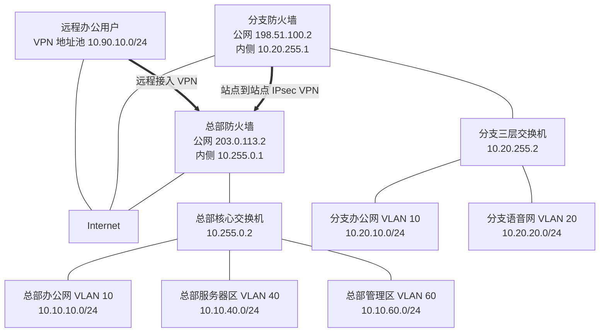
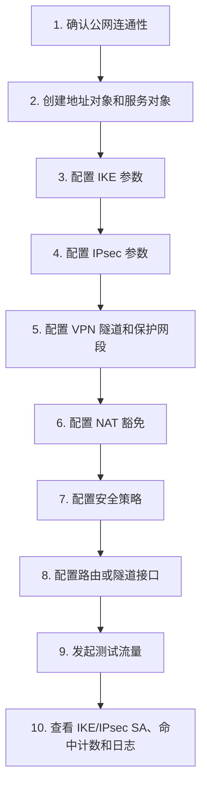
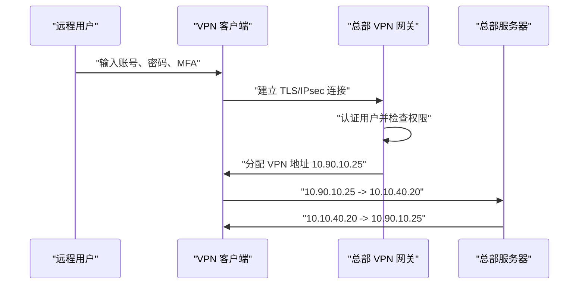
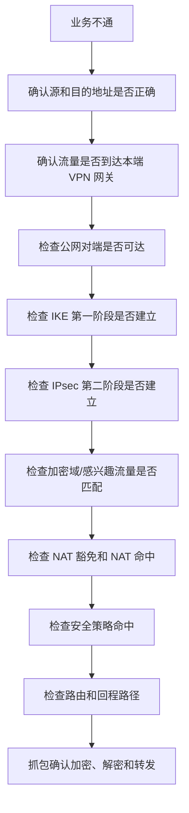

# 第 17 章：VPN 技术

## 17.1 学习目标

学完本章后，你应该能够：

- 解释 VPN 为什么存在，以及它和专线、普通互联网访问有什么区别。
- 区分站点到站点 VPN、远程接入 VPN、IPsec VPN、SSL VPN 和客户端 VPN。
- 说清楚隧道、封装、加密、认证、完整性校验、密钥协商这些核心概念。
- 理解 IPsec VPN 的两个阶段、IKE、ESP、安全关联、感兴趣流量和 NAT-T 的作用。
- 能够根据企业总部、分支和远程办公需求设计基础 VPN 地址规划。
- 能够写出一组站点到站点 IPsec VPN 的配置思路和策略表。
- 能够理解远程接入 VPN 的地址池、用户认证、访问控制、分流和全隧道。
- 能够排查 VPN 不通、能建立不能访问、单向通、部分网段不通、NAT 冲突、地址重叠等常见故障。
- 能够形成 VPN 上线前后的验证清单。

前几章已经讲过防火墙、安全策略和 NAT。本章继续沿着企业出口安全的方向，学习 VPN。

VPN 的全称是 Virtual Private Network，中文常叫虚拟专用网络。它的目标不是“创造一条真正的物理专线”，而是在不可信或半可信网络上，通过认证、加密和隧道封装，模拟出一条相对安全的私有通信通道。

企业里最常见的 VPN 需求有三类：

```text
总部和分支机构互联。
员工在外地或家里安全访问公司内网。
企业和合作伙伴、云平台、数据中心建立安全互联。
```

学习 VPN 时，初学者容易直接跳到配置命令，例如预共享密钥、加密算法、访问控制列表。这样很容易背完命令仍然不会排错。本章先讲 VPN 要解决的问题，再讲隧道如何工作，最后再进入 IPsec、SSL VPN、设计示例和排错方法。

本章仍然不绑定某个厂商命令。华为、H3C、Cisco、Fortinet、Palo Alto、山石、深信服等设备在界面和命令上差异很大，但 VPN 的工程逻辑相通。你要先能看懂：

```text
谁和谁建立隧道
用什么方式认证
保护哪些内网流量
流量是否需要 NAT
策略是否允许
路由是否指向隧道
隧道是否真的加密转发了数据
```

## 17.2 为什么企业需要 VPN

假设公司总部在上海，分支在杭州。总部有服务器网 `10.10.40.0/24`，分支有办公网 `10.20.10.0/24`。分支员工需要访问总部的文件服务器、ERP、代码仓库或内部 OA。

如果没有 VPN，分支访问总部内网会遇到几个问题：

| 问题 | 说明 |
| --- | --- |
| 私有地址不能在互联网直接路由 | `10.10.40.0/24` 和 `10.20.10.0/24` 都是私有地址，公网不会帮它们转发 |
| 数据暴露在公网路径上 | 普通互联网转发路径不受企业控制，中间链路不可信 |
| 访问源身份不好确认 | 总部无法仅凭公网 IP 判断请求是否一定来自合法分支 |
| 安全策略难以精确控制 | 直接发布内部服务到公网会扩大攻击面 |

VPN 的基本思路是：

```text
分支防火墙和总部防火墙先互相认证。
双方协商加密参数和密钥。
分支把访问总部内网的私有流量封装到公网报文里。
公网只负责转发外层报文。
总部收到后解封装，再把内层私有流量送到服务器。
```

可以把 VPN 理解成“在公网中套了一层安全包装”。


从 PC 和服务器角度看，它们仍然是在访问私有地址：

```text
10.20.10.25 -> 10.10.40.20
```

从互联网角度看，它只能看到两个公网地址之间的加密通信：

```text
198.51.100.2 -> 203.0.113.2
```

## 17.3 VPN 不等于专线

VPN 和专线都可以实现异地互联，但它们不是同一种东西。

| 对比项 | VPN | 专线 |
| --- | --- | --- |
| 承载网络 | 通常使用互联网，也可以跑在运营商网络上 | 运营商提供的专用链路或专用承载网络 |
| 安全能力 | 依靠认证、加密和策略控制 | 依靠物理或逻辑隔离，必要时仍可叠加加密 |
| 成本 | 通常较低 | 通常较高 |
| 部署速度 | 快，适合分支、临时办公、合作伙伴接入 | 需要运营商开通，周期较长 |
| 质量保障 | 取决于互联网质量，抖动和丢包不可完全控制 | 通常可购买 SLA |
| 典型用途 | 中小分支、远程办公、备份链路、云互联 | 核心生产链路、大带宽低时延业务 |

工程上经常会出现组合设计：

```text
总部和核心数据中心使用专线。
普通分支使用 Internet VPN。
关键分支使用专线 + VPN 备份。
远程办公用户使用客户端 VPN。
```

VPN 的优势是灵活，短板是依赖底层网络质量。VPN 隧道建立成功，不代表业务体验一定好。如果互联网链路丢包、延迟高、MTU 不合适，应用仍然可能卡顿或断开。

## 17.4 VPN 的核心概念

### 隧道

隧道是 VPN 最重要的概念。隧道不是一根真实的线，而是一种封装关系。

原始内层报文：

| 字段 | 示例 |
| --- | --- |
| 源 IP | `10.20.10.25` |
| 目的 IP | `10.10.40.20` |
| 协议 | TCP |
| 目的端口 | 445 或 443 |

经过 VPN 封装后，公网看到的外层报文可能是：

| 字段 | 示例 |
| --- | --- |
| 外层源 IP | `198.51.100.2` |
| 外层目的 IP | `203.0.113.2` |
| VPN 协议 | ESP 或 UDP 4500 |
| 负载 | 加密后的内层报文 |

隧道的意义是：内层私有地址可以被保护起来，由外层公网地址负责跨互联网转发。

### 加密

加密用于保护数据内容。没有加密时，中间路径上的设备可能看到应用数据。加密后，即使报文被抓到，也很难还原真实内容。

常见加密算法包括 AES 系列。工程设计中不建议继续使用老旧弱算法，例如 DES。具体设备支持哪些算法，要看型号、软件版本和授权。

### 认证

认证用于确认对端身份。VPN 建立前，双方必须确认“你是不是我要连接的那台设备或那个用户”。

常见认证方式：

| 认证方式 | 说明 | 常见场景 |
| --- | --- | --- |
| 预共享密钥 | 双方配置同一段密钥字符串 | 小型站点到站点 VPN |
| 数字证书 | 通过证书和 CA 验证身份 | 大规模 VPN、远程接入、合规要求较高场景 |
| 用户名密码 | 用户登录 VPN 网关 | 远程接入 VPN |
| MFA | 密码之外再验证短信、令牌、推送或硬件密钥 | 远程办公、管理员接入 |

预共享密钥容易部署，但不适合大规模长期运维。证书管理更复杂，但可扩展性和安全性更好。

### 完整性校验

完整性校验用于确认数据在传输过程中没有被篡改。加密解决“别人看不懂”，完整性解决“别人不能悄悄改”。

常见完整性算法包括 SHA-2 系列。工程中要避免使用明显过时的弱算法组合。

### 密钥协商

VPN 不会一直使用人工输入的密钥直接加密所有数据。实际过程通常是：

```text
双方先用认证方式确认身份。
再协商一组临时会话密钥。
后续数据使用临时密钥加密。
密钥定期更新。
```

这样即使某一段时间的会话密钥出现风险，也不会影响所有历史通信。

### 安全关联

安全关联常简称 SA，Security Association。它可以理解为 VPN 双方对一段安全通信关系达成的约定。

一条 SA 通常包含：

| 内容 | 示例 |
| --- | --- |
| 对端地址 | `203.0.113.2` 或 `198.51.100.2` |
| 加密算法 | AES |
| 完整性算法 | SHA-2 |
| 密钥生命周期 | 3600 秒、86400 秒等 |
| 保护的流量 | `10.20.10.0/24` 到 `10.10.40.0/24` |
| 封装方式 | tunnel mode |

排查 IPsec VPN 时，经常会看到“第一阶段 SA”“第二阶段 SA”“IKE SA”“IPsec SA”等术语。本章后面会展开。

## 17.5 VPN 的主要类型

企业里常见 VPN 可以按使用场景和技术方式分类。

### 按使用场景分类

| 类型 | 连接对象 | 典型用途 |
| --- | --- | --- |
| 站点到站点 VPN | 两台网关设备之间 | 总部和分支互联、企业和云平台互联 |
| 远程接入 VPN | 用户客户端和 VPN 网关之间 | 员工远程办公、外出运维 |
| 合作伙伴 VPN | 企业和外部机构网关之间 | 银企直连、供应链系统、B2B 接口 |

站点到站点 VPN 通常保护两个或多个内网网段之间的访问。用户电脑不一定知道 VPN 的存在，只要路由正确，流量会自动经过分支网关进入隧道。

远程接入 VPN 通常需要用户在电脑或手机上安装客户端，或者通过浏览器登录 VPN 门户。用户登录后获得一个虚拟地址，再访问被授权的内网资源。

### 按技术方式分类

| 类型 | 常见承载 | 适合场景 | 注意点 |
| --- | --- | --- | --- |
| IPsec VPN | IKE + ESP 或 UDP 4500 | 站点互联、云互联、部分客户端 VPN | 参数多，NAT、路由、策略要配合 |
| SSL VPN | TLS/HTTPS | 远程办公、网页登录、客户端接入 | 要重视用户认证、终端安全和权限控制 |
| L2TP over IPsec | L2TP + IPsec | 老系统远程接入 | 逐步被更现代客户端方案替代 |
| GRE over IPsec | GRE 隧道再用 IPsec 加密 | 需要承载动态路由或多协议 | 配置复杂，MTU 更要关注 |
| DMVPN/SD-WAN 类方案 | 多点隧道和控制器 | 多分支大规模互联 | 依赖厂商架构和运维平台 |

初学阶段最应该先掌握：

```text
站点到站点 IPsec VPN
远程接入 SSL/IPsec VPN
VPN 与路由、NAT、安全策略的关系
```

## 17.6 IPsec VPN 基础

IPsec 是企业站点互联中最常见的 VPN 技术之一。它工作在网络层，保护 IP 报文。

### IPsec 的两个核心协议

| 协议 | 作用 | 说明 |
| --- | --- | --- |
| AH | 认证和完整性保护 | 很少用于现代企业 VPN，因为和 NAT 兼容性差 |
| ESP | 加密、认证和完整性保护 | 站点到站点 IPsec VPN 最常见 |

工程中提到 IPsec VPN，通常默认是使用 ESP。

### 传输模式和隧道模式

| 模式 | 保护范围 | 常见用途 |
| --- | --- | --- |
| 传输模式 | 主要保护原始 IP 负载，不新增完整外层 IP 头 | 主机到主机，或某些特殊场景 |
| 隧道模式 | 把整个原始 IP 报文封装到新的外层 IP 报文中 | 站点到站点 VPN 最常见 |

站点到站点 VPN 一般使用隧道模式。原因是总部和分支内网使用私有地址，需要通过两端公网地址在互联网中转发。

### IKE 的作用

IKE 是 Internet Key Exchange，用于 VPN 双方自动协商参数和密钥。

如果没有 IKE，工程师需要手工配置大量密钥，几乎不可维护。IKE 负责：

```text
确认对端身份。
协商加密和完整性算法。
生成会话密钥。
定期更新密钥。
维护 VPN 安全关联。
```

常见版本有 IKEv1 和 IKEv2。IKEv2 通常更简洁，也更适合现代环境。但真实项目中还要看两端设备是否都支持、云平台模板要求什么、客户已有设备运行什么版本。

### IPsec 的两个阶段

很多设备把 IPsec VPN 协商分成两个阶段讲解。

| 阶段 | 常见名称 | 作用 |
| --- | --- | --- |
| 第一阶段 | IKE SA、Phase 1 | 建立安全的协商通道，验证对端身份 |
| 第二阶段 | IPsec SA、Phase 2 | 协商真正保护业务流量的加密参数和感兴趣流量 |

可以这样理解：

```text
第一阶段：双方先建立一个安全会议室。
第二阶段：在会议室里商量具体哪些业务流量要加密，以及怎么加密。
```

第一阶段失败时，隧道通常完全起不来。第二阶段失败时，可能看到 IKE 已建立，但业务流量不通。

### 感兴趣流量

感兴趣流量是指哪些流量需要进入 VPN 隧道。不同厂商可能叫 interesting traffic、proxy ID、traffic selector、加密域、保护子网、ACL 等。

示例：

| 本端网段 | 对端网段 | 是否进隧道 |
| --- | --- | --- |
| `10.20.10.0/24` | `10.10.40.0/24` | 是 |
| `10.20.10.0/24` | `8.8.8.8` | 否，普通上网 |
| `10.20.20.0/24` | `10.10.40.0/24` | 取决于是否加入加密域 |

站点到站点 VPN 排错中，感兴趣流量不匹配非常常见。例如分支配置的是 `10.20.10.0/24 -> 10.10.40.0/24`，总部配置成了 `10.10.40.0/24 -> 10.20.0.0/16`。有些设备可以兼容包含关系，有些设备要求精确匹配，最终表现取决于厂商实现。

### NAT-T

NAT-T 是 NAT Traversal，意思是让 IPsec 穿越 NAT。

原始 ESP 不是 TCP 或 UDP，没有端口号。很多 NAT 设备主要依赖端口区分会话，因此 ESP 穿越 NAT 容易出问题。NAT-T 会把 IPsec 数据封装到 UDP 4500 中，使它更容易穿越 NAT 设备。

常见端口和协议：

| 流量 | 协议或端口 | 用途 |
| --- | --- | --- |
| IKE | UDP 500 | 初始协商 |
| NAT-T | UDP 4500 | NAT 穿越后的 IKE/IPsec 数据 |
| ESP | IP 协议号 50 | IPsec 加密数据 |

如果两端之间有 NAT，或者一端在运营商宽带后面，排查时必须检查 UDP 500、UDP 4500 和 ESP 是否被允许。

## 17.7 本章示例拓扑和地址规划

本章继续使用前几章的总部网络，并新增一个分支和一组远程办公用户。



### 总部地址规划

| 区域 | 网段 | 网关 |
| --- | --- | --- |
| 总部办公网 | `10.10.10.0/24` | `10.10.10.1` |
| 总部服务器区 | `10.10.40.0/24` | `10.10.40.1` |
| 总部管理区 | `10.10.60.0/24` | `10.10.60.1` |
| 总部汇总内网 | `10.10.0.0/16` | 防火墙回内网下一跳 `10.255.0.2` |
| 总部公网地址 | `203.0.113.2` | 运营商下一跳 `203.0.113.1` |

### 分支地址规划

| 区域 | 网段 | 网关 |
| --- | --- | --- |
| 分支办公网 | `10.20.10.0/24` | `10.20.10.1` |
| 分支语音网 | `10.20.20.0/24` | `10.20.20.1` |
| 分支汇总内网 | `10.20.0.0/16` | 分支防火墙回内网下一跳 `10.20.255.2` |
| 分支公网地址 | `198.51.100.2` | 分支运营商下一跳 `198.51.100.1` |

### 远程接入地址规划

| 项目 | 地址或范围 | 说明 |
| --- | --- | --- |
| VPN 地址池 | `10.90.10.0/24` | 远程用户拨入后获得的虚拟地址 |
| DNS 服务器 | `10.10.40.10` | 企业内部 DNS |
| 允许访问资源 | `10.10.40.0/24`、`10.10.60.10` | 服务器区和堡垒机 |
| 禁止访问资源 | 财务终端、网络设备管理口 | 通过策略限制 |

### VPN 访问需求

| 编号 | 需求 | 说明 |
| ---: | --- | --- |
| 1 | 分支办公网访问总部服务器区 | `10.20.10.0/24 -> 10.10.40.0/24` |
| 2 | 总部服务器区访问分支办公网指定业务 | `10.10.40.0/24 -> 10.20.10.0/24` |
| 3 | 分支语音网暂不进入 VPN | 避免无关流量占用隧道 |
| 4 | 远程用户访问总部服务器区 | 通过远程接入 VPN 地址池访问 |
| 5 | 远程管理员先访问堡垒机，再管理设备 | 不允许 VPN 用户直接访问所有管理口 |

这个规划体现一个原则：VPN 不是“拨上来以后什么都能访问”。VPN 只是提供安全通道，通道里的权限仍然要由安全策略控制。

## 17.8 站点到站点 IPsec VPN 设计

站点到站点 VPN 的核心对象是两个网关设备。本章示例中是总部防火墙和分支防火墙。

### 设计前要确认的内容

配置前至少要确认以下信息：

| 项目 | 总部 | 分支 |
| --- | --- | --- |
| 公网地址 | `203.0.113.2` | `198.51.100.2` |
| 本端保护网段 | `10.10.40.0/24` | `10.20.10.0/24` |
| 对端保护网段 | `10.20.10.0/24` | `10.10.40.0/24` |
| 认证方式 | 预共享密钥或证书 | 与总部一致 |
| IKE 版本 | IKEv2 | 与总部一致 |
| 加密和完整性算法 | AES/SHA-2 类组合 | 与总部一致 |
| 生命周期 | 第一阶段、第二阶段分别约定 | 与总部一致或兼容 |
| NAT-T | 开启 | 开启 |

两端参数必须成对理解。总部的“本端网段”，就是分支的“对端网段”；总部的“对端公网地址”，就是分支的“本端公网地址”。

### 感兴趣流量规划

本章先只让分支办公网访问总部服务器区。

| 方向 | 本端网段 | 对端网段 | 说明 |
| --- | --- | --- | --- |
| 分支视角 | `10.20.10.0/24` | `10.10.40.0/24` | 分支办公访问总部服务器 |
| 总部视角 | `10.10.40.0/24` | `10.20.10.0/24` | 总部服务器响应分支办公 |

不要一开始就把总部 `10.10.0.0/16` 和分支 `10.20.0.0/16` 全部放进隧道。范围越大，影响面越大，排错越困难。可以先按业务需要开放，再逐步扩展。

### 安全策略规划

VPN 建立需要两类策略：

```text
允许两端公网地址之间建立 VPN 协商和加密通信。
允许隧道内的业务流量访问目标资源。
```

总部侧策略示例：

| 策略名称 | 源区域 | 目的区域 | 源地址 | 目的地址 | 服务 | 动作 |
| --- | --- | --- | --- | --- | --- | --- |
| `allow-branch-vpn-control` | Untrust | Local/Untrust | `198.51.100.2` | `203.0.113.2` | UDP 500/4500、ESP | Permit |
| `allow-branch-to-hq-server` | VPN/Untrust | Trust | `10.20.10.0/24` | `10.10.40.0/24` | 业务端口 | Permit |
| `allow-hq-server-to-branch` | Trust | VPN/Untrust | `10.10.40.0/24` | `10.20.10.0/24` | 业务响应或指定端口 | Permit |

不同厂商对 VPN 流量所在区域的定义不同。有的设备有专门的 VPN zone，有的仍然从外接口区域进入，有的把解密后流量重新匹配内外区域。真实配置时，要按设备策略匹配逻辑确认。

### NAT 豁免

站点 VPN 中最常见的错误之一，是本应进入 VPN 的私有流量被源 NAT 成公网地址。

错误路径：

```text
分支 PC 10.20.10.25 访问总部服务器 10.10.40.20
分支防火墙先匹配了上网源 NAT
源地址被改成 198.51.100.2
流量不再匹配 VPN 感兴趣流量
总部收到的也不是预期的分支内网地址
```

正确做法是在源 NAT 规则前面增加 NAT 豁免，或者确保 VPN 流量不命中普通上网 NAT。

分支侧 NAT 规则顺序示例：

| 顺序 | 源地址 | 目的地址 | 动作 | 说明 |
| ---: | --- | --- | --- | --- |
| 1 | `10.20.10.0/24` | `10.10.40.0/24` | 不做 NAT | VPN 豁免 |
| 2 | `10.20.0.0/16` | Any | 源 NAT 到公网接口 | 普通上网 |

总部侧也要考虑反方向是否有 NAT 规则影响。

### 路由规划

VPN 流量必须被送到 VPN 网关。

分支核心交换机：

| 目的网段 | 下一跳 | 说明 |
| --- | --- | --- |
| `0.0.0.0/0` | `10.20.255.1` | 默认送分支防火墙 |

分支防火墙：

| 目的网段 | 下一跳或出接口 | 说明 |
| --- | --- | --- |
| `10.20.0.0/16` | `10.20.255.2` | 回分支内网 |
| `10.10.40.0/24` | VPN 隧道或根据策略触发 | 到总部服务器区 |
| `0.0.0.0/0` | `198.51.100.1` | 普通互联网 |

总部防火墙：

| 目的网段 | 下一跳或出接口 | 说明 |
| --- | --- | --- |
| `10.10.0.0/16` | `10.255.0.2` | 回总部内网 |
| `10.20.10.0/24` | VPN 隧道或根据策略触发 | 到分支办公网 |
| `0.0.0.0/0` | `203.0.113.1` | 普通互联网 |

有些传统策略型 IPsec VPN 不需要显式隧道路由，设备根据感兴趣流量触发加密。有些路由型 VPN 会生成隧道接口，需要把对端网段路由指向隧道接口。两种模式的配置方式不同，但排错都离不开“流量是否被送到 VPN 处理逻辑”。

## 17.9 站点到站点 VPN 配置思路

以下是通用伪配置，用于帮助理解配置顺序。真实命令要按厂商文档和设备版本调整。

### 总部侧配置思路

地址对象：

```text
address-object OBJ_HQ_SERVER_NET 10.10.40.0/24
address-object OBJ_BRANCH_OFFICE_NET 10.20.10.0/24
address-object OBJ_BRANCH_PUBLIC 198.51.100.2/32
```

IKE 参数：

```text
ike-proposal IKEV2_STANDARD
  version ikev2
  encryption aes
  integrity sha2
  dh-group 14
  lifetime 86400
```

IPsec 参数：

```text
ipsec-proposal IPSEC_STANDARD
  protocol esp
  encryption aes
  integrity sha2
  pfs enable group14
  lifetime 3600
```

隧道对象：

```text
vpn-tunnel VPN_HQ_TO_BRANCH
  local-gateway 203.0.113.2
  remote-gateway 198.51.100.2
  authentication pre-shared-key <secure-shared-key>
  ike-proposal IKEV2_STANDARD
  ipsec-proposal IPSEC_STANDARD
  local-protected-network OBJ_HQ_SERVER_NET
  remote-protected-network OBJ_BRANCH_OFFICE_NET
  nat-traversal enable
```

安全策略：

```text
security-policy allow-branch-to-hq-server
  source-zone VPN
  destination-zone Trust
  source-address OBJ_BRANCH_OFFICE_NET
  destination-address OBJ_HQ_SERVER_NET
  service SVC_REQUIRED_BUSINESS
  action permit
  log enable
```

NAT 豁免：

```text
nat-policy no-nat-hq-to-branch
  source-address OBJ_HQ_SERVER_NET
  destination-address OBJ_BRANCH_OFFICE_NET
  action no-nat
```

### 分支侧配置思路

地址对象：

```text
address-object OBJ_BRANCH_OFFICE_NET 10.20.10.0/24
address-object OBJ_HQ_SERVER_NET 10.10.40.0/24
address-object OBJ_HQ_PUBLIC 203.0.113.2/32
```

隧道对象：

```text
vpn-tunnel VPN_BRANCH_TO_HQ
  local-gateway 198.51.100.2
  remote-gateway 203.0.113.2
  authentication pre-shared-key <secure-shared-key>
  ike-proposal IKEV2_STANDARD
  ipsec-proposal IPSEC_STANDARD
  local-protected-network OBJ_BRANCH_OFFICE_NET
  remote-protected-network OBJ_HQ_SERVER_NET
  nat-traversal enable
```

NAT 规则顺序：

```text
nat-policy no-nat-branch-to-hq
  source-address OBJ_BRANCH_OFFICE_NET
  destination-address OBJ_HQ_SERVER_NET
  action no-nat

nat-policy snat-branch-to-internet
  source-address 10.20.0.0/16
  destination-address any
  action source-nat interface-address
```

安全策略：

```text
security-policy allow-branch-office-to-hq-server
  source-zone Trust
  destination-zone VPN
  source-address OBJ_BRANCH_OFFICE_NET
  destination-address OBJ_HQ_SERVER_NET
  service SVC_REQUIRED_BUSINESS
  action permit
  log enable
```

### 配置顺序

推荐顺序如下：



不要只看“隧道状态显示 up”。VPN 状态 up 只能说明协商成功，不等于业务策略、路由、NAT 和服务器回包都正确。

## 17.10 远程接入 VPN

远程接入 VPN 面向单个用户，而不是两个固定站点。用户可能在家、酒店、机场、客户现场，也可能使用不同网络出口。

### 远程接入 VPN 的基本过程



远程用户拨入后，客户端通常会获得：

| 项目 | 示例 |
| --- | --- |
| VPN 虚拟地址 | `10.90.10.25` |
| 内部 DNS | `10.10.40.10` |
| 可访问网段 | `10.10.40.0/24`、`10.10.60.10/32` |
| 路由模式 | 分流或全隧道 |
| 会话超时时间 | 8 小时或按企业策略 |

### SSL VPN 和 IPsec 客户端 VPN

| 项目 | SSL VPN | IPsec 客户端 VPN |
| --- | --- | --- |
| 常见承载 | TLS/HTTPS | IKE/IPsec |
| 用户体验 | 可使用浏览器门户或客户端 | 通常使用客户端 |
| 穿越网络能力 | 对普通网络较友好 | 遇到 NAT 和限制网络时需要 NAT-T |
| 适合场景 | 远程办公、应用发布、轻量接入 | 需要完整网络层访问的远程用户 |
| 权限控制 | 可按用户、组、应用、资源控制 | 可按用户、组、地址、策略控制 |

很多现代防火墙把 SSL VPN 做成客户端接入，用户连接后像接入一个虚拟网卡。具体叫法可能是 SSL VPN、GlobalProtect、AnyConnect、FortiClient、SecoClient、EasyConnect 等，取决于厂商。

### 分流和全隧道

远程接入 VPN 最重要的设计选择之一是 split tunnel 和 full tunnel。

| 模式 | 流量路径 | 优点 | 风险或代价 |
| --- | --- | --- | --- |
| 分流 | 访问企业内网走 VPN，访问互联网走用户本地出口 | 节省总部带宽，体验好 | 用户本地上网不经过企业安全检测 |
| 全隧道 | 用户所有流量都进 VPN，再从企业出口上网 | 统一审计和安全控制 | 占用总部带宽，延迟可能更高 |

示例：

| 访问目标 | 分流模式 | 全隧道模式 |
| --- | --- | --- |
| `10.10.40.20` 内部服务器 | 走 VPN | 走 VPN |
| `10.10.60.10` 堡垒机 | 走 VPN | 走 VPN |
| `8.8.8.8` 公网 DNS | 本地上网 | 先到总部再出互联网 |
| 普通网站 | 本地上网 | 先到总部再出互联网 |

工程选择要看安全要求和带宽条件。普通办公常用分流，高安全行业或受管终端可能要求全隧道。

### 地址池设计

远程接入地址池不能和企业现有网段、分支网段、云上网段、合作伙伴网段冲突。

本章使用：

```text
远程 VPN 地址池：10.90.10.0/24
网关分配地址：10.90.10.25 等
```

地址池规划示例：

| 用户组 | 地址池 | 允许访问 |
| --- | --- | --- |
| 普通员工 | `10.90.10.0/24` | OA、文件系统、业务系统 |
| 运维人员 | `10.90.20.0/24` | 堡垒机、监控平台、指定服务器 |
| 外包人员 | `10.90.30.0/24` | 指定项目系统 |

把不同用户组放入不同地址池，可以让防火墙策略更清晰，也便于日志审计。

### 用户认证和权限控制

远程接入 VPN 的安全重点在用户身份。

常见认证来源：

| 认证来源 | 说明 |
| --- | --- |
| 本地用户 | 在 VPN 网关上创建账号，适合小规模临时使用 |
| AD/LDAP | 和企业域账号对接，适合统一账号管理 |
| RADIUS | 常用于对接认证服务器、动态口令或 MFA 平台 |
| 证书 | 通过设备证书或用户证书增强身份确认 |

最低要求：

```text
不要多人共用一个 VPN 账号。
不要只依赖弱密码。
离职人员账号要及时禁用。
管理员和普通员工要分组授权。
尽量启用 MFA。
```

权限控制示例：

| 用户组 | 源地址池 | 允许访问 | 禁止访问 |
| --- | --- | --- | --- |
| 普通员工 | `10.90.10.0/24` | `10.10.40.0/24` 的业务端口 | 网络设备管理口、数据库管理端口 |
| 运维人员 | `10.90.20.0/24` | 堡垒机 `10.10.60.10` | 直接 SSH/RDP 到所有服务器 |
| 外包人员 | `10.90.30.0/24` | 项目系统 `10.10.40.80:443` | 其他内网资源 |

远程 VPN 最常见的危险配置是“用户拨入后允许 Any 到 Any”。这样等于把远程终端直接放进公司内网，风险很高。

## 17.11 远程接入 VPN 配置思路

以下仍然使用伪配置，帮助你理解完整流程。

### 基础对象

```text
address-object OBJ_VPN_POOL_EMPLOYEE 10.90.10.0/24
address-object OBJ_VPN_POOL_OPS 10.90.20.0/24
address-object OBJ_HQ_SERVER_NET 10.10.40.0/24
address-object OBJ_BASTION 10.10.60.10/32
```

地址池：

```text
remote-access-pool RA_POOL_EMPLOYEE
  network 10.90.10.0/24
  dns-server 10.10.40.10
  domain corp.example

remote-access-pool RA_POOL_OPS
  network 10.90.20.0/24
  dns-server 10.10.40.10
  domain corp.example
```

用户组：

```text
user-group VPN_EMPLOYEE
  authentication radius
  address-pool RA_POOL_EMPLOYEE
  mfa enable

user-group VPN_OPS
  authentication radius
  address-pool RA_POOL_OPS
  mfa enable
```

远程接入门户或网关：

```text
remote-access-vpn RA_HQ
  listen-interface public
  listen-address 203.0.113.2
  protocol ssl-vpn
  server-certificate VPN_GATEWAY_CERT
  user-group VPN_EMPLOYEE,VPN_OPS
  idle-timeout 30
  max-session-time 8h
```

分流路由：

```text
split-tunnel RA_EMPLOYEE
  include 10.10.40.0/24
  include 10.10.60.10/32
```

安全策略：

```text
security-policy allow-vpn-employee-to-server
  source-zone VPN
  destination-zone Trust
  source-address OBJ_VPN_POOL_EMPLOYEE
  destination-address OBJ_HQ_SERVER_NET
  service SVC_BUSINESS_HTTPS,SVC_FILE_REQUIRED
  action permit
  log enable

security-policy allow-vpn-ops-to-bastion
  source-zone VPN
  destination-zone Trust
  source-address OBJ_VPN_POOL_OPS
  destination-address OBJ_BASTION
  service SVC_SSH,SVC_RDP,SVC_HTTPS
  action permit
  log enable
```

拒绝策略：

```text
security-policy deny-vpn-to-network-devices
  source-zone VPN
  destination-zone Trust
  source-address 10.90.0.0/16
  destination-address OBJ_NETWORK_DEVICE_MGMT
  service any
  action deny
  log enable
```

### 远程接入验证清单

上线后要验证：

| 验证项 | 方法 | 预期结果 |
| --- | --- | --- |
| 用户认证 | 使用普通员工账号登录 | 登录成功并要求 MFA |
| 地址分配 | 查看客户端虚拟网卡 | 获得 `10.90.10.0/24` 地址 |
| DNS 下发 | 解析内部域名 | 能解析到内部地址 |
| 分流路由 | 查看客户端路由表 | 只有企业内网路由指向 VPN |
| 业务访问 | 访问 `10.10.40.20:443` | 连接成功 |
| 越权访问 | 普通员工访问设备管理口 | 被拒绝并有日志 |
| 会话超时 | 空闲超过策略时间 | 会话断开或重新认证 |

远程接入 VPN 的验证不能只测试“能登录”。更重要的是确认“只能访问应该访问的资源”。

## 17.12 VPN 与防火墙策略、NAT、路由的关系

VPN 经常不是单独坏，而是被策略、NAT 或路由影响。

### 与安全策略的关系

VPN 至少涉及三种流量：

| 流量类型 | 示例 | 策略关注点 |
| --- | --- | --- |
| VPN 协商流量 | UDP 500、UDP 4500、ESP | 对端公网地址是否允许 |
| 隧道内业务流量 | `10.20.10.25 -> 10.10.40.20` | 解密后源、目的、服务是否允许 |
| 管理和认证流量 | RADIUS、LDAP、DNS、证书校验 | VPN 网关能否访问认证和 DNS 服务 |

如果 VPN 网关要向内部 RADIUS 服务器认证用户，但防火墙策略没有允许网关到 RADIUS 的 UDP 1812/1813，也会导致用户无法登录。

### 与 NAT 的关系

需要特别关注三类 NAT：

| NAT 场景 | 对 VPN 的影响 | 处理方式 |
| --- | --- | --- |
| 普通上网源 NAT | 可能误把 VPN 私网流量 NAT 掉 | 增加 NAT 豁免并放在前面 |
| VPN 穿越运营商 NAT | ESP 可能不通 | 开启 NAT-T，允许 UDP 4500 |
| 地址重叠 NAT | 双方私网冲突时无法直接路由 | 设计专用转换地址 |

地址重叠示例：

```text
总部使用 10.10.0.0/16
合作伙伴也使用 10.10.0.0/16
双方不能直接把 10.10.0.0/16 放进 VPN
需要协商一组中间映射地址，例如把伙伴系统映射为 172.31.10.0/24
```

地址重叠 VPN 是高级场景，实施前必须画清楚 NAT 前地址、NAT 后地址、策略匹配地址和日志中的地址，否则很容易把问题排复杂。

### 与路由的关系

VPN 成功建立后，业务还要能正确进出隧道。

常见路由错误：

| 错误 | 现象 |
| --- | --- |
| 内网核心没有把远端网段送到防火墙 | 内网服务器回包走错网关 |
| 防火墙缺少回内网路由 | 解密后流量到不了服务器 |
| 分支默认路由不指向分支防火墙 | 分支 PC 流量不经过 VPN 网关 |
| 远程接入没有下发内网路由 | 用户已登录，但访问内网仍走本地网络 |
| 全隧道缺少出口 NAT | 用户登录后不能上互联网 |

排查时不要只在 VPN 页面看状态。要从真实业务源地址出发，看路由下一跳。

## 17.13 VPN MTU 与性能

VPN 会给报文增加额外封装头。封装后报文变大，如果超过链路 MTU，就可能分片或被丢弃。

### MTU 问题的表现

常见现象：

| 现象 | 可能原因 |
| --- | --- |
| ping 小包通，大包不通 | VPN 封装后超过 MTU |
| 网页能打开一部分，上传下载失败 | 大报文被丢弃或分片异常 |
| 远程桌面卡顿、文件复制中断 | 丢包、分片或 MSS 不合适 |
| 某些应用登录成功但业务操作失败 | 应用数据包尺寸变大后出问题 |

### 为什么 VPN 会影响 MTU

普通以太网 MTU 常见为 1500 字节。IPsec、UDP 4500、外层 IP 头都会增加额外开销。如果内层报文已经接近 1500 字节，外层封装后就可能超过链路允许大小。

处理思路：

| 方法 | 说明 |
| --- | --- |
| 调整 TCP MSS | 让 TCP 会话协商更小的数据段 |
| 允许必要分片 | 根据安全要求谨慎配置 |
| 设置隧道接口 MTU | 路由型 VPN 常见 |
| 排查 PMTUD | 确认 ICMP 不被错误拦截 |

工程上常见做法是在 VPN 网关上对经过隧道的 TCP 流量调整 MSS。具体数值要结合设备建议和链路测试，不要盲目套用。

### 性能关注点

VPN 性能受多方面影响：

| 因素 | 说明 |
| --- | --- |
| 设备加密性能 | 防火墙或路由器的 VPN 吞吐可能低于普通转发吞吐 |
| 并发隧道数 | 多分支和大量远程用户会消耗资源 |
| 加密算法 | 更强算法可能需要更多计算资源 |
| 底层链路质量 | 丢包、延迟和抖动会直接影响体验 |
| 日志和安全检测 | 深度检测、审计、杀毒可能增加延迟 |

选型时不要只看设备标称防火墙吞吐，要看 IPsec VPN 吞吐、SSL VPN 用户数、并发会话数和授权限制。

## 17.14 VPN 排查方法

VPN 排错要分层。不要一开始就反复改密钥或算法。

### 站点到站点 VPN 排查流程



### 常用检查点

| 检查点 | 要看什么 |
| --- | --- |
| 公网连通性 | 两端公网地址是否可达，UDP 500/4500 是否被拦 |
| 第一阶段状态 | IKE SA 是否建立，对端身份和认证是否成功 |
| 第二阶段状态 | IPsec SA 是否建立，加密域是否匹配 |
| 加密计数 | 本端 encrypt 计数是否增加 |
| 解密计数 | 对端 decrypt 计数是否增加 |
| NAT 命中 | VPN 流量是否命中 no-nat，而不是上网 NAT |
| 策略日志 | 解密后流量是否被安全策略放行 |
| 路由表 | 远端网段是否指向隧道或 VPN 处理逻辑 |
| 抓包 | 内层私网流量和外层 VPN 流量是否符合预期 |

### 常见故障矩阵

| 故障现象 | 可能原因 | 排查方向 |
| --- | --- | --- |
| 隧道完全起不来 | 预共享密钥错误、IKE 版本不一致、对端地址错误、UDP 500 被拦 | 查第一阶段日志和公网连通性 |
| 第一阶段成功，第二阶段失败 | 加密域不匹配、IPsec 参数不一致、PFS 不一致 | 查第二阶段协商日志 |
| 隧道 up，但业务不通 | 策略未放行、路由错误、NAT 未豁免、服务器网关错误 | 查策略命中、路由和 NAT |
| 只有单向通 | 回程路由错误、对端策略只放单方向、NAT 单侧错误 | 从反方向抓包和查会话 |
| 某个网段不通 | 网段未加入加密域或策略对象 | 查保护网段和地址对象 |
| 小包通大包不通 | MTU/MSS 问题 | 测试大包 ping，调整 MSS |
| 远程用户能登录不能访问内网 | 未下发路由、策略未放行、DNS 错误、地址池无回程路由 | 查客户端路由、策略日志和内网回包 |
| 远程用户访问内网慢 | 带宽不足、全隧道绕行、终端网络差、安全检测过重 | 查链路质量和设备性能 |

### 抓包位置

站点到站点 VPN 抓包建议至少看四个位置：


| 位置 | 应该看到什么 |
| --- | --- |
| 分支防火墙内侧 | `10.20.10.25 -> 10.10.40.20` 原始流量 |
| 分支防火墙外侧 | `198.51.100.2 -> 203.0.113.2` VPN 外层流量 |
| 总部防火墙外侧 | 来自 `198.51.100.2` 的 VPN 外层流量 |
| 总部防火墙内侧 | 解密后的 `10.20.10.25 -> 10.10.40.20` |

如果分支内侧有原始流量，外侧没有 VPN 流量，问题多半在分支 VPN 匹配、NAT、策略或路由。  
如果总部外侧有 VPN 流量，内侧没有解密流量，问题多半在总部解密、第二阶段、策略或路由。  
如果服务器收到请求但分支收不到响应，要重点查服务器回程网关和总部回程策略。

## 17.15 VPN 安全设计要点

VPN 一旦配置过宽，会把远端网络、远程终端或合作伙伴直接带进企业内网。因此 VPN 设计必须和安全策略一起考虑。

### 最小权限

不要把 VPN 做成 Any 到 Any。应该按业务定义：

```text
谁从哪里来
通过什么 VPN 进入
访问哪个系统
使用哪些端口
是否需要记录日志
是否需要审批和定期复核
```

示例策略：

| 来源 | 目的 | 服务 | 动作 |
| --- | --- | --- | --- |
| 分支办公网 `10.20.10.0/24` | 总部业务服务器 `10.10.40.20` | HTTPS | Permit |
| 分支办公网 `10.20.10.0/24` | 总部数据库 `10.10.40.30` | Any | Deny |
| 远程员工地址池 `10.90.10.0/24` | OA 系统 | HTTPS | Permit |
| 远程员工地址池 `10.90.10.0/24` | 网络设备管理网 | Any | Deny |
| 运维地址池 `10.90.20.0/24` | 堡垒机 `10.10.60.10` | SSH/RDP/HTTPS | Permit |

### 账号和密钥管理

| 项目 | 建议 |
| --- | --- |
| 预共享密钥 | 使用足够复杂的密钥，避免多人长期共享，变更后记录 |
| 证书 | 注意有效期、吊销和私钥保护 |
| 用户账号 | 和企业身份系统对接，离职自动禁用 |
| MFA | 远程接入和管理员接入优先启用 |
| 日志 | 记录登录、失败认证、访问策略命中和异常断开 |

### 终端安全

远程接入 VPN 的风险不只在 VPN 网关，也在用户电脑。用户电脑如果感染恶意软件，VPN 可能成为进入内网的通道。

常见控制手段：

| 控制 | 说明 |
| --- | --- |
| 终端检查 | 检查系统版本、防病毒、补丁状态 |
| 设备证书 | 只允许受管设备接入 |
| 最小权限 | 用户只访问必要系统 |
| 堡垒机 | 运维人员先进入堡垒机，不直接管理服务器 |
| 会话超时 | 空闲自动断开，减少长期暴露 |

### 合作伙伴 VPN

合作伙伴 VPN 要更谨慎，因为对端网络不受本企业完全控制。

建议：

```text
只开放指定系统和端口。
不要允许合作伙伴访问整个服务器区。
使用单独地址对象、单独策略、单独日志。
必要时把合作伙伴流量引入隔离区或 DMZ。
合同或对接文档中写清双方地址、端口、联系人和变更流程。
```

## 17.16 VPN 上线实施清单

VPN 变更通常跨团队、跨地点，实施前要准备充分。

### 上线前

| 检查项 | 内容 |
| --- | --- |
| 拓扑确认 | 两端公网地址、内网网段、设备位置 |
| 地址冲突检查 | 本端、对端、云上、远程地址池是否重叠 |
| 参数确认 | IKE 版本、认证方式、算法、生命周期、PFS、NAT-T |
| 策略确认 | 哪些源、目的、端口允许，是否开日志 |
| NAT 确认 | VPN 流量是否豁免，普通上网 NAT 是否在后面 |
| 路由确认 | 两端内网回程是否正确 |
| 账号确认 | 远程接入用户、用户组、MFA、权限 |
| 回退准备 | 原配置备份、回退步骤、窗口和联系人 |

### 上线中

| 步骤 | 验证 |
| --- | --- |
| 配置公网侧参数 | 两端公网可达，UDP 500/4500 可协商 |
| 配置 IKE/IPsec | 第一阶段和第二阶段建立 |
| 发起测试流量 | 加密和解密计数增加 |
| 验证业务端口 | 业务系统能访问，不只测试 ping |
| 验证拒绝策略 | 非授权网段和端口被拒绝 |
| 记录日志 | 登录、策略命中、隧道状态有日志 |

### 上线后

| 检查项 | 内容 |
| --- | --- |
| 监控 | 隧道状态、丢包、延迟、带宽、会话数 |
| 日志复核 | 是否有异常登录、暴力尝试、越权访问 |
| 文档更新 | 地址、策略、参数、联系人、回退方案 |
| 权限复核 | 用户组和合作伙伴访问范围是否符合最小权限 |
| 定期演练 | 密钥轮换、证书续期、故障切换、回退流程 |

VPN 不是配完就结束。隧道参数、证书有效期、用户账号、对端公网地址和业务端口都会变化，必须纳入日常运维。

## 17.17 自检练习

请尝试回答以下问题：

1. 总部服务器区是 `10.10.40.0/24`，分支办公网是 `10.20.10.0/24`。站点到站点 VPN 两端的本端网段和对端网段应该分别怎么写？
2. 为什么 VPN 流量通常需要 NAT 豁免？如果没有 NAT 豁免，可能出现什么现象？
3. IPsec 第一阶段成功、第二阶段失败，优先检查哪些参数？
4. 远程用户已经登录 VPN，但访问 `10.10.40.20` 不通。你会按什么顺序排查？
5. 分流和全隧道分别适合什么场景？它们对总部出口带宽和安全审计有什么影响？
6. 为什么不建议把远程 VPN 用户直接放行到所有内网网段？
7. VPN 小包 ping 通，大包不通，可能是什么问题？应该从哪些方向处理？
8. 合作伙伴 VPN 双方都使用 `10.10.0.0/16` 时，为什么不能直接互通？可能的解决思路是什么？

## 17.18 本章小结

本章学习了 VPN 的基本概念和企业应用方式。

VPN 的核心价值，是在不可信网络上建立经过认证和加密保护的通信通道。站点到站点 VPN 用于总部、分支、云平台和合作伙伴互联；远程接入 VPN 用于员工在外部网络中安全访问企业资源。

IPsec VPN 的重点不是某一条命令，而是完整链路：

```text
公网可达 -> 身份认证 -> IKE 第一阶段 -> IPsec 第二阶段 -> 感兴趣流量 -> NAT 豁免 -> 安全策略 -> 路由回程 -> 业务验证
```

远程接入 VPN 的重点也不是“用户能登录”，而是：

```text
用户是谁
使用什么终端
分配哪个地址池
能访问哪些资源
是否启用 MFA
是否记录日志
是否符合最小权限
```

VPN 经常和防火墙策略、NAT、路由、DNS、认证服务器、MTU 和底层链路质量纠缠在一起。排错时要从真实业务流量出发，分层确认：流量是否到达 VPN 网关、隧道是否建立、加密和解密计数是否增加、策略是否允许、回程是否正确。

下一章将继续学习防火墙高级功能，例如安全检测、入侵防御、URL 过滤、应用识别、日志审计和高可用等内容。这些能力会和 VPN、NAT、策略一起构成企业边界安全的完整体系。
