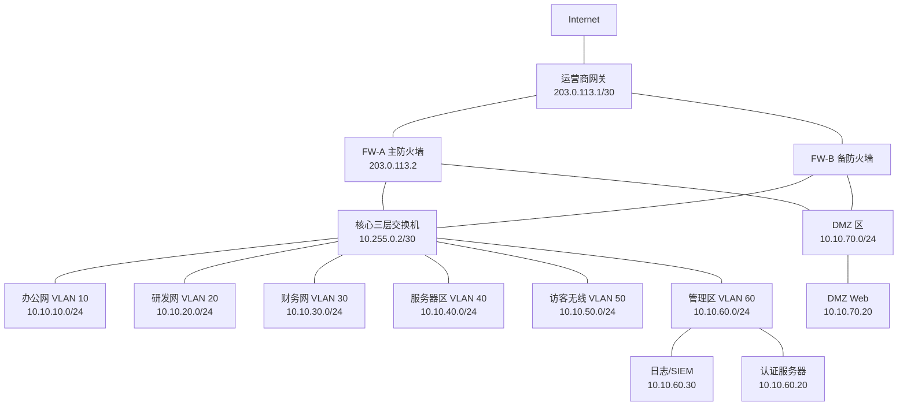
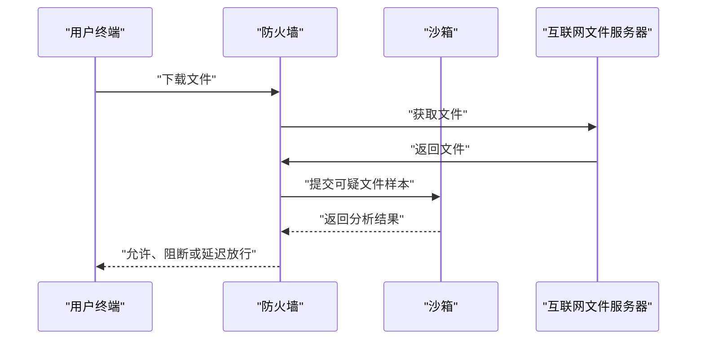
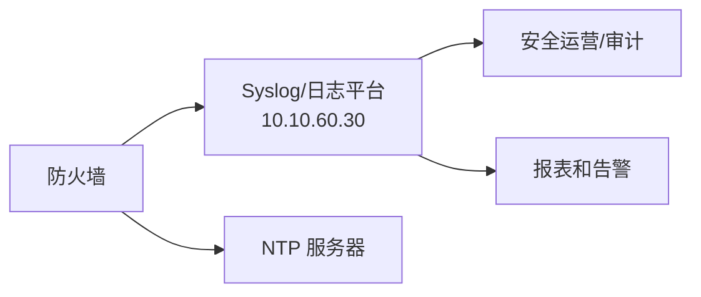
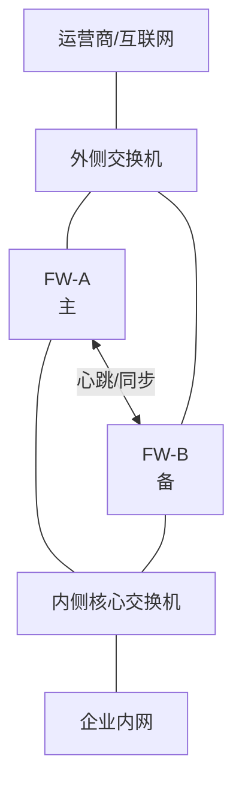
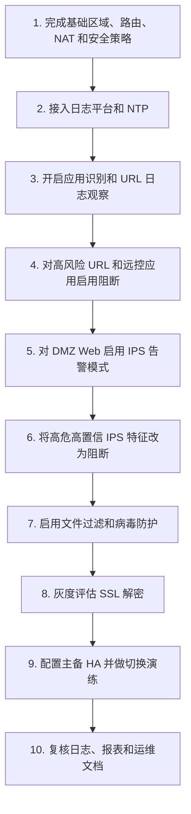
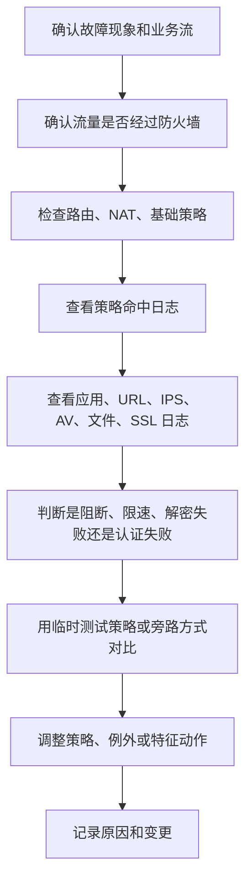

# 第 18 章：防火墙高级功能

## 18.1 学习目标

学完本章后，你应该能够：

- 解释下一代防火墙常见高级功能解决什么问题。
- 区分传统五元组安全策略和基于应用、用户、内容的安全控制。
- 理解应用识别、URL 过滤、入侵防御、病毒防护、文件过滤、沙箱检测、SSL 解密、用户认证、带宽管理、攻击防护、日志审计和双机热备的基本作用。
- 能够判断哪些高级功能适合部署在互联网出口、DMZ 边界、数据中心边界、远程接入 VPN 边界和内部隔离边界。
- 能够把高级功能和路由、NAT、安全策略、VPN、日志平台结合起来设计一套可运维的企业防火墙方案。
- 能够理解高级功能可能带来的性能、误拦截、证书、隐私、授权、运维复杂度等影响。
- 能够按流量路径、策略命中、功能模块、日志证据、旁路验证的顺序排查高级功能相关故障。
- 能够写出一份高级安全功能上线前后的验证清单。

第 14 章讲了防火墙基础概念，第 15 章讲了基础配置，第 16 章讲了 NAT，第 17 章讲了 VPN。本章继续学习防火墙的高级功能。

很多厂商会把这些能力称为下一代防火墙能力，也可能用 NGFW、UTM、安全网关、威胁防护、内容安全、应用控制等名称。不同厂商界面差异很大，但工程逻辑基本一致：

```text
传统防火墙主要判断“源、目的、端口、协议是否允许”。
高级防火墙进一步判断“这是什么应用、哪个用户、访问什么内容、是否包含威胁、是否符合企业安全要求”。
```

初学者学习本章时要避免两个误区：

```text
误区一：高级功能越多越安全，所以全部打开。
误区二：高级功能太复杂，所以只用基础策略，不做任何检测。
```

正确做法是：先明确业务边界和风险，再选择合适功能，灰度启用，持续观察日志，最后形成可维护的策略体系。

## 18.2 什么是防火墙高级功能

传统防火墙最核心的判断条件是五元组：

| 字段 | 示例 |
| --- | --- |
| 源 IP | `10.10.10.25` |
| 源端口 | `51524` |
| 目的 IP | `203.0.113.100` |
| 目的端口 | `443` |
| 协议 | TCP |

如果策略写成：

```text
源：办公网 10.10.10.0/24
目的：Internet
服务：TCP 443
动作：允许
```

那么只要流量使用 TCP 443，传统策略就可能允许它通过。但在今天的企业网络中，很多完全不同的应用都使用 TCP 443：

| 流量 | 是否可能使用 TCP 443 | 风险差异 |
| --- | --- | --- |
| 访问企业 SaaS 系统 | 是 | 常见办公需求 |
| 访问网盘上传文件 | 是 | 可能造成数据外泄 |
| 使用远程控制软件 | 是 | 可能绕过运维入口 |
| 访问恶意域名 | 是 | 可能下载木马或回连控制端 |
| 员工观看视频 | 是 | 可能占用带宽 |
| 加密通信中的攻击载荷 | 是 | 传统端口策略不一定看得见 |

所以只看端口已经不够。高级功能就是在基础转发和策略之上，继续识别和控制更多信息。

常见高级功能包括：

| 功能 | 主要判断对象 | 典型用途 |
| --- | --- | --- |
| 应用识别 | 应用协议和行为特征 | 区分 Web、网盘、远程控制、即时通信、视频等 |
| URL 过滤 | 网站域名、URL、分类、信誉 | 控制上网访问范围，阻断恶意网站 |
| 入侵防御 IPS | 攻击特征、漏洞利用行为 | 阻断扫描、漏洞攻击、异常协议行为 |
| 病毒防护 | 文件内容、恶意代码特征 | 阻断恶意文件下载和传播 |
| 文件过滤 | 文件类型、扩展名、方向 | 限制可执行文件、脚本、敏感格式上传下载 |
| 沙箱检测 | 可疑文件动态行为 | 分析未知文件是否恶意 |
| SSL 解密 | 加密流量解密后检测 | 让安全模块能检查 HTTPS 内部内容 |
| 用户认证 | 用户、用户组、终端身份 | 按人而不是只按 IP 控制访问 |
| 带宽管理 | 应用、用户、地址的流量速率 | 保证关键业务带宽，限制娱乐或大流量应用 |
| 攻击防护 | DoS、扫描、暴力尝试、异常连接 | 保护防火墙和内部服务可用性 |
| 日志审计 | 策略命中、威胁、URL、用户、流量 | 排错、审计、溯源和合规 |
| 双机热备 | 设备、链路、会话状态 | 提高出口或边界设备可用性 |

这些功能不是互相替代的关系。它们通常叠加在一条安全策略或安全配置文件上。

## 18.3 高级功能解决什么问题

### 只放行端口会留下什么风险

假设企业允许办公网访问互联网的 HTTP 和 HTTPS：

```text
Trust -> Untrust
源：办公网、研发网、财务网
目的：Any
服务：DNS、HTTP、HTTPS
动作：Permit
```

这条策略能满足基本上网，但会留下很多问题：

| 问题 | 传统策略是否容易发现 | 说明 |
| --- | --- | --- |
| 员工访问恶意下载站 | 不容易 | 端口仍然是 443 |
| 木马回连控制服务器 | 不容易 | 可能伪装成 HTTPS |
| 网盘批量上传资料 | 不容易 | 可能和普通 Web 访问一样走 443 |
| 远程控制软件穿透内网 | 不容易 | 很多远控软件使用云中继和 443 |
| 已知漏洞攻击 DMZ Web | 不容易 | 目的端口可能就是正常的 443 |
| 视频流量占满出口 | 不容易 | 仍然是合法的 Web 流量 |

高级功能的价值在于让防火墙不只看到“端口”，而是尽量看懂“行为”。

### 高级功能不是替代基础设计

高级功能不能弥补所有基础设计错误。例如：

| 基础问题 | 高级功能能否根治 | 正确处理 |
| --- | --- | --- |
| 内网网段规划混乱 | 不能 | 重新梳理地址和区域 |
| 默认允许所有区域互访 | 不能 | 先按最小权限重写安全策略 |
| NAT 规则错误 | 不能 | 先修正 NAT 和路由 |
| 服务器直接暴露数据库端口 | 不能 | 先收敛发布面 |
| 管理口暴露到公网 | 不能 | 先限制管理面访问 |
| 日志未保存 | 不能 | 先建立日志审计和留存 |

高级功能应该建立在正确的区域、路由、NAT、安全策略和日志基础之上。

可以按下面顺序理解：

```text
第一层：拓扑和区域正确。
第二层：路由和 NAT 正确。
第三层：基础安全策略最小放行。
第四层：高级安全功能按场景叠加。
第五层：日志、监控、审计和定期优化。
```

## 18.4 本章示例拓扑

本章继续使用前几章的中小企业网络，并增加日志平台、认证服务器和防火墙双机。



### 地址和角色规划

| 对象 | 地址或网段 | 角色 |
| --- | --- | --- |
| 办公网 | `10.10.10.0/24` | 普通员工终端 |
| 研发网 | `10.10.20.0/24` | 研发终端和开发工具 |
| 财务网 | `10.10.30.0/24` | 财务终端，高敏感区域 |
| 服务器区 | `10.10.40.0/24` | 内部业务服务器 |
| 访客无线 | `10.10.50.0/24` | 访客上网，不可信 |
| 管理区 | `10.10.60.0/24` | 堡垒机、认证、日志和网管 |
| DMZ | `10.10.70.0/24` | 对外发布服务器 |
| DMZ Web | `10.10.70.20` | 企业官网或门户 |
| 认证服务器 | `10.10.60.20` | AD/LDAP/RADIUS 等 |
| 日志平台 | `10.10.60.30` | Syslog/SIEM/日志分析 |
| 防火墙外侧 | `203.0.113.2/30` | 互联网出口地址 |

### 高级功能部署目标

本章假设企业有以下安全需求：

| 编号 | 需求 | 可能使用的功能 |
| ---: | --- | --- |
| 1 | 员工可以正常办公上网，但禁止高风险远控和违规网盘 | 应用识别、URL 过滤、日志审计 |
| 2 | 访客无线只能访问互联网，不记录到内部系统 | 区域策略、URL 过滤、带宽限制 |
| 3 | DMZ Web 对外发布时要检测常见漏洞攻击 | IPS、攻击防护、日志告警 |
| 4 | 防止终端下载明显恶意文件 | 病毒防护、文件过滤、沙箱 |
| 5 | 财务网访问互联网更严格 | 用户/地址分组、URL 过滤、文件过滤 |
| 6 | 运维人员通过 VPN 后只能访问授权资源 | 用户认证、VPN 策略、日志 |
| 7 | 出口防火墙故障时业务能够切换 | 双机热备、链路监控、会话同步 |
| 8 | 出现安全事件时能追踪源用户、源地址、访问目标和策略 | 日志审计、时间同步、SIEM |

这些需求不能只靠一条策略完成，需要多个功能配合。

## 18.5 高级功能启用原则

高级功能会增加检测深度，也会增加设备负载和运维复杂度。上线前要先理解几个原则。

### 原则一：先观察，再阻断

很多高级功能都可能误判。比如某些内部系统的自定义协议可能被识别为异常应用，某些运维脚本可能被文件过滤拦截，某些业务请求可能命中 IPS 特征。

推荐顺序：

```text
1. 先开启日志或告警模式。
2. 观察一段业务周期。
3. 识别真实业务和异常流量。
4. 对高置信风险启用阻断。
5. 对误报建立例外或调整策略。
```

不要在不了解业务的情况下把所有威胁配置文件直接设置为最高强度阻断。

### 原则二：不同区域使用不同强度

不同流量方向的风险不同，检测策略也应不同。

| 流量方向 | 建议强度 | 说明 |
| --- | --- | --- |
| Trust -> Untrust | 中等到较高 | 关注恶意网站、网盘、远控、下载文件 |
| Guest -> Untrust | 中等 | 访客只需上网，重点限制带宽和恶意访问 |
| Untrust -> DMZ | 高 | 外部访问对外服务器，重点检测漏洞攻击 |
| DMZ -> Trust | 高 | DMZ 被攻破后可能向内横向移动 |
| VPN -> Server | 中等到高 | 根据用户身份和资源敏感度控制 |
| Management -> 设备 | 高审计 | 管理访问要强认证和完整日志 |

### 原则三：性能容量要按开启功能重新评估

防火墙设备规格里通常会列出多种性能指标：

| 指标 | 含义 |
| --- | --- |
| 防火墙吞吐 | 基础转发和策略检查性能 |
| IPS 吞吐 | 开启入侵防御后的吞吐 |
| 威胁防护吞吐 | 开启 IPS、AV、应用识别等综合功能后的吞吐 |
| SSL 解密吞吐 | 解密 HTTPS 后再检测的吞吐 |
| 最大并发会话 | 同时维护的连接数量 |
| 每秒新建会话 | 每秒能建立多少新连接 |
| VPN 吞吐 | 加密隧道转发能力 |

同一台设备，基础转发可以达到较高吞吐，但开启 IPS、病毒防护、SSL 解密后，实际可承载流量可能明显下降。

选型和上线前必须问清楚：

```text
实际要开启哪些功能？
峰值出口流量是多少？
并发用户和并发会话是多少？
HTTPS 解密比例是多少？
日志写入量是多少？
是否需要预留未来增长？
```

### 原则四：授权和特征库要持续维护

很多高级功能依赖授权和特征库。

| 依赖项 | 影响 |
| --- | --- |
| 应用识别库 | 影响应用控制准确性 |
| URL 分类库 | 影响网站分类和恶意站点识别 |
| IPS 特征库 | 影响漏洞攻击检测 |
| 病毒库 | 影响恶意文件识别 |
| 沙箱服务 | 影响未知文件分析 |
| 威胁情报 | 影响恶意 IP、域名、URL 阻断 |
| 设备授权 | 影响功能是否可用和能否更新 |

如果授权过期或特征库长期不更新，高级功能的有效性会下降。运维时要把授权到期时间纳入巡检。

## 18.6 应用识别与应用控制

### 为什么需要应用识别

传统策略把 TCP 80 看成 HTTP，把 TCP 443 看成 HTTPS。但现代应用经常动态使用端口，或者把多种业务封装在 HTTPS 中。

应用识别的目标是判断：

```text
这条流量到底属于什么应用，而不只是使用了哪个端口。
```

例如：

| 表面特征 | 实际可能是 |
| --- | --- |
| TCP 443 | 企业 SaaS、视频网站、远程控制、网盘、即时通信、恶意回连 |
| TCP 80 | 普通网页、下载站、代理工具、老旧应用 |
| UDP 443 | QUIC、HTTP/3、视频应用、浏览器访问 |
| 随机端口 | P2P、游戏、远控、穿透工具 |

应用识别通常通过端口、协议握手、报文特征、域名、证书、行为模式等信息综合判断。

### 应用控制适合做什么

应用控制可以用于：

| 场景 | 示例 |
| --- | --- |
| 禁止高风险远程控制 | 阻断未经批准的远控软件，只允许堡垒机和正式 VPN |
| 控制网盘上传 | 禁止个人网盘上传，允许企业网盘 |
| 限制娱乐应用 | 对视频、游戏、直播限速或阻断 |
| 放行关键 SaaS | 对办公系统、代码平台、邮件系统明确允许 |
| 区分应用子功能 | 某些设备可区分登录、浏览、上传、下载、聊天等行为 |

### 示例：办公网上网应用控制

假设企业希望办公网可以正常访问办公类网站，但不允许个人网盘上传和未经授权远程控制。

可以设计如下策略：

| 顺序 | 策略名称 | 源 | 目的 | 应用 | 动作 | 日志 |
| ---: | --- | --- | --- | --- | --- | --- |
| 1 | `deny-office-remote-control` | `10.10.10.0/24` | Internet | 高风险远控应用 | Deny | 开启 |
| 2 | `deny-office-personal-cloud-upload` | `10.10.10.0/24` | Internet | 个人网盘上传 | Deny | 开启 |
| 3 | `allow-office-business-apps` | `10.10.10.0/24` | Internet | 邮件、企业协作、SaaS | Permit | 开启 |
| 4 | `allow-office-web-basic` | `10.10.10.0/24` | Internet | Web browsing | Permit | 开启 |

这里要注意：

```text
应用控制通常仍然要结合服务端口、URL、用户和日志。
不要只依赖一个应用名称就认为策略完整。
```

### 应用识别常见问题

| 现象 | 可能原因 | 排查方向 |
| --- | --- | --- |
| 应用识别为 unknown | 应用加密、特征库过旧、流量太少 | 更新特征库，观察完整会话 |
| 正常业务被识别成高风险应用 | 特征相似或厂商识别误报 | 查日志，建立例外，提交厂商分析 |
| 阻断策略不生效 | 策略顺序在允许策略之后 | 检查策略命中顺序 |
| HTTPS 应用无法精细识别 | 加密隐藏内容 | 结合 SNI、证书、URL 分类或 SSL 解密 |
| QUIC 绕过部分检测 | 浏览器使用 UDP 443 | 评估是否限制 QUIC，让流量回落到 TCP 443 |

应用识别不是百分之百准确。重要业务上线前，要使用真实客户端测试。

## 18.7 URL 过滤

### URL 过滤解决什么问题

URL 过滤用于控制用户访问哪些网站或网页。它常用于上网行为管理、恶意网站阻断和合规审计。

URL 过滤通常可以按以下维度匹配：

| 维度 | 示例 |
| --- | --- |
| 域名 | `example.com` |
| 完整 URL | `https://example.com/download/a.exe` |
| 分类 | 新闻、搜索、社交、赌博、恶意软件、钓鱼、网盘 |
| 信誉 | 已知恶意、可疑、新注册域名 |
| 用户或用户组 | 财务部、研发部、访客 |
| 时间段 | 工作时间、非工作时间 |

### URL 过滤和 DNS 过滤的区别

URL 过滤和 DNS 过滤经常一起出现，但它们不是完全相同。

| 对比项 | DNS 过滤 | URL 过滤 |
| --- | --- | --- |
| 判断位置 | 域名解析阶段 | HTTP/HTTPS 访问阶段 |
| 典型对象 | 域名 | 域名、路径、分类、信誉 |
| 优点 | 处理早，开销较低 | 控制更细 |
| 限制 | 看不到具体 URL 路径 | HTTPS 细粒度路径可能需要解密 |
| 例子 | 阻断 `bad.example` 解析 | 阻断某站下载路径或某类网页 |

DNS 过滤能在访问前阻断恶意域名，但如果用户使用外部加密 DNS 或直接访问 IP，效果会受影响。URL 过滤能看到更多 Web 访问信息，但 HTTPS 加密后可见信息取决于设备能力和是否做 SSL 解密。

### 示例：不同用户组的 URL 策略

| 用户或网段 | 允许 | 阻断 | 说明 |
| --- | --- | --- | --- |
| 办公网 `10.10.10.0/24` | 办公、搜索、技术、新闻 | 恶意、钓鱼、赌博、未授权远控 | 保持正常办公 |
| 研发网 `10.10.20.0/24` | 技术、代码托管、软件仓库 | 恶意、钓鱼、违规网盘 | 允许必要开发资源 |
| 财务网 `10.10.30.0/24` | 银行、税务、办公系统 | 高风险分类、个人邮箱、网盘上传 | 更严格 |
| 访客网 `10.10.50.0/24` | 常规 Web | 内网地址、恶意、违规、P2P | 只提供基础上网 |

URL 策略应该先和管理制度对齐。网络工程师不应凭个人喜好决定哪些网站可访问，而应根据企业安全制度、业务需求和审批流程配置。

### URL 过滤排错

| 现象 | 可能原因 | 排查方向 |
| --- | --- | --- |
| 网站打不开 | URL 分类被阻断、误归类、策略顺序错误 | 查 URL 日志和策略命中 |
| 同一网站部分功能异常 | 某些子域名或 API 被阻断 | 浏览器开发者工具或日志查看被拦截域名 |
| HTTP 能控，HTTPS 控不细 | 未解密，只能看到域名或证书信息 | 评估是否需要 SSL 解密 |
| 用户绕过过滤 | 使用代理、VPN、DoH/DoT | 阻断未授权代理和外部 DNS |
| 访客访问内网地址 | URL 过滤不是内网隔离工具 | 用区域策略或 ACL 阻断内网目的地址 |

URL 过滤的日志很重要。只告诉用户“网站被拦截”不够，运维需要知道被哪条策略、哪个分类、哪个用户命中。

## 18.8 入侵防御 IPS

### IPS 和 IDS 的区别

入侵检测系统 IDS 主要发现和告警，入侵防御系统 IPS 可以在线阻断。

| 对比项 | IDS | IPS |
| --- | --- | --- |
| 部署方式 | 旁路监听较常见 | 串联转发较常见 |
| 处理动作 | 告警为主 | 告警、阻断、重置连接 |
| 对业务影响 | 通常不直接影响转发 | 误阻断会影响业务 |
| 适合阶段 | 监控、分析、取证 | 在线防护 |

防火墙上的 IPS 通常是串联工作的：流量经过防火墙时，IPS 模块检测报文是否匹配攻击特征或异常行为。

### IPS 检测什么

IPS 常见检测对象包括：

| 检测对象 | 示例 |
| --- | --- |
| 漏洞利用 | Web 漏洞、远程代码执行、SQL 注入、命令注入 |
| 扫描行为 | 端口扫描、服务探测、目录扫描 |
| 协议异常 | 不符合协议规范的报文 |
| 暴力破解 | SSH、RDP、FTP、Web 登录尝试 |
| 恶意工具 | 已知攻击工具通信特征 |
| 横向移动 | 内网主机异常访问服务器或管理端口 |

IPS 不等于漏洞修复。它可以在网络边界阻断一些利用行为，但服务器本身仍然要打补丁、关闭不必要端口、加固账号权限。

### 示例：保护 DMZ Web

DMZ Web `10.10.70.20` 通过公网地址 `203.0.113.10` 发布 HTTPS。基础策略允许外部访问 HTTPS：

| 字段 | 值 |
| --- | --- |
| 源区域 | Untrust |
| 目的区域 | DMZ |
| 源地址 | Any |
| 目的地址 | DMZ Web |
| 服务 | HTTPS |
| 动作 | Permit |

在这条策略上叠加 IPS 后，可以重点检测：

| 检测类型 | 动作建议 | 说明 |
| --- | --- | --- |
| 高危 Web 漏洞利用 | 阻断 | 高置信、高风险 |
| SQL 注入和命令注入 | 阻断或告警后阻断 | 结合业务测试 |
| 目录扫描 | 告警或限速 | 可能有误报 |
| WebShell 上传特征 | 阻断 | 结合文件过滤更好 |
| 异常 User-Agent | 告警 | 单独阻断可能误伤 |

上线时可以先对 DMZ Web 使用“告警模式”观察一段时间，再把高危高置信特征改成阻断。

### IPS 误报和漏报

| 类型 | 含义 | 处理 |
| --- | --- | --- |
| 误报 | 正常业务被当成攻击 | 查日志、抓包、确认业务，建立例外或调低特征 |
| 漏报 | 攻击没有被发现 | 更新特征库，补充 WAF/EDR/日志分析 |

IPS 的目标是降低风险，不是保证所有攻击都能被发现。对外 Web 系统通常还需要 WAF、主机安全、代码安全、漏洞扫描和日志监控配合。

### IPS 排错

| 现象 | 可能原因 | 排查方向 |
| --- | --- | --- |
| 外部访问 DMZ 业务间歇失败 | IPS 阻断部分请求 | 查 IPS 日志中的源 IP、URL、特征 ID |
| 某个客户端访问失败，其他正常 | 客户端请求特征异常或被信誉阻断 | 对比正常与异常请求 |
| 开启 IPS 后吞吐下降 | 检测开销增加 | 查看 CPU、会话、新建连接和设备规格 |
| IPS 没有日志 | 流量未经过策略、未绑定配置文件、日志未开 | 查安全策略命中和配置文件 |
| 阻断不生效 | 处于只告警模式或策略方向不对 | 查动作和流量方向 |

## 18.9 病毒防护、文件过滤与沙箱

### 病毒防护

防火墙病毒防护通常检查经过设备传输的文件，判断是否包含已知恶意代码。

常见检测方向：

| 方向 | 示例 |
| --- | --- |
| 下载 | 用户从互联网下载可执行文件、压缩包、文档 |
| 上传 | 内部终端上传文件到外部网站 |
| 邮件附件 | SMTP/POP3/IMAP 或邮件网关场景 |
| DMZ 上传 | 外部用户向 Web 系统上传文件 |

病毒防护依赖病毒库和文件解析能力。加密压缩包、未知恶意样本、HTTPS 未解密流量都可能影响检测效果。

### 文件过滤

文件过滤不一定判断文件是否恶意，而是按照文件类型控制传输。

例如：

| 文件类型 | 策略示例 | 原因 |
| --- | --- | --- |
| `.exe`、`.scr`、`.bat` | 禁止普通用户从互联网下载 | 降低恶意程序风险 |
| `.ps1`、`.vbs`、`.js` | 限制下载或上传 | 脚本容易被滥用 |
| Office 宏文档 | 告警或阻断 | 常见钓鱼载体 |
| 压缩包 | 允许但记录 | 业务常见，需要审计 |
| 财务报表类文件 | 限制外发 | 需要 DLP 或文件审计配合 |

文件过滤可以降低风险，但不能替代数据防泄漏系统。真正的数据防泄漏通常还需要内容识别、敏感词、指纹、审批和终端控制。

### 沙箱检测

沙箱用于分析未知或可疑文件。基本流程是：



沙箱可能有几种处理方式：

| 方式 | 说明 | 影响 |
| --- | --- | --- |
| 先放行后追溯 | 文件先给用户，之后发现恶意再告警 | 体验好，但风险窗口存在 |
| 等待判定后放行 | 沙箱判定安全后再交付 | 安全性高，但用户等待 |
| 高风险阻断，低风险放行 | 结合信誉和文件类型 | 折中 |

### 示例：办公网文件安全策略

| 流量 | 文件类型 | 动作 | 日志 |
| --- | --- | --- | --- |
| 办公网下载 | 已知病毒 | 阻断 | 开启 |
| 办公网下载 | 可执行文件 | 阻断或审批例外 | 开启 |
| 办公网下载 | Office 文档 | 病毒检测，宏文档告警 | 开启 |
| 研发网下载 | 开发工具安装包 | 允许指定站点，记录 | 开启 |
| 财务网上传 | 压缩包、表格 | 记录或限制到指定系统 | 开启 |
| DMZ Web 上传 | 脚本、可执行文件 | 阻断 | 开启 |

### 文件安全排错

| 现象 | 可能原因 | 排查方向 |
| --- | --- | --- |
| 用户下载文件失败 | 文件类型被阻断、病毒命中、沙箱延迟 | 查文件过滤和病毒日志 |
| 只有 HTTPS 下载检测不到 | 未启用 SSL 解密 | 查看可见协议和解密策略 |
| 研发下载工具被拦截 | 文件策略过宽 | 为指定源、目的、URL 建立例外 |
| 沙箱造成下载很慢 | 等待判定模式 | 调整策略或只对高风险类型送检 |
| 压缩包内病毒未发现 | 加密压缩或解析限制 | 增加终端杀毒和邮件网关检测 |

## 18.10 SSL 解密

### 为什么 SSL 解密会成为问题

现在大量业务都使用 HTTPS。HTTPS 保护用户和服务器之间的通信内容，但也让网络安全设备难以看到具体 URL、文件和攻击载荷。

如果没有 SSL 解密，防火墙通常只能看到：

| 可见信息 | 示例 |
| --- | --- |
| 目的 IP | `203.0.113.100` |
| 目的端口 | TCP 443 |
| SNI 或证书域名 | `www.example.com`，取决于协议和客户端行为 |
| 证书信息 | 颁发者、有效期、域名 |
| 流量大小和连接行为 | 上传下载量、会话时间 |

它通常看不到：

| 不可见或不完整信息 | 示例 |
| --- | --- |
| 完整 URL 路径 | `/download/payroll.xlsx` |
| 页面内容 | 表单、正文、返回数据 |
| 传输文件内容 | 文档、压缩包、可执行文件 |
| 部分攻击载荷 | SQL 注入、命令注入、WebShell 上传内容 |

SSL 解密的目的，是让防火墙在企业授权和合规范围内，对部分 HTTPS 流量进行解密检测，再重新加密转发。

### SSL 解密的两类场景

| 场景 | 方向 | 说明 |
| --- | --- | --- |
| 出站解密 | 内部用户访问互联网 HTTPS | 防火墙模拟服务器证书给客户端，再访问真实网站 |
| 入站解密 | 外部用户访问企业发布的 HTTPS 服务 | 防火墙持有企业服务器证书，对外部访问进行检测 |

出站解密通常需要在企业终端安装防火墙或企业 CA 证书，否则浏览器会提示证书不可信。

入站解密通常需要防火墙上配置企业 Web 服务器证书或配合负载均衡/WAF。

### SSL 解密的风险和边界

SSL 解密不是默认应该对所有流量开启。它涉及隐私、合规、性能和业务兼容性。

| 风险 | 说明 |
| --- | --- |
| 隐私合规 | 银行、医疗、个人邮箱等流量可能不适合解密 |
| 性能压力 | 解密和重新加密消耗 CPU 或专用加速资源 |
| 证书信任 | 终端必须信任企业 CA，否则访问报错 |
| 应用兼容性 | 证书固定、双向证书、特殊客户端可能失败 |
| 运维复杂度 | 需要维护证书、例外列表、日志和审批 |

常见做法是：

```text
对恶意分类、未知分类、文件下载、普通 Web 访问按需解密。
对银行、医疗、政务、个人隐私、证书固定应用设置不解密例外。
对服务器入站流量优先在 DMZ 或 WAF 侧做明确范围的解密检测。
```

### SSL 解密排错

| 现象 | 可能原因 | 排查方向 |
| --- | --- | --- |
| 浏览器提示证书不可信 | 终端未安装企业 CA | 检查证书部署 |
| 某个 App 无法联网 | 证书固定或双向认证 | 加入不解密例外 |
| 开启解密后网页变慢 | 设备解密性能不足 | 查看 SSL 解密吞吐和 CPU |
| URL 路径仍不可见 | 未命中解密策略或 TLS 版本/协议限制 | 查解密日志 |
| 某些网站登录失败 | Cookie、证书、重定向或兼容性问题 | 临时旁路对比 |

SSL 解密要谨慎上线。它通常需要安全、法务、合规、桌面运维和业务部门共同确认。

## 18.11 用户认证与基于用户的策略

### 为什么只按 IP 控制不够

传统策略经常写成：

```text
10.10.10.0/24 可以访问某系统。
10.10.30.0/24 可以访问财务系统。
```

这适合静态地址规划清楚的网络，但在真实企业中会遇到问题：

| 问题 | 说明 |
| --- | --- |
| DHCP 地址变化 | IP 不一定长期代表同一用户 |
| 共享终端 | 多人使用同一台电脑 |
| 远程接入 | VPN 用户地址来自地址池 |
| 无线漫游 | 用户位置和地址可能变化 |
| 审计困难 | 只知道 IP，不知道是谁 |

基于用户的策略希望把“谁在访问”纳入判断。

### 用户身份来源

防火墙可以通过多种方式获取用户身份：

| 方式 | 说明 | 常见场景 |
| --- | --- | --- |
| 本地用户 | 在防火墙上创建账号 | 小规模管理或临时 VPN |
| LDAP/AD | 对接企业目录 | 域用户上网和内网权限 |
| RADIUS | 对接认证系统 | VPN、无线、802.1X |
| Portal 认证 | 用户网页登录认证 | 访客、临时用户 |
| 单点登录联动 | 从 AD、终端或认证日志获取用户-IP 绑定 | 办公网透明识别 |
| 证书 | 设备或用户证书 | 高安全接入 |

### 示例：按用户组控制 VPN 访问

远程接入 VPN 用户登录后，防火墙不仅要知道地址池，还要知道用户属于哪个组。

| 用户组 | VPN 地址池 | 允许访问 | 服务 |
| --- | --- | --- | --- |
| 普通员工 | `10.90.10.0/24` | OA、邮件、知识库 | HTTPS |
| 运维人员 | `10.90.20.0/24` | 堡垒机 `10.10.60.10` | HTTPS/SSH/RDP |
| 财务人员 | `10.90.30.0/24` | 财务系统 `10.10.40.50` | HTTPS |
| 外包人员 | `10.90.40.0/24` | 指定项目系统 | HTTPS |

不要写成：

```text
VPN 地址池 -> 内网 Any：Permit
```

远程接入 VPN 是常见攻击入口，必须使用最小权限、强认证、日志和定期复核。

### 用户认证排错

| 现象 | 可能原因 | 排查方向 |
| --- | --- | --- |
| 用户无法登录 VPN | 密码错误、账号禁用、认证服务器不可达 | 查认证日志和 RADIUS/LDAP 连通性 |
| 登录成功但策略不匹配 | 用户组同步错误或策略引用错误 | 查用户-IP 绑定和组映射 |
| 日志只显示 IP 不显示用户 | 身份识别未启用或绑定过期 | 查用户识别模块 |
| 离职用户仍可访问 | 账号未禁用或本地账号遗漏 | 对接身份系统，清理本地账号 |
| 多人共用账号 | 审计失真 | 禁止共享账号，启用 MFA |

用户身份是安全策略的重要条件，但前提是身份来源可靠、同步及时、日志完整。

## 18.12 带宽管理和 QoS

### 为什么防火墙要做带宽管理

企业出口带宽是有限资源。即使安全策略允许某些流量，也不代表它应该无限制占用带宽。

常见问题：

| 现象 | 可能原因 |
| --- | --- |
| 视频会议卡顿 | 下载、视频、网盘同步占满出口 |
| VPN 访问慢 | 普通上网流量挤占 VPN 带宽 |
| 分支访问总部系统慢 | 大文件传输占用隧道 |
| 访客无线影响办公 | 访客流量没有限速 |
| 备份任务影响白天业务 | 定时任务未做限速或时间窗口 |

带宽管理的目标不是简单限速，而是保证关键业务体验。

### 常见控制方式

| 方式 | 说明 |
| --- | --- |
| 最大带宽 | 某类流量最多使用多少带宽 |
| 保证带宽 | 关键业务至少保留多少带宽 |
| 优先级 | 拥塞时优先转发语音、视频会议、业务系统 |
| 按用户限速 | 每个用户或地址限制速率 |
| 按应用限速 | 对视频、网盘、P2P 限速 |
| 按时间段 | 工作时间和非工作时间不同策略 |

### 示例：出口带宽管理

假设企业互联网出口带宽为 500 Mbps。

| 流量类型 | 策略 | 说明 |
| --- | --- | --- |
| VPN 和远程办公 | 保证 80 Mbps | 保证外部员工访问 |
| 视频会议 | 保证 100 Mbps，较高优先级 | 保证会议体验 |
| 企业 SaaS | 保证 150 Mbps | 关键办公 |
| 访客无线 | 最大 50 Mbps | 避免影响办公 |
| 视频娱乐 | 最大 80 Mbps | 工作时间限制 |
| 网盘同步 | 最大 50 Mbps | 防止大文件占满出口 |

带宽策略要结合真实监控调整。第一次配置通常只是起点，不是最终答案。

### 带宽管理排错

| 现象 | 可能原因 | 排查方向 |
| --- | --- | --- |
| 限速不生效 | 流量未匹配应用或策略顺序错误 | 查看流量分类和策略命中 |
| 关键业务仍然卡顿 | 保证带宽不足或下游链路拥塞 | 看端到端链路，不只看出口 |
| 所有流量都慢 | 总带宽不足、设备性能瓶颈 | 查看接口利用率、CPU、丢包 |
| 某应用被误限速 | 应用识别错误 | 调整应用对象或例外 |
| VPN 慢 | 加密性能、MTU、对端链路、带宽策略 | 综合排查 |

QoS 只能在本设备控制排队和转发，不能保证互联网中间路径一定不拥塞。

## 18.13 攻击防护和基础 DoS 防护

### 防火墙可能遭遇哪些攻击

边界防火墙直接面对互联网，常见攻击包括：

| 攻击或异常 | 说明 |
| --- | --- |
| 端口扫描 | 扫描公网地址开放端口 |
| 暴力破解 | 尝试登录 VPN、SSH、Web 管理 |
| SYN Flood | 大量半连接消耗服务器或防火墙资源 |
| UDP Flood | 大量 UDP 流量占用带宽和处理能力 |
| ICMP Flood | 大量 ICMP 请求造成资源消耗 |
| 畸形报文 | 利用协议异常触发设备或系统问题 |
| 应用层请求洪泛 | 大量 HTTP 请求压垮 Web 服务 |

### 防护思路

| 防护手段 | 作用 |
| --- | --- |
| 管理面限制 | 管理口只允许管理区或堡垒机访问 |
| 黑白名单 | 对高风险来源阻断，对可信来源放行 |
| 连接数限制 | 限制单源或单目的并发连接 |
| 新建连接限制 | 限制每秒新建连接 |
| SYN 防护 | 缓解 SYN Flood |
| 扫描检测 | 发现异常端口探测 |
| 地理位置控制 | 对不需要访问的区域进行限制 |
| 威胁情报阻断 | 阻断已知恶意 IP 或域名 |
| 上游清洗 | 大流量 DDoS 需要运营商或云清洗 |

这里要特别注意：

```text
防火墙不是无限容量的 DDoS 清洗设备。
如果攻击流量已经打满运营商链路，防火墙本地策略无法恢复带宽。
大流量攻击需要上游运营商、云清洗或高防服务配合。
```

### 管理面安全

防火墙自身管理面非常重要。常见加固项：

| 项目 | 建议 |
| --- | --- |
| Web/SSH 管理 | 只允许管理区或堡垒机访问 |
| 公网管理 | 默认禁止，确需开启必须限制源地址和 MFA |
| 默认账号 | 禁用或修改 |
| 密码策略 | 长度、复杂度、过期、失败锁定 |
| 管理协议 | 优先 HTTPS/SSH，关闭 Telnet/HTTP |
| 登录日志 | 记录成功、失败、配置变更 |
| 时间同步 | 使用 NTP，保证日志时间准确 |
| 权限分级 | 运维、审计、只读账号分开 |

管理面暴露公网是非常高风险的做法。很多真实安全事件不是业务策略被绕过，而是管理入口被弱口令或漏洞攻破。

### 攻击防护排错

| 现象 | 可能原因 | 排查方向 |
| --- | --- | --- |
| 外部用户大量访问失败 | DoS 策略误触发 | 查攻击防护日志和阈值 |
| VPN 登录被封锁 | 暴力破解防护阈值太低或用户输错多次 | 查登录失败来源 |
| 防火墙 CPU 高 | 扫描、洪泛、日志风暴、SSL 解密压力 | 看会话、新建连接、接口流量 |
| 链路满但防火墙没高负载 | 上游链路被打满 | 联系运营商查入口流量 |
| 管理登录异常 | 暴力尝试或账号泄露 | 立即限制源地址、改密、查日志 |

## 18.14 日志审计与监控

### 为什么日志是高级功能的基础

没有日志，高级功能很难运维。用户说“网络不通”时，如果没有策略命中、URL 阻断、IPS 告警、NAT 转换、VPN 登录、会话记录，就只能猜。

防火墙至少应记录：

| 日志类型 | 用途 |
| --- | --- |
| 流量日志 | 谁访问了哪里，命中哪条策略 |
| 威胁日志 | IPS、病毒、恶意域名、攻击防护 |
| URL 日志 | 用户访问的网站和分类 |
| 应用日志 | 应用识别结果和控制动作 |
| VPN 日志 | 登录、认证失败、隧道建立和断开 |
| 系统日志 | 接口、路由、HA、资源、授权 |
| 管理日志 | 管理员登录、配置修改、提交和回滚 |
| NAT 日志 | 地址转换关系，必要时用于溯源 |

### 日志字段

一条有价值的安全日志应尽量包含：

| 字段 | 示例 |
| --- | --- |
| 时间 | `2026-06-08 10:15:30` |
| 源地址 | `10.10.10.25` |
| 源用户 | `corp\\zhangsan` |
| 目的地址 | `203.0.113.100` |
| 目的端口 | TCP 443 |
| 应用 | Web browsing 或某网盘 |
| URL/域名 | `example.com` |
| 策略名称 | `allow-office-web-basic` |
| 动作 | Permit 或 Deny |
| 威胁名称 | 某 IPS 特征或病毒名称 |
| NAT 前后地址 | `10.10.10.25 -> 203.0.113.2` |
| 设备名称 | `FW-A` |

如果日志只写“deny”，却没有源、目的、策略和原因，排错价值很低。

### 日志平台和时间同步

防火墙本地存储有限，企业通常会把日志发送到日志平台或 SIEM。



关键要求：

| 要求 | 说明 |
| --- | --- |
| NTP 同步 | 多设备日志时间必须一致 |
| 日志留存 | 根据企业制度和合规要求保存 |
| 告警规则 | 高危 IPS、病毒、暴力破解、HA 切换要告警 |
| 查询能力 | 能按用户、IP、URL、策略、时间查询 |
| 权限控制 | 日志平台访问也要受控 |
| 容量规划 | 日志量大时要规划存储和索引 |

### 日志审计常见问题

| 问题 | 影响 | 处理 |
| --- | --- | --- |
| 未开启策略日志 | 无法确认策略命中 | 关键策略开启日志 |
| 时间不准 | 事件排序混乱 | 配置 NTP |
| 只保存在本地 | 设备故障或覆盖后日志丢失 | 发送到日志平台 |
| 日志量过大 | 存储和查询压力 | 分级记录，过滤低价值日志 |
| 没有用户字段 | 难以追责 | 对接用户认证 |
| NAT 后无法溯源 | 只看到公网地址 | 记录 NAT 转换和源用户 |

日志不是越多越好，而是要能回答工程问题：

```text
谁在什么时间，从哪里，访问了哪里，命中了哪条规则，结果是什么，是否包含风险。
```

## 18.15 双机热备和高可用

### 为什么防火墙需要高可用

出口防火墙、数据中心边界防火墙、VPN 网关通常是关键路径设备。如果只有一台，设备故障、升级重启、接口故障都可能造成大范围中断。

防火墙高可用的目标是：

```text
一台设备或链路故障时，业务尽快切换到另一台设备，尽量减少中断时间。
```

### 常见高可用模式

| 模式 | 说明 | 适合场景 |
| --- | --- | --- |
| 主备模式 | 一台转发，另一台待命 | 最常见，逻辑清晰 |
| 双活模式 | 两台同时转发部分流量 | 要求更高，设计更复杂 |
| 集群模式 | 多台设备组成集群 | 大规模或特定厂商方案 |

初学者先掌握主备模式。

### 主备模式的基本概念

主备防火墙通常需要：

| 组件 | 作用 |
| --- | --- |
| 心跳链路 | 两台设备互相检测状态 |
| 配置同步 | 主设备配置同步到备设备 |
| 会话同步 | 切换后已有连接尽量不中断 |
| 虚拟 IP 或虚拟 MAC | 上下游设备使用稳定网关 |
| 接口监控 | 内外侧链路故障触发切换 |
| 优先级 | 决定哪台设备优先成为主 |

简化拓扑：



### 会话同步为什么重要

防火墙是状态检测设备。它不仅转发包，还维护会话表。

如果主设备故障切换到备设备，但备设备没有会话状态，可能出现：

| 业务 | 影响 |
| --- | --- |
| 普通网页 | 用户重新加载后恢复 |
| 文件下载 | 下载中断 |
| VPN 隧道 | 可能重建 |
| 语音视频 | 通话中断或短暂卡顿 |
| 数据库连接 | 应用报错或重连 |

会话同步可以减少影响，但不代表所有业务都完全无感。加密业务、长连接、应用超时、上下游 ARP 更新都会影响切换体验。

### 高可用设计注意事项

| 项目 | 注意点 |
| --- | --- |
| 上下游连接 | 最好避免单交换机或单链路成为新单点 |
| 心跳链路 | 建议独立或冗余，避免误切换 |
| 配置同步 | 明确哪些配置同步，哪些本地配置不同 |
| NAT 地址 | 主备切换后公网地址和 ARP 要正确 |
| VPN | 检查隧道是否支持状态同步或快速重建 |
| 路由 | 动态路由邻居和静态路由下一跳要考虑切换 |
| 日志 | 两台设备日志都要送日志平台 |
| 升级 | 先备后主，按厂商建议做兼容性检查 |

### 高可用排错

| 现象 | 可能原因 | 排查方向 |
| --- | --- | --- |
| 主备频繁切换 | 心跳丢包、接口抖动、监控阈值过敏 | 查 HA 日志和接口状态 |
| 切换后内网不能上网 | ARP 未更新、NAT 状态异常、路由缺失 | 查上下游邻居和会话 |
| 配置不同步 | 同步链路异常或本地配置冲突 | 查同步状态 |
| 备机无法接管 | 授权、版本、接口、配置不一致 | 做切换演练 |
| VPN 切换后断开 | 隧道状态未同步或对端绑定公网地址 | 查 VPN 日志和对端状态 |

高可用必须演练。没有演练过的 HA，只能算“配置了 HA”，不能算“验证过的高可用”。

## 18.16 综合设计示例

### 需求描述

某企业有 300 名员工，使用第 18.4 节的网络拓扑。安全负责人提出以下要求：

1. 办公网、研发网、财务网可以访问互联网。
2. 访客无线只能访问互联网，不能访问内网，且总带宽不超过 50 Mbps。
3. 禁止普通员工使用未批准远控软件。
4. 禁止访问恶意、钓鱼、赌博和明显违规网站。
5. DMZ Web 对外发布 HTTPS，并启用 IPS。
6. 员工下载可执行文件需要阻断，研发网访问指定软件仓库除外。
7. 远程 VPN 用户按用户组访问资源。
8. 所有允许和拒绝策略都要能审计。
9. 出口防火墙采用主备高可用。

### 功能映射

| 需求 | 基础配置 | 高级功能 |
| --- | --- | --- |
| 内网上网 | 路由、SNAT、Trust -> Untrust 策略 | 应用识别、URL 过滤、病毒防护 |
| 访客隔离 | Guest -> Untrust 策略，阻断 Guest -> 内网 | URL 过滤、带宽限制 |
| 禁止远控 | 安全策略 | 应用控制 |
| 阻断恶意网站 | 安全策略 | URL 过滤、威胁情报 |
| DMZ Web 发布 | DNAT、Untrust -> DMZ 策略 | IPS、入站攻击防护 |
| 文件下载控制 | 安全策略 | 文件过滤、病毒防护、沙箱 |
| VPN 分权 | VPN、路由、安全策略 | 用户认证、用户组策略 |
| 审计 | 日志配置 | SIEM、用户识别、NAT 日志 |
| 高可用 | 双链路、主备设备 | 会话同步、接口监控 |

### 策略设计表

| 顺序 | 策略名称 | 源 | 目的 | 服务/应用 | 安全配置 | 动作 |
| ---: | --- | --- | --- | --- | --- | --- |
| 1 | `deny-guest-to-internal` | `10.10.50.0/24` | `10.10.0.0/16` | Any | 日志 | Deny |
| 2 | `deny-office-risk-remote` | 办公网/研发网/财务网 | Internet | 未授权远控 | 应用控制、日志 | Deny |
| 3 | `allow-office-web` | 办公网 | Internet | DNS/HTTP/HTTPS/Web | URL、AV、文件过滤、日志 | Permit |
| 4 | `allow-rd-dev-repo` | 研发网 | 指定软件仓库 | HTTPS | URL 例外、AV、日志 | Permit |
| 5 | `allow-rd-web` | 研发网 | Internet | DNS/HTTP/HTTPS/Web | URL、AV、文件过滤、日志 | Permit |
| 6 | `allow-finance-web-strict` | 财务网 | Internet | DNS/HTTPS | 严格 URL、文件过滤、日志 | Permit |
| 7 | `allow-guest-internet` | 访客网 | Internet | DNS/HTTP/HTTPS | URL、带宽限制、日志 | Permit |
| 8 | `allow-public-to-dmz-web` | Internet | DMZ Web | HTTPS | IPS、AV、攻击防护、日志 | Permit |
| 9 | `allow-vpn-staff-oa` | VPN 普通员工组 | OA/邮件 | HTTPS | 用户日志 | Permit |
| 10 | `allow-vpn-ops-bastion` | VPN 运维组 | 堡垒机 | HTTPS/SSH/RDP | 用户日志、MFA | Permit |
| 99 | `deny-any-log` | Any | Any | Any | 日志 | Deny |

这张表只是设计示例，真实项目还要补充地址对象、服务对象、NAT 规则、URL 分类、应用对象、例外列表和审批记录。

### 上线顺序

推荐上线顺序：



这个顺序的核心是：先保证基础业务稳定，再逐步增加检测和阻断能力。

## 18.17 高级功能排错方法

高级功能排错比基础策略更复杂，因为流量可能被多个模块处理。建议按固定顺序排查。

### 排错总流程



### 常见故障矩阵

| 故障现象 | 可能模块 | 第一检查点 |
| --- | --- | --- |
| 网站完全打不开 | 安全策略、URL 过滤、DNS、SSL 解密 | 流量日志和 URL 日志 |
| 网站能打开但登录失败 | SSL 解密、URL 子域名、应用控制 | 解密日志和被拦截域名 |
| 文件无法下载 | 文件过滤、病毒防护、沙箱 | 文件安全日志 |
| DMZ Web 外部访问失败 | DNAT、安全策略、IPS、服务器 | NAT 命中、IPS 日志、服务器日志 |
| VPN 登录成功但业务不通 | 用户组策略、路由、NAT 豁免 | VPN 用户日志和策略日志 |
| 上网变慢 | 带宽策略、IPS/AV 性能、SSL 解密 | 接口利用率、CPU、策略命中 |
| 某用户被拦，别人正常 | 用户识别、用户组、终端差异 | 用户-IP 绑定和用户策略 |
| 切换后业务中断 | HA、ARP、会话同步、路由 | HA 日志和上下游邻居 |

### 临时放行要有边界

排错时有时需要临时放行或绕过某个高级功能，但必须有边界：

| 做法 | 是否建议 | 说明 |
| --- | --- | --- |
| 对单个源 IP 临时放行 | 可以 | 便于定位影响范围 |
| 对单个目的和端口建立例外 | 可以 | 适合业务验证 |
| 对所有用户关闭 IPS | 不建议 | 影响面过大 |
| 删除拒绝策略 | 不建议 | 容易扩大风险 |
| 临时策略不开日志 | 不建议 | 事后无法复盘 |
| 临时策略不设置到期 | 不建议 | 容易遗留长期风险 |

排错临时策略应写清楚：

```text
谁申请
解决什么故障
影响哪些源和目的
什么时候自动删除或复核
验证结果是什么
```

## 18.18 上线和巡检清单

### 上线前检查

| 检查项 | 内容 |
| --- | --- |
| 需求确认 | 明确哪些应用、网站、文件、用户和业务要控制 |
| 流量路径 | 确认流量实际经过防火墙 |
| 基础策略 | 区域、路由、NAT、安全策略已验证 |
| 授权状态 | IPS、URL、AV、沙箱、应用识别授权有效 |
| 特征库 | 应用库、URL 库、病毒库、IPS 库已更新 |
| 性能评估 | 吞吐、并发、SSL 解密、日志量满足需求 |
| 日志平台 | Syslog/SIEM、NTP、告警规则可用 |
| 例外策略 | 证书固定、金融、政务、业务特殊流量已评估 |
| 回退方案 | 能快速回退到基础策略或告警模式 |
| 沟通窗口 | 业务、桌面、安全、运维联系人已确认 |

### 上线中验证

| 验证项 | 方法 |
| --- | --- |
| 应用识别 | 访问指定应用，查看识别和策略命中 |
| URL 过滤 | 访问允许和禁止分类网站，查看动作 |
| IPS | 使用安全测试流量或厂商测试方式验证告警 |
| 病毒防护 | 使用安全测试样本验证检测，不使用真实恶意文件 |
| 文件过滤 | 测试允许和禁止文件类型 |
| SSL 解密 | 查看证书链、解密日志和例外命中 |
| 用户策略 | 不同用户组登录并访问授权资源 |
| 带宽策略 | 查看限速和保证带宽是否命中 |
| HA | 做计划内切换演练，观察业务影响 |
| 日志 | 确认日志平台可查到完整字段 |

### 日常巡检

| 巡检项 | 内容 |
| --- | --- |
| 设备资源 | CPU、内存、会话数、新建连接、接口带宽 |
| 授权有效期 | 高级功能授权是否即将到期 |
| 特征库更新 | IPS、AV、URL、应用识别库是否正常更新 |
| 高危日志 | IPS 阻断、病毒、恶意 URL、暴力破解 |
| 策略命中 | 长期未命中策略、命中过高的 Any 策略 |
| HA 状态 | 主备、同步、心跳、接口监控 |
| VPN 状态 | 隧道稳定性、用户登录异常 |
| 日志存储 | 日志平台容量和查询性能 |
| 例外复核 | 临时放行和白名单是否仍然需要 |
| 配置备份 | 定期备份并验证可恢复 |

### 变更后复盘

高级功能变更后，建议记录：

| 项目 | 内容 |
| --- | --- |
| 变更原因 | 为什么启用、调整或关闭某功能 |
| 变更范围 | 涉及哪些策略、对象、区域、用户 |
| 验证结果 | 哪些业务测试通过，哪些异常 |
| 日志证据 | 关键策略命中和安全日志截图或记录 |
| 遗留风险 | 哪些功能暂未开启，原因是什么 |
| 后续计划 | 观察周期、复核时间、责任人 |

## 18.19 自检练习

请尝试回答以下问题：

1. 为什么只允许 TCP 443 不能代表“只允许安全的 Web 访问”？
2. 应用识别和 URL 过滤分别解决什么问题？它们为什么经常一起使用？
3. IPS 和 IDS 有什么区别？为什么 IPS 上线前常先使用告警模式？
4. DMZ Web 对外发布 HTTPS 时，基础策略、DNAT 和 IPS 分别承担什么角色？
5. 文件过滤、病毒防护和沙箱检测有什么区别？
6. SSL 解密为什么不能对所有 HTTPS 流量简单全开？
7. 用户已经登录 VPN，但访问服务器被拒绝。除了路由和 NAT，还要检查哪些高级功能？
8. 为什么防火墙高可用需要会话同步？没有会话同步会有什么影响？
9. 出口被大流量 DDoS 打满时，为什么防火墙本地策略可能解决不了问题？
10. 一条 URL 被误拦截时，你会收集哪些日志字段来判断原因？
11. 临时放行策略为什么必须设置范围、日志和回收时间？
12. 高级功能上线前为什么要检查授权、特征库和设备性能？

## 18.20 本章小结

本章学习了防火墙高级功能。传统防火墙策略主要基于区域、地址、端口和协议控制访问；下一代防火墙能力进一步引入应用、URL、用户、文件、威胁、日志和高可用，使防火墙从“放行或拒绝通道”变成“理解和治理流量的边界安全平台”。

你需要重点记住：

- 应用识别用于判断流量属于什么应用，适合控制远控、网盘、视频、SaaS 等。
- URL 过滤用于控制网站访问和恶意站点阻断，常与 DNS 过滤、威胁情报配合。
- IPS 用于检测和阻断漏洞利用、扫描和异常协议行为，但不能替代服务器补丁和 WAF。
- 病毒防护、文件过滤和沙箱用于降低文件传播风险，但要结合 HTTPS 解密、终端安全和邮件安全。
- SSL 解密可以提高检测深度，但涉及性能、证书、隐私、合规和兼容性，必须谨慎设计。
- 用户认证让策略从“按 IP 控制”升级到“按人和用户组控制”，特别适合 VPN 和办公网审计。
- 带宽管理用于保障关键业务体验，不是简单粗暴限速。
- 攻击防护可以缓解扫描、暴力破解和部分 DoS，但大流量 DDoS 需要上游清洗能力。
- 日志审计是排错、溯源和合规的基础，必须保证时间准确、字段完整、集中留存。
- 双机热备用于提高边界设备可用性，但必须经过切换演练才算可靠。

高级功能的工程方法可以总结为：

```text
先把基础网络做对，再按风险启用高级检测；
先观察日志，再逐步阻断；
先小范围灰度，再扩大范围；
先验证业务，再固化策略；
先记录证据，再复盘优化。
```

到这里，防火墙技术部分已经完成了从基础概念、基础配置、NAT、VPN 到高级功能的主线。下一部分将进入企业网络架构设计，把交换、路由、防火墙、无线、安全和运维组合成完整的企业网络方案。
