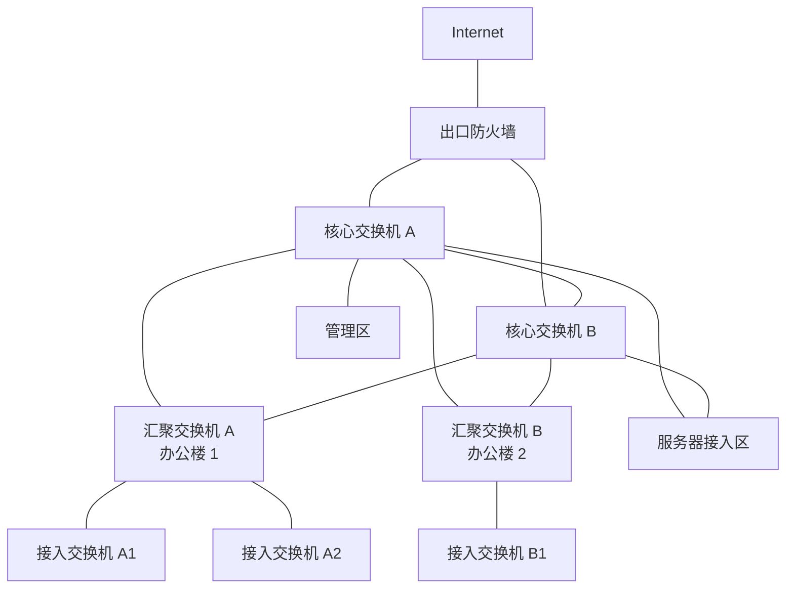
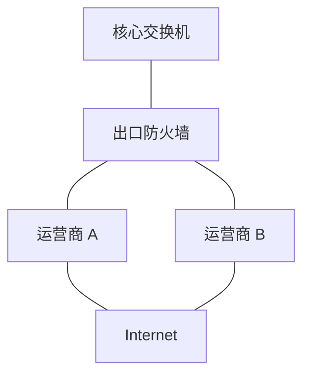
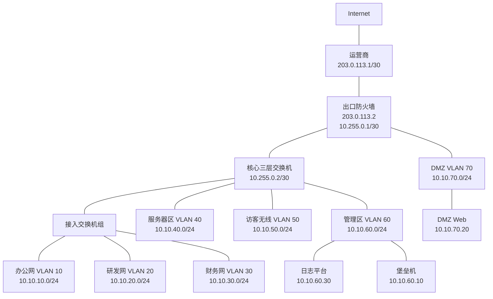
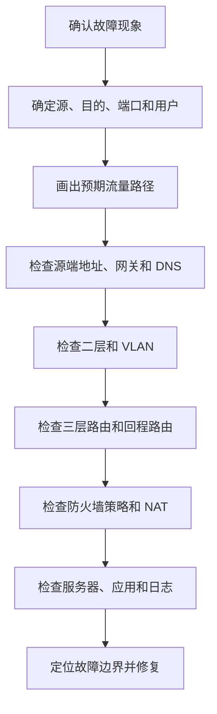

# 第 19 章：企业网络架构基础

## 19.1 本章学习目标

读完本章后，你应该能够：

- 解释什么是企业网络架构，以及它和单台设备配置有什么区别。
- 看懂常见企业网络中的接入层、汇聚层、核心层、出口区、服务器区、DMZ、管理区、无线区和分支区。
- 理解为什么企业网络设计要同时考虑连通性、可靠性、安全性、可扩展性、可运维性和成本。
- 能够把用户、服务器、互联网出口、防火墙、路由、交换、无线、VPN、日志和管理系统放到一张整体拓扑中。
- 能够根据业务关系规划安全区域、VLAN、IP 网段、网关、路由和访问控制边界。
- 能够判断一条业务流量应该经过哪些设备，以及应该在哪里做路由、NAT、安全策略和日志审计。
- 能够理解单核心、双核心、三层架构、二层到核心、出口主备、双运营商、DMZ 发布等基础架构模式。
- 能够写出一份简单企业网络架构设计说明，并列出上线前验证和故障排查清单。

前面的章节已经分别学习了交换、VLAN、STP、链路聚合、三层交换、路由、防火墙、NAT、VPN 和防火墙高级功能。从本章开始，我们不再只看某一个技术点，而是学习如何把这些技术组合成一套完整的企业网络。

网络架构不是简单地把设备连起来。它要回答的是：

```text
企业有哪些业务区域？
哪些区域需要互通，哪些区域必须隔离？
默认网关放在哪里？
跨网段流量经过三层交换机还是防火墙？
互联网出口如何做 NAT 和安全控制？
服务器如何对内和对外提供服务？
设备故障、链路故障、运营商故障时业务如何继续？
出现故障时如何快速判断问题边界？
```

初学者容易把网络设计理解为“画一张拓扑图”。拓扑图很重要，但真正的架构还包括地址规划、VLAN 规划、路由规划、安全区域、策略控制、可靠性、日志、管理、扩容和运维流程。

可以先记住一句话：

```text
企业网络架构的目标，是让业务流量按照预期路径，稳定、安全、可控、可排查地到达目的地。
```

## 19.2 什么是企业网络架构

企业网络架构是对企业网络整体结构和运行规则的设计。它包括设备如何连接、网络如何分层、地址如何分配、业务如何隔离、流量如何转发、安全在哪里控制、故障如何切换、运维如何管理。

如果只配置一台交换机，你关注的是：

```text
这个接口属于哪个 VLAN。
这个 Trunk 允许哪些 VLAN。
这个网关地址是多少。
```

如果设计企业网络架构，你还要继续追问：

```text
为什么需要这些 VLAN？
这些 VLAN 分别对应哪些部门或业务？
这些 VLAN 的网关放在核心交换机还是防火墙？
不同 VLAN 之间是否允许互访？
访问服务器区是否必须经过防火墙？
核心交换机故障时这些 VLAN 是否还能工作？
新增一个楼层或分支时地址和路由是否容易扩展？
```

也就是说，单项技术解决局部问题，架构设计解决整体关系。

### 架构设计包含哪些内容

一份基础企业网络架构通常至少包含以下内容：

| 设计项 | 要回答的问题 |
| --- | --- |
| 业务区域划分 | 企业有哪些用户、服务器、出口、管理、访客、分支和云资源 |
| 网络分层 | 接入、汇聚、核心、出口、服务器区分别由哪些设备承担 |
| VLAN 和 IP 地址 | 每个区域使用哪些 VLAN ID、网段、网关和 DHCP 范围 |
| 路由设计 | 哪些设备负责三层转发，静态路由或动态路由如何规划 |
| 安全边界 | 哪些流量经过防火墙，哪些区域默认隔离 |
| 出口设计 | 互联网线路、NAT、公网发布、双运营商如何处理 |
| 可靠性设计 | 设备、链路、电源、路由、网关和防火墙如何冗余 |
| 无线接入 | 员工无线、访客无线和无线控制器如何接入 |
| 管理和日志 | 如何管理设备、备份配置、收集日志、监控告警 |
| 扩容和运维 | 新增部门、楼层、分支和业务系统时是否容易调整 |

这就是为什么企业网络设计不是“把所有设备接到一个交换机上”那么简单。

### 架构设计的六个目标

企业网络设计通常需要在六个目标之间取得平衡。

| 目标 | 含义 | 常见问题 |
| --- | --- | --- |
| 连通性 | 该通的业务能通 | 路由缺失、网关错误、策略未放行 |
| 安全性 | 不该通的流量被隔离和审计 | 访客能访问内网、普通终端能访问数据库 |
| 可靠性 | 故障时业务影响可控 | 单核心故障、单出口故障、链路无冗余 |
| 可扩展性 | 新增用户和业务时不需要大改 | 地址用尽、VLAN 混乱、路由无法汇总 |
| 可运维性 | 故障能定位，配置能维护 | 命名混乱、没有日志、拓扑和现网不一致 |
| 成本可控 | 在预算内满足风险要求 | 过度堆设备或关键路径无冗余 |

真实项目中很少有“无限预算、无限时间、一次到位”的情况。网络工程师要根据业务重要性和风险决定投入在哪里。

例如：

| 场景 | 设计重点 |
| --- | --- |
| 20 人小办公室 | 简洁、低成本、易维护 |
| 300 人总部 | 核心和出口冗余、区域隔离、日志审计 |
| 多分支企业 | 地址规划、VPN/专线、集中管理 |
| 数据中心 | 高可靠、东西向安全、服务器接入和变更规范 |
| 工厂网络 | 生产稳定性、办公与生产隔离、工业设备保护 |

架构没有唯一答案，但必须能解释设计理由。

## 19.3 企业网络的常见区域

在第 1 章中，我们已经初步认识了办公网、服务器区、DMZ、互联网出口、无线网络、运维管理区和分支机构。本章从架构角度重新整理这些区域。

### 办公网

办公网承载员工电脑、办公软件、打印机、IP 电话、会议终端等。它是最常见的用户接入区域。

办公网通常有几个特点：

- 终端数量多。
- 变动频繁。
- 用户行为不可完全预测。
- 经常需要访问互联网和内部业务系统。
- 容易出现病毒、私接设备、地址冲突、环路和异常广播。

因此办公网设计要重点关注：

| 设计点 | 说明 |
| --- | --- |
| VLAN 划分 | 按部门、楼层、设备类型或安全等级划分 |
| DHCP | 终端地址自动分配，减少人工错误 |
| 访问控制 | 普通办公终端不应直接访问所有服务器 |
| 上网控制 | 通过防火墙做 NAT、URL 过滤、应用控制 |
| 终端安全 | 结合准入、杀毒、补丁和日志 |

### 服务器区

服务器区放置内部业务系统，例如 OA、ERP、文件服务器、数据库、中间件、虚拟化平台和备份系统。

服务器区比办公网更敏感，因为它保存业务数据并承载核心应用。设计时要区分：

| 服务器类型 | 示例 | 访问特点 |
| --- | --- | --- |
| Web 或应用服务器 | OA、门户、业务系统 | 多个用户网段访问 |
| 数据库服务器 | MySQL、SQL Server、Oracle | 只允许应用服务器访问 |
| 文件服务器 | SMB、NFS、文档系统 | 按部门授权访问 |
| 认证服务器 | AD、LDAP、RADIUS | 多系统依赖，安全敏感 |
| 备份服务器 | 备份软件、备份存储 | 流量大，权限高 |
| 运维服务器 | 堡垒机、监控、日志 | 应放在管理区或独立管理网 |

服务器区不建议和普通办公终端放在同一个 VLAN。否则一台办公电脑中毒后，可能直接扫描或攻击服务器。

### DMZ 区

DMZ 用于放置需要被外部访问、但又不能直接放入内网的系统，例如：

- 企业官网。
- VPN 网关。
- 邮件网关。
- 反向代理。
- 对外 API 网关。
- 文件交换平台。

DMZ 的核心思想是：

```text
互联网可以访问 DMZ 中被发布的服务；
DMZ 不能随意访问内网；
内网访问 DMZ 也要按业务需要控制。
```

一个常见 DMZ 流量关系如下：


如果 DMZ Web 被攻击者控制，安全策略应该尽量阻止它继续访问办公网、数据库和管理区。

### 互联网出口区

互联网出口区负责企业和公网之间的连接。它通常包含：

- 运营商线路。
- 出口路由器。
- 出口防火墙。
- NAT。
- 公网地址。
- 上网行为管理或下一代防火墙功能。
- VPN 或远程接入。

出口区要同时处理两个方向：

| 方向 | 示例 | 关键技术 |
| --- | --- | --- |
| 内到外 | 员工访问互联网、SaaS、云服务 | 默认路由、SNAT、安全策略、URL 过滤 |
| 外到内 | 公网用户访问企业官网、VPN | DNAT、DMZ、安全策略、IPS、证书 |

出口区是企业最重要的安全边界之一。它不是简单的“能上网就行”，还要考虑日志、审计、双线路、带宽、攻击防护和远程办公。

### 管理区

管理区用于管理网络设备、安全设备、服务器和运维平台。常见系统包括：

- 堡垒机。
- 网管平台。
- 日志平台。
- 配置备份系统。
- 认证服务器。
- 自动化运维平台。
- NTP 服务器。
- 跳板机。

管理区的权限很高，因为它可以登录核心交换机、防火墙、服务器和云资源。如果管理区被攻破，攻击者可能获得整个网络的控制权。

管理区设计原则：

| 原则 | 说明 |
| --- | --- |
| 独立网段 | 不与普通办公网混用 |
| 强访问控制 | 只允许授权运维终端或堡垒机访问设备管理口 |
| 强认证 | 管理账号使用 MFA、权限分级和审批 |
| 完整审计 | 登录、命令、配置变更都要记录 |
| 最小暴露 | 禁止从公网直接管理核心设备 |

### 访客无线区

访客无线通常给外来人员、临时会议人员或合作方使用。它的安全等级应低于企业内网。

访客无线最重要的规则是：

```text
访客可以访问互联网，但不能访问企业内网。
```

典型策略：

| 源 | 目的 | 动作 |
| --- | --- | --- |
| 访客无线 | Internet | Permit |
| 访客无线 | 办公网 | Deny |
| 访客无线 | 服务器区 | Deny |
| 访客无线 | 管理区 | Deny |
| 访客无线 | DMZ 公网域名 | 视需求允许 |

访客无线还常配合 Portal 认证、短信认证、限速、隔离客户端和日志留存。

### 分支和远程接入区

很多企业不只有一个总部，还会有分支、门店、工厂、仓库和远程办公用户。

分支接入方式包括：

| 方式 | 特点 |
| --- | --- |
| 专线 | 稳定、可控、成本较高 |
| 互联网 VPN | 成本低，依赖公网质量 |
| SD-WAN | 多线路调度和集中管理能力更强 |
| 运营商 MPLS/VPN | 由运营商提供隔离承载 |
| 远程接入 VPN | 适合个人用户或移动办公 |

分支设计要特别注意地址规划。如果分支使用了和总部重复的网段，例如两个地方都使用 `192.168.1.0/24`，后续路由、VPN 和访问控制会非常麻烦。

## 19.4 网络分层模型

企业园区网常用分层设计。分层不是为了让拓扑看起来复杂，而是为了让职责清晰、扩展方便、故障边界明确。

最常见的是三层模型：

```text
接入层 -> 汇聚层 -> 核心层
```

### 接入层

接入层直接连接终端设备，例如电脑、打印机、AP、摄像头、IP 电话和门禁。

接入层关注：

| 项目 | 说明 |
| --- | --- |
| 端口接入 | Access 口、Trunk 口、语音 VLAN |
| VLAN 归属 | 不同终端进入不同 VLAN |
| 边缘安全 | 端口安全、DHCP Snooping、ARP 防护、802.1X |
| PoE | 给 AP、电话、摄像头供电 |
| 上联带宽 | 接入交换机到汇聚或核心的链路容量 |
| 故障范围 | 单台接入交换机故障只影响局部用户 |

接入层不应承载过多复杂策略。它的主要任务是稳定接入和边缘控制。

### 汇聚层

汇聚层位于接入层和核心层之间，负责汇聚多个接入交换机的流量。在中大型网络中，汇聚层可以承担：

- VLAN 汇聚。
- 部分三层网关。
- ACL 控制。
- 路由汇总。
- 链路冗余。
- 楼宇或区域边界。

并不是每个企业都需要独立汇聚层。小型企业可能使用“接入层 + 核心层”的二层架构，也就是接入交换机直接上联核心交换机。

### 核心层

核心层是企业园区网的高速转发中心，连接办公区、服务器区、出口区、无线区和管理区。

核心层设计重点：

| 项目 | 说明 |
| --- | --- |
| 高性能 | 承载跨区域流量 |
| 高可靠 | 通常采用双核心、堆叠、虚拟化或路由冗余 |
| 简洁转发 | 避免在核心层堆太多复杂策略 |
| 路由清晰 | 负责网段汇聚和到出口的默认路由 |
| 扩展能力 | 新增楼层、区域和业务时容易接入 |

核心层故障影响范围大，因此要重点考虑冗余。

### 二层模型、三层模型和简化模型

不同规模的企业可以使用不同层次。

| 模型 | 结构 | 适合场景 | 注意点 |
| --- | --- | --- | --- |
| 单设备模型 | 一台核心交换机或防火墙连接所有设备 | 很小办公室或实验环境 | 单点故障明显 |
| 二层模型 | 接入层直接上联核心层 | 中小企业、楼层不多 | 核心承担更多网关和汇聚职责 |
| 三层模型 | 接入层、汇聚层、核心层 | 大型园区、多楼宇 | 设计和运维复杂度更高 |
| 叶脊模型 | Leaf-Spine | 数据中心 | 更适合服务器东西向流量 |

本章重点学习园区网基础架构。数据中心叶脊架构会在第 22 章继续展开。

### 分层拓扑示例



这张图表达几个重要思想：

- 接入交换机负责连接终端。
- 汇聚交换机负责汇聚楼宇或区域。
- 核心交换机负责高速互联。
- 出口防火墙连接核心和互联网。
- 服务器区和管理区不直接挂在普通接入交换机上。
- 关键设备和关键链路尽量有冗余。

## 19.5 架构中的流量路径

学习架构时，不能只看设备，还要看流量怎么走。网络设计最终服务的是业务流量。

### 同 VLAN 内部通信

同一个 VLAN 内的终端通信主要经过二层交换。

示例：

```text
办公电脑 A：10.10.10.21/24
办公电脑 B：10.10.10.35/24
网关：10.10.10.1
```

A 访问 B 时，发现目的地址 `10.10.10.35` 与自己同网段，所以不会把流量交给网关，而是通过 ARP 获取 B 的 MAC 地址，然后由交换机二层转发。

路径大致是：

```text
电脑 A -> 接入交换机 -> 电脑 B
```

如果 A 和 B 在不同接入交换机上，则可能经过汇聚或核心的二层链路，但仍然不需要三层路由。

### 跨 VLAN 通信

不同 VLAN、不同网段之间通信必须经过三层网关。

示例：

```text
办公网 VLAN 10：10.10.10.0/24，网关 10.10.10.1
服务器区 VLAN 40：10.10.40.0/24，网关 10.10.40.1
```

办公电脑 `10.10.10.21` 访问服务器 `10.10.40.20` 时，路径可能是：

```text
电脑 -> 接入交换机 -> 核心三层交换机 -> 服务器区交换机 -> 服务器
```

如果网关在核心交换机上，核心交换机完成 VLAN 间路由。如果企业要求办公网访问服务器必须经过防火墙，路径可能变成：

```text
电脑 -> 接入交换机 -> 核心交换机 -> 防火墙 -> 核心交换机 -> 服务器
```

这两种设计的安全控制能力不同。

### 内网访问互联网

内网访问互联网通常经过出口防火墙做安全策略和 SNAT。

示例：

```text
办公电脑：10.10.10.21
出口防火墙公网地址：203.0.113.2
访问目标：198.51.100.100:443
```

典型路径：

```text
电脑 -> 接入交换机 -> 核心交换机 -> 出口防火墙 -> 运营商 -> Internet
```

防火墙在这个过程中通常做：

| 功能 | 作用 |
| --- | --- |
| 路由 | 找到到互联网的出口 |
| 安全策略 | 判断办公网是否允许访问 Internet |
| SNAT | 把私网地址转换成公网地址 |
| 应用/URL 控制 | 识别和控制上网行为 |
| 日志 | 记录访问行为和 NAT 转换 |

### 公网访问 DMZ

公网访问企业发布服务时，通常通过 DNAT 到 DMZ 服务器。

示例：

```text
公网地址：203.0.113.10
DMZ Web：10.10.70.20
服务：HTTPS
```

路径：

```text
Internet 用户 -> 运营商 -> 出口防火墙 -> DMZ Web
```

防火墙通常做：

| 功能 | 作用 |
| --- | --- |
| DNAT | 把公网地址转换为 DMZ 私网服务器地址 |
| 安全策略 | 只允许外部访问 HTTPS 等必要服务 |
| IPS/WAF 联动 | 检测 Web 攻击 |
| 日志 | 记录外部访问和攻击事件 |

### VPN 用户访问内网

远程用户通过 VPN 接入企业后，流量路径通常是：

```text
远程电脑 -> Internet -> 出口防火墙 VPN -> 内网服务器
```

VPN 用户不应默认访问整个内网。架构设计时要明确：

| 项目 | 示例 |
| --- | --- |
| VPN 地址池 | `10.90.10.0/24` |
| 普通员工访问 | OA、邮件、知识库 |
| 运维人员访问 | 堡垒机 |
| 财务人员访问 | 财务系统 |
| 安全控制 | 用户组策略、MFA、日志 |

### 画流量路径的好处

设计和排错时，建议把关键业务画成流量路径表。

| 业务 | 源 | 目的 | 必经设备 | 控制点 |
| --- | --- | --- | --- | --- |
| 员工上网 | 办公网 | Internet | 接入、核心、防火墙 | 防火墙策略、SNAT、URL |
| 访问 OA | 办公网 | 服务器区 OA | 接入、核心、防火墙或核心 | ACL/防火墙策略 |
| 公网访问官网 | Internet | DMZ Web | 防火墙 | DNAT、IPS、日志 |
| 运维登录设备 | 管理区堡垒机 | 网络设备 | 核心、管理网络 | ACL、账号、审计 |
| VPN 访问文件系统 | VPN 用户 | 文件服务器 | 防火墙、核心 | VPN 用户组策略 |

只要路径不清楚，策略、路由、NAT 和排错都会变得混乱。

## 19.6 安全区域和边界设计

安全区域是架构设计的核心概念之一。它不是防火墙上的一个名字那么简单，而是对业务信任等级的划分。

### 为什么要划分安全区域

如果企业所有设备都能互访，短期配置很简单，但风险很高。

例如：

```text
访客无线可以访问服务器。
普通办公电脑可以访问数据库。
摄像头网可以访问财务系统。
DMZ Web 可以访问管理区。
```

这些都属于安全边界不清。

划分安全区域的目的包括：

- 限制故障和攻击扩散。
- 按业务关系放行最小必要访问。
- 方便编写防火墙策略和 ACL。
- 让日志和审计更清晰。
- 让后续扩展和排错更容易。

### 常见安全区域

| 区域 | 信任等级 | 说明 |
| --- | --- | --- |
| Untrust | 最低 | Internet 或外部网络 |
| Guest | 低 | 访客无线和临时接入 |
| Office | 中 | 普通办公终端 |
| RD | 中到较高 | 研发终端，可能需要访问代码和测试环境 |
| Finance | 高 | 财务终端和财务系统访问入口 |
| Server | 高 | 内部业务服务器 |
| DMZ | 中低 | 对外发布服务，暴露面较大 |
| Management | 最高 | 堡垒机、日志、认证、网管和设备管理 |
| VPN | 取决于用户 | 远程接入用户，应按身份细分 |

信任等级不是绝对的，它要结合企业制度和业务风险。

### 区域之间的默认策略

架构设计中常用的原则是：

```text
默认拒绝，按业务需要显式放行。
```

示例区域访问矩阵：

| 源区域 | 目的区域 | 默认建议 | 说明 |
| --- | --- | --- | --- |
| Office | Internet | 按需允许 | 通过出口防火墙控制 |
| Office | Server | 按业务允许 | 只放行业务系统端口 |
| Office | Management | 默认拒绝 | 普通用户不应管理设备 |
| Guest | Internet | 允许基础上网 | 可限速和过滤 |
| Guest | 内网 | 拒绝 | 访客隔离 |
| DMZ | Server | 极小范围允许 | 只允许必要后端调用 |
| DMZ | Office | 拒绝 | 防止被攻破后横向移动 |
| VPN | Server | 按用户组允许 | 不同用户不同权限 |
| Management | 设备管理地址 | 允许 | 必须强认证和审计 |

### 防火墙边界和三层交换边界

跨 VLAN 流量可以由三层交换机转发，也可以引到防火墙控制。两种方式各有适用场景。

| 方式 | 优点 | 缺点 | 适合场景 |
| --- | --- | --- | --- |
| 核心交换机做网关 | 性能高、延迟低、配置相对简单 | 安全检测能力弱 | 同信任等级区域之间 |
| 防火墙做边界 | 安全策略、日志、应用控制更强 | 性能和设计复杂度更高 | 不同安全等级区域之间 |

例如：

| 流量 | 建议控制点 |
| --- | --- |
| 同一部门内终端互访 | 接入层或核心交换机 |
| 办公网访问普通内部 Web | 核心 ACL 或防火墙，视安全要求 |
| 办公网访问财务系统 | 防火墙 |
| 访客访问内网 | 防火墙或核心 ACL 明确拒绝 |
| DMZ 访问服务器区 | 防火墙 |
| 管理区访问设备 | 管理 ACL、堡垒机和日志 |

不要把所有流量都无脑引到防火墙，也不要为了性能完全绕过安全边界。设计要看信任等级和业务风险。

## 19.7 VLAN、IP 和网关规划

地址和 VLAN 是企业网络架构的骨架。规划不好，后面路由、安全策略、日志和扩容都会困难。

### 规划原则

常见原则：

| 原则 | 说明 |
| --- | --- |
| 按区域分段 | 办公、研发、财务、服务器、管理、访客分开 |
| 保持连续性 | 同类区域网段尽量连续，便于路由汇总 |
| 预留增长 | 不要刚上线就接近地址上限 |
| 避免冲突 | 总部、分支、云和 VPN 地址不能重叠 |
| 命名清晰 | VLAN 名称、网段用途和网关统一记录 |
| 网关稳定 | 终端默认网关不要频繁变化 |

### 示例地址规划

假设总部使用 `10.10.0.0/16`，可以这样规划：

| VLAN | 名称 | 网段 | 网关 | 用途 |
| ---: | --- | --- | --- | --- |
| 10 | `OFFICE` | `10.10.10.0/24` | `10.10.10.1` | 办公网 |
| 20 | `RD` | `10.10.20.0/24` | `10.10.20.1` | 研发网 |
| 30 | `FINANCE` | `10.10.30.0/24` | `10.10.30.1` | 财务网 |
| 40 | `SERVER` | `10.10.40.0/24` | `10.10.40.1` | 内部服务器 |
| 50 | `GUEST` | `10.10.50.0/24` | `10.10.50.1` | 访客无线 |
| 60 | `MGMT` | `10.10.60.0/24` | `10.10.60.1` | 管理区 |
| 70 | `DMZ` | `10.10.70.0/24` | `10.10.70.1` | 对外发布区 |
| 80 | `VOICE` | `10.10.80.0/24` | `10.10.80.1` | IP 电话 |
| 90 | `CAMERA` | `10.10.90.0/24` | `10.10.90.1` | 安防摄像头 |
| 250 | `NET-MGMT` | `10.10.250.0/24` | `10.10.250.1` | 网络设备管理 |

这个规划不是唯一答案，但它体现了几个要点：

- VLAN ID 和网段第三段保持一定对应关系，便于记忆。
- 不同安全等级分开。
- 管理类网络独立出来。
- 后续可以继续扩展 `10.10.100.0/24` 之后的网段。

### DHCP 和静态地址规划

不是所有地址都应该交给 DHCP 自动分配。

| 地址类型 | 示例 | 建议 |
| --- | --- | --- |
| 网关地址 | `.1` | 固定，通常由核心或防火墙使用 |
| 网络设备 | `.2` 到 `.49` | 静态或管理系统分配 |
| 服务器 | `.50` 到 `.149` | 静态或 DHCP 保留 |
| 打印机/AP/摄像头 | `.150` 到 `.199` | 静态或 DHCP 保留 |
| 普通终端 | `.100` 到 `.240` | DHCP 动态分配 |
| 预留地址 | 末尾若干地址 | 留给临时扩展 |

示例：

| 网段 | DHCP 范围 | 静态保留 |
| --- | --- | --- |
| `10.10.10.0/24` | `10.10.10.100-10.10.10.240` | 网关、打印机、会议设备 |
| `10.10.40.0/24` | 不建议大范围 DHCP | 服务器使用固定地址 |
| `10.10.50.0/24` | `10.10.50.50-10.10.50.240` | 访客终端 |
| `10.10.250.0/24` | 不建议 DHCP | 网络设备管理地址 |

### 网关放在哪里

网关位置决定了跨网段流量的第一跳。

常见选择：

| 网关位置 | 适合场景 | 注意点 |
| --- | --- | --- |
| 核心三层交换机 | 大多数办公 VLAN、服务器 VLAN | 性能好，但安全检测有限 |
| 防火墙 | 高安全边界、DMZ、访客、敏感区 | 策略清晰，但流量路径更复杂 |
| 汇聚交换机 | 大型园区按楼宇或区域分层 | 需要路由汇总和冗余设计 |
| 无线网关设备 | 某些无线集中转发场景 | 要和有线网络策略一致 |

初学阶段可以先掌握两种典型设计：

```text
设计一：大部分内网 VLAN 网关在核心交换机，出口和 DMZ 由防火墙控制。
设计二：不同安全等级区域的网关放在防火墙，强制跨区流量经过安全策略。
```

## 19.8 路由架构设计

路由架构决定不同网段如何找到彼此，以及如何访问互联网、分支和云。

### 静态路由适合什么场景

静态路由简单、可控，适合规模较小、路径稳定的网络。

示例：

```text
核心交换机默认路由指向出口防火墙：0.0.0.0/0 -> 10.255.0.1
出口防火墙回程路由指向核心交换机：10.10.0.0/16 -> 10.255.0.2
```

这种设计适合中小企业总部：


关键点是双向路由都要有：

| 设备 | 路由 |
| --- | --- |
| 核心交换机 | 默认路由指向防火墙 |
| 防火墙 | 到内网汇总网段 `10.10.0.0/16` 指向核心 |

如果只配核心默认路由，不配防火墙回程路由，防火墙可能不知道如何把返回流量送回内网。

### 动态路由适合什么场景

动态路由适合网络规模较大、路径较多、需要自动收敛的场景。

常见场景：

- 双核心、多个汇聚区域。
- 多个分支互联。
- 多条出口或专线。
- 数据中心和园区互联。
- 云专线或多 VPC/VNet 互通。

动态路由优势：

| 优势 | 说明 |
| --- | --- |
| 自动学习 | 不需要手工写每一条远端路由 |
| 自动收敛 | 链路故障后可以切换路径 |
| 支持汇总 | 可以减少路由表规模 |
| 适合扩展 | 新增区域更容易 |

但动态路由也需要更强的设计能力，例如区域划分、度量值、路由过滤、汇总和故障收敛。

### 路由汇总

路由汇总是架构设计中的重要能力。它能让上游设备不必知道每一个小网段。

例如总部所有用户和服务器网段都在 `10.10.0.0/16` 内：

```text
10.10.10.0/24
10.10.20.0/24
10.10.30.0/24
10.10.40.0/24
10.10.50.0/24
10.10.60.0/24
10.10.70.0/24
```

出口防火墙只需要一条回程路由：

```text
10.10.0.0/16 -> 核心交换机
```

这就是地址连续规划的价值。

如果地址规划混乱，例如：

```text
办公网：192.168.1.0/24
研发网：10.3.8.0/24
财务网：172.16.30.0/24
服务器：192.168.100.0/24
访客：10.200.5.0/24
```

后续路由汇总、防火墙策略和分支互联都会更复杂。

### 默认路由和回程路由

初学者排错时经常只检查“去程”，忽略“回程”。

一条通信成功需要：

```text
源到目的有路由；
目的返回源也有路由；
中间安全策略允许；
NAT 前后地址关系正确。
```

例如办公网访问互联网：

| 方向 | 路径 |
| --- | --- |
| 去程 | PC -> 网关 -> 防火墙 -> Internet |
| 回程 | Internet -> 防火墙 -> 网关 -> PC |

如果防火墙缺少到办公网的回程路由，即使 PC 有默认网关，也可能无法正常通信。

## 19.9 出口、DMZ 和公网发布架构

出口和 DMZ 是企业网络中最容易出安全事故的地方，也是最常见的架构设计重点。

### 单出口架构

小型企业常见单出口：


优点：

- 结构简单。
- 成本低。
- 排错容易。

缺点：

- 防火墙、运营商线路和核心上联都可能成为单点。
- 出口维护或故障会影响全公司上网和 VPN。

### 双出口或双运营商

为了提高可用性，企业可能使用两条运营商线路。



双出口要考虑：

| 项目 | 说明 |
| --- | --- |
| 默认路由 | 主备还是负载分担 |
| 健康检测 | 如何判断运营商线路不可用 |
| NAT 地址 | 不同线路使用不同公网地址 |
| 回程路径 | 公网发布服务需要考虑用户回包走哪条线 |
| DNS | 对外域名解析是否需要根据线路调整 |
| 策略一致性 | 两条线路上的安全策略和日志是否一致 |

双线路不是插上两根网线就完成。尤其是公网发布业务，要特别关注入站和回程路径。

### DMZ 发布设计

DMZ 发布通常包含 DNAT 和安全策略。

示例：

| 项目 | 值 |
| --- | --- |
| 公网地址 | `203.0.113.10` |
| DMZ Web | `10.10.70.20` |
| 服务 | HTTPS TCP 443 |
| 防火墙外侧 | `203.0.113.2` |
| DMZ 网关 | `10.10.70.1` |

发布逻辑：

```text
Internet 用户访问 203.0.113.10:443
防火墙 DNAT 到 10.10.70.20:443
安全策略允许 Untrust -> DMZ Web HTTPS
DMZ Web 默认网关指向防火墙或 DMZ 三层网关
返回流量经过防火墙回到 Internet 用户
```

### 不建议直接发布内网服务器

有些小网络会把内部服务器直接映射到公网。这种方式容易让外部攻击直接打到核心业务区。

更推荐：

```text
公网 -> 防火墙 -> DMZ 反向代理/WAF/Web -> 必要后端服务
```

对数据库尤其要谨慎。数据库通常不应直接暴露给互联网，也不应让 DMZ Web 随意访问所有数据库端口。

## 19.10 可靠性和冗余设计

可靠性设计的目标不是“永远不出故障”，而是故障发生时影响范围可控，并且能快速恢复。

### 常见单点

企业网络中常见单点包括：

| 单点 | 影响 |
| --- | --- |
| 单核心交换机 | 核心故障导致大范围内网中断 |
| 单出口防火墙 | 上网、VPN、公网发布中断 |
| 单运营商线路 | 线路故障导致互联网不可用 |
| 单上联链路 | 某个接入或汇聚区域中断 |
| 单 DHCP/DNS | 终端获取地址或解析失败 |
| 单电源或单 UPS | 断电影响设备 |
| 单日志平台 | 故障时审计中断 |

不是所有单点都必须消除。关键要根据业务影响和成本决定。

### 设备冗余

常见设备冗余方式：

| 设备 | 常见冗余方式 |
| --- | --- |
| 核心交换机 | 双核心、堆叠、虚拟化、网关冗余协议 |
| 防火墙 | 主备 HA、双活、会话同步 |
| 出口线路 | 双运营商、主备路由、链路检测 |
| 接入上联 | 链路聚合、双上联 |
| 服务器接入 | 双网卡、双交换机 |
| 无线控制器 | 主备控制器或云管理 |

### 链路冗余和环路控制

二层网络中增加冗余链路时，要考虑环路。

常见技术：

| 技术 | 作用 |
| --- | --- |
| STP/RSTP/MSTP | 防止二层环路 |
| 链路聚合 | 多条物理链路合成逻辑链路 |
| 三层互联 | 用路由收敛代替二层环路控制 |
| 堆叠/虚拟化 | 简化双设备上联关系 |

从架构角度看，二层范围越大，环路和广播问题越难控制。大型网络通常尽量缩小二层范围，把更多边界放到三层路由上。

### 高可用不等于没有中断

高可用可以降低中断时间，但不能保证所有业务无感。

| 故障 | 可能影响 |
| --- | --- |
| 防火墙主备切换 | 部分会话重建，VPN 可能短暂中断 |
| 核心切换 | ARP、路由、网关收敛需要时间 |
| 运营商切换 | 公网源地址变化，部分连接重建 |
| STP 收敛 | 旧协议可能有较明显中断 |
| 动态路由收敛 | 取决于协议和定时器 |

因此高可用设计必须配合演练和监控，而不是只看配置界面显示“正常”。

### 可靠性设计示例

| 组件 | 基础设计 | 增强设计 |
| --- | --- | --- |
| 核心 | 单核心交换机 | 双核心虚拟化或网关冗余 |
| 出口 | 单防火墙单线路 | 防火墙主备 + 双运营商 |
| 接入 | 单上联 | 双上联或链路聚合 |
| DHCP | 单服务器 | 主备 DHCP 或服务器集群 |
| DNS | 单 DNS | 至少两个 DNS |
| 日志 | 设备本地 | 集中日志平台 + 备份 |
| 电源 | 单电源 | 双电源、UPS、双路供电 |

## 19.11 可运维性设计

很多网络不是败在技术复杂，而是败在不可运维：不知道哪个端口接了什么，不知道策略为什么存在，不知道故障发生时应该看哪里。

### 命名规范

命名规范能减少大量沟通成本。

示例：

| 对象 | 命名示例 |
| --- | --- |
| VLAN | `VLAN10-OFFICE`、`VLAN40-SERVER` |
| 地址对象 | `NET-OFFICE-10.10.10.0_24` |
| 防火墙策略 | `allow-office-to-internet-web` |
| 交换机 | `SW-CORE-A`、`SW-ACC-F3-01` |
| 接口描述 | `to_SW-ACC-F3-01_G1/0/48` |
| 路由描述 | `default_to_FW-A` |

一个好的命名应该让人一眼看出对象用途，而不是只看到 `policy1`、`vlan2`、`test`。

### 文档和台账

基础网络文档至少包括：

| 文档 | 内容 |
| --- | --- |
| 拓扑图 | 设备连接、链路、接口、区域 |
| IP 地址表 | VLAN、网段、网关、DHCP、保留地址 |
| 设备台账 | 型号、序列号、位置、版本、管理地址 |
| 端口表 | 交换机端口连接对象和用途 |
| 路由表 | 静态路由、动态路由邻居、汇总规划 |
| 安全策略表 | 源、目的、服务、动作、负责人、原因 |
| NAT 表 | 公网地址、内网地址、端口、用途 |
| VPN 表 | 对端、地址段、加密参数、联系人 |
| 运维手册 | 登录方式、备份、巡检、回退 |

文档不需要一开始就完美，但必须随着变更更新。过期文档在故障时会误导排查。

### 日志和监控

架构设计阶段就应该考虑日志和监控，而不是等出事后再补。

关键监控项：

| 对象 | 监控内容 |
| --- | --- |
| 核心交换机 | CPU、内存、接口流量、丢包、错误包、路由邻居 |
| 防火墙 | 会话数、新建连接、CPU、策略命中、威胁日志、HA |
| 出口线路 | 带宽、丢包、延迟、线路状态 |
| 服务器区 | 关键业务端口、DNS、DHCP、认证服务 |
| 无线 | AP 在线数、客户端数、信道、干扰 |
| VPN | 隧道状态、在线用户、认证失败 |
| 日志平台 | 日志接收量、存储容量、告警规则 |

日志和监控要能回答：

```text
现在是否故障？
故障从什么时候开始？
影响哪些区域和业务？
是设备、链路、路由、策略、DNS、服务器还是运营商问题？
```

### 配置备份和变更管理

网络配置要定期备份，变更要有记录。

变更前至少确认：

- 变更目的是什么。
- 涉及哪些设备和业务。
- 当前配置是否已备份。
- 验证方法是什么。
- 回退方法是什么。
- 变更窗口和联系人是谁。

变更后至少记录：

- 实际改了哪些配置。
- 验证是否通过。
- 是否出现异常。
- 是否需要后续观察。

对于初学者来说，养成这个习惯比背更多命令更重要。

## 19.12 综合架构示例

下面设计一个中小企业总部网络，作为后续章节的基础案例。

### 需求描述

企业有 300 名员工，包含办公、研发、财务、服务器、访客无线、DMZ 和管理区。需求如下：

1. 员工可以访问互联网和内部业务系统。
2. 研发网可以访问代码仓库和测试服务器。
3. 财务网只允许访问财务系统、税务银行网站和必要办公系统。
4. 访客无线只能访问互联网，不能访问内网。
5. 企业官网放在 DMZ，对外发布 HTTPS。
6. 运维人员只能从管理区或 VPN 登录堡垒机，再管理设备。
7. 出口防火墙做 NAT、安全策略、URL 过滤和 VPN。
8. 核心交换机承担大部分内网 VLAN 网关。
9. 防火墙和核心交换机预留后续双机冗余能力。
10. 所有关键策略和设备状态都要有日志。

### 逻辑拓扑



这里选择让 DMZ 直接连接防火墙，是为了让公网到 DMZ、DMZ 到内网的流量都经过防火墙控制。办公、研发、财务、服务器和管理区网关放在核心交换机上，但访问敏感资源时仍可通过防火墙或核心 ACL 做控制。

### VLAN 和地址表

| VLAN | 区域 | 网段 | 网关 | DHCP |
| ---: | --- | --- | --- | --- |
| 10 | 办公网 | `10.10.10.0/24` | `10.10.10.1` | `10.10.10.100-10.10.10.240` |
| 20 | 研发网 | `10.10.20.0/24` | `10.10.20.1` | `10.10.20.100-10.10.20.240` |
| 30 | 财务网 | `10.10.30.0/24` | `10.10.30.1` | `10.10.30.100-10.10.30.200` |
| 40 | 服务器区 | `10.10.40.0/24` | `10.10.40.1` | 不启用大范围 DHCP |
| 50 | 访客无线 | `10.10.50.0/24` | `10.10.50.1` | `10.10.50.50-10.10.50.240` |
| 60 | 管理区 | `10.10.60.0/24` | `10.10.60.1` | 不启用大范围 DHCP |
| 70 | DMZ | `10.10.70.0/24` | `10.10.70.1` | 不启用 DHCP |
| 250 | 网络设备管理 | `10.10.250.0/24` | `10.10.250.1` | 不启用 DHCP |

### 路由设计

核心交换机：

| 路由 | 下一跳 | 说明 |
| --- | --- | --- |
| `0.0.0.0/0` | `10.255.0.1` | 默认路由指向防火墙 |
| 各 VLAN 直连路由 | 本机三层接口 | 内部 VLAN 网关 |

防火墙：

| 路由 | 下一跳 | 说明 |
| --- | --- | --- |
| `0.0.0.0/0` | `203.0.113.1` | 默认路由指向运营商 |
| `10.10.0.0/16` | `10.255.0.2` | 回程路由指向核心 |
| `10.10.70.0/24` | 直连 | DMZ 直连 |

### 基础安全策略

| 顺序 | 策略名称 | 源 | 目的 | 服务 | 动作 |
| ---: | --- | --- | --- | --- | --- |
| 1 | `deny-guest-to-internal` | 访客无线 | `10.10.0.0/16` | Any | Deny |
| 2 | `allow-office-to-internet` | 办公网 | Internet | DNS/HTTP/HTTPS | Permit |
| 3 | `allow-rd-to-internet` | 研发网 | Internet | DNS/HTTP/HTTPS/必要开发服务 | Permit |
| 4 | `allow-finance-to-internet-strict` | 财务网 | Internet | DNS/HTTPS | Permit |
| 5 | `allow-guest-to-internet` | 访客无线 | Internet | DNS/HTTP/HTTPS | Permit |
| 6 | `allow-public-to-dmz-web` | Internet | DMZ Web | HTTPS | Permit |
| 7 | `allow-dmz-web-to-app` | DMZ Web | 指定后端应用 | HTTPS 或 API 端口 | Permit |
| 8 | `allow-mgmt-to-network-devices` | 堡垒机 | 网络设备管理地址 | SSH/HTTPS/SNMP | Permit |
| 99 | `deny-any-log` | Any | Any | Any | Deny |

注意，这张表是架构级策略，不是最终设备配置。真实配置还要细化地址对象、服务对象、用户组、NAT、日志和高级安全配置。

### NAT 设计

| NAT 类型 | 源 | 目的 | 转换 |
| --- | --- | --- | --- |
| SNAT | 办公、研发、财务、访客 | Internet | 转换为 `203.0.113.2` 或地址池 |
| DNAT | Internet | `203.0.113.10:443` | 转换到 `10.10.70.20:443` |
| NAT 豁免 | VPN 地址池 | 内部服务器 | 不做源地址转换，便于审计 |

NAT 必须和路由、安全策略一起验证。只写 NAT，不代表流量一定能通。

### 日志和管理设计

| 项目 | 设计 |
| --- | --- |
| 日志平台 | `10.10.60.30`，接收防火墙、核心交换机、无线和服务器日志 |
| NTP | 所有设备同步统一时间源 |
| 堡垒机 | `10.10.60.10`，作为设备管理入口 |
| 设备管理地址 | 使用 `10.10.250.0/24` |
| 配置备份 | 每日自动备份，重大变更前手工备份 |
| 告警 | 出口中断、HA 切换、设备 CPU 高、接口 Down、VPN 异常 |

## 19.13 架构设计常见错误

### 错误一：所有设备放在一个网段

这种设计短期最简单，长期最难维护。

问题包括：

- 广播域过大。
- 安全边界消失。
- 地址冲突难排查。
- 访客和内部系统混在一起。
- 无法按部门或业务做策略。

### 错误二：只追求能通，不考虑该不该通

很多故障处理会临时写一条：

```text
any -> any permit
```

短期业务通了，但长期风险很高。正确做法是明确源、目的、服务、业务原因、日志和回收时间。

### 错误三：地址规划没有预留

例如一个部门现在 230 台终端，却分配 `10.10.10.0/24`，看似还能用，但很快会因为手机、打印机、会议设备、临时终端而地址不足。

地址规划要考虑：

- 当前数量。
- 三年增长。
- 设备类型变化。
- 预留地址。
- 是否便于汇总。

### 错误四：出口和回程路由不完整

只配置默认路由，不配置回程路由，是常见错误。

排查时要始终问：

```text
去程怎么走？
回程怎么走？
中间是否 NAT？
安全策略在哪个方向命中？
```

### 错误五：管理面暴露过宽

设备管理口如果允许办公网甚至公网访问，风险很高。

正确做法：

- 管理入口只允许管理区或堡垒机。
- 禁止 Telnet 和 HTTP。
- 开启 SSH/HTTPS。
- 使用强密码、MFA 和权限分级。
- 记录登录和配置变更日志。

### 错误六：没有日志和文档

没有日志，故障时只能猜。没有文档，变更时容易误操作。

架构设计必须同时交付：

```text
拓扑图、地址表、VLAN 表、路由表、安全策略表、NAT 表、设备台账、运维和回退说明。
```

## 19.14 架构验证方法

网络架构完成后，不要只问“配置好了没有”，要按业务路径验证。

### 基础连通性验证

| 验证项 | 方法 |
| --- | --- |
| 终端获取地址 | 查看 IP、掩码、网关、DNS |
| 同 VLAN 通信 | Ping 同网段主机或网关 |
| 跨 VLAN 通信 | Ping 目标网段网关或服务器 |
| 默认路由 | 从内网访问互联网地址 |
| DNS | 解析内部和外部域名 |
| DHCP | 释放和重新获取地址 |
| 网关冗余 | 切换网关或核心时观察业务 |

### 安全策略验证

| 验证项 | 方法 |
| --- | --- |
| 办公网访问互联网 | 访问常用网站，查防火墙日志 |
| 访客不能访问内网 | 从访客网访问内网地址，应被拒绝 |
| 公网访问 DMZ | 从外部测试 HTTPS 发布 |
| DMZ 不能访问办公网 | 从 DMZ 主机尝试访问办公网，应被拒绝 |
| 管理访问 | 只有堡垒机能登录设备 |
| 默认拒绝 | 未明确放行的流量应命中拒绝日志 |

### 路由和 NAT 验证

| 验证项 | 方法 |
| --- | --- |
| 核心默认路由 | 查看下一跳是否为防火墙 |
| 防火墙回程路由 | 查看是否有到内网汇总路由 |
| SNAT | 查看内网访问公网时转换后的地址 |
| DNAT | 查看公网地址是否转换到 DMZ 服务器 |
| VPN 路由 | VPN 地址池访问内网是否有双向路由 |

### 可靠性验证

| 验证项 | 方法 |
| --- | --- |
| 出口线路故障 | 断开主线路或模拟检测失败 |
| 防火墙 HA | 计划内主备切换 |
| 核心链路 | 断开一条上联，观察是否收敛 |
| DHCP/DNS | 停止一台服务，验证备用服务 |
| 日志平台 | 确认故障和策略日志能集中记录 |

### 验证记录模板

| 测试编号 | 测试内容 | 预期结果 | 实际结果 | 是否通过 |
| --- | --- | --- | --- | --- |
| T01 | 办公网获取 DHCP 地址 | 获取 `10.10.10.0/24` 地址 | 待填写 | 待填写 |
| T02 | 办公网访问互联网 | 可以访问，防火墙有日志 | 待填写 | 待填写 |
| T03 | 访客访问服务器区 | 被拒绝并记录日志 | 待填写 | 待填写 |
| T04 | 公网访问 DMZ Web | HTTPS 正常打开 | 待填写 | 待填写 |
| T05 | 堡垒机登录核心交换机 | 成功，其他来源失败 | 待填写 | 待填写 |
| T06 | 防火墙回程路由 | 内网访问公网返回正常 | 待填写 | 待填写 |

## 19.15 架构排错思路

架构排错的核心是缩小边界。不要一上来就怀疑所有设备。

### 通用排错流程



### 故障矩阵

| 故障现象 | 可能边界 | 第一检查点 |
| --- | --- | --- |
| 终端没有 IP | DHCP、VLAN、接入口 | 终端地址、交换机端口、DHCP 日志 |
| 能 Ping 网关，不能上网 | 默认路由、防火墙、DNS、NAT | 核心默认路由、防火墙日志 |
| 能访问 IP，不能访问域名 | DNS | DNS 服务器和解析记录 |
| 只有某个 VLAN 故障 | VLAN、网关、ACL、DHCP | 该 VLAN SVI 和 DHCP 范围 |
| 所有内网都不能上网 | 出口、防火墙、运营商 | 防火墙外网口和默认路由 |
| 公网无法访问官网 | DNAT、安全策略、DMZ 服务器 | 防火墙 NAT 和策略日志 |
| VPN 登录成功但业务不通 | VPN 策略、路由、用户组 | VPN 地址池、策略命中、回程路由 |
| 访客能访问内网 | 安全策略或网关位置错误 | Guest 到内网的拒绝策略 |
| 设备无法管理 | 管理区、ACL、账号、路由 | 堡垒机连通性和设备管理 ACL |
| 故障间歇出现 | 链路抖动、环路、资源、HA | 接口错误包、日志、CPU、STP/HA |

### 排错时不要忽略应用层

网络能通不代表业务正常。比如：

| 现象 | 可能不是网络层问题 |
| --- | --- |
| Ping 通但网页打不开 | Web 服务未启动、证书错误、反向代理异常 |
| 端口通但登录失败 | 账号、权限、应用配置 |
| 只有部分用户失败 | 用户权限、客户端配置、终端安全软件 |
| 外部访问慢 | 服务器性能、应用代码、运营商路径 |

网络工程师要能证明“网络路径是否正常”，也要知道什么时候把问题交给服务器、应用或安全团队继续处理。

## 19.16 架构设计输出模板

做一个基础架构方案时，可以按下面结构输出。

### 1. 需求概述

说明企业规模、业务区域、用户数量、关键系统、出口线路、可靠性和安全要求。

示例：

```text
总部约 300 人，包含办公、研发、财务、服务器、访客无线、DMZ 和管理区。
需要互联网访问、DMZ 官网发布、远程 VPN、日志审计和基础高可用。
```

### 2. 逻辑拓扑

画出核心设备和区域关系，不必把每根终端网线都画出来。

拓扑至少应标注：

- 核心交换机。
- 出口防火墙。
- 运营商线路。
- 服务器区。
- DMZ。
- 管理区。
- 办公网和无线区。
- 关键链路和网段。

### 3. 地址和 VLAN 规划

列出 VLAN ID、名称、网段、网关、DHCP 范围和用途。

### 4. 路由规划

说明默认路由、回程路由、动态路由协议、路由汇总和分支路由。

### 5. 安全区域和策略

列出区域访问矩阵和关键防火墙策略。

### 6. NAT 和公网发布

列出 SNAT、DNAT、公网地址、DMZ 服务器和对外端口。

### 7. 可靠性设计

说明核心、防火墙、线路、链路、服务器和电源的冗余方式。

### 8. 运维管理

说明日志、监控、配置备份、设备命名、账号权限、NTP 和变更流程。

### 9. 验证和回退

列出上线测试项和回退方案。

一个能落地的架构方案，不只是告诉别人“怎么连”，还要告诉别人“如何验证、如何排错、如何回退”。

## 19.17 自检练习

请尝试回答以下问题：

1. 企业网络架构和单台设备配置有什么区别？
2. 为什么企业网络要划分办公网、服务器区、DMZ、管理区和访客区？
3. 接入层、汇聚层和核心层分别负责什么？
4. 什么情况下可以让核心交换机做 VLAN 网关？什么情况下应该让防火墙做安全边界？
5. 为什么地址规划要保持连续性？路由汇总有什么好处？
6. 内网访问互联网时，核心交换机和防火墙分别需要哪些路由？
7. 公网发布 DMZ Web 时，DNAT、安全策略和服务器网关分别有什么作用？
8. 为什么访客无线不能只靠“不同 SSID”来保证安全？
9. 高可用设计为什么仍然需要切换演练？
10. 网络架构文档至少应包含哪些表格？
11. 一个用户说“无法访问业务系统”，你会如何画出流量路径并缩小故障边界？
12. 为什么临时放行 `any -> any` 不是好的排错习惯？

## 19.18 本章小结

本章学习了企业网络架构基础。前面章节学习的是单项技术，本章把这些技术组合成整体视角：用户从接入层进入网络，经过 VLAN、网关、路由、防火墙、NAT、安全策略和日志系统，最终访问内部服务器、互联网、DMZ 或远程资源。

你需要重点记住：

- 企业网络架构要同时考虑连通性、安全性、可靠性、可扩展性、可运维性和成本。
- 常见企业区域包括办公网、服务器区、DMZ、出口区、管理区、访客无线、分支和 VPN。
- 分层设计让接入、汇聚、核心、出口和服务器区职责更清晰。
- 业务流量路径比单独设备配置更重要，设计和排错都要先画清楚源、目的、端口和必经设备。
- 安全区域的基本原则是默认拒绝、按业务显式放行。
- VLAN、IP 地址、网关和路由规划要保持清晰、连续、可扩展，避免后期无法汇总或地址冲突。
- 出口和 DMZ 是关键安全边界，NAT、路由、安全策略和日志必须一起验证。
- 可靠性设计要识别单点，并通过设备、链路、线路、网关和服务冗余降低影响。
- 可运维性依赖命名规范、文档、日志、监控、配置备份和变更管理。
- 架构上线后必须按业务路径验证，而不是只看设备配置是否存在。

从下一章开始，我们会在本章方法的基础上，进一步学习中小企业网络设计。第 20 章会把需求、拓扑、地址、VLAN、路由、防火墙策略、无线、VPN、日志和上线步骤组合成更完整的可落地方案。
