# 第 20 章：中小企业网络设计

## 20.1 本章学习目标

读完本章后，你应该能够：

- 理解中小企业网络和大型园区网在规模、预算、可靠性和运维方式上的区别。
- 能够根据用户数量、楼层、部门、服务器、无线、互联网出口和安全要求整理网络需求。
- 能够为一个中小企业规划清晰的 VLAN、IP 网段、网关、DHCP、DNS、NAT 和安全区域。
- 能够判断默认网关应放在三层交换机还是防火墙上，并理解两种方案的优缺点。
- 能够设计单核心、简化双核心、防火墙出口、DMZ、访客无线、远程 VPN 和基础管理区。
- 能够写出一份中小企业网络方案，包括拓扑、地址表、路由表、安全策略表、NAT 表和验证清单。
- 能够识别中小企业网络中的常见单点故障、地址规划错误、策略放行过宽、无线隔离不足和运维缺失问题。
- 能够按照“需求 -> 设计 -> 实施 -> 验证 -> 运维”的顺序完成一个小型网络项目。

前面几章已经学习了交换、VLAN、STP、链路聚合、三层交换、路由、防火墙、NAT、VPN 和企业网络架构基础。本章把这些知识放到一个更真实的场景中：一个中小企业需要一套可落地、可维护、成本可控的办公网络。

中小企业网络设计看起来比大型网络简单，但并不代表可以随意设计。很多企业网络故障并不是因为技术太复杂，而是因为最基础的规划没有做好：

```text
所有终端放在一个网段。
访客无线和办公网没有隔离。
服务器、打印机、摄像头和员工电脑混在一起。
出口防火墙只做 NAT，不做安全策略。
没有管理网、没有日志、没有配置备份。
新增人员后地址不够用，只能临时乱改。
```

本章的目标不是堆叠高级技术，而是让你掌握一套适合中小企业的工程化设计方法。

可以先记住一句话：

```text
中小企业网络设计的核心，是用有限设备把办公、服务器、无线、出口、安全和运维边界划清楚。
```

## 20.2 什么是中小企业网络

本章所说的中小企业网络，通常指几十人到几百人的办公网络。它可能只有一个办公地点，也可能有少量分支、门店或远程办公用户。

常见规模可以粗略分为三类：

| 类型 | 用户规模 | 常见设备数量 | 设计重点 |
| --- | --- | --- | --- |
| 小型办公室 | 10-50 人 | 1 台防火墙、1-3 台交换机、若干 AP | 简洁、低成本、能隔离访客 |
| 成长型企业 | 50-200 人 | 防火墙、核心交换机、接入交换机、无线控制器或云管 AP | VLAN 规划、出口安全、无线覆盖、服务器区 |
| 中型企业总部 | 200-500 人 | 双出口、防火墙、核心/汇聚、接入、服务器区、管理平台 | 可靠性、区域隔离、日志审计、可扩展 |

这个划分不是严格标准，而是帮助你理解网络复杂度如何随规模变化。

### 中小企业网络的典型特点

中小企业网络有几个常见特点：

| 特点 | 说明 | 对设计的影响 |
| --- | --- | --- |
| 预算有限 | 不一定能购买双核心、双防火墙和完整网管系统 | 关键位置优先投入，非关键位置保持简洁 |
| 人员变动快 | 新员工、临时工、访客和会议设备频繁接入 | DHCP、无线和接入规范要清楚 |
| IT 人员少 | 可能只有 1-2 名运维，甚至外包维护 | 方案要容易理解、排错和交接 |
| 业务系统不多 | 可能只有文件服务器、OA、ERP、NAS、门禁、监控 | 不需要过度复杂，但要分区保护 |
| 出口依赖互联网 | SaaS、云服务、远程办公越来越多 | 出口带宽、NAT、DNS、VPN 和安全策略很重要 |
| 无线使用多 | 会议室、移动办公、访客接入依赖无线 | 员工无线和访客无线必须分开 |

初学者容易把中小企业网络理解成“买一台路由器加几台交换机”。这种做法在家庭网络中可以工作，但在企业网络中会很快遇到问题：

- 无法区分不同部门和设备类型。
- 不能限制访客访问内部资源。
- 服务器被普通终端随意访问。
- 故障时不知道从哪里开始排查。
- 地址、VLAN、接口说明和线缆没有记录。
- 设备更换或人员交接时风险很高。

### 中小企业网络不是缩小版的大型网络

中小企业网络不能简单照搬大型园区网，也不能完全像家庭网络一样随意。

大型园区网可能会使用：

- 双核心。
- 多汇聚区域。
- 动态路由。
- 复杂的冗余协议。
- 独立安全资源池。
- 多数据中心互联。
- 专门的网络管理平台。

小型企业如果照搬这些设计，可能会出现成本高、配置复杂、无人维护的问题。

中小企业更适合使用：

- 清晰的二层接入和一个三层边界。
- 少量但明确的 VLAN。
- 简单可控的静态路由。
- 出口防火墙统一做 NAT、安全策略和 VPN。
- 基础日志、配置备份和命名规范。
- 关键设备适度冗余，非关键设备保持简单。

设计的关键不是“功能最多”，而是“当前规模够用，未来扩容不痛苦”。

## 20.3 设计前必须收集哪些需求

网络设计不能从画拓扑开始，而要从需求开始。如果需求不清楚，拓扑图画得再漂亮也可能不适合企业。

### 基础信息

设计前至少要收集以下信息：

| 信息项 | 示例问题 | 为什么重要 |
| --- | --- | --- |
| 用户数量 | 当前多少人，未来 1-3 年预计多少人 | 决定交换端口、无线容量和地址规模 |
| 办公地点 | 几层楼，几个弱电间，是否有分支 | 决定布线、接入交换机和上联方式 |
| 部门结构 | 财务、研发、销售、行政、生产是否需要隔离 | 决定 VLAN 和安全策略 |
| 终端类型 | PC、打印机、IP 电话、摄像头、门禁、会议设备 | 决定 VLAN、PoE 和访问权限 |
| 服务器资源 | 是否有本地服务器、NAS、虚拟化、数据库 | 决定服务器区和访问控制 |
| 互联网线路 | 几条线路、带宽多少、是否有公网 IP | 决定出口、NAT、VPN 和发布 |
| 无线需求 | 员工无线、访客无线、会议室、仓库覆盖 | 决定 AP 数量、SSID 和 VLAN |
| 安全要求 | 是否需要审计、URL 过滤、远程接入、数据隔离 | 决定防火墙功能和策略粒度 |
| 运维方式 | 内部维护还是外包，是否有网管平台 | 决定复杂度和文档要求 |

这些信息最好写成需求表，而不是只靠口头沟通。

### 业务流量需求

需求收集不能只问“有多少人”，还要问“谁访问谁”。

例如：

| 源区域 | 目的区域 | 业务 | 端口或协议 | 说明 |
| --- | --- | --- | --- | --- |
| 办公网 | Internet | 上网、SaaS | HTTP/HTTPS/DNS/NTP | 需要 NAT 和上网安全策略 |
| 办公网 | 文件服务器 | 文件共享 | SMB 445 | 可按部门限制 |
| 财务网 | ERP 服务器 | 财务系统 | HTTPS/数据库代理端口 | 需要更严格控制 |
| 研发网 | Git 服务器 | 代码管理 | HTTPS/SSH | 可只允许研发访问 |
| 访客无线 | Internet | 访客上网 | HTTP/HTTPS/DNS | 禁止访问内网 |
| VPN 用户 | 办公网或服务器区 | 远程办公 | 按用户组放行 | 需要身份认证和日志 |
| 运维区 | 网络设备 | 管理登录 | SSH/HTTPS/SNMP | 只允许堡垒机或运维终端 |

如果不知道这些流量关系，就很容易把策略写成“内网全部允许”，后续再想收紧会非常困难。

### 约束和风险

设计时还要明确约束：

| 约束 | 可能影响 |
| --- | --- |
| 预算不能购买双核心 | 核心交换机成为单点，需要准备备件和配置备份 |
| 办公区只有一个弱电间 | 接入交换机集中部署，上联简单但布线距离要确认 |
| 旧设备必须保留 | 需要确认 VLAN、Trunk、STP、PoE、速率是否支持 |
| 运营商只提供一条线路 | 出口无线路级冗余，可考虑 5G 备份或第二运营商 |
| 没有专职网络工程师 | 设计不宜过度复杂，文档和命名必须清楚 |
| 业务不能长时间中断 | 割接需要分阶段、回退方案和验证清单 |

一个成熟的设计方案会写明限制条件，而不是假装所有问题都不存在。

## 20.4 中小企业网络设计流程

中小企业网络可以按以下流程设计：

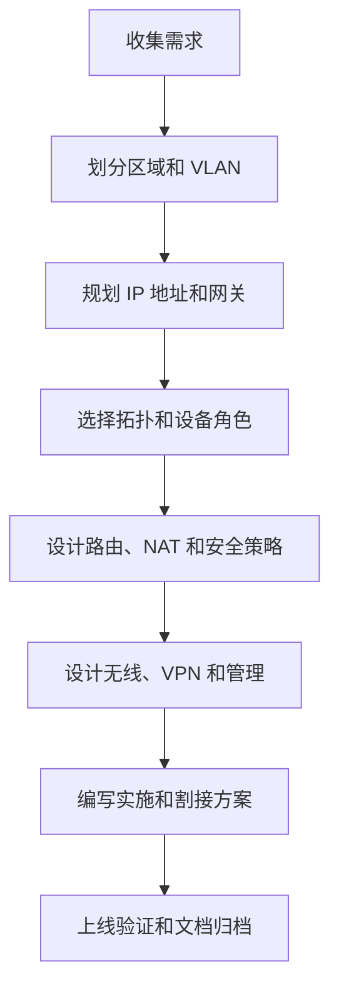

这个流程看起来简单，但每一步都要能落到表格和配置上。

### 第一步：划分区域

先把网络分成几个逻辑区域：

- 办公网。
- 服务器区。
- 财务或高敏感部门。
- 访客无线。
- 网络管理区。
- 打印机和办公外设区。
- 监控、门禁、IoT 区。
- DMZ 或公网发布区。
- VPN 远程接入区。

区域划分的目的不是为了让网络显得复杂，而是为了回答：

```text
哪些设备属于同一类？
哪些设备可以互相访问？
哪些设备必须隔离？
哪些流量要经过防火墙记录日志？
```

### 第二步：规划地址

地址规划要同时考虑当前数量和未来扩展。不要只按当前人数刚好分配地址。

例如当前研发 45 人，如果只给研发 VLAN 分配一个 `/26` 网段，可用地址约 62 个。短期够用，但加上测试终端、手机、打印机和未来人员增长后很快耗尽。更稳妥的做法可能是给研发一个 `/24` 网段。

地址规划要避免几个问题：

- 不同 VLAN 使用重叠网段。
- 分支和总部使用相同网段，导致 VPN 路由冲突。
- DHCP 地址池包含网关、服务器、打印机等静态地址。
- 未来新增 VLAN 时无法做路由汇总。
- 记录不完整，没人知道某个网段给谁使用。

### 第三步：确定网关位置

中小企业常见两种网关放置方式：

| 方案 | 网关位置 | 适合场景 |
| --- | --- | --- |
| 三层交换机做网关 | 核心交换机上配置 VLANIF/SVI | 内网互访较多，性能要求较高 |
| 防火墙做网关 | 防火墙子接口或 VLAN 接口做网关 | 安全隔离要求高，规模较小 |

两种方案没有绝对好坏，关键看企业需要。

如果大部分跨 VLAN 流量是办公终端访问服务器，且希望防火墙记录和控制区域之间的访问，可以把网关放在防火墙上。

如果内网服务器和用户之间流量很大，防火墙性能有限，可以把网关放在三层核心交换机上，再通过策略路由、ACL 或防火墙旁挂/串联控制关键流量。

### 第四步：设计出口和安全

出口设计要回答：

- 内网如何访问互联网？
- 哪些公网服务需要发布？
- 访客无线是否只能上网？
- VPN 用户如何接入？
- 日志如何记录？
- 双线路如何切换？

出口防火墙通常承担：

- 默认路由出口。
- 源 NAT。
- 目的 NAT 或端口映射。
- 安全策略。
- VPN。
- URL 过滤、IPS、病毒防护等安全功能。
- 日志审计。

### 第五步：写成可执行文档

最终方案至少应该包含：

| 文档内容 | 说明 |
| --- | --- |
| 逻辑拓扑图 | 说明设备角色和连接关系 |
| VLAN 和 IP 表 | 说明每个区域的 VLAN、网段、网关、DHCP 范围 |
| 设备接口表 | 说明交换机、防火墙接口连接到哪里 |
| 路由规划 | 默认路由、静态路由、回程路由 |
| 安全策略表 | 源、目的、服务、动作、日志 |
| NAT 表 | 上网 NAT、公网发布、VPN 是否免 NAT |
| 无线规划 | SSID、认证方式、VLAN、访客隔离 |
| 管理规划 | 管理地址、账号、日志、配置备份 |
| 验证清单 | 上线后逐项测试 |
| 回退方案 | 出现重大故障时如何恢复 |

工程上，“没有写下来的设计”很难交付和维护。

## 20.5 常见拓扑方案

中小企业网络常见拓扑不多，但每种拓扑都有适用边界。

### 方案一：防火墙加二层交换机

这是最小型办公室常见方案。

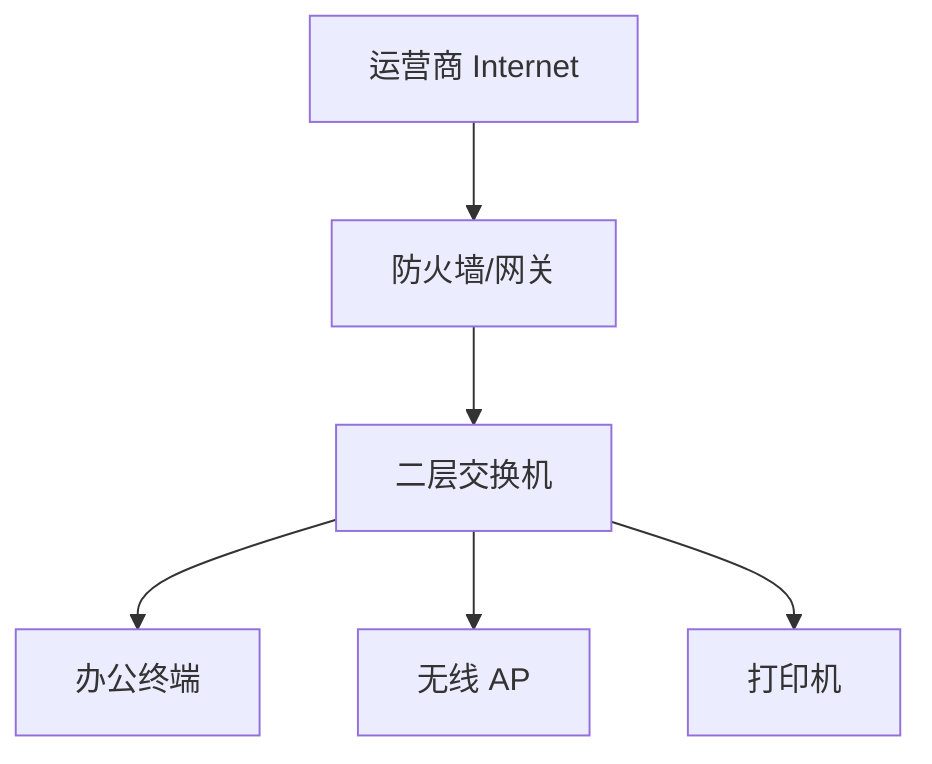

特点：

- 防火墙负责网关、DHCP、NAT 和安全策略。
- 交换机只做二层转发。
- 设备少，成本低。
- 适合 10-50 人的小办公室。

优点：

| 优点 | 说明 |
| --- | --- |
| 简单 | 配置集中在防火墙上 |
| 成本低 | 不需要三层核心交换机 |
| 安全边界清楚 | 不同 VLAN 间流量天然经过防火墙 |

缺点：

| 缺点 | 说明 |
| --- | --- |
| 防火墙压力较大 | 跨 VLAN、上网、VPN 都经过防火墙 |
| 扩展能力有限 | VLAN、接口和吞吐量受防火墙限制 |
| 单点明显 | 防火墙故障后网络和出口都受影响 |

这个方案适合小规模办公，但不适合大量内网服务器互访或高吞吐场景。

### 方案二：核心三层交换机加出口防火墙

这是成长型企业常见方案。

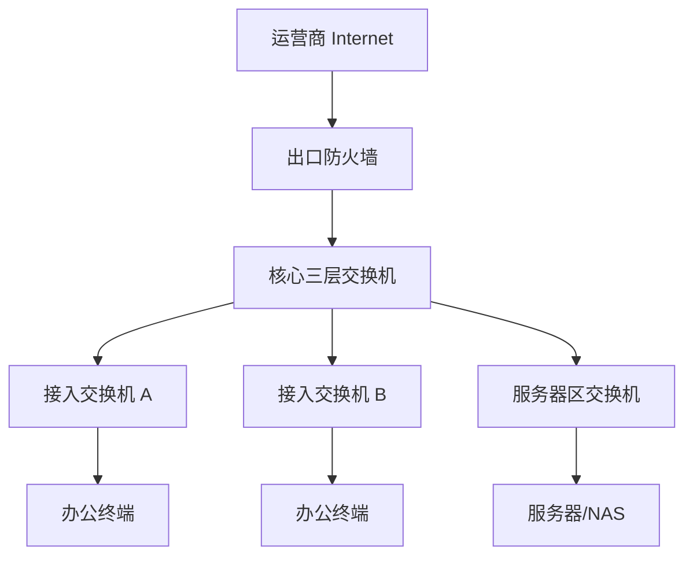

特点：

- 核心三层交换机负责内网 VLAN 网关。
- 防火墙负责互联网出口、NAT、VPN 和边界安全。
- 内网跨 VLAN 流量可以在核心交换机上高速转发。
- 防火墙和核心之间通常使用一个互联三层网段。

优点：

| 优点 | 说明 |
| --- | --- |
| 内网性能好 | 跨 VLAN 流量不必全部经过防火墙 |
| 扩展容易 | 新增 VLAN 和接入交换机较方便 |
| 结构清晰 | 核心负责内网，防火墙负责出口 |

缺点：

| 缺点 | 说明 |
| --- | --- |
| 内网隔离需要额外设计 | 核心交换机默认会路由 VLAN 间流量 |
| 策略审计可能不足 | 如果不经过防火墙，日志较少 |
| 配置分散 | 核心、防火墙、接入交换机都要维护 |

如果采用这个方案，要特别注意：不是所有 VLAN 之间都应该默认互通。可以在核心交换机上使用 ACL，或让敏感区域通过防火墙转发。

### 方案三：简化双核心

当企业规模接近 200-500 人，或办公对网络中断比较敏感时，可以考虑双核心。

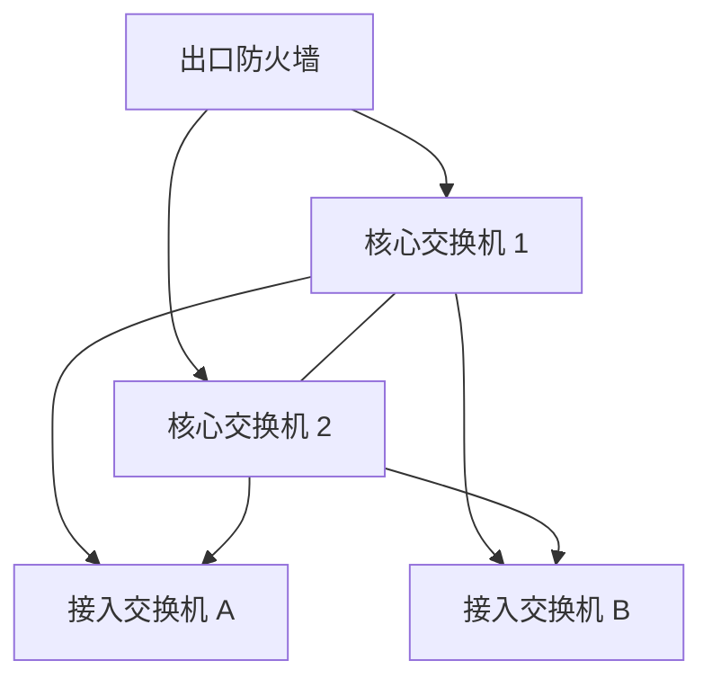

双核心通常会涉及：

- 堆叠、虚拟化或 MLAG。
- 链路聚合。
- 网关冗余。
- STP 或无环二层设计。
- 双上联接入交换机。

优点是可靠性更好，缺点是成本和复杂度上升。

对于中小企业，是否上双核心要看三个问题：

| 问题 | 判断 |
| --- | --- |
| 核心故障是否会造成重大业务损失 | 如果是，双核心价值较高 |
| 是否有人员能维护双核心和冗余协议 | 如果没有，复杂设计可能反而增加风险 |
| 预算是否允许同时购买设备、模块、授权和备件 | 不能只看交换机裸机价格 |

### 方案四：多分支加 VPN

很多中小企业有总部和少量分支。

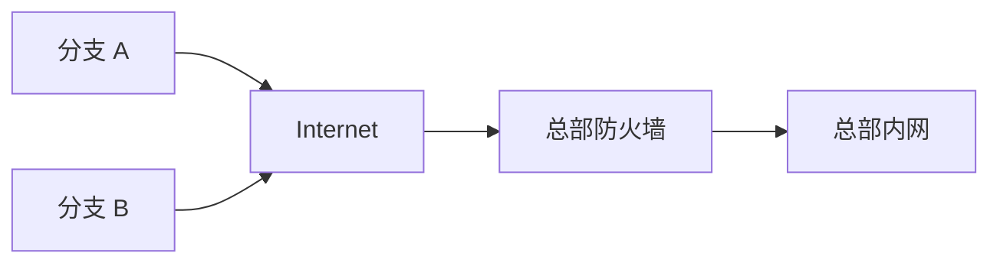

分支和总部之间可以使用：

- IPsec VPN。
- SSL VPN。
- SD-WAN。
- 专线。
- 云厂商 VPN 网关。

中小企业常见做法是：

- 总部部署出口防火墙。
- 分支使用小型防火墙或安全网关。
- 总部和分支建立 IPsec VPN。
- 分支本地上网，总部业务通过 VPN 访问。
- 分支地址不能和总部、其他分支重叠。

分支设计最容易出错的是地址规划。如果总部和分支都使用 `192.168.1.0/24`，VPN 建立后路由会冲突，访问会异常。

## 20.6 VLAN 和安全区域规划

VLAN 是中小企业网络设计的基础。它不仅用于减少广播域，还用于表达业务和安全边界。

### 不建议所有设备在一个 VLAN

假设一个公司所有设备都在 `192.168.1.0/24`：

- 员工电脑、财务电脑、打印机、摄像头、门禁、服务器、访客无线都在同一网段。
- 任意终端都可以直接扫描其他设备。
- 访客接入后可能发现内部服务器。
- 终端中毒后广播、ARP 欺骗和横向移动影响范围很大。
- 故障排查时很难判断问题属于哪个区域。

这种设计短期省事，长期风险很高。

### 常见 VLAN 划分

一个中小企业可以从以下 VLAN 开始：

| VLAN ID | 名称 | 网段 | 网关 | 用途 |
| --- | --- | --- | --- | --- |
| 10 | `OFFICE` | `10.20.10.0/24` | `10.20.10.1` | 普通办公终端 |
| 20 | `FINANCE` | `10.20.20.0/24` | `10.20.20.1` | 财务终端 |
| 30 | `RND` | `10.20.30.0/24` | `10.20.30.1` | 研发终端 |
| 40 | `SERVER` | `10.20.40.0/24` | `10.20.40.1` | 内部服务器 |
| 50 | `PRINTER` | `10.20.50.0/24` | `10.20.50.1` | 打印机和扫描仪 |
| 60 | `VOICE` | `10.20.60.0/24` | `10.20.60.1` | IP 电话 |
| 70 | `GUEST_WIFI` | `10.20.70.0/24` | `10.20.70.1` | 访客无线 |
| 80 | `IOT_CCTV` | `10.20.80.0/24` | `10.20.80.1` | 摄像头、门禁、IoT |
| 90 | `MGMT` | `10.20.90.0/24` | `10.20.90.1` | 网络设备管理 |
| 100 | `DMZ` | `10.20.100.0/24` | `10.20.100.1` | 对外发布服务器 |

这张表不是必须照抄。设计时要根据企业实际规模调整：

- 20 人公司不一定需要 10 个 VLAN。
- 300 人公司可能需要按楼层、部门、业务系统继续细分。
- 财务、研发、服务器、访客和管理区通常值得单独划分。

### 区域之间的基本策略

VLAN 划分后要继续设计访问关系。只划 VLAN 不做策略，很多时候只是把广播域分开，并没有真正实现安全控制。

可以先使用以下默认原则：

| 源区域 | 目的区域 | 默认建议 |
| --- | --- | --- |
| 办公网 | Internet | 允许，记录日志，按需做 URL 和应用控制 |
| 办公网 | 服务器区 | 按业务端口允许 |
| 办公网 | 管理区 | 默认禁止 |
| 财务网 | 财务系统 | 允许必要端口 |
| 财务网 | 普通办公网 | 默认禁止或限制 |
| 研发网 | 研发服务器 | 允许必要端口 |
| 访客无线 | Internet | 允许 |
| 访客无线 | 任意内网 | 禁止 |
| IoT/摄像头 | 管理平台或录像服务器 | 只允许必要方向 |
| 管理区 | 网络设备和服务器管理口 | 允许，记录日志 |
| DMZ | 内网服务器 | 只允许必要端口 |

安全策略的核心思想是：

```text
先按区域默认隔离，再按业务最小放行。
```

### VLAN 数量不要过度复杂

VLAN 太少会导致安全边界模糊，VLAN 太多也会增加维护难度。

对于中小企业，可以按以下原则平衡：

| 是否单独建 VLAN | 判断标准 |
| --- | --- |
| 建议单独 VLAN | 访问权限明显不同、安全风险明显不同、设备类型明显不同 |
| 不一定单独 VLAN | 只有少量终端、访问权限相同、没有独立运维需求 |
| 不建议随意新建 | 只是为了命名好看，没有策略和管理差异 |

例如：

- 财务部门通常建议独立 VLAN。
- 访客无线必须独立 VLAN。
- 管理区建议独立 VLAN。
- 打印机数量较多时建议独立 VLAN。
- 只有 3 台行政电脑时，不一定需要单独行政 VLAN。

## 20.7 IP 地址、DHCP、DNS 和基础服务规划

地址规划是网络设计的地基。地基混乱，后面路由、策略、VPN 和排错都会困难。

### 地址段选择

企业内网通常使用 RFC 1918 私有地址：

| 地址段 | 范围 | 常见用法 |
| --- | --- | --- |
| `10.0.0.0/8` | `10.0.0.0-10.255.255.255` | 中大型企业、便于分区汇总 |
| `172.16.0.0/12` | `172.16.0.0-172.31.255.255` | 中等规模企业、云和容器场景也常见 |
| `192.168.0.0/16` | `192.168.0.0-192.168.255.255` | 小型办公室、家庭网络常见 |

中小企业建议优先使用 `10.x.x.x` 或规划好的 `172.16.x.x`，原因是：

- 比 `192.168.1.0/24` 更不容易和家庭网络、分支网络、VPN 用户本地网络冲突。
- 后续新增分支、云 VPC、VPN 时更容易规划。
- 可以按地点、区域和 VLAN 做规律编号。

例如：

```text
10.20.0.0/16 作为公司总部地址空间
10.20.10.0/24 对应 VLAN 10 办公网
10.20.20.0/24 对应 VLAN 20 财务网
10.20.40.0/24 对应 VLAN 40 服务器区
10.20.90.0/24 对应 VLAN 90 管理区
```

这种规划让 VLAN ID 和第三段地址保持一致，初学者也容易记忆。

### DHCP 地址池规划

不是所有地址都应该放进 DHCP 地址池。一个 `/24` 网段可以这样划分：

| 地址范围 | 用途 |
| --- | --- |
| `.1` | 网关 |
| `.2-.19` | 网络设备、保留地址或特殊设备 |
| `.20-.49` | 打印机、固定终端、服务器等静态地址 |
| `.50-.199` | DHCP 动态地址池 |
| `.200-.239` | 预留扩展或临时设备 |
| `.240-.254` | 网络设备、VRRP/HSRP、测试或保留 |

以 `10.20.10.0/24` 为例：

| 项目 | 值 |
| --- | --- |
| 网关 | `10.20.10.1` |
| DHCP 范围 | `10.20.10.50-10.20.10.199` |
| DNS | `10.20.40.10`、`223.5.5.5` |
| 租约时间 | 办公网 8-24 小时，访客网可更短 |
| 排除地址 | `10.20.10.1-10.20.10.49`、`10.20.10.200-10.20.10.254` |

这样做的好处是：

- 静态设备不会和动态地址冲突。
- 故障排查时能从 IP 大致判断设备类型。
- 后续扩容时有预留空间。

### DNS 规划

DNS 不是“能上网才需要”的服务。企业内部访问 OA、文件服务器、打印服务器、域控和监控系统时，也依赖 DNS。

常见 DNS 方案：

| 场景 | DNS 设计 |
| --- | --- |
| 无域控的小企业 | 防火墙或路由器转发 DNS，终端使用公网 DNS |
| 有 AD 域 | 终端首选内部 DNS，例如 `10.20.40.10` |
| 有内部业务域名 | 内部 DNS 解析 `oa.company.local`、`nas.company.local` |
| 有公网发布 | 内外 DNS 可能解析到不同地址，注意 split DNS |

如果企业有 AD 域，终端 DNS 应优先指向域控 DNS。否则域登录、组策略、共享访问可能异常。

### NTP 规划

NTP 用于时间同步。很多初学者忽略它，但日志审计、证书、VPN、认证和故障排查都依赖准确时间。

建议：

- 所有网络设备、防火墙、服务器、日志平台使用统一 NTP。
- 内网可以指定一台服务器或防火墙作为 NTP 源。
- 设备时区统一。
- 日志平台和设备时间误差最好控制在几秒内。

如果设备日志时间不准，排查故障时很难把防火墙日志、服务器日志和终端事件对应起来。

## 20.8 交换网络设计

中小企业交换网络的目标是：终端稳定接入，VLAN 边界清楚，上联可靠，环路风险可控。

### 接入交换机

接入交换机连接终端、AP、打印机、摄像头和 IP 电话。

接入交换机设计要关注：

| 项目 | 说明 |
| --- | --- |
| 端口数量 | 按当前点位加 20%-30% 预留 |
| 速率 | 普通终端 1G，AP 和上联可考虑 2.5G/10G |
| PoE | AP、IP 电话、摄像头需要 PoE 供电 |
| VLAN | 接入口设置为对应 VLAN，AP 口可能是 Trunk |
| 环路保护 | 启用 STP、BPDU 保护、环路检测 |
| 端口说明 | 标注房间号、工位、AP、打印机等 |

不要只按“现在有多少电脑”购买交换机。会议室、打印机、门禁、摄像头、AP、临时工位都会占用端口。

### 上联设计

接入交换机到核心交换机通常使用 Trunk 上联。

基本原则：

- 上联口使用光口或高质量网线。
- 允许必要 VLAN 通过，不要默认放行所有 VLAN。
- 多条上联可以使用链路聚合。
- 上联接口要有清楚描述。
- 两端速率、双工、聚合模式要一致。

示例：

| 接入交换机 | 上联核心接口 | 上联类型 | 允许 VLAN |
| --- | --- | --- | --- |
| `ASW-2F-A` | `CORE-GE1/0/1` | Trunk | 10,20,50,60,90 |
| `ASW-2F-B` | `CORE-GE1/0/2` | Trunk | 10,30,50,70,90 |
| `ASW-3F-A` | `CORE-GE1/0/3` | Trunk | 10,30,50,60,70,90 |
| `SRV-SW-A` | `CORE-XGE1/0/1` | Trunk 或三层 | 40,90,100 |

### STP 和环路控制

中小企业也会出现环路，常见原因包括：

- 用户私接小交换机。
- 两根网线误接到同一个桌面交换机。
- 接入交换机之间被临时互连。
- AP、摄像头、会议设备接线错误。

环路会导致广播风暴、MAC 地址漂移、网关丢包、全网变慢。

建议：

| 功能 | 用途 |
| --- | --- |
| STP/RSTP/MSTP | 防止二层环路 |
| 边缘端口 | 接终端端口快速进入转发状态 |
| BPDU 保护 | 终端口收到 BPDU 后关闭，防止私接交换机参与生成树 |
| 环路检测 | 发现端口环回后自动阻断 |
| 风暴抑制 | 限制广播、未知单播和组播风暴 |

如果网络只有单核心和树形上联，也仍然建议启用 STP。它是防止误接线的最后保护。

### 交换机命名和端口描述

命名规范是可运维性的基础。

示例命名：

| 设备 | 命名示例 |
| --- | --- |
| 核心交换机 | `CORE-SW-01` |
| 二楼接入交换机 | `ASW-2F-01` |
| 三楼接入交换机 | `ASW-3F-01` |
| 服务器交换机 | `SRV-SW-01` |
| 出口防火墙 | `FW-EDGE-01` |
| 无线控制器 | `WLC-01` |

端口描述示例：

```text
interface GE1/0/1
 description Uplink_to_CORE-SW-01_GE1/0/3

interface GE1/0/10
 description Office_2F_AreaA_Desk-010

interface GE1/0/24
 description AP_2F_MeetingRoom
```

端口描述不是装饰。故障时它能帮助你快速判断“这根线连接的是谁”。

## 20.9 网关和路由设计

网关和路由决定跨网段流量走哪里。中小企业最常见的问题之一，就是网关位置和回程路由没有设计清楚。

### 网关放在防火墙

如果防火墙作为所有 VLAN 的网关，拓扑可以这样理解：

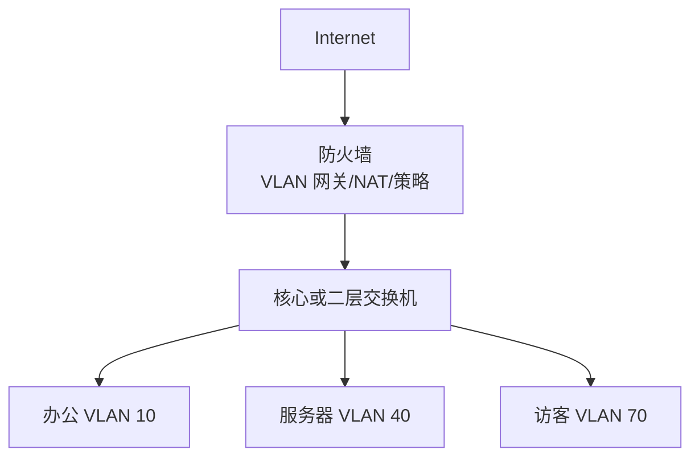

优点：

- 不同区域之间天然经过防火墙。
- 安全策略和日志集中。
- 配置逻辑适合小规模网络。

缺点：

- 防火墙承担更多东西向流量。
- 防火墙接口、子接口和性能要足够。
- VLAN 很多时配置可能较繁琐。

适合：

- 10-100 人左右。
- 内网跨 VLAN 流量不大。
- 安全隔离和日志优先。
- 防火墙性能足够。

### 网关放在核心交换机

如果核心交换机作为 VLAN 网关，防火墙只作为出口，拓扑可以这样理解：

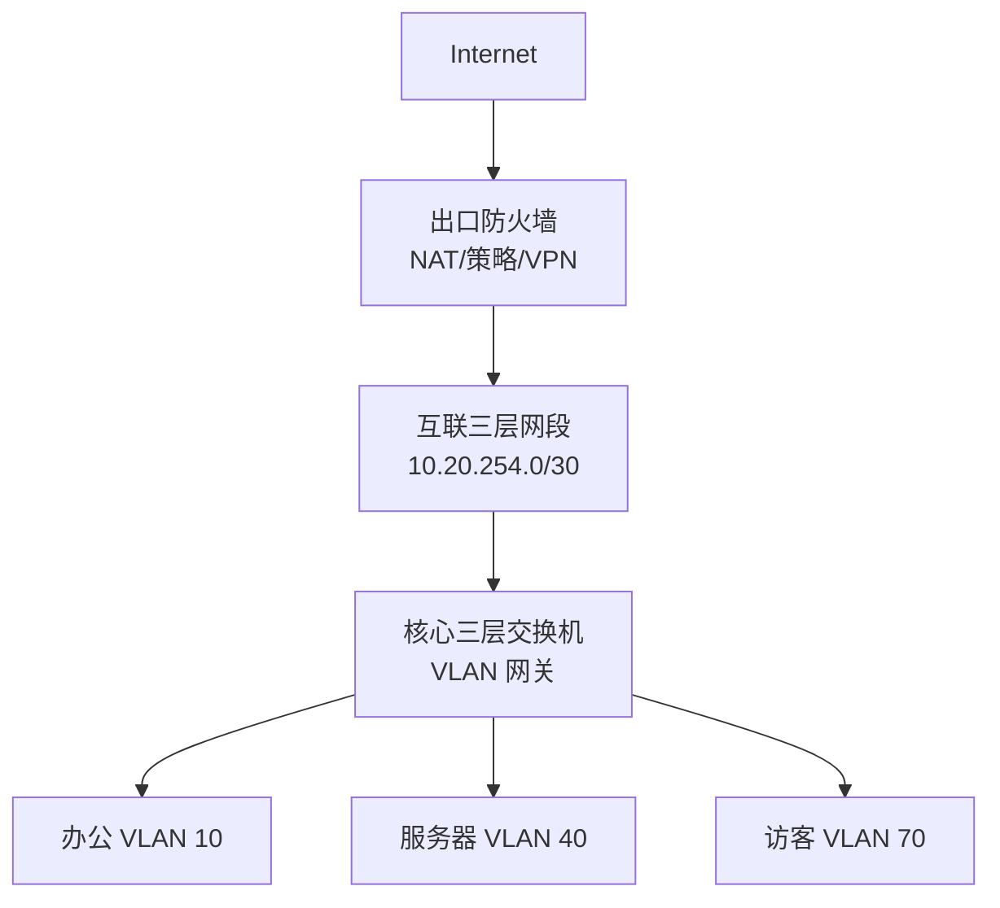

核心交换机需要：

- 为每个 VLAN 配置网关。
- 配置默认路由指向防火墙。
- 根据安全要求配置 ACL 或把敏感流量引到防火墙。

防火墙需要：

- 配置到内网各网段的回程路由。
- 配置内网到互联网的源 NAT。
- 配置安全策略。

示例路由：

| 设备 | 路由 |
| --- | --- |
| 核心交换机 | `0.0.0.0/0 -> 10.20.254.1` |
| 防火墙 | `10.20.0.0/16 -> 10.20.254.2` |

其中：

- 防火墙互联地址：`10.20.254.1/30`。
- 核心交换机互联地址：`10.20.254.2/30`。

初学者最容易忘记防火墙上的回程路由。没有回程路由时，内网访问互联网可能表现为：

- 核心能把流量送到防火墙。
- 防火墙完成 NAT 或准备回包。
- 回包不知道如何返回内网网段。
- 终端表现为访问失败或间歇性异常。

### 静态路由是否够用

多数中小企业总部使用静态路由就够了。

适合静态路由的情况：

- 只有一个总部。
- VLAN 数量不多。
- 出口路径简单。
- 网络设备少。
- 运维人员不熟悉动态路由。

动态路由适合：

- 多核心、多出口、多分支。
- 路由变化频繁。
- 需要自动收敛。
- 运维人员具备 OSPF 等协议能力。

不要为了“显得高级”强行使用动态路由。对于简单网络，清楚的静态路由更容易维护。

## 20.10 出口、防火墙、NAT 和 DMZ 设计

出口是中小企业网络最重要的边界。它既关系到员工能否上网，也关系到企业是否暴露在公网攻击面上。

### 单出口设计

单运营商出口是最常见方案。


基本配置要素：

| 项目 | 示例 |
| --- | --- |
| 防火墙外网地址 | `203.0.113.2/30` |
| 运营商网关 | `203.0.113.1` |
| 防火墙默认路由 | `0.0.0.0/0 -> 203.0.113.1` |
| 内网汇总路由 | `10.20.0.0/16 -> CORE`，如果核心做网关 |
| 源 NAT | `10.20.0.0/16 -> 203.0.113.2` |
| 安全策略 | 内网到外网允许必要服务并记录日志 |

这里的 `203.0.113.0/24` 是文档示例公网地址，不代表真实可用公网地址。

### 双出口设计

如果企业对互联网依赖很高，可以考虑双运营商：

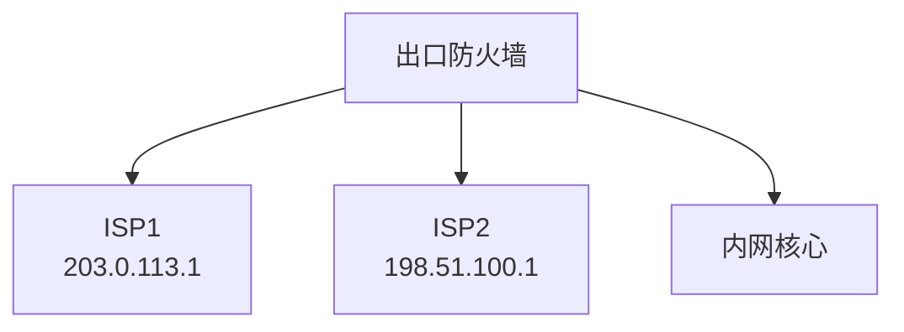

双出口要明确：

| 设计项 | 说明 |
| --- | --- |
| 主备还是负载分担 | 小企业通常先做主备，更容易排错 |
| 健康检查 | 判断主线路是否可用，不能只看接口是否 Up |
| NAT 地址 | 不同出口使用不同公网地址做 NAT |
| 回程问题 | 公网发布业务要注意外部访问从哪条线路回来 |
| DNS 解析 | 如果公网服务双线路发布，需要考虑 DNS 或负载均衡 |

双出口不是简单插两根线。没有健康检查和策略路由时，可能出现“线路看起来在线，但实际访问互联网失败”的情况。

### NAT 设计

中小企业常见 NAT 包括：

| NAT 类型 | 用途 | 示例 |
| --- | --- | --- |
| 源 NAT | 内网访问互联网 | `10.20.0.0/16 -> 203.0.113.2` |
| 目的 NAT | 公网访问内部服务 | `203.0.113.10:443 -> 10.20.100.10:443` |
| VPN 免 NAT | VPN 访问内网时保持真实地址 | `10.20.0.0/16 <-> 10.30.0.0/16` 不做 NAT |
| 策略 NAT | 不同源或目的使用不同公网地址 | 财务系统访问银行专线使用固定公网地址 |

NAT 规则要和安全策略配合。目的 NAT 只是把地址转换到内部服务器，并不等于应该允许所有公网流量访问。

### DMZ 设计

如果企业有公网访问服务，建议放在 DMZ，而不是直接放在服务器内网。

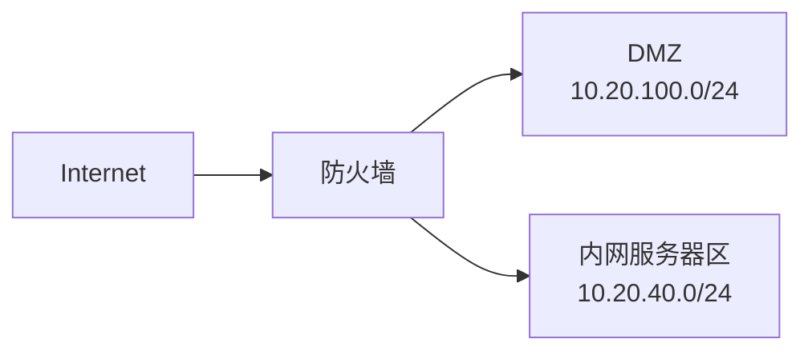

DMZ 策略示例：

| 源 | 目的 | 服务 | 动作 |
| --- | --- | --- | --- |
| Internet | DMZ Web `10.20.100.10` | HTTPS | Permit |
| Internet | DMZ Web `10.20.100.10` | 其他 | Deny |
| DMZ Web | 内部应用 `10.20.40.20` | HTTPS/API | Permit |
| DMZ Web | 数据库 `10.20.40.50` | 数据库端口 | 原则上不建议，确有需要则严格限制 |
| DMZ | 办公网 | Any | Deny |
| 管理区 | DMZ 服务器 | SSH/HTTPS/RDP | Permit，记录日志 |

DMZ 的价值在于：即使对外服务器被攻击，也不应该直接打开到内网的全部路径。

### VPN 远程接入

远程办公常见两种方式：

| 方式 | 说明 |
| --- | --- |
| SSL VPN | 用户用客户端或浏览器接入，适合个人远程办公 |
| IPsec VPN | 设备到设备互联，适合总部和分支 |

远程 VPN 要注意：

- 使用独立地址池，例如 `10.20.200.0/24`。
- 按用户组分配权限。
- 不要让所有 VPN 用户访问整个内网。
- 开启 MFA 或强密码策略。
- 记录登录、访问和异常日志。
- 员工离职后及时禁用账号。

示例 VPN 权限：

| 用户组 | 可访问资源 |
| --- | --- |
| 普通员工 | OA、文件服务器、内部门户 |
| 财务人员 | 财务系统、文件服务器财务目录 |
| 运维人员 | 堡垒机、监控平台、设备管理地址 |
| 外包人员 | 指定服务器的指定端口，限定时间 |

VPN 是进入内网的通道，权限不能比办公室现场接入还宽。

## 20.11 无线网络设计

中小企业无线网络不能只追求“信号满格”。企业无线要同时考虑覆盖、容量、漫游、认证和隔离。

### SSID 规划

常见 SSID：

| SSID | VLAN | 用途 | 认证方式 |
| --- | --- | --- | --- |
| `Corp-WiFi` | 10 或专用员工无线 VLAN | 员工办公 | WPA2/WPA3-Enterprise 或强密码 |
| `Guest-WiFi` | 70 | 访客上网 | Portal、短信、临时密码 |
| `IoT-WiFi` | 80 | 无线摄像头、会议设备、IoT | 独立密码或准入控制 |

不要让访客和员工使用同一个 SSID，也不要让访客无线桥接到办公 VLAN。

### AP 接入方式

AP 接入交换机时通常有两种端口模式：

| 模式 | 说明 |
| --- | --- |
| Access | AP 只承载一个 VLAN，适合非常简单的无线 |
| Trunk | AP 承载多个 SSID 对应多个 VLAN，企业更常见 |

如果一个 AP 同时广播员工无线和访客无线，交换机连接 AP 的端口通常要配置为 Trunk，并允许员工 VLAN 和访客 VLAN 通过。

### 无线容量

无线设计要考虑人数，而不是只看面积。

例如同样是 100 平方米：

- 普通办公区可能 20 人。
- 会议室可能同时 30 人。
- 培训室可能同时 60 人。

会议室和培训室需要更多 AP 或更合理的频段和功率规划。

无线常见问题：

| 问题 | 可能原因 |
| --- | --- |
| 信号满格但上网慢 | 用户太多、信道干扰、出口带宽不足、DNS 慢 |
| 走动时掉线 | 漫游参数不合理、AP 覆盖断层 |
| 访客能访问内网 | VLAN 或防火墙策略错误 |
| 某些手机连不上 | 加密方式、频段兼容性、Portal 适配问题 |
| AP 频繁重启 | PoE 功率不足或网线质量差 |

### 访客无线隔离

访客无线至少要做到：

- 独立 VLAN。
- 独立 DHCP 地址池。
- 禁止访问内网地址段。
- 允许访问 DNS、HTTP、HTTPS 等必要上网服务。
- 可以做限速和连接数限制。
- 可以开启客户端隔离，访客之间不能互相访问。

访客无线策略示例：

| 源 | 目的 | 动作 |
| --- | --- | --- |
| `10.20.70.0/24` | `10.20.0.0/16` | Deny |
| `10.20.70.0/24` | Internet | Permit |
| `10.20.70.0/24` | 防火墙 DNS 代理 | Permit |
| `10.20.70.0/24` | 管理区 | Deny |

## 20.12 可靠性、容量和成本取舍

中小企业设计很少能“所有地方双机冗余”。工程师要识别关键路径，把预算用在最需要的位置。

### 常见单点

| 单点 | 故障影响 | 常见处理 |
| --- | --- | --- |
| 出口防火墙 | 全公司无法上网、VPN 中断 | 备件、双机热备、配置备份 |
| 核心交换机 | 大量内网中断 | 双核心、备件、快速替换方案 |
| 运营商线路 | 无法访问互联网和云服务 | 第二线路、5G 备份 |
| DHCP/DNS 服务器 | 终端获取地址或解析失败 | 备份 DNS、DHCP 高可用或防火墙临时接管 |
| 服务器交换机 | 内部系统不可用 | 双上联、备件 |
| 单个 AP | 局部无线中断 | 合理覆盖重叠、备用 AP |

不是所有单点都必须消除，但必须知道它存在，并有应对方案。

### 容量估算

容量估算至少包括：

| 项目 | 估算方法 |
| --- | --- |
| 交换端口 | 当前点位 + 20%-30% 预留 |
| PoE 功率 | 所有 AP、电话、摄像头功耗之和 + 预留 |
| 出口带宽 | 用户数量、云服务、视频会议、备份流量共同评估 |
| 防火墙吞吐 | 开启安全功能后的吞吐，不只看裸吞吐 |
| VPN 并发 | 远程办公用户峰值数量 |
| AP 数量 | 覆盖面积 + 并发终端数 + 墙体衰减 |
| IP 地址 | 当前终端数 + 移动设备 + 访客 + 未来增长 |

防火墙厂商参数中常见“吞吐量”可能是不启用 IPS、病毒防护、SSL 解密时的理想值。设计时要看更接近实际开启功能后的性能。

### 成本取舍

中小企业常见取舍：

| 预算有限时优先保障 | 可以延后或简化 |
| --- | --- |
| 出口防火墙能力 | 复杂安全编排平台 |
| 核心交换机稳定性 | 全网高端万兆到桌面 |
| 访客隔离 | 过度细分的部门 VLAN |
| 配置备份和文档 | 大而全的自动化平台 |
| 关键服务器保护 | 每个普通接入点双链路 |
| 无线覆盖和容量 | 过多花哨 SSID |

低成本不等于无设计。即使用少量设备，也可以做到边界清楚、命名规范、地址合理、策略可审计。

## 20.13 管理、安全基线和运维设计

很多中小企业网络不是因为设备差而难维护，而是因为没有基础运维规范。

### 管理区设计

建议为网络管理单独规划 VLAN，例如：

| 项目 | 示例 |
| --- | --- |
| 管理 VLAN | VLAN 90 |
| 管理网段 | `10.20.90.0/24` |
| 网关 | `10.20.90.1` |
| 网管平台 | `10.20.90.10` |
| 日志平台 | `10.20.90.20` |
| 堡垒机 | `10.20.90.30` |

管理区访问原则：

- 普通办公网不能直接登录交换机、防火墙和服务器管理口。
- 运维人员先登录堡垒机或指定运维终端。
- 设备管理只开放 SSH/HTTPS/SNMP 等必要服务。
- 禁用 Telnet、HTTP 明文管理和默认账号。
- 管理登录要记录日志。

### 设备安全基线

基础安全基线包括：

| 项目 | 建议 |
| --- | --- |
| 账号 | 禁用默认账号，使用个人账号或集中认证 |
| 密码 | 强密码，定期更换，离职人员立即禁用 |
| 管理协议 | 使用 SSH/HTTPS，禁止 Telnet/HTTP |
| 管理源 | 只允许管理区地址访问设备管理口 |
| 时间 | 统一 NTP 和时区 |
| 日志 | 发送到日志服务器，保留关键操作日志 |
| 配置备份 | 变更前后备份配置 |
| 固件版本 | 记录版本，关注安全漏洞和补丁 |
| 接口 | 未使用端口关闭或放入隔离 VLAN |

### 文档和台账

至少维护以下文档：

| 文档 | 内容 |
| --- | --- |
| 拓扑图 | 设备、接口、链路、运营商、服务器区 |
| IP 地址表 | VLAN、网段、网关、DHCP、静态地址 |
| 设备台账 | 型号、序列号、位置、管理地址、保修 |
| 端口表 | 交换机端口连接对象和房间号 |
| 策略表 | 防火墙策略、NAT、VPN 权限 |
| 账号表 | 管理账号、权限、负责人，不应明文记录密码 |
| 变更记录 | 时间、原因、操作、验证、回退 |

如果文档和现网不一致，排错时文档会变成误导。因此文档要随变更更新。

### 日志和监控

中小企业至少要监控：

- 防火墙外网接口状态。
- 出口带宽使用率。
- 核心交换机 CPU、内存和上联口状态。
- AP 在线数量。
- VPN 登录失败和异常登录。
- DHCP 地址池使用率。
- 关键服务器连通性。

日志至少要关注：

- 防火墙允许和拒绝日志。
- NAT 和公网发布访问日志。
- VPN 登录日志。
- 设备登录和配置变更日志。
- STP 拓扑变化和端口异常。
- DHCP 地址分配和冲突。

没有监控和日志，故障只能靠用户报修和现场猜测。

## 20.14 综合设计示例：180 人企业总部

下面用一个完整示例把本章内容串起来。

### 需求描述

某公司有一个总部办公室：

- 员工约 180 人，未来 2 年可能增长到 250 人。
- 办公区分两层，每层一个弱电间。
- 部门包括行政、销售、财务、研发和运维。
- 有本地服务器：AD/DNS、文件服务器、Git、ERP、监控和日志服务器。
- 有 1 条 500 Mbps 主互联网线路，计划预留第二运营商。
- 需要员工无线和访客无线。
- 需要少量员工远程 VPN。
- 需要发布一个对外 HTTPS 服务，建议放在 DMZ。
- 预算有限，暂不做双核心和双防火墙，但要求文档完整、可扩展。

### 逻辑拓扑

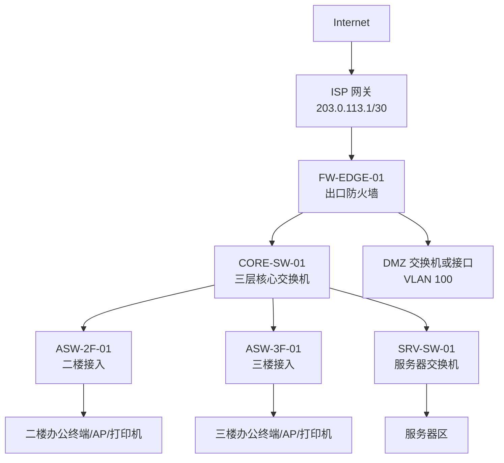

本示例选择核心三层交换机做内网网关，防火墙做出口、安全策略、NAT、VPN 和 DMZ。

选择理由：

- 180 人规模下，内网访问服务器较多，核心交换机转发性能更好。
- 防火墙主要处理出口、VPN、DMZ 和关键区域访问控制。
- 预算暂不支持双核心，因此必须做好核心配置备份和备件计划。

### VLAN 和地址规划

| VLAN ID | 名称 | 网段 | 网关 | DHCP 范围 | 说明 |
| --- | --- | --- | --- | --- | --- |
| 10 | `OFFICE` | `10.20.10.0/24` | `10.20.10.1` | `10.20.10.50-10.20.10.220` | 普通办公 |
| 20 | `FINANCE` | `10.20.20.0/24` | `10.20.20.1` | `10.20.20.50-10.20.20.150` | 财务终端 |
| 30 | `RND` | `10.20.30.0/24` | `10.20.30.1` | `10.20.30.50-10.20.30.220` | 研发终端 |
| 40 | `SERVER` | `10.20.40.0/24` | `10.20.40.1` | 无 | 内部服务器 |
| 50 | `PRINTER` | `10.20.50.0/24` | `10.20.50.1` | 无 | 打印机 |
| 60 | `VOICE` | `10.20.60.0/24` | `10.20.60.1` | `10.20.60.50-10.20.60.220` | IP 电话预留 |
| 70 | `GUEST_WIFI` | `10.20.70.0/24` | `10.20.70.1` | `10.20.70.50-10.20.70.230` | 访客无线 |
| 80 | `IOT_CCTV` | `10.20.80.0/24` | `10.20.80.1` | `10.20.80.50-10.20.80.180` | 摄像头、门禁 |
| 90 | `MGMT` | `10.20.90.0/24` | `10.20.90.1` | 无 | 管理区 |
| 100 | `DMZ` | `10.20.100.0/24` | `10.20.100.1` | 无 | 对外服务 |
| 254 | `TRANSIT_FW` | `10.20.254.0/30` | 无 | 无 | 核心到防火墙互联 |

关键静态地址：

| 设备或系统 | IP 地址 | 说明 |
| --- | --- | --- |
| 核心交换机管理地址 | `10.20.90.2` | `CORE-SW-01` |
| 防火墙内侧互联 | `10.20.254.1` | 连接核心 |
| 核心互联地址 | `10.20.254.2` | 连接防火墙 |
| AD/DNS | `10.20.40.10` | 内部 DNS |
| 文件服务器 | `10.20.40.20` | SMB 文件共享 |
| ERP 服务器 | `10.20.40.30` | 财务和业务系统 |
| Git 服务器 | `10.20.40.40` | 研发使用 |
| 监控平台 | `10.20.90.10` | 网络和服务器监控 |
| 日志平台 | `10.20.90.20` | Syslog 和审计 |
| DMZ Web | `10.20.100.10` | 公网 HTTPS 发布 |

### 路由设计

核心交换机：

| 目的网段 | 下一跳 | 说明 |
| --- | --- | --- |
| 直连 VLAN 网段 | 直连 | 各 VLAN 网关在核心上 |
| `0.0.0.0/0` | `10.20.254.1` | 默认路由指向防火墙 |

防火墙：

| 目的网段 | 下一跳 | 说明 |
| --- | --- | --- |
| `10.20.0.0/16` | `10.20.254.2` | 回程路由指向核心 |
| `0.0.0.0/0` | `203.0.113.1` | 默认路由指向运营商 |
| `10.20.100.0/24` | 直连或指定接口 | DMZ 区 |

如果防火墙直接连接 DMZ，DMZ 的网关可以放在防火墙上。这样公网到 DMZ 的访问和 DMZ 到内网的访问都经过防火墙策略。

### DHCP 和 DNS 设计

| VLAN | DHCP 服务位置 | DNS |
| --- | --- | --- |
| OFFICE | Windows DHCP 或防火墙 | 首选 `10.20.40.10`，备用公网 DNS |
| FINANCE | Windows DHCP 或防火墙 | 首选 `10.20.40.10` |
| RND | Windows DHCP 或防火墙 | 首选 `10.20.40.10` |
| GUEST_WIFI | 防火墙或无线控制器 | 防火墙 DNS 代理或公网 DNS |
| IOT_CCTV | 防火墙或服务器 | 按设备需求 |
| SERVER/MGMT/DMZ | 不启用 DHCP | 静态地址 |

如果使用 Windows AD，员工终端必须优先使用内部 DNS `10.20.40.10`，否则域登录和内部域名解析会出问题。

### 安全策略设计

基础策略表：

| 源 | 目的 | 服务 | 动作 | 日志 |
| --- | --- | --- | --- | --- |
| OFFICE | Internet | HTTP/HTTPS/DNS/NTP | Permit | 记录 |
| FINANCE | Internet | HTTP/HTTPS/DNS/NTP | Permit | 记录 |
| RND | Internet | HTTP/HTTPS/DNS/NTP/Git 相关 | Permit | 记录 |
| OFFICE | SERVER 文件服务器 | SMB 445 | Permit | 记录 |
| FINANCE | ERP 服务器 | HTTPS/业务端口 | Permit | 记录 |
| RND | Git 服务器 | HTTPS/SSH | Permit | 记录 |
| GUEST_WIFI | Internet | HTTP/HTTPS/DNS | Permit | 记录 |
| GUEST_WIFI | `10.20.0.0/16` | Any | Deny | 记录 |
| IOT_CCTV | 监控平台 | 指定端口 | Permit | 记录 |
| IOT_CCTV | OFFICE/SERVER | Any | Deny | 记录 |
| MGMT | 网络设备管理地址 | SSH/HTTPS/SNMP | Permit | 记录 |
| OFFICE/FINANCE/RND | MGMT | Any | Deny | 记录 |
| Internet | DMZ Web | HTTPS | Permit | 记录 |
| DMZ Web | SERVER 应用接口 | 必要端口 | Permit | 记录 |
| DMZ | OFFICE/MGMT | Any | Deny | 记录 |

如果 VLAN 网关在核心交换机上，普通 VLAN 之间的流量可能不会经过防火墙。此时要在核心交换机上补充 ACL，或把敏感区域网关放到防火墙上。

例如，访客无线 VLAN 的网关如果在核心交换机上，必须确保它不能直接路由到内网。更稳妥的做法是把访客无线网关放在防火墙或无线控制器出口上。

### NAT 设计

| NAT 规则 | 源 | 目的 | 转换 |
| --- | --- | --- | --- |
| 员工上网 SNAT | `10.20.0.0/16` | Internet | 转换为 `203.0.113.2` |
| 访客上网 SNAT | `10.20.70.0/24` | Internet | 转换为 `203.0.113.2` |
| DMZ Web DNAT | Internet 访问 `203.0.113.10:443` | DMZ Web | 转换到 `10.20.100.10:443` |
| VPN 免 NAT | VPN 地址池 | `10.20.0.0/16` | 不转换 |

NAT 规则顺序要注意：免 NAT、目的 NAT、源 NAT 在不同厂商设备上的匹配顺序可能不同，配置前要查设备规则逻辑。

### 无线设计

| SSID | VLAN | 地址段 | 权限 |
| --- | --- | --- | --- |
| `Corp-WiFi` | 10 或单独员工无线 VLAN | `10.20.10.0/24` | 员工办公权限 |
| `Guest-WiFi` | 70 | `10.20.70.0/24` | 仅访问互联网 |
| `IoT-WiFi` | 80 | `10.20.80.0/24` | 只访问监控或指定平台 |

AP 接入口建议：

- 使用 PoE 交换机。
- AP 端口配置 Trunk。
- 只允许无线相关 VLAN。
- 记录 AP 位置和交换机端口。
- 会议室按容量增加 AP 密度。

### 可靠性设计

本示例预算有限，暂不做双核心和双防火墙，因此要补充运维措施：

| 风险 | 处理 |
| --- | --- |
| 核心交换机单点 | 保留备件或明确供货 SLA，定期备份配置 |
| 防火墙单点 | 导出配置，记录接口和策略，准备替换流程 |
| 单运营商 | 预留第二线路接口，条件允许时增加备线 |
| DHCP/DNS 依赖 AD | 准备备用 DNS 或防火墙临时 DNS 转发方案 |
| AP 局部故障 | 保留 1 台备用 AP，关键会议室覆盖重叠 |

可靠性不一定等于立即买双机，也可以是备件、配置备份、替换流程和清晰文档。

## 20.15 实施和割接步骤

网络方案落地时，要避免“一次性全网乱改”。建议分阶段实施。

### 实施前准备

上线前检查：

| 检查项 | 内容 |
| --- | --- |
| 设备到货 | 型号、模块、电源、授权、PoE 功率是否正确 |
| 版本确认 | 固件版本是否稳定，是否需要升级 |
| 配置模板 | VLAN、接口、路由、策略、NAT 是否预配置 |
| 线缆标签 | 上联、运营商、服务器、AP、终端点位是否标记 |
| 地址表 | 网关、服务器、打印机、管理地址是否确认 |
| 回退方案 | 出问题后如何恢复旧网络 |
| 维护窗口 | 用户影响范围和通知是否明确 |

### 推荐实施顺序

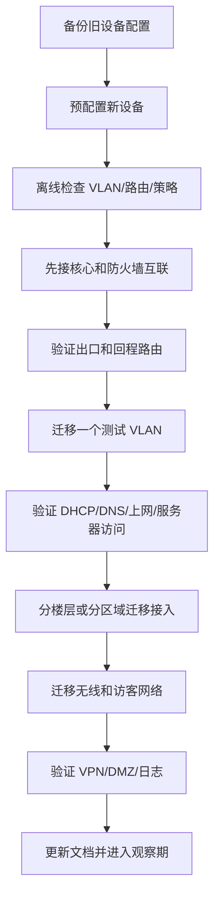

先迁移测试 VLAN 的好处是：在影响范围很小的情况下发现路由、NAT、DNS 和策略问题。

### 割接时的验证顺序

每迁移一个区域，至少验证：

1. 终端能否获取正确 IP、网关和 DNS。
2. 能否 ping 网关。
3. 能否解析内部域名和公网域名。
4. 能否访问互联网。
5. 能否访问应该访问的服务器。
6. 是否不能访问被禁止的区域。
7. 防火墙和日志平台是否有记录。
8. 交换机端口和 AP 状态是否正常。

不要只验证“能上网”。企业网络的验证必须同时证明“该通的通，不该通的不通”。

## 20.16 验证清单

上线后建议按清单验证。

### 物理和链路

| 验证项 | 预期结果 |
| --- | --- |
| 防火墙外网接口 | Up，地址和网关正确 |
| 防火墙到核心互联 | Up，互联地址互 ping 正常 |
| 核心到接入上联 | Up，Trunk 允许 VLAN 正确 |
| 接入端口 | 对应 VLAN 正确，端口描述清楚 |
| AP PoE | AP 在线，功率正常 |
| 服务器连接 | 速率、双工和 VLAN 正确 |

### 地址和 DHCP

| 验证项 | 预期结果 |
| --- | --- |
| 办公网 DHCP | 获取 `10.20.10.50-10.20.10.220` |
| 财务网 DHCP | 获取 `10.20.20.50-10.20.20.150` |
| 访客无线 DHCP | 获取 `10.20.70.50-10.20.70.230` |
| DNS | 内部域名和公网域名解析正常 |
| 网关 | 每个 VLAN 网关可达 |
| 地址冲突 | 无冲突告警 |

### 路由和 NAT

| 验证项 | 预期结果 |
| --- | --- |
| 内网到防火墙 | 核心默认路由正确 |
| 防火墙回内网 | `10.20.0.0/16` 回程路由正确 |
| 员工上网 NAT | 转换为公网地址 |
| 访客上网 NAT | 转换为公网地址 |
| VPN 免 NAT | VPN 到内网保持预期地址 |
| DMZ 发布 | 公网访问 HTTPS 正常 |

### 安全策略

| 测试 | 预期 |
| --- | --- |
| 访客无线访问互联网 | 允许 |
| 访客无线访问 `10.20.40.10` | 拒绝 |
| 办公网访问文件服务器 | 允许 |
| 办公网访问管理区设备 | 拒绝 |
| 财务访问 ERP | 允许 |
| 普通办公访问 ERP 数据库端口 | 拒绝 |
| Internet 访问 DMZ Web HTTPS | 允许 |
| Internet 扫描 DMZ 其他端口 | 拒绝 |

### 运维和日志

| 验证项 | 预期结果 |
| --- | --- |
| 设备 NTP | 时间一致 |
| Syslog | 防火墙、核心、接入日志能到日志平台 |
| 配置备份 | 初始配置已备份 |
| 账号权限 | 默认账号禁用，运维账号可用 |
| 监控告警 | 核心、防火墙、AP、服务器可监控 |
| 文档 | 拓扑、地址、接口、策略已更新 |

## 20.17 常见故障与排查

中小企业网络故障排查要先判断故障边界：是单个终端、单个 VLAN、某个楼层、内网服务、出口，还是全网。

### 通用排查流程

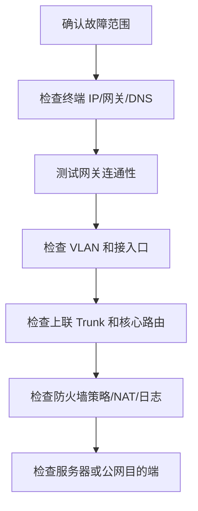

先定位范围，再深入设备。不要一开始就改配置。

### 故障矩阵

| 现象 | 可能原因 | 排查方向 |
| --- | --- | --- |
| 单台电脑不能上网 | IP 错误、网线问题、端口 VLAN 错、DNS 错 | 查看终端地址，测试网关，检查交换机端口 |
| 一个 VLAN 都不能上网 | 网关故障、DHCP 错、核心默认路由错、防火墙策略错 | 测试 VLAN 网关、核心到防火墙、防火墙日志 |
| 所有人都不能上网 | 运营商故障、防火墙外网故障、NAT 或默认路由错误 | 检查外网接口、默认路由、运营商网关 |
| 能 ping IP 不能打开网站 | DNS 故障 | 测试 DNS 解析，检查 DHCP 下发 DNS |
| 访客能访问内网 | 策略缺失、访客网关位置不当、ACL 缺失 | 检查访客 VLAN 路由和防火墙/核心策略 |
| 内网访问服务器慢 | 服务器性能、链路拥塞、双工问题、安全设备瓶颈 | 看端口错误包、带宽、服务器资源 |
| VPN 能连但不能访问内网 | 路由、策略、地址池、免 NAT 问题 | 检查 VPN 地址、回程路由、安全策略 |
| 公网发布访问失败 | DNAT、策略、公网地址、服务器网关错误 | 从外部测试，查防火墙命中和服务器回包 |
| 无线信号好但很慢 | 并发过多、信道干扰、AP 上联瓶颈、出口拥塞 | 看 AP 负载、信道、终端数、出口带宽 |
| DHCP 地址耗尽 | 地址池太小、租约太长、异常终端过多 | 查看 DHCP 租约，扩大地址池或缩短租约 |

### 示例一：访客无线能访问内网

现象：

```text
访客连接 Guest-WiFi 后可以访问 10.20.40.20 文件服务器。
```

排查：

1. 查看访客终端 IP，确认是否真的在 `10.20.70.0/24`。
2. 查看访客 VLAN 网关在哪里。
3. 如果网关在核心交换机，检查核心是否有禁止 `10.20.70.0/24` 到 `10.20.0.0/16` 的 ACL。
4. 如果网关在防火墙，检查防火墙是否有访客到内网的 Deny 策略。
5. 检查策略顺序，是否被上方宽泛 Permit 命中。
6. 修正后重新测试访客访问 Internet 和内网。

根因可能是：

```text
只划分了访客 VLAN，但没有配置禁止访客访问内网的策略。
```

### 示例二：员工能获取地址但不能上网

现象：

```text
员工电脑获取 10.20.10.80/24，网关 10.20.10.1，DNS 10.20.40.10，但无法访问互联网。
```

排查步骤：

1. ping `10.20.10.1`，确认到网关正常。
2. ping `10.20.254.1`，确认核心到防火墙互联正常。
3. 在核心查看默认路由是否指向 `10.20.254.1`。
4. 在防火墙查看是否有到 `10.20.0.0/16` 的回程路由。
5. 在防火墙查看源 NAT 是否匹配 `10.20.10.0/24` 或 `10.20.0.0/16`。
6. 在防火墙查看安全策略是否允许 OFFICE 到 Internet。
7. 测试 ping 公网 IP 和 DNS 解析，区分路由/NAT问题和 DNS 问题。

常见根因：

- 核心默认路由缺失。
- 防火墙回程路由缺失。
- NAT 源地址范围未包含新 VLAN。
- 安全策略只放行旧网段。

### 示例三：新增 VLAN 后服务器访问失败

现象：

```text
新增研发 VLAN 30 后，研发终端能上网，但访问 Git 服务器 10.20.40.40 失败。
```

排查：

1. 研发终端是否能 ping 网关 `10.20.30.1`。
2. 核心是否有 VLAN 30 的网关接口。
3. 研发终端是否能到达服务器 VLAN 网关 `10.20.40.1`。
4. Git 服务器默认网关是否正确。
5. 如果流量经过防火墙，检查策略是否新增 RND 到 Git 的放行。
6. 如果核心直接路由，检查核心 ACL 是否阻断。
7. 检查服务器自身防火墙是否允许 `10.20.30.0/24`。

新增 VLAN 时，不要只配置交换机端口，还要同步检查：

- DHCP。
- DNS。
- 路由。
- NAT。
- 防火墙策略。
- 服务器本机访问控制。
- 文档。

## 20.18 常见设计错误

### 错误一：只按设备数量设计，不按业务区域设计

有些方案只写“需要 5 台交换机、1 台防火墙、10 个 AP”，但没有说明 VLAN、地址、网关和策略。这不是完整网络设计，只是设备清单。

正确做法是先描述业务区域和访问关系，再推导设备数量和型号。

### 错误二：访客无线和办公网共用 VLAN

这是非常常见也非常危险的问题。访客只是临时使用互联网，不应该和员工电脑、服务器、打印机处于同一网段。

正确做法：

- 访客独立 SSID。
- 访客独立 VLAN。
- 访客独立 DHCP。
- 访客到内网默认拒绝。
- 访客只允许必要上网服务。

### 错误三：网关在核心，但忘记内网访问控制

核心三层交换机默认会在 VLAN 之间转发。如果没有 ACL 或防火墙控制，财务、研发、办公、服务器之间可能全部互通。

正确做法：

- 明确哪些 VLAN 可以互访。
- 在核心上配置 ACL，或让敏感区域经过防火墙。
- 至少禁止访客、IoT 和普通办公访问管理区。

### 错误四：NAT 规则只包含旧网段

新增 VLAN 后，终端能到防火墙但不能上网，常见原因是源 NAT 只匹配了旧地址段。

正确做法：

- 使用汇总地址规划，例如 `10.20.0.0/16`。
- 新增 VLAN 时同步检查 NAT 和策略。
- 在变更记录中写明涉及的规则。

### 错误五：没有管理区

如果所有员工都能访问交换机和防火墙管理地址，风险很高。

正确做法：

- 管理地址放入独立管理 VLAN。
- 只允许运维终端或堡垒机访问。
- 禁用明文管理协议。
- 管理操作记录日志。

### 错误六：没有文档和配置备份

中小企业常见情况是“网络能用，但没人知道怎么配的”。一旦设备故障或人员离职，恢复非常困难。

正确做法：

- 上线当天导出配置。
- 保存拓扑图、地址表、接口表和策略表。
- 每次变更后更新文档。
- 定期检查备份是否可用。

## 20.19 自检练习

请尝试完成以下练习。

1. 某公司有 80 名员工、1 台文件服务器、1 台 ERP 服务器、6 台打印机、8 个 AP、访客无线和 1 条互联网线路。请设计至少 5 个 VLAN，并说明每个 VLAN 的网段、网关和用途。
2. 如果访客无线 VLAN 是 `10.50.70.0/24`，公司内网是 `10.50.0.0/16`，请写出访客无线最基本的允许和拒绝策略。
3. 某网络中核心交换机做网关，防火墙连接核心的地址为 `10.50.254.1/30`，核心地址为 `10.50.254.2/30`。请写出核心默认路由和防火墙回程路由。
4. 新增研发 VLAN 后，研发终端可以访问互联网，但不能访问 Git 服务器。请列出至少 6 个排查点。
5. 一个企业预算有限，暂不做双核心。请写出至少 4 个降低核心单点风险的运维措施。
6. 为什么“划分了 VLAN”不等于“完成了安全隔离”？请结合网关位置和策略说明。
7. 如果企业已有 AD 域，为什么员工终端 DNS 不建议直接配置公网 DNS？
8. 请根据本章综合示例，画出你自己的简化拓扑，并标出防火墙、核心、接入、服务器区、访客无线和管理区。

## 20.20 本章小结

本章学习了中小企业网络设计方法。中小企业网络的重点不是堆叠复杂技术，而是在有限预算和有限运维能力下，把基础设计做扎实。

你需要掌握以下要点：

- 设计要从需求开始，而不是从设备清单开始。
- VLAN 和 IP 地址规划要表达业务区域和安全边界。
- 访客无线、管理区、服务器区、财务区等应根据风险单独规划。
- 网关放在防火墙上更便于集中安全控制，放在核心交换机上更利于内网性能和扩展。
- 核心做网关时，要特别注意 VLAN 间访问控制和防火墙回程路由。
- 出口防火墙要同时考虑默认路由、NAT、安全策略、VPN、DMZ 和日志。
- 无线网络要区分员工、访客和 IoT，不能只看信号强度。
- 可靠性设计要识别单点，并结合预算选择双机、备件、配置备份或快速替换流程。
- 上线验证要同时证明“该通的通”和“不该通的不通”。
- 文档、命名、日志、配置备份和变更记录是中小企业网络长期稳定运行的基础。

下一章将继续扩大规模，学习大型企业园区网设计。大型园区网会引入更清晰的核心、汇聚、接入分层，更复杂的冗余、路由、安全边界和多区域运维方法。
