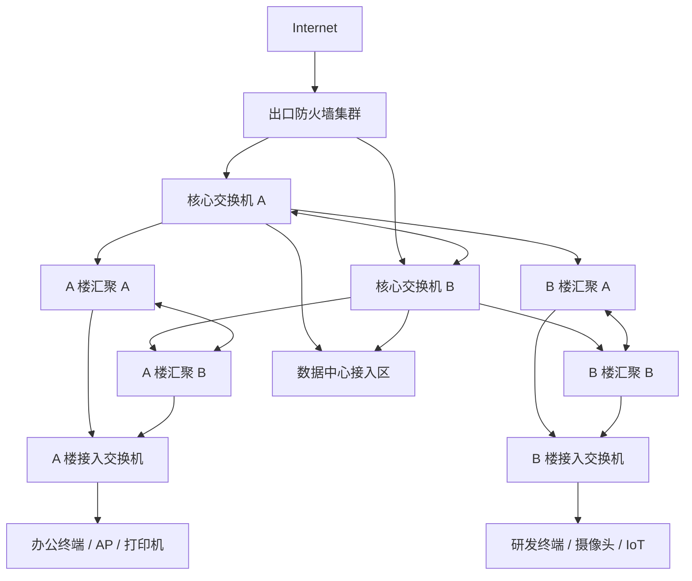
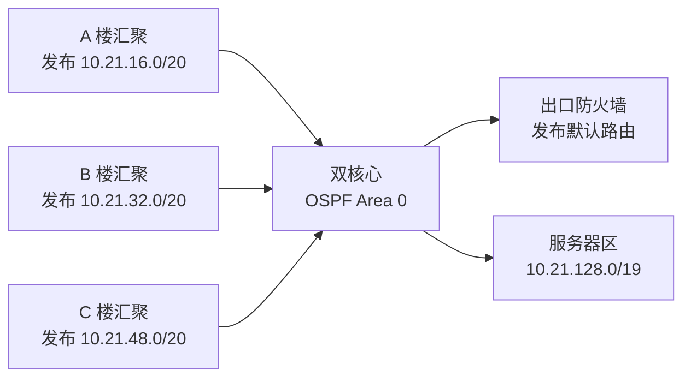
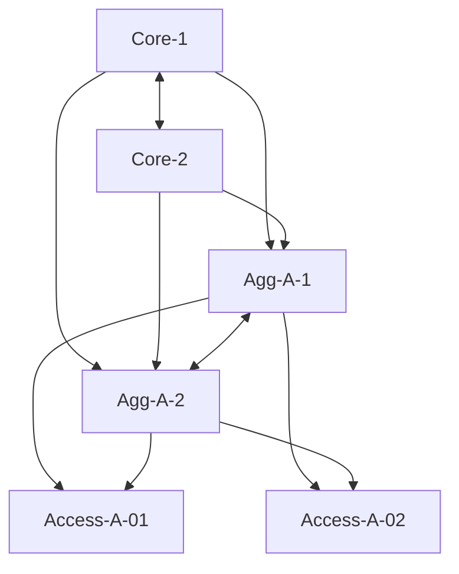
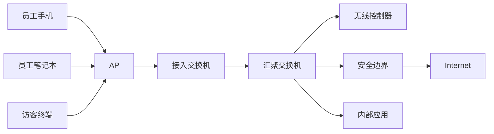
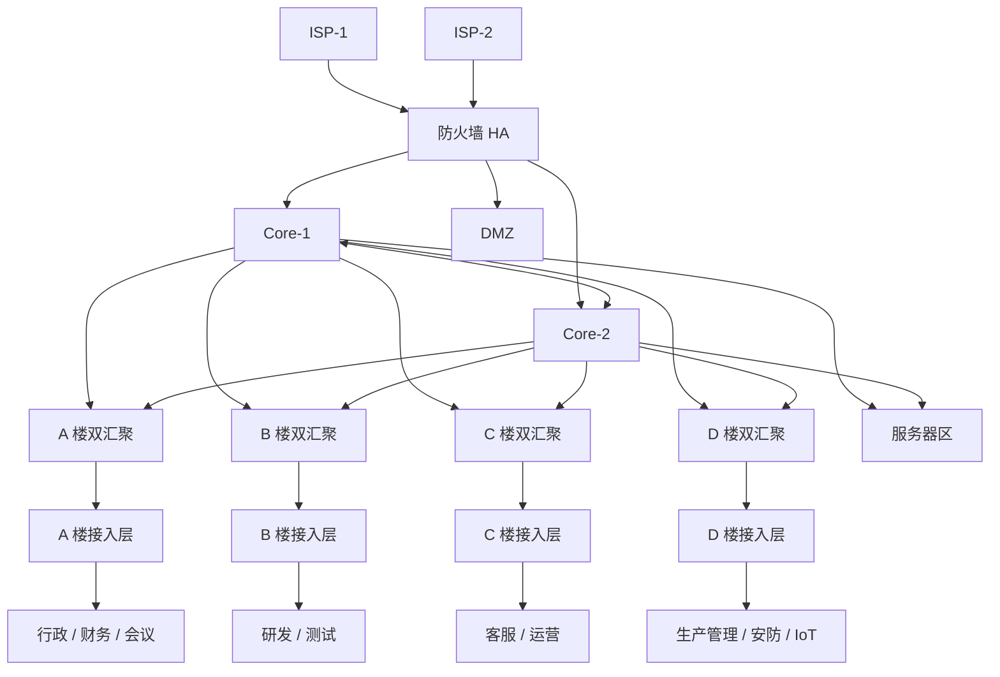

# 第 21 章：大型企业园区网设计

## 21.1 本章学习目标

读完本章后，你应该能够：

- 理解什么是大型企业园区网，以及它和中小企业网络在规模、可靠性、安全和运维上的区别。
- 看懂大型园区网中的核心层、汇聚层、接入层、出口区、数据中心接入区、无线区、管理区、安防物联网区和分支互联区。
- 能够根据楼宇、部门、终端类型和业务安全等级规划 VLAN、IP 网段、网关、DHCP、DNS、路由汇总和安全区域。
- 理解为什么大型园区网通常采用双核心、多汇聚、多接入、链路聚合、网关冗余、动态路由和集中安全控制。
- 能够判断大型园区网中二层边界、三层边界、安全边界和管理边界应该放在哪里。
- 能够设计一套大型园区网示例方案，包括拓扑、地址表、VLAN 表、路由规划、安全策略、出口和无线接入。
- 能够列出大型园区网上线前的验证项目，并按照“接入层 -> 汇聚层 -> 核心层 -> 出口 -> 业务系统”的顺序排查故障。
- 能够识别大型园区网中常见的设计风险，例如二层范围过大、地址无法汇总、网关单点、策略边界不清、无线和有线隔离不足、日志缺失和变更不可控。

第 19 章学习了企业网络架构的基本组成，第 20 章学习了中小企业网络设计。本章继续向更大规模推进，讨论大型企业园区网。

大型园区网通常出现在总部园区、集团办公园区、制造基地、研发中心、学校、医院、政府办公园区和大型企业综合办公区。它不再是“一台核心交换机加几台接入交换机”的规模，而是可能包含多栋楼、多个弱电间、几千到几万台终端、多个出口、多个业务区域、无线控制器、准入系统、日志平台、监控平台和专门的运维流程。

在这种规模下，网络设计最重要的不是把设备堆得足够多，而是让结构足够清楚：

```text
每个终端从哪里接入？
默认网关在哪里？
跨楼宇流量走哪条路径？
故障时是否有备用路径？
用户访问服务器是否经过安全边界？
访客、物联网、办公终端和运维终端是否隔离？
新增一栋楼或一个部门时是否容易扩容？
出现故障时能否快速定位到楼层、汇聚、核心、出口还是服务器侧？
```

可以先记住一句话：

```text
大型企业园区网设计的核心，是把大规模接入、稳定转发、安全隔离和可运维性组织成清晰的分层架构。
```

## 21.2 什么是大型企业园区网

园区网是指在一个相对集中的物理区域内，为企业内部用户、终端、服务器、无线、安防、办公系统和管理系统提供网络连接的基础网络。这里的“园区”不一定是一个真正有围墙的园区，也可以是一个总部大楼群、一个工厂基地、一所学校、一个医院院区或一个大型办公综合体。

大型企业园区网通常具有以下特点：

| 特点 | 说明 | 对设计的影响 |
| --- | --- | --- |
| 用户数量多 | 几百到几万人，终端数量可能是用户数的 2-4 倍 | 接入端口、地址池、无线容量和 DHCP 规模要提前规划 |
| 楼宇和弱电间多 | 多栋楼、多楼层、多配线间 | 需要清晰的核心、汇聚、接入层次 |
| 业务类型复杂 | 办公、研发、财务、生产、安防、访客、无线、会议、运维 | 必须做区域隔离和策略控制 |
| 可靠性要求高 | 核心、出口、认证、DNS、DHCP 故障会影响大量用户 | 关键设备和链路要冗余 |
| 安全边界多 | 用户到服务器、访客到互联网、生产到办公、运维到设备 | 需要清晰的安全区域和访问控制 |
| 变更多 | 新楼宇、新部门、新系统、新设备不断接入 | 设计要可扩展，文档和流程要完整 |
| 运维团队分工 | 网络、安全、系统、桌面、弱电可能由不同团队负责 | 命名、监控、日志、告警和责任边界要清楚 |

### 大型园区网和中小企业网络的区别

中小企业网络强调“用有限设备划清基本边界”。大型园区网强调“在规模扩大后仍然保持稳定、可控和可扩展”。

| 对比项 | 中小企业网络 | 大型企业园区网 |
| --- | --- | --- |
| 常见规模 | 几十到几百人 | 几百到几万人 |
| 物理范围 | 一个办公室或少量楼层 | 多栋楼、多楼层、多弱电间 |
| 典型架构 | 单核心或简化双核心 | 双核心、多汇聚、多接入 |
| 路由方式 | 静态路由较常见 | 动态路由和路由汇总更常见 |
| 网关冗余 | 可能没有或只在核心做 | 通常要求网关冗余 |
| 安全控制 | 出口防火墙为主 | 出口、内网、数据中心、准入多点控制 |
| 无线规模 | 少量 AP 或云管 AP | 控制器、AC 集群、大量 AP、漫游和容量规划 |
| 运维要求 | 简洁、易交接 | 监控、日志、配置备份、变更流程、容量管理 |

大型园区网不能只靠“更高性能的设备”解决问题。如果架构不清楚，高性能设备只会让故障影响范围更大。

例如，把几千台终端放在一个巨大的二层网络里，初期可能可以通信，但后续会出现：

- 广播和未知单播范围过大。
- STP 拓扑复杂，环路风险高。
- 故障影响整个园区。
- 网关和 DHCP 边界不清。
- 访问控制难以分区域实施。
- 排查时无法快速判断问题发生在哪个楼宇或哪个区域。

因此大型园区网必须强调分层、分区、汇总和边界。

## 21.3 大型园区网的分层架构

大型园区网最常见的设计思想是三层架构：

```text
接入层 -> 汇聚层 -> 核心层
```

这三个层次不是为了让拓扑看起来复杂，而是为了把不同职责分开。

| 层次 | 主要职责 | 常见设备 | 设计重点 |
| --- | --- | --- | --- |
| 接入层 | 连接终端、AP、打印机、摄像头、门禁等 | 接入交换机、PoE 交换机 | 端口、VLAN、认证、PoE、安全接入 |
| 汇聚层 | 汇总多个接入交换机，承载楼宇或区域网关 | 汇聚交换机、三层交换机 | 冗余、路由、网关、策略边界 |
| 核心层 | 高速转发园区内不同区域之间的流量 | 核心交换机、核心路由交换设备 | 高可靠、高性能、路由收敛、简单稳定 |

一个典型大型园区网逻辑拓扑如下：



这张图表达的是：

- 核心层负责园区高速转发和连接出口、数据中心、各楼宇汇聚。
- 每栋楼或每个区域有一对汇聚交换机。
- 接入交换机上联到汇聚层，终端接入到接入层。
- 出口防火墙连接核心层，控制内外网流量。
- 数据中心或服务器区可以作为独立区域接入核心。

### 接入层设计

接入层离用户最近。用户电脑、电话、AP、摄像头、门禁、打印机和会议终端大多都接在接入交换机上。

接入层设计要回答以下问题：

| 问题 | 设计考虑 |
| --- | --- |
| 一个楼层需要多少端口 | 按当前终端数加 20%-30% 预留 |
| 是否需要 PoE | AP、IP 电话、摄像头常需要 PoE |
| 端口属于哪个 VLAN | 根据部门、设备类型或安全等级划分 |
| 是否启用接入认证 | 大型园区常使用 802.1X、MAC 认证或 Portal |
| 是否限制私接交换机 | 可以使用端口安全、BPDU 防护、环路检测 |
| 上联速率多少 | 常见为 10G/25G，上联到汇聚层 |
| 是否双上联 | 关键接入交换机建议双上联到两台汇聚 |

接入层不建议承担过多复杂路由策略。它的核心任务是稳定接入终端，并把流量送到汇聚层。

常见接入 VLAN 划分示例：

| 终端类型 | VLAN | 网段 | 说明 |
| --- | --- | --- | --- |
| 普通办公终端 | 110 | 10.21.10.0/24 | A 楼 1-2 层办公区 |
| 研发终端 | 120 | 10.21.20.0/24 | A 楼研发区 |
| 财务终端 | 130 | 10.21.30.0/24 | 敏感部门，访问策略更严格 |
| 员工无线 | 210 | 10.21.110.0/23 | 员工移动终端 |
| 访客无线 | 220 | 10.21.120.0/23 | 只允许访问互联网 |
| 打印机 | 310 | 10.21.210.0/24 | 被办公网按需访问 |
| 摄像头 | 320 | 10.21.220.0/23 | 只允许访问视频平台 |
| AP 管理 | 330 | 10.21.230.0/24 | AP 到无线控制器 |

这里的关键不是 VLAN 数字本身，而是要让 VLAN、网段和业务含义一一对应。

### 汇聚层设计

汇聚层通常按楼宇、楼层组、园区区域或功能区域部署。它上联核心层，下联多个接入交换机。

汇聚层常见职责包括：

- 汇总接入交换机上联。
- 作为用户 VLAN 的默认网关。
- 做网关冗余。
- 和核心层运行动态路由。
- 对接入层故障进行隔离。
- 对部分区域做 ACL 或安全策略前置控制。
- 汇总路由，减少核心层路由表规模。

大型园区网中，网关常放在汇聚层或核心层。更推荐的工程化思路是：

```text
普通用户 VLAN 的网关尽量靠近接入区域，常放在汇聚层；
核心层保持高速、简单、稳定，尽量不要承载大量细碎用户网关；
需要经过防火墙审计的区域流量，要在架构上保证路径经过防火墙。
```

如果每栋楼有一对汇聚交换机，可以让这对汇聚为本楼宇用户提供网关冗余。例如 A 楼：

| VLAN | 业务 | 网关虚地址 | 汇聚 A 地址 | 汇聚 B 地址 |
| --- | --- | --- | --- | --- |
| 110 | A 楼办公 | 10.21.10.1 | 10.21.10.2 | 10.21.10.3 |
| 120 | A 楼研发 | 10.21.20.1 | 10.21.20.2 | 10.21.20.3 |
| 130 | A 楼财务 | 10.21.30.1 | 10.21.30.2 | 10.21.30.3 |
| 210 | 员工无线 | 10.21.110.1 | 10.21.110.2 | 10.21.110.3 |

网关虚地址可以由 VRRP、HSRP、IRF、堆叠、MLAG 或厂商虚拟化技术提供。不同厂商实现不同，但目标都是：

```text
终端只配置一个默认网关；
其中一台汇聚设备故障时，默认网关仍然可用。
```

### 核心层设计

核心层是园区网的高速骨干。它连接各楼宇汇聚、数据中心接入、出口防火墙、广域网或城域网边界。

核心层设计原则是：

- 少做复杂策略。
- 少接终端。
- 少做频繁变更。
- 保持高可靠和高性能。
- 路由结构清晰，收敛速度可控。
- 重要链路和设备冗余。

核心层常见连接对象如下：

| 连接对象 | 说明 |
| --- | --- |
| 楼宇汇聚 | 各栋楼、各区域的汇聚交换机 |
| 出口防火墙 | 互联网出口、VPN、DMZ 发布 |
| 数据中心接入区 | 内部服务器、虚拟化、存储和业务系统 |
| 分支互联设备 | 专线、SD-WAN、MPLS、城域网 |
| 管理区 | 网管、日志、堡垒机、认证系统 |

核心层可以是一对独立核心交换机，也可以使用堆叠、虚拟化或 MLAG 形成逻辑双核心。选择哪种方式要看厂商能力、运维经验和故障域控制。

| 方案 | 优点 | 风险或注意点 |
| --- | --- | --- |
| 两台独立核心 | 故障域清晰，升级可分台处理 | 路由和链路设计要求更高 |
| 核心堆叠或虚拟化 | 管理简单，下联可以做跨设备聚合 | 控制平面故障或误操作影响可能更大 |
| 核心 MLAG | 下联双归属，避免传统 STP 阻塞 | 对厂商实现和运维规范有要求 |

初学者可以先理解设计目标：

```text
任何一台核心设备故障时，关键业务不应全部中断；
任何一条核心链路故障时，应有备用路径；
核心层不应该因为某个接入层环路或终端问题而整体失控。
```

## 21.4 大型园区网的区域划分

大型园区网不能只按“楼层”划分网络，还要按“业务安全等级”和“设备类型”划分区域。

常见区域包括：

| 区域 | 典型对象 | 设计要求 |
| --- | --- | --- |
| 办公网 | 员工 PC、办公终端 | 访问互联网和内部应用，禁止横向访问敏感系统 |
| 研发网 | 研发 PC、测试设备 | 可访问代码、测试环境，和办公网适度隔离 |
| 财务网 | 财务 PC、税务设备 | 访问 ERP、财务系统，限制被其他网段访问 |
| 高管或敏感办公区 | 高管终端、法务、人事 | 更严格准入、日志和访问控制 |
| 员工无线 | 员工手机、笔记本 | 和有线办公策略一致或稍弱 |
| 访客无线 | 外部访客终端 | 只能访问互联网，不能访问内网 |
| 服务器区 | OA、ERP、文件、数据库 | 按应用分层控制访问 |
| DMZ | 对外 Web、VPN、代理 | 被互联网访问，但不能随意访问内网 |
| 管理区 | 堡垒机、网管、日志、认证 | 只允许运维人员和运维系统访问 |
| 安防物联网区 | 摄像头、门禁、会议屏、打印机 | 禁止随意访问办公网和服务器 |
| 分支互联区 | 分支专线、SD-WAN、VPN | 路由、加密、安全策略和地址规划统一 |

### 为什么不能所有部门互通

大型企业里，终端数量多，用户角色复杂，不能假设所有内网终端都是可信的。

例如：

- 一台访客笔记本不应该访问财务系统。
- 一台摄像头不应该访问 OA 或文件服务器。
- 一台普通办公电脑不应该直接连接数据库。
- 一个研发测试环境不应该影响生产服务器。
- 一个被感染的终端不应该在全网横向扫描。

因此大型园区网需要把“能不能访问”从物理连接中抽离出来，变成明确的安全策略。

### 区域之间的典型访问关系

可以用一张访问矩阵表达基本原则：

| 源区域 | 目的区域 | 默认建议 | 说明 |
| --- | --- | --- | --- |
| 办公网 | Internet | 允许，经过出口防火墙 | 需要 NAT、日志、上网安全 |
| 办公网 | 内部应用区 | 按应用允许 | 只放行业务端口 |
| 办公网 | 数据库区 | 默认拒绝 | 应由应用服务器访问数据库 |
| 办公网 | 管理区 | 默认拒绝 | 普通用户不应访问设备管理 |
| 研发网 | 研发服务器 | 按需允许 | 可按项目或系统划分 |
| 财务网 | 财务系统 | 允许，严格记录 | 需要更细粒度策略 |
| 访客无线 | Internet | 允许 | 只能上网 |
| 访客无线 | 内网 | 拒绝 | 包括办公、服务器、管理、打印机 |
| 摄像头网 | 视频平台 | 允许 | 只允许到视频管理服务器 |
| 摄像头网 | Internet | 默认拒绝 | 除非确有云服务需求 |
| 管理区 | 网络设备 | 允许，强认证 | 通过堡垒机或运维终端 |
| DMZ | 内部应用区 | 按需允许 | 例如反向代理到应用服务器 |
| DMZ | 办公网 | 拒绝 | 防止被攻陷后横向移动 |

这张表不是最终策略表，但它能帮助设计人员建立默认原则：

```text
默认不互通，按业务需要最小放行。
```

## 21.5 VLAN 与 IP 地址规划

大型园区网的地址规划要比中小企业更严谨，因为后续扩容、路由汇总、故障定位和安全策略都会依赖地址结构。

### 地址规划的基本原则

大型园区网地址规划建议遵循以下原则：

| 原则 | 说明 |
| --- | --- |
| 按区域分块 | 不同楼宇、业务区、无线、服务器使用不同地址块 |
| 预留扩展空间 | 不要按当前终端数量刚好分配 |
| 避免重叠 | 总部、分支、VPN、云上 VPC 不应使用重复网段 |
| 便于汇总 | 楼宇或区域网段尽量可以汇总成较少路由 |
| 网关规则一致 | 常用 `.1` 做虚网关，`.2/.3` 做主备设备地址 |
| 静态和动态分离 | 网关、服务器、打印机、网络设备不要放入 DHCP 池 |
| 文档先行 | 地址表必须和现网保持一致 |

### 示例：集团总部园区地址规划

假设“星河集团”总部园区有：

- A 楼：行政、财务、会议中心。
- B 楼：研发办公。
- C 楼：客服与运营。
- D 楼：生产管理和安防中心。
- 两台核心交换机。
- 每栋楼一对汇聚交换机。
- 员工无线和访客无线全园区覆盖。
- 内部服务器区连接到核心。
- 出口防火墙连接互联网和 DMZ。

规划使用 `10.21.0.0/16` 作为总部园区地址块。为了便于记忆，按功能和楼宇分段：

| 地址块 | 用途 | 说明 |
| --- | --- | --- |
| 10.21.0.0/20 | 网络设备互联和管理 | 核心、汇聚、接入、设备 Loopback、点到点链路 |
| 10.21.16.0/20 | A 楼用户网段 | 行政、财务、会议、打印 |
| 10.21.32.0/20 | B 楼用户网段 | 研发、测试、打印 |
| 10.21.48.0/20 | C 楼用户网段 | 客服、运营、培训 |
| 10.21.64.0/20 | D 楼和物联网 | 生产管理、安防、门禁、摄像头 |
| 10.21.96.0/20 | 员工无线 | 全园区员工无线 |
| 10.21.112.0/20 | 访客无线 | 全园区访客无线 |
| 10.21.128.0/19 | 服务器区 | 应用、数据库、文件、认证、日志 |
| 10.21.192.0/20 | DMZ 和发布区 | 对外服务和代理 |
| 10.21.240.0/20 | 预留 | 后续楼宇、实验区或新业务 |

这种规划的好处是：

- 看见 `10.21.32.0/20` 就知道大致属于 B 楼。
- 楼宇汇聚可以向核心发布汇总路由。
- 安全策略可以按地址块粗粒度匹配，再按具体业务细化。
- 新增 VLAN 时不需要打乱全网地址结构。

### VLAN 规划示例

A 楼和 B 楼可以这样规划：

| 楼宇 | VLAN | 名称 | 网段 | 网关 | DHCP 范围 |
| --- | --- | --- | --- | --- | --- |
| A 楼 | 110 | A-Office | 10.21.16.0/24 | 10.21.16.1 | 10.21.16.50-10.21.16.230 |
| A 楼 | 120 | A-Finance | 10.21.17.0/24 | 10.21.17.1 | 10.21.17.50-10.21.17.200 |
| A 楼 | 130 | A-Meeting | 10.21.18.0/24 | 10.21.18.1 | 10.21.18.50-10.21.18.230 |
| A 楼 | 310 | A-Printer | 10.21.19.0/24 | 10.21.19.1 | 按需静态或保留地址 |
| B 楼 | 210 | B-RD-Office | 10.21.32.0/23 | 10.21.32.1 | 10.21.32.50-10.21.33.230 |
| B 楼 | 220 | B-RD-Test | 10.21.34.0/23 | 10.21.34.1 | 10.21.34.50-10.21.35.230 |
| B 楼 | 230 | B-Lab | 10.21.36.0/24 | 10.21.36.1 | 按实验需求分配 |
| B 楼 | 320 | B-Printer | 10.21.37.0/24 | 10.21.37.1 | 按需静态或保留地址 |

无线和物联网可以单独规划：

| 区域 | VLAN | 名称 | 网段 | 网关 | 访问原则 |
| --- | --- | --- | --- | --- | --- |
| 员工无线 | 410 | Corp-WiFi-1 | 10.21.96.0/22 | 10.21.96.1 | 类似办公网，按身份控制 |
| 员工无线 | 411 | Corp-WiFi-2 | 10.21.100.0/22 | 10.21.100.1 | 用户多时分池 |
| 访客无线 | 420 | Guest-WiFi-1 | 10.21.112.0/22 | 10.21.112.1 | 只上网 |
| AP 管理 | 430 | AP-Mgmt | 10.21.8.0/23 | 10.21.8.1 | AP 到无线控制器 |
| 摄像头 | 510 | Camera | 10.21.64.0/22 | 10.21.64.1 | 只到视频平台 |
| 门禁 | 520 | Access-Control | 10.21.68.0/24 | 10.21.68.1 | 只到门禁服务器 |
| 会议设备 | 530 | Meeting-IoT | 10.21.69.0/24 | 10.21.69.1 | 只到会议平台和必要服务 |

### 地址规划中的常见错误

| 错误 | 后果 | 改进方法 |
| --- | --- | --- |
| 每个 VLAN 随手找一个网段 | 后期无法汇总，策略难写 | 先按区域分大块，再细分 VLAN |
| 总部和分支都用 192.168.1.0/24 | VPN 或专线互联时路由冲突 | 总部、分支、云上统一地址规划 |
| DHCP 池包含网关和静态设备 | 地址冲突，业务不稳定 | 保留网关、服务器、打印机和设备地址 |
| 访客网和办公网在同一地址块 | 策略和排查容易混乱 | 访客网络独立地址块 |
| 服务器和用户混用同一 VLAN | 安全边界不清 | 服务器按应用或安全等级独立 VLAN |
| 只看当前人数分配地址 | 很快地址耗尽 | 按 2-3 年增长预留 |

大型园区网地址规划一旦上线，后续调整成本很高。因此设计阶段宁可多花时间做表格，也不要上线后靠临时修改补洞。

## 21.6 网关、二层边界与路由设计

大型园区网必须明确一个问题：

```text
二层网络到哪里结束，三层路由从哪里开始？
```

如果二层范围过大，一个环路、广播风暴或错误 Trunk 可能影响很大范围。如果三层边界过早，又可能增加路由和策略复杂度。因此要根据规模和运维能力选择合适边界。

### 常见网关放置方式

大型园区网常见三种网关放置方式：

| 方案 | 网关位置 | 优点 | 注意点 |
| --- | --- | --- | --- |
| 核心层做网关 | 核心交换机上承载大量 VLANIF/SVI | 架构直观，接入和汇聚相对简单 | 二层需要延伸到核心，故障域可能变大 |
| 汇聚层做网关 | 每栋楼或区域汇聚承载本区域 VLAN 网关 | 二层范围较小，路由可汇总 | 汇聚层配置和路由设计更重要 |
| 防火墙做网关 | 防火墙接口或子接口做用户网关 | 安全控制最直接 | 大规模用户流量可能压垮防火墙 |

对于大型园区网，常见推荐是：

```text
普通用户 VLAN 的网关放在楼宇汇聚层；
核心层只承载核心互联和少量公共区域三层接口；
服务器区和高安全区域根据安全策略决定是否经防火墙；
访客和高风险物联网流量尽量强制经过安全边界。
```

### 二层边界设计

二层边界指 VLAN 的广播域延伸到哪里。

在大型园区网中，应该尽量避免一个用户 VLAN 跨越太多楼宇。原因包括：

- 广播范围变大。
- STP 或环路风险变大。
- 故障定位困难。
- DHCP 和地址管理混乱。
- 安全策略难以按区域精确控制。

更稳妥的做法是：

```text
每栋楼或每个汇聚区域使用自己的用户 VLAN；
不同楼宇即使同属办公部门，也可以使用不同 VLAN 和不同网段；
跨楼宇访问通过三层路由完成。
```

例如：

| 场景 | 不推荐 | 推荐 |
| --- | --- | --- |
| A 楼和 B 楼都有办公用户 | 两栋楼共用 VLAN 10 和 10.21.10.0/24 | A 楼 VLAN 110 使用 10.21.16.0/24，B 楼 VLAN 210 使用 10.21.32.0/23 |
| 全园区打印机 | 所有打印机放一个跨楼宇 VLAN | 每栋楼一个打印 VLAN，通过策略允许办公网访问 |
| 摄像头 | 摄像头和办公终端混在一起 | 摄像头独立 VLAN，只允许到视频平台 |

### 路由设计

大型园区网通常会使用动态路由协议，例如 OSPF 或 IS-IS。在企业园区中，OSPF 更常见。

路由设计要解决：

- 核心、汇聚、出口、防火墙之间如何学习路由。
- 楼宇网段如何向核心汇总。
- 默认路由如何从出口发布到园区。
- 故障时备用路径如何生效。
- 哪些路由不应该被错误发布。

一个简化的路由关系如下：



汇总路由示例：

| 区域 | 细分网段 | 向核心发布 |
| --- | --- | --- |
| A 楼 | 10.21.16.0/24、10.21.17.0/24、10.21.18.0/24 等 | 10.21.16.0/20 |
| B 楼 | 10.21.32.0/23、10.21.34.0/23、10.21.36.0/24 等 | 10.21.32.0/20 |
| C 楼 | 10.21.48.0/24 到 10.21.63.0/24 | 10.21.48.0/20 |
| 无线 | 10.21.96.0/22、10.21.100.0/22 | 10.21.96.0/20 |
| 服务器区 | 10.21.128.0/24 到 10.21.159.0/24 | 10.21.128.0/19 |

路由汇总的好处是：

- 核心路由表更简洁。
- 楼宇内部新增 VLAN 时，核心路由变化较少。
- 故障影响边界更清楚。
- 排查时可以先判断某个汇总段是否可达。

### 默认路由设计

园区网访问互联网通常依赖出口防火墙。常见方式是：

```text
核心层有一条默认路由指向出口防火墙；
各汇聚通过动态路由从核心学习默认路由；
出口防火墙对内网地址做源 NAT；
公网回程流量回到防火墙，再转发给内网。
```

如果有双出口或双防火墙，要注意：

- 默认路由主备或负载分担策略。
- 出口 NAT 会话回程路径一致。
- 双运营商线路切换时公网发布服务是否受影响。
- 防火墙 HA 状态是否正常。
- VPN 和远程接入是否随出口切换恢复。

出口设计已经在第 13、16、17、18 章介绍过，本章重点是把出口放回园区整体架构中理解。

## 21.7 可靠性设计

大型园区网的可靠性目标不是“永远不出故障”，而是：

```text
单台设备或单条链路故障时，影响范围可控；
关键业务有备用路径；
故障发生后能快速发现、定位和恢复。
```

### 常见冗余点

| 位置 | 常见冗余方式 | 说明 |
| --- | --- | --- |
| 核心交换机 | 双核心、堆叠、虚拟化、MLAG | 防止核心单点 |
| 汇聚交换机 | 每栋楼双汇聚 | 接入交换机双上联 |
| 接入上联 | LACP、双上联、主备链路 | 防止单链路故障 |
| 网关 | VRRP、HSRP、厂商虚拟网关 | 防止网关单点 |
| 出口防火墙 | HA 主备或双活 | 防止出口安全设备单点 |
| 运营商线路 | 双运营商、主备线路 | 防止公网出口单线故障 |
| DHCP/DNS/认证 | 双服务器或集群 | 防止基础服务影响全网 |
| 电源 | 双电源、UPS、双路供电 | 防止设备断电 |

### 双核心与双汇聚

大型园区网中，双核心和双汇聚很常见。一个简化连接方式如下：



这个设计希望达到：

- 任意一台核心故障，汇聚仍有另一条上行路径。
- 任意一台汇聚故障，接入交换机仍能通过另一台汇聚转发。
- 任意一条上联故障，链路聚合或备用路径接管。

但要注意，冗余并不等于简单地多接几根线。如果没有正确的二层或三层设计，多余链路可能带来环路。

常见控制方式包括：

| 技术 | 作用 |
| --- | --- |
| STP/MSTP | 防止二层环路，必要时阻塞备用链路 |
| LACP | 多条物理链路聚合成逻辑链路 |
| VRRP/HSRP | 提供默认网关冗余 |
| OSPF/IS-IS | 三层路径冗余和自动收敛 |
| MLAG/堆叠/虚拟化 | 支持接入设备跨两台上联聚合 |
| BFD | 加快链路或邻居故障检测 |

### 可靠性不是只看设备

初学者容易认为“买两台设备就是高可靠”。实际项目中，很多故障来自非设备因素：

| 风险 | 示例 | 设计改进 |
| --- | --- | --- |
| 同路由光纤 | 两条上联走同一根光缆或同一桥架 | 关键链路物理路径分离 |
| 同电源故障 | 双电源都接同一 PDU | 双路供电和 UPS |
| 单 DHCP | DHCP 服务器故障导致新终端拿不到地址 | DHCP 冗余或备份池 |
| 单认证 | 802.1X 认证服务器故障导致用户无法接入 | RADIUS 主备、失败策略 |
| 单 DNS | DNS 故障导致业务“看起来网络不通” | 至少两个 DNS |
| 配置误操作 | 一条错误策略影响全网 | 变更审批、备份、回退方案 |

大型园区网的可靠性设计要同时覆盖设备、链路、电源、基础服务和流程。

## 21.8 安全设计

大型园区网安全设计的重点是“分区、准入、最小权限、审计和持续运维”。

### 安全边界放在哪里

安全边界不一定只在互联网出口。大型园区网常见安全边界包括：

| 边界 | 控制内容 |
| --- | --- |
| 互联网出口边界 | 内网访问公网、公网访问 DMZ、VPN 接入 |
| 用户到服务器边界 | 办公网、研发网、财务网访问内部应用 |
| 访客到内网边界 | 访客只能上网，禁止访问内网 |
| IoT 到业务系统边界 | 摄像头、门禁、会议设备只访问指定平台 |
| 运维到设备边界 | 只有堡垒机或运维终端能管理设备 |
| 分支到总部边界 | 分支访问总部应用按业务授权 |
| 无线到有线边界 | 员工无线、访客无线、IoT 无线分别控制 |

### 准入控制

大型园区网终端数量多，不能只靠“插上线就能进内网”。常见准入方式包括：

| 准入方式 | 说明 | 适合对象 |
| --- | --- | --- |
| 802.1X | 用户或设备认证后接入指定 VLAN 或策略组 | 员工 PC、办公终端 |
| MAC 认证 | 根据设备 MAC 放行或分配策略 | 打印机、摄像头、门禁 |
| Portal 认证 | 用户打开网页认证 | 访客无线 |
| 证书认证 | 使用设备或用户证书 | 高安全无线、受管终端 |
| 动态 VLAN | 认证后根据身份分配 VLAN | 多部门共享接入环境 |
| 安全组策略 | 认证后按用户组控制访问 | 更细粒度的园区策略 |

准入控制要考虑失败场景。例如认证服务器故障时：

- 员工是否全部无法接入？
- 是否有关键岗位或会议室应急 VLAN？
- 摄像头和门禁是否继续工作？
- 失败放行是否会带来安全风险？

这些问题必须在设计阶段明确，而不是故障时临时决定。

### 内网安全策略示例

以“星河集团”总部为例，可以设计如下策略：

| 序号 | 源区域 | 目的区域 | 服务 | 动作 | 说明 |
| --- | --- | --- | --- | --- | --- |
| 1 | 办公网 | Internet | HTTP/HTTPS/DNS/NTP | 允许并记录 | 出口防火墙做 NAT |
| 2 | 办公网 | OA 应用 | HTTPS | 允许并记录 | 禁止直接访问数据库 |
| 3 | 财务网 | ERP 应用 | HTTPS | 允许并记录 | 只允许财务终端访问 |
| 4 | 研发网 | Git/测试平台 | HTTPS/SSH | 允许并记录 | 按研发用户组控制 |
| 5 | 员工无线 | 内部应用 | HTTPS | 按身份允许 | 可比有线办公更严格 |
| 6 | 访客无线 | Internet | HTTP/HTTPS/DNS | 允许并记录 | 只上网 |
| 7 | 访客无线 | 内网任意区域 | Any | 拒绝并记录 | 默认隔离 |
| 8 | 摄像头网 | 视频平台 | 指定端口 | 允许并记录 | 禁止访问其他服务器 |
| 9 | 管理区 | 网络设备 | SSH/HTTPS/SNMP | 允许并记录 | 只允许堡垒机和网管 |
| 10 | 任意用户网 | 管理区 | Any | 拒绝并记录 | 防止普通终端访问管理系统 |

策略设计要避免两个极端：

- 全部放行，安全边界形同虚设。
- 过度细碎，运维团队无法维护。

合理做法是先按区域建立默认策略，再对关键业务细化端口、用户组和日志。

## 21.9 无线与物联网接入设计

大型园区网中，无线和物联网经常比传统有线办公更难管理。

### 企业无线设计要点

企业无线不是“AP 能搜到信号就行”。大型园区无线要考虑：

| 设计项 | 说明 |
| --- | --- |
| SSID 数量 | 不宜过多，常见员工、访客、IoT 三类 |
| 认证方式 | 员工使用 802.1X 或证书，访客使用 Portal 或短信审批 |
| VLAN 映射 | 不同 SSID 映射不同 VLAN 或安全组 |
| 漫游 | 用户在楼层和楼宇移动时业务不中断或少中断 |
| 容量 | 会议室、培训室、高密办公区需要按并发容量设计 |
| AP 管理 | AP 管理网和用户业务网分离 |
| 访客隔离 | 访客只能访问互联网，禁止访问内网和其他访客 |
| 日志审计 | 记录用户、时间、地址、认证方式和访问行为 |

无线逻辑可以这样理解：



员工无线可能允许访问部分内部应用；访客无线必须被引导到出口防火墙，只允许上网。

### 物联网和安防设备

园区中常见物联网和安防设备包括：

- 摄像头。
- 门禁控制器。
- 考勤机。
- 会议屏。
- 打印机。
- 电子屏。
- 楼宇自控设备。
- 温湿度传感器。
- 停车场设备。

这些设备有几个共同风险：

- 固件老旧。
- 账号密码弱。
- 安全能力弱。
- 有些需要访问云平台。
- 由弱电、行政或供应商维护，网络团队不一定完全掌握。

因此不建议把它们放入普通办公网。更稳妥的设计是：

| 设备类型 | VLAN/区域 | 访问原则 |
| --- | --- | --- |
| 摄像头 | Camera VLAN | 只允许访问视频管理平台 |
| 门禁 | Access-Control VLAN | 只允许访问门禁服务器 |
| 打印机 | Printer VLAN | 允许办公网按需访问打印服务 |
| 会议屏 | Meeting-IoT VLAN | 允许会议平台和必要互联网服务 |
| 楼控设备 | BMS VLAN | 只允许楼控服务器和运维区访问 |

物联网区的默认原则是：

```text
设备能完成业务即可，不给它额外的内网访问能力。
```

## 21.10 大型园区网示例方案

下面把前面的设计方法组合成一个完整示例。

### 需求背景

星河集团总部园区包括四栋办公楼和一个小型机房：

| 项目 | 规模 |
| --- | --- |
| 员工数量 | 当前 2800 人，三年内预计 4000 人 |
| 楼宇 | A、B、C、D 四栋楼 |
| 接入终端 | PC、笔记本、手机、IP 电话、打印机、摄像头、门禁、会议设备 |
| 无线 | 全园区员工无线和访客无线 |
| 服务器 | OA、ERP、AD/DNS/DHCP、文件、Git、视频平台、日志平台 |
| 出口 | 双运营商互联网出口，一对防火墙 HA |
| 安全要求 | 访客隔离、财务隔离、IoT 隔离、运维集中管理 |
| 运维要求 | 设备监控、日志审计、配置备份、变更回退 |

### 目标架构

采用以下总体设计：

- 双核心交换机作为园区骨干。
- 每栋楼部署双汇聚交换机。
- 接入交换机双上联到本楼汇聚。
- 用户网关放在楼宇汇聚层。
- 核心、汇聚、出口防火墙之间运行 OSPF。
- 楼宇汇聚向核心发布汇总路由。
- 出口防火墙发布默认路由。
- 服务器区和 DMZ 作为独立安全区域接入核心和防火墙。
- 员工无线和访客无线使用不同 SSID、VLAN 和策略。
- 管理区只允许堡垒机、网管和日志平台访问设备。

逻辑拓扑如下：



### 设备角色表

| 设备 | 数量 | 角色 | 关键连接 |
| --- | --- | --- | --- |
| Core-1/Core-2 | 2 | 园区核心 | 连接汇聚、防火墙、服务器区 |
| FW-1/FW-2 | 2 | 出口防火墙 HA | 连接双 ISP、核心、DMZ |
| Agg-A/B/C/D | 每栋 2 台 | 楼宇汇聚 | 下联接入，上联核心，承载本楼网关 |
| Access | 按楼层部署 | 终端接入 | 连接 PC、AP、打印机、摄像头 |
| WLC | 2 | 无线控制器 | 管理 AP，连接核心或汇聚 |
| NMS/Log | 2 套或集群 | 监控和日志 | 位于管理区 |
| AD/DNS/DHCP | 多台 | 基础服务 | 位于服务器区 |

### 路由规划表

| 区域 | 路由来源 | 发布到哪里 | 说明 |
| --- | --- | --- | --- |
| A 楼 10.21.16.0/20 | A 楼汇聚 | 核心 | A 楼所有用户和打印 VLAN 汇总 |
| B 楼 10.21.32.0/20 | B 楼汇聚 | 核心 | B 楼研发和测试网络汇总 |
| C 楼 10.21.48.0/20 | C 楼汇聚 | 核心 | C 楼客服和运营网络汇总 |
| D 楼 10.21.64.0/20 | D 楼汇聚 | 核心 | D 楼物联网和生产管理 |
| 无线 10.21.96.0/20 | 无线网关所在汇聚或核心 | 核心 | 员工无线地址池 |
| 访客 10.21.112.0/20 | 无线网关或防火墙 | 核心/防火墙 | 强制走出口安全边界 |
| 服务器 10.21.128.0/19 | 服务器区三层网关 | 核心/防火墙 | 服务器内部路由 |
| 默认路由 0.0.0.0/0 | 出口防火墙 | 核心和汇聚 | 园区访问互联网 |

### 安全区域表

| 安全区域 | 地址范围 | 主要策略 |
| --- | --- | --- |
| Office-Zone | 10.21.16.0/20、10.21.48.0/20 | 上网、访问 OA/文件等内部应用 |
| RD-Zone | 10.21.32.0/20 | 访问 Git、测试平台、研发服务器 |
| Finance-Zone | 10.21.17.0/24 | 访问 ERP 和财务系统，其他区域默认拒绝 |
| Wireless-Staff | 10.21.96.0/20 | 按身份访问内部应用和互联网 |
| Wireless-Guest | 10.21.112.0/20 | 只允许访问互联网 |
| IoT-Zone | 10.21.64.0/20 | 只允许访问指定平台 |
| Server-Zone | 10.21.128.0/19 | 被用户区按业务访问 |
| DMZ-Zone | 10.21.192.0/20 | 对外发布服务 |
| Mgmt-Zone | 10.21.0.0/20 | 管理网络设备、安全设备和服务器 |

### DHCP 与 DNS 规划

大型园区网中，DHCP 和 DNS 是基础服务，不应该被忽略。

| 服务 | 设计建议 |
| --- | --- |
| DHCP | 至少双服务器或高可用；每个 VLAN 配置 DHCP Relay |
| DNS | 至少两个内部 DNS；客户端优先使用内部 DNS |
| NTP | 网络设备、服务器、日志平台统一时间源 |
| IPAM | 使用地址管理表或系统记录地址分配 |
| 保留地址 | 网关、服务器、打印机、摄像头平台、网络设备统一保留 |

DHCP 地址池示例：

| VLAN | 网段 | 网关 | DHCP 池 | 保留范围 |
| --- | --- | --- | --- | --- |
| 110 | 10.21.16.0/24 | 10.21.16.1 | 10.21.16.50-10.21.16.230 | .1-.49、.231-.254 |
| 120 | 10.21.17.0/24 | 10.21.17.1 | 10.21.17.50-10.21.17.200 | .1-.49、.201-.254 |
| 210 | 10.21.32.0/23 | 10.21.32.1 | 10.21.32.50-10.21.33.230 | 网关、静态终端和特殊设备 |
| 410 | 10.21.96.0/22 | 10.21.96.1 | 10.21.96.50-10.21.99.230 | 网络设备和控制器地址 |
| 420 | 10.21.112.0/22 | 10.21.112.1 | 10.21.112.50-10.21.115.230 | 网关和 Portal 相关地址 |

### 上线实施顺序

大型园区网实施不能只靠一次性割接。建议按以下顺序推进：

1. 完成核心、汇聚、出口、防火墙和服务器区基础配置。
2. 验证核心到汇聚、核心到防火墙、核心到服务器区的三层连通。
3. 按楼宇逐步接入接入交换机。
4. 按 VLAN 开通 DHCP、DNS、网关和基础访问。
5. 先接入试点用户，再扩大到楼层或部门。
6. 开通无线员工 SSID 和访客 SSID。
7. 开通 IoT、摄像头、门禁等专用网络。
8. 上线安全策略、日志、监控和配置备份。
9. 完成验收测试和文档归档。

不要在没有验证核心、路由、DHCP、DNS、出口和回退方案的情况下直接迁移大量用户。

## 21.11 验证与排错

大型园区网排错必须有顺序。不要一开始就怀疑复杂协议，也不要只看某一台设备。

可以按以下故障边界逐层判断：

```text
终端 -> 接入端口 -> 接入交换机 -> 汇聚网关 -> 核心路由 -> 防火墙策略 -> 服务器或互联网
```

### 上线前验证清单

| 验证项 | 检查内容 |
| --- | --- |
| 物理链路 | 核心、汇聚、接入、防火墙链路状态和速率是否正确 |
| Trunk | 上联允许的 VLAN 是否正确，是否存在多余 VLAN |
| LACP | 聚合成员是否正常，是否有单链路异常 |
| STP/MSTP | 根桥位置是否符合设计，是否有异常阻塞 |
| 网关冗余 | VRRP/HSRP/虚网关状态是否正常 |
| DHCP | 各 VLAN 能否获取正确地址、网关、DNS |
| DNS | 内部域名和公网域名解析是否正常 |
| 路由 | 汇聚、核心、防火墙路由表是否符合设计 |
| NAT | 内网访问互联网是否正确转换 |
| 安全策略 | 允许和拒绝的访问是否符合策略表 |
| 无线 | 员工、访客、IoT SSID 是否进入正确 VLAN |
| 管理 | 网管、日志、NTP、配置备份是否正常 |
| 故障切换 | 断开单链路、单设备后业务是否按预期恢复 |

### 常见故障 1：终端拿不到地址

排查思路：

1. 确认终端网线、无线关联或交换机端口状态是否正常。
2. 确认接入端口是否属于正确 VLAN。
3. 确认上联 Trunk 是否允许该 VLAN。
4. 确认 VLAN 网关接口是否启用。
5. 确认 DHCP Relay 是否指向正确 DHCP 服务器。
6. 确认 DHCP 地址池是否耗尽。
7. 确认安全策略是否阻断 DHCP 请求或响应。

常见原因：

| 现象 | 可能原因 |
| --- | --- |
| 只有某个端口无法获取地址 | 接入口 VLAN 错误、端口认证失败 |
| 整个楼层无法获取地址 | 接入上联 Trunk 未放行 VLAN |
| 某个 VLAN 全部无法获取地址 | DHCP Relay 配置错误或地址池耗尽 |
| 无线用户无法获取地址 | SSID 到 VLAN 映射错误 |

### 常见故障 2：同楼内用户能通，跨楼访问失败

排查思路：

1. 从用户网关开始测试到目标网关。
2. 查看本楼汇聚是否有到目标网段的路由。
3. 查看核心是否收到两个楼宇的汇总路由。
4. 查看目标楼宇汇聚是否有回程路由。
5. 判断访问是否需要经过防火墙策略。
6. 检查是否存在路由汇总缺失或错误汇总。

示例：

```text
A 楼用户 10.21.16.60 访问 B 楼研发服务器 10.21.34.80 失败。
先不要直接怀疑服务器。
应先确认 A 楼网关是否能到 10.21.34.80，
再确认核心是否有 10.21.32.0/20，
最后确认 B 楼回程和安全策略。
```

### 常见故障 3：访问互联网失败

排查顺序：

| 步骤 | 检查点 |
| --- | --- |
| 1 | 终端是否有正确 IP、网关、DNS |
| 2 | 终端能否 ping 通本 VLAN 网关 |
| 3 | 汇聚是否有默认路由 |
| 4 | 核心是否把默认路由指向防火墙 |
| 5 | 防火墙是否有到内网的回程路由 |
| 6 | NAT 策略是否匹配内网源地址 |
| 7 | 安全策略是否允许 HTTP/HTTPS/DNS |
| 8 | 运营商线路是否正常 |
| 9 | DNS 是否解析正常 |

很多“不能上网”其实是 DNS 故障。排查时要区分：

```text
不能访问域名；
不能访问公网 IP；
不能建立 TCP 连接；
被安全策略或代理阻断。
```

### 常见故障 4：只有访客无线能上网但员工无线不能访问内网

可能原因：

- 员工 SSID 映射到了访客 VLAN。
- 员工无线认证失败后进入了隔离 VLAN。
- 无线控制器到汇聚的 VLAN 未放行。
- 员工无线网段没有到内部服务器区的路由。
- 防火墙或 ACL 未放行员工无线到内部应用。
- DNS 返回了错误地址。

排查时要确认三个映射关系：

```text
用户身份 -> SSID/策略组 -> VLAN/地址池 -> 安全策略
```

### 常见故障 5：核心或汇聚切换后业务异常

如果断开一台核心或一台汇聚后业务异常，要检查：

| 检查项 | 说明 |
| --- | --- |
| 网关主备 | 虚网关是否切换成功 |
| LACP | 聚合链路是否仍有可用成员 |
| OSPF 邻居 | 邻居是否重新建立，路由是否收敛 |
| 默认路由 | 汇聚是否仍能学习默认路由 |
| 防火墙会话 | 出口路径变化是否导致会话中断 |
| STP 状态 | 是否出现异常阻塞或拓扑震荡 |
| 设备性能 | 切换后流量是否集中到单设备并超载 |

故障切换测试必须在上线前做。否则真正故障发生时，才发现备用链路没有生效。

## 21.12 运维与变更管理

大型园区网的设计不止于上线。网络越大，越依赖持续运维。

### 必备运维资料

至少应维护以下资料：

| 文档 | 内容 |
| --- | --- |
| 物理拓扑 | 设备、机柜、端口、光纤、弱电间位置 |
| 逻辑拓扑 | VLAN、网段、路由、安全区域 |
| IP 地址表 | 网段、网关、DHCP 池、静态地址、预留地址 |
| 设备清单 | 型号、序列号、软件版本、位置、管理地址 |
| 接口描述表 | 每个上联和关键接口连接对象 |
| 安全策略表 | 源、目的、服务、动作、日志、负责人 |
| NAT 和公网地址表 | 公网 IP、映射对象、业务负责人 |
| 无线规划表 | AP 位置、SSID、VLAN、认证方式 |
| 监控项清单 | 链路、CPU、内存、电源、风扇、丢包、告警 |
| 变更记录 | 时间、操作、影响、验证、回退 |

资料不是为了“看起来规范”，而是为了故障时能减少猜测。

### 监控和日志

大型园区网建议至少监控：

- 核心、汇聚、接入、防火墙在线状态。
- 关键链路带宽、丢包、错误包。
- CPU、内存、电源、风扇、温度。
- OSPF 邻居、VRRP 状态、LACP 状态。
- 防火墙会话数、NAT 地址池、攻击日志。
- DHCP 地址池使用率。
- 无线 AP 在线率、客户端数量、认证失败。
- 认证服务器、DNS、NTP、日志平台状态。

日志至少应覆盖：

- 设备登录和配置变更。
- 接口 Up/Down。
- 路由邻居变化。
- 网关主备切换。
- 防火墙策略命中和拒绝。
- VPN 登录。
- 无线认证。
- 准入失败。

### 变更管理

大型园区网任何变更都可能影响大量用户。变更前要写清楚：

| 项目 | 示例 |
| --- | --- |
| 变更目的 | 新增 B 楼研发 VLAN 230 |
| 影响范围 | B 楼 5 层接入交换机和 B 楼汇聚 |
| 操作步骤 | 创建 VLAN、配置网关、DHCP、Trunk、策略 |
| 验证方法 | 终端获取地址、访问网关、访问 Git、访问互联网 |
| 回退方案 | 删除新配置或恢复备份配置 |
| 变更窗口 | 工作日 20:00-22:00 |
| 责任人 | 网络、安全、系统、业务联系人 |

变更完成后，要同步更新地址表、拓扑、策略表和配置备份。

## 21.13 本章练习

1. 某大型园区有 3 栋楼，每栋楼 800 人。如果每名员工平均有 2 台终端，你会如何规划每栋楼的办公地址块？为什么不建议所有办公用户共用一个 `/20` VLAN？
2. 设计一个访客无线网络，要求只能访问互联网，不能访问办公网、服务器区和管理区。请列出需要的 VLAN、网段、网关、DHCP、NAT 和安全策略。
3. A 楼用户可以访问互联网，但不能访问服务器区 OA 系统。请按终端、网关、路由、防火墙、服务器的顺序列出排查步骤。
4. 如果核心交换机采用堆叠，优点和风险分别是什么？在变更和升级时应注意什么？
5. 为什么摄像头、门禁和会议设备不建议放在办公 VLAN？请写出一个最小权限访问策略。
6. 设计一个楼宇汇聚向核心发布汇总路由的例子，要求包含至少 4 个细分 VLAN 和 1 条汇总路由。

## 21.14 本章小结

本章学习了大型企业园区网设计。大型园区网的难点不只是设备数量更多，而是规模扩大后必须保持结构清晰、故障边界清楚、安全策略可控、地址可扩展、运维可持续。

大型园区网通常采用接入层、汇聚层和核心层的分层架构。接入层负责终端接入，汇聚层负责楼宇或区域汇总、网关和路由，核心层负责高速稳定转发。设计时要明确二层边界和三层边界，避免一个 VLAN 横跨过大范围。

地址规划要按楼宇、区域和业务分块，预留扩展空间，并尽量支持路由汇总。安全设计要按办公、研发、财务、无线、访客、服务器、DMZ、管理和物联网等区域建立访问矩阵，遵循默认隔离、按需放行、记录日志的原则。

可靠性设计要覆盖核心、汇聚、接入上联、网关、防火墙、运营商线路、DHCP、DNS、认证、电源和变更流程。冗余不是简单多接几根线，而是要让备用路径在故障时真正可用，并且不会引入环路和不可控故障域。

大型园区网最终要落到可执行的工程文档中，包括拓扑图、VLAN 和 IP 表、路由表、安全策略表、NAT 表、无线规划、管理规划、验证清单和回退方案。下一章将进入数据中心网络基础，继续学习服务器、虚拟化、存储和业务系统所在网络区域的设计思路。
