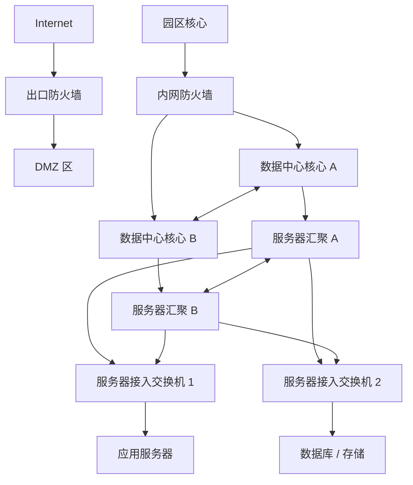
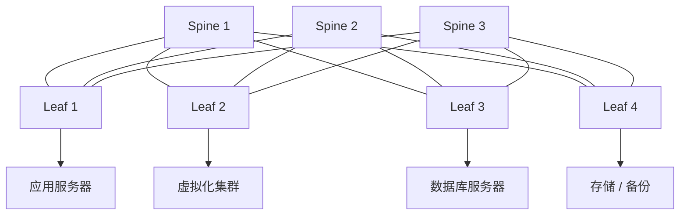
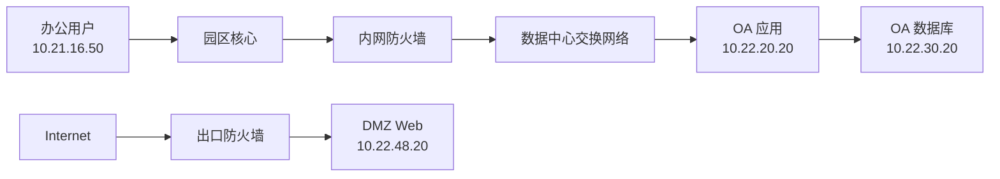
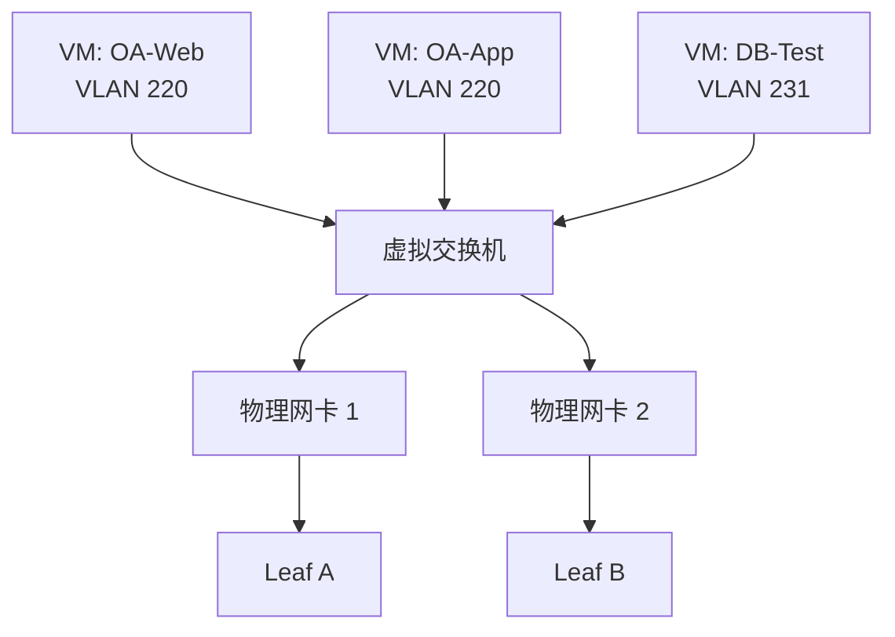
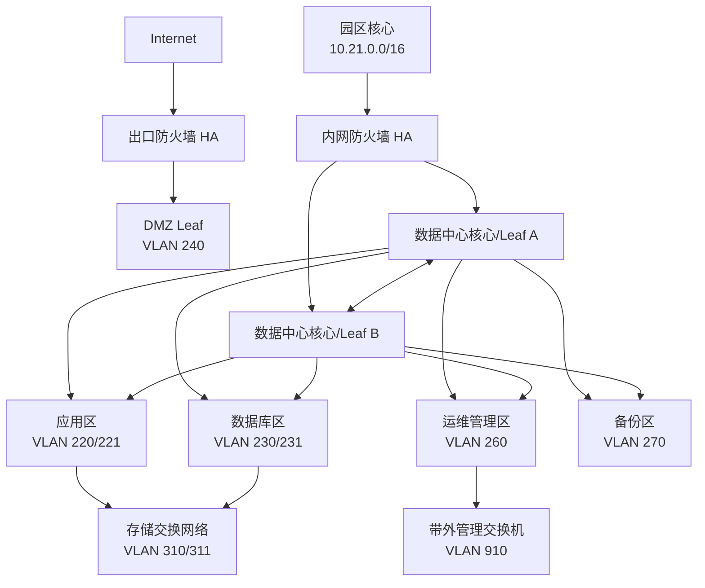
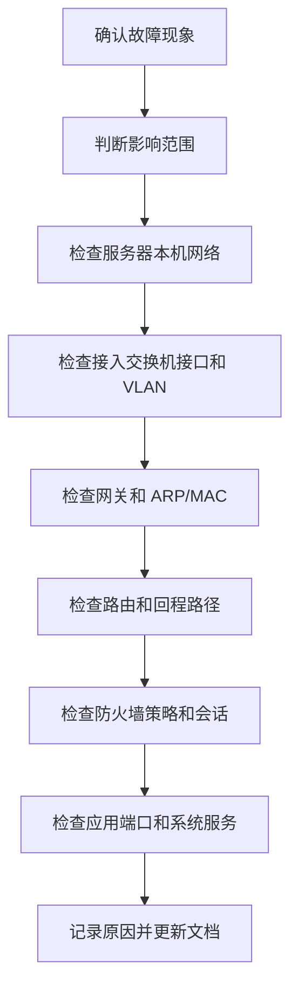

# 第 22 章：数据中心网络基础

## 22.1 本章学习目标

读完本章后，你应该能够：

- 理解什么是数据中心网络，以及它和办公园区网的区别。
- 看懂数据中心里的服务器区、存储区、虚拟化区、管理区、DMZ、备份区、出口和灾备互联区。
- 理解南北向流量、东西向流量、三层网关、二层网络、服务器双上联、链路聚合和网关冗余的含义。
- 理解传统核心-汇聚-接入架构和 Leaf-Spine 架构的基本区别。
- 能够为一个小型企业数据中心规划 VLAN、IP 网段、网关、路由、安全区域和基础访问策略。
- 能够解释服务器接入、虚拟化平台接入、存储网络、带外管理网络和备份网络为什么要分开设计。
- 能够根据业务流量判断哪些访问应该经过防火墙，哪些访问可以在数据中心内部高速转发。
- 能够列出数据中心网络上线前的验证清单，并按照“服务器 -> 接入交换机 -> 网关 -> 防火墙 -> 业务系统”的顺序排查故障。
- 能够识别数据中心网络中的常见风险，例如二层范围过大、服务器单上联、管理网暴露、存储网混用、策略放行过宽、日志缺失和变更不可控。

第 19 章学习了企业网络架构基础，第 20 章和第 21 章分别学习了中小企业网络和大型园区网。本章把视角从“用户接入网络”转向“业务系统承载网络”，也就是数据中心网络。

在企业里，员工电脑、打印机、无线 AP、摄像头主要接入园区网；OA、ERP、数据库、虚拟化平台、文件服务、备份系统、日志平台和认证系统通常部署在服务器区或数据中心。用户能不能打开业务系统，很多时候不只取决于办公网是否正常，还取决于数据中心网络是否稳定。

初学者容易把数据中心理解为“放服务器的机房”。从网络工程角度看，数据中心不是一排机柜那么简单。它至少要回答这些问题：

```text
服务器接到哪些交换机？
服务器网关在哪里？
虚拟机迁移时网络如何保持连通？
应用服务器访问数据库走哪条路径？
办公网访问业务系统是否经过防火墙？
数据库是否能被普通终端直接访问？
存储流量、备份流量和业务流量是否混在一起？
服务器的远程管理口是否暴露给普通办公网？
一台交换机或一条链路故障时业务是否继续运行？
```

可以先记住一句话：

```text
数据中心网络的核心，是让业务系统之间、用户和业务系统之间的流量稳定、安全、高速、可控地转发。
```

## 22.2 什么是数据中心网络

数据中心网络是连接服务器、虚拟化平台、存储设备、安全设备、负载均衡、备份系统、管理系统和外部网络的基础网络。它承载的对象不是普通办公终端，而是企业业务系统。

常见的数据中心资源包括：

| 资源类型 | 示例 | 网络关注点 |
| --- | --- | --- |
| 物理服务器 | 数据库服务器、GPU 服务器、专用业务服务器 | 双网卡、双上联、业务网和管理网分离 |
| 虚拟化平台 | VMware、Hyper-V、KVM、私有云平台 | 虚拟机 VLAN、迁移网络、管理网络、存储网络 |
| 应用服务器 | OA、ERP、CRM、门户系统 | 用户访问、应用间调用、负载均衡 |
| 数据库服务器 | MySQL、SQL Server、Oracle、PostgreSQL | 只允许应用服务器或运维区访问 |
| 存储设备 | SAN、NAS、分布式存储 | 高带宽、低延迟、独立安全边界 |
| 备份系统 | 备份服务器、备份存储、磁带库 | 大流量、定时任务、恢复验证 |
| 安全设备 | 防火墙、IPS、WAF、堡垒机 | 区域隔离、策略控制、日志审计 |
| 负载均衡 | SLB、ADC、反向代理 | 业务发布、健康检查、会话保持 |
| 管理系统 | 监控、日志、配置备份、NTP、DNS | 只允许运维访问，不能暴露给普通用户 |

### 数据中心网络和园区网的区别

园区网主要解决“用户如何接入网络”。数据中心网络主要解决“业务系统如何稳定运行”。

| 对比项 | 园区网 | 数据中心网络 |
| --- | --- | --- |
| 主要对象 | 员工电脑、无线终端、打印机、摄像头 | 服务器、虚拟机、存储、安全设备 |
| 流量特点 | 用户访问互联网和内部系统较多 | 服务器之间东西向流量较多 |
| 变更特点 | 终端接入频繁，用户变动多 | 业务上线、虚拟机迁移、扩容变更多 |
| 可靠性要求 | 核心、出口和认证故障影响用户办公 | 任一关键链路故障可能影响业务系统 |
| 安全重点 | 终端准入、访客隔离、上网控制 | 应用分区、数据库保护、管理面隔离 |
| 地址规划 | 按楼宇、部门、终端类型划分 | 按业务区、系统层级、环境和安全等级划分 |
| 网络性能 | 大量接入端口和无线容量 | 高带宽、低时延、服务器双上联 |

例如，办公电脑访问 OA 系统时，路径可能是：

```text
办公终端 -> 园区接入交换机 -> 园区汇聚 -> 园区核心 -> 内网防火墙 -> 数据中心核心或 Leaf -> OA 应用服务器
```

如果 OA 应用服务器还要访问数据库，路径可能继续是：

```text
OA 应用服务器 -> 数据中心交换网络 -> 数据库服务器
```

第一段通常是用户到数据中心的访问，第二段是数据中心内部服务器之间的访问。数据中心网络设计要同时照顾这两类流量。

### 南北向流量和东西向流量

学习数据中心网络时，经常会遇到两个词：南北向流量和东西向流量。

| 流量类型 | 含义 | 示例 | 设计重点 |
| --- | --- | --- | --- |
| 南北向流量 | 数据中心和外部网络之间的流量 | 办公网访问 OA，互联网访问 DMZ Web | 防火墙、负载均衡、NAT、边界安全 |
| 东西向流量 | 数据中心内部服务器之间的流量 | 应用服务器访问数据库，虚拟机之间调用 API | 高带宽、低时延、分区隔离、微隔离 |

传统企业早期的业务系统比较简单，用户访问服务器的南北向流量占比较高。现在很多系统采用多层架构、微服务、虚拟化和私有云，服务器之间互相调用越来越多，东西向流量变得非常重要。

例如一个 ERP 系统可能包含：

- Web 前端服务器。
- 应用服务器。
- 数据库服务器。
- 缓存服务器。
- 文件服务。
- 认证服务。
- 日志服务。
- 备份服务。

用户只看到“打开 ERP 页面”，但数据中心内部可能发生多次服务器之间的访问。网络工程师不能只保证用户能到 Web 服务器，还要保证 Web、应用、数据库、缓存、认证和日志之间的路径符合设计。

## 22.3 数据中心的常见区域

数据中心网络不能把所有服务器放在同一个 VLAN 里。不同业务系统、不同安全等级、不同用途的网络应该分区设计。

### 业务应用区

业务应用区放置企业内部应用服务器，例如 OA、ERP、CRM、HR、工单系统、门户系统和中间件。

业务应用区通常有几个特点：

- 被办公网、分支、VPN 用户访问。
- 可能需要访问数据库、缓存、认证、文件服务。
- 对可用性要求较高。
- 需要日志、监控和备份。

应用区通常不直接暴露给互联网。如果需要对外发布，应通过 DMZ、WAF、反向代理或负载均衡控制访问。

### 数据库区

数据库区保存核心业务数据。它是数据中心中最敏感的区域之一。

数据库区设计原则是：

```text
普通用户不能直接访问数据库；
互联网不能直接访问数据库；
只有明确的应用服务器、备份系统和运维管理区可以按需访问数据库。
```

常见数据库访问关系如下：

| 源区域 | 目的区域 | 默认建议 |
| --- | --- | --- |
| 办公网 | 数据库区 | 拒绝 |
| 访客网 | 数据库区 | 拒绝 |
| DMZ | 数据库区 | 默认拒绝，特殊业务需严格评审 |
| 应用区 | 数据库区 | 按应用和端口允许 |
| 备份区 | 数据库区 | 按备份任务允许 |
| 管理区 | 数据库区 | 通过堡垒机或运维平台允许 |

### DMZ 区

数据中心 DMZ 用于承载对外发布或半公开访问的系统，例如：

- 企业官网。
- 对外 API 网关。
- 反向代理。
- WAF 后端服务器。
- 邮件网关。
- 文件交换平台。
- VPN 接入网关。

DMZ 的安全原则和前面章节一致：

```text
公网可以访问 DMZ 中被发布的服务；
DMZ 只能按最小权限访问内部应用；
DMZ 不能随意访问办公网、数据库区和管理区。
```

### 管理区

管理区用于运维数据中心设备和系统。常见对象包括：

- 堡垒机。
- 监控平台。
- 日志平台。
- 配置备份系统。
- 自动化运维平台。
- NTP、DNS、认证服务器。
- 服务器带外管理平台。

管理区的权限很高。它能登录交换机、防火墙、服务器、虚拟化平台和存储设备。因此管理区不能和普通办公网混在一起，更不能开放给访客网或 DMZ。

### 存储区

存储区承载服务器和存储之间的数据访问，例如 SAN、NAS、iSCSI、NFS、SMB 或分布式存储网络。

存储流量通常有几个特点：

- 带宽需求高。
- 对延迟和丢包敏感。
- 业务高峰和备份窗口流量大。
- 不应该被普通用户访问。
- 不应该和不受控的办公终端混用同一网络。

小型环境里，存储网络可能只是独立 VLAN。更规范的环境中，存储网络会使用独立交换机、独立网卡、独立链路甚至专门的光纤通道网络。

### 备份区

备份区包括备份服务器、备份代理、备份存储和恢复测试环境。备份网络经常被忽视，但它很重要。

备份流量有两个特点：

- 流量大，可能在夜间集中产生。
- 权限高，备份系统通常能读取大量服务器数据。

如果备份网络和业务网络混用，可能出现：

- 夜间备份占满业务链路。
- 备份系统被攻破后影响大量服务器。
- 恢复测试影响生产系统。
- 排查性能问题时无法区分业务流量和备份流量。

### 灾备和云互联区

很多企业会把本地数据中心连接到灾备中心、公有云 VPC、托管机房或分支专线网络。

这些互联区域要关注：

- 地址不能重叠。
- 路由发布要可控。
- 主备路径要清楚。
- 加密或专线安全要明确。
- 业务切换和回切流程要验证。
- 日志和监控要覆盖跨站点链路。

## 22.4 数据中心网络拓扑

数据中心网络拓扑常见两类：传统三层架构和 Leaf-Spine 架构。

### 传统核心-汇聚-接入架构

传统数据中心常采用类似园区网的三层结构：

```text
核心层 -> 汇聚层 -> 接入层
```

一个简化拓扑如下：



这种架构容易理解，适合中小规模服务器区或传统企业机房。它的优势是层次清楚，和园区网知识衔接自然。

但当服务器数量增加、虚拟化规模扩大、东西向流量增多时，传统架构可能遇到问题：

- 某些汇聚链路成为瓶颈。
- 多层转发路径较长。
- STP 或二层冗余设计复杂。
- 横向扩容不够灵活。
- 大规模虚拟机迁移时二层边界难控制。

### Leaf-Spine 架构

Leaf-Spine 是现代数据中心常见架构。它由两类交换机组成：

| 角色 | 说明 |
| --- | --- |
| Leaf | 连接服务器、存储、防火墙、负载均衡等设备 |
| Spine | 连接所有 Leaf，提供高速骨干转发 |

一个基础 Leaf-Spine 拓扑如下：



Leaf-Spine 的核心特点是：

- 每台 Leaf 都连接到每台 Spine。
- 服务器只连接到 Leaf。
- Spine 不直接连接服务器。
- 任意两个 Leaf 之间路径长度基本一致。
- 扩容时可以增加 Leaf 或 Spine。

Leaf-Spine 适合东西向流量较多的数据中心。比如应用服务器在 Leaf 1，数据库服务器在 Leaf 3，流量通常走：

```text
应用服务器 -> Leaf 1 -> 某台 Spine -> Leaf 3 -> 数据库服务器
```

这种路径清楚，带宽也更容易横向扩展。

### 传统架构和 Leaf-Spine 的对比

| 对比项 | 传统三层架构 | Leaf-Spine 架构 |
| --- | --- | --- |
| 学习难度 | 较低，和园区网类似 | 较高，需要理解 Clos、ECMP、Overlay 等概念 |
| 适合规模 | 小型到中型数据中心 | 中大型虚拟化、云化数据中心 |
| 东西向流量 | 可能经过多层设备，容易有瓶颈 | 路径更均衡，扩展更方便 |
| 扩容方式 | 增加接入或汇聚，可能受上层瓶颈限制 | 增加 Leaf 或 Spine，横向扩展更自然 |
| 二层设计 | 常依赖 STP、堆叠、MLAG 等 | 常结合三层 ECMP 或 VXLAN EVPN |
| 运维要求 | 相对传统 | 对自动化、路由和厂商方案理解要求更高 |

初学者不需要一开始就掌握所有 Leaf-Spine 高级技术。先理解它要解决的问题：

```text
服务器之间的东西向流量越来越多，数据中心需要更均衡、更容易扩容的交换网络。
```

## 22.5 服务器接入设计

服务器接入是数据中心网络的基础。如果服务器接入设计不可靠，上层路由、防火墙和应用架构再好也会受到影响。

### 单上联和双上联

服务器接入最简单的方式是单网卡连接一台接入交换机。

```text
服务器 -> 接入交换机
```

这种方式配置简单，但有明显单点：

- 网卡故障会中断业务。
- 网线故障会中断业务。
- 接入交换机故障会中断业务。
- 接入交换机升级时服务器可能断网。

生产服务器更推荐双上联：

```text
服务器网卡 1 -> 接入交换机 A
服务器网卡 2 -> 接入交换机 B
```

双上联可以通过不同方式实现：

| 方式 | 含义 | 适合场景 |
| --- | --- | --- |
| 主备绑定 | 一块网卡工作，另一块备用 | 简单可靠，常见于普通服务器 |
| 负载分担绑定 | 多块网卡同时转发 | 需要交换机和服务器侧配置一致 |
| LACP 聚合 | 标准链路聚合协议 | 适合需要更高带宽和冗余的服务器 |
| 虚拟化平台上联 | 多个物理网卡接入虚拟交换机 | 适合 VMware、KVM、Hyper-V 等 |

如果服务器两条链路接到两台不同交换机，交换机侧通常需要支持堆叠、MLAG、IRF、vPC 或类似跨设备聚合技术。否则服务器侧和交换机侧配置不一致时，可能出现环路、MAC 地址漂移或链路不通。

### 业务网、管理网和存储网分离

服务器通常不止一种网络需求。

| 网络类型 | 用途 | 示例 |
| --- | --- | --- |
| 业务网 | 用户和应用访问服务器 | OA、ERP、Web、API |
| 管理网 | 运维登录和平台管理 | SSH、RDP、HTTPS、虚拟化管理 |
| 存储网 | 服务器访问存储 | iSCSI、NFS、分布式存储 |
| 备份网 | 备份数据传输 | 备份代理到备份服务器 |
| 迁移网 | 虚拟机迁移或集群心跳 | vMotion、Live Migration |
| 带外管理网 | 服务器硬件管理口 | iDRAC、iLO、IPMI、BMC |

这些网络不建议全部混在一个 VLAN 里。原因很直接：

- 管理口权限高，不应被普通业务访问。
- 存储流量大，可能影响业务访问。
- 备份任务可能占用大量带宽。
- 虚拟机迁移流量不应经过防火墙或办公网。
- 故障排查时需要知道是哪类流量异常。

### 服务器接入口规划表

数据中心实施前，应为每台服务器或每个机柜准备接入口规划表。

| 设备 | 网卡 | 接入交换机 | 接口 | VLAN | IP 地址 | 用途 |
| --- | --- | --- | --- | --- | --- | --- |
| APP-01 | eth0 | Leaf-01 | Eth1/1 | 220 | 10.22.20.11 | 业务网 |
| APP-01 | eth1 | Leaf-02 | Eth1/1 | 220 | 10.22.20.11 | 业务网冗余 |
| APP-01 | mgmt | OOB-SW-01 | Gi1/0/11 | 910 | 10.22.210.11 | 带外管理 |
| DB-01 | eth0 | Leaf-03 | Eth1/5 | 230 | 10.22.30.11 | 数据库业务 |
| DB-01 | eth1 | Leaf-04 | Eth1/5 | 230 | 10.22.30.11 | 数据库冗余 |
| Storage-01 | eth0 | Storage-SW-01 | Eth1/1 | 310 | 10.22.110.11 | 存储 A 网 |
| Storage-01 | eth1 | Storage-SW-02 | Eth1/1 | 311 | 10.22.111.11 | 存储 B 网 |

表格看起来繁琐，但它能减少很多实施错误。数据中心里一条线插错、一个 VLAN 放错、一个网关写错，都可能影响业务上线。

## 22.6 VLAN、IP 地址和网关规划

数据中心地址规划建议按安全区域和业务用途分块，而不是按机柜随意分配。

本章继续使用“星河集团”作为示例。假设星河集团有一个本地数据中心，和第 21 章中的总部园区网互联。总部园区网使用 `10.21.0.0/16`，数据中心使用 `10.22.0.0/16`。

### 地址块规划

| 地址块 | 用途 | 说明 |
| --- | --- | --- |
| 10.22.0.0/20 | 网络设备互联和 Loopback | 核心、Leaf、Spine、点到点链路 |
| 10.22.16.0/20 | 应用区 | OA、ERP、CRM、门户、API |
| 10.22.32.0/20 | 数据库区 | 生产数据库、报表库 |
| 10.22.48.0/20 | DMZ 区 | 对外 Web、代理、WAF 后端 |
| 10.22.64.0/20 | 虚拟化管理区 | vCenter、虚拟化主机管理 |
| 10.22.80.0/20 | 运维管理区 | 堡垒机、监控、日志、配置备份 |
| 10.22.96.0/20 | 备份区 | 备份服务器、备份存储 |
| 10.22.112.0/20 | 存储区 | iSCSI、NFS、分布式存储 |
| 10.22.128.0/19 | 测试和开发服务器区 | 测试环境、预发布环境 |
| 10.22.192.0/20 | 灾备和云互联区 | 专线、VPN、云连接 |
| 10.22.208.0/20 | 带外管理区 | iLO、iDRAC、IPMI、设备 Console 服务器 |
| 10.22.240.0/20 | 预留 | 后续扩容 |

这种规划的好处是：

- 看见 `10.22.32.0/20` 就知道是数据库相关区域。
- 园区网和数据中心网段不重叠。
- 安全策略可以先按大块匹配，再按具体服务器细化。
- 后续新增应用或数据库 VLAN 时还有空间。

### VLAN 规划示例

| 区域 | VLAN | 名称 | 网段 | 网关 | 说明 |
| --- | --- | --- | --- | --- | --- |
| 应用区 | 220 | DC-App-Prod | 10.22.20.0/24 | 10.22.20.1 | 生产应用服务器 |
| 应用区 | 221 | DC-App-Middleware | 10.22.21.0/24 | 10.22.21.1 | 中间件、缓存 |
| 数据库区 | 230 | DC-DB-Prod | 10.22.30.0/24 | 10.22.30.1 | 生产数据库 |
| 数据库区 | 231 | DC-DB-Report | 10.22.31.0/24 | 10.22.31.1 | 报表和只读库 |
| DMZ | 240 | DC-DMZ-Web | 10.22.48.0/24 | 10.22.48.1 | 对外 Web 后端 |
| 虚拟化 | 250 | DC-Virt-Mgmt | 10.22.64.0/24 | 10.22.64.1 | 虚拟化平台管理 |
| 运维 | 260 | DC-Ops | 10.22.80.0/24 | 10.22.80.1 | 堡垒机、监控、日志 |
| 备份 | 270 | DC-Backup | 10.22.96.0/24 | 10.22.96.1 | 备份服务器 |
| 存储 | 310 | DC-Storage-A | 10.22.112.0/24 | 无或 10.22.112.1 | 存储 A 平面 |
| 存储 | 311 | DC-Storage-B | 10.22.113.0/24 | 无或 10.22.113.1 | 存储 B 平面 |
| 带外管理 | 910 | DC-OOB-Mgmt | 10.22.210.0/24 | 10.22.210.1 | 服务器硬件管理口 |

注意：某些存储网络可能不需要默认网关，尤其是只在同一二层网络内通信的 iSCSI 或专用存储平面。是否配置网关要根据存储架构决定，不能机械套用普通业务网的做法。

### 网关放在哪里

数据中心网关常见放置方式有三种：

| 方案 | 网关位置 | 优点 | 注意点 |
| --- | --- | --- | --- |
| 数据中心核心或 Leaf 做网关 | 三层交换机 SVI/VLANIF | 性能高，适合内部高速转发 | 跨安全区访问需要额外引流到防火墙 |
| 防火墙做网关 | 防火墙接口或子接口 | 策略控制最直接 | 性能和端口规模要评估 |
| 分布式网关 | 多台 Leaf 上提供同一网关 | 适合 VXLAN EVPN 等现代架构 | 运维复杂度更高 |

对初学者来说，可以先掌握一个稳妥原则：

```text
同一安全等级内的高频服务器互访，可以由数据中心交换网络高速转发；
跨安全等级的访问，尤其是用户到服务器、DMZ 到内部、应用到数据库，应经过防火墙或明确的安全控制点。
```

例如：

| 访问关系 | 建议路径 |
| --- | --- |
| 应用服务器之间调用 | 数据中心交换网络内部转发，必要时做 ACL 或微隔离 |
| 应用服务器访问数据库 | 根据安全要求经过防火墙，或在数据中心内部做严格策略 |
| 办公网访问应用服务器 | 园区核心 -> 内网防火墙 -> 数据中心应用区 |
| DMZ Web 访问内部应用 | DMZ 防火墙策略 -> 应用区指定端口 |
| 运维人员管理服务器 | 运维终端 -> 堡垒机 -> 管理区 -> 服务器管理口 |

## 22.7 路由和安全边界设计

数据中心网络不能只看二层 VLAN，还要清楚路由和安全边界。

### 数据中心和园区网互联

星河集团示例中：

- 总部园区网：`10.21.0.0/16`。
- 数据中心网：`10.22.0.0/16`。
- 出口防火墙负责互联网访问和公网发布。
- 内网防火墙负责园区用户访问数据中心业务。

一个简化互联拓扑如下：



这张图包含两个安全边界：

- 园区用户到数据中心应用，要经过内网防火墙。
- Internet 到 DMZ，要经过出口防火墙。

如果企业规模较小，也可能只有一组防火墙同时承担出口、DMZ 和内网分区控制。但逻辑上仍然要区分这些区域。

### 路由规划示例

| 设备或区域 | 路由内容 | 说明 |
| --- | --- | --- |
| 园区核心 | 到 `10.22.0.0/16` 指向内网防火墙 | 园区访问数据中心 |
| 数据中心核心 | 到 `10.21.0.0/16` 指向内网防火墙 | 数据中心回访园区 |
| 内网防火墙 | 学习或配置园区和数据中心路由 | 控制跨区访问 |
| 出口防火墙 | DMZ、默认路由、公网发布相关路由 | 控制公网访问 |
| 数据中心交换网络 | 发布 `10.22.16.0/20`、`10.22.32.0/20` 等汇总 | 保持路由清晰 |

路由要特别注意回程路径。比如办公用户访问 OA：

```text
请求路径：10.21.16.50 -> 园区核心 -> 内网防火墙 -> 数据中心 -> 10.22.20.20
回程路径：10.22.20.20 -> 数据中心 -> 内网防火墙 -> 园区核心 -> 10.21.16.50
```

如果请求经过防火墙，回程却绕过防火墙，可能出现：

- 防火墙会话不完整。
- 策略看似放行但业务不通。
- 抓包时只看到单向流量。
- 日志缺失或不一致。

这就是所谓的非对称路径问题。

### 安全策略矩阵

数据中心安全策略建议先从访问矩阵开始，不要直接写“任意允许”。

| 源区域 | 目的区域 | 默认建议 | 示例端口 |
| --- | --- | --- | --- |
| 办公网 | 应用区 | 按业务允许 | HTTPS 443 |
| 办公网 | 数据库区 | 拒绝 | 无 |
| 办公网 | 管理区 | 拒绝 | 无 |
| 访客网 | 数据中心任意区 | 拒绝 | 无 |
| 应用区 | 数据库区 | 按应用允许 | MySQL 3306、SQL Server 1433 |
| 应用区 | 管理区 | 默认拒绝 | 无 |
| DMZ | 应用区 | 按发布链路允许 | HTTPS 或应用代理端口 |
| DMZ | 数据库区 | 默认拒绝 | 无 |
| 管理区 | 服务器业务网 | 按运维工具允许 | SSH 22、RDP 3389、HTTPS 443 |
| 管理区 | 网络设备 | 允许，强认证 | SSH、HTTPS、SNMP |
| 备份区 | 应用区和数据库区 | 按备份任务允许 | 备份代理端口 |
| 存储区 | 办公网和访客网 | 拒绝 | 无 |

策略编写时要尽量使用明确对象：

```text
允许：OA 应用服务器 10.22.20.20 访问 OA 数据库 10.22.30.20 的 TCP 3306。
不推荐：10.22.20.0/24 可以访问 10.22.30.0/24 的任意端口。
更不推荐：数据中心内部任意互通。
```

## 22.8 虚拟化和云化环境中的网络

现代数据中心通常不是一台业务对应一台物理服务器，而是大量业务运行在虚拟机或容器上。网络工程师需要理解虚拟化会给网络带来什么变化。

### 物理交换机和虚拟交换机

在虚拟化平台中，一台物理服务器上可能运行几十台虚拟机。虚拟机不是直接插网线到物理交换机，而是先连接到主机内部的虚拟交换机，再通过物理网卡上联到数据中心交换机。

简化关系如下：



网络工程师需要和系统工程师确认：

- 虚拟机使用哪些 VLAN。
- 虚拟化主机上联口是 Access、Trunk 还是聚合。
- 允许哪些 VLAN 通过物理上联。
- 虚拟化管理网络、迁移网络、存储网络是否分离。
- 虚拟机迁移后是否仍能保留原 IP 和网络策略。

### 虚拟化网络中的常见 VLAN

| VLAN | 用途 | 说明 |
| --- | --- | --- |
| 220 | 生产应用 VM | 业务访问 |
| 230 | 生产数据库 VM | 高敏感，严格控制 |
| 250 | 虚拟化管理 | 管理主机、集群和平台 |
| 251 | 虚拟机迁移 | vMotion 或 Live Migration |
| 310 | 存储 A 网 | iSCSI/NFS/分布式存储 |
| 311 | 存储 B 网 | 存储冗余平面 |
| 270 | 备份网络 | 备份代理和备份服务器 |

一个常见错误是把虚拟化主机上联口配置成允许所有 VLAN。这样初期省事，但风险很大：

- 不该出现在某台主机的 VLAN 也被带过去。
- 虚拟机误接到敏感 VLAN。
- 排查时不知道某个 VLAN 到底在哪里存在。
- 二层范围被无意扩大。

更规范的做法是按主机集群和业务需要精确放行 VLAN。

### Overlay 网络入门

在较大的云化数据中心中，可能会使用 VXLAN、EVPN、SDN 控制器等技术。这些技术对初学者比较复杂，本章只建立基本概念。

传统 VLAN 的限制包括：

- VLAN ID 数量有限。
- 大范围二层延伸风险高。
- 虚拟机跨机房或跨区域迁移困难。
- 网络变更依赖大量交换机配置。

Overlay 网络的基本思想是：

```text
在已有三层 IP 网络之上，再封装一层虚拟二层或虚拟网络。
```

可以把它理解为：

```text
底层网络负责稳定传包；
上层虚拟网络负责给虚拟机和租户提供隔离网络。
```

在学习阶段，你不需要立刻配置 VXLAN EVPN，但要理解现代数据中心为什么越来越重视三层 Leaf-Spine、自动化和虚拟网络。

## 22.9 存储网络、备份网络和带外管理

这三个网络经常被初学者忽略，但在真实数据中心很关键。

### 存储网络

存储网络连接服务器和存储设备。常见协议包括：

| 协议或方式 | 简要说明 | 网络关注点 |
| --- | --- | --- |
| iSCSI | 在 IP 网络上传输块存储 | 低延迟、稳定、建议独立 VLAN 或独立交换 |
| NFS | 常用于 Linux/虚拟化存储挂载 | 带宽、权限、服务端可用性 |
| SMB | 常见文件共享协议 | 权限、认证、客户端访问控制 |
| FC | 光纤通道存储网络 | 专用 SAN 交换网络 |
| 分布式存储 | 多节点组成存储集群 | 节点间东西向流量大 |

存储网络设计建议：

- 存储流量和办公网隔离。
- 生产存储和测试存储按需隔离。
- 关键存储链路双平面设计，例如 Storage-A 和 Storage-B。
- 服务器到存储的路径要冗余。
- 不要让普通用户直接访问块存储网络。
- 监控存储链路带宽、丢包、错误包和时延。

### 备份网络

备份网络设计建议：

| 设计点 | 说明 |
| --- | --- |
| 独立 VLAN 或链路 | 减少备份流量对业务访问的影响 |
| 明确备份窗口 | 避免业务高峰期占满链路 |
| 限制访问方向 | 只允许备份系统和被备份服务器之间必要访问 |
| 保护备份平台 | 备份系统权限高，必须纳入管理区和日志审计 |
| 定期恢复验证 | 备份成功不代表一定能恢复 |

备份网络排查时要同时关注网络和系统：

- 备份任务开始后链路是否跑满。
- 是否有丢包、重传或接口错误。
- 备份服务器是否同时拉取过多任务。
- 目标存储写入能力是否成为瓶颈。
- 防火墙会话表或策略是否限制备份连接。

### 带外管理网络

带外管理网络用于管理设备硬件层面，例如服务器 iLO、iDRAC、IPMI、BMC，网络设备 Console 服务器，PDU 和机房环境监控。

带外管理网络很敏感，因为它可能绕过操作系统直接控制服务器电源、控制台和镜像挂载。

带外管理网络设计原则：

```text
只允许运维管理区访问；
禁止普通办公网、访客网、DMZ 访问；
账号使用强密码和多因素认证；
记录登录日志；
不和业务网混用同一 VLAN。
```

带外管理不是可有可无。服务器系统网络异常、操作系统崩溃或远程登录失败时，带外管理常常是恢复业务的最后手段。

## 22.10 小型数据中心设计示例

下面用一个完整示例串联本章内容。

### 需求背景

星河集团总部已有大型园区网，现建设一个小型本地数据中心，承载以下系统：

- OA 系统。
- ERP 系统。
- 文件服务器。
- 数据库服务器。
- 虚拟化平台。
- 备份系统。
- 监控和日志平台。
- 对外官网后端服务器。

基本要求：

- 办公网可以访问 OA、ERP 和文件服务。
- 普通办公终端不能直接访问数据库。
- 互联网用户只能访问 DMZ 中的官网服务。
- DMZ 只能访问内部指定应用端口。
- 运维人员必须通过堡垒机管理服务器。
- 服务器接入交换机和关键链路冗余。
- 存储和备份流量尽量不影响业务访问。

### 逻辑拓扑



这不是大型云数据中心，而是企业常见的小型数据中心设计。它的重点不是技术炫技，而是把业务、数据库、管理、备份、存储和 DMZ 边界划清楚。

### 地址和网关表

| 区域 | VLAN | 网段 | 网关 | 网关位置 |
| --- | --- | --- | --- | --- |
| 应用区 | 220 | 10.22.20.0/24 | 10.22.20.1 | 数据中心核心/Leaf |
| 中间件区 | 221 | 10.22.21.0/24 | 10.22.21.1 | 数据中心核心/Leaf |
| 数据库区 | 230 | 10.22.30.0/24 | 10.22.30.1 | 内网防火墙或数据中心核心 |
| 报表库区 | 231 | 10.22.31.0/24 | 10.22.31.1 | 内网防火墙或数据中心核心 |
| DMZ Web | 240 | 10.22.48.0/24 | 10.22.48.1 | 出口防火墙 |
| 虚拟化管理 | 250 | 10.22.64.0/24 | 10.22.64.1 | 管理防火墙或核心 |
| 运维管理 | 260 | 10.22.80.0/24 | 10.22.80.1 | 内网防火墙 |
| 备份区 | 270 | 10.22.96.0/24 | 10.22.96.1 | 数据中心核心 |
| 存储 A | 310 | 10.22.112.0/24 | 不配置默认网关 | 存储专用二层 |
| 存储 B | 311 | 10.22.113.0/24 | 不配置默认网关 | 存储专用二层 |
| 带外管理 | 910 | 10.22.210.0/24 | 10.22.210.1 | 管理防火墙或 OOB 网关 |

这里的“网关位置”要根据设备能力和安全要求最终确定。初学阶段重点理解：

- DMZ 网关更适合放在防火墙上。
- 管理区和带外管理区要经过严格控制。
- 存储专用网络不一定需要对外路由。
- 应用区和数据库区之间是否经过防火墙，要看企业安全要求和性能要求。

### 安全策略表

| 源 | 目的 | 服务 | 动作 | 说明 |
| --- | --- | --- | --- | --- |
| 办公网 `10.21.16.0/20` | OA `10.22.20.20` | HTTPS 443 | 允许 | 员工访问 OA |
| 办公网 `10.21.16.0/20` | ERP `10.22.20.30` | HTTPS 443 | 允许 | 员工访问 ERP |
| 办公网 | 数据库区 `10.22.30.0/24` | 任意 | 拒绝 | 普通终端不直连数据库 |
| 应用服务器 `10.22.20.20` | OA 数据库 `10.22.30.20` | TCP 3306 | 允许 | OA 应用访问数据库 |
| ERP 应用 `10.22.20.30` | ERP 数据库 `10.22.30.30` | TCP 1433 | 允许 | ERP 应用访问数据库 |
| Internet | DMZ Web `10.22.48.20` | HTTPS 443 | 允许 | 官网发布 |
| DMZ Web `10.22.48.20` | 应用 API `10.22.21.20` | HTTPS 443 | 允许 | 对外 API 代理 |
| DMZ | 数据库区 | 任意 | 拒绝 | 防止 DMZ 横向访问数据库 |
| 运维区堡垒机 `10.22.80.10` | 服务器区 | SSH/RDP/HTTPS | 允许 | 运维登录 |
| 办公网 | 带外管理区 `10.22.210.0/24` | 任意 | 拒绝 | 防止普通终端访问硬件管理口 |
| 备份服务器 `10.22.96.10` | 应用和数据库服务器 | 备份代理端口 | 允许 | 按备份软件确定端口 |

### 上线前验证清单

| 验证项 | 方法 | 期望结果 |
| --- | --- | --- |
| 服务器双上联 | 断开单条服务器链路 | 业务网络不中断或快速恢复 |
| 交换机冗余 | 模拟一台接入交换机维护 | 关键服务器仍有可用路径 |
| VLAN 放行 | 检查 Trunk 允许列表 | 只放行业务需要的 VLAN |
| 网关可达 | 从服务器 ping 网关 | 网关正常响应 |
| 路由回程 | 从园区访问应用并抓包 | 请求和回程路径一致 |
| 防火墙策略 | 按访问矩阵逐条测试 | 应允许的通，应拒绝的拒绝 |
| 数据库保护 | 从办公终端测试数据库端口 | 不能直接访问 |
| DMZ 发布 | 从公网测试 HTTPS | 只发布指定服务 |
| 管理区访问 | 从堡垒机登录服务器 | 成功并记录日志 |
| 带外管理隔离 | 从办公网访问 iDRAC/iLO | 被拒绝 |
| 存储网络 | 检查存储路径和多路径状态 | 双路径正常，无异常丢包 |
| 备份网络 | 运行测试备份任务 | 不影响业务访问，任务成功 |

## 22.11 常见故障与排查

数据中心故障排查要先判断故障边界。不要一开始就改配置。

### 排查顺序

可以按以下顺序思考：



关键问题包括：

```text
是所有用户都不能访问，还是只有某个网段不能访问？
是所有服务器都异常，还是某一台服务器异常？
是 IP 能通但业务端口不通，还是连网关都不通？
是刚上线后不通，还是运行一段时间后突然不通？
最近是否有变更：VLAN、路由、防火墙、虚拟化、服务器网卡、存储？
```

### 常见故障表

| 故障现象 | 可能原因 | 排查方向 |
| --- | --- | --- |
| 办公网无法访问某应用 | 防火墙策略缺失、路由缺失、应用服务异常 | 测试网关、路由、防火墙日志、服务器端口 |
| 应用服务器无法访问数据库 | 策略未放行、数据库监听异常、回程路由错误 | 从应用服务器测试数据库端口，查防火墙会话 |
| 服务器能 ping 网关但业务不通 | 应用端口未监听、防火墙拒绝、系统防火墙阻断 | `telnet`/`nc` 测端口，查应用和系统防火墙 |
| 服务器网卡一断就全断 | 双上联未配置成功、绑定模式错误 | 检查服务器 bonding/team 和交换机聚合 |
| 虚拟机迁移后不通 | 目标主机缺少 VLAN、端口组配置错误 | 检查虚拟交换机和物理 Trunk 允许 VLAN |
| 存储访问慢 | 链路拥塞、MTU 不一致、存储路径异常 | 查接口流量、错误包、多路径状态 |
| 备份导致业务变慢 | 备份流量占满业务链路 | 检查备份窗口、链路利用率、限速策略 |
| DMZ 服务器能被访问但不能访问后端 | DMZ 到应用区策略缺失或路由错误 | 查防火墙策略、NAT、后端服务器回程 |
| 管理口被普通用户访问到 | 管理网隔离失败、策略过宽 | 检查路由、安全策略和交换机 VLAN |
| 防火墙只看到单向流量 | 非对称路由 | 检查请求和回程路径 |
| MAC 地址频繁漂移 | 双上联或虚拟化网络配置错误 | 查交换机日志、聚合状态、虚拟交换机配置 |

### 排查示例：办公网打不开 OA

现象：A 楼办公用户 `10.21.16.80` 打不开 OA，OA 地址是 `10.22.20.20`。

排查步骤：

1. 在用户终端测试默认网关 `10.21.16.1` 是否可达。
2. 测试 DNS 是否把 OA 域名解析到正确地址。
3. 从用户终端测试 `10.22.20.20` 是否可达。
4. 从用户终端测试 TCP 443 是否可达。
5. 在园区核心检查到 `10.22.0.0/16` 的路由是否指向内网防火墙。
6. 在内网防火墙查看是否有 `10.21.16.80 -> 10.22.20.20:443` 的允许日志。
7. 在数据中心核心检查 `10.22.20.20` 所在 VLAN 和 ARP。
8. 在 OA 服务器检查 IP、网关、服务监听和系统防火墙。
9. 如果请求到达服务器但无响应，继续检查服务器回程路由是否指向正确网关。

这个流程体现了一个重要思想：

```text
先证明网络路径是否通，再判断应用服务是否正常。
```

## 22.12 数据中心网络设计中的常见错误

### 把所有服务器放在一个大 VLAN

短期看简单，长期风险很高：

- 广播范围大。
- 安全边界不清。
- 数据库被普通服务器直接访问。
- 故障影响面大。
- 迁移和整改成本高。

更好的做法是按应用、数据库、DMZ、管理、备份、存储等区域划分。

### 只重视业务网，忽视管理网

很多严重事故来自管理面暴露，例如普通办公网可以访问服务器 iDRAC、虚拟化管理平台或存储管理页面。

管理网设计要做到：

- 独立 VLAN 和地址块。
- 只允许堡垒机或运维终端访问。
- 登录有认证和日志。
- 禁止从 DMZ 和访客网络访问。

### 防火墙策略过宽

“内网到内网全允许”在早期可能省事，但后续很难收敛。数据中心策略应尽量从业务关系出发：

```text
谁访问谁？
访问什么端口？
为什么需要？
是否有日志？
是否有过期时间？
```

### 忽视回程路径

数据中心经常有多台核心、多台防火墙、多条互联链路。如果只看请求方向，不看回程方向，很容易出现非对称路径。

排查时要同时画出：

```text
客户端到服务器的路径；
服务器回客户端的路径。
```

### 虚拟化变更没有通知网络侧

虚拟化平台新增 VLAN、迁移虚拟机、调整端口组时，如果网络侧 Trunk 没有同步，虚拟机可能无法通信。网络团队和系统团队必须共享：

- VLAN 清单。
- 虚拟机网段。
- 物理上联口。
- Trunk 允许列表。
- 变更时间和回退方案。

### 没有容量和日志监控

数据中心网络不仅要能通，还要知道运行状态：

- 链路利用率。
- 接口错误包。
- 丢包和时延。
- 防火墙会话数。
- 设备 CPU 和内存。
- 路由邻居状态。
- 聚合链路成员状态。
- 服务器网卡状态。

没有监控和日志，故障发生后只能靠猜。

## 22.13 自检练习

请尝试回答以下问题：

1. 数据中心网络和园区网的主要区别是什么？
2. 什么是南北向流量？什么是东西向流量？各举一个例子。
3. 为什么普通办公终端不应该直接访问数据库区？
4. 服务器双上联可以解决哪些单点风险？
5. 为什么存储网络不建议和办公网混用？
6. DMZ 被攻陷后，安全策略应该如何限制它继续访问内部网络？
7. 虚拟化主机上联口为什么不建议允许所有 VLAN？
8. 办公网访问数据中心业务时，为什么要关注回程路径？
9. 如果一台虚拟机迁移后网络不通，你会检查哪些位置？
10. 设计一个小型数据中心时，至少应该规划哪些区域？

可以再做一个小练习：

```text
为一个 200 人企业设计本地服务器区：
- 有 OA、文件服务器、数据库、备份服务器、堡垒机和官网服务器。
- 办公网使用 10.30.10.0/24。
- 服务器区使用 10.40.0.0/16。

请规划至少 5 个 VLAN，并写出：
1. VLAN 名称。
2. 网段和网关。
3. 哪些源区域可以访问。
4. 是否需要经过防火墙。
5. 上线前如何验证。
```

## 22.14 本章小结

本章介绍了数据中心网络的基础概念。数据中心网络不是简单的服务器接线，它是企业业务系统运行的基础。

本章重点包括：

- 数据中心网络主要连接服务器、虚拟化平台、存储、备份、安全设备和管理系统。
- 园区网更关注用户接入，数据中心网络更关注业务系统承载、东西向流量和安全分区。
- 数据中心常见区域包括应用区、数据库区、DMZ、管理区、存储区、备份区、带外管理区和灾备互联区。
- 传统核心-汇聚-接入架构适合中小规模数据中心，Leaf-Spine 更适合东西向流量多、横向扩展要求高的场景。
- 服务器接入要重视双上联、链路聚合、虚拟化上联、业务网和管理网分离。
- VLAN 和 IP 地址规划应按业务用途和安全等级分块，避免随意分配。
- 跨安全区访问应经过防火墙或明确安全控制点，策略应按最小权限编写。
- 存储、备份和带外管理网络必须单独考虑，不能只关注业务访问。
- 排查数据中心故障时，要先判断边界，再逐步检查服务器、交换机、网关、路由、防火墙和应用服务。

学完本章后，你应该能够看懂一个企业数据中心的基本网络结构，并能设计一套小型数据中心的 VLAN、地址、网关、路由和安全策略。后续学习无线网络、网络安全、运维和综合实验时，数据中心会继续作为重要业务区域出现。
