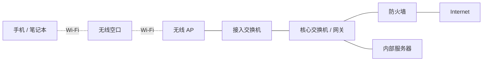
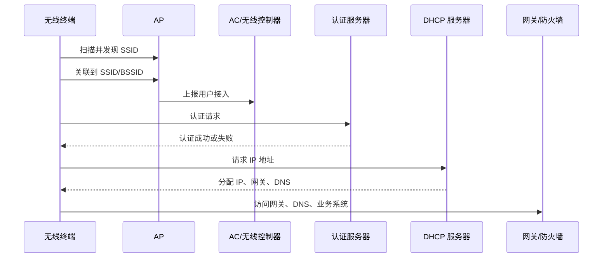
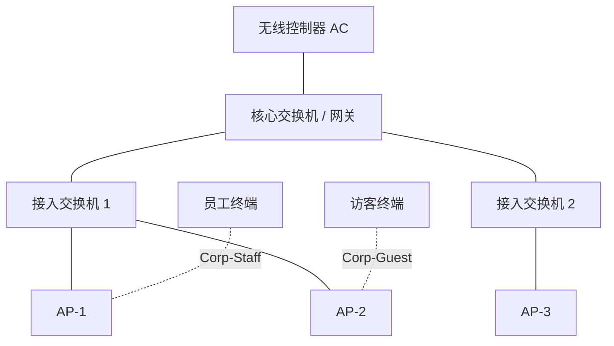
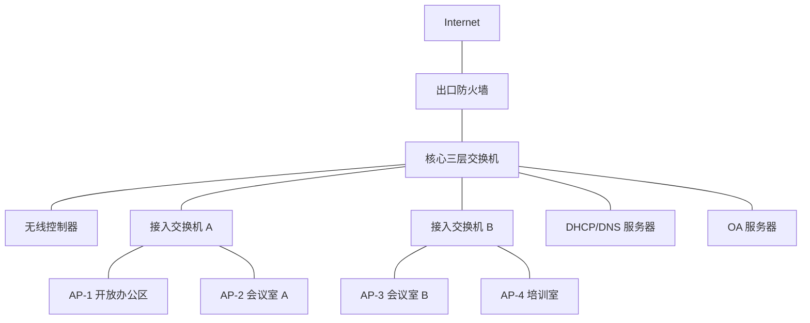
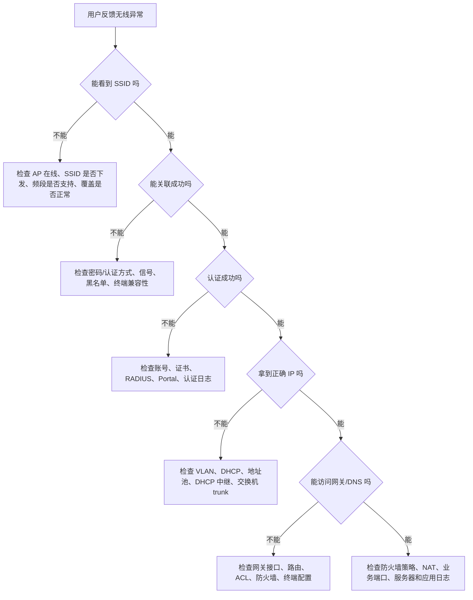

# 第 23 章：无线网络基础

## 23.1 本章学习目标

读完本章后，你应该能够：

- 理解无线网络和有线网络的关系，知道无线并不是独立于交换、VLAN、DHCP、网关和防火墙之外的技术。
- 解释 AP、AC、SSID、BSSID、射频、信道、频段、漫游、认证、加密等基础概念。
- 区分 2.4 GHz、5 GHz 和 6 GHz 频段的特点，理解为什么企业无线不能只追求“信号满格”。
- 看懂员工无线、访客无线、IoT 无线和运维无线在企业中的常见划分方式。
- 理解无线终端从扫描 SSID 到获取 IP 地址、访问业务系统的基本过程。
- 能够为一个小型办公室规划基础 SSID、VLAN、IP 网段、网关、DHCP、DNS 和安全策略。
- 掌握无线网络上线前的基础验证项，例如关联、认证、地址获取、网关连通、DNS、内网访问、互联网访问和漫游。
- 能够按照“终端 -> 无线空口 -> AP -> 交换机 -> DHCP/网关 -> 防火墙 -> 业务系统”的路径排查无线故障。

前面章节已经学习了交换、VLAN、三层网关、路由、防火墙、NAT、VPN、园区网和数据中心网络。本章开始进入无线网络。无线网络看起来是“手机连 Wi-Fi”，但在企业中，它本质上是园区接入网络的一部分。

一个无线用户访问内部 OA 系统时，实际路径可能是：

```text
笔记本 -> 无线空口 -> AP -> 接入交换机 -> 汇聚/核心交换机 -> 防火墙 -> 数据中心服务器
```

所以无线故障不一定只发生在 AP 上。用户连不上 Wi-Fi，可能是密码错误、认证服务器异常、信号太弱、AP 上联 VLAN 配错、DHCP 地址池耗尽、网关故障、防火墙策略错误，也可能是 DNS 或业务系统本身异常。

可以先记住一句话：

```text
企业无线网络的核心目标，是让移动终端在合适的位置、用合适的身份、进入合适的 VLAN，并获得稳定、安全、可控的网络访问能力。
```

## 23.2 什么是无线网络

无线网络通常指 WLAN，也就是 Wireless LAN，无线局域网。它使用无线电波代替网线，让笔记本、手机、平板、扫码枪、会议设备、IoT 设备等接入企业网络。

对用户来说，无线网络就是选择一个 Wi-Fi 名称，输入密码或完成认证，然后开始访问网络。对网络工程师来说，无线网络至少包含以下问题：

- 终端连接哪个 SSID。
- SSID 对应哪个业务 VLAN。
- 终端通过什么方式认证。
- 认证成功后获得什么权限。
- AP 接在哪台交换机，交换机端口如何配置。
- DHCP 地址从哪里分配。
- 网关在哪里。
- 访客是否只能访问互联网。
- 员工是否可以访问内部系统。
- 会议室高峰时容量是否足够。
- 用户从一个 AP 覆盖区移动到另一个 AP 覆盖区时是否掉线。

### 无线不是“没有网络设备”

无线只是终端到 AP 这一段不用网线。AP 后面仍然要接入有线网络：



这张图说明两个重点：

- 终端到 AP 是无线链路，受信号、干扰、信道、距离、墙体、终端能力影响。
- AP 到企业网络仍然是以太网链路，受交换机端口、VLAN、PoE、上联带宽、DHCP、网关和策略影响。

因此，排查无线问题时不能只看“Wi-Fi 信号”。信号很好但 DHCP 不通，用户依然不能上网；AP 正常发射但交换机端口 VLAN 配错，终端可能连上 SSID 却拿不到正确地址；员工认证成功但防火墙策略未放行，用户可能只能连上无线却打不开业务系统。

### 家用无线和企业无线的区别

家用无线通常由一台无线路由器完成接入、NAT、DHCP、无线信号和简单安全控制。企业无线通常使用多台 AP、交换机、无线控制器、认证系统、防火墙和监控平台协同工作。

| 对比项 | 家用无线 | 企业无线 |
| --- | --- | --- |
| 覆盖范围 | 单套房屋或小区域 | 办公楼、园区、仓库、门店、会议中心 |
| 接入人数 | 少量家庭设备 | 几十到数千台终端 |
| 管理方式 | 单台设备管理 | 集中管理 AP、SSID、射频和策略 |
| 认证方式 | 主要是预共享密码 | 预共享密码、Portal、802.1X、证书、访客审批 |
| 网络隔离 | 通常较弱 | 员工、访客、IoT、运维等分区隔离 |
| 故障影响 | 影响家庭上网 | 影响办公、会议、生产、门店收银和业务系统 |
| 运维要求 | 简单可用 | 可监控、可审计、可扩容、可排错 |

企业无线不能简单套用家用路由器思路。企业要考虑身份、权限、漫游、容量、安全、变更、日志和故障定位。

## 23.3 无线网络的核心组件

### 无线终端

无线终端是连接 Wi-Fi 的设备，例如：

- 员工笔记本。
- 手机和平板。
- 会议平板和投屏设备。
- 打印机。
- 扫码枪和手持终端。
- 摄像头。
- 门禁、传感器和 IoT 设备。

无线体验不只由 AP 决定，也由终端决定。不同终端的无线网卡、天线数量、支持频段、支持协议、驱动版本和省电策略都不同。

例如同一个会议室里，新的笔记本可能支持 5 GHz、Wi-Fi 6 和 WPA3，而老旧打印机可能只支持 2.4 GHz 和 WPA2-PSK。网络工程师在规划 SSID 和安全策略时，要知道哪些终端必须接入，哪些终端能力有限，哪些终端应该被淘汰或隔离。

### AP

AP 是 Access Point，无线接入点。它负责把无线终端接入有线网络。AP 一边通过无线电波和终端通信，一边通过以太网口连接交换机。

AP 的常见职责包括：

- 广播 SSID。
- 接收终端连接请求。
- 处理无线加密和基础转发。
- 把无线用户流量转到有线网络。
- 上报终端、射频、信道、干扰和告警信息。

企业 AP 通常通过 PoE 供电。PoE 是 Power over Ethernet，可以让交换机通过网线给 AP 供电，避免每个 AP 单独接电源。

### AC 或无线控制器

AC 是 Access Controller，无线控制器。有些厂商也称为 WLC。它用于集中管理大量 AP。

无线控制器常见职责包括：

- 统一下发 SSID。
- 管理 AP 加入和配置。
- 分配信道和发射功率。
- 处理用户认证和策略联动。
- 统计在线用户、流量、信号强度和漫游情况。
- 提供告警、日志和故障分析。

小型网络可能使用胖 AP 或云管理 AP，不一定有独立硬件 AC。中大型企业通常使用控制器或云管平台统一管理，否则每台 AP 单独配置会非常难维护。

### SSID

SSID 是无线网络名称。用户在手机或电脑上看到的 Wi-Fi 名称就是 SSID，例如：

```text
Corp-Staff
Corp-Guest
Corp-IoT
```

SSID 不是 VLAN，但一个 SSID 通常会映射到一个或多个 VLAN。比如：

| SSID | 用途 | VLAN | IP 网段 | 权限 |
| --- | --- | ---: | --- | --- |
| Corp-Staff | 员工办公无线 | 130 | 10.23.130.0/24 | 访问内网和互联网 |
| Corp-Guest | 访客无线 | 140 | 10.23.140.0/24 | 只访问互联网 |
| Corp-IoT | 无线 IoT | 150 | 10.23.150.0/24 | 只访问指定平台 |

初学者容易把“SSID 名称”和“网络权限”混为一谈。真正决定权限的是 SSID 后面的 VLAN、认证结果、地址段、网关、防火墙策略和访问控制。

### BSSID

BSSID 可以简单理解为某个 AP 上某个无线服务的具体无线 MAC 标识。用户看到的 SSID 可能是同一个名称，但不同 AP 会有不同 BSSID。

例如一栋楼里所有 AP 都广播 `Corp-Staff`，用户看到的是同一个 Wi-Fi 名称。但实际上：

```text
AP-1 的 Corp-Staff 有一个 BSSID
AP-2 的 Corp-Staff 有另一个 BSSID
AP-3 的 Corp-Staff 也有自己的 BSSID
```

终端在移动时，会从一个 BSSID 切换到另一个 BSSID。这个过程就是漫游的一部分。排查漫游、弱信号、终端黏连问题时，BSSID 很有用。

### 认证服务器

企业无线经常和认证系统结合，常见对象包括：

- RADIUS 服务器。
- AD 或 LDAP。
- 证书系统。
- Portal 认证系统。
- 短信或访客审批系统。

认证系统回答的问题是：

```text
这个用户或设备是谁？
它是否允许接入？
接入后应该进入哪个 VLAN 或获得什么权限？
```

无线安全不是只靠“密码复杂”。在企业里，更好的方式是让用户身份、设备身份和访问权限关联起来。

## 23.4 频段、信道和干扰

无线网络使用无线电波通信。它不像网线那样每台终端独占一根物理介质，而是多个终端和 AP 在同一空间里共享无线资源。频段、信道和干扰是无线网络最基础也最容易被忽视的内容。

### 2.4 GHz、5 GHz 和 6 GHz

企业 Wi-Fi 常见频段包括 2.4 GHz、5 GHz 和 6 GHz。

| 频段 | 优点 | 缺点 | 常见使用建议 |
| --- | --- | --- | --- |
| 2.4 GHz | 穿墙能力相对好，老终端兼容性好 | 信道少，干扰多，容量低 | 兼容老设备、IoT 设备，避免承载高密办公主力流量 |
| 5 GHz | 信道更多，干扰较少，容量更高 | 穿墙能力弱于 2.4 GHz | 企业办公主力频段，适合笔记本、手机、会议室 |
| 6 GHz | 频谱资源更多，适合高容量和低干扰场景 | 终端和地区支持要求更高，穿透能力更弱 | 新建高密无线、Wi-Fi 6E/7 终端环境可考虑 |

频率越高，通常可用带宽和信道资源更好，但穿透墙体和远距离覆盖能力会下降。企业无线设计不能只说“信号越强越好”，还要看容量、干扰和终端分布。

### 信道

信道可以理解为无线通信使用的“车道”。如果多个 AP 在相邻区域使用同一个或重叠信道，就可能互相影响。

2.4 GHz 频段常见建议是使用 1、6、11 三个互不重叠信道。原因是 2.4 GHz 可用信道少，信道之间容易重叠。如果随意使用 2、3、4、5、7、8、9、10，可能造成更严重的重叠干扰。

一个简单的 2.4 GHz 信道规划示意：

```text
AP-A: Channel 1
AP-B: Channel 6
AP-C: Channel 11
AP-D: Channel 1
```

相邻 AP 尽量不要使用同一信道，距离较远的 AP 可以复用同一信道。

5 GHz 和 6 GHz 可用信道更多，规划空间更大，但也要考虑当地法规、DFS 信道、终端兼容性和信道宽度。

### 信道宽度

信道宽度可以理解为车道宽度。常见宽度包括 20 MHz、40 MHz、80 MHz、160 MHz，Wi-Fi 7 场景还可能涉及更宽信道。

更宽信道理论速率更高，但会占用更多频谱，也更容易受到干扰。在高密办公环境中，盲目使用 80 MHz 或更宽信道，可能导致可复用信道数量减少，多个 AP 互相抢占空口，实际体验反而下降。

常见建议：

| 场景 | 建议信道宽度思路 |
| --- | --- |
| 普通办公区 | 5 GHz 可从 40 MHz 或 80 MHz 评估，关注 AP 密度和干扰 |
| 高密会议室 | 优先考虑容量和复用，避免盲目追求超宽信道 |
| 仓库扫码枪 | 稳定性优先，很多场景 20 MHz 更可控 |
| 6 GHz 新建环境 | 可根据终端能力和频谱资源评估更宽信道 |

### 干扰

无线干扰可以来自 Wi-Fi 设备，也可以来自非 Wi-Fi 设备。

常见干扰来源：

- 相邻 AP 信道规划不合理。
- 邻居公司或商场其他 Wi-Fi。
- 蓝牙设备。
- 微波炉。
- 无线摄像头。
- 私接路由器。
- 劣质无线设备。
- 金属墙体、电梯井、玻璃隔断、仓库货架等环境因素。

无线网络的一个难点是：空口是共享介质，问题经常不是“完全断”，而是“偶发卡顿、延迟高、掉线、会议音视频不稳定”。这类问题需要结合信号强度、信噪比、信道利用率、重传率、终端数量和现场环境分析。

## 23.5 无线接入的基本过程

一个终端连接企业 Wi-Fi 后能访问网络，通常经历以下过程：



不同厂商和部署模式下，控制流和数据流可能有所差异，但排错思路基本相同：先判断终端有没有关联，再判断认证是否成功，再判断是否拿到正确地址，最后判断三层和应用访问是否正常。

### 第一步：扫描 SSID

终端会扫描周围可用无线网络。SSID 可以由 AP 主动广播，也可以隐藏。企业中不建议把“隐藏 SSID”当作主要安全手段，因为隐藏 SSID 并不能真正阻止专业工具发现无线网络。

扫描阶段常见问题：

- 用户所在位置没有覆盖。
- SSID 没有在该 AP 或该楼层广播。
- 终端不支持该频段。
- 终端驱动或无线网卡异常。
- 只开启 5 GHz 或 6 GHz，但老终端只支持 2.4 GHz。

### 第二步：关联 AP

终端选择一个 BSSID 并尝试关联。关联成功表示终端已经和某个 AP 建立了无线连接关系，但这不等于已经能访问网络。

关联阶段常见问题：

- 信号太弱。
- AP 负载过高。
- 终端被黑名单或接入控制拒绝。
- 安全模式不兼容。
- 终端一直黏在远处 AP 上，不愿切换到近处 AP。

### 第三步：认证和加密

认证决定“能不能接入”，加密保护无线空口上的数据。

常见无线安全方式：

| 方式 | 说明 | 企业建议 |
| --- | --- | --- |
| Open | 无密码开放网络 | 不建议用于内部网络，访客网也应配合 Portal 和隔离 |
| WPA2-PSK | 预共享密码 | 小型网络可用，密码泄露后影响范围大 |
| WPA3-SAE | 新一代个人无线认证方式 | 适合支持 WPA3 的小型或特定场景 |
| WPA2/WPA3-Enterprise | 基于 802.1X/RADIUS | 企业员工无线推荐方向 |
| Portal | Web 页面认证 | 常用于访客无线 |
| MAC 认证 | 按设备 MAC 放行 | 可用于部分 IoT，但不能作为高强度安全手段 |

员工无线如果只使用一个共享密码，离职员工、外包人员或泄露密码的设备仍可能接入。中大型企业更常见做法是使用 802.1X，让用户用账号、密码或证书接入，并通过 RADIUS 返回 VLAN、ACL 或角色策略。

### 第四步：获取 IP 地址

无线认证成功后，终端通常通过 DHCP 获取 IP 地址、子网掩码、网关和 DNS。

例如员工无线 VLAN 130：

```text
VLAN: 130
网段: 10.23.130.0/24
网关: 10.23.130.1
DHCP: 10.23.130.50 - 10.23.130.220
DNS: 10.23.10.53, 10.23.10.54
```

如果终端显示已连接 Wi-Fi，但地址是 `169.254.x.x`，通常表示 DHCP 获取失败。此时要检查：

- SSID 是否映射到正确 VLAN。
- AP 上联交换机端口是否允许该 VLAN。
- DHCP 中继是否配置。
- DHCP 服务器地址池是否耗尽。
- 网关接口是否 up。
- 防火墙或 ACL 是否阻断 DHCP。

### 第五步：访问业务

终端拿到正确地址后，还要经过网关、路由、防火墙和 DNS 才能访问业务。

例如员工无线访问 OA：

```text
10.23.130.25 -> 10.23.130.1 -> 防火墙 -> 10.23.60.20
```

访客无线访问互联网：

```text
10.23.140.35 -> 10.23.140.1 -> 出口防火墙 NAT -> Internet
```

如果用户能连 Wi-Fi、能获取 IP、能 ping 网关，但打不开 OA，就应该继续检查 DNS、路由、防火墙策略、服务器端口和应用状态，而不是继续只盯 AP。

## 23.6 企业无线的常见架构

### 胖 AP 架构

胖 AP 是每台 AP 独立配置和管理。小办公室、临时网络或少量 AP 场景可能使用这种方式。

优点：

- 部署简单。
- 不依赖控制器。
- 成本较低。

缺点：

- 多 AP 配置不一致风险高。
- SSID、密码、信道和功率难统一。
- 漫游体验通常较差。
- 运维和监控能力弱。

当 AP 数量超过几台，或者无线网络承载重要办公业务时，不建议长期使用完全独立的胖 AP 管理方式。

### AC 集中管理架构

AC 集中管理是企业无线常见架构。AP 作为接入设备，统一加入控制器，由控制器下发配置和管理射频。



这种架构的优势是：

- SSID、认证、VLAN 统一下发。
- AP 状态集中监控。
- 信道和功率可以自动优化。
- 漫游和负载均衡能力更好。
- 用户上线、下线和故障日志更集中。

### 云管理无线

云管理无线由厂商云平台或企业私有云平台管理 AP。它常见于连锁门店、分支机构、轻量化园区和多地点统一运维场景。

优点：

- 多站点统一管理。
- 不一定需要本地硬件控制器。
- 远程开局和模板配置方便。
- 适合分支和门店标准化部署。

关注点：

- 云管理平台可用性。
- AP 到云平台的管理连通性。
- 数据流是否本地转发还是经过云。
- 管理账号和权限安全。
- 日志和配置备份归属。

### 本地转发和集中转发

无线用户数据从 AP 到网络可以有不同转发模式。

| 模式 | 含义 | 优点 | 注意点 |
| --- | --- | --- | --- |
| 本地转发 | 用户数据在 AP 本地进入对应 VLAN | 转发路径短，适合分支和园区 | 接入交换机需放行对应 VLAN |
| 集中转发 | 用户数据封装回 AC 或集中网关再转发 | 策略集中，便于统一控制 | 控制器或隧道链路可能成为瓶颈 |

初学阶段先理解：无线用户最终一定要进入某个三层网络。无论是本地转发还是集中转发，都必须清楚用户 VLAN、网关、DHCP 和策略在哪里。

## 23.7 SSID、VLAN 和权限设计

企业无线设计最容易犯的错误，是所有人都连同一个 SSID、拿同一个网段、拥有同样权限。这样虽然开局简单，但后续安全和运维风险很高。

### 为什么要划分多个 SSID

不同类型用户和设备应该进入不同网络。

常见 SSID 划分：

| SSID | 使用对象 | 认证方式 | VLAN | 权限建议 |
| --- | --- | --- | ---: | --- |
| Corp-Staff | 正式员工 | 802.1X 或企业认证 | 130 | 访问办公系统、互联网 |
| Corp-Guest | 访客 | Portal、短信、访客审批 | 140 | 只访问互联网 |
| Corp-IoT | 打印机、会议设备、IoT | PSK、MAC 认证或专用认证 | 150 | 只访问指定服务器 |
| Corp-Ops | 运维人员 | 802.1X + 多因素或证书 | 160 | 访问管理区，严格审计 |

但 SSID 也不是越多越好。每个 SSID 都会带来管理开销和无线开销。实际项目中，应在安全隔离和无线效率之间取得平衡。

一般原则：

- 不同安全等级的用户不要混用同一个 SSID。
- 访客无线必须和内网隔离。
- IoT 设备不要和员工终端混在一起。
- 运维无线如果存在，应强认证、强审计、强限制。
- 不要为了每个部门都建一个 SSID，部门隔离可以通过认证返回 VLAN 或策略实现。

### SSID 到 VLAN 的映射

SSID 和 VLAN 的关系可以是一对一，也可以根据认证结果动态分配。

一对一示例：

```text
Corp-Staff -> VLAN 130
Corp-Guest -> VLAN 140
Corp-IoT   -> VLAN 150
```

动态 VLAN 示例：

```text
同一个 SSID: Corp-Staff
普通员工认证成功 -> VLAN 130
财务员工认证成功 -> VLAN 131
研发员工认证成功 -> VLAN 132
外包人员认证成功 -> VLAN 139
```

动态 VLAN 的好处是用户体验简单，只需要连接一个员工 SSID；后台根据身份分配权限。缺点是认证系统、RADIUS 属性、交换网络和策略配置要求更高。

### 访客无线隔离

访客无线的目标通常是“让外来人员能上互联网，但不能访问企业内网”。

访客无线基本策略：

| 源 | 目的 | 动作 |
| --- | --- | --- |
| 访客无线 | Internet | 允许，经过 NAT |
| 访客无线 | 企业办公网 | 拒绝 |
| 访客无线 | 服务器区 | 拒绝 |
| 访客无线 | 管理区 | 拒绝 |
| 访客无线 | 访客之间互访 | 通常拒绝 |
| 访客无线 | DNS/DHCP/Portal | 按需允许 |

访客无线还应注意：

- 地址池足够大，尤其是会议和培训场景。
- Portal 认证流程不要依赖被阻断的 DNS 或 HTTP 资源。
- 访客上网日志和审计要求按企业制度处理。
- 访客网不要和员工无线共用同一个 VLAN。

### IoT 无线隔离

IoT 设备包括打印机、会议屏、门禁、传感器、摄像头、扫码枪等。它们经常有几个特点：

- 系统版本老。
- 不支持强认证。
- 安全能力弱。
- 厂商维护周期不清楚。
- 可能需要访问固定服务器或云平台。

IoT 无线建议单独划分 VLAN 和策略，只允许访问必要服务。例如：

| 源 | 目的 | 端口 | 动作 |
| --- | --- | --- | --- |
| IoT VLAN 150 | DHCP/DNS/NTP | 必要端口 | 允许 |
| IoT VLAN 150 | 打印服务器 10.23.70.20 | TCP 515/9100 | 允许 |
| IoT VLAN 150 | 会议平台服务器 10.23.80.30 | TCP 443 | 允许 |
| IoT VLAN 150 | 办公网 VLAN | 任意 | 拒绝 |
| IoT VLAN 150 | 数据库区 | 任意 | 拒绝 |
| IoT VLAN 150 | 管理区 | 任意 | 拒绝 |

## 23.8 覆盖、容量和漫游

无线网络质量通常由三个维度共同决定：覆盖、容量和漫游。

```text
覆盖解决“有没有信号”；
容量解决“人多时够不够用”；
漫游解决“移动时稳不稳定”。
```

### 覆盖

覆盖是指 AP 信号能否到达用户所在位置，并保持可用质量。覆盖不是只看手机上的 Wi-Fi 图标。手机显示满格，只能说明下行信号看起来不错，不代表上行质量、干扰、速率和稳定性都好。

覆盖设计要考虑：

- 办公区工位分布。
- 会议室和培训室。
- 走廊、电梯厅和公共区域。
- 仓库货架、金属遮挡和高空安装。
- 墙体、玻璃、隔断和门。
- 终端类型和移动范围。

常见覆盖问题：

- AP 放在走廊，办公室内隔墙后信号弱。
- AP 被装在金属吊顶或设备箱内。
- 仓库货架遮挡导致某些通道盲区。
- 只按面积估算 AP 数量，没有考虑墙体和用户密度。

### 容量

容量是指无线网络在多人同时使用时能否承载业务。一个 AP 覆盖范围很大，不代表它能服务无限多用户。

影响容量的因素包括：

- AP 规格。
- 终端数量。
- 终端支持的 Wi-Fi 协议和天线能力。
- 业务类型，例如网页、文件下载、视频会议、语音、扫码。
- 信道宽度。
- 干扰和重传率。
- 低速率老终端占用空口时间。

会议室是最典型的容量场景。一间能坐 40 人的会议室，可能每人带一台笔记本和一部手机，实际无线终端超过 80 台。如果还要开视频会议、投屏、下载资料，只按“一个 AP 覆盖一个房间”设计往往不够。

### 漫游

漫游是终端从一个 AP 覆盖区移动到另一个 AP 覆盖区时保持连接的过程。例如员工从工位走到会议室，手机语音或企业微信通话不中断，就需要较好的漫游体验。

漫游不是 AP 单方面决定的，终端也参与决策。终端可能出现“黏连”现象：明明旁边有更近的 AP，却仍然连接远处 AP，导致信号弱、速率低、体验差。

改善漫游通常要关注：

- AP 覆盖重叠是否合理。
- 发射功率是否过高或过低。
- 是否启用合适的快速漫游能力。
- SSID 安全方式是否支持快速切换。
- 终端驱动和系统版本是否正常。
- 是否存在大量低质量终端。

### 覆盖、容量和漫游的取舍

无线设计不是简单“AP 越多越好”。AP 太少会有盲区，AP 太多或功率太大也会造成同频干扰。

| 设计动作 | 可能好处 | 可能风险 |
| --- | --- | --- |
| 增加 AP | 改善覆盖和容量 | 信道规划不当会增加干扰 |
| 提高发射功率 | 终端看到信号更强 | 终端上行仍弱，AP 间干扰增加 |
| 降低发射功率 | 减少干扰，改善漫游边界 | 覆盖不足可能出现盲区 |
| 使用更宽信道 | 单终端理论速率更高 | 可复用信道变少，高密场景更拥塞 |
| 减少 SSID 数量 | 降低管理和无线开销 | 权限隔离要依赖 VLAN/策略设计 |

工程实践中通常需要现场勘测、初步部署、实测优化和持续监控，而不是只看平面图估算。

## 23.9 无线网络基础设计示例

下面以一个小型办公室为例，设计一套基础企业无线。

### 场景说明

某公司有一层办公区，约 80 名员工，包含：

- 普通开放办公区。
- 2 间中型会议室。
- 1 间培训室。
- 访客接待区。
- 若干无线打印机和会议投屏设备。

已有网络规划：

| 区域 | VLAN | 网段 | 网关 |
| --- | ---: | --- | --- |
| 员工有线办公 | 110 | 10.23.110.0/24 | 10.23.110.1 |
| 员工无线 | 130 | 10.23.130.0/24 | 10.23.130.1 |
| 访客无线 | 140 | 10.23.140.0/24 | 10.23.140.1 |
| IoT 无线 | 150 | 10.23.150.0/24 | 10.23.150.1 |
| 网络管理 | 199 | 10.23.199.0/24 | 10.23.199.1 |

DHCP 规划：

| VLAN | 地址池 | DNS | 租期建议 |
| ---: | --- | --- | --- |
| 130 | 10.23.130.50 - 10.23.130.230 | 10.23.10.53, 10.23.10.54 | 8 小时 |
| 140 | 10.23.140.50 - 10.23.140.250 | 公共 DNS 或企业指定 DNS | 4 小时 |
| 150 | 10.23.150.50 - 10.23.150.180 | 10.23.10.53 | 24 小时 |

SSID 规划：

| SSID | VLAN | 认证方式 | 主要权限 |
| --- | ---: | --- | --- |
| Corp-Staff | 130 | 802.1X 或企业账号认证 | 访问办公系统、DNS、互联网 |
| Corp-Guest | 140 | Portal 认证 | 只访问互联网 |
| Corp-IoT | 150 | 独立 PSK 或设备认证 | 只访问打印、投屏和指定云服务 |

### 拓扑设计



AP 接入交换机端口需要考虑：

- 是否启用 PoE。
- 管理 VLAN 是否正确。
- 是否允许员工、访客、IoT 等业务 VLAN。
- AP 获取管理地址的 DHCP 是否正常。
- 上联带宽是否满足高密区域需求。

如果使用本地转发，AP 接入口通常需要 trunk 或类似能力，允许多个无线业务 VLAN。实际命令因厂商不同而不同，但逻辑类似：

```text
AP 管理 VLAN: 199
允许业务 VLAN: 130, 140, 150
端口供电: PoE enabled
```

### 防火墙策略示例

| 源区域 | 源网段 | 目的 | 服务 | 动作 |
| --- | --- | --- | --- | --- |
| 员工无线 | 10.23.130.0/24 | OA 服务器 10.23.60.20 | HTTPS | 允许 |
| 员工无线 | 10.23.130.0/24 | DNS 10.23.10.53/54 | DNS | 允许 |
| 员工无线 | 10.23.130.0/24 | Internet | HTTP/HTTPS | 允许并 NAT |
| 访客无线 | 10.23.140.0/24 | Internet | HTTP/HTTPS | 允许并 NAT |
| 访客无线 | 10.23.140.0/24 | 内网 RFC1918 地址 | 任意 | 拒绝 |
| IoT 无线 | 10.23.150.0/24 | 打印服务器 10.23.70.20 | 打印端口 | 允许 |
| IoT 无线 | 10.23.150.0/24 | 会议平台 10.23.80.30 | HTTPS | 允许 |
| IoT 无线 | 10.23.150.0/24 | 办公网/服务器区 | 任意 | 默认拒绝 |

这里的重点不是记住端口号，而是理解策略设计思路：不同无线用户进入不同网段，再通过防火墙或三层 ACL 控制访问范围。

### 上线验证清单

无线网络上线时，不要只验证“手机能连上”。建议按链路逐项验证：

| 验证项 | 检查方法 | 预期结果 |
| --- | --- | --- |
| AP 在线 | 在 AC 或云平台查看 AP 状态 | AP 全部在线，无异常告警 |
| SSID 广播 | 在不同区域扫描 SSID | 该区域应出现规划内 SSID |
| 认证 | 使用员工、访客、IoT 测试账号连接 | 认证成功或按策略拒绝 |
| 地址获取 | 查看终端 IP、网关、DNS | 地址属于正确 VLAN 地址池 |
| 网关连通 | ping 对应网关 | 延迟稳定，无明显丢包 |
| DNS | 解析内部和外部域名 | 解析结果符合预期 |
| 内网访问 | 员工无线访问 OA | 员工可访问，访客不可访问 |
| 互联网访问 | 员工和访客访问公网 | 可访问，出口 NAT 正常 |
| 用户隔离 | 访客之间互 ping 或互访 | 按设计禁止 |
| 漫游 | 从办公区移动到会议室 | 业务不中断或短暂可接受切换 |
| 高密测试 | 会议室多人接入 | 无明显认证失败、掉线或严重卡顿 |
| 日志 | 查看认证、DHCP、防火墙日志 | 能定位用户、时间、IP 和策略命中 |

## 23.10 常见无线故障与排查

无线故障排查要先界定范围。不要一开始就修改 AP 配置。

先问几个问题：

- 是一个用户故障，还是一片区域故障。
- 是一个 SSID 故障，还是所有 SSID 故障。
- 是完全看不到 SSID，还是能看到但连不上。
- 是能连上但拿不到 IP，还是拿到 IP 但不能访问业务。
- 是固定位置故障，还是移动过程中故障。
- 是新终端故障，还是所有终端都故障。
- 最近是否做过无线、交换、DHCP、防火墙或认证系统变更。

### 排查路径



### 看不到 SSID

可能原因：

| 原因 | 排查方向 |
| --- | --- |
| AP 离线 | 查看 AC/AP 状态、PoE、交换机端口、网线 |
| SSID 未下发到该 AP | 查看 AP 所属组、SSID 配置、射频模板 |
| 终端不支持频段 | 老终端可能不支持 5 GHz 或 6 GHz |
| 覆盖不足 | 到 AP 附近测试，查看信号和现场遮挡 |
| SSID 被计划关闭 | 查看定时策略、区域策略或维护配置 |

### 能看到 SSID 但连不上

可能原因：

| 原因 | 排查方向 |
| --- | --- |
| 密码错误 | 确认 PSK 是否变更，终端是否保存旧密码 |
| 认证失败 | 查看 RADIUS、Portal、AD 或证书日志 |
| 安全模式不兼容 | 老终端可能不支持 WPA3 或企业认证方式 |
| 终端被限制 | 检查黑名单、MAC 过滤、准入策略 |
| AP 负载过高 | 查看 AP 在线用户数、CPU、信道利用率 |

### 已连接但拿不到 IP

可能原因：

| 原因 | 排查方向 |
| --- | --- |
| SSID 到 VLAN 映射错误 | 查看无线配置和用户实际 VLAN |
| AP 上联端口未放行 VLAN | 查看接入交换机端口 trunk 允许列表 |
| DHCP 地址池耗尽 | 查看地址池使用率和租约 |
| DHCP 中继错误 | 查看网关 SVI 或防火墙中继配置 |
| DHCP 服务器不可达 | 从网关或服务器侧测试连通性 |
| 防火墙阻断 DHCP | 检查 UDP 67/68 和中继路径策略 |

### 拿到 IP 但不能上网

先确认地址是否正确：

```text
IP:      10.23.140.85
Mask:    255.255.255.0
Gateway: 10.23.140.1
DNS:     10.23.10.53
```

然后按顺序检查：

1. 能否 ping 网关。
2. 能否解析域名。
3. 能否 ping 或访问公网 IP。
4. 防火墙是否有访客无线到 Internet 的策略。
5. NAT 是否生效。
6. 出口线路是否正常。

如果能访问公网 IP 但不能访问域名，重点看 DNS。如果能访问内网但不能访问公网，重点看出口防火墙策略和 NAT。如果访客能访问内网，说明隔离策略存在严重问题，应立即修正。

### 无线很慢或经常卡顿

无线慢不一定是带宽不足。常见原因包括：

- 信号弱。
- 干扰强。
- 信道利用率高。
- 低速率终端拖慢空口。
- AP 用户数过多。
- 会议室容量不足。
- 终端驱动问题。
- AP 上联速率低或有错误包。
- 出口带宽不足。
- DNS 或应用服务器响应慢。

排查时应结合多项指标：

| 指标 | 含义 |
| --- | --- |
| RSSI | 信号强度 |
| SNR | 信噪比 |
| 信道利用率 | 空口忙碌程度 |
| 重传率 | 数据反复发送比例 |
| 在线用户数 | AP 或射频承载终端数量 |
| 协商速率 | 终端和 AP 的理论连接速率 |
| 实际吞吐 | 真实业务或测速结果 |
| AP 上联状态 | 有线口速率、错误包、丢包 |

不要只根据一次公网测速判断无线质量。公网测速会同时受到无线、网关、防火墙、NAT、运营商和测速服务器影响。更严谨的方式是分别测试无线到内网服务器、无线到网关、无线到公网的表现。

### 漫游掉线

可能原因：

- AP 覆盖重叠不足，移动过程中出现空洞。
- AP 发射功率过高，终端黏在远 AP 上。
- AP 发射功率过低，切换前信号已很差。
- 认证方式导致重新认证时间过长。
- 终端驱动或无线网卡漫游策略不佳。
- 相邻 AP VLAN 或策略不一致。

排查漫游问题时，建议记录：

```text
用户账号:
终端 MAC:
故障时间:
起点位置:
终点位置:
原 AP/BSSID:
新 AP/BSSID:
是否重新认证:
是否重新获取 IP:
业务是否中断:
```

如果漫游后 IP 地址变化，可能说明用户切到了不同 VLAN 或不同地址池。对于需要连续业务的场景，这通常需要重新评估 SSID、VLAN 和漫游域设计。

## 23.11 无线安全基础

无线网络天然比有线网络更容易被附近人员尝试接入。攻击者不需要进入弱电间，也不需要插网线，只要在无线覆盖范围内就可能扫描 SSID、尝试密码、伪造热点或攻击弱终端。

### 基础安全原则

企业无线建议遵循以下原则：

- 员工无线使用企业级认证，避免长期共享一个密码。
- 访客无线和内网严格隔离。
- IoT 设备单独 VLAN，最小权限访问。
- 禁止私接路由器和私设热点。
- 无线管理平台使用独立管理账号和权限。
- 重要操作保留日志。
- 定期清理离职人员、外包人员和过期访客账号。
- 无线密码、Portal、认证服务器和证书策略纳入变更管理。

### 常见风险

| 风险 | 说明 | 控制建议 |
| --- | --- | --- |
| 共享密码泄露 | 一人泄露影响整个 SSID | 使用 802.1X 或定期更换 PSK |
| 访客进入内网 | 访客可访问办公或服务器 | 访客 VLAN 独立，防火墙默认拒绝内网 |
| 私接路由器 | 用户绕过企业策略 | 接入交换机准入、巡检和无线扫描 |
| 弱 IoT 设备 | 设备漏洞成为入口 | 独立隔离，只允许必要访问 |
| 管理口暴露 | 普通用户能访问 AP/AC 管理页面 | 管理 VLAN 独立，限制来源地址 |
| 日志缺失 | 出事后无法追踪用户 | 认证、DHCP、防火墙日志关联 |

### 无线日志关联

无线故障和安全审计经常需要把多个日志串起来：

```text
用户账号 -> 终端 MAC -> 连接 SSID -> 分配 IP -> 防火墙会话 -> 访问目的
```

例如排查某个访客在会议期间访问异常网站，应尽量能查到：

- 访客认证账号或手机号。
- 终端 MAC 地址。
- 分配到的 IP 地址。
- DHCP 租约时间。
- 防火墙 NAT 后公网地址和端口。
- 访问时间和目的地址。

如果无线、DHCP 和防火墙日志互相对不上，后续审计会很困难。因此无线设计不只是信号设计，还包括身份、地址和日志设计。

## 23.12 学习无线网络时的常见误区

### 误区一：信号满格就代表无线没问题

信号满格只能说明终端接收到 AP 的信号强度不错。它不能证明：

- 干扰低。
- 上行质量好。
- DHCP 正常。
- DNS 正常。
- 防火墙策略正确。
- 业务服务器正常。
- 会议室容量足够。

实际排错要按完整路径验证。

### 误区二：AP 功率越大越好

AP 功率过大可能导致：

- 终端黏连远处 AP。
- AP 之间互相干扰。
- 漫游边界不清晰。
- 终端上行发不回去，形成“看得到 AP，但 AP 听不清终端”的问题。

无线通信是双向的。AP 发射能力强，不代表手机或扫码枪也能用同样强度发回 AP。

### 误区三：AP 越多越好

AP 增加可以改善覆盖和容量，但也会增加信道复用和干扰规划难度。高密场景需要设计，而不是无序堆 AP。

### 误区四：隐藏 SSID 就安全

隐藏 SSID 不能替代认证和加密。它只是让普通用户界面不直接显示名称，专业工具仍可能发现。企业无线安全应该依赖强认证、加密、隔离和日志，而不是隐藏名称。

### 误区五：无线只归无线工程师管

无线依赖交换机、VLAN、DHCP、DNS、网关、防火墙、认证和日志。无线问题往往跨多个模块。一个合格的网络工程师需要能把无线接入放回完整企业网络路径中理解。

## 23.13 自检查与练习

### 自检查

读完本章后，你可以用以下问题检查自己：

- AP 和家用无线路由器有什么区别。
- SSID 和 VLAN 是什么关系。
- 为什么访客无线不能和员工无线使用同一个网段。
- 为什么 2.4 GHz 覆盖好但不适合作为高密办公主力频段。
- 终端显示已连接 Wi-Fi，但 IP 是 `169.254.x.x`，应该优先检查什么。
- 用户能连上无线并 ping 通网关，但打不开内网 OA，应继续检查哪些环节。
- 为什么 AP 功率过高可能导致漫游变差。
- IoT 无线为什么要单独划分 VLAN 和访问策略。
- 无线日志、DHCP 日志和防火墙日志为什么需要能关联。

### 练习一：规划无线 VLAN

某办公室需要支持员工、访客和无线打印机。已分配地址块 `10.30.0.0/16`。请规划三个无线 VLAN，每个 VLAN 使用 `/24` 网段，并写出网关、DHCP 地址池和基本权限。

参考思路：

| 用途 | VLAN | 网段 | 网关 | DHCP 地址池 | 权限 |
| --- | ---: | --- | --- | --- | --- |
| 员工无线 | 130 | 10.30.130.0/24 | 10.30.130.1 | 10.30.130.50-220 | 访问内网和互联网 |
| 访客无线 | 140 | 10.30.140.0/24 | 10.30.140.1 | 10.30.140.50-250 | 只访问互联网 |
| 打印设备 | 150 | 10.30.150.0/24 | 10.30.150.1 | 10.30.150.50-120 | 只访问打印服务器 |

### 练习二：判断故障边界

用户反馈：“手机能连上 `Corp-Guest`，但打不开任何网站。”

你应该按顺序确认：

1. 手机是否拿到 `Corp-Guest` 对应 VLAN 的 IP。
2. 是否能 ping 访客网关。
3. DNS 是否能解析域名。
4. 防火墙是否允许访客网访问 Internet。
5. NAT 是否正常。
6. 出口线路是否正常。

如果手机没有拿到 IP，重点在 SSID/VLAN/DHCP；如果能访问公网 IP 但不能访问域名，重点在 DNS；如果 DNS 正常但公网不通，重点看防火墙、NAT 和出口。

### 练习三：识别设计风险

某公司无线设计如下：

```text
SSID: Company-WiFi
认证: 一个共享密码
VLAN: 10
使用对象: 员工、访客、打印机、会议设备、外包人员全部共用
权限: 可以访问内网所有系统和互联网
```

请指出至少 5 个风险。

参考答案：

- 员工、访客和 IoT 没有隔离。
- 共享密码泄露后无法定位具体责任人。
- 离职员工或外包人员可能继续接入。
- 访客可以访问内部系统。
- IoT 设备可以访问办公网和服务器区。
- 无法按身份分配权限。
- 故障和安全审计难以关联用户。
- 后续扩容和策略调整困难。

## 23.14 本章小结

本章学习了无线网络基础。无线网络不是孤立技术，它把终端通过无线空口接入企业有线网络，后面仍然依赖交换、VLAN、DHCP、网关、DNS、防火墙、认证和日志。

本章需要重点掌握：

- AP 提供无线接入，AC 或云平台负责集中管理。
- SSID 是用户看到的无线名称，VLAN 和策略决定用户进入哪个网络、拥有什么权限。
- 2.4 GHz、5 GHz、6 GHz 各有优缺点，企业无线要同时考虑覆盖、容量、干扰和终端兼容性。
- 无线接入过程包括扫描、关联、认证、获取 IP 和访问业务。
- 员工、访客、IoT、运维等无线场景应按安全等级分区设计。
- 无线排错要沿着“终端 -> 空口 -> AP -> 交换机 -> DHCP/网关 -> 防火墙 -> 业务系统”的路径逐段定位。

下一章将继续学习企业无线设计。第 23 章解决“无线网络是什么、怎么接入、常见问题在哪里”，第 24 章会进一步讨论多楼层覆盖、高密会议室、漫游优化、AP 点位规划、无线安全策略和企业级无线项目实施方法。
