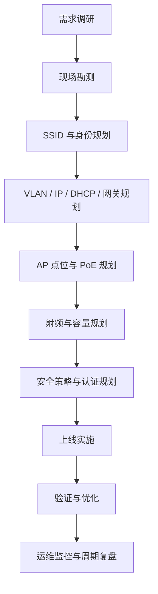
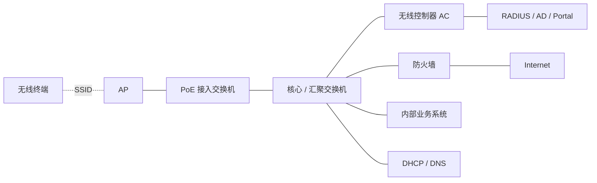
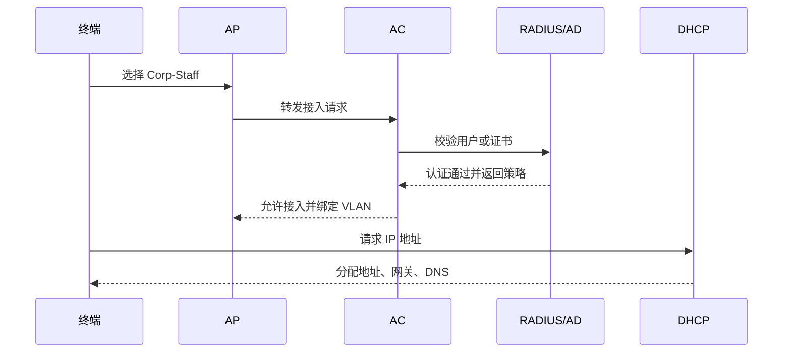
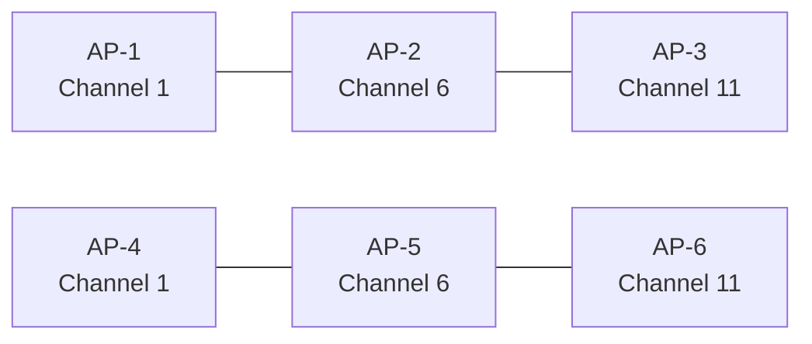
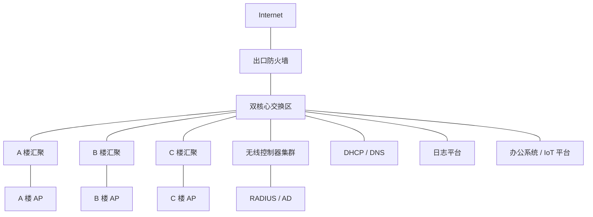
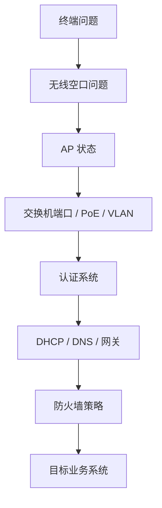

# 第 24 章：企业无线设计

## 24.1 本章学习目标

读完本章后，你应该能够：

- 理解企业无线设计和“装几个 AP”之间的区别，知道无线方案必须同时考虑覆盖、容量、安全、漫游、认证、VLAN、DHCP、网关、防火墙策略和运维监控。
- 能够根据办公区、会议室、仓库、宿舍、门店、访客区和 IoT 区域的业务特点，整理无线建设需求。
- 掌握企业无线设计的基本流程：需求调研、现场勘测、SSID 规划、VLAN 与地址规划、AP 点位规划、射频规划、安全策略规划、上线验证和持续优化。
- 能够设计员工无线、访客无线、IoT 无线和运维无线的 SSID、VLAN、IP 地址、DHCP、DNS、网关和访问权限。
- 理解覆盖设计和容量设计的区别，知道为什么“信号满格”不等于“无线好用”。
- 能够解释 2.4 GHz、5 GHz 和 6 GHz 在企业设计中的使用原则，以及信道、功率、信道宽度、最小速率、负载均衡和频段引导的作用。
- 能够看懂无线漫游、Portal 认证、802.1X 认证、访客隔离、ACL 和防火墙策略在企业无线中的常见组合。
- 能够为一个中型办公园区编写无线设计示例，并列出上线前验证表和常见故障排查路径。

第 23 章学习了无线网络基础。本章继续向工程设计推进。基础章节解决的是“无线网络是什么、有哪些组件、终端如何接入”。设计章节要解决的是：

```text
企业应该建设几个 SSID？
每个 SSID 进入哪个 VLAN？
每个无线用户获取哪个网段的地址？
认证成功后能访问什么？
AP 放在哪里？
会议室人多时是否够用？
员工从工位走到会议室是否会掉线？
访客是否一定不能访问内网？
AP、AC、认证、DHCP、网关、防火墙任一环节异常时如何定位？
```

可以先记住一句话：

```text
企业无线设计的核心，不是让每个角落都有 Wi-Fi 名称，而是让不同身份、不同设备、不同位置的终端，以可控、安全、稳定的方式接入企业网络。
```

无线设计一定要和前面章节联系起来。无线终端接入后，本质上仍然要进入 VLAN，获取 IP 地址，找到默认网关，通过路由和防火墙策略访问内网或互联网。无线只是接入方式，不是独立于企业网络之外的一套系统。

## 24.2 企业无线设计要解决什么问题

很多初学者第一次做无线项目时，会把需求理解成：

```text
办公室哪里信号弱，就在哪里加 AP。
```

这只是覆盖问题的一小部分。企业无线设计至少要同时回答七类问题。

| 问题类型 | 要回答的问题 | 如果忽略会出现什么现象 |
| --- | --- | --- |
| 覆盖 | 哪些区域必须有信号，信号强度达到什么目标 | 终端掉线、边缘区域网速慢、会议室角落不可用 |
| 容量 | 每个区域同时有多少终端，使用什么业务 | 信号很好但上网慢，会议期间大量用户卡顿 |
| 安全 | 谁可以接入，接入后能访问什么 | 访客访问内网、IoT 设备横向移动、密码泄露影响全网 |
| 认证 | 使用密码、Portal、802.1X、证书还是 MAC 认证 | 用户体验差，无法按身份授权，离职人员仍可接入 |
| 有线承载 | AP 上联交换机、PoE、VLAN、DHCP、网关如何配置 | AP 掉电、终端拿不到地址、SSID 对应错误 VLAN |
| 漫游 | 用户移动时是否不中断业务 | 语音会议掉线、扫码枪切换 AP 后业务中断 |
| 运维 | 如何监控、告警、定位和优化 | 故障只能靠用户投诉发现，排查没有证据 |

### 覆盖不是唯一目标

覆盖设计关注的是某个位置有没有足够的无线信号。常见指标包括：

- 信号强度。
- 信噪比。
- 是否存在覆盖盲区。
- 2.4 GHz、5 GHz、6 GHz 覆盖是否符合业务需求。
- 墙体、玻璃、金属、货架和电梯井对信号的影响。

但覆盖足够不代表容量足够。一个会议室里只有 5 个人时，1 台 AP 可能体验很好；同一个会议室坐满 80 个人，每人 2 台终端，实际可能有 160 台终端争抢无线空口。此时信号强度仍然可能很好，但所有人都觉得慢。

### 容量设计比覆盖设计更容易被低估

容量设计关注的是：

- 同时在线终端数量。
- 每个终端的业务流量。
- 上下行比例。
- 视频会议、投屏、文件下载、扫码、语音、办公系统等业务类型。
- 每台 AP 可承载的合理并发数量。
- 每个信道上的空口利用率。

初学阶段可以先用一个简单判断：

```text
覆盖解决“能不能连上”；
容量解决“连上后是否好用”。
```

企业无线设计必须同时看覆盖和容量。只按面积估算 AP 数量，容易低估会议室、培训室、食堂、报告厅、展厅、仓库分拣区和门店高峰时段的并发压力。

### 安全边界必须在设计阶段确定

无线网络比有线网络更容易被外部人员接触到。员工网线通常在办公室内，访客不一定能随便插入交换机端口；但无线信号会穿过墙体，楼下、走廊、停车场、隔壁办公室都可能扫描到 SSID。

所以企业无线必须提前确定：

- 员工无线是否允许访问内部系统。
- 访客无线是否只能访问互联网。
- IoT 设备是否只能访问指定平台。
- 无线和有线办公网是否同权。
- 不同部门的无线终端是否需要分 VLAN 或分权限。
- 无线用户访问服务器是否必须经过防火墙。
- 是否需要记录用户身份、终端 MAC、IP 地址、上线时间和访问日志。

如果这些问题等到 AP 全部安装后再考虑，后续调整会牵涉 SSID、VLAN、DHCP、防火墙策略、认证系统和用户通知，变更成本很高。

## 24.3 企业无线设计流程

企业无线设计可以按以下流程展开：



这个流程不是一次性写完文档就结束。无线环境会变化：人员增加、会议室改造、隔壁公司新增 AP、终端更新、IoT 设备增加、业务系统迁移、认证策略调整。无线网络上线后仍然需要持续优化。

### 第一步：需求调研

需求调研不是简单问“哪里要 Wi-Fi”。更完整的调研应包括：

| 调研项 | 示例问题 | 设计影响 |
| --- | --- | --- |
| 场所类型 | 办公区、会议室、仓库、门店、宿舍、厂房、室外？ | 决定 AP 型号、安装方式、覆盖目标 |
| 用户数量 | 每个区域有多少人，同时在线多少人？ | 决定 AP 密度和容量规划 |
| 终端类型 | 笔记本、手机、扫码枪、打印机、摄像头、IoT？ | 决定频段、认证方式、兼容性策略 |
| 业务类型 | 办公、视频会议、语音、投屏、仓储扫码、访客上网？ | 决定带宽、漫游和 QoS 需求 |
| 安全要求 | 是否区分员工、访客、IoT、运维？ | 决定 SSID、VLAN、认证和防火墙策略 |
| 运维要求 | 是否需要统一监控、日志、告警、定位？ | 决定 AC、云管、日志和命名规范 |
| 建筑环境 | 墙体材质、楼层图、吊顶、弱电井、供电、布线？ | 决定 AP 点位和施工可行性 |

不要只听“领导说每层放几个 AP”。网络工程师应该把需求转化成可验证的设计目标，例如：

```text
普通办公区：主要承载员工笔记本和手机，目标是稳定访问内网办公系统和互联网。
大会议室：最多 80 人，每人按 2 台终端估算，需要支持视频会议和文档下载。
仓库区域：扫码枪要求漫游稳定，单终端带宽不高，但不能频繁掉线。
访客区：只允许访问互联网，禁止访问内部地址段。
IoT 区：设备能力较弱，部分只支持 2.4 GHz 和 WPA2-PSK，需要独立隔离。
```

### 第二步：现场勘测

现场勘测用于确认设计假设是否符合实际环境。至少要关注：

- 楼层平面图是否准确。
- 墙体材质和厚度。
- 玻璃隔断、金属门、防火门、货架、电梯井和机房的位置。
- AP 可安装位置。
- 交换机和弱电间位置。
- 网线长度是否超过以太网限制。
- AP 是否需要 PoE、PoE+ 或更高供电能力。
- 是否有室外、潮湿、高温、粉尘或防爆要求。
- 现场已有无线干扰和其他 SSID。

现场勘测常见输出包括：

| 输出物 | 用途 |
| --- | --- |
| 楼层图 | 标记 AP 点位、弱电间、覆盖区域和特殊区域 |
| 现网无线扫描结果 | 了解已有 SSID、信道占用和干扰 |
| AP 安装位置表 | 指导施工和验收 |
| 网线与交换机端口需求 | 指导综合布线和接入交换机规划 |
| 风险记录 | 记录金属货架、厚墙、挑高空间、室外覆盖等风险 |

如果项目规模较大，应进行预测型设计和现场实测。预测型设计通过软件模拟 AP 覆盖，现场实测通过临时 AP 或上线后测量验证结果。初学者不用一开始掌握所有专业工具，但要理解：无线设计不能完全靠“经验猜点位”。

### 第三步：逻辑设计

逻辑设计是把无线接入放进企业网络架构中。它要回答：

- SSID 有几个。
- 每个 SSID 对应什么用户或设备。
- 每个 SSID 进入哪个 VLAN。
- 每个 VLAN 使用哪个 IP 网段。
- 默认网关在哪里。
- DHCP 从哪里分配。
- DNS 使用什么服务器。
- 用户访问内网或互联网经过哪些设备。
- 防火墙策略如何放行或阻断。
- 认证系统如何和无线控制器联动。

一个常见逻辑拓扑如下：



这张图中的每个节点都可能影响无线体验。终端连不上 SSID，不一定是 AP 问题；认证失败可能在 RADIUS；拿不到地址可能在 DHCP 或 VLAN；能上网不能访问内网可能在防火墙策略；某个楼层无线慢可能是空口容量或 AP 上联问题。

### 第四步：实施、验证和优化

无线实施不是 AP 上电就算完成。至少要经历：

1. 交换机端口、PoE、Trunk、管理 VLAN 验证。
2. AP 注册 AC 或云平台验证。
3. SSID 广播、认证、加密验证。
4. 终端获取 IP、网关、DNS 验证。
5. 员工、访客、IoT 权限验证。
6. 漫游、会议室高并发、弱信号区域验证。
7. 日志、告警、监控和备份验证。
8. 根据实测结果调整信道、功率、最小速率和 AP 点位。

无线优化通常不是一次完成。项目交付后，还应在真实办公高峰期观察在线人数、空口利用率、认证失败、漫游失败、AP 负载、DHCP 地址池使用率和用户投诉记录。

## 24.4 覆盖设计与容量设计

### 覆盖设计

覆盖设计的目标是让指定区域内的终端能够稳定发现并连接无线网络。

常见覆盖区域包括：

| 区域 | 设计重点 |
| --- | --- |
| 普通办公区 | 工位覆盖均匀，优先支持 5 GHz，避免 AP 过密导致同频干扰 |
| 会议室 | 覆盖和容量都重要，不能只从门口 AP 覆盖进去 |
| 走廊 | 通常不是主要办公区域，但影响漫游连续性 |
| 仓库 | 货架和货物会改变信号传播，扫码枪漫游稳定性重要 |
| 室外区域 | 需要室外 AP、防水、防雷、安装高度和安全固定 |
| 宿舍 | 终端密度高、娱乐流量大，容易出现容量和投诉问题 |
| 生产车间 | 可能存在金属设备、电机、粉尘、高温和特殊安全要求 |

覆盖目标不能只写“全覆盖”。更清楚的写法是：

```text
普通办公区：主要业务区域 5 GHz 可用，边缘区域不低于设计阈值。
会议室：座位区覆盖均匀，支持满员会议期间稳定使用。
仓库通道：扫码枪行走路径连续覆盖，重点验证漫游。
访客大厅：访客区域覆盖良好，但不追求覆盖内部办公深处。
```

### 容量设计

容量设计要先估算终端数量。一个员工通常不止一台无线终端：

| 用户类型 | 常见终端数量估算 |
| --- | ---: |
| 普通办公员工 | 1 台笔记本 + 1 台手机 |
| 研发人员 | 1 台笔记本 + 1 台手机 + 临时测试设备 |
| 会议参会者 | 1 台笔记本 + 1 台手机 |
| 仓库人员 | 1 台扫码枪，部分还有手机 |
| 访客 | 1-2 台移动终端 |

容量估算不能只按“人数”。例如一个 80 人会议室：

```text
80 人 x 每人 2 台终端 = 160 台无线终端
```

如果这些终端都连接同一个 AP，即使 AP 标称规格很高，空口也可能拥塞。设计时应根据区域、业务和厂商建议确定 AP 数量，同时关注信道复用和 AP 安装位置。

### 覆盖和容量的矛盾

覆盖和容量有时会互相影响。

| 做法 | 可能收益 | 可能风险 |
| --- | --- | --- |
| 增加 AP 数量 | 改善覆盖，分担终端 | AP 过密导致同频干扰 |
| 提高发射功率 | 边缘信号变强 | 终端听得到 AP，但 AP 听不到终端，漫游变差 |
| 使用更宽信道 | 单终端理论速率提高 | 可用信道减少，高密环境更容易互相干扰 |
| 开启更多 SSID | 业务区分更细 | 管理帧增多，空口开销增加 |
| 保留 2.4 GHz | 兼容老设备 | 干扰多，终端可能黏在低容量频段 |

无线设计不是参数越大越好，而是要在具体场景下平衡。

### 常见设计目标参考

不同企业、厂商和标准会有不同建议。下面表格用于帮助初学者建立工程思维，不应机械套用：

| 场景 | 设计关注点 | 常见设计思路 |
| --- | --- | --- |
| 普通办公区 | 覆盖均匀、员工体验稳定 | 5 GHz 为主，2.4 GHz 兼容，控制 AP 间干扰 |
| 高密会议室 | 并发终端多、视频会议多 | 增加 AP 密度，控制功率和信道宽度，减少低速终端影响 |
| 仓库扫码 | 漫游稳定、低延迟、覆盖连续 | 沿通道规划 AP，关注货架遮挡，避免频繁掉线 |
| 访客大厅 | 上网体验、安全隔离 | 访客独立 SSID 和 VLAN，只允许访问互联网 |
| IoT 设备 | 兼容性、隔离、安全 | 独立 SSID 或隐藏 SSID，限制访问目标，定期清理设备 |
| 室外广场 | 环境适应、覆盖范围 | 室外 AP、防水防雷，注意非法覆盖和安全边界 |

## 24.5 SSID、VLAN 和地址规划

SSID 是用户看到的无线名称，VLAN 是网络隔离边界，IP 地址是三层通信基础。企业无线设计必须把三者对应清楚。

### SSID 数量不宜过多

常见无线项目会规划多个 SSID，例如：

- 员工无线。
- 访客无线。
- IoT 无线。
- 运维无线。
- 会议专用无线。

但 SSID 不是越多越好。每个 SSID 都会产生管理帧开销，SSID 太多会占用空口资源，也会让用户选择困难、策略维护复杂。

常见建议是：

```text
能用身份和策略区分的，不一定都要新建 SSID；
必须隔离认证方式、终端类型或安全边界的，才单独规划 SSID。
```

例如员工和不同部门可以使用同一个员工 SSID，通过 802.1X 认证后由 RADIUS 下发不同 VLAN 或权限；访客和 IoT 因为认证方式、权限和终端能力差异明显，通常独立 SSID 更清晰。

### 示例：中型办公园区无线逻辑规划

假设某企业总部有 3 栋办公楼，约 800 名员工，日常无线终端约 1600 台。网络使用 `10.24.0.0/16` 作为园区地址空间，其中第 24 章示例统一规划如下：

| SSID | 用途 | VLAN | IP 网段 | 网关 | DHCP 地址池 | DNS |
| --- | --- | ---: | --- | --- | --- | --- |
| Corp-Staff | 员工无线 | 240 | 10.24.40.0/22 | 10.24.40.1 | 10.24.40.50-10.24.43.250 | 10.24.1.53, 10.24.1.54 |
| Corp-Guest | 访客无线 | 241 | 10.24.44.0/22 | 10.24.44.1 | 10.24.44.50-10.24.47.250 | 10.24.1.53, 8.8.8.8 |
| Corp-IoT | IoT 无线 | 242 | 10.24.48.0/23 | 10.24.48.1 | 10.24.48.50-10.24.49.250 | 10.24.1.53 |
| Corp-Ops | 运维无线 | 243 | 10.24.50.0/24 | 10.24.50.1 | 10.24.50.50-10.24.50.200 | 10.24.1.53, 10.24.1.54 |
| AP-MGMT | AP 管理网络 | 249 | 10.24.249.0/24 | 10.24.249.1 | 10.24.249.50-10.24.249.220 | 10.24.1.53 |

这里要注意：

- `Corp-Staff` 是员工无线，不等于 AP 管理网络。
- AP 自己获取管理地址使用 VLAN 249。
- 员工终端接入后进入 VLAN 240。
- 访客终端进入 VLAN 241，只允许访问互联网。
- IoT 终端进入 VLAN 242，只允许访问指定服务器。
- 运维无线 VLAN 243 权限更高，应使用更强认证和审计。

### 地址池容量估算

员工无线使用 `10.24.40.0/22`，可用地址约 1022 个。若企业有 800 名员工，每人 2 台终端，理论终端数为 1600 台，则一个 `/22` 可能不足。

可以进一步估算：

| 项目 | 数值 |
| --- | ---: |
| 员工人数 | 800 |
| 每人无线终端 | 2 |
| 潜在终端总数 | 1600 |
| 同时在线比例 | 60%-80% |
| 高峰在线终端估算 | 960-1280 |
| `/22` 可用地址 | 约 1022 |

如果高峰可能达到 1280 台，`/22` 地址池就有耗尽风险。设计可以改为：

```text
员工无线使用 10.24.40.0/21，网关 10.24.40.1，可用地址约 2046 个。
```

如果员工无线从 `10.24.40.0/22` 扩展为 `10.24.40.0/21`，原来落在 `10.24.44.0/22` 的访客无线就必须迁移到其他不重叠网段。地址规划调整时要同时检查所有 VLAN，而不是只扩大一个地址池。

但地址变大也要考虑广播域、网关、DHCP、日志和策略管理。如果企业按楼宇或区域划分员工无线 VLAN，也可以每栋楼一个员工无线 VLAN，例如：

| 区域 | SSID | VLAN | 网段 |
| --- | --- | ---: | --- |
| A 楼员工无线 | Corp-Staff | 240 | 10.24.60.0/23 |
| B 楼员工无线 | Corp-Staff | 244 | 10.24.62.0/23 |
| C 楼员工无线 | Corp-Staff | 245 | 10.24.64.0/23 |

用户看到的 SSID 仍然可以是 `Corp-Staff`，但不同区域的 AP 把用户接入不同 VLAN。这样有利于缩小故障域和地址池范围，但漫游、认证和策略配置要更仔细。

### VLAN 和网关位置

无线用户 VLAN 的网关常见放置位置有三种：

| 网关位置 | 说明 | 适用场景 |
| --- | --- | --- |
| 核心或汇聚交换机 | 无线用户在本地转发，网关在园区三层设备上 | 园区无线常见，转发效率高 |
| 防火墙 | 无线用户直接以防火墙为网关 | 访客、IoT、高安全区域，便于策略控制 |
| AC 或无线控制器 | 用户流量集中到 AC 再转发 | 小型集中式架构或需要集中控制的场景 |

现代企业常用本地转发和集中控制结合：

```text
员工无线：AP 本地转发到园区 VLAN，网关在汇聚或核心。
访客无线：可以本地转发到访客 VLAN，但默认路由和策略经过防火墙。
IoT 无线：独立 VLAN，访问指定平台必须经过防火墙或 ACL。
运维无线：独立 VLAN，访问设备管理地址经过堡垒机或安全策略。
```

选择哪种方式要看网络规模、AC 性能、链路带宽、安全要求和厂商实现。

## 24.6 认证与安全设计

企业无线安全设计要解决两个问题：

```text
谁可以接入？
接入后可以访问什么？
```

第一个问题由认证解决，第二个问题由 VLAN、ACL、防火墙策略、准入系统和日志审计共同解决。

### 常见认证方式

| 认证方式 | 说明 | 优点 | 风险或限制 |
| --- | --- | --- | --- |
| WPA2/WPA3-PSK | 所有人使用同一个或少量共享密码 | 简单，适合小型或 IoT 场景 | 密码泄露后难以追踪个人，离职人员可能继续使用 |
| Portal 认证 | 用户连接后打开网页认证 | 适合访客，体验直观 | 依赖 Portal 系统，部分 App 或无屏设备不适合 |
| 802.1X | 通过用户名密码或证书向 RADIUS 认证 | 可按用户身份授权，适合员工无线 | 部署复杂，需要终端、证书、AD/RADIUS 配合 |
| MAC 认证 | 根据终端 MAC 地址放行 | 适合无交互 IoT 设备 | MAC 可伪造，设备台账要维护 |
| 证书认证 | 通过设备或用户证书接入 | 安全性高，适合企业管控终端 | 需要证书生命周期管理 |

### 员工无线认证设计

员工无线推荐使用 802.1X 或证书认证，而不是长期使用共享密码。原因是：

- 可以和 AD、LDAP 或身份平台联动。
- 可以按用户、部门、设备类型下发 VLAN 或权限。
- 员工离职后禁用账号即可阻止接入。
- 可以记录用户身份、终端 MAC、IP、上线时间。
- 不需要频繁通知全员修改 Wi-Fi 密码。

员工无线认证流程可以简化理解为：



初学者要注意：认证通过只代表“允许接入无线”，不代表所有业务都能访问。访问权限仍然取决于 VLAN、路由、防火墙和服务器侧策略。

### 访客无线安全设计

访客无线的原则是：

```text
方便访客上网，但不信任访客终端。
```

常见设计要求：

- 独立 SSID，例如 `Corp-Guest`。
- 独立 VLAN 和 IP 网段。
- 只允许访问互联网。
- 禁止访问内网私有地址段。
- 访客之间尽量隔离，禁止互访。
- 可选 Portal、短信、二维码、前台审批或会议码。
- 记录认证日志、上线时间、IP 地址和终端 MAC。
- 可设置带宽限制和有效期。

访客无线策略示例：

| 源区域 | 源网段 | 目的 | 动作 | 说明 |
| --- | --- | --- | --- | --- |
| Guest-WiFi | 10.24.44.0/22 | 10.0.0.0/8 | 拒绝 | 禁止访问企业内网 |
| Guest-WiFi | 10.24.44.0/22 | 172.16.0.0/12 | 拒绝 | 禁止访问企业内网 |
| Guest-WiFi | 10.24.44.0/22 | 192.168.0.0/16 | 拒绝 | 禁止访问企业内网 |
| Guest-WiFi | 10.24.44.0/22 | Internet | 允许 | 允许上网 |
| Guest-WiFi | 10.24.44.0/22 | DNS | 允许 | 允许 DNS 解析 |

如果企业内部也使用 `10.0.0.0/8`，访客策略要避免把互联网中的所有 `10.0.0.0/8` 目的都误认为内网问题。工程上通常会把企业实际内网地址对象单独维护，例如 `Enterprise-Private-Networks`，并在防火墙对象里定义清楚。

### IoT 无线安全设计

IoT 设备包括打印机、投屏设备、门禁、传感器、会议屏、扫码枪、摄像头、环境监测设备等。它们的特点是：

- 终端数量多。
- 厂商多，系统更新慢。
- 认证能力弱，部分不支持 802.1X。
- 可能只支持 2.4 GHz。
- 一旦被攻击，容易成为内网横向移动入口。

IoT 无线设计建议：

- 独立 SSID 或独立认证策略。
- 独立 VLAN，例如 VLAN 242。
- 只允许访问必要服务器，例如 IoT 平台、打印服务器、投屏服务器。
- 禁止访问办公终端网段。
- 禁止 IoT 设备之间不必要的互访。
- 使用设备台账记录 MAC、型号、安装位置、责任人和用途。
- 对长期离线、未知 MAC、异常流量设备定期清理。

IoT 策略示例：

| 源网段 | 目的 | 端口 | 动作 | 说明 |
| --- | --- | --- | --- | --- |
| 10.24.48.0/23 | 10.24.20.30 | TCP 443 | 允许 | 访问 IoT 管理平台 |
| 10.24.48.0/23 | 10.24.20.40 | TCP 9100 | 允许 | 指定打印服务场景 |
| 10.24.48.0/23 | 10.24.40.0/21 | any | 拒绝 | 禁止访问员工无线 |
| 10.24.48.0/23 | 10.24.10.0/24 | any | 拒绝 | 禁止访问服务器管理网 |
| 10.24.48.0/23 | Internet | 按需 | 默认拒绝 | 只放行确有需要的云服务 |

### 运维无线设计

运维无线用于网络、安全、系统或弱电工程师临时接入管理网络。它不应该和普通员工无线混用。

运维无线设计要求：

- 独立 SSID，例如 `Corp-Ops`。
- 独立 VLAN，例如 VLAN 243。
- 使用强认证，优先 802.1X、证书或多因素认证。
- 只允许运维人员和受管设备接入。
- 访问设备管理网应经过堡垒机、VPN 或 ACL。
- 记录详细日志。
- 默认关闭或限制覆盖范围，避免长期暴露。

运维无线不是为了方便所有人“临时调设备”。它的权限通常更高，必须比普通员工无线更严格。

## 24.7 AP 点位、供电和有线承载设计

无线设计离不开有线网络。AP 再好，如果上联交换机端口、PoE、电缆、VLAN 或 Trunk 配错，无线终端仍然无法正常使用。

### AP 点位设计

AP 点位设计要结合覆盖、容量、安装条件和美观要求。常见安装位置包括：

| 位置 | 优点 | 注意事项 |
| --- | --- | --- |
| 办公区吊顶 | 覆盖均匀，施工常见 | 注意吊顶材质、空调风口、检修口 |
| 会议室内 | 容量更可控 | 不要只依赖走廊 AP 覆盖会议室 |
| 走廊 | 施工方便 | 容易导致房间内覆盖弱，容量不足 |
| 仓库通道 | 贴近扫码路径 | 货架和货物遮挡明显，需要实测 |
| 室外立杆或墙面 | 覆盖室外区域 | 防水、防雷、供电、安全固定 |
| 高挑空间 | 覆盖范围大 | 终端上行弱、定位和容量可能受影响 |

常见错误是把 AP 全部装在走廊。走廊 AP 可以覆盖部分房间，但墙体会衰减信号，会议室或工位区实际体验可能很差。企业办公区更常见的做法是根据工位、会议室和墙体分布，把 AP 安装在真正需要服务的区域附近。

### PoE 供电规划

AP 通常由 PoE 交换机供电。不同 AP 对 PoE 功率要求不同：

| 供电类型 | 常见功率等级 | 说明 |
| --- | ---: | --- |
| PoE | 约 15.4 W | 老 AP 或低功耗设备可能够用 |
| PoE+ | 约 30 W | 企业 AP 常见需求 |
| PoE++ | 更高功率 | 高性能 AP、多射频 AP 或特殊设备可能需要 |

设计时不能只看交换机端口数量，还要看 PoE 总功率预算。例如一台 48 口 PoE 交换机不是每个端口都一定能同时满功率供电。

示例：

```text
一台接入交换机 PoE 总功率：740 W
每台 AP 预算功率：25 W
理论最多支持 AP 数量：740 / 25 = 29.6
工程上还要预留余量，因此不建议满载到 29 台。
```

如果 AP 上电后反复重启、射频被降级、部分功能不可用，要检查 PoE 供电等级和交换机 PoE 预算。

### AP 上联端口配置

AP 上联端口配置取决于厂商架构和转发方式。常见情况如下：

| 场景 | 端口配置思路 |
| --- | --- |
| AP 只需要管理 VLAN，用户流量隧道回 AC | 接入口或 Trunk，保证 AP 管理 VLAN 可达 AC |
| AP 本地转发多个 SSID 到不同 VLAN | Trunk，允许 AP 管理 VLAN 和用户 VLAN |
| 云管理 AP | 保证 AP 可访问云平台、DNS、NTP 和必要端口 |
| 独立胖 AP | 根据 SSID 映射 VLAN，通常需要 Trunk |

一个本地转发 AP 的上联逻辑示例：

| VLAN | 用途 | 是否通过 AP 上联 Trunk |
| --- | --- | --- |
| 249 | AP 管理 | 是 |
| 240 | 员工无线 | 是 |
| 241 | 访客无线 | 是 |
| 242 | IoT 无线 | 是 |
| 243 | 运维无线 | 仅在需要该 SSID 的区域允许 |

安全上不建议所有 AP 端口都无脑放行所有 VLAN。更好的做法是按楼宇、区域和 SSID 实际需要放行 VLAN，减少误接入和故障影响。

### AC 和 AP 管理可达性

AP 要能找到 AC 或云平台。常见发现方式包括：

- 同网段自动发现。
- DHCP Option。
- DNS 解析。
- 手工指定 AC 地址。
- 云管理平台注册。

AP 管理网络需要满足：

- AP 能获取管理 IP。
- AP 能访问 AC 或云平台。
- AP 能访问 DNS 和 NTP。
- 管理网络和用户网络隔离。
- 管理地址不暴露给访客或普通用户。
- AC、AP 和网管平台之间的安全策略放行必要端口。

AP 注册失败时，不要只看 AC。应依次检查：

```text
AP 是否上电 -> 交换机端口是否 Up -> AP 是否获取管理 IP -> 网关是否可达 -> AC 地址是否可解析或可发现 -> 中间策略是否放行 -> AC 是否允许该 AP 加入
```

## 24.8 射频规划：频段、信道、功率和速率

射频规划决定无线空口是否健康。企业无线不能只依赖自动优化，也不能完全手工固定后多年不调整。合理做法是理解参数含义，再结合控制器自动射频管理和现场实测。

### 频段使用原则

常见原则：

| 频段 | 设计建议 |
| --- | --- |
| 2.4 GHz | 保留兼容，但不作为高密办公主力；控制功率，减少低速终端黏连 |
| 5 GHz | 企业办公主力频段，适合多数笔记本和手机 |
| 6 GHz | 适合新终端、高容量、低干扰场景，但要确认法规、终端和 AP 支持 |

如果企业中还有大量只支持 2.4 GHz 的扫码枪、打印机或 IoT 设备，就不能简单关闭 2.4 GHz。但也不要让所有员工终端都挤在 2.4 GHz 上。可以通过频段引导、SSID 规划和终端更新逐步把主力办公流量迁移到 5 GHz 或 6 GHz。

### 信道规划

信道规划的目标是减少相邻 AP 之间的同频干扰和重叠干扰。

2.4 GHz 频段常见只使用 1、6、11 三个互不重叠信道：



5 GHz 和 6 GHz 可用信道更多，但也不能随意全部开 80 MHz 或 160 MHz。高密环境下，更窄的信道可能带来更好的复用能力。

### 发射功率

发射功率不是越大越好。AP 功率过大可能导致：

- 终端远距离仍然看到强 SSID，不愿漫游到更近 AP。
- 终端听得到 AP，但终端自身发射功率较小，AP 听不清终端。
- 相邻 AP 覆盖重叠过大，同频干扰增加。
- 覆盖范围超出企业边界，增加安全暴露面。

发射功率应结合 AP 密度、墙体、终端类型和漫游需求调整。会议室、高密办公区通常不希望某台 AP “覆盖半层楼”，而是希望多个 AP 服务各自合理区域。

### 最小速率和低速终端

无线空口是共享资源。低速终端占用空口时间更长，会拖累整体体验。最小速率设置可以减少很远、很弱、很慢的终端长期占用无线资源。

但最小速率设置过高也有风险：

- 边缘区域终端可能连接困难。
- 老旧设备可能无法接入。
- 仓库、室外或特殊场景可能出现覆盖断点。

设计时要根据终端能力和业务区域决定。普通办公区可以逐步淘汰过低速率；仓库扫码、IoT 等场景要更谨慎。

### 频段引导和负载均衡

频段引导用于鼓励双频终端优先连接 5 GHz 或 6 GHz，而不是停留在 2.4 GHz。负载均衡用于避免大量终端集中到同一 AP。

这些功能有帮助，但不是万能。过度激进的负载均衡可能导致终端连接不稳定；某些终端对频段引导兼容性不好。上线后要观察认证失败、关联失败、漫游失败和用户体验，不要只看功能是否开启。

## 24.9 漫游设计

漫游是指终端从一个 AP 覆盖区移动到另一个 AP 覆盖区时，保持网络连接连续。企业场景中，漫游对以下业务尤其重要：

- 语音通话。
- 视频会议。
- 仓库扫码。
- 医护移动终端。
- 巡检终端。
- 手持 POS 或门店终端。

### 漫游为什么会失败

漫游是终端和无线系统共同完成的。不是 AP 想让终端切换，终端就一定切换。终端驱动、信号判断、认证方式、AP 覆盖重叠、功率设置和控制器策略都会影响漫游。

常见漫游问题包括：

| 现象 | 可能原因 |
| --- | --- |
| 终端一直黏在远处 AP | AP 功率过大、终端漫游策略保守、近处 AP 信号未明显更好 |
| 移动中短暂断网 | 覆盖重叠不足、重新认证耗时、DHCP 或网关变化 |
| 扫码枪切换区域后掉线 | 终端只支持老协议、2.4 GHz 干扰大、AP 点位不连续 |
| 语音会议移动中卡顿 | 漫游时间长、空口拥塞、QoS 未规划 |
| 跨楼层漫游异常 | SSID、VLAN、认证策略不一致，或三层漫游设计不足 |

### 二层漫游和三层漫游

如果用户从 AP-A 漫游到 AP-B，且两个 AP 对该 SSID 使用同一个 VLAN 和同一个网关，通常属于二层漫游。终端 IP 地址不变，体验相对简单。

如果用户从 A 楼漫游到 B 楼，不同区域使用不同用户 VLAN 和不同网关，就涉及三层漫游或重新获取地址的问题。不同厂商有不同解决方式，例如隧道、锚点、控制器漫游或重新认证。设计时要明确：

- 用户移动范围是否会跨 VLAN。
- 业务是否允许重新获取地址。
- 语音、扫码等业务是否要求 IP 不变。
- 厂商控制器是否支持三层漫游。
- 是否有必要按业务场景保持同一无线 VLAN 覆盖多个区域。

### 漫游设计建议

| 场景 | 漫游设计建议 |
| --- | --- |
| 普通办公 | 保证工位、会议室、走廊之间覆盖连续，避免功率过大导致黏连 |
| 仓库扫码 | 沿移动路径实测，优先稳定，避免跨区域频繁重新认证 |
| 医疗移动终端 | 重点验证病区、走廊、电梯口和护士站连续性 |
| 语音 Wi-Fi | 关注低延迟、QoS、快速漫游和覆盖重叠 |
| 多楼宇办公 | 明确跨楼漫游是否需要保持 IP，必要时使用控制器漫游能力 |

漫游问题不能只坐在办公室看配置。必须拿真实终端按真实路径走测，例如从工位到会议室、从仓库入口到拣货区、从护士站到病房。

## 24.10 典型企业无线场景设计

### 普通办公区

普通办公区是企业无线最常见场景。典型终端是员工笔记本和手机，业务包括办公系统、邮件、即时通信、视频会议、文件访问和互联网访问。

设计建议：

- 员工无线使用 802.1X 或证书认证。
- 主要承载在 5 GHz，条件成熟时引入 6 GHz。
- 2.4 GHz 保留给兼容设备，但控制低速终端影响。
- AP 点位根据工位密度和墙体布局规划。
- 员工无线可访问内网办公系统和互联网，但不应默认访问所有服务器网段。
- DHCP 地址池按终端数和高峰在线率预留。
- 关注会议软件、DNS、认证失败和漫游体验。

### 高密会议室

高密会议室常见问题是“平时好用，开大会就慢”。原因是容量需求集中爆发。

设计建议：

- 按座位数和每人 2 台终端估算。
- AP 应部署在会议室内或附近，而不是只依赖走廊覆盖。
- 控制 AP 功率，避免一个 AP 吸附过多终端。
- 合理设置 5 GHz 信道宽度。
- 减少不必要 SSID 广播。
- 对访客无线设置带宽限制和会话限制。
- 上线验收应模拟高并发，而不是只用一台手机测速。

会议室示例：

| 项目 | 设计值 |
| --- | --- |
| 座位数 | 80 |
| 估算终端 | 160 |
| 主要业务 | 视频会议、网页、文档下载 |
| SSID | Corp-Staff、Corp-Guest |
| AP | 多台企业级 AP，按实测调整 |
| 重点验证 | 高峰并发、漫游、认证、DNS、视频会议质量 |

### 仓库和物流区域

仓库无线通常不追求每个终端高带宽，而是追求稳定覆盖和漫游。扫码枪掉线会直接影响收货、分拣、盘点和出库。

设计建议：

- 沿作业通道规划 AP，而不是只按面积覆盖。
- 注意金属货架、货物高度和货物材质对信号的影响。
- 使用真实扫码枪测试，而不是只用手机测试。
- 避免频繁跨 VLAN 或重新认证。
- 关注 2.4 GHz 兼容性和干扰。
- 为扫码业务服务器设置明确访问策略。
- AP 安装要考虑叉车、货物搬运和安全固定。

### 访客和公共区域

访客无线关注的是上网体验和内网隔离。

设计建议：

- 独立 SSID 和 VLAN。
- Portal、短信、二维码或前台审批。
- 默认拒绝访问企业内网地址。
- 访客之间隔离。
- 限制带宽、会话时长和账号有效期。
- 记录日志满足审计要求。
- 不要把访客无线密码长期贴在前台且永不更换。

### IoT 和弱终端区域

IoT 设备能力参差不齐，安全风险高。

设计建议：

- 建立设备台账。
- 独立 VLAN 和访问策略。
- 尽量避免和员工终端共用权限。
- 对只支持弱加密或老协议的设备进行风险登记。
- 能使用有线的关键设备优先使用有线。
- 只放行业务必要目的地址和端口。

## 24.11 完整设计示例：中型总部无线网络

### 项目背景

某企业总部包含 A、B、C 三栋楼：

- A 楼：行政、财务、人事，约 250 人。
- B 楼：研发、测试，约 400 人。
- C 楼：会议中心、培训室、访客大厅，约 150 名常驻人员，会议高峰可增加 300 名访客。
- 数据中心和出口防火墙位于 A 楼核心机房。
- 已建设双核心园区网，核心和汇聚运行三层路由。
- 企业已有 AD、RADIUS、DHCP、DNS、日志平台和防火墙。

无线建设目标：

- 员工无线覆盖三栋楼主要办公区域。
- 访客无线覆盖会议中心、访客大厅和公共区域。
- IoT 无线用于会议投屏、无线打印和少量传感器。
- 运维无线仅在机房、弱电间和指定办公区开放。
- 员工无线可访问办公系统和互联网。
- 访客无线只能访问互联网。
- IoT 无线只访问指定平台。
- 无线网络纳入统一监控和日志审计。

### 逻辑拓扑



### SSID 和地址规划

根据项目背景，规划如下：

| SSID | 认证方式 | VLAN | 网段 | 网关 | 权限 |
| --- | --- | ---: | --- | --- | --- |
| Corp-Staff | 802.1X / 证书 | 240 | 10.24.40.0/21 | 10.24.40.1 | 办公系统、互联网、按需访问服务器 |
| Corp-Guest | Portal / 短信 | 241 | 10.24.48.0/22 | 10.24.48.1 | 只允许互联网 |
| Corp-IoT | MAC 认证 + PSK | 242 | 10.24.52.0/23 | 10.24.52.1 | 只访问 IoT 平台和指定服务 |
| Corp-Ops | 802.1X + 运维组 | 243 | 10.24.54.0/24 | 10.24.54.1 | 访问堡垒机、网管和设备管理地址 |
| AP-MGMT | AP 管理 | 249 | 10.24.249.0/24 | 10.24.249.1 | AP 到 AC、DNS、NTP、网管 |

注意这里和前面表格相比，对员工无线和访客无线的地址池做了调整：

- 员工无线从 `/22` 扩大到 `/21`，满足 800 名员工多终端高峰。
- 访客无线使用 `10.24.48.0/22`，满足会议中心高峰访客。
- IoT 和运维使用独立较小网段，便于策略收敛。

### DHCP 规划

| VLAN | 网段 | 排除地址 | 地址池 | 租期建议 |
| --- | --- | --- | --- | --- |
| 240 | 10.24.40.0/21 | 10.24.40.1-10.24.40.49 | 10.24.40.50-10.24.47.250 | 8-12 小时 |
| 241 | 10.24.48.0/22 | 10.24.48.1-10.24.48.49 | 10.24.48.50-10.24.51.250 | 2-4 小时 |
| 242 | 10.24.52.0/23 | 10.24.52.1-10.24.52.49 | 10.24.52.50-10.24.53.250 | 1-7 天 |
| 243 | 10.24.54.0/24 | 10.24.54.1-10.24.54.49 | 10.24.54.50-10.24.54.200 | 8 小时 |
| 249 | 10.24.249.0/24 | 10.24.249.1-10.24.249.49 | 10.24.249.50-10.24.249.220 | 7 天 |

访客无线租期不宜太长，否则会议结束后地址仍被占用，下一场活动可能出现地址池不足。AP 管理地址租期可以较长，但关键 AP 也可以使用 DHCP 保留地址或静态管理地址，方便监控和定位。

### 防火墙策略规划

| 策略编号 | 源 | 目的 | 服务 | 动作 | 说明 |
| --- | --- | --- | --- | --- | --- |
| W-01 | Staff-WiFi | OA / 邮件 / 文件服务 | 按业务端口 | 允许 | 员工访问办公系统 |
| W-02 | Staff-WiFi | Internet | HTTP/HTTPS/DNS/NTP | 允许 | 员工上网 |
| W-03 | Guest-WiFi | Enterprise-Private-Networks | any | 拒绝 | 访客禁止访问内网 |
| W-04 | Guest-WiFi | Internet | HTTP/HTTPS/DNS | 允许 | 访客上网 |
| W-05 | IoT-WiFi | IoT-Platform | TCP 443 / MQTT 等 | 允许 | IoT 访问平台 |
| W-06 | IoT-WiFi | Staff-WiFi / Server-Mgmt | any | 拒绝 | IoT 禁止横向访问 |
| W-07 | Ops-WiFi | Bastion / NMS | SSH/HTTPS/RDP/SNMP | 允许 | 运维访问管理入口 |
| W-08 | AP-MGMT | AC / NTP / DNS / NMS | 必要端口 | 允许 | AP 管理通信 |

策略顺序也很重要。通常先明确拒绝高风险访问，再按需放行业务访问，最后保留默认拒绝或默认上网策略，具体取决于防火墙策略模型。

### AP 命名和位置规划

AP 命名应该让运维人员一眼看出位置。示例：

```text
AP-A-03-Office-01
AP-A-03-Meeting-01
AP-B-05-RD-04
AP-C-02-Training-02
AP-C-01-Lobby-01
```

命名字段可以包含：

| 字段 | 示例 | 含义 |
| --- | --- | --- |
| 楼宇 | A / B / C | 所在楼 |
| 楼层 | 03 / 05 | 所在楼层 |
| 区域 | Office / Meeting / RD / Lobby | 功能区域 |
| 编号 | 01 / 02 | 同区域序号 |

AP 点位表应至少记录：

| 字段 | 示例 |
| --- | --- |
| AP 名称 | AP-C-02-Training-02 |
| 安装位置 | C 楼 2 层培训室后侧吊顶 |
| 接入交换机 | SW-C-02-ACC-01 |
| 交换机端口 | GE1/0/24 |
| 管理 VLAN | 249 |
| 广播 SSID | Corp-Staff, Corp-Guest |
| PoE 要求 | PoE+ |
| 备注 | 高密培训室，重点观察并发 |

### 上线验证表

| 验证项 | 方法 | 预期结果 |
| --- | --- | --- |
| AP 上电 | 查看交换机 PoE 和端口状态 | AP 正常供电，无反复重启 |
| AP 注册 | 在 AC 上查看 AP 状态 | AP 在线，名称和位置正确 |
| SSID 广播 | 终端扫描无线 | 指定区域能看到应广播的 SSID |
| 员工认证 | 使用员工账号连接 Corp-Staff | 认证成功，获取 VLAN 240 地址 |
| 访客认证 | 使用访客流程连接 Corp-Guest | Portal 正常，获取 VLAN 241 地址 |
| IoT 接入 | 使用测试设备连接 Corp-IoT | 设备接入并只能访问指定平台 |
| 运维接入 | 运维账号连接 Corp-Ops | 只能授权人员接入 |
| DHCP | 查看终端地址、网关、DNS | 地址、网关、DNS 与规划一致 |
| 内网访问 | 员工访问 OA、邮件、文件服务 | 业务正常 |
| 访客隔离 | 访客访问内网地址 | 被拒绝 |
| 上网访问 | 员工和访客访问互联网 | 按策略正常 |
| 漫游 | 按办公路径移动测试 | 无明显掉线，业务不中断或可接受 |
| 高密测试 | 会议室多终端测试 | 认证、DNS、网页、视频会议可用 |
| 日志审计 | 查询认证和防火墙日志 | 能关联用户、IP、时间和策略 |

## 24.12 无线故障排查方法

无线故障排查要沿着业务路径缩小边界。不要一上来就改信道、改功率或重启 AP。

### 排查路径

可以按下面顺序排查：



更具体地说：

1. 终端是否能看到 SSID。
2. 终端是否能完成关联和认证。
3. 终端是否获取正确 IP、网关和 DNS。
4. 终端是否能 ping 网关。
5. 终端是否能解析域名。
6. 终端是否能访问互联网或内部业务。
7. 防火墙是否有允许或拒绝日志。
8. 业务系统本身是否正常。

### 常见故障矩阵

| 现象 | 可能原因 | 验证方法 | 处理方向 |
| --- | --- | --- | --- |
| 看不到 SSID | SSID 未在该区域广播、AP 离线、终端频段不支持 | 查看 AC SSID 配置、AP 状态、终端支持频段 | 恢复 AP、调整 SSID 广播范围、确认终端能力 |
| 能看到 SSID 但连不上 | 密码错误、802.1X 失败、终端被黑名单、信号弱 | 查看认证日志、终端提示、RSSI | 修正账号密码、检查 RADIUS、移除黑名单、优化覆盖 |
| 认证成功但拿不到 IP | DHCP 地址池耗尽、VLAN 未透传、DHCP 中继错误 | 查看 DHCP 日志、交换机 Trunk、网关中继 | 扩容地址池、修正 VLAN、修正 DHCP Relay |
| 拿到 IP 但不能上网 | 网关不可达、DNS 错误、防火墙策略阻断、NAT 异常 | ping 网关、nslookup、查防火墙日志 | 修复网关、DNS、策略或 NAT |
| 员工能上网但不能访问 OA | 防火墙未放行、路由缺失、服务器策略限制 | traceroute、策略日志、服务器连通性 | 补充策略、路由或服务器白名单 |
| 访客能访问内网 | 访客 VLAN 策略错误、地址对象不完整 | 从访客终端访问内网测试、查策略命中 | 修正隔离策略和地址对象 |
| 会议室高峰很慢 | AP 容量不足、信道拥塞、低速终端多、上联瓶颈 | 查看在线数、空口利用率、信道、端口流量 | 增加 AP、调信道功率、优化最小速率、检查上联 |
| 用户移动时掉线 | 覆盖不连续、漫游参数不合适、跨 VLAN 重新认证 | 走测、查看漫游日志、BSSID 变化 | 调整 AP 点位、功率、快速漫游和 VLAN 设计 |
| AP 频繁离线 | PoE 不足、网线质量差、交换机端口错误、AP 故障 | 查 PoE 日志、端口 flap、AP 日志 | 更换线缆、调整供电、替换 AP |

### “无线慢”的排查思路

用户说“无线慢”时，先不要直接判断是 AP 少。要拆成几个问题：

| 问题 | 验证方法 |
| --- | --- |
| 是单个终端慢，还是多个终端慢 | 换终端、换位置、查看同区域投诉 |
| 是某个 SSID 慢，还是所有 SSID 慢 | 员工和访客分别测试 |
| 是某个区域慢，还是全楼慢 | 对比其他楼层和区域 |
| 是内网慢，还是互联网慢 | 分别访问内网系统和外网测速 |
| 是 DNS 慢，还是链路慢 | 使用 IP 访问、nslookup、ping 网关 |
| 是高峰慢，还是全天慢 | 对比在线人数和空口利用率 |
| 是无线慢，还是出口或业务系统慢 | 有线同网段对比测试 |

推荐排查顺序：

```text
终端对比 -> 位置对比 -> SSID 对比 -> 网关连通 -> DNS -> 内网/外网分离 -> AP 空口 -> 交换机上联 -> 防火墙/出口 -> 业务系统
```

如果有线终端访问同一业务也慢，问题很可能不在无线空口；如果只有某个会议室在开会时慢，重点看容量、信道和 AP 负载；如果所有无线都拿不到地址，重点看 DHCP、VLAN 和网关。

## 24.13 企业无线设计常见误区

### 误区一：只按面积算 AP 数量

面积只能反映覆盖的一部分，不能反映终端密度和业务负载。一个 100 平方米会议室可能比一个 1000 平方米仓库办公角的无线压力更大。

正确做法是同时看：

- 面积。
- 墙体和材质。
- 终端数量。
- 并发比例。
- 业务类型。
- 漫游路径。
- 安装条件。

### 误区二：SSID 越多越清晰

SSID 太多会增加空口开销和管理复杂度。很多权限差异可以通过认证后下发 VLAN、ACL 或角色策略实现，不一定需要新增 SSID。

常见合理划分是：

```text
员工、访客、IoT、运维
```

如果每个部门都建一个 SSID，例如 `HR-WiFi`、`Finance-WiFi`、`RD-WiFi`、`Sales-WiFi`，后续维护会很困难，用户体验也差。

### 误区三：访客无线只要换个密码就安全

访客无线的关键不是密码，而是隔离。即使访客密码每天更换，如果访客 VLAN 可以访问内网服务器，也是不安全的。

访客无线必须验证：

- 是否拿到访客地址段。
- 是否不能访问内网地址。
- 是否不能访问员工终端。
- 是否只能按策略访问互联网。
- 是否记录认证日志。

### 误区四：AP 功率开最大就能解决覆盖

AP 功率开最大可能让问题更严重。终端发射功率有限，远距离终端虽然能看到 AP，但上行质量差。同时，功率过大还会影响漫游和增加干扰。

正确做法是：

- 根据实测补点或调整点位。
- 合理控制功率。
- 优化信道。
- 检查墙体和遮挡。
- 让终端连接更近、更合适的 AP。

### 误区五：只测一台手机就验收无线

一台手机测速不能代表企业无线质量。验收应覆盖：

- 不同终端类型。
- 不同 SSID。
- 不同楼层和区域。
- 高峰并发。
- 漫游路径。
- 内网业务和互联网访问。
- 认证和日志。
- 故障告警。

无线验收要以业务体验和策略正确性为中心，而不是只看测速数字。

## 24.14 本章练习

### 练习一：SSID 规划

某公司有 300 名员工、20 台会议投屏设备、50 台扫码枪、每天约 80 名访客。请回答：

1. 你会规划几个 SSID？
2. 每个 SSID 对应什么 VLAN？
3. 哪些 SSID 需要 802.1X？
4. 哪些 SSID 可以使用 Portal 或 MAC 认证？
5. 访客无线应该如何限制内网访问？

参考思路：

- 员工无线、访客无线、IoT 或设备无线可以分开。
- 扫码枪和投屏设备如果能力差异很大，也可以进一步区分。
- 员工优先 802.1X 或证书。
- 访客适合 Portal。
- IoT 适合 MAC 认证、独立 VLAN 和最小权限策略。

### 练习二：地址池估算

某办公楼有 600 名员工，每人平均 2 台无线终端，高峰在线比例按 70% 估算。请计算：

1. 高峰在线终端约多少台？
2. `/23` 地址池是否足够？
3. `/22` 地址池是否足够？
4. 是否需要按楼层或区域拆分 VLAN？

计算参考：

```text
600 x 2 x 70% = 840 台
/23 可用地址约 510 个，不足
/22 可用地址约 1022 个，基本够用但要预留增长
```

### 练习三：访客隔离验证

你上线了访客无线 `Corp-Guest`。请列出至少 6 个验证动作，确认访客无线安全可用。

参考方向：

- 能否完成 Portal 认证。
- 是否获取访客 VLAN 地址。
- 是否能解析 DNS。
- 是否能访问互联网。
- 是否不能访问 OA、ERP、文件服务器。
- 是否不能访问员工无线网段。
- 是否有认证和防火墙日志。
- 访客账号是否按有效期失效。

## 24.15 本章小结

本章从工程角度学习了企业无线设计。无线设计不是简单增加 AP，而是把无线接入纳入企业整体网络架构中，统一规划覆盖、容量、SSID、VLAN、IP 地址、DHCP、网关、认证、防火墙策略、漫游、监控和排障。

本章重点包括：

- 覆盖解决“能不能连上”，容量解决“连上后是否好用”。
- SSID 不等于 VLAN，但企业无线必须明确 SSID、VLAN、地址段和权限之间的关系。
- 员工无线推荐使用 802.1X 或证书认证，访客无线应独立隔离，IoT 无线应最小权限控制，运维无线应更严格审计。
- AP 点位设计必须结合现场环境、终端密度、业务路径和安装条件。
- AP 上联交换机、PoE、Trunk、管理 VLAN、AC 可达性和 DHCP 都会影响无线可用性。
- 射频参数不是越大越好，信道、功率、信道宽度、最小速率和频段引导都需要结合场景优化。
- 漫游问题必须通过真实终端走测验证，尤其是仓库、医疗、语音和高密办公场景。
- 无线故障排查应沿着“终端 -> 空口 -> AP -> 交换机 -> 认证 -> DHCP/DNS/网关 -> 防火墙 -> 业务系统”的路径逐步缩小边界。

学完第 23 章和第 24 章后，你应该能看懂企业无线从基础概念到方案设计的完整链路。后续章节进入网络安全与运维，需要把无线、有线、路由、防火墙、身份认证和日志审计放在一起理解，逐步形成企业网络的整体安全和运维能力。
