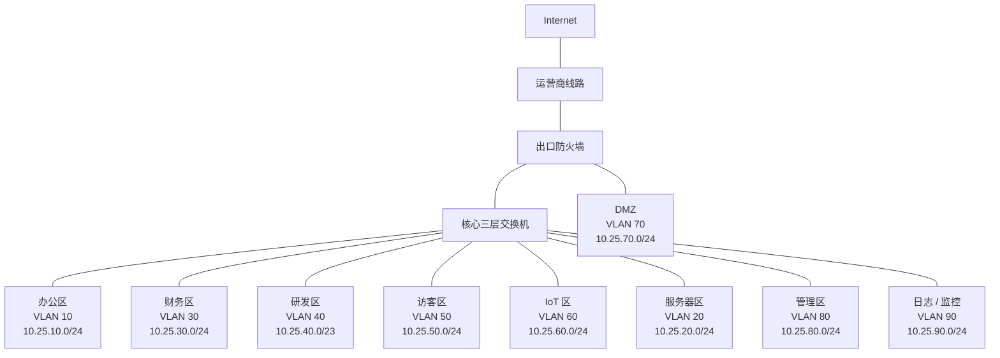
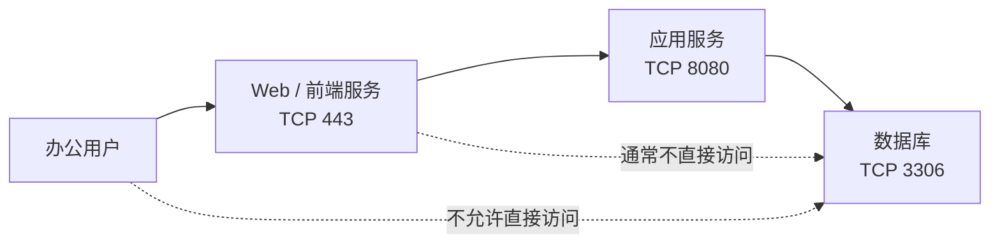
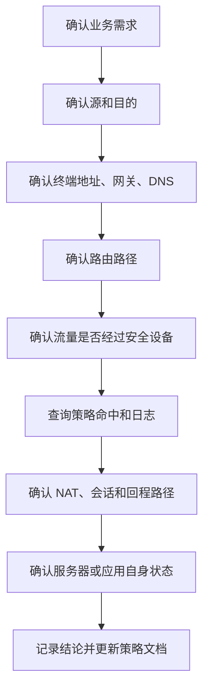

# 第 25 章：网络安全基础

## 25.1 本章学习目标

读完本章后，你应该能够：

- 理解网络安全不是单独买一台安全设备，而是围绕资产、身份、边界、策略、日志和流程建立持续控制能力。
- 解释机密性、完整性、可用性这三个安全目标，以及它们在企业网络中的具体含义。
- 区分资产、威胁、漏洞、风险、攻击面、安全域、最小权限和纵深防御等基础概念。
- 看懂办公区、服务器区、DMZ、访客区、IoT 区、管理区和互联网出口之间的安全边界。
- 能够把 VLAN、路由、防火墙、ACL、NAT、VPN、无线认证、日志审计和设备管理纳入同一个安全设计思路。
- 能够为中型企业规划基础安全分区、地址段、访问策略、管理策略和日志要求。
- 掌握常见二层安全、三层访问控制、管理面加固、无线安全、互联网出口安全和服务器区安全的基础做法。
- 能够按“资产 -> 路径 -> 身份 -> 策略 -> 日志 -> 终端和服务器”的顺序排查常见安全访问问题。

前面章节已经学习了交换、路由、防火墙、NAT、VPN、无线和企业网络架构。本章开始进入“网络安全与运维”部分。

对零基础读者来说，网络安全容易被理解成：

```text
防火墙拦不拦？
有没有杀毒软件？
密码复杂不复杂？
```

这些都属于安全，但不是全部。企业网络安全更像一套约束和验证机制：

```text
先知道要保护什么，再决定谁可以访问，经过哪里访问，使用什么协议访问，如何记录，异常时如何发现和处置。
```

可以先记住一句话：

```text
网络安全的核心，不是让所有流量都不通，而是让必要业务在可识别、可控制、可追踪的前提下连通。
```

如果只追求“不通”，业务无法运行；如果只追求“都通”，风险会失控。网络工程师要做的是在业务可用和安全控制之间建立清晰边界。

## 25.2 网络安全到底保护什么

网络安全首先保护的是企业业务，而不是设备本身。交换机、防火墙、无线 AP、服务器、终端、账号和日志都是保护业务的手段或对象。

企业里常见需要保护的对象包括：

| 保护对象 | 示例 | 为什么重要 |
| --- | --- | --- |
| 业务系统 | ERP、OA、CRM、财务系统、生产系统 | 影响公司日常运营 |
| 数据 | 客户资料、合同、源代码、订单、财务数据 | 泄露或篡改会造成法律、商业和信誉风险 |
| 账号 | 域账号、VPN 账号、管理员账号、数据库账号 | 账号被盗后攻击者可能获得合法身份 |
| 终端 | 员工电脑、手机、打印机、IoT 设备 | 终端是最常见的攻击入口之一 |
| 网络设备 | 核心交换机、防火墙、路由器、AC、AP | 被控制后可能影响全网转发和策略 |
| 管理平台 | 堡垒机、监控系统、日志平台、自动化平台 | 权限高，能集中管理大量设备 |
| 网络出口 | 互联网出口、VPN、专线、云连接 | 是内外网流量交界处 |

### 三个基本安全目标

网络安全常用三个目标来描述，分别是机密性、完整性和可用性。

| 安全目标 | 含义 | 企业网络中的例子 | 典型破坏方式 |
| --- | --- | --- | --- |
| 机密性 | 不该看到的人看不到 | 访客不能访问财务系统，普通员工不能抓取服务器备份流量 | 数据泄露、账号盗用、越权访问 |
| 完整性 | 数据和配置不被非法篡改 | 路由配置、DNS 记录、防火墙策略不能被未授权修改 | 篡改配置、DNS 劫持、恶意脚本修改数据 |
| 可用性 | 业务在需要时可用 | 出口、核心、服务器区、无线认证和 DHCP 持续可用 | DDoS、环路、设备故障、恶意加密勒索 |

初学者容易只关注机密性，例如“不要泄露数据”。但企业网络中，可用性同样关键。一个核心交换机配置错误、一个环路、一个 DHCP 地址池耗尽、一个防火墙策略误删，都可能让业务中断。安全不是只防攻击者，也包括降低误操作和故障扩大带来的影响。

### 安全不是单点功能

下面这些问题都属于网络安全范围：

- 访客无线是否能访问内网。
- 员工电脑是否可以直接访问数据库。
- 服务器管理口是否暴露在办公网。
- 防火墙策略是否长期保留过宽的 `any any`。
- 离职员工 VPN 账号是否及时禁用。
- 交换机管理口是否只允许堡垒机登录。
- 无线共享密码泄露后是否能追踪具体人员。
- 服务器区是否记录了访问日志。
- 设备配置是否定期备份。
- 安全设备告警是否有人处理。

如果这些问题没有制度化设计，企业看起来“网络能用”，但风险已经在积累。

## 25.3 基础安全概念

学习网络安全时，先把几个术语理解清楚，后面看方案和策略会容易很多。

### 资产

资产是企业需要保护的对象。资产不一定是有形设备，也可以是账号、数据、配置、域名、证书、日志和网络地址段。

例如：

| 资产类型 | 示例 |
| --- | --- |
| 网络资产 | 核心交换机、防火墙、出口路由器、无线控制器 |
| 系统资产 | AD、DNS、DHCP、数据库、文件服务器 |
| 数据资产 | 财务数据、客户资料、研发代码、生产报表 |
| 身份资产 | 员工账号、管理员账号、VPN 账号、API 密钥 |
| 配置资产 | 防火墙策略、路由表、VLAN 规划、证书配置 |

安全设计的第一步不是写策略，而是识别资产：

```text
不知道有哪些资产，就不知道要保护谁；
不知道资产在哪里，就不知道边界在哪里；
不知道资产价值和风险，就不知道策略应该多严格。
```

### 威胁、漏洞和风险

这三个词经常一起出现，但含义不同。

| 概念 | 含义 | 示例 |
| --- | --- | --- |
| 威胁 | 可能造成损害的人、行为或事件 | 钓鱼邮件、恶意软件、外部扫描、内部误操作 |
| 漏洞 | 系统或管理上的弱点 | 弱密码、未打补丁、开放不必要端口、策略过宽 |
| 风险 | 威胁利用漏洞后造成损失的可能性和影响 | 访客网可访问服务器，导致服务器被扫描和攻击 |

可以用一个例子理解：

```text
资产：财务服务器。
漏洞：办公网所有终端都能访问财务服务器的管理端口。
威胁：某台办公电脑中毒后扫描内网。
风险：攻击者通过办公电脑尝试登录财务服务器，造成数据泄露或业务中断。
```

网络安全不是把所有威胁都消灭，而是通过减少漏洞、缩小暴露面、增加检测和响应能力来降低风险。

### 攻击面

攻击面是攻击者可以尝试进入或影响系统的入口集合。

常见攻击面包括：

- 暴露到互联网的服务器端口。
- VPN 登录入口。
- 无线 SSID。
- 员工终端。
- 服务器管理端口。
- 网络设备管理地址。
- 远程桌面、SSH、Telnet、数据库端口。
- 供应商维护账号。
- 云平台控制台。

攻击面越大，越难防守。安全设计要尽量做到：

```text
不需要暴露的服务不要暴露；
必须暴露的服务限制来源、身份、协议和日志；
高权限入口必须加强认证和审计。
```

### 安全域

安全域是安全级别、业务用途或访问权限相近的一组网络或系统。把不同安全域分开，是企业网络安全的基础。

常见安全域如下：

| 安全域 | 常见对象 | 安全要求 |
| --- | --- | --- |
| 办公网 | 员工电脑、办公打印机 | 可访问办公系统，限制访问敏感服务器 |
| 服务器区 | 应用服务器、文件服务器、数据库 | 只开放必要业务端口 |
| DMZ | 对公网发布的 Web、邮件、VPN 网关 | 可被公网访问指定服务，但不能直接进入内网 |
| 访客区 | 访客手机、临时电脑 | 只允许访问互联网 |
| IoT 区 | 门禁、摄像头、投屏、传感器 | 只允许访问指定平台或服务器 |
| 管理区 | 堡垒机、网管、日志、备份系统 | 只允许运维人员和管理终端访问 |
| 互联网 | 外部网络 | 默认不可信 |

安全域不是只靠 VLAN 名字实现。真正有效的安全域至少需要同时具备：

- 独立地址范围。
- 明确网关和路由路径。
- 访问控制策略。
- 日志和审计。
- 管理责任人。

### 最小权限

最小权限是指只授予完成工作所必需的访问权限，不额外放开。

例如：

```text
财务员工需要访问财务 Web 系统 TCP 443；
不代表财务员工需要访问财务服务器 SSH、RDP、数据库端口和管理口。
```

网络策略写得越宽，短期越省事，长期越危险。常见过宽策略包括：

| 过宽策略 | 风险 |
| --- | --- |
| 办公网到服务器区 `any any allow` | 任意办公终端可扫描和攻击服务器 |
| 访客网允许访问内网私有地址 | 访客终端可能接触内部资产 |
| VPN 用户接入后等同内网全权限 | 账号被盗后影响范围大 |
| 设备管理地址允许所有办公网访问 | 管理面暴露给大量终端 |
| 临时放行后长期不回收 | 风险长期存在且没人记得原因 |

### 纵深防御

纵深防御是指不要把安全全部压在一个控制点上，而是在多层位置设置不同控制。

例如保护数据库，不应该只依赖数据库密码：


如果其中一层失效，其他层仍然能降低风险。比如某台办公电脑中毒，如果 VLAN 和防火墙限制得当，它仍然不能直接访问数据库端口；如果账号被盗，堡垒机、多因素认证和日志审计仍然可能发现异常。

## 25.4 企业网络中的安全边界

安全边界是不同信任级别网络之间的交界处。网络工程师必须知道流量经过哪里控制，否则策略就会写错位置。

一个中型企业的安全逻辑拓扑可以简化为：



这张图里至少有以下边界：

| 边界 | 控制目标 |
| --- | --- |
| 内网到互联网 | 控制上网、NAT、恶意访问和日志 |
| 互联网到 DMZ | 只发布必要公网服务 |
| DMZ 到内网 | 防止公网服务被攻陷后横向进入内网 |
| 办公网到服务器区 | 只允许访问业务端口 |
| 访客区到内网 | 默认禁止 |
| IoT 区到办公网和服务器区 | 默认禁止，只放行必要平台 |
| 管理区到网络设备和服务器 | 只允许授权运维访问 |
| 研发区到生产服务器 | 按业务和审批放行 |

### 路由边界和安全边界不一定相同

初学者容易认为：

```text
只要两个网段在不同 VLAN，就已经安全隔离。
```

这不一定成立。如果两个 VLAN 的网关都在同一台核心三层交换机上，并且没有 ACL 或防火墙控制，那么两个 VLAN 默认可以互通。

例如：

```text
VLAN 10 办公网：10.25.10.0/24，网关 10.25.10.1
VLAN 20 服务器区：10.25.20.0/24，网关 10.25.20.1
```

如果这两个网关都在核心交换机上，核心交换机有直连路由：

```text
10.25.10.0/24 is directly connected
10.25.20.0/24 is directly connected
```

那么办公网访问服务器区只需要三层转发。除非配置 ACL、策略路由引流到防火墙，或者把服务器区网关放在防火墙上，否则 VLAN 本身不会自动阻断三层访问。

可以这样区分：

| 概念 | 解决的问题 | 是否等于安全控制 |
| --- | --- | --- |
| VLAN | 二层隔离广播域 | 不等于完整安全控制 |
| 路由 | 不同网段之间可达 | 不判断业务是否被授权 |
| ACL | 基于条件允许或拒绝 | 可以作为基础安全控制 |
| 防火墙策略 | 基于区域、地址、端口、应用、用户控制 | 企业常用安全边界 |
| 日志审计 | 记录访问和操作 | 帮助追踪和复盘 |

### 默认拒绝和按需放行

安全边界上常见原则是：

```text
默认拒绝，按需放行。
```

这句话的含义是：如果一条访问没有明确业务理由、源、目的、端口、责任人和有效期，就不应该默认允许。

但“默认拒绝”不能写成口号。实际工程中需要配套：

- 业务访问清单。
- 地址对象和服务对象。
- 策略命名规范。
- 变更审批记录。
- 验证方法。
- 日志记录。
- 定期复核。

否则策略会逐渐变成大量临时规则，最终没人敢删，也没人说得清。

## 25.5 从 VLAN 到安全策略

VLAN 是企业网络分区的基础，但安全策略才决定“谁能访问谁”。

### 常见安全分区规划

假设某企业使用 `10.25.0.0/16`，可以规划如下：

| 区域 | VLAN | 网段 | 网关 | 说明 |
| --- | ---: | --- | --- | --- |
| 办公网 | 10 | 10.25.10.0/24 | 10.25.10.1 | 普通员工电脑 |
| 服务器区 | 20 | 10.25.20.0/24 | 10.25.20.1 | OA、ERP、文件服务器 |
| 财务区 | 30 | 10.25.30.0/24 | 10.25.30.1 | 财务部门终端 |
| 研发区 | 40 | 10.25.40.0/23 | 10.25.40.1 | 研发办公和测试终端 |
| 访客区 | 50 | 10.25.50.0/24 | 10.25.50.1 | 访客无线 |
| IoT 区 | 60 | 10.25.60.0/24 | 10.25.60.1 | 门禁、打印、投屏、传感器 |
| DMZ | 70 | 10.25.70.0/24 | 10.25.70.1 | 对公网发布服务 |
| 管理区 | 80 | 10.25.80.0/24 | 10.25.80.1 | 堡垒机、运维终端 |
| 安全与日志区 | 90 | 10.25.90.0/24 | 10.25.90.1 | 日志、监控、NAC、漏洞扫描 |

这个表格只是网络分区，不是完整安全设计。接下来还要定义访问关系。

### 访问关系规划

访问策略应围绕业务而不是围绕设备临时添加。下面是一个基础策略矩阵：

| 源区域 | 目的区域 | 默认策略 | 常见放行 |
| --- | --- | --- | --- |
| 办公网 | 互联网 | 允许但记录 | DNS、HTTP、HTTPS、必要 SaaS |
| 办公网 | 服务器区 | 按需放行 | OA/ERP Web、文件服务、打印服务 |
| 办公网 | 管理区 | 默认拒绝 | 无 |
| 财务区 | 服务器区 | 按需放行 | 财务系统、文件服务器 |
| 研发区 | 服务器区 | 按需放行 | 代码仓库、测试平台 |
| 访客区 | 互联网 | 允许但限速和记录 | DNS、HTTP、HTTPS |
| 访客区 | 内网 | 默认拒绝 | 通常无 |
| IoT 区 | 服务器区 | 严格按需 | IoT 平台、打印服务器、投屏服务 |
| DMZ | 服务器区 | 严格按需 | 反向代理到应用服务 |
| 管理区 | 网络设备 | 按身份放行 | SSH、HTTPS、SNMP、日志采集 |
| 安全与日志区 | 全网资产 | 按工具放行 | 日志接收、监控探测、漏洞扫描 |

### 策略要写清五个要素

一条合格的安全策略至少要说清：

| 要素 | 示例 |
| --- | --- |
| 源 | 财务区 `10.25.30.0/24` |
| 目的 | 财务系统 `10.25.20.15` |
| 服务 | TCP 443 |
| 动作 | 允许 |
| 日志 | 记录命中日志 |

更完整的策略还应该有：

- 业务说明。
- 申请人或责任部门。
- 生效时间和到期时间。
- 变更单编号。
- 验证方法。
- 回退方案。

示例策略表：

| 策略名称 | 源 | 目的 | 服务 | 动作 | 日志 | 说明 |
| --- | --- | --- | --- | --- | --- | --- |
| `allow-finance-to-finapp` | 10.25.30.0/24 | 10.25.20.15 | TCP 443 | 允许 | 开启 | 财务访问财务系统 |
| `allow-office-to-oa` | 10.25.10.0/24 | 10.25.20.20 | TCP 443 | 允许 | 开启 | 办公网访问 OA |
| `deny-guest-to-private` | 10.25.50.0/24 | 10.25.0.0/16 | any | 拒绝 | 开启 | 访客禁止访问内网 |
| `allow-guest-to-internet` | 10.25.50.0/24 | Internet | TCP 80, 443 / UDP 53 | 允许 | 开启 | 访客上网 |
| `allow-mgmt-to-network-devices` | 10.25.80.10 | Network-Devices | SSH, HTTPS | 允许 | 开启 | 堡垒机管理网络设备 |
| `deny-office-to-device-mgmt` | 10.25.10.0/24 | Network-Devices | any | 拒绝 | 开启 | 普通办公终端禁止管理设备 |

注意：策略顺序很重要。很多防火墙和 ACL 按从上到下匹配，命中后停止。拒绝策略和允许策略的顺序放错，会导致业务不通或风险放开。

## 25.6 典型安全控制点

企业网络安全控制不是只在防火墙上完成。不同层面有不同控制点。

### 二层接入安全

二层接入安全关注终端接入交换机和 VLAN 的位置。常见风险包括：

- 私接交换机或路由器。
- 私接无线设备。
- 伪造 DHCP 服务器。
- ARP 欺骗。
- 环路。
- 非授权终端接入办公网。

常见控制手段：

| 控制手段 | 作用 | 适用场景 |
| --- | --- | --- |
| 端口描述和端口规划 | 明确端口连接对象 | 所有接入交换机 |
| 未使用端口关闭 | 减少非法接入入口 | 空闲办公区、机房 |
| 端口安全 | 限制 MAC 数量或绑定 MAC | 固定终端较多的场景 |
| 802.1X 有线准入 | 按用户或设备认证入网 | 安全要求较高的办公网 |
| DHCP Snooping | 阻断伪造 DHCP 服务器 | 接入层交换机 |
| Dynamic ARP Inspection | 缓解 ARP 欺骗 | 配合 DHCP Snooping |
| BPDU Guard | 防止接入口接入交换设备引发 STP 异常 | 用户接入口 |
| Storm Control | 限制广播、未知单播、组播风暴 | 接入层 |

二层安全的目标不是让接入口复杂难用，而是减少低级故障和非法接入扩大影响。第 6 章到第 9 章学习的交换机、VLAN、STP 和链路聚合，在安全设计中都会再次出现。

### 三层和边界安全

三层和边界安全关注不同网段之间是否允许互通。常见控制手段包括：

- 三层交换机 ACL。
- 防火墙安全策略。
- 路由控制。
- NAT 控制。
- VPN 访问控制。
- 安全区域划分。

ACL 适合做简单、明确、靠近源头的过滤。例如禁止访客 VLAN 访问内网地址、限制某个网段访问设备管理地址。防火墙更适合做跨安全域、需要日志、会话、应用识别和集中审计的访问控制。

不要把 ACL 和防火墙理解成互相替代。它们可以配合：

```text
接入层或核心 ACL：拦截明显不该出现的流量。
防火墙策略：控制跨安全域业务访问，并记录审计日志。
```

### 管理面安全

管理面是网络安全中最容易被低估的部分。网络设备的管理权限非常高，如果攻击者能登录核心交换机或防火墙，后果可能比控制一台普通服务器更严重。

管理面安全建议：

| 项目 | 建议 |
| --- | --- |
| 管理入口 | 只允许管理区、堡垒机或指定运维地址访问 |
| 管理协议 | 使用 SSH、HTTPS，禁用 Telnet 和不必要的 HTTP |
| 身份认证 | 使用 AAA、RADIUS/TACACS+ 或统一身份认证 |
| 权限分级 | 区分只读、运维、管理员权限 |
| 登录保护 | 限制失败次数，记录登录日志 |
| SNMP | 使用 SNMPv3 或限制 SNMP 来源和 community 权限 |
| NTP | 统一时间，保证日志时间可信 |
| Syslog | 发送到日志平台，避免设备本地日志丢失 |
| 配置备份 | 定期备份并保留变更记录 |

管理面安全的基本原则是：

```text
普通办公终端不应该直接管理网络设备；
管理员也应该通过可审计的路径管理设备。
```

### 无线安全

无线安全在第 23 章和第 24 章已经展开。本章只从安全基础角度总结。

无线比有线更容易被外部接触，因为信号会传播到办公室之外。无线安全需要关注：

- 员工无线是否使用 802.1X 或证书认证。
- 共享密码是否长期不变。
- 访客无线是否和内网隔离。
- IoT 无线是否独立分区。
- 是否记录用户、终端、IP、上线时间。
- 是否开启访客隔离。
- 无线控制器和 AP 管理地址是否被保护。

常见错误包括：

| 错误做法 | 风险 |
| --- | --- |
| 员工和访客共用一个 SSID | 访客可能获得员工网络权限 |
| 多年不更换共享密码 | 离职人员和外部人员可能继续接入 |
| IoT 设备和办公电脑同 VLAN | IoT 被攻击后可扫描办公终端 |
| AP 管理 VLAN 暴露给普通用户 | AP 或 AC 管理面被攻击 |
| 只看无线信号不看认证和策略 | 用户能连上但权限不可控 |

### 服务器区安全

服务器区承载业务系统，安全设计应关注东西向访问控制，也就是服务器之间、终端到服务器之间的访问。

基础原则：

- 服务器区不要和办公网直接全互通。
- 数据库不要直接暴露给普通终端或互联网。
- Web、应用、数据库尽量分层控制。
- 管理端口只允许管理区或堡垒机访问。
- 服务器访问互联网应按需放行。
- 服务器日志应集中采集。

一个简单三层应用访问关系：



如果用户只需要访问 Web 页面，就只放行用户到 Web 的 TCP 443。不要因为“业务系统在服务器区”就把用户到整个服务器区全部放开。

### 互联网出口安全

互联网出口是企业最重要的边界之一。它既承载内网用户上网，也可能发布公网服务。

出口安全需要关注：

- 内网访问互联网的源 NAT 和安全策略。
- 互联网访问 DMZ 的目的 NAT 和策略。
- 恶意域名、恶意 IP、可疑应用和异常流量。
- VPN 远程接入。
- 多运营商出口和故障切换。
- 出口日志、流量报表和告警。

常见错误包括：

| 错误做法 | 风险 |
| --- | --- |
| 内网所有网段都允许任意上网 | IoT、服务器和管理区可能访问不必要外部地址 |
| 公网端口发布后不限制源和服务 | 服务器暴露面过大 |
| VPN 用户接入后默认全内网权限 | 账号被盗后影响范围过大 |
| 只做 NAT 不记录日志 | 事后无法追踪访问来源 |
| 防火墙策略长期不复核 | 临时策略变成永久风险 |

## 25.7 身份、认证与授权

网络安全不能只看 IP 地址。IP 地址会变化，终端会移动，用户会远程接入，云服务和无线认证也会引入更多动态因素。身份变得越来越重要。

### 身份是什么

网络中的身份可以包括：

| 身份类型 | 示例 |
| --- | --- |
| 用户身份 | 域账号、邮箱账号、VPN 账号 |
| 设备身份 | MAC 地址、证书、终端序列号 |
| 管理员身份 | 网络管理员、系统管理员、安全管理员 |
| 应用身份 | API Key、服务账号、应用证书 |
| 位置身份 | 办公网、分支、VPN、无线、云网络 |

不同身份可信度不同。单独依赖 MAC 地址不可靠，因为 MAC 可以伪造；单独依赖 IP 地址也不够，因为 DHCP 会变化。更可靠的做法是结合用户认证、设备认证、来源区域、终端状态和访问日志。

### 认证、授权和审计

三个概念要分清：

| 概念 | 解决的问题 | 例子 |
| --- | --- | --- |
| 认证 | 你是谁 | 用户输入账号密码，终端使用证书，管理员登录堡垒机 |
| 授权 | 你能做什么 | 财务用户能访问财务系统，普通用户不能管理交换机 |
| 审计 | 你做了什么 | 记录登录时间、来源 IP、访问对象、命令和结果 |

可以这样理解：

```text
认证解决身份；
授权解决权限；
审计解决追踪。
```

只认证不授权，会出现“谁都能进来，但权限太大”。只授权不审计，会出现“出了问题不知道是谁做的”。只审计不认证，日志里只有 IP 和 MAC，难以对应到具体人员。

### 账号生命周期

企业安全中大量问题来自账号生命周期管理不完整。例如：

- 新员工入职后权限过大。
- 员工转岗后仍保留原部门权限。
- 离职员工账号未禁用。
- 临时供应商账号长期有效。
- 多人共用管理员账号。
- 设备本地默认账号未修改。

网络工程师不一定负责所有账号系统，但必须在网络方案中考虑：

- VPN 账号来自哪里。
- 无线 802.1X 和哪个身份平台联动。
- 管理设备使用本地账号还是 AAA。
- 管理员操作是否能追踪到个人。
- 供应商远程维护是否有审批、时间窗口和日志。

## 25.8 日志、监控与安全可视化

没有日志的安全控制很难持续运行。策略命中、认证失败、VPN 登录、设备配置变更、端口异常、流量突增，都应该能被记录和查看。

### 为什么日志重要

日志至少有四个作用：

| 作用 | 说明 |
| --- | --- |
| 故障排查 | 判断访问是否被策略阻断、是否认证失败、是否路由异常 |
| 安全检测 | 发现扫描、暴力破解、异常外联、恶意域名访问 |
| 审计追踪 | 追踪谁在什么时候访问了什么系统 |
| 复盘改进 | 分析策略是否过宽、告警是否有效、流程是否需要调整 |

举例：用户说“我访问不了财务系统”。如果没有日志，只能猜测网络、策略、系统、账号哪个环节有问题。如果有日志，可以逐步确认：

- 用户是否成功接入网络。
- DHCP 是否分配了地址。
- DNS 是否解析正确。
- 防火墙是否有策略拒绝日志。
- 服务器是否收到请求。
- 应用是否返回错误。

### 常见日志来源

| 日志来源 | 关注内容 |
| --- | --- |
| 防火墙 | 安全策略命中、NAT、VPN、威胁日志、会话日志 |
| 交换机 | 端口 up/down、STP、环路、MAC 漂移、认证失败 |
| 无线控制器 | 用户上线下线、认证失败、漫游、AP 状态 |
| 路由器 | 路由邻居变化、接口状态、链路质量 |
| DHCP | 地址分配、地址池耗尽、冲突 |
| DNS | 域名解析、恶意域名访问、解析失败 |
| 服务器 | 登录、服务异常、应用错误、安全事件 |
| 堡垒机 | 运维登录、命令记录、文件传输 |
| 终端安全 | 病毒告警、漏洞、异常进程 |

### 日志平台的基础要求

日志平台或监控平台至少应满足：

- 设备时间统一，使用可靠 NTP。
- 关键设备日志集中发送。
- 能按源 IP、目的 IP、用户、时间、策略名称查询。
- 关键告警有人接收和处理。
- 日志保留周期符合企业要求。
- 管理员操作有记录。

时间同步非常重要。如果防火墙、交换机、服务器时间不一致，故障复盘时很难对齐事件顺序。

## 25.9 安全设计示例：中型企业基础安全方案

下面用一个中型企业示例，把本章概念串起来。

### 场景说明

某公司总部约 300 名员工，有办公区、财务区、研发区、服务器区、访客无线、IoT 设备、DMZ 对外网站和管理区。

业务需求如下：

- 所有员工需要访问 OA 系统和互联网。
- 财务员工需要访问财务系统。
- 研发员工需要访问代码仓库和测试平台。
- 访客只能访问互联网。
- IoT 设备只允许访问 IoT 平台和指定打印服务。
- 对外网站放在 DMZ，公网用户只能访问 HTTPS。
- 数据库只允许应用服务器访问。
- 网络设备只能由堡垒机管理。
- 所有边界访问需要记录日志。

### 地址和区域规划

| 区域 | VLAN | 网段 | 关键资产 |
| --- | ---: | --- | --- |
| 办公网 | 10 | 10.25.10.0/24 | 员工电脑 |
| 服务器区 | 20 | 10.25.20.0/24 | OA、财务系统、代码仓库、数据库 |
| 财务区 | 30 | 10.25.30.0/24 | 财务电脑 |
| 研发区 | 40 | 10.25.40.0/23 | 研发电脑、测试终端 |
| 访客区 | 50 | 10.25.50.0/24 | 访客无线终端 |
| IoT 区 | 60 | 10.25.60.0/24 | 打印、投屏、门禁 |
| DMZ | 70 | 10.25.70.0/24 | 对外 Web |
| 管理区 | 80 | 10.25.80.0/24 | 堡垒机、运维终端 |
| 安全与日志区 | 90 | 10.25.90.0/24 | 日志平台、监控平台 |

关键服务器：

| 系统 | IP 地址 | 端口 | 说明 |
| --- | --- | --- | --- |
| OA | 10.25.20.20 | TCP 443 | 员工办公系统 |
| 财务系统 | 10.25.20.30 | TCP 443 | 财务业务系统 |
| 代码仓库 | 10.25.20.40 | TCP 443, 22 | 研发代码平台 |
| 数据库 | 10.25.20.50 | TCP 3306 | 只给应用服务器访问 |
| IoT 平台 | 10.25.20.60 | TCP 443 | IoT 管理 |
| DMZ Web | 10.25.70.10 | TCP 443 | 对公网发布 |
| 堡垒机 | 10.25.80.10 | TCP 22, 443 | 管理入口 |
| 日志平台 | 10.25.90.10 | UDP 514, TCP 6514 | 日志接收 |

### 基础访问策略

| 策略名称 | 源 | 目的 | 服务 | 动作 | 日志 |
| --- | --- | --- | --- | --- | --- |
| `allow-office-to-oa` | 10.25.10.0/24 | 10.25.20.20 | TCP 443 | 允许 | 开启 |
| `allow-office-to-internet` | 10.25.10.0/24 | Internet | DNS, HTTP, HTTPS | 允许 | 开启 |
| `allow-finance-to-finapp` | 10.25.30.0/24 | 10.25.20.30 | TCP 443 | 允许 | 开启 |
| `allow-rd-to-code` | 10.25.40.0/23 | 10.25.20.40 | TCP 443, 22 | 允许 | 开启 |
| `allow-guest-to-internet` | 10.25.50.0/24 | Internet | DNS, HTTP, HTTPS | 允许 | 开启 |
| `deny-guest-to-private` | 10.25.50.0/24 | 10.25.0.0/16 | any | 拒绝 | 开启 |
| `allow-iot-to-platform` | 10.25.60.0/24 | 10.25.20.60 | TCP 443 | 允许 | 开启 |
| `allow-internet-to-dmz-web` | Internet | 10.25.70.10 | TCP 443 | 允许 | 开启 |
| `allow-dmz-web-to-app` | 10.25.70.10 | 10.25.20.20 | TCP 443 | 允许 | 开启 |
| `allow-bastion-to-devices` | 10.25.80.10 | Network-Devices | SSH, HTTPS | 允许 | 开启 |
| `deny-office-to-network-devices` | 10.25.10.0/24 | Network-Devices | any | 拒绝 | 开启 |

策略设计时要注意：

- 拒绝访客访问内网的策略应放在访客上网允许策略之前，或者通过目的对象清楚区分。
- 对公网发布服务时，公网用户访问的是公网地址，防火墙通常还要做目的 NAT 到 `10.25.70.10`。
- 数据库没有出现在普通用户策略里，因为用户不应该直接访问数据库。
- 堡垒机能管理网络设备，不代表整个管理区都能管理设备。
- 安全与日志区接收日志，不代表它可以任意访问所有资产；扫描和探测应单独授权。

### 管理和日志要求

该企业可以制定以下基础要求：

| 项目 | 要求 |
| --- | --- |
| 网络设备管理 | 只允许堡垒机 `10.25.80.10` 通过 SSH/HTTPS 管理 |
| 管理员认证 | 使用个人账号，不共用 `admin` |
| 时间同步 | 所有网络设备、防火墙、服务器使用统一 NTP |
| 日志上送 | 防火墙、核心交换机、无线控制器、VPN、堡垒机发送到日志平台 |
| 配置备份 | 核心设备和防火墙每次变更后备份 |
| 策略复核 | 每季度检查长期未命中的策略和临时策略 |
| 账号复核 | 每月核对 VPN、无线、堡垒机和设备管理员账号 |

### 上线验证表

| 验证项 | 验证方法 | 预期结果 |
| --- | --- | --- |
| 办公网访问 OA | 办公网终端访问 `https://10.25.20.20` | 成功 |
| 办公网访问财务系统 | 办公网终端访问 `https://10.25.20.30` | 按策略应拒绝或无权限 |
| 财务区访问财务系统 | 财务终端访问 `https://10.25.20.30` | 成功 |
| 访客访问互联网 | 访客终端解析域名并访问 HTTPS 网站 | 成功 |
| 访客访问内网 | 访客终端访问 `10.25.20.20` | 被拒绝并有日志 |
| IoT 访问平台 | IoT 终端访问 `10.25.20.60:443` | 成功 |
| IoT 访问办公网 | IoT 终端访问 `10.25.10.0/24` 任意主机 | 被拒绝 |
| 公网访问 DMZ Web | 从外部访问发布的 HTTPS 服务 | 成功 |
| 公网访问数据库 | 从外部访问数据库端口 | 被拒绝 |
| 堡垒机管理交换机 | 从 `10.25.80.10` SSH 到交换机 | 成功并记录日志 |
| 办公网管理交换机 | 从办公电脑 SSH 到交换机 | 被拒绝 |
| 日志查询 | 按源 IP、目的 IP、策略名称查询 | 可查到记录 |

## 25.10 常见安全误区

### 误区一：有防火墙就安全

防火墙只是边界控制设备。如果策略写成 `any any allow`，或者服务器区和办公网绕过防火墙直接互通，防火墙就无法发挥应有作用。

正确理解：

```text
防火墙的价值取决于拓扑路径、策略质量、日志审计和持续维护。
```

### 误区二：VLAN 已经隔离，所以不用策略

VLAN 隔离的是二层广播域，不自动阻断三层路由。只要三层网关有路由，两个 VLAN 就可能互通。

正确做法：

- 用 VLAN 划分广播域和基础区域。
- 用 ACL 或防火墙策略控制跨区域访问。
- 用日志验证策略是否生效。

### 误区三：内网都是可信的

现代企业不能默认内网可信。办公终端可能中毒，访客设备可能接错网络，IoT 设备可能存在漏洞，VPN 账号可能被盗。

正确做法：

- 按区域和身份授权。
- 管理入口集中到堡垒机。
- 服务器区按业务端口放行。
- IoT、访客、办公、管理分区隔离。

### 误区四：安全策略越多越安全

策略数量多不代表安全。大量重复、过期、命名混乱、对象不清的策略会增加误配风险。

更好的策略应该：

- 命名清晰。
- 源、目的、服务明确。
- 有业务说明。
- 有日志。
- 定期复核。
- 临时策略有到期时间。

### 误区五：只关注外部攻击，忽略误操作

网络中断很多时候不是外部攻击，而是误操作、环路、地址冲突、策略误删、证书过期、DHCP 地址池耗尽、路由变更错误。

安全设计也要降低误操作影响：

- 配置变更前备份。
- 重大变更有回退方案。
- 高危命令双人复核。
- 关键设备双机或冗余。
- 变更后按验证表检查。

## 25.11 常见故障与排查

网络安全相关故障通常表现为“访问不通”或“被不该访问的人访问到了”。排查时要避免直接改策略，应先确认路径和证据。

### 排查思路

可以按以下流程：



### 故障一：访客无线能访问内网

现象：

```text
访客连接 Corp-Guest 后，可以 ping 通或访问 10.25.20.20。
```

可能原因：

| 原因 | 验证方法 | 修复思路 |
| --- | --- | --- |
| 访客 SSID 绑定到错误 VLAN | 查看无线控制器 SSID 到 VLAN 映射 | 修正 SSID VLAN |
| 访客 VLAN 网关在核心交换机且没有 ACL | 查看核心交换机 VLANIF 和 ACL | 添加 ACL 或引流到防火墙 |
| 防火墙拒绝策略顺序错误 | 查看策略命中顺序和日志 | 调整拒绝内网策略位置 |
| 内网地址对象不完整 | 检查 `Enterprise-Private-Networks` 对象 | 补全内网网段 |
| 访客隔离未开启 | 同一 SSID 终端互访测试 | 开启访客隔离或二层隔离 |

排查重点：

```text
先确认访客终端到底拿到了哪个 VLAN、哪个 IP、哪个网关，再看跨网段流量在哪里被控制。
```

### 故障二：员工访问业务系统失败

现象：

```text
员工电脑可以上网，但访问 OA 系统 https://10.25.20.20 失败。
```

排查步骤：

1. 确认员工电脑 IP、网关、DNS 是否正确。
2. 确认员工到 OA 地址是否有路由。
3. 确认流量是否经过防火墙或核心 ACL。
4. 查询防火墙是否有拒绝日志。
5. 查询是否命中正确允许策略。
6. 确认服务器防火墙和应用服务是否正常。
7. 确认回程路由是否正确。

常见原因：

| 原因 | 说明 |
| --- | --- |
| 策略缺失 | 办公网到 OA 的 TCP 443 未放行 |
| 地址对象错误 | OA IP 改了，但策略对象未更新 |
| 服务端口变化 | 应用改端口后策略未调整 |
| NAT 误匹配 | 内网访问被错误做了 NAT |
| 回程路径不一致 | 去程经过防火墙，回程绕过防火墙 |
| 服务器自身异常 | 网络通，但应用服务未监听 |

### 故障三：管理员无法登录交换机

现象：

```text
管理员从办公电脑 SSH 到核心交换机失败。
```

这不一定是故障。按本章设计，普通办公网不应该直接管理网络设备。应确认管理员是否通过堡垒机访问。

排查顺序：

| 检查项 | 说明 |
| --- | --- |
| 来源地址 | 是否来自堡垒机或管理区 |
| 设备管理 ACL | 是否只允许 `10.25.80.10` |
| AAA 状态 | RADIUS/TACACS+ 是否正常 |
| 本地账号 | 是否有应急账号，是否符合流程 |
| SSH 服务 | 设备是否开启 SSH，是否禁用 Telnet |
| 日志 | 是否有登录失败或 ACL 拒绝记录 |

不要为了解决一次登录问题，把设备管理 ACL 改成允许整个办公网。

### 故障四：公网服务发布后外部无法访问

现象：

```text
互联网用户访问公司网站失败。
```

排查步骤：

1. 确认公网 DNS 解析到正确公网 IP。
2. 确认运营商线路和公网地址可达。
3. 确认防火墙目的 NAT 是否把公网地址映射到 `10.25.70.10`。
4. 确认外到内安全策略是否放行 TCP 443。
5. 确认 DMZ Web 服务器本地服务监听 TCP 443。
6. 确认 DMZ Web 回程默认网关是否指向防火墙。
7. 查看防火墙会话和日志。

常见错误：

| 错误 | 结果 |
| --- | --- |
| 只配置 NAT，没有安全策略 | 地址转换了但流量被策略拒绝 |
| 只配置策略，没有 NAT | 防火墙不知道公网地址要转到哪个内网服务器 |
| 服务器网关错误 | 请求到达服务器，但回包走错路径 |
| 运营商未放行或 DNS 错误 | 流量没有到达企业防火墙 |

### 故障五：日志查不到访问记录

现象：

```text
用户访问失败，但日志平台查不到记录。
```

可能原因：

| 原因 | 检查方法 |
| --- | --- |
| 流量没有经过该安全设备 | 用路由和抓包确认路径 |
| 策略未开启日志 | 检查策略日志选项 |
| 日志上送异常 | 检查设备到日志平台连通性 |
| 时间不同步 | 检查 NTP 和日志时间 |
| 查询条件错误 | 放宽时间范围、源 IP、目的 IP 查询 |
| 命中隐含拒绝但未记录 | 检查默认拒绝日志配置 |

日志查不到时，不要立刻认为“没有流量”。先确认流量路径和日志配置。

## 25.12 自查清单与练习

### 自查清单

设计或检查一个企业网络安全方案时，可以按以下清单自查：

- 是否列出了关键资产和对应责任人。
- 是否划分了办公、服务器、访客、IoT、DMZ、管理和日志区域。
- 每个区域是否有明确 VLAN、网段、网关和 DHCP 规划。
- 跨区域访问是否有策略矩阵。
- 访客和 IoT 是否默认不能访问内网。
- 服务器管理端口是否只允许管理区或堡垒机访问。
- 防火墙策略是否避免长期 `any any allow`。
- 临时策略是否有到期时间。
- VPN 和无线是否能对应到用户身份。
- 网络设备是否禁用 Telnet 等不安全管理方式。
- SNMP、Syslog、NTP、配置备份是否规范。
- 日志是否能按源、目的、用户、策略和时间查询。
- 重大变更是否有验证表和回退方案。

### 练习一：判断访问是否应该放行

根据本章示例，判断以下访问是否应该放行，并说明原因：

| 访问 | 是否应放行 | 思考方向 |
| --- | --- | --- |
| 访客区 `10.25.50.20` 访问 OA `10.25.20.20:443` | 否 | 访客不访问内网 |
| 办公网 `10.25.10.35` 访问 OA `10.25.20.20:443` | 是 | 员工办公需求 |
| 办公网 `10.25.10.35` 访问数据库 `10.25.20.50:3306` | 否 | 用户不直连数据库 |
| 财务区 `10.25.30.12` 访问财务系统 `10.25.20.30:443` | 是 | 财务业务需求 |
| IoT 区 `10.25.60.30` 访问办公电脑 `10.25.10.50:any` | 否 | IoT 隔离 |
| 堡垒机 `10.25.80.10` 访问核心交换机 SSH | 是 | 授权管理入口 |

### 练习二：补全策略表

某企业新增一台打印服务器 `10.25.20.80`，只允许办公网和财务区访问 TCP 9100，不允许访客和 IoT 直接访问。请写出至少三条策略：

| 策略名称 | 源 | 目的 | 服务 | 动作 |
| --- | --- | --- | --- | --- |
|  |  |  |  |  |
|  |  |  |  |  |
|  |  |  |  |  |

思考要点：

- 是否需要分别放行办公网和财务区。
- 是否需要显式拒绝访客和 IoT。
- 是否开启日志。
- 是否需要限制打印服务器访问互联网。

### 练习三：画出故障路径

用户反馈“研发区无法访问代码仓库 `10.25.20.40`”。请按以下顺序列出你要检查的内容：

1. 源终端地址和网关。
2. 目的服务器地址和端口。
3. DNS 或访问地址是否正确。
4. 路由路径是否经过防火墙。
5. 防火墙策略是否命中。
6. 是否有 NAT 或回程路径异常。
7. 服务器端口是否监听。
8. 日志平台是否有记录。

这个练习的目的不是背答案，而是训练你把“访问失败”拆成多个可验证环节。

## 25.13 本章小结

本章学习了企业网络安全的基础框架。网络安全不是单一设备或单一功能，而是围绕资产、身份、边界、策略、日志和流程建立控制。

需要重点记住：

- 安全的基本目标是机密性、完整性和可用性。
- 资产、威胁、漏洞、风险、攻击面和安全域是理解安全方案的基础词汇。
- VLAN 可以划分网络区域，但不等于完整安全控制。
- 跨区域访问应遵循默认拒绝、按需放行、最小权限和日志审计。
- 访客、IoT、办公、服务器、DMZ、管理区应有清晰边界。
- 管理面安全非常关键，普通办公终端不应直接管理核心设备。
- 日志和时间同步是故障排查、安全审计和事件复盘的基础。
- 安全策略要能被验证、被追踪、被复核，而不是只在设备上存在。

后续第 26 章将进入网络运维基础。安全设计只有落到日常运维中，才能持续发挥作用：策略要复核，账号要清理，日志要查看，配置要备份，告警要处理，变更要验证。网络工程师既要能设计安全边界，也要能长期维护这些边界。
