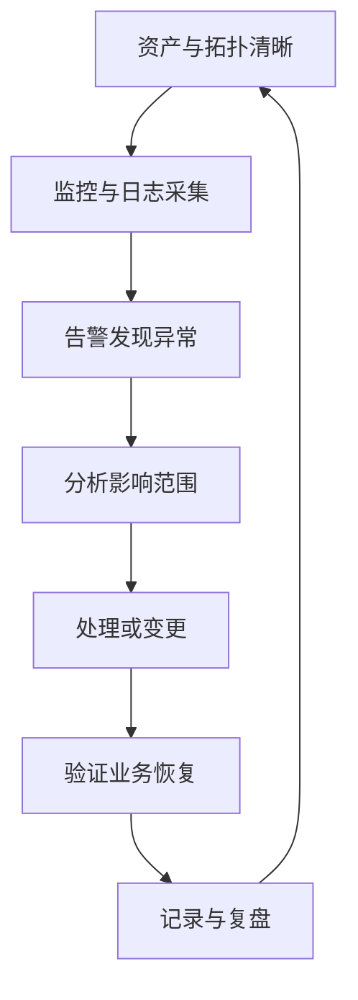
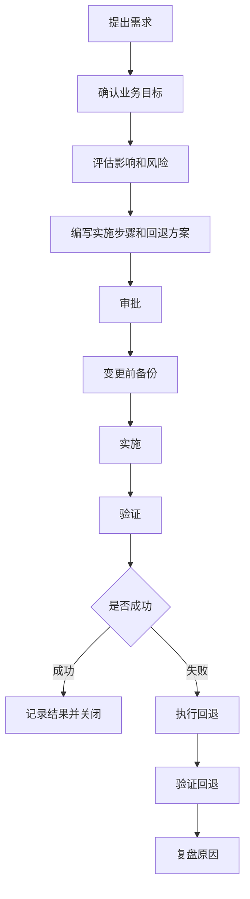
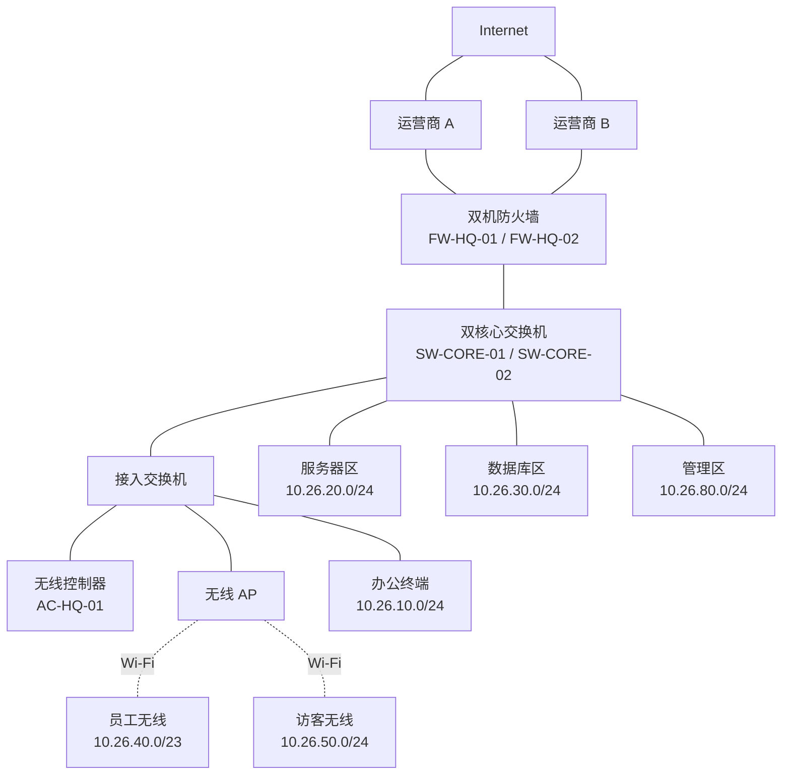
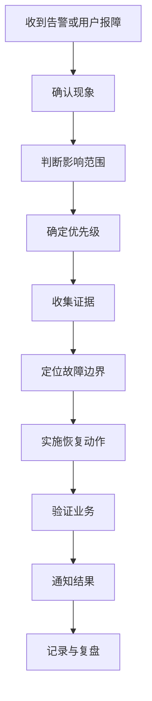

# 第 26 章：网络运维基础

## 26.1 本章学习目标

读完本章后，你应该能够：

- 理解网络运维和网络建设、网络配置、网络排错之间的关系。
- 说清楚网络运维要关注的对象：设备、链路、地址、路由、策略、账号、日志、配置、容量和业务可用性。
- 建立“监控发现问题、变更控制风险、备份保证可恢复、文档帮助交接、复盘持续改进”的运维思维。
- 看懂企业常见运维流程，例如日常巡检、告警处理、变更申请、配置备份、故障升级、应急回退和月度报告。
- 能够为一个中型企业网络设计基础运维台账、监控指标、告警分级、巡检清单和配置备份策略。
- 理解为什么网络工程师不能只会配置命令，还要会记录、验证、回滚、沟通和复盘。
- 能够根据告警和用户反馈，把网络问题拆成可验证的运维任务。
- 为第 27 章“常用排错方法”建立流程基础。

前面章节学习了交换、VLAN、STP、链路聚合、三层交换、路由、防火墙、NAT、VPN、无线、安全和企业架构设计。这些技术解决的是“网络如何建起来”和“业务如何连通”。本章开始进入另一个同样重要的问题：

```text
网络建好以后，怎样长期稳定运行？
```

很多初学者容易把网络工程师理解成“会配置设备的人”。在真实企业中，配置只是工作的一部分。网络上线后，每天都会发生各种变化：

- 员工入职、离职和搬迁。
- 业务系统上线、迁移或下线。
- 新增摄像头、打印机、无线 AP、服务器和云连接。
- 运营商链路故障或带宽不足。
- 防火墙策略新增、修改和过期。
- 设备版本升级、证书过期、硬件老化。
- 地址池耗尽、日志爆满、配置被误改。
- 用户反馈“网络慢”“系统打不开”“无线掉线”。

如果没有运维体系，网络会从“刚上线时能用”逐渐变成“没人敢动、没人说得清、出故障只能现场猜”。所以本章要建立一个基础观念：

```text
网络运维的目标，不是等故障出现后临时救火，而是让网络状态可见、变更可控、配置可恢复、责任可追踪、故障可复盘。
```

## 26.2 什么是网络运维

网络运维是围绕企业网络持续运行的一组技术和流程活动。它既包括技术检查，也包括流程管理和文档管理。

从技术角度看，网络运维关注：

- 设备是否在线。
- 端口是否正常。
- 链路是否拥塞或抖动。
- 路由是否稳定。
- 防火墙策略是否符合业务和安全要求。
- NAT、VPN、无线、DHCP、DNS、认证、日志等功能是否正常。
- 配置是否被备份，出现误配置时能否恢复。
- 设备 CPU、内存、会话数、地址池、磁盘和许可证是否接近上限。

从流程角度看，网络运维关注：

- 谁提出变更。
- 谁评估风险。
- 谁审批。
- 谁实施。
- 什么时候实施。
- 怎么验证。
- 失败后怎么回退。
- 变更结果如何记录。
- 故障如何升级。
- 事件结束后如何复盘。

### 运维不是“打杂”

一些初学者会认为设计和实施才是高级工作，运维只是重复巡检。这个理解不准确。企业网络的真实复杂度往往出现在运维阶段。

例如，某公司网络刚上线时只有 200 人，三年后变成 800 人。期间新增了无线、VPN、云专线、门禁、摄像头、分支、数据中心和多个业务系统。如果没有运维记录，后来的工程师可能不知道：

- 哪些 VLAN 仍在使用。
- 哪些网段已经废弃。
- 哪些防火墙策略是临时策略。
- 哪些交换机端口连接关键服务器。
- 哪些链路承担核心业务。
- 哪些设备配置是最新版本。
- 哪些账号属于已离职人员。
- 哪些告警可以忽略，哪些必须立即处理。

这时网络故障不再是单纯的技术问题，而是“信息缺失 + 变更混乱 + 责任不清 + 缺少回退”的综合问题。

### 运维和排错的区别

运维和排错关系密切，但不是一回事。

| 项目 | 网络运维 | 网络排错 |
| --- | --- | --- |
| 主要目标 | 保持网络长期稳定、可控、可恢复 | 定位并解决一个具体故障 |
| 触发方式 | 日常计划、监控告警、周期检查、变更流程 | 用户报障、告警升级、业务中断 |
| 工作内容 | 巡检、备份、监控、变更、容量、台账、复盘 | 收集现象、缩小范围、验证路径、修复问题 |
| 时间特点 | 持续进行 | 故障期间集中进行 |
| 输出物 | 运维记录、巡检报告、变更单、备份、台账 | 故障记录、根因分析、修复动作、复盘报告 |

可以这样理解：

```text
好的运维让故障更少、更早被发现、更容易定位、更容易恢复。
排错是在故障已经出现时，用结构化方法把问题解决掉。
```

第 27 章会重点学习排错方法。本章先学习运维基础，因为没有监控、台账、备份、变更记录和拓扑资料，排错会非常困难。

## 26.3 网络运维的核心对象

网络运维不是抽象地“看网络”。你需要知道每天到底在看什么、管什么、记录什么。

### 设备

设备包括交换机、路由器、防火墙、无线控制器、AP、VPN 网关、负载均衡、日志服务器、认证服务器、带外管理设备等。

设备运维要关注：

- 设备名称和位置。
- 管理 IP。
- 设备型号。
- 序列号。
- 软件版本。
- 运行时长。
- 电源、风扇、温度。
- CPU 和内存。
- 管理账号。
- 维保到期时间。
- 配置备份状态。

设备不是只要能 ping 通就算健康。例如一台核心交换机可以正常 ping 通，但风扇异常、CPU 长期 90%、配置多年未备份、维保已过期，这些都是风险。

### 链路和端口

链路包括：

- 接入交换机到汇聚交换机的上联。
- 汇聚交换机到核心交换机的链路。
- 核心交换机到防火墙的链路。
- 防火墙到运营商的出口链路。
- 总部到分支的 VPN 或专线。
- 数据中心到云平台的专线。
- AP 到接入交换机的接入链路。

端口运维要关注：

- 端口状态 up/down。
- 速率和双工。
- VLAN 配置。
- Trunk 允许 VLAN。
- 聚合组状态。
- 错包、丢包、CRC、光功率。
- 端口描述是否准确。
- 接入设备是否和台账一致。

初学者容易忽略端口描述。端口描述看起来只是文字，但在故障时非常关键。一个清晰的端口描述可以让工程师快速知道这条线连接哪里，而不是到机房里一根一根找线。

### IP 地址和 VLAN

IP 地址和 VLAN 是企业网络的基础资源。运维中要知道：

- 每个 VLAN 的用途。
- 每个 VLAN 对应的网段。
- 网关在哪里。
- DHCP 地址池在哪里。
- 地址池使用率。
- 静态地址分配给了谁。
- 哪些网段已废弃但未清理。
- 哪些地址不能被 DHCP 分配。

例如 `10.26.10.0/24` 是办公网，网关 `10.26.10.1`，DHCP 范围 `10.26.10.50-10.26.10.220`，打印机保留 `10.26.10.20-10.26.10.39`。如果这些信息只存在某个工程师脑子里，一旦人员变动，后续排错和扩容都会很困难。

### 路由

路由运维要关注：

- 默认路由指向哪里。
- 静态路由是否仍然需要。
- OSPF、BGP 等动态路由邻居是否稳定。
- 是否有路由震荡。
- 是否存在不合理的更精确路由。
- 主备路径是否按预期工作。
- 回程路由是否正确。

很多网络故障表面是“访问不通”，本质是路由路径变化。例如主链路中断后，流量切到备链路，但回程仍走主链路，导致会话不对称。没有路由监控和变更记录时，这类问题很难快速定位。

### 安全策略和访问控制

安全策略包括防火墙策略、ACL、无线访问策略、VPN 权限、管理面访问控制、访客隔离等。

运维中要关注：

- 策略是否有业务依据。
- 策略是否过宽。
- 临时策略是否过期。
- 是否启用日志。
- 命中次数是否异常。
- 源、目的、服务是否仍然准确。
- 策略变更是否有审批记录。
- 离职人员 VPN 权限是否清理。

安全策略是最容易“越积越乱”的对象。一个常见问题是：每次业务不通就加一条放行策略，过一段时间没人知道哪些策略还能删，最后防火墙变成大量历史规则的堆叠。

### 配置和版本

配置是网络设备行为的直接来源。配置运维要关注：

- 当前运行配置是否已保存。
- 配置是否定期备份。
- 备份文件是否可以找到。
- 备份文件是否按设备、日期、版本命名。
- 变更前后配置差异是什么。
- 出现故障时能否快速回退到上一版。

版本运维要关注：

- 设备当前软件版本。
- 是否存在已知漏洞。
- 是否存在稳定性缺陷。
- 升级是否需要重启。
- 升级是否影响许可证或配置语法。
- 是否有回退版本和回退方案。

### 日志和时间

日志是网络故障和安全事件的重要证据。日志包括：

- 设备系统日志。
- 接口 up/down 日志。
- 路由邻居变化日志。
- 防火墙策略命中日志。
- NAT 会话日志。
- VPN 登录日志。
- 无线用户上线下线日志。
- 认证成功和失败日志。
- 管理员登录和配置变更日志。

日志有一个前提：时间必须准确。如果设备没有配置 NTP，不同设备时间相差几分钟甚至几小时，故障复盘会非常困难。

例如用户反馈 `2026-06-08 10:15` 无法访问 OA，防火墙日志显示拒绝发生在 `09:47`，交换机日志显示端口 down 在 `11:02`，认证系统显示用户上线在 `10:16`。如果设备时间不统一，你无法可靠判断事件顺序。

## 26.4 运维工作的基本闭环

网络运维可以用一个闭环来理解：



这个闭环说明，运维不是某一个动作，而是一组持续循环的工作。

### 资产与拓扑清晰

如果不知道自己管了哪些设备、哪些链路、哪些网段，就谈不上有效运维。资产和拓扑是运维的起点。

最少要维护：

- 设备清单。
- 管理地址清单。
- VLAN 和网段清单。
- 关键链路清单。
- 防火墙区域和策略关系。
- 无线 SSID 与 VLAN 映射。
- VPN 用户或站点清单。
- 运营商线路信息。
- 维保和联系人信息。

### 监控与日志采集

监控负责告诉你“现在状态怎么样”，日志负责告诉你“发生过什么”。二者缺一不可。

监控常用于发现：

- 设备离线。
- 接口 down。
- 带宽超过阈值。
- CPU 或内存过高。
- VPN 隧道断开。
- AP 离线。
- DHCP 地址池接近耗尽。
- 防火墙会话数接近上限。

日志常用于分析：

- 谁在什么时候登录设备。
- 哪个接口频繁 up/down。
- 哪条策略拒绝了访问。
- 哪个用户 VPN 认证失败。
- 哪个 AP 上大量终端掉线。
- 哪个路由邻居反复重建。

### 告警发现异常

告警是监控系统根据规则生成的提示。告警不是越多越好。太少会漏报，太多会让工程师麻木。

一个有效告警应该至少包含：

- 告警对象。
- 告警时间。
- 告警级别。
- 当前值。
- 阈值。
- 影响范围。
- 建议处理动作。

例如：

| 字段 | 示例 |
| --- | --- |
| 告警对象 | `FW-HQ-01` |
| 告警时间 | `2026-06-08 10:15:30` |
| 告警级别 | 严重 |
| 告警内容 | Internet 出口接口 `GE1/0/1` 流量持续 95% |
| 当前值 | 入方向 930 Mbps，出方向 870 Mbps |
| 阈值 | 连续 5 分钟超过 85% |
| 可能影响 | 员工上网慢、VPN 访问慢、云服务访问慢 |
| 建议动作 | 查看 Top 源地址、Top 应用、是否有异常下载或攻击流量 |

### 分析影响范围

收到告警后，不要只看告警本身，要判断影响范围。

例如同样是接口 down：

- 一台接入交换机的空闲端口 down，可能没有影响。
- 一台 AP 端口 down，可能影响某个会议室无线。
- 一条接入交换机上联 down，但链路聚合还有另一条链路，可能性能下降但业务未中断。
- 核心到防火墙唯一链路 down，可能影响全公司访问互联网和跨区访问。

影响范围决定处理优先级，也决定是否需要立即通知业务部门或管理人员。

### 处理或变更

不是所有告警都需要立刻改配置。有些需要观察，有些需要通知运营商，有些需要现场检查，有些需要走变更流程。

处理动作可以分为：

- 临时绕行：例如把流量切到备用链路。
- 恢复配置：例如回退误改的 ACL。
- 硬件处理：例如更换光模块、网线、电源或设备。
- 容量扩容：例如增加带宽、增加 AP、扩大 DHCP 地址池。
- 策略调整：例如新增业务访问策略。
- 安全处置：例如封禁异常源地址、停用账号、隔离终端。

### 验证业务恢复

处理完成后，不能只看告警消失。要验证业务是否恢复。

例如 VPN 告警恢复后，要确认：

- VPN 隧道状态正常。
- 总部能访问分支服务器。
- 分支能访问总部业务。
- 路由表恢复正确。
- 防火墙策略命中正常。
- 用户实际业务可用。

如果只看到隧道 up 就结束处理，可能忽略路由、策略、DNS 或应用层问题。

### 记录与复盘

记录不是形式主义。记录的价值在于后续可以追踪、交接和改进。

一次运维事件至少应记录：

- 发生时间。
- 发现方式。
- 影响范围。
- 处理人。
- 处理动作。
- 验证结果。
- 根因或初步判断。
- 是否需要后续改进。

对于重大故障，还需要复盘：

- 为什么发生。
- 为什么没有提前发现。
- 为什么恢复用了这么久。
- 哪些监控、流程、备份或架构需要改进。

## 26.5 监控指标与告警分级

监控是网络运维的眼睛。没有监控时，很多故障只能靠用户投诉发现。用户投诉通常已经意味着业务受影响。

### 基础监控指标

企业网络基础监控可以从以下指标开始：

| 对象 | 指标 | 为什么重要 |
| --- | --- | --- |
| 设备 | 在线状态 | 设备离线可能导致区域网络中断 |
| 设备 | CPU 使用率 | 长期过高可能导致转发、管理或控制平面异常 |
| 设备 | 内存使用率 | 内存耗尽可能导致进程异常或设备重启 |
| 设备 | 温度、电源、风扇 | 硬件异常可能提前预示设备故障 |
| 接口 | up/down 状态 | 链路中断、线路松动、对端故障都可能体现为接口变化 |
| 接口 | 带宽利用率 | 持续高利用率会导致延迟和丢包 |
| 接口 | 错包、丢包、CRC | 可能与网线、光模块、双工、光衰或硬件有关 |
| 路由 | 邻居状态 | 动态路由邻居异常会影响路径可达 |
| 防火墙 | 会话数 | 会话数接近上限会影响新连接建立 |
| 防火墙 | 策略拒绝日志 | 可用于发现访问异常或策略缺失 |
| DHCP | 地址池使用率 | 地址耗尽会导致终端无法获取 IP |
| 无线 | AP 在线状态 | AP 离线会影响覆盖区域 |
| 无线 | 终端数和空口利用率 | 高并发或高干扰会导致无线慢 |
| VPN | 隧道状态 | 隧道 down 会影响远程办公或分支互联 |
| 日志平台 | 日志接收状态 | 没有日志会影响故障复盘和审计 |

初期不要追求一次把所有监控做完。可以先保证关键路径可见：

```text
核心交换机 -> 防火墙 -> 运营商出口
核心交换机 -> 服务器区
核心交换机 -> 汇聚/接入交换机
无线 AC/AP -> DHCP/认证
总部 -> 分支 VPN
```

### 告警级别

告警级别要和业务影响关联。一个简单分级可以这样设计：

| 级别 | 含义 | 示例 | 响应要求 |
| --- | --- | --- | --- |
| P1 严重 | 核心业务中断或大范围用户受影响 | 核心交换机离线、主出口中断、数据中心网关异常 | 立即处理，通知负责人和业务方 |
| P2 高 | 重要业务受影响或存在明显风险 | VPN 隧道中断、汇聚上联单链路中断、DHCP 地址池 95% | 尽快处理，必要时走应急变更 |
| P3 中 | 局部影响或性能下降 | 单台 AP 离线、接口错包增加、带宽持续 80% | 工作时间内处理并跟踪 |
| P4 低 | 提示类或需要观察 | 设备版本过旧、磁盘使用率偏高、低频登录失败 | 纳入巡检和计划变更 |

告警分级不能只按设备类型，也要看网络设计。例如同样是 AP 离线：

- 普通走廊 AP 离线，可能是 P3。
- 董事会议室唯一 AP 在重要会议前离线，可能升为 P2。
- 仓库扫码业务区域多个 AP 同时离线，可能是 P1。

### 阈值不是越低越好

阈值设置过低会产生大量无效告警。例如接口带宽超过 50% 就告警，可能每天都会告警；工程师看久了就会忽略。阈值设置过高又可能发现太晚。

常见做法是结合持续时间：

| 指标 | 不推荐 | 更合理 |
| --- | --- | --- |
| 接口流量 | 瞬时超过 80% 立即严重告警 | 连续 5 分钟超过 85% 告警 |
| CPU | 瞬时超过 70% 告警 | 连续 10 分钟超过 80% 告警 |
| DHCP 地址池 | 使用率超过 70% 严重告警 | 超过 80% 提醒，超过 90% 高级别告警 |
| 接口 up/down | 任意端口 down 都严重告警 | 关键端口严重告警，普通接入口记录或低级别告警 |

运维初期可以先设置保守阈值，然后根据实际告警质量调整。

## 26.6 日常巡检

日常巡检是按固定周期检查网络状态。巡检的目的不是“证明今天没事”，而是尽早发现趋势和隐患。

### 巡检周期

不同内容适合不同周期。

| 周期 | 适合检查的内容 |
| --- | --- |
| 每日 | 关键设备在线、严重告警、出口链路、VPN、核心接口、无线 AP 离线、日志接收状态 |
| 每周 | CPU/内存趋势、接口错包、带宽峰值、DHCP 地址池、配置备份、策略命中异常 |
| 每月 | 容量趋势、账号清理、临时策略复核、设备版本和维保、拓扑台账更新 |
| 每季度 | 灾备演练、配置恢复演练、链路切换演练、核心设备健康评估 |

### 每日巡检清单示例

| 检查项 | 正常标准 | 异常处理方向 |
| --- | --- | --- |
| 核心交换机在线 | 主备核心均在线 | 查看管理网络、设备状态、机房供电 |
| 防火墙在线 | 主备防火墙均在线，HA 状态正常 | 检查 HA 心跳、接口、日志 |
| 出口链路 | 主出口正常，备出口可用 | 判断运营商故障、接口故障或路由异常 |
| VPN 隧道 | 总部分支隧道 up | 检查公网、IKE/IPsec、路由和策略 |
| 无线 AP | 离线 AP 数量为 0 或在可解释范围内 | 检查 PoE、交换机端口、AP 上联、AC 管理 |
| DHCP 地址池 | 使用率低于 80% | 扩大地址池、清理租约、规划新网段 |
| 严重告警 | 无未处理 P1/P2 告警 | 按告警流程处理和升级 |
| 日志接收 | 关键设备日志持续到达 | 检查 Syslog、NTP、日志平台磁盘 |

### 每周巡检清单示例

每周巡检更关注趋势：

- 哪些接口带宽连续接近上限。
- 哪些端口错包持续增长。
- 哪些设备 CPU 或内存长期偏高。
- 哪些 AP 终端数长期过高。
- 哪些 DHCP 地址池接近耗尽。
- 哪些防火墙策略拒绝量突然升高。
- 哪些 VPN 隧道发生过多次抖动。
- 配置备份是否有失败设备。

例如接口带宽某天达到 90% 不一定是问题，但连续三周办公出口工作日 10:00-11:00 都超过 90%，这就是容量风险，需要分析是否扩容、限速或优化流量。

### 巡检记录模板

巡检记录要简洁，但不能只写“正常”。建议记录关键数据和异常处理。

| 字段 | 示例 |
| --- | --- |
| 巡检日期 | `2026-06-08` |
| 巡检人 | 张三 |
| 巡检范围 | 总部核心、防火墙、出口、无线、VPN |
| 严重告警 | 无 |
| 重要异常 | `DHCP-OFFICE` 地址池使用率 88% |
| 处理动作 | 计划扩展办公网 DHCP 范围，提交变更单 |
| 待跟进 | CHG-20260609-002 |
| 备注 | 备份任务全部成功 |

## 26.7 配置备份与恢复

配置备份是网络运维中最基础也最容易被忽略的工作。很多网络事故并不是设备坏了，而是配置被误改，且没有可用备份。

### 为什么必须做配置备份

配置备份至少解决四个问题：

- 设备故障后可以快速重建配置。
- 误配置后可以对比和回退。
- 变更前后可以查看差异。
- 新工程师可以理解设备当前逻辑。

如果没有备份，一台防火墙硬件损坏后，即使厂家当天更换了新设备，网络也未必能恢复，因为没人知道原来的安全策略、NAT、VPN、路由和对象组如何配置。

### 备份策略

基础备份策略可以这样设计：

| 项目 | 建议 |
| --- | --- |
| 备份范围 | 核心交换机、汇聚交换机、防火墙、路由器、无线 AC、重要接入交换机 |
| 备份频率 | 每日自动备份，重大变更前后手动备份 |
| 备份命名 | `设备名_管理IP_日期_时间.cfg` |
| 保存位置 | 运维服务器或配置管理系统 |
| 保留周期 | 最近 30 天每日备份，最近 12 个月月度备份 |
| 权限控制 | 只有授权运维人员可访问 |
| 加密要求 | 含账号、密钥或证书的配置应加密保存 |
| 验证方式 | 定期抽查备份文件是否完整、可读、可恢复 |

示例命名：

```text
SW-CORE-01_10.26.254.11_20260608_020000.cfg
FW-HQ-01_10.26.254.1_20260608_020000.cfg
AC-HQ-01_10.26.254.31_20260608_020000.cfg
```

### 变更前后备份

每次重要变更前，应该先备份当前配置。变更完成后，再备份新配置。这样可以形成清晰链路：

```text
变更前配置 -> 变更动作 -> 验证结果 -> 变更后配置
```

例如新增服务器区到数据库区的防火墙策略：

| 时间 | 动作 | 文件 |
| --- | --- | --- |
| 20:00 | 变更前备份 | `FW-HQ-01_20260608_200000_before_CHG-001.cfg` |
| 20:15 | 修改策略 | 新增 `APP-to-DB-3306` |
| 20:30 | 业务验证 | 应用服务器连接数据库成功 |
| 20:35 | 变更后备份 | `FW-HQ-01_20260608_203500_after_CHG-001.cfg` |

### 恢复不等于复制粘贴

恢复配置前要确认：

- 设备型号是否一致。
- 软件版本是否一致或兼容。
- 接口编号是否一致。
- 许可证和功能是否一致。
- 密钥、证书、密码是否可用。
- 恢复后是否会覆盖当前有效配置。
- 是否需要维护窗口。

初学者要避免把“有备份文件”误认为“随时可以恢复”。备份必须经过恢复演练，才能确认真正可用。

## 26.8 变更管理

网络中很多严重故障不是自然发生的，而是变更引起的。变更管理的目的不是阻止修改，而是让修改可评估、可实施、可验证、可回退。

### 什么是网络变更

以下都属于网络变更：

- 新增 VLAN。
- 修改网关地址。
- 调整 Trunk 允许 VLAN。
- 新增或删除静态路由。
- 修改 OSPF、BGP 配置。
- 新增防火墙策略。
- 修改 NAT。
- 新增 VPN 隧道。
- 升级设备版本。
- 更换光模块、线路或设备。
- 调整无线 SSID、认证方式或 VLAN 映射。
- 修改 DHCP 地址池、DNS 或网关参数。

只要可能影响网络行为，就应该纳入变更管理。

### 变更单应该包含什么

一个基础变更单至少包含：

| 字段 | 说明 |
| --- | --- |
| 变更编号 | 例如 `CHG-20260608-001` |
| 申请人 | 谁提出需求 |
| 实施人 | 谁执行配置 |
| 变更原因 | 为什么要改 |
| 影响范围 | 可能影响哪些用户、业务、链路和设备 |
| 实施时间 | 计划什么时候改 |
| 实施步骤 | 按顺序列出具体动作 |
| 验证方法 | 如何确认变更成功 |
| 回退方案 | 失败后如何恢复 |
| 审批记录 | 谁同意实施 |
| 通知对象 | 需要提前通知哪些团队 |

### 变更流程

基础变更流程如下：



### 回退方案必须具体

很多变更单会写“如失败则回退”。这不够。回退方案必须能执行。

不好的写法：

```text
失败后恢复原配置。
```

更好的写法：

```text
1. 删除本次新增策略 `APP-to-DB-3306`。
2. 恢复变更前对象组 `OBJ-APP-SERVER`。
3. 恢复变更前配置文件 `FW-HQ-01_20260608_200000_before_CHG-001.cfg`。
4. 验证应用服务器 `10.26.20.20` 无法再访问数据库 `10.26.30.50:3306`。
5. 确认其他既有业务访问未受影响。
```

回退方案要写到“谁拿到这个文档都知道怎么做”的程度。

### 变更窗口

变更窗口是允许实施变更的时间段。选择变更窗口时要考虑：

- 用户使用低峰。
- 业务系统维护窗口。
- 是否有足够人员在场。
- 厂商或运营商是否可支持。
- 失败后是否有时间回退。
- 是否避开月结、促销、考试、会议、发布等关键时期。

例如防火墙策略新增可能可以在工作日晚间完成，而核心交换机版本升级通常需要更严格的维护窗口和更完整的回退准备。

## 26.9 网络文档和台账

网络文档不是项目结束时的附件，而是运维过程中每天都会用到的工具。

### 常见网络文档

| 文档 | 作用 |
| --- | --- |
| 物理拓扑图 | 说明设备、链路、机房、运营商线路的物理连接 |
| 逻辑拓扑图 | 说明 VLAN、网关、路由、区域和业务路径 |
| IP 地址规划表 | 记录网段、网关、DHCP、静态地址和保留地址 |
| 设备台账 | 记录设备型号、序列号、管理 IP、位置、维保 |
| 端口台账 | 记录交换机端口连接对象、VLAN、速率和描述 |
| 防火墙策略表 | 记录源、目的、服务、动作、业务依据和负责人 |
| VPN 台账 | 记录隧道对端、公网地址、加密参数、路由和联系人 |
| 无线规划表 | 记录 SSID、VLAN、认证方式、AP 点位和覆盖区域 |
| 变更记录 | 记录每次网络修改的原因、步骤、验证和结果 |
| 故障记录 | 记录故障现象、影响、根因、处理和复盘 |

### 设备台账示例

| 设备名 | 管理 IP | 设备角色 | 型号 | 位置 | 版本 | 维保到期 | 备注 |
| --- | --- | --- | --- | --- | --- | --- | --- |
| `SW-CORE-01` | `10.26.254.11` | 核心交换机 | CoreSwitch-6800 | 总部 A 楼 3F 机房 | `V8.2` | `2027-12-31` | 主核心 |
| `SW-CORE-02` | `10.26.254.12` | 核心交换机 | CoreSwitch-6800 | 总部 A 楼 3F 机房 | `V8.2` | `2027-12-31` | 备核心 |
| `FW-HQ-01` | `10.26.254.1` | 出口防火墙 | NGFW-3000 | 总部 A 楼 3F 机房 | `R10.5` | `2027-06-30` | 主防火墙 |
| `AC-HQ-01` | `10.26.254.31` | 无线控制器 | WLAN-AC | 总部 A 楼 3F 机房 | `R9.1` | `2026-12-31` | 管理总部 AP |

### VLAN 和地址台账示例

| VLAN | 名称 | 网段 | 网关 | DHCP 范围 | 用途 |
| --- | --- | --- | --- | --- | --- |
| 10 | `OFFICE` | `10.26.10.0/24` | `10.26.10.1` | `10.26.10.50-10.26.10.220` | 有线办公终端 |
| 20 | `SERVER` | `10.26.20.0/24` | `10.26.20.1` | 无 | 内部服务器 |
| 30 | `DATABASE` | `10.26.30.0/24` | `10.26.30.1` | 无 | 数据库服务器 |
| 40 | `WIFI-STAFF` | `10.26.40.0/23` | `10.26.40.1` | `10.26.40.50-10.26.41.220` | 员工无线 |
| 50 | `WIFI-GUEST` | `10.26.50.0/24` | `10.26.50.1` | `10.26.50.50-10.26.50.230` | 访客无线 |
| 60 | `IOT` | `10.26.60.0/24` | `10.26.60.1` | `10.26.60.50-10.26.60.220` | IoT 终端 |
| 80 | `MGMT` | `10.26.80.0/24` | `10.26.80.1` | 无 | 网络管理区 |
| 254 | `DEVICE-MGMT` | `10.26.254.0/24` | `10.26.254.1` | 无 | 网络设备管理地址 |

### 防火墙策略台账示例

| 策略名 | 源 | 目的 | 服务 | 动作 | 业务依据 | 负责人 | 有效期 |
| --- | --- | --- | --- | --- | --- | --- | --- |
| `OFFICE-to-OA` | `10.26.10.0/24` | `10.26.20.20` | HTTPS | 放行 | 办公访问 OA | 行政 IT | 长期 |
| `STAFFWIFI-to-OA` | `10.26.40.0/23` | `10.26.20.20` | HTTPS | 放行 | 员工无线访问 OA | 行政 IT | 长期 |
| `APP-to-DB` | `10.26.20.20` | `10.26.30.50` | TCP 3306 | 放行 | OA 连接数据库 | 应用组 | 长期 |
| `GUEST-to-Internet` | `10.26.50.0/24` | Internet | HTTP/HTTPS/DNS | 放行 | 访客上网 | 前台行政 | 长期 |
| `TEMP-Vendor-to-ERP` | VPN 厂商地址 | `10.26.20.30` | HTTPS/SSH | 放行 | 厂商临时维护 | ERP 负责人 | `2026-06-08 23:00` |

策略台账的关键不是把设备配置复制出来，而是补充“为什么存在、谁负责、什么时候过期”。这些信息通常不会完整存在于设备配置中。

## 26.10 企业运维示例

下面用一个中型企业总部网络作为示例，串起本章概念。

### 网络背景

某企业总部有 500 名员工，网络结构如下：



关键业务包括：

- 员工访问 OA、ERP、文件服务器和互联网。
- 分支通过 IPsec VPN 访问总部系统。
- 访客无线只访问互联网。
- 运维人员通过堡垒机管理网络设备。
- 所有关键设备向日志平台发送 Syslog，并使用统一 NTP。

### 运维目标

该企业的基础运维目标可以写成：

| 目标 | 说明 |
| --- | --- |
| 可见 | 关键设备、链路、VPN、AP、地址池和日志状态可监控 |
| 可控 | 所有网络变更有申请、审批、实施、验证和回退 |
| 可恢复 | 关键设备每日备份配置，故障时可恢复 |
| 可追踪 | 账号、策略、登录、变更和故障有记录 |
| 可扩容 | 通过容量趋势提前发现带宽、地址池和 AP 容量风险 |

### 监控范围

| 对象 | 监控内容 | 告警建议 |
| --- | --- | --- |
| `SW-CORE-01/02` | 在线、CPU、内存、上联接口、堆叠或虚拟化状态 | 离线 P1，核心上联 down P1 |
| `FW-HQ-01/02` | HA、出口接口、会话数、CPU、策略拒绝、VPN | HA 异常 P1，出口断开 P1 |
| 运营商链路 | 接口状态、带宽、丢包、延迟 | 主出口异常 P1，备出口异常 P2 |
| 接入交换机 | 在线、上联、PoE、关键端口 | 整机离线 P2，普通端口低级别 |
| 无线 AP | 在线、终端数、信道利用率 | 大面积 AP 离线 P1，单 AP 离线 P3 |
| DHCP | 地址池使用率、服务状态 | 超过 90% P2 |
| 日志平台 | 日志接收、磁盘空间、NTP 状态 | 关键设备无日志 P2 |

### 巡检安排

| 周期 | 输出 |
| --- | --- |
| 每日 09:30 | 巡检记录，确认 P1/P2 告警、出口、VPN、AP、地址池 |
| 每周五 16:00 | 周报，分析带宽、CPU、错包、地址池、无线容量 |
| 每月最后一个工作日 | 月报，复核临时策略、账号、维保、容量和变更统计 |
| 每季度 | 备份恢复抽查、主备链路切换演练、重大风险复盘 |

### 一次告警处理示例

监控系统在 `2026-06-08 10:15:30` 触发告警：

| 字段 | 内容 |
| --- | --- |
| 告警对象 | `DHCP-OFFICE` |
| 告警内容 | 办公网地址池使用率 94% |
| 影响范围 | 新接入办公终端可能无法获取 IP |
| 告警级别 | P2 |

处理过程可以这样记录：

1. 查看 DHCP 租约，确认 `10.26.10.50-10.26.10.220` 已使用 161 个地址。
2. 检查是否有异常终端大量占用地址。
3. 对比员工数量和终端数量，确认近期新员工入职和会议设备增加。
4. 查看 VLAN 10 网段规划，确认 `10.26.10.221-10.26.10.239` 仍为空闲保留地址。
5. 提交变更单，计划把 DHCP 范围扩展到 `10.26.10.239`。
6. 变更前备份 DHCP 配置。
7. 在低峰期扩展地址池。
8. 验证新终端能获取 `10.26.10.221` 之后的地址。
9. 更新 IP 地址规划表。
10. 在周报中记录办公网地址增长趋势，评估是否未来需要拆分 VLAN。

这个例子说明，运维不是看到地址池高就直接扩大范围。必须确认地址规划、保留地址、异常占用、变更记录和后续容量趋势。

## 26.11 账号、权限与管理面运维

网络设备管理权限非常敏感。一个错误账号或泄露密码可能影响整张网络。

### 管理账号原则

基础原则包括：

- 每个管理员使用个人账号，不共用 `admin`。
- 账号权限按角色分配。
- 离职或转岗人员及时禁用账号。
- 远程管理优先使用 SSH、HTTPS，不使用 Telnet 和明文 HTTP。
- 管理入口限制在管理区或堡垒机。
- 关键操作保留审计日志。
- 密码、密钥和证书定期检查。
- 尽量接入统一认证，例如 RADIUS、TACACS+ 或堡垒机。

### 权限分级

| 角色 | 权限 | 适用人员 |
| --- | --- | --- |
| 只读审计 | 查看状态、日志和配置，不允许修改 | 审计人员、值班人员 |
| 运维操作 | 执行常规检查、保存配置、查看日志、部分低风险操作 | 一线网络工程师 |
| 高级配置 | 修改路由、安全策略、核心设备配置 | 高级网络工程师 |
| 系统管理 | 创建账号、升级版本、恢复配置、调整认证 | 网络负责人或授权管理员 |

权限分级的目的不是制造麻烦，而是减少误操作范围。不是所有人都应该有全网最高权限。

### 管理面访问路径

推荐的管理路径：

```text
运维电脑 -> 堡垒机 / 管理跳板机 -> 网络设备管理地址
```

不推荐：

```text
普通办公网任意电脑 -> 直接 SSH 到核心交换机或防火墙
```

管理面安全在第 25 章已经学习过。本章强调它的运维要求：账号要定期复核，管理入口要监控，登录失败要告警，配置修改要记录。

## 26.12 容量管理

容量管理是通过数据判断网络资源是否够用，并提前规划扩容。

### 常见容量对象

| 对象 | 容量指标 | 风险 |
| --- | --- | --- |
| 出口带宽 | 平均利用率、峰值利用率、丢包、延迟 | 上网慢、云服务慢、VPN 慢 |
| 核心链路 | 上联利用率、聚合成员状态 | 东西向流量拥塞、跨区访问慢 |
| 防火墙 | 会话数、新建连接数、吞吐量、CPU | 新连接失败、策略处理慢 |
| DHCP | 地址池使用率 | 终端无法获取 IP |
| 无线 | AP 终端数、空口利用率、信道干扰 | 无线卡顿、掉线、漫游差 |
| 日志平台 | 磁盘容量、日志写入速率 | 日志丢失、审计不完整 |
| VPN | 隧道数量、并发用户、加密吞吐 | 分支访问慢、远程办公异常 |

### 容量趋势比单点数据更重要

单次高峰可能由临时下载、系统更新、会议直播引起，不一定需要扩容。连续趋势更值得关注。

例如：

| 周次 | 工作日出口峰值 | 判断 |
| --- | --- | --- |
| 第 1 周 | 72% | 正常 |
| 第 2 周 | 78% | 关注 |
| 第 3 周 | 86% | 需要分析 |
| 第 4 周 | 91% | 需要扩容或优化 |

如果出口连续超过 85%，还要分析流量构成：

- 是否业务正常增长。
- 是否云备份或系统更新占用。
- 是否有异常下载。
- 是否有恶意流量。
- 是否可以通过应用控制、缓存、限速或分流优化。

容量管理的输出不只是“买更大带宽”，也可能是优化策略、调整业务流量、拆分网段、增加 AP 或升级设备。

## 26.13 故障处理流程

故障处理属于运维中的应急部分。第 27 章会讲具体排错方法，本节先建立流程。

### 故障处理基本流程



### 先确认现象

用户说“网络不通”时，至少要问清：

- 谁不通。
- 从哪里访问哪里不通。
- 是完全不通，还是慢、卡、间歇性失败。
- 从什么时候开始。
- 是否所有人都有问题。
- 是否只影响有线、无线、VPN、某个楼层或某个业务。
- 最近是否有变更。

不能直接把“网络不通”理解成“交换机坏了”或“防火墙拦了”。

### 判断影响范围

影响范围决定优先级：

| 影响范围 | 示例 | 优先级倾向 |
| --- | --- | --- |
| 全公司 | 所有人无法访问互联网或核心业务 | P1 |
| 关键部门 | 财务月结系统不可用 | P1/P2 |
| 单个区域 | 某楼层无线不可用 | P2/P3 |
| 单个用户 | 一台电脑无法上网 | P3/P4 |
| 单个非关键设备 | 一台打印机不可用 | P4 |

### 恢复优先于根因

重大故障中，优先目标通常是恢复业务，而不是立刻证明根因。可以先切换备用链路、回退变更、隔离异常设备，让业务恢复；随后再做根因分析。

但这不代表可以不记录。恢复过程中要尽量保留证据：

- 告警截图或日志。
- 关键命令输出。
- 变更时间。
- 流量图。
- 设备状态。
- 用户反馈。

否则业务恢复后，根因可能再也无法确认。

## 26.14 运维报告与复盘

运维报告用于把日常技术状态转化为可沟通的信息。管理者、业务部门和其他 IT 团队不一定关心接口计数器，但他们关心业务是否稳定、风险在哪里、需要什么资源。

### 周报内容

网络运维周报可以包含：

- 本周重大告警。
- 本周变更情况。
- 未关闭故障。
- 出口带宽峰值。
- VPN 和分支链路状态。
- 无线 AP 离线和高负载情况。
- DHCP 地址池风险。
- 配置备份成功率。
- 下周计划变更。

### 月报内容

月报更关注趋势和风险：

| 内容 | 示例 |
| --- | --- |
| 可用性 | 核心网络本月无 P1 中断 |
| 故障统计 | P2 故障 2 起，P3 故障 8 起 |
| 变更统计 | 计划变更 12 次，应急变更 1 次，失败回退 1 次 |
| 容量风险 | 总部出口工作日峰值连续超过 88% |
| 安全运维 | 清理过期 VPN 账号 6 个，临时策略关闭 3 条 |
| 备份状态 | 关键设备备份成功率 100%，接入交换机 1 台失败已修复 |
| 改进计划 | 申请出口扩容，优化会议室 AP 容量 |

### 故障复盘

故障复盘不应变成追责会议。复盘的目的，是找到系统性改进点。

复盘可以按以下问题展开：

| 问题 | 说明 |
| --- | --- |
| 发生了什么 | 客观描述故障现象和时间线 |
| 影响了谁 | 用户、部门、业务和持续时间 |
| 如何发现 | 用户报障、监控告警还是巡检发现 |
| 根因是什么 | 技术原因和流程原因 |
| 为什么没有提前发现 | 监控、阈值、巡检或容量管理是否不足 |
| 为什么恢复用了这么久 | 文档、备份、权限、沟通、流程是否存在问题 |
| 如何避免再次发生 | 技术改进和流程改进 |

## 26.15 常见运维误区

### 误区一：只要网络能用，就不需要动

网络能用不代表健康。设备可能维保过期，链路可能接近拥塞，配置可能多年未备份，临时策略可能长期开放。运维要发现这些“还没爆发的问题”。

### 误区二：告警越多越专业

告警过多会降低处理质量。好的告警应该有明确对象、级别、影响和建议动作。大量无意义告警会让真正重要的告警被忽略。

### 误区三：变更太麻烦，直接改更快

小改动也可能造成大故障。例如在核心 Trunk 上少放行一个 VLAN，可能导致整个服务器区不可达。变更流程的价值在于提前思考影响和回退。

### 误区四：文档等有空再补

最需要文档的时候，通常正是最没时间补文档的时候。故障期间如果拓扑、端口、地址、策略都不清楚，排错会被迫变成猜测。

### 误区五：备份了就一定能恢复

备份文件可能不完整、版本不兼容、密码缺失、证书缺失、接口编号不同。必须定期抽查和演练。

### 误区六：用户说慢就是带宽不够

网络慢可能来自无线干扰、DNS 慢、服务器慢、防火墙会话满、链路丢包、路由绕行、终端问题或应用问题。容量数据和路径验证比直觉更可靠。

## 26.16 自检与练习

### 自检清单

读完本章后，请确认自己能回答以下问题：

- 网络运维和网络排错有什么区别？
- 为什么配置备份要包含变更前和变更后两个时间点？
- 一个有效告警至少应该包含哪些信息？
- 为什么 NTP 对日志分析很重要？
- 变更单为什么必须写回退方案？
- 设备台账、IP 地址台账、防火墙策略台账分别解决什么问题？
- 为什么 DHCP 地址池使用率属于容量管理内容？
- 故障处理中为什么要先确认影响范围？
- 为什么恢复业务和分析根因有时要分阶段进行？
- 运维月报应该体现哪些风险和趋势？

### 练习一：设计巡检清单

某公司有双核心交换机、双防火墙、两条 Internet 出口、40 台接入交换机、80 台 AP、3 条分支 VPN。请设计一份每日巡检清单，至少包含：

| 检查对象 | 检查项 | 正常标准 | 异常处理 |
| --- | --- | --- | --- |
|  |  |  |  |
|  |  |  |  |
|  |  |  |  |
|  |  |  |  |

思考要点：

- 哪些对象影响范围最大。
- 哪些告警需要当天处理。
- 哪些指标只需要记录趋势。
- 哪些异常需要通知业务方。

### 练习二：编写变更单

业务部门要求新增策略：办公网 `10.26.10.0/24` 访问新报表服务器 `10.26.20.60` 的 HTTPS 服务。请补全变更单：

| 字段 | 内容 |
| --- | --- |
| 变更编号 |  |
| 变更原因 |  |
| 影响范围 |  |
| 实施步骤 |  |
| 验证方法 |  |
| 回退方案 |  |
| 通知对象 |  |

注意：不要只写“新增策略”。要说明变更前备份、策略对象、服务端口、命中验证和失败回退。

### 练习三：分析告警优先级

判断以下告警应该属于 P1、P2、P3 还是 P4，并说明原因：

| 告警 | 建议级别 | 原因 |
| --- | --- | --- |
| 核心交换机 `SW-CORE-01` 离线，但 `SW-CORE-02` 正常转发 |  |  |
| 访客无线 DHCP 地址池使用率 96% |  |  |
| 总部主 Internet 出口 down，流量已切到备出口 |  |  |
| 某员工电脑无法访问 OA，其他人正常 |  |  |
| 防火墙临时策略将在 24 小时后到期 |  |  |
| 服务器区上联接口 CRC 持续增长 |  |  |

### 练习四：整理台账

根据本章 VLAN 示例，补充以下信息：

| VLAN | 需要记录的运维信息 |
| --- | --- |
| 办公网 VLAN 10 |  |
| 服务器区 VLAN 20 |  |
| 员工无线 VLAN 40 |  |
| 访客无线 VLAN 50 |  |
| 管理区 VLAN 80 |  |

思考要点：

- 是否有 DHCP。
- 是否允许访问内网。
- 网关在哪里。
- 谁是业务负责人。
- 是否需要防火墙策略。
- 是否需要日志审计。

## 26.17 本章小结

本章学习了网络运维的基础框架。网络运维不是简单巡检，也不是等用户报障后救火，而是围绕网络长期稳定运行建立一套闭环。

需要重点记住：

- 运维目标是让网络状态可见、变更可控、配置可恢复、责任可追踪、故障可复盘。
- 运维对象包括设备、链路、端口、VLAN、IP 地址、路由、安全策略、配置、版本、日志和账号。
- 监控和日志分别回答“现在是否正常”和“过去发生了什么”。
- 告警要分级，并与业务影响范围关联。
- 巡检要关注趋势，不只是当天是否正常。
- 配置备份要定期执行，并在重大变更前后单独保存。
- 变更管理必须包含影响评估、实施步骤、验证方法和回退方案。
- 网络文档和台账是排错、交接、审计和扩容的基础。
- 容量管理要通过趋势发现带宽、地址池、AP、会话数和日志空间等风险。
- 故障处理中应先确认现象和影响范围，再收集证据、恢复业务、记录复盘。

后续第 27 章将继续学习常用排错方法。第 26 章解决“如何把网络长期管好”，第 27 章会解决“出现问题时如何一步一步定位”。只有把运维资料、监控数据、变更记录和排错方法结合起来，网络工程师才能在真实企业环境中稳定处理问题。
