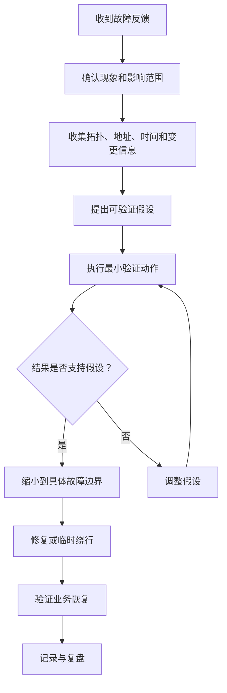
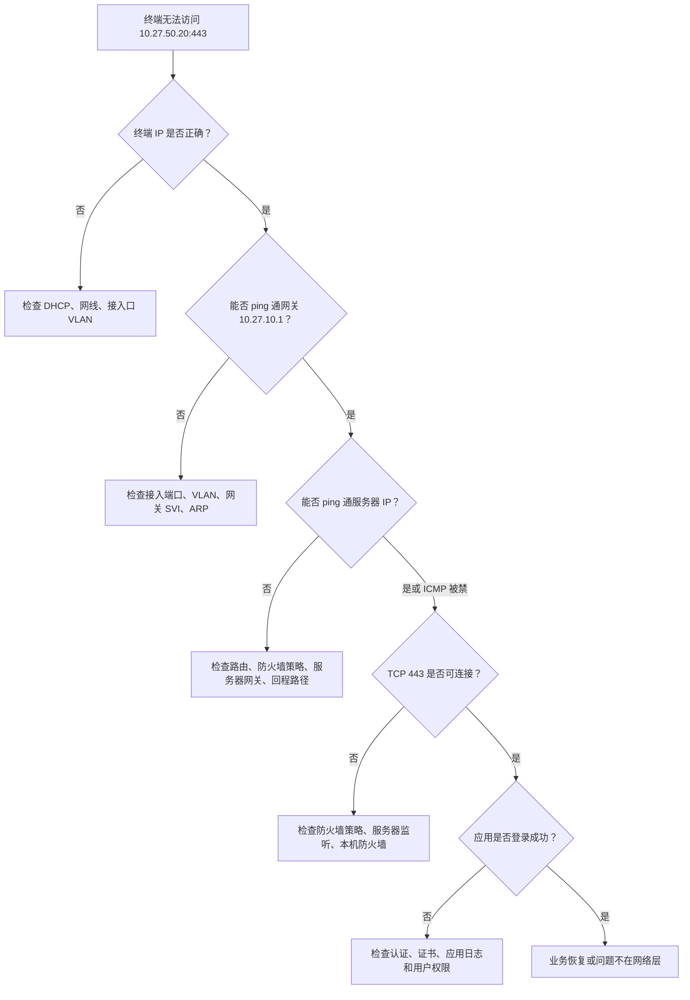
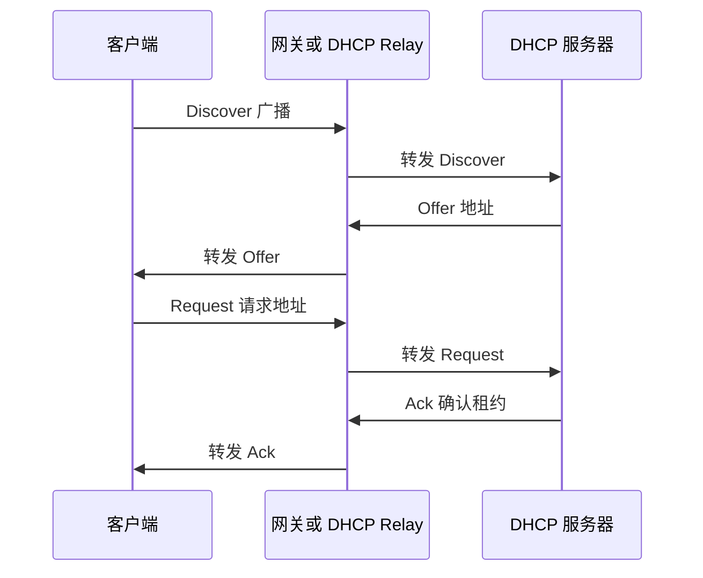
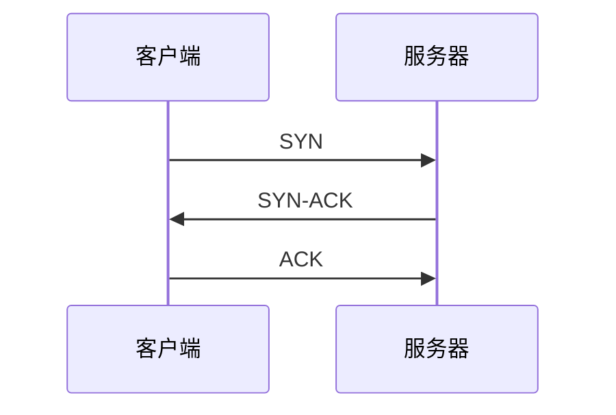

# 第 27 章：常用排错方法

## 27.1 本章学习目标

读完本章后，你应该能够：

- 理解网络排错的目标不是“猜一个原因”，而是通过证据逐步缩小故障范围。
- 掌握从现象确认、影响范围、分层验证、路径跟踪、变更回溯到恢复验证的基本排错流程。
- 能够使用 OSI 分层思路定位物理层、二层、三层、四层、DNS、DHCP、认证、策略和应用访问问题。
- 能够区分“完全不通”“间歇性中断”“网络慢”“部分业务不通”“只有某些用户受影响”等不同故障类型。
- 能够根据企业网络拓扑，把故障边界拆成终端、接入交换、汇聚核心、防火墙、出口、服务器、云平台和远端网络。
- 能够看懂并使用常见排错命令，例如 `ping`、`tracert` / `traceroute`、`ipconfig` / `ifconfig` / `ip addr`、`nslookup`、`telnet`、`curl`、`arp`、`route`、`netstat`、`tcpdump` 和设备侧的接口、MAC、ARP、路由、策略、会话查询命令。
- 能够为典型企业故障建立排查路径，例如办公网无法上网、跨 VLAN 不通、DHCP 获取失败、DNS 解析失败、VPN 访问失败、无线掉线、服务器端口不可达和网络访问变慢。
- 能够记录故障处理过程，形成可复盘、可交接、可改进的排错报告。

第 26 章学习了网络运维基础，重点是让网络状态可见、变更可控、配置可恢复。本章继续学习排错方法。排错和运维的关系可以这样理解：

```text
运维让网络少出问题，排错让已经出现的问题尽快恢复。
```

真实企业里，用户通常不会说“OSPF 邻居中断”或“防火墙策略没有命中”。用户更常见的描述是：

- 网络打不开。
- 系统很慢。
- Wi-Fi 老是掉。
- 分公司访问总部系统失败。
- VPN 连上了，但是访问不了服务器。
- 打印机找不到。
- 只有财务部不能访问某个业务。
- 昨天还可以，今天突然不行。

这些描述是故障现象，不是故障原因。网络工程师的任务，是把这些模糊现象转化为可以验证的问题：

```text
谁不能访问什么？
从哪里访问到哪里？
什么时候开始？
是完全不通、偶尔不通，还是很慢？
同一网段的其他终端是否正常？
其他业务是否正常？
最近是否做过变更？
路径上每一跳是否按预期转发？
```

排错能力不是记住某个神奇命令，而是建立结构化思维。命令只是验证假设的工具。

## 27.2 什么是网络排错

网络排错是通过收集现象、验证路径、缩小范围、定位原因、采取修复动作并确认业务恢复的过程。

一个完整的排错过程通常包括：

1. 确认故障现象。
2. 判断影响范围。
3. 收集基础信息。
4. 按层次或路径逐段验证。
5. 找到最可能的故障边界。
6. 执行临时恢复或永久修复。
7. 验证业务恢复。
8. 记录原因、动作和改进项。

初学者最容易犯的错误，是看到一个现象后立即修改配置。例如用户说“打不开系统”，工程师马上去防火墙上加策略；用户说“网络慢”，工程师马上重启交换机；用户说“VPN 不通”，工程师马上改路由。这种方式有两个问题：

- 如果原因判断错误，可能把一个小故障扩大成更大故障。
- 即使偶然恢复，也不知道真实原因，下一次还会重复发生。

好的排错过程应该像下面这样：



这里最重要的词是“验证”。排错时不要只问“可能是什么问题”，还要问“我用什么证据证明它是或不是这个问题”。

## 27.3 排错前先问清楚的问题

很多排错失败不是因为技术不够，而是因为一开始没有问清楚问题。用户的一句“网络不通”可能代表完全不同的情况。

### 谁受影响

先确认受影响对象：

| 问题 | 作用 |
| --- | --- |
| 是一个用户、一个部门、一个楼层，还是全公司？ | 判断故障是在终端、接入层、汇聚层、核心层还是出口层 |
| 是有线用户还是无线用户？ | 判断是否涉及 AP、无线控制器、射频、认证或有线接入 |
| 是内部员工、访客、VPN 用户还是分支用户？ | 判断是否涉及不同安全域、地址池、策略或隧道 |
| 是所有设备都不行，还是只有某个系统不行？ | 判断是基础网络问题还是业务访问问题 |

影响范围越大，故障位置通常越靠近公共路径。例如：

- 只有一台电脑不通，优先查终端、网线、接入口、IP 地址和本机防火墙。
- 一个办公室都不通，优先查接入交换机、上联、该区域 VLAN、DHCP 和电源。
- 全公司不能上网，优先查出口防火墙、运营商链路、默认路由、NAT 和 DNS。
- 只有访问某台服务器失败，优先查服务器、服务端口、防火墙策略、回程路由和服务器本机防火墙。

### 访问什么失败

“访问失败”必须具体化。至少要确认：

- 访问的目的 IP 或域名是什么。
- 使用的协议和端口是什么，例如 HTTP `80`、HTTPS `443`、RDP `3389`、SSH `22`、数据库端口、业务自定义端口。
- 是浏览器打不开，还是客户端登录失败。
- 是 DNS 无法解析，还是解析后连接失败。
- 是连接超时，还是被拒绝，还是认证失败。

例如下面三种现象看起来都像“系统打不开”，但含义不同：

| 用户看到的现象 | 可能含义 |
| --- | --- |
| 浏览器提示找不到域名 | DNS 解析失败或 DNS 服务器不可达 |
| 浏览器一直转圈后超时 | 路由、策略、NAT、链路或服务器无响应 |
| 浏览器立即提示连接被拒绝 | 目标主机可达，但服务端口没有监听或被本机拒绝 |

### 什么时候开始

时间线非常关键。要确认：

- 故障第一次出现时间。
- 是否持续存在。
- 是否有规律，例如每天上午、月末、备份期间、上班高峰、无线会议高峰。
- 故障前后是否有网络变更、服务器变更、安全策略变更、运营商割接、证书更新或系统升级。

一句“昨天还可以，今天不行”应该进一步拆成：

```text
昨天几点可以？
今天几点发现不行？
这段时间谁做过变更？
变更影响了哪些设备、链路、策略、地址或系统？
监控和日志在这个时间段是否出现异常？
```

### 是不通还是慢

“不通”和“慢”是不同类型的问题。

| 类型 | 特征 | 常见方向 |
| --- | --- | --- |
| 完全不通 | ping 不通、端口连不上、业务完全不可用 | 物理链路、VLAN、IP、网关、路由、策略、服务状态 |
| 部分不通 | 某些用户或某些业务失败 | ACL、防火墙策略、地址段、用户权限、DNS、应用白名单 |
| 间歇中断 | 有时好有时坏 | 链路抖动、STP 收敛、无线漫游、路由震荡、设备负载、地址冲突 |
| 网络慢 | 能访问但响应慢 | 带宽拥塞、丢包、DNS 慢、服务器慢、MTU、QoS、无线干扰 |
| 登录失败 | 页面可达但认证失败 | 账号、认证服务器、时间同步、权限、证书、应用问题 |

如果把“慢”当成“不通”处理，容易只查连通性而忽略丢包、延迟、拥塞和服务器响应时间。如果把“应用认证失败”当成“网络不通”处理，也会浪费大量时间。

## 27.4 排错的两种基本思路

常见排错方法很多，但底层可以归纳为两类：按层排查和按路径排查。

### 按层排查

按层排查是根据网络协议层次逐层验证。它适合初学者建立基础思维。

```text
物理层 -> 二层 -> 三层 -> 四层 -> DNS/认证/应用
```

常见检查内容如下：

| 层次 | 关注点 | 常用验证 |
| --- | --- | --- |
| 物理层 | 网线、光模块、电源、端口 up/down、速率双工、错包、光功率 | 查看接口状态、替换线缆、查看 CRC 和丢包 |
| 二层 | VLAN、Trunk、MAC 表、STP、链路聚合、环路 | 查 VLAN、MAC 地址表、STP 状态、聚合状态 |
| 三层 | IP、掩码、网关、ARP、路由、回程路径 | 查 IP 配置、ping 网关、查 ARP、查路由表、traceroute |
| 四层 | TCP/UDP 端口、会话、NAT、防火墙策略 | telnet / nc / curl、查会话表、查策略命中 |
| 应用相关 | DNS、DHCP、认证、证书、应用服务 | nslookup、DHCP 租约、认证日志、服务日志 |

分层排查的好处是不会跳步。例如某台电脑不能访问 ERP 系统，你不应该直接去查 ERP 应用日志，而应该先确认：

1. 电脑网口是否连接。
2. 是否获得正确 IP。
3. 是否能 ping 通网关。
4. 是否能访问同网段其他主机。
5. 是否能访问跨网段目标。
6. 是否能解析 ERP 域名。
7. 是否能连接 ERP 的 TCP 端口。
8. 是否通过应用认证。

### 按路径排查

按路径排查是沿着数据包实际经过的路径逐段验证。它更适合企业网络，因为企业网络经常涉及多个设备和安全域。

例如办公终端访问数据中心服务器：


按路径排查时，不要只在源端 ping 目的端。应该逐段问：

- 终端到网关是否正常？
- 接入交换机是否学习到终端 MAC？
- 核心交换机是否有目的网段路由？
- 防火墙是否收到流量？
- 防火墙策略是否放行？
- NAT 是否不应发生却发生了，或应该发生却没有发生？
- 服务器网关是否正确？
- 服务器本机防火墙是否允许端口？
- 回程流量是否沿同一路径返回？

按路径排查的核心是“把一条端到端链路拆成多个小段”。只要找到哪一段开始异常，就能快速缩小范围。

## 27.5 常用排错工具和命令

不同厂商设备命令不同，但排错目标是相似的。本节用通用思路说明命令用途。实际工作中应结合华为、H3C、Cisco、防火墙和操作系统的具体命令。

### 终端侧基础命令

| 目标 | Windows 常用命令 | Linux/macOS 常用命令 | 用途 |
| --- | --- | --- | --- |
| 查看 IP 配置 | `ipconfig /all` | `ip addr`, `ifconfig` | 确认 IP、掩码、网关、DNS、DHCP |
| 测试连通性 | `ping` | `ping` | 判断目标是否可达、是否丢包 |
| 跟踪路径 | `tracert` | `traceroute` | 查看路径经过哪些三层节点 |
| 查询 DNS | `nslookup` | `nslookup`, `dig` | 判断域名是否能解析 |
| 查看 ARP | `arp -a` | `ip neigh`, `arp -a` | 判断网关或邻居 MAC 学习是否正常 |
| 查看路由 | `route print` | `ip route`, `netstat -rn` | 判断默认路由和本机路由 |
| 测试端口 | `Test-NetConnection`, `telnet` | `nc`, `telnet`, `curl` | 判断 TCP 端口是否可连接 |
| 抓包 | Wireshark | `tcpdump`, Wireshark | 查看真实报文是否发出和返回 |

终端侧命令适合回答几个基础问题：

- 终端有没有拿到正确地址？
- 终端默认网关是否正确？
- DNS 指向哪里？
- 是否能到达网关？
- 是否能到达目的 IP？
- 域名是否解析到预期地址？
- TCP 端口是否开放？

### 网络设备侧常见检查

设备侧要重点查看“状态表”，而不是只看配置。配置表示你希望设备怎样工作，状态表表示设备当前实际怎样工作。

常见状态包括：

| 检查对象 | 要看什么 | 排错意义 |
| --- | --- | --- |
| 接口状态 | up/down、速率、双工、错包、丢包、CRC、带宽利用率 | 判断物理链路、协商和拥塞 |
| VLAN | 端口所属 VLAN、Trunk 允许 VLAN、PVID | 判断二层隔离和 VLAN 透传 |
| MAC 表 | 某个 MAC 从哪个端口学习到 | 判断二层路径和终端位置 |
| ARP 表 | IP 与 MAC 是否对应 | 判断三层邻居解析 |
| 路由表 | 目的网段下一跳和出接口 | 判断三层转发方向 |
| STP 状态 | 根桥、阻塞端口、拓扑变化 | 判断环路和收敛 |
| 聚合状态 | 成员端口是否正常加入 | 判断链路聚合是否按预期工作 |
| 防火墙策略 | 策略命中次数、日志、源目的服务 | 判断流量是否被允许或拒绝 |
| 会话表 | 源、目的、端口、NAT、入接口、出接口 | 判断流量是否经过防火墙 |
| VPN 状态 | 隧道、IKE/IPsec、安全联盟、加密域 | 判断隧道是否建立和匹配 |
| 无线状态 | AP 在线、SSID、用户、信号、认证、漫游 | 判断无线接入链路 |

### ping 不是万能工具

`ping` 很常用，但不能单独证明业务一定正常。

`ping` 能说明：

- 目标 IP 在某种程度上可达。
- ICMP 请求和响应可以往返。
- 大致延迟和丢包情况。

`ping` 不能说明：

- TCP `443` 端口一定开放。
- 防火墙一定允许业务端口。
- DNS 一定正常。
- 应用服务一定正常。
- 用户权限一定正确。
- 大包一定不会因为 MTU 问题失败。

很多企业会在防火墙上禁用 ICMP，导致 `ping` 不通但业务正常；也可能 `ping` 通但业务端口被拒绝。因此排错时要结合端口测试和应用测试。

### traceroute 的使用限制

`tracert` / `traceroute` 能帮助你观察三层路径，但也有局限：

- 有些设备不回复 TTL 超时报文。
- 有些防火墙会隐藏路径。
- 负载均衡路径可能导致结果变化。
- 回程路径不一定和去程路径一致。
- MPLS、VPN、云网络中间节点可能不可见。

所以 traceroute 结果不能机械理解。它适合回答“流量大概走到哪里”，但不能单独当作最终根因。

## 27.6 建立故障边界

排错的核心动作是建立故障边界。所谓故障边界，就是把故障范围从“整个网络可能有问题”缩小到“某一段链路、某一台设备、某个 VLAN、某条策略、某个地址池或某个应用服务有问题”。

### 用对比法缩小范围

对比法是最简单也最有效的方法之一。

| 对比对象 | 可以判断什么 |
| --- | --- |
| 同一用户访问不同系统 | 判断是某个系统问题还是用户网络问题 |
| 同一部门多台电脑 | 判断是单机问题还是接入区域问题 |
| 同一 VLAN 和不同 VLAN 用户 | 判断是否涉及网关、路由或策略 |
| 有线和无线用户 | 判断是否涉及无线网络 |
| 内网访问和外网访问 | 判断是否涉及出口、防火墙、DNS 或运营商 |
| IP 访问和域名访问 | 判断是否涉及 DNS |
| 新设备和旧设备 | 判断是否涉及地址、认证、准入或安全策略 |
| 主链路和备链路 | 判断是否涉及某条链路或路由切换 |

例如用户说“OA 打不开”，你可以这样对比：

1. 该用户能否访问公司官网？
2. 同部门其他用户能否访问 OA？
3. 该用户使用 OA 的 IP 地址能否访问？
4. 该用户使用 OA 的域名是否能解析？
5. 其他 VLAN 用户能否访问 OA？
6. VPN 用户能否访问 OA？

这些问题会把故障从“OA 打不开”逐步缩小到 DNS、用户终端、VLAN 策略、服务器或全局业务故障。

### 用最小验证动作避免扩大影响

排错时每一步动作都应该尽量小。优先使用查看、测试和临时旁路，不要一上来做大范围变更。

推荐顺序：

1. 查看状态。
2. 对比正常样本。
3. 做不影响业务的连通性测试。
4. 抓包或查看日志。
5. 做小范围临时调整。
6. 评估风险后再修改生产配置。

不推荐的做法：

- 不确认影响范围就重启核心交换机。
- 不备份配置就修改防火墙策略。
- 不看路由表就删除静态路由。
- 不确认端口用途就关闭交换机端口。
- 不确认环路原因就随意调整 STP 优先级。

### 区分根因修复和临时恢复

企业故障处理有时需要先恢复业务，再深入分析根因。例如主运营商链路故障时，可以先切到备线路，让用户恢复访问；事后再与运营商确认光缆、设备或 BGP 会话问题。

| 类型 | 目标 | 示例 |
| --- | --- | --- |
| 临时恢复 | 尽快让业务可用 | 切换备链路、临时放行策略、启用备用 DNS |
| 根因修复 | 消除故障源 | 更换坏光模块、修正路由、清理错误 ACL、修复 DHCP 地址池 |
| 长期改进 | 降低再次发生概率 | 增加监控、完善变更流程、更新拓扑、扩容带宽 |

临时恢复不是最终完成。真正完成排错，需要说明为什么故障发生、如何恢复、是否仍有风险、后续如何避免。

## 27.7 典型排错流程

下面用几个通用流程帮助你建立排错习惯。

### 终端无法访问内网服务器

假设办公终端 `10.27.10.50/24`，网关 `10.27.10.1`，需要访问服务器 `10.27.50.20:443`。



这个流程体现了从低层到高层的思路。不能跳过 IP、网关和端口测试，直接判断应用有问题。

### 全公司无法上网

全公司无法上网通常影响范围较大，优先检查公共出口路径。

排查顺序建议：

1. 确认是否所有办公 VLAN 都受影响。
2. 测试访问公网 IP，例如运营商 DNS 或公共地址。
3. 测试域名解析，判断是否只是 DNS 问题。
4. 查看核心到防火墙链路是否正常。
5. 查看防火墙外网接口是否正常。
6. 查看默认路由是否存在。
7. 查看 NAT 策略是否命中。
8. 查看防火墙会话和策略日志。
9. 查看运营商链路状态和网关可达性。
10. 如有双出口，检查主备切换或策略路由。

常见原因包括：

| 现象 | 可能原因 |
| --- | --- |
| 能访问公网 IP，不能访问域名 | DNS 服务器故障、DNS 策略阻断、终端 DNS 配置错误 |
| 内网到防火墙正常，防火墙到运营商不通 | 运营商链路、光模块、外网网关或公网接口问题 |
| 防火墙有会话但无回包 | 运营商侧问题、NAT 地址问题、回程问题 |
| 只有部分 VLAN 不能上网 | 源地址未匹配 NAT、策略未放行、路由缺失 |
| 访问很慢但未完全中断 | 出口带宽拥塞、DNS 慢、链路丢包、运营商质量问题 |

### DHCP 获取地址失败

DHCP 故障经常被用户描述为“插网线没网”。判断 DHCP 故障时要先看终端地址。

如果 Windows 终端拿到 `169.254.x.x`，通常说明没有从 DHCP 服务器获得地址。排查方向：

1. 终端网口是否 up。
2. 接入端口 VLAN 是否正确。
3. 该 VLAN 的网关接口是否正常。
4. DHCP 服务器或地址池是否正常。
5. 如果 DHCP 不在本 VLAN，DHCP Relay 是否配置正确。
6. 地址池是否耗尽。
7. 是否有 DHCP Snooping、准入或安全策略阻断。
8. 是否存在非法 DHCP 服务器。

DHCP 过程可以简化为：



如果客户端发出了 Discover，但没有收到 Offer，问题可能在 VLAN、Relay、DHCP 服务器或安全策略。如果服务器发出了 Offer，但客户端没有收到，问题可能在回程、二层转发或安全特性。

### DNS 解析失败

DNS 故障的特点是：访问 IP 可以，访问域名不行。

排查顺序：

1. 查看终端 DNS 服务器地址是否正确。
2. 测试能否 ping 通或访问 DNS 服务器。
3. 使用 `nslookup 域名 DNS服务器` 指定服务器查询。
4. 比较内网 DNS 和公网 DNS 的解析结果。
5. 检查是否是内网域名、分裂 DNS 或条件转发问题。
6. 检查 DNS 服务器自身服务和上游转发。
7. 检查防火墙是否允许 UDP/TCP `53`。
8. 检查域名是否过期、记录是否变更或缓存未刷新。

示例：

```text
用户访问 intranet.example.local 失败。
使用 IP 10.27.50.20 可以打开页面。
nslookup intranet.example.local 返回 NXDOMAIN。
同网段其他用户解析正常。
```

这种情况优先怀疑该终端 DNS 配置、DNS 缓存或终端安全软件，而不是服务器网络不通。

### 跨 VLAN 访问失败

跨 VLAN 访问需要同时满足：

- 源 VLAN 正常。
- 目的 VLAN 正常。
- 源终端网关正确。
- 三层设备有源和目的网段的路由。
- 中间安全策略允许。
- 目的主机网关正确。
- 回程路径正确。

例如：

| 对象 | 地址 |
| --- | --- |
| 办公网 VLAN 10 | `10.27.10.0/24`，网关 `10.27.10.1` |
| 服务器 VLAN 50 | `10.27.50.0/24`，网关 `10.27.50.1` |
| 终端 | `10.27.10.50` |
| 服务器 | `10.27.50.20` |

排查时可以这样验证：

1. 终端能否 ping 通 `10.27.10.1`。
2. 服务器能否 ping 通 `10.27.50.1`。
3. 核心交换机是否有两个 VLAN 的三层接口。
4. 如果流量经过防火墙，防火墙是否有对应安全策略。
5. 终端到服务器的路径是否经过预期设备。
6. 服务器回终端的网关是否指向 `10.27.50.1` 或正确防火墙。
7. 是否存在 ACL 阻断 `10.27.10.0/24` 到 `10.27.50.0/24`。

一个常见错误是只在源端查路由，却忽略目的服务器的默认网关。如果服务器网关配错，去程可以到达服务器，但回包发不到正确路径，表现为连接超时。

### VPN 连上但业务不通

VPN 问题要区分两个阶段：

```text
隧道是否建立？
隧道建立后业务流量是否可达？
```

如果 VPN 根本连不上，优先查账号、密码、多因素认证、证书、IKE/IPsec 参数、客户端版本、互联网连通性和网关公网地址。

如果 VPN 显示已连接但业务不通，重点查：

| 检查项 | 说明 |
| --- | --- |
| VPN 地址池 | 客户端是否获得正确虚拟 IP |
| 分流策略 | 目标内网网段是否被推送到客户端 |
| 防火墙策略 | VPN 区域到服务器区域是否允许 |
| 路由 | 内网是否知道如何回到 VPN 地址池 |
| NAT | VPN 到内网通常不应被错误源 NAT |
| DNS | 内网域名是否解析到内网地址 |
| 服务器限制 | 服务器是否只允许特定网段访问 |

例如 VPN 客户端地址池为 `10.27.200.0/24`，用户要访问服务器 `10.27.50.20`。如果服务器区防火墙只允许办公网 `10.27.10.0/24` 访问，而没有允许 `10.27.200.0/24`，VPN 用户就会“连上 VPN 但打不开系统”。

### 无线用户掉线或体验差

无线排错不能只看 IP 连通性，还要关注射频、漫游、认证和 AP 上联。

常见排查方向：

| 方向 | 要看什么 |
| --- | --- |
| 信号 | RSSI、SNR、用户距离 AP、遮挡、弱覆盖区域 |
| 干扰 | 同频干扰、信道重叠、非 Wi-Fi 干扰源 |
| 容量 | 单 AP 用户数、会议室高密、空口利用率 |
| 漫游 | 用户是否在 AP 间频繁切换，是否粘滞到远端 AP |
| 认证 | 802.1X、Portal、RADIUS、证书、账号状态 |
| 地址 | DHCP 是否及时获取，地址池是否耗尽 |
| 有线侧 | AP 上联端口、PoE、Trunk VLAN、AC 到 AP 隧道 |

无线问题常见描述和方向：

| 用户描述 | 优先检查 |
| --- | --- |
| 能连 Wi-Fi 但没网 | DHCP、网关、DNS、用户 VLAN、认证后策略 |
| 会议室网络很慢 | AP 容量、信道、带宽、用户密度、上联带宽 |
| 走到某个区域就掉线 | 覆盖盲区、AP 故障、漫游参数、弱信号 |
| 只有访客 Wi-Fi 不行 | 访客 VLAN、Portal、出口策略、NAT、DNS |
| 只有某些账号无法连接 | RADIUS、账号权限、证书、终端时间 |

### 网络慢

网络慢比网络不通更难排，因为它可能不是单点故障，而是链路质量、服务器性能、DNS、应用、终端和安全设备共同影响。

排查网络慢时，不要只问“能不能 ping 通”，还要看：

- 延迟是否升高。
- 是否丢包。
- 是否在特定时间段发生。
- 是否只影响某个业务。
- 是否只影响某个区域。
- 是否与带宽利用率、CPU、会话数、日志写入或备份任务相关。
- DNS 解析是否耗时。
- TCP 连接建立是否慢。
- 首字节返回是否慢。
- 下载速度是否受限。

可以把慢拆成几个阶段：

```text
DNS 解析慢 -> TCP 建连慢 -> TLS 握手慢 -> 服务器处理慢 -> 数据传输慢
```

使用浏览器开发者工具、`curl`、抓包和监控可以帮助区分是哪一段慢。例如：

- DNS 解析耗时很长，优先查 DNS。
- TCP SYN 重传，优先查链路丢包、防火墙、服务器监听。
- 建连正常但服务器很久才返回，优先查应用或数据库。
- 大文件下载慢但小页面正常，优先查带宽、丢包、QoS、MTU。

## 27.8 常见故障现象与排查矩阵

下面的矩阵可以作为日常排错速查表。

| 故障现象 | 优先检查 | 常见原因 |
| --- | --- | --- |
| 单台电脑完全没网 | 网线、网卡、IP、网关、接入口 VLAN | 网线松动、端口关闭、DHCP 失败、地址冲突 |
| 一个办公室都没网 | 接入交换机、电源、上联、Trunk、VLAN | 交换机掉电、上联 down、Trunk 漏 VLAN |
| 全公司不能上网 | 防火墙、出口链路、默认路由、NAT、DNS | 运营商故障、NAT 策略异常、DNS 故障 |
| 某个内网系统打不开 | DNS、策略、端口、服务器、回程路由 | 防火墙策略缺失、服务未启动、服务器网关错误 |
| 跨 VLAN 不通 | 网关、路由、ACL、防火墙、ARP | VLAN 网关未启用、ACL 阻断、回程路由缺失 |
| DHCP 获取失败 | 接入 VLAN、DHCP Server、Relay、地址池 | Relay 漏配、地址池耗尽、Snooping 阻断 |
| DNS 解析失败 | DNS 地址、DNS 服务、转发、策略 | DNS 服务器故障、记录错误、防火墙阻断 53 |
| VPN 已连接但访问失败 | 地址池、分流路由、策略、内网回程 | VPN 地址段未放行、内网无回程路由 |
| 无线频繁掉线 | 信号、干扰、漫游、认证、AP 上联 | 弱覆盖、同频干扰、RADIUS 不稳定 |
| 网络时快时慢 | 带宽、丢包、CPU、链路错误、备份任务 | 出口拥塞、接口 CRC、设备负载高 |
| 打印机不可用 | IP、同网段连通性、ACL、驱动、打印服务 | 打印机地址变化、跨 VLAN 策略阻断 |
| 远程桌面失败 | TCP 3389、主机防火墙、策略、账号 | 端口未放行、本机防火墙、服务器未启用 RDP |

矩阵不能代替思考。它的作用是给你一个起点，真正定位仍然要结合拓扑、路径、日志和变更记录。

## 27.9 企业案例：办公网无法访问财务系统

下面通过一个完整案例演示排错过程。

### 背景

某公司网络规划如下：

| 区域 | VLAN | 网段 | 网关 | 说明 |
| --- | --- | --- | --- | --- |
| 办公网 | VLAN 10 | `10.27.10.0/24` | `10.27.10.1` | 员工电脑 |
| 财务部 | VLAN 20 | `10.27.20.0/24` | `10.27.20.1` | 财务电脑 |
| 服务器区 | VLAN 50 | `10.27.50.0/24` | `10.27.50.1` | 内部服务器 |
| VPN 地址池 | - | `10.27.200.0/24` | - | 远程办公用户 |

财务系统服务器为 `10.27.50.20`，提供 HTTPS 服务 `443`。防火墙策略要求：

- 财务部 VLAN 20 可以访问 `10.27.50.20:443`。
- 普通办公网 VLAN 10 不允许访问财务系统。
- VPN 用户中只有财务组可以访问财务系统。

某天上午，财务部反馈“财务系统打不开”。其他部门没有反馈异常。

### 第一步：确认现象

需要先问清楚：

- 是财务部所有人打不开，还是某一台电脑打不开？
- 访问的是域名还是 IP？
- 浏览器报错是什么？
- 其他系统是否可以访问？
- 故障从什么时候开始？
- 最近是否调整过财务系统、防火墙策略、DNS 或交换机端口？

确认后得到信息：

```text
财务部 6 台电脑都无法访问 https://finance.example.local。
使用其他办公系统正常。
普通办公网本来就不能访问财务系统。
财务服务器昨天晚上做过系统补丁重启。
网络侧昨天晚上也新增过一条服务器区安全策略。
```

### 第二步：区分 DNS 和 IP 连通性

在一台财务电脑上测试：

```text
nslookup finance.example.local -> 10.27.50.20
ping 10.27.20.1 -> 正常
ping 10.27.50.20 -> 不通
访问 https://10.27.50.20 -> 超时
```

这说明：

- DNS 解析正常。
- 财务电脑到本网关正常。
- 问题更可能在跨网段路径、防火墙策略、服务器或回程路径。

### 第三步：验证路径和策略

在核心交换机和防火墙上检查：

| 检查点 | 结果 | 判断 |
| --- | --- | --- |
| 核心交换机 VLAN 20 网关 | 正常 | 财务网关没有问题 |
| 核心交换机到防火墙链路 | 正常 | 上联没有中断 |
| 防火墙会话表 | 看到 `10.27.20.x -> 10.27.50.20:443` 被拒绝 | 流量到达防火墙但被策略拒绝 |
| 防火墙策略日志 | 命中一条新增的服务器区拒绝策略 | 新增策略可能覆盖了原放行策略 |

此时故障边界已经缩小到防火墙策略。

### 第四步：修复并验证

修复动作：

1. 备份防火墙当前配置。
2. 查看昨天新增策略的位置和匹配条件。
3. 调整策略顺序，使财务部到财务系统的精确放行策略优先命中。
4. 保留日志记录。
5. 从财务电脑重新访问系统。
6. 从普通办公网验证仍然不能访问财务系统。

验证结果：

| 验证项 | 结果 |
| --- | --- |
| 财务部访问 `https://finance.example.local` | 正常 |
| 普通办公网访问财务系统 | 仍然拒绝 |
| 防火墙策略命中 | 命中财务放行策略 |
| 服务器日志 | 收到财务部客户端连接 |

### 第五步：复盘

根因不是“网络坏了”，而是新增防火墙策略顺序不当，导致财务部访问财务系统的流量先命中了拒绝策略。

改进项：

- 防火墙变更前必须确认策略插入位置。
- 变更后不仅要验证新增业务，还要验证关键存量业务。
- 财务系统应加入变更后验证清单。
- 防火墙策略命名应包含业务、源、目的、端口和工单号。
- 临时策略和拒绝策略应启用日志，便于快速定位。

这个案例说明：排错不是单纯恢复访问，还要把故障转化为流程改进。

## 27.10 抓包在排错中的作用

抓包是网络排错的证据工具。它可以告诉你报文是否真的发出、是否到达、是否返回，以及在哪一步出现异常。

### 什么时候需要抓包

以下情况适合抓包：

- ping 和 traceroute 结果无法解释问题。
- 防火墙策略看似正确，但业务仍然不通。
- 怀疑三次握手失败。
- 怀疑 DNS、DHCP、ARP 或认证过程异常。
- 怀疑 MTU、分片、重传、丢包。
- 怀疑服务器没有回包或回包走错路径。
- 需要向服务器、运营商或安全团队提供证据。

### 抓包看什么

不同协议关注点不同：

| 协议或场景 | 重点观察 |
| --- | --- |
| ARP | 是否发出 ARP 请求，是否收到正确 MAC |
| DHCP | Discover、Offer、Request、Ack 是否完整 |
| DNS | 查询发给哪个 DNS，返回什么结果，是否超时 |
| TCP | SYN、SYN-ACK、ACK 是否完整，是否重传或 RST |
| HTTPS | TCP 是否建立，TLS 握手是否开始 |
| ICMP | 请求和响应是否双向都有 |
| VPN | 协商报文是否到达，安全联盟是否建立 |

例如 TCP 三次握手：



如果只看到客户端不断发送 SYN，没有 SYN-ACK，可能是中间策略阻断、服务器未收到、服务器未监听或回程不通。如果看到服务器返回 RST，通常说明目标主机可达，但端口没有服务监听或被主机拒绝。

### 抓包位置很重要

同一个故障，在不同位置抓包能回答不同问题：

| 抓包位置 | 能证明什么 |
| --- | --- |
| 客户端 | 客户端是否发出请求，是否收到响应 |
| 接入交换机镜像口 | 报文是否进入网络 |
| 防火墙入接口 | 流量是否到达安全边界 |
| 防火墙出接口 | 流量是否被策略放行并转发 |
| 服务器侧交换机 | 报文是否到达服务器网段 |
| 服务器本机 | 服务是否收到请求并回应 |

如果客户端抓包看到 SYN 发出但没有回应，不能立即断定防火墙阻断。还要在防火墙入接口、出接口或服务器侧验证报文走到哪里。

## 27.11 排错中的沟通和记录

企业排错不是一个人在设备上敲命令。它通常涉及用户、业务系统负责人、安全团队、服务器团队、运营商、厂商和管理者。沟通不好会影响恢复速度。

### 故障期间要同步哪些信息

故障处理过程中，应定期同步：

- 当前确认的影响范围。
- 当前已排除的方向。
- 当前怀疑的故障边界。
- 正在执行的验证动作。
- 是否需要临时绕行。
- 是否有业务风险。
- 预计下一次更新时间。

不要只说“还在处理中”。更好的表达是：

```text
目前确认只有财务 VLAN 20 访问财务系统受影响，其他办公系统正常。
DNS 和终端网关已排除，流量到达防火墙后被拒绝。
正在核对昨晚新增策略的位置，预计 10 分钟内给出修复方案。
```

这样的沟通能让业务方知道你不是在盲目尝试，而是在逐步缩小范围。

### 故障记录模板

建议每次重要故障都记录以下内容：

| 字段 | 示例 |
| --- | --- |
| 故障标题 | 财务部无法访问财务系统 |
| 发现时间 | `2026-06-08 09:20` |
| 恢复时间 | `2026-06-08 10:05` |
| 影响范围 | 财务部 VLAN 20，共 6 台终端 |
| 受影响业务 | 财务系统 HTTPS 访问 |
| 初始现象 | 浏览器访问超时 |
| 根因 | 防火墙新增拒绝策略顺序不当 |
| 临时措施 | 调整策略顺序恢复访问 |
| 永久措施 | 完善策略变更检查清单 |
| 验证结果 | 财务部可访问，普通办公网仍拒绝 |
| 后续改进 | 关键业务加入变更后回归验证 |

故障记录的价值在于：

- 后续遇到类似问题可以快速参考。
- 新同事可以学习真实环境中的排错路径。
- 管理者可以看到影响范围和恢复时间。
- 团队可以把一次故障转化为流程和监控改进。

## 27.12 排错时的常见误区

### 只凭经验猜原因

经验很重要，但经验必须接受证据验证。老工程师能快速提出可能原因，是因为见过很多类似模式；但真正可靠的做法仍然是验证。

正确做法：

```text
根据经验提出假设 -> 用命令、日志或抓包验证 -> 根据结果继续缩小范围
```

### 只看配置，不看状态

配置正确不代表状态正常。例如：

- Trunk 配置允许 VLAN，但链路聚合成员没有正常加入。
- OSPF 配置存在，但邻居没有建立。
- NAT 策略存在，但源地址没有命中。
- 防火墙策略存在，但顺序在拒绝策略之后。
- DHCP 地址池存在，但已经耗尽。

排错时要同时看配置和实时状态。

### 忽略回程路径

网络通信需要往返。去程可达不代表回程可达。很多跨网段、VPN、NAT 和双出口故障都与回程路径有关。

典型现象：

- 客户端发出请求。
- 服务器收到请求。
- 服务器回包走到另一个网关。
- 中间设备因为会话不匹配或路由不对称丢弃回包。

排错时要问：

```text
目的端回源端的路由是什么？
回包是否经过同一台防火墙？
是否存在策略路由、双出口、NAT 或非对称路径？
```

### 忽略最近变更

很多故障与变更有关，但不是所有变更都会被主动告知。排错时要主动查：

- 网络设备配置变更。
- 防火墙策略变更。
- 服务器 IP 或网关变更。
- DNS 记录变更。
- DHCP 地址池变更。
- 认证系统变更。
- 运营商割接。
- 系统补丁和重启。

如果故障时间与变更时间高度重合，应优先验证变更影响，但仍然不要不经验证就回退。

### 修复后不验证

排错不是“改完配置”就结束。至少要验证：

- 报障用户业务是否恢复。
- 同类型用户是否恢复。
- 不应访问的用户是否仍然被拒绝。
- 是否引入新的安全风险。
- 监控告警是否恢复正常。
- 日志是否还有异常。

例如放行财务系统时，只验证财务部可以访问还不够，还要验证普通办公网仍然不能访问，避免为了恢复业务破坏安全边界。

## 27.13 排错练习

下面的练习用于训练故障边界判断。

### 练习一：判断故障范围

现象：

```text
三楼办公区 20 多名用户反馈无法上网。
一楼和二楼正常。
三楼用户能连接 Wi-Fi，但无法获取 IP 地址。
有线用户正常。
```

请思考：

- 故障更可能在出口防火墙、核心交换机、三楼 AP/无线 VLAN、DHCP，还是互联网运营商？
- 应该先检查 AP 状态、SSID、无线用户 VLAN，还是 NAT 策略？
- 如果 DHCP 地址池耗尽，会出现什么现象？

参考思路：

```text
影响范围集中在三楼无线用户，有线用户和其他楼层正常。
优先检查三楼 AP、无线 VLAN、AC 下发策略、DHCP Relay 和对应地址池。
不应优先怀疑全局出口或运营商。
```

### 练习二：区分 DNS 和网络不通

现象：

```text
用户访问 crm.example.com 失败。
ping 10.27.60.30 正常。
浏览器访问 https://10.27.60.30 可以打开。
nslookup crm.example.com 返回旧地址 10.27.60.10。
```

请思考：

- 这是服务器故障、路由故障、防火墙故障，还是 DNS 记录问题？
- 需要在哪个系统修复？
- 修复后是否要考虑 DNS 缓存？

参考思路：

```text
使用 IP 可以访问，说明基础网络和服务端口大概率正常。
域名解析到旧地址，故障边界在 DNS 记录或缓存。
修复 DNS 后要关注客户端、本地 DNS 和递归 DNS 缓存时间。
```

### 练习三：VPN 访问失败

现象：

```text
远程用户 VPN 可以登录。
VPN 客户端获得地址 10.27.200.35。
可以访问内网门户 10.27.30.10。
不能访问财务系统 10.27.50.20。
财务部内网用户访问财务系统正常。
```

请思考：

- VPN 隧道是否已经建立？
- 财务系统服务器是否整体故障？
- 更可能缺少哪类策略或路由？

参考思路：

```text
VPN 已连接且能访问内网门户，说明隧道不是完全故障。
财务部内网用户访问正常，说明财务系统本身大概率正常。
优先检查 VPN 地址池 10.27.200.0/24 到 10.27.50.20:443 的防火墙策略、服务器回程路由和权限控制。
```

## 27.14 本章小结

本章学习了企业网络常用排错方法。排错的核心不是背命令，而是用结构化方法把模糊现象变成可验证的问题，再通过证据逐步缩小故障边界。

需要重点掌握：

- 故障开始时先确认“谁、从哪里、访问什么、什么时候、表现是什么、影响多大、最近是否变更”。
- 按层排查可以避免跳步，按路径排查可以快速定位企业网络中的设备边界。
- `ping`、`traceroute`、`nslookup`、端口测试、路由表、ARP 表、MAC 表、接口状态、策略日志、会话表和抓包都是验证工具。
- 排错要同时关注去程和回程，不能只看源端。
- 配置正确不代表状态正常，要看实时表项、日志和命中情况。
- 修复业务后，还要验证安全边界、记录过程并复盘改进。

到这里，你已经具备了网络运维和排错的基础方法。后续进入厂商设备配置实践时，要把本章的方法带入具体命令学习中：学习每一条命令时，都要问它能验证什么状态、能排除什么可能、能把故障范围缩小到哪里。
