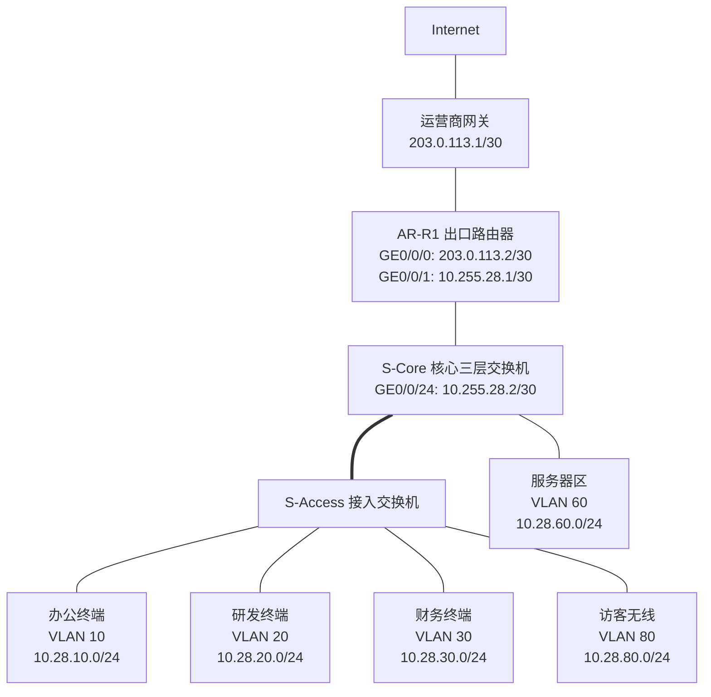

# 第 28 章：华为设备配置

## 28.1 本章学习目标

读完本章后，你应该能够：

- 理解华为 VRP 设备的基本命令行层级，例如用户视图、系统视图、接口视图、协议视图。
- 完成交换机和路由器的基础初始化，包括设备命名、管理地址、账号、SSH、时间、日志和配置保存。
- 按企业地址规划配置 VLAN、Access 端口、Trunk 端口、Eth-Trunk、VLANIF 网关和静态路由。
- 使用华为设备完成基础 DHCP、OSPF、ACL 和接口安全配置。
- 看懂常用 `display` 命令输出背后的排错意义。
- 按“配置前规划 -> 写入配置 -> 验证状态 -> 保存配置 -> 记录变更”的工程流程操作设备。
- 识别华为设备配置中的常见错误，例如视图错误、端口类型错误、Trunk 未放行 VLAN、网关接口未 up、路由缺失和配置未保存。

前面章节讲了 VLAN、三层交换、路由、防火墙、无线、运维和排错。本章开始进入“厂商设备配置实践”。本章以华为 VRP 风格命令为主，把前面学过的通用原理落到真实设备配置中。

需要注意：华为交换机、路由器、防火墙和不同 VRP 版本的命令细节可能略有差异。本章关注企业网络工程中最常见的配置思路和命令结构。真实项目中应以现场设备型号、软件版本和厂商文档为准。

## 28.2 华为 VRP 命令行基础

VRP 是华为网络设备常见的软件平台。初学者学习华为设备时，第一件事不是背配置，而是理解“在哪个视图下输入什么命令”。

### 常见命令视图

华为设备命令行有不同视图。不同视图能执行的命令不同。

| 视图 | 提示符示例 | 作用 |
| --- | --- | --- |
| 用户视图 | `<Huawei>` | 查看基础状态、进入系统视图、保存配置、重启等 |
| 系统视图 | `[Huawei]` | 修改全局配置，例如设备名、VLAN、路由、协议 |
| 接口视图 | `[Huawei-GigabitEthernet0/0/1]` | 配置某个接口的地址、VLAN、描述、速率等 |
| VLANIF 视图 | `[Huawei-Vlanif10]` | 配置三层 VLAN 网关地址、DHCP Relay 等 |
| 路由协议视图 | `[Huawei-ospf-1]` | 配置 OSPF 等动态路由协议 |
| ACL 视图 | `[Huawei-acl-adv-3000]` | 配置访问控制规则 |
| 用户界面视图 | `[Huawei-ui-vty0-4]` | 配置远程登录方式、认证方式和权限 |

常用视图切换命令：

```text
<Huawei> system-view
[Huawei] interface GigabitEthernet0/0/1
[Huawei-GigabitEthernet0/0/1] quit
[Huawei] quit
<Huawei>
```

初学时最常见的错误是“命令是对的，但视图错了”。例如 `port link-type access` 必须在二层以太接口视图下配置，不能在系统视图下配置。

### 基础操作命令

| 目标 | 常用命令 | 说明 |
| --- | --- | --- |
| 进入系统视图 | `system-view` | 从用户视图进入配置模式 |
| 返回上一层 | `quit` | 从当前视图返回上级视图 |
| 查看当前配置 | `display current-configuration` | 查看正在运行的配置 |
| 查看保存配置 | `display saved-configuration` | 查看下次启动使用的配置 |
| 保存配置 | `save` | 避免设备重启后配置丢失 |
| 删除配置 | `undo ...` | 华为常用 `undo` 取消已有配置 |
| 查看版本 | `display version` | 查看设备型号、版本和运行时间 |
| 查看接口摘要 | `display interface brief` | 快速判断接口 up/down |
| 查看日志 | `display logbuffer` | 查看设备最近日志 |

华为设备配置有一个重要特点：很多命令的反向操作不是 `no`，而是 `undo`。例如：

```text
[Core-SW] interface GigabitEthernet0/0/1
[Core-SW-GigabitEthernet0/0/1] undo shutdown
[Core-SW-GigabitEthernet0/0/1] undo port default vlan
```

### 配置保存的意义

设备运行时使用的是当前配置。保存后，配置才会写入下次启动配置。

可以这样理解：

```text
current-configuration = 现在正在生效的配置
saved-configuration = 设备重启后加载的配置
```

如果只配置不保存，设备重启后配置会丢失。生产环境中，变更后应先验证业务正常，再保存配置。不要在不确定配置是否正确时立即保存。

推荐流程：

```text
修改配置 -> display 检查状态 -> 业务验证 -> save 保存 -> 记录变更
```

## 28.3 本章实验拓扑和地址规划

本章使用一个小型企业网络作为统一示例。它包含一台核心三层交换机、一台接入交换机、一台出口路由器和多个业务 VLAN。



### VLAN 和网关规划

| VLAN | 名称 | 网段 | 网关 | 说明 |
| ---: | --- | --- | --- | --- |
| 10 | `OFFICE` | `10.28.10.0/24` | `10.28.10.1` | 办公网 |
| 20 | `RD` | `10.28.20.0/24` | `10.28.20.1` | 研发网 |
| 30 | `FINANCE` | `10.28.30.0/24` | `10.28.30.1` | 财务网 |
| 60 | `SERVER` | `10.28.60.0/24` | `10.28.60.1` | 内部服务器区 |
| 80 | `GUEST` | `10.28.80.0/24` | `10.28.80.1` | 访客无线 |
| 250 | `MGMT` | `10.28.250.0/24` | `10.28.250.1` | 网络设备管理 |

### 设备互联规划

| 连接 | 本端 | 对端 | 作用 |
| --- | --- | --- | --- |
| 接入到核心 | S-Access `GE0/0/24` | S-Core `GE0/0/1` | Trunk，透传 VLAN 10/20/30/80/250 |
| 核心到出口 | S-Core `GE0/0/24` `10.255.28.2/30` | AR-R1 `GE0/0/1` `10.255.28.1/30` | 三层互联 |
| 出口到运营商 | AR-R1 `GE0/0/0` `203.0.113.2/30` | ISP `203.0.113.1/30` | 公网互联 |

### 本章要完成的配置目标

| 目标 | 相关设备 |
| --- | --- |
| 完成设备基础命名、管理和保存 | 所有设备 |
| 创建业务 VLAN 和接入口 | S-Access、S-Core |
| 配置 Trunk 上联 | S-Access、S-Core |
| 配置 VLANIF 网关 | S-Core |
| 配置核心到出口的静态路由 | S-Core、AR-R1 |
| 配置 DHCP 地址池 | S-Core |
| 配置 Eth-Trunk 示例 | S-Access、S-Core |
| 配置 OSPF 示例 | S-Core、AR-R1 |
| 配置 ACL 控制访客访问内网 | S-Core |
| 使用 `display` 命令验证 | 所有设备 |

本章示例把 VLAN 网关放在核心交换机上。这样办公网、研发网、财务网和服务器区之间可以由核心三层交换机高速转发；需要安全控制的流量可以通过 ACL 或引流到防火墙处理。

## 28.4 设备基础初始化

新设备上线前不要直接开始配置 VLAN。应该先完成基础初始化，让设备可管理、可识别、可审计。

### 修改设备名称

设备名称应反映设备位置和角色。例如：

```text
<Huawei> system-view
[Huawei] sysname S-Core
[S-Core]
```

接入交换机和路由器可以命名为：

```text
[Huawei] sysname S-Access-1F
[Huawei] sysname AR-R1
```

命名不要只叫 `Switch1`、`Router1`。生产网络中更推荐包含地点、角色和编号，例如：

| 命名 | 含义 |
| --- | --- |
| `S-Core-HQ-01` | 总部 1 号核心交换机 |
| `S-Access-3F-02` | 3 楼 2 号接入交换机 |
| `AR-Branch-SH-01` | 上海分支 1 号出口路由器 |

### 配置管理 VLANIF 地址

接入交换机通常不承担业务网关，但需要一个管理地址，方便 SSH 登录、监控和配置备份。本章使用 VLAN 250 作为管理 VLAN。

接入交换机：

```text
<Huawei> system-view
[S-Access-1F] vlan 250
[S-Access-1F-vlan250] description MGMT
[S-Access-1F-vlan250] quit
[S-Access-1F] interface Vlanif250
[S-Access-1F-Vlanif250] ip address 10.28.250.11 255.255.255.0
[S-Access-1F-Vlanif250] quit
[S-Access-1F] ip route-static 0.0.0.0 0.0.0.0 10.28.250.1
```

这段配置解决两个问题：

- `Vlanif250` 让接入交换机拥有一个可管理的 IP 地址。
- 默认路由让接入交换机能把回包发往管理网关。

如果只配置管理 IP，但没有把上联 Trunk 放行 VLAN 250，管理地址仍然无法访问。管理 VLAN 和上联 Trunk 必须配套检查。

### 配置本地用户和 SSH

生产环境不建议使用 Telnet，因为 Telnet 明文传输账号密码。应优先使用 SSH。

示例配置：

```text
[S-Core] stelnet server enable
[S-Core] rsa local-key-pair create
[S-Core] aaa
[S-Core-aaa] local-user netadmin password irreversible-cipher StrongPassword@2026
[S-Core-aaa] local-user netadmin privilege level 15
[S-Core-aaa] local-user netadmin service-type ssh
[S-Core-aaa] quit
[S-Core] user-interface vty 0 4
[S-Core-ui-vty0-4] authentication-mode aaa
[S-Core-ui-vty0-4] protocol inbound ssh
[S-Core-ui-vty0-4] user privilege level 15
[S-Core-ui-vty0-4] quit
```

说明：

| 命令 | 作用 |
| --- | --- |
| `stelnet server enable` | 开启 SSH 服务 |
| `rsa local-key-pair create` | 生成 SSH 所需密钥 |
| `aaa` | 进入认证、授权、计费配置视图 |
| `local-user ...` | 创建本地管理员 |
| `user-interface vty 0 4` | 配置远程登录线路 |
| `protocol inbound ssh` | 只允许 SSH 登录 |

实际项目中还应限制 SSH 来源地址，只允许堡垒机或管理网段登录。不要把设备管理地址暴露给普通办公网或公网。

### 配置时间和日志

日志必须有准确时间，否则故障排查和审计会很困难。

```text
[S-Core] clock timezone Beijing add 08:00:00
[S-Core] ntp-service unicast-server 10.28.60.20
[S-Core] info-center enable
```

如果没有内部 NTP 服务器，也应在项目中规划一台可靠时间源。核心交换机、防火墙、服务器、无线控制器、认证服务器最好使用同一时间源。

### 保存配置

确认配置无误后保存：

```text
<S-Core> save
```

保存前建议检查：

```text
<S-Core> display current-configuration
<S-Core> display interface brief
<S-Core> display ip routing-table
```

不要把“能输入命令”当作“配置完成”。配置完成必须以状态和业务验证为准。

## 28.5 VLAN 与二层接口配置

VLAN 是企业交换网络的基础。华为交换机上常见二层端口类型包括 Access、Trunk 和 Hybrid。初学阶段先掌握 Access 和 Trunk。

### 创建 VLAN

在核心和接入交换机上创建所需 VLAN：

```text
[S-Core] vlan batch 10 20 30 60 80 250
[S-Core] vlan 10
[S-Core-vlan10] description OFFICE
[S-Core-vlan10] quit
[S-Core] vlan 20
[S-Core-vlan20] description RD
[S-Core-vlan20] quit
[S-Core] vlan 30
[S-Core-vlan30] description FINANCE
[S-Core-vlan30] quit
[S-Core] vlan 60
[S-Core-vlan60] description SERVER
[S-Core-vlan60] quit
[S-Core] vlan 80
[S-Core-vlan80] description GUEST
[S-Core-vlan80] quit
[S-Core] vlan 250
[S-Core-vlan250] description MGMT
[S-Core-vlan250] quit
```

`vlan batch` 用于批量创建 VLAN，`description` 用于写清楚 VLAN 业务含义。生产环境中不要只创建 VLAN ID 而不写说明，否则后续运维人员很难判断 VLAN 用途。

验证：

```text
[S-Core] display vlan
[S-Core] display vlan 10
```

### 配置 Access 端口

Access 端口通常连接终端、打印机、摄像头、AP 管理口或服务器单网卡。一个 Access 端口通常只属于一个 VLAN。

例如接入交换机 `GE0/0/1` 接办公电脑，放入 VLAN 10：

```text
[S-Access-1F] interface GigabitEthernet0/0/1
[S-Access-1F-GigabitEthernet0/0/1] description TO-OFFICE-PC-001
[S-Access-1F-GigabitEthernet0/0/1] port link-type access
[S-Access-1F-GigabitEthernet0/0/1] port default vlan 10
[S-Access-1F-GigabitEthernet0/0/1] stp edged-port enable
[S-Access-1F-GigabitEthernet0/0/1] quit
```

研发和财务端口类似：

```text
[S-Access-1F] interface GigabitEthernet0/0/2
[S-Access-1F-GigabitEthernet0/0/2] description TO-RD-PC-001
[S-Access-1F-GigabitEthernet0/0/2] port link-type access
[S-Access-1F-GigabitEthernet0/0/2] port default vlan 20
[S-Access-1F-GigabitEthernet0/0/2] stp edged-port enable
[S-Access-1F-GigabitEthernet0/0/2] quit

[S-Access-1F] interface GigabitEthernet0/0/3
[S-Access-1F-GigabitEthernet0/0/3] description TO-FINANCE-PC-001
[S-Access-1F-GigabitEthernet0/0/3] port link-type access
[S-Access-1F-GigabitEthernet0/0/3] port default vlan 30
[S-Access-1F-GigabitEthernet0/0/3] stp edged-port enable
[S-Access-1F-GigabitEthernet0/0/3] quit
```

`stp edged-port enable` 表示该端口连接终端，不应该再接交换机。这样终端上线时可以更快进入转发状态。不要在上联口、交换机互联口或不确定用途的端口上随意配置边缘端口。

### 配置 Trunk 上联

Trunk 端口用于交换机之间透传多个 VLAN。例如接入交换机 `GE0/0/24` 上联核心交换机。

接入交换机侧：

```text
[S-Access-1F] interface GigabitEthernet0/0/24
[S-Access-1F-GigabitEthernet0/0/24] description TO-S-Core-GE0/0/1
[S-Access-1F-GigabitEthernet0/0/24] port link-type trunk
[S-Access-1F-GigabitEthernet0/0/24] port trunk allow-pass vlan 10 20 30 80 250
[S-Access-1F-GigabitEthernet0/0/24] quit
```

核心交换机侧：

```text
[S-Core] interface GigabitEthernet0/0/1
[S-Core-GigabitEthernet0/0/1] description TO-S-Access-1F-GE0/0/24
[S-Core-GigabitEthernet0/0/1] port link-type trunk
[S-Core-GigabitEthernet0/0/1] port trunk allow-pass vlan 10 20 30 80 250
[S-Core-GigabitEthernet0/0/1] quit
```

Trunk 配置必须两端一致。常见故障是接入侧放行了 VLAN 10/20/30，但核心侧只放行 VLAN 10，结果办公网正常，研发和财务不通。

验证：

```text
[S-Access-1F] display port vlan GigabitEthernet0/0/24
[S-Core] display port vlan GigabitEthernet0/0/1
[S-Core] display mac-address vlan 10
```

如果某个终端已经接入并发出流量，核心交换机应该能在对应 VLAN 学习到 MAC 地址。

### Access、Trunk 常见错误

| 现象 | 可能原因 | 验证命令 |
| --- | --- | --- |
| 终端拿不到 DHCP 地址 | 端口 VLAN 错、Trunk 未放行 VLAN、DHCP 地址池问题 | `display port vlan`、`display vlan` |
| 同一交换机同 VLAN 终端不通 | Access VLAN 配错、端口 down、终端防火墙 | `display interface brief`、`display mac-address` |
| 某 VLAN 跨交换机不通 | 上联 Trunk 未放行该 VLAN | `display port vlan` |
| 管理地址无法 SSH | 管理 VLAN 未创建、VLANIF down、Trunk 未放行管理 VLAN | `display vlan 250`、`display interface Vlanif250` |
| 端口上线后等待很久才通 | 终端口未配置边缘端口，STP 收敛等待 | `display stp brief` |

## 28.6 三层网关与静态路由配置

VLAN 只解决二层隔离。不同 VLAN 之间要通信，需要三层网关。本章把 VLAN 网关配置在核心交换机的 VLANIF 接口上。

### 配置 VLANIF 网关

核心交换机：

```text
[S-Core] interface Vlanif10
[S-Core-Vlanif10] description GW-OFFICE
[S-Core-Vlanif10] ip address 10.28.10.1 255.255.255.0
[S-Core-Vlanif10] quit

[S-Core] interface Vlanif20
[S-Core-Vlanif20] description GW-RD
[S-Core-Vlanif20] ip address 10.28.20.1 255.255.255.0
[S-Core-Vlanif20] quit

[S-Core] interface Vlanif30
[S-Core-Vlanif30] description GW-FINANCE
[S-Core-Vlanif30] ip address 10.28.30.1 255.255.255.0
[S-Core-Vlanif30] quit

[S-Core] interface Vlanif60
[S-Core-Vlanif60] description GW-SERVER
[S-Core-Vlanif60] ip address 10.28.60.1 255.255.255.0
[S-Core-Vlanif60] quit

[S-Core] interface Vlanif80
[S-Core-Vlanif80] description GW-GUEST
[S-Core-Vlanif80] ip address 10.28.80.1 255.255.255.0
[S-Core-Vlanif80] quit

[S-Core] interface Vlanif250
[S-Core-Vlanif250] description GW-MGMT
[S-Core-Vlanif250] ip address 10.28.250.1 255.255.255.0
[S-Core-Vlanif250] quit
```

VLANIF 接口能否 up，通常取决于该 VLAN 是否存在、是否有物理端口处于 up 状态并加入该 VLAN。初学者常见疑问是“我配置了 Vlanif10 地址，为什么接口还是 down”。原因可能是 VLAN 10 没有任何 up 的成员端口。

验证：

```text
[S-Core] display ip interface brief
[S-Core] display interface Vlanif10
[S-Core] display arp
```

### 配置核心到出口的三层互联

核心交换机与出口路由器之间使用 `10.255.28.0/30`。

核心交换机：

```text
[S-Core] interface GigabitEthernet0/0/24
[S-Core-GigabitEthernet0/0/24] description TO-AR-R1-GE0/0/1
[S-Core-GigabitEthernet0/0/24] undo portswitch
[S-Core-GigabitEthernet0/0/24] ip address 10.255.28.2 255.255.255.252
[S-Core-GigabitEthernet0/0/24] quit
```

说明：部分华为三层交换机以太接口默认是二层口，配置 IP 前需要使用 `undo portswitch` 转为三层接口。不同型号是否支持该命令、接口编号格式可能不同。

出口路由器内侧接口：

```text
[AR-R1] interface GigabitEthernet0/0/1
[AR-R1-GigabitEthernet0/0/1] description TO-S-Core-GE0/0/24
[AR-R1-GigabitEthernet0/0/1] ip address 10.255.28.1 255.255.255.252
[AR-R1-GigabitEthernet0/0/1] quit
```

出口路由器外侧接口：

```text
[AR-R1] interface GigabitEthernet0/0/0
[AR-R1-GigabitEthernet0/0/0] description TO-ISP
[AR-R1-GigabitEthernet0/0/0] ip address 203.0.113.2 255.255.255.252
[AR-R1-GigabitEthernet0/0/0] quit
```

验证互联：

```text
[S-Core] ping 10.255.28.1
[AR-R1] ping 10.255.28.2
[AR-R1] ping 203.0.113.1
```

### 配置静态路由

核心交换机需要默认路由指向出口路由器：

```text
[S-Core] ip route-static 0.0.0.0 0.0.0.0 10.255.28.1
```

出口路由器需要知道内部网段从核心交换机返回：

```text
[AR-R1] ip route-static 10.28.0.0 255.255.0.0 10.255.28.2
[AR-R1] ip route-static 0.0.0.0 0.0.0.0 203.0.113.1
```

这里使用 `10.28.0.0/16` 做路由汇总，覆盖本章内部网段。汇总的好处是路由表更简洁，但前提是地址规划连续且不会误包含不应到达的网段。

验证路由：

```text
[S-Core] display ip routing-table
[S-Core] display ip routing-table 0.0.0.0
[AR-R1] display ip routing-table 10.28.10.0
```

### 路由配置常见错误

| 现象 | 可能原因 | 检查点 |
| --- | --- | --- |
| 终端能 ping 网关，不能访问出口路由器 | 核心缺默认路由或互联口不通 | `display ip routing-table`、`ping 10.255.28.1` |
| 出口路由器能收到包但回不来 | 出口路由器缺内部回程路由 | `display ip routing-table 10.28.10.0` |
| 某个 VLAN 能上网，另一个 VLAN 不行 | 地址池、ACL、NAT 或路由匹配不完整 | 对比源网段 |
| 配置了静态路由但未生效 | 下一跳不可达、出接口 down、掩码写错 | `display ip routing-table protocol static` |

## 28.7 DHCP 基础配置

DHCP 用于给终端自动分配 IP、掩码、网关、DNS 等参数。企业里通常不会手动给每台办公电脑配置 IP。

本章示例让核心交换机为多个 VLAN 提供 DHCP 地址。

### 开启 DHCP 功能

```text
[S-Core] dhcp enable
```

### 配置办公网地址池

```text
[S-Core] ip pool VLAN10-OFFICE
[S-Core-ip-pool-VLAN10-OFFICE] network 10.28.10.0 mask 255.255.255.0
[S-Core-ip-pool-VLAN10-OFFICE] gateway-list 10.28.10.1
[S-Core-ip-pool-VLAN10-OFFICE] dns-list 10.28.60.10 10.28.60.11
[S-Core-ip-pool-VLAN10-OFFICE] excluded-ip-address 10.28.10.1 10.28.10.30
[S-Core-ip-pool-VLAN10-OFFICE] lease day 7 hour 0 minute 0
[S-Core-ip-pool-VLAN10-OFFICE] quit
```

说明：

| 配置 | 含义 |
| --- | --- |
| `network` | 地址池所属网段 |
| `gateway-list` | 下发给终端的默认网关 |
| `dns-list` | 下发给终端的 DNS 服务器 |
| `excluded-ip-address` | 保留地址，不分配给终端 |
| `lease` | 地址租约时间 |

保留 `10.28.10.1` 到 `10.28.10.30` 是为了给网关、打印机、固定终端、临时测试设备预留空间。

### 配置其他 VLAN 地址池

```text
[S-Core] ip pool VLAN20-RD
[S-Core-ip-pool-VLAN20-RD] network 10.28.20.0 mask 255.255.255.0
[S-Core-ip-pool-VLAN20-RD] gateway-list 10.28.20.1
[S-Core-ip-pool-VLAN20-RD] dns-list 10.28.60.10 10.28.60.11
[S-Core-ip-pool-VLAN20-RD] excluded-ip-address 10.28.20.1 10.28.20.30
[S-Core-ip-pool-VLAN20-RD] quit

[S-Core] ip pool VLAN30-FINANCE
[S-Core-ip-pool-VLAN30-FINANCE] network 10.28.30.0 mask 255.255.255.0
[S-Core-ip-pool-VLAN30-FINANCE] gateway-list 10.28.30.1
[S-Core-ip-pool-VLAN30-FINANCE] dns-list 10.28.60.10 10.28.60.11
[S-Core-ip-pool-VLAN30-FINANCE] excluded-ip-address 10.28.30.1 10.28.30.30
[S-Core-ip-pool-VLAN30-FINANCE] quit

[S-Core] ip pool VLAN80-GUEST
[S-Core-ip-pool-VLAN80-GUEST] network 10.28.80.0 mask 255.255.255.0
[S-Core-ip-pool-VLAN80-GUEST] gateway-list 10.28.80.1
[S-Core-ip-pool-VLAN80-GUEST] dns-list 114.114.114.114 223.5.5.5
[S-Core-ip-pool-VLAN80-GUEST] excluded-ip-address 10.28.80.1 10.28.80.20
[S-Core-ip-pool-VLAN80-GUEST] lease day 0 hour 8 minute 0
[S-Core-ip-pool-VLAN80-GUEST] quit
```

访客网络租约可以短一些，因为访客终端变化频繁。内部办公网租约可以相对长一些，减少 DHCP 频繁续租。

### 在 VLANIF 上启用全局地址池

```text
[S-Core] interface Vlanif10
[S-Core-Vlanif10] dhcp select global
[S-Core-Vlanif10] quit

[S-Core] interface Vlanif20
[S-Core-Vlanif20] dhcp select global
[S-Core-Vlanif20] quit

[S-Core] interface Vlanif30
[S-Core-Vlanif30] dhcp select global
[S-Core-Vlanif30] quit

[S-Core] interface Vlanif80
[S-Core-Vlanif80] dhcp select global
[S-Core-Vlanif80] quit
```

这一步经常被遗漏。只创建地址池不代表接口会给终端分配地址。对应 VLANIF 需要启用 DHCP 服务。

### DHCP 验证

```text
[S-Core] display ip pool
[S-Core] display ip pool name VLAN10-OFFICE used
[S-Core] display dhcp server statistics
[S-Core] display arp vlan 10
```

终端侧应检查：

```text
IP 地址：10.28.10.x
掩码：255.255.255.0
网关：10.28.10.1
DNS：10.28.60.10 / 10.28.60.11
```

如果终端拿到 `169.254.x.x`，说明 DHCP 获取失败。优先检查端口 VLAN、Trunk 放行、VLANIF 状态、地址池是否耗尽。

## 28.8 Eth-Trunk 链路聚合配置

如果接入交换机到核心交换机有两条或多条物理链路，可以使用 Eth-Trunk 做链路聚合，提高带宽并提供链路冗余。

本节假设接入交换机 `GE0/0/23` 和 `GE0/0/24` 上联核心交换机 `GE0/0/1` 和 `GE0/0/2`，组成 `Eth-Trunk1`。


### 核心交换机配置

```text
[S-Core] interface Eth-Trunk1
[S-Core-Eth-Trunk1] description TO-S-Access-1F
[S-Core-Eth-Trunk1] mode lacp-static
[S-Core-Eth-Trunk1] port link-type trunk
[S-Core-Eth-Trunk1] port trunk allow-pass vlan 10 20 30 80 250
[S-Core-Eth-Trunk1] quit

[S-Core] interface GigabitEthernet0/0/1
[S-Core-GigabitEthernet0/0/1] eth-trunk 1
[S-Core-GigabitEthernet0/0/1] quit

[S-Core] interface GigabitEthernet0/0/2
[S-Core-GigabitEthernet0/0/2] eth-trunk 1
[S-Core-GigabitEthernet0/0/2] quit
```

### 接入交换机配置

```text
[S-Access-1F] interface Eth-Trunk1
[S-Access-1F-Eth-Trunk1] description TO-S-Core
[S-Access-1F-Eth-Trunk1] mode lacp-static
[S-Access-1F-Eth-Trunk1] port link-type trunk
[S-Access-1F-Eth-Trunk1] port trunk allow-pass vlan 10 20 30 80 250
[S-Access-1F-Eth-Trunk1] quit

[S-Access-1F] interface GigabitEthernet0/0/23
[S-Access-1F-GigabitEthernet0/0/23] eth-trunk 1
[S-Access-1F-GigabitEthernet0/0/23] quit

[S-Access-1F] interface GigabitEthernet0/0/24
[S-Access-1F-GigabitEthernet0/0/24] eth-trunk 1
[S-Access-1F-GigabitEthernet0/0/24] quit
```

注意：物理成员口加入 Eth-Trunk 后，端口类型、允许 VLAN 等二层配置应放在 Eth-Trunk 接口上统一配置，不要在成员口上分别配置不同 VLAN。

### Eth-Trunk 验证

```text
[S-Core] display eth-trunk 1
[S-Core] display lacp statistics eth-trunk 1
[S-Core] display interface Eth-Trunk1
```

如果只有一条链路加入聚合，另一条没有加入，应检查：

- 两端是否都配置为 `mode lacp-static`。
- 成员口速率、双工、端口类型是否一致。
- 成员口是否已经被其他配置占用。
- 光模块、网线、端口是否 up。
- 两端接口是否接错。

## 28.9 STP 基础配置与边缘端口

STP 的目标是防止二层环路。华为交换机通常支持 STP、RSTP、MSTP 等模式。企业网络中常见做法是核心交换机作为根桥，接入交换机作为下级设备。

### 配置核心为根桥

```text
[S-Core] stp enable
[S-Core] stp mode mstp
[S-Core] stp root primary
```

备核心可以配置为备用根桥：

```text
[S-Core-Backup] stp enable
[S-Core-Backup] stp mode mstp
[S-Core-Backup] stp root secondary
```

如果网络中有多台交换机，根桥位置不能随意。根桥应在拓扑中心，通常是核心或汇聚交换机，而不是某台接入交换机。

### 接入口配置边缘端口

连接终端的端口可以配置边缘端口：

```text
[S-Access-1F] interface GigabitEthernet0/0/1
[S-Access-1F-GigabitEthernet0/0/1] stp edged-port enable
[S-Access-1F-GigabitEthernet0/0/1] quit
```

如果担心用户私接小交换机，可以配合 BPDU 防护。不同型号命令细节可能不同，配置前应确认版本支持情况。

### STP 验证

```text
[S-Core] display stp brief
[S-Core] display stp
[S-Access-1F] display stp brief
```

重点看：

| 项目 | 含义 |
| --- | --- |
| Root ID | 当前根桥是谁 |
| Root Port | 非根交换机通向根桥的端口 |
| Designated Port | 指定端口，正常转发 |
| Alternate Port | 备用端口，通常阻塞 |
| Edge Port | 边缘端口 |

如果网络出现广播风暴、MAC 地址表频繁漂移、接口流量异常高，应优先怀疑二层环路、错误 Trunk、私接交换机或 STP 配置问题。

## 28.10 OSPF 动态路由基础配置

小型网络使用静态路由足够。网络规模扩大后，核心、分支、出口、数据中心之间的路由会越来越多，此时可以使用 OSPF。

本节只介绍最基础的单区域 OSPF，让核心交换机和出口路由器互相学习路由。

### OSPF 地址规划

| 设备 | Router ID | 宣告网段 |
| --- | --- | --- |
| S-Core | `10.255.28.2` | `10.28.0.0/16`、`10.255.28.0/30` |
| AR-R1 | `10.255.28.1` | `10.255.28.0/30`、默认路由下发 |

### 核心交换机 OSPF 配置

```text
[S-Core] ospf 1 router-id 10.255.28.2
[S-Core-ospf-1] area 0
[S-Core-ospf-1-area-0.0.0.0] network 10.28.0.0 0.0.255.255
[S-Core-ospf-1-area-0.0.0.0] network 10.255.28.0 0.0.0.3
[S-Core-ospf-1-area-0.0.0.0] quit
[S-Core-ospf-1] quit
```

### 出口路由器 OSPF 配置

```text
[AR-R1] ospf 1 router-id 10.255.28.1
[AR-R1-ospf-1] area 0
[AR-R1-ospf-1-area-0.0.0.0] network 10.255.28.0 0.0.0.3
[AR-R1-ospf-1-area-0.0.0.0] quit
[AR-R1-ospf-1] default-route-advertise
[AR-R1-ospf-1] quit
```

`default-route-advertise` 的作用是让出口路由器把默认路由通告给核心交换机。前提是出口路由器本身应有可用默认路由。

### OSPF 验证

```text
[S-Core] display ospf peer
[S-Core] display ospf routing
[S-Core] display ip routing-table protocol ospf
[AR-R1] display ospf peer
```

邻居正常时，应看到邻居状态为 Full。若无法建立邻居，常见原因包括：

| 原因 | 说明 |
| --- | --- |
| 互联 IP 不通 | OSPF 依赖底层三层连通 |
| Area 不一致 | 两端接口必须在同一区域 |
| 掩码或网络类型不匹配 | 可能导致邻居异常 |
| Router ID 冲突 | 同一 OSPF 域中 Router ID 必须唯一 |
| 认证不一致 | 一端开启认证另一端未配置 |
| ACL 阻断协议报文 | OSPF 使用协议号 89 |

OSPF 比静态路由灵活，但也更需要监控。生产环境中应监控邻居状态、路由变化和链路抖动。

## 28.11 ACL 基础配置

ACL 是访问控制列表，用于匹配流量。华为设备上常见 ACL 包括基本 ACL 和高级 ACL。

| 类型 | 常见编号范围 | 匹配能力 | 常见用途 |
| --- | --- | --- | --- |
| 基本 ACL | 2000-2999 | 主要匹配源 IP | 限制管理登录来源、简单过滤 |
| 高级 ACL | 3000-3999 | 匹配源、目的、协议、端口 | 控制业务访问 |

本节实现一个常见需求：

```text
访客无线 VLAN 80 只能访问互联网，不能访问企业内部 10.28.0.0/16。
```

### 配置高级 ACL

```text
[S-Core] acl number 3000
[S-Core-acl-adv-3000] rule 5 deny ip source 10.28.80.0 0.0.0.255 destination 10.28.10.0 0.0.0.255
[S-Core-acl-adv-3000] rule 10 deny ip source 10.28.80.0 0.0.0.255 destination 10.28.20.0 0.0.0.255
[S-Core-acl-adv-3000] rule 15 deny ip source 10.28.80.0 0.0.0.255 destination 10.28.30.0 0.0.0.255
[S-Core-acl-adv-3000] rule 20 deny ip source 10.28.80.0 0.0.0.255 destination 10.28.60.0 0.0.0.255
[S-Core-acl-adv-3000] rule 25 deny ip source 10.28.80.0 0.0.0.255 destination 10.28.250.0 0.0.0.255
[S-Core-acl-adv-3000] rule 100 permit ip source 10.28.80.0 0.0.0.255
[S-Core-acl-adv-3000] quit
```

这里使用的是通配符掩码：

```text
10.28.80.0 0.0.0.255 = 匹配 10.28.80.0/24
10.28.10.0 0.0.0.255 = 匹配 10.28.10.0/24
```

通配符掩码和子网掩码相反。`0` 表示必须匹配，`255` 表示可以变化。

这里没有直接拒绝整个 `10.28.0.0/16`，是为了避免把访客访问自身网关 `10.28.80.1` 也一起拦截。真实项目中应按实际内部网段逐条拒绝，或者把访客网关放在防火墙上，由防火墙安全区域策略统一控制。

### 在 VLANIF 入方向调用 ACL

```text
[S-Core] interface Vlanif80
[S-Core-Vlanif80] traffic-filter inbound acl 3000
[S-Core-Vlanif80] quit
```

把 ACL 放在访客 VLANIF 入方向，表示访客终端的流量一进入三层网关就被检查。这样可以尽早阻断访客访问内网。

### ACL 验证

访客终端应测试：

```text
ping 10.28.80.1        # 应可达本网关
ping 10.28.10.1        # 应被拒绝或不可达
ping 10.28.60.10       # 应被拒绝或不可达
ping 公网地址           # 如果出口 NAT 正常，应可达
```

设备侧检查：

```text
[S-Core] display acl 3000
[S-Core] display traffic-filter applied-record
```

ACL 排错时要特别注意规则顺序。ACL 通常按规则编号从小到大匹配，先匹配先执行。如果把 `permit ip source 10.28.80.0 0.0.0.255` 放在前面，后面的拒绝规则就可能无法命中。

## 28.12 出口 NAT 配置思路

如果出口设备是华为路由器，内网私有地址访问互联网通常需要 NAT。不同设备型号和版本 NAT 命令可能不同，本节使用常见思路说明。

### 配置允许 NAT 的 ACL

```text
[AR-R1] acl number 2000
[AR-R1-acl-basic-2000] rule 5 permit source 10.28.0.0 0.0.255.255
[AR-R1-acl-basic-2000] quit
```

### 在公网出口接口启用 Easy IP

```text
[AR-R1] interface GigabitEthernet0/0/0
[AR-R1-GigabitEthernet0/0/0] nat outbound 2000
[AR-R1-GigabitEthernet0/0/0] quit
```

Easy IP 的含义是：内网访问公网时，把源地址转换为出口接口公网地址 `203.0.113.2`。这适合只有一个公网地址的小型出口。

如果企业有公网地址池，则可能使用地址池 NAT；如果对外发布内部服务器，则会使用服务器映射或目的 NAT。防火墙章节已经讲过 NAT 思路，本章只强调华为路由器上的基础命令结构。

### NAT 验证

```text
[AR-R1] display nat session
[AR-R1] display acl 2000
[AR-R1] display ip routing-table
```

终端侧测试：

```text
ping 10.28.10.1
ping 10.255.28.1
ping 203.0.113.1
访问公网 IP 或域名
```

如果能 ping 出口内侧，不能访问公网，排查顺序应为：

1. 核心默认路由是否指向出口。
2. 出口是否有回内网路由。
3. 出口默认路由是否指向运营商。
4. NAT ACL 是否匹配源地址。
5. NAT 是否应用在正确的公网出接口。
6. 运营商网关是否可达。
7. DNS 是否正常。

## 28.13 常用 display 验证命令

华为设备排错时，`display` 命令比盲目修改配置更重要。配置表示“你希望设备怎样工作”，状态表示“设备现在实际怎样工作”。

### 接口和链路

| 目标 | 命令 | 关注点 |
| --- | --- | --- |
| 查看接口摘要 | `display interface brief` | 接口 up/down、协议状态、速率 |
| 查看接口详细信息 | `display interface GigabitEthernet0/0/1` | 错包、丢包、CRC、流量 |
| 查看 IP 接口 | `display ip interface brief` | 三层接口地址和状态 |
| 查看接口配置 | `display current-configuration interface GigabitEthernet0/0/1` | 端口类型、VLAN、描述 |

接口状态要同时看物理状态和协议状态。例如：

```text
physical up, protocol up
```

通常表示链路可以正常工作。如果物理 down，优先查网线、光模块、对端端口、电源和接口 shutdown 状态。

### 二层状态

| 目标 | 命令 | 关注点 |
| --- | --- | --- |
| 查看 VLAN | `display vlan` | VLAN 是否存在、成员端口 |
| 查看端口 VLAN | `display port vlan` | Access VLAN、Trunk 允许 VLAN |
| 查看 MAC 表 | `display mac-address` | 终端 MAC 从哪个端口学习 |
| 查看 STP | `display stp brief` | 根桥、端口角色、阻塞状态 |
| 查看聚合 | `display eth-trunk` | 成员口是否正常加入 |

MAC 表很适合定位终端位置。例如已知终端 MAC，可以在核心交换机上查它从哪个上联口学习到，再到接入交换机继续查，直到定位到具体接入口。

### 三层和路由状态

| 目标 | 命令 | 关注点 |
| --- | --- | --- |
| 查看 ARP | `display arp` | IP 和 MAC 是否解析 |
| 查看路由表 | `display ip routing-table` | 目的网段下一跳和出接口 |
| 查看指定路由 | `display ip routing-table 10.28.60.0` | 某目的网段是否有路由 |
| 测试连通性 | `ping` | 丢包、延迟、可达性 |
| 跟踪路径 | `tracert` | 三层路径 |
| 查看 OSPF 邻居 | `display ospf peer` | 邻居是否 Full |

三层排错时，不要只查源设备。要同时查去程路由和回程路由。很多故障表现为源端发得出去，但目的端回不来。

### DHCP、ACL 和 NAT

| 目标 | 命令 | 关注点 |
| --- | --- | --- |
| 查看地址池 | `display ip pool` | 地址总数、已用数、冲突数 |
| 查看地址池使用 | `display ip pool name VLAN10-OFFICE used` | 终端是否获得租约 |
| 查看 ACL | `display acl 3000` | 规则顺序、匹配统计 |
| 查看已应用 ACL | `display traffic-filter applied-record` | ACL 是否调用到接口 |
| 查看 NAT 会话 | `display nat session` | 源地址是否被转换 |

排错时推荐把命令结果和预期写成表格：

| 检查项 | 预期 | 实际 | 判断 |
| --- | --- | --- | --- |
| 终端 IP | `10.28.10.x/24` | `10.28.10.51/24` | 正常 |
| 网关可达 | ping `10.28.10.1` 成功 | 成功 | 二层和网关正常 |
| 核心默认路由 | 下一跳 `10.255.28.1` | 存在 | 正常 |
| 出口 NAT 会话 | 有 `10.28.10.51` 转换记录 | 无 | 继续查 NAT ACL 和出接口 |

这种记录方式能避免排错过程变成口头猜测。

## 28.14 华为配置完整示例

本节把前面分散配置整理成一个简化版本。实际项目中不要直接复制到生产设备，应先按现场接口、地址、版本和业务需求调整。

### 核心交换机 S-Core

```text
system-view
sysname S-Core

vlan batch 10 20 30 60 80 250
vlan 10
 description OFFICE
quit
vlan 20
 description RD
quit
vlan 30
 description FINANCE
quit
vlan 60
 description SERVER
quit
vlan 80
 description GUEST
quit
vlan 250
 description MGMT
quit

interface Vlanif10
 description GW-OFFICE
 ip address 10.28.10.1 255.255.255.0
 dhcp select global
quit
interface Vlanif20
 description GW-RD
 ip address 10.28.20.1 255.255.255.0
 dhcp select global
quit
interface Vlanif30
 description GW-FINANCE
 ip address 10.28.30.1 255.255.255.0
 dhcp select global
quit
interface Vlanif60
 description GW-SERVER
 ip address 10.28.60.1 255.255.255.0
quit
interface Vlanif80
 description GW-GUEST
 ip address 10.28.80.1 255.255.255.0
 dhcp select global
 traffic-filter inbound acl 3000
quit
interface Vlanif250
 description GW-MGMT
 ip address 10.28.250.1 255.255.255.0
quit

interface GigabitEthernet0/0/1
 description TO-S-Access-1F
 port link-type trunk
 port trunk allow-pass vlan 10 20 30 80 250
quit

interface GigabitEthernet0/0/24
 description TO-AR-R1
 undo portswitch
 ip address 10.255.28.2 255.255.255.252
quit

dhcp enable
ip pool VLAN10-OFFICE
 network 10.28.10.0 mask 255.255.255.0
 gateway-list 10.28.10.1
 dns-list 10.28.60.10 10.28.60.11
 excluded-ip-address 10.28.10.1 10.28.10.30
quit
ip pool VLAN20-RD
 network 10.28.20.0 mask 255.255.255.0
 gateway-list 10.28.20.1
 dns-list 10.28.60.10 10.28.60.11
 excluded-ip-address 10.28.20.1 10.28.20.30
quit
ip pool VLAN30-FINANCE
 network 10.28.30.0 mask 255.255.255.0
 gateway-list 10.28.30.1
 dns-list 10.28.60.10 10.28.60.11
 excluded-ip-address 10.28.30.1 10.28.30.30
quit
ip pool VLAN80-GUEST
 network 10.28.80.0 mask 255.255.255.0
 gateway-list 10.28.80.1
 dns-list 114.114.114.114 223.5.5.5
 excluded-ip-address 10.28.80.1 10.28.80.20
 lease day 0 hour 8 minute 0
quit

acl number 3000
 rule 5 deny ip source 10.28.80.0 0.0.0.255 destination 10.28.10.0 0.0.0.255
 rule 10 deny ip source 10.28.80.0 0.0.0.255 destination 10.28.20.0 0.0.0.255
 rule 15 deny ip source 10.28.80.0 0.0.0.255 destination 10.28.30.0 0.0.0.255
 rule 20 deny ip source 10.28.80.0 0.0.0.255 destination 10.28.60.0 0.0.0.255
 rule 25 deny ip source 10.28.80.0 0.0.0.255 destination 10.28.250.0 0.0.0.255
 rule 100 permit ip source 10.28.80.0 0.0.0.255
quit

ip route-static 0.0.0.0 0.0.0.0 10.255.28.1
```

### 接入交换机 S-Access-1F

```text
system-view
sysname S-Access-1F

vlan batch 10 20 30 80 250

interface Vlanif250
 ip address 10.28.250.11 255.255.255.0
quit
ip route-static 0.0.0.0 0.0.0.0 10.28.250.1

interface GigabitEthernet0/0/1
 description TO-OFFICE-PC-001
 port link-type access
 port default vlan 10
 stp edged-port enable
quit
interface GigabitEthernet0/0/2
 description TO-RD-PC-001
 port link-type access
 port default vlan 20
 stp edged-port enable
quit
interface GigabitEthernet0/0/3
 description TO-FINANCE-PC-001
 port link-type access
 port default vlan 30
 stp edged-port enable
quit
interface GigabitEthernet0/0/24
 description TO-S-Core
 port link-type trunk
 port trunk allow-pass vlan 10 20 30 80 250
quit
```

### 出口路由器 AR-R1

```text
system-view
sysname AR-R1

interface GigabitEthernet0/0/0
 description TO-ISP
 ip address 203.0.113.2 255.255.255.252
 nat outbound 2000
quit
interface GigabitEthernet0/0/1
 description TO-S-Core
 ip address 10.255.28.1 255.255.255.252
quit

acl number 2000
 rule 5 permit source 10.28.0.0 0.0.255.255
quit

ip route-static 10.28.0.0 255.255.0.0 10.255.28.2
ip route-static 0.0.0.0 0.0.0.0 203.0.113.1
```

完整配置不是为了背诵，而是帮助你看到一个企业基础网络需要哪些配置块互相配合：

```text
VLAN -> 接口 -> VLANIF 网关 -> DHCP -> 路由 -> ACL -> NAT -> 验证
```

少了任何一个环节，业务都可能不通。

## 28.15 配置后的验证流程

配置完成后，建议按从低到高、从近到远的顺序验证。

### 第一步：检查接口状态

```text
[S-Core] display interface brief
[S-Access-1F] display interface brief
[AR-R1] display interface brief
```

所有应使用的上联口、互联口和终端口都应 up。未接线的空闲口 down 是正常的。

### 第二步：检查 VLAN 和 Trunk

```text
[S-Access-1F] display vlan
[S-Access-1F] display port vlan
[S-Core] display port vlan GigabitEthernet0/0/1
```

确认：

- 终端端口在正确 Access VLAN。
- 上联 Trunk 放行 VLAN 10/20/30/80/250。
- 核心和接入两端 Trunk 放行列表一致。

### 第三步：检查网关和 DHCP

```text
[S-Core] display ip interface brief
[S-Core] display ip pool
[S-Core] display arp
```

终端应获得正确地址，并能 ping 通本网关：

```text
办公终端：ping 10.28.10.1
研发终端：ping 10.28.20.1
财务终端：ping 10.28.30.1
访客终端：ping 10.28.80.1
```

### 第四步：检查跨网段和出口

```text
办公终端 ping 10.28.60.10
办公终端 ping 10.255.28.1
办公终端 ping 203.0.113.1
办公终端访问公网域名
```

如果 IP 可达但域名不可达，优先查 DNS。如果到出口内侧可达但公网不可达，优先查出口默认路由、NAT 和运营商链路。

### 第五步：检查 ACL 预期

访客终端：

```text
ping 10.28.80.1      # 应成功
ping 10.28.10.1      # 应失败
ping 10.28.60.10     # 应失败
访问公网              # 应成功，前提是出口允许并完成 NAT
```

设备侧：

```text
[S-Core] display acl 3000
```

如果 ACL 没有效果，检查 ACL 是否应用到了正确接口和正确方向。

### 第六步：保存配置并记录

```text
<S-Core> save
<S-Access-1F> save
<AR-R1> save
```

变更记录至少应包含：

| 项目 | 示例 |
| --- | --- |
| 变更时间 | 2026-06-08 22:00 |
| 变更设备 | S-Core、S-Access-1F、AR-R1 |
| 变更内容 | 新增 VLAN 10/20/30/60/80/250，配置网关、DHCP、静态路由、访客 ACL、出口 NAT |
| 验证结果 | 办公网 DHCP 正常，办公可访问服务器和公网，访客不能访问内网 |
| 回退方式 | 删除新增 VLANIF、ACL、路由、NAT，恢复备份配置 |

## 28.16 常见故障与排查

华为设备配置排错依然遵循第 27 章的方法：先确认现象，再按层次和路径缩小范围。

### 故障一：终端无法获取 IP 地址

常见现象：

```text
Windows 显示 169.254.x.x
终端提示无 Internet
交换机端口 up，但终端无法通信
```

排查顺序：

1. 查终端所接交换机端口是否 up。
2. 查端口是否在正确 Access VLAN。
3. 查上联 Trunk 是否放行该 VLAN。
4. 查核心是否存在对应 VLAN 和 VLANIF。
5. 查 VLANIF 是否 up。
6. 查 DHCP 地址池是否存在、是否耗尽。
7. 查 VLANIF 是否配置 `dhcp select global`。

常用命令：

```text
display interface brief
display port vlan GigabitEthernet0/0/1
display vlan 10
display interface Vlanif10
display ip pool name VLAN10-OFFICE
```

### 故障二：同 VLAN 终端不通

如果两个办公终端都在 VLAN 10，却互相不通，优先查二层。

| 检查项 | 说明 |
| --- | --- |
| 端口 VLAN | 两个端口是否都在 VLAN 10 |
| MAC 学习 | 交换机是否学习到两个终端 MAC |
| 终端地址 | 是否在同一网段，是否 IP 冲突 |
| 本机防火墙 | 终端系统可能禁止 ICMP |
| 端口安全 | 是否有 MAC 限制或安全策略 |

命令：

```text
display mac-address vlan 10
display arp vlan 10
display interface GigabitEthernet0/0/1
```

### 故障三：跨 VLAN 不通

跨 VLAN 不通时要同时查三层网关、路由和安全策略。

排查顺序：

1. 源终端能否 ping 通本网关。
2. 目的终端能否 ping 通自己的网关。
3. 核心交换机是否有两个 VLANIF。
4. 是否存在 ACL 阻断。
5. 目的终端本机防火墙是否阻断。
6. 回程路径是否正确。

命令：

```text
display ip interface brief
display ip routing-table
display acl all
display arp
```

### 故障四：只有某个 VLAN 无法上网

如果办公网可以上网，访客网不能上网，不要马上怀疑运营商。运营商链路是公共路径，如果只有一个 VLAN 失败，通常是源网段相关配置问题。

常见原因：

| 原因 | 说明 |
| --- | --- |
| DHCP DNS 下发错误 | 终端能访问 IP，不能访问域名 |
| 核心 ACL 阻断过宽 | 访客 ACL 把公网也拒绝了 |
| 出口 NAT ACL 未包含该网段 | 出口没有为该 VLAN 做源 NAT |
| 路由缺失 | 出口不知道如何回到该 VLAN |
| 策略路由错误 | 流量被引到错误出口 |

命令：

```text
[S-Core] display acl 3000
[AR-R1] display acl 2000
[AR-R1] display nat session
[AR-R1] display ip routing-table 10.28.80.0
```

### 故障五：SSH 无法登录设备

SSH 登录失败可能不是账号问题。要按路径检查：

| 检查项 | 说明 |
| --- | --- |
| 管理地址 | 管理 VLANIF 是否 up，地址是否正确 |
| 路由 | 管理终端到设备、设备回管理终端是否有路由 |
| SSH 服务 | 是否开启 `stelnet server enable` |
| VTY | 是否允许 SSH，认证方式是否为 AAA |
| 用户 | 本地用户是否允许 `service-type ssh` |
| ACL | 是否限制了管理来源 |

命令：

```text
display ip interface brief
display current-configuration | include stelnet
display current-configuration configuration user-interface
display current-configuration | include local-user
display ssh server status
```

不同版本对管道过滤、SSH 状态命令支持可能不同。如果某条显示命令不可用，可以改用 `display current-configuration` 查看相关配置块。

### 故障六：配置重启后丢失

原因通常很简单：没有保存配置。

检查：

```text
display current-configuration
display saved-configuration
```

如果当前配置有、保存配置没有，说明还未执行 `save`。生产环境中建议在变更验证成功后立即保存，并把保存动作写入变更记录。

## 28.17 华为配置学习方法

学习厂商命令时，不要把命令当成孤立句子。更好的方法是把每条命令放回网络模型中理解。

### 用问题驱动命令

| 你要解决的问题 | 对应配置 |
| --- | --- |
| 这台设备叫什么，谁在管理它 | `sysname`、AAA、SSH、NTP、日志 |
| 哪些终端属于同一二层网络 | VLAN、Access 端口 |
| 多个 VLAN 如何跨交换机传递 | Trunk、Eth-Trunk |
| 不同 VLAN 如何互通 | VLANIF、路由 |
| 终端如何自动获得地址 | DHCP 地址池、`dhcp select global` |
| 去其他网络走哪里 | 静态路由或 OSPF |
| 谁不能访问谁 | ACL 或防火墙策略 |
| 私网如何访问公网 | NAT |
| 出问题如何证明 | `display`、`ping`、`tracert`、日志 |

### 建议练习顺序

1. 只用一台交换机，练习 VLAN 和 Access 端口。
2. 用两台交换机，练习 Trunk 和跨交换机同 VLAN 通信。
3. 加核心三层交换，练习 VLANIF 和跨 VLAN 通信。
4. 加 DHCP，练习终端自动获取地址。
5. 加出口路由器，练习默认路由和回程路由。
6. 加 ACL，练习访客隔离和管理来源限制。
7. 加 Eth-Trunk 和 STP，练习冗余链路。
8. 加 OSPF，练习动态路由邻居和路由学习。

每个阶段都要形成一个小闭环：

```text
画拓扑 -> 写地址表 -> 配置设备 -> display 验证 -> 制造故障 -> 排查恢复
```

只看配置不会形成工程能力。一定要主动制造可控故障，例如删掉 Trunk 允许 VLAN、写错网关、关闭接口、删除默认路由，然后用命令证明故障边界。

## 28.18 自检练习

完成本章后，可以用下面的问题检查自己是否真正理解。

1. 华为设备中用户视图、系统视图、接口视图分别能做什么？
2. `current-configuration` 和 `saved-configuration` 有什么区别？
3. 为什么接入交换机需要管理 VLANIF 和默认路由？
4. Access 端口和 Trunk 端口的区别是什么？
5. 为什么 Trunk 两端允许 VLAN 不一致会导致部分业务不通？
6. VLANIF 接口配置了 IP，但状态仍然 down，可能有哪些原因？
7. 核心交换机默认路由和出口路由器回程路由分别解决什么问题？
8. DHCP 地址池配置完成后，为什么还要在 VLANIF 上配置 `dhcp select global`？
9. Eth-Trunk 成员口不能正常加入时，应检查哪些因素？
10. OSPF 邻居无法 Full，应该从哪些方向排查？
11. ACL 中 `0.0.0.255` 通配符掩码是什么意思？
12. 访客 VLAN 能获取 IP，但既不能访问内网也不能访问公网，应该如何区分是 ACL 问题还是 NAT 问题？

建议把本章拓扑在实验环境中完整做一遍，并记录每一步验证结果。不要只记录配置命令，也要记录为什么这条命令存在。

## 28.19 本章小结

本章把前面学习的 VLAN、三层交换、DHCP、路由、ACL、NAT、STP 和链路聚合落实到了华为 VRP 设备配置中。

需要记住的重点不是某一条命令，而是配置之间的关系：

- VLAN 决定二层边界。
- Access 端口把终端放入某个 VLAN。
- Trunk 端口让多个 VLAN 跨交换机传递。
- VLANIF 为 VLAN 提供三层网关。
- DHCP 为终端自动分配地址、网关和 DNS。
- 路由决定不同网段之间如何转发。
- ACL 控制哪些流量可以通过，哪些应被拒绝。
- NAT 让私网地址能够访问公网。
- STP 和 Eth-Trunk 让二层网络更稳定、更冗余。
- `display` 命令用于证明设备当前真实状态。

从工程角度看，华为设备配置应始终遵循：

```text
先规划，再配置；先验证，再保存；先定位，再修改。
```

下一章将继续学习 H3C 设备配置。H3C 与华为命令有相似之处，也有很多细节差异。掌握本章的配置逻辑后，再学习其他厂商设备，会更容易把“命令差异”和“网络原理”分开理解。
