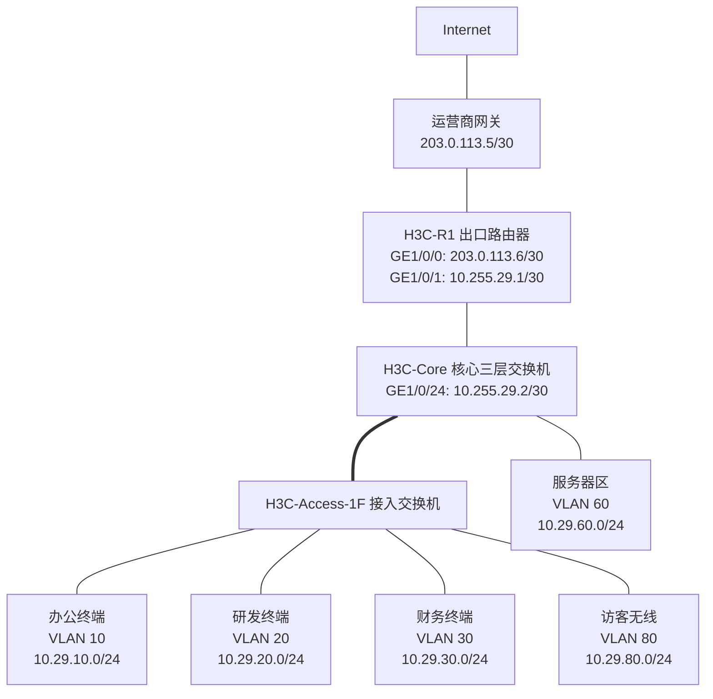

# 第 29 章：H3C 设备配置

## 29.1 本章学习目标

读完本章后，你应该能够：

- 理解 H3C Comware 设备的基本命令行层级，例如用户视图、系统视图、接口视图、VLAN 视图、OSPF 视图和用户线视图。
- 完成 H3C 交换机和路由器的基础初始化，包括设备命名、管理地址、本地账号、SSH、时间、日志和配置保存。
- 按企业地址规划配置 VLAN、Access 端口、Trunk 端口、Bridge-Aggregation、Vlan-interface 网关和静态路由。
- 使用 H3C 设备完成基础 DHCP、OSPF、ACL、接口安全和出口 NAT 配置。
- 看懂常用 `display` 命令输出背后的排错意义。
- 理解 H3C 与华为、Cisco 在命令风格上的差异，避免把不同厂商命令混用。
- 按“规划 -> 配置 -> 验证 -> 保存 -> 记录”的工程流程操作设备。

上一章学习了华为设备配置。本章继续学习 H3C 设备配置。H3C 设备常见软件平台是 Comware。它和华为 VRP 有很多相似之处，例如都使用 `system-view` 进入系统视图，都使用 `display` 查看状态，都用 `undo` 删除配置。但在 VLAN 端口命令、三层 VLAN 接口名称、链路聚合接口名称、DHCP 地址池和用户权限命令上，H3C 有自己的写法。

需要注意：H3C Comware 5、Comware 7、不同交换机系列、路由器系列和防火墙系列的命令细节可能不同。本章以企业交换机和路由器上常见的 Comware 7 风格为主，强调配置思路和排错方法。真实项目中应以现场设备型号、软件版本和厂商手册为准。

## 29.2 H3C Comware 命令行基础

学习 H3C 设备时，不要一开始就背 VLAN、OSPF、ACL。第一步仍然是理解“当前在哪个视图”。同一条命令在不同视图下可能完全不能执行。

### 常见命令视图

| 视图 | 提示符示例 | 作用 |
| --- | --- | --- |
| 用户视图 | `<H3C>` | 查看基础状态、保存配置、进入系统视图、重启设备 |
| 系统视图 | `[H3C]` | 修改全局配置，例如设备名、VLAN、路由、协议、用户 |
| 接口视图 | `[H3C-GigabitEthernet1/0/1]` | 配置接口描述、端口类型、VLAN、IP 地址、聚合等 |
| VLAN 视图 | `[H3C-vlan10]` | 配置 VLAN 名称、描述等 |
| Vlan-interface 视图 | `[H3C-Vlan-interface10]` | 配置 VLAN 的三层网关地址、DHCP、ACL 调用等 |
| OSPF 视图 | `[H3C-ospf-1]` | 配置 OSPF 进程 |
| OSPF 区域视图 | `[H3C-ospf-1-area-0.0.0.0]` | 宣告 OSPF 网段 |
| ACL 视图 | `[H3C-acl-ipv4-adv-3000]` | 配置访问控制规则 |
| 用户线视图 | `[H3C-line-vty0-4]` | 配置远程登录方式和认证方式 |

常用视图切换：

```text
<H3C> system-view
[H3C] interface GigabitEthernet1/0/1
[H3C-GigabitEthernet1/0/1] quit
[H3C] quit
<H3C>
```

### H3C 常用基础命令

| 目标 | 常用命令 | 说明 |
| --- | --- | --- |
| 进入系统视图 | `system-view` | 从用户视图进入配置模式 |
| 返回上一层 | `quit` | 返回上级视图 |
| 查看当前配置 | `display current-configuration` | 查看正在运行的配置 |
| 查看保存配置 | `display saved-configuration` | 查看下次启动使用的配置 |
| 保存配置 | `save` | 把当前配置写入启动配置 |
| 删除配置 | `undo ...` | 取消已有配置 |
| 查看版本 | `display version` | 查看型号、版本、运行时间 |
| 查看接口摘要 | `display interface brief` | 快速判断接口状态 |
| 查看日志 | `display logbuffer` | 查看设备日志 |
| 查看启动配置文件 | `display startup` | 查看下次启动使用的配置文件 |

H3C 和华为一样，大量删除配置使用 `undo`。例如：

```text
[S-Access-1F] interface GigabitEthernet1/0/1
[S-Access-1F-GigabitEthernet1/0/1] undo shutdown
[S-Access-1F-GigabitEthernet1/0/1] undo port access vlan
```

### H3C 与华为命令差异速览

| 配置对象 | 华为常见写法 | H3C 常见写法 |
| --- | --- | --- |
| VLAN 三层接口 | `interface Vlanif10` | `interface Vlan-interface10` |
| Access VLAN | `port default vlan 10` | `port access vlan 10` |
| Trunk 放行 VLAN | `port trunk allow-pass vlan 10 20` | `port trunk permit vlan 10 20` |
| 链路聚合接口 | `interface Eth-Trunk1` | `interface Bridge-Aggregation1` |
| 加入聚合组 | `eth-trunk 1` | `port link-aggregation group 1` |
| 静态 LACP | `mode lacp-static` | `link-aggregation mode dynamic` |
| VLAN 网关接口名称 | `Vlanif` | `Vlan-interface` |
| 接口调用 ACL | `traffic-filter inbound acl 3000` | `packet-filter 3000 inbound` |
| SSH 服务 | `stelnet server enable` | `ssh server enable` |

不要把“原理相同”理解成“命令可以照抄”。例如 VLANIF 和 Vlan-interface 都是在 VLAN 上提供三层网关，但命令名称不同；Trunk 都是传递多个 VLAN，但放行 VLAN 的命令关键字不同。

### 配置保存的意义

H3C 设备运行时使用的是当前配置。执行保存后，配置才会写入下次启动配置。

```text
current-configuration = 当前正在生效的配置
saved-configuration = 设备重启后加载的配置
```

生产环境推荐流程：

```text
修改配置 -> display 验证 -> 业务测试 -> save 保存 -> 记录变更
```

不要在配置刚写完、业务还没验证时马上保存。也不要在验证成功后忘记保存，否则设备重启后配置会丢失。

## 29.3 本章实验拓扑和地址规划

本章继续使用一个小型企业网络作为统一示例。为了和第 28 章区分，本章使用 `10.29.x.x` 地址段。



### VLAN 和网关规划

| VLAN | 名称 | 网段 | 网关 | 说明 |
| ---: | --- | --- | --- | --- |
| 10 | `OFFICE` | `10.29.10.0/24` | `10.29.10.1` | 办公网 |
| 20 | `RD` | `10.29.20.0/24` | `10.29.20.1` | 研发网 |
| 30 | `FINANCE` | `10.29.30.0/24` | `10.29.30.1` | 财务网 |
| 60 | `SERVER` | `10.29.60.0/24` | `10.29.60.1` | 内部服务器区 |
| 80 | `GUEST` | `10.29.80.0/24` | `10.29.80.1` | 访客无线 |
| 250 | `MGMT` | `10.29.250.0/24` | `10.29.250.1` | 网络设备管理 |

### 设备互联规划

| 连接 | 本端 | 对端 | 作用 |
| --- | --- | --- | --- |
| 接入到核心 | H3C-Access-1F `GE1/0/24` | H3C-Core `GE1/0/1` | Trunk，透传 VLAN 10/20/30/80/250 |
| 核心到出口 | H3C-Core `GE1/0/24` `10.255.29.2/30` | H3C-R1 `GE1/0/1` `10.255.29.1/30` | 三层互联 |
| 出口到运营商 | H3C-R1 `GE1/0/0` `203.0.113.6/30` | ISP `203.0.113.5/30` | 公网互联 |

### 本章配置目标

| 目标 | 相关设备 |
| --- | --- |
| 完成设备命名、管理、SSH 和保存 | 所有设备 |
| 创建业务 VLAN 和接入口 | 核心、接入交换机 |
| 配置 Trunk 上联 | 核心、接入交换机 |
| 配置 Vlan-interface 网关 | 核心交换机 |
| 配置 DHCP 地址池 | 核心交换机 |
| 配置核心到出口的静态路由 | 核心交换机、出口路由器 |
| 配置 Bridge-Aggregation 聚合链路 | 核心、接入交换机 |
| 配置基础 OSPF | 核心交换机、出口路由器 |
| 配置 ACL 限制访客访问内网 | 核心交换机 |
| 配置出口 NAT | 出口路由器 |
| 使用 `display` 命令验证 | 所有设备 |

本章示例把 VLAN 网关放在核心三层交换机上。这样核心负责 VLAN 间三层转发，出口路由器负责互联网出口和 NAT。访客网络访问内网的限制放在核心交换机的访客 Vlan-interface 入方向。

## 29.4 设备基础初始化

新设备上线前，先完成基础初始化。基础初始化的目标不是让业务马上通，而是让设备可识别、可管理、可审计。

### 修改设备名称

设备名称应体现位置、角色和编号：

```text
<H3C> system-view
[H3C] sysname H3C-Core
[H3C-Core]
```

接入交换机和出口路由器：

```text
[H3C] sysname H3C-Access-1F
[H3C] sysname H3C-R1
```

生产环境中更推荐类似下面的命名：

| 命名 | 含义 |
| --- | --- |
| `SW-Core-HQ-01` | 总部 1 号核心交换机 |
| `SW-Access-3F-02` | 3 楼 2 号接入交换机 |
| `RT-Branch-SH-01` | 上海分支 1 号出口路由器 |

设备命名不是装饰。故障告警、日志、监控、配置备份和变更记录都依赖清晰命名。

### 配置管理 VLAN 地址

接入交换机通常不承担业务网关，但需要管理 IP。本章使用 VLAN 250 作为管理 VLAN。

接入交换机：

```text
<H3C> system-view
[H3C-Access-1F] vlan 250
[H3C-Access-1F-vlan250] name MGMT
[H3C-Access-1F-vlan250] quit
[H3C-Access-1F] interface Vlan-interface250
[H3C-Access-1F-Vlan-interface250] ip address 10.29.250.11 255.255.255.0
[H3C-Access-1F-Vlan-interface250] quit
[H3C-Access-1F] ip route-static 0.0.0.0 0.0.0.0 10.29.250.1
```

这段配置包含两个关键点：

- `Vlan-interface250` 给接入交换机提供管理 IP。
- 默认路由让接入交换机能把到其他管理网段的回包发给核心网关。

如果管理 IP 无法访问，不要只查 SSH。应先确认 VLAN 250 是否存在、上联 Trunk 是否放行 VLAN 250、核心上是否存在 `Vlan-interface250`。

### 配置本地用户和 SSH

生产设备应优先使用 SSH，不建议使用 Telnet。Telnet 明文传输账号密码，不适合企业生产网络。

Comware 7 常见配置示例：

```text
[H3C-Core] public-key local create rsa
[H3C-Core] ssh server enable
[H3C-Core] local-user netadmin class manage
[H3C-Core-luser-manage-netadmin] password irreversible-cipher StrongPassword@2026
[H3C-Core-luser-manage-netadmin] service-type ssh
[H3C-Core-luser-manage-netadmin] authorization-attribute user-role network-admin
[H3C-Core-luser-manage-netadmin] quit
[H3C-Core] line vty 0 4
[H3C-Core-line-vty0-4] authentication-mode scheme
[H3C-Core-line-vty0-4] protocol inbound ssh
[H3C-Core-line-vty0-4] quit
```

说明：

| 命令 | 作用 |
| --- | --- |
| `public-key local create rsa` | 生成 SSH 服务器密钥 |
| `ssh server enable` | 开启 SSH 服务 |
| `local-user ... class manage` | 创建管理类本地用户 |
| `password irreversible-cipher` | 设置不可逆加密口令 |
| `service-type ssh` | 允许该用户通过 SSH 登录 |
| `authorization-attribute user-role network-admin` | 授予网络管理员角色 |
| `line vty 0 4` | 配置远程虚拟终端线路 |
| `authentication-mode scheme` | 使用 AAA/本地用户认证 |
| `protocol inbound ssh` | 只允许 SSH 进入 VTY |

部分旧版本 Comware 使用 `user-interface vty 0 4`、`local-user admin`、`authorization-attribute level 3` 等写法。学习时要把“本地用户、登录线路、认证方式、协议限制、权限”这几个逻辑记住，不要只记某一条版本相关命令。

### 限制管理来源地址

企业网络中，设备管理入口不应对所有网段开放。可以使用基础 ACL 限制只有管理网段或堡垒机可以 SSH。

示例：只允许管理网段 `10.29.250.0/24` 登录。

```text
[H3C-Core] acl basic 2001
[H3C-Core-acl-ipv4-basic-2001] rule 5 permit source 10.29.250.0 0.0.0.255
[H3C-Core-acl-ipv4-basic-2001] quit
[H3C-Core] line vty 0 4
[H3C-Core-line-vty0-4] acl 2001 inbound
[H3C-Core-line-vty0-4] quit
```

管理 ACL 要谨慎配置。生产环境中修改管理 ACL 前，应确认当前登录来源也被允许，否则可能把自己锁在设备外。

### 配置时间和日志

日志没有准确时间，就很难和服务器、防火墙、认证系统、监控系统做时间线对齐。

```text
[H3C-Core] clock timezone Beijing add 08:00:00
[H3C-Core] ntp-service enable
[H3C-Core] ntp-service unicast-server 10.29.60.20
[H3C-Core] info-center enable
```

企业网络中建议核心交换机、防火墙、无线控制器、认证服务器、日志平台使用统一 NTP 时间源。

### 保存配置

验证配置无误后保存：

```text
<H3C-Core> save
```

保存前建议检查：

```text
<H3C-Core> display current-configuration
<H3C-Core> display interface brief
<H3C-Core> display ip routing-table
```

配置完成不是以“命令输入成功”为准，而是以设备状态和业务验证为准。

## 29.5 VLAN 与二层接口配置

VLAN 是交换网络最常见的隔离方式。H3C 交换机上常见二层端口类型包括 Access、Trunk 和 Hybrid。初学阶段先掌握 Access 和 Trunk。

### 创建 VLAN

在核心和接入交换机上创建业务 VLAN：

```text
[H3C-Core] vlan 10
[H3C-Core-vlan10] name OFFICE
[H3C-Core-vlan10] quit
[H3C-Core] vlan 20
[H3C-Core-vlan20] name RD
[H3C-Core-vlan20] quit
[H3C-Core] vlan 30
[H3C-Core-vlan30] name FINANCE
[H3C-Core-vlan30] quit
[H3C-Core] vlan 60
[H3C-Core-vlan60] name SERVER
[H3C-Core-vlan60] quit
[H3C-Core] vlan 80
[H3C-Core-vlan80] name GUEST
[H3C-Core-vlan80] quit
[H3C-Core] vlan 250
[H3C-Core-vlan250] name MGMT
[H3C-Core-vlan250] quit
```

部分设备支持批量创建：

```text
[H3C-Core] vlan 10 20 30 60 80 250
```

真实项目中，建议为 VLAN 写清楚名称或描述。只看到 VLAN ID 时，后续运维人员很难判断它对应办公、研发、财务还是访客业务。

验证：

```text
[H3C-Core] display vlan
[H3C-Core] display vlan 10
```

### 配置 Access 端口

Access 端口通常连接普通终端、打印机、摄像头、AP 或服务器单网卡。一个 Access 端口一般只属于一个 VLAN。

办公终端接在接入交换机 `GE1/0/1`：

```text
[H3C-Access-1F] interface GigabitEthernet1/0/1
[H3C-Access-1F-GigabitEthernet1/0/1] description TO-OFFICE-PC-001
[H3C-Access-1F-GigabitEthernet1/0/1] port link-type access
[H3C-Access-1F-GigabitEthernet1/0/1] port access vlan 10
[H3C-Access-1F-GigabitEthernet1/0/1] stp edged-port
[H3C-Access-1F-GigabitEthernet1/0/1] quit
```

研发和财务端口类似：

```text
[H3C-Access-1F] interface GigabitEthernet1/0/2
[H3C-Access-1F-GigabitEthernet1/0/2] description TO-RD-PC-001
[H3C-Access-1F-GigabitEthernet1/0/2] port link-type access
[H3C-Access-1F-GigabitEthernet1/0/2] port access vlan 20
[H3C-Access-1F-GigabitEthernet1/0/2] stp edged-port
[H3C-Access-1F-GigabitEthernet1/0/2] quit

[H3C-Access-1F] interface GigabitEthernet1/0/3
[H3C-Access-1F-GigabitEthernet1/0/3] description TO-FINANCE-PC-001
[H3C-Access-1F-GigabitEthernet1/0/3] port link-type access
[H3C-Access-1F-GigabitEthernet1/0/3] port access vlan 30
[H3C-Access-1F-GigabitEthernet1/0/3] stp edged-port
[H3C-Access-1F-GigabitEthernet1/0/3] quit
```

`stp edged-port` 表示该端口连接终端，可以快速进入转发状态。不要在交换机上联口、互联口、不确定用途的端口上随意配置边缘端口。

### 配置 Trunk 上联

Trunk 用于在交换机之间传递多个 VLAN。例如接入交换机 `GE1/0/24` 上联核心交换机 `GE1/0/1`。

接入交换机侧：

```text
[H3C-Access-1F] interface GigabitEthernet1/0/24
[H3C-Access-1F-GigabitEthernet1/0/24] description TO-H3C-Core-GE1/0/1
[H3C-Access-1F-GigabitEthernet1/0/24] port link-type trunk
[H3C-Access-1F-GigabitEthernet1/0/24] port trunk permit vlan 10 20 30 80 250
[H3C-Access-1F-GigabitEthernet1/0/24] quit
```

核心交换机侧：

```text
[H3C-Core] interface GigabitEthernet1/0/1
[H3C-Core-GigabitEthernet1/0/1] description TO-H3C-Access-1F-GE1/0/24
[H3C-Core-GigabitEthernet1/0/1] port link-type trunk
[H3C-Core-GigabitEthernet1/0/1] port trunk permit vlan 10 20 30 80 250
[H3C-Core-GigabitEthernet1/0/1] quit
```

Trunk 两端放行 VLAN 必须一致。常见故障是接入侧放行了 VLAN 10/20/30，核心侧只放行 VLAN 10，结果办公网通，研发和财务不通。

验证：

```text
[H3C-Access-1F] display interface GigabitEthernet1/0/24 brief
[H3C-Access-1F] display current-configuration interface GigabitEthernet1/0/24
[H3C-Core] display current-configuration interface GigabitEthernet1/0/1
[H3C-Core] display mac-address vlan 10
```

如果终端已经发出流量，核心交换机应该能在对应 VLAN 学到终端 MAC。

### Access、Trunk 常见错误

| 现象 | 可能原因 | 验证命令 |
| --- | --- | --- |
| 终端拿不到 DHCP 地址 | 端口 VLAN 错、Trunk 未放行 VLAN、DHCP 未启用 | `display current-configuration interface ...`、`display vlan` |
| 同 VLAN 终端不通 | Access VLAN 配错、端口 down、终端防火墙、MAC 未学习 | `display interface brief`、`display mac-address` |
| 某 VLAN 跨交换机不通 | 上联 Trunk 未放行该 VLAN | `display current-configuration interface ...` |
| 管理地址不能 SSH | 管理 VLAN 未创建、Vlan-interface down、Trunk 未放行管理 VLAN | `display interface Vlan-interface250` |
| 端口上线后等待较久 | 终端口未配置边缘端口，STP 收敛等待 | `display stp brief` |

## 29.6 三层网关与静态路由配置

VLAN 只提供二层隔离。不同 VLAN 之间通信，需要三层网关。在 H3C 交换机上，VLAN 的三层接口通常叫 `Vlan-interface`。

### 配置 Vlan-interface 网关

核心交换机：

```text
[H3C-Core] interface Vlan-interface10
[H3C-Core-Vlan-interface10] description GW-OFFICE
[H3C-Core-Vlan-interface10] ip address 10.29.10.1 255.255.255.0
[H3C-Core-Vlan-interface10] quit

[H3C-Core] interface Vlan-interface20
[H3C-Core-Vlan-interface20] description GW-RD
[H3C-Core-Vlan-interface20] ip address 10.29.20.1 255.255.255.0
[H3C-Core-Vlan-interface20] quit

[H3C-Core] interface Vlan-interface30
[H3C-Core-Vlan-interface30] description GW-FINANCE
[H3C-Core-Vlan-interface30] ip address 10.29.30.1 255.255.255.0
[H3C-Core-Vlan-interface30] quit

[H3C-Core] interface Vlan-interface60
[H3C-Core-Vlan-interface60] description GW-SERVER
[H3C-Core-Vlan-interface60] ip address 10.29.60.1 255.255.255.0
[H3C-Core-Vlan-interface60] quit

[H3C-Core] interface Vlan-interface80
[H3C-Core-Vlan-interface80] description GW-GUEST
[H3C-Core-Vlan-interface80] ip address 10.29.80.1 255.255.255.0
[H3C-Core-Vlan-interface80] quit

[H3C-Core] interface Vlan-interface250
[H3C-Core-Vlan-interface250] description GW-MGMT
[H3C-Core-Vlan-interface250] ip address 10.29.250.1 255.255.255.0
[H3C-Core-Vlan-interface250] quit
```

如果 `Vlan-interface10` 配了 IP 但状态仍然 down，常见原因是：

- VLAN 10 不存在。
- VLAN 10 没有任何 up 的成员端口。
- 上联 Trunk 没有放行 VLAN 10。
- 接入口连接的终端未上线。
- 设备型号或接口模式不支持当前配置。

验证：

```text
[H3C-Core] display ip interface brief
[H3C-Core] display interface Vlan-interface10
[H3C-Core] display arp
```

### 配置核心到出口的三层互联

核心交换机与出口路由器之间使用 `10.255.29.0/30`。

核心交换机侧：

```text
[H3C-Core] interface GigabitEthernet1/0/24
[H3C-Core-GigabitEthernet1/0/24] description TO-H3C-R1-GE1/0/1
[H3C-Core-GigabitEthernet1/0/24] port link-mode route
[H3C-Core-GigabitEthernet1/0/24] ip address 10.255.29.2 255.255.255.252
[H3C-Core-GigabitEthernet1/0/24] quit
```

说明：很多 H3C 三层交换机的以太接口默认是二层口。配置三层 IP 前，需要把接口改为三层路由模式，即 `port link-mode route`。部分型号或版本的接口模式命令可能不同，也可能需要先清理二层配置。

出口路由器内侧接口：

```text
[H3C-R1] interface GigabitEthernet1/0/1
[H3C-R1-GigabitEthernet1/0/1] description TO-H3C-Core-GE1/0/24
[H3C-R1-GigabitEthernet1/0/1] ip address 10.255.29.1 255.255.255.252
[H3C-R1-GigabitEthernet1/0/1] quit
```

出口路由器外侧接口：

```text
[H3C-R1] interface GigabitEthernet1/0/0
[H3C-R1-GigabitEthernet1/0/0] description TO-ISP
[H3C-R1-GigabitEthernet1/0/0] ip address 203.0.113.6 255.255.255.252
[H3C-R1-GigabitEthernet1/0/0] quit
```

验证互联：

```text
[H3C-Core] ping 10.255.29.1
[H3C-R1] ping 10.255.29.2
[H3C-R1] ping 203.0.113.5
```

### 配置静态路由

核心交换机需要默认路由指向出口路由器：

```text
[H3C-Core] ip route-static 0.0.0.0 0.0.0.0 10.255.29.1
```

出口路由器需要回到内部网络的路由：

```text
[H3C-R1] ip route-static 10.29.0.0 255.255.0.0 10.255.29.2
[H3C-R1] ip route-static 0.0.0.0 0.0.0.0 203.0.113.5
```

这里用 `10.29.0.0/16` 汇总本章内部网段。汇总路由可以减少路由表数量，但前提是地址规划连续，且不会把不该走这条路径的网段包含进去。

验证：

```text
[H3C-Core] display ip routing-table
[H3C-Core] display ip routing-table 0.0.0.0
[H3C-R1] display ip routing-table 10.29.10.0
```

### 静态路由常见错误

| 现象 | 可能原因 | 检查点 |
| --- | --- | --- |
| 终端能 ping 网关，不能 ping 出口内侧 | 核心缺默认路由、互联口不通 | `display ip routing-table`、`ping 10.255.29.1` |
| 出口路由器能收到流量但回不来 | 出口缺内部回程路由 | `display ip routing-table 10.29.10.0` |
| 静态路由配置后不出现在路由表 | 下一跳不可达、出接口 down、掩码错误 | `display ip routing-table protocol static` |
| 只有部分 VLAN 出口异常 | NAT、ACL 或回程路由未覆盖该网段 | 对比不同源网段 |

## 29.7 DHCP 基础配置

DHCP 用于给终端自动分配 IP 地址、掩码、网关、DNS 和租约。企业办公网通常不会手工给每台电脑配置 IP。

本章示例让核心交换机为多个 VLAN 提供 DHCP 服务。

### 开启 DHCP 服务

```text
[H3C-Core] dhcp enable
```

### 配置办公网地址池

```text
[H3C-Core] dhcp server ip-pool VLAN10-OFFICE
[H3C-Core-dhcp-pool-VLAN10-OFFICE] network 10.29.10.0 mask 255.255.255.0
[H3C-Core-dhcp-pool-VLAN10-OFFICE] gateway-list 10.29.10.1
[H3C-Core-dhcp-pool-VLAN10-OFFICE] dns-list 10.29.60.10 10.29.60.11
[H3C-Core-dhcp-pool-VLAN10-OFFICE] forbidden-ip 10.29.10.1 10.29.10.30
[H3C-Core-dhcp-pool-VLAN10-OFFICE] expired day 7
[H3C-Core-dhcp-pool-VLAN10-OFFICE] quit
```

说明：

| 配置 | 含义 |
| --- | --- |
| `network` | 地址池所属网段 |
| `gateway-list` | 下发给终端的默认网关 |
| `dns-list` | 下发给终端的 DNS 服务器 |
| `forbidden-ip` | 保留地址，不分配给终端 |
| `expired` | 地址租约时间 |

保留 `10.29.10.1` 到 `10.29.10.30` 是为了给网关、打印机、服务器管理口、临时测试地址预留空间。

### 配置其他 VLAN 地址池

```text
[H3C-Core] dhcp server ip-pool VLAN20-RD
[H3C-Core-dhcp-pool-VLAN20-RD] network 10.29.20.0 mask 255.255.255.0
[H3C-Core-dhcp-pool-VLAN20-RD] gateway-list 10.29.20.1
[H3C-Core-dhcp-pool-VLAN20-RD] dns-list 10.29.60.10 10.29.60.11
[H3C-Core-dhcp-pool-VLAN20-RD] forbidden-ip 10.29.20.1 10.29.20.30
[H3C-Core-dhcp-pool-VLAN20-RD] quit

[H3C-Core] dhcp server ip-pool VLAN30-FINANCE
[H3C-Core-dhcp-pool-VLAN30-FINANCE] network 10.29.30.0 mask 255.255.255.0
[H3C-Core-dhcp-pool-VLAN30-FINANCE] gateway-list 10.29.30.1
[H3C-Core-dhcp-pool-VLAN30-FINANCE] dns-list 10.29.60.10 10.29.60.11
[H3C-Core-dhcp-pool-VLAN30-FINANCE] forbidden-ip 10.29.30.1 10.29.30.30
[H3C-Core-dhcp-pool-VLAN30-FINANCE] quit

[H3C-Core] dhcp server ip-pool VLAN80-GUEST
[H3C-Core-dhcp-pool-VLAN80-GUEST] network 10.29.80.0 mask 255.255.255.0
[H3C-Core-dhcp-pool-VLAN80-GUEST] gateway-list 10.29.80.1
[H3C-Core-dhcp-pool-VLAN80-GUEST] dns-list 114.114.114.114 223.5.5.5
[H3C-Core-dhcp-pool-VLAN80-GUEST] forbidden-ip 10.29.80.1 10.29.80.20
[H3C-Core-dhcp-pool-VLAN80-GUEST] expired day 0 hour 8
[H3C-Core-dhcp-pool-VLAN80-GUEST] quit
```

访客网络终端变化频繁，租约可以短一些。办公网、研发网租约可以相对长一些。

### 在 Vlan-interface 上启用 DHCP Server

地址池创建完成后，还需要在对应三层接口上启用 DHCP Server：

```text
[H3C-Core] interface Vlan-interface10
[H3C-Core-Vlan-interface10] dhcp select server
[H3C-Core-Vlan-interface10] quit

[H3C-Core] interface Vlan-interface20
[H3C-Core-Vlan-interface20] dhcp select server
[H3C-Core-Vlan-interface20] quit

[H3C-Core] interface Vlan-interface30
[H3C-Core-Vlan-interface30] dhcp select server
[H3C-Core-Vlan-interface30] quit

[H3C-Core] interface Vlan-interface80
[H3C-Core-Vlan-interface80] dhcp select server
[H3C-Core-Vlan-interface80] quit
```

只创建地址池不代表终端一定能拿到地址。对应 Vlan-interface 要启用 DHCP 服务，二层路径也要能把终端 DHCP Discover 报文送到网关。

### DHCP 验证

设备侧：

```text
[H3C-Core] display dhcp server ip-in-use
[H3C-Core] display dhcp server statistics
[H3C-Core] display dhcp server pool
[H3C-Core] display arp vlan 10
```

终端侧应检查：

```text
IP 地址：10.29.10.x
掩码：255.255.255.0
网关：10.29.10.1
DNS：10.29.60.10 / 10.29.60.11
```

如果终端拿到 `169.254.x.x`，说明 DHCP 获取失败。优先检查 Access VLAN、Trunk 放行、Vlan-interface 状态、DHCP 服务是否启用、地址池是否耗尽。

## 29.8 Bridge-Aggregation 链路聚合配置

如果接入交换机到核心交换机有两条或多条物理链路，可以使用链路聚合，提高带宽并提供链路冗余。H3C 上常见聚合接口名称是 `Bridge-Aggregation`。

本节假设接入交换机 `GE1/0/23` 和 `GE1/0/24` 上联核心交换机 `GE1/0/1` 和 `GE1/0/2`，组成 `Bridge-Aggregation1`。


### 核心交换机配置

```text
[H3C-Core] interface Bridge-Aggregation1
[H3C-Core-Bridge-Aggregation1] description TO-H3C-Access-1F
[H3C-Core-Bridge-Aggregation1] link-aggregation mode dynamic
[H3C-Core-Bridge-Aggregation1] port link-type trunk
[H3C-Core-Bridge-Aggregation1] port trunk permit vlan 10 20 30 80 250
[H3C-Core-Bridge-Aggregation1] quit

[H3C-Core] interface GigabitEthernet1/0/1
[H3C-Core-GigabitEthernet1/0/1] port link-aggregation group 1
[H3C-Core-GigabitEthernet1/0/1] quit

[H3C-Core] interface GigabitEthernet1/0/2
[H3C-Core-GigabitEthernet1/0/2] port link-aggregation group 1
[H3C-Core-GigabitEthernet1/0/2] quit
```

### 接入交换机配置

```text
[H3C-Access-1F] interface Bridge-Aggregation1
[H3C-Access-1F-Bridge-Aggregation1] description TO-H3C-Core
[H3C-Access-1F-Bridge-Aggregation1] link-aggregation mode dynamic
[H3C-Access-1F-Bridge-Aggregation1] port link-type trunk
[H3C-Access-1F-Bridge-Aggregation1] port trunk permit vlan 10 20 30 80 250
[H3C-Access-1F-Bridge-Aggregation1] quit

[H3C-Access-1F] interface GigabitEthernet1/0/23
[H3C-Access-1F-GigabitEthernet1/0/23] port link-aggregation group 1
[H3C-Access-1F-GigabitEthernet1/0/23] quit

[H3C-Access-1F] interface GigabitEthernet1/0/24
[H3C-Access-1F-GigabitEthernet1/0/24] port link-aggregation group 1
[H3C-Access-1F-GigabitEthernet1/0/24] quit
```

`link-aggregation mode dynamic` 表示使用 LACP 动态聚合。两端都应使用相同模式。成员口加入聚合后，Trunk、允许 VLAN 等二层配置应放在 `Bridge-Aggregation1` 上统一配置，不要在成员口上分别写不同配置。

### 链路聚合验证

```text
[H3C-Core] display link-aggregation verbose
[H3C-Core] display link-aggregation summary
[H3C-Core] display interface Bridge-Aggregation1
```

如果只有一条链路加入聚合，另一条没有加入，应检查：

- 两端是否都配置为动态 LACP。
- 成员口速率、双工、端口类型是否一致。
- 物理链路是否接错。
- 成员口是否残留其他二层配置。
- 光模块、网线、对端端口是否正常。

## 29.9 STP 基础配置与边缘端口

STP 的目标是防止二层环路。H3C 交换机通常支持 STP、RSTP、MSTP 等模式。企业网络中常见做法是核心交换机作为根桥，接入交换机作为下级设备。

### 配置核心为根桥

```text
[H3C-Core] stp global enable
[H3C-Core] stp mode mstp
[H3C-Core] stp root primary
```

备核心可以配置为备用根桥：

```text
[H3C-Core-Backup] stp global enable
[H3C-Core-Backup] stp mode mstp
[H3C-Core-Backup] stp root secondary
```

根桥应该放在拓扑中心，通常是核心或汇聚交换机。不要让某台接入交换机因为 MAC 地址较小而意外成为根桥。

### 接入口配置边缘端口

连接普通终端的端口可以配置边缘端口：

```text
[H3C-Access-1F] interface GigabitEthernet1/0/1
[H3C-Access-1F-GigabitEthernet1/0/1] stp edged-port
[H3C-Access-1F-GigabitEthernet1/0/1] quit
```

如果担心用户私接小交换机，可以配合 BPDU 防护。具体命令和支持情况与型号、版本有关，生产环境配置前应确认设备文档。

### STP 验证

```text
[H3C-Core] display stp brief
[H3C-Core] display stp
[H3C-Access-1F] display stp brief
```

重点看：

| 项目 | 含义 |
| --- | --- |
| Root ID | 当前根桥是谁 |
| Root Port | 非根交换机通向根桥的端口 |
| Designated Port | 指定端口，正常转发 |
| Alternate Port | 备用端口，通常阻塞 |
| Edge Port | 边缘端口 |

如果出现广播风暴、接口流量异常、MAC 地址表频繁漂移，应优先怀疑二层环路、错误 Trunk、私接交换机或 STP 配置问题。

## 29.10 OSPF 动态路由基础配置

小型网络用静态路由即可。网络规模扩大后，核心、分支、出口、数据中心之间路由越来越多，动态路由会更易维护。本节只介绍单区域 OSPF，让核心交换机和出口路由器互相学习路由。

### OSPF 地址规划

| 设备 | Router ID | 宣告网段 |
| --- | --- | --- |
| H3C-Core | `10.255.29.2` | `10.29.0.0/16`、`10.255.29.0/30` |
| H3C-R1 | `10.255.29.1` | `10.255.29.0/30`、默认路由下发 |

### 核心交换机 OSPF 配置

```text
[H3C-Core] ospf 1 router-id 10.255.29.2
[H3C-Core-ospf-1] area 0.0.0.0
[H3C-Core-ospf-1-area-0.0.0.0] network 10.29.0.0 0.0.255.255
[H3C-Core-ospf-1-area-0.0.0.0] network 10.255.29.0 0.0.0.3
[H3C-Core-ospf-1-area-0.0.0.0] quit
[H3C-Core-ospf-1] quit
```

### 出口路由器 OSPF 配置

```text
[H3C-R1] ospf 1 router-id 10.255.29.1
[H3C-R1-ospf-1] area 0.0.0.0
[H3C-R1-ospf-1-area-0.0.0.0] network 10.255.29.0 0.0.0.3
[H3C-R1-ospf-1-area-0.0.0.0] quit
[H3C-R1-ospf-1] default-route-advertise
[H3C-R1-ospf-1] quit
```

`default-route-advertise` 表示把默认路由通告给 OSPF 邻居。前提是出口路由器本身有可用默认路由。

### OSPF 验证

```text
[H3C-Core] display ospf peer
[H3C-Core] display ospf routing
[H3C-Core] display ip routing-table protocol ospf
[H3C-R1] display ospf peer
```

邻居正常时，应看到邻居状态为 Full。若无法建立邻居，常见原因包括：

| 原因 | 说明 |
| --- | --- |
| 互联 IP 不通 | OSPF 依赖底层三层连通 |
| Area 不一致 | 两端接口必须在同一区域 |
| Router ID 冲突 | 同一 OSPF 域中 Router ID 必须唯一 |
| 掩码或网络类型不匹配 | 可能导致邻居异常 |
| 认证不一致 | 一端开启认证另一端未配置 |
| ACL 阻断协议报文 | OSPF 使用 IP 协议号 89 |

OSPF 比静态路由灵活，但也更需要监控。生产环境中应监控邻居状态、路由变化和链路抖动。

## 29.11 ACL 基础配置

ACL 是访问控制列表，用于匹配流量。H3C 上常见 IPv4 ACL 包括 basic 和 advanced。

| 类型 | 常见编号范围 | 匹配能力 | 常见用途 |
| --- | --- | --- | --- |
| Basic ACL | 2000-2999 | 主要匹配源 IP | 限制管理登录来源、简单过滤 |
| Advanced ACL | 3000-3999 | 匹配源、目的、协议、端口 | 控制业务访问 |

本节实现一个常见需求：

```text
访客无线 VLAN 80 只能访问互联网，不能访问企业内部 10.29.0.0/16。
```

### 配置高级 ACL

```text
[H3C-Core] acl advanced 3000
[H3C-Core-acl-ipv4-adv-3000] rule 5 deny ip source 10.29.80.0 0.0.0.255 destination 10.29.10.0 0.0.0.255
[H3C-Core-acl-ipv4-adv-3000] rule 10 deny ip source 10.29.80.0 0.0.0.255 destination 10.29.20.0 0.0.0.255
[H3C-Core-acl-ipv4-adv-3000] rule 15 deny ip source 10.29.80.0 0.0.0.255 destination 10.29.30.0 0.0.0.255
[H3C-Core-acl-ipv4-adv-3000] rule 20 deny ip source 10.29.80.0 0.0.0.255 destination 10.29.60.0 0.0.0.255
[H3C-Core-acl-ipv4-adv-3000] rule 25 deny ip source 10.29.80.0 0.0.0.255 destination 10.29.250.0 0.0.0.255
[H3C-Core-acl-ipv4-adv-3000] rule 100 permit ip source 10.29.80.0 0.0.0.255
[H3C-Core-acl-ipv4-adv-3000] quit
```

这里使用的是通配符掩码：

```text
10.29.80.0 0.0.0.255 = 匹配 10.29.80.0/24
10.29.10.0 0.0.0.255 = 匹配 10.29.10.0/24
```

通配符掩码中，`0` 表示必须匹配，`255` 表示可以变化。

这里没有直接拒绝整个 `10.29.0.0/16`，是为了避免把访客访问自身网关 `10.29.80.1` 也一起拦截。真实项目中应按实际内部网段逐条拒绝，或者把访客网关放在防火墙上，由防火墙安全区域策略统一控制。

### 在 Vlan-interface 入方向调用 ACL

```text
[H3C-Core] interface Vlan-interface80
[H3C-Core-Vlan-interface80] packet-filter 3000 inbound
[H3C-Core-Vlan-interface80] quit
```

把 ACL 放在访客 Vlan-interface 入方向，表示访客终端流量一进入三层网关就被检查。这样可以尽早阻断访客访问内网。

### ACL 验证

访客终端应测试：

```text
ping 10.29.80.1        # 应可达本网关
ping 10.29.10.1        # 应被拒绝或不可达
ping 10.29.60.10       # 应被拒绝或不可达
ping 公网地址           # 如果出口 NAT 正常，应可达
```

设备侧检查：

```text
[H3C-Core] display acl 3000
[H3C-Core] display packet-filter
```

ACL 排错时要特别注意规则顺序。ACL 通常按规则编号从小到大匹配，先匹配先执行。如果把允许规则放在拒绝规则前面，后面的拒绝规则可能不会命中。

## 29.12 出口 NAT 配置思路

内网私有地址访问互联网通常需要 NAT。本节假设出口设备是 H3C 路由器，使用出口接口公网地址做 Easy IP。

### 配置允许 NAT 的 ACL

```text
[H3C-R1] acl basic 2000
[H3C-R1-acl-ipv4-basic-2000] rule 5 permit source 10.29.0.0 0.0.255.255
[H3C-R1-acl-ipv4-basic-2000] quit
```

### 在公网出口接口启用 NAT

```text
[H3C-R1] interface GigabitEthernet1/0/0
[H3C-R1-GigabitEthernet1/0/0] nat outbound 2000
[H3C-R1-GigabitEthernet1/0/0] quit
```

这表示内网 `10.29.0.0/16` 访问公网时，源地址转换为出口接口公网地址 `203.0.113.6`。这适合只有一个公网地址的小型出口。

如果企业有公网地址池，可能使用地址池 NAT；如果对外发布内部服务器，可能使用服务器映射或目的 NAT。NAT 原理已经在第 16 章讲过，本节重点是 H3C 出口基础命令结构。

### NAT 验证

```text
[H3C-R1] display nat session
[H3C-R1] display acl 2000
[H3C-R1] display ip routing-table
```

终端侧测试：

```text
ping 10.29.10.1
ping 10.255.29.1
ping 203.0.113.5
访问公网 IP 或域名
```

如果能 ping 出口内侧，不能访问公网，排查顺序应为：

1. 核心默认路由是否指向出口。
2. 出口是否有回内网路由。
3. 出口默认路由是否指向运营商。
4. NAT ACL 是否匹配源地址。
5. NAT 是否应用在正确公网出接口。
6. 运营商网关是否可达。
7. DNS 是否正常。

## 29.13 常用 display 验证命令

H3C 设备排错时，`display` 命令比反复改配置更重要。配置表示“你希望设备怎样工作”，状态表示“设备现在实际怎样工作”。

### 接口和链路

| 目标 | 命令 | 关注点 |
| --- | --- | --- |
| 查看接口摘要 | `display interface brief` | 接口 up/down、协议状态、速率 |
| 查看接口详细信息 | `display interface GigabitEthernet1/0/1` | 错包、丢包、CRC、流量 |
| 查看 IP 接口 | `display ip interface brief` | 三层接口地址和状态 |
| 查看接口配置 | `display current-configuration interface GigabitEthernet1/0/1` | 端口类型、VLAN、描述 |

接口状态要同时看物理状态和协议状态。物理 down 时，优先查网线、光模块、对端端口、电源和接口 shutdown 状态。

### 二层状态

| 目标 | 命令 | 关注点 |
| --- | --- | --- |
| 查看 VLAN | `display vlan` | VLAN 是否存在、成员端口 |
| 查看 MAC 表 | `display mac-address` | 终端 MAC 从哪个端口学习 |
| 查看 STP | `display stp brief` | 根桥、端口角色、阻塞状态 |
| 查看聚合 | `display link-aggregation verbose` | 成员口是否正常加入 |
| 查看接口配置 | `display current-configuration interface ...` | Trunk 放行 VLAN 是否正确 |

MAC 表很适合定位终端位置。例如已知终端 MAC，可以先在核心交换机查它从哪个上联口学习到，再到接入交换机继续查，直到定位到具体接入口。

### 三层和路由状态

| 目标 | 命令 | 关注点 |
| --- | --- | --- |
| 查看 ARP | `display arp` | IP 和 MAC 是否解析 |
| 查看路由表 | `display ip routing-table` | 目的网段下一跳和出接口 |
| 查看指定路由 | `display ip routing-table 10.29.60.0` | 某目的网段是否有路由 |
| 测试连通性 | `ping` | 丢包、延迟、可达性 |
| 跟踪路径 | `tracert` | 三层路径 |
| 查看 OSPF 邻居 | `display ospf peer` | 邻居是否 Full |

三层排错要同时查去程路由和回程路由。很多故障表现为源端发得出去，但目的端回不来。

### DHCP、ACL 和 NAT

| 目标 | 命令 | 关注点 |
| --- | --- | --- |
| 查看 DHCP 租约 | `display dhcp server ip-in-use` | 终端是否获得地址 |
| 查看地址池 | `display dhcp server pool` | 地址池配置、已用情况 |
| 查看 DHCP 统计 | `display dhcp server statistics` | 请求、分配、冲突信息 |
| 查看 ACL | `display acl 3000` | 规则顺序、匹配统计 |
| 查看 ACL 调用 | `display packet-filter` | ACL 是否应用到接口 |
| 查看 NAT 会话 | `display nat session` | 源地址是否被转换 |

排错时建议把命令结果和预期写成表格：

| 检查项 | 预期 | 实际 | 判断 |
| --- | --- | --- | --- |
| 终端 IP | `10.29.10.x/24` | `10.29.10.51/24` | 正常 |
| 网关可达 | ping `10.29.10.1` 成功 | 成功 | 二层和网关正常 |
| 核心默认路由 | 下一跳 `10.255.29.1` | 存在 | 正常 |
| 出口 NAT 会话 | 有 `10.29.10.51` 转换记录 | 无 | 继续查 NAT ACL 和出接口 |

这种记录方式能避免排错过程变成口头猜测。

## 29.14 H3C 配置完整示例

本节把前面分散配置整理成简化版本。实际项目中不要直接复制到生产设备，应先按现场接口、地址、版本和业务需求调整。

### 核心交换机 H3C-Core

```text
system-view
sysname H3C-Core

vlan 10
 name OFFICE
quit
vlan 20
 name RD
quit
vlan 30
 name FINANCE
quit
vlan 60
 name SERVER
quit
vlan 80
 name GUEST
quit
vlan 250
 name MGMT
quit

interface Vlan-interface10
 description GW-OFFICE
 ip address 10.29.10.1 255.255.255.0
 dhcp select server
quit
interface Vlan-interface20
 description GW-RD
 ip address 10.29.20.1 255.255.255.0
 dhcp select server
quit
interface Vlan-interface30
 description GW-FINANCE
 ip address 10.29.30.1 255.255.255.0
 dhcp select server
quit
interface Vlan-interface60
 description GW-SERVER
 ip address 10.29.60.1 255.255.255.0
quit
interface Vlan-interface80
 description GW-GUEST
 ip address 10.29.80.1 255.255.255.0
 dhcp select server
 packet-filter 3000 inbound
quit
interface Vlan-interface250
 description GW-MGMT
 ip address 10.29.250.1 255.255.255.0
quit

interface GigabitEthernet1/0/1
 description TO-H3C-Access-1F
 port link-type trunk
 port trunk permit vlan 10 20 30 80 250
quit

interface GigabitEthernet1/0/24
 description TO-H3C-R1
 port link-mode route
 ip address 10.255.29.2 255.255.255.252
quit

dhcp enable
dhcp server ip-pool VLAN10-OFFICE
 network 10.29.10.0 mask 255.255.255.0
 gateway-list 10.29.10.1
 dns-list 10.29.60.10 10.29.60.11
 forbidden-ip 10.29.10.1 10.29.10.30
 expired day 7
quit
dhcp server ip-pool VLAN20-RD
 network 10.29.20.0 mask 255.255.255.0
 gateway-list 10.29.20.1
 dns-list 10.29.60.10 10.29.60.11
 forbidden-ip 10.29.20.1 10.29.20.30
quit
dhcp server ip-pool VLAN30-FINANCE
 network 10.29.30.0 mask 255.255.255.0
 gateway-list 10.29.30.1
 dns-list 10.29.60.10 10.29.60.11
 forbidden-ip 10.29.30.1 10.29.30.30
quit
dhcp server ip-pool VLAN80-GUEST
 network 10.29.80.0 mask 255.255.255.0
 gateway-list 10.29.80.1
 dns-list 114.114.114.114 223.5.5.5
 forbidden-ip 10.29.80.1 10.29.80.20
 expired day 0 hour 8
quit

acl advanced 3000
 rule 5 deny ip source 10.29.80.0 0.0.0.255 destination 10.29.10.0 0.0.0.255
 rule 10 deny ip source 10.29.80.0 0.0.0.255 destination 10.29.20.0 0.0.0.255
 rule 15 deny ip source 10.29.80.0 0.0.0.255 destination 10.29.30.0 0.0.0.255
 rule 20 deny ip source 10.29.80.0 0.0.0.255 destination 10.29.60.0 0.0.0.255
 rule 25 deny ip source 10.29.80.0 0.0.0.255 destination 10.29.250.0 0.0.0.255
 rule 100 permit ip source 10.29.80.0 0.0.0.255
quit

ip route-static 0.0.0.0 0.0.0.0 10.255.29.1
```

### 接入交换机 H3C-Access-1F

```text
system-view
sysname H3C-Access-1F

vlan 10
 name OFFICE
quit
vlan 20
 name RD
quit
vlan 30
 name FINANCE
quit
vlan 80
 name GUEST
quit
vlan 250
 name MGMT
quit

interface Vlan-interface250
 ip address 10.29.250.11 255.255.255.0
quit
ip route-static 0.0.0.0 0.0.0.0 10.29.250.1

interface GigabitEthernet1/0/1
 description TO-OFFICE-PC-001
 port link-type access
 port access vlan 10
 stp edged-port
quit
interface GigabitEthernet1/0/2
 description TO-RD-PC-001
 port link-type access
 port access vlan 20
 stp edged-port
quit
interface GigabitEthernet1/0/3
 description TO-FINANCE-PC-001
 port link-type access
 port access vlan 30
 stp edged-port
quit
interface GigabitEthernet1/0/24
 description TO-H3C-Core
 port link-type trunk
 port trunk permit vlan 10 20 30 80 250
quit
```

### 出口路由器 H3C-R1

```text
system-view
sysname H3C-R1

interface GigabitEthernet1/0/0
 description TO-ISP
 ip address 203.0.113.6 255.255.255.252
 nat outbound 2000
quit
interface GigabitEthernet1/0/1
 description TO-H3C-Core
 ip address 10.255.29.1 255.255.255.252
quit

acl basic 2000
 rule 5 permit source 10.29.0.0 0.0.255.255
quit

ip route-static 10.29.0.0 255.255.0.0 10.255.29.2
ip route-static 0.0.0.0 0.0.0.0 203.0.113.5
```

完整配置不是为了背诵，而是帮助你看到一个企业基础网络需要哪些配置块互相配合：

```text
VLAN -> 接口 -> Vlan-interface 网关 -> DHCP -> 路由 -> ACL -> NAT -> 验证
```

少了任何一个环节，业务都可能不通。

## 29.15 配置后的验证流程

配置完成后，建议按从低到高、从近到远的顺序验证。

### 第一步：检查接口状态

```text
[H3C-Core] display interface brief
[H3C-Access-1F] display interface brief
[H3C-R1] display interface brief
```

应使用的上联口、互联口和终端口都应 up。未接线的空闲口 down 是正常的。

### 第二步：检查 VLAN 和 Trunk

```text
[H3C-Access-1F] display vlan
[H3C-Access-1F] display current-configuration interface GigabitEthernet1/0/24
[H3C-Core] display current-configuration interface GigabitEthernet1/0/1
```

确认：

- 终端端口在正确 Access VLAN。
- 上联 Trunk 放行 VLAN 10/20/30/80/250。
- 核心和接入两端 Trunk 放行列表一致。

### 第三步：检查网关和 DHCP

```text
[H3C-Core] display ip interface brief
[H3C-Core] display dhcp server ip-in-use
[H3C-Core] display arp
```

终端应获得正确地址，并能 ping 通本网关：

```text
办公终端：ping 10.29.10.1
研发终端：ping 10.29.20.1
财务终端：ping 10.29.30.1
访客终端：ping 10.29.80.1
```

### 第四步：检查跨网段和出口

```text
办公终端 ping 10.29.60.10
办公终端 ping 10.255.29.1
办公终端 ping 203.0.113.5
办公终端访问公网域名
```

如果 IP 可达但域名不可达，优先查 DNS。如果到出口内侧可达但公网不可达，优先查出口默认路由、NAT 和运营商链路。

### 第五步：检查 ACL 预期

访客终端：

```text
ping 10.29.80.1      # 应成功
ping 10.29.10.1      # 应失败
ping 10.29.60.10     # 应失败
访问公网              # 应成功，前提是出口允许并完成 NAT
```

设备侧：

```text
[H3C-Core] display acl 3000
[H3C-Core] display packet-filter
```

如果 ACL 没有效果，检查 ACL 是否应用到了正确接口和正确方向。

### 第六步：保存配置并记录

```text
<H3C-Core> save
<H3C-Access-1F> save
<H3C-R1> save
```

变更记录至少应包含：

| 项目 | 示例 |
| --- | --- |
| 变更时间 | 2026-06-09 22:00 |
| 变更设备 | H3C-Core、H3C-Access-1F、H3C-R1 |
| 变更内容 | 新增 VLAN 10/20/30/60/80/250，配置网关、DHCP、静态路由、访客 ACL、出口 NAT |
| 验证结果 | 办公网 DHCP 正常，办公可访问服务器和公网，访客不能访问内网 |
| 回退方式 | 删除新增 Vlan-interface、ACL、路由、NAT，恢复备份配置 |

## 29.16 常见故障与排查

H3C 设备排错仍然遵循第 27 章的方法：先确认现象，再按层次和路径缩小范围。

### 故障一：终端无法获取 IP 地址

常见现象：

```text
Windows 显示 169.254.x.x
终端提示无 Internet
交换机端口 up，但终端无法通信
```

排查顺序：

1. 查终端所接交换机端口是否 up。
2. 查端口是否在正确 Access VLAN。
3. 查上联 Trunk 是否放行该 VLAN。
4. 查核心是否存在对应 VLAN 和 Vlan-interface。
5. 查 Vlan-interface 是否 up。
6. 查 DHCP 地址池是否存在、是否耗尽。
7. 查 Vlan-interface 是否配置 `dhcp select server`。

常用命令：

```text
display interface brief
display current-configuration interface GigabitEthernet1/0/1
display vlan 10
display interface Vlan-interface10
display dhcp server pool
display dhcp server ip-in-use
```

### 故障二：同 VLAN 终端不通

如果两个办公终端都在 VLAN 10，却互相不通，优先查二层。

| 检查项 | 说明 |
| --- | --- |
| 端口 VLAN | 两个端口是否都在 VLAN 10 |
| MAC 学习 | 交换机是否学习到两个终端 MAC |
| 终端地址 | 是否在同一网段，是否 IP 冲突 |
| 本机防火墙 | 终端系统可能禁止 ICMP |
| 端口安全 | 是否有 MAC 限制或安全策略 |

命令：

```text
display mac-address vlan 10
display arp vlan 10
display interface GigabitEthernet1/0/1
```

### 故障三：跨 VLAN 不通

跨 VLAN 不通时要同时查三层网关、路由和安全策略。

排查顺序：

1. 源终端能否 ping 通本网关。
2. 目的终端能否 ping 通自己的网关。
3. 核心交换机是否有两个 Vlan-interface。
4. 是否存在 ACL 阻断。
5. 目的终端本机防火墙是否阻断。
6. 回程路径是否正确。

命令：

```text
display ip interface brief
display ip routing-table
display acl all
display arp
```

### 故障四：只有某个 VLAN 无法上网

如果办公网可以上网，访客网不能上网，不要马上怀疑运营商。运营商链路是公共路径，如果只有一个 VLAN 失败，通常是源网段相关配置问题。

常见原因：

| 原因 | 说明 |
| --- | --- |
| DHCP DNS 下发错误 | 终端能访问 IP，不能访问域名 |
| 核心 ACL 阻断过宽 | 访客 ACL 把公网也拒绝了 |
| 出口 NAT ACL 未包含该网段 | 出口没有为该 VLAN 做源 NAT |
| 路由缺失 | 出口不知道如何回到该 VLAN |
| 策略路由错误 | 流量被引到错误出口 |

命令：

```text
[H3C-Core] display acl 3000
[H3C-R1] display acl 2000
[H3C-R1] display nat session
[H3C-R1] display ip routing-table 10.29.80.0
```

### 故障五：SSH 无法登录设备

SSH 登录失败可能不是账号问题。要按路径检查：

| 检查项 | 说明 |
| --- | --- |
| 管理地址 | 管理 Vlan-interface 是否 up，地址是否正确 |
| 路由 | 管理终端到设备、设备回管理终端是否有路由 |
| SSH 服务 | 是否开启 `ssh server enable` |
| VTY | 是否允许 SSH，认证方式是否为 scheme |
| 用户 | 本地用户是否允许 `service-type ssh` |
| 权限 | 用户是否具备管理角色或足够权限 |
| ACL | 是否限制了管理来源 |

命令：

```text
display ip interface brief
display current-configuration | include ssh
display current-configuration configuration line-vty
display current-configuration | include local-user
display ssh server status
```

不同版本对管道过滤、SSH 状态命令支持可能不同。如果某条显示命令不可用，可以改用 `display current-configuration` 查看相关配置块。

### 故障六：配置重启后丢失

原因通常很简单：没有保存配置，或者启动配置文件不是你刚保存的文件。

检查：

```text
display current-configuration
display saved-configuration
display startup
```

如果当前配置有、保存配置没有，说明还未执行 `save`。生产环境中建议在变更验证成功后立即保存，并把保存动作写入变更记录。

## 29.17 H3C 配置学习方法

学习厂商命令时，不要把命令当成孤立句子。更好的方法是把每条命令放回网络模型中理解。

### 用问题驱动命令

| 你要解决的问题 | 对应配置 |
| --- | --- |
| 这台设备叫什么，谁在管理它 | `sysname`、本地用户、SSH、NTP、日志 |
| 哪些终端属于同一二层网络 | VLAN、Access 端口 |
| 多个 VLAN 如何跨交换机传递 | Trunk、Bridge-Aggregation |
| 不同 VLAN 如何互通 | Vlan-interface、路由 |
| 终端如何自动获得地址 | DHCP 地址池、`dhcp select server` |
| 去其他网络走哪里 | 静态路由或 OSPF |
| 谁不能访问谁 | ACL 或防火墙策略 |
| 私网如何访问公网 | NAT |
| 出问题如何证明 | `display`、`ping`、`tracert`、日志 |

### 建议练习顺序

1. 只用一台交换机，练习 VLAN 和 Access 端口。
2. 用两台交换机，练习 Trunk 和跨交换机同 VLAN 通信。
3. 加核心三层交换机，练习 Vlan-interface 和跨 VLAN 通信。
4. 加 DHCP，练习终端自动获取地址。
5. 加出口路由器，练习默认路由和回程路由。
6. 加 ACL，练习访客隔离和管理来源限制。
7. 加 Bridge-Aggregation 和 STP，练习冗余链路。
8. 加 OSPF，练习动态路由邻居和路由学习。

每个阶段都要形成小闭环：

```text
画拓扑 -> 写地址表 -> 配置设备 -> display 验证 -> 制造故障 -> 排查恢复
```

只看配置不会形成工程能力。一定要主动制造可控故障，例如删掉 Trunk 允许 VLAN、写错网关、关闭接口、删除默认路由，然后用命令证明故障边界。

### 不同厂商学习时的对照方法

学习 H3C、华为、Cisco 时，可以把每个配置目标拆成三层：

| 层次 | 例子 | 学习重点 |
| --- | --- | --- |
| 网络原理 | VLAN 隔离、三层网关、路由、NAT | 原理不随厂商变化 |
| 厂商模型 | H3C 的 Vlan-interface、Bridge-Aggregation、line vty | 设备软件平台的组织方式 |
| 命令细节 | `port access vlan`、`packet-filter` | 需要查版本和手册 |

这样学习能避免两个问题：

- 只会背命令，换设备就不会配置。
- 只懂原理，不知道真实设备从哪里下命令。

## 29.18 自检练习

完成本章后，可以用下面的问题检查自己是否真正理解。

1. H3C 用户视图、系统视图、接口视图分别能做什么？
2. `current-configuration` 和 `saved-configuration` 有什么区别？
3. H3C 的 `Vlan-interface10` 和华为的 `Vlanif10` 在逻辑上有什么相同点？
4. H3C Access 端口加入 VLAN 10 的命令是什么？
5. H3C Trunk 放行 VLAN 10、20、30 的命令是什么？
6. `port link-mode route` 解决什么问题？
7. 核心交换机默认路由和出口路由器回程路由分别解决什么问题？
8. DHCP 地址池配置完成后，为什么还要在 Vlan-interface 上配置 `dhcp select server`？
9. Bridge-Aggregation 成员口不能正常加入时，应检查哪些因素？
10. OSPF 邻居无法 Full，应该从哪些方向排查？
11. ACL 中 `0.0.0.255` 通配符掩码是什么意思？
12. 为什么访客 ACL 不建议简单拒绝整个 `10.29.0.0/16`？
13. 访客 VLAN 能获取 IP，但既不能访问内网也不能访问公网，应该如何区分是 ACL 问题还是 NAT 问题？
14. SSH 登录失败时，为什么不能只检查用户名和密码？

建议把本章拓扑在 HCL、EVE-NG 或其他实验环境中完整做一遍，并记录每一步验证结果。不要只记录配置命令，也要记录为什么这条命令存在。

## 29.19 本章小结

本章把前面学习的 VLAN、三层交换、DHCP、路由、ACL、NAT、STP 和链路聚合落实到了 H3C Comware 设备配置中。

需要记住的重点不是某一条命令，而是配置之间的关系：

- VLAN 决定二层边界。
- Access 端口把终端放入某个 VLAN。
- Trunk 端口让多个 VLAN 跨交换机传递。
- Vlan-interface 为 VLAN 提供三层网关。
- DHCP 为终端自动分配地址、网关和 DNS。
- 路由决定不同网段之间如何转发。
- ACL 控制哪些流量可以通过，哪些应被拒绝。
- NAT 让私网地址能够访问公网。
- STP 和 Bridge-Aggregation 让二层网络更稳定、更冗余。
- `display` 命令用于证明设备当前真实状态。

从工程角度看，H3C 设备配置应始终遵循：

```text
先规划，再配置；先验证，再保存；先定位，再修改。
```

H3C 与华为命令有相似之处，也有关键差异。学习时要把“网络原理”“厂商配置模型”“具体命令语法”分开理解。下一章将继续学习 Cisco 设备配置，进一步训练跨厂商配置和排错能力。
