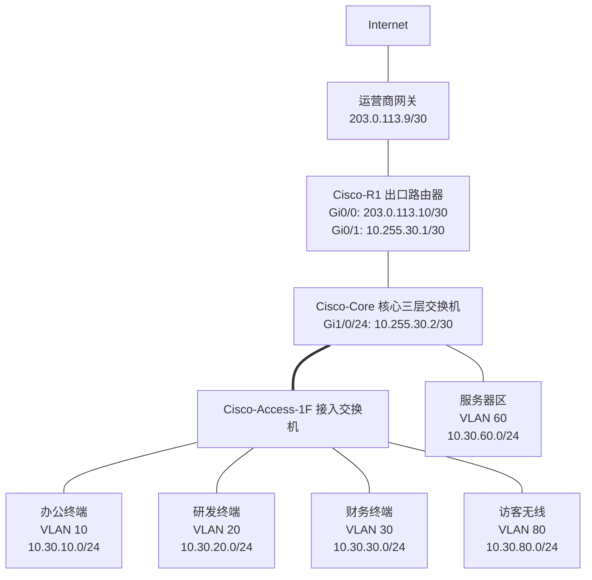
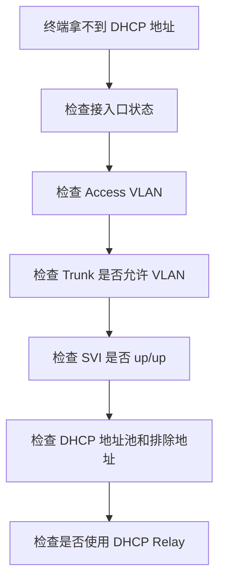

# 第 30 章：Cisco 设备配置

## 30.1 本章学习目标

读完本章后，你应该能够：

- 理解 Cisco IOS/IOS XE 设备的基本命令模式，例如用户 EXEC、特权 EXEC、全局配置、接口配置、线路配置和路由协议配置模式。
- 完成 Cisco 交换机和路由器的基础初始化，包括设备命名、特权密码、本地账号、SSH、时间、日志和配置保存。
- 按企业地址规划配置 VLAN、Access 端口、Trunk 端口、SVI 网关、三层互联口和静态路由。
- 使用 Cisco 设备完成基础 DHCP、EtherChannel、Rapid PVST+、OSPF、ACL 和出口 NAT 配置。
- 看懂常用 `show` 命令输出背后的排错意义。
- 理解 Cisco 与华为、H3C 在命令风格上的差异，避免把不同厂商命令混用。
- 按“规划 -> 配置 -> 验证 -> 保存 -> 记录”的工程流程操作设备。

前两章分别学习了华为 VRP 和 H3C Comware。本章学习 Cisco IOS/IOS XE 设备配置。Cisco 在教学、认证、实验环境和很多企业网络中都很常见。Packet Tracer、GNS3、EVE-NG、CML 等实验平台也经常使用 Cisco 风格命令。

Cisco 设备的配置逻辑和前面章节学习的网络原理一致：VLAN 仍然用于二层隔离，Trunk 仍然用于传递多个 VLAN，SVI 仍然给 VLAN 提供三层网关，静态路由和 OSPF 仍然负责三层转发，ACL 仍然根据五元组或地址范围过滤流量，NAT 仍然把内网私有地址转换为公网地址。

但 Cisco 的命令风格和华为、H3C 差异明显：

- 查看状态多使用 `show`，不是 `display`。
- 进入配置多使用 `configure terminal`，不是 `system-view`。
- 删除配置多在命令前加 `no`，不是 `undo`。
- 保存配置常用 `copy running-config startup-config`，不是 `save`。
- VLAN 三层接口叫 `interface Vlan10`，常称为 SVI。
- 链路聚合接口叫 `Port-channel`，不是 Eth-Trunk 或 Bridge-Aggregation。

需要注意：Cisco IOS、IOS XE、NX-OS、ASA/FTD、防火墙、无线控制器和不同交换机系列的命令差异很大。本章以企业园区交换机和路由器上常见的 IOS/IOS XE 风格为主，强调配置思路和排错方法。真实项目中应以现场设备型号、软件版本和厂商文档为准。

## 30.2 Cisco 命令行基础

学习 Cisco 设备时，第一步不是背命令，而是看懂“当前在哪个模式”。Cisco 的命令提示符会告诉你当前位置。

### 常见命令模式

| 模式 | 提示符示例 | 作用 |
| --- | --- | --- |
| 用户 EXEC 模式 | `Switch>` | 基础查看，权限较低 |
| 特权 EXEC 模式 | `Switch#` | 查看完整状态、保存配置、重启、进入配置模式 |
| 全局配置模式 | `Switch(config)#` | 修改全局配置，例如主机名、路由、VLAN、服务 |
| 接口配置模式 | `Switch(config-if)#` | 配置接口描述、VLAN、IP 地址、速率、双工 |
| VLAN 配置模式 | `Switch(config-vlan)#` | 配置 VLAN 名称 |
| 线路配置模式 | `Switch(config-line)#` | 配置 Console、VTY 登录方式 |
| 路由协议配置模式 | `Switch(config-router)#` | 配置 OSPF、EIGRP、BGP 等路由协议 |
| DHCP 池配置模式 | `Switch(dhcp-config)#` | 配置 DHCP 地址池 |
| 标准 ACL 配置模式 | `Switch(config-std-nacl)#` | 配置标准命名 ACL |
| 扩展 ACL 配置模式 | `Switch(config-ext-nacl)#` | 配置扩展命名 ACL |

常用模式切换：

```text
Switch> enable
Switch# configure terminal
Switch(config)# interface GigabitEthernet1/0/1
Switch(config-if)# exit
Switch(config)# end
Switch#
```

也可以用 `Ctrl+Z` 从配置模式直接返回特权 EXEC 模式。

### Cisco 常用基础命令

| 目标 | 常用命令 | 说明 |
| --- | --- | --- |
| 进入特权模式 | `enable` | 从 `>` 进入 `#` |
| 进入全局配置 | `configure terminal` | 简写常用 `conf t` |
| 返回上一层 | `exit` | 返回上级模式 |
| 返回特权模式 | `end` | 从任意配置模式返回 `#` |
| 查看当前运行配置 | `show running-config` | 查看正在生效的配置 |
| 查看启动配置 | `show startup-config` | 查看重启后加载的配置 |
| 保存配置 | `copy running-config startup-config` | 把当前配置写入启动配置 |
| 删除配置 | `no ...` | 取消已有配置 |
| 查看版本 | `show version` | 查看型号、版本、运行时间、许可证 |
| 查看接口摘要 | `show ip interface brief` | 快速判断接口 IP 和状态 |
| 查看接口状态 | `show interfaces status` | 常用于交换机端口状态 |
| 查看日志 | `show logging` | 查看本地日志缓冲 |
| 查看邻居 | `show cdp neighbors` 或 `show lldp neighbors` | 查看直连设备信息 |

Cisco 命令通常支持缩写。例如：

```text
configure terminal = conf t
show running-config = show run
show ip interface brief = show ip int br
copy running-config startup-config = copy run start
```

学习阶段建议先写完整命令，理解含义后再使用缩写。生产环境中使用缩写没有问题，但配置文档中更推荐写完整命令，便于不同经验水平的人阅读。

### Cisco 与华为、H3C 命令差异速览

| 配置对象 | 华为 VRP | H3C Comware | Cisco IOS/IOS XE |
| --- | --- | --- | --- |
| 进入配置模式 | `system-view` | `system-view` | `configure terminal` |
| 查看配置 | `display current-configuration` | `display current-configuration` | `show running-config` |
| 删除配置 | `undo ...` | `undo ...` | `no ...` |
| 保存配置 | `save` | `save` | `copy running-config startup-config` |
| VLAN 三层接口 | `interface Vlanif10` | `interface Vlan-interface10` | `interface Vlan10` |
| Access VLAN | `port default vlan 10` | `port access vlan 10` | `switchport access vlan 10` |
| Trunk 放行 VLAN | `port trunk allow-pass vlan 10 20` | `port trunk permit vlan 10 20` | `switchport trunk allowed vlan 10,20` |
| 链路聚合接口 | `Eth-Trunk1` | `Bridge-Aggregation1` | `Port-channel1` |
| 加入聚合组 | `eth-trunk 1` | `port link-aggregation group 1` | `channel-group 1 mode active` |
| SSH 服务 | `stelnet server enable` | `ssh server enable` | `ip ssh version 2` |
| 静态默认路由 | `ip route-static 0.0.0.0 0 ...` | `ip route-static 0.0.0.0 0 ...` | `ip route 0.0.0.0 0.0.0.0 ...` |

不要把“原理一样”理解成“命令可以照抄”。跨厂商学习时，最稳妥的方式是先写清楚配置目标，再映射到不同厂商命令。

### running-config 与 startup-config

Cisco 设备有两个初学者必须理解的配置概念：

| 配置 | 含义 |
| --- | --- |
| `running-config` | 当前正在内存中运行的配置，修改后立即生效 |
| `startup-config` | 设备重启后加载的配置，保存在 NVRAM 或启动介质中 |

如果只修改 `running-config` 而不保存，设备重启后配置会丢失。保存命令：

```text
Switch# copy running-config startup-config
```

也可以使用简写：

```text
Switch# copy run start
```

生产环境推荐流程：

```text
修改配置 -> show 验证 -> 业务测试 -> 保存配置 -> 记录变更
```

不要在配置刚写完、业务还没验证时马上保存。也不要在验证成功后忘记保存。

## 30.3 本章实验拓扑和地址规划

本章使用一个小型企业网络作为统一示例。为了和第 28、29 章区分，本章使用 `10.30.x.x` 地址段。



### VLAN 和网关规划

| VLAN | 名称 | 网段 | 网关 | 说明 |
| ---: | --- | --- | --- | --- |
| 10 | `OFFICE` | `10.30.10.0/24` | `10.30.10.1` | 办公网 |
| 20 | `RD` | `10.30.20.0/24` | `10.30.20.1` | 研发网 |
| 30 | `FINANCE` | `10.30.30.0/24` | `10.30.30.1` | 财务网 |
| 60 | `SERVER` | `10.30.60.0/24` | `10.30.60.1` | 内部服务器区 |
| 80 | `GUEST` | `10.30.80.0/24` | `10.30.80.1` | 访客无线 |
| 250 | `MGMT` | `10.30.250.0/24` | `10.30.250.1` | 网络设备管理 |

### 设备互联规划

| 连接 | 本端 | 对端 | 作用 |
| --- | --- | --- | --- |
| 接入到核心 | Cisco-Access-1F `Gi1/0/24` | Cisco-Core `Gi1/0/1` | Trunk，透传 VLAN 10/20/30/80/250 |
| 核心到出口 | Cisco-Core `Gi1/0/24` `10.255.30.2/30` | Cisco-R1 `Gi0/1` `10.255.30.1/30` | 三层互联 |
| 出口到运营商 | Cisco-R1 `Gi0/0` `203.0.113.10/30` | ISP `203.0.113.9/30` | 公网互联 |

### 本章配置目标

| 目标 | 相关设备 |
| --- | --- |
| 完成设备命名、账号、SSH、时间和保存 | 所有设备 |
| 创建业务 VLAN 和接入口 | 核心、接入交换机 |
| 配置 Trunk 上联 | 核心、接入交换机 |
| 配置 SVI 网关 | 核心交换机 |
| 配置 DHCP 地址池 | 核心交换机 |
| 配置核心到出口的静态路由 | 核心交换机、出口路由器 |
| 配置 EtherChannel 聚合链路 | 核心、接入交换机 |
| 配置 Rapid PVST+ 和边缘端口 | 核心、接入交换机 |
| 配置基础 OSPF | 核心交换机、出口路由器 |
| 配置 ACL 限制访客访问内网 | 核心交换机 |
| 配置出口 NAT | 出口路由器 |
| 使用 `show` 命令验证 | 所有设备 |

本章示例把 VLAN 网关放在核心三层交换机上。核心负责 VLAN 间三层转发，出口路由器负责互联网出口和 NAT。访客网络访问内网的限制放在核心交换机的访客 SVI 入方向。

## 30.4 设备基础初始化

新设备上线前，先做基础初始化。基础初始化的目标是让设备可识别、可登录、可审计、可恢复，而不是马上承载业务。

### 修改设备名称

设备名称应体现位置、角色和编号：

```text
Switch> enable
Switch# configure terminal
Switch(config)# hostname Cisco-Core
Cisco-Core(config)#
```

接入交换机和出口路由器：

```text
Switch(config)# hostname Cisco-Access-1F
Router(config)# hostname Cisco-R1
```

生产环境中更推荐类似下面的命名：

| 命名 | 含义 |
| --- | --- |
| `SW-Core-HQ-01` | 总部 1 号核心交换机 |
| `SW-Access-3F-02` | 3 楼 2 号接入交换机 |
| `RT-Branch-SH-01` | 上海分支 1 号出口路由器 |

清晰命名会影响日志、监控、配置备份、告警定位和变更记录。不要把设备长期保留为默认的 `Switch` 或 `Router`。

### 配置特权密码和本地账号

Cisco 设备进入特权模式通常需要 `enable` 权限。生产环境应配置加密的 `enable secret`，不要使用明文 `enable password`。

```text
Cisco-Core(config)# enable secret StrongEnable@2026
Cisco-Core(config)# username netadmin privilege 15 secret StrongPassword@2026
```

说明：

| 命令 | 作用 |
| --- | --- |
| `enable secret` | 设置进入特权 EXEC 模式的加密密码 |
| `username ... privilege 15 secret ...` | 创建本地管理员账号，并使用加密口令 |

`privilege 15` 是最高权限。真实项目中可以结合 AAA、TACACS+、RADIUS 做集中认证和分级授权。本章先使用本地账号，便于理解基础流程。

### 配置管理 VLAN 地址

接入交换机通常不承担业务网关，但需要管理 IP。本章使用 VLAN 250 作为管理 VLAN。

接入交换机：

```text
Cisco-Access-1F# configure terminal
Cisco-Access-1F(config)# vlan 250
Cisco-Access-1F(config-vlan)# name MGMT
Cisco-Access-1F(config-vlan)# exit
Cisco-Access-1F(config)# interface Vlan250
Cisco-Access-1F(config-if)# description MGMT-SVI
Cisco-Access-1F(config-if)# ip address 10.30.250.11 255.255.255.0
Cisco-Access-1F(config-if)# no shutdown
Cisco-Access-1F(config-if)# exit
Cisco-Access-1F(config)# ip default-gateway 10.30.250.1
```

这段配置包含两个关键点：

- `interface Vlan250` 给二层接入交换机提供管理 IP。
- `ip default-gateway` 让二层交换机能把到其他网段的管理回包发给核心网关。

如果是三层交换机且已经开启 `ip routing`，通常使用静态默认路由，而不是 `ip default-gateway`：

```text
Cisco-Core(config)# ip routing
Cisco-Core(config)# ip route 0.0.0.0 0.0.0.0 10.255.30.1
```

### 配置 SSH

生产设备应优先使用 SSH，不建议使用 Telnet。Telnet 明文传输账号密码，不适合企业生产网络。

常见 SSH 配置：

```text
Cisco-Core(config)# ip domain name corp.example
Cisco-Core(config)# crypto key generate rsa modulus 2048
Cisco-Core(config)# ip ssh version 2
Cisco-Core(config)# line vty 0 4
Cisco-Core(config-line)# login local
Cisco-Core(config-line)# transport input ssh
Cisco-Core(config-line)# exec-timeout 10 0
Cisco-Core(config-line)# exit
```

说明：

| 命令 | 作用 |
| --- | --- |
| `ip domain name corp.example` | 生成 RSA 密钥前通常需要域名 |
| `crypto key generate rsa modulus 2048` | 生成 SSH 使用的 RSA 密钥 |
| `ip ssh version 2` | 使用 SSHv2 |
| `line vty 0 4` | 配置远程虚拟终端线路 |
| `login local` | 使用本地用户名密码认证 |
| `transport input ssh` | 只允许 SSH 登录，不允许 Telnet |
| `exec-timeout 10 0` | 空闲 10 分钟自动断开 |

如果设备提示不支持某些命令，可能是型号、IOS 版本、许可证、镜像特性或密钥生成方式不同。真实项目中应以设备文档为准。

### 限制管理来源地址

设备管理入口不应对所有网段开放。可以用标准 ACL 限制只有管理网段可以 SSH。

```text
Cisco-Core(config)# ip access-list standard VTY-MGMT
Cisco-Core(config-std-nacl)# permit 10.30.250.0 0.0.0.255
Cisco-Core(config-std-nacl)# deny any log
Cisco-Core(config-std-nacl)# exit
Cisco-Core(config)# line vty 0 4
Cisco-Core(config-line)# access-class VTY-MGMT in
Cisco-Core(config-line)# exit
```

管理 ACL 要谨慎配置。生产环境中修改管理 ACL 前，应确认当前登录来源也被允许，否则可能把自己锁在设备外。远程修改管理策略时，最好保留 Console、带外管理或现场人员兜底。

### 配置时间、日志和基础安全选项

日志没有准确时间，就很难和服务器、防火墙、认证系统、监控系统做时间线对齐。

```text
Cisco-Core(config)# clock timezone CST 8 0
Cisco-Core(config)# service timestamps log datetime msec localtime show-timezone
Cisco-Core(config)# service timestamps debug datetime msec localtime show-timezone
Cisco-Core(config)# ntp server 10.30.60.20
Cisco-Core(config)# logging host 10.30.60.30
Cisco-Core(config)# logging trap informational
```

常见基础安全选项：

```text
Cisco-Core(config)# no ip domain-lookup
Cisco-Core(config)# service password-encryption
Cisco-Core(config)# banner motd #
Unauthorized access is prohibited.
#
```

说明：

| 配置 | 作用 |
| --- | --- |
| `no ip domain-lookup` | 避免输错命令后设备尝试 DNS 解析导致等待 |
| `service password-encryption` | 对部分明文密码做弱加密，不能替代 `secret` |
| `banner motd` | 登录提示和合规警告 |

`service password-encryption` 只是防止旁观者直接看到明文，不是强安全手段。重要密码应优先使用 `secret` 形式。

### 保存配置

验证配置无误后保存：

```text
Cisco-Core# copy running-config startup-config
```

保存前建议检查：

```text
Cisco-Core# show running-config
Cisco-Core# show ip interface brief
Cisco-Core# show logging
```

配置完成不是以“命令输入成功”为准，而是以设备状态和业务验证为准。

## 30.5 VLAN 与二层接口配置

VLAN 是交换网络最常见的隔离方式。Cisco 交换机上常见二层端口类型包括 Access 和 Trunk。Access 通常连接终端，Trunk 通常连接交换机、路由器、防火墙、虚拟化宿主机或 AP。

### 创建 VLAN

在核心和接入交换机上创建业务 VLAN：

```text
Cisco-Core# configure terminal
Cisco-Core(config)# vlan 10
Cisco-Core(config-vlan)# name OFFICE
Cisco-Core(config-vlan)# exit
Cisco-Core(config)# vlan 20
Cisco-Core(config-vlan)# name RD
Cisco-Core(config-vlan)# exit
Cisco-Core(config)# vlan 30
Cisco-Core(config-vlan)# name FINANCE
Cisco-Core(config-vlan)# exit
Cisco-Core(config)# vlan 60
Cisco-Core(config-vlan)# name SERVER
Cisco-Core(config-vlan)# exit
Cisco-Core(config)# vlan 80
Cisco-Core(config-vlan)# name GUEST
Cisco-Core(config-vlan)# exit
Cisco-Core(config)# vlan 250
Cisco-Core(config-vlan)# name MGMT
Cisco-Core(config-vlan)# exit
```

部分平台支持一次进入一个 VLAN 范围，但名称仍需要分别规划。真实项目中建议为 VLAN 写清楚名称。只看到 VLAN ID 时，后续运维人员很难判断它对应办公、研发、财务还是访客业务。

验证：

```text
Cisco-Core# show vlan brief
Cisco-Core# show vlan id 10
```

### 配置 Access 端口

Access 端口通常连接普通终端、打印机、摄像头、AP 或服务器单网卡。一个 Access 端口一般只属于一个业务 VLAN。

办公终端接在接入交换机 `Gi1/0/1`：

```text
Cisco-Access-1F# configure terminal
Cisco-Access-1F(config)# interface GigabitEthernet1/0/1
Cisco-Access-1F(config-if)# description TO-OFFICE-PC-001
Cisco-Access-1F(config-if)# switchport mode access
Cisco-Access-1F(config-if)# switchport access vlan 10
Cisco-Access-1F(config-if)# spanning-tree portfast
Cisco-Access-1F(config-if)# spanning-tree bpduguard enable
Cisco-Access-1F(config-if)# no shutdown
Cisco-Access-1F(config-if)# exit
```

研发和财务端口类似：

```text
Cisco-Access-1F(config)# interface GigabitEthernet1/0/2
Cisco-Access-1F(config-if)# description TO-RD-PC-001
Cisco-Access-1F(config-if)# switchport mode access
Cisco-Access-1F(config-if)# switchport access vlan 20
Cisco-Access-1F(config-if)# spanning-tree portfast
Cisco-Access-1F(config-if)# spanning-tree bpduguard enable
Cisco-Access-1F(config-if)# no shutdown
Cisco-Access-1F(config-if)# exit

Cisco-Access-1F(config)# interface GigabitEthernet1/0/3
Cisco-Access-1F(config-if)# description TO-FINANCE-PC-001
Cisco-Access-1F(config-if)# switchport mode access
Cisco-Access-1F(config-if)# switchport access vlan 30
Cisco-Access-1F(config-if)# spanning-tree portfast
Cisco-Access-1F(config-if)# spanning-tree bpduguard enable
Cisco-Access-1F(config-if)# no shutdown
Cisco-Access-1F(config-if)# exit
```

`spanning-tree portfast` 表示该端口连接终端，可以快速进入转发状态。`spanning-tree bpduguard enable` 表示如果该端口收到 BPDU，就认为可能有人私接交换机或产生环路风险，端口会被保护性关闭。不要在交换机上联口、互联口、不确定用途的端口上随意配置 PortFast 和 BPDU Guard。

### 配置 Trunk 上联

Trunk 用于在交换机之间传递多个 VLAN。例如接入交换机 `Gi1/0/24` 上联核心交换机 `Gi1/0/1`。

接入交换机侧：

```text
Cisco-Access-1F(config)# interface GigabitEthernet1/0/24
Cisco-Access-1F(config-if)# description TO-Cisco-Core-Gi1/0/1
Cisco-Access-1F(config-if)# switchport mode trunk
Cisco-Access-1F(config-if)# switchport trunk allowed vlan 10,20,30,80,250
Cisco-Access-1F(config-if)# no shutdown
Cisco-Access-1F(config-if)# exit
```

核心交换机侧：

```text
Cisco-Core(config)# interface GigabitEthernet1/0/1
Cisco-Core(config-if)# description TO-Cisco-Access-1F-Gi1/0/24
Cisco-Core(config-if)# switchport mode trunk
Cisco-Core(config-if)# switchport trunk allowed vlan 10,20,30,80,250
Cisco-Core(config-if)# no shutdown
Cisco-Core(config-if)# exit
```

一些老型号交换机需要先指定封装：

```text
switchport trunk encapsulation dot1q
```

很多现代 Catalyst 交换机只支持 802.1Q，不再需要也不支持这条命令。如果设备提示命令不存在，不一定是错误，可能是平台不需要配置封装。

Trunk 两端允许 VLAN 应保持一致。常见故障是接入侧允许了 VLAN 10/20/30，核心侧只允许 VLAN 10，结果办公网通，研发和财务不通。

验证：

```text
Cisco-Access-1F# show interfaces trunk
Cisco-Access-1F# show running-config interface GigabitEthernet1/0/24
Cisco-Core# show running-config interface GigabitEthernet1/0/1
Cisco-Core# show mac address-table vlan 10
```

如果终端已经发出流量，核心交换机应该能在对应 VLAN 学到终端 MAC。

### Access、Trunk 常见错误

| 现象 | 可能原因 | 验证命令 |
| --- | --- | --- |
| 终端拿不到 DHCP 地址 | 端口 VLAN 错、Trunk 未允许 VLAN、DHCP 未启用 | `show run interface ...`、`show vlan brief` |
| 同 VLAN 终端不通 | Access VLAN 配错、端口 down、终端防火墙、MAC 未学习 | `show interfaces status`、`show mac address-table` |
| 某 VLAN 跨交换机不通 | 上联 Trunk 未允许该 VLAN | `show interfaces trunk` |
| 管理地址不能 SSH | 管理 VLAN 未创建、SVI down、Trunk 未允许管理 VLAN | `show interfaces Vlan250` |
| 端口上线后等待较久 | 终端口未配置 PortFast，STP 收敛等待 | `show spanning-tree interface ...` |

## 30.6 SVI 网关与静态路由配置

VLAN 只提供二层隔离。不同 VLAN 之间通信，需要三层网关。在 Cisco 三层交换机上，VLAN 的三层接口通常叫 SVI，命令形式是 `interface Vlan10`。

### 开启三层转发

三层交换机要承担 VLAN 网关，通常需要开启 IP 路由功能：

```text
Cisco-Core(config)# ip routing
```

如果没有开启 `ip routing`，SVI 之间可能无法进行三层转发。二层接入交换机则通常不需要开启它。

### 配置 SVI 网关

核心交换机：

```text
Cisco-Core(config)# interface Vlan10
Cisco-Core(config-if)# description GW-OFFICE
Cisco-Core(config-if)# ip address 10.30.10.1 255.255.255.0
Cisco-Core(config-if)# no shutdown
Cisco-Core(config-if)# exit

Cisco-Core(config)# interface Vlan20
Cisco-Core(config-if)# description GW-RD
Cisco-Core(config-if)# ip address 10.30.20.1 255.255.255.0
Cisco-Core(config-if)# no shutdown
Cisco-Core(config-if)# exit

Cisco-Core(config)# interface Vlan30
Cisco-Core(config-if)# description GW-FINANCE
Cisco-Core(config-if)# ip address 10.30.30.1 255.255.255.0
Cisco-Core(config-if)# no shutdown
Cisco-Core(config-if)# exit

Cisco-Core(config)# interface Vlan60
Cisco-Core(config-if)# description GW-SERVER
Cisco-Core(config-if)# ip address 10.30.60.1 255.255.255.0
Cisco-Core(config-if)# no shutdown
Cisco-Core(config-if)# exit

Cisco-Core(config)# interface Vlan80
Cisco-Core(config-if)# description GW-GUEST
Cisco-Core(config-if)# ip address 10.30.80.1 255.255.255.0
Cisco-Core(config-if)# no shutdown
Cisco-Core(config-if)# exit

Cisco-Core(config)# interface Vlan250
Cisco-Core(config-if)# description GW-MGMT
Cisco-Core(config-if)# ip address 10.30.250.1 255.255.255.0
Cisco-Core(config-if)# no shutdown
Cisco-Core(config-if)# exit
```

如果 `interface Vlan10` 配了 IP 但状态仍然 down，常见原因是：

- VLAN 10 不存在。
- VLAN 10 没有任何 up 的成员端口。
- 上联 Trunk 没有允许 VLAN 10。
- 接入口连接的终端未上线。
- 设备是纯二层交换机，不支持三层 SVI 转发。

验证：

```text
Cisco-Core# show ip interface brief
Cisco-Core# show interfaces Vlan10
Cisco-Core# show ip arp
```

### 配置核心到出口的三层互联

核心交换机与出口路由器之间使用 `10.255.30.0/30`。

核心交换机侧：

```text
Cisco-Core(config)# interface GigabitEthernet1/0/24
Cisco-Core(config-if)# description TO-Cisco-R1-Gi0/1
Cisco-Core(config-if)# no switchport
Cisco-Core(config-if)# ip address 10.255.30.2 255.255.255.252
Cisco-Core(config-if)# no shutdown
Cisco-Core(config-if)# exit
```

说明：很多 Cisco 三层交换机的以太接口默认是二层口。配置三层 IP 前，需要使用 `no switchport` 把接口改成路由口。部分交换机型号不支持把物理接口改成三层口，此时可以使用专用路由接口、SVI 互联或其他设计方式。

出口路由器内侧接口：

```text
Cisco-R1(config)# interface GigabitEthernet0/1
Cisco-R1(config-if)# description TO-Cisco-Core-Gi1/0/24
Cisco-R1(config-if)# ip address 10.255.30.1 255.255.255.252
Cisco-R1(config-if)# no shutdown
Cisco-R1(config-if)# exit
```

出口路由器外侧接口：

```text
Cisco-R1(config)# interface GigabitEthernet0/0
Cisco-R1(config-if)# description TO-ISP
Cisco-R1(config-if)# ip address 203.0.113.10 255.255.255.252
Cisco-R1(config-if)# no shutdown
Cisco-R1(config-if)# exit
```

验证互联：

```text
Cisco-Core# ping 10.255.30.1
Cisco-R1# ping 10.255.30.2
Cisco-R1# ping 203.0.113.9
```

### 配置静态路由

核心交换机需要默认路由指向出口路由器：

```text
Cisco-Core(config)# ip route 0.0.0.0 0.0.0.0 10.255.30.1
```

出口路由器需要回到内部网络的路由：

```text
Cisco-R1(config)# ip route 10.30.0.0 255.255.0.0 10.255.30.2
Cisco-R1(config)# ip route 0.0.0.0 0.0.0.0 203.0.113.9
```

这里用 `10.30.0.0/16` 汇总本章内部网段。汇总路由可以减少路由表数量，但前提是地址规划连续，且不会把不该走这条路径的网段包含进去。

验证：

```text
Cisco-Core# show ip route
Cisco-Core# show ip route 0.0.0.0
Cisco-R1# show ip route 10.30.10.0
```

### 静态路由常见错误

| 现象 | 可能原因 | 检查点 |
| --- | --- | --- |
| 终端能 ping 网关，不能 ping 出口内侧 | 核心缺默认路由、互联口不通 | `show ip route`、`ping 10.255.30.1` |
| 出口路由器能收到流量但回不来 | 出口缺内部回程路由 | `show ip route 10.30.10.0` |
| 静态路由配置后不生效 | 下一跳不可达、出接口 down、掩码错误 | `show ip route static` |
| 只有部分 VLAN 出口异常 | NAT、ACL 或回程路由未覆盖该网段 | 对比不同源网段 |

## 30.7 DHCP 基础配置

DHCP 用于给终端自动分配 IP 地址、掩码、网关、DNS 和租约。企业办公网通常不会手工给每台电脑配置 IP。本章示例让核心交换机为多个 VLAN 提供 DHCP 服务。

### 配置保留地址

Cisco DHCP 使用 `ip dhcp excluded-address` 排除不应自动分配的地址。例如网关、服务器、打印机和网络设备管理地址。

```text
Cisco-Core(config)# ip dhcp excluded-address 10.30.10.1 10.30.10.30
Cisco-Core(config)# ip dhcp excluded-address 10.30.20.1 10.30.20.30
Cisco-Core(config)# ip dhcp excluded-address 10.30.30.1 10.30.30.30
Cisco-Core(config)# ip dhcp excluded-address 10.30.80.1 10.30.80.20
```

保留前 30 个地址是为了给网关、打印机、服务器管理口、临时测试地址预留空间。真实项目中应结合地址规划表确定保留范围。

### 配置办公网地址池

```text
Cisco-Core(config)# ip dhcp pool VLAN10-OFFICE
Cisco-Core(dhcp-config)# network 10.30.10.0 255.255.255.0
Cisco-Core(dhcp-config)# default-router 10.30.10.1
Cisco-Core(dhcp-config)# dns-server 10.30.60.10 10.30.60.11
Cisco-Core(dhcp-config)# lease 7
Cisco-Core(dhcp-config)# exit
```

说明：

| 配置 | 含义 |
| --- | --- |
| `network` | 地址池所属网段 |
| `default-router` | 下发给终端的默认网关 |
| `dns-server` | 下发给终端的 DNS 服务器 |
| `lease` | 地址租约时间 |

### 配置其他 VLAN 地址池

```text
Cisco-Core(config)# ip dhcp pool VLAN20-RD
Cisco-Core(dhcp-config)# network 10.30.20.0 255.255.255.0
Cisco-Core(dhcp-config)# default-router 10.30.20.1
Cisco-Core(dhcp-config)# dns-server 10.30.60.10 10.30.60.11
Cisco-Core(dhcp-config)# lease 7
Cisco-Core(dhcp-config)# exit

Cisco-Core(config)# ip dhcp pool VLAN30-FINANCE
Cisco-Core(dhcp-config)# network 10.30.30.0 255.255.255.0
Cisco-Core(dhcp-config)# default-router 10.30.30.1
Cisco-Core(dhcp-config)# dns-server 10.30.60.10 10.30.60.11
Cisco-Core(dhcp-config)# lease 7
Cisco-Core(dhcp-config)# exit

Cisco-Core(config)# ip dhcp pool VLAN80-GUEST
Cisco-Core(dhcp-config)# network 10.30.80.0 255.255.255.0
Cisco-Core(dhcp-config)# default-router 10.30.80.1
Cisco-Core(dhcp-config)# dns-server 114.114.114.114 223.5.5.5
Cisco-Core(dhcp-config)# lease 0 8
Cisco-Core(dhcp-config)# exit
```

访客网络终端变化频繁，租约可以短一些。办公网、研发网租约可以相对长一些。

### DHCP 验证

设备侧：

```text
Cisco-Core# show ip dhcp pool
Cisco-Core# show ip dhcp binding
Cisco-Core# show ip dhcp server statistics
Cisco-Core# show ip arp vlan 10
```

终端侧应检查：

```text
IP 地址：10.30.10.x
掩码：255.255.255.0
网关：10.30.10.1
DNS：10.30.60.10 / 10.30.60.11
```

如果终端拿到 `169.254.x.x`，说明 DHCP 获取失败。优先检查 Access VLAN、Trunk 允许 VLAN、SVI 状态、DHCP 地址池、排除地址范围是否把可用地址全部排完。

### DHCP Relay 场景

如果企业使用独立 DHCP 服务器，例如 `10.30.60.10`，核心交换机不直接分配地址，而是在各 SVI 上配置 DHCP Relay：

```text
Cisco-Core(config)# interface Vlan10
Cisco-Core(config-if)# ip helper-address 10.30.60.10
Cisco-Core(config-if)# exit
```

`ip helper-address` 会把终端广播的 DHCP 请求转发给指定服务器。常见故障是只在 VLAN 10 配了 `ip helper-address`，忘记在 VLAN 20、VLAN 30、VLAN 80 配置，导致只有部分网段能获取地址。

## 30.8 EtherChannel 链路聚合配置

如果接入交换机到核心交换机有两条或多条物理链路，可以使用 EtherChannel，提高带宽并提供链路冗余。Cisco 上聚合接口名称是 `Port-channel`。

本节假设接入交换机 `Gi1/0/23` 和 `Gi1/0/24` 上联核心交换机 `Gi1/0/1` 和 `Gi1/0/2`，组成 `Port-channel1`。


### LACP 模式说明

| 模式 | 协议 | 含义 |
| --- | --- | --- |
| `active` | LACP | 主动发送 LACP 报文，推荐 |
| `passive` | LACP | 被动响应 LACP 报文 |
| `on` | 无协商 | 强制聚合，不发送 LACP，不推荐初学者在生产中随意使用 |
| `desirable` / `auto` | PAgP | Cisco 私有协议，老环境可能见到 |

企业环境中推荐优先使用 LACP，常见组合是两端都 `active`，或者一端 `active` 一端 `passive`。不要一端 LACP、一端强制 `on`，否则容易出现聚合异常或环路风险。

### 核心交换机配置

```text
Cisco-Core(config)# interface range GigabitEthernet1/0/1 - 2
Cisco-Core(config-if-range)# description TO-Cisco-Access-1F
Cisco-Core(config-if-range)# switchport mode trunk
Cisco-Core(config-if-range)# switchport trunk allowed vlan 10,20,30,80,250
Cisco-Core(config-if-range)# channel-group 1 mode active
Cisco-Core(config-if-range)# no shutdown
Cisco-Core(config-if-range)# exit

Cisco-Core(config)# interface Port-channel1
Cisco-Core(config-if)# description TO-Cisco-Access-1F
Cisco-Core(config-if)# switchport mode trunk
Cisco-Core(config-if)# switchport trunk allowed vlan 10,20,30,80,250
Cisco-Core(config-if)# exit
```

### 接入交换机配置

```text
Cisco-Access-1F(config)# interface range GigabitEthernet1/0/23 - 24
Cisco-Access-1F(config-if-range)# description TO-Cisco-Core
Cisco-Access-1F(config-if-range)# switchport mode trunk
Cisco-Access-1F(config-if-range)# switchport trunk allowed vlan 10,20,30,80,250
Cisco-Access-1F(config-if-range)# channel-group 1 mode active
Cisco-Access-1F(config-if-range)# no shutdown
Cisco-Access-1F(config-if-range)# exit

Cisco-Access-1F(config)# interface Port-channel1
Cisco-Access-1F(config-if)# description TO-Cisco-Core
Cisco-Access-1F(config-if)# switchport mode trunk
Cisco-Access-1F(config-if)# switchport trunk allowed vlan 10,20,30,80,250
Cisco-Access-1F(config-if)# exit
```

成员口加入 Port-channel 后，成员口和 Port-channel 的关键二层属性必须一致，例如端口模式、允许 VLAN、Native VLAN、速率、双工等。生产环境中通常先规划好 Port-channel，再加入成员口。

### EtherChannel 验证

```text
Cisco-Core# show etherchannel summary
Cisco-Core# show interfaces port-channel 1
Cisco-Core# show lacp neighbor
Cisco-Core# show interfaces trunk
```

`show etherchannel summary` 中常见标记：

| 标记 | 含义 |
| --- | --- |
| `P` | 成员口已加入 Port-channel，正常工作 |
| `I` | 独立端口，没有加入聚合 |
| `D` | 端口 down |
| `S` | 二层 Port-channel |
| `R` | 三层 Port-channel |
| `U` | Port-channel 正常使用中 |

如果只有一条链路加入聚合，另一条没有加入，应检查：

- 两端是否都使用 LACP 兼容模式。
- 成员口速率、双工、端口类型是否一致。
- Trunk 允许 VLAN 是否一致。
- 物理线缆是否接错。
- 成员口是否残留其他冲突配置。

## 30.9 STP 与边缘端口

STP 的目标是防止二层环路。Cisco 园区交换机常见模式包括 PVST+、Rapid PVST+ 和 MST。初学阶段可以先掌握 Rapid PVST+ 的基本配置和验证。

### 配置 Rapid PVST+

```text
Cisco-Core(config)# spanning-tree mode rapid-pvst
Cisco-Access-1F(config)# spanning-tree mode rapid-pvst
```

Rapid PVST+ 为每个 VLAN 维护生成树实例，收敛比传统 STP 更快。规模较大时，每 VLAN 一个实例会增加控制平面压力，企业也可能使用 MST。这里先用 Rapid PVST+，便于初学者按 VLAN 理解根桥和端口状态。

### 配置核心为根桥

核心交换机通常应该成为主要业务 VLAN 的根桥：

```text
Cisco-Core(config)# spanning-tree vlan 10,20,30,60,80,250 root primary
```

备核心可以配置为备用根桥：

```text
Cisco-Core-Backup(config)# spanning-tree vlan 10,20,30,60,80,250 root secondary
```

根桥应该放在拓扑中心，通常是核心或汇聚交换机。不要让某台接入交换机因为桥 ID 较小而意外成为根桥。

### 接入口配置 PortFast 和 BPDU Guard

连接普通终端的端口可以配置：

```text
Cisco-Access-1F(config)# interface GigabitEthernet1/0/1
Cisco-Access-1F(config-if)# spanning-tree portfast
Cisco-Access-1F(config-if)# spanning-tree bpduguard enable
Cisco-Access-1F(config-if)# exit
```

全局方式也很常见：

```text
Cisco-Access-1F(config)# spanning-tree portfast default
Cisco-Access-1F(config)# spanning-tree portfast bpduguard default
```

全局启用前要确认交换机上的非上联端口确实都面向终端。如果某些端口连接下级交换机、AP Trunk、虚拟化宿主机或特殊设备，应单独规划。

### STP 验证

```text
Cisco-Core# show spanning-tree
Cisco-Core# show spanning-tree vlan 10
Cisco-Access-1F# show spanning-tree summary
Cisco-Access-1F# show spanning-tree interface GigabitEthernet1/0/1 detail
```

重点看：

| 项目 | 含义 |
| --- | --- |
| Root ID | 当前 VLAN 的根桥是谁 |
| Bridge ID | 本交换机的桥 ID |
| Root Port | 非根交换机通向根桥的端口 |
| Designated Port | 指定端口，正常转发 |
| Alternate Port | 备用端口，通常阻塞 |
| PortFast | 终端边缘端口快速转发 |

如果出现广播风暴、接口流量异常、MAC 地址表频繁漂移，应优先怀疑二层环路、错误 Trunk、私接交换机或 STP 配置问题。

## 30.10 OSPF 动态路由基础配置

小型网络用静态路由即可。网络规模扩大后，核心、分支、出口、数据中心之间路由越来越多，动态路由会更易维护。本节只介绍单区域 OSPF，让核心交换机和出口路由器互相学习路由。

### OSPF 地址规划

| 设备 | Router ID | 宣告网段 |
| --- | --- | --- |
| Cisco-Core | `10.255.30.2` | `10.30.0.0/16`、`10.255.30.0/30` |
| Cisco-R1 | `10.255.30.1` | `10.255.30.0/30`、默认路由下发 |

### 核心交换机 OSPF 配置

```text
Cisco-Core(config)# router ospf 1
Cisco-Core(config-router)# router-id 10.255.30.2
Cisco-Core(config-router)# network 10.30.0.0 0.0.255.255 area 0
Cisco-Core(config-router)# network 10.255.30.0 0.0.0.3 area 0
Cisco-Core(config-router)# passive-interface default
Cisco-Core(config-router)# no passive-interface GigabitEthernet1/0/24
Cisco-Core(config-router)# exit
```

`passive-interface default` 表示默认不在所有接口上发送 OSPF Hello，只在核心到出口的互联口上建立邻居。这样可以避免办公、研发、访客 VLAN 中出现不必要的 OSPF 报文。

### 出口路由器 OSPF 配置

```text
Cisco-R1(config)# router ospf 1
Cisco-R1(config-router)# router-id 10.255.30.1
Cisco-R1(config-router)# network 10.255.30.0 0.0.0.3 area 0
Cisco-R1(config-router)# default-information originate
Cisco-R1(config-router)# exit
```

`default-information originate` 表示把默认路由通告给 OSPF 邻居。前提是出口路由器本身有可用默认路由：

```text
Cisco-R1(config)# ip route 0.0.0.0 0.0.0.0 203.0.113.9
```

### OSPF 验证

```text
Cisco-Core# show ip ospf neighbor
Cisco-Core# show ip route ospf
Cisco-Core# show ip protocols
Cisco-R1# show ip ospf neighbor
```

邻居正常时，应看到邻居状态为 `FULL`。若无法建立邻居，常见原因包括：

| 原因 | 说明 |
| --- | --- |
| 互联 IP 不通 | OSPF 依赖底层三层连通 |
| Area 不一致 | 两端接口必须在同一区域 |
| Router ID 冲突 | 同一 OSPF 域中 Router ID 必须唯一 |
| Hello/Dead 计时器不一致 | 两端参数不一致会影响邻居建立 |
| MTU 不一致 | 可能卡在 ExStart 或 Exchange |
| 认证不一致 | 一端开启认证另一端未配置 |
| ACL 阻断协议报文 | OSPF 使用 IP 协议号 89 |
| 接口被 passive | 被动接口不会发送 Hello 建邻 |

OSPF 比静态路由灵活，但也更需要监控。生产环境中应监控邻居状态、路由变化和链路抖动。

## 30.11 ACL 基础配置

ACL 是访问控制列表，用于匹配流量。Cisco 常见 IPv4 ACL 包括标准 ACL 和扩展 ACL。

| 类型 | 常见编号范围 | 匹配能力 | 常见用途 |
| --- | --- | --- | --- |
| 标准 ACL | 1-99、1300-1999 | 主要匹配源 IP | 限制管理登录来源、简单过滤 |
| 扩展 ACL | 100-199、2000-2699 | 匹配源、目的、协议、端口 | 控制业务访问 |
| 命名 ACL | 使用名称 | 可读性更好 | 推荐在配置文档和生产环境中使用 |

本节实现一个常见需求：

```text
访客无线 VLAN 80 只能访问互联网，不能访问企业内部 10.30.0.0/16 中的办公、研发、财务、服务器和管理网段。
```

### 配置扩展命名 ACL

```text
Cisco-Core(config)# ip access-list extended GUEST-IN
Cisco-Core(config-ext-nacl)# deny ip 10.30.80.0 0.0.0.255 10.30.10.0 0.0.0.255
Cisco-Core(config-ext-nacl)# deny ip 10.30.80.0 0.0.0.255 10.30.20.0 0.0.0.255
Cisco-Core(config-ext-nacl)# deny ip 10.30.80.0 0.0.0.255 10.30.30.0 0.0.0.255
Cisco-Core(config-ext-nacl)# deny ip 10.30.80.0 0.0.0.255 10.30.60.0 0.0.0.255
Cisco-Core(config-ext-nacl)# deny ip 10.30.80.0 0.0.0.255 10.30.250.0 0.0.0.255
Cisco-Core(config-ext-nacl)# permit ip 10.30.80.0 0.0.0.255 any
Cisco-Core(config-ext-nacl)# exit
```

这里使用的是通配符掩码：

```text
10.30.80.0 0.0.0.255 = 匹配 10.30.80.0/24
10.30.10.0 0.0.0.255 = 匹配 10.30.10.0/24
```

通配符掩码中，`0` 表示必须匹配，`255` 表示可以变化。

这里没有直接拒绝整个 `10.30.0.0/16`，是为了避免把访客访问自身网关 `10.30.80.1` 也一起拦截。真实项目中应按实际内部网段逐条拒绝，或者把访客网关放在防火墙上，由防火墙安全区域策略统一控制。

### 在 SVI 入方向调用 ACL

```text
Cisco-Core(config)# interface Vlan80
Cisco-Core(config-if)# ip access-group GUEST-IN in
Cisco-Core(config-if)# exit
```

把 ACL 放在访客 SVI 入方向，表示访客终端流量一进入三层网关就被检查。这样可以尽早阻断访客访问内网。

### ACL 验证

访客终端应测试：

```text
ping 10.30.80.1        # 应可达本网关
ping 10.30.10.1        # 应被拒绝或不可达
ping 10.30.60.10       # 应被拒绝或不可达
ping 公网地址           # 如果出口 NAT 正常，应可达
```

设备侧检查：

```text
Cisco-Core# show access-lists GUEST-IN
Cisco-Core# show ip interface Vlan80
```

ACL 排错时要特别注意规则顺序。ACL 通常从上到下匹配，先匹配先执行。ACL 末尾有隐含的 `deny ip any any`。如果忘记写最后的允许规则，访客网络可能被全部阻断。

## 30.12 出口 NAT 配置思路

内网私有地址访问互联网通常需要 NAT。本节假设出口设备是 Cisco 路由器，使用出口接口公网地址做 PAT，也就是很多工程师口中的 Overload NAT。

### 标记内外接口

出口路由器内侧接口：

```text
Cisco-R1(config)# interface GigabitEthernet0/1
Cisco-R1(config-if)# description TO-Cisco-Core
Cisco-R1(config-if)# ip nat inside
Cisco-R1(config-if)# exit
```

出口路由器外侧接口：

```text
Cisco-R1(config)# interface GigabitEthernet0/0
Cisco-R1(config-if)# description TO-ISP
Cisco-R1(config-if)# ip nat outside
Cisco-R1(config-if)# exit
```

`ip nat inside` 和 `ip nat outside` 是 Cisco NAT 的关键标记。很多 NAT 故障不是 ACL 写错，而是内外接口标记漏配或配反。

### 配置允许 NAT 的 ACL

```text
Cisco-R1(config)# ip access-list standard NAT-INTERNAL
Cisco-R1(config-std-nacl)# permit 10.30.0.0 0.0.255.255
Cisco-R1(config-std-nacl)# exit
```

### 配置 PAT

```text
Cisco-R1(config)# ip nat inside source list NAT-INTERNAL interface GigabitEthernet0/0 overload
```

这表示内网 `10.30.0.0/16` 访问公网时，源地址转换为出口接口 `GigabitEthernet0/0` 的公网地址 `203.0.113.10`，并通过端口号区分不同会话。它适合只有一个公网地址的小型出口。

如果企业有公网地址池，可能使用 NAT Pool；如果对外发布内部服务器，可能使用静态 NAT 或端口映射。NAT 原理已经在第 16 章讲过，本节重点是 Cisco 出口基础命令结构。

### NAT 验证

```text
Cisco-R1# show ip nat translations
Cisco-R1# show ip nat statistics
Cisco-R1# show access-lists NAT-INTERNAL
Cisco-R1# show ip route
```

终端侧测试：

```text
ping 10.30.10.1
ping 10.255.30.1
ping 203.0.113.9
访问公网 IP 或域名
```

如果能 ping 出口内侧，不能访问公网，排查顺序应为：

1. 核心默认路由是否指向出口。
2. 出口是否有回内网路由。
3. 出口默认路由是否指向运营商。
4. NAT ACL 是否匹配源地址。
5. NAT inside/outside 是否标记正确。
6. PAT 是否绑定正确公网出接口。
7. 运营商网关是否可达。
8. DNS 是否正常。

## 30.13 常用 show 验证命令

Cisco 设备排错时，`show` 命令比反复改配置更重要。配置表示“你希望设备怎样工作”，状态表示“设备现在实际怎样工作”。

### 接口和链路

| 目标 | 命令 | 关注点 |
| --- | --- | --- |
| 查看接口 IP 和状态 | `show ip interface brief` | IP、Status、Protocol |
| 查看交换端口状态 | `show interfaces status` | connected、notconnect、err-disabled、VLAN、速率 |
| 查看接口详细信息 | `show interfaces GigabitEthernet1/0/1` | 错包、丢包、速率、双工、带宽 |
| 查看接口配置 | `show running-config interface ...` | 端口模式、VLAN、ACL、描述 |
| 查看 CDP 邻居 | `show cdp neighbors detail` | 对端设备、接口、平台、管理地址 |
| 查看 LLDP 邻居 | `show lldp neighbors detail` | 跨厂商邻居信息 |

接口状态中常见组合：

| 状态 | 含义 |
| --- | --- |
| `up/up` | 物理层和协议层正常 |
| `down/down` | 物理未连通、对端关闭、线缆或模块问题 |
| `up/down` | 物理层 up，但二层或三层协议异常 |
| `administratively down/down` | 接口被 `shutdown` |

### VLAN、Trunk 和 MAC

| 目标 | 命令 | 关注点 |
| --- | --- | --- |
| 查看 VLAN | `show vlan brief` | VLAN 是否存在、端口是否加入 |
| 查看 Trunk | `show interfaces trunk` | Trunk 状态、允许 VLAN、转发 VLAN |
| 查看 MAC 表 | `show mac address-table` | MAC 学习在哪个 VLAN、哪个端口 |
| 查看某 VLAN MAC | `show mac address-table vlan 10` | 终端 MAC 是否被学习 |
| 查看端口交换属性 | `show interfaces GigabitEthernet1/0/1 switchport` | Access/Trunk、Access VLAN、Native VLAN |

如果 DHCP 不通，通常先看：

```text
show vlan brief
show interfaces trunk
show mac address-table vlan 10
show ip interface brief
```

这些命令可以判断二层 VLAN 是否真的把终端流量送到了网关。

### 路由和三层

| 目标 | 命令 | 关注点 |
| --- | --- | --- |
| 查看路由表 | `show ip route` | 默认路由、直连路由、动态路由 |
| 查看某条路由 | `show ip route 10.30.10.0` | 最长匹配结果 |
| 查看 ARP | `show ip arp` | 三层邻居 MAC 是否解析 |
| 查看 OSPF 邻居 | `show ip ospf neighbor` | 邻居状态是否 FULL |
| 查看 OSPF 路由 | `show ip route ospf` | 是否学习到动态路由 |
| 查看路由协议 | `show ip protocols` | OSPF 宣告、被动接口、Router ID |

路由排错不要只看目标地址是否在路由表里，还要看回程路径。很多故障是请求能到目标，但目标回包找不到源网段。

### ACL、NAT 和安全

| 目标 | 命令 | 关注点 |
| --- | --- | --- |
| 查看 ACL | `show access-lists` | 规则顺序、命中计数 |
| 查看接口 ACL 调用 | `show ip interface Vlan80` | inbound/outbound 调用方向 |
| 查看 NAT 会话 | `show ip nat translations` | 是否产生转换表项 |
| 查看 NAT 统计 | `show ip nat statistics` | inside/outside、命中次数 |
| 查看 VTY 配置 | `show running-config | section line vty` | 登录方式、管理 ACL |

ACL 和 NAT 排错时，命中计数很关键。如果规则命中计数一直为 0，说明流量没有匹配到这条规则，可能是源地址、目的地址、调用方向或接口位置不对。

## 30.14 综合配置示例

本节把前面的核心配置合并成一个简化示例，方便你从整体上理解 Cisco 设备配置顺序。真实项目中不要机械复制，应先根据地址规划、设备型号、接口编号和安全要求调整。

### 核心三层交换机关键配置

```text
hostname Cisco-Core
enable secret StrongEnable@2026
username netadmin privilege 15 secret StrongPassword@2026
ip domain name corp.example
ip routing
no ip domain-lookup
service timestamps log datetime msec localtime show-timezone

vlan 10
 name OFFICE
vlan 20
 name RD
vlan 30
 name FINANCE
vlan 60
 name SERVER
vlan 80
 name GUEST
vlan 250
 name MGMT

interface Vlan10
 description GW-OFFICE
 ip address 10.30.10.1 255.255.255.0
 no shutdown
interface Vlan20
 description GW-RD
 ip address 10.30.20.1 255.255.255.0
 no shutdown
interface Vlan30
 description GW-FINANCE
 ip address 10.30.30.1 255.255.255.0
 no shutdown
interface Vlan60
 description GW-SERVER
 ip address 10.30.60.1 255.255.255.0
 no shutdown
interface Vlan80
 description GW-GUEST
 ip address 10.30.80.1 255.255.255.0
 ip access-group GUEST-IN in
 no shutdown
interface Vlan250
 description GW-MGMT
 ip address 10.30.250.1 255.255.255.0
 no shutdown

interface GigabitEthernet1/0/1
 description TO-Cisco-Access-1F
 switchport mode trunk
 switchport trunk allowed vlan 10,20,30,80,250
 no shutdown

interface GigabitEthernet1/0/24
 description TO-Cisco-R1
 no switchport
 ip address 10.255.30.2 255.255.255.252
 no shutdown

ip dhcp excluded-address 10.30.10.1 10.30.10.30
ip dhcp excluded-address 10.30.20.1 10.30.20.30
ip dhcp excluded-address 10.30.30.1 10.30.30.30
ip dhcp excluded-address 10.30.80.1 10.30.80.20

ip dhcp pool VLAN10-OFFICE
 network 10.30.10.0 255.255.255.0
 default-router 10.30.10.1
 dns-server 10.30.60.10 10.30.60.11
 lease 7
ip dhcp pool VLAN20-RD
 network 10.30.20.0 255.255.255.0
 default-router 10.30.20.1
 dns-server 10.30.60.10 10.30.60.11
 lease 7
ip dhcp pool VLAN30-FINANCE
 network 10.30.30.0 255.255.255.0
 default-router 10.30.30.1
 dns-server 10.30.60.10 10.30.60.11
 lease 7
ip dhcp pool VLAN80-GUEST
 network 10.30.80.0 255.255.255.0
 default-router 10.30.80.1
 dns-server 114.114.114.114 223.5.5.5
 lease 0 8

ip access-list extended GUEST-IN
 deny ip 10.30.80.0 0.0.0.255 10.30.10.0 0.0.0.255
 deny ip 10.30.80.0 0.0.0.255 10.30.20.0 0.0.0.255
 deny ip 10.30.80.0 0.0.0.255 10.30.30.0 0.0.0.255
 deny ip 10.30.80.0 0.0.0.255 10.30.60.0 0.0.0.255
 deny ip 10.30.80.0 0.0.0.255 10.30.250.0 0.0.0.255
 permit ip 10.30.80.0 0.0.0.255 any

ip route 0.0.0.0 0.0.0.0 10.255.30.1

router ospf 1
 router-id 10.255.30.2
 passive-interface default
 no passive-interface GigabitEthernet1/0/24
 network 10.30.0.0 0.0.255.255 area 0
 network 10.255.30.0 0.0.0.3 area 0

line vty 0 4
 login local
 transport input ssh
 exec-timeout 10 0
```

### 接入交换机关键配置

```text
hostname Cisco-Access-1F
enable secret StrongEnable@2026
username netadmin privilege 15 secret StrongPassword@2026
ip domain name corp.example
no ip domain-lookup

vlan 10
 name OFFICE
vlan 20
 name RD
vlan 30
 name FINANCE
vlan 80
 name GUEST
vlan 250
 name MGMT

interface Vlan250
 description MGMT-SVI
 ip address 10.30.250.11 255.255.255.0
 no shutdown
ip default-gateway 10.30.250.1

interface GigabitEthernet1/0/1
 description TO-OFFICE-PC-001
 switchport mode access
 switchport access vlan 10
 spanning-tree portfast
 spanning-tree bpduguard enable
 no shutdown

interface GigabitEthernet1/0/2
 description TO-RD-PC-001
 switchport mode access
 switchport access vlan 20
 spanning-tree portfast
 spanning-tree bpduguard enable
 no shutdown

interface GigabitEthernet1/0/3
 description TO-FINANCE-PC-001
 switchport mode access
 switchport access vlan 30
 spanning-tree portfast
 spanning-tree bpduguard enable
 no shutdown

interface GigabitEthernet1/0/24
 description TO-Cisco-Core
 switchport mode trunk
 switchport trunk allowed vlan 10,20,30,80,250
 no shutdown

spanning-tree mode rapid-pvst

line vty 0 4
 login local
 transport input ssh
 exec-timeout 10 0
```

### 出口路由器关键配置

```text
hostname Cisco-R1
enable secret StrongEnable@2026
username netadmin privilege 15 secret StrongPassword@2026
ip domain name corp.example
no ip domain-lookup

interface GigabitEthernet0/0
 description TO-ISP
 ip address 203.0.113.10 255.255.255.252
 ip nat outside
 no shutdown

interface GigabitEthernet0/1
 description TO-Cisco-Core
 ip address 10.255.30.1 255.255.255.252
 ip nat inside
 no shutdown

ip access-list standard NAT-INTERNAL
 permit 10.30.0.0 0.0.255.255

ip nat inside source list NAT-INTERNAL interface GigabitEthernet0/0 overload

ip route 10.30.0.0 255.255.0.0 10.255.30.2
ip route 0.0.0.0 0.0.0.0 203.0.113.9

router ospf 1
 router-id 10.255.30.1
 network 10.255.30.0 0.0.0.3 area 0
 default-information originate

line vty 0 4
 login local
 transport input ssh
 exec-timeout 10 0
```

如果同时配置了静态路由和 OSPF，要明确最终采用哪种路由设计。实验中可以同时展示两者，但生产环境中应避免无计划地混用，防止默认路由来源、路由优先级和故障切换行为不清晰。

## 30.15 常见故障与排查流程

网络排错不要一上来就改配置。先确认故障边界，再逐层缩小范围。下面用几个常见现象训练 Cisco 设备排错思路。

### 终端拿不到 DHCP 地址

排查路径：



常用命令：

```text
show interfaces status
show running-config interface GigabitEthernet1/0/1
show vlan brief
show interfaces trunk
show ip interface brief
show ip dhcp pool
show ip dhcp binding
```

判断要点：

| 检查项 | 正常表现 | 异常提示 |
| --- | --- | --- |
| 接入口 | connected，属于正确 VLAN | notconnect、err-disabled、VLAN 错 |
| Trunk | 允许并转发对应 VLAN | allowed 列表缺 VLAN |
| SVI | `Vlan10` up/up | down/down 或 administratively down |
| DHCP 池 | 有可用地址 | 地址耗尽或网段错误 |
| Relay | 指向正确 DHCP 服务器 | 缺少 `ip helper-address` |

### 同 VLAN 终端不通

同 VLAN 终端通信主要依赖二层交换，不应先查路由。

排查顺序：

1. 两台终端 IP 是否在同一网段。
2. 两个接入口是否属于同一 VLAN。
3. 两台终端所在交换机之间的 Trunk 是否允许该 VLAN。
4. 交换机是否学到两台终端的 MAC。
5. 终端本机防火墙是否阻止 ping。

常用命令：

```text
show vlan brief
show interfaces trunk
show mac address-table vlan 10
show interfaces status
```

如果 MAC 地址表中完全没有终端 MAC，说明终端流量没有进入交换机或进入了错误 VLAN。如果 MAC 在不同端口之间频繁变化，应怀疑环路、双归接线错误或虚拟化环境配置问题。

### 跨 VLAN 不通

跨 VLAN 通信需要三层网关和路由。

排查顺序：

1. 源终端能否 ping 自己的网关。
2. 目的终端能否 ping 自己的网关。
3. 核心交换机是否开启 `ip routing`。
4. 两个 VLAN 的 SVI 是否 up/up。
5. 是否有 ACL 阻断。
6. 目的终端本机防火墙是否阻止访问。

常用命令：

```text
show ip interface brief
show running-config | include ip routing
show ip route
show access-lists
show ip interface Vlan10
show ip interface Vlan30
```

如果源终端不能 ping 自己网关，先查二层和 DHCP。如果源终端能 ping 自己网关，但不能 ping 目的网关，再查核心三层转发和 ACL。

### 能访问内网，不能访问互联网

排查顺序：

1. 终端 IP、网关、DNS 是否正确。
2. 终端能否 ping 核心网关。
3. 核心能否 ping 出口路由器内侧地址。
4. 核心是否有默认路由。
5. 出口是否有回内网路由。
6. 出口是否有默认路由到运营商。
7. NAT ACL 是否匹配内网地址。
8. NAT inside/outside 是否正确。
9. 是否产生 NAT 转换表。
10. DNS 是否正常。

常用命令：

```text
Cisco-Core# show ip route 0.0.0.0
Cisco-Core# ping 10.255.30.1
Cisco-R1# show ip route
Cisco-R1# show access-lists NAT-INTERNAL
Cisco-R1# show ip nat translations
Cisco-R1# show ip nat statistics
```

如果访问公网 IP 正常，但访问域名失败，重点查 DNS。如果访问公网 IP 也失败，重点查路由、NAT 和运营商链路。

### SSH 无法登录设备

排查顺序：

1. 管理 IP 是否可达。
2. 管理 VLAN 和 Trunk 是否正常。
3. 本地用户是否存在。
4. VTY 是否 `login local`。
5. VTY 是否只允许 SSH。
6. RSA 密钥和 SSH 版本是否配置。
7. 管理 ACL 是否允许当前来源。

常用命令：

```text
show ip interface brief
show running-config | section line vty
show running-config | include username|ip ssh|domain name
show access-lists VTY-MGMT
show users
```

如果管理 ACL 配错，远程会话可能断开且无法重新登录。生产环境中修改管理登录策略前，应准备带外管理、Console 或现场兜底。

### 端口 err-disabled

Cisco 交换机端口可能因为 BPDU Guard、端口安全、链路抖动、UDLD 等原因进入 err-disabled。

常用命令：

```text
show interfaces status err-disabled
show interfaces status
show logging
show errdisable recovery
```

处理思路：

| 原因 | 说明 | 处理 |
| --- | --- | --- |
| BPDU Guard | 终端口收到 BPDU | 检查是否私接交换机，确认后再恢复 |
| Port Security | MAC 数量或地址违规 | 检查终端、IP 电话、小交换机 |
| Link Flap | 链路频繁 up/down | 检查网线、模块、对端端口 |
| UDLD | 单向链路检测异常 | 检查光纤收发方向和模块 |

不要简单执行 `shutdown` / `no shutdown` 恢复端口后就结束。必须先确认触发原因，否则端口可能再次被关闭，甚至引发环路或安全问题。

## 30.16 配置变更和保存习惯

Cisco 设备配置变更应遵循工程流程，而不是在命令行里边想边改。

### 推荐变更流程

```text
明确需求 -> 写配置草稿 -> 备份当前配置 -> 分段实施 -> 每段验证 -> 业务确认 -> 保存配置 -> 更新文档
```

实施前备份：

```text
Cisco-Core# show running-config
Cisco-Core# show startup-config
```

实施后验证：

```text
Cisco-Core# show ip interface brief
Cisco-Core# show interfaces trunk
Cisco-Core# show ip route
Cisco-Core# show logging
```

保存：

```text
Cisco-Core# copy running-config startup-config
```

### 删除配置的方式

Cisco 删除配置通常在原命令前加 `no`：

```text
Cisco-Core(config)# no ip route 0.0.0.0 0.0.0.0 10.255.30.1
Cisco-Core(config-if)# no ip access-group GUEST-IN in
Cisco-Core(config-if)# no shutdown
```

注意 `no shutdown` 不是删除接口，而是取消接口关闭状态。它是初学者最容易混淆的 `no` 命令之一。

### 查看配置片段

Cisco 可以用管道过滤输出：

```text
show running-config | section router ospf
show running-config | section line vty
show running-config | include ip route
show running-config interface Vlan80
```

过滤输出能提高排错效率，但不要只看过滤结果就下结论。复杂故障仍应结合接口状态、路由表、日志和业务测试。

## 30.17 自检练习

完成本章后，可以用下面的问题检查自己是否真正理解 Cisco 配置。

1. Cisco 的 `running-config` 和 `startup-config` 有什么区别？为什么配置验证成功后还要保存？
2. `enable secret` 和 `username netadmin privilege 15 secret ...` 分别解决什么问题？
3. 为什么二层接入交换机通常配置 `ip default-gateway`，而三层核心交换机通常配置默认路由？
4. `switchport mode access` 和 `switchport mode trunk` 的应用场景分别是什么？
5. `switchport trunk allowed vlan 10,20,30` 如果少写了 VLAN 80，会出现什么现象？
6. SVI `interface Vlan10` 配了 IP 后仍然 down，可能有哪些原因？
7. 三层交换机物理接口配置 IP 前为什么可能需要 `no switchport`？
8. DHCP 地址池中的 `default-router` 和 DNS 分别下发给终端什么信息？
9. EtherChannel 中 `channel-group 1 mode active` 表示什么？两端模式不一致可能怎样？
10. 为什么接入口可以配置 PortFast，而交换机互联口不能随意配置？
11. OSPF 的 `passive-interface default` 有什么作用？为什么要对互联口执行 `no passive-interface`？
12. ACL 末尾隐含的 deny 会带来什么影响？
13. NAT 配置中 `ip nat inside` 和 `ip nat outside` 如果配反，会出现什么问题？
14. 终端能 ping 网关但不能上网，你会按什么顺序排查？
15. 端口进入 err-disabled 后，为什么不能只做 `shutdown` / `no shutdown` 就结束？

建议你在 Packet Tracer、GNS3 或 EVE-NG 中搭建本章拓扑，按以下顺序验证：

```text
VLAN 创建 -> Access 端口 -> Trunk -> SVI 网关 -> DHCP -> 静态路由 -> NAT -> ACL -> OSPF -> 保存配置
```

每完成一步，都使用 `show` 命令确认状态。这样训练出来的习惯，比一次性粘贴整段配置更接近真实工程。

## 30.18 本章小结

本章把前面学习过的 VLAN、Trunk、三层交换、DHCP、链路聚合、STP、OSPF、ACL、NAT 等通用原理，落实到了 Cisco IOS/IOS XE 风格设备配置中。

需要重点记住：

- Cisco 使用 `enable` 进入特权模式，使用 `configure terminal` 进入配置模式。
- Cisco 查看状态主要使用 `show`，删除配置主要使用 `no`。
- 当前配置是 `running-config`，重启配置是 `startup-config`，保存常用 `copy running-config startup-config`。
- VLAN 接入口使用 `switchport mode access` 和 `switchport access vlan`。
- Trunk 使用 `switchport mode trunk` 和 `switchport trunk allowed vlan`。
- VLAN 网关在 Cisco 中常叫 SVI，命令是 `interface Vlan10`。
- 三层交换机承担路由时通常需要 `ip routing`。
- 三层物理接口可能需要先执行 `no switchport`。
- EtherChannel 使用 `Port-channel` 和 `channel-group`。
- Cisco ACL 末尾有隐含拒绝规则，调用方向和规则顺序非常关键。
- Cisco NAT 要同时关注 ACL、inside/outside 接口标记、默认路由和转换表。

学习 Cisco、华为、H3C 时，不要只背命令。更可靠的学习方式是把每个配置目标拆成三层：

```text
网络原理 -> 厂商配置模型 -> 具体命令语法
```

当你能用这种方式理解配置，就能在不同厂商之间迁移知识。下一章将继续学习主流防火墙配置思路，把路由交换侧的连通性、安全区域、策略控制、NAT 和 VPN 等知识进一步落到安全设备配置中。
