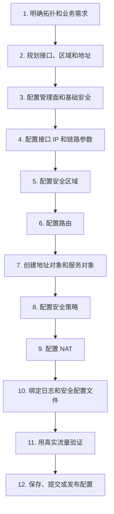
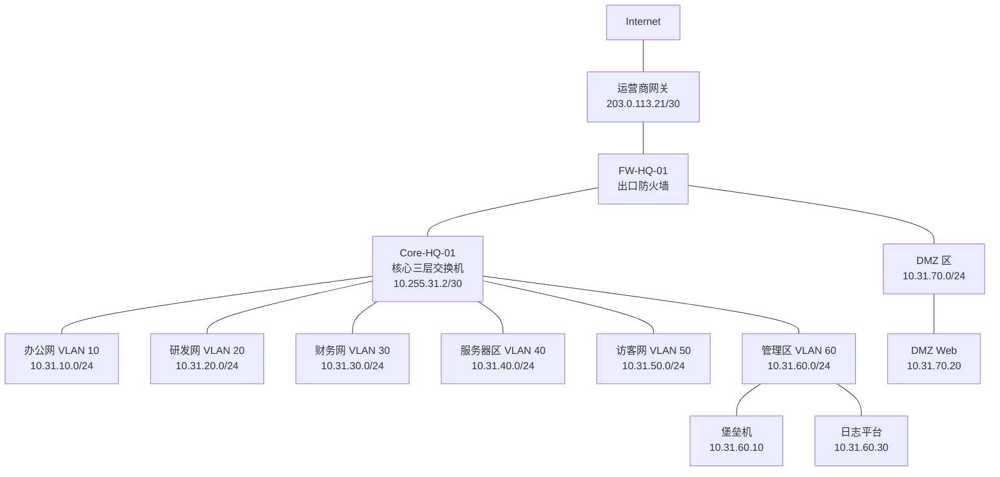
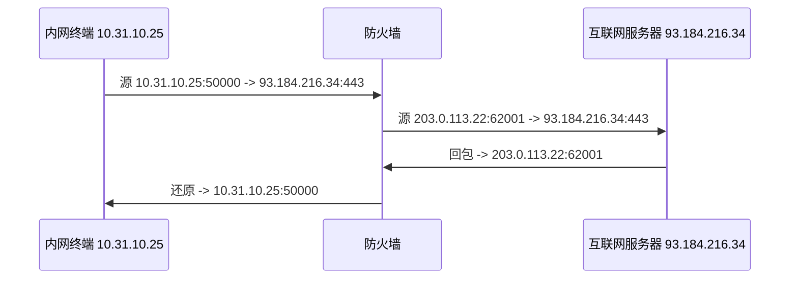
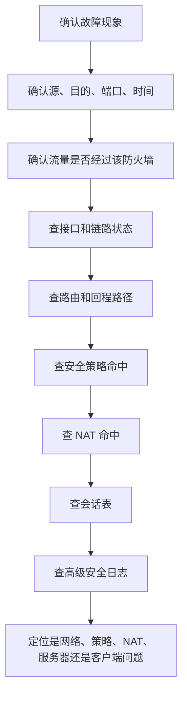

# 第 31 章：主流防火墙配置思路

## 31.1 本章学习目标

读完本章后，你应该能够：

- 理解不同厂商防火墙在配置界面和命令上的差异，以及它们背后相同的工程逻辑。
- 按“接口 -> 区域 -> 路由 -> 对象 -> 安全策略 -> NAT -> 日志 -> 验证”的顺序规划防火墙配置。
- 看懂华为 USG、H3C SecPath、Cisco ASA/FTD、Fortinet FortiGate、Palo Alto Networks PAN-OS 等主流防火墙的配置模型。
- 区分安全策略、NAT 策略、路由表、会话表和安全配置文件之间的关系。
- 根据统一的企业场景，写出跨厂商可迁移的地址对象、服务对象、策略表和 NAT 表。
- 理解命令行型防火墙和图形化策略型防火墙在实施流程上的差别。
- 掌握主流防火墙的常用验证和排错入口。
- 在真实项目中形成“先设计、再配置、再验证、最后留痕”的安全设备实施习惯。

前面几章已经学习了华为、H3C 和 Cisco 路由交换设备配置。本章继续学习防火墙，但重点不再是某一家厂商的一套完整命令，而是比较主流防火墙的配置思路。

防火墙厂商很多，常见设备包括：

- 华为 USG 系列。
- H3C SecPath 系列。
- Cisco ASA 和 Cisco Secure Firewall/FTD。
- Fortinet FortiGate。
- Palo Alto Networks PA 系列。
- 山石、深信服、天融信、启明星辰等国产安全网关。

不同设备的界面、术语、命令差异很大。有的偏命令行，有的偏 Web 图形化，有的需要提交配置，有的修改后立即生效，有的把 NAT 放在安全策略里，有的把 NAT 和安全策略完全分开。

但从工程角度看，所有防火墙都在回答同一组问题：

```text
流量从哪里来？
流量要到哪里去？
源地址和目的地址是什么？
使用什么协议和端口？
是否需要改写地址？
是否允许建立会话？
是否需要做应用识别、入侵防御、URL 过滤或病毒检测？
是否记录日志？
故障时如何证明问题发生在哪一层？
```

本章的目标是建立跨厂商的“配置翻译能力”。当你面对一台不熟悉的防火墙时，不要先急着找某条命令，而要先判断它的配置模型，然后把通用设计映射到该厂商的对象、区域、策略和 NAT 上。

## 31.2 主流防火墙配置的共同模型

防火墙配置看起来复杂，是因为它同时处理三件事：

1. 三层转发：接口、IP 地址、路由、ARP、下一跳。
2. 安全控制：安全区域、策略、应用、用户、内容检测。
3. 地址转换：源 NAT、目的 NAT、双向 NAT、服务器发布。

初学者容易把这些内容混在一起。例如“策略已经允许了，为什么还不通？”常见原因是路由没通、NAT 没命中、回程路径不对、接口没加入区域、会话被高级安全功能阻断，或者流量根本没有经过这台防火墙。

### 通用配置模块

一台企业防火墙通常包含以下配置模块。

| 模块 | 解决的问题 | 常见配置对象 |
| --- | --- | --- |
| 管理面 | 谁能登录设备，使用什么方式登录 | 管理 IP、管理员账号、SSH/HTTPS、AAA、管理 ACL |
| 接口 | 防火墙连接哪些网络 | 物理接口、子接口、聚合接口、VLAN 接口、隧道接口 |
| 安全区域 | 接口属于哪个安全边界 | Trust、Untrust、DMZ、Guest、Mgmt、VPN |
| 路由 | 报文往哪里转发 | 静态路由、默认路由、OSPF、BGP、策略路由 |
| 地址对象 | 用名称表示主机或网段 | 办公网、服务器、DMZ Web、供应商公网 IP |
| 服务对象 | 用名称表示协议和端口 | DNS、HTTP、HTTPS、SSH、RDP、应用端口 |
| 安全策略 | 哪些新建连接允许通过 | 源区域、目的区域、源地址、目的地址、服务、动作 |
| NAT | 是否改写源地址或目的地址 | 源 NAT、目的 NAT、端口映射、地址池 |
| 高级安全 | 是否进一步检查应用和内容 | IPS、URL 过滤、病毒防护、文件过滤、SSL 解密 |
| VPN | 如何建立加密隧道 | IPSec、SSL VPN、用户、路由、加密域 |
| 日志审计 | 如何排错、审计和追踪 | 策略日志、威胁日志、系统日志、流量日志 |
| 高可用 | 单台故障后如何接管 | 主备、双活、心跳口、会话同步 |

这些模块之间有依赖关系。安全策略不能代替路由，NAT 不能代替策略，高级安全功能不能弥补基础区域设计错误。

### 推荐配置顺序

无论使用哪家防火墙，初学者都可以按下面顺序实施：



这个顺序不是唯一答案，但适合建立初学者的排错边界。

如果安全策略还没写，先不要讨论 URL 过滤。如果路由表还不对，先不要怀疑 IPS。如果流量路径不经过防火墙，防火墙上写再多策略也不会生效。

### 配置生效方式差异

不同厂商对配置生效的处理不同。

| 类型 | 特点 | 代表设备 |
| --- | --- | --- |
| 即时生效型 | 命令输入后立即影响运行配置，通常还要单独保存 | 华为 USG、H3C SecPath、Cisco ASA、FortiGate CLI |
| 提交生效型 | 修改先进入候选配置，执行 commit 后统一生效 | Palo Alto PAN-OS、部分 Junos 风格设备 |
| 图形化发布型 | 在管理中心编辑策略，再部署到设备 | Cisco FTD/FMC、集中管理平台 |
| 混合型 | Web 界面、CLI、API 都可改配置，但保存和提交逻辑不同 | 多数下一代防火墙 |

工程上要特别注意两件事：

- 修改是否已经生效。
- 修改是否能在重启后保留。

很多事故不是策略写错，而是“以为已经提交”或“以为已经保存”。

## 31.3 本章统一示例拓扑

本章使用一个中型企业出口防火墙作为统一示例。为了避免和前面章节混淆，本章使用 `10.31.x.x` 地址段。



### 接口和区域规划

| 防火墙接口 | 地址 | 连接对象 | 安全区域 | 说明 |
| --- | --- | --- | --- | --- |
| `outside` | `203.0.113.22/30` | 运营商 | Untrust | 互联网出口 |
| `inside` | `10.255.31.1/30` | 核心交换机 | Trust | 内网汇聚入口 |
| `dmz` | `10.31.70.1/24` | DMZ 交换机或服务器 | DMZ | 对外发布区 |
| `mgmt` | 可选独立管理地址 | 管理网络 | Management | 带外或带内管理 |

核心交换机侧规划：

| 位置 | 地址或网段 | 说明 |
| --- | --- | --- |
| 核心到防火墙 | `10.255.31.2/30` | 核心三层互联口 |
| 核心默认路由 | 下一跳 `10.255.31.1` | 内网访问外部先到防火墙 |
| 防火墙回内网路由 | `10.31.0.0/16` 下一跳 `10.255.31.2` | 防火墙回内部网段 |
| 防火墙默认路由 | 下一跳 `203.0.113.21` | 防火墙访问互联网 |

### 业务需求

本章统一需求如下。

| 编号 | 需求 | 配置模块 |
| ---: | --- | --- |
| 1 | 办公网、研发网、财务网可以访问互联网 DNS、HTTP、HTTPS | 安全策略、源 NAT |
| 2 | 访客网只能访问互联网，不能访问企业内部网段 | 安全策略或核心 ACL，取决于真实路径 |
| 3 | 外部用户可以访问 DMZ Web 的 HTTPS 服务 | 目的 NAT、安全策略 |
| 4 | 堡垒机可以 SSH/RDP 管理服务器区和 DMZ 主机 | 安全策略、日志 |
| 5 | 普通用户不能直接访问服务器管理端口 | 拒绝策略、日志 |
| 6 | DMZ Web 可以访问互联网更新源、DNS 和 NTP | 安全策略、源 NAT |
| 7 | 所有允许和拒绝策略都记录日志 | 日志配置 |
| 8 | 防火墙时间与日志平台一致 | NTP、Syslog |

### 地址对象规划

| 对象名称 | 地址 | 说明 |
| --- | --- | --- |
| `OBJ_NET_OFFICE` | `10.31.10.0/24` | 办公网 |
| `OBJ_NET_RD` | `10.31.20.0/24` | 研发网 |
| `OBJ_NET_FINANCE` | `10.31.30.0/24` | 财务网 |
| `OBJ_NET_SERVER` | `10.31.40.0/24` | 服务器区 |
| `OBJ_NET_GUEST` | `10.31.50.0/24` | 访客网 |
| `OBJ_NET_MGMT` | `10.31.60.0/24` | 管理区 |
| `OBJ_NET_DMZ` | `10.31.70.0/24` | DMZ 区 |
| `OBJ_HOST_DMZ_WEB` | `10.31.70.20/32` | 对外 Web 服务器 |
| `OBJ_HOST_BASTION` | `10.31.60.10/32` | 堡垒机 |
| `OBJ_HOST_LOG` | `10.31.60.30/32` | 日志平台 |
| `OBJ_NET_INTERNAL` | `10.31.0.0/16` | 企业内部汇总网段 |

### 服务对象规划

| 对象名称 | 协议和端口 | 说明 |
| --- | --- | --- |
| `SVC_DNS` | UDP/TCP 53 | DNS 查询 |
| `SVC_HTTP` | TCP 80 | HTTP |
| `SVC_HTTPS` | TCP 443 | HTTPS |
| `SVC_NTP` | UDP 123 | 时间同步 |
| `SVC_SSH` | TCP 22 | Linux/网络设备管理 |
| `SVC_RDP` | TCP 3389 | Windows 远程桌面 |
| `GRP_WEB` | DNS、HTTP、HTTPS | 常见上网服务 |
| `GRP_MGMT` | SSH、RDP | 运维管理服务 |

### 安全策略规划

| 顺序 | 策略名称 | 源区域 | 目的区域 | 源地址 | 目的地址 | 服务 | 动作 | 日志 |
| ---: | --- | --- | --- | --- | --- | --- | --- | --- |
| 10 | `deny-guest-to-internal` | Trust | Trust/DMZ | `OBJ_NET_GUEST` | `OBJ_NET_INTERNAL`、`OBJ_NET_DMZ` | Any | Deny | 开 |
| 20 | `deny-user-to-server-mgmt` | Trust | Trust/DMZ | 办公/研发/财务 | 服务器/DMZ | SSH/RDP | Deny | 开 |
| 30 | `allow-bastion-to-server-mgmt` | Trust | Trust/DMZ | `OBJ_HOST_BASTION` | 服务器/DMZ | SSH/RDP | Permit | 开 |
| 40 | `allow-internal-to-internet-web` | Trust | Untrust | 办公/研发/财务 | Any | DNS/HTTP/HTTPS | Permit | 开 |
| 50 | `allow-guest-to-internet-web` | Trust | Untrust | `OBJ_NET_GUEST` | Any | DNS/HTTP/HTTPS | Permit | 开 |
| 60 | `allow-untrust-to-dmz-web` | Untrust | DMZ | Any | `OBJ_HOST_DMZ_WEB` | HTTPS | Permit | 开 |
| 70 | `allow-dmz-web-to-internet-update` | DMZ | Untrust | `OBJ_HOST_DMZ_WEB` | Any | DNS/HTTP/HTTPS/NTP | Permit | 开 |
| 99 | `deny-any-log` | Any | Any | Any | Any | Any | Deny | 开 |

注意第 10 条策略有一个前提：访客访问内部网段的流量必须经过防火墙。如果访客网和服务器区的网关都在核心交换机上，这类流量可能在核心交换机内部完成三层转发，不会经过出口防火墙。此时应在核心交换机上配置 ACL，或者调整网络设计让内部隔离流量经过防火墙。

### NAT 规划

| NAT 规则 | 类型 | 源区域 | 目的区域 | 原始地址 | 转换后地址 | 说明 |
| --- | --- | --- | --- | --- | --- | --- |
| `snat-internal-internet` | 源 NAT | Trust | Untrust | 办公/研发/财务/访客 | 防火墙外网接口地址 | 内网访问互联网 |
| `snat-dmz-web-update` | 源 NAT | DMZ | Untrust | `10.31.70.20` | 防火墙外网接口地址 | DMZ Web 更新 |
| `dnat-public-web` | 目的 NAT | Untrust | DMZ | `203.0.113.22:443` | `10.31.70.20:443` | 对外发布 Web |

NAT 和安全策略的匹配顺序在不同厂商中不完全相同。工程实施时不能只记“先 NAT 还是先策略”，而要查该厂商该版本的处理逻辑。学习阶段可以先记住一个原则：

```text
策略和 NAT 都必须匹配同一条真实业务流量。
排错时同时查看策略命中、NAT 命中、会话表和路由表。
```

## 31.4 配置前的工程设计表

防火墙配置最怕边想边改。正式实施前，至少准备以下四张表。

### 接口表

| 设备 | 接口名称 | IP 地址 | 对端 | 区域 | 备注 |
| --- | --- | --- | --- | --- | --- |
| FW-HQ-01 | outside | `203.0.113.22/30` | ISP `203.0.113.21` | Untrust | 互联网出口 |
| FW-HQ-01 | inside | `10.255.31.1/30` | Core `10.255.31.2` | Trust | 内网互联 |
| FW-HQ-01 | dmz | `10.31.70.1/24` | DMZ-SW | DMZ | DMZ 网关 |

接口表用于防止三个常见错误：

- IP 地址写错。
- 接口接线和配置不一致。
- 接口加入了错误安全区域。

### 路由表

| 设备 | 目的网段 | 下一跳 | 说明 |
| --- | --- | --- | --- |
| Core-HQ-01 | `0.0.0.0/0` | `10.255.31.1` | 内网默认到防火墙 |
| FW-HQ-01 | `10.31.0.0/16` | `10.255.31.2` | 回内部业务网段 |
| FW-HQ-01 | `0.0.0.0/0` | `203.0.113.21` | 出互联网 |

路由表用于回答“包往哪里走”。如果路由错误，策略允许也没有意义。

### 策略表

策略表应包括源、目的、服务、动作、日志、申请人和变更单号。真实项目中不要只记录截图。

| 字段 | 示例 |
| --- | --- |
| 策略名称 | `allow-untrust-to-dmz-web` |
| 业务说明 | 外部访问企业门户 HTTPS |
| 源地址 | Any |
| 目的地址 | `OBJ_HOST_DMZ_WEB` |
| 服务 | HTTPS |
| 动作 | Permit |
| 日志 | 开启 |
| 申请人 | 门户系统负责人 |
| 变更单 | CHG-20260609-001 |

### 回退表

回退表要具体到规则名称。

| 回退对象 | 回退动作 |
| --- | --- |
| `allow-untrust-to-dmz-web` | 禁用或删除该安全策略 |
| `dnat-public-web` | 禁用或删除该 DNAT |
| `OBJ_HOST_DMZ_WEB` | 保留对象，不影响业务 |
| 日志配置 | 保留，便于排查 |

不要把回退方案写成“恢复原配置”。现场出现故障时，这句话无法指导具体操作。

## 31.5 主流厂商配置模型对比

### 术语对比

| 通用概念 | 华为 USG | H3C SecPath | Cisco ASA/FTD | FortiGate | Palo Alto PAN-OS |
| --- | --- | --- | --- | --- | --- |
| 安全区域 | security-zone | security-zone | nameif/zone | interface role/zone-like policy field | zone |
| 地址对象 | address-set | object-group/address object | network object | firewall address | address object |
| 服务对象 | service-set | service object/group | service object/access-list port | firewall service | service object |
| 安全策略 | security-policy | security-policy | ACL/Access Control Policy | firewall policy | Security Policy |
| 源 NAT | nat-policy | NAT policy/outbound NAT | dynamic NAT/PAT | policy NAT or central SNAT | NAT Policy |
| 目的 NAT | nat server/NAT policy | NAT server/policy | static NAT | VIP | NAT Policy |
| 会话表 | firewall session table | firewall session table | connection table | session table | session table |
| 保存/提交 | save | save | write memory | execute backup/save or config auto-save | commit |

这张表不要求死记。它的作用是帮助你把“同一个工程动作”映射到不同厂商的配置入口。

### 配置入口对比

| 厂商 | 常见操作方式 | 学习重点 |
| --- | --- | --- |
| 华为 USG | CLI、Web 管理、eSight/管理平台 | 区域、地址集、服务集、安全策略、NAT 策略 |
| H3C SecPath | CLI、Web 管理、iMC/管理平台 | Comware 风格命令、对象组、安全策略、NAT |
| Cisco ASA | CLI、ASDM | nameif、安全级别、ACL、object NAT、packet-tracer |
| Cisco FTD | FDM 或 FMC 图形化管理 | Access Control Policy、NAT Policy、Deploy |
| FortiGate | Web GUI、CLI、FortiManager | firewall policy、VIP、NAT、UTM Profile、日志 |
| Palo Alto | Web GUI、CLI、Panorama | zone、virtual router、Security Policy、NAT Policy、commit |

命令不是最难的部分。真正难的是知道应该在哪个模块里解决问题。

## 31.6 华为 USG 配置思路

华为 USG 的配置风格接近 VRP，但防火墙比交换机多了安全区域、安全策略、NAT 策略和安全配置文件等内容。

### 配置模型

华为 USG 常见逻辑如下：

```text
接口配置 IP
接口加入 security-zone
配置路由
创建 address-set / service-set
进入 security-policy 配置安全策略
进入 nat-policy 配置 NAT
配置日志和安全配置文件
save 保存
```

### 基础接口和区域

以下是命令风格示例，不同型号和版本可能略有差异。真实项目应以现场设备文档为准。

```text
system-view
sysname FW-HQ-01

interface GigabitEthernet1/0/0
 description TO-CORE
 ip address 10.255.31.1 255.255.255.252

interface GigabitEthernet1/0/1
 description TO-ISP
 ip address 203.0.113.22 255.255.255.252

interface GigabitEthernet1/0/2
 description TO-DMZ
 ip address 10.31.70.1 255.255.255.0

firewall zone trust
 add interface GigabitEthernet1/0/0

firewall zone untrust
 add interface GigabitEthernet1/0/1

firewall zone dmz
 add interface GigabitEthernet1/0/2
```

这里的关键不是接口编号，而是接口、IP、对端和区域必须一致。

### 路由

```text
ip route-static 10.31.0.0 255.255.0.0 10.255.31.2
ip route-static 0.0.0.0 0.0.0.0 203.0.113.21
```

第一条让防火墙知道如何回内部网段，第二条让防火墙知道如何出互联网。

### 地址对象和服务对象

```text
ip address-set OBJ_NET_OFFICE type object
 address 0 10.31.10.0 mask 24

ip address-set OBJ_NET_RD type object
 address 0 10.31.20.0 mask 24

ip address-set OBJ_NET_FINANCE type object
 address 0 10.31.30.0 mask 24

ip address-set OBJ_NET_GUEST type object
 address 0 10.31.50.0 mask 24

ip address-set OBJ_HOST_DMZ_WEB type object
 address 0 10.31.70.20 mask 32

ip service-set GRP_WEB type object
 service 0 protocol udp destination-port 53
 service 1 protocol tcp destination-port 53
 service 2 protocol tcp destination-port 80
 service 3 protocol tcp destination-port 443
```

地址对象和服务对象让策略可读性更好。不要把大量 IP 和端口直接写在策略中，否则后期维护困难。

### 安全策略

```text
security-policy
 rule name allow-internal-to-internet-web
  source-zone trust
  destination-zone untrust
  source-address address-set OBJ_NET_OFFICE
  source-address address-set OBJ_NET_RD
  source-address address-set OBJ_NET_FINANCE
  service GRP_WEB
  action permit
  log enable

 rule name allow-untrust-to-dmz-web
  source-zone untrust
  destination-zone dmz
  destination-address address-set OBJ_HOST_DMZ_WEB
  service https
  action permit
  log enable

 rule name deny-any-log
  source-zone any
  destination-zone any
  action deny
  log enable
```

安全策略的关注点是“是否允许新建连接”。已经建立的连接回包通常由状态检测处理，不需要单独写反向允许策略。

### NAT 策略

```text
nat-policy
 rule name snat-internal-internet
  source-zone trust
  destination-zone untrust
  source-address address-set OBJ_NET_OFFICE
  source-address address-set OBJ_NET_RD
  source-address address-set OBJ_NET_FINANCE
  action source-nat easy-ip

 rule name snat-dmz-web-update
  source-zone dmz
  destination-zone untrust
  source-address address-set OBJ_HOST_DMZ_WEB
  action source-nat easy-ip
```

服务器发布可能使用 NAT Server 或目的 NAT 配置，具体语法随版本而变化。工程逻辑是：

```text
公网地址 203.0.113.22:443 -> 内部地址 10.31.70.20:443
同时必须有 Untrust -> DMZ 的安全策略允许 HTTPS。
```

### 华为 USG 常用验证

| 目标 | 常用命令思路 |
| --- | --- |
| 查看接口 | `display ip interface brief` |
| 查看区域 | `display zone` 或查看安全区域配置 |
| 查看路由 | `display ip routing-table` |
| 查看策略 | `display security-policy` 或查看命中统计 |
| 查看会话 | `display firewall session table` |
| 查看 NAT | 查看 NAT 策略、NAT 会话或 server-map |
| 查看日志 | 查看策略日志、威胁日志、系统日志 |

排错时不要只看策略配置。至少同时看接口、路由、策略命中、NAT 命中和会话表。

## 31.7 H3C SecPath 配置思路

H3C SecPath 防火墙使用 Comware 风格，和 H3C 交换机、路由器命令习惯接近，但安全策略和 NAT 模块有自己的配置方式。

### 配置模型

H3C SecPath 常见逻辑如下：

```text
system-view
配置接口 IP
把接口加入 security-zone
配置静态路由
创建对象组
配置安全策略
配置 NAT
配置日志
save 保存
```

### 接口、区域和路由

命令风格示例：

```text
system-view
sysname FW-HQ-01

interface GigabitEthernet1/0/0
 description TO-CORE
 ip address 10.255.31.1 255.255.255.252

interface GigabitEthernet1/0/1
 description TO-ISP
 ip address 203.0.113.22 255.255.255.252

interface GigabitEthernet1/0/2
 description TO-DMZ
 ip address 10.31.70.1 255.255.255.0

security-zone name Trust
 import interface GigabitEthernet1/0/0

security-zone name Untrust
 import interface GigabitEthernet1/0/1

security-zone name DMZ
 import interface GigabitEthernet1/0/2

ip route-static 10.31.0.0 16 10.255.31.2
ip route-static 0.0.0.0 0 203.0.113.21
```

H3C 设备上经常可以看到 `Trust`、`Untrust`、`DMZ` 这类区域名称。名称可以自定义，但建议使用清晰、统一的命名。

### 对象组和策略

H3C 防火墙常使用对象组来组织地址和服务。不同版本命令会有差异，但设计思路一致：

```text
object-group ip address OBJ_NET_OFFICE
 network subnet 10.31.10.0 255.255.255.0

object-group ip address OBJ_NET_RD
 network subnet 10.31.20.0 255.255.255.0

object-group ip address OBJ_HOST_DMZ_WEB
 network host address 10.31.70.20

object-group service GRP_WEB
 service udp destination eq 53
 service tcp destination eq 53
 service tcp destination eq 80
 service tcp destination eq 443
```

安全策略示例：

```text
security-policy ip
 rule 40 name allow-internal-to-internet-web
  source-zone Trust
  destination-zone Untrust
  source-ip OBJ_NET_OFFICE
  source-ip OBJ_NET_RD
  service GRP_WEB
  action pass
  logging enable

 rule 60 name allow-untrust-to-dmz-web
  source-zone Untrust
  destination-zone DMZ
  destination-ip OBJ_HOST_DMZ_WEB
  service https
  action pass
  logging enable

 rule 99 name deny-any-log
  action drop
  logging enable
```

H3C 的关键点和华为类似：

- 接口必须加入正确区域。
- 策略方向必须和流量新建方向一致。
- 对象组要先定义清楚。
- 策略顺序要从精确到宽泛。

### NAT 思路

H3C 防火墙的 NAT 配置入口随版本和产品形态会有差异。学习时先抓住三类 NAT：

| NAT 类型 | 典型用途 |
| --- | --- |
| 源 NAT | 内网访问互联网，把私网地址转换为公网地址 |
| 目的 NAT | 外网访问内部服务器，把公网地址转换为服务器私网地址 |
| 静态 NAT | 固定一对一映射，常用于服务器或特殊业务 |

示例思路：

```text
nat policy
 rule name snat-internal-internet
  source-zone Trust
  destination-zone Untrust
  source-address OBJ_NET_OFFICE
  source-address OBJ_NET_RD
  action snat easy-ip

 rule name dnat-public-web
  source-zone Untrust
  destination-zone DMZ
  destination-address 203.0.113.22
  service https
  action dnat 10.31.70.20 443
```

如果设备版本使用不同 NAT 命令，不要强行套用示例。你要确认的是：原始流量、转换后地址、转换后端口、出接口和安全策略是否一致。

### H3C 常用验证

| 目标 | 常用命令思路 |
| --- | --- |
| 查看接口 | `display ip interface brief` |
| 查看路由 | `display ip routing-table` |
| 查看安全策略 | 查看 security-policy 配置和命中 |
| 查看会话 | `display firewall session table` |
| 查看 NAT | 查看 NAT 会话、NAT 规则和命中 |
| 查看日志 | 查看安全日志、系统日志 |

Comware 系设备排错时要善用 `display current-configuration` 查看完整配置，不要只看局部命令输出。

## 31.8 Cisco ASA 和 Cisco FTD 配置思路

Cisco 防火墙有两条常见路线：

- Cisco ASA：传统 ASA 软件，常见于 CLI 和 ASDM 管理。
- Cisco FTD：Firepower Threat Defense，通常通过 FDM 或 FMC 图形化管理。

两者配置体验差异很大。ASA 更像传统命令行防火墙，FTD 更像策略中心驱动的下一代防火墙。

### Cisco ASA 的核心概念

ASA 常见配置概念包括：

| 概念 | 说明 |
| --- | --- |
| `nameif` | 给接口命名，例如 inside、outside、dmz |
| `security-level` | 接口安全级别，0 到 100 |
| `object network` | 网络对象，可用于 NAT 和 ACL |
| `access-list` | 访问控制列表 |
| `access-group` | 把 ACL 调用到接口方向 |
| `nat` | 配置动态 NAT、静态 NAT、端口映射 |
| `show conn` | 查看连接表 |
| `show xlate` | 查看 NAT 转换 |
| `packet-tracer` | 模拟一条流量经过防火墙的处理过程 |

ASA 中 `nameif` 很重要。很多策略和 NAT 都使用接口名称，而不是直接使用安全区域名称。

### ASA 接口和路由示例

```text
configure terminal
hostname FW-HQ-01

interface GigabitEthernet0/0
 nameif outside
 security-level 0
 ip address 203.0.113.22 255.255.255.252
 no shutdown

interface GigabitEthernet0/1
 nameif inside
 security-level 100
 ip address 10.255.31.1 255.255.255.252
 no shutdown

interface GigabitEthernet0/2
 nameif dmz
 security-level 50
 ip address 10.31.70.1 255.255.255.0
 no shutdown

route inside 10.31.0.0 255.255.0.0 10.255.31.2
route outside 0.0.0.0 0.0.0.0 203.0.113.21
```

ASA 的 `security-level` 是早期 ASA 的重要概念。高安全级别到低安全级别在默认行为上更宽松，但生产环境中仍建议明确写 ACL，不要依赖默认行为。

### ASA 地址对象、NAT 和 ACL

```text
object network NET_OFFICE
 subnet 10.31.10.0 255.255.255.0

object network NET_RD
 subnet 10.31.20.0 255.255.255.0

object network HOST_DMZ_WEB
 host 10.31.70.20

object network NET_INTERNAL_SUMMARY
 subnet 10.31.0.0 255.255.0.0

object network NET_INTERNAL_SUMMARY
 nat (inside,outside) dynamic interface

object network HOST_DMZ_WEB
 nat (dmz,outside) static interface service tcp https https
```

ACL 示例：

```text
access-list OUTSIDE-IN extended permit tcp any object HOST_DMZ_WEB eq https
access-group OUTSIDE-IN in interface outside

access-list INSIDE-IN extended permit tcp object NET_OFFICE any eq 80
access-list INSIDE-IN extended permit tcp object NET_OFFICE any eq 443
access-list INSIDE-IN extended permit udp object NET_OFFICE any eq 53
access-group INSIDE-IN in interface inside
```

ASA 的 ACL 和 NAT 有自己的匹配细节。尤其在服务器发布场景中，ACL 写转换前地址还是转换后地址，和 ASA 版本、NAT 模型有关。学习时务必配合 `packet-tracer` 验证。

### ASA packet-tracer

`packet-tracer` 是 ASA 排错中非常有价值的工具。它可以模拟一条流量经过防火墙时命中哪些阶段。

示例：

```text
packet-tracer input outside tcp 198.51.100.10 50000 203.0.113.22 443
packet-tracer input inside tcp 10.31.10.25 50000 8.8.8.8 443
```

它可以帮助判断：

- 是否命中 ACL。
- 是否命中 NAT。
- 是否有路由。
- 是否被策略拒绝。
- 最终动作是 allow 还是 drop。

### Cisco FTD 的配置思路

FTD 更强调图形化策略：

```text
Device 接口和区域
Objects 地址、网络、服务
Access Control Policy 安全策略
NAT Policy NAT 策略
Security Intelligence / IPS / URL / Malware 策略
Deploy 发布配置
Events 查看日志
```

FTD 的关键习惯：

- 在 FMC 或 FDM 中修改后，需要 Deploy 才会下发。
- 安全策略和 NAT 策略通常是不同页面。
- 对象复用很重要，不建议在策略中直接写大量临时 IP。
- 排错时看 Connection Events、NAT 命中、ACP 命中和设备路由。

### Cisco 防火墙常用验证

| 目标 | ASA 常用命令 | FTD 常见入口 |
| --- | --- | --- |
| 查看接口 | `show interface ip brief` | Device 接口状态 |
| 查看路由 | `show route` | Device 路由表 |
| 查看 ACL 命中 | `show access-list` | Access Control Events |
| 查看连接 | `show conn` | Connection Events |
| 查看 NAT | `show nat`、`show xlate` | NAT Policy、Connection Details |
| 模拟流量 | `packet-tracer` | Packet Tracer 或诊断工具 |
| 查看日志 | `show logging` | FMC/FDM Events |

Cisco 防火墙学习重点不是只背 ASA CLI，因为很多新部署已经使用 FTD/FMC。你要同时理解传统命令行模型和图形化策略模型。

## 31.9 Fortinet FortiGate 配置思路

FortiGate 在企业出口、防火墙替换、分支互联和中小企业场景中很常见。它的 Web 界面比较常用，CLI 也经常用于批量配置和排错。

### FortiGate 的核心概念

| 概念 | 说明 |
| --- | --- |
| Interface | 物理口、VLAN 子接口、聚合口、隧道口 |
| Zone | 可把多个接口归为同一策略边界 |
| Address | 地址对象 |
| Service | 服务对象 |
| Firewall Policy | 安全策略，常同时包含 NAT 开关 |
| VIP | Virtual IP，常用于目的 NAT 和服务器发布 |
| Security Profile | IPS、Web Filter、Antivirus、Application Control 等 |
| Policy ID | 策略编号，日志和排错中经常出现 |

FortiGate 的一个特点是：很多场景下源 NAT 直接在 firewall policy 中开启，而服务器发布常使用 VIP 对象。

### 接口和路由思路

CLI 风格示例：

```text
config system interface
    edit "wan1"
        set alias "TO-ISP"
        set ip 203.0.113.22 255.255.255.252
        set allowaccess ping
        set role wan
    next
    edit "internal"
        set alias "TO-CORE"
        set ip 10.255.31.1 255.255.255.252
        set allowaccess ping
        set role lan
    next
    edit "dmz"
        set alias "TO-DMZ"
        set ip 10.31.70.1 255.255.255.0
        set allowaccess ping
        set role dmz
    next
end

config router static
    edit 1
        set dst 10.31.0.0 255.255.0.0
        set gateway 10.255.31.2
        set device "internal"
    next
    edit 2
        set dst 0.0.0.0 0.0.0.0
        set gateway 203.0.113.21
        set device "wan1"
    next
end
```

`allowaccess` 控制哪些管理协议可以访问该接口。不要在互联网口随意开启 HTTPS、SSH 等管理访问。

### 地址对象和策略

```text
config firewall address
    edit "OBJ_NET_OFFICE"
        set subnet 10.31.10.0 255.255.255.0
    next
    edit "OBJ_NET_RD"
        set subnet 10.31.20.0 255.255.255.0
    next
    edit "OBJ_HOST_DMZ_WEB"
        set subnet 10.31.70.20 255.255.255.255
    next
end

config firewall policy
    edit 40
        set name "allow-internal-to-internet-web"
        set srcintf "internal"
        set dstintf "wan1"
        set srcaddr "OBJ_NET_OFFICE" "OBJ_NET_RD"
        set dstaddr "all"
        set action accept
        set schedule "always"
        set service "DNS" "HTTP" "HTTPS"
        set nat enable
        set logtraffic all
    next
end
```

FortiGate 策略通常按策略列表从上到下匹配。更精确的拒绝或允许要放在宽泛允许之前。

### VIP 服务器发布

FortiGate 常用 VIP 做目的 NAT。

```text
config firewall vip
    edit "VIP_PUBLIC_WEB_HTTPS"
        set extintf "wan1"
        set extip 203.0.113.22
        set mappedip "10.31.70.20"
        set portforward enable
        set extport 443
        set mappedport 443
    next
end

config firewall policy
    edit 60
        set name "allow-untrust-to-dmz-web"
        set srcintf "wan1"
        set dstintf "dmz"
        set srcaddr "all"
        set dstaddr "VIP_PUBLIC_WEB_HTTPS"
        set action accept
        set schedule "always"
        set service "HTTPS"
        set logtraffic all
    next
end
```

这里要注意：安全策略目的地址通常选择 VIP 对象，而不是直接选择内部服务器对象。具体行为取决于 FortiOS 版本和策略模式，排错时要看策略命中和会话详情。

### Security Profile

FortiGate 常把高级安全能力挂在策略上，例如：

- Antivirus。
- Web Filter。
- DNS Filter。
- Application Control。
- IPS。
- SSL Inspection。

上线建议：

1. 先只记录日志。
2. 观察误报和业务影响。
3. 对高风险类别逐步阻断。
4. 对关键业务建立例外。
5. 定期回顾命中和告警。

### FortiGate 常用验证

| 目标 | 常用命令或入口 |
| --- | --- |
| 查看接口 | `get system interface physical`、接口页面 |
| 查看路由 | `get router info routing-table all` |
| 查看策略 | Policy 列表、策略 ID 命中 |
| 查看会话 | `diagnose sys session list` |
| 流量调试 | `diagnose debug flow` |
| 查看日志 | Forward Traffic、Security Events |
| 查看 NAT/VIP | VIP 对象、会话详情 |

FortiGate 排错经常围绕策略 ID 展开。日志中如果能看到 policyid，就能快速定位命中的策略。

## 31.10 Palo Alto PAN-OS 配置思路

Palo Alto Networks 防火墙强调应用识别、用户识别、内容安全和提交式配置。它的 Web 界面使用很多对象化配置，策略模型清晰，但初学者容易忽略 commit。

### PAN-OS 的核心概念

| 概念 | 说明 |
| --- | --- |
| Zone | 安全区域 |
| Interface | 接口，可为 Layer3、Layer2、Virtual Wire 等模式 |
| Virtual Router | 虚拟路由器，保存路由表 |
| Address Object | 地址对象 |
| Service Object | 服务对象 |
| Security Policy | 安全策略，允许或拒绝应用和服务 |
| NAT Policy | NAT 策略，独立于安全策略 |
| Security Profile | Antivirus、Vulnerability、URL Filtering 等 |
| Commit | 提交配置使其生效 |

PAN-OS 中安全策略和 NAT 策略是两个独立策略表。很多初学者只写 NAT 不写安全策略，或者只写安全策略不写 NAT，都会导致业务不通。

### 配置流程

典型 Web GUI 流程：

```text
Network -> Interfaces 配置接口地址
Network -> Zones 创建 Trust/Untrust/DMZ
Network -> Virtual Routers 配置静态路由
Objects -> Addresses 创建地址对象
Objects -> Services 创建服务对象
Policies -> Security 创建安全策略
Policies -> NAT 创建 NAT 策略
Objects -> Security Profiles 创建安全配置文件
Commit 提交配置
Monitor -> Traffic 查看日志
```

### 安全策略思路

PAN-OS 的安全策略通常可以同时匹配应用和服务。学习阶段可以先从服务端口开始，再逐步理解 App-ID。

示例策略字段：

| 字段 | 示例 |
| --- | --- |
| Name | `allow-internal-to-internet-web` |
| Source Zone | Trust |
| Destination Zone | Untrust |
| Source Address | `OBJ_NET_OFFICE`、`OBJ_NET_RD` |
| Destination Address | Any |
| Application | web-browsing、ssl、dns 或 any |
| Service | application-default 或 service-http/service-https |
| Action | Allow |
| Profile | URL Filtering、Anti-Spyware、Vulnerability |
| Log | Log at Session End |

`application-default` 表示应用使用该应用默认端口时才允许。如果业务使用非标准端口，要特别确认策略是否匹配。

### NAT 策略思路

源 NAT 示例字段：

| 字段 | 示例 |
| --- | --- |
| Original Packet Source Zone | Trust |
| Original Packet Destination Zone | Untrust |
| Source Address | `OBJ_NET_OFFICE`、`OBJ_NET_RD` |
| Destination Address | Any |
| Translated Packet Source Translation | Dynamic IP and Port |
| Address Type | Interface Address |

目的 NAT 示例字段：

| 字段 | 示例 |
| --- | --- |
| Original Packet Source Zone | Untrust |
| Original Packet Destination Zone | Untrust 或 outside 接口所在区域 |
| Destination Address | `203.0.113.22` |
| Service | HTTPS |
| Translated Packet Destination Translation | `10.31.70.20:443` |

目的 NAT 后，安全策略通常要按 PAN-OS 的策略匹配逻辑填写正确的源区域、目的区域和目的地址。不同版本和配置模式可能涉及 pre-NAT/post-NAT 的理解，最稳妥的方式是使用策略匹配测试和真实日志验证。

### Commit 和日志

PAN-OS 修改后需要 commit。工程上建议：

- 提交前检查候选配置。
- 使用清晰的提交说明。
- 避免多人同时修改互相覆盖。
- 提交后查看 Traffic 日志是否有命中。
- 出现异常时查看 Threat、System、Config 日志。

### Palo Alto 常用验证

| 目标 | 常用入口或命令 |
| --- | --- |
| 查看接口 | Network -> Interfaces、`show interface` |
| 查看路由 | Virtual Router、`show routing route` |
| 策略匹配测试 | `test security-policy-match` |
| NAT 匹配测试 | `test nat-policy-match` |
| 查看会话 | `show session all filter ...` |
| 查看日志 | Monitor -> Traffic/Threat/System/Config |
| 查看提交 | Commit 状态和 Config 日志 |

PAN-OS 排错要习惯看 Traffic 日志。日志中通常能看到源、目的、应用、服务、命中策略、动作、NAT 信息和会话结束原因。

## 31.11 跨厂商配置映射方法

当你拿到一台不熟悉的防火墙，可以按下面方式快速建立认知。

### 第一步：找接口和区域

先回答：

```text
哪个接口接内网？
哪个接口接互联网？
哪个接口接 DMZ？
接口有没有 IP？
接口有没有加入安全区域？
接口 up 还是 down？
```

如果接口和区域不清楚，后面的策略都没有可靠基础。

### 第二步：找路由

确认：

```text
防火墙有没有默认路由？
防火墙有没有回内部网段的路由？
核心交换机默认路由是否指向防火墙？
DMZ 服务器网关是否指向防火墙？
回程路径是否对称？
```

路由错误时，日志可能只看到单向流量，或者根本看不到回包。

### 第三步：找对象

确认对象是否准确：

```text
办公网对象是否写成 10.31.10.0/24？
服务器对象是否写成主机 /32？
访客网对象是否遗漏？
服务对象是否把 TCP 和 UDP 混淆？
```

对象写错会导致策略看起来正确，但实际不命中。

### 第四步：找安全策略

确认：

```text
策略方向是否是新建连接方向？
源区域和目的区域是否正确？
策略顺序是否正确？
是否被前面的 deny 命中？
是否开启日志？
是否绑定了高级安全配置文件？
```

很多防火墙默认最后都有隐含拒绝。为了排错和审计，建议显式写一条 `deny-any-log`，并开启日志。

### 第五步：找 NAT

确认：

```text
源 NAT 是否匹配内网出站流量？
目的 NAT 是否匹配公网访问服务器的流量？
NAT 使用的是接口地址、地址池还是固定公网地址？
端口是否转换？
NAT 规则顺序是否正确？
```

NAT 排错一定要结合会话表看转换前和转换后地址。

### 第六步：找日志和会话

最终用证据说话：

```text
有没有会话？
会话状态是什么？
命中哪条策略？
是否做了 NAT？
是否被 IPS、URL 过滤或病毒检测阻断？
会话结束原因是什么？
```

没有日志时，排错会变成猜测。

## 31.12 安全策略设计要点

### 最小必要原则

安全策略应满足业务需要，但不要扩大范围。

不推荐：

| 字段 | 配置 |
| --- | --- |
| 源 | Any |
| 目的 | Any |
| 服务 | Any |
| 动作 | Permit |

推荐：

| 字段 | 配置 |
| --- | --- |
| 源 | `OBJ_NET_OFFICE` |
| 目的 | Any |
| 服务 | DNS、HTTP、HTTPS |
| 动作 | Permit |

如果确实需要临时 Any，也要加备注、加到期时间、开日志，并在变更结束后清理。

### 策略顺序

策略通常从上到下匹配，命中后停止继续匹配。因此顺序非常关键。

推荐顺序：

```text
精确拒绝高风险访问
精确允许必要业务
较宽泛的上网策略
临时策略
最后显式拒绝并记录日志
```

示例：

| 顺序 | 策略 | 原因 |
| ---: | --- | --- |
| 10 | 拒绝访客访问内部 | 防止被后面的上网策略覆盖 |
| 20 | 拒绝普通用户管理服务器 | 收敛管理面 |
| 30 | 允许堡垒机管理服务器 | 精确授权 |
| 40 | 允许员工访问互联网 Web | 常规业务 |
| 99 | 拒绝所有并记录 | 审计和排错 |

如果把 `allow-any` 放在前面，后面的拒绝策略永远不会命中。

### 日志策略

建议开启日志的策略：

- 所有拒绝策略。
- 互联网入口到 DMZ 的允许策略。
- 管理类访问策略。
- VPN 访问内部资源策略。
- 临时放行策略。
- 涉及财务、人事、研发代码、生产系统的策略。

对于高流量普通上网策略，可以根据设备性能和日志平台容量选择记录会话结束日志，而不是记录每个包。

## 31.13 NAT 设计要点

### 源 NAT

源 NAT 常用于内网访问互联网。



设计源 NAT 时要确认：

- 哪些源网段需要 NAT。
- 出哪个接口需要 NAT。
- 使用接口地址还是地址池。
- 是否有多个运营商出口。
- 是否需要为不同部门使用不同公网地址。
- 是否需要对服务器区、DMZ、VPN 用户分别写规则。

### 目的 NAT

目的 NAT 常用于服务器发布。

```text
公网访问：203.0.113.22:443
转换到：10.31.70.20:443
```

目的 NAT 需要同时满足：

- 外部用户能到达公网地址。
- 防火墙有 DNAT 或 VIP 规则。
- 防火墙有 Untrust -> DMZ 的安全策略。
- DMZ 服务器默认网关能回到防火墙。
- 服务器本机防火墙允许该服务。
- 日志能记录访问和拒绝。

### NAT 和安全策略的关系

不同厂商对 NAT 前地址、NAT 后地址、策略匹配地址的处理不同。学习时要避免机械套用。

排错时使用下面的问题：

| 问题 | 目的 |
| --- | --- |
| 策略命中了吗？ | 判断安全策略是否放行 |
| NAT 命中了吗？ | 判断地址转换是否发生 |
| 会话表里转换前后地址是什么？ | 判断转换是否符合预期 |
| 路由从哪个接口出去？ | 判断转发路径 |
| 回包是否进入同一台防火墙？ | 判断路径是否对称 |

如果能回答这五个问题，绝大多数 NAT 故障都能定位。

## 31.14 VPN 配置思路

本章不展开 VPN 的全部命令，重点说明跨厂商通用配置思路。VPN 已在第 17 章系统学习过。

### 站点到站点 IPSec VPN

站点到站点 VPN 常用于总部和分支互联。

通用配置项：

| 配置项 | 示例 |
| --- | --- |
| 对端公网地址 | 分支公网 IP |
| 本端公网地址 | 总部防火墙外网口 |
| 本端加密域 | `10.31.0.0/16` |
| 对端加密域 | `10.41.0.0/16` |
| IKE 版本 | IKEv2 优先 |
| 认证方式 | 预共享密钥或证书 |
| 加密算法 | AES、SHA、DH 组等 |
| 路由 | 静态路由或基于策略的加密域 |
| 策略 | VPN 区域到内部区域允许必要访问 |
| NAT 豁免 | 内网互访通常不做互联网源 NAT |

常见故障：

- 两端加密域不一致。
- 一端做了源 NAT，导致对端不认识源地址。
- IKE 参数不一致。
- 路由没有指向隧道。
- 安全策略没有允许 VPN 到内部资源。
- 回程路由缺失。

### SSL VPN 或远程接入 VPN

远程接入 VPN 常用于员工在外访问内部资源。

通用配置项：

| 配置项 | 示例 |
| --- | --- |
| 用户认证 | 本地用户、LDAP/AD、RADIUS、MFA |
| 地址池 | `10.31.250.0/24` |
| 可访问资源 | 堡垒机、OA、代码仓库、运维系统 |
| 分流策略 | 全隧道或分离隧道 |
| 安全策略 | VPN 用户区 -> 内部资源 |
| 日志 | 登录、注销、访问资源、失败原因 |

远程接入 VPN 不应等同于“进来以后访问全内网”。更合理的方式是：

```text
用户认证 -> 用户组授权 -> 最小资源访问 -> 日志审计 -> 定期复核权限
```

## 31.15 高级安全功能配置思路

下一代防火墙的高级功能通常挂在安全策略上，或者由独立的安全配置文件引用。

### 常见高级功能

| 功能 | 典型位置 | 上线建议 |
| --- | --- | --- |
| IPS | DMZ 发布、互联网出口、数据中心边界 | 先告警，再阻断高危 |
| URL 过滤 | 员工上网、访客上网 | 先按类别记录，再阻断恶意和违规类别 |
| 应用控制 | 互联网出口、远程办公 | 优先控制远控、代理、违规网盘 |
| 病毒防护 | Web、邮件、文件下载 | 关注性能和误报 |
| 文件过滤 | 上传下载控制 | 先限制可执行文件和脚本 |
| SSL 解密 | HTTPS 检测 | 需要证书、隐私、合规和例外策略 |
| DNS 安全 | 终端上网、访客网 | 阻断恶意域名和 C2 回连 |

### 上线原则

高级功能不要一次性全开。

推荐流程：

```text
选择一类流量 -> 只记录不阻断 -> 观察日志 -> 处理误报 -> 小范围阻断 -> 扩大范围 -> 定期复核
```

如果一开始就把 IPS、URL 过滤、应用控制、病毒防护、SSL 解密全部设为严格阻断，可能造成大量业务异常，而且排错边界很难判断。

### 与性能的关系

高级功能会消耗设备资源。选型和上线时要关注：

- 防火墙吞吐。
- 开启威胁防护后的吞吐。
- SSL 解密性能。
- 并发会话数。
- 新建连接数。
- 日志写入能力。
- 授权是否包含所需安全特征库。

不要只看厂商宣传的最大吞吐。真实场景中，安全功能开启后的性能更有参考价值。

## 31.16 日志、监控和审计

防火墙日志不是事后装饰，而是排错和安全运营的基础。

### 必须记录的日志

| 日志类型 | 用途 |
| --- | --- |
| 策略允许日志 | 证明业务命中哪条策略 |
| 策略拒绝日志 | 发现被拦截流量和误拦截 |
| NAT 日志 | 追踪私网地址和公网端口映射 |
| VPN 日志 | 查看用户登录、隧道建立和失败原因 |
| 威胁日志 | 查看 IPS、病毒、恶意域名、URL 过滤命中 |
| 系统日志 | 查看接口、HA、重启、授权、资源异常 |
| 配置日志 | 审计谁在什么时候改了什么 |

### 日志字段

排错时至少需要以下字段：

| 字段 | 说明 |
| --- | --- |
| 时间 | 是否与其他系统时间一致 |
| 源地址 | 谁发起访问 |
| 源端口 | 用于定位会话 |
| 目的地址 | 访问哪个目标 |
| 目的端口 | 访问哪个服务 |
| 协议 | TCP、UDP、ICMP 等 |
| 源区域 | 从哪个安全区域来 |
| 目的区域 | 到哪个安全区域去 |
| 策略名称或 ID | 命中哪条规则 |
| 动作 | 允许、拒绝、重置、丢弃 |
| NAT 后地址 | 是否发生地址转换 |
| 应用 | 被识别为什么应用 |
| 威胁名称 | 是否命中安全特征 |

如果日志没有时间同步，跨系统排错会很困难。所有网络设备、防火墙、服务器和日志平台都应使用统一 NTP。

### 日志外发

企业环境中建议把防火墙日志发送到日志平台或 SIEM。

| 项目 | 建议 |
| --- | --- |
| 日志协议 | Syslog、厂商日志协议或 API |
| 时间同步 | 统一 NTP |
| 留存周期 | 按合规要求和企业制度 |
| 权限 | 安全团队和网络团队分权查看 |
| 告警 | 高危威胁、管理登录失败、HA 切换、接口 down |

本地日志容量有限，设备重启或日志覆盖后可能丢失证据。重要日志应外发留存。

## 31.17 双机热备和高可用思路

企业出口防火墙通常不建议单机运行。单台防火墙故障会影响全公司上网、VPN、DMZ 发布和跨区域访问。

### 常见高可用模式

| 模式 | 说明 | 适用场景 |
| --- | --- | --- |
| 主备 | 一台转发，一台待命，故障时切换 | 最常见，逻辑清晰 |
| 双活 | 两台同时转发部分流量 | 复杂度较高，需要谨慎设计 |
| 虚拟路由冗余 | 网关地址漂移 | 出口或内侧网关冗余 |
| 会话同步 | 切换后尽量不中断已有连接 | 对业务连续性要求高 |
| 链路监控 | 上下游链路故障触发切换 | 防止设备活着但链路坏了 |

### HA 规划要点

| 规划项 | 说明 |
| --- | --- |
| 心跳接口 | 两台防火墙之间检测状态 |
| 同步接口 | 同步配置和会话 |
| 上下游连接 | 两台设备都要连接核心和运营商侧 |
| 虚拟 IP 或漂移地址 | 终端和上游看到的网关地址 |
| 抢占策略 | 主设备恢复后是否自动抢回 |
| 切换测试 | 维护窗口内验证真实切换 |
| 日志告警 | HA 状态变化必须告警 |

### HA 常见故障

| 现象 | 可能原因 |
| --- | --- |
| 主备状态异常 | 心跳线断、版本不一致、配置不同步 |
| 切换后业务不通 | 上下游交换机 MAC/ARP 未刷新、路由不对 |
| 切换后 VPN 中断 | 会话或 IKE 状态未同步 |
| 两台都认为自己是主 | 心跳隔离，可能导致地址冲突 |
| 配置无法同步 | 授权、版本、接口编号或对象不一致 |

HA 不是“插两台设备就安全”。它需要拓扑、链路、路由、地址、会话和运维流程共同设计。

## 31.18 主流防火墙排错方法

防火墙排错要按路径和证据进行，不要凭感觉开策略。

### 通用排错流程



### 常见故障矩阵

| 现象 | 优先检查 | 说明 |
| --- | --- | --- |
| 内网不能上网 | 默认路由、源 NAT、安全策略、DNS | 先测试公网 IP，再测试域名 |
| 外网不能访问 DMZ Web | DNAT/VIP、安全策略、服务器网关、服务器防火墙 | 同时看防火墙日志和服务器监听 |
| 策略有命中但业务失败 | NAT、回程路由、服务器本机服务 | 策略允许只代表防火墙放行 |
| 没有任何日志 | 流量没经过防火墙、日志没开、策略未命中 | 先确认路径 |
| 只有单向会话 | 回程路由错误、异步路径、运营商阻断 | 看会话状态和接口计数 |
| VPN 建立失败 | IKE 参数、预共享密钥、对端地址、NAT-T | 分阶段看 IKE 和 IPSec |
| VPN 建立但业务不通 | 加密域、路由、安全策略、NAT 豁免 | 隧道 up 不代表业务通 |
| 开启 IPS 后业务异常 | 威胁日志、例外策略、特征库 | 先切到告警模式验证 |
| 访问网站慢 | DNS、SSL 解密、URL 过滤、带宽、会话数 | 不要只看出口带宽 |

### 厂商排错入口速查

| 厂商 | 路由 | 会话 | 策略命中 | NAT | 特点 |
| --- | --- | --- | --- | --- | --- |
| 华为 USG | `display ip routing-table` | `display firewall session table` | 安全策略命中统计和日志 | NAT 策略、server-map、会话 | VRP 风格 |
| H3C SecPath | `display ip routing-table` | `display firewall session table` | 安全策略命中统计和日志 | NAT 会话和规则 | Comware 风格 |
| Cisco ASA | `show route` | `show conn` | `show access-list` | `show nat`、`show xlate` | `packet-tracer` 很重要 |
| Cisco FTD | Device 路由 | Connection Events | ACP 命中 | NAT Policy/事件详情 | 依赖 FMC/FDM 日志 |
| FortiGate | `get router info routing-table all` | `diagnose sys session list` | policyid 日志 | VIP、session、debug flow | `diagnose debug flow` 常用 |
| Palo Alto | `show routing route` | `show session all filter` | Traffic 日志、policy match | NAT policy match | commit 和日志很关键 |

### 不要跳过客户端和服务器

防火墙不是所有故障的原因。排错时也要检查：

- 客户端 IP、网关、DNS。
- 客户端本机防火墙。
- 服务器是否监听端口。
- 服务器默认网关。
- 服务器安全组或本机防火墙。
- 中间交换机 VLAN 和 Trunk。
- 上游运营商是否过滤端口。

一个典型例子：

```text
防火墙允许 Untrust -> DMZ HTTPS。
DNAT 也命中。
会话也建立。
但外部仍然访问失败。
```

这时很可能是 DMZ Web 服务器没有监听 443、服务器默认网关不对，或者服务器本机防火墙拒绝了连接。

## 31.19 防火墙配置变更流程

防火墙是高风险设备。修改策略、NAT、VPN、路由和高级安全功能时，必须有流程。

### 变更前

变更前检查：

- 需求是否明确。
- 源地址、目的地址、端口是否确认。
- 流量路径是否确认经过该防火墙。
- 是否有现网配置备份。
- 是否有策略表和 NAT 表。
- 是否有业务验证人。
- 是否有回退步骤。
- 是否在维护窗口。
- 是否评估 HA、VPN、日志和高级安全影响。

### 变更中

实施建议：

1. 先备份配置。
2. 分段修改，不要一次提交大量无关变更。
3. 新增对象，再新增 NAT，再新增策略，或按厂商推荐顺序执行。
4. 每新增一条关键策略就验证命中。
5. 对拒绝类策略先观察日志，确认不会误伤。
6. 保持和业务验证人沟通。
7. 记录实际执行时间和结果。

### 变更后

变更后确认：

| 项目 | 验证方式 |
| --- | --- |
| 业务连通 | 从真实客户端测试 |
| 策略命中 | 查看策略 ID 或规则命中数 |
| NAT 命中 | 查看转换表或会话详情 |
| 日志记录 | 查看本地和日志平台 |
| 安全阻断 | 测试不应允许的访问 |
| 性能 | 查看 CPU、内存、会话数、新建连接 |
| 保存/提交 | 确认重启后保留或 commit 成功 |
| 文档 | 更新策略表、拓扑图、回退记录 |

### 变更记录示例

```text
变更标题：发布 DMZ Web HTTPS 服务
变更时间：2026-06-09 22:00-23:00
设备：FW-HQ-01
新增对象：OBJ_HOST_DMZ_WEB = 10.31.70.20/32
新增 NAT：dnat-public-web，203.0.113.22:443 -> 10.31.70.20:443
新增策略：allow-untrust-to-dmz-web，Untrust -> DMZ，Any -> OBJ_HOST_DMZ_WEB，HTTPS，Permit，Log
验证结果：外部测试 HTTPS 成功，策略和 NAT 均有命中
回退方式：禁用 allow-untrust-to-dmz-web 和 dnat-public-web
```

这类记录能让后续排错、审计和交接变得清楚。

## 31.20 自检练习

完成本章后，可以用下面的问题检查自己是否真正理解主流防火墙配置思路。

1. 为什么学习防火墙不能只背某一家厂商命令？
2. 接口、区域、路由、安全策略、NAT、会话表分别解决什么问题？
3. 为什么“安全策略允许”不等于“业务一定能通”？
4. 访客网和服务器区的网关都在核心交换机上，只在出口防火墙写拒绝访客访问服务器的策略一定生效吗？为什么？
5. 安全策略中源区域和目的区域应该按请求方向还是回包方向填写？
6. 源 NAT 和目的 NAT 的典型使用场景分别是什么？
7. 为什么服务器发布既要写 DNAT/VIP，又要写安全策略？
8. 不同厂商对 NAT 前地址和 NAT 后地址的策略匹配逻辑可能不同，排错时应如何验证？
9. Cisco ASA 的 `packet-tracer` 适合解决什么问题？
10. FortiGate 日志中的 policyid 有什么排错价值？
11. Palo Alto PAN-OS 为什么要注意 commit？
12. 高级安全功能为什么建议先观察再阻断？
13. 防火墙日志至少应包含哪些字段？
14. 站点到站点 VPN 建立了，但业务不通，应该检查哪些内容？
15. 防火墙双机热备上线前为什么必须做切换测试？

建议你选一种防火墙实验环境，把本章的统一需求翻译成该厂商配置。练习时不要一次性粘贴完整配置，而是按以下顺序验证：

```text
接口 up -> 路由可达 -> 对象正确 -> 策略命中 -> NAT 命中 -> 会话建立 -> 日志记录 -> 保存或提交
```

每一步都能解释清楚，才说明你真正掌握了防火墙配置思路。

## 31.21 本章小结

本章把前面学习的防火墙基础配置、NAT、VPN 和高级安全功能，放到主流厂商设备的配置模型中进行了对比。

需要重点记住：

- 不同厂商命令不同，但工程逻辑相同。
- 防火墙配置应先明确接口、区域和路由，再写对象、策略和 NAT。
- 安全策略控制是否允许新建连接，NAT 控制地址是否改写，路由控制报文往哪里走，会话表记录已经通过的连接。
- 服务器发布通常同时需要目的 NAT 和入口安全策略。
- 策略顺序非常重要，精确拒绝和精确允许要放在宽泛策略之前。
- 日志是排错和审计的基础，关键策略必须开启日志。
- 高级安全功能要逐步上线，先观察再阻断。
- 图形化防火墙也需要工程表格、验证步骤、配置备份和回退方案。
- HA、VPN、日志平台和集中管理会增加复杂度，必须纳入设计和测试。

掌握主流防火墙配置思路后，你遇到新厂商设备时，就可以先把需求翻译成统一模型：

```text
拓扑 -> 区域 -> 路由 -> 对象 -> 策略 -> NAT -> 安全配置文件 -> 日志 -> 验证
```

下一部分将进入综合实验与项目实战。你会把交换、路由、防火墙、无线、安全和运维知识组合起来，完成更接近真实企业网络项目的实验。
